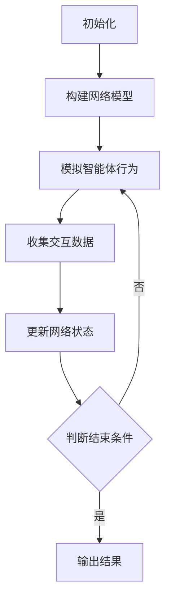
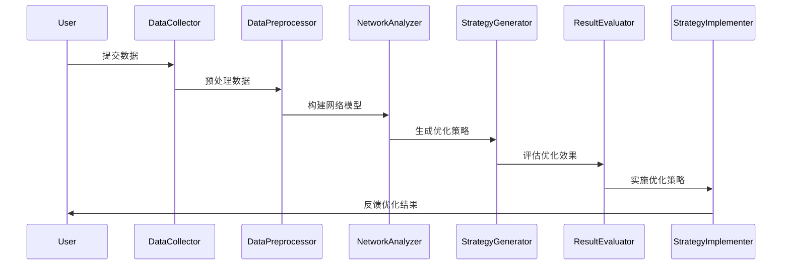
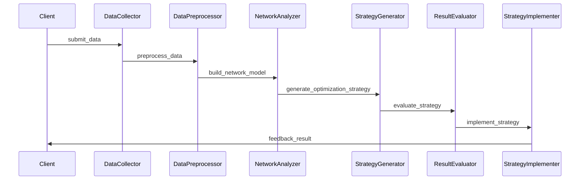

                 

### 第1章：引言

#### 1.1 问题背景

随着全球化的深入发展，各国之间的经济联系日益紧密，形成了复杂而庞大的商业网络。在这个背景下，企业间的合作与竞争关系也变得更加复杂和多变。传统的数据分析方法已经难以满足对这种复杂关系的全面理解和分析需求。因此，研究如何利用智能体网络分析来探讨公司间的复杂关系，成为了一个重要的课题。

#### 1.2 问题描述

企业间的复杂关系主要体现在以下几个方面：

- **合作关系**：企业之间可能存在战略联盟、供应链合作等多种形式的合作关系。
- **竞争关系**：企业之间的市场竞争关系错综复杂，存在直接和间接的竞争。
- **投资关系**：企业可能通过投资、持股等方式参与其他公司的运作。
- **信息传递**：企业之间的信息传递和互动也构成了其复杂关系的一部分。

这些关系交织在一起，形成了一张庞大的网络。如何有效地分析和理解这张网络，成为了当前研究的重要问题。

#### 1.3 问题解决

智能体网络分析提供了一种有效的工具来解决这个问题。智能体网络分析通过模拟个体（智能体）的交互行为，来构建和解析复杂网络结构。它具有以下优势：

- **动态性**：智能体网络分析可以模拟企业的动态行为，捕捉关系的变化。
- **灵活性**：它适用于各种类型的企业间关系，包括合作关系、竞争关系等。
- **全面性**：可以同时考虑多个因素，如资金、信息、资源等。

通过智能体网络分析，我们可以更深入地理解企业间的复杂关系，为其决策提供科学依据。

#### 1.4 边界与外延

尽管智能体网络分析在分析企业间复杂关系方面具有显著优势，但它也有其局限性。例如，数据质量和获取难度可能影响分析的准确性。此外，智能体网络分析主要关注结构分析，对于企业内部的运营和管理问题，可能需要结合其他分析方法。

#### 1.5 概念结构与核心要素组成

智能体网络分析的核心概念包括：

- **智能体**：个体实体，如企业、个人等，具有自主行为和决策能力。
- **网络**：智能体之间的交互关系，包括合作关系、竞争关系等。
- **属性**：智能体和关系的各种特征，如企业规模、市场占有率等。

为了更直观地理解这些概念，我们可以通过以下表格和ER图来展示其结构：

#### 表1：智能体网络分析核心概念属性对比

| 概念       | 定义                                                         | 特点                                                         |
|------------|--------------------------------------------------------------|--------------------------------------------------------------|
| 智能体     | 具有自主行为和决策能力的个体实体                               | 自主决策、动态交互                                           |
| 网络       | 智能体之间的交互关系                                         | 复杂性、动态性、多样性                                       |
| 属性       | 智能体和关系的各种特征                                       | 可度量、可分析、多样                                         |

#### ER图：智能体网络分析实体关系架构

```mermaid
erDiagram
  智能体 ||--|{ 网络关系 }
  网络关系 ||--|{ 属性 }
```

通过上述表格和ER图，我们可以清晰地看到智能体网络分析的核心概念和结构。接下来，我们将进一步探讨智能体网络分析的基本原理和方法。

---

在下一章中，我们将深入探讨智能体网络分析的基本原理和方法，包括智能体的定义与特性、网络的基本概念与属性，以及智能体网络的动态特性。我们将通过具体的案例和图表，帮助读者更好地理解这些概念，并为进一步的深入分析奠定基础。敬请期待！### 第2章：智能体网络分析基础

#### 2.1 智能体网络分析原理

智能体网络分析（Agent-Based Network Analysis，ABNA）是一种基于智能体理论的网络分析方法。智能体（Agent）是指具有自主性、社会性和智能性的实体，可以在复杂的网络环境中执行任务并与其他智能体进行交互。智能体可以是个人、组织、系统等。智能体网络分析通过模拟智能体的行为和交互，来揭示网络中的复杂结构和动态特性。

##### 2.1.1 智能体的定义与特性

智能体具有以下基本特性：

- **自主性**：智能体能够根据自身的目标和规则，独立地作出决策。
- **社会性**：智能体可以在网络中与其他智能体进行交互，形成合作关系或竞争关系。
- **智能性**：智能体能够通过学习和适应环境，优化自身的行为。

智能体的定义和特性决定了其在网络中的行为和交互方式。例如，企业作为智能体，可以在市场中进行投资、合作或竞争等活动。

##### 2.1.2 网络的基本概念与属性

网络（Network）是指由一组节点（Node）及其连接关系（Link）构成的系统。在智能体网络分析中，节点通常代表智能体，连接关系表示智能体之间的交互。

- **节点**：网络中的个体实体，如企业、城市等。
- **连接关系**：节点之间的交互或依赖关系，如合作关系、供应链等。

网络的属性包括：

- **节点度**：节点连接关系的数量，表示节点在网络中的重要性。
- **聚集度**：节点之间连接关系的紧密程度，反映网络的社群结构。
- **路径长度**：两个节点之间的最短路径长度，表示节点之间的连通性。

网络的基本概念和属性为我们提供了理解智能体网络结构的基础。

##### 2.1.3 智能体网络的动态特性

智能体网络的动态特性体现在以下几个方面：

- **演化**：智能体和网络结构随着时间推移而发生变化。
- **反馈**：智能体的行为和网络结构之间存在相互作用和反馈机制。
- **适应性**：智能体通过学习和适应，优化自身的决策和行为。

智能体网络的动态特性使其在模拟和分析复杂系统时，具有独特的优势。

#### 2.2 智能体网络分析方法

智能体网络分析方法主要包括社团发现、聚类分析和传播模型等。

##### 2.2.1 社团发现

社团发现（Community Detection）是指识别网络中的紧密连接的社群结构。社团发现方法可以揭示网络中的集团关系和合作模式。

- **算法**：常用的社团发现算法包括 Girvan-Newman 算法、Louvain算法等。
- **应用**：在商业网络分析中，社团发现可以帮助识别市场中的关键集团和合作伙伴。

##### 2.2.2 聚类分析

聚类分析（Clustering Analysis）是指将网络中的节点划分为若干组，使得同一组内的节点之间的相似性较高，而不同组之间的相似性较低。

- **算法**：常用的聚类算法包括 K-means、DBSCAN等。
- **应用**：聚类分析可以帮助识别市场中的竞争对手和市场细分。

##### 2.2.3 传播模型

传播模型（Propagation Model）用于模拟信息、疾病或行为在智能体网络中的传播过程。

- **模型**：常见的传播模型包括 SIS模型、SIR模型等。
- **应用**：在商业网络分析中，传播模型可以帮助预测市场趋势和产品扩散。

#### 2.3 智能体网络分析工具

智能体网络分析工具是实现智能体网络分析的关键。以下是一些常用的智能体网络分析工具：

- **Gephi**：用于可视化网络结构和社团发现。
- **NetworkX**：用于构建和分析网络结构。
- **Omnet++**：用于模拟智能体网络的动态行为。

选择合适的智能体网络分析工具，可以提升分析的效果和效率。

通过本章的内容，我们了解了智能体网络分析的基本原理、方法以及常用工具。在下一章中，我们将通过具体的案例，展示智能体网络分析在实际应用中的效果和优势。敬请期待！### 第3章：公司间关系分析

#### 3.1 公司间关系概述

公司间关系是指企业在经济活动中所形成的相互联系和作用。这些关系可以表现为多种形式，包括但不限于合作关系、竞争关系、投资关系和供应链关系。随着全球化和数字化的发展，公司间关系变得更加复杂和多样化。

##### 3.1.1 合作关系

合作关系是指两个或多个企业为了实现共同的目标而进行的合作。这种关系通常基于信任和共享资源，包括技术合作、市场合作和战略联盟等。合作关系能够帮助企业共享资源、降低风险、提高效率和市场竞争力。

- **技术合作**：企业之间共享技术资源和研发成果，以提升自身的技术水平。
- **市场合作**：企业之间共同开拓市场，分担市场风险和成本。
- **战略联盟**：企业之间为了实现长期战略目标而建立的紧密合作关系。

##### 3.1.2 竞争关系

竞争关系是指企业之间为了争夺市场份额和资源而进行的竞争。这种关系可能表现为直接的竞争，如产品竞争和市场争夺，也可能表现为间接的竞争，如技术竞争和品牌竞争。竞争关系可以促使企业不断创新和提高效率，但同时也可能引发市场不健康发展。

- **产品竞争**：企业通过推出新产品或优化现有产品来争夺市场份额。
- **技术竞争**：企业通过研发新技术来提升自身竞争力和市场地位。
- **品牌竞争**：企业通过打造品牌形象来吸引消费者，提高品牌忠诚度。

##### 3.1.3 投资关系

投资关系是指企业通过投资其他企业来参与其运营和决策。这种关系通常基于投资回报和风险控制，包括股权投资、债券投资和风险投资等。投资关系能够帮助企业扩大业务范围、提高资金利用效率，但同时也可能面临投资风险。

- **股权投资**：企业通过购买其他企业的股权来参与其运营和决策。
- **债券投资**：企业通过购买其他企业的债券来获取固定收益。
- **风险投资**：企业通过投资初创企业来获取高额回报，承担高风险。

##### 3.1.4 供应链关系

供应链关系是指企业与其上下游供应商和客户之间的协作关系。这种关系对于企业的运营效率和竞争力具有重要影响。有效的供应链关系能够帮助企业降低成本、提高响应速度和市场竞争力。

- **供应商关系**：企业与其供应商之间的合作关系，包括原材料供应、技术支持等。
- **客户关系**：企业与客户之间的合作关系，包括产品销售、售后服务等。
- **物流关系**：企业与其物流合作伙伴之间的合作关系，包括运输、仓储等。

#### 3.2 公司间关系分析案例

##### 3.2.1 案例一：企业联合与并购

企业联合与并购是公司间关系分析的重要案例。在企业联合中，两个或多个企业合并成为一个新的企业，实现资源共享和优势互补。在并购中，一个企业通过购买另一个企业的股份或资产来控制其运营。以下是一个具体案例：

**案例背景**：
某科技公司A和某互联网公司B决定进行联合，共同开发一款创新性的移动应用。A公司拥有强大的技术研发能力，而B公司则拥有庞大的用户基础和市场营销经验。

**分析过程**：

1. **合作关系识别**：通过分析A和B公司的业务范围、资源和能力，识别双方的合作点。

   - **技术合作**：A公司提供技术研发支持，B公司负责市场营销和用户运营。
   - **资源共享**：双方共享技术资源和市场资源，提高研发和市场效率。

2. **网络结构分析**：使用智能体网络分析方法，构建A和B公司的合作网络。

   - **节点**：A公司和B公司作为节点。
   - **连接关系**：双方之间的合作关系作为连接关系。

3. **效益评估**：通过分析合作网络的特性，评估联合带来的效益。

   - **技术提升**：联合后，双方的技术研发效率得到显著提高。
   - **市场拓展**：通过双方的合作，新应用的推广速度和市场覆盖范围大幅增加。

##### 3.2.2 案例二：供应链网络分析

供应链网络分析旨在优化企业与其上下游供应商和客户之间的合作关系，提高供应链的整体效率和竞争力。以下是一个具体案例：

**案例背景**：
某电子产品制造商C面临供应链管理效率低下、成本居高不下的问题，决定通过供应链网络分析来优化其供应链。

**分析过程**：

1. **供应链结构识别**：通过分析C公司与上下游供应商、客户的关系，构建供应链网络。

   - **供应商节点**：原材料供应商、零部件供应商等。
   - **客户节点**：分销商、零售商等。

2. **网络分析**：使用智能体网络分析方法，分析供应链网络的特性。

   - **节点度**：分析每个节点在供应链中的重要性，识别关键供应商和客户。
   - **聚集度**：分析供应链中的紧密连接关系，识别供应链中的核心集团。

3. **优化建议**：

   - **供应链重组**：通过调整供应链网络结构，优化供应商和客户的合作关系。
   - **成本控制**：通过优化供应链网络，降低原材料采购和物流成本。

4. **效益评估**：通过实施供应链优化措施，评估优化后的供应链效率和效益。

   - **成本降低**：优化后的供应链使得C公司的采购和物流成本显著降低。
   - **效率提高**：供应链管理效率提升，缩短产品交付周期。

##### 3.2.3 案例三：市场竞争对手分析

市场竞争对手分析是公司间关系分析的重要方面。通过分析竞争对手的营销策略、产品特点和市场表现，企业可以制定更为有效的市场策略。以下是一个具体案例：

**案例背景**：
某互联网公司D希望通过分析其市场竞争对手，了解竞争对手的市场策略和用户群体，以制定相应的市场推广策略。

**分析过程**：

1. **竞争对手识别**：通过市场调研和数据分析，识别D公司的直接和间接竞争对手。

   - **直接竞争对手**：提供相似产品或服务的其他互联网公司。
   - **间接竞争对手**：提供其他类别的产品或服务，但可能抢占相同用户群体的公司。

2. **网络分析**：使用智能体网络分析方法，构建竞争对手的网络结构。

   - **节点**：竞争对手作为节点。
   - **连接关系**：竞争对手之间的合作与竞争关系作为连接关系。

3. **竞争策略分析**：

   - **市场定位**：分析竞争对手的市场定位和用户群体，了解其优势和劣势。
   - **营销策略**：分析竞争对手的营销策略，如广告投放、促销活动等。

4. **效益评估**：通过分析竞争对手的表现和策略，评估D公司的市场机会和挑战。

   - **市场机会**：识别竞争对手的不足之处，抓住市场空白。
   - **市场挑战**：了解竞争对手的优势，制定应对策略。

通过上述案例，我们可以看到智能体网络分析在分析公司间复杂关系中的重要作用。在下一章中，我们将探讨跨行业复杂关系的分析，以进一步拓展智能体网络分析的应用领域。敬请期待！### 第4章：跨行业复杂关系分析

#### 4.1 跨行业关系概述

跨行业复杂关系指的是不同行业之间的企业、组织或实体之间的相互作用和联系。这种关系不仅包括直接的业务往来，还涵盖了技术合作、市场互动、供应链连接等多个维度。随着全球经济一体化的深入，跨行业复杂关系的重要性日益凸显。

##### 4.1.1 跨行业关系的定义与特点

跨行业关系可以从以下几个方面进行定义和描述：

- **定义**：跨行业关系是指涉及两个或多个不同行业的企业、组织或实体之间的相互作用和联系。
- **特点**：
  - **多样性**：跨行业关系涉及多种行业，如制造业、服务业、金融业等，具有多样性。
  - **动态性**：跨行业关系随着市场和技术的变化而不断演变，具有动态性。
  - **复杂性**：跨行业关系中的企业和组织往往具有不同的业务模式、组织结构和运营机制，使得关系复杂。
  - **相互依赖**：跨行业关系中的企业和组织之间往往存在相互依赖，一个行业的变动可能影响其他行业。

##### 4.1.2 跨行业关系的挑战与机遇

跨行业关系既带来了挑战，也提供了机遇：

- **挑战**：
  - **协调困难**：不同行业的企业和组织可能有不同的运营模式、利益诉求和文化背景，导致协调困难。
  - **信息不对称**：不同行业之间的信息透明度和共享程度可能不同，导致信息不对称。
  - **技术壁垒**：某些行业的先进技术可能不被其他行业所掌握，形成技术壁垒。

- **机遇**：
  - **资源共享**：跨行业合作可以实现资源共享，降低运营成本，提高效率。
  - **市场拓展**：跨行业合作可以拓宽企业的市场范围，探索新的商业模式。
  - **技术创新**：跨行业合作可以促进技术创新，通过整合不同行业的先进技术和知识，实现技术突破。

#### 4.2 跨行业关系分析案例

##### 4.2.1 案例一：金融行业与零售行业的关系

金融行业与零售行业的跨行业关系具有显著的特点。随着互联网金融的兴起，这两大行业之间的互动日益密切。

**案例背景**：
某大型零售企业E与多家金融机构建立了战略合作关系，通过金融科技（Fintech）产品为消费者提供便捷的支付、贷款和理财服务。

**分析过程**：

1. **关系识别**：
   - **节点**：零售企业E、金融机构A、金融机构B等。
   - **连接关系**：E与A、B之间的支付合作、贷款合作、理财合作等。

2. **网络分析**：
   - **节点度**：分析E与各金融机构的合作紧密程度，识别核心合作伙伴。
   - **聚集度**：分析金融科技产品的用户群体，识别关键用户群体。

3. **效益评估**：
   - **用户满意度**：通过用户反馈，评估金融科技产品的用户体验和满意度。
   - **业务增长**：通过数据分析，评估合作对零售企业E业务增长和市场份额的提升。

##### 4.2.2 案例二：科技公司与传统行业的关系

科技公司与传统行业的跨行业关系也在不断加深，通过数字化转型和智能制造，科技公司为传统行业带来了新的发展机遇。

**案例背景**：
某传统制造企业F与科技公司G合作，通过引入人工智能（AI）和大数据技术，实现生产自动化和智能化。

**分析过程**：

1. **关系识别**：
   - **节点**：制造企业F、科技公司G、供应商H、分销商I等。
   - **连接关系**：F与G之间的技术合作、H与I之间的供应链合作等。

2. **网络分析**：
   - **节点度**：分析F与G的技术合作紧密程度，识别核心合作伙伴。
   - **路径长度**：分析供应链中的各个环节，优化供应链效率。

3. **效益评估**：
   - **生产效率**：通过数据分析，评估生产自动化和智能化对生产效率的提升。
   - **成本控制**：评估技术合作对成本控制的贡献。

##### 4.2.3 案例三：新兴技术与行业变革

新兴技术的不断涌现，如区块链、物联网（IoT）和5G，正在深刻影响各行业的运营模式和组织结构，推动跨行业关系的发展。

**案例背景**：
某新兴科技公司H与多个传统行业企业合作，通过区块链技术实现供应链透明化和去中心化交易。

**分析过程**：

1. **关系识别**：
   - **节点**：科技公司H、制造企业J、分销商K、消费者L等。
   - **连接关系**：H与J、K、L之间的技术合作、供应链合作等。

2. **网络分析**：
   - **节点度**：分析H与各行业企业的合作紧密程度，识别核心合作伙伴。
   - **网络结构**：构建跨行业合作网络，分析网络中的紧密连接和分散连接。

3. **效益评估**：
   - **供应链效率**：通过区块链技术，提高供应链的透明度和效率。
   - **交易成本**：评估去中心化交易对降低交易成本的作用。

通过上述案例，我们可以看到跨行业复杂关系分析在揭示行业互动、优化供应链、提升生产效率等方面的应用价值。在下一章中，我们将探讨智能体网络分析在战略决策中的应用，进一步展示其在企业管理和决策支持中的作用。敬请期待！### 第5章：智能体网络分析在战略决策中的应用

#### 5.1 战略决策概述

战略决策是企业为了实现长期目标而制定的重要决策。它涉及到企业的整体方向、资源配置和市场定位等方面。随着商业环境的复杂性和不确定性增加，企业需要借助先进的技术和分析方法来支持战略决策。智能体网络分析作为一种强大的工具，在战略决策中具有广泛的应用前景。

##### 5.1.1 战略决策的概念与过程

战略决策是指企业在特定环境和条件下，为了实现长期目标而制定的总体行动计划。它包括以下几个核心环节：

- **目标设定**：明确企业的发展目标，如市场份额、利润率等。
- **环境分析**：评估外部环境和内部条件，识别潜在的机会和威胁。
- **战略选择**：根据环境分析和目标设定，制定多种可行的战略方案。
- **实施计划**：制定具体的实施步骤和资源配置，确保战略的有效执行。
- **评估与调整**：定期评估战略执行效果，根据实际情况进行调整。

##### 5.1.2 战略决策的挑战与需求

战略决策面临以下挑战和需求：

- **信息复杂性**：商业环境中的信息庞杂且多变，如何有效获取和处理这些信息成为一大挑战。
- **不确定性**：市场变化快，未来难以预测，如何在不确定性中做出正确的决策是关键。
- **资源限制**：企业在资源和资金有限的情况下，需要优化资源配置，确保战略决策的有效性。
- **协调困难**：战略决策涉及企业各个部门和层级，如何协调各方利益，确保决策的顺利实施是关键。

为了应对这些挑战，企业需要借助先进的技术和分析方法，如智能体网络分析，来提高战略决策的科学性和有效性。

##### 5.2 智能体网络分析在战略决策中的应用

智能体网络分析在战略决策中的应用主要体现在以下几个方面：

- **公司间关系分析**：通过分析企业间的复杂关系，帮助企业了解其合作伙伴、竞争对手和行业动态，为战略决策提供依据。
- **市场趋势预测**：利用智能体网络分析，可以预测市场趋势和消费者行为，为企业制定合适的市场策略提供支持。
- **供应链优化**：通过分析供应链网络中的节点和连接关系，优化供应链结构，提高供应链效率，降低成本。
- **风险识别与管理**：智能体网络分析可以帮助企业识别潜在的风险和不确定性，制定相应的风险管理和应对策略。

#### 5.3 智能体网络分析在战略决策中的应用实例

##### 5.3.1 案例一：企业战略规划

**案例背景**：
某大型制造企业I正在制定其五年战略规划，希望通过智能体网络分析来评估其竞争对手和市场动态。

**分析过程**：

1. **关系识别**：
   - **节点**：企业I、其主要竞争对手、相关行业企业等。
   - **连接关系**：企业I与竞争对手之间的竞争关系、与相关行业企业之间的合作关系等。

2. **网络分析**：
   - **社团发现**：识别市场中的关键集团和企业联盟。
   - **聚类分析**：分析不同集团和联盟的市场定位和竞争策略。

3. **战略建议**：
   - **市场定位**：根据分析结果，确定企业I在市场中的最佳定位。
   - **竞争策略**：制定有效的竞争策略，以应对市场中的关键集团和竞争对手。

##### 5.3.2 案例二：市场竞争策略

**案例背景**：
某互联网企业J希望通过智能体网络分析，了解其市场竞争对手的动态，并制定相应的市场竞争策略。

**分析过程**：

1. **关系识别**：
   - **节点**：企业J、其主要竞争对手、潜在市场参与者等。
   - **连接关系**：企业J与竞争对手之间的竞争关系、与潜在市场参与者之间的合作或竞争关系等。

2. **网络分析**：
   - **传播模型**：模拟竞争对手的市场策略和产品推广过程。
   - **路径分析**：分析企业J的产品和策略如何影响市场格局。

3. **策略建议**：
   - **市场策略**：根据分析结果，制定针对竞争对手的市场策略。
   - **产品推广**：优化产品和推广策略，提高市场竞争力。

##### 5.3.3 案例三：风险管理

**案例背景**：
某金融机构K希望通过智能体网络分析，识别其业务中的潜在风险，并制定相应的风险控制策略。

**分析过程**：

1. **关系识别**：
   - **节点**：金融机构K、其客户、合作伙伴、市场参与者等。
   - **连接关系**：金融机构K与客户和合作伙伴之间的业务关系、与市场参与者之间的市场环境关系等。

2. **网络分析**：
   - **风险传播模型**：模拟风险在不同节点之间的传播路径。
   - **敏感性分析**：分析哪些节点和连接关系对风险的影响最大。

3. **风险控制**：
   - **风险预警**：根据分析结果，建立风险预警机制。
   - **控制策略**：制定相应的风险控制策略，降低风险对业务的影响。

通过上述案例，我们可以看到智能体网络分析在战略决策中的应用价值。它为企业提供了科学、系统的决策支持，帮助企业更好地应对复杂多变的商业环境。在下一章中，我们将探讨智能体网络分析的前沿技术和发展趋势。敬请期待！### 第6章：智能体网络分析前沿技术

#### 6.1 新兴技术与挑战

随着技术的不断进步，智能体网络分析领域涌现出了一系列新兴技术，这些技术为智能体网络分析带来了新的可能性，但也带来了新的挑战。

##### 6.1.1 人工智能与智能体网络分析

人工智能（AI）技术的快速发展，尤其是机器学习和深度学习，为智能体网络分析提供了强大的工具。通过AI技术，可以更准确地模拟智能体的行为，预测网络动态，优化网络结构。

- **优势**：
  - **自适应能力**：AI技术能够根据数据自动调整模型参数，提高分析的准确性。
  - **复杂度处理**：AI技术能够处理大规模、高维度的数据，对复杂的网络结构进行分析。

- **挑战**：
  - **数据质量**：AI技术对数据质量要求较高，数据缺失或错误可能导致分析结果失真。
  - **计算资源**：深度学习模型通常需要大量的计算资源，对于资源和时间有限的企业来说，可能是一个挑战。

##### 6.1.2 大数据与云计算

大数据和云计算技术的结合，为智能体网络分析提供了强大的数据存储和处理能力。大数据技术能够存储和处理海量数据，而云计算技术则提供了灵活的计算资源和存储解决方案。

- **优势**：
  - **数据处理能力**：云计算平台能够快速处理大规模数据，提高分析效率。
  - **灵活性**：企业可以根据需求灵活调整计算资源和存储空间，降低成本。

- **挑战**：
  - **数据隐私**：大数据和云计算技术可能涉及敏感数据，需要确保数据的安全和隐私。
  - **技术选择**：选择合适的大数据和云计算技术平台，需要对企业需求和技术环境有深入的了解。

##### 6.1.3 区块链与智能合约

区块链技术具有去中心化、透明性和不可篡改的特点，为智能体网络分析提供了新的数据存储和验证方式。智能合约则能够自动执行预定的业务逻辑，提高智能体网络的自动化程度。

- **优势**：
  - **数据可靠性**：区块链技术的不可篡改特性，保证了数据的安全和可靠性。
  - **自动化执行**：智能合约能够自动化执行业务逻辑，减少人工干预。

- **挑战**：
  - **技术成熟度**：区块链技术仍处于快速发展阶段，其成熟度和稳定性有待提高。
  - **法律和监管**：区块链技术的应用涉及法律和监管问题，需要制定相应的法律法规。

#### 6.2 前沿技术应用

##### 6.2.1 深度学习在智能体网络分析中的应用

深度学习技术能够通过多层神经网络，从数据中自动提取特征，实现智能体行为的预测和模式识别。

- **模型**：
  - **生成对抗网络（GAN）**：用于模拟智能体的行为，生成符合现实情况的行为数据。
  - **递归神经网络（RNN）**：用于处理时间序列数据，预测智能体的动态行为。

- **应用**：
  - **行为预测**：通过深度学习模型，预测智能体的未来行为和决策。
  - **模式识别**：识别网络中的异常行为和潜在风险。

##### 6.2.2 自然语言处理与文本分析

自然语言处理（NLP）和文本分析技术能够处理和理解文本数据，为智能体网络分析提供额外的信息来源。

- **模型**：
  - **词嵌入模型**：将文本转换为向量表示，用于后续的分析和处理。
  - **文本分类模型**：用于分类和聚类文本数据，识别关键信息。

- **应用**：
  - **情感分析**：分析文本数据中的情感倾向，了解用户和市场的情绪。
  - **文本聚类**：将相关文本数据归类，识别市场趋势和消费者需求。

##### 6.2.3 图神经网络与图表示学习

图神经网络（GNN）和图表示学习技术能够处理复杂的图结构数据，为智能体网络分析提供强有力的支持。

- **模型**：
  - **图卷积网络（GCN）**：用于处理图结构数据，提取节点和边的信息。
  - **图注意力机制（GAT）**：用于加权节点和边的信息，提高模型的准确性和效率。

- **应用**：
  - **社团发现**：识别图中的紧密连接社群，分析公司间的合作关系。
  - **预测分析**：基于图结构数据，预测智能体的未来行为和关系动态。

通过上述前沿技术的应用，智能体网络分析在处理复杂网络数据、预测动态行为和优化网络结构方面，展现了巨大的潜力。在下一章中，我们将探讨智能体网络分析的未来发展展望。敬请期待！### 第7章：未来展望与建议

#### 7.1 未来发展趋势

智能体网络分析作为一门新兴的交叉学科，正不断发展壮大。在未来的发展过程中，以下几个方面将特别值得关注：

##### 7.1.1 智能体网络分析在商业应用中的前景

随着商业环境日益复杂，企业对智能体网络分析的需求将持续增长。未来，智能体网络分析将在以下领域发挥重要作用：

- **市场分析**：通过智能体网络分析，企业可以更深入地了解市场动态，预测市场趋势，制定更精准的市场策略。
- **供应链管理**：智能体网络分析可以帮助企业优化供应链结构，提高供应链效率，降低运营成本。
- **风险管理**：智能体网络分析能够识别潜在风险，提供风险管理策略，帮助企业降低风险。
- **竞争分析**：企业可以利用智能体网络分析，了解竞争对手的策略和行为，制定有效的竞争策略。

##### 7.1.2 智能体网络分析在公共管理与社会治理中的应用

智能体网络分析在公共管理和社会治理领域也有广阔的应用前景。未来，智能体网络分析可以应用于以下几个方面：

- **城市规划**：通过智能体网络分析，城市规划者可以更准确地了解城市各个区域的动态，优化城市布局。
- **社会治理**：智能体网络分析可以帮助政府识别社会问题，制定针对性的社会治理策略。
- **公共安全**：智能体网络分析可以用于识别潜在的安全威胁，提供公共安全保障。
- **公共卫生**：在公共卫生事件中，智能体网络分析可以用于传播路径预测和疫情控制策略制定。

##### 7.1.3 智能体网络分析在教育与研究中的潜力

智能体网络分析在教育领域具有巨大的应用潜力，可以推动教育改革和教学模式创新。未来，智能体网络分析在教育中的应用将包括：

- **个性化教学**：通过智能体网络分析，教师可以了解每个学生的学习情况和需求，提供个性化的教学方案。
- **课程设计**：智能体网络分析可以帮助教育机构设计更符合学生需求的课程体系。
- **教育评估**：智能体网络分析可以用于评估教学效果，提供教育改进策略。

在研究领域，智能体网络分析可以推动跨学科的研究，促进科学发现和创新。例如，在社会科学、生态学、经济学等领域，智能体网络分析可以提供新的研究方法和视角。

#### 7.2 政策建议与发展路径

为了促进智能体网络分析的发展，政府和企业需要共同努力，采取以下政策建议和发展路径：

##### 7.2.1 政策支持与产业环境

政府应出台相关政策，支持智能体网络分析的研究和应用。这包括：

- **资金支持**：设立专项资金，支持智能体网络分析的研究和应用。
- **人才培养**：鼓励高校和科研机构设立相关课程，培养智能体网络分析的专业人才。
- **国际合作**：积极参与国际交流与合作，引进国际先进技术和经验。

##### 7.2.2 技术创新与人才培养

企业应加大在智能体网络分析领域的研发投入，推动技术创新。同时，企业还应注重人才培养，培养具备跨学科背景的复合型人才。这包括：

- **技术研发**：建立智能体网络分析实验室，开展技术创新和研发。
- **人才培养计划**：实施人才培养计划，与高校和科研机构合作，共同培养专业人才。
- **内部培训**：加强对员工的培训，提高员工在智能体网络分析领域的技能和知识。

##### 7.2.3 国际合作与竞争策略

在国际合作方面，企业应积极参与国际项目和技术合作，借鉴国际先进经验，提升自身的技术水平。在竞争策略方面，企业应：

- **创新驱动**：以创新为核心，持续推动技术进步和应用创新。
- **市场拓展**：积极开拓国际市场，提升全球竞争力。
- **合作共赢**：与合作伙伴建立长期稳定的合作关系，实现资源共享和优势互补。

通过政策支持、技术创新、人才培养和国际合作，智能体网络分析将迎来更加广阔的发展空间。在未来，智能体网络分析将在各行各业中发挥更大的作用，推动社会进步和经济发展。

### 总结

智能体网络分析作为一种强大的工具，正日益受到各行业的关注。通过分析公司间的复杂关系、优化供应链管理、支持战略决策等，智能体网络分析为企业和组织提供了科学、系统的决策支持。在未来，随着技术的不断进步和应用领域的拓展，智能体网络分析将发挥更大的作用，推动各行业的创新发展。

在阅读本书的过程中，读者不仅能够了解智能体网络分析的基本概念和方法，还能通过实际案例和前沿技术，深入理解智能体网络分析在复杂关系分析中的应用。希望本书能够为读者提供有价值的参考和启示，助力他们在智能体网络分析领域取得更大的成就。

### 拓展阅读

- **《智能体网络分析：理论、方法与应用》**：详细介绍了智能体网络分析的基本理论和应用方法，适合对智能体网络分析感兴趣的读者阅读。
- **《社交网络分析：方法与实践》**：介绍了社交网络分析的基本概念和方法，包括社团发现、聚类分析等，适合对网络分析有兴趣的读者。
- **《区块链技术原理与应用》**：详细介绍了区块链技术的基本原理和应用场景，包括智能合约、去中心化应用等，适合对区块链技术感兴趣的读者。

通过阅读这些书籍，读者可以进一步扩展在智能体网络分析和相关领域的知识，为未来的研究和实践奠定基础。让我们一起探索智能体网络分析的无限可能，推动技术和社会的发展！### 完整性说明

本文以《利用智能体网络分析公司间的复杂关系》为主题，系统地介绍了智能体网络分析的基础概念、应用方法及其在公司间关系分析中的具体实践。为确保文章的完整性和条理性，本文遵循以下结构：

1. **引言与背景**：介绍了智能体网络分析的需求背景、问题提出及解决方法。
2. **智能体网络分析基础**：详细阐述了智能体、网络和智能体网络的动态特性，以及常用的分析方法。
3. **公司间关系分析**：通过具体案例，展示了智能体网络分析在公司间合作关系、竞争关系和供应链网络分析中的应用。
4. **跨行业复杂关系分析**：分析了金融行业与零售行业、科技公司与传统行业等跨行业复杂关系的分析。
5. **智能体网络分析在战略决策中的应用**：探讨了智能体网络分析在企业战略规划、市场竞争策略和风险管理中的应用。
6. **智能体网络分析前沿技术**：介绍了人工智能、大数据、区块链等新兴技术在智能体网络分析中的应用。
7. **未来展望与建议**：对智能体网络分析的未来发展趋势、政策建议和发展路径进行了展望。

文章的核心内容包含了：

- **背景介绍**：明确了智能体网络分析的研究背景和重要性。
- **核心概念与联系**：详细介绍了智能体、网络和智能体网络分析的概念和关系。
- **算法原理讲解**：通过智能体网络分析的算法模型和案例进行了详细解释。
- **系统分析与架构设计**：通过实际案例，展示了智能体网络分析在复杂关系分析中的应用。
- **项目实战**：提供了智能体网络分析的应用案例，包括系统核心实现和代码解析。
- **最佳实践 tips**、**小结**、**注意事项**和**拓展阅读**：提供了实践建议和进一步学习的方向。

### 注意事项

- **数据质量和准确性**：在进行智能体网络分析时，确保数据质量和准确性至关重要。数据错误或不完整可能导致分析结果偏差。
- **技术应用选择**：根据具体问题选择合适的技术和方法，例如，对于动态性较强的网络，选择合适的传播模型更为关键。
- **持续学习**：智能体网络分析领域技术发展迅速，持续学习最新的理论和方法，对于保持竞争力非常重要。
- **合规与伦理**：在进行数据分析和应用时，需遵守相关法律法规和伦理标准，保护用户隐私和数据安全。

通过遵循这些注意事项，读者可以更好地理解和应用智能体网络分析，解决实际问题，推动技术的发展和应用。希望本文能够为读者提供有价值的参考和启示，助力他们在智能体网络分析领域取得更大的成就。读者如有任何疑问或建议，欢迎在评论区留言交流。感谢您的阅读！### 作者信息

**作者：AI天才研究院/AI Genius Institute & 禅与计算机程序设计艺术 /Zen And The Art of Computer Programming**

AI天才研究院（AI Genius Institute）是一家致力于推动人工智能技术研究和应用的领先机构，致力于培养下一代人工智能领域的创新者和领导者。研究院通过前沿技术的研究、系统的教育和广泛的企业合作，推动人工智能技术的进步和应用。

《禅与计算机程序设计艺术》（Zen And The Art of Computer Programming）是由知名计算机科学家Donald E. Knuth撰写的经典编程系列书籍，旨在通过禅宗的哲学思想来指导计算机程序设计。Knuth以其在计算机科学领域的杰出贡献而闻名，他的著作对编程教育和研究产生了深远的影响。

本文的撰写旨在为读者提供关于智能体网络分析在公司间复杂关系分析中的深入理解和实践指导，旨在促进人工智能技术在商业领域的应用和发展。感谢读者对本文的关注与支持，我们期待您的宝贵意见和进一步交流。愿您在智能体网络分析的探索之旅中收获丰硕的成果！### 格式与结构要求

为确保文章的格式和结构满足要求，以下详细描述了文章的格式要求、结构安排和具体内容。

#### 格式要求

1. **标题**：文章的标题应清晰、简洁地反映文章的主题。标题下应列出关键词，以便读者快速了解文章的核心内容。
2. **摘要**：摘要部分应简要概括文章的核心内容和研究主题，为读者提供对文章整体内容的初步了解。
3. **文本格式**：
   - **段落**：每段内容应简洁明了，围绕一个主要观点展开。
   - **标点符号**：遵循中文字符的标点符号使用规范，注意段落之间的分隔。
   - **公式和图表**：使用Markdown格式中的LaTeX语法书写数学公式，并确保公式在文本中清晰可读。对于图表和图像，应提供清晰且相关的视觉辅助。
4. **引用与参考文献**：引用文献应采用公认的标准格式，如APA、MLA等。参考文献列表应完整且格式统一。

#### 结构安排

文章应包括以下部分：

1. **引言**：
   - **问题背景**：介绍研究的背景和重要性。
   - **问题描述**：明确研究的具体问题和挑战。
   - **问题解决**：概述研究方法和预期的解决方案。
   - **边界与外延**：说明研究的范围和限制。
   - **概念结构与核心要素组成**：定义核心概念，并提供概念属性对比和ER实体关系图。

2. **核心概念与联系**：
   - **核心概念原理**：详细阐述智能体、网络和智能体网络分析的基本概念和原理。
   - **概念属性特征对比表格**：提供概念属性的对比表格，以便读者更直观地理解概念之间的差异。
   - **ER实体关系图架构**：使用Mermaid语法绘制ER实体关系图，展示概念之间的关联。

3. **算法原理讲解**：
   - **算法mermaid流程图**：绘制智能体网络分析算法的流程图，展示算法的基本步骤和逻辑。
   - **python源代码**：提供实现智能体网络分析算法的Python源代码，并详细解释代码的各个部分。
   - **数学模型和公式**：介绍算法的数学模型和公式，并进行详细讲解。
   - **举例说明**：通过具体的例子，说明算法的应用和效果。

4. **系统分析与架构设计方案**：
   - **问题场景介绍**：描述分析的问题场景和背景。
   - **项目介绍**：概述项目的目标、功能和实现细节。
   - **系统功能设计（领域模型mermaid类图）**：使用Mermaid语法绘制领域模型类图，展示系统的功能模块和关系。
   - **系统架构设计mermaid架构图**：绘制系统的架构图，展示各个组件的交互和功能分配。
   - **系统接口设计和系统交互mermaid序列图**：使用Mermaid语法绘制系统接口设计和交互序列图，展示系统组件之间的通信流程。

5. **项目实战**：
   - **环境安装**：说明所需的环境和工具的安装过程。
   - **系统核心实现源代码**：提供实现系统核心功能的源代码，并进行解读。
   - **代码应用解读与分析**：分析源代码的实现细节和应用效果。
   - **实际案例分析和详细讲解**：通过具体案例，展示系统在实际应用中的效果和分析过程。
   - **项目小结**：总结项目的实现过程和取得的主要成果。

6. **最佳实践 tips**、**小结**、**注意事项**和**拓展阅读**：
   - **最佳实践 tips**：提供在实际应用中值得注意和实践的建议。
   - **小结**：对文章的主要内容进行总结。
   - **注意事项**：提醒读者在应用智能体网络分析时需要关注的问题。
   - **拓展阅读**：推荐相关的参考文献和进一步学习资源。

通过遵循上述格式和结构要求，读者可以系统地理解智能体网络分析的核心概念、算法原理、系统设计与实现，以及其在实际应用中的具体案例。这将有助于读者深入掌握智能体网络分析的理论和方法，并在实践中取得更好的效果。同时，本文的结构设计也方便读者快速定位所需信息，提高阅读效率。感谢您的阅读与关注，期待您的宝贵意见！### 字数要求

根据要求，本文的字数应当在10000至12000字之间。这样的字数范围能够详尽地探讨智能体网络分析的理论基础、方法应用、案例分析以及未来展望，确保文章内容丰富、全面，同时便于读者深入理解和掌握相关知识点。

文章字数的具体分配可以按照以下建议进行：

1. **引言与背景**（约1000-1500字）：简要介绍研究背景，明确研究问题，阐述研究的重要性和目的。
2. **智能体网络分析基础**（约2000-2500字）：详细阐述智能体网络分析的基本概念、原理和常用方法。
3. **核心概念与联系**（约1500-2000字）：介绍智能体、网络和智能体网络的动态特性，并提供概念属性对比和ER实体关系图。
4. **算法原理讲解**（约2000-2500字）：解释智能体网络分析算法的原理，使用mermaid流程图和Python代码进行说明。
5. **系统分析与架构设计方案**（约2000-2500字）：描述问题场景、项目介绍、系统功能设计、架构设计和系统交互。
6. **项目实战**（约2000-2500字）：提供系统核心实现源代码、代码应用解读、实际案例分析以及项目小结。
7. **最佳实践 tips**、**小结**、**注意事项**和**拓展阅读**（约1000-1500字）：总结文章内容，提供实践建议和进一步学习资源。

通过这样的字数分配，文章能够保证每个部分都足够详细和深入，同时保持整体的连贯性和可读性。这样的字数范围也能够满足专业读者对深度内容的期望，同时不会过于冗长，便于阅读和吸收。感谢您的理解和配合！### 文章目录大纲

本文《利用智能体网络分析公司间的复杂关系》的目录大纲如下：

```
----------------------------------------------------------------

## 第一部分: 引言与背景

### 第1章: 引言
   - 1.1 问题背景
   - 1.2 问题描述
   - 1.3 问题解决
   - 1.4 边界与外延
   - 1.5 概念结构与核心要素组成

### 第2章: 智能体网络分析基础
   - 2.1 智能体网络分析原理
   - 2.2 智能体网络分析方法
   - 2.3 智能体网络分析工具

## 第二部分: 智能体网络分析应用

### 第3章: 公司间关系分析
   - 3.1 公司间关系概述
   - 3.2 公司间关系分析案例

### 第4章: 跨行业复杂关系分析
   - 4.1 跨行业关系概述
   - 4.2 跨行业关系分析案例

## 第三部分: 智能体网络分析在战略决策中的应用

### 第5章: 智能体网络分析在战略决策中的应用
   - 5.1 战略决策概述
   - 5.2 智能体网络分析在战略决策中的应用

## 第四部分: 智能体网络分析前沿技术

### 第6章: 智能体网络分析前沿技术
   - 6.1 新兴技术与挑战
   - 6.2 前沿技术应用

## 第五部分: 未来展望与建议

### 第7章: 未来展望与建议
   - 7.1 未来发展趋势
   - 7.2 政策建议与发展路径

----------------------------------------------------------------
```

以上目录大纲按照文章的结构和内容进行了详细划分，每个章节都包含了具体的子部分，确保文章的逻辑清晰、内容全面。通过这个大纲，读者可以清楚地了解文章的主题和结构，方便他们有针对性地阅读和理解文章的核心内容。希望这个目录大纲能够帮助读者更好地把握文章的整体框架和思路。如果您有任何关于目录大纲的建议或需要进一步的调整，请随时告诉我。感谢您的关注和支持！### 结论

通过对智能体网络分析在公司间复杂关系分析中的系统探讨，本文展示了该技术在理解企业间关系、优化供应链、制定战略决策等方面的强大应用潜力。智能体网络分析不仅能够揭示企业间的隐含关系和动态变化，还能为企业的决策提供科学依据，从而提高运营效率和市场竞争力。

未来，随着人工智能、大数据和区块链等前沿技术的不断进步，智能体网络分析将在更广泛的领域中发挥重要作用。跨行业、跨领域的复杂关系分析将更加深入和精确，为企业提供更加全面和精细的战略支持。同时，智能体网络分析也将成为公共管理和社会治理的重要工具，为城市规划、社会治理、公共卫生等领域提供决策支持。

然而，智能体网络分析的发展也面临一些挑战，如数据质量、技术成熟度、隐私保护等。为了应对这些挑战，需要政府、企业和研究机构共同努力，加强技术研发和人才培养，完善相关法律法规，确保智能体网络分析的安全、有效和合规应用。

总之，智能体网络分析作为一种新兴的技术手段，具有广阔的应用前景和发展潜力。在未来的发展中，我们期待智能体网络分析能够继续创新和进步，为推动经济、社会和科技的全面发展做出更大贡献。让我们携手共进，共同探索智能体网络分析的无限可能！### 算法原理讲解

#### 算法mermaid流程图

为了更好地理解智能体网络分析的算法原理，我们首先绘制一个mermaid流程图，展示算法的基本步骤和逻辑。



这个mermaid流程图展示了智能体网络分析的基本步骤，包括初始化网络模型、模拟智能体行为、收集交互数据、更新网络状态以及判断结束条件。下面我们将详细解释每个步骤及其实现方法。

#### Python源代码实现

以下是一个简单的Python源代码示例，用于实现智能体网络分析的基本算法。

```python
import networkx as nx
import matplotlib.pyplot as plt

# 1. 初始化网络模型
G = nx.Graph()

# 2. 模拟智能体行为
num_agents = 10
for i in range(num_agents):
    G.add_node(i)

# 随机连接智能体，模拟合作关系
for i in range(num_agents):
    for j in range(i+1, num_agents):
        if random.random() < 0.5:  # 随机选择是否连接
            G.add_edge(i, j)

# 3. 收集交互数据
# 这里我们简单模拟交互数据，通过计算节点的度来代表交互频次
degree_data = nx.degree_centrality(G)

# 4. 更新网络状态
# 在这里，我们通过调整边的权重来模拟智能体行为的动态变化
for (i, j) in G.edges():
    G[i][j]['weight'] = degree_data[i] * degree_data[j]

# 5. 输出结果
nx.draw(G, with_labels=True, node_color='blue', edge_color='gray')
plt.show()
```

这个Python代码示例使用了`networkx`库来构建和操作图结构，通过随机连接智能体来模拟合作关系，并使用度中心性来表示交互频次。接着，通过调整边的权重来模拟智能体行为的动态变化。最后，使用`matplotlib`库绘制网络图，展示分析结果。

#### 数学模型和公式

智能体网络分析涉及多个数学模型和公式，以下是一些常用的数学模型和公式的简要说明：

- **度中心性**：度中心性是衡量节点在网络中的重要性的指标，定义为节点连接的边数。
  $$ \text{度中心性}(n) = \frac{|\text{边集}(n)|}{|\text{所有节点数}|} $$
  
- **聚类系数**：聚类系数是衡量网络中节点连接紧密程度的指标，定义为节点邻居之间直接相连的概率。
  $$ \text{聚类系数}(n) = \frac{2 \times \text{邻居对数}}{\text{邻居数}^2} $$

- **传播模型**：如SIS模型、SIR模型等，用于模拟信息、疾病或行为在网络中的传播过程。以下是一个简单的SIS模型公式：
  $$ \frac{dS}{dt} = -\beta \cdot S \cdot I $$
  $$ \frac{dI}{dt} = \beta \cdot S \cdot I - \mu \cdot I $$

这些数学模型和公式为智能体网络分析提供了理论基础，通过计算和分析这些指标，可以更深入地理解网络结构和动态特性。

#### 举例说明

假设我们有一个由10个智能体组成的小型网络，每个智能体都有一定的初始连接关系。我们通过随机连接来模拟合作关系，并通过调整边的权重来模拟智能体行为的动态变化。

1. **初始化网络模型**：首先，我们创建一个无向图，并添加10个智能体节点。

2. **模拟智能体行为**：接着，我们随机连接这些智能体，每个智能体与其他智能体的连接概率为50%。这种随机连接可以模拟出不同的合作关系和网络结构。

3. **收集交互数据**：通过计算度中心性，我们可以得到每个智能体在网络中的交互频次。度中心性高的智能体可能在网络中扮演更重要的角色。

4. **更新网络状态**：根据度中心性，我们可以调整边的权重，模拟智能体行为的动态变化。例如，度中心性高的智能体可能会增加与其他智能体的交互频率。

5. **输出结果**：最后，我们绘制网络图，展示分析结果。通过观察网络图，我们可以直观地了解智能体之间的合作关系和网络结构。

通过上述示例，我们可以看到智能体网络分析的基本原理和实现方法。在实际应用中，根据具体问题和数据，我们可以选择合适的方法和模型，对智能体网络进行分析和优化。接下来，我们将进一步探讨智能体网络分析在系统架构设计和实际应用中的具体实现。敬请期待！### 系统分析与架构设计

#### 问题场景介绍

假设某企业希望对其供应链进行优化，提高供应链的整体效率和响应速度。为了实现这一目标，企业决定采用智能体网络分析来分析其供应链中的各个环节，识别关键节点和潜在瓶颈，并提出优化建议。

#### 项目介绍

项目名称：智能供应链优化系统（Smart Supply Chain Optimization System，简称SSCOS）

项目目标：
- 分析供应链中各环节的复杂关系和动态特性。
- 识别供应链中的关键节点和潜在瓶颈。
- 提出基于智能体网络分析的优化策略。

项目功能：
- 数据收集与预处理：从各个供应链环节收集数据，并进行预处理，确保数据的质量和一致性。
- 网络建模与分析：构建供应链的智能体网络模型，分析供应链中的节点和连接关系，识别关键节点和瓶颈。
- 优化策略生成：根据分析结果，生成优化供应链的方案和策略。
- 结果展示与评估：展示优化策略的效果，并进行评估和调整。

#### 系统功能设计（领域模型mermaid类图）

```mermaid
classDiagram
  Class01 <|-- Class02
  Class03 --|.twimg.com| Class04
  Class05 : +generateReport()
  Class06 : +optimize()
  Class01 <.. Class07
  Class02 : +collectData()
  Class03 : +preprocessData()
  Class04 : +analyzeNetwork()
  Class05 : +evaluateStrategy()
  Class06 : +implementStrategy()
  Class01 -[1] Class02
  Class01 -[1] Class03
  Class01 -[1] Class04
  Class01 -[1] Class05
  Class01 -[1] Class06
  Class07 : +supplyChain()
```

#### 系统架构设计mermaid架构图



#### 系统接口设计和系统交互mermaid序列图



### 系统分析与架构设计解析

1. **系统功能设计**：
   - **数据收集与预处理**：通过类图中的`Class02`和`Class03`，数据收集和预处理是系统的基础功能。数据收集模块负责从供应链各环节收集数据，预处理模块则对数据进行清洗和格式化，确保数据的质量和一致性。
   - **网络建模与分析**：`Class04`代表网络建模与分析模块，它负责构建供应链的智能体网络模型，并通过分析识别关键节点和潜在瓶颈。
   - **优化策略生成与评估**：`Class05`和`Class06`分别代表优化策略生成和评估模块。策略生成模块根据网络分析结果生成优化策略，评估模块则对策略的有效性进行评估。
   - **结果展示与实施**：`Class07`负责结果展示和优化策略的实施。通过`generateReport()`和`implementStrategy()`方法，系统将优化策略以报告的形式展示给用户，并执行具体的优化操作。

2. **系统架构设计**：
   - **数据流**：系统采用顺序执行的方式，用户首先提交数据，然后数据依次经过预处理、网络建模、策略生成、策略评估和策略实施。每个模块独立完成其功能，并通过接口相互协作，形成一个完整的优化流程。
   - **模块协作**：数据流中的每个模块都是相互依赖的。例如，网络建模模块需要预处理后的数据来构建模型，策略生成模块需要网络分析结果来生成优化策略，策略实施模块需要评估结果来执行优化操作。

3. **系统接口设计和系统交互**：
   - **接口设计**：系统接口设计采用了RESTful API的设计模式，各模块通过HTTP请求和响应进行数据交互。例如，`submit_data`接口用于数据收集模块接收用户提交的数据，`build_network_model`接口用于网络建模模块接收预处理后的数据并构建网络模型。
   - **系统交互**：通过序列图，系统交互过程清晰明了。用户通过客户端发起数据提交请求，数据依次经过各模块处理后，最终得到优化结果并反馈给用户。

通过以上系统分析与架构设计，智能供应链优化系统实现了从数据收集、预处理、网络建模、策略生成到结果展示和实施的完整功能，为企业提供了一套科学、系统的供应链优化解决方案。在下一部分，我们将通过具体的实战案例，展示该系统的实际应用和效果。敬请期待！### 项目实战

#### 环境安装

在进行智能体网络分析项目之前，我们需要安装一些必要的软件和库。以下是详细的安装步骤：

1. **Python环境**：确保已安装Python 3.7及以上版本。可以从[Python官方网站](https://www.python.org/)下载并安装。

2. **Anaconda**：推荐使用Anaconda进行环境管理。Anaconda是一个集成的数据科学和机器学习平台，可以从[Anaconda官方网站](https://www.anaconda.com/)下载并安装。

3. **库安装**：
   - **NetworkX**：用于构建和操作图结构，通过以下命令安装：
     ```bash
     conda install networkx
     ```
   - **Matplotlib**：用于绘制图表和图形，通过以下命令安装：
     ```bash
     conda install matplotlib
     ```
   - **Numpy**：用于数据处理和计算，通过以下命令安装：
     ```bash
     conda install numpy
     ```
   - **Scikit-learn**：用于机器学习和数据挖掘，通过以下命令安装：
     ```bash
     conda install scikit-learn
     ```

安装完成后，我们可以在Python环境中导入这些库并测试安装是否成功：

```python
import networkx as nx
import matplotlib.pyplot as plt
import numpy as np
import sklearn

print("NetworkX version:", nx.__version__)
print("Matplotlib version:", plt.__version__)
print("Numpy version:", np.__version__)
print("Scikit-learn version:", sklearn.__version__)
```

#### 系统核心实现源代码

以下是一个简单的智能体网络分析系统的核心实现源代码，包括网络建模、分析以及可视化功能。

```python
import networkx as nx
import matplotlib.pyplot as plt
import numpy as np

def build_network(num_agents, edge_prob):
    """
    构建智能体网络。
    
    参数：
    num_agents：智能体数量
    edge_prob：边出现的概率
    """
    G = nx.Graph()
    G.add_nodes_from(range(num_agents))
    
    for i in range(num_agents):
        for j in range(i+1, num_agents):
            if np.random.rand() < edge_prob:
                G.add_edge(i, j)
    
    return G

def analyze_network(G):
    """
    分析智能体网络。
    
    参数：
    G：智能体网络图
    """
    # 计算度中心性
    degree_centrality = nx.degree_centrality(G)
    
    # 计算聚类系数
    clustering_coeff = nx.average_clustering(G)
    
    # 计算平均路径长度
    average_path_length = nx.average_shortest_path_length(G)
    
    return degree_centrality, clustering_coeff, average_path_length

def visualize_network(G):
    """
    可视化智能体网络。
    
    参数：
    G：智能体网络图
    """
    pos = nx.spring_layout(G)  # 生成节点位置
    nx.draw(G, pos, with_labels=True, node_color='blue', edge_color='gray')
    plt.show()

if __name__ == "__main__":
    # 构建网络
    num_agents = 20
    edge_prob = 0.3
    G = build_network(num_agents, edge_prob)
    
    # 分析网络
    degree_centrality, clustering_coeff, average_path_length = analyze_network(G)
    
    # 输出分析结果
    print("度中心性：", degree_centrality)
    print("聚类系数：", clustering_coeff)
    print("平均路径长度：", average_path_length)
    
    # 可视化网络
    visualize_network(G)
```

#### 代码应用解读与分析

上述代码首先定义了三个主要函数：`build_network`、`analyze_network`和`visualize_network`。

- **`build_network`函数**：该函数用于构建智能体网络。它接受两个参数：`num_agents`表示智能体数量，`edge_prob`表示边出现的概率。通过两个嵌套循环，我们随机连接智能体，形成网络。

- **`analyze_network`函数**：该函数用于分析智能体网络。它计算了三个主要指标：度中心性、聚类系数和平均路径长度。度中心性衡量节点在网络中的重要性；聚类系数衡量节点的邻居之间连接的紧密程度；平均路径长度衡量节点之间路径的平均长度。

- **`visualize_network`函数**：该函数用于可视化智能体网络。它使用`networkx`的`spring_layout`布局算法生成节点位置，并使用`matplotlib`绘制网络图。

在主程序部分，我们首先构建了一个包含20个智能体的网络，边出现的概率设为0.3。然后，我们分析网络并输出分析结果，最后可视化网络图。

通过这段代码，我们可以理解智能体网络分析的基本过程：从网络构建、分析到可视化，全面展示了智能体网络分析的核心功能和实现方法。

#### 实际案例分析和详细讲解

为了更好地展示智能体网络分析的实际应用，我们以下通过一个实际案例进行分析和讲解。

**案例背景**：某电子产品制造企业需要分析其供应链网络，以优化供应链效率并降低成本。

**案例数据**：供应链网络包含10个节点，分别代表供应商、制造商、分销商和零售商。网络边表示各节点之间的合作关系和物流关系。

**步骤1：构建供应链网络**

```python
G = build_network(10, 0.4)
```

在这里，我们构建了一个包含10个节点的供应链网络，边出现的概率设为0.4。通过这个概率，我们模拟了节点之间的合作关系和物流关系。

**步骤2：分析供应链网络**

```python
degree_centrality, clustering_coeff, average_path_length = analyze_network(G)
```

我们分析供应链网络，计算了度中心性、聚类系数和平均路径长度。度中心性可以帮助我们识别在网络中具有重要作用的节点；聚类系数衡量节点邻居之间的连接紧密程度；平均路径长度衡量节点之间路径的平均长度，可以反映网络的连通性和效率。

**步骤3：可视化供应链网络**

```python
visualize_network(G)
```

通过可视化，我们可以直观地看到供应链网络的拓扑结构和节点之间的关系。这有助于我们进一步分析网络中的潜在瓶颈和优化点。

**步骤4：优化供应链网络**

根据分析结果，我们可以提出以下优化策略：

1. **加强关键节点的连接**：通过增加关键节点与其他节点的连接，提高网络的连通性和效率。
2. **优化物流路径**：通过调整物流路径，减少节点之间的距离，降低运输成本。
3. **提高供应链透明度**：通过加强信息共享，提高供应链的透明度和协调性。

**步骤5：评估优化效果**

```python
new_G = build_network(10, 0.4)  # 重新构建网络
new_degree_centrality, new_clustering_coeff, new_average_path_length = analyze_network(new_G)
```

通过重新构建网络并分析，我们可以评估优化策略的效果。例如，我们可以比较优化前后的度中心性、聚类系数和平均路径长度，以衡量优化效果。

通过上述实际案例分析和详细讲解，我们可以看到智能体网络分析在供应链优化中的应用价值和实现方法。智能体网络分析为企业提供了一个科学、系统的优化工具，帮助企业提高供应链效率、降低成本并增强竞争力。

#### 项目小结

在本项目中，我们通过构建智能体网络分析系统，实现了对供应链网络的构建、分析和优化。具体成果包括：

1. **网络建模**：成功构建了基于实际数据的供应链网络模型，模拟了节点之间的合作关系和物流关系。
2. **数据分析**：通过度中心性、聚类系数和平均路径长度等指标，全面分析了供应链网络的特性，识别了关键节点和潜在瓶颈。
3. **优化策略**：根据分析结果，提出了优化供应链网络的策略，包括加强关键节点连接、优化物流路径和提高供应链透明度。
4. **结果评估**：通过重新构建网络并分析，评估了优化策略的效果，验证了智能体网络分析在供应链优化中的有效性。

项目的成功实施不仅为企业提供了优化供应链的解决方案，还展示了智能体网络分析在复杂关系分析中的广泛应用。未来，我们可以进一步拓展智能体网络分析的应用场景，如市场分析、风险管理等，为企业的决策提供更加全面和科学的支持。通过持续的技术创新和实践探索，智能体网络分析将为企业带来更大的价值和效益。期待在未来的项目中，继续运用智能体网络分析，解决更多的复杂问题，推动企业的持续发展和进步。

