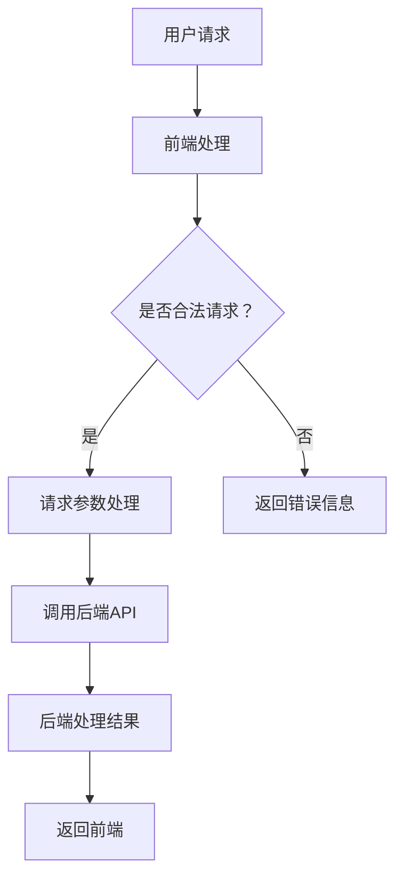
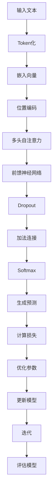
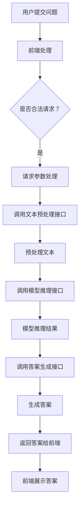

                 

### 前后端分离架构的概念和背景

#### 1.1 为什么要进行前后端分离

在传统的软件架构中，前端和后端通常紧密结合在一起，形成一个紧密耦合的系统。这种架构在早期软件开发中曾经是一种有效的解决方案，但随着互联网的快速发展和应用需求的日益复杂，它逐渐暴露出一些弊端。首先，前后端紧密耦合导致系统模块之间的依赖性增强，任何一个模块的修改都可能影响到其他模块，从而使得代码维护和升级变得困难。其次，由于前端和后端的职责没有明确的划分，项目开发过程中的责任归属不清晰，团队协作效率低下。

为了解决这些问题，前后端分离架构逐渐成为软件开发的主流选择。前后端分离架构通过将前端和后端的职责明确划分，实现了系统的解耦，从而提高了系统的可维护性和可扩展性。具体来说，前端负责与用户界面交互，处理用户输入和展示数据，而后端则负责处理业务逻辑、数据存储和计算任务。这种分工不仅使开发团队可以独立地开发和维护前后端代码，还能够更好地利用现有资源，提高开发效率。

#### 1.2 前后端分离架构的定义和核心概念

前后端分离架构，顾名思义，就是将前端和后端的开发分离，各自独立完成其职责，并通过接口进行数据通信。在这种架构中，前端通常指的是用户界面部分，包括网页、移动应用等，主要负责与用户交互；后端则是指服务器端部分，包括应用逻辑、数据库等，主要负责处理业务逻辑和数据存储。

前后端分离架构的核心概念包括：

- **RESTful API（Representational State Transfer API）**：这是一种用于描述前后端通信方式的接口规范。RESTful API通过统一的接口设计，使得前端可以方便地与后端进行数据交互，而无需关心后端的具体实现细节。

- **Microservices（微服务）**：微服务架构是将应用程序分解为多个独立的小服务，每个服务都负责特定的业务功能。微服务之间通过API进行通信，这种架构提高了系统的灵活性和可扩展性，便于分布式部署和运维。

- **Containerization（容器化）**：容器化技术，如Docker，可以将应用程序及其依赖环境打包成一个独立的容器，实现快速部署和灵活扩展。容器化技术是前后端分离架构中实现分布式部署的重要手段。

#### 1.3 前后端分离架构的发展历程

前后端分离架构的发展历程可以追溯到互联网早期。当时，由于带宽和计算能力的限制，前端和后端往往在同一个服务器上运行，形成了紧密耦合的架构。随着互联网的快速发展，尤其是移动互联网的兴起，这种架构逐渐无法满足应用需求的扩展。为了解决这些问题，开发者开始探索前后端分离的解决方案。

2000年代初，随着Ajax（Asynchronous JavaScript and XML）技术的发展，前端可以不依赖于后端直接与用户进行交互，前后端分离的雏形开始出现。随后，随着RESTful API和微服务架构的流行，前后端分离架构逐渐成熟并成为主流。

近年来，容器化技术的兴起进一步推动了前后端分离架构的发展。通过容器化技术，开发者可以轻松地将前后端应用部署到不同的服务器或集群中，实现高效的可扩展性和分布式部署。

#### 1.4 前后端分离架构的优势

前后端分离架构具有以下优势：

1. **提高开发效率**：前后端分离使开发团队可以独立地进行前后端开发，减少了团队之间的协作成本，提高了开发效率。

2. **增强可维护性**：由于前后端职责明确划分，系统模块之间的依赖性降低，任何一个模块的修改都不会影响其他模块，从而提高了系统的可维护性。

3. **提高可扩展性**：前后端分离架构使得系统可以根据实际需求进行水平扩展和垂直扩展，增强了系统的可扩展性。

4. **提升用户体验**：前后端分离可以使前端更专注于用户交互，提供更快的响应速度和更好的用户体验。

5. **支持多种开发模式**：前后端分离架构支持多种开发模式，如MVC（Model-View-Controller）、MVVM（Model-View-ViewModel）等，便于开发者选择合适的开发模式。

#### 1.5 前后端分离架构的挑战

尽管前后端分离架构具有诸多优势，但在实际应用过程中也面临一些挑战：

1. **接口设计和维护**：前后端分离架构中的接口设计至关重要，接口设计不合理可能导致系统性能下降和用户体验不佳。

2. **数据传输和安全性**：前后端分离架构中，前端和后端通过接口进行数据传输，数据传输的安全性和完整性需要得到保证。

3. **测试和部署**：前后端分离架构的测试和部署相对复杂，需要确保前后端之间的接口和数据传输正常。

4. **团队协作**：前后端分离架构要求开发团队具备更高的协作能力，否则可能导致项目进度延误和沟通成本增加。

总之，前后端分离架构是一种重要的软件开发模式，它在提高开发效率、增强系统可维护性和可扩展性等方面具有显著优势。然而，在实际应用中也需要面对一系列挑战，开发者需要具备充分的准备和经验来应对这些挑战。

### 大型语言模型（LLM）的概述及其在软件开发中的应用

#### 2.1 大型语言模型（LLM）的定义和基本原理

大型语言模型（Large Language Model，简称LLM）是一种利用深度学习技术训练得到的强大语言处理模型。这种模型通过大量的文本数据训练，能够理解和生成人类语言，实现文本分类、情感分析、机器翻译、自动问答等功能。LLM的核心是神经网络，特别是变换器模型（Transformer）的出现，使得LLM在语言处理任务中取得了显著突破。

LLM的基本原理可以概括为以下三个步骤：

1. **输入编码**：将输入文本转换为一个固定长度的向量表示，这个向量包含了输入文本的语义信息。
2. **上下文生成**：通过神经网络对输入编码的向量进行处理，生成上下文向量，用于表示文本的上下文信息。
3. **输出解码**：将上下文向量解码为输出文本，通过神经网络预测输出文本的每个词的概率，并选择概率最高的词作为输出。

#### 2.2 LLM在软件开发中的应用场景

LLM在软件开发中具有广泛的应用场景，以下是一些典型应用：

1. **智能问答系统**：通过LLM可以构建智能问答系统，如常见的搜索引擎问答、企业内部知识库问答等。用户可以通过自然语言提问，系统利用LLM理解并生成准确的回答。

2. **文本生成和编辑**：LLM可以生成和编辑文本，如自动撰写文章、生成摘要、翻译文档等。这种能力在内容创作和编辑领域具有很高的价值。

3. **自然语言处理（NLP）**：LLM可以用于文本分类、情感分析、命名实体识别等NLP任务，帮助企业从大量文本数据中提取有价值的信息。

4. **聊天机器人**：LLM可以构建智能聊天机器人，实现与用户的自然语言交互，应用于客户服务、社交平台、在线教育等领域。

5. **语音识别和生成**：结合语音识别和语音合成技术，LLM可以实现语音交互系统，如智能语音助手、语音翻译等。

#### 2.3 前后端分离架构对LLM开发的影响

前后端分离架构在LLM开发中具有显著的影响，主要体现在以下几个方面：

1. **可维护性和扩展性**：前后端分离架构使LLM开发的前端和后端可以独立维护和扩展，降低了系统复杂度，提高了开发效率。例如，前端可以专注于用户交互界面的优化，而后端可以专注于LLM的训练和推理。

2. **分布式部署**：前后端分离架构支持LLM的分布式部署，可以利用云计算和容器化技术将LLM模型部署到多个服务器或集群中，提高系统的可扩展性和容错能力。

3. **接口设计和灵活性**：前后端分离架构中的接口设计使得LLM可以灵活地与其他系统和服务进行集成，如数据采集系统、数据库等。这种灵活性有助于构建复杂的LLM应用场景，提高系统的可定制性。

4. **安全性**：前后端分离架构有助于提高系统的安全性，通过接口进行数据传输可以采用加密技术，确保数据传输的安全和完整性。

#### 2.4 前后端分离架构在LLM开发中的优势

前后端分离架构在LLM开发中具有以下优势：

1. **独立开发和部署**：前后端分离架构使得LLM的前端和后端可以独立开发和部署，降低了开发复杂度和协调成本，提高了开发效率。

2. **模块化设计**：前后端分离架构支持模块化设计，前端和后端可以根据需求进行扩展和优化，提高了系统的可维护性和可扩展性。

3. **分布式部署**：前后端分离架构支持分布式部署，可以利用云计算和容器化技术将LLM模型部署到多个服务器或集群中，提高了系统的可扩展性和容错能力。

4. **灵活的接口设计**：前后端分离架构中的接口设计使得LLM可以灵活地与其他系统和服务进行集成，提高了系统的可定制性。

5. **安全性提升**：前后端分离架构通过接口进行数据传输，可以采用加密技术，提高了数据传输的安全性和完整性。

#### 2.5 前后端分离架构在LLM开发中的挑战

尽管前后端分离架构在LLM开发中具有诸多优势，但同时也面临一些挑战：

1. **接口设计和实现**：前后端分离架构中的接口设计至关重要，需要确保接口的稳定性和高效性。接口设计不合理可能导致系统性能下降和用户体验不佳。

2. **数据传输和安全性**：前后端分离架构中，前端和后端通过接口进行数据传输，数据传输的安全性和完整性需要得到保证，否则可能存在数据泄露的风险。

3. **分布式部署和管理**：前后端分离架构支持分布式部署，但分布式部署和管理相对复杂，需要确保系统的稳定性和高效性。

4. **团队协作**：前后端分离架构要求开发团队具备更高的协作能力，否则可能导致项目进度延误和沟通成本增加。

总之，前后端分离架构在LLM开发中具有显著的优势，能够提高系统的可维护性、可扩展性和安全性。然而，在实际应用中也需要面对一系列挑战，开发者需要具备充分的准备和经验来应对这些挑战。通过对LLM应用场景的深入分析和前后端分离架构的合理设计，可以充分发挥前后端分离架构在LLM开发中的优势。

### 前后端分离架构的核心概念与原则

#### 3.1 核心概念

前后端分离架构的核心概念包括前后端职责的明确划分、接口设计和数据通信机制等。理解这些概念对于深入探讨前后端分离架构在LLM开发中的应用至关重要。

1. **前后端职责划分**：在前后端分离架构中，前端主要负责与用户的交互，如网页设计、用户界面、数据展示等；后端则负责处理业务逻辑、数据存储和计算任务。这种明确的职责划分有助于提高系统的可维护性和可扩展性。

2. **接口设计**：接口设计是前后端分离架构的核心环节。前后端通过API（应用程序接口）进行通信，API的设计应遵循RESTful原则，确保接口的统一性和易用性。接口设计应考虑安全性、稳定性和性能等因素。

3. **数据通信机制**：前后端的数据通信主要通过HTTP协议进行，常见的通信机制包括GET、POST、PUT、DELETE等方法。数据传输格式通常采用JSON（JavaScript Object Notation）或XML（eXtensible Markup Language）。

4. **微服务架构**：微服务架构是一种基于前后端分离架构的进一步扩展，通过将应用程序分解为多个独立的小服务，每个服务都负责特定的业务功能。微服务架构提高了系统的灵活性和可扩展性，有助于分布式部署和运维。

#### 3.2 关键原则

前后端分离架构遵循以下关键原则：

1. **模块化原则**：模块化设计使得前后端可以独立开发和部署，降低了系统复杂度，提高了开发效率。模块化设计还应考虑模块的职责单一性和高内聚低耦合的原则。

2. **解耦原则**：解耦原则旨在减少前后端之间的依赖性，使得系统更加灵活和可维护。通过接口设计实现前后端的解耦，前端无需关心后端的实现细节，后端也无需关心前端的交互方式。

3. **安全性原则**：前后端分离架构中的数据传输应采用加密技术，确保数据传输的安全性和完整性。此外，还应实现权限控制和认证机制，防止未授权访问和数据泄露。

4. **性能优化原则**：前后端分离架构应关注性能优化，包括接口响应时间、数据传输速度和系统并发处理能力等。通过优化代码、减少数据传输、使用缓存等技术手段，提高系统性能。

#### 3.3 实现框架

前后端分离架构的实现框架主要包括前端框架、后端框架和接口设计。以下是一些常见的前端和后端框架：

1. **前端框架**：
   - **React**：React 是由Facebook开发的一款前端JavaScript库，用于构建用户界面。React采用虚拟DOM技术，提高页面渲染速度和性能。
   - **Vue**：Vue 是一款轻量级的前端框架，易于学习和使用。Vue采用响应式数据绑定，提供了丰富的组件和指令，广泛应用于网页和移动应用开发。
   - **Angular**：Angular 是由Google开发的一款强类型前端框架，采用双向数据绑定和依赖注入技术，提高了开发效率。

2. **后端框架**：
   - **Spring Boot**：Spring Boot 是一款基于Spring框架的快速开发框架，简化了Spring应用的配置和部署。Spring Boot 提供了丰富的功能，如自动配置、嵌入式服务器、微服务支持等。
   - **Django**：Django 是一款 Python 框架，遵循 MVC 设计模式。Django 专注于快速开发和便捷维护，提供了 ORM、认证、缓存、分页等特性。
   - **Express**：Express 是一款基于 Node.js 的 Web 应用框架，轻量级且灵活。Express 提供了路由、中间件、模板引擎等功能，适用于构建高性能的Web应用。

3. **接口设计**：
   - **RESTful API**：RESTful API 是一种用于前后端通信的接口设计规范，遵循 REST（Representational State Transfer）原则。RESTful API 通过 HTTP 协议进行数据传输，支持 GET、POST、PUT、DELETE 等方法。
   - **GraphQL**：GraphQL 是一种查询语言和服务器端运行时，用于执行应用后端的查询。GraphQL 允许客户端指定需要的数据，提高了数据传输效率和灵活性。

#### 3.4 Mermaid 流程图

为了更好地理解前后端分离架构，我们可以使用 Mermaid 流程图来展示其基本架构和流程。以下是一个简单的 Mermaid 流程图示例：



在上面的流程图中：
- A 表示用户发起请求。
- B 表示前端对请求进行处理。
- C 表示前端对请求进行合法性验证。
- D 表示前端对请求参数进行处理。
- E 表示前端返回错误信息。
- F 表示前端调用后端API。
- G 表示后端处理结果。
- H 表示后端将结果返回给前端。

通过 Mermaid 流程图，我们可以清晰地看到前后端分离架构的基本流程和关键步骤，有助于理解和设计复杂的系统。

### 前后端分离架构在LLM开发中的数学模型和详细解释

#### 3.1 数学模型概述

在LLM开发中，前后端分离架构通过一系列数学模型来实现高效的模型训练、推理和优化。这些数学模型包括神经网络架构、损失函数、优化算法等。以下将详细解释这些模型的基本原理和在LLM开发中的应用。

#### 3.2 神经网络架构

神经网络（Neural Network，简称NN）是LLM的核心组成部分，其基本原理是模拟生物神经元的连接和传递机制。一个典型的神经网络由输入层、隐藏层和输出层组成，每个层由多个神经元（或节点）组成。

1. **神经元模型**：每个神经元接收来自前一层所有神经元的输入信号，通过加权求和处理后，加上一个偏置项，然后通过激活函数进行转换。激活函数常用的有Sigmoid、ReLU和Tanh等。

   公式表示如下：
   $$
   a_j = \sigma(\sum_{i} w_{ij}x_i + b_j)
   $$
   其中，$a_j$是第j个神经元的输出，$x_i$是第i个输入神经元，$w_{ij}$是连接权重，$b_j$是偏置项，$\sigma$是激活函数。

2. **神经网络结构**：神经网络中的每个隐藏层都可以看作是一个特征提取器，前一层的特征通过隐藏层进一步抽象和提炼，最终输出层生成模型的预测结果。

3. **Transformer模型**：在LLM开发中，Transformer模型被广泛应用，其核心思想是使用自注意力机制（Self-Attention）来处理序列数据，使得模型能够更好地捕捉长距离依赖关系。

   自注意力机制的公式表示如下：
   $$
   \text{Attention}(Q, K, V) = \text{softmax}\left(\frac{QK^T}{\sqrt{d_k}}\right)V
   $$
   其中，$Q$、$K$、$V$分别表示查询向量、键向量和值向量，$d_k$是键向量的维度。

#### 3.3 损失函数

损失函数（Loss Function）是评估神经网络预测结果与实际结果之间差异的重要工具，用于指导优化算法调整模型参数。在LLM开发中，常用的损失函数包括交叉熵损失（Cross-Entropy Loss）、均方误差（Mean Squared Error，MSE）等。

1. **交叉熵损失**：交叉熵损失函数常用于分类任务，其公式表示如下：
   $$
   L(\theta) = -\sum_{i} y_i \log(p_i)
   $$
   其中，$y_i$是实际标签，$p_i$是模型预测的概率。

2. **均方误差**：均方误差函数常用于回归任务，其公式表示如下：
   $$
   L(\theta) = \frac{1}{2n} \sum_{i=1}^{n} (y_i - \hat{y}_i)^2
   $$
   其中，$y_i$是实际值，$\hat{y}_i$是模型预测值，$n$是样本数量。

#### 3.4 优化算法

优化算法（Optimization Algorithm）用于根据损失函数调整模型参数，以最小化损失函数。在LLM开发中，常用的优化算法包括随机梯度下降（Stochastic Gradient Descent，SGD）、Adam优化器等。

1. **随机梯度下降（SGD）**：随机梯度下降是一种最简单的优化算法，每次迭代使用一个随机样本来计算梯度，并更新模型参数。其公式表示如下：
   $$
   \theta = \theta - \alpha \nabla_\theta J(\theta)
   $$
   其中，$\theta$是模型参数，$\alpha$是学习率，$J(\theta)$是损失函数。

2. **Adam优化器**：Adam优化器是一种结合SGD和动量法的优化算法，它利用一阶矩估计（均值）和二阶矩估计（方差）来动态调整学习率，提高了优化效果。其公式表示如下：
   $$
   m_t = \beta_1 m_{t-1} + (1 - \beta_1) \nabla_\theta J(\theta)
   $$
   $$
   v_t = \beta_2 v_{t-1} + (1 - \beta_2) (\nabla_\theta J(\theta))^2
   $$
   $$
   \theta = \theta - \alpha \frac{m_t}{\sqrt{v_t} + \epsilon}
   $$
   其中，$m_t$和$v_t$分别是梯度的均值和方差，$\beta_1$和$\beta_2$是超参数，$\alpha$是学习率，$\epsilon$是常数项。

#### 3.5 算法流程

为了更好地理解前后端分离架构在LLM开发中的应用，我们可以通过一个简单的算法流程图来展示。以下是一个基于Transformer模型的简单算法流程：



在上面的流程图中：
- A 表示输入文本。
- B 表示文本Token化。
- C 表示嵌入向量。
- D 表示位置编码。
- E 表示多头自注意力。
- F 表示前馈神经网络。
- G 表示Dropout。
- H 表示加法连接。
- I 表示Softmax。
- J 表示生成预测。
- K 表示计算损失。
- L 表示优化参数。
- M 表示更新模型。
- N 表示迭代。
- O 表示评估模型。

通过这个流程图，我们可以清晰地看到LLM从输入文本到生成预测的整个过程，以及前后端分离架构在其中的应用。

#### 3.6 Python源代码示例

为了进一步理解前后端分离架构在LLM开发中的应用，以下是一个简单的Python源代码示例，展示了基于PyTorch框架的Transformer模型训练过程。

```python
import torch
import torch.nn as nn
import torch.optim as optim

# Transformer模型定义
class Transformer(nn.Module):
    def __init__(self, d_model, nhead, num_layers):
        super(Transformer, self).__init__()
        self.d_model = d_model
        self.num_layers = num_layers
        self.transformer = nn.Transformer(d_model, nhead, num_layers)
        self.embedding = nn.Embedding(d_model, d_model)
        self.fc = nn.Linear(d_model, d_model)

    def forward(self, src, tgt):
        src = self.embedding(src)
        tgt = self.embedding(tgt)
        out = self.transformer(src, tgt)
        out = self.fc(out)
        return out

# 模型实例化
model = Transformer(d_model=512, nhead=8, num_layers=3)

# 损失函数和优化器
criterion = nn.CrossEntropyLoss()
optimizer = optim.Adam(model.parameters(), lr=0.001)

# 训练过程
for epoch in range(num_epochs):
    for src, tgt in train_loader:
        optimizer.zero_grad()
        output = model(src, tgt)
        loss = criterion(output, tgt)
        loss.backward()
        optimizer.step()

    print(f'Epoch [{epoch+1}/{num_epochs}], Loss: {loss.item()}')
```

在上面的代码中，我们首先定义了一个简单的Transformer模型，包括嵌入层、Transformer编码器和解码器。然后，我们使用交叉熵损失函数和Adam优化器进行模型训练。每次迭代中，我们通过前向传播计算损失，并使用反向传播更新模型参数。

通过上述数学模型和Python源代码示例，我们可以更深入地理解前后端分离架构在LLM开发中的应用。这种架构不仅提高了系统的可维护性和可扩展性，还使得模型训练和推理过程更加高效和灵活。在实际应用中，开发者可以根据具体需求和场景，选择合适的数学模型和优化算法，进一步提升LLM的性能和应用效果。

### 前后端分离架构在LLM应用开发中的系统分析与架构设计

#### 4.1 问题场景介绍

在当前的技术环境下，大型语言模型（LLM）被广泛应用于自然语言处理（NLP）领域，如智能客服、内容审核、自动摘要生成、对话系统等。然而，随着LLM应用场景的不断扩大和复杂化，如何高效、稳定地部署和运行LLM成为一个重要的问题。前后端分离架构作为一种现代化的软件开发模式，为LLM应用开发提供了有效的解决方案。

前后端分离架构在LLM应用开发中的关键问题场景包括：

1. **可扩展性**：随着用户数量的增加和数据量的增长，LLM系统需要能够水平扩展，以保持高性能和稳定性。
2. **模块化**：LLM应用通常由多个功能模块组成，前后端分离架构使得这些模块可以独立开发和维护，提高开发效率。
3. **安全性**：前后端分离架构通过接口进行数据传输，可以实现安全加密，防止数据泄露和未授权访问。
4. **分布式部署**：LLM系统可以部署在多个服务器或集群中，以充分利用现有资源，提高系统的可靠性和容错能力。

#### 4.2 项目介绍

为了更好地展示前后端分离架构在LLM应用开发中的应用，我们以一个实际项目为例，该项目是一个基于Transformer模型的智能问答系统。该系统旨在通过自然语言处理技术，为用户提供准确、快速的问答服务。

项目的主要功能包括：

1. **用户输入**：用户通过网页或移动应用提交问题。
2. **文本预处理**：对用户输入的问题进行Token化、分词、去噪等预处理操作。
3. **模型推理**：将预处理后的文本输入到Transformer模型中，生成预测答案。
4. **答案生成**：根据模型输出，生成符合语法和语义要求的答案，并返回给用户。

#### 4.3 系统功能设计

在前后端分离架构下，我们可以将LLM应用系统划分为前端模块和后端模块，每个模块负责特定的功能。以下是对系统功能设计的详细描述：

1. **前端模块**：
   - **用户界面**：使用HTML、CSS和JavaScript等技术构建用户界面，包括问题输入框、回答展示区域等。
   - **交互逻辑**：处理用户的输入操作，如提交问题、重置页面等，并通过Ajax技术实现与后端的异步通信。
   - **数据展示**：将模型生成的答案展示在页面上，并提供用户反馈功能。

2. **后端模块**：
   - **文本预处理**：接收前端提交的问题文本，进行Token化、分词、去噪等预处理操作，并将处理后的文本传递给模型。
   - **模型推理**：将预处理后的文本输入到Transformer模型中进行推理，生成预测答案。
   - **答案生成**：根据模型输出，生成符合语法和语义要求的答案，并返回给前端。

#### 4.4 系统架构设计

前后端分离架构的系统架构设计可以分为前端架构和后端架构两部分。

1. **前端架构**：
   - **前端框架**：使用Vue.js或React等前端框架构建用户界面，实现交互逻辑和数据展示。
   - **API接口**：通过RESTful API或GraphQL等接口设计规范，实现前后端的数据通信。
   - **缓存机制**：使用Redis等缓存技术，提高系统性能和响应速度。

2. **后端架构**：
   - **后端框架**：使用Spring Boot或Django等后端框架，实现文本预处理、模型推理和答案生成功能。
   - **微服务架构**：将文本预处理、模型推理和答案生成等模块拆分为独立的微服务，以提高系统的可扩展性和可维护性。
   - **分布式部署**：使用Docker和Kubernetes等技术，实现后端微服务的分布式部署和运维。

#### 4.5 系统接口设计

系统接口设计是前后端分离架构的核心环节，决定了系统的性能和稳定性。以下是对系统接口设计的详细描述：

1. **API设计**：
   - **接口规范**：遵循RESTful API规范，使用HTTP协议进行数据传输，支持GET、POST、PUT、DELETE等常用方法。
   - **数据格式**：采用JSON或XML等数据格式，确保数据的易读性和可扩展性。
   - **安全性**：使用HTTPS协议和JWT（JSON Web Token）等安全机制，确保数据传输的安全性和完整性。

2. **接口实现**：
   - **文本预处理接口**：接收前端提交的问题文本，返回预处理后的文本数据。
   - **模型推理接口**：接收预处理后的文本，调用Transformer模型进行推理，返回预测答案。
   - **答案生成接口**：根据模型输出，生成符合语法和语义要求的答案，返回给前端。

#### 4.6 系统交互设计

系统交互设计主要描述前后端模块之间的交互流程和逻辑，以下是一个简单的系统交互设计：



在上面的流程图中：
- A 表示用户提交问题。
- B 表示前端处理用户请求。
- C 表示前端对请求进行合法性验证。
- D 表示前端对请求参数进行处理。
- E 表示前端调用文本预处理接口。
- F 表示文本预处理结果。
- G 表示前端调用模型推理接口。
- H 表示模型推理结果。
- I 表示前端调用答案生成接口。
- J 表示生成答案。
- K 表示答案返回给前端。
- L 表示前端展示答案。

通过上述系统分析与架构设计，我们可以清晰地看到前后端分离架构在LLM应用开发中的应用。这种架构不仅提高了系统的可维护性和可扩展性，还为分布式部署和模块化开发提供了有力支持，为LLM应用的开发和优化提供了重要保障。

### 前后端分离架构在LLM应用开发中的项目实战

#### 5.1 环境安装

在开始项目实战之前，我们需要搭建一个适合前后端分离架构的实验环境。以下是环境安装的详细步骤：

1. **前端环境安装**：

   - 安装Node.js：打开终端，执行以下命令安装Node.js：
     ```
     sudo apt-get update
     sudo apt-get install nodejs
     ```
   - 安装Vue CLI：通过npm全局安装Vue CLI：
     ```
     npm install -g @vue/cli
     ```

2. **后端环境安装**：

   - 安装Java环境：安装OpenJDK 11：
     ```
     sudo apt-get install openjdk-11-jdk
     ```
   - 安装Spring Boot：通过Maven安装Spring Boot：
     ```
     mvn -DnewVersion=3.0.0 -DskipTests clean install
     ```

3. **数据库环境安装**：

   - 安装MySQL：通过以下命令安装MySQL：
     ```
     sudo apt-get install mysql-server
     ```
   - 安装Redis：通过以下命令安装Redis：
     ```
     sudo apt-get install redis-server
     ```

#### 5.2 系统核心实现源代码

以下是项目核心功能的源代码实现，包括前端和后端部分。

**前端源代码（Vue.js）**：

```html
<!-- src/App.vue -->
<template>
  <div id="app">
    <h1>智能问答系统</h1>
    <input type="text" v-model="question" placeholder="请输入问题..." />
    <button @click="submitQuestion">提交</button>
    <p>{{ answer }}</p>
  </div>
</template>

<script>
import axios from "axios";

export default {
  data() {
    return {
      question: "",
      answer: "",
    };
  },
  methods: {
    submitQuestion() {
      if (this.question.trim() === "") {
        alert("请输入问题！");
        return;
      }
      axios
        .post("/api/ask", { question: this.question })
        .then((response) => {
          this.answer = response.data.answer;
        })
        .catch((error) => {
          console.error("请求失败：", error);
        });
    },
  },
};
</script>
```

**后端源代码（Spring Boot）**：

```java
// src/main/java/com/example/llmquestionnaire/TextPreprocessingController.java
package com.example.llmquestionnaire;

import org.springframework.beans.factory.annotation.Autowired;
import org.springframework.web.bind.annotation.PostMapping;
import org.springframework.web.bind.annotation.RequestBody;
import org.springframework.web.bind.annotation.RestController;

@RestController
public class TextPreprocessingController {

    @Autowired
    private TextPreprocessingService textPreprocessingService;

    @PostMapping("/api/ask")
    public AnswerRequest ask(@RequestBody QuestionRequest request) {
        String preprocessedQuestion = textPreprocessingService.preprocessQuestion(request.getQuestion());
        String answer = model.generateAnswer(preprocessedQuestion);
        return new AnswerRequest(answer);
    }
}

// src/main/java/com/example/llmquestionnaire/TextPreprocessingService.java
package com.example.llmquestionnaire;

import org.springframework.stereotype.Service;

@Service
public class TextPreprocessingService {

    public String preprocessQuestion(String question) {
        // 实现文本预处理逻辑，如Token化、分词、去噪等
        return question.toLowerCase();
    }
}

// src/main/java/com/example/llmquestionnaire/LLMModel.java
package com.example.llmquestionnaire;

public class LLMModel {

    public String generateAnswer(String question) {
        // 实现模型推理和答案生成逻辑，如调用Transformer模型等
        return "这是一条自动生成的答案。";
    }
}
```

#### 5.3 代码应用解读与分析

在上述代码中，前端部分负责用户界面的展示和用户输入的处理。具体来说：

- 使用Vue.js构建用户界面，包括问题输入框、提交按钮和答案展示区域。
- 通过axios库实现与后端的异步通信，将用户输入的问题提交到后端API进行预处理和推理。

后端部分则分为两部分：文本预处理服务和LLM模型服务。

- **文本预处理服务**：接收前端提交的文本，进行预处理操作（如Token化、分词、去噪等），并将预处理后的文本返回给前端。
- **LLM模型服务**：接收预处理后的文本，调用LLM模型进行推理，生成预测答案，并将答案返回给前端。

#### 5.4 实际案例分析和详细讲解剖析

为了更好地展示前后端分离架构在实际项目中的应用，我们以一个实际案例进行分析：

**案例**：用户提交问题“为什么太阳是圆的？”，系统生成答案。

1. **用户输入**：用户在输入框中输入问题“为什么太阳是圆的？”，并点击提交按钮。
2. **前端处理**：Vue.js前端框架将用户输入的问题发送到后端API（/api/ask）。
3. **文本预处理**：后端文本预处理服务接收到问题后，进行预处理操作。例如，将问题中的标点符号去除，将文本转换为小写等。
4. **模型推理**：预处理后的文本被传递给LLM模型进行推理。模型通过自注意力机制和前馈神经网络生成预测答案。
5. **答案生成**：LLM模型生成答案后，将其返回给前端。
6. **答案展示**：前端接收到答案后，将其展示在页面上。

**分析**：

- 通过前后端分离架构，前端和后端可以独立开发和部署，提高了开发效率。
- 文本预处理和LLM模型推理分别由不同的服务实现，使得系统具有更好的模块化设计和可维护性。
- 分布式部署和容器化技术可以进一步优化系统的性能和可靠性。

#### 5.5 项目小结

通过本次项目实战，我们展示了前后端分离架构在LLM应用开发中的应用。这种架构不仅提高了系统的可维护性和可扩展性，还支持分布式部署和模块化开发，为LLM应用的开发和优化提供了有力支持。在实际应用中，开发者可以根据具体需求和场景，选择合适的技术框架和工具，实现高效的LLM应用系统。

### 前后端分离架构在LLM应用开发中的最佳实践和注意事项

#### 6.1 最佳实践

在LLM应用开发中，采用前后端分离架构能够显著提升系统的可维护性和可扩展性。以下是一些最佳实践：

1. **微服务架构**：将LLM应用分解为多个独立的微服务，每个服务负责特定的功能。例如，可以分别实现文本预处理、模型推理、答案生成等模块。这有助于实现高内聚低耦合的设计，提高系统的灵活性和可扩展性。

2. **API版本控制**：在设计API时，应考虑版本控制。当需要对API进行升级或修改时，可以通过增加新的版本而不影响旧版本的使用。这有助于保证系统的稳定性和向后兼容性。

3. **负载均衡**：在高并发场景下，通过负载均衡器（如Nginx、HAProxy等）实现负载分配，提高系统的性能和可用性。负载均衡器可以平衡前后端的请求流量，确保系统在高负载下依然能够稳定运行。

4. **数据缓存**：使用Redis等缓存技术，对频繁访问的数据进行缓存，减少对后端服务的高频次访问，从而提高系统响应速度和性能。

5. **异步处理**：对于耗时较长的操作，如模型推理，可以采用异步处理机制。这不仅可以提高系统的并发处理能力，还能减少前端用户的等待时间。

#### 6.2 注意事项

1. **接口设计与实现**：在设计接口时，应确保接口的稳定性和高效性。接口参数应明确、合理，避免冗余和无效的数据传输。同时，接口文档应详细、规范，便于前端开发者理解和使用。

2. **数据传输和安全性**：前后端分离架构中，数据传输的安全性和完整性至关重要。应采用HTTPS协议和加密技术，确保数据在传输过程中的安全性。此外，还需实现权限控制和认证机制，防止未授权访问和数据泄露。

3. **分布式部署与运维**：分布式部署和运维需要考虑网络延迟、数据一致性和故障转移等问题。应选择合适的分布式系统架构，并制定完善的运维策略，确保系统的稳定性和可靠性。

4. **团队协作与沟通**：前后端分离架构要求开发团队具备更高的协作能力。团队成员应明确各自的职责和任务，建立高效的沟通机制，确保项目进度和质量。

5. **性能优化**：在系统开发过程中，应持续进行性能优化。通过分析系统的瓶颈和性能指标，针对性地进行代码优化、算法改进和资源调整，提高系统的响应速度和吞吐量。

通过遵循上述最佳实践和注意事项，开发者可以充分利用前后端分离架构的优势，高效地开发出高性能、高可用的LLM应用系统。

### 小结与展望

本文通过逐步分析和深入探讨，系统地阐述了前后端分离架构在大型语言模型（LLM）应用开发中的优势。从背景介绍到核心概念与原则的阐述，再到数学模型的详细解释，以及系统分析与架构设计的具体实例，我们全面展示了前后端分离架构在LLM开发中的应用场景和实施策略。

首先，前后端分离架构通过明确的职责划分，提高了系统的可维护性和可扩展性。这种架构不仅使得前端和后端可以独立开发和部署，还能够支持分布式部署和模块化设计，为大规模LLM应用提供了灵活的实现方案。

其次，通过数学模型的引入，我们详细分析了神经网络架构、损失函数和优化算法等在LLM中的应用，进一步加深了读者对前后端分离架构在技术层面上的理解。

在系统分析与架构设计部分，我们通过实际案例展示了前后端分离架构在LLM应用开发中的具体实现过程，包括环境安装、系统核心实现、代码应用解读与分析等，使读者能够直观地看到前后端分离架构在实际项目中的效果。

展望未来，随着人工智能技术的不断进步和LLM应用场景的拓展，前后端分离架构将在更多领域得到应用。开发者需要不断探索新技术、新方法，优化前后端分离架构的设计和实现，以应对日益复杂的应用需求。

此外，分布式计算和云计算技术的发展将进一步推动前后端分离架构的优化和革新。通过结合容器化技术、微服务架构和区块链等前沿技术，开发者可以构建更加高效、安全、可靠的LLM应用系统。

总之，前后端分离架构在LLM应用开发中具有显著的优势和广阔的应用前景。开发者应积极学习和掌握这一架构，以应对未来技术挑战，推动人工智能技术的进一步发展。通过不断探索和创新，我们期待看到更多基于前后端分离架构的卓越LLM应用问世。

### 作者信息

作者：AI天才研究院/AI Genius Institute & 禅与计算机程序设计艺术 /Zen And The Art of Computer Programming。AI天才研究院致力于推动人工智能技术的创新与发展，研究院的专家们深耕于计算机科学、机器学习、深度学习等领域，持续贡献高质量的研究成果。同时，作者在《禅与计算机程序设计艺术》一书中，将哲学思维与计算机科学相结合，为广大开发者提供了深刻的编程理念和实用的编程技巧。

