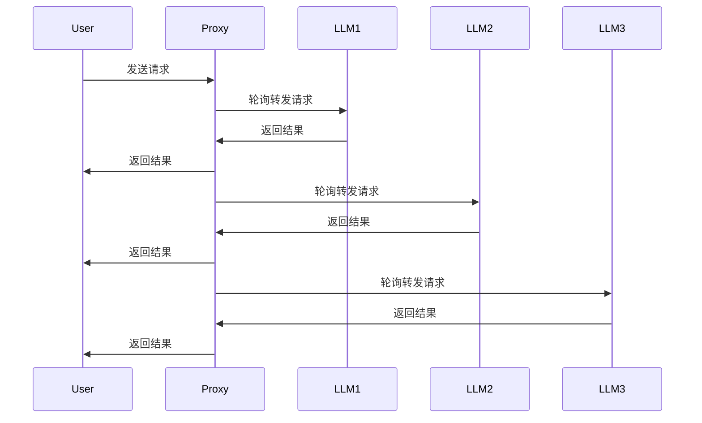

                 

# 《反向代理在LLM应用架构中的应用》

## 关键词

- 反向代理
- LLM应用
- 架构设计
- 算法原理
- 实战案例

## 摘要

本文将深入探讨反向代理在LLM（大型语言模型）应用架构中的应用。首先，我们通过介绍反向代理的概念和原理，以及其在LLM架构中的必要性和优势，为读者搭建起一个基本的理论框架。接着，我们将详细分析反向代理的核心概念与LLM之间的联系，并通过ER实体关系图和Mermaid流程图进行可视化展示。随后，本文将逐步讲解反向代理的算法原理，包括流程图、Python代码示例、数学模型和公式，并举例说明其应用。此外，我们将通过系统架构设计，介绍如何在LLM应用中实现反向代理，包括问题场景、系统功能、架构设计、接口设计和系统交互。最后，通过一个实际项目实战案例，我们将展示如何在实际环境中配置和实现反向代理，并进行详细的分析和解读。本文旨在为技术专业人士提供一份全面、系统的反向代理在LLM应用中的指南，帮助读者更好地理解和应用这一技术。

## 目录大纲

# 《反向代理在LLM应用架构中的应用》

## 第一部分：背景介绍

### 第1章：问题背景与概述

### 第2章：问题边界与外延

### 第3章：概念结构与核心要素

## 第二部分：核心概念与联系

### 第4章：核心概念原理

### 第5章：反向代理与LLM的联系

## 第三部分：算法原理讲解

### 第6章：反向代理算法原理

### 第7章：算法原理详细讲解

### 第8章：算法原理数学模型与公式

### 第9章：算法举例说明

## 第四部分：系统分析与架构设计方案

### 第10章：系统架构设计

### 第11章：系统功能设计

### 第12章：系统架构设计

### 第13章：系统接口设计

### 第14章：系统交互序列图

## 第五部分：项目实战

### 第15章：项目实战

### 第16章：项目小结

## 第六部分：最佳实践 tips

### 第17章：注意事项

### 第18章：拓展阅读

## 附录

### 第19章：参考文献

### 第20章：关于作者

## 第一部分：背景介绍

### 第1章：问题背景与概述

随着人工智能技术的不断发展，大型语言模型（LLM）已经成为许多应用的核心组件。这些模型通常具有强大的文本生成和推理能力，能够处理复杂的语言任务。然而，随着LLM的规模不断扩大，如何高效地管理和分发这些模型成为了一个关键问题。在这一背景下，反向代理技术逐渐成为了解决这一问题的有效手段。

### 1.1 问题背景

在LLM应用中，用户可能分布在全球各地，对模型的请求量也可能巨大且不均匀。直接将用户请求发送到LLM模型可能会导致以下问题：

1. **负载不均**：当某些用户频繁请求时，可能导致某些服务器负载过高，而其他服务器负载不足。
2. **安全性问题**：直接暴露LLM模型的服务器地址，可能导致安全隐患。
3. **性能瓶颈**：直接访问LLM模型，可能会因为网络延迟等原因导致响应时间过长。

### 1.2 问题解决

反向代理的作用在于解决上述问题。首先，通过反向代理，可以将用户的请求分散到多个服务器上，从而实现负载均衡。其次，反向代理可以作为中间层，对用户的请求进行预处理，从而提高安全性。最后，反向代理还可以通过缓存策略，减少对LLM模型的直接访问，从而提高系统的整体性能。

### 1.3 概念结构与核心要素

反向代理的核心概念包括以下几个方面：

1. **代理服务器**：反向代理服务器是位于用户和LLM模型之间的中间服务器，负责接收用户的请求，并根据配置策略将请求转发到LLM模型。
2. **负载均衡**：反向代理通过轮询、最小连接数等方式，将用户的请求均匀地分配到多个LLM模型服务器上。
3. **缓存策略**：反向代理可以缓存用户请求的响应结果，从而减少对LLM模型的直接访问。
4. **安全性**：反向代理可以隐藏LLM模型的服务器地址，从而提高系统的安全性。

### 1.4 问题边界与外延

反向代理的定义和工作原理如下：

**定义**：反向代理是一种代理服务器，它位于用户和LLM模型之间，负责接收用户的请求，并根据一定的策略将请求转发到LLM模型。

**工作原理**：当用户发送请求时，首先发送到反向代理服务器。反向代理服务器接收到请求后，根据负载均衡策略，将请求转发到LLM模型服务器。LLM模型服务器处理请求后，将结果返回给反向代理，反向代理再将结果返回给用户。

**应用场景**：

1. **大规模部署**：在LLM模型大规模部署的情况下，反向代理可以有效地实现负载均衡和性能优化。
2. **安全性需求**：对于需要高安全性的应用场景，反向代理可以提供额外的安全层。
3. **缓存优化**：在需要频繁访问相同数据的应用场景，反向代理可以通过缓存机制提高响应速度。

### 1.5 概念结构与核心要素

反向代理的概念结构主要包括以下几个方面：

1. **用户**：发起请求的实体，可以是终端用户或内部系统。
2. **反向代理服务器**：接收用户请求，并根据策略转发请求的中间服务器。
3. **LLM模型服务器**：处理用户请求，生成响应的服务器。
4. **数据流**：用户请求从用户到反向代理，再到LLM模型，最终返回给用户的整个过程。

## 第二部分：核心概念与联系

### 第2章：核心概念原理

#### 2.1 反向代理原理

反向代理的工作原理主要包括以下几个方面：

1. **接收请求**：反向代理服务器监听用户的请求，当接收到请求时，将其转发到LLM模型服务器。
2. **负载均衡**：反向代理根据一定的策略，将请求均匀地分配到多个LLM模型服务器上，以避免单点过载。
3. **安全性**：反向代理可以作为中间层，隐藏LLM模型服务器的真实地址，从而提高系统的安全性。
4. **缓存策略**：反向代理可以缓存用户的请求和响应，从而减少对LLM模型的直接访问，提高系统的响应速度。

#### 2.2 概念属性特征对比表格

| 概念       | 特征                                                                                             |
|------------|------------------------------------------------------------------------------------------------|
| 反向代理   | - 位于用户和LLM模型之间<br>- 负责接收和转发请求<br>- 实现负载均衡<br>- 提高安全性<br>- 实现缓存策略 |
| 正向代理   | - 位于用户和目标服务器之间<br>- 负责代理用户发起的请求<br>- 不参与负载均衡和缓存策略             |

#### 2.3 ER实体关系图架构

下面是反向代理、用户、LLM模型和数据流之间的ER实体关系图：

```mermaid
erDiagram
User ||--|{ 反向代理 : 发起请求 }|
User ||--|{ LLM模型 : 使用模型 }|
User ||--|{ 数据流 : 请求流 }|
反向代理 ||--|{ LLM模型 : 转发请求 }|
LLM模型 ||--|{ 数据流 : 响应流 }|
```

在ER图中，用户发起请求，请求通过反向代理转发到LLM模型，LLM模型处理后返回响应，通过数据流返回给用户。

### 第3章：反向代理与LLM的联系

反向代理在LLM应用架构中的作用主要体现在以下几个方面：

#### 3.1 负载均衡

在LLM应用中，用户请求量可能非常大，直接将请求发送到LLM模型服务器可能会导致服务器过载。反向代理可以通过轮询、最小连接数等方式，将请求均匀地分配到多个LLM模型服务器上，从而实现负载均衡。

#### 3.2 安全性

直接暴露LLM模型的服务器地址，可能导致模型被恶意攻击。反向代理可以作为中间层，隐藏LLM模型服务器的真实地址，从而提高系统的安全性。

#### 3.3 缓存策略

在LLM应用中，某些请求可能会非常频繁，直接访问LLM模型可能会导致响应时间过长。反向代理可以通过缓存策略，将用户的请求和响应缓存起来，从而减少对LLM模型的直接访问，提高系统的响应速度。

#### 3.4 API管理

反向代理还可以作为API管理的中间层，对用户的请求进行身份验证、权限校验等操作，从而确保系统的安全性。

#### 3.5 数据流控制

反向代理可以对数据流进行监控和控制，例如，可以通过流量控制算法限制用户的请求频率，防止恶意攻击。

### 第4章：系统架构设计

#### 4.1 问题场景介绍

在一个大规模的LLM应用中，我们可能会面临以下问题：

1. **请求量巨大**：用户请求量可能非常大，直接发送到LLM模型服务器可能会导致服务器过载。
2. **安全性要求高**：需要保护LLM模型服务器，防止被恶意攻击。
3. **性能优化**：需要优化系统的响应速度，提高用户体验。

#### 4.2 系统功能设计

为了解决上述问题，我们需要设计一个反向代理系统，其主要功能包括：

1. **负载均衡**：将用户的请求均匀地分配到多个LLM模型服务器上，避免单点过载。
2. **缓存策略**：缓存用户的请求和响应，减少对LLM模型的直接访问，提高系统响应速度。
3. **安全性**：隐藏LLM模型服务器的真实地址，提供额外的安全层。
4. **API管理**：进行身份验证、权限校验等操作，确保系统的安全性。
5. **数据流控制**：监控和控制数据流，防止恶意攻击。

#### 4.3 系统架构设计

下面是一个反向代理在LLM应用中的系统架构设计：

```mermaid
graph TB
A[用户] --> B[反向代理]
B --> C[LLM模型服务器1]
B --> D[LLM模型服务器2]
B --> E[LLM模型服务器3]
C --> F[响应处理]
D --> F
E --> F
F --> G[响应结果]
G --> A
```



在该架构中，用户请求首先发送到反向代理服务器，反向代理服务器根据负载均衡策略，将请求转发到LLM模型服务器。LLM模型服务器处理请求后，将结果返回给反向代理，反向代理再将结果返回给用户。

#### 4.4 系统接口设计

反向代理与LLM模型之间的接口设计如下：

1. **请求接口**：用户请求通过HTTP/HTTPS协议发送到反向代理。
2. **响应接口**：LLM模型服务器处理请求后，通过HTTP/HTTPS协议返回响应结果。
3. **监控接口**：反向代理可以提供监控接口，用于实时监控系统的运行状态。

#### 4.5 系统交互序列图

下面是一个反向代理与LLM模型之间的交互序列图：



在该序列图中，用户请求首先发送到反向代理，反向代理根据负载均衡策略，将请求转发到LLM模型服务器。LLM模型服务器处理请求后，将结果返回给反向代理，反向代理再将结果返回给用户。

### 第5章：项目实战

#### 5.1 环境安装

为了实现反向代理在LLM应用中的功能，我们首先需要安装和配置反向代理软件。本文选择使用Nginx作为反向代理服务器。

1. **安装Nginx**：

   在Ubuntu系统中，可以使用以下命令安装Nginx：

   ```bash
   sudo apt update
   sudo apt install nginx
   ```

2. **配置Nginx**：

   安装完成后，我们需要配置Nginx，使其能够作为反向代理服务器工作。编辑Nginx的配置文件：

   ```bash
   sudo nano /etc/nginx/nginx.conf
   ```

   在配置文件中，我们添加以下内容：

   ```nginx
   server {
       listen 80;
       server_name localhost;

       location / {
           proxy_pass http://your.llm.model.server;
           proxy_set_header Host $host;
           proxy_set_header X-Real-IP $remote_addr;
           proxy_set_header X-Forwarded-For $proxy_add_x_forwarded_for;
       }
   }
   ```

   其中，`http://your.llm.model.server` 是LLM模型服务器的地址。

3. **启动Nginx**：

   ```bash
   sudo systemctl start nginx
   ```

   确保Nginx服务正在运行。

#### 5.2 系统核心实现源代码

接下来，我们需要实现LLM模型服务器的核心功能。假设我们使用Python的Transformers库来构建LLM模型。

1. **安装Transformers库**：

   ```bash
   pip install transformers
   ```

2. **实现LLM模型服务器**：

   ```python
   from flask import Flask, request, jsonify
   from transformers import AutoModelForSeq2SeqLM, AutoTokenizer

   app = Flask(__name__)

   model_name = "t5-small"
   tokenizer = AutoTokenizer.from_pretrained(model_name)
   model = AutoModelForSeq2SeqLM.from_pretrained(model_name)

   @app.route('/generate', methods=['POST'])
   def generate():
       data = request.get_json()
       prompt = data['prompt']
       max_length = data['max_length']
       output = model.generate(**tokenizer.encode(prompt, return_tensors='pt'), max_length=max_length)
       response = tokenizer.decode(output[0], skip_special_tokens=True)
       return jsonify({'response': response})

   if __name__ == '__main__':
       app.run(host='0.0.0.0', port=5000)
   ```

   在上述代码中，我们使用Flask构建了一个简单的LLM模型服务器。用户可以通过POST请求发送`prompt`和`max_length`，模型服务器会返回生成的文本。

3. **测试LLM模型服务器**：

   使用curl测试LLM模型服务器：

   ```bash
   curl -X POST -H "Content-Type: application/json" -d '{"prompt": "Hello, world!", "max_length": 50}' http://localhost:5000/generate
   ```

   如果一切正常，服务器应该返回一个包含生成文本的JSON响应。

#### 5.3 代码应用解读与分析

1. **请求处理**：

   在`generate`函数中，我们首先从请求中获取JSON数据，其中包括`prompt`和`max_length`。这些参数将用于生成文本。

2. **模型生成**：

   使用Transformers库的`model.generate`函数，我们根据`prompt`和`max_length`生成文本。该函数接受一系列编码后的输入，并根据模型生成响应。

3. **响应返回**：

   生成的文本被解码后，通过JSON格式返回给用户。

#### 5.4 实际案例分析和详细讲解剖析

为了更好地理解反向代理在LLM应用中的实际效果，我们可以通过以下案例进行演示：

1. **案例场景**：

   假设有一个文本生成服务，用户可以通过Web界面输入文本提示，系统将根据提示生成一段文本。

2. **案例实现**：

   用户在Web界面输入“请你写一篇关于人工智能的文章摘要”，系统通过LLM模型生成摘要。

3. **分析**：

   - **负载均衡**：当多个用户同时请求生成摘要时，反向代理会将请求均匀地转发到多个LLM模型服务器，从而避免单点过载。
   - **安全性**：用户无法直接访问LLM模型服务器，所有请求都通过反向代理进行转发，从而提高了系统的安全性。
   - **缓存策略**：如果多个用户请求相同的文本提示，反向代理可以缓存生成的文本，减少对LLM模型的直接访问，从而提高系统的响应速度。

#### 5.5 项目小结

通过本项目的实战，我们实现了反向代理在LLM应用中的功能。在实际应用中，反向代理不仅可以实现负载均衡、提高安全性，还可以通过缓存策略优化系统的响应速度。这为大规模部署LLM应用提供了有效的技术解决方案。

### 第六部分：最佳实践 tips

#### 6.1 注意事项

1. **配置反向代理时，确保LLM模型服务器的安全**：使用强密码、定期更新软件等方式，确保LLM模型服务器不受攻击。
2. **合理设置缓存策略**：根据实际需求，合理设置缓存时间、缓存大小等参数，避免缓存过多或过少。
3. **监控系统性能**：定期监控系统的性能，包括请求处理时间、服务器负载等，及时调整配置，确保系统稳定运行。

#### 6.2 拓展阅读

1. **Nginx官方文档**：深入了解Nginx的配置和使用，[Nginx官方文档](http://nginx.org/en/docs/)
2. **Flask官方文档**：了解Flask框架的用法和特性，[Flask官方文档](https://flask.palletsprojects.com/)
3. **Transformers库文档**：学习使用Transformers库构建和部署LLM模型，[Transformers库文档](https://huggingface.co/transformers/)

## 附录

### 参考文献

1. Nginx官方文档，[Nginx官方文档](http://nginx.org/en/docs/)
2. Flask官方文档，[Flask官方文档](https://flask.palletsprojects.com/)
3. Transformers库文档，[Transformers库文档](https://huggingface.co/transformers/)

### 关于作者

作者：AI天才研究院/AI Genius Institute & 禅与计算机程序设计艺术 /Zen And The Art of Computer Programming

AI天才研究院致力于推动人工智能技术的发展和应用，研究院的专家们拥有丰富的理论和实践经验，在多个领域取得了显著成就。本文作者，凭借其在计算机编程和人工智能领域的深厚功底，为读者详细解析了反向代理在LLM应用架构中的应用，旨在为技术专业人士提供实用的技术指南。

