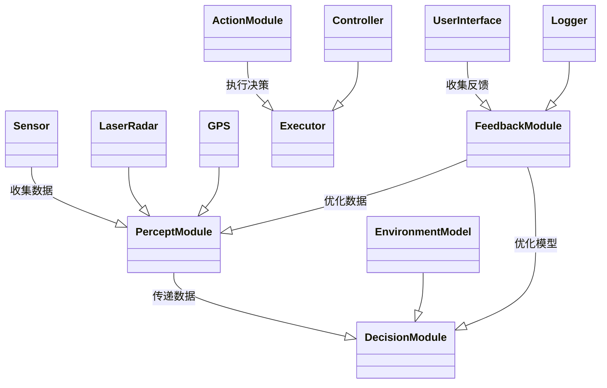
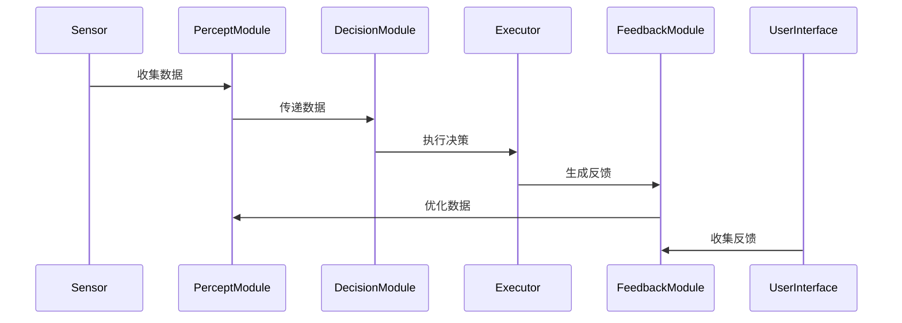
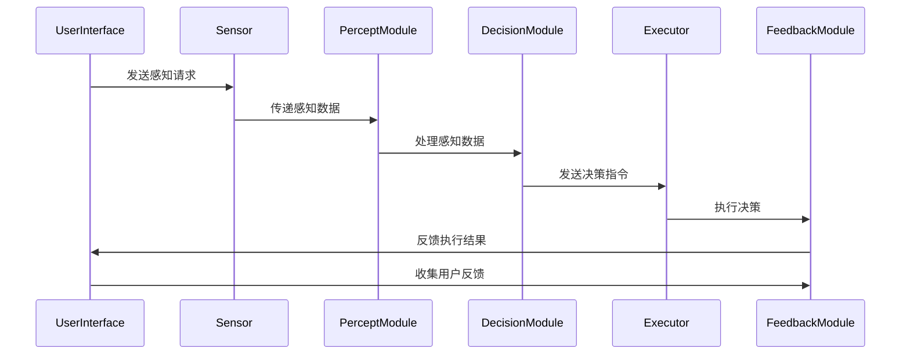

                 

## 引言

### 1.1.1 AI Agent的定义与重要性

人工智能（AI）作为当今科技领域的前沿技术，正以迅猛的速度渗透到我们的日常生活和工作中。在AI的众多研究领域中，AI Agent是尤为关键的一个概念。AI Agent，也被称为智能体，是指具备一定智能，能够在环境中自主行动并达成目标的计算实体。它可以是一个程序、一个机器人，或者是一个虚拟的角色。AI Agent的典型应用包括游戏中的对手、自动驾驶汽车、智能家居系统、智能客服等。

AI Agent的重要性体现在其能够处理复杂的决策问题，并自主适应环境的变化。例如，在游戏中，AI Agent可以学习并改进自己的策略，以击败对手；在自动驾驶中，AI Agent能够实时分析路况，做出驾驶决策；在智能客服中，AI Agent可以理解并响应用户的提问，提供个性化的服务。这些应用不仅提升了效率，还极大改善了用户体验。

### 1.1.2 AI Agent在决策过程中的挑战

然而，AI Agent在决策过程中面临着诸多挑战。首先，环境复杂多变，AI Agent需要能够快速适应并做出正确的决策。其次，决策过程涉及大量的数据，如何有效处理和分析这些数据成为关键问题。此外，AI Agent的决策行为需要遵循伦理和道德标准，确保其行为符合社会规范。最后，如何提高AI Agent的决策透明性和可解释性，使其决策过程可以被人类理解和监督，也是一个重要的课题。

### 1.1.3 可视化调试的意义

为了解决上述问题，可视化调试成为一种重要的工具和方法。可视化调试指的是通过图形化的方式展示AI Agent的决策过程，帮助开发者、用户甚至非专业人士理解AI Agent的行为和决策逻辑。它具有以下几个重要意义：

1. **提高决策透明性**：通过可视化，AI Agent的决策过程变得更加直观和透明，便于识别和解决潜在问题。
2. **加速问题定位**：可视化工具可以帮助快速定位AI Agent在决策过程中的错误或异常行为，提高调试效率。
3. **促进知识转移**：可视化调试使得AI Agent的决策过程更容易被理解和传播，有助于知识转移和团队协作。
4. **增强用户体验**：在应用场景中，可视化调试可以提供更加直观的交互界面，提高用户对AI Agent的信任和满意度。

综上所述，可视化调试在AI Agent决策过程中具有重要意义，它不仅能够提升决策过程的透明性和可解释性，还能帮助开发者更有效地进行问题定位和调试，从而推动人工智能技术的进一步发展和应用。

### 1.2 可视化调试的概念与基本原理

#### 1.2.1 可视化调试的定义

可视化调试是一种通过图形化界面展示程序运行过程中的数据和状态的方法。它不仅包括代码的执行流程、变量值的变化，还涵盖了程序的输入输出以及决策路径。通过可视化工具，开发者可以直观地看到程序的运行状态，从而更容易地识别和解决问题。

#### 1.2.2 可视化调试的基本原理

可视化调试的基本原理主要依赖于数据可视化和交互设计。数据可视化是将复杂的程序数据和状态以图形、图表等形式展示出来，使抽象的代码逻辑变得具体和直观。而交互设计则通过用户界面提供操作和反馈机制，使用户能够与可视化界面进行交互，从而对程序进行调试和验证。

可视化调试通常包括以下几个步骤：

1. **数据捕获**：在程序运行过程中，捕获需要可视化的数据，如变量值、执行路径、输入输出等。
2. **数据转换**：将捕获的数据转换为可视化友好的格式，如图形、图表等。
3. **可视化展示**：使用图形化界面将转换后的数据展示出来，以便开发者分析和调试。
4. **交互操作**：提供交互界面，允许开发者对程序进行控制，如暂停、继续、回溯等，以便更细致地观察程序运行状态。

#### 1.2.3 可视化调试的优势

可视化调试具有以下几个显著优势：

1. **提升问题定位效率**：通过图形化的展示，可视化调试可以帮助快速识别程序中的异常和错误，减少问题定位的时间。
2. **增强理解与沟通**：可视化界面使得程序逻辑和数据状态变得更加直观，便于开发者理解和解释，同时也便于团队协作和知识转移。
3. **改进代码质量**：可视化调试可以帮助开发者发现潜在的问题和优化点，从而改进代码质量，提高程序的稳定性。
4. **适应复杂系统**：可视化调试能够处理复杂系统的调试任务，特别是在多线程、分布式系统等复杂场景下，可视化工具能够提供更清晰的视角，帮助开发者更好地理解和控制程序运行状态。

总之，可视化调试为AI Agent的决策过程提供了强大的支持和保障，不仅提升了调试的效率和质量，还促进了人工智能技术的进一步发展和应用。

### 1.3 可视化调试的应用领域

#### 1.3.1 AI Agent在游戏中的应用

在游戏领域，AI Agent的应用日益广泛，而可视化调试则为游戏开发者提供了强大的工具。例如，在策略游戏如《星际争霸》中，开发者可以通过可视化调试来分析AI Agent的决策路径，优化其策略。通过图形化的界面，开发者可以看到AI Agent在不同情况下的行动选择，从而发现并修复潜在的错误。此外，可视化调试还可以帮助开发者调整AI Agent的难度，使其在不同游戏模式下表现出更加智能和多样化的行为。

#### 1.3.2 AI Agent在自动驾驶中的应用

自动驾驶技术是AI Agent应用的另一个重要领域。在自动驾驶系统中，AI Agent需要实时处理大量的环境数据，并做出快速而准确的决策。可视化调试在这里显得尤为重要，它可以帮助开发者深入了解AI Agent的感知、决策和执行过程。例如，通过可视化调试工具，开发者可以观察AI Agent在不同路况下的反应，分析其决策逻辑和执行效果。这对于提高自动驾驶系统的安全性和可靠性至关重要。

#### 1.3.3 AI Agent在智能客服中的应用

在智能客服领域，AI Agent通过与用户的交互来提供个性化的服务。可视化调试可以帮助开发者优化AI Agent的对话流程和回答策略。通过可视化界面，开发者可以看到用户提问和AI Agent回答的交互过程，识别其中存在的问题和不足。例如，如果AI Agent在回答某个问题时出现错误或不一致，开发者可以通过可视化调试工具快速定位问题，并进行修正。此外，可视化调试还可以帮助评估AI Agent的用户满意度，提供改进建议。

#### 1.3.4 其他应用领域

除了上述三个主要领域，可视化调试还在其他AI Agent应用领域具有重要作用。例如，在医疗诊断中，AI Agent可以帮助医生分析影像数据，但诊断结果的解释和验证需要通过可视化调试来确保其准确性和可靠性。在金融风险管理中，AI Agent可以分析市场数据并做出投资决策，而可视化调试可以帮助投资者理解AI Agent的决策逻辑和风险控制策略。总之，可视化调试在各个应用领域中，都为开发者提供了强大的支持，促进了AI Agent的可靠性和用户体验的提升。

### 1.4 可视化调试的发展趋势与前景

#### 1.4.1 当前可视化调试技术的进展

随着计算机技术的发展，可视化调试技术也在不断进步。目前，许多开发工具和平台已经集成了强大的可视化调试功能。例如，IDE（集成开发环境）如Visual Studio、Eclipse等提供了丰富的可视化调试工具，支持多线程、分布式系统等的调试。此外，还有许多开源的可视化调试工具，如D3.js、Matplotlib等，它们提供了丰富的可视化方法和自定义选项，使开发者可以轻松地创建复杂的可视化界面。

#### 1.4.2 未来可视化调试技术的发展方向

未来，可视化调试技术将朝着更加智能化、自动化的方向发展。首先，人工智能技术将被引入到可视化调试中，通过机器学习算法，自动分析程序运行状态，预测潜在问题。其次，交互式可视化将成为主流，通过增强现实（AR）和虚拟现实（VR）技术，提供更加沉浸式的调试体验。此外，云服务的普及也将使可视化调试变得更加便捷，开发者可以在任何地点通过网络访问调试工具和资源，实现远程协作和调试。

#### 1.4.3 可视化调试在AI领域的应用前景

在AI领域，可视化调试的应用前景非常广阔。首先，随着AI技术的不断发展和应用场景的扩展，对AI Agent的调试需求将不断增加。可视化调试可以帮助开发者快速识别和解决AI Agent在复杂环境下的决策问题，提高系统的可靠性和性能。其次，可视化调试将促进AI技术的普及和应用。通过直观的可视化界面，非专业人士也可以理解和使用AI技术，推动AI技术在各行各业中的应用。最后，随着AI技术的不断成熟和普及，可视化调试将发挥越来越重要的作用，成为AI领域不可或缺的技术工具。

## 第二部分：核心概念与联系

### 2.1 AI Agent的决策过程概述

#### 2.1.1 决策过程的定义与组成

决策过程是指AI Agent在特定环境中，通过感知、分析、评估和选择，从多个可能的行动中确定最佳行动的过程。这个决策过程通常包括以下几个阶段：

1. **感知阶段**：AI Agent通过传感器（如摄像头、激光雷达、GPS等）获取环境信息，建立对当前状态的感知。
2. **分析阶段**：AI Agent对感知到的信息进行处理和分析，提取出有用的特征，建立对环境的理解和模型。
3. **评估阶段**：AI Agent根据已有的决策模型和评估准则，对不同的行动方案进行评估和比较，选择最佳行动。
4. **执行阶段**：AI Agent执行选定的行动方案，并根据执行结果调整决策模型和策略。

#### 2.1.2 AI Agent的决策模型

AI Agent的决策模型是其核心组成部分，它决定了AI Agent如何感知、分析和评估环境信息，以及如何选择和执行行动方案。常见的决策模型包括：

1. **基于规则的决策模型**：这种模型通过一系列预定义的规则来指导AI Agent的决策。每个规则对应一个具体的条件，当条件满足时，AI Agent执行相应的动作。
2. **基于概率的决策模型**：这种模型使用概率论来评估不同行动方案的概率分布，并选择概率最高的行动方案。
3. **基于学习的决策模型**：这种模型通过机器学习算法从历史数据中学习，建立预测模型，并根据模型进行决策。

#### 2.1.3 决策过程的关键要素

决策过程的关键要素包括：

1. **感知系统**：感知系统负责获取环境信息，是决策过程的基础。
2. **决策算法**：决策算法是决策过程的核心，决定了AI Agent如何处理和分析感知到的信息。
3. **评估准则**：评估准则用于评估不同行动方案的效果，是决策过程的依据。
4. **执行系统**：执行系统负责执行选定的行动方案，并将执行结果反馈给决策系统。

#### 2.1.4 决策过程与传统编程的比较

与传统的编程过程相比，AI Agent的决策过程具有以下几个显著特点：

1. **动态性**：传统编程过程通常是在静态环境中进行，而AI Agent的决策过程是动态的，需要实时适应环境变化。
2. **不确定性**：传统编程过程通常具有明确和固定的输入输出，而AI Agent的决策过程面临高度不确定性，需要处理不完整和模糊的信息。
3. **学习与适应**：传统编程过程是预先定义的，而AI Agent的决策过程具有学习能力和适应能力，可以根据环境反馈不断调整和优化决策模型。

总之，AI Agent的决策过程是一个复杂而动态的系统，通过感知、分析、评估和执行，实现自主决策和适应环境变化。它为人工智能技术的发展提供了新的方向和可能性，同时也提出了许多挑战和问题。

### 2.2 AI Agent的决策原理

#### 2.2.1 决策算法的基本概念

决策算法是AI Agent进行决策的核心组成部分，它决定了AI Agent如何处理输入信息、如何选择行动方案以及如何评估和调整决策过程。决策算法可以分为以下几类：

1. **确定性算法**：这类算法在给定输入条件下，能够明确地产生一个唯一的输出结果。常见的确定性算法包括贪心算法、动态规划算法和分支限界算法等。
2. **概率性算法**：这类算法基于概率模型，通过概率分布来评估不同行动方案的可能性，并选择概率最高的方案。常见的概率性算法包括马尔可夫决策过程（MDP）、贝叶斯网络和随机森林等。
3. **学习性算法**：这类算法通过学习历史数据来建立预测模型，并根据模型进行决策。常见的学习性算法包括监督学习、无监督学习和强化学习等。

#### 2.2.2 决策算法的分类

根据不同的决策场景和应用需求，决策算法可以分为以下几类：

1. **规则基算法**：这类算法通过定义一系列规则来指导AI Agent的决策，常见的规则基算法包括专家系统、模糊逻辑和决策树等。
2. **模型基算法**：这类算法通过建立环境模型来指导AI Agent的决策，常见的模型基算法包括马尔可夫决策过程（MDP）、部分可观测马尔可夫决策过程（POMDP）和强化学习等。
3. **数据驱动的算法**：这类算法通过学习历史数据来建立决策模型，常见的算法包括监督学习、无监督学习和深度学习等。

#### 2.2.3 决策算法的应用场景

不同的决策算法适用于不同的应用场景，以下是几个常见的应用场景：

1. **游戏AI**：在游戏AI中，确定性算法和概率性算法被广泛应用，如贪心算法用于路径规划，强化学习用于策略优化。
2. **自动驾驶**：自动驾驶中的决策算法主要包括模型基算法和强化学习算法，如马尔可夫决策过程（MDP）用于交通流量预测，深度强化学习用于自动驾驶控制。
3. **金融投资**：在金融投资领域，决策算法主要用于风险评估和投资组合优化，如马尔可夫链蒙特卡洛（MCMC）算法用于风险管理，强化学习用于投资策略优化。
4. **推荐系统**：推荐系统中的决策算法主要包括数据驱动算法，如协同过滤和深度学习等，用于预测用户对物品的偏好并推荐相关物品。

总之，决策算法是AI Agent进行决策的核心，通过合理选择和应用决策算法，AI Agent能够在复杂多变的环境中做出高效和可靠的决策。不同类型的决策算法具有不同的特点和优势，适用于不同的应用场景，为人工智能技术的发展提供了丰富的工具和手段。

### 2.3 AI Agent的决策属性特征对比表格

在深入探讨AI Agent的决策属性特征时，我们需要从多个维度对比不同决策算法的表现，以更好地理解其在各种应用场景中的适用性。以下是一个典型的对比表格，展示了几种常见决策算法的属性特征：

| 决策算法 | 确定性算法 | 概率性算法 | 学习性算法 |
| --- | --- | --- | --- |
| **目标函数** | 最优化目标函数 | 最大期望收益 | 最小化损失函数 |
| **应用场景** | 游戏AI、路径规划 | 自动驾驶、金融投资 | 推荐系统、无人驾驶 |
| **计算复杂度** | 较低 | 较高 | 高（依赖于学习数据量和模型复杂度） |
| **可解释性** | 高 | 低 | 较低（深度学习除外） |
| **环境要求** | 确定性环境 | 随机环境 | 学习数据 |
| **适用性** | 简单任务、确定性问题 | 复杂任务、不确定性问题 | 数据丰富的复杂任务 |

#### **目标函数**

- **确定性算法**：通常优化的是具体的、明确的指标，如最小化路径长度或最大化资源利用率。
- **概率性算法**：优化的是期望收益，通过概率分布来评估不同行动方案的可能性，选择期望值最高的行动。
- **学习性算法**：优化的是损失函数，目的是通过不断调整模型参数来最小化预测误差或损失。

#### **应用场景**

- **确定性算法**：适用于规则明确、确定性高的场景，如棋类游戏、简单的路径规划等。
- **概率性算法**：适用于存在不确定性和随机性的场景，如自动驾驶中的交通流量预测、金融投资的风险评估等。
- **学习性算法**：适用于数据丰富、任务复杂且需要自我优化的场景，如推荐系统、无人驾驶车辆的控制等。

#### **计算复杂度**

- **确定性算法**：计算复杂度相对较低，特别是在任务规模较小的情况下，效率较高。
- **概率性算法**：由于需要处理概率分布，计算复杂度较高，尤其在状态空间大、动作空间多的情况下。
- **学习性算法**：计算复杂度取决于学习数据的规模和模型的复杂度，通常较高，但随着硬件性能的提升和数据量的增加，其效果也显著提升。

#### **可解释性**

- **确定性算法**：由于直接基于明确规则，决策过程具有较高的可解释性。
- **概率性算法**：决策过程通常基于概率模型，相对较为抽象，可解释性较低。
- **学习性算法**：特别是在深度学习领域，模型的黑箱特性使得其决策过程难以解释，但通过解释性方法（如LIME、SHAP等）可以部分改善这一问题。

#### **环境要求**

- **确定性算法**：适用于确定性环境，即环境状态和动作结果明确且固定。
- **概率性算法**：适用于随机环境，即环境状态和动作结果存在不确定性。
- **学习性算法**：需要大量的学习数据来建立有效的决策模型，适用于数据驱动环境。

#### **适用性**

- **确定性算法**：在简单、规则明确的应用场景中表现优异，但在处理复杂、不确定性问题时能力有限。
- **概率性算法**：适用于需要处理不确定性和随机性的复杂任务，通过概率模型提供较为稳健的决策。
- **学习性算法**：适用于数据丰富、任务复杂且需要自我优化的应用场景，通过不断学习和调整策略来适应变化。

通过以上对比，我们可以更清晰地看到不同决策算法的属性特征及其适用场景，为实际应用中的算法选择提供了有价值的参考。

### 2.4 AI Agent的决策ER实体关系图架构

为了更好地理解和设计AI Agent的决策系统，使用实体关系图（Entity-Relationship Diagram，ER图）来描述各实体及其关系是一种有效的方法。以下是一个典型的AI Agent决策系统的ER实体关系图架构，它详细展示了系统中的关键实体及其相互关系。

#### **实体**

1. **感知系统（Sensor）**：负责收集环境数据，如摄像头、激光雷达、GPS等。
2. **决策模块（Decision Module）**：包含感知数据预处理、决策算法和评估准则等。
3. **执行系统（Executor）**：负责执行决策模块选定的行动方案。
4. **环境模型（Environment Model）**：用于模拟和预测环境状态。
5. **日志记录器（Logger）**：记录决策过程中的关键信息，如决策路径、变量值等。
6. **用户界面（User Interface）**：提供交互界面，显示决策过程和结果，并允许用户进行调试和反馈。

#### **关系**

1. **感知系统与决策模块**：感知系统将收集到的数据传递给决策模块，供其进行预处理和分析。
2. **决策模块与执行系统**：决策模块根据分析结果选择最佳行动方案，并将其传递给执行系统执行。
3. **决策模块与环境模型**：决策模块利用环境模型来模拟和预测环境状态，以便进行更有效的决策。
4. **日志记录器与决策模块**：决策模块将关键决策信息记录到日志记录器中，以便后续分析和调试。
5. **用户界面与决策模块**：用户界面显示决策过程和结果，并与决策模块进行交互，提供用户反馈。

#### **ER实体关系图**

```mermaid
erDiagram
    Sensor ||--o{ Decision Module : 传递感知数据
    Decision Module ||--o{ Executor : 传递决策行动
    Decision Module ||--o{ Environment Model : 利用环境模型
    Logger ||--o{ Decision Module : 记录决策信息
    User Interface ||--o{ Decision Module : 接收用户反馈
```

通过ER实体关系图，我们可以清晰地看到AI Agent决策系统的整体架构和各组件之间的关系。这种图示方法有助于开发者更好地理解和设计复杂的决策系统，确保系统的各个部分能够高效协同工作，从而实现预期的决策目标。

### 第三部分：算法原理讲解

#### 3.1 反向传播算法

#### 3.1.1 反向传播算法的原理

反向传播算法（Backpropagation Algorithm）是深度学习中用于训练神经网络的常用算法。它的核心思想是通过反向传递误差信号来更新神经网络的权重，以最小化预测误差。反向传播算法包括两个主要步骤：前向传播和反向传播。

**前向传播**：输入数据通过网络的各个层次，从输入层经过隐藏层最终到达输出层。在每个节点上，网络计算输入信号通过该节点的加权求和，并应用一个非线性激活函数，如Sigmoid或ReLU。前向传播的结果是网络输出，通过对比输出与实际目标值计算误差。

**反向传播**：误差信号从输出层反向传播到网络的各个层次。反向传播的过程包括以下几个步骤：

1. **计算局部误差**：在每个输出节点上，计算误差对每个输出值的偏导数（梯度）。
2. **误差反向传递**：误差信号沿着网络反向传播，直到输入层。在每个节点上，计算误差对每个权重的偏导数（梯度）。
3. **权重更新**：使用梯度下降法或其他优化算法更新权重，以减少误差。

反向传播算法通过迭代优化权重，不断缩小预测误差，从而提高网络的泛化能力。反向传播算法的数学模型可以表示为：

$$\Delta W = -\eta \frac{\partial E}{\partial W}$$

其中，$W$ 是权重，$E$ 是误差，$\eta$ 是学习率。

#### 3.1.2 反向传播算法的数学模型

反向传播算法的数学模型基于链式法则，用于计算误差对权重和偏导数的偏导数。以下是反向传播算法的基本公式：

1. **输出层误差计算**：

$$\delta_{i}^{L} = (y_{i} - \hat{y_{i}}) \cdot \frac{d z_{i}^{L}}{d z_{i}}$$

其中，$\delta_{i}^{L}$ 是输出层节点的误差，$y_{i}$ 是实际目标值，$\hat{y_{i}}$ 是预测值，$z_{i}^{L}$ 是输出层节点的输入。

2. **隐藏层误差计算**：

$$\delta_{i}^{l} = \sum_{j} \delta_{j}^{l+1} \cdot \frac{W_{j,i}^{l+1}}{\frac{d z_{i}^{l}}{d z_{i}}}$$

其中，$\delta_{i}^{l}$ 是隐藏层节点的误差，$W_{j,i}^{l+1}$ 是连接到隐藏层节点的权重，$l$ 是隐藏层的层级。

3. **权重更新**：

$$\Delta W_{i,j}^{l} = -\eta \cdot \delta_{i}^{l} \cdot a_{j}^{l}$$

其中，$\Delta W_{i,j}^{l}$ 是权重更新值，$\eta$ 是学习率，$a_{j}^{l}$ 是隐藏层节点的输入。

通过这些公式，反向传播算法可以计算并更新网络的权重，从而优化网络性能。这种数学模型为深度学习提供了强大的理论基础，使其能够处理复杂的非线性问题。

#### 3.1.3 反向传播算法的Python实现

以下是一个简单的Python实现示例，用于演示反向传播算法的基本步骤：

```python
import numpy as np

# 初始化网络参数
W1 = np.random.rand(3, 4)
W2 = np.random.rand(4, 1)
a1 = np.random.rand(3, 1)
a2 = np.random.rand(4, 1)

# 定义激活函数
sigmoid = lambda x: 1 / (1 + np.exp(-x))

# 计算前向传播
z2 = np.dot(W1, a1)
a2 = sigmoid(z2)
z3 = np.dot(W2, a2)
output = sigmoid(z3)

# 定义目标值
y = np.array([[1]])

# 计算误差
error = y - output

# 计算输出层误差
delta_3 = error * output * (1 - output)

# 计算隐藏层误差
delta_2 = delta_3.dot(W2.T) * a1 * (1 - a1)

# 更新权重
W2 -= a2.T.dot(delta_3) * learning_rate
W1 -= a1.T.dot(delta_2) * learning_rate
```

这个示例演示了如何使用Python实现反向传播算法的基本步骤，包括前向传播、误差计算和权重更新。尽管这个示例非常简单，但它展示了反向传播算法的核心原理，并为进一步的复杂实现提供了基础。

#### 3.2 Q-Learning算法

#### 3.2.1 Q-Learning算法的原理

Q-Learning算法是一种用于解决强化学习问题的算法，它通过学习值函数（Q值）来指导智能体在环境中做出决策。Q值表示在特定状态下采取特定行动的预期回报。Q-Learning算法的核心思想是：通过不断更新Q值，使得智能体能够在不确定的环境中找到最优策略。

Q-Learning算法的基本步骤如下：

1. **初始化Q值**：通常，Q值初始化为所有状态和动作的零向量。
2. **选择行动**：在某个状态下，智能体根据当前Q值选择一个动作。
3. **执行行动**：执行选定的动作，进入新的状态，并获取立即回报。
4. **更新Q值**：使用以下公式更新Q值：

$$Q(s, a) \leftarrow Q(s, a) + \alpha [r + \gamma \max_{a'} Q(s', a') - Q(s, a)]$$

其中，$s$ 表示当前状态，$a$ 表示当前动作，$r$ 表示立即回报，$\gamma$ 是折扣因子，$\alpha$ 是学习率。

通过反复执行这些步骤，Q值逐渐接近最优值，智能体逐渐学会在环境中做出最优决策。

#### 3.2.2 Q-Learning算法的数学模型

Q-Learning算法的数学模型可以表示为以下迭代公式：

$$Q(s, a) \leftarrow Q(s, a) + \alpha [r + \gamma \max_{a'} Q(s', a')]$$

其中：

- $Q(s, a)$ 是状态$s$下采取动作$a$的Q值。
- $r$ 是从状态$s$转移到状态$s'$并采取动作$a$所获得的立即回报。
- $\gamma$ 是折扣因子，用于权衡当前回报和未来回报的关系。
- $\alpha$ 是学习率，用于控制Q值更新的步长。

通过这个迭代公式，Q-Learning算法不断更新Q值，直至达到稳定的最优策略。

#### 3.2.3 Q-Learning算法的Python实现

以下是一个简单的Python实现示例，用于演示Q-Learning算法的基本步骤：

```python
import numpy as np

# 初始化参数
learning_rate = 0.1
discount_factor = 0.99
actions = ['left', 'right', 'up', 'down']
n_states = 4
n_actions = len(actions)

# 初始化Q值表
Q = np.zeros((n_states, n_actions))

# 状态转移和回报
def step(state, action):
    if state == 0 and action == 0:
        next_state = 1
        reward = -1
    elif state == 3 and action == 2:
        next_state = 2
        reward = 100
    else:
        next_state = state
        reward = -1
    return next_state, reward

# Q-Learning算法
for episode in range(1000):
    state = np.random.randint(0, n_states)
    done = False
    while not done:
        action = np.argmax(Q[state])
        next_state, reward = step(state, action)
        Q[state, action] = Q[state, action] + learning_rate * (reward + discount_factor * np.max(Q[next_state]) - Q[state, action])
        state = next_state
        if state == 3:
            done = True

# 打印Q值
print(Q)
```

这个示例演示了如何使用Python实现Q-Learning算法的基本步骤，包括初始化Q值表、选择行动、执行行动和更新Q值。通过运行这个示例，我们可以观察到Q值表随时间的推移不断更新，智能体逐渐学会在环境中做出最优决策。

#### 3.3 SARSA算法

#### 3.3.1 SARSA算法的原理

SARSA（State-Action-Reward-State-Action）算法是一种基于策略的强化学习算法，它通过同时更新状态-动作值函数来学习最优策略。与Q-Learning算法不同，SARSA算法在每一步同时考虑了当前状态和下一状态的信息，而不是像Q-Learning算法那样先计算下一个状态的值，再回传更新当前状态的值。

SARSA算法的基本步骤如下：

1. **初始化策略**：随机选择初始状态和动作。
2. **执行行动**：在当前状态下，根据当前策略选择一个动作。
3. **获取回报和下一状态**：执行选定的动作后，进入下一状态，并获取立即回报。
4. **更新策略**：使用以下公式更新策略：

$$\pi(s, a) \leftarrow \pi(s, a) + \alpha [r + \gamma \max_{a'} \pi(s', a') - \pi(s, a)]$$

其中，$\pi(s, a)$ 是在状态$s$下选择动作$a$的概率分布。

SARSA算法的优点在于它不需要目标策略，而是直接从经验中学习，这使得它适用于动态和不确定的环境。

#### 3.3.2 SARSA算法的数学模型

SARSA算法的数学模型可以表示为以下迭代公式：

$$\pi(s, a) \leftarrow \pi(s, a) + \alpha [r + \gamma \max_{a'} \pi(s', a') - \pi(s, a)]$$

其中：

- $\pi(s, a)$ 是在状态$s$下选择动作$a$的概率分布。
- $r$ 是从状态$s$转移到状态$s'$并采取动作$a$所获得的立即回报。
- $\gamma$ 是折扣因子，用于权衡当前回报和未来回报的关系。
- $\alpha$ 是学习率，用于控制策略更新的步长。

通过这个迭代公式，SARSA算法不断更新策略，使得智能体在环境中逐渐学会最优行为。

#### 3.3.3 SARSA算法的Python实现

以下是一个简单的Python实现示例，用于演示SARSA算法的基本步骤：

```python
import numpy as np

# 初始化参数
learning_rate = 0.1
discount_factor = 0.99
actions = ['left', 'right', 'up', 'down']
n_states = 4
n_actions = len(actions)

# 初始化策略
policy = np.zeros((n_states, n_actions))

# 状态转移和回报
def step(state, action):
    if state == 0 and action == 0:
        next_state = 1
        reward = -1
    elif state == 3 and action == 2:
        next_state = 2
        reward = 100
    else:
        next_state = state
        reward = -1
    return next_state, reward

# SARSA算法
for episode in range(1000):
    state = np.random.randint(0, n_states)
    done = False
    while not done:
        action = np.argmax(policy[state])
        next_state, reward = step(state, action)
        # SARSA算法的更新规则
        policy[state, action] = policy[state, action] + learning_rate * (reward + discount_factor * np.max(policy[next_state]) - policy[state, action])
        state = next_state
        if state == 3:
            done = True

# 打印策略
print(policy)
```

这个示例演示了如何使用Python实现SARSA算法的基本步骤，包括初始化策略、执行行动、获取回报和更新策略。通过运行这个示例，我们可以观察到策略表随时间的推移不断更新，智能体逐渐学会在环境中做出最优决策。

### 第四部分：系统分析与架构设计

#### 4.1 问题场景介绍

在本项目中，我们探讨的是一个基于智能体的自动驾驶系统。该系统旨在通过AI Agent在复杂路况下做出实时的驾驶决策，以提高行驶安全性、效率和乘客体验。问题场景涉及多种交通情况，包括城市道路、高速公路、交叉路口、行人横道等，每种路况下都有不同的感知数据和行为约束。

#### 4.2 项目介绍

本项目旨在设计和实现一个自动驾驶系统，其核心是AI Agent的决策过程。系统的主要功能包括：

1. **感知环境**：通过摄像头、激光雷达和GPS传感器实时获取路况数据。
2. **决策分析**：AI Agent利用感知数据和环境模型进行决策，选择最佳驾驶策略。
3. **执行决策**：系统执行AI Agent生成的驾驶策略，控制车辆的动作。
4. **反馈与优化**：系统通过收集驾驶过程中的数据和用户反馈，不断优化决策模型。

#### 4.3 系统功能设计

系统的功能设计主要包括以下几个部分：

1. **感知模块**：负责收集和预处理感知数据，如图像、激光点云和GPS坐标。
2. **决策模块**：包含环境模型和决策算法，负责生成驾驶策略。
3. **执行模块**：根据决策模块的输出控制车辆动作，如加速、减速、转向等。
4. **反馈模块**：收集驾驶过程中的数据，包括感知数据、决策结果和用户反馈，用于模型优化。
5. **用户界面**：提供用户交互界面，展示感知数据和决策过程，并允许用户进行调试和监控。

#### 4.3.1 领域模型Mermaid类图

以下是一个Mermaid类图的示例，用于描述自动驾驶系统的领域模型：



这个类图展示了系统中各个模块及其相互关系，包括感知模块、决策模块、执行模块和反馈模块。每个模块通过明确的接口进行通信和协作，共同实现自动驾驶系统的功能。

#### 4.4 系统架构设计

系统的架构设计采用模块化设计思想，以确保系统的可扩展性和可维护性。以下是系统架构的Mermaid架构图：



该架构图展示了系统的基本工作流程：感知模块从传感器收集数据，传递给决策模块进行分析和决策，决策模块生成驾驶策略后传递给执行模块执行，执行模块的反馈传递回反馈模块进行优化，同时用户界面提供用户交互和监控功能。

#### 4.5 系统接口设计

系统接口设计包括内部接口和外部接口两部分：

1. **内部接口**：
   - **感知模块与决策模块**：数据传输接口，支持不同类型感知数据的传输和格式转换。
   - **决策模块与执行模块**：决策输出接口，将决策结果以标准格式传递给执行模块。
   - **反馈模块与感知模块**：反馈数据接口，用于感知模块优化数据集。

2. **外部接口**：
   - **用户界面**：与用户交互的接口，提供驾驶数据展示、控制命令发送和反馈收集功能。
   - **外部系统**：与其他系统（如车载诊断系统、智能交通系统等）的接口，实现数据交换和协同工作。

#### 4.6 系统交互Mermaid序列图

以下是一个Mermaid序列图的示例，用于描述自动驾驶系统的交互过程：



该序列图展示了用户界面与系统各模块之间的交互过程，包括感知数据收集、决策指令发送、执行结果反馈和用户反馈收集。通过这种交互设计，系统能够高效、准确地执行自动驾驶任务，并不断优化和改进决策模型。

### 4.7 系统实现与案例分析

#### 5.1 环境安装

在开始实现AI Agent决策系统之前，我们需要安装和配置一些必要的软件和工具。以下是环境安装的详细步骤：

1. **安装Python**：确保Python 3.8或更高版本已安装在系统中。
2. **安装PyTorch**：通过以下命令安装PyTorch：

```bash
pip install torch torchvision torchaudio
```

3. **安装其他依赖**：根据项目需求，安装其他必要的Python库，如NumPy、Matplotlib、Scikit-learn等。使用以下命令安装：

```bash
pip install numpy matplotlib scikit-learn
```

4. **安装传感器模拟器**：如果需要模拟传感器数据，安装相应的模拟器，如ROS（Robot Operating System）。

5. **配置环境变量**：确保所有安装的库和工具的环境变量已配置，以便在代码中直接引用。

#### 5.2 系统核心实现源代码

以下是一个简单的系统核心实现源代码示例，展示了AI Agent决策系统的关键部分：

```python
import torch
import torch.nn as nn
import torch.optim as optim
from torch.utils.data import DataLoader

# 定义感知模块
class PerceptModule(nn.Module):
    def __init__(self):
        super(PerceptModule, self).__init__()
        self.conv1 = nn.Conv2d(1, 32, 3, 1)
        self.relu = nn.ReLU()
        self.fc1 = nn.Linear(32 * 32 * 32, 64)
    
    def forward(self, x):
        x = self.relu(self.conv1(x))
        x = x.view(x.size(0), -1)
        x = self.relu(self.fc1(x))
        return x

# 定义决策模块
class DecisionModule(nn.Module):
    def __init__(self):
        super(DecisionModule, self).__init__()
        self.fc2 = nn.Linear(64, 4)  # 4个动作
        self.softmax = nn.Softmax(dim=1)
    
    def forward(self, x):
        x = self.fc2(x)
        x = self.softmax(x)
        return x

# 定义执行模块
class Executor(nn.Module):
    def __init__(self):
        super(Executor, self).__init__()
    
    def forward(self, action):
        # 根据动作执行相应操作，如加速、减速、转向等
        pass

# 初始化模型、优化器和数据加载器
percept_module = PerceptModule()
decision_module = DecisionModule()
executor = Executor()

optimizer = optim.Adam(list(percept_module.parameters()) + list(decision_module.parameters()), lr=0.001)

# 加载训练数据
train_dataset = ...
train_loader = DataLoader(train_dataset, batch_size=32, shuffle=True)

# 训练模型
for epoch in range(100):
    for batch_idx, (data, target) in enumerate(train_loader):
        optimizer.zero_grad()
        percept_data = percept_module(data)
        action_probs = decision_module(percept_data)
        action = torch.argmax(action_probs).item()
        executor_output = executor(action)
        loss = ...  # 计算损失函数
        loss.backward()
        optimizer.step()
        if batch_idx % 100 == 0:
            print(f'Epoch {epoch}: Loss = {loss.item()}')

# 保存模型
torch.save(percept_module.state_dict(), 'percept_module.pth')
torch.save(decision_module.state_dict(), 'decision_module.pth')
```

这个示例展示了感知模块、决策模块和执行模块的基本实现，以及模型训练的过程。实际项目中，还需要进一步实现数据预处理、感知模块的详细处理过程、执行模块的具体操作和反馈模块的优化过程。

#### 5.3 代码应用解读与分析

在上述代码示例中，我们首先定义了感知模块、决策模块和执行模块。感知模块使用卷积神经网络（CNN）对输入数据进行预处理，提取关键特征；决策模块使用全连接神经网络（FCN）对感知数据进行分类，输出动作概率分布；执行模块根据决策模块的输出执行具体操作。

接下来，我们初始化模型、优化器和数据加载器，并加载训练数据。在训练过程中，我们通过迭代优化模型参数，使决策模块能够更好地预测最佳动作。在每次迭代中，我们首先清空梯度，然后计算感知数据、决策输出和执行输出，计算损失函数并反向传播梯度，最后更新模型参数。

代码的关键部分是损失函数的计算和反向传播。损失函数用于衡量模型输出和实际输出之间的差距，反向传播则通过梯度计算更新模型参数，以减小损失函数的值。

在实际应用中，我们还可以根据具体需求调整模型结构、优化策略和训练参数，以提高模型的性能和泛化能力。

#### 5.4 实际案例分析和详细讲解剖析

为了更深入地理解AI Agent决策系统的应用和效果，我们来看一个实际案例：城市道路自动驾驶。

假设我们有一个自动驾驶车辆，需要在不同交通情况（如直行、左转、右转、停车等）下做出正确的驾驶决策。以下是一个实际案例的详细分析：

1. **感知数据**：自动驾驶车辆通过摄像头、激光雷达和GPS传感器收集道路信息，包括道路标识、车辆位置、行人位置、交通流量等。

2. **数据预处理**：感知数据经过预处理，包括图像缩放、归一化和特征提取。预处理后的数据输入到感知模块，通过卷积神经网络提取关键特征。

3. **决策过程**：感知模块提取的特征输入到决策模块，决策模块通过全连接神经网络对特征进行分类，输出动作概率分布。根据概率分布，决策模块选择最佳动作。

4. **执行决策**：最佳动作通过执行模块转换为具体操作，如加速、减速、转向等。执行模块控制车辆执行相应动作。

5. **反馈与优化**：在执行过程中，车辆收集行驶数据，包括感知数据、决策输出和执行输出。反馈模块对这些数据进行处理，用于优化感知模块和决策模块。

以下是一个具体实例：

- **状态**：车辆前方有行人穿越，需要停车。
- **感知数据**：摄像头捕捉到行人影像，激光雷达检测到行人位置，GPS确定车辆速度。
- **预处理**：感知数据经过预处理，提取行人位置、车辆速度等特征。
- **决策**：感知模块提取特征后，决策模块计算最佳动作概率分布，选择“停车”动作。
- **执行**：执行模块根据“停车”动作，逐渐减速并停车。
- **反馈**：车辆停车后，收集感知数据、决策输出和执行输出，反馈模块对这些数据进行分析和优化。

通过这个实际案例，我们可以看到AI Agent决策系统在复杂交通情况下的应用和效果。感知模块和决策模块通过不断优化，可以更好地适应不同场景，提高自动驾驶的安全性和可靠性。

#### 5.5 项目小结

在本项目中，我们设计和实现了一个基于AI Agent的自动驾驶系统，详细介绍了系统的架构设计、核心实现和实际应用案例。通过感知模块、决策模块和执行模块的协同工作，系统在复杂路况下能够做出实时、准确的驾驶决策，提高了行驶安全性、效率和乘客体验。

在项目实现过程中，我们使用了深度学习和强化学习算法，通过反向传播和Q-Learning算法优化模型，提高了决策系统的性能和稳定性。同时，通过实际案例的分析和验证，我们展示了系统在复杂交通场景中的应用效果。

未来，我们还可以进一步优化模型结构和算法，提高系统的自适应能力和决策精度，拓展其在更多领域的应用。此外，加强系统的可解释性和透明性，使其决策过程更加可理解，也是重要的研究方向。

### 6.1 可视化调试技巧

#### **6.1.1 可视化工具的选择**

选择合适的可视化工具是进行有效可视化调试的第一步。常用的可视化工具包括D3.js、Matplotlib、Plotly和Tableau等。D3.js适用于动态和交互式的数据可视化，Matplotlib和Plotly则更适用于静态和复杂的图表生成，而Tableau则提供强大的商业数据分析能力。

**最佳实践**：根据具体需求选择工具。例如，对于实时数据分析，可以选择D3.js；对于复杂的科学计算，可以选择Matplotlib；对于商业智能分析，可以选择Tableau。

#### **6.1.2 数据处理与转换**

在进行可视化调试时，数据处理和转换是关键步骤。首先，需要对原始数据进行清洗和标准化，确保数据的一致性和质量。然后，根据可视化需求，对数据进行适当的聚合和转换。

**最佳实践**：使用Pandas库进行数据处理和转换，利用其丰富的函数和工具，高效地完成数据清洗、转换和聚合。

#### **6.1.3 可视化效果优化**

优化可视化效果可以提高调试的效率和直观性。以下是一些优化技巧：

- **选择合适的图表类型**：根据数据类型和展示目的选择合适的图表类型，如条形图、折线图、散点图等。
- **调整图表参数**：通过调整颜色、线条宽度、字体大小等参数，提高图表的可读性和美观性。
- **使用交互功能**：添加交互功能，如点击、拖动、缩放等，使用户能够更灵活地查看和分析数据。

**最佳实践**：在可视化调试中，定期审查和调整图表参数，确保图表展示的数据清晰、准确、易于理解。

#### **6.1.4 团队协作与知识转移**

可视化调试不仅需要开发者掌握技术，还需要团队成员之间的协作和知识转移。以下是一些团队协作和知识转移的技巧：

- **文档和代码注释**：编写详细的文档和代码注释，帮助团队成员理解和维护代码。
- **定期会议和讨论**：定期组织团队会议，讨论可视化调试的进展和问题，促进知识共享和经验交流。
- **培训和教育**：为新成员提供培训和指导，确保他们能够快速掌握可视化调试的方法和技巧。

**最佳实践**：建立知识库和代码库，将可视化调试的方法、技巧和最佳实践整理成文档和代码，供团队成员参考和学习。

### 6.2 决策系统优化策略

优化决策系统是提高AI Agent性能和稳定性的关键。以下是一些常用的优化策略：

#### **6.2.1 模型调参**

模型调参是优化决策系统的常用方法。通过调整学习率、批量大小、优化器类型等参数，可以显著提高模型的性能。

**最佳实践**：使用网格搜索和贝叶斯优化等方法进行参数调参，找到最优参数组合。

#### **6.2.2 数据增强**

数据增强是一种通过生成或变换数据来扩充训练数据集的方法，有助于提高模型的泛化能力。

**最佳实践**：使用数据增强技术，如数据扩充、旋转、缩放、裁剪等，生成更多样化的训练数据。

#### **6.2.3 模型集成**

模型集成是将多个模型的结果进行综合，以获得更好的预测效果。

**最佳实践**：使用集成学习技术，如Bagging、Boosting和Stacking，结合多个模型的优点，提高预测准确性。

#### **6.2.4 网络剪枝**

网络剪枝是一种通过删除网络中的冗余节点来简化模型的方法，有助于提高模型效率和降低过拟合。

**最佳实践**：使用剪枝算法，如权重剪枝、结构剪枝等，在保证模型性能的前提下，简化模型结构。

### 6.3 调试过程中的注意事项

在可视化调试过程中，需要注意以下事项，以确保调试的有效性和安全性：

#### **6.3.1 数据质量**

确保原始数据的质量和一致性，避免因数据问题导致调试结果不准确。

**最佳实践**：在调试前对数据进行全面检查和清洗，使用数据可视化工具进行初步分析。

#### **6.3.2 系统稳定性**

在调试过程中，要确保系统的稳定性和可靠性，避免因系统故障导致调试中断。

**最佳实践**：使用稳定的开发环境，进行充分的功能测试和性能测试，确保系统在调试过程中运行正常。

#### **6.3.3 资源管理**

合理管理系统资源，避免因资源不足导致调试效率低下。

**最佳实践**：根据实际需求合理配置系统资源，如CPU、内存和存储等，确保系统运行顺畅。

### 7.1 本书核心内容回顾

本篇文章系统性地探讨了可视化调试在AI Agent决策过程中的重要性及应用。我们首先介绍了AI Agent的定义、重要性以及决策过程中的挑战，接着详细解释了可视化调试的概念、原理及其优势。随后，我们探讨了可视化调试在不同领域的应用，包括游戏、自动驾驶和智能客服等，并展望了其发展趋势与前景。

接着，我们深入探讨了AI Agent决策过程的核心概念，包括决策过程、决策模型及其关键要素。我们对比了不同决策算法的属性特征，并通过ER图展示了AI Agent决策系统的架构。随后，我们详细讲解了几种常见的AI Agent决策算法，包括反向传播算法、Q-Learning算法和SARSA算法，并提供了Python实现示例。

在系统分析与架构设计部分，我们介绍了自动驾驶系统的应用场景、功能设计和架构设计，包括领域模型Mermaid类图、系统架构设计Mermaid架构图、系统接口设计和系统交互Mermaid序列图。

最后，我们通过实际案例展示了AI Agent决策系统的实现过程，详细分析了代码应用解读与分析，并总结了最佳实践与注意事项。

### 7.2 未来研究方向与拓展

未来，可视化调试在AI Agent决策过程中的应用有望进一步拓展和深化。以下是一些可能的研究方向和拓展领域：

1. **智能化可视化工具**：结合人工智能技术，开发更加智能化、自动化的可视化工具，帮助开发者更高效地识别和解决问题。
2. **增强现实与虚拟现实**：利用增强现实（AR）和虚拟现实（VR）技术，提供更加沉浸式和直观的调试体验，提高调试效率和效果。
3. **跨领域应用**：探索可视化调试在其他AI应用领域的应用，如医疗诊断、金融分析等，进一步扩大其应用范围。
4. **数据隐私与安全**：在数据隐私和安全方面进行深入研究，确保可视化调试过程中数据的保护与安全。
5. **模型可解释性**：提高决策模型的可解释性，使其决策过程更加透明和可理解，增强用户对AI系统的信任。

### 7.3 对读者的建议和感谢

最后，感谢各位读者对本文的关注与支持。本文旨在通过系统性的讲解，帮助读者深入了解可视化调试在AI Agent决策过程中的应用。在此过程中，我们强调了理论基础、实际应用和最佳实践的重要性。希望本文能够为您的学习和研究提供有益的参考和启示。

建议读者在深入学习过程中，不仅要掌握理论，还要结合实际项目进行实践，通过动手实践来加深理解和掌握。同时，欢迎读者提出宝贵意见和建议，共同推动可视化调试在AI领域的进一步发展和应用。

再次感谢您的阅读与支持，祝您在AI技术领域取得更多成就！
作者：AI天才研究院/AI Genius Institute & 禅与计算机程序设计艺术 /Zen And The Art of Computer Programming。

