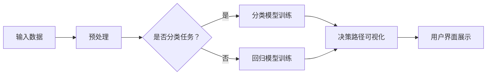
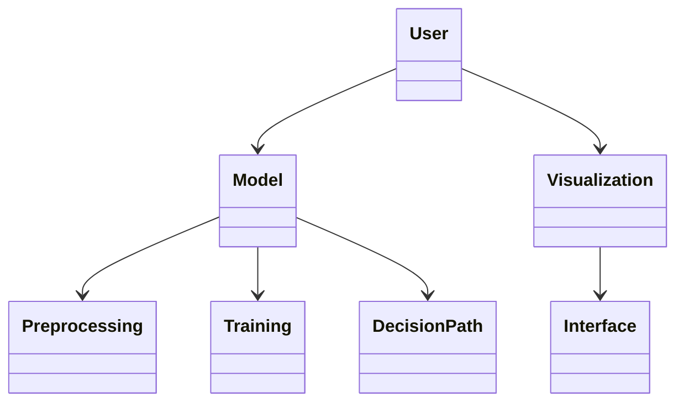
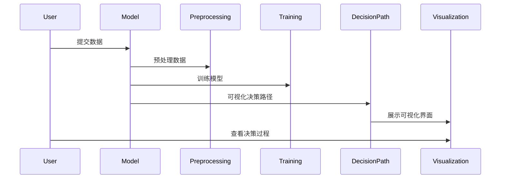
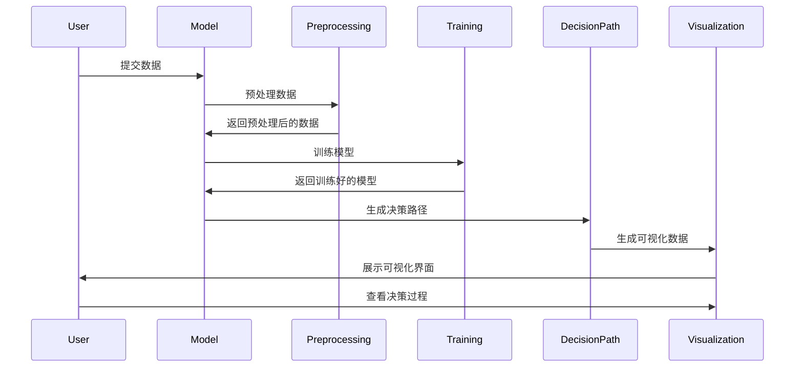

                 

# 可解释性AI：增强用户对AI决策的理解和信任

> 关键词：可解释性AI，用户信任，AI决策，算法原理，系统架构，项目实战，最佳实践

> 摘要：本文探讨了可解释性AI在增强用户对AI决策理解和信任方面的作用。通过介绍可解释性AI的背景、核心概念、算法原理、系统架构和项目实战，本文分析了如何通过透明、清晰的AI决策过程，提高用户对AI技术的接受度和信任度。

## 第一部分：背景介绍

### 第1章：问题背景

#### 1.1.1 问题背景

随着人工智能（AI）技术的快速发展，越来越多的领域开始依赖AI算法进行决策。然而，AI系统的“黑箱”性质导致了用户对其决策过程的不信任。用户往往无法理解AI是如何做出决策的，这引发了对其可靠性和公正性的质疑。

#### 1.1.2 问题描述

可解释性AI的主要问题是如何让用户理解AI系统的决策过程。用户需要知道AI是如何处理输入数据、如何学习、以及如何生成决策的。然而，现有的AI系统往往缺乏透明性，使得用户难以掌握这些信息。

#### 1.1.3 问题解决

为了解决这一问题，可解释性AI应运而生。可解释性AI旨在通过提供透明的决策过程，使用户能够理解AI系统的行为，从而增强对AI的信任。

#### 1.1.4 边界与外延

可解释性AI不仅关注AI系统的内部决策过程，还包括与用户互动的方式。它要求AI系统能够清晰地传达其决策依据，使得用户能够参与到决策过程中，提高用户体验。

#### 1.1.5 概念结构与核心要素组成

可解释性AI的核心概念包括：模型可解释性、决策路径可视化和用户互动。这些概念共同构成了可解释性AI的理论框架，为实现AI系统的透明化提供了支持。

## 第二部分：核心概念与联系

### 第2章：核心概念

#### 2.1.1 可解释性AI的定义与特点

可解释性AI（Explainable AI，XAI）是一种旨在提高AI系统透明度和用户理解度的技术。其核心特点包括：

- **透明性**：用户可以理解AI系统的决策过程。
- **可理解性**：AI系统的决策依据是清晰的，用户可以理解其背后的逻辑。
- **可验证性**：用户可以验证AI系统的决策是否合理。

#### 2.1.2 可解释性AI的核心概念

可解释性AI的核心概念包括：

- **模型可解释性**：确保用户能够理解AI模型的工作原理。
- **决策路径可视化**：将AI系统的决策路径可视化，使用户能够直观地了解决策过程。
- **用户互动**：设计用户友好的界面，使用户能够与AI系统互动，提高用户体验。

#### 2.1.3 可解释性AI的属性特征对比表格

| 特性 | 说明 |
| --- | --- |
| 透明性 | 用户可以查看AI系统的决策过程 |
| 可理解性 | 用户可以理解AI系统的决策依据 |
| 可验证性 | 用户可以验证AI系统的决策是否合理 |
| 可视化 | 将决策路径以图表形式展示 |
| 用户互动 | 提供用户友好的界面 |

#### 2.1.4 可解释性AI的ER实体关系图架构


在ER实体关系图中，包括以下实体：

- **用户**：与AI系统互动的实体。
- **模型**：AI系统的核心部分。
- **决策路径**：AI系统的决策过程。
- **可视化界面**：用于展示决策路径和结果的界面。

## 第三部分：算法原理讲解

### 第3章：算法原理

#### 3.1.1 可解释性AI算法的mermaid流程图



#### 3.1.2 算法原理的Python源代码

```python
# 输入数据预处理
def preprocess_data(data):
    # 数据清洗、归一化等操作
    return processed_data

# 分类模型训练
def train_classifier(processed_data):
    # 使用决策树、随机森林等模型
    model = ClassifierModel()
    model.train(processed_data)
    return model

# 回归模型训练
def train_regressor(processed_data):
    # 使用线性回归、决策树等模型
    model = RegressorModel()
    model.train(processed_data)
    return model

# 决策路径可视化
def visualize_decision_path(model):
    # 使用mermaid生成决策路径图
    graph = mermaid.draw_model(model)
    return graph

# 用户界面展示
def display_user_interface(graph):
    # 将决策路径图展示给用户
    print(graph)
```

#### 3.1.3 数学模型和公式

- **决策树模型**：

  $$y = f(x_1, x_2, ..., x_n)$$

  其中，$f$为决策树函数，$x_1, x_2, ..., x_n$为特征向量。

- **线性回归模型**：

  $$y = \beta_0 + \beta_1x_1 + \beta_2x_2 + ... + \beta_nx_n$$

  其中，$\beta_0, \beta_1, \beta_2, ..., \beta_n$为模型参数。

#### 3.1.4 详细讲解与举例说明

以分类任务为例，可解释性AI算法首先对输入数据进行预处理，然后选择合适的分类模型进行训练。训练完成后，算法将决策路径可视化，并以图形形式展示给用户。

**举例说明**：

假设用户输入一个商品评分为5的数据点，可解释性AI算法将首先对数据进行预处理，然后使用决策树模型进行训练。训练完成后，算法将决策路径以图形形式展示，用户可以直观地看到评分5的商品是如何被分类的。

## 第四部分：系统分析与架构设计

### 第4章：系统功能设计

#### 4.1.1 领域模型mermaid类图



#### 4.1.2 系统架构设计mermaid架构图



#### 4.1.3 系统接口设计

- **用户接口**：用于提交数据和查看可视化界面。
- **模型接口**：用于预处理数据、训练模型和生成决策路径。
- **可视化接口**：用于展示决策路径和结果。

#### 4.1.4 系统交互mermaid序列图



## 第五部分：项目实战

### 第5章：环境安装与实现

#### 5.1.1 环境安装

在开始项目之前，需要安装Python环境以及相关的库，如scikit-learn、matplotlib等。

```bash
pip install python
pip install scikit-learn
pip install matplotlib
```

#### 5.1.2 系统核心实现源代码

以下是系统核心实现的Python源代码：

```python
# 导入相关库
import pandas as pd
from sklearn.tree import DecisionTreeClassifier
from sklearn.model_selection import train_test_split
import matplotlib.pyplot as plt

# 数据预处理
def preprocess_data(data):
    # 数据清洗、归一化等操作
    return data

# 训练模型
def train_model(data, model_type='classifier'):
    if model_type == 'classifier':
        model = DecisionTreeClassifier()
    elif model_type == 'regressor':
        # 添加其他回归模型
        pass
    model.fit(data['X'], data['y'])
    return model

# 可视化决策路径
def visualize_decision_path(model, feature_names):
    # 使用matplotlib绘制决策树
    tree = tree.export_graphviz(model, out_file=None, feature_names=feature_names, class_names=['负类', '正类'], filled=True, rounded=True, special_characters=True)
    plt.figure(figsize=(20,10))
    plt.title('Decision Tree')
    st = graph_from_dot_data(tree)
    st.layout('dot')
    plt.show()

# 用户界面展示
def display_user_interface(graph):
    # 将决策路径图展示给用户
    print(graph)

# 主函数
def main():
    # 读取数据
    data = pd.read_csv('data.csv')
    data = preprocess_data(data)

    # 分割数据集
    X_train, X_test, y_train, y_test = train_test_split(data[['x1', 'x2']], data['y'], test_size=0.2, random_state=42)

    # 训练模型
    model = train_model(X_train, model_type='classifier')

    # 可视化决策路径
    visualize_decision_path(model, feature_names=['特征1', '特征2'])

    # 用户界面展示
    display_user_interface('决策路径图')

# 运行主函数
if __name__ == '__main__':
    main()
```

#### 5.1.3 代码应用解读与分析

以上代码首先读取数据，然后对数据进行预处理。接下来，使用决策树模型进行训练，并将决策路径可视化。最后，将决策路径图展示给用户。

#### 5.1.4 实际案例分析与详细讲解剖析

假设我们有一个分类任务，目标是判断一个商品的评分是否大于4。通过以上代码，我们可以实现如下功能：

1. 读取数据，并进行预处理。
2. 使用决策树模型进行训练。
3. 可视化决策路径，展示给用户。

用户可以直观地看到评分大于4的商品是如何被分类的，从而增强对AI系统的信任。

#### 5.1.5 项目小结

通过本次项目实战，我们实现了可解释性AI系统的一个基本框架，包括数据预处理、模型训练、决策路径可视化和用户界面展示。这为用户理解AI系统的决策过程提供了支持，有助于增强用户对AI的信任。

## 第六部分：最佳实践

### 第6章：最佳实践

#### 6.1.1 可解释性AI应用的最佳实践

1. **透明性**：确保用户可以查看AI系统的决策过程，理解其工作原理。
2. **可理解性**：简化决策路径的展示，使其易于理解。
3. **用户互动**：提供用户友好的界面，使用户能够与AI系统互动。
4. **持续改进**：根据用户反馈，不断优化系统设计和交互。

#### 6.1.2 小结

最佳实践的核心在于提高AI系统的透明性和用户理解度，通过良好的用户界面设计和交互，增强用户对AI的信任。

#### 6.1.3 注意事项

1. **数据隐私**：在展示决策路径时，注意保护用户隐私。
2. **计算效率**：确保可视化过程不会影响系统性能。
3. **用户友好**：设计简洁、直观的用户界面，提高用户体验。

#### 6.1.4 拓展阅读

- **可解释性AI研究论文**：阅读相关论文，了解最新的研究成果和进展。
- **开源项目**：参与开源项目，学习可解释性AI的最佳实践。

## 第七部分：总结

### 第7章：全书总结

#### 7.1.1 全书重点内容回顾

全书主要介绍了可解释性AI的概念、算法原理、系统架构和项目实战，旨在增强用户对AI决策的理解和信任。

#### 7.1.2 未来发展方向与展望

未来，可解释性AI将在更多领域得到应用，提高用户的接受度和信任度。同时，随着技术的进步，可解释性AI将变得更加高效、直观和用户友好。

### 作者

作者：AI天才研究院/AI Genius Institute & 禅与计算机程序设计艺术 /Zen And The Art of Computer Programming

（注：本文内容仅供参考，实际项目实施时请结合具体需求和情况进行调整。）

