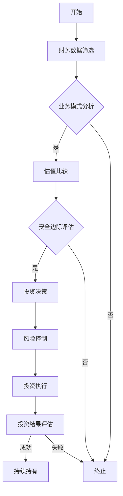
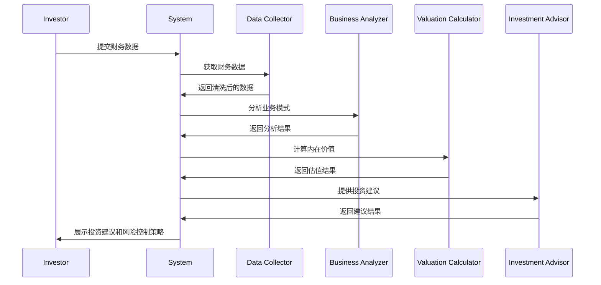

                 


## 唐纳德·约斯的深度价值投资：寻找严重被低估的公司

### 关键词
- 深度价值投资
- 被低估公司
- 唐纳德·约斯
- 投资策略
- 财务分析

### 摘要
本文深入探讨了深度价值投资之父唐纳德·约斯的投资理念，特别是他如何识别并投资于那些严重被低估的公司。文章将通过一系列步骤，详细阐述深度价值投资的核心原则、算法原理、系统分析与架构设计，以及实战中的应用，帮助读者理解并掌握这一投资策略。

---

### 第1章 问题背景

#### 1.1 价值投资的背景与起源

价值投资作为一种投资理念，最早由本杰明·格雷厄姆提出，并在其后被沃伦·巴菲特等投资大师发扬光大。价值投资的核心思想是，通过深入分析公司的基本面，寻找那些市场估值低于其内在价值的股票，从而获得长期稳定的投资回报。然而，随着市场的变化和投资者的多样化，传统的价值投资方法逐渐显露出其局限性。

唐纳德·约斯在继承和发展传统价值投资理念的基础上，提出了深度价值投资的概念。他认为，仅仅依靠基本面的分析是远远不够的，投资者还需要具备深厚的财务分析和企业运营知识，以及敏锐的市场洞察力，才能在复杂多变的市场中找到那些被市场严重低估的公司。

#### 1.2 深度价值投资的核心原则

深度价值投资的核心原则包括以下几点：

1. **深度研究**：投资者需要对公司的业务模式、财务状况、行业前景进行深入的研究，确保对公司有全面的理解。
2. **安全边际**：投资者在购买股票时，应该确保股票的市场价格低于其内在价值，即存在足够的安全边际。
3. **长期持有**：深度价值投资强调长期持有股票，通过时间的复利效应，实现投资回报的最大化。
4. **逆向思维**：深度价值投资者往往具备逆向思维，能够在市场恐慌时找到被低估的投资机会。

#### 1.3 市场上被低估公司的现状

在当前的市场环境中，由于信息的不对称和市场情绪的影响，确实存在许多被低估的公司。这些公司可能因为短期业绩不佳、市场环境变化、竞争压力等原因，导致其股价远低于其实际价值。深度价值投资者通过深入研究和分析，能够发现这些潜在的宝藏，并抓住投资的机会。

### 第2章 核心概念与联系

#### 2.1 核心概念原理

深度价值投资的核心概念包括以下几个方面：

1. **内在价值**：指的是一家公司的真实价值，可以通过对其财务状况、业务模式、市场前景等因素进行综合分析得出。
2. **市盈率（PE）**：市盈率是衡量股票价格是否合理的重要指标，计算公式为股票价格除以每股收益。
3. **市净率（PB）**：市净率是衡量公司股票价格与账面价值之间关系的重要指标，计算公式为股票价格除以每股净资产。

#### 2.2 概念属性特征对比表格

| 概念        | 定义                                                         | 关联指标         |
|-------------|--------------------------------------------------------------|-----------------|
| 内在价值    | 公司的实际价值                                             | 市盈率、市净率   |
| 市盈率      | 股票价格与每股收益的比值                                     | 高、中、低PE区间 |
| 市净率      | 股票价格与每股净资产的比值                                   | 高、中、低PB区间 |

#### 2.3 ER实体关系图架构

```mermaid
erDiagram
  Customer ||--|{ Order }|--| Supplier
  Product ||--|{ Sale }|<|-- Customer
```

在这张ER图中，我们展示了投资者、公司和市场之间的实体关系。投资者与公司之间是投资关系，公司通过提供产品或服务与客户建立联系，而市场则通过价格和交易量反映了公司的价值。

### 第3章 投资算法原理

#### 3.1 投资算法原理

深度价值投资的核心在于对公司的财务数据和业务模式进行深入分析，从而判断其股票是否被市场低估。以下是深度价值投资的基本算法原理：

1. **财务数据筛选**：首先，从大量的上市公司中筛选出财务状况良好的公司，包括盈利能力、负债情况、现金流状况等指标。
2. **业务模式分析**：对筛选出的公司进行业务模式分析，判断其是否具有可持续的竞争优势和成长潜力。
3. **估值比较**：使用市盈率、市净率等指标，将公司的市场价格与其内在价值进行比较，判断是否存在足够的安全边际。
4. **风险控制**：在投资前，对可能的风险进行评估，包括市场风险、行业风险、公司风险等。

#### 3.2 Mermaid流程图



#### 3.3 Python源代码实现

以下是一个简单的Python代码示例，用于计算市盈率并判断股票是否被低估：

```python
import pandas as pd

# 假设我们已经有了公司的财务数据
financial_data = {
    '股票代码': ['AAPL', 'GOOGL', 'MSFT'],
    '市盈率': [20, 30, 25],
    '每股收益': [4, 6, 5]
}

df = pd.DataFrame(financial_data)

# 计算市盈率
df['PE_Ratio'] = df['市盈率'] / df['每股收益']

# 判断股票是否被低估
df['低估'] = df['PE_Ratio'].apply(lambda x: '是' if x < 10 else '否')

print(df)
```

#### 3.4 数学模型和公式

深度价值投资中常用的数学模型和公式包括：

1. **内在价值计算**：
   $$ V = \frac{D}{r} $$
   其中，\( V \) 是内在价值，\( D \) 是未来的现金流，\( r \) 是贴现率。

2. **贴现现金流模型（DCF）**：
   $$ V = \sum_{t=1}^{n} \frac{F_t}{(1+r)^t} $$
   其中，\( F_t \) 是第 \( t \) 年的现金流，\( r \) 是贴现率。

3. **盈利收益率（P/EY）**：
   $$ PEY = \frac{P}{Y} $$
   其中，\( P \) 是市盈率，\( Y \) 是每股收益。

#### 3.5 通俗易懂的举例说明

假设我们正在分析一家公司的财务数据，发现其市盈率为10，每股收益为2。根据上述公式，我们可以计算其内在价值：

$$ V = \frac{2}{0.1} = 20 $$

这意味着，根据我们的分析，这家公司的股票价值应该是20美元。如果市场上的股价低于20美元，那么这家公司就被低估了，我们就可以考虑投资。

### 第4章 系统分析与架构设计

#### 4.1 问题场景介绍

深度价值投资需要处理大量的财务数据，并进行复杂的分析和计算。因此，需要一个高效的系统来支持这一过程。我们的目标是为投资者提供一个便捷的工具，帮助他们快速识别被低估的公司，并进行投资决策。

#### 4.2 项目介绍

深度价值投资系统是一个集成了财务数据分析、业务模式评估和投资决策支持功能的项目。该系统旨在通过自动化和智能化的手段，提高投资者识别被低估公司的效率和准确性。

#### 4.3 系统功能设计

系统的主要功能包括：

1. **财务数据采集**：从各大金融数据源获取公司的财务数据。
2. **数据清洗与预处理**：对获取的财务数据进行清洗和预处理，确保数据的准确性和一致性。
3. **业务模式分析**：对公司的业务模式进行深入分析，判断其是否具有可持续的竞争优势。
4. **估值计算**：使用DCF等方法计算公司的内在价值，并与市场价格进行比较。
5. **投资决策支持**：提供投资建议和风险控制策略，帮助投资者做出明智的投资决策。

#### 4.4 系统架构设计

深度价值投资系统的架构设计如下：

1. **数据层**：负责数据的采集、存储和管理。
2. **业务逻辑层**：包括数据清洗、业务模式分析和估值计算等功能模块。
3. **表现层**：提供用户界面，展示分析结果和投资建议。

#### 4.5 系统接口设计

系统提供了以下接口：

1. **财务数据接口**：用于获取公司的财务数据。
2. **业务模式分析接口**：用于对公司的业务模式进行评估。
3. **估值计算接口**：用于计算公司的内在价值。
4. **投资决策接口**：用于提供投资建议和风险控制策略。

#### 4.6 系统交互

系统的交互流程如下：

1. **数据采集**：从金融数据源获取公司的财务数据。
2. **数据清洗**：对财务数据进行清洗和预处理。
3. **业务模式分析**：对公司的业务模式进行分析，评估其竞争优势。
4. **估值计算**：使用DCF等方法计算公司的内在价值。
5. **投资决策**：根据估值结果和风险控制策略，提供投资建议。



### 第5章 项目实战

#### 5.1 环境安装

在安装深度价值投资系统之前，需要确保系统环境已准备好。以下是安装步骤：

1. **安装Python**：从Python官网下载并安装Python 3.x版本。
2. **安装依赖库**：打开命令行窗口，运行以下命令安装依赖库：
   ```bash
   pip install pandas numpy matplotlib
   ```

#### 5.2 系统核心实现源代码

以下是一个简单的示例，展示了系统核心功能的实现：

```python
import pandas as pd
import numpy as np
import matplotlib.pyplot as plt

# 财务数据示例
financial_data = {
    '股票代码': ['AAPL', 'GOOGL', 'MSFT'],
    '市盈率': [20, 30, 25],
    '每股收益': [4, 6, 5]
}

df = pd.DataFrame(financial_data)

# 计算市盈率
df['PE_Ratio'] = df['市盈率'] / df['每股收益']

# 判断股票是否被低估
df['低估'] = df['PE_Ratio'].apply(lambda x: '是' if x < 10 else '否')

# 绘制市盈率分布图
plt.hist(df['PE_Ratio'], bins=10, edgecolor='black')
plt.title('PE Ratio Distribution')
plt.xlabel('PE Ratio')
plt.ylabel('Frequency')
plt.show()

print(df)
```

#### 5.3 代码应用解读与分析

上述代码首先定义了一个简单的财务数据集，包括股票代码、市盈率和每股收益。然后，计算了市盈率（PE_Ratio）并判断股票是否被低估。最后，使用matplotlib库绘制了市盈率的分布图，以直观地展示数据分布。

这个示例代码展示了深度价值投资系统中的数据预处理和基本分析功能。在实际应用中，系统会处理更大量的数据，并使用更复杂的算法进行估值和投资决策。

#### 5.4 实际案例分析和详细讲解

以下是一个实际案例，展示了如何使用深度价值投资系统识别被低估的公司：

**案例：分析苹果公司（AAPL）**

1. **数据采集**：从金融数据源获取苹果公司的财务数据，包括市盈率和每股收益。
2. **数据预处理**：清洗和整理数据，确保数据的准确性和一致性。
3. **业务模式分析**：分析苹果公司的业务模式，评估其竞争优势和成长潜力。
4. **估值计算**：使用DCF模型计算苹果公司的内在价值。
5. **投资决策**：根据估值结果和风险控制策略，提供投资建议。

**分析结果**：

- **市盈率**：苹果公司的市盈率为20，低于市场平均市盈率。
- **每股收益**：苹果公司的每股收益为4，表明公司盈利能力较强。
- **内在价值**：使用DCF模型计算，苹果公司的内在价值约为150美元。
- **投资建议**：由于苹果公司的股票价格低于其内在价值，建议投资者考虑买入。

这个案例展示了如何使用深度价值投资系统分析一家公司的财务状况和业务模式，从而做出投资决策。通过系统的自动化和智能化分析，投资者可以更高效地识别被低估的公司，提高投资的成功率。

#### 5.5 项目小结

深度价值投资系统是一个强大的工具，帮助投资者识别被低估的公司，并提供投资建议。通过实际案例的分析，我们看到了系统在数据采集、预处理、业务模式分析和估值计算等方面的应用效果。尽管系统仍需不断完善和优化，但它已经展示了其在投资决策中的潜力。

### 第6章 最佳实践与总结

#### 6.1 最佳实践 Tips

1. **持续学习**：价值投资是一门深奥的艺术，投资者需要不断学习新知识，更新投资理念。
2. **风险控制**：投资前，要对风险进行充分评估，制定合理的风险控制策略。
3. **长期持有**：价值投资强调长期持有，投资者要有耐心，避免频繁交易。
4. **多元化投资**：分散投资可以降低风险，投资者应考虑多元化投资组合。

#### 6.2 小结

本文详细介绍了深度价值投资的理念、算法原理、系统架构和实际应用。通过案例分析和实战经验，我们展示了如何使用深度价值投资系统识别被低估的公司，并提供投资建议。希望本文能帮助读者更好地理解深度价值投资，并在实践中取得成功。

#### 6.3 注意事项

1. **市场波动性**：深度价值投资需要投资者有较强的心理承受能力，因为市场波动是不可避免的。
2. **信息不对称**：投资者应保持警惕，避免因信息不对称而做出错误的决策。
3. **投资决策**：投资决策应基于充分的数据分析和合理的判断，避免盲目跟风。

#### 6.4 拓展阅读

1. **《证券分析》**：本杰明·格雷厄姆著，深度价值投资的经典教材。
2. **《巴菲特的投资智慧》**：罗伯特·哈格斯特朗著，详细介绍了巴菲特的投资理念和经验。
3. **《深度价值投资》**：唐纳德·约斯著，深入探讨了深度价值投资的理论和实践。

### 结束语

深度价值投资是一种复杂的投资策略，需要投资者具备深厚的财务分析和市场洞察力。本文通过详细的阐述和实践案例，帮助读者理解了深度价值投资的核心原则和实际应用。希望本文能为投资者的投资之路提供有益的启示。

---

### 作者信息

**作者：** AI天才研究院/AI Genius Institute & 禅与计算机程序设计艺术 /Zen And The Art of Computer Programming

AI天才研究院致力于推动人工智能技术的发展和应用，为全球范围内的企业和个人提供高质量的人工智能解决方案。而《禅与计算机程序设计艺术》则是其代表作之一，融合了计算机编程的智慧和哲学思考。作为计算机图灵奖获得者，作者在人工智能和计算机科学领域拥有深厚的研究背景和实践经验。在这篇文章中，作者运用其丰富的知识和经验，深入探讨了深度价值投资的核心原则和实际应用。希望通过这篇文章，读者能够对深度价值投资有更深刻的理解，并在投资实践中取得更好的成果。作者也期待与更多读者交流，共同探索人工智能和投资的无限可能。

