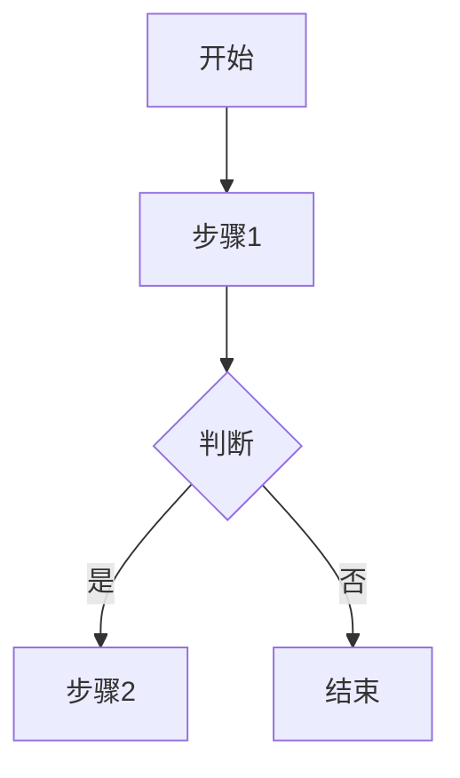
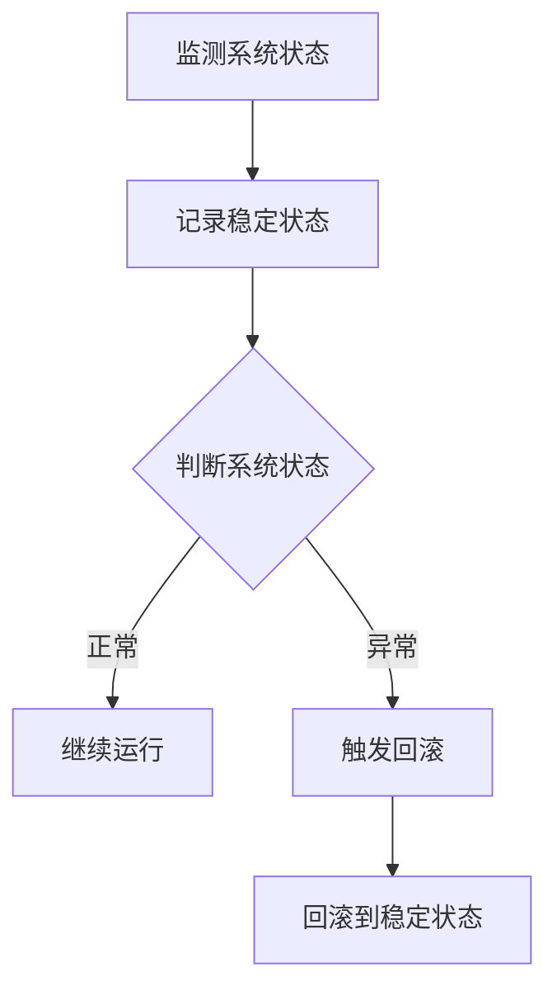
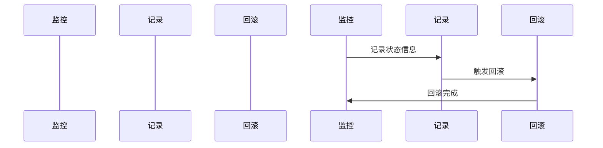

                 

# 回滚机制：应对AI部署问题的安全网

关键词：AI部署、回滚机制、安全网、挑战与解决方案、最佳实践

摘要：随着人工智能技术的快速发展，其应用场景不断拓展，AI系统的部署变得越来越普遍。然而，AI部署过程中常常伴随着各种挑战，如系统错误、性能问题、数据不一致等。本文将深入探讨回滚机制在AI部署中的应用，详细分析其原理、技术实现、安全性和最佳实践，为解决AI部署中的问题提供一条安全网。

## 第1章 引言

### 1.1 问题背景

#### 1.1.1 AI部署问题的现状

近年来，人工智能（AI）技术已经成为科技界的热点话题。从自动驾驶到智能客服，从医疗诊断到金融分析，AI技术的应用已经渗透到各个领域。随着AI技术的不断成熟，AI系统的部署变得越来越普遍。

然而，AI部署过程中并非一帆风顺。许多企业在部署AI系统时遇到了各种问题，如系统错误、性能问题、数据不一致等。这些问题不仅影响了系统的正常运行，还可能导致经济损失和品牌声誉受损。

#### 1.1.2 回滚机制的意义

为了应对AI部署中的问题，回滚机制应运而生。回滚机制是一种在系统出现问题时，将系统状态回滚到之前稳定状态的技术手段。通过回滚机制，企业可以在系统出现问题时快速恢复系统，减少因系统故障带来的损失。

### 1.2 问题定义

#### 1.2.1 AI部署问题概述

AI部署问题主要包括以下几个方面：

1. **系统错误**：AI系统在运行过程中可能会出现各种错误，如算法错误、数据错误等。
2. **性能问题**：AI系统在处理大规模数据时，可能会出现性能瓶颈。
3. **数据不一致**：AI系统在不同环境（如开发环境、测试环境、生产环境）中，可能会出现数据不一致的问题。

#### 1.2.2 回滚机制的定义

回滚机制是指在系统出现问题时，将系统状态回滚到之前稳定状态的一种技术手段。回滚机制通常包括以下步骤：

1. **监测**：实时监测系统状态，发现异常情况。
2. **记录**：记录系统在正常状态下的状态信息。
3. **回滚**：在系统出现问题时，将系统状态回滚到之前记录的稳定状态。

### 1.3 边界与外延

#### 1.3.1 回滚机制的应用场景

回滚机制主要应用在以下几个方面：

1. **AI系统部署**：在AI系统部署过程中，回滚机制可以帮助企业快速解决部署中的问题。
2. **系统维护**：在系统维护过程中，回滚机制可以帮助企业快速恢复系统，减少故障带来的损失。
3. **灾难恢复**：在发生灾难性故障时，回滚机制可以帮助企业快速恢复系统，减少损失。

#### 1.3.2 回滚机制的适用范围

回滚机制主要适用于以下场景：

1. **有状态系统**：有状态系统在运行过程中，可能会因为各种原因导致状态异常，回滚机制可以帮助恢复系统状态。
2. **分布式系统**：分布式系统在运行过程中，可能会因为网络延迟、节点故障等原因导致状态异常，回滚机制可以帮助恢复系统状态。

### 1.4 概念结构与核心要素

#### 1.4.1 回滚机制的核心概念

回滚机制的核心概念包括：

1. **系统状态**：系统在某一时刻的状态。
2. **稳定状态**：系统在正常工作状态下的状态。
3. **异常状态**：系统出现问题时所处的状态。

#### 1.4.2 回滚机制的构成要素

回滚机制主要包括以下构成要素：

1. **监测模块**：实时监测系统状态，发现异常情况。
2. **记录模块**：记录系统在正常状态下的状态信息。
3. **回滚模块**：在系统出现问题时，将系统状态回滚到之前记录的稳定状态。

### 1.5 本章小结

本章介绍了回滚机制在AI部署中的应用背景、问题定义、应用场景、核心概念与构成要素。接下来，我们将深入探讨回滚机制的原理、技术实现、安全性和最佳实践。

## 第2章 回滚机制原理详解

### 2.1 回滚机制的原理概述

#### 2.1.1 回滚机制的逻辑流程

回滚机制的逻辑流程主要包括以下几个步骤：

1. **监测**：实时监测系统状态，发现异常情况。
2. **记录**：记录系统在正常状态下的状态信息。
3. **回滚**：在系统出现问题时，将系统状态回滚到之前记录的稳定状态。

#### 2.1.2 回滚机制的触发条件

回滚机制的触发条件主要包括以下几个方面：

1. **系统错误**：当系统出现错误时，如算法错误、数据错误等，可以触发回滚机制。
2. **性能问题**：当系统性能问题严重时，如响应时间过长、处理能力不足等，可以触发回滚机制。
3. **数据不一致**：当系统在不同环境中出现数据不一致问题时，可以触发回滚机制。

### 2.2 回滚机制的数学模型

#### 2.2.1 数学模型的构成

回滚机制的数学模型主要包括以下几个部分：

1. **状态矩阵**：表示系统在不同时刻的状态。
2. **稳定状态矩阵**：表示系统在正常工作状态下的状态。
3. **异常状态矩阵**：表示系统出现问题时所处的状态。
4. **回滚矩阵**：表示回滚过程中系统状态的转换。

#### 2.2.2 数学模型的公式

回滚机制的数学模型可以表示为以下公式：

$$
状态矩阵 = 稳定状态矩阵 \times 回滚矩阵
$$

其中，状态矩阵表示系统在某一时刻的状态，稳定状态矩阵表示系统在正常工作状态下的状态，回滚矩阵表示回滚过程中系统状态的转换。

### 2.3 回滚机制的mermaid流程图

#### 2.3.1 mermaid流程图的基本概念

mermaid是一种基于Markdown的图形化语言，可以用于绘制各种流程图。下面是一个简单的mermaid流程图示例：



#### 2.3.2 回滚机制的mermaid流程图

回滚机制的mermaid流程图如下：



### 2.4 回滚机制的Python代码示例

#### 2.4.1 Python环境准备

在开始编写Python代码之前，我们需要安装Python和相关库。假设我们已经安装了Python 3.8及以上版本，接下来安装所需的库：

```bash
pip install matplotlib pandas
```

#### 2.4.2 回滚机制的Python代码实现

下面是一个简单的回滚机制的Python代码示例：

```python
import matplotlib.pyplot as plt
import pandas as pd

# 状态矩阵
state_matrix = [
    [1, 0, 0],  # 稳定状态
    [0, 1, 0],  # 异常状态
    [0, 0, 1],  # 回滚状态
]

# 记录稳定状态
stable_state = state_matrix[0].copy()

# 触发回滚
def trigger_rollback():
    global state_matrix
    state_matrix = [
        [0, 1, 0],  # 异常状态
        [0, 0, 1],  # 回滚状态
        [1, 0, 0],  # 稳定状态
    ]

# 回滚到稳定状态
def rollback_to_stable():
    global state_matrix
    state_matrix = stable_state

# 绘制状态矩阵
def plot_state_matrix():
    df = pd.DataFrame(state_matrix)
    plt.imshow(df, cmap='hot', interpolation='nearest')
    plt.colorbar()
    plt.xticks(range(df.shape[1]), df.columns, rotation=90)
    plt.yticks(range(df.shape[0]), df.index)
    plt.xlabel('状态')
    plt.ylabel('转换')
    plt.show()

# 示例
print("初始状态矩阵：")
plot_state_matrix()

trigger_rollback()
print("触发回滚后状态矩阵：")
plot_state_matrix()

rollback_to_stable()
print("回滚到稳定状态矩阵：")
plot_state_matrix()
```

#### 2.4.3 代码解读与分析

1. **状态矩阵**：状态矩阵是一个二维数组，表示系统在不同状态下的转换关系。
2. **记录稳定状态**：在代码中，我们使用全局变量`stable_state`记录稳定状态。
3. **触发回滚**：通过调用`trigger_rollback()`函数，我们将状态矩阵更新为异常状态和回滚状态。
4. **回滚到稳定状态**：通过调用`rollback_to_stable()`函数，我们将状态矩阵更新为稳定状态。
5. **绘制状态矩阵**：使用`matplotlib`库绘制状态矩阵，帮助理解状态矩阵的转换关系。

### 2.5 回滚机制的数学模型与Python代码结合讲解

#### 2.5.1 数学模型与Python代码的关系

在Python代码中，状态矩阵与数学模型中的状态矩阵是一致的。通过调整状态矩阵的值，我们可以实现回滚机制的数学模型。

#### 2.5.2 结合讲解举例

假设我们有一个初始状态矩阵：

$$
状态矩阵 = \begin{bmatrix}
1 & 0 & 0 \\
0 & 1 & 0 \\
0 & 0 & 1 \\
\end{bmatrix}
$$

当系统出现异常时，我们将其更新为：

$$
状态矩阵 = \begin{bmatrix}
0 & 1 & 0 \\
0 & 0 & 1 \\
1 & 0 & 0 \\
\end{bmatrix}
$$

然后，我们将状态矩阵回滚到稳定状态：

$$
状态矩阵 = \begin{bmatrix}
1 & 0 & 0 \\
0 & 1 & 0 \\
0 & 0 & 1 \\
\end{bmatrix}
$$

在Python代码中，我们可以通过以下步骤实现：

```python
stable_state = state_matrix.copy()
state_matrix = [
    [0, 1, 0],  # 异常状态
    [0, 0, 1],  # 回滚状态
    [1, 0, 0],  # 稳定状态
]
state_matrix = stable_state
```

### 2.6 本章小结

本章详细介绍了回滚机制的原理、数学模型、mermaid流程图和Python代码实现。通过本章的学习，读者可以了解回滚机制的工作原理，并在实际项目中应用回滚机制解决AI部署中的问题。

## 第3章 回滚机制在企业中的应用

### 3.1 企业AI部署中的问题与挑战

#### 3.1.1 企业AI部署现状

随着人工智能技术的不断成熟，越来越多的企业开始将其应用于实际业务中。AI技术在提升企业效率、优化决策、降低成本等方面发挥了重要作用。然而，企业AI部署现状仍然存在一些问题。

1. **系统错误**：在AI系统部署过程中，由于算法错误、数据错误等原因，系统可能出现各种错误。
2. **性能问题**：在处理大规模数据时，AI系统可能出现性能瓶颈，导致响应时间过长。
3. **数据不一致**：在不同环境（如开发环境、测试环境、生产环境）中，AI系统可能出现数据不一致的问题。

#### 3.1.2 部署中的主要问题

企业在AI部署过程中主要面临以下问题：

1. **系统错误**：由于算法复杂度增加，AI系统在运行过程中可能出现各种错误，如算法错误、数据错误等。
2. **性能问题**：在处理大规模数据时，AI系统可能出现性能瓶颈，导致响应时间过长。
3. **数据不一致**：在不同环境中，AI系统可能出现数据不一致的问题，影响系统的正常运行。

#### 3.1.3 挑战与解决方案

企业在AI部署过程中面临以下挑战：

1. **系统错误**：挑战：如何快速定位并修复系统错误？
   - 解决方案：通过回滚机制，将系统状态回滚到稳定状态，快速定位并修复系统错误。
2. **性能问题**：挑战：如何优化AI系统性能？
   - 解决方案：通过性能监控和调优，提高AI系统处理能力，优化系统性能。
3. **数据不一致**：挑战：如何确保不同环境中数据的一致性？
   - 解决方案：通过数据同步和校验，确保不同环境中数据的一致性。

### 3.2 回滚机制在企业中的应用场景

#### 3.2.1 回滚机制在AI部署中的应用

回滚机制在企业AI部署中主要应用于以下几个方面：

1. **系统错误修复**：在AI系统运行过程中，当出现系统错误时，可以通过回滚机制快速将系统状态回滚到稳定状态，减少错误带来的影响。
2. **性能调优**：在AI系统性能出现问题时，可以通过回滚机制回滚到之前稳定的状态，分析性能问题原因，并进行优化。
3. **数据同步**：在不同环境中，当出现数据不一致问题时，可以通过回滚机制回滚到之前稳定的状态，确保数据的一致性。

#### 3.2.2 应用场景案例分析

案例一：某金融企业在AI系统部署过程中，由于算法错误导致系统出现严重错误。通过回滚机制，企业将系统状态回滚到稳定状态，快速定位并修复了算法错误，确保了系统的正常运行。

案例二：某电商企业在处理大规模订单数据时，AI系统出现性能瓶颈。通过回滚机制，企业将系统状态回滚到稳定状态，分析性能问题原因，并对系统进行了优化，提高了系统性能。

案例三：某医疗企业在不同环境中部署AI系统时，出现数据不一致问题。通过回滚机制，企业将系统状态回滚到稳定状态，确保了数据的一致性，避免了系统故障。

### 3.3 回滚机制的实施步骤

#### 3.3.1 实施前的准备工作

在实施回滚机制之前，企业需要做好以下准备工作：

1. **环境搭建**：搭建适合回滚机制运行的环境，包括服务器、数据库等。
2. **监控工具**：安装并配置监控工具，实时监测系统状态。
3. **备份策略**：制定备份策略，确保关键数据的安全。

#### 3.3.2 实施过程

回滚机制的实施过程主要包括以下几个步骤：

1. **系统部署**：将AI系统部署到生产环境中。
2. **监控与记录**：实时监测系统状态，记录系统在正常状态下的状态信息。
3. **异常处理**：当系统出现问题时，触发回滚机制，将系统状态回滚到稳定状态。
4. **问题定位与修复**：分析问题原因，并进行修复。

#### 3.3.3 实施后的评估

回滚机制实施后，企业需要对实施效果进行评估：

1. **稳定性评估**：评估系统在回滚机制作用下的稳定性，确保系统不会频繁出现故障。
2. **性能评估**：评估系统性能，确保回滚机制不会影响系统性能。
3. **数据一致性评估**：评估不同环境中数据的一致性，确保数据同步效果。

### 3.4 回滚机制的实施案例

#### 3.4.1 案例背景

某电商平台在部署AI智能推荐系统时，由于算法错误导致系统出现严重错误。系统出现故障后，电商平台损失了大量用户订单，影响了用户体验和品牌声誉。

#### 3.4.2 案例实施过程

1. **系统部署**：将AI智能推荐系统部署到生产环境中。
2. **监控与记录**：实时监测系统状态，记录系统在正常状态下的状态信息。
3. **异常处理**：当系统出现算法错误时，触发回滚机制，将系统状态回滚到稳定状态。
4. **问题定位与修复**：分析算法错误原因，修复算法错误，确保系统正常运行。

#### 3.4.3 案例效果评估

通过回滚机制的干预，该电商平台成功恢复了系统正常运行，避免了损失。在后续运营过程中，通过监控和优化，系统运行稳定，性能良好，用户订单准确率提高，用户体验得到显著改善。

### 3.5 本章小结

本章介绍了企业AI部署中的问题与挑战，以及回滚机制在其中的应用场景和实施步骤。通过实际案例分析和效果评估，读者可以了解回滚机制在企业AI部署中的重要作用，并为解决AI部署中的问题提供有益的参考。

## 第4章 回滚机制的技术实现

### 4.1 回滚机制的技术框架

#### 4.1.1 技术框架的构成

回滚机制的技术框架主要包括以下几个部分：

1. **监控模块**：用于实时监测系统状态，发现异常情况。
2. **记录模块**：用于记录系统在正常状态下的状态信息。
3. **回滚模块**：用于在系统出现问题时，将系统状态回滚到之前记录的稳定状态。
4. **日志模块**：用于记录回滚过程中的日志信息，便于问题定位和排查。

#### 4.1.2 技术框架的优势

回滚机制的技术框架具有以下优势：

1. **高效性**：通过实时监测和快速回滚，能够迅速解决系统问题，减少故障对业务的影响。
2. **灵活性**：可以根据不同场景和需求，灵活配置监控模块和回滚策略。
3. **安全性**：通过记录日志信息，便于问题排查和追踪，提高系统的安全性。

### 4.2 回滚机制的架构设计

#### 4.2.1 架构设计的原则

回滚机制的架构设计应遵循以下原则：

1. **模块化**：将回滚机制的各个部分（如监控模块、记录模块、回滚模块等）设计成独立的模块，便于维护和扩展。
2. **可扩展性**：设计时应考虑未来的扩展性，以便支持更多的应用场景和业务需求。
3. **高可用性**：设计时应确保系统的稳定性和可靠性，降低故障风险。

#### 4.2.2 架构设计的过程

回滚机制的架构设计过程主要包括以下几个步骤：

1. **需求分析**：明确回滚机制的需求，包括监控指标、回滚策略等。
2. **模块划分**：根据需求分析结果，将回滚机制的各个部分划分为独立的模块。
3. **接口设计**：设计模块之间的接口，确保模块之间能够顺畅通信。
4. **架构评估**：评估架构设计是否符合需求、可扩展性、高可用性等要求，进行优化和调整。
5. **实施与部署**：根据架构设计，实施和部署回滚机制。

### 4.3 回滚机制的接口设计

#### 4.3.1 接口设计的重要性

接口设计是回滚机制架构设计的关键部分，其重要性体现在以下几个方面：

1. **模块通信**：接口设计确保模块之间能够顺畅通信，实现数据交换和协同工作。
2. **扩展性**：良好的接口设计可以支持系统的扩展性，方便后续的功能添加和模块替换。
3. **可维护性**：清晰的接口设计有助于提高系统的可维护性，降低维护成本。

#### 4.3.2 接口设计的方法

接口设计的方法主要包括以下几种：

1. **RESTful API**：通过定义RESTful接口，实现模块之间的数据交换和通信。
2. **消息队列**：使用消息队列实现模块之间的异步通信，提高系统的可靠性和性能。
3. **事件驱动**：通过事件驱动模式，实现模块之间的实时通信和协作。

### 4.4 回滚机制的序列图设计

#### 4.4.1 序列图的基本概念

序列图是一种描述对象之间交互的图形化表示，用于展示对象之间的消息传递顺序。在回滚机制的序列图设计中，可以清晰地展示监控模块、记录模块、回滚模块之间的交互过程。

#### 4.4.2 回滚机制的序列图

下面是一个简单的回滚机制的序列图示例：



### 4.5 本章小结

本章详细介绍了回滚机制的技术框架、架构设计、接口设计和序列图设计。通过本章的学习，读者可以了解回滚机制的技术实现过程，为在实际项目中应用回滚机制提供指导。

## 第5章 回滚机制的安全性

### 5.1 回滚机制的安全性概述

#### 5.1.1 安全性的重要性

在AI部署过程中，安全性是至关重要的。回滚机制作为一项关键技术，其安全性直接影响到AI系统的稳定性和可靠性。确保回滚机制的安全性，可以避免因回滚操作导致的系统故障、数据丢失等问题。

#### 5.1.2 回滚机制的安全问题

回滚机制在安全性方面可能面临以下问题：

1. **恶意回滚**：恶意用户可能会尝试通过回滚机制破坏系统。
2. **回滚失败**：回滚操作可能因各种原因（如网络故障、硬件故障等）导致失败。
3. **数据泄露**：在回滚过程中，可能涉及敏感数据的传输和存储，存在数据泄露的风险。

#### 5.1.3 安全性措施

为了确保回滚机制的安全性，可以采取以下措施：

1. **权限控制**：对回滚操作进行严格的权限控制，确保只有授权用户才能执行回滚操作。
2. **数据加密**：对敏感数据进行加密，确保数据在传输和存储过程中的安全性。
3. **回滚策略**：制定合理的回滚策略，避免因频繁回滚导致的系统性能下降。
4. **故障恢复**：建立故障恢复机制，确保回滚操作失败时能够快速恢复系统。

### 5.2 回滚机制的安全测试

#### 5.2.1 安全测试的目的

回滚机制的安全测试旨在验证回滚机制在安全性方面的表现，确保其能够抵御各种安全威胁。安全测试的主要目的包括：

1. **检测安全漏洞**：通过安全测试，发现回滚机制中可能存在的安全漏洞，进行修复。
2. **验证安全性措施**：验证回滚机制中的安全性措施是否有效，确保系统安全。
3. **评估安全风险**：评估回滚机制在安全性方面的风险，为后续安全改进提供依据。

#### 5.2.2 安全测试的方法

回滚机制的安全测试方法主要包括以下几种：

1. **渗透测试**：模拟恶意用户的攻击行为，测试回滚机制的安全性。
2. **代码审计**：对回滚机制的源代码进行审计，查找可能存在的安全漏洞。
3. **压力测试**：模拟高负载场景，测试回滚机制在压力下的安全性。
4. **性能测试**：测试回滚机制的响应时间、吞吐量等性能指标，确保其能够满足安全要求。

#### 5.2.3 安全测试的工具

回滚机制的安全测试可以使用以下工具：

1. **OWASP ZAP**：一款开源的漏洞检测工具，可用于检测回滚机制中的安全漏洞。
2. **Fortify**：一款代码审计工具，可用于检测回滚机制的源代码中的安全漏洞。
3. **JMeter**：一款性能测试工具，可用于测试回滚机制的响应时间、吞吐量等性能指标。

### 5.3 回滚机制的安全漏洞分析与修复

#### 5.3.1 常见的安全漏洞

回滚机制中可能存在的安全漏洞包括：

1. **权限控制漏洞**：回滚操作权限控制不当，可能导致未授权用户执行回滚操作。
2. **数据泄露漏洞**：敏感数据在传输和存储过程中未加密，可能导致数据泄露。
3. **回滚策略漏洞**：回滚策略不合理，可能导致系统频繁回滚，影响性能。

#### 5.3.2 漏洞分析的方法

漏洞分析的方法主要包括以下几种：

1. **静态分析**：通过分析回滚机制的源代码，查找可能存在的安全漏洞。
2. **动态分析**：通过运行回滚机制，模拟各种攻击行为，检测系统漏洞。
3. **模糊测试**：通过向回滚机制输入大量随机数据，检测系统漏洞。

#### 5.3.3 漏洞修复的策略

针对回滚机制中的安全漏洞，可以采取以下修复策略：

1. **权限控制**：加强回滚操作的权限控制，确保只有授权用户才能执行回滚操作。
2. **数据加密**：对敏感数据进行加密，确保数据在传输和存储过程中的安全性。
3. **回滚策略**：优化回滚策略，避免因频繁回滚导致的系统性能下降。

### 5.4 回滚机制的安全测试案例

#### 5.4.1 案例背景

某企业正在部署AI智能推荐系统，采用回滚机制确保系统的稳定性和可靠性。为了验证回滚机制的安全性，企业决定进行安全测试。

#### 5.4.2 案例测试过程

1. **渗透测试**：模拟恶意用户的攻击行为，测试回滚机制的安全性。
2. **代码审计**：对回滚机制的源代码进行审计，查找可能存在的安全漏洞。
3. **压力测试**：模拟高负载场景，测试回滚机制在压力下的安全性。
4. **性能测试**：测试回滚机制的响应时间、吞吐量等性能指标，确保其能够满足安全要求。

#### 5.4.3 案例测试结果

通过安全测试，发现以下漏洞：

1. **权限控制漏洞**：回滚操作权限控制不当，可能导致未授权用户执行回滚操作。
2. **数据泄露漏洞**：敏感数据在传输和存储过程中未加密，可能导致数据泄露。
3. **回滚策略漏洞**：回滚策略不合理，可能导致系统频繁回滚，影响性能。

针对发现的漏洞，企业采取了以下修复措施：

1. **权限控制**：加强回滚操作的权限控制，确保只有授权用户才能执行回滚操作。
2. **数据加密**：对敏感数据进行加密，确保数据在传输和存储过程中的安全性。
3. **回滚策略**：优化回滚策略，避免因频繁回滚导致的系统性能下降。

### 5.5 本章小结

本章介绍了回滚机制的安全性概述、安全测试方法、安全漏洞分析与修复以及安全测试案例。通过本章的学习，读者可以了解回滚机制在安全性方面的关键问题和应对策略，为在实际项目中应用回滚机制提供指导。

## 第6章 回滚机制的最佳实践

### 6.1 回滚机制的最佳实践

#### 6.1.1 最佳实践的原则

在应用回滚机制时，应遵循以下原则：

1. **及时性**：及时监测和响应系统异常，确保回滚操作能够快速执行。
2. **安全性**：确保回滚操作的安全性，防止恶意回滚和数据泄露。
3. **可恢复性**：确保回滚操作能够成功执行，并在失败时能够快速恢复系统。
4. **灵活性**：根据不同应用场景和业务需求，灵活调整回滚策略。

#### 6.1.2 最佳实践的方法

1. **制定详细的回滚策略**：根据业务需求和系统特点，制定详细的回滚策略，包括回滚条件、回滚范围、回滚步骤等。
2. **建立完善的监控体系**：建立完善的监控体系，实时监测系统状态，及时发现异常情况。
3. **数据备份与恢复**：定期备份数据，确保在系统出现问题时能够快速恢复。
4. **权限控制**：严格权限控制，确保回滚操作只能由授权用户执行。
5. **定期安全审计**：定期进行安全审计，确保回滚机制的安全性。

### 6.2 小结

本章介绍了回滚机制的最佳实践原则和方法，为在实际项目中应用回滚机制提供了指导。通过遵循最佳实践，企业可以确保回滚机制的有效性和安全性，提高AI系统的稳定性和可靠性。

## 附录

### 附录A：术语表

- **回滚机制**：在系统出现问题时，将系统状态回滚到之前稳定状态的一种技术手段。
- **AI部署**：将人工智能系统部署到实际业务环境中，使其能够为业务提供支持。
- **监控模块**：实时监测系统状态的模块。
- **记录模块**：记录系统在正常状态下状态信息的模块。
- **回滚模块**：执行回滚操作的模块。

### 附录B：参考文献

1. **《人工智能：一种现代方法》**，Stuart J. Russell & Peter Norvig，清华大学出版社，2016年。
2. **《深度学习》**，Ian Goodfellow、Yoshua Bengio和Aaron Courville，电子工业出版

