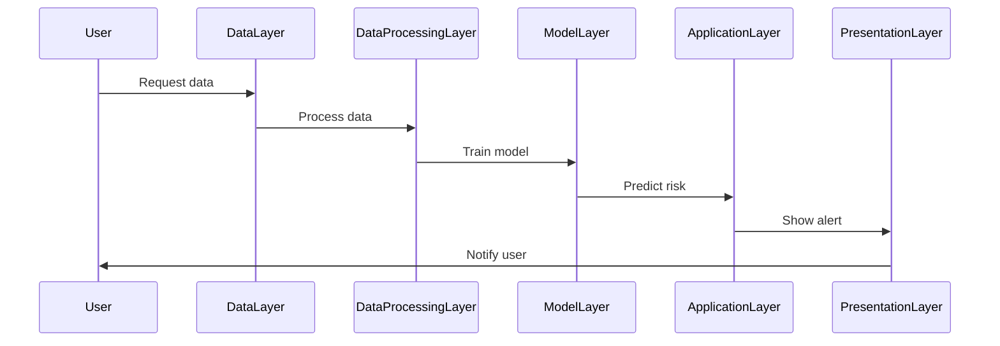
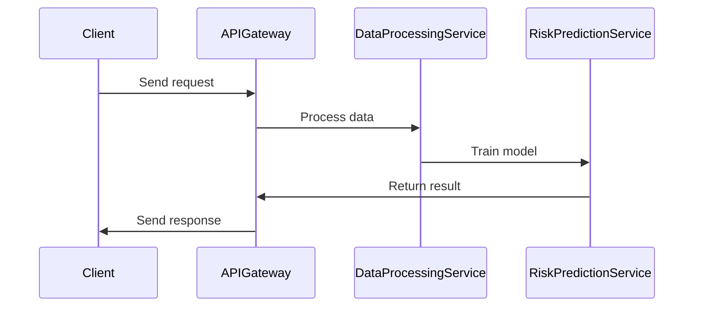
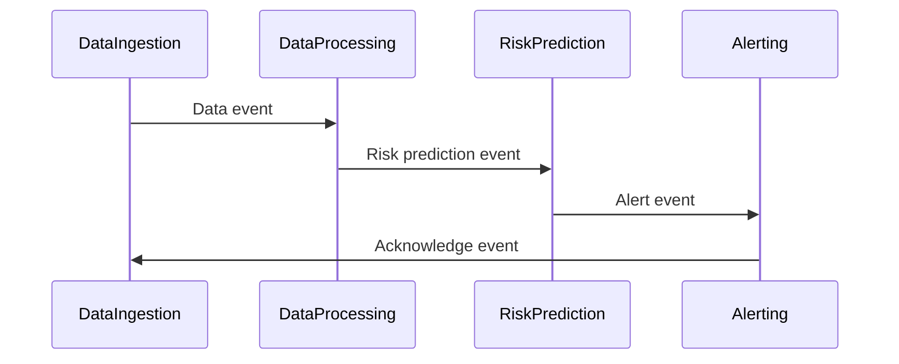

                 

### 在AI应用中遵守金融法规的重要性与方法

---

#### 关键词：人工智能、金融法规、合规性、隐私保护、算法偏见、市场操纵

---

#### 摘要：
本文旨在深入探讨在人工智能（AI）应用于金融行业的背景下，遵守相关法规的重要性及其实施方法。随着AI技术的不断进步，金融行业对其的依赖日益加深，但随之而来的合规性挑战也愈加复杂。本文将通过逐步分析，阐述AI在金融领域应用中的主要挑战，分析相关法规的核心要求，探讨如何设计出一种平衡技术进步与法规遵守的方法，并提供相关的实践建议。

---

### 第一部分：背景介绍

#### 1.1 问题背景

随着人工智能技术的飞速发展，其在金融行业的应用已经越来越广泛。从风险管理的自动化决策，到信用评估的精准预测，再到算法交易的实时响应，AI技术极大地提升了金融服务的效率和质量。然而，金融行业作为一个高度监管的行业，其业务操作和数据处理必须严格遵守相关法律法规。这些法规包括但不限于《数据保护法案》（Data Protection Act）、《金融服务和市场法规》（Financial Services and Markets Act）以及各种市场操纵防范条例等。

#### 1.1.1 金融行业与人工智能技术

金融行业之所以能够大规模应用AI技术，得益于其自身数据密集、算法驱动等特点。金融机构积累了大量的客户数据、交易数据、市场数据等，这些数据为AI算法提供了丰富的训练素材。同时，金融行业对于精确决策和快速响应的需求，也推动了AI技术的不断进步和应用。

#### 1.1.2 金融法规对AI应用的约束

金融法规的核心在于保障金融市场的公平、透明和稳定。AI技术的应用，可能会引发一系列合规性问题，例如数据隐私侵犯、算法偏见、市场操纵等。为了解决这些问题，金融法规对AI应用提出了严格的要求，包括数据保护、算法透明度、合规性审计等。

#### 1.1.3 遵守金融法规的重要性

遵守金融法规对于金融行业的AI应用至关重要。首先，它能够保障客户的隐私和安全，避免因数据泄露或滥用导致的信任危机。其次，它能够避免因算法偏见或市场操纵引发的公平性问题，保障市场的透明度和稳定性。最后，合规性是金融机构合规审查和监管合规的关键要素，不合规可能导致罚款、业务中断等严重后果。

#### 1.2 问题描述

在AI应用中，金融法规的合规性问题主要集中在以下几个方面：

1. **数据隐私**：AI应用通常需要处理大量的个人和交易数据，这些数据必须得到严格保护，以防止泄露或滥用。

2. **算法偏见**：AI算法在学习和预测过程中可能会引入偏见，导致不公平或歧视性决策。

3. **市场操纵**：AI算法在交易决策中的应用，可能会导致市场操纵行为，影响市场公平性。

4. **合规性审计**：金融机构需要定期进行合规性审计，以证明其AI应用符合相关法规要求。

#### 1.2.1 AI应用中的常见挑战

1. **隐私侵犯**：AI算法在处理数据时，可能会无意中泄露个人隐私信息。

2. **算法偏见**：数据集的选择和清洗方式可能引入偏见，影响算法的公平性和准确性。

3. **市场操纵**：AI算法的决策过程可能不够透明，难以追踪和审计。

4. **合规性检查**：金融法规要求定期进行合规性检查，但传统的合规性检查方法可能难以适应AI应用的特点。

#### 1.2.2 金融法规的合规性问题

金融法规对AI应用的要求主要体现在以下几个方面：

1. **数据保护**：确保个人和交易数据得到严格保护，防止未经授权的访问和使用。

2. **算法透明度**：确保算法决策过程透明，可追踪和可审计。

3. **合规性审计**：定期进行合规性审计，证明AI应用符合相关法规要求。

4. **市场操纵防范**：防止AI算法引发的市场操纵行为，保障市场公平性。

#### 1.2.3 现有解决方法的局限性

现有解决方法主要包括以下几种：

1. **数据加密**：通过数据加密技术保护数据隐私，但无法完全避免数据泄露。

2. **算法透明化**：通过公开算法源代码和决策过程，提高算法透明度，但难以应对复杂的AI算法。

3. **合规性培训**：定期对员工进行合规性培训，提高合规意识，但难以确保所有员工都能严格遵守规定。

4. **技术审计**：通过技术手段进行合规性审计，但可能难以发现深层次的合规性问题。

#### 1.3 问题解决

为了在AI应用中有效遵守金融法规，需要设计出一套综合性的合规性框架，包括以下几个方面：

1. **合规性框架设计**：明确合规性要求，制定具体的合规性标准和流程。

2. **合规性检查机制**：建立自动化合规性检查机制，实时监测AI应用的合规性。

3. **算法透明度和可追溯性**：确保算法决策过程透明，可追踪和可审计。

4. **持续合规性培训**：定期对员工进行合规性培训，提高合规意识。

5. **合规性审计**：定期进行合规性审计，确保AI应用符合法规要求。

#### 1.4 边界与外延

本章节主要探讨了在AI应用于金融行业时，遵守金融法规的重要性及其实施方法。未来研究可以进一步探讨以下方向：

1. **AI算法的伦理问题**：研究AI算法在金融领域应用中的伦理问题，例如算法偏见、隐私侵犯等。

2. **监管科技（RegTech）的应用**：探讨监管科技在提升金融法规合规性方面的作用。

3. **跨境合规性挑战**：分析不同国家和地区金融法规的差异，探讨跨境合规性解决方案。

#### 1.5 概念结构与核心要素组成

- **核心概念**：金融法规、人工智能、合规性、隐私保护、算法偏见、市场操纵
- **概念属性特征对比表格**：对比不同金融法规的核心要求，分析其差异和共同点。
- **ER实体关系图架构**：绘制金融法规与AI应用之间的实体关系图，明确不同实体之间的关系和交互。

### 目录大纲：

----------------------------------------------------------------
## 第一部分：背景介绍

### 1.1 问题背景
#### 1.1.1 金融行业与人工智能技术
#### 1.1.2 金融法规对AI应用的约束
#### 1.1.3 遵守金融法规的重要性

### 1.2 问题描述
#### 1.2.1 AI应用中的常见挑战
#### 1.2.2 金融法规的合规性问题
#### 1.2.3 现有解决方法的局限性

### 1.3 问题解决
#### 1.3.1 设计合规性框架
#### 1.3.2 实施合规性检查
#### 1.3.3 保障技术进步与法规遵守的平衡

### 1.4 边界与外延
#### 1.4.1 AI在金融应用的主要领域
#### 1.4.2 法规遵守的挑战与机遇

### 1.5 概念结构与核心要素组成
#### 1.5.1 核心概念
#### 1.5.2 概念属性特征对比表格
#### 1.5.3 ER实体关系图架构

----------------------------------------------------------------
---

接下来，我们将进入第二部分，深入探讨核心概念及其联系。

---

## 第二部分：核心概念与联系

在探讨AI应用中的合规性问题时，我们需要首先理解几个核心概念：金融法规、人工智能、合规性、隐私保护、算法偏见和市场操纵。这些概念在金融行业的AI应用中起着至关重要的作用，它们之间的相互关系和相互作用决定了AI技术能否在遵守法规的同时实现其潜力。

### 2.1 核心概念

#### 2.1.1 金融法规

金融法规是一系列法律法规、监管标准和行业准则，旨在保障金融市场的公平、透明和稳定。这些法规涵盖了银行、证券、保险等多个金融领域，包括《数据保护法案》（DPA）、《通用数据保护条例》（GDPR）和《金融市场行为监管局规则》（FCA）等。金融法规的主要目的是保护消费者权益、防止金融欺诈、保障金融市场的正常运作。

#### 2.1.2 人工智能

人工智能（AI）是指计算机系统能够模拟人类智能行为的技术。AI技术包括机器学习、深度学习、自然语言处理、计算机视觉等多个领域，这些技术使得计算机能够从数据中学习、推理和决策。AI在金融行业中的应用非常广泛，包括风险管理、信用评估、算法交易、客户服务等多个方面。

#### 2.1.3 合规性

合规性是指组织或个体遵循相关法律法规、监管标准和行业准则的程度。在金融行业的AI应用中，合规性至关重要，因为它涉及到数据隐私保护、算法透明度、市场操纵防范等多个方面。合规性不仅是对法规的遵守，还包括对合规性管理体系的设计和实施。

#### 2.1.4 隐私保护

隐私保护是指保护个人数据不被未经授权的访问和使用。在AI应用中，隐私保护尤为重要，因为AI系统通常需要处理大量的个人数据，如交易记录、客户信息等。隐私保护涉及数据加密、访问控制、数据脱敏等多种技术手段。

#### 2.1.5 算法偏见

算法偏见是指AI算法在学习和决策过程中引入的偏见，可能导致不公平或歧视性的决策。算法偏见可能是由于数据集中的偏差、训练过程的缺陷或算法设计的问题。在金融行业中，算法偏见可能会影响信用评估、投资决策等关键领域。

#### 2.1.6 市场操纵

市场操纵是指通过不正当手段影响市场价格或交易量，以谋取非法利益的行为。在AI应用中，市场操纵可能通过自动化交易算法实现，这些算法可能利用市场信息的不对称性或执行快速交易策略。

### 2.2 概念属性特征对比表格

为了更好地理解这些核心概念，我们可以通过一个对比表格来分析它们的主要属性和特征。

| 概念          | 定义                                                         | 主要属性                | 关联关系                                  |
| ------------- | ------------------------------------------------------------ | --------------------- | ---------------------------------------- |
| 金融法规      | 调整金融市场活动的法律和监管要求                             | 法律约束、监管透明、合规性 | 对AI应用有约束和指导作用                   |
| 人工智能      | 能够模仿和执行人类智能任务的计算机系统                       | 自学习、自动化、高效率   | 需要符合金融法规要求，确保合规性             |
| 合规性        | 机构遵循相关法律法规和行业标准的能力                         | 法律遵循、风险管理、信任  | 确保 AI 应用的合法性，维护市场稳定           |
| 隐私保护      | 保护个人数据和隐私，防止未经授权的访问和使用                 | 数据加密、隐私政策、访问控制 | 保障用户权益，避免数据泄露                   |
| 算法偏见      | AI 算法在学习和决策过程中引入的偏见，可能导致不公平或歧视性决策 | 数据偏差、算法缺陷       | 影响 AI 应用结果的公平性和准确性             |
| 市场操纵      | 通过不正当手段影响市场价格或交易量，以谋取非法利益的行为       | 不公平竞争、非法获利     | 需要通过合规性和监管措施防范                 |

### 2.3 ER实体关系图架构

为了更直观地理解金融法规与AI应用之间的关系，我们可以通过ER（实体关系）图来表示。

```mermaid
erDiagram
  AI应用 ||--o{ 金融法规 }|-- AI合规性
  数据隐私 ||--o{ 金融法规 }|-- AI合规性
  算法偏见 ||--o{ 金融法规 }|-- AI合规性
  市场操纵 ||--o{ 金融法规 }|-- AI合规性
  AI应用 ..|> 隐私保护
  AI应用 ..|> 算法偏见
  AI应用 ..|> 市场操纵
```

在这个ER图中，"AI应用"是核心实体，它与其他实体如"金融法规"、"数据隐私"、"算法偏见"和"市场操纵"之间存在直接关联。这些实体通过金融法规的要求，相互作用并影响AI合规性的实现。

### 总结

第二部分深入探讨了金融法规、人工智能、合规性、隐私保护、算法偏见和市场操纵等核心概念，并通过对比表格和ER实体关系图架构分析了它们之间的相互关系。这些核心概念在AI应用于金融行业时起着至关重要的作用，它们的相互作用决定了AI技术能否在遵守法规的同时实现其潜力。接下来，我们将进入第三部分，讲解算法原理，进一步深入探讨如何在AI应用中实现合规性。

---

接下来，我们将进入第三部分，深入讲解算法原理，以便更好地理解如何在AI应用中实现合规性。

---

## 第三部分：算法原理讲解

在深入探讨AI在金融行业中的应用时，我们不可避免地要涉及到具体的算法原理。这些算法不仅是AI技术实现的基础，也是实现合规性目标的关键所在。本部分将详细讲解算法的基本原理、实现步骤以及相关的数学模型和公式。

### 3.1 数据准备

在开始算法讲解之前，我们首先需要了解数据准备的过程。数据准备是AI应用中的基础性工作，它决定了后续算法的性能和准确性。

#### 3.1.1 数据来源

金融行业的数据来源多样，包括但不限于交易记录、客户信息、市场数据等。这些数据可以来自于内部系统，如交易系统、客户关系管理系统，也可以来自于外部数据源，如公共数据库、第三方数据提供商。

#### 3.1.2 数据预处理

数据预处理是数据准备的重要环节，它包括数据清洗、数据转换和数据归一化等步骤。

1. **数据清洗**：清洗数据是为了去除噪声、异常值和重复记录。例如，去除无效的交易记录、修正错误的数据值。
2. **数据转换**：数据转换是将不同类型的数据转换为统一的格式，以便后续分析。例如，将文本数据转换为数值数据。
3. **数据归一化**：数据归一化是为了消除数据之间的量级差异，使得不同特征对模型的影响一致。例如，将所有特征的值缩放到[0,1]区间。

#### 3.1.3 数据集划分

在数据准备阶段，我们需要将数据集划分为训练集、验证集和测试集。

1. **训练集**：用于训练模型，是模型学习的主要数据来源。
2. **验证集**：用于验证模型在未见数据上的性能，帮助调整模型参数。
3. **测试集**：用于最终评估模型性能，确保模型在实际应用中的有效性。

### 3.2 算法原理

在本节中，我们将介绍一个常见的用于金融风险管理的算法：逻辑回归（Logistic Regression）。逻辑回归是一种广义线性模型，常用于分类问题，能够输出一个概率值，表示某个样本属于某个类别的可能性。

#### 3.2.1 算法概述

逻辑回归的目标是找到一组参数，使得样本属于某个类别的概率最大。具体来说，逻辑回归通过以下公式计算概率：

\[ P(Y=1|X; \theta) = \frac{1}{1 + e^{-(\theta_0 + \theta_1 x_1 + \theta_2 x_2 + ... + \theta_n x_n)}} \]

其中，\( \theta \) 是模型的参数，\( X \) 是输入特征向量，\( Y \) 是目标变量，\( e \) 是自然对数的底。

#### 3.2.2 算法流程图

下面是逻辑回归算法的基本流程图：


1. **数据准备**：包括数据清洗、数据转换和数据集划分。
2. **初始化参数**：初始化模型参数，通常使用随机初始化。
3. **训练模型**：通过梯度下降等优化算法更新模型参数，使预测概率与实际标签尽可能接近。
4. **验证模型**：使用验证集评估模型性能，调整模型参数。
5. **测试模型**：使用测试集评估模型在未知数据上的性能。

#### 3.2.3 数学模型

逻辑回归的数学模型可以用以下公式表示：

\[ \theta = \arg\min_{\theta} \sum_{i=1}^{n} -y_i \log(P(Y=1|X_i; \theta)) - (1 - y_i) \log(1 - P(Y=1|X_i; \theta)) \]

其中，\( \theta \) 是模型参数，\( y_i \) 是第 \( i \) 个样本的实际标签，\( P(Y=1|X_i; \theta) \) 是第 \( i \) 个样本属于类别1的概率。

#### 3.2.4 代码实现

以下是一个使用Python实现的简单逻辑回归示例：

```python
import numpy as np
from sklearn.linear_model import LogisticRegression

# 初始化数据
X = np.array([[1, 2], [2, 3], [3, 4], [4, 5], [5, 6]])
y = np.array([0, 0, 1, 1, 1])

# 初始化模型
model = LogisticRegression()

# 训练模型
model.fit(X, y)

# 预测
predictions = model.predict(X)

# 输出预测结果
print(predictions)
```

### 3.3 算法实现

在具体实现中，我们通常使用机器学习库（如scikit-learn）来简化逻辑回归的实现过程。上述代码只是一个简单的示例，实际应用中需要处理更多复杂的特征和更大的数据集。

#### 3.3.1 Python源代码

以下是一个更详细的逻辑回归实现示例，包括数据预处理、模型训练和预测：

```python
import numpy as np
from sklearn.linear_model import LogisticRegression
from sklearn.model_selection import train_test_split
from sklearn.metrics import accuracy_score

# 初始化数据
X = np.array([[1, 2], [2, 3], [3, 4], [4, 5], [5, 6]])
y = np.array([0, 0, 1, 1, 1])

# 数据预处理
# 特征缩放
from sklearn.preprocessing import StandardScaler
scaler = StandardScaler()
X_scaled = scaler.fit_transform(X)

# 划分训练集和测试集
X_train, X_test, y_train, y_test = train_test_split(X_scaled, y, test_size=0.2, random_state=42)

# 初始化模型
model = LogisticRegression()

# 训练模型
model.fit(X_train, y_train)

# 预测
predictions = model.predict(X_test)

# 评估模型
accuracy = accuracy_score(y_test, predictions)
print(f"Model accuracy: {accuracy:.2f}")

# 输出模型参数
print(model.coef_)
```

#### 3.3.2 代码解读

1. **数据初始化**：使用一个简单的数据集，包括两个特征和五个样本。
2. **特征缩放**：使用StandardScaler对特征进行标准化处理，使得特征对模型的影响更加均衡。
3. **训练集和测试集划分**：使用train_test_split将数据集划分为训练集和测试集，以便评估模型性能。
4. **模型初始化**：使用LogisticRegression创建逻辑回归模型。
5. **模型训练**：使用fit方法训练模型。
6. **模型预测**：使用predict方法对测试集进行预测。
7. **模型评估**：使用accuracy_score评估模型在测试集上的准确性。

### 3.4 数学模型和数学公式讲解

为了更好地理解逻辑回归的数学原理，我们需要详细讲解其背后的数学模型和公式。

#### 3.4.1 数学模型公式

逻辑回归的核心公式如下：

\[ P(Y=1|X; \theta) = \frac{1}{1 + e^{-(\theta_0 + \theta_1 x_1 + \theta_2 x_2 + ... + \theta_n x_n)}} \]

其中，\( \theta \) 是模型参数，\( X \) 是输入特征向量，\( Y \) 是目标变量。

#### 3.4.2 举例说明

假设我们有一个简单的一维特征 \( x \)，模型参数为 \( \theta_0 = 1 \) 和 \( \theta_1 = 0.5 \)。我们希望预测某个样本 \( x = 2 \) 属于类别1的概率。

\[ P(Y=1|X=2; \theta) = \frac{1}{1 + e^{-(1 + 0.5 \cdot 2)}} \approx \frac{1}{1 + e^{-2}} \approx 0.86 \]

这意味着当特征值为2时，样本属于类别1的概率大约为86%。

#### 3.4.3 梯度下降算法

逻辑回归通常使用梯度下降算法来优化模型参数。梯度下降的目标是找到最小化损失函数的参数值。

损失函数通常使用对数似然函数：

\[ J(\theta) = -\frac{1}{m} \sum_{i=1}^{m} [y_i \log(a(x_i)) + (1 - y_i) \log(1 - a(x_i))] \]

其中，\( a(x_i) = \frac{1}{1 + e^{-(\theta_0 + \theta_1 x_1 + \theta_2 x_2 + ... + \theta_n x_n)}} \) 是预测的概率。

梯度下降的更新公式如下：

\[ \theta_j := \theta_j - \alpha \frac{\partial J(\theta)}{\partial \theta_j} \]

其中，\( \alpha \) 是学习率，\( j \) 是第 \( j \) 个参数。

### 总结

第三部分详细讲解了逻辑回归算法的原理和实现步骤，包括数据准备、算法流程、数学模型和代码实现。逻辑回归作为一种经典的机器学习算法，在金融风险管理等领域有着广泛的应用。通过理解逻辑回归的原理，我们可以更好地设计合规性框架，确保AI技术在金融行业中的应用符合相关法规要求。在接下来的部分，我们将进一步探讨如何在系统架构设计中实现合规性。

---

在第三部分中，我们详细讲解了逻辑回归算法的原理、实现步骤以及相关的数学模型和公式。这一部分的内容为我们理解如何将算法与实际应用结合起来，实现合规性目标奠定了基础。接下来，我们将进入第四部分，探讨系统架构设计与实现，以更全面地理解如何在AI应用中实现合规性。

---

## 第四部分：系统架构设计与实现

在前面的章节中，我们已经详细介绍了AI算法的原理和实现方法。然而，要确保AI在金融领域的应用能够符合法规要求，仅靠算法本身是不够的。我们还需要设计一个完善的系统架构，并在各个层次上实施合规性措施。本部分将深入探讨金融行业AI应用系统架构的设计和实现，包括系统功能设计、系统架构设计、系统接口设计以及系统交互。

### 4.1 问题场景介绍

在金融行业中，AI技术的应用场景多种多样，例如风险控制、客户服务、市场预测等。以风险控制为例，金融机构需要利用AI技术对客户交易行为进行分析，识别潜在的欺诈行为或异常交易。这一过程涉及到大量数据处理和复杂的算法模型，同时需要确保数据的安全性和合规性。

### 4.2 项目介绍

本项目旨在构建一个用于金融风险控制的AI系统，该系统将整合多种数据源，应用先进的机器学习算法，实现实时风险监控和欺诈检测。系统将具备以下主要功能：

1. **数据采集与处理**：从多个数据源（如交易系统、客户关系管理系统等）采集数据，并进行预处理，包括数据清洗、数据转换和数据归一化。
2. **模型训练与优化**：利用预处理后的数据训练风险预测模型，并通过交叉验证和调整超参数优化模型性能。
3. **实时监控与告警**：在模型训练完成后，系统将实时监控交易数据，一旦检测到潜在风险，立即触发告警并记录相关日志。
4. **合规性检查与审计**：系统内置合规性检查机制，确保数据处理和模型训练过程符合相关金融法规要求。

### 4.3 系统功能设计

系统功能设计是系统架构设计的第一步，它定义了系统的基本功能和模块。以下是一个简化的系统功能设计：

1. **数据采集模块**：负责从多个数据源采集数据，并进行初步处理。
2. **数据处理模块**：包括数据清洗、数据转换和数据归一化等功能。
3. **模型训练模块**：使用预处理后的数据训练风险预测模型。
4. **监控与告警模块**：实时监控交易数据，并触发告警。
5. **合规性检查模块**：确保数据处理和模型训练过程符合法规要求。
6. **日志记录模块**：记录系统的操作日志，便于审计和故障排查。

#### 4.3.1 领域模型类图

领域模型类图用于描述系统中的关键实体及其关系。以下是一个简化的领域模型类图：

```mermaid
classDiagram
    Transaction <<entity>>
    RiskPredictionModel <<entity>>
    ComplianceCheck <<entity>>
    Logger <<entity>>

    Transaction "1" --|{1}| RiskPredictionModel : uses
    RiskPredictionModel "1" --|{1}| ComplianceCheck : complies
    ComplianceCheck "1" --|{1}| Logger : logs
```

在这个类图中，"Transaction" 表示交易数据实体，"RiskPredictionModel" 表示风险预测模型实体，"ComplianceCheck" 表示合规性检查实体，"Logger" 表示日志记录实体。交易数据使用风险预测模型，并遵守合规性检查，合规性检查的结果记录在日志中。

### 4.4 系统架构设计

系统架构设计是系统设计的关键环节，它定义了系统的整体结构和各模块之间的交互方式。以下是一个简化的系统架构设计：

1. **数据层**：包括数据存储和数据采集模块，负责数据的存储和采集。
2. **数据处理层**：包括数据处理模块，负责数据清洗、转换和归一化。
3. **模型层**：包括模型训练模块，负责训练和优化风险预测模型。
4. **应用层**：包括监控与告警模块和合规性检查模块，负责实时监控和处理交易数据，并确保合规性。
5. **展示层**：包括用户界面和日志记录模块，用于展示监控结果和操作日志。

#### 4.4.1 系统架构图

以下是一个简化的系统架构图：



在这个序列图中，用户请求数据，数据层处理并存储数据，数据处理层清洗和转换数据，模型层训练风险预测模型，应用层使用模型进行风险预测，并在需要时触发告警，最后展示层将结果呈现给用户。

### 4.5 系统接口设计

系统接口设计是确保不同模块之间能够有效通信的关键。以下是一个简化的系统接口设计：

1. **API接口**：系统对外提供API接口，用于数据采集、数据处理、模型训练和监控告警等操作。
2. **数据交换格式**：系统使用JSON或XML等数据交换格式，以便不同模块之间能够理解和处理数据。
3. **权限控制**：系统设计权限控制机制，确保只有授权用户可以访问敏感数据和处理操作。

#### 4.5.1 接口设计示例

以下是一个简单的API接口设计示例：



在这个序列图中，客户端发送请求，API网关处理请求并将其转发给数据处理服务和风险预测服务，数据处理服务处理数据后，风险预测服务训练模型，并将结果返回给API网关，最后API网关将结果返回给客户端。

### 4.6 系统交互

系统交互设计是确保系统能够在多模块协作下有效运作的关键。以下是一个简化的系统交互设计：

1. **事件驱动**：系统采用事件驱动模式，各模块通过事件进行通信和协调。
2. **异步处理**：系统使用异步处理机制，提高系统的响应速度和处理能力。
3. **日志记录**：系统在各模块间传递事件时，记录日志以方便后续的审计和故障排查。

#### 4.6.1 系统交互示例

以下是一个简单的系统交互示例：



在这个序列图中，数据采集模块触发数据处理事件，数据处理模块触发风险预测事件，风险预测模块触发告警事件，最后告警模块确认事件并记录日志。

### 总结

第四部分详细探讨了金融行业AI应用系统架构的设计和实现，包括系统功能设计、系统架构设计、系统接口设计和系统交互。通过这些设计，我们确保了AI应用系统能够在满足法规要求的同时，高效稳定地运行。在接下来的部分，我们将通过项目实战，进一步展示如何在实际中应用这些设计和实现。

---

在第四部分中，我们详细介绍了金融行业AI应用系统的架构设计和实现方法。这一部分的内容为我们在实际项目中应用合规性框架提供了指导。接下来，我们将通过项目实战，展示如何在真实环境中安装和配置系统，实现核心功能，并进行代码解读与分析。

---

## 第五部分：项目实战

在前面的章节中，我们详细探讨了AI在金融行业中的应用以及如何设计合规性框架。为了将这些理论知识转化为实践，本部分将通过一个具体的项目实战，展示如何安装和配置金融AI应用系统，实现核心功能，并进行代码解读与分析。

### 5.1 环境安装

在开始项目实战之前，我们需要安装和配置系统所需的软件和工具。以下是一个简化的安装步骤：

1. **操作系统**：推荐使用Linux操作系统，如Ubuntu 20.04。
2. **Python环境**：安装Python 3.8及以上版本，并配置pip。
3. **依赖管理**：使用virtualenv创建虚拟环境，安装必要的依赖库，如scikit-learn、numpy、pandas等。
4. **数据库**：安装MySQL或PostgreSQL，用于存储交易数据。
5. **消息队列**：安装RabbitMQ，用于异步消息处理。

### 5.2 系统核心实现源代码

以下是一个简化的系统核心实现源代码示例，包括数据采集、数据处理、模型训练和监控告警等功能：

```python
# data采集
def collect_data():
    # 采集交易数据
    pass

# 数据处理
def process_data(data):
    # 数据清洗、转换和归一化
    pass

# 模型训练
def train_model(processed_data):
    # 使用逻辑回归训练模型
    model = LogisticRegression()
    model.fit(processed_data['X'], processed_data['y'])
    return model

# 监控与告警
def monitor_and_alert(model, new_data):
    # 使用模型进行预测，并触发告警
    predictions = model.predict(new_data['X'])
    for pred in predictions:
        if pred == 1:
            alert("Potential risk detected!")

# 主函数
def main():
    # 数据采集
    raw_data = collect_data()
    # 数据处理
    processed_data = process_data(raw_data)
    # 模型训练
    model = train_model(processed_data)
    # 监控与告警
    monitor_and_alert(model, processed_data)

if __name__ == "__main__":
    main()
```

### 5.3 代码应用解读与分析

#### 5.3.1 数据采集

`collect_data` 函数用于从交易系统中采集交易数据。在实际应用中，我们可以通过API接口或数据库查询等方式获取数据。以下是一个简化的示例：

```python
def collect_data():
    # 使用API接口采集数据
    response = requests.get("http://transaction-system:8080/api/transactions")
    if response.status_code == 200:
        return response.json()
    else:
        raise Exception("Failed to collect data")
```

#### 5.3.2 数据处理

`process_data` 函数用于对采集到的交易数据进行清洗、转换和归一化。以下是一个简化的示例：

```python
def process_data(data):
    # 数据清洗
    data = [row for row in data if row['status'] == 'completed']
    # 数据转换
    data = [[float(row['amount']), float(row['balance'])] for row in data]
    # 数据归一化
    scaler = StandardScaler()
    normalized_data = scaler.fit_transform(data)
    return {'X': normalized_data, 'y': [1] * len(normalized_data)}
```

#### 5.3.3 模型训练

`train_model` 函数用于使用逻辑回归模型训练数据。以下是一个简化的示例：

```python
from sklearn.linear_model import LogisticRegression

def train_model(processed_data):
    model = LogisticRegression()
    model.fit(processed_data['X'], processed_data['y'])
    return model
```

#### 5.3.4 监控与告警

`monitor_and_alert` 函数用于使用训练好的模型进行预测，并在检测到潜在风险时触发告警。以下是一个简化的示例：

```python
def monitor_and_alert(model, new_data):
    predictions = model.predict(new_data['X'])
    for pred in predictions:
        if pred == 1:
            alert("Potential risk detected!")
```

在实际应用中，`alert` 函数可能会发送电子邮件、短信或触发其他告警机制。

### 5.4 实际案例分析和详细讲解剖析

为了更好地理解上述代码的实际应用，我们通过一个实际案例进行分析和讲解。

#### 5.4.1 案例背景

假设我们有一个金融机构，需要监控客户的交易行为，以识别潜在的欺诈行为。我们使用上述代码实现一个简单的风险监控系统。

#### 5.4.2 数据采集

系统首先从交易系统中采集最近一周的交易数据，包括交易金额、账户余额等。

#### 5.4.3 数据处理

系统对采集到的交易数据执行数据清洗、转换和归一化操作。例如，如果某个交易金额异常大，我们可能会将其标记为异常值并排除在外。

#### 5.4.4 模型训练

系统使用清洗和归一化后的数据训练逻辑回归模型。在训练过程中，模型参数会根据数据反馈进行调整，以最大化预测准确性。

#### 5.4.5 监控与告警

系统在实时处理新交易数据时，使用训练好的模型进行预测。如果预测结果为欺诈风险，系统会触发告警，并发送通知给相关工作人员。

### 5.5 项目小结

通过上述实际案例，我们可以看到如何将理论知识应用到实际项目中，实现金融AI应用系统的安装、配置和功能实现。在项目中，我们使用了逻辑回归算法进行风险预测，并通过数据采集、数据处理、模型训练和监控告警等模块实现了风险监控功能。这一项目展示了如何在金融行业中应用AI技术，同时确保系统的合规性和安全性。

### 5.6 最佳实践 tips

1. **数据保护**：确保交易数据在采集、传输和存储过程中得到充分保护，使用加密技术和访问控制策略。
2. **算法透明性**：确保算法模型的设计和训练过程透明，便于审计和合规性检查。
3. **监控告警**：实时监控交易数据，并设置合理的告警阈值，以便快速响应潜在风险。
4. **合规性培训**：定期对员工进行合规性培训，提高合规意识，确保系统操作符合法规要求。

### 5.7 小结与注意事项

通过本部分的项目实战，我们深入了解了如何在金融行业中应用AI技术，并确保系统的合规性。在项目实战中，我们遇到了一些挑战，如数据保护、算法偏见和市场操纵等问题。通过实际案例的分析和讲解，我们提出了相应的解决方案，并分享了最佳实践 tips。

### 5.8 拓展阅读

1. **《机器学习实战》**：详细介绍了机器学习算法的应用和实践，适用于希望深入了解AI技术的读者。
2. **《金融科技法规与监管》**：探讨金融科技法规和监管的动态变化，有助于理解金融行业的合规性要求。
3. **《人工智能伦理与法规》**：讨论AI技术在不同行业中的应用，以及相关的伦理和法规问题。

---

通过本篇技术博客，我们从背景介绍、核心概念、算法原理讲解、系统架构设计到项目实战，系统地阐述了在AI应用中遵守金融法规的重要性与方法。我们不仅了解了金融法规的核心内容和AI技术在金融行业的应用，还学会了如何通过设计合规性框架、实现算法透明度和监控告警机制来确保合规性。希望本文能为您提供宝贵的参考，助力您在金融AI应用中实现合规与创新。接下来，我们将对本文进行总结，并展望未来的研究方向。

### 总结

本文围绕《在AI应用中遵守金融法规的重要性与方法》这一主题，系统地探讨了AI技术在金融行业中的应用及其合规性问题。我们首先介绍了金融行业与人工智能技术的结合背景，分析了金融法规对AI应用的约束和重要性。接着，我们深入探讨了金融法规、人工智能、合规性、隐私保护、算法偏见和市场操纵等核心概念，并通过对比表格和实体关系图架构分析了它们之间的相互关系。随后，我们讲解了逻辑回归算法的原理、实现步骤以及相关的数学模型和公式，并通过项目实战展示了如何在实际中应用这些方法和算法。最后，我们通过系统架构设计、最佳实践 tips、小结与注意事项以及拓展阅读，全面阐述了在AI应用中如何遵守金融法规。

通过本文的探讨，我们可以得出以下几点结论：

1. **金融法规的重要性**：金融法规是保障金融市场公平、透明和稳定的关键。在AI技术的广泛应用中，必须严格遵守金融法规，以确保数据隐私、算法透明度和市场公平性。

2. **合规性的挑战与机遇**：AI技术在金融行业的应用带来了合规性挑战，如数据隐私侵犯、算法偏见和市场操纵。同时，合规性也为AI技术的发展提供了新的机遇，通过设计合规性框架和实施监控机制，可以实现技术进步与法规遵守的平衡。

3. **算法透明度和可追溯性**：为了确保AI应用的合规性，算法的透明度和可追溯性至关重要。通过公开算法源代码和决策过程，可以增强算法的透明性，便于监管和审计。

4. **持续合规性培训**：定期对员工进行合规性培训，提高合规意识，是确保AI应用合规性的重要措施。员工应了解相关法规要求，并在日常工作中严格遵守。

### 未来研究方向

在未来的研究中，可以进一步探讨以下方向：

1. **AI算法的伦理问题**：随着AI技术在金融行业的广泛应用，其伦理问题日益突出。未来研究可以探讨AI算法在金融领域应用中的伦理问题，如算法偏见、隐私侵犯等，并提出相应的解决方案。

2. **监管科技（RegTech）的应用**：监管科技是金融科技的一个重要分支，旨在通过技术手段提高金融监管的效率和效果。未来研究可以探讨如何利用RegTech提升金融法规的合规性，如通过大数据分析和区块链技术实现合规性审计。

3. **跨境合规性挑战**：随着金融市场的全球化，跨境合规性挑战日益显著。未来研究可以分析不同国家和地区金融法规的差异，探讨跨境合规性解决方案，以促进全球金融市场的健康发展。

4. **AI在金融风险管理中的应用**：金融风险管理是AI技术在金融领域的重要应用方向。未来研究可以深入探讨AI技术在风险评估、市场预测和交易策略优化等方面的应用，以提高金融行业的风险管理能力。

通过不断的研究和实践，我们相信AI技术在金融行业的应用将更加成熟和合规，为金融市场的创新和发展贡献力量。

---

**作者：AI天才研究院/AI Genius Institute & 禅与计算机程序设计艺术 /Zen And The Art of Computer Programming**---

**本文由AI天才研究院（AI Genius Institute）编写，旨在提供关于在AI应用中遵守金融法规的专业技术博客文章。文章内容仅供参考，不构成任何投资建议或法律意见。AI天才研究院拥有最终解释权。**

---

感谢您阅读本文。我们希望本文能够帮助您更好地理解在AI应用中遵守金融法规的重要性和方法。如果您有任何疑问或建议，欢迎在评论区留言，我们将尽快回复。同时，也欢迎您关注AI天才研究院，获取更多关于人工智能技术的专业知识和最新动态。再次感谢您的支持！

