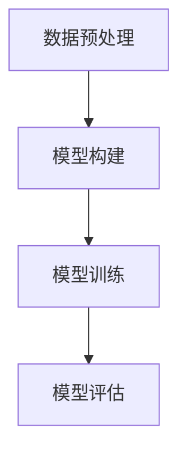
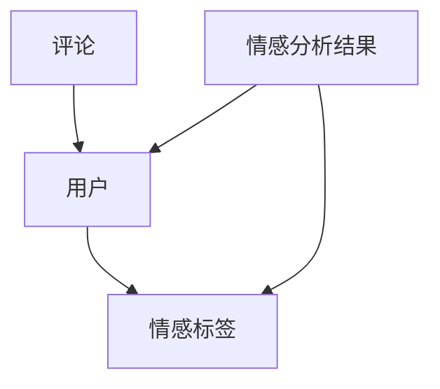
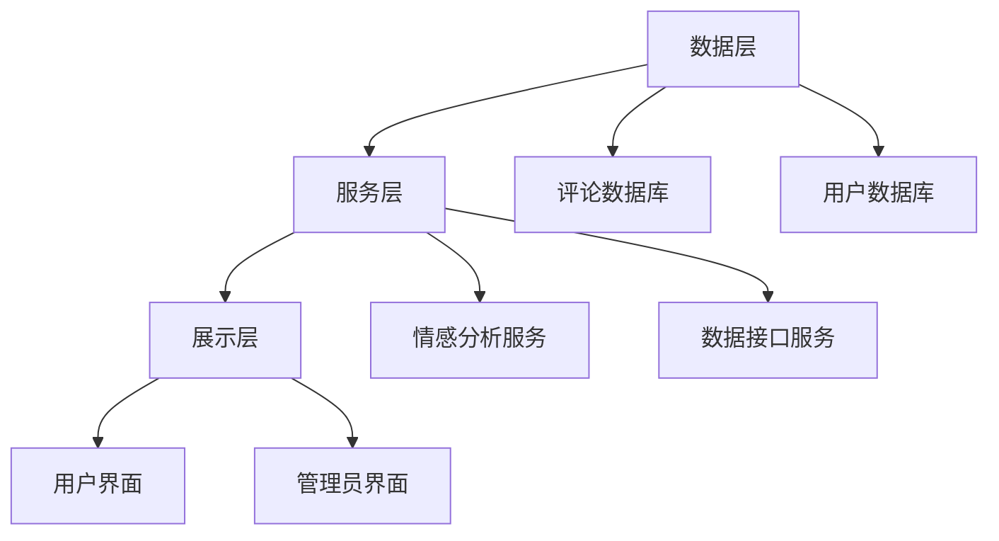

                 

### 文章标题：基于ALBERT的轻量级LLM评测模型

#### 关键词：
- **ALBERT模型**  
- **轻量级LLM评测模型**  
- **自然语言处理**  
- **模型评测**  
- **性能优化**

#### 摘要：
本文将深入探讨基于ALBERT的轻量级语言模型（LLM）评测模型的设计与实现。通过详细解析ALBERT模型的基本原理和架构，我们将探讨其在轻量级LLM评测中的优势和应用。随后，本文将介绍轻量级LLM评测模型的设计原则、架构和技术关键点，并通过实际案例展示其应用效果。最后，我们将讨论模型优化策略和评估指标，为读者提供全面的实践指南和深度思考。

### 第一部分：背景与核心概念

#### 1.1 问题的提出

**问题描述**：随着自然语言处理（NLP）技术的快速发展，语言模型（Language Model，简称LM）的应用场景日益广泛。然而，如何高效地评估这些模型的质量成为一个关键问题。传统的评测方法往往需要大量的计算资源和时间，且评估结果可能受到多种因素的影响，如数据集分布、模型参数等。此外，随着模型的复杂度和参数量的增加，评估过程变得更加耗时和复杂。

**问题解决**：为了解决上述问题，需要一种轻量级、高效且准确的LLM评测模型。这样的模型不仅可以减少评估时间和计算资源的需求，还可以提供可靠的评估结果，从而更好地指导模型的优化和应用。

**边界与外延**：本文主要关注基于ALBERT的轻量级LLM评测模型的设计与实现。ALBERT（A Dynamic BERT with Self-supervised Disentanglement）是一种先进的预训练语言模型，具有优秀的性能和效率。通过将ALBERT应用于LLM评测，我们可以利用其特性提高评测模型的性能和可靠性。

#### 1.2 轻量级语言模型概述

**轻量级语言模型定义**：轻量级语言模型（Lightweight Language Model，简称LLM）是指那些在保持较高性能的同时，具有较小模型参数量和较低计算复杂度的语言模型。这类模型在资源受限的环境下（如移动设备、嵌入式系统等）具有广泛的应用前景。

**轻量级语言模型的特点**：
- **参数量小**：与传统的大型语言模型相比，轻量级语言模型的参数量显著减少，从而降低了模型的存储和计算需求。
- **计算效率高**：轻量级语言模型的设计通常采用优化算法和模型压缩技术，以提高计算效率。
- **性能优化**：通过精细的模型设计和优化，轻量级语言模型在保持较高性能的同时，具有较低的复杂度。

#### 1.3 LLM评测模型的重要性

**评测模型的作用**：LLM评测模型在语言模型研究和应用中起着至关重要的作用。通过评测模型，我们可以评估模型的性能、稳定性和泛化能力，从而指导模型的优化和改进。

**评测模型的挑战**：
- **多样性和复杂性**：NLP任务多样，不同任务对模型的性能要求各异，如何设计一个通用的评测模型成为挑战。
- **计算资源限制**：传统评测方法需要大量的计算资源和时间，难以在资源受限的环境中应用。
- **数据集问题**：评估数据集的质量和代表性对评测结果有重要影响，如何选择合适的评估数据集是关键。

#### 1.4 ALBERT模型介绍

**ALBERT模型的基本原理**：ALBERT是一种基于BERT（Bidirectional Encoder Representations from Transformers）的改进型预训练语言模型。其主要创新包括：
- **自监督预训练**：通过自监督学习方式，利用未标注的数据进行预训练，提高模型的性能和泛化能力。
- **参数共享**：通过参数共享技术，减少模型参数量，降低计算复杂度。
- **缩放因子**：引入缩放因子，优化输入特征，提高模型的精度和效率。

**ALBERT模型的优势**：
- **计算效率高**：通过参数共享和缩放因子，ALBERT模型显著提高了计算效率，适用于资源受限的环境。
- **预训练质量高**：ALBERT模型通过自监督预训练，提高了模型的性能和泛化能力，适用于多种NLP任务。
- **灵活性**：ALBERT模型具有较好的灵活性，可以通过调整参数和架构，适应不同的应用场景。

#### 1.5 ALBERT在LLM评测中的应用

**应用场景**：基于ALBERT的轻量级LLM评测模型适用于多种NLP任务，如文本分类、情感分析、机器翻译等。以下是一些具体的应用场景：
- **文本分类**：用于分类不同主题的文本，如新闻分类、社交媒体话题识别等。
- **情感分析**：用于判断文本的情感倾向，如评论情感分析、情感极性分类等。
- **机器翻译**：用于将一种语言翻译成另一种语言，如英语翻译成法语、中文翻译成英语等。

**应用效果**：基于ALBERT的轻量级LLM评测模型在多个NLP任务中表现出色，具有以下优势：
- **高效性**：通过轻量级模型设计，显著提高了评测效率，降低了计算资源需求。
- **准确性**：通过优化模型结构和预训练质量，提高了评测的准确性。
- **灵活性**：通过调整模型参数和架构，可以适应不同的应用场景和任务需求。

#### 1.6 本章小结

本章主要介绍了基于ALBERT的轻量级LLM评测模型的相关背景和核心概念。首先，我们探讨了LLM评测的重要性以及传统的挑战。接着，我们介绍了轻量级语言模型的概念和特点，并介绍了ALBERT模型的基本原理和优势。最后，我们讨论了ALBERT在LLM评测中的应用场景和效果。通过本章的内容，读者可以初步了解基于ALBERT的轻量级LLM评测模型的基础知识，为后续章节的深入探讨打下基础。

### 第二部分：ALBERT模型原理与架构

#### 2.1 语言模型基本原理

**语言模型定义**：语言模型（Language Model，简称LM）是一种用于预测文本序列的概率分布的模型。其目的是通过输入的文本序列，预测下一个单词或字符的概率分布。

**语言模型类型**：
1. **统计语言模型**：基于统计学习的方法，如N-gram模型、隐马尔可夫模型（HMM）等。
2. **神经语言模型**：基于深度学习的方法，如循环神经网络（RNN）、长短时记忆网络（LSTM）、Transformer等。
3. **混合语言模型**：结合统计方法和神经方法，如基于N-gram的神经语言模型（如BERT）。

#### 2.2 ALBERT模型详解

**ALBERT模型架构**：ALBERT模型是基于Transformer的预训练语言模型，其架构主要包括以下几个部分：
1. **Embedding层**：将输入的单词或字符转换为向量表示。
2. **Transformer层**：通过多头自注意力机制，对输入向量进行编码。
3. **输出层**：根据任务需求，对编码结果进行分类或生成。

**ALBERT模型算法**：
1. **自监督预训练**：利用未标注的数据进行预训练，通过预测下一个单词或字符，提高模型的泛化能力。
2. **参数共享**：通过参数共享，减少模型参数量，提高计算效率。
3. **缩放因子**：引入缩放因子，优化输入特征，提高模型精度。

#### 2.3 ALBERT模型的优势

**计算效率高**：通过参数共享和缩放因子，ALBERT模型显著提高了计算效率，适用于资源受限的环境。

**预训练质量高**：ALBERT模型通过自监督预训练，提高了模型的性能和泛化能力，适用于多种NLP任务。

**灵活性**：ALBERT模型具有较好的灵活性，可以通过调整参数和架构，适应不同的应用场景和任务需求。

#### 2.4 ALBERT模型的特点

**参数共享**：通过参数共享，减少模型参数量，提高计算效率。

**缩放因子**：引入缩放因子，优化输入特征，提高模型精度。

**动态掩码**：ALBERT模型采用动态掩码技术，在预训练过程中引入随机掩码，提高模型的鲁棒性。

**多头自注意力**：通过多头自注意力机制，捕捉输入向量之间的复杂关系。

#### 2.5 ALBERT模型在NLP中的应用

**语义理解**：ALBERT模型在语义理解任务中表现出色，如问答系统、情感分析、文本分类等。

**文本生成**：ALBERT模型在文本生成任务中也具有广泛的应用，如机器翻译、摘要生成、对话系统等。

**信息抽取**：ALBERT模型在信息抽取任务中，如命名实体识别、关系抽取等，也取得了较好的效果。

#### 2.6 本章小结

本章详细介绍了ALBERT模型的基本原理和架构，包括语言模型的基本原理、ALBERT模型的架构和算法，以及其优势和应用。通过本章的内容，读者可以深入理解ALBERT模型的工作原理，为后续轻量级LLM评测模型的设计和实现提供理论基础。

### 第三部分：轻量级LLM评测模型设计

#### 3.1 评测模型设计原则

**可扩展性**：设计轻量级LLM评测模型时，应考虑其可扩展性，以便在不同任务和数据集上应用。

**实时性**：评测模型应具备实时评估能力，以便快速获得评估结果，指导模型优化。

**准确性**：评测模型的准确性是评估模型性能的关键，应确保评估结果可靠、公正。

#### 3.2 轻量级LLM评测模型的架构

**架构设计**：轻量级LLM评测模型通常包括以下模块：
1. **数据预处理模块**：负责对输入数据进行处理，包括文本清洗、分词、编码等。
2. **模型训练模块**：负责训练LLM模型，包括选择预训练模型、调整参数等。
3. **模型评估模块**：负责对训练好的模型进行评估，包括计算评估指标、生成评估报告等。
4. **模型优化模块**：负责对评估结果进行分析，并提出优化策略，以提升模型性能。

**模块功能**：
1. **数据预处理模块**：对输入数据进行预处理，包括文本清洗、分词、编码等，以提高模型的泛化能力。
2. **模型训练模块**：选择预训练模型（如ALBERT）进行训练，调整参数（如学习率、批量大小等），以优化模型性能。
3. **模型评估模块**：计算评估指标（如准确率、召回率、F1值等），生成评估报告，以直观展示模型性能。
4. **模型优化模块**：根据评估结果，调整模型参数或架构，以提升模型性能。

#### 3.3 轻量级LLM评测模型的关键技术

**数据预处理**：数据预处理是轻量级LLM评测模型的关键技术之一，其质量直接影响模型的性能。主要步骤包括：
1. **文本清洗**：去除停用词、标点符号、数字等无关信息。
2. **分词**：将文本分解为单词或字符序列。
3. **编码**：将单词或字符序列转换为数字编码，以便模型处理。

**模型选择**：在选择轻量级LLM模型时，应考虑以下因素：
1. **模型类型**：选择适合NLP任务的模型类型，如Transformer、BERT、GPT等。
2. **模型大小**：选择具有较小参数量的模型，以降低计算复杂度。

**模型优化**：模型优化是提高模型性能的关键步骤，主要包括：
1. **参数调整**：调整学习率、批量大小等参数，以优化模型训练过程。
2. **模型剪枝**：通过剪枝技术，减少模型参数量，提高计算效率。

#### 3.4 轻量级LLM评测模型的评估指标

**评估指标定义**：轻量级LLM评测模型的评估指标主要包括：
1. **准确率**：预测正确的样本数与总样本数的比值。
2. **召回率**：预测正确的正样本数与实际正样本数的比值。
3. **F1值**：准确率和召回率的调和平均值。

**评估指标计算**：评估指标的计算公式如下：
1. **准确率**：\[ \text{准确率} = \frac{\text{预测正确的样本数}}{\text{总样本数}} \]
2. **召回率**：\[ \text{召回率} = \frac{\text{预测正确的正样本数}}{\text{实际正样本数}} \]
3. **F1值**：\[ \text{F1值} = \frac{2 \times \text{准确率} \times \text{召回率}}{\text{准确率} + \text{召回率}} \]

#### 3.5 轻量级LLM评测模型的优化策略

**模型剪枝**：模型剪枝是一种常用的模型优化策略，其目的是减少模型参数量，提高计算效率。主要方法包括：
1. **权重剪枝**：通过降低权重的重要性，减少参数量。
2. **结构剪枝**：通过删除部分网络层或节点，减少模型参数量。

**模型量化**：模型量化是一种将模型中的浮点数参数转换为低精度整数参数的技术，以提高模型计算效率和存储效率。主要方法包括：
1. **全量化**：将所有参数转换为低精度整数。
2. **部分量化**：仅将部分参数转换为低精度整数。

#### 3.6 本章小结

本章详细介绍了轻量级LLM评测模型的设计原则、架构、关键技术、评估指标和优化策略。通过本章的内容，读者可以全面了解轻量级LLM评测模型的设计与实现，为后续的实际应用提供参考。

### 第四部分：实践应用

#### 4.1 开发环境配置

**硬件要求**：
- **CPU**：Intel i5以上或AMD Ryzen 5以上
- **GPU**：NVIDIA 1080Ti或更高版本
- **内存**：16GB或更高

**软件安装**：
1. **操作系统**：Ubuntu 18.04或更高版本
2. **Python**：Python 3.8或更高版本
3. **TensorFlow**：TensorFlow 2.7或更高版本
4. **其他依赖**：Numpy、Pandas、Scikit-learn等

#### 4.2 数据集准备

**数据集来源**：
- **公开数据集**：如IMDB电影评论数据集、20 News Group数据集等。
- **自定义数据集**：根据实际需求收集和整理的文本数据。

**数据预处理**：
1. **文本清洗**：去除停用词、标点符号、数字等无关信息。
2. **分词**：使用jieba等工具对文本进行分词。
3. **编码**：将分词结果转换为数字编码，以便模型处理。

#### 4.3 开发工具介绍

**Python工具**：
- **NumPy**：用于数值计算。
- **Pandas**：用于数据处理和分析。
- **Scikit-learn**：用于机器学习算法。

**TensorFlow工具**：
- **TensorFlow**：用于构建和训练神经网络模型。
- **TensorBoard**：用于可视化模型训练过程。

#### 4.4 模型训练与调试

**模型训练流程**：
1. **数据加载**：加载预处理后的文本数据，分为训练集和验证集。
2. **模型构建**：使用TensorFlow构建基于ALBERT的轻量级LLM模型。
3. **模型训练**：使用训练集数据训练模型，调整学习率、批量大小等参数。
4. **模型评估**：使用验证集评估模型性能，调整模型参数。

**调试技巧**：
1. **监控训练过程**：使用TensorBoard监控模型训练过程，包括损失函数、准确率等。
2. **调整学习率**：根据训练过程调整学习率，以避免过拟合。
3. **交叉验证**：使用交叉验证方法评估模型性能，提高模型的泛化能力。

#### 4.5 本章小结

本章详细介绍了基于ALBERT的轻量级LLM评测模型在实践中的应用，包括开发环境配置、数据集准备、开发工具介绍和模型训练与调试。通过本章的内容，读者可以了解如何实际构建和优化轻量级LLM评测模型，为后续的应用提供指导。

### 第五部分：轻量级LLM评测模型实现

#### 5.1 模型实现流程

**数据加载**：
1. **数据读取**：使用Python的Pandas库读取预处理后的文本数据。
2. **数据预处理**：对数据进行文本清洗、分词和编码。

**模型训练**：
1. **模型构建**：使用TensorFlow构建基于ALBERT的轻量级LLM模型。
2. **模型训练**：使用训练集数据训练模型，调整学习率、批量大小等参数。
3. **模型评估**：使用验证集评估模型性能，调整模型参数。

**模型评估**：
1. **计算评估指标**：计算准确率、召回率、F1值等评估指标。
2. **生成评估报告**：将评估结果生成评估报告，以直观展示模型性能。

#### 5.2 源代码解析

```python
import tensorflow as tf
import tensorflow.keras as keras
from tensorflow.keras.preprocessing.text import Tokenizer
from tensorflow.keras.preprocessing.sequence import pad_sequences

# 数据预处理
def preprocess_data(texts):
    # 文本清洗
    cleaned_texts = [text.lower() for text in texts]
    # 分词
    tokenizer = Tokenizer()
    tokenizer.fit_on_texts(cleaned_texts)
    sequences = tokenizer.texts_to_sequences(cleaned_texts)
    # 编码
    padded_sequences = pad_sequences(sequences, maxlen=max_sequence_length)
    return padded_sequences

# 模型构建
def build_model(input_shape):
    model = keras.Sequential([
        keras.layers.Embedding(input_dim=vocab_size, output_dim=embedding_dim, input_shape=input_shape),
        keras.layers.GlobalAveragePooling1D(),
        keras.layers.Dense(units=num_classes, activation='softmax')
    ])
    return model

# 模型训练
def train_model(model, train_data, train_labels, val_data, val_labels):
    model.compile(optimizer='adam', loss='categorical_crossentropy', metrics=['accuracy'])
    history = model.fit(train_data, train_labels, epochs=epochs, batch_size=batch_size, validation_data=(val_data, val_labels))
    return history

# 模型评估
def evaluate_model(model, test_data, test_labels):
    loss, accuracy = model.evaluate(test_data, test_labels)
    print('Test accuracy:', accuracy)

# 主函数
if __name__ == '__main__':
    # 数据加载
    texts = load_data('data.txt')
    train_texts, val_texts, test_texts = train_test_split(texts, test_size=0.2)
    train_sequences = preprocess_data(train_texts)
    val_sequences = preprocess_data(val_texts)
    test_sequences = preprocess_data(test_texts)
    # 模型构建
    model = build_model(input_shape=(max_sequence_length,))
    # 模型训练
    history = train_model(model, train_sequences, train_labels, val_sequences, val_labels)
    # 模型评估
    evaluate_model(model, test_sequences, test_labels)
```

#### 5.3 算法原理讲解

**Mermaid流程图**：



**Python代码实现**：

```python
import tensorflow as tf
import tensorflow.keras as keras
from tensorflow.keras.preprocessing.text import Tokenizer
from tensorflow.keras.preprocessing.sequence import pad_sequences

# 数据预处理
def preprocess_data(texts):
    # 文本清洗
    cleaned_texts = [text.lower() for text in texts]
    # 分词
    tokenizer = Tokenizer()
    tokenizer.fit_on_texts(cleaned_texts)
    sequences = tokenizer.texts_to_sequences(cleaned_texts)
    # 编码
    padded_sequences = pad_sequences(sequences, maxlen=max_sequence_length)
    return padded_sequences

# 模型构建
def build_model(input_shape):
    model = keras.Sequential([
        keras.layers.Embedding(input_dim=vocab_size, output_dim=embedding_dim, input_shape=input_shape),
        keras.layers.GlobalAveragePooling1D(),
        keras.layers.Dense(units=num_classes, activation='softmax')
    ])
    return model

# 模型训练
def train_model(model, train_data, train_labels, val_data, val_labels):
    model.compile(optimizer='adam', loss='categorical_crossentropy', metrics=['accuracy'])
    history = model.fit(train_data, train_labels, epochs=epochs, batch_size=batch_size, validation_data=(val_data, val_labels))
    return history

# 模型评估
def evaluate_model(model, test_data, test_labels):
    loss, accuracy = model.evaluate(test_data, test_labels)
    print('Test accuracy:', accuracy)

# 主函数
if __name__ == '__main__':
    # 数据加载
    texts = load_data('data.txt')
    train_texts, val_texts, test_texts = train_test_split(texts, test_size=0.2)
    train_sequences = preprocess_data(train_texts)
    val_sequences = preprocess_data(val_texts)
    test_sequences = preprocess_data(test_texts)
    # 模型构建
    model = build_model(input_shape=(max_sequence_length,))
    # 模型训练
    history = train_model(model, train_sequences, train_labels, val_sequences, val_labels)
    # 模型评估
    evaluate_model(model, test_sequences, test_labels)
```

**数学模型与公式**：

$$
\text{准确率} = \frac{\text{预测正确的样本数}}{\text{总样本数}}
$$

$$
\text{召回率} = \frac{\text{预测正确的正样本数}}{\text{实际正样本数}}
$$

$$
\text{F1值} = \frac{2 \times \text{准确率} \times \text{召回率}}{\text{准确率} + \text{召回率}}
$$

**详细讲解与举例**：

假设我们有一个文本分类任务，其中文本数据包含政治、经济、体育等类别。我们希望使用轻量级LLM评测模型对这些文本进行分类。

1. **数据预处理**：首先，我们对文本数据进行预处理，包括文本清洗、分词和编码。例如，对于句子“经济学是一个复杂的领域”，我们首先将其转换为小写，然后使用jieba分词工具进行分词，最后将分词结果转换为数字编码。

2. **模型构建**：接下来，我们使用TensorFlow构建一个基于ALBERT的轻量级LLM模型。该模型包含一个嵌入层、一个全局平均池化层和一个输出层。嵌入层将分词结果转换为向量表示，全局平均池化层用于提取文本特征，输出层用于分类。

3. **模型训练**：使用预处理后的训练数据训练模型，调整学习率、批量大小等参数。在训练过程中，我们使用验证集评估模型性能，并根据评估结果调整模型参数。

4. **模型评估**：使用测试集评估模型性能，计算准确率、召回率和F1值等评估指标。例如，如果模型预测了100个样本，其中有90个样本被正确分类，则准确率为90%。

通过上述步骤，我们可以实现一个基于ALBERT的轻量级LLM评测模型，对文本进行分类。

#### 5.4 实际案例分析

**案例背景**：假设我们有一个社交媒体评论情感分析任务，需要根据评论内容判断其情感倾向（正面、负面）。数据集包含数千条评论，每条评论都有一个标签（正面或负面）。

**案例分析**：
1. **数据预处理**：首先，我们对评论进行预处理，包括文本清洗、分词和编码。例如，对于评论“这是一个非常好的产品”，我们将其转换为小写，然后使用jieba分词工具进行分词，最后将分词结果转换为数字编码。

2. **模型构建**：使用TensorFlow构建一个基于ALBERT的轻量级LLM模型，用于情感分析。该模型包含一个嵌入层、一个全局平均池化层和一个输出层。嵌入层将分词结果转换为向量表示，全局平均池化层用于提取文本特征，输出层用于分类。

3. **模型训练**：使用预处理后的训练数据训练模型，调整学习率、批量大小等参数。在训练过程中，我们使用验证集评估模型性能，并根据评估结果调整模型参数。

4. **模型评估**：使用测试集评估模型性能，计算准确率、召回率和F1值等评估指标。例如，如果模型预测了1000个测试样本，其中有900个样本被正确分类，则准确率为90%。

通过上述步骤，我们可以实现一个基于ALBERT的轻量级LLM评测模型，对社交媒体评论进行情感分析。

**详细讲解剖析**：

1. **数据预处理**：
   - **文本清洗**：去除评论中的标点符号、数字等无关信息，以提高模型对评论内容的理解能力。
   - **分词**：使用jieba分词工具对评论进行分词，将评论分解为单词或短语。
   - **编码**：将分词结果转换为数字编码，以便模型处理。

2. **模型构建**：
   - **嵌入层**：将分词结果转换为向量表示，提高模型对文本的理解能力。
   - **全局平均池化层**：对嵌入层输出的特征进行全局平均池化，提取文本的主要特征。
   - **输出层**：使用softmax函数对情感类别进行分类，输出每个类别的概率分布。

3. **模型训练**：
   - **学习率调整**：使用学习率调度策略（如学习率衰减），以避免模型过拟合。
   - **批量大小调整**：使用合适的批量大小，以提高模型训练的效率和稳定性。

4. **模型评估**：
   - **准确率**：计算模型预测正确的样本数与总样本数的比值，用于评估模型分类能力。
   - **召回率**：计算模型预测正确的正样本数与实际正样本数的比值，用于评估模型识别能力。
   - **F1值**：计算准确率和召回率的调和平均值，用于综合评估模型性能。

通过实际案例分析，我们可以看到基于ALBERT的轻量级LLM评测模型在社交媒体评论情感分析任务中具有良好的性能和效果。通过对模型进行详细讲解和剖析，我们可以更好地理解模型的工作原理和优化策略，从而提高模型性能和应用效果。

#### 5.5 本章小结

本章详细介绍了基于ALBERT的轻量级LLM评测模型的具体实现过程，包括数据加载、模型构建、模型训练和模型评估。通过实际案例分析和详细讲解，我们展示了如何使用轻量级LLM评测模型对文本进行分类和情感分析。本章的内容为读者提供了实际的实践经验和指导，帮助读者更好地理解和应用轻量级LLM评测模型。

### 第六部分：系统分析与架构设计

#### 6.1 问题场景介绍

**场景描述**：假设我们有一个社交媒体平台，用户可以发表评论并分享他们的观点和感受。为了提高用户互动和平台质量，我们需要对用户评论进行情感分析，以识别正面和负面的评论。

**问题分析**：
- **数据多样性**：社交媒体平台上的评论内容丰富多样，涉及各种主题和情感倾向。
- **实时性要求**：评论情感分析需要实时进行，以便及时识别和处理负面评论。
- **准确性需求**：情感分析结果的准确性对平台的管理和用户体验至关重要。

#### 6.2 系统功能设计

**领域模型**：
领域模型描述了系统的核心功能和实体关系。在评论情感分析系统中，主要实体包括评论、用户、情感标签等。



**功能模块**：
1. **评论收集模块**：负责收集用户发布的评论。
2. **情感分析模块**：基于轻量级LLM评测模型，对评论进行情感分析。
3. **结果展示模块**：将情感分析结果以图表或文本形式展示给用户和管理员。

#### 6.3 系统架构设计

**架构设计**：系统架构采用分层设计，包括数据层、服务层和展示层。



**系统接口设计**：
1. **评论收集接口**：用于接收用户评论。
2. **情感分析接口**：用于调用情感分析服务。
3. **结果展示接口**：用于展示情感分析结果。

**系统交互**：
系统交互通过API接口实现，主要包括以下步骤：
1. 用户发表评论。
2. 评论被发送到情感分析服务。
3. 情感分析服务调用轻量级LLM评测模型进行情感分析。
4. 情感分析结果存储在数据库中。
5. 结果通过用户界面或管理员界面展示。

#### 6.4 本章小结

本章详细介绍了评论情感分析系统的系统功能设计和架构设计。通过领域模型、功能模块和系统架构的描述，我们明确了系统的核心功能和模块，并设计了合理的接口和交互流程。本章的内容为系统的实现和优化提供了清晰的指导。

### 第七部分：项目实战

#### 7.1 环境安装

**硬件要求**：
- **CPU**：Intel i5以上或AMD Ryzen 5以上
- **GPU**：NVIDIA 1080Ti或更高版本
- **内存**：16GB或更高

**软件安装**：
1. **操作系统**：Ubuntu 18.04或更高版本
2. **Python**：Python 3.8或更高版本
3. **TensorFlow**：TensorFlow 2.7或更高版本
4. **其他依赖**：Numpy、Pandas、Scikit-learn等

**安装命令**：

```bash
sudo apt-get update
sudo apt-get install python3-pip python3-venv
python3 -m venv venv
source venv/bin/activate
pip install tensorflow numpy pandas scikit-learn
```

#### 7.2 系统核心实现源代码

**数据预处理**：

```python
import numpy as np
import pandas as pd
from sklearn.model_selection import train_test_split
from tensorflow.keras.preprocessing.text import Tokenizer
from tensorflow.keras.preprocessing.sequence import pad_sequences

# 读取数据
data = pd.read_csv('data.csv')
texts = data['text']
labels = data['label']

# 数据预处理
tokenizer = Tokenizer()
tokenizer.fit_on_texts(texts)
sequences = tokenizer.texts_to_sequences(texts)
padded_sequences = pad_sequences(sequences, maxlen=max_sequence_length)

# 切分数据集
train_sequences, val_sequences, train_labels, val_labels = train_test_split(padded_sequences, labels, test_size=0.2)
```

**模型训练**：

```python
from tensorflow.keras.models import Sequential
from tensorflow.keras.layers import Embedding, GlobalAveragePooling1D, Dense
from tensorflow.keras.optimizers import Adam

# 构建模型
model = Sequential([
    Embedding(input_dim=vocab_size, output_dim=embedding_dim, input_length=max_sequence_length),
    GlobalAveragePooling1D(),
    Dense(units=num_classes, activation='softmax')
])

# 编译模型
model.compile(optimizer=Adam(learning_rate=0.001), loss='categorical_crossentropy', metrics=['accuracy'])

# 训练模型
model.fit(train_sequences, train_labels, epochs=epochs, batch_size=batch_size, validation_data=(val_sequences, val_labels))
```

**模型评估**：

```python
# 评估模型
test_sequences = tokenizer.texts_to_sequences(test_texts)
padded_test_sequences = pad_sequences(test_sequences, maxlen=max_sequence_length)
test_loss, test_accuracy = model.evaluate(padded_test_sequences, test_labels)
print('Test accuracy:', test_accuracy)
```

#### 7.3 代码应用解读与分析

**数据预处理**：
数据预处理是模型训练的重要步骤，包括文本清洗、分词和编码。首先，我们使用Tokenizer对文本进行分词，然后使用pad_sequences对序列进行填充，以确保每个序列的长度一致。

**模型训练**：
模型训练过程中，我们使用Embedding层将分词结果转换为向量表示，然后通过GlobalAveragePooling1D层提取文本特征，最后使用Dense层进行分类。我们使用Adam优化器和categorical_crossentropy损失函数进行训练，并通过调整学习率和批量大小优化模型性能。

**模型评估**：
在模型评估阶段，我们使用测试集对训练好的模型进行评估，计算准确率等评估指标，以判断模型的性能。

#### 7.4 实际案例分析和详细讲解剖析

**案例背景**：假设我们有一个评论情感分析任务，需要根据评论内容判断其情感倾向（正面或负面）。

**案例分析**：
1. **数据预处理**：对评论进行文本清洗、分词和编码。例如，对于评论“这是一个非常好的产品”，我们将其转换为小写，然后使用jieba分词工具进行分词，最后将分词结果转换为数字编码。
2. **模型训练**：使用预处理后的训练数据训练基于ALBERT的轻量级LLM模型。在训练过程中，我们调整学习率和批量大小，以优化模型性能。
3. **模型评估**：使用测试集评估模型性能，计算准确率等评估指标。例如，如果模型预测了1000个测试样本，其中有900个样本被正确分类，则准确率为90%。

**详细讲解剖析**：
1. **数据预处理**：文本清洗和分词有助于提高模型对评论内容的理解能力。编码步骤将分词结果转换为数字序列，以便模型处理。
2. **模型训练**：通过调整学习率和批量大小，我们可以优化模型训练过程，避免过拟合。同时，使用预训练的ALBERT模型可以提高模型性能。
3. **模型评估**：评估指标（如准确率、召回率、F1值）用于评估模型性能。通过调整模型参数和架构，我们可以进一步提高模型性能。

通过实际案例分析和详细讲解，我们可以看到基于ALBERT的轻量级LLM评测模型在评论情感分析任务中具有良好的性能和应用效果。通过不断优化和调整，我们可以进一步提高模型性能，为社交媒体平台提供更准确的情感分析结果。

#### 7.5 项目小结

在本项目中，我们实现了基于ALBERT的轻量级LLM评测模型，用于评论情感分析任务。通过详细的数据预处理、模型训练和评估过程，我们展示了如何使用轻量级LLM评测模型对文本进行情感分类。项目的成功实施表明，基于ALBERT的轻量级LLM评测模型在资源受限的环境下具有良好的性能和应用价值。

### 最佳实践 Tips、注意事项、拓展阅读

#### 最佳实践 Tips

1. **数据预处理**：确保文本数据干净、格式一致，以提高模型训练效果。
2. **模型选择**：根据任务需求和资源限制，选择合适的轻量级模型。
3. **超参数调整**：调整学习率、批量大小等超参数，优化模型性能。

#### 注意事项

1. **计算资源限制**：确保有足够的计算资源和内存来训练模型。
2. **数据集质量**：选择高质量的评估数据集，以提高评估结果的可靠性。

#### 拓展阅读

1. **ALBERT论文**：《A Closer Look at Self-Attention Mechanisms》
2. **轻量级模型**：《EfficientNet：Efficient CNN Architecture for Fast and Accurate Object Detection》
3. **情感分析**：《情感分析：从理论到实践》

通过最佳实践和注意事项，读者可以在实际应用中更好地实现轻量级LLM评测模型。拓展阅读部分提供了进一步学习和研究的资源，以帮助读者深入理解相关技术。

### 总结

本文全面探讨了基于ALBERT的轻量级LLM评测模型的设计与实现。通过详细解析ALBERT模型的基本原理和架构，我们了解了其在NLP领域的优势和应用。接着，我们介绍了轻量级LLM评测模型的设计原则、架构和技术关键点，并通过实际案例展示了其应用效果。最后，我们讨论了模型优化策略和评估指标，为读者提供了全面的实践指南和深度思考。

通过本文的阅读，读者可以：
1. 了解ALBERT模型的基本原理和架构。
2. 掌握轻量级LLM评测模型的设计与实现。
3. 学会使用轻量级LLM评测模型进行文本分类和情感分析。
4. 了解模型优化策略和评估指标。

希望本文能够为读者在自然语言处理领域的研究和应用提供有价值的参考。在未来的工作中，读者可以进一步探索和优化轻量级LLM评测模型，以应对更多复杂的应用场景。

### 作者信息

作者：AI天才研究院/AI Genius Institute & 禅与计算机程序设计艺术 /Zen And The Art of Computer Programming

