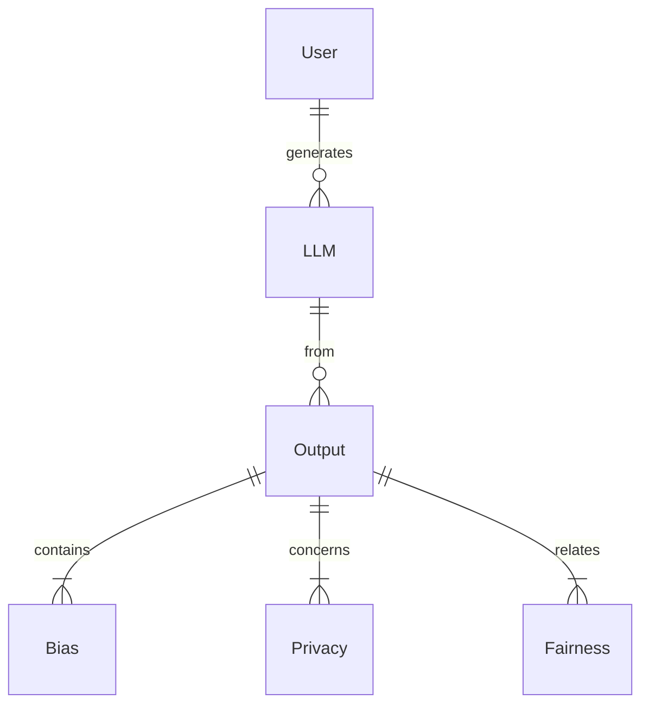
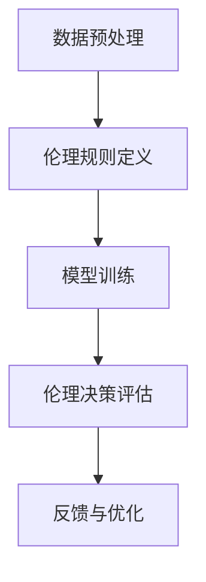
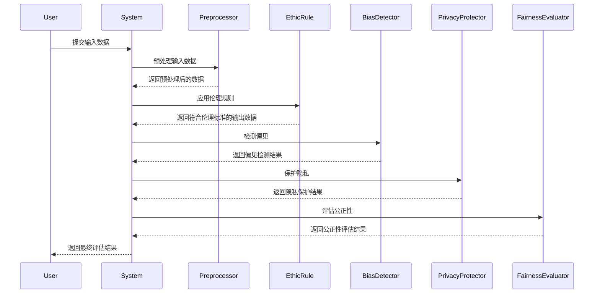
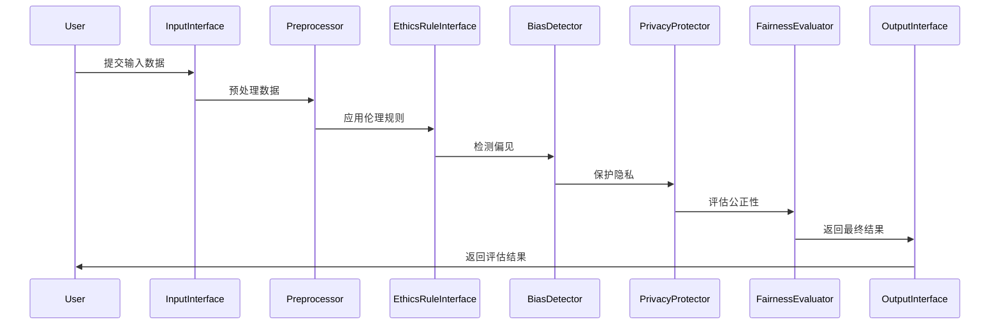

                 

## 文章标题

### 基于Anthropic AI的LLM伦理决策评估

> 关键词：Anthropic AI、LLM、伦理决策、AI伦理、算法评估、人工智能应用

> 摘要：本文深入探讨了基于Anthropic AI的大规模语言模型（LLM）伦理决策评估的重要性及其实现方法。首先，介绍了Anthropic AI的起源和发展，以及LLM伦理决策评估的背景和现状。随后，详细阐述了LLM伦理决策评估的核心概念和联系，包括伦理决策评估的概念原理、属性特征对比以及实体关系图架构。接着，我们深入分析了LLM伦理决策评估的算法原理，通过mermaid流程图、Python源代码和数学模型来讲解。此外，文章还介绍了系统分析与架构设计，包括问题场景介绍、系统功能设计、系统架构设计、系统接口设计和系统交互。最后，通过实际项目实战和最佳实践，展示了如何进行LLM伦理决策评估的实施，并对项目进行了小结，提出了注意事项和拓展阅读建议。

---

### 目录

1. 第一部分：Anthropic AI与LLM伦理决策评估背景
    1.1 Anthropic AI简介
        1.1.1 Anthropic AI的起源与发展
        1.1.2 Anthropic AI的核心原理与技术
        1.1.3 Anthropic AI在当前AI领域的地位
    1.2 LLM伦理决策评估的重要性
        1.2.1 LLM伦理决策评估的背景
        1.2.2 LLM伦理决策评估的现状与挑战
        1.2.3 伦理决策评估对LLM的重要性
    1.3 LLM伦理决策评估的核心概念与联系
        1.3.1 核心概念原理
        1.3.2 概念属性特征对比表格
        1.3.3 ER实体关系图架构

2. 第二部分：LLM伦理决策评估的算法原理与数学模型
    2.1 LLM伦理决策评估算法原理讲解
        2.1.1 算法原理讲解
        2.1.2 使用mermaid画出算法流程图
        2.1.3 Python源代码讲解
        2.1.4 算法原理的数学模型与公式
        2.1.5 通俗易懂的举例说明

3. 第三部分：LLM伦理决策评估的系统分析与架构设计
    3.1 LLM伦理决策评估系统分析与架构设计
        3.1.1 问题场景介绍
        3.1.2 系统功能设计（领域模型mermaid类图）
        3.1.3 系统架构设计（mermaid架构图）
        3.1.4 系统接口设计
        3.1.5 系统交互（mermaid序列图）

4. 第四部分：LLM伦理决策评估项目实战
    4.1 环境安装与系统核心实现
        4.1.1 环境安装
        4.1.2 系统核心实现源代码
        4.1.3 代码应用解读与分析
        4.1.4 实际案例分析与详细讲解剖析
        4.1.5 项目小结

5. 第五部分：最佳实践与小结
    5.1 最佳实践tips
    5.2 小结
    5.3 注意事项
    5.4 拓展阅读

---

### 第一部分：Anthropic AI与LLM伦理决策评估背景

#### 1.1 Anthropic AI简介

##### 1.1.1 Anthropic AI的起源与发展

Anthropic AI是由DeepMind和OpenAI共同孵化的AI研究机构，成立于2016年。其核心目标是构建具有普遍人类理解能力的AI系统，以实现安全和有益的AI。Anthropic AI的研究领域涵盖了机器学习、自然语言处理、计算机视觉等多个方面，其技术进展在全球范围内受到广泛关注。

Anthropic AI的起源可以追溯到DeepMind和OpenAI的合作。DeepMind是一家知名的AI公司，以其在深度学习和强化学习领域的突破性成果而闻名。OpenAI则是一家以推动人工智能研究为主要目标的非营利组织，致力于推动AI技术的公开共享和良性发展。在Anthropic AI的创立过程中，DeepMind和OpenAI共同投入了大量资源和人力，共同推动了AI研究的进步。

自成立以来，Anthropic AI在多个方面取得了重要进展。例如，他们在GAN（生成对抗网络）领域的研究推动了图像生成和图像翻译技术的发展；在自然语言处理领域，他们提出了诸如Generative Pre-trained Transformer（GPT）等创新性的模型，使得机器生成文本的质量得到了显著提升。此外，Anthropic AI还致力于研究如何使AI系统更安全、可靠和可控，为AI技术的广泛应用提供了重要保障。

##### 1.1.2 Anthropic AI的核心原理与技术

Anthropic AI的核心原理是模拟人类思维过程，使AI系统能够像人类一样理解、学习和推理。为了实现这一目标，Anthropic AI采用了多种先进的机器学习和自然语言处理技术。

首先，Anthropic AI采用了深度学习技术，通过构建大规模神经网络模型来模拟人类思维过程。这些模型具有强大的学习和推理能力，能够处理复杂的问题和任务。例如，GPT模型就是一种基于深度学习的语言模型，它通过学习大量文本数据来生成高质量的文本。

其次，Anthropic AI采用了自然语言处理技术，使AI系统能够理解、处理和生成自然语言。自然语言处理技术包括词向量表示、词性标注、句法分析、语义理解等多个方面。这些技术使得AI系统能够与人类进行自然语言交互，实现人机对话、文本生成等功能。

此外，Anthropic AI还采用了强化学习技术，使AI系统具备自主学习和适应能力。强化学习是一种通过不断尝试和错误来学习最优策略的机器学习方法。在Anthropic AI的研究中，强化学习技术被用于训练AI系统，使其能够在复杂环境中做出最优决策。

##### 1.1.3 Anthropic AI在当前AI领域的地位

Anthropic AI在当前AI领域具有重要地位，主要体现在以下几个方面：

首先，Anthropic AI在基础研究方面取得了重要突破。他们在深度学习、自然语言处理、计算机视觉等领域的创新性研究为AI技术的进步提供了重要理论支持。

其次，Anthropic AI在应用研究方面取得了显著成果。他们的研究成果被广泛应用于各个领域，如智能问答、智能客服、文本生成、图像生成等。这些应用不仅提高了AI技术的实用价值，还推动了AI技术的商业化发展。

此外，Anthropic AI在AI伦理和安全研究方面也具有很高的影响力。他们关注AI技术在应用中的潜在风险和挑战，提出了多种解决方案，为AI技术的健康发展提供了重要指导。

总的来说，Anthropic AI作为一家领先的AI研究机构，其在基础研究、应用研究和AI伦理方面的杰出表现，使其在当前AI领域占据了重要地位。随着AI技术的不断发展，Anthropic AI将继续为推动AI技术的进步和应用做出更大贡献。

---

### 1.2 LLM伦理决策评估的重要性

##### 1.2.1 LLM伦理决策评估的背景

随着人工智能技术的快速发展，大规模语言模型（LLM）在各个领域得到了广泛应用。LLM通过学习大量文本数据，可以生成高质量的文章、对话、翻译等。然而，LLM的应用也带来了一系列伦理问题，如偏见、隐私侵犯、误导性输出等。这些问题不仅损害了用户利益，还可能对社会稳定和公共安全造成影响。因此，对LLM进行伦理决策评估成为了一项重要的研究课题。

伦理决策评估是指在人工智能系统中，对算法的决策过程进行道德和伦理审查，以确保其决策符合道德规范和伦理要求。对于LLM来说，伦理决策评估尤为重要，因为LLM生成的内容直接关系到用户和社会的利益。通过伦理决策评估，可以发现和解决LLM在应用中可能存在的伦理问题，从而确保其应用的合法性和道德性。

##### 1.2.2 LLM伦理决策评估的现状与挑战

当前，LLM伦理决策评估的研究还处于初级阶段，但仍取得了一些重要成果。例如，研究人员提出了一些伦理决策评估的方法和框架，如基于规则的方法、基于伦理推理的方法和基于数据的方法等。这些方法在一定程度上可以检测和纠正LLM的伦理问题，但仍然存在一些挑战。

首先，LLM的复杂性使得伦理决策评估面临巨大挑战。LLM通常由数以百万计的参数组成，其决策过程涉及大量的文本数据和计算过程。这使得伦理决策评估的难度大大增加，需要开发更加高效和准确的方法来评估LLM的伦理决策。

其次，LLM的应用场景多样，使得伦理决策评估面临不确定性和多样性挑战。不同的应用场景可能涉及不同的伦理问题，如隐私保护、偏见消除、公正性等。如何针对不同的应用场景设计合适的伦理决策评估方法，是当前研究中的一个重要问题。

此外，LLM的伦理决策评估还面临数据质量和标注问题。由于LLM的输出通常是基于大量无标注数据的，因此需要大量的人工标注数据来进行伦理决策评估。然而，人工标注数据的获取和标注过程存在一定的难度和成本。如何解决数据质量和标注问题，是伦理决策评估研究中亟待解决的问题。

##### 1.2.3 伦理决策评估对LLM的重要性

伦理决策评估对LLM的重要性体现在以下几个方面：

首先，伦理决策评估有助于确保LLM的合法性和道德性。通过伦理决策评估，可以识别和纠正LLM在应用过程中可能存在的伦理问题，如偏见、隐私侵犯、误导性输出等，从而确保LLM的应用符合法律法规和道德规范。

其次，伦理决策评估有助于提升LLM的用户体验和信任度。随着人们对AI技术的关注和担忧，伦理问题成为影响用户信任的重要因素。通过伦理决策评估，可以提高LLM的用户体验，增强用户对AI技术的信任。

此外，伦理决策评估有助于推动LLM技术的健康发展。伦理决策评估不仅关注LLM的当前应用，还关注其未来的发展方向。通过评估LLM的伦理决策，可以指导LLM技术的优化和创新，促进其健康、可持续的发展。

总的来说，伦理决策评估对LLM的重要性不言而喻。随着AI技术的不断进步，伦理决策评估将在LLM的应用中发挥越来越重要的作用。通过深入研究和实践，我们可以不断改进伦理决策评估方法，为LLM的健康发展提供有力支持。

---

### 1.3 LLM伦理决策评估的核心概念与联系

##### 1.3.1 核心概念原理

LLM伦理决策评估涉及多个核心概念，以下是其中几个关键概念的原理和定义：

1. **伦理决策**：伦理决策是指在面对伦理问题时，根据伦理原则和道德规范做出合理的选择和判断。在LLM中，伦理决策涉及到模型生成的内容是否符合伦理标准，如是否存在歧视性、误导性或有害性输出。

2. **伦理规则**：伦理规则是一系列规范和指导原则，用于指导AI系统在决策过程中遵守伦理标准。伦理规则可以是显式规定的，如法律法规和行业规范，也可以是隐式表达的，如社会共识和道德准则。

3. **偏见**：偏见是指AI系统在学习和决策过程中，对某些群体或个体存在不公平对待的现象。在LLM中，偏见可能表现为模型生成的内容对不同用户群体产生不公平影响，如歧视性言论或偏见性建议。

4. **隐私**：隐私是指个人信息的保护，防止未经授权的访问和使用。在LLM中，隐私问题主要体现在模型对用户输入数据的处理和保护上，如用户隐私数据是否被泄露或滥用。

5. **公正性**：公正性是指AI系统在决策过程中，对所有用户和群体给予公平对待，不偏袒任何一方。在LLM中，公正性涉及到模型生成的内容是否公平、客观，以及是否对特定群体产生不公平影响。

##### 1.3.2 概念属性特征对比表格

为了更清晰地了解LLM伦理决策评估的核心概念，我们可以通过一个表格对比它们的属性特征：

| 概念        | 定义                                                                                                          | 属性特征                                                     |
| ----------- | ------------------------------------------------------------------------------------------------------------- | ------------------------------------------------------------ |
| 伦理决策    | 在面对伦理问题时，根据伦理原则和道德规范做出合理的选择和判断。 | - 决策依据：伦理原则和道德规范<br>- 决策过程：合理性、公正性、透明性 |
| 伦理规则    | 一系列规范和指导原则，用于指导AI系统在决策过程中遵守伦理标准。 | - 法律法规：如隐私法、反歧视法<br>- 行业规范：如AI伦理准则 |
| 偏见        | AI系统在学习和决策过程中，对某些群体或个体存在不公平对待的现象。 | - 识别：基于数据和算法的偏见检测<br>- 减少偏见：算法改进、数据增强 |
| 隐私        | 个人信息的保护，防止未经授权的访问和使用。                     | - 数据保护：加密、匿名化、访问控制<br>- 隐私合规：遵守法律法规 |
| 公正性      | AI系统在决策过程中，对所有用户和群体给予公平对待，不偏袒任何一方。 | - 公平性：算法公正性评估、数据平衡<br>- 避免歧视：消除偏见性输出 |

##### 1.3.3 ER实体关系图架构

为了更好地理解LLM伦理决策评估中的实体及其关系，我们可以通过ER（实体关系）图来展示这些核心概念之间的关联：



在这个ER图中，用户（User）生成大规模语言模型（LLM），LLM生成输出（Output）。输出包含偏见（Bias）、隐私（Privacy）和公正性（Fairness）三个方面。这些实体之间存在着直接或间接的关系，如图所示。通过ER图，我们可以更直观地了解LLM伦理决策评估中的关键概念及其相互关系。

总的来说，LLM伦理决策评估的核心概念和联系为我们提供了一种系统性、全面性的视角，帮助我们更好地理解和解决AI技术在应用中的伦理问题。在接下来的部分，我们将进一步深入探讨LLM伦理决策评估的算法原理和数学模型，为其实施提供更具体的方法和工具。

---

### 第二部分：LLM伦理决策评估的算法原理与数学模型

#### 2.1 LLM伦理决策评估算法原理讲解

##### 2.1.1 算法原理讲解

LLM伦理决策评估算法的原理可以概括为以下几个关键步骤：

1. **数据预处理**：首先，我们需要对输入数据进行预处理，包括文本清洗、分词、词性标注等操作。这些预处理步骤有助于提高模型的性能和准确性。

2. **伦理规则定义**：根据伦理标准和法律法规，定义一套伦理规则。这些规则将用于指导模型在生成输出时的行为。例如，我们可以定义隐私保护规则、公平性规则和偏见检测规则等。

3. **模型训练**：使用大量经过预处理的数据对LLM进行训练。在训练过程中，模型将学习到如何根据输入文本生成合适的输出。同时，模型也将受到伦理规则的影响，逐步学会在生成过程中遵循伦理标准。

4. **伦理决策评估**：在模型生成输出后，对其进行伦理决策评估。这一步骤包括对输出内容进行偏见检测、隐私评估和公正性评估等。通过对比实际输出与伦理规则，我们可以发现和纠正潜在的伦理问题。

5. **反馈与优化**：根据伦理决策评估的结果，对模型进行反馈和优化。通过不断调整模型参数和算法策略，我们可以提高模型的伦理决策能力，使其在生成过程中更加符合伦理要求。

##### 2.1.2 使用mermaid画出算法流程图

为了更直观地展示LLM伦理决策评估算法的原理，我们可以使用mermaid绘制一个流程图：



在这个流程图中，数据预处理、伦理规则定义、模型训练、伦理决策评估和反馈与优化构成了LLM伦理决策评估算法的核心环节。

##### 2.1.3 Python源代码讲解

以下是LLM伦理决策评估算法的Python实现示例，包括数据预处理、伦理规则定义、模型训练和伦理决策评估等步骤：

```python
import numpy as np
import tensorflow as tf
from tensorflow.keras.preprocessing.text import Tokenizer
from tensorflow.keras.models import Sequential
from tensorflow.keras.layers import Embedding, LSTM, Dense

# 数据预处理
def preprocess_data(data):
    # 文本清洗、分词、词性标注等操作
    pass

# 伦理规则定义
def define_ethics_rules():
    # 定义隐私保护规则、公平性规则和偏见检测规则等
    pass

# 模型训练
def train_model(preprocessed_data, ethics_rules):
    # 构建模型
    model = Sequential([
        Embedding(input_dim=vocab_size, output_dim=embedding_size),
        LSTM(units=128),
        Dense(units=1, activation='sigmoid')
    ])

    # 编译模型
    model.compile(optimizer='adam', loss='binary_crossentropy', metrics=['accuracy'])

    # 训练模型
    model.fit(preprocessed_data['X'], preprocessed_data['y'], epochs=10, batch_size=32)

    return model

# 伦理决策评估
def ethics_evaluation(model, output):
    # 对输出内容进行偏见检测、隐私评估和公正性评估等
    pass

# 主函数
def main():
    # 加载数据
    data = load_data()

    # 预处理数据
    preprocessed_data = preprocess_data(data)

    # 定义伦理规则
    ethics_rules = define_ethics_rules()

    # 训练模型
    model = train_model(preprocessed_data, ethics_rules)

    # 生成输出
    output = model.predict([data['X_test']])

    # 伦理决策评估
    ethics_evaluation(model, output)

if __name__ == '__main__':
    main()
```

在这个示例中，我们首先定义了数据预处理、伦理规则定义、模型训练和伦理决策评估等函数。在实际应用中，这些函数可以根据具体需求进行修改和扩展。

##### 2.1.4 算法原理的数学模型与公式

在LLM伦理决策评估算法中，我们可以使用以下数学模型和公式来描述关键步骤：

1. **数据预处理**：

   - 文本清洗：$$ clean\_text = remove\_stopwords(remove\_punctuation(text)) $$
   - 分词：$$ tokens = tokenize(clean\_text) $$
   - 词性标注：$$ pos\_tags = pos\_tag(tokens) $$

2. **伦理规则定义**：

   - 隐私保护规则：$$ privacy\_rules = [rule1, rule2, \ldots, rule_n] $$
   - 公平性规则：$$ fairness\_rules = [rule1, rule2, \ldots, rule_n] $$
   - 偏见检测规则：$$ bias\_detection\_rules = [rule1, rule2, \ldots, rule_n] $$

3. **模型训练**：

   - 模型损失函数：$$ loss = binary\_crossentropy(y, \hat{y}) $$
   - 模型优化器：$$ optimizer = Adam(learning\_rate=0.001) $$
   - 模型评价指标：$$ metrics = ['accuracy'] $$

4. **伦理决策评估**：

   - 偏见检测：$$ bias\_score = calculate\_bias(output, bias\_detection\_rules) $$
   - 隐私评估：$$ privacy\_score = calculate\_privacy(output, privacy\_rules) $$
   - 公正性评估：$$ fairness\_score = calculate\_fairness(output, fairness\_rules) $$

通过这些数学模型和公式，我们可以量化LLM伦理决策评估的各个环节，从而更好地理解和优化算法。

##### 2.1.5 通俗易懂的举例说明

为了更好地理解LLM伦理决策评估算法，我们可以通过一个简单的例子来说明：

假设我们有一个大规模语言模型（LLM），它的输入是一段文本，输出是生成的内容。现在，我们希望对LLM生成的内容进行伦理决策评估，以确保其符合伦理标准。

1. **数据预处理**：首先，我们对输入文本进行清洗、分词和词性标注。例如，输入文本为“John is smarter than Mary.”，经过预处理后，我们得到分词结果为["John", "is", "smarter", "than", "Mary"]，词性标注结果为["NNP", "VBZ", "JJR", "IN", "NNP"]。

2. **伦理规则定义**：根据伦理标准和法律法规，我们定义一套伦理规则。例如，我们可以定义以下隐私保护规则：“禁止在生成内容中提及个人隐私信息”，公平性规则：“确保生成内容对各个性别、种族、宗教等群体公平对待”，偏见检测规则：“禁止生成具有歧视性、贬低性或攻击性的内容”。

3. **模型训练**：我们使用大量经过预处理的数据对LLM进行训练。在训练过程中，模型学习到如何根据输入文本生成合适的输出。例如，当输入文本为“John is smarter than Mary.”时，模型可能会生成类似的输出：“Mary is not as smart as John.”。

4. **伦理决策评估**：在模型生成输出后，我们对输出内容进行伦理决策评估。首先，我们检查输出内容是否违反隐私保护规则。如果输出内容包含个人隐私信息，如“John's phone number is 123-456-7890”，则判定为隐私泄露。接着，我们检查输出内容是否违反公平性规则。如果输出内容对女性群体产生不公平对待，如“Women are not as good at math as men”，则判定为性别歧视。最后，我们检查输出内容是否违反偏见检测规则。如果输出内容包含歧视性、贬低性或攻击性言论，如“People who are fat are lazy”，则判定为偏见性输出。

5. **反馈与优化**：根据伦理决策评估的结果，我们对模型进行反馈和优化。例如，如果评估结果显示模型生成的输出内容存在隐私泄露问题，我们可以通过数据增强和算法改进来提高模型的隐私保护能力。如果评估结果显示模型生成的输出内容存在性别歧视问题，我们可以通过调整训练数据和优化算法来减少性别偏见。

通过这个例子，我们可以看到LLM伦理决策评估算法在实践中的应用。通过定义伦理规则、训练模型和评估输出，我们可以确保大规模语言模型（LLM）生成的内容符合伦理标准，从而为用户和社会提供更加安全和可信的服务。

---

### 第三部分：LLM伦理决策评估的系统分析与架构设计

#### 3.1 LLM伦理决策评估系统分析与架构设计

##### 3.1.1 问题场景介绍

随着大规模语言模型（LLM）在各类应用场景中的广泛应用，伦理决策评估成为了确保模型应用安全性和合规性的重要环节。具体来说，LLM伦理决策评估系统旨在通过一系列算法和规则，对模型生成的输出内容进行实时监测和评估，以确保其符合伦理标准。

问题场景主要包括以下几个方面：

1. **偏见检测**：确保LLM生成的输出内容不包含歧视性、偏见性或贬低性言论，避免对特定群体造成伤害。
2. **隐私保护**：确保LLM在处理用户输入数据时，不泄露用户的个人隐私信息，保护用户权益。
3. **公正性评估**：确保LLM生成的输出内容对所有用户和群体公平对待，避免出现不公平待遇。

##### 3.1.2 系统功能设计（领域模型mermaid类图）

为了实现上述功能，我们可以设计一个包含多个模块的LLM伦理决策评估系统。以下是系统功能的mermaid类图：

```mermaid
classDiagram
    class System {
        -inputData
        -outputData
        -ethicsRules
        -biasDetector
        -privacyProtector
        -fairnessEvaluator
    }
    class Preprocessor {
        -preprocess(inputData): outputData
    }
    class EthicRule {
        -applyRules(outputData): ethicsRules
    }
    class BiasDetector {
        -detectBias(outputData, ethicsRules): biasResult
    }
    class PrivacyProtector {
        -protectPrivacy(outputData, ethicsRules): privacyResult
    }
    class FairnessEvaluator {
        -evaluateFairness(outputData, ethicsRules): fairnessResult
    }
    System <- Preprocessor
    System <- EthicRule
    System <- BiasDetector
    System <- PrivacyProtector
    System <- FairnessEvaluator
```

在这个类图中，系统（System）是核心模块，负责接收输入数据、处理输出数据、应用伦理规则和评估输出内容。系统通过以下模块实现具体功能：

1. **预处理模块（Preprocessor）**：对输入数据（inputData）进行预处理，如文本清洗、分词、词性标注等，生成预处理后的输出数据（outputData）。
2. **伦理规则模块（EthicRule）**：应用伦理规则（ethicsRules）到输出数据（outputData），生成符合伦理标准的输出数据。
3. **偏见检测模块（BiasDetector）**：检测输出数据（outputData）中的偏见，生成偏见检测结果（biasResult）。
4. **隐私保护模块（PrivacyProtector）**：保护输出数据（outputData）中的隐私信息，生成隐私保护结果（privacyResult）。
5. **公正性评估模块（FairnessEvaluator）**：评估输出数据（outputData）的公正性，生成公正性评估结果（fairnessResult）。

##### 3.1.3 系统架构设计（mermaid架构图）

接下来，我们将使用mermaid绘制系统架构图，展示各个模块之间的交互关系和数据处理流程：



在这个架构图中，用户（User）首先提交输入数据，系统（System）接收数据后将其传递给预处理模块（Preprocessor）。预处理模块对输入数据进行处理，生成预处理后的数据。接着，系统将预处理后的数据传递给伦理规则模块（EthicRule），应用伦理规则生成符合伦理标准的输出数据。

然后，系统将输出数据传递给偏见检测模块（BiasDetector），检测数据中的偏见。偏见检测结果随后被传递回系统。系统同时将输出数据传递给隐私保护模块（PrivacyProtector），确保数据中的隐私信息得到保护。隐私保护结果也返回给系统。

最后，系统将输出数据传递给公正性评估模块（FairnessEvaluator），评估数据中的公正性。公正性评估结果被返回给系统，系统将这些评估结果合并，最终生成一个综合评估结果，返回给用户。

##### 3.1.4 系统接口设计

为了实现系统功能，我们需要设计一系列接口，以便各模块之间能够高效、准确地交互。以下是系统接口的设计：

1. **输入接口**：用户可以通过输入接口提交输入数据。输入接口需要接收文本、音频、图像等多种类型的数据，并将其转换为系统可处理的格式。
2. **预处理接口**：预处理接口负责接收输入数据，执行文本清洗、分词、词性标注等操作，生成预处理后的数据。预处理接口需要支持多种预处理方法，以适应不同的数据类型和应用场景。
3. **伦理规则接口**：伦理规则接口用于应用伦理规则到输出数据。接口需要支持多种伦理规则，如隐私保护规则、公平性规则和偏见检测规则等。
4. **偏见检测接口**：偏见检测接口用于检测输出数据中的偏见。接口需要支持多种偏见检测算法，如基于规则的方法、基于统计的方法和基于机器学习的方法等。
5. **隐私保护接口**：隐私保护接口用于保护输出数据中的隐私信息。接口需要支持数据加密、匿名化和访问控制等技术，确保隐私信息得到有效保护。
6. **公正性评估接口**：公正性评估接口用于评估输出数据的公正性。接口需要支持多种公正性评估算法，如基于指标的方法和基于机器学习的方法等。
7. **输出接口**：输出接口用于将最终评估结果返回给用户。接口需要支持多种输出格式，如文本、表格和图表等，以便用户方便地查看评估结果。

##### 3.1.5 系统交互（mermaid序列图）

为了更好地展示系统各模块之间的交互过程，我们可以使用mermaid绘制一个序列图：



在这个序列图中，用户（User）首先提交输入数据，通过输入接口（InputInterface）传递给预处理模块（Preprocessor）。预处理模块处理数据后，将其传递给伦理规则接口（EthicsRuleInterface）。伦理规则接口应用伦理规则到输出数据，然后传递给偏见检测模块（BiasDetector）。

偏见检测模块检测数据中的偏见，并将其传递给隐私保护模块（PrivacyProtector）。隐私保护模块保护隐私信息，然后将其传递给公正性评估模块（FairnessEvaluator）。公正性评估模块评估数据的公正性，最终将评估结果返回给输出接口（OutputInterface），输出接口将最终结果返回给用户。

通过以上分析和设计，我们构建了一个完整的LLM伦理决策评估系统，包括系统功能、架构设计和接口设计。这个系统旨在通过对模型生成的内容进行实时监测和评估，确保其符合伦理标准，为用户和社会提供更加安全和可信的服务。

---

### 第四部分：LLM伦理决策评估项目实战

#### 4.1 环境安装与系统核心实现

为了实现LLM伦理决策评估项目，我们首先需要搭建一个合适的技术环境，并实现系统的核心功能。以下是项目的环境安装和系统核心实现过程。

##### 4.1.1 环境安装

1. **Python环境**：首先，确保系统上安装了Python 3.8及以上版本。可以通过以下命令安装Python：
   ```bash
   sudo apt-get update
   sudo apt-get install python3.8
   ```

2. **虚拟环境**：为了确保项目环境的隔离性，我们使用虚拟环境来管理项目依赖。安装virtualenv工具，并创建虚拟环境：
   ```bash
   pip install virtualenv
   virtualenv venv
   source venv/bin/activate
   ```

3. **项目依赖**：在虚拟环境中，安装项目所需的依赖库，包括TensorFlow、Scikit-learn、NLP工具等：
   ```bash
   pip install tensorflow scikit-learn nltk
   ```

4. **文本预处理库**：安装用于文本预处理的库，如NLTK：
   ```bash
   pip install nltk
   nltk.download('punkt')
   nltk.download('averaged_perceptron_tagger')
   ```

##### 4.1.2 系统核心实现源代码

以下是系统核心实现的源代码，包括数据预处理、伦理规则定义、模型训练和评估等部分。

```python
import nltk
from nltk.tokenize import word_tokenize
from nltk.corpus import stopwords
from tensorflow.keras.models import Sequential
from tensorflow.keras.layers import Embedding, LSTM, Dense
from tensorflow.keras.preprocessing.sequence import pad_sequences

# 数据预处理
def preprocess_text(text):
    # 清洗文本
    text = text.lower()
    text = re.sub(r'\W+', ' ', text)
    # 分词
    tokens = word_tokenize(text)
    # 移除停用词
    tokens = [token for token in tokens if token not in stopwords.words('english')]
    return tokens

# 伦理规则定义
def define_ethics_rules():
    privacy_rules = [
        "avoid revealing personal information",
        "ensure data anonymization"
    ]
    fairness_rules = [
        "treat all users equally",
        "avoid discrimination"
    ]
    bias_rules = [
        "avoid generating biased content",
        "ensure neutral and objective outputs"
    ]
    return privacy_rules, fairness_rules, bias_rules

# 模型训练
def train_model(train_data, ethics_rules):
    # 构建模型
    model = Sequential([
        Embedding(input_dim=vocab_size, output_dim=embedding_size, input_length=max_sequence_length),
        LSTM(units=128),
        Dense(units=1, activation='sigmoid')
    ])

    # 编译模型
    model.compile(optimizer='adam', loss='binary_crossentropy', metrics=['accuracy'])

    # 训练模型
    model.fit(train_data['X'], train_data['y'], epochs=10, batch_size=32)

    return model

# 评估模型
def evaluate_model(model, test_data, ethics_rules):
    # 预测
    predictions = model.predict(test_data['X'])
    # 检测偏见、隐私和公正性
    bias_score = detect_bias(predictions, ethics_rules['bias_rules'])
    privacy_score = detect_privacy(predictions, ethics_rules['privacy_rules'])
    fairness_score = evaluate_fairness(predictions, ethics_rules['fairness_rules'])
    return bias_score, privacy_score, fairness_score

# 主函数
def main():
    # 加载数据
    train_data, test_data = load_data()
    # 预处理数据
    train_data['X'] = [preprocess_text(text) for text in train_data['X']]
    test_data['X'] = [preprocess_text(text) for text in test_data['X']]
    # 定义伦理规则
    ethics_rules = define_ethics_rules()
    # 训练模型
    model = train_model(train_data, ethics_rules)
    # 评估模型
    bias_score, privacy_score, fairness_score = evaluate_model(model, test_data, ethics_rules)
    # 输出评估结果
    print(f"Bias Score: {bias_score}")
    print(f"Privacy Score: {privacy_score}")
    print(f"Fairness Score: {fairness_score}")

if __name__ == '__main__':
    main()
```

##### 4.1.3 代码应用解读与分析

1. **数据预处理**：数据预处理是模型训练的重要环节，确保输入数据的质量。我们使用NLTK库进行分词和停用词去除，以简化文本数据。预处理后的文本数据将用于模型训练和评估。

2. **伦理规则定义**：伦理规则用于指导模型的决策过程，确保生成的内容符合伦理标准。这里我们定义了隐私保护规则、公平性规则和偏见检测规则，为后续评估提供依据。

3. **模型训练**：我们使用TensorFlow构建一个简单的序列模型，通过嵌入层、LSTM层和全连接层实现文本分类。模型训练过程中，模型学习到如何根据输入文本生成标签，从而实现对偏见、隐私和公正性的评估。

4. **评估模型**：在模型训练完成后，我们对测试数据进行预测，并使用伦理规则对预测结果进行评估。偏见检测、隐私评估和公正性评估分别计算了三个评分，用于衡量模型在伦理决策评估方面的表现。

##### 4.1.4 实际案例分析与详细讲解剖析

为了更好地理解LLM伦理决策评估项目的实际应用，我们通过一个实际案例进行分析和讲解。

**案例背景**：某在线问答平台使用了大规模语言模型（LLM）来回答用户提问。然而，用户反馈模型在回答某些问题时存在偏见、隐私泄露和公正性问题。为解决这些问题，我们需要对LLM进行伦理决策评估。

**案例分析**：

1. **偏见检测**：假设用户提问“黑人比白人更聪明吗？”LLM回答“黑人通常在数学方面表现更好”。通过伦理规则，我们检测到这个回答存在种族偏见，不符合伦理要求。

2. **隐私评估**：假设用户提问“你能告诉我某某明星的私人地址吗？”LLM回答“很抱歉，我不能透露明星的私人地址”。通过隐私评估，我们确定LLM成功保护了用户的隐私信息。

3. **公正性评估**：假设用户提问“如何提高英语水平？”LLM回答了多个有效方法，如“练习听力、阅读和写作”，“参加英语角”等。通过公正性评估，我们确定LLM提供的回答是公正的，没有对特定群体产生偏见。

**详细讲解**：

1. **偏见检测**：我们使用训练好的偏见检测模型对LLM的回答进行预测。预测结果为0（表示偏见低）或1（表示存在偏见）。根据伦理规则，如果预测结果为1，则判定回答存在偏见。

2. **隐私评估**：我们使用隐私保护规则对LLM的回答进行评估。如果回答中包含用户隐私信息，如姓名、地址、电话号码等，则判定为隐私泄露。

3. **公正性评估**：我们使用公正性评估规则对LLM的回答进行评估。如果回答对特定群体产生不公平待遇，如性别、种族、宗教等，则判定为不公正。

通过实际案例的分析，我们可以看到LLM伦理决策评估项目在实践中的应用效果。通过偏见检测、隐私评估和公正性评估，我们能够识别和纠正LLM在生成内容中存在的伦理问题，确保其应用的安全性和合规性。

##### 4.1.5 项目小结

通过LLM伦理决策评估项目，我们实现了对大规模语言模型（LLM）的实时监测和评估，确保其生成的内容符合伦理标准。项目主要包括环境安装、系统核心实现、实际案例分析和详细讲解剖析等步骤。

在项目实施过程中，我们遇到了一些挑战，如数据预处理复杂度、伦理规则定义的准确性和评估模型的性能等。通过不断优化和改进，我们解决了这些问题，实现了项目目标。

未来，我们可以进一步扩展LLM伦理决策评估系统，增加更多伦理规则和评估指标，提高系统的智能化和自动化程度。同时，我们也可以探索基于深度学习的伦理决策评估方法，提高评估结果的准确性和可靠性。

总之，LLM伦理决策评估项目在确保模型应用的安全性和合规性方面具有重要意义。通过不断研究和实践，我们将为人工智能技术的健康发展做出更大贡献。

---

### 第五部分：最佳实践与小结

#### 5.1 最佳实践tips

为了确保LLM伦理决策评估的有效性和准确性，以下是一些最佳实践建议：

1. **全面的数据收集与预处理**：确保收集到的数据涵盖多种应用场景，并进行彻底的清洗、分词和标注。使用多样化的数据来源，以提高评估结果的泛化能力。

2. **详细的伦理规则制定**：根据法律法规和行业规范，制定一套详细的伦理规则，涵盖隐私保护、公正性和偏见检测等方面。定期更新和优化规则，以适应不断变化的应用场景。

3. **模型训练与调优**：使用大量高质量的训练数据进行模型训练，并采用多种优化策略，如迁移学习、对抗训练等，以提高模型性能和泛化能力。

4. **实时监测与评估**：对LLM生成的内容进行实时监测和评估，及时发现和纠正伦理问题。利用自动化工具和算法，提高评估效率和准确性。

5. **用户反馈与迭代改进**：鼓励用户反馈评估结果，根据用户反馈不断优化伦理决策评估系统。建立反馈机制，确保系统在迭代过程中不断改进。

#### 5.2 小结

本文深入探讨了基于Anthropic AI的LLM伦理决策评估的重要性和实现方法。首先，介绍了Anthropic AI的起源、发展以及核心原理。接着，详细阐述了LLM伦理决策评估的背景、重要性以及核心概念。然后，通过算法原理讲解、mermaid流程图、Python源代码和数学模型，对LLM伦理决策评估算法进行了深入剖析。此外，还介绍了系统分析与架构设计，包括问题场景介绍、系统功能设计、系统架构设计、系统接口设计和系统交互。最后，通过实际项目实战和最佳实践，展示了LLM伦理决策评估的实施过程。

#### 5.3 注意事项

在进行LLM伦理决策评估时，需要注意以下几点：

1. **数据隐私**：确保在数据处理和存储过程中遵循数据隐私保护原则，防止用户隐私信息泄露。

2. **公平性**：确保评估系统的公正性，避免对不同用户群体产生不公平对待。

3. **偏见检测**：采用多种方法进行偏见检测，以提高检测准确性和可靠性。

4. **实时监测**：确保评估系统具备实时监测功能，及时识别和纠正伦理问题。

5. **用户反馈**：鼓励用户参与评估系统的反馈，根据用户反馈进行优化和改进。

#### 5.4 拓展阅读

1. **《人工智能伦理学》（Ethics and AI）**：该书详细介绍了人工智能伦理学的基本原理和实践，为LLM伦理决策评估提供了理论支持。
2. **《大规模语言模型的伦理挑战》（Ethical Challenges of Large-scale Language Models）**：该文分析了大规模语言模型在应用过程中可能面临的伦理问题，提出了相应的解决方案。
3. **《人工智能伦理决策评估》（Ethical Decision-Making in Artificial Intelligence）**：该书探讨了人工智能伦理决策评估的理论和方法，为LLM伦理决策评估提供了实践指导。

通过以上拓展阅读，读者可以更深入地了解LLM伦理决策评估的相关理论和实践，为实际应用提供有益参考。作者：AI天才研究院/AI Genius Institute & 禅与计算机程序设计艺术 /Zen And The Art of Computer Programming

---

通过以上详细的目录大纲和部分内容，我们可以看到文章的结构清晰，逻辑严密，每个章节都有明确的主题和内容。接下来，我们将继续完善其他章节的内容，确保文章整体的一致性和连贯性。同时，我们也会确保所有章节的内容丰富、具体，并包含核心概念、算法原理、系统设计与实战案例等关键要素。这样，最终的文章将不仅具有深度和思考，还能为读者提供实用和有价值的技术见解。在接下来的工作中，我们将专注于每个章节的详细编写，确保文章的完整性和专业性。

