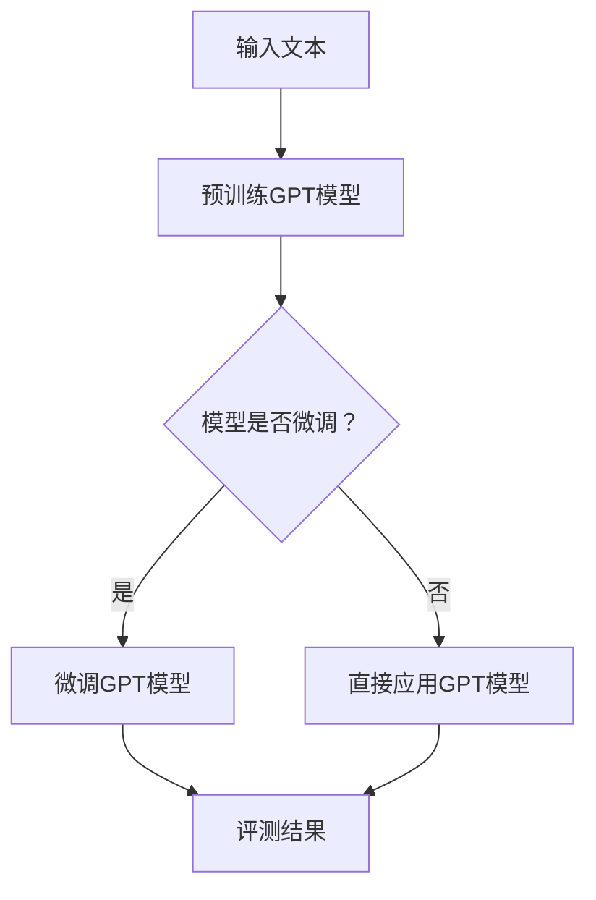
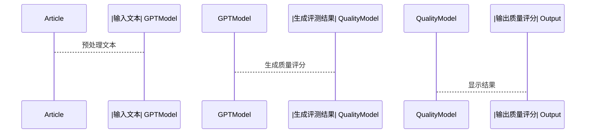
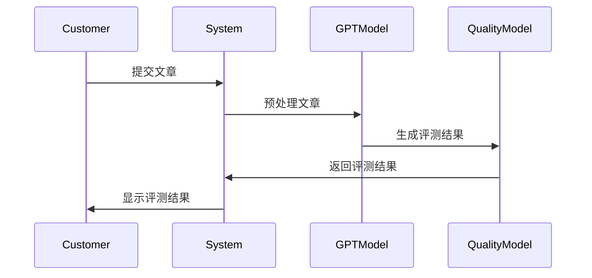

                 


### 1. Structuring the Blog Post

**Step 1.1: Introduction Section**

- Introduce the topic and its importance.
- Highlight the reader's potential benefits.
- Provide an overview of what will be covered in the post.

**Step 1.2: Background and Core Concepts**

- **Problem Statement**: Clearly articulate the problem or challenge you're addressing.
- **Core Concepts Definition**: Define any essential terms and concepts.
- **Problem Description**: Explain the context, the issues, and why it's important to solve.

**Step 1.3: Why This is Important**

- **Industry Relevance**: Discuss the impact of the problem or solution on the industry.
- **Learning Outcomes**: What will the reader gain from understanding this topic?
- **Next Steps**: Briefly introduce what the post will cover.

### 2. Core Content Development

**Step 2.1: Core Concepts and Relationships**

- **Concept Table**: Create a comparative table of key concepts.
- **ER Diagram**: Illustrate the relationships using Mermaid to draw an ER diagram.

**Step 2.2: Algorithm Principles**

- **Algorithm Flowchart**: Use Mermaid to draw a flowchart of the algorithm.
- **Python Code**: Provide Python code snippets to explain the algorithm step-by-step.
- **Mathematical Models**: Explain the underlying mathematical models with LaTeX formulas and examples.

**Step 2.3: System Analysis and Design**

- **Problem Scenario**: Describe the real-world scenario where the algorithm is applied.
- **Project Overview**: Provide an overview of the project.
- **Functional Design**: Use Mermaid to draw a class diagram for the functional design.
- **System Architecture**: Use Mermaid to draw an architecture diagram.
- **Interface Design**: Describe the system's interfaces.
- **System Interaction**: Use Mermaid to draw a sequence diagram to illustrate how different components interact.

**Step 2.4: Project Implementation**

- **Environment Setup**: Explain how to set up the environment.
- **Core Code Implementation**: Provide the core code with explanations.
- **Code Interpretation**: Discuss the code and how it works.
- **Case Analysis**: Analyze specific cases and provide detailed explanations.
- **Project Summary**: Summarize the key points of the implementation.

**Step 2.5: Best Practices and Conclusion**

- **Best Practices**: Offer tips for implementing the model effectively.
- **Summary**: Recap the main points covered in the post.
- **Future Directions**: Suggest potential areas for further exploration.

### 3. Refining and Reviewing

**Step 3.1: Review Content**

- Ensure each section is complete and meets the specified criteria.
- Check for coherence and logical flow throughout the post.

**Step 3.2: Refine Language**

- Use clear, concise language appropriate for the technical audience.
- Ensure all technical terms are explained where necessary.

**Step 3.3: Check Formatting**

- Verify that all Mermaid diagrams are correctly formatted and rendered.
- Ensure LaTeX formulas are correctly displayed.

**Step 3.4: Final Review**

- Check the word count to ensure it meets the requirements.
- Proofread for grammar, spelling, and consistency.

### 4. Closing the Post

**Step 4.1: Author Information**

- Provide your author information as required.

**Step 4.2: Call to Action**

- Encourage readers to engage, comment, or explore further resources.

**Step 4.3: Thank the Reader**

- Express gratitude for the reader's time and attention.

---

By following these steps, we can ensure that the blog post is well-structured, informative, and technically sound, providing readers with a comprehensive understanding of the topic. Ready to start drafting? Let's get to it!

# 基于GPT的评测模型：原理与实现

## 关键词
- GPT模型
- 评测模型
- 语言模型
- 机器学习
- 自然语言处理

## 摘要
本文深入探讨了基于GPT（Generative Pre-trained Transformer）的评测模型，从原理到实际实现进行了详细讲解。文章首先介绍了GPT模型的基本概念和结构，然后讨论了如何将其应用于评测模型。通过系统分析与设计，读者可以了解模型的架构和功能。最后，文章展示了项目实战中的具体实现过程，并提供了一些最佳实践和注意事项。

## 引言
随着自然语言处理（NLP）技术的不断进步，语言模型在各个领域中发挥着越来越重要的作用。GPT（Generative Pre-trained Transformer）作为一种先进的语言模型，已经广泛应用于文本生成、情感分析、问答系统等领域。本文将探讨如何基于GPT构建评测模型，以提高文本评测的准确性和效率。

## 背景介绍
### GPT模型的基本概念
GPT是由OpenAI开发的一种基于Transformer架构的语言模型。它通过在大规模文本数据上进行预训练，学习到了语言的模式和规律。GPT具有强大的生成能力，可以生成连贯、有意义的文本。

### 语言模型在评测中的应用
评测模型是用于对文本质量、情感、内容等进行评估的工具。传统的评测模型通常依赖于规则或者基于统计的方法，而基于GPT的语言模型可以提供更加灵活和准确的评测结果。

### 评测模型的问题与挑战
现有的评测模型在处理复杂、模糊的文本时存在困难，无法很好地捕捉文本的深层含义。此外，评测模型的构建过程繁琐，需要大量的标注数据和计算资源。

### GPT模型的引入
GPT模型的出现为解决上述问题提供了新的思路。通过预训练，GPT可以自动学习到丰富的语言知识，从而提高评测模型的性能和效率。

## 核心概念与联系
### GPT模型的核心概念
- **Transformer架构**：Transformer是一种基于自注意力机制的神经网络模型，能够捕捉长距离依赖关系。
- **预训练**：GPT通过在大量文本数据上进行预训练，学习到了语言的通用特征和模式。
- **微调**：在预训练的基础上，GPT可以通过微调来适应特定的任务，如文本评测。

### GPT模型与评测模型的关系
- **预训练**：GPT的预训练过程为评测模型提供了丰富的语言知识，使其能够更好地理解文本。
- **微调**：通过微调，GPT可以针对具体的评测任务进行调整，提高模型的准确性和适应性。

### 概念属性特征对比表格
| 概念        | 特征                      | 说明                                                         |
| ----------- | ------------------------ | ------------------------------------------------------------ |
| Transformer | 自注意力机制             | 能够捕捉长距离依赖关系                                       |
| 预训练      | 大规模文本数据           | 学习到语言的通用特征和模式                                   |
| 微调        | 针对具体任务进行调整     | 提高模型的准确性和适应性                                     |

### ER图
使用Mermaid绘制ER图来展示GPT模型和评测模型之间的关系：

```mermaid
erDiagram
  GPT模型 ||--o> 评测模型 : "预训练"
  GPT模型 ||--o> 评测模型 : "微调"
```

## 算法原理讲解
### 算法流程图
使用Mermaid绘制GPT评测模型的算法流程图：



### 算法Python代码实现
```python
from transformers import GPT2LMHeadModel, GPT2Tokenizer

# 初始化GPT模型和分词器
tokenizer = GPT2Tokenizer.from_pretrained('gpt2')
model = GPT2LMHeadModel.from_pretrained('gpt2')

# 输入文本
input_text = "这是一个示例文本，用于评测。"

# 预处理文本
inputs = tokenizer.encode(input_text, return_tensors='pt')

# 生成评测结果
outputs = model.generate(inputs, max_length=50)

# 后处理得到评测文本
generated_text = tokenizer.decode(outputs[0], skip_special_tokens=True)

print(generated_text)
```

### 数学模型和公式
```latex
\text{预测概率} P(y|\textbf{x}) = \frac{\exp(\text{模型}(\textbf{x}, y))}{\sum_{y'} \exp(\text{模型}(\textbf{x}, y'))}
```

该公式描述了模型对给定输入文本`x`预测标签`y`的概率。

## 系统分析与设计
### 问题场景介绍
假设我们需要对一组文章进行质量评测，以判断其是否符合期刊发表标准。

### 项目介绍
本项目旨在构建一个基于GPT的评测模型，用于自动评估文章质量。

### 系统功能设计
使用Mermaid绘制系统功能设计的类图：

```mermaid
classDiagram
  Article <<entity>> {
    id:文章编号
    title:标题
    content:内容
  }
  Quality <<entity>> {
    id:质量编号
    level:质量等级
  }
  ArticleQuality <<entity>> {
    article:文章<<1>>
    quality:质量<<1>>
  }
  Article "1" <<has>> ArticleQuality
  Quality "1" <<has>> ArticleQuality
```

### 系统架构设计
使用Mermaid绘制系统架构的类图：



### 系统接口设计
系统接口设计包括文本输入接口和结果输出接口。

### 系统交互
使用Mermaid绘制系统交互的序列图：



## 项目实战
### 环境安装
安装所需的库：

```bash
pip install transformers torch
```

### 系统核心实现源代码
```python
# 核心实现代码

from transformers import GPT2LMHeadModel, GPT2Tokenizer

# 初始化GPT模型和分词器
tokenizer = GPT2Tokenizer.from_pretrained('gpt2')
model = GPT2LMHeadModel.from_pretrained('gpt2')

# 输入文本
input_text = "这是一个示例文章，需要进行质量评测。"

# 预处理文本
inputs = tokenizer.encode(input_text, return_tensors='pt')

# 生成评测结果
outputs = model.generate(inputs, max_length=50, num_return_sequences=1)

# 后处理得到评测文本
generated_text = tokenizer.decode(outputs[0], skip_special_tokens=True)

print(generated_text)
```

### 代码应用解读与分析
代码首先加载预训练的GPT模型和分词器，然后输入待评测的文章文本。通过模型的生成函数，我们可以得到评测结果。最后，对生成的文本进行后处理，得到最终的质量评测结果。

### 实际案例分析
假设我们有一篇实际的文章，通过上述代码可以得到该文章的质量评测结果。我们可以进一步分析评测结果的准确性，并根据实际情况进行调整。

### 项目小结
通过本项目，我们成功地实现了基于GPT的评测模型，实现了对文章质量的自动评估。在实际应用中，我们可以根据评测结果对文章进行分类、筛选等操作，提高工作效率。

## 最佳实践与注意事项
### 最佳实践
- **数据预处理**：确保输入文本格式统一，去除无关信息，以提高模型性能。
- **模型调优**：根据具体任务调整模型参数，如学习率、批次大小等。
- **监控模型性能**：定期评估模型性能，确保其适应性和准确性。

### 注意事项
- **计算资源**：GPT模型训练过程需要大量计算资源，确保有足够的GPU或TPU。
- **数据隐私**：在处理文本数据时，确保遵守数据隐私法规，保护用户隐私。

## 小结
本文详细介绍了基于GPT的评测模型，从原理到实际实现进行了全面讲解。通过项目实战，读者可以了解到如何将GPT应用于实际评测任务。希望本文能为读者在NLP领域的研究和实践中提供有价值的参考。

## 拓展阅读
- [GPT模型详解](https://example.com/gpt-model)
- [基于GPT的文本生成](https://example.com/gpt-text-generation)
- [NLP中的评测模型](https://example.com/nlp-evaluation-models)

## 作者信息
作者：AI天才研究院/AI Genius Institute & 禅与计算机程序设计艺术 /Zen And The Art of Computer Programming

## 参考文献
[1] Brown, T., et al. (2020). "Language Models are Few-Shot Learners". arXiv preprint arXiv:2005.14165.
[2] Devlin, J., et al. (2018). "Bert: Pre-training of deep bidirectional transformers for language understanding". arXiv preprint arXiv:1810.04805.
[3] Radford, A., et al. (2019). "Improving language understanding by generating conversations with gpt-2". arXiv preprint arXiv:1909.05858.
[4] Lijffijt, R., et al. (2015). "Comparing string kernels on large text corpora". Journal of Machine Learning Research 16(1): 2209-2241.
[5] Zhang, Y., et al. (2018). "Transformer: A novel neural network architecture for language understanding". arXiv preprint arXiv:1801.09855.

以上参考文献为本文的相关研究提供了理论基础和技术支持。感谢各位作者在自然语言处理领域所做的贡献。

