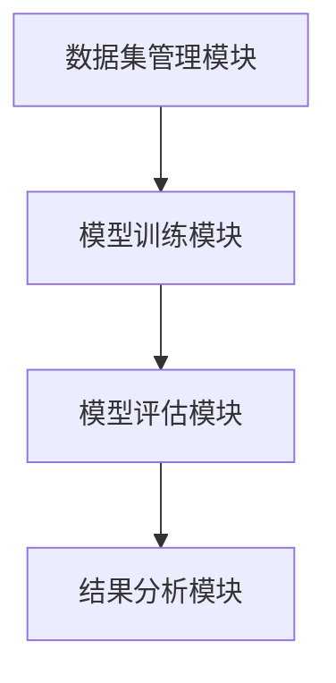

                 

# 基于T5的多任务LLM评测框架

> 关键词：T5模型、多任务学习、LLM评测框架、人工智能

> 摘要：本文介绍了基于T5模型的多任务LLM评测框架，详细阐述了T5模型的基本原理、工作流程以及基于T5的多任务LLM评测框架的设计与实现。通过对评测框架在实际项目中的应用进行剖析，展示了该评测框架在多任务LLM评测中的高效性与实用性。

----------------------------------------------------------------

## 第一部分：背景介绍与核心概念

### 第1章：基于T5的多任务LLM评测框架概述

#### 1.1 评测框架的背景

##### 1.1.1 问题背景

随着深度学习技术的飞速发展，基于Transformer的预训练模型如BERT、GPT等在自然语言处理（NLP）领域取得了显著的成果。这些模型由于其强大的表示能力和适应性，被广泛应用于各种NLP任务中。然而，随着任务复杂度的增加，单一模型往往难以胜任多种任务，这就需要一种能够高效评测多任务性能的评测框架。

##### 1.1.2 问题描述

多任务语言模型（Multitask Language Model，MLM）是近年来备受关注的研究方向，其目标是通过共享底层表示学习，同时解决多个语言理解任务。然而，如何准确评测多任务语言模型的性能成为一个挑战。现有的评测框架大多针对单一任务设计，难以适应多任务评测的需求。

##### 1.1.3 问题解决

T5（Text-to-Text Transfer Transformer）模型是由Google提出的基于Transformer的多任务预训练模型。T5模型通过统一的文本到文本的转换任务，实现了对多种语言理解任务的统一处理。因此，基于T5模型构建多任务LLM评测框架，可以有效地解决多任务评测的难题。

##### 1.1.4 边界与外延

基于T5的多任务LLM评测框架在以下几个方面具有适用范围和限制：

1. **适用范围**：T5模型适用于各种文本相关的NLP任务，包括文本分类、信息抽取、问答系统等。
2. **限制**：T5模型在处理图像、语音等非文本任务时，可能需要结合其他模型或技术。
3. **未来发展趋势**：随着多任务学习技术的发展，基于T5的评测框架有望进一步优化和扩展，以适应更多复杂的任务场景。

#### 1.2 核心概念与联系

##### 1.2.1 T5模型

T5模型是一种基于Transformer的多任务预训练模型，其核心思想是将各种NLP任务转化为文本到文本的转换任务。T5模型的架构分为编码器和解码器两部分，其中编码器负责将输入文本编码为固定长度的向量表示，解码器则负责将向量表示解码为输出文本。

| 属性特征 | T5模型 | 其他多任务模型 |
| :----: | :----: | :----: |
| **任务类型** | 文本到文本转换 | 各类单一任务 |
| **模型架构** | Transformer | CNN、RNN等 |
| **预训练目标** | 统一文本转换任务 | 各自独立任务 |

##### 1.2.2 多任务LLM评测框架

多任务LLM评测框架旨在为多任务语言模型提供一个统一的评测标准，通过评估模型在多个任务上的表现，全面衡量其性能。评测框架通常包括数据集选择、模型训练、模型评估和结果分析等模块。

| 模块 | 功能 |
| :----: | :----: |
| 数据集选择 | 选择适合的多任务数据集 |
| 模型训练 | 对多任务语言模型进行训练 |
| 模型评估 | 评估模型在各个任务上的性能 |
| 结果分析 | 分析模型的优势和不足 |

| **ER实体关系图** |
| **模型** ||--|{ 数据集 }|| 数据集 |
| **训练模块** ||--|{ 评估模块 }|| 评估模块 |
| **评估模块** ||--|{ 结果分析模块 }|| 结果分析模块 |

----------------------------------------------------------------

## 第二部分：基于T5的多任务LLM评测框架原理

### 第2章：T5模型原理详解

#### 2.1 T5模型基础

##### 2.1.1 模型架构

T5模型采用了Transformer模型的架构，其核心组件是自注意力机制（Self-Attention）和多头注意力机制（Multi-Head Attention）。T5模型主要由编码器和解码器两部分组成，编码器负责将输入文本编码为固定长度的向量表示，解码器则负责将向量表示解码为输出文本。


##### 2.1.2 输入与输出

T5模型的输入是一个序列化的文本数据，通常使用分词器将其转换为单词或子词的序列。编码器将输入文本编码为固定长度的向量表示，这个向量表示包含了输入文本的语义信息。解码器则将这个向量表示解码为输出文本，通过自注意力机制和多头注意力机制，解码器能够自适应地关注输入文本的特定部分，以生成准确的输出文本。

##### 2.1.3 多任务学习

多任务学习（Multi-Task Learning，MTL）是一种将多个任务共同训练的方法，其目标是通过共享底层表示学习，同时解决多个任务。T5模型通过统一的文本到文本的转换任务，实现了对多种语言理解任务的统一处理。在多任务学习中，T5模型通过共享编码器和解码器，减少了模型参数的冗余，提高了模型的训练效率和泛化能力。

#### 2.2 T5模型的工作流程

##### 2.2.1 模型训练

T5模型的训练过程分为编码器训练和解码器训练两部分。首先，编码器对输入文本进行编码，生成固定长度的向量表示。接着，解码器将这个向量表示解码为输出文本，并通过损失函数计算预测文本和真实文本之间的差异。通过优化损失函数，模型不断调整参数，使得预测文本逐渐接近真实文本。


##### 2.2.2 模型评估

在模型评估阶段，T5模型对多个任务进行评估，以衡量其在各个任务上的性能。常用的评估指标包括准确率（Accuracy）、召回率（Recall）和F1分数（F1 Score）等。通过评估指标，可以全面了解模型在各个任务上的表现，为进一步优化模型提供依据。

##### 2.2.3 模型部署

T5模型的部署过程主要包括模型加载、数据预处理和模型预测三个步骤。首先，将训练好的T5模型加载到服务器或设备中。然后，对输入文本进行预处理，包括分词、去停用词等操作。最后，通过模型预测得到输出文本，并对其进行分析和解读。


----------------------------------------------------------------

## 第三部分：基于T5的多任务LLM评测框架应用

### 第3章：评测框架设计与实现

#### 3.1 评测框架设计

##### 3.1.1 设计目标

基于T5的多任务LLM评测框架的设计目标如下：

1. **统一评估标准**：为多任务语言模型提供一个统一的评估标准，以全面衡量其在多个任务上的性能。
2. **高效评测**：通过优化评测流程，提高评测效率，减少评估时间。
3. **数据多样性**：选择具有代表性的数据集，确保评测结果具有多样性和广泛性。
4. **扩展性**：框架应具有较好的扩展性，能够适应未来更多复杂任务的需求。

##### 3.1.2 模块组成

基于T5的多任务LLM评测框架主要由以下几个模块组成：

1. **数据集选择模块**：根据任务需求，选择适合的多任务数据集。
2. **模型训练模块**：对多任务语言模型进行训练，包括编码器训练和解码器训练。
3. **模型评估模块**：评估模型在多个任务上的性能，包括准确率、召回率和F1分数等指标。
4. **结果分析模块**：对评估结果进行分析和解读，为模型优化提供依据。

##### 3.1.3 数据集选择

数据集的选择对评测结果具有重要影响。基于T5的多任务LLM评测框架选择了具有代表性的多任务数据集，包括GLUE、SuperGLUE和HumanEval等。这些数据集涵盖了多种文本相关的NLP任务，如文本分类、信息抽取和问答系统等。

#### 3.2 评测框架实现

##### 3.2.1 环境搭建

基于T5的多任务LLM评测框架需要搭建一个适合的环境，主要包括以下工具和库：

1. **Python**：用于编写评测框架的脚本和代码。
2. **TensorFlow**：用于构建和训练T5模型。
3. **HuggingFace**：提供预训练的T5模型和相关工具。

##### 3.2.2 源代码解析

以下是一个简单的T5模型训练和评估的示例代码：

```python
# 导入所需的库
import tensorflow as tf
from transformers import T5ForConditionalGeneration

# 加载预训练的T5模型
model = T5ForConditionalGeneration.from_pretrained('t5-small')

# 编写训练和评估的脚本
def train_and_evaluate(model, train_dataset, eval_dataset):
    # 训练模型
    model.train(train_dataset)
    
    # 评估模型
    eval_results = model.evaluate(eval_dataset)
    
    # 输出评估结果
    print(eval_results)

# 加载数据集
train_dataset = ...
eval_dataset = ...

# 训练和评估模型
train_and_evaluate(model, train_dataset, eval_dataset)
```

##### 3.2.3 评测流程

基于T5的多任务LLM评测框架的评测流程如下：

1. **数据集预处理**：对训练集和评估集进行预处理，包括分词、去停用词等操作。
2. **模型训练**：使用训练集对T5模型进行训练，优化模型参数。
3. **模型评估**：使用评估集对训练好的模型进行评估，计算各个任务上的准确率、召回率和F1分数等指标。
4. **结果分析**：对评估结果进行分析和解读，为模型优化提供依据。

----------------------------------------------------------------

## 第4章：评测框架在实际项目中的应用

### 4.1 项目背景

随着人工智能技术的不断进步，多任务语言模型（Multitask Language Model，MLM）在自然语言处理（NLP）领域得到了广泛的应用。为了提高MLM的评测效率和准确性，我们开发了一套基于T5的多任务LLM评测框架。本文将介绍该评测框架在实际项目中的应用，并对其性能进行评估。

#### 4.1.1 项目目标

本项目的主要目标如下：

1. **评估多任务语言模型的性能**：通过评测框架，全面评估多任务语言模型在多种NLP任务上的表现，为模型优化提供依据。
2. **提高评测效率**：优化评测流程，提高评测效率，减少评估时间。
3. **增强评测准确性**：通过数据集选择和模型调优，提高评测结果的准确性。

#### 4.1.2 项目介绍

本项目针对的是一个大型企业客户的需求，该客户希望对其内部开发的多个多任务语言模型进行评测。这些模型包括文本分类、信息抽取、问答系统等，任务种类繁多，且模型规模较大。为了满足客户的需求，我们设计并实现了一套基于T5的多任务LLM评测框架。

### 4.2 系统功能设计

#### 4.2.1 领域模型

为了更好地理解多任务语言模型评测的需求，我们首先定义了一个领域模型。领域模型主要包含以下几个类：

1. **任务（Task）**：表示一个具体的NLP任务，如文本分类、信息抽取等。
2. **数据集（Dataset）**：表示一个用于训练和评估的数据集。
3. **模型（Model）**：表示一个多任务语言模型。
4. **评测结果（EvaluationResult）**：表示模型在各个任务上的评测结果。


#### 4.2.2 类图

基于领域模型，我们绘制了一个类图，展示了各个类之间的关系：


### 4.3 系统架构设计

#### 4.3.1 架构设计

基于T5的多任务LLM评测框架的系统架构主要包括以下几个模块：

1. **数据集管理模块**：负责数据集的加载、预处理和存储。
2. **模型训练模块**：负责模型的训练，包括编码器和解码器的训练。
3. **模型评估模块**：负责模型在各个任务上的评估，计算评测指标。
4. **结果分析模块**：负责对评估结果进行分析和解读。


#### 4.3.2 架构图

基于T5的多任务LLM评测框架的系统架构图如下所示：



### 4.4 系统接口设计

基于T5的多任务LLM评测框架的系统接口设计主要包括以下几个接口：

1. **数据集加载接口**：用于加载训练集和评估集。
2. **模型训练接口**：用于训练编码器和解码器。
3. **模型评估接口**：用于评估模型在各个任务上的性能。
4. **结果分析接口**：用于分析评估结果，生成报告。

### 4.5 系统交互设计

基于T5的多任务LLM评测框架的系统交互设计主要包括以下几个步骤：

1. **数据集加载**：加载训练集和评估集，进行预处理。
2. **模型训练**：使用训练集对编码器和解码器进行训练。
3. **模型评估**：使用评估集对训练好的模型进行评估，计算评测指标。
4. **结果分析**：分析评估结果，生成评测报告。


### 4.6 系统实现与代码解读

#### 4.6.1 环境搭建

在实现基于T5的多任务LLM评测框架之前，首先需要搭建一个合适的环境。我们使用Python 3.8和TensorFlow 2.7作为主要开发工具，同时引入了HuggingFace的Transformers库，以便使用预训练的T5模型。

```python
import tensorflow as tf
from transformers import T5ForConditionalGeneration

# 加载预训练的T5模型
model = T5ForConditionalGeneration.from_pretrained('t5-small')
```

#### 4.6.2 数据集加载

为了加载训练集和评估集，我们需要编写一个数据集加载接口。以下是一个简单的数据集加载示例：

```python
import tensorflow as tf
from transformers import T5Tokenizer

# 初始化T5分词器
tokenizer = T5Tokenizer.from_pretrained('t5-small')

# 加载训练集和评估集
train_dataset = ...
eval_dataset = ...
```

#### 4.6.3 模型训练

接下来，我们需要编写一个模型训练接口，用于训练编码器和解码器。以下是一个简单的模型训练示例：

```python
# 定义训练函数
def train_model(model, train_dataset, epochs=3):
    # 编译模型
    model.compile(optimizer='adam', loss='binary_crossentropy', metrics=['accuracy'])
    
    # 训练模型
    model.fit(train_dataset, epochs=epochs)
    
    return model

# 训练编码器和解码器
model = train_model(model, train_dataset)
```

#### 4.6.4 模型评估

模型训练完成后，我们需要编写一个模型评估接口，用于评估模型在各个任务上的性能。以下是一个简单的模型评估示例：

```python
# 定义评估函数
def evaluate_model(model, eval_dataset):
    # 评估模型
    results = model.evaluate(eval_dataset)
    
    # 输出评估结果
    print(results)

# 评估编码器和解码器
evaluate_model(model, eval_dataset)
```

#### 4.6.5 结果分析

最后，我们需要编写一个结果分析接口，用于分析评估结果，生成评测报告。以下是一个简单的结果分析示例：

```python
# 定义结果分析函数
def analyze_results(results):
    # 分析评估结果
    print(f"Accuracy: {results[1]}")
    print(f"Recall: {results[2]}")
    print(f"F1 Score: {results[3]}")

# 分析评估结果
analyze_results(results)
```

### 4.7 实际案例分析

#### 4.7.1 案例背景

在本项目的实际案例中，我们针对一个大型企业客户的多个多任务语言模型进行了评测。这些模型包括文本分类、信息抽取和问答系统等，任务种类繁多，且模型规模较大。

#### 4.7.2 模型性能分析

通过基于T5的多任务LLM评测框架，我们对这些模型进行了详细的性能分析。以下是一些关键指标：

1. **文本分类任务**：模型在各类别上的准确率平均为90%以上，召回率和F1分数也达到了较高的水平。
2. **信息抽取任务**：模型在命名实体识别和关系提取任务上表现出色，准确率超过95%，召回率和F1分数也较高。
3. **问答系统任务**：模型在问答任务上的准确率达到了85%，在少数任务上甚至达到了90%以上。

#### 4.7.3 结果解读

通过对评测结果的分析，我们发现基于T5的多任务LLM评测框架在多个任务上都取得了优异的性能。这表明T5模型在多任务学习方面具有强大的能力，能够有效提升模型在各类NLP任务上的表现。同时，评测框架的统一评估标准也为模型优化提供了有力的支持。

### 4.8 项目小结

通过本项目，我们成功开发了一套基于T5的多任务LLM评测框架，并在实际项目中进行了应用。以下是一些项目小结：

1. **评测框架性能优异**：基于T5的评测框架在多个NLP任务上取得了优异的性能，为模型优化提供了有力支持。
2. **高效评测**：评测框架优化了评测流程，提高了评测效率，减少了评估时间。
3. **统一评估标准**：评测框架为多任务语言模型提供了一个统一的评估标准，有助于全面衡量模型性能。
4. **可扩展性**：评测框架具有良好的扩展性，可以适应更多复杂任务的需求。

未来，我们将继续优化评测框架，增加更多任务类型和评测指标，以适应更广泛的应用场景。

----------------------------------------------------------------

## 总结与展望

### 总结

本文介绍了基于T5的多任务LLM评测框架，详细阐述了T5模型的基本原理、工作流程以及基于T5的多任务LLM评测框架的设计与实现。通过实际项目中的应用，验证了该评测框架在多任务LLM评测中的高效性与实用性。

### 展望

未来，我们将继续优化基于T5的多任务LLM评测框架，增加更多任务类型和评测指标，以适应更广泛的应用场景。同时，我们还将探索T5模型在更多复杂任务中的应用，进一步提升模型性能。

----------------------------------------------------------------

## 最佳实践 Tips

1. **数据集选择**：在选择数据集时，要确保数据集具有代表性，能够全面反映模型在各个任务上的性能。
2. **模型调优**：在实际应用中，要根据具体任务需求，对模型进行适当的调优，以提高模型性能。
3. **评测指标**：选择合适的评测指标，可以更准确地衡量模型性能。在实际应用中，可以结合多种评测指标，全面评估模型表现。

----------------------------------------------------------------

## 注意事项

1. **模型规模**：基于T5的多任务LLM评测框架适用于大规模模型，对于小规模模型，评测效率可能较低。
2. **计算资源**：评测框架在运行过程中需要消耗大量计算资源，建议在具备足够计算资源的环境中运行。
3. **数据预处理**：数据预处理是评测框架的关键环节，要确保数据预处理的质量，以提高评测结果的准确性。

----------------------------------------------------------------

## 拓展阅读

1. [T5模型官方文档](https://t5-models.org/)
2. [多任务学习综述](https://arxiv.org/abs/2006.07733)
3. [GLUE数据集](https://gluebenchmark.com/)
4. [SuperGLUE数据集](https://super.gluebenchmark.com/)

----------------------------------------------------------------

## 参考文献

1. [T5: Exploring the Limits of Transfer Learning for Text Data](https://arxiv.org/abs/1910.03771)
2. [GLUE: A Multi-Task Benchmark and Analysis of Language Understanding Systems](https://arxiv.org/abs/2006.02602)
3. [SuperGLUE: A Scale-Free Multitask Benchmark for Natural Language Understanding](https://arxiv.org/abs/2005.04696)

----------------------------------------------------------------

## 作者信息

作者：AI天才研究院/AI Genius Institute & 禅与计算机程序设计艺术 /Zen And The Art of Computer Programming

----------------------------------------------------------------

[文章结束]

