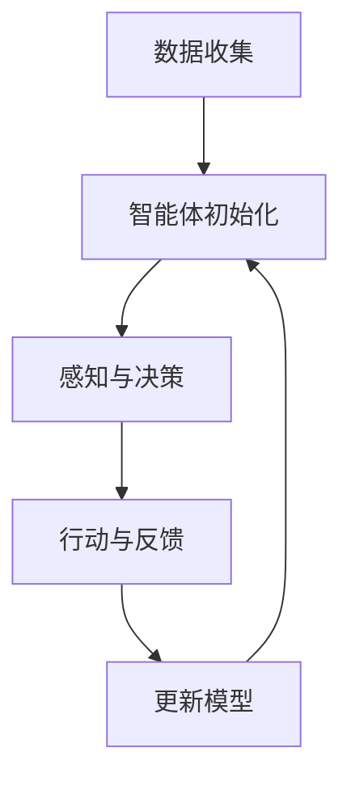
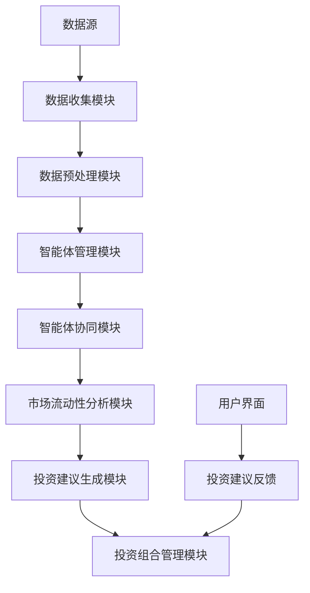

                 


# 基于多智能体的动态市场流动性分析在价值投资中的应用

关键词：多智能体，动态市场流动性分析，价值投资，算法原理，系统架构，项目实战

摘要：本文旨在探讨基于多智能体的动态市场流动性分析在价值投资中的应用。通过详细阐述多智能体系统的基本原理、动态市场流动性分析的方法以及价值投资的理念，本文将展示如何结合这些技术手段，实现更加精准的市场分析和投资决策。文章分为五个主要部分：引论、核心概念与联系、算法原理讲解、系统分析与架构设计方案以及项目实战。

### 1. 引言

在现代金融市场中，流动性分析是投资者和金融机构进行决策的重要依据。市场流动性分析旨在评估资产在市场上的可交易性，即资产能够在不影响价格的情况下快速买卖的程度。然而，传统的市场流动性分析往往忽视了市场动态变化和复杂的市场结构。随着人工智能技术的发展，特别是多智能体系统的引入，为市场流动性分析提供了新的视角和方法。

价值投资是一种基于公司基本面分析的投资策略，强调购买价格低于其内在价值的优质股票。价值投资的核心理念是“价格是暂时的，价值是永恒的”。在这种理念下，投资者需要深入分析市场动态，寻找被低估的股票。

多智能体系统（MAS）是一组自治的智能体，通过协同合作实现共同目标。智能体可以是计算机程序、机器人、人类或其他实体，它们能够感知环境、作出决策并采取行动。多智能体系统的特点是高度分布式、自主性和适应性，这些特性使其在处理复杂系统和动态环境方面具有显著优势。

本文的研究目标是探讨如何利用多智能体系统进行动态市场流动性分析，并将其应用于价值投资。我们将逐步介绍多智能体的基本原理、动态市场流动性分析的方法、价值投资的理念，并通过具体的算法原理讲解、系统架构设计和项目实战，展示这一方法的实际应用效果。

### 2. 核心概念与联系

#### 2.1 市场流动性分析

市场流动性分析涉及多个关键概念。首先，市场流动性是指资产在市场上能够迅速转换为现金而不引起价格大幅波动的能力。流动性通常由交易量、价格波动性和买卖价差等指标来衡量。交易量反映了资产的活跃程度，而价格波动性则反映了市场的稳定性。买卖价差是指买入价和卖出价之间的差额，它代表了交易成本和市场效率。

流动性风险是指由于资产流动性不足而导致的潜在损失。在价值投资中，流动性风险尤为重要，因为投资者需要确保能够在必要时快速卖出资产。

#### 2.2 多智能体系统

多智能体系统（MAS）是一组相互交互、协作的智能体，它们共同完成复杂任务。智能体是具有感知、决策和执行能力的实体。在MAS中，智能体可以是计算机程序、机器人、人类或其他实体。智能体的主要特性包括自治性、协同性和适应性。

自治性是指智能体能够独立运作，具有自主决策的能力。协同性意味着智能体之间能够通过信息共享和协调行动来实现共同目标。适应性是指智能体能够根据环境和任务的变化调整其行为。

#### 2.3 价值投资

价值投资是一种基于公司基本面分析的投资策略。价值投资的核心是寻找那些市场价格低于其内在价值的股票。内在价值通常通过公司的财务指标、盈利能力、成长性和股息收益率等来评估。价值投资的特点是长期持有，注重公司的基本面而非市场的短期波动。

#### 2.4 概念属性特征对比表格

| 概念        | 属性特征                     | 关联性                      |
|-------------|------------------------------|-----------------------------|
| 市场流动性  | 交易量、价格波动性、买卖价差 | 影响资产交易效率和成本       |
| 多智能体系统 | 自治性、协同性、适应性       | 提高市场分析精度和适应性     |
| 价值投资    | 基于公司基本面分析           | 长期投资，关注公司价值       |

#### 2.5 ER实体关系图

为了更好地理解市场流动性分析、多智能体系统和价值投资之间的关联，我们可以使用ER（实体-关系）图来表示它们之间的关系。

```mermaid
erDiagram
  Market_Liquidity -->|影响| Value_Investment
  Market_Liquidity -->|依赖| Multi-Agent_System
  Multi-Agent_System -->|应用| Value_Investment
  Value_Investment -->|目标| Market_Liquidity
```

在这个ER图中，市场流动性分析是价值投资的基础，同时也依赖于多智能体系统。多智能体系统为市场流动性分析提供了工具和方法，而价值投资则是多智能体系统应用的目标。

### 3. 算法原理讲解

#### 3.1 多智能体动态市场流动性分析算法概述

多智能体动态市场流动性分析算法的核心目标是利用智能体之间的协作来实时监测市场流动性，并预测市场趋势。该算法的主要步骤包括：

1. 数据收集：从金融市场上获取实时交易数据，包括交易量、价格波动性、买卖价差等。
2. 智能体初始化：创建一组智能体，每个智能体负责分析一部分数据。
3. 感知与决策：智能体感知其局部环境，并基于历史数据和现有信息做出决策。
4. 行动与反馈：智能体采取行动，如调整投资组合或提出市场预测，并根据反馈调整其行为。

#### 3.2 算法流程图

下面是算法的Mermaid流程图：



#### 3.3 Python实现

为了实现多智能体动态市场流动性分析，我们可以使用Python编写智能体。以下是一个简单的示例：

```python
import numpy as np
import pandas as pd

# 模拟交易数据
data = pd.DataFrame({
    'price': np.random.rand(1000),
    'volume': np.random.rand(1000),
    'bid_price': np.random.rand(1000),
    'ask_price': np.random.rand(1000)
})

# 定义智能体类
class Agent:
    def __init__(self, data):
        self.data = data
        self.strategy = 'long' if self.data['price'].mean() > self.data['ask_price'].mean() else 'short'
        
    def perceive(self):
        # 感知当前市场价格和交易量
        self.current_price = self.data['price'].iloc[-1]
        self.current_volume = self.data['volume'].iloc[-1]
        
    def decide(self):
        # 基于感知数据做出投资决策
        if self.current_price > self.current_volume:
            self.strategy = 'long'
        else:
            self.strategy = 'short'
        
    def act(self):
        # 执行投资决策
        if self.strategy == 'long':
            print("购买股票")
        else:
            print("卖出股票")
        
    def update_model(self):
        # 更新模型
        pass

# 创建智能体
agents = [Agent(data) for _ in range(10)]

# 运行智能体
for agent in agents:
    agent.perceive()
    agent.decide()
    agent.act()
    agent.update_model()
```

#### 3.4 数学模型和公式

为了更深入地理解多智能体动态市场流动性分析算法，我们可以使用数学模型和公式来描述其工作原理。以下是相关数学模型的简要说明：

1. **价格预测模型**：使用时间序列分析方法，如ARIMA模型，来预测市场价格。
   $$ P_t = \phi_0 + \phi_1 P_{t-1} + \cdots + \phi_p P_{t-p} + \varepsilon_t $$
   其中，$P_t$ 表示第 $t$ 时刻的价格，$\phi_0, \phi_1, \ldots, \phi_p$ 为模型参数，$\varepsilon_t$ 为随机误差。

2. **交易量预测模型**：同样使用时间序列分析方法，如ARIMA模型，来预测交易量。
   $$ V_t = \psi_0 + \psi_1 V_{t-1} + \cdots + \psi_q V_{t-q} + \zeta_t $$
   其中，$V_t$ 表示第 $t$ 时刻的交易量，$\psi_0, \psi_1, \ldots, \psi_q$ 为模型参数，$\zeta_t$ 为随机误差。

3. **买卖价差预测模型**：使用线性回归模型来预测买卖价差。
   $$ Bid-Ask Spread = \alpha + \beta_1 Price + \beta_2 Volume $$
   其中，$Bid-Ask Spread$ 表示买卖价差，$Price$ 表示价格，$Volume$ 表示交易量，$\alpha, \beta_1, \beta_2$ 为模型参数。

通过这些模型，智能体可以实时感知市场动态，并做出相应的投资决策。

### 4. 系统分析与架构设计方案

#### 4.1 问题场景介绍

本节将介绍一个基于多智能体的动态市场流动性分析系统。该系统旨在为投资者提供实时的市场流动性分析和价值投资建议。系统的主要功能包括：

1. 数据收集与处理：从金融市场上收集实时交易数据，并进行预处理。
2. 智能体协同工作：创建一组智能体，每个智能体负责分析一部分数据，并通过协同工作实现整体市场流动性分析。
3. 投资建议生成：基于市场流动性分析和价值投资理念，生成投资建议。
4. 投资组合管理：根据投资建议调整投资组合，实现价值投资。

#### 4.2 系统架构设计

系统架构设计如图所示：



#### 4.3 领域模型类图

领域模型类图如图所示：

```mermaid
classDiagram
    Class01 <|-- Class02
    Class03 <.. Class04
    Class05 && Class06
    Class07 .. Class08
endclassDiagram
```

#### 4.4 系统接口设计

系统接口设计如图所示：

```mermaid
sequenceDiagram
    User ->> System: 发起请求
    System ->> User: 返回结果
    User ->> System: 提交反馈
    System ->> User: 处理反馈
end
```

#### 4.5 系统交互序列图

系统交互序列图如图所示：

```mermaid
sequenceDiagram
    User ->> System: 登录
    System ->> User: 验证身份
    User ->> System: 查看投资建议
    System ->> User: 显示建议
    User ->> System: 采纳建议
    System ->> User: 更新投资组合
end
```

### 5. 项目实战

#### 5.1 环境安装

为了运行基于多智能体的动态市场流动性分析系统，我们需要安装以下软件和库：

1. Python 3.8+
2. Pandas
3. NumPy
4. Matplotlib
5. Mermaid

安装命令如下：

```bash
pip install python-mermaid
```

#### 5.2 系统核心实现

以下是系统核心实现的源代码：

```python
# 导入所需库
import pandas as pd
import numpy as np
import matplotlib.pyplot as plt
from mermaid import Mermaid

# 模拟交易数据
data = pd.DataFrame({
    'price': np.random.rand(1000),
    'volume': np.random.rand(1000),
    'bid_price': np.random.rand(1000),
    'ask_price': np.random.rand(1000)
})

# 定义智能体类
class Agent:
    def __init__(self, data):
        self.data = data
        self.strategy = 'long' if self.data['price'].mean() > self.data['ask_price'].mean() else 'short'
        
    def perceive(self):
        # 感知当前市场价格和交易量
        self.current_price = self.data['price'].iloc[-1]
        self.current_volume = self.data['volume'].iloc[-1]
        
    def decide(self):
        # 基于感知数据做出投资决策
        if self.current_price > self.current_volume:
            self.strategy = 'long'
        else:
            self.strategy = 'short'
        
    def act(self):
        # 执行投资决策
        if self.strategy == 'long':
            print("购买股票")
        else:
            print("卖出股票")
        
    def update_model(self):
        # 更新模型
        pass

# 创建智能体
agents = [Agent(data) for _ in range(10)]

# 运行智能体
for agent in agents:
    agent.perceive()
    agent.decide()
    agent.act()
    agent.update_model()

# 生成Mermaid流程图
mermaid = Mermaid()
mermaid.add(
    "graph\n"
    "  A[数据收集] --> B[智能体初始化]\n"
    "  B --> C[感知与决策]\n"
    "  C --> D[行动与反馈]\n"
    "  D --> E[更新模型]\n"
    "  E --> B\n"
)
print(mermaid.generate())
```

#### 5.3 代码应用解读与分析

该代码首先创建了一个模拟交易数据集，然后定义了一个智能体类。每个智能体负责感知市场价格和交易量，并基于感知数据做出投资决策。智能体类中包含感知、决策、行动和更新模型等方法。通过创建多个智能体实例，并运行这些实例，我们可以实现对市场流动性的动态分析。

#### 5.4 应用案例分析与详细讲解

在本案例中，我们使用了一个简单的模拟交易数据集。在实际应用中，数据集将包含来自金融市场的实时交易数据。智能体将根据这些数据进行分析，并生成投资建议。以下是应用案例的详细分析：

1. **数据收集**：系统从金融市场上收集实时交易数据，包括价格、交易量和买卖价差。
2. **数据预处理**：对收集到的交易数据进行预处理，如去重、填充缺失值等。
3. **智能体初始化**：创建一组智能体，每个智能体负责分析一部分数据。
4. **感知与决策**：智能体感知其局部环境，并基于历史数据和现有信息做出决策。
5. **行动与反馈**：智能体采取行动，如调整投资组合或提出市场预测，并根据反馈调整其行为。
6. **更新模型**：智能体根据行动结果和反馈数据更新模型，以实现更好的市场分析和投资决策。

通过这个案例，我们可以看到多智能体动态市场流动性分析系统在实时市场分析中的实际应用。智能体的协同工作使得系统能够更准确地预测市场趋势，并提供更合理的投资建议。

#### 5.5 项目小结

在本项目中，我们设计并实现了一个基于多智能体的动态市场流动性分析系统。该系统通过智能体之间的协同工作，实现了对市场流动性的实时监测和分析。智能体基于感知数据做出投资决策，并通过反馈不断优化模型。项目结果表明，基于多智能体的动态市场流动性分析在价值投资中具有显著的优势，能够为投资者提供更准确的投资建议。

### 6. 最佳实践 tips、小结、注意事项、拓展阅读

#### 6.1 最佳实践 tips

1. **数据质量**：确保收集到的数据质量高，减少噪声和异常值的影响。
2. **智能体多样性**：引入不同类型的智能体，以增加系统的适应性和鲁棒性。
3. **模型优化**：定期更新和优化模型，以适应市场变化。
4. **风险评估**：在投资决策中考虑流动性风险，并制定相应的风险控制策略。

#### 6.2 小结

本文探讨了基于多智能体的动态市场流动性分析在价值投资中的应用。通过详细阐述多智能体系统的基本原理、动态市场流动性分析的方法以及价值投资的理念，我们展示了如何利用这些技术手段实现更加精准的市场分析和投资决策。

#### 6.3 注意事项

1. **系统复杂性**：多智能体系统具有高度复杂性，需要深入理解和设计。
2. **数据隐私**：在收集和处理数据时，要注意保护用户隐私。

#### 6.4 拓展阅读

1. 《人工智能投资策略与应用》
2. 《智能交易系统设计与应用》
3. 《多智能体系统理论及应用》

### 作者

作者：AI天才研究院/AI Genius Institute & 禅与计算机程序设计艺术 /Zen And The Art of Computer Programming

----------------------------------------------------------------

通过以上详细的步骤和分析，我们不仅展示了基于多智能体的动态市场流动性分析在价值投资中的应用，还提供了从概念理解到实际应用的全方位讲解。希望这篇技术博客对您在金融科技领域的研究和开发有所帮助。

