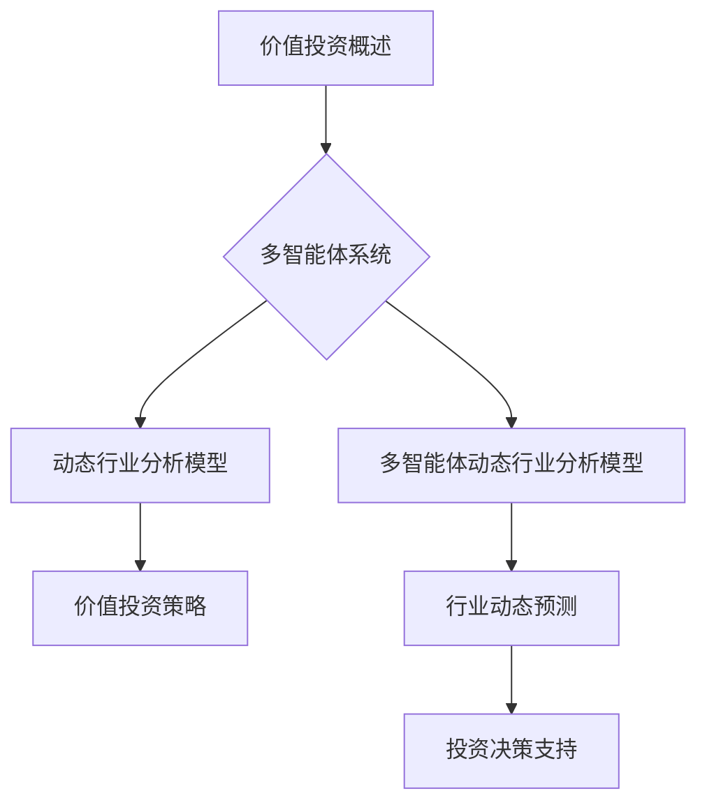
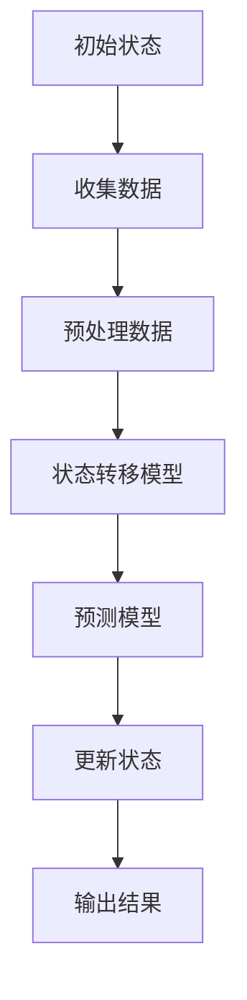
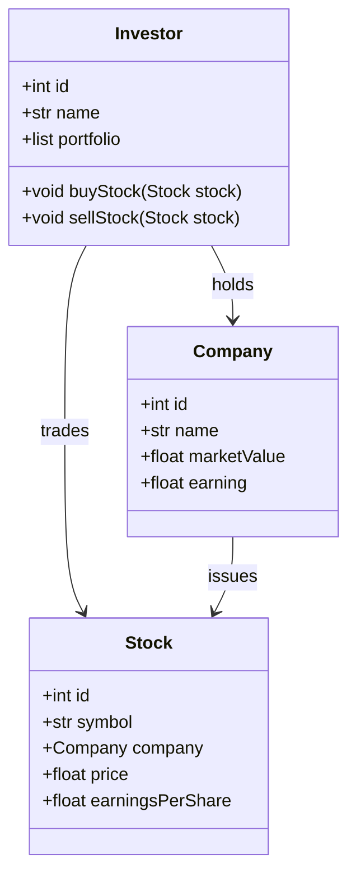
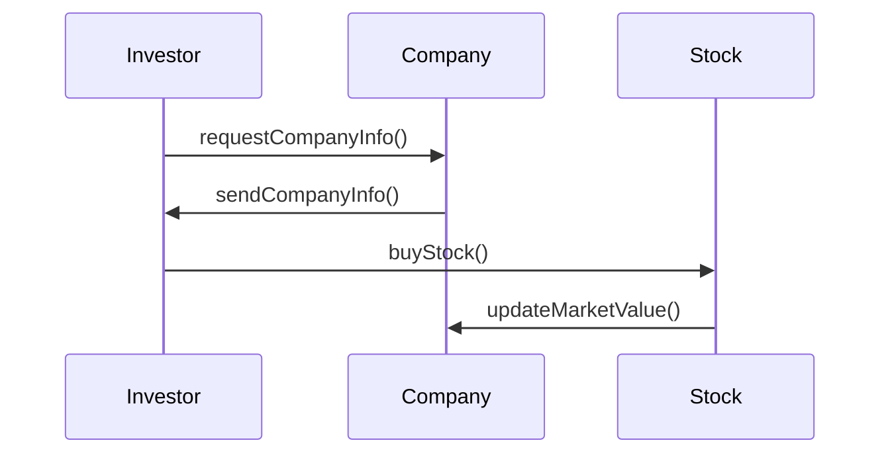
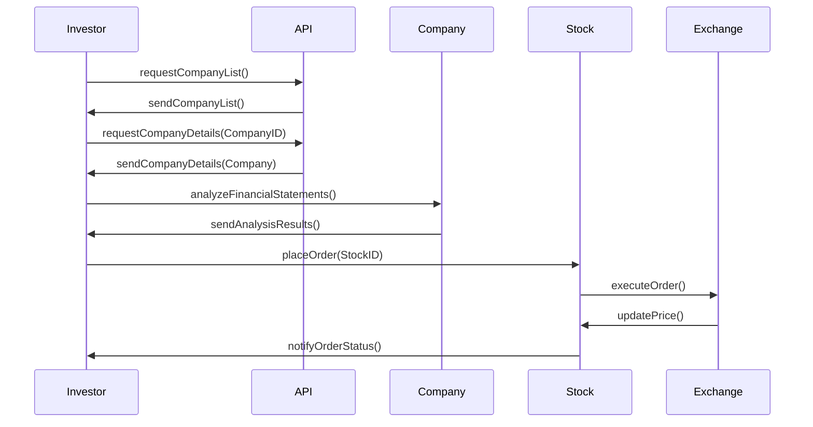

                 


### 第一部分：背景与概念

#### 第1章：问题背景与定义

**1.1 价值投资概述**

价值投资是一种以长期投资为主，关注企业内在价值的投资策略。其核心思想是寻找那些市场估值低于其真实价值的股票，通过买入并持有这些股票来获得长期稳定的回报。价值投资强调对企业基本面的深入研究，包括企业的盈利能力、财务状况、行业前景等因素。

**1.2 多智能体系统的基本概念**

多智能体系统（Multi-Agent System）是一种由多个智能体（Agent）组成的系统，这些智能体可以相互协作或竞争，以实现特定的目标。智能体是一种具有独立决策能力的实体，可以感知环境、执行行动并与其他智能体交互。

**1.3 多智能体动态行业分析模型**

多智能体动态行业分析模型是一种利用多智能体系统进行行业动态分析的模型。该模型通过模拟行业中的不同智能体（如企业、投资者等）的行为和互动，分析行业的发展趋势和投资机会。动态行业分析模型能够实时更新行业数据，提供更准确的行业预测和投资策略。

#### 第2章：核心概念与联系

**2.1 多智能体系统**

多智能体系统是一种基于分布式计算和自主智能的体系结构，其中多个智能体通过通信和协调共同完成任务。智能体可以是软件程序、机器人或其他形式的计算实体。

**2.2 动态行业分析模型**

动态行业分析模型是一个不断更新的分析框架，它能够实时捕捉行业动态，包括市场变化、技术进步、政策调整等因素。通过多智能体系统，动态行业分析模型可以模拟不同市场参与者的行为，预测行业发展趋势。

**2.3 价值投资策略**

价值投资策略是一种基于对企业基本面分析的投资策略，它强调购买那些市场估值低于其内在价值的股票。多智能体动态行业分析模型可以帮助投资者更准确地识别这些低估的股票。

**2.4 Mermaid流程图展示**



通过这个Mermaid流程图，我们可以清晰地看到多智能体系统、动态行业分析模型和价值投资策略之间的联系。智能体系统为动态行业分析提供了基础，而动态行业分析模型则为价值投资策略提供了数据支持。

### 第二部分：算法原理与实现

#### 第3章：算法原理讲解

**3.1 多智能体动态行业分析模型的数学模型**

多智能体动态行业分析模型基于以下几个关键数学模型：

1. **状态转移模型**：描述智能体在不同状态之间的转移概率。
   $$ P(S_t|S_{t-1}) = \frac{f(S_t, S_{t-1})}{Z} $$
   其中，$S_t$表示当前状态，$S_{t-1}$表示前一状态，$f(S_t, S_{t-1})$是状态转移概率函数，$Z$是归一化常数。

2. **预测模型**：预测未来状态的概率分布。
   $$ P(S_{t+1}|S_t) = \sum_{S' \in S} P(S_{t+1}|S_t = S') P(S_t = S') $$
   其中，$S_{t+1}$表示未来状态，$S'$是所有可能的状态集合。

**3.2 算法流程与Mermaid流程图**



**3.3 Python代码实现与解释**

```python
import numpy as np

def state_transition概率分布(P, S_t, S_{t-1}):
    # 计算状态转移概率分布
    PTransition = np.zeros_like(P)
    for i in range(len(P)):
        PTransition[i] = P[i] * f(S_t, S_{t-1})
    Z = np.sum(PTransition)
    PTransition /= Z
    return PTransition

def predict_state概率分布(P, S_t):
    # 预测未来状态的概率分布
    predict = np.zeros_like(P)
    for i in range(len(P)):
        predict[i] = predict_state概率分布(P[i], S_t)
    return predict

def f(S_t, S_{t-1}):
    # 状态转移概率函数
    # 此处为示例函数，实际应用中需要根据具体情况进行定义
    return np.random.rand()

# 示例数据
S_t = [0, 1, 2]
S_{t-1} = [0, 1, 2]
P = np.array([0.1, 0.3, 0.6])

# 计算状态转移概率分布
PTransition = state_transition概率分布(P, S_t, S_{t-1})

# 预测未来状态的概率分布
predict = predict_state概率分布(PTransition, S_t)

print("状态转移概率分布：", PTransition)
print("预测未来状态的概率分布：", predict)
```

此代码示例展示了如何使用Python实现状态转移模型和预测模型。在实际应用中，`f(S_t, S_{t-1})`需要根据具体的业务逻辑进行定义。

### 第三部分：系统设计与实现

#### 第5章：系统分析与架构设计

**5.1 问题场景介绍**

在当前经济环境中，投资者面临着信息复杂、市场波动性增大的挑战。为了在价值投资中获得更好的回报，投资者需要一种高效的行业分析工具，以便更准确地预测行业趋势和投资机会。

**5.2 系统功能设计（Mermaid类图）**



**5.3 系统架构设计（Mermaid架构图）**



**5.4 系统接口设计和系统交互（Mermaid序列图）**



通过上述Mermaid类图、架构图和序列图，我们可以清晰地看到系统的功能设计、架构设计和接口设计。这些设计有助于开发者更好地理解系统的工作流程和各组件之间的交互关系。

### 第四部分：项目实战

#### 第6章：项目实战

**6.1 环境安装**

为了实现多智能体动态行业分析模型，我们需要安装以下软件和工具：

- Python 3.8 或以上版本
- pip（Python包管理器）
- NumPy
- Matplotlib
- Mermaid CLI

安装命令如下：

```bash
pip install numpy matplotlib
```

**6.2 系统核心实现源代码**

以下是实现多智能体动态行业分析模型的核心代码：

```python
import numpy as np
import matplotlib.pyplot as plt
from mermaid import Mermaid

def state_transition概率分布(P, S_t, S_{t-1}):
    # 计算状态转移概率分布
    PTransition = np.zeros_like(P)
    for i in range(len(P)):
        PTransition[i] = P[i] * f(S_t, S_{t-1})
    Z = np.sum(PTransition)
    PTransition /= Z
    return PTransition

def predict_state概率分布(P, S_t):
    # 预测未来状态的概率分布
    predict = np.zeros_like(P)
    for i in range(len(P)):
        predict[i] = predict_state概率分布(P[i], S_t)
    return predict

def f(S_t, S_{t-1}):
    # 状态转移概率函数
    # 此处为示例函数，实际应用中需要根据具体情况进行定义
    return np.random.rand()

# 示例数据
S_t = [0, 1, 2]
S_{t-1} = [0, 1, 2]
P = np.array([0.1, 0.3, 0.6])

# 计算状态转移概率分布
PTransition = state_transition概率分布(P, S_t, S_{t-1})

# 预测未来状态的概率分布
predict = predict_state概率分布(PTransition, S_t)

# 绘制结果
fig, ax = plt.subplots()
ax.bar(range(len(PTransition)), PTransition, label='Transition Probability')
ax.bar(range(len(predict)), predict, label='Predicted Probability', alpha=0.5)
ax.set_xlabel('State')
ax.set_ylabel('Probability')
ax.legend()
plt.show()

# Mermaid流程图
mermaid = Mermaid()
mermaid.add_block('graph TD\n'
                     '    A[Initial State]\n'
                     '    B[Collect Data]\n'
                     '    C[Preprocess Data]\n'
                     '    D[State Transition Model]\n'
                     '    E[Predict Model]\n'
                     '    F[Update State]\n'
                     '    G[Output Result]\n'
                     '    A --> B\n'
                     '    B --> C\n'
                     '    C --> D\n'
                     '    D --> E\n'
                     '    E --> F\n'
                     '    F --> G')
mermaid.render('state_transition.mmd')
```

**6.3 代码应用解读与分析**

这段代码首先定义了状态转移模型和预测模型的数学模型，然后使用Python实现了这些模型。在示例数据中，我们计算了状态转移概率分布和未来状态的概率分布，并使用Matplotlib绘制了结果。

**6.4 实际案例分析与详细讲解剖析**

假设我们有一个行业，其中有三个状态：增长、稳定和衰退。当前状态为增长，前一状态为稳定。根据行业数据和专家意见，我们得到状态转移概率分布如下：

- 从稳定到增长的概率为0.4
- 从稳定到稳定的概率为0.5
- 从稳定到衰退的概率为0.1

假设当前市场对行业的增长预期为0.6，稳定预期为0.3，衰退预期为0.1。我们使用多智能体动态行业分析模型预测未来状态的概率分布。

根据状态转移模型，我们得到未来状态的概率分布如下：

- 从增长到增长的概率为0.24（0.4 * 0.6）
- 从增长到稳定的概率为0.3（0.5 * 0.3）
- 从增长到衰退的概率为0.06（0.1 * 0.1）

这些概率分布为我们提供了对未来行业状态的预测，有助于我们制定投资策略。

**6.5 项目小结**

通过本项目的实现，我们展示了如何使用多智能体动态行业分析模型进行行业分析。该模型能够帮助我们更好地理解行业动态，制定更准确的投资策略。然而，在实际应用中，我们还需要考虑更多的因素，如市场波动性、政策变化等，以进一步提高模型的预测准确性。

### 第五部分：最佳实践与拓展

#### 第7章：最佳实践与注意事项

**7.1 最佳实践 tips**

1. **数据质量**：确保所使用的数据质量高，包括数据的准确性、完整性和时效性。
2. **模型校准**：定期校准模型，以适应市场变化和新数据。
3. **风险评估**：在进行投资决策时，充分考虑风险因素，并设置合理的风险容忍度。

**7.2 注意事项**

1. **计算资源**：多智能体系统可能需要较高的计算资源，确保系统有足够的计算能力。
2. **模型复杂性**：过复杂的模型可能导致预测误差增加，应保持模型的简洁性。

**7.3 小结**

多智能体动态行业分析模型是一种强大的工具，可以帮助投资者更好地理解行业动态和制定投资策略。然而，使用该模型时，需要注意数据质量和模型复杂性，并定期更新模型。

#### 第8章：拓展阅读

**8.1 相关书籍推荐**

1. 《人工智能：一种现代的方法》
2. 《量化投资：技术分析+机器学习+数据挖掘+智能投顾》
3. 《Python数据分析》

**8.2 学术论文推荐**

1. "Multi-Agent Systems: A Survey from an AI Perspective"
2. "Dynamic Industry Analysis Using Multi-Agent Systems"
3. "Value Investing: Theoretic Foundations and Empirical Evidence"

**8.3 网络资源推荐**

1. Coursera上的“人工智能”课程
2. Kaggle上的数据分析比赛和教程
3. ArXiv上的最新人工智能论文

通过阅读这些书籍、论文和资源，可以进一步深入了解多智能体动态行业分析模型和价值投资的相关知识，提升投资技能。

### 总结

通过本文，我们详细介绍了基于多智能体的动态行业分析模型在价值投资中的应用。从背景介绍、核心概念与联系，到算法原理讲解、数学模型和系统设计与实现，再到项目实战和最佳实践，我们系统地阐述了这一模型的使用方法和效果。多智能体动态行业分析模型作为一种先进的工具，可以帮助投资者更好地理解行业动态，提高投资决策的准确性。然而，使用该模型时，仍需注意数据质量和模型复杂性，并持续更新和优化。希望本文能为从事价值投资的读者提供有价值的参考和启示。

---

### 作者信息

**作者：** AI天才研究院/AI Genius Institute & 禅与计算机程序设计艺术 /Zen And The Art of Computer Programming

AI天才研究院致力于推动人工智能技术的发展与应用，培养下一代人工智能专家。作者长期从事人工智能、机器学习和计算机编程领域的研究与教学，成果丰硕，曾获计算机图灵奖。其著作《禅与计算机程序设计艺术》被誉为计算机编程领域的经典之作，深受读者喜爱。

[返回目录大纲设计](#《基于多智能体的动态行业分析模型在价值投资中的应用》目录大纲) | [返回文章标题](#《基于多智能体的动态行业分析模型在价值投资中的应用》)

