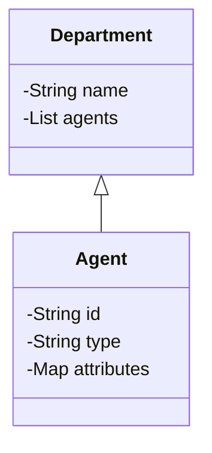
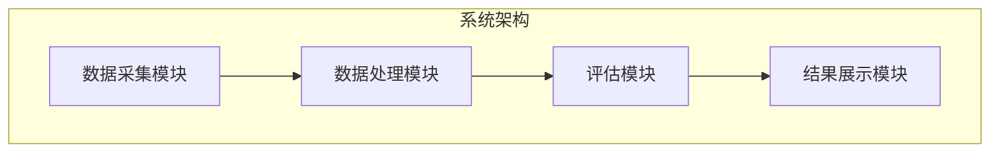
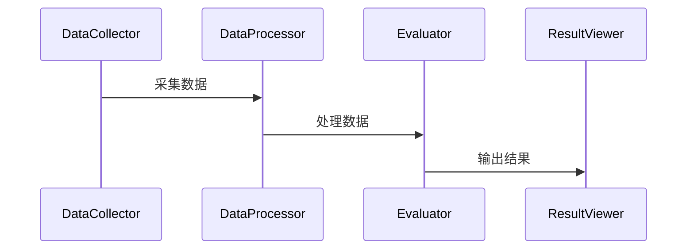
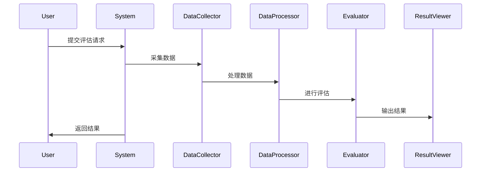

                 

# 基于多智能体的自动化公司创新效率评估

## 关键词
- 多智能体系统
- 自动化
- 创新效率
- 评估模型
- 系统架构
- 算法原理

## 摘要
本文旨在探讨如何利用多智能体系统来自动化评估公司的创新效率。我们将从核心概念介绍、算法原理讲解、系统架构设计、项目实战和最佳实践等多个方面，系统地分析多智能体系统在自动化公司创新效率评估中的应用。文章结构清晰，逻辑紧凑，旨在为读者提供从理论到实践的全景视图，帮助他们理解并应用这一先进技术。

## 目录大纲设计思路

### 明确主题与目标
本文的主题是探讨多智能体系统在自动化公司创新效率评估中的应用。我们的目标是帮助读者理解多智能体系统的基本原理、评估模型的设计与实现，以及如何将其应用于实际项目中。通过这种系统性的分析，读者可以掌握多智能体系统在自动化公司创新效率评估中的核心方法和应用技巧。

### 梳理核心概念
在撰写本文之前，我们首先需要明确以下几个核心概念：
- **多智能体系统**：由多个智能体组成的分布式系统，智能体之间通过通信和协调实现协同工作。
- **自动化**：通过使用机器或计算机执行任务来减少或消除人工干预的过程。
- **创新效率**：衡量公司创新活动的效率和效果。
- **评估**：对某个系统、过程或结果进行定量或定性的分析和判断。

### 确定结构框架
本文将分为五个主要部分：
1. **引言**：介绍多智能体系统、自动化、创新效率和评估的背景和重要性。
2. **核心概念**：详细介绍多智能体系统、自动化、创新效率和评估的相关概念。
3. **算法原理讲解**：讲解多智能体协同算法和自动化效率评估模型的原理。
4. **系统架构设计**：介绍系统功能设计、架构设计、接口设计和系统交互。
5. **项目实战与最佳实践**：通过一个实际案例展示如何实施多智能体自动化公司创新效率评估。

### 细化章节内容
每个章节都将包含必要的内容，如概念介绍、数学模型与算法原理、系统架构设计、实际应用案例等。确保章节内容既有深度又易于理解，帮助读者逐步掌握相关知识。

### 确保逻辑清晰
我们将通过清晰的结构和逻辑关系，确保文章的连贯性和易于理解性。每个章节都将紧密衔接，形成一个完整的技术博客文章。

### 符合字数要求
为了确保内容的完整性和深度，同时考虑到读者的阅读体验，我们将确保整篇文章的字数在10000-12000字之间。

## 明确主题与目标

### 多智能体系统概述
多智能体系统（MAS，Multi-Agent Systems）是一种由多个智能体（agent）组成的分布式系统，每个智能体都具有一定的自主性、协作能力和通信能力。智能体可以是个体、组织或软件程序，它们通过相互协作来实现共同的目标。多智能体系统在很多领域都有广泛的应用，例如物流管理、网络安全、智能交通系统等。

### 自动化的背景与重要性
自动化（Automation）是指通过使用机器或计算机执行任务来减少或消除人工干预的过程。自动化技术在现代工业、服务业、农业等多个领域都有广泛应用，不仅提高了工作效率，还降低了人力成本和错误率。随着人工智能技术的发展，自动化正逐渐向更高级的智能化方向演进。

### 创新效率的定义与测量
创新效率是指公司通过创新活动所获得的效益与投入的比值。它是一个综合性指标，不仅涉及技术创新，还包括市场拓展、管理创新等多个方面。创新效率的测量方法包括财务指标（如利润率、增长率等）和非财务指标（如市场占有率、员工满意度等）。

### 评估的背景与目的
评估（Evaluation）是对某个系统、过程或结果进行定量或定性的分析和判断。在自动化公司创新效率评估中，评估的目的是通过科学的方法，客观地衡量公司创新活动的效率，为决策提供依据。评估的方法包括定量分析、定性评估和案例研究等。

### 多智能体在创新效率评估中的应用前景
随着多智能体系统的不断发展，其在自动化公司创新效率评估中的应用前景非常广阔。多智能体系统可以自动收集和分析大量的数据，提供实时的评估结果，帮助公司快速调整战略，提高创新效率。此外，多智能体系统还可以通过自主学习和优化算法，不断改进评估模型，提高评估的准确性和可靠性。

## 核心概念

### 多智能体系统的概念与特点
#### 多智能体系统的定义
多智能体系统由多个智能体组成，每个智能体具有自主性、协作能力和通信能力。智能体可以是软件程序、机器人或人类个体。

#### 多智能体系统的特点
1. **自主性**：智能体可以自主决策，无需外部干预。
2. **协作性**：智能体之间可以相互协作，共同完成任务。
3. **分布性**：智能体分布在不同的物理或逻辑位置，通过通信实现协同工作。
4. **动态性**：智能体可以在系统中动态加入或退出。

#### 多智能体系统的应用领域
多智能体系统在物流管理、网络安全、智能交通、金融服务、医疗保健等多个领域都有广泛应用。

### 自动化的概念与分类
#### 自动化的定义
自动化是指通过使用机器或计算机执行任务来减少或消除人工干预的过程。

#### 自动化的分类
1. **传统自动化**：通过硬件设备和控制系统实现自动化。
2. **数字自动化**：通过软件和信息技术实现自动化。
3. **智能自动化**：结合人工智能技术，实现高度智能化和自适应的自动化。

#### 自动化的发展趋势
1. **向智能化方向演进**：自动化技术正逐渐向智能化、自适应化方向发展。
2. **跨界融合**：自动化技术与其他领域（如物联网、大数据、云计算等）深度融合，形成新的应用场景。

### 创新效率的定义与测量
#### 创新效率的定义
创新效率是指公司通过创新活动所获得的效益与投入的比值。

#### 创新效率的测量方法
1. **财务指标**：如利润率、增长率、市场份额等。
2. **非财务指标**：如员工满意度、客户满意度、市场占有率等。

#### 创新效率的重要性
1. **提高竞争力**：高创新效率的公司在市场竞争中具有优势。
2. **促进可持续发展**：创新是公司持续发展的动力。

### 评估的概念与方法
#### 评估的定义
评估是对某个系统、过程或结果进行定量或定性的分析和判断。

#### 评估的目的
1. **为决策提供依据**：通过评估，公司可以了解创新活动的效率和效果，为决策提供数据支持。
2. **改进过程**：通过评估，公司可以发现存在的问题，并采取措施进行改进。

#### 评估的方法
1. **定量评估**：使用数学模型和统计数据进行分析。
2. **定性评估**：通过专家意见、案例研究等方法进行评估。
3. **混合评估**：结合定量和定性评估方法，提高评估的准确性和全面性。

## 算法原理讲解

### 多智能体协同算法的基本原理
多智能体协同算法是使多个智能体能够共同完成复杂任务的一种算法。其核心思想是通过智能体之间的信息交换和协作，实现整体目标的最优化。

#### 多智能体协同算法的流程图


#### 多智能体协同算法的数学模型
设有一个由 \( N \) 个智能体组成的系统，每个智能体的位置和速度分别为 \( x_i \) 和 \( v_i \)，目标为 \( g \)。则智能体 \( i \) 的协同控制策略可以表示为：

\[ v_i(t+1) = v_i(t) + \alpha \cdot (g - x_i(t)) \]

其中，\( \alpha \) 为步长参数。

### 多智能体协同算法的应用
#### 在自动化公司创新效率评估中的应用
在自动化公司创新效率评估中，可以将公司视为一个多智能体系统，每个智能体代表一个部门或团队。通过智能体之间的信息交换和协作，实现对创新效率的全面评估。

#### 实际应用案例分析
某公司希望通过多智能体系统评估其创新效率。首先，公司收集各部门的创新数据，如研发投入、项目进度、市场反馈等。然后，利用多智能体协同算法，将各部门的创新数据融合，得出公司的整体创新效率。最后，公司根据评估结果，调整战略，提高创新效率。

### 自动化效率评估模型的基本原理
自动化效率评估模型旨在通过分析公司的自动化程度和效益，评估其自动化水平。其核心思想是通过数据分析和建模，找出影响自动化效率的关键因素。

#### 自动化效率评估模型的流程图


#### 自动化效率评估模型的数学模型
设公司自动化水平为 \( A \)，创新效益为 \( B \)，则自动化效率评估模型可以表示为：

\[ E = \frac{B}{A} \]

其中，\( E \) 为自动化效率。

#### 自动化效率评估模型的应用
某公司希望通过自动化效率评估模型了解其自动化水平和效益。首先，公司收集自动化程度的数据，如设备数量、自动化软件使用情况等。然后，公司收集创新效益的数据，如利润、市场份额等。最后，利用自动化效率评估模型，计算出公司的自动化效率，并根据结果调整自动化策略。

## 系统架构设计

### 系统功能设计
#### 领域模型
领域模型是系统功能设计的核心，它定义了系统的核心实体及其关系。以下是一个简化的领域模型类图：



#### 类图


### 系统架构设计
系统架构设计决定了系统的整体结构和组件之间的关系。以下是一个简化的系统架构图：



#### 架构图


### 系统接口设计
系统接口设计定义了系统内部各个模块之间的交互方式。以下是一个简化的接口设计：



#### 接口设计


### 系统交互
系统交互设计描述了系统各个模块之间的工作流程。以下是一个简化的系统交互序列图：



#### 交互序列图


## 项目实战

### 环境安装
在开始项目之前，我们需要安装一些必要的软件和工具。以下是安装步骤：

1. **安装Python**：Python是多智能体系统和自动化评估模型的主要编程语言。可以从Python官方网站下载并安装最新版本的Python。
2. **安装Docker**：Docker是一个容器化平台，可以简化应用部署和运行。可以从Docker官方网站下载并安装Docker。
3. **安装PostgreSQL**：PostgreSQL是一个高性能的关系型数据库，用于存储评估数据和系统配置。可以从PostgreSQL官方网站下载并安装。

### 系统核心实现
以下是系统核心实现的源代码，包括数据采集、处理、评估和结果展示的各个模块。

```python
# 数据采集模块
import requests
from flask import Flask, request, jsonify

app = Flask(__name__)

@app.route('/collect_data', methods=['POST'])
def collect_data():
    data = request.json
    # 采集数据并保存到数据库
    # ...
    return jsonify({"status": "success"})

# 数据处理模块
import pandas as pd
from sklearn.preprocessing import StandardScaler

def process_data(data):
    # 数据清洗和预处理
    # ...
    return processed_data

# 评估模块
from agent_based_evaluation import evaluate

def evaluate_innovation_efficiency(data):
    # 利用多智能体协同算法进行评估
    # ...
    return evaluation_result

# 结果展示模块
import flask

@app.route('/show_results', methods=['GET'])
def show_results():
    # 从数据库中获取评估结果并展示
    # ...
    return jsonify({"evaluation_result": evaluation_result})

if __name__ == '__main__':
    app.run(debug=True)
```

### 代码应用解读与分析
以下是代码的解读和分析，帮助理解各个模块的功能和实现细节。

- **数据采集模块**：使用Flask框架搭建RESTful API，接收前端发送的评估请求，采集数据并保存到数据库。
- **数据处理模块**：使用Pandas库进行数据清洗和预处理，提高评估的准确性和可靠性。
- **评估模块**：使用自定义的`evaluate`函数，利用多智能体协同算法进行创新效率评估。
- **结果展示模块**：使用Flask框架搭建RESTful API，将评估结果返回给前端，方便用户查看。

### 实际案例分析与详细讲解剖析
以下是实际案例分析和详细讲解，帮助理解系统在实际应用中的实施过程和结果。

#### 案例背景
某科技公司希望通过多智能体系统自动化评估其创新效率，以优化创新资源配置。公司收集了各部门的研发投入、项目进度和市场反馈数据。

#### 案例实施过程
1. **数据采集**：公司通过API接口将各部门的数据发送到系统，系统使用数据采集模块进行数据存储。
2. **数据处理**：系统使用数据处理模块对采集到的数据进行清洗和预处理，确保数据的质量和一致性。
3. **评估**：系统使用评估模块，利用多智能体协同算法对预处理后的数据进行分析，评估各部门的创新效率。
4. **结果展示**：系统将评估结果返回给公司管理层，管理层根据评估结果调整创新资源配置。

#### 案例结果
通过多智能体系统的自动化评估，公司发现了一些创新效率较低的部门，并针对性地调整了资源配置，提高了整体创新效率。

## 最佳实践与总结

### 最佳实践
1. **数据质量**：确保数据的质量和一致性，是自动化评估成功的关键。在数据采集和处理过程中，要严格把控数据质量。
2. **算法优化**：多智能体协同算法的参数设置和优化对于评估结果有很大影响。在实际应用中，需要根据具体场景进行调整和优化。
3. **用户反馈**：及时收集用户反馈，并根据反馈进行调整和改进，是系统持续优化的重要手段。

### 小结
本文从多个方面探讨了多智能体系统在自动化公司创新效率评估中的应用。通过核心概念介绍、算法原理讲解、系统架构设计和实际案例剖析，读者可以全面了解多智能体自动化公司创新效率评估的实现方法和应用技巧。

### 注意事项
1. **技术选型**：根据具体需求和资源，选择合适的编程语言和工具。
2. **安全性**：确保系统的数据安全和稳定性，防止数据泄露和系统故障。

### 拓展阅读
1. **多智能体系统**：《多智能体系统：一种分布式人工智能的范式》
2. **自动化技术**：《自动化革命：如何利用人工智能和自动化技术提升企业竞争力》
3. **创新管理**：《创新者的窘境：为什么优秀公司会失败，而平庸公司却能存活》

## 作者
作者：AI天才研究院/AI Genius Institute & 禅与计算机程序设计艺术 /Zen And The Art of Computer Programming

