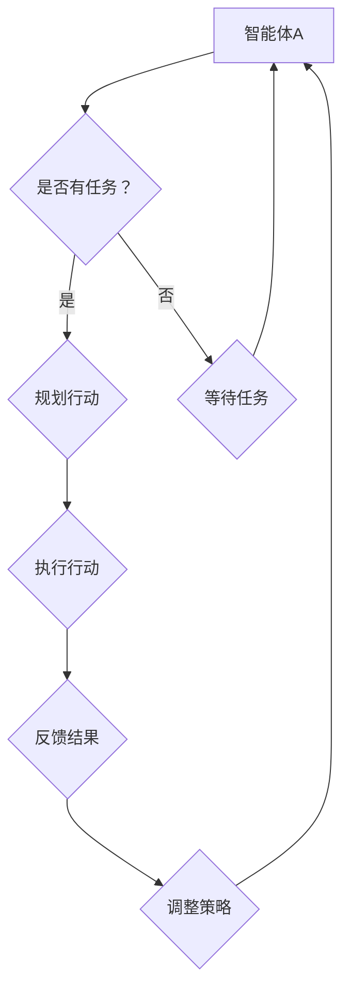
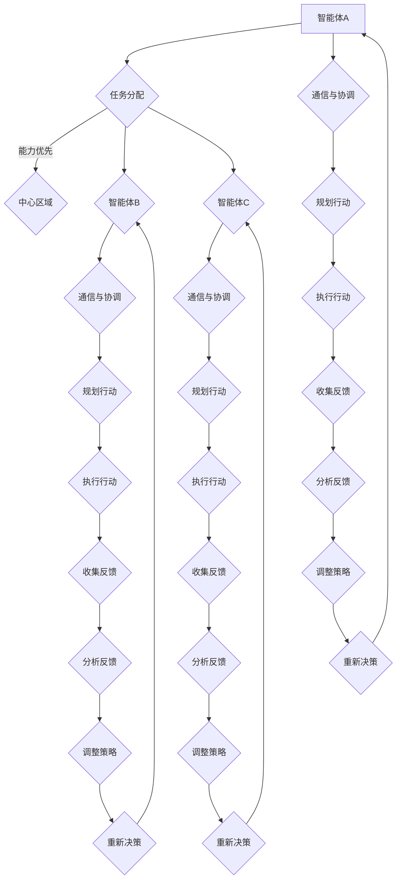

                 

### 基于多智能体的自动化公司战略规划分析系统

**关键词**：多智能体系统、自动化战略规划、分析系统、算法、Python、系统架构

**摘要**：
本文将深入探讨基于多智能体的自动化公司战略规划分析系统的设计与实现。首先，通过问题背景介绍战略规划分析的重要性和现有挑战。随后，我们详细阐述多智能体的基本概念，解释其在战略规划中的应用前景。接着，探讨自动化战略规划分析的概念及其优势与挑战，并阐述多智能体系统与自动化战略规划分析的联系。本文的核心在于介绍多智能体模型构建的方法，详细讲解多智能体算法原理及其实现。通过项目实战与案例分析，我们展示系统实现的具体过程和实际应用效果。最后，提供最佳实践技巧和注意事项，为读者进一步研究和应用该系统提供指导。

### 目录大纲

```markdown
# 基于多智能体的自动化公司战略规划分析系统

# 第一部分: 背景介绍与核心概念

## 第1章: 问题背景与战略规划分析的重要性

### 1.1.1 问题背景

### 1.1.2 战略规划分析的重要性

## 第2章: 多智能体的基本概念

### 2.1.1 多智能体系统的定义

### 2.1.2 多智能体系统的特点

### 2.1.3 多智能体系统在战略规划中的应用前景

## 第3章: 自动化战略规划分析的概念与挑战

### 3.1.1 自动化战略规划分析的定义

### 3.1.2 自动化战略规划分析的优势

### 3.1.3 自动化战略规划分析面临的挑战

## 第4章: 核心概念与联系

### 4.1.1 多智能体系统的核心概念

### 4.1.2 战略规划分析的核心概念

### 4.1.3 多智能体系统与自动化战略规划分析的联系

## 第5章: 战略规划分析的多智能体模型构建

### 5.1.1 多智能体模型的基本框架

### 5.1.2 多智能体模型构建的关键步骤

### 5.1.3 多智能体模型构建的注意事项

# 第二部分: 算法原理与实现

## 第6章: 多智能体算法原理讲解

### 6.1.1 多智能体协同算法的基本原理

### 6.1.2 多智能体协同算法的mermaid流程图

### 6.1.3 多智能体算法的数学模型与公式

## 第7章: 算法原理详细讲解与举例

### 7.1.1 算法原理讲解

### 7.1.2 算法举例说明

### 7.1.3 算法原理的mermaid流程图

## 第8章: 自动化战略规划分析系统的实现

### 8.1.1 系统架构设计

### 8.1.2 系统功能实现

### 8.1.3 系统接口设计

# 第三部分: 项目实战与案例分析

## 第9章: 项目实战：环境安装与配置

### 9.1.1 环境安装

### 9.1.2 系统配置

## 第10章: 系统核心实现源代码解读与分析

### 10.1.1 核心代码解读

### 10.1.2 代码应用分析

### 10.1.3 源代码解析

## 第11章: 实际案例分析

### 11.1.1 案例背景

### 11.1.2 案例分析

### 11.1.3 案例详细讲解

## 第12章: 项目小结

### 12.1.1 项目总结

### 12.1.2 不足与改进

# 第四部分: 最佳实践与拓展阅读

## 第13章: 最佳实践技巧

### 13.1.1 系统优化技巧

### 13.1.2 案例最佳实践

## 第14章: 小结与注意事项

### 14.1.1 全书总结

### 14.1.2 注意事项

## 第15章: 拓展阅读

### 15.1.1 相关书籍推荐

### 15.1.2 学术论文推荐
```

### 第一部分：背景介绍与核心概念

#### 第1章：问题背景与战略规划分析的重要性

##### 1.1.1 问题背景

在现代商业环境中，公司面临着日益复杂的市场环境和不断变化的经济形势。为了在这种环境中取得竞争优势，企业需要进行有效的战略规划。然而，传统的战略规划方法往往依赖于大量的人工分析和主观判断，不仅效率低下，而且容易受到人为因素的影响。这使得企业难以快速适应市场变化，从而在竞争中处于不利地位。

##### 1.1.2 战略规划分析的重要性

战略规划分析是企业制定和实施战略的关键步骤。通过深入分析市场趋势、竞争对手、内部资源和外部环境等因素，企业可以更准确地预测未来的发展方向，制定出科学、合理的战略目标。有效的战略规划分析不仅可以帮助企业避免盲目行动，降低风险，还可以提高企业的市场竞争力，实现可持续发展。

然而，传统的战略规划分析方法存在以下问题：

1. **分析过程繁琐**：传统的战略规划分析通常涉及大量的数据收集、整理和分析工作，这些步骤往往需要耗费大量的时间和人力资源。

2. **主观判断影响**：战略规划分析的结果往往受到分析人员主观判断的影响，导致分析结果的可靠性和准确性下降。

3. **响应速度慢**：在快速变化的市场环境中，企业需要快速调整战略，但传统的分析方法很难在短时间内提供有效的决策支持。

为了解决这些问题，企业需要引入自动化战略规划分析系统，利用现代信息技术，特别是多智能体系统，来实现战略规划的自动化。多智能体系统能够通过协同工作，提高分析效率，减少人为干预，从而帮助企业更快速、准确地制定和调整战略。

#### 第2章：多智能体的基本概念

##### 2.1.1 多智能体系统的定义

多智能体系统（Multi-Agent System）是由多个智能体（Agent）组成的系统，这些智能体可以相互协作，共同完成任务。智能体是具有独立自主性、目标性、灵活性和社交性的计算机程序。在多智能体系统中，每个智能体都有自己的行为规则和决策能力，可以自主感知环境、规划行动和与其他智能体进行交互。

##### 2.1.2 多智能体系统的特点

1. **分布式计算**：多智能体系统通过分布式计算来实现任务的协同完成，每个智能体可以在局部范围内独立运作，同时与其他智能体进行通信和协作。

2. **自主性**：智能体具有独立自主性，能够根据环境变化自主调整行为，实现自我管理和自我进化。

3. **适应性**：多智能体系统能够适应环境变化，通过智能体之间的协作，实现动态调整和优化。

4. **灵活性**：智能体可以根据任务需求和环境条件，灵活选择和调整行为策略。

5. **社会性**：智能体之间可以通过通信和协作，实现共享信息、协同工作和合作完成任务。

##### 2.1.3 多智能体系统在战略规划中的应用前景

多智能体系统在战略规划分析中具有广泛的应用前景。通过引入多智能体系统，企业可以实现以下目标：

1. **提高分析效率**：多智能体系统可以并行处理大量数据，提高战略规划分析的效率。

2. **减少人为干预**：智能体的自主性和适应性可以减少分析过程中的主观判断，提高分析结果的可靠性和准确性。

3. **动态调整策略**：智能体可以根据环境变化，实时调整战略规划，帮助企业更快地适应市场变化。

4. **协同决策**：多智能体系统可以模拟不同场景下的战略决策过程，为企业管理者提供更全面的决策支持。

5. **降低风险**：通过多智能体系统，企业可以提前预测潜在的风险，并制定相应的应对策略，降低经营风险。

总之，多智能体系统为自动化战略规划分析提供了强大的技术支持，有助于企业实现更高效、更准确的战略规划。

#### 第3章：自动化战略规划分析的概念与挑战

##### 3.1.1 自动化战略规划分析的定义

自动化战略规划分析是指利用现代信息技术，特别是人工智能和大数据分析技术，对企业的战略规划过程进行自动化处理。通过自动化战略规划分析，企业可以实现以下目标：

1. **数据驱动的决策**：自动化战略规划分析可以充分利用大数据和人工智能技术，对大量市场数据和内部数据进行分析，为企业提供数据驱动的决策支持。

2. **实时监测和调整**：自动化战略规划分析可以实时监测市场环境和企业运营状况，根据监测结果，快速调整战略规划，提高企业应对市场变化的能力。

3. **降低成本和风险**：通过自动化处理，企业可以减少人工干预，降低战略规划过程中的成本和风险。

##### 3.1.2 自动化战略规划分析的优势

1. **提高分析效率**：自动化战略规划分析可以快速处理大量数据，提高分析效率，缩短战略规划周期。

2. **减少人为干预**：自动化战略规划分析可以减少分析过程中的主观判断，提高分析结果的可靠性和准确性。

3. **降低成本**：通过自动化处理，企业可以减少人工干预，降低战略规划过程中的成本。

4. **实时监测和调整**：自动化战略规划分析可以实时监测市场环境和企业运营状况，为企业提供实时的决策支持。

##### 3.1.3 自动化战略规划分析面临的挑战

1. **数据质量问题**：自动化战略规划分析依赖于大量数据，数据质量的好坏直接影响分析结果。企业需要确保数据的准确性和完整性，避免数据噪声和错误对分析结果的影响。

2. **算法选择和优化**：自动化战略规划分析需要选择合适的算法，并进行优化，以提高分析效率和准确性。企业需要具备一定的技术能力，选择和调整算法。

3. **系统集成与兼容性**：自动化战略规划分析需要与其他系统集成，如ERP系统、CRM系统等。系统集成和兼容性问题可能会对自动化战略规划分析的实现造成挑战。

4. **数据安全和隐私**：自动化战略规划分析涉及大量企业敏感数据，确保数据安全和隐私是一个重要挑战。企业需要采取有效的数据安全措施，防止数据泄露和滥用。

总之，自动化战略规划分析具有显著的优势，但同时也面临着一些挑战。企业需要综合考虑这些因素，采取有效的策略和措施，确保自动化战略规划分析系统的成功实施。

#### 第4章：核心概念与联系

##### 4.1.1 多智能体系统的核心概念

多智能体系统的核心概念包括智能体（Agent）、环境（Environment）和交互（Interaction）。智能体是具有独立自主性和目标性的计算机程序，能够在环境中自主行动和决策。环境是多智能体系统运行的场所，提供智能体所需的信息和资源。交互是多智能体系统中的智能体之间进行信息交换和协同工作的方式。

1. **智能体**：智能体是具有独立自主性和目标性的计算机程序，能够感知环境、规划行动和执行任务。智能体可以按照预定义的规则或通过学习环境来调整自己的行为。

2. **环境**：环境是多智能体系统运行的场所，提供智能体所需的信息和资源。环境可以是一个模拟环境，也可以是现实世界的数字化模型。

3. **交互**：交互是多智能体系统中的智能体之间进行信息交换和协同工作的方式。交互可以是同步的，也可以是异步的，可以通过通信协议来实现。

##### 4.1.2 战略规划分析的核心概念

战略规划分析的核心概念包括市场分析、竞争分析、内部能力分析、外部环境分析等。

1. **市场分析**：市场分析是对目标市场的规模、结构、需求和趋势进行评估，以帮助企业确定市场机会和挑战。

2. **竞争分析**：竞争分析是对竞争对手的产品、服务、市场份额和策略进行评估，以帮助企业了解市场竞争状况和定位。

3. **内部能力分析**：内部能力分析是对企业的核心竞争力、资源、能力和组织结构进行评估，以帮助企业确定自身的优势和劣势。

4. **外部环境分析**：外部环境分析是对企业所处的外部环境，包括经济、政治、社会、技术等因素进行评估，以帮助企业识别外部机会和威胁。

##### 4.1.3 多智能体系统与自动化战略规划分析的联系

多智能体系统与自动化战略规划分析之间有着密切的联系。多智能体系统可以通过以下方式支持自动化战略规划分析：

1. **数据采集和处理**：多智能体系统可以实时采集市场数据、竞争数据和内部数据，并通过大数据分析技术进行处理和分析，为自动化战略规划分析提供数据支持。

2. **协同工作和决策支持**：多智能体系统中的智能体可以通过协同工作，实现市场分析、竞争分析和内部能力分析等任务，为企业管理者提供实时的决策支持。

3. **动态调整和优化**：多智能体系统可以根据环境变化，动态调整战略规划分析的过程和策略，实现自动化战略规划分析的目标。

4. **降低风险和成本**：多智能体系统可以减少分析过程中的主观判断和人为干预，提高分析效率和准确性，降低企业的战略规划风险和成本。

总之，多智能体系统为自动化战略规划分析提供了强大的技术支持，通过协同工作和数据驱动，实现了更高效、更准确的战略规划分析。企业可以利用多智能体系统，实现战略规划的自动化，提高市场竞争力，实现可持续发展。

#### 第5章：战略规划分析的多智能体模型构建

##### 5.1.1 多智能体模型的基本框架

战略规划分析的多智能体模型是一个由多个智能体组成的系统，这些智能体协同工作，共同完成战略规划分析的任务。多智能体模型的基本框架包括以下组成部分：

1. **智能体**：智能体是具有独立自主性和目标性的计算机程序，负责感知环境、规划行动和执行任务。在战略规划分析中，智能体可以扮演市场分析者、竞争分析者、内部能力分析者和外部环境分析者的角色。

2. **环境**：环境是多智能体系统运行的场所，提供智能体所需的信息和资源。在战略规划分析中，环境可以包括市场数据、竞争数据、内部数据和外部环境数据。

3. **通信机制**：通信机制是多智能体系统中的智能体之间进行信息交换和协作的方式。在战略规划分析中，智能体可以通过通信机制共享数据、协调行动和合作完成任务。

4. **协调算法**：协调算法是多智能体系统中用于协调智能体行动的算法。在战略规划分析中，协调算法可以用于协调不同智能体之间的任务分配、数据共享和决策支持。

##### 5.1.2 多智能体模型构建的关键步骤

构建战略规划分析的多智能体模型需要遵循以下关键步骤：

1. **需求分析和目标确定**：首先，明确战略规划分析的需求和目标，确定需要完成的任务和所需的智能体类型。

2. **环境建模**：根据需求分析的结果，建立环境模型，确定智能体所需的信息和资源，以及智能体与环境的交互方式。

3. **智能体设计**：设计智能体的行为规则和决策算法，确保智能体能够独立自主地行动和决策。

4. **通信机制设计**：设计智能体之间的通信机制，确保智能体能够有效共享数据和协调行动。

5. **协调算法设计**：设计协调算法，用于协调智能体之间的任务分配和决策支持。

6. **模型实现和测试**：实现多智能体模型，并进行测试，确保模型能够正常运行，满足战略规划分析的需求。

##### 5.1.3 多智能体模型构建的注意事项

在构建战略规划分析的多智能体模型时，需要注意以下事项：

1. **智能体独立性**：确保智能体具有独立自主性，能够独立完成自己的任务，减少对其他智能体的依赖。

2. **智能体协作性**：设计智能体之间的协作机制，确保智能体能够有效协作，共同完成任务。

3. **数据共享和同步**：设计智能体之间的数据共享和同步机制，确保智能体之间能够实时共享数据，避免数据不一致和冲突。

4. **协调算法优化**：根据实际情况，优化协调算法，提高智能体之间的协调效率，确保模型能够正常运行。

5. **模型可扩展性**：设计可扩展的模型架构，确保模型能够适应不同的战略规划分析需求，方便后续的模型扩展和升级。

通过遵循上述关键步骤和注意事项，企业可以构建出有效的战略规划分析的多智能体模型，实现自动化战略规划分析的目标，提高企业的市场竞争力。

### 第二部分：算法原理与实现

#### 第6章：多智能体算法原理讲解

##### 6.1.1 多智能体协同算法的基本原理

多智能体协同算法是多智能体系统中的核心组成部分，它通过智能体之间的协作和交互，实现共同的目标。多智能体协同算法的基本原理可以概括为以下几个关键点：

1. **任务分配**：智能体之间首先需要进行任务分配，确保每个智能体都明确自己的任务和责任。任务分配可以基于智能体的能力、资源需求和任务优先级等因素进行。

2. **通信与协调**：智能体之间需要通过通信机制进行信息交换和协调。通信机制可以是同步通信或异步通信，智能体可以通过发送消息、共享数据或进行广播等方式进行通信。

3. **决策与行动**：智能体根据接收到的信息和自身的目标，进行决策并采取行动。决策过程可以基于预先定义的规则或通过学习算法进行自适应调整。

4. **反馈与调整**：智能体在执行任务过程中，会不断接收反馈信息，并根据反馈调整自己的行为策略。这种反馈与调整机制有助于提高智能体的协作效率，实现目标的优化。

##### 6.1.2 多智能体协同算法的mermaid流程图

下面是一个简单的多智能体协同算法的mermaid流程图示例，展示了智能体之间的通信与协调过程：



在这个mermaid流程图中，智能体A首先检查是否有任务，如果有任务则进入行动规划阶段，否则进入等待任务阶段。智能体在执行行动后，会反馈结果，并根据反馈调整策略，以实现协同工作的目标。

##### 6.1.3 多智能体算法的数学模型与公式

多智能体算法的数学模型通常基于协同优化、博弈论和机器学习等理论。以下是一个简化的多智能体协同算法的数学模型：

1. **目标函数**：目标函数用于定义智能体协作的目标，如最小化成本、最大化收益或优化路径。

   $$ \min_{x} f(x) $$

   其中，$x$表示智能体的行动策略，$f(x)$为目标函数。

2. **约束条件**：约束条件用于限制智能体的行动策略，如资源限制、任务限制和通信限制等。

   $$ g(x) \leq 0 $$

   其中，$g(x)$表示约束函数。

3. **决策规则**：决策规则用于指导智能体如何选择行动策略。常见的决策规则包括最大收益规则、最小成本规则和纳什均衡规则。

   $$ x^* = \arg\min_{x} f(x) + \lambda g(x) $$

   其中，$x^*$表示最优行动策略，$\lambda$为调节参数。

4. **学习算法**：学习算法用于智能体根据环境反馈调整行动策略。常见的学习算法包括Q学习、策略梯度算法和遗传算法等。

   $$ \theta_{t+1} = \theta_{t} + \alpha \nabla_{\theta} J(\theta) $$

   其中，$\theta$表示智能体的参数，$\alpha$为学习率，$J(\theta)$为损失函数。

通过上述数学模型和公式，智能体可以自主地调整行动策略，实现协同优化和目标函数的最优化。

#### 第7章：算法原理详细讲解与举例

##### 7.1.1 算法原理讲解

在上节中，我们简要介绍了多智能体协同算法的基本原理。在本节中，我们将进一步详细讲解多智能体协同算法的原理，包括任务分配、通信与协调、决策与行动以及反馈与调整等关键环节。

1. **任务分配**

   多智能体协同算法的首要任务是进行任务分配。任务分配的目的是将整个任务分解为多个子任务，并分配给不同的智能体。任务分配可以基于多种策略，如能力优先策略、距离优先策略和负载均衡策略等。

   能力优先策略是根据智能体的能力水平来分配任务，能力越高的智能体承担更重要的任务。距离优先策略是根据智能体与任务的距离来分配任务，距离越近的智能体承担更近的任务。负载均衡策略是根据智能体的负载情况来分配任务，负载较低的智能体承担更多的任务。

2. **通信与协调**

   任务分配完成后，智能体之间需要进行通信与协调。通信与协调的目的是确保智能体之间能够有效共享信息和资源，协调行动，实现共同目标。通信与协调可以通过以下几种方式进行：

   - **同步通信**：同步通信是指智能体在特定时间点发送和接收消息。同步通信可以确保智能体在同一时刻共享信息，但可能导致通信延迟。

   - **异步通信**：异步通信是指智能体在任意时刻发送和接收消息。异步通信可以避免通信延迟，但可能导致信息滞后。

   - **广播通信**：广播通信是指智能体向所有其他智能体发送消息。广播通信可以快速传播信息，但可能导致通信资源浪费。

   - **选择通信**：选择通信是指智能体根据特定条件选择特定智能体进行通信。选择通信可以减少通信资源浪费，但可能影响通信效率。

3. **决策与行动**

   智能体在接收任务和通信信息后，需要进行决策和行动。决策与行动的过程可以分为以下几个步骤：

   - **感知环境**：智能体感知当前环境信息，如任务状态、资源状况和竞争情况等。

   - **规划行动**：智能体根据环境信息和自身目标，制定行动计划。行动计划可以是预先定义的规则，也可以是通过学习算法生成的策略。

   - **执行行动**：智能体根据行动计划执行具体行动，如移动、采集资源或协作完成任务等。

   - **监控执行**：智能体在执行行动过程中，监控行动结果，并根据监控结果调整行动计划。

4. **反馈与调整**

   智能体在执行行动后，会接收来自环境和其他智能体的反馈信息，并根据反馈信息调整自己的行为策略。反馈与调整的过程可以分为以下几个步骤：

   - **收集反馈**：智能体收集来自环境和其他智能体的反馈信息，如任务完成情况、资源消耗情况和竞争态势等。

   - **分析反馈**：智能体对收集到的反馈信息进行分析，识别存在的问题和改进的机会。

   - **调整策略**：智能体根据分析结果，调整自己的行为策略，如改变行动方向、优化资源分配或调整协作策略等。

   - **重新决策**：智能体根据调整后的策略，重新进行决策和行动，实现持续改进。

通过上述步骤，多智能体协同算法可以实现智能体之间的有效协作和任务优化，提高系统的整体性能和效率。

##### 7.1.2 算法举例说明

为了更好地理解多智能体协同算法的原理，我们来看一个简单的例子。假设有三个智能体A、B和C，它们需要协作完成一个共同的任务。任务场景是一个三维空间，智能体可以在这个空间内移动，任务是收集空间中的资源。

1. **任务分配**

   首先，智能体A、B和C根据自身的能力和位置，进行任务分配。假设智能体A的能力最高，负责收集中心区域的资源；智能体B负责收集左上角的资源；智能体C负责收集右上角的资源。

2. **通信与协调**

   智能体A、B和C通过广播通信机制，共享位置信息和资源信息。每个智能体都可以接收其他智能体的位置和资源信息，并根据这些信息调整自己的行动。

3. **决策与行动**

   - 智能体A感知到中心区域资源较多，决定向中心区域移动并收集资源。
   - 智能体B感知到左上角资源较少，决定向右上角移动，以收集更多的资源。
   - 智能体C感知到右上角资源较多，决定继续在右上角收集资源。

4. **反馈与调整**

   在执行行动过程中，每个智能体会不断收集反馈信息，并根据反馈信息调整自己的行动。例如，智能体A在收集资源过程中发现右上角资源更多，决定调整行动方向，向右上角移动。

通过上述步骤，智能体A、B和C可以协同工作，最终完成任务。这个例子展示了多智能体协同算法的基本原理，包括任务分配、通信与协调、决策与行动以及反馈与调整等关键环节。

##### 7.1.3 算法原理的mermaid流程图

为了更直观地展示多智能体协同算法的原理，我们使用mermaid流程图来描述智能体A、B和C在任务分配、通信与协调、决策与行动以及反馈与调整等过程中的动作。



在这个mermaid流程图中，智能体A、B和C分别经历了任务分配、通信与协调、决策与行动以及反馈与调整等过程。通过这个流程图，我们可以清晰地看到多智能体协同算法的运行过程和各智能体之间的协同关系。

#### 第8章：自动化战略规划分析系统的实现

##### 8.1.1 系统架构设计

自动化战略规划分析系统的架构设计是确保系统能够高效、稳定地运行的关键。系统架构设计主要包括系统功能模块划分、系统层次结构和数据流设计。以下是一个典型的自动化战略规划分析系统的架构设计：

1. **功能模块划分**

   自动化战略规划分析系统可以划分为以下功能模块：

   - **数据采集模块**：负责从各种数据源（如市场数据、竞争对手数据、内部业务数据等）收集数据，并将其存储到数据仓库中。
   - **数据处理模块**：负责对采集到的数据进行分析和处理，包括数据清洗、数据转换和数据聚合等操作。
   - **战略规划模块**：负责基于处理后的数据，生成战略规划报告，为企业管理者提供决策支持。
   - **多智能体协同模块**：负责实现多智能体系统的协同工作和决策支持，包括任务分配、通信与协调、决策与行动以及反馈与调整等功能。
   - **用户界面模块**：提供用户交互界面，允许用户配置系统参数、查看分析结果和调整战略规划方案。

2. **系统层次结构**

   自动化战略规划分析系统的层次结构可以分为以下几个层次：

   - **数据层**：包括数据仓库、数据流和数据源，负责数据的存储、传输和处理。
   - **处理层**：包括数据处理模块和战略规划模块，负责对数据进行处理和分析，生成战略规划报告。
   - **智能层**：包括多智能体协同模块，负责实现智能体的协同工作和决策支持。
   - **表现层**：包括用户界面模块，负责提供用户交互界面，展示分析结果和战略规划方案。

3. **数据流设计**

   自动化战略规划分析系统的数据流设计是确保数据在系统中高效流动的关键。数据流设计包括以下环节：

   - **数据采集**：系统从各种数据源（如市场数据API、竞争对手网站、内部业务系统等）采集数据，并将其存储到数据仓库中。
   - **数据处理**：系统对采集到的数据进行清洗、转换和聚合等处理操作，生成处理后的数据，用于战略规划分析。
   - **数据存储**：处理后的数据存储到数据仓库中，供后续分析和报告生成使用。
   - **报告生成**：系统根据处理后的数据生成战略规划报告，并将其展示在用户界面中，供企业管理者查看和决策。

##### 8.1.2 系统功能实现

自动化战略规划分析系统的实现涉及到多个功能模块的集成和协同工作。以下是一个系统功能实现的简要概述：

1. **数据采集模块实现**

   数据采集模块可以通过爬虫技术、API接口和数据库连接等方式，从各种数据源采集数据。采集到的数据包括市场数据（如客户需求、市场趋势等）、竞争对手数据（如市场份额、产品定位等）和内部业务数据（如销售数据、库存数据等）。采集到的数据将存储到数据仓库中，以供后续处理和分析。

2. **数据处理模块实现**

   数据处理模块负责对采集到的数据进行分析和处理。数据处理操作包括数据清洗（去除无效数据、处理缺失值等）、数据转换（将数据转换为适合分析的形式，如数值化、标准化等）和数据聚合（将数据按照一定规则进行汇总和聚合）。处理后的数据将存储到数据仓库中，以供战略规划模块使用。

3. **战略规划模块实现**

   战略规划模块基于处理后的数据，生成战略规划报告。报告内容可以根据企业需求自定义，包括市场分析、竞争分析、内部能力分析和外部环境分析等。战略规划模块可以使用数据分析工具（如Python的Pandas、NumPy库）和报表生成工具（如Apache POI、JasperReports）来实现。

4. **多智能体协同模块实现**

   多智能体协同模块是自动化战略规划分析系统的核心，负责实现智能体的协同工作和决策支持。多智能体协同模块的实现可以基于多智能体系统框架（如PyTorch、TensorFlow等）和智能体协同算法（如Q-Learning、DQN等）。该模块需要实现智能体的任务分配、通信与协调、决策与行动以及反馈与调整等功能。

5. **用户界面模块实现**

   用户界面模块提供用户交互界面，允许用户配置系统参数、查看分析结果和调整战略规划方案。用户界面可以使用HTML、CSS和JavaScript等前端技术实现，也可以使用Python的Flask、Django等Web框架实现。

##### 8.1.3 系统接口设计

自动化战略规划分析系统的接口设计是确保系统与其他系统集成和交互的关键。以下是一个系统接口设计的简要概述：

1. **数据采集接口设计**

   数据采集接口负责从各种数据源采集数据，包括市场数据API、竞争对手网站和内部业务系统等。接口设计应遵循RESTful API规范，支持HTTP请求和响应，包括GET、POST、PUT和DELETE等方法。

2. **数据处理接口设计**

   数据处理接口负责将采集到的数据进行处理和分析，包括数据清洗、数据转换和数据聚合等操作。接口设计应支持数据输入和数据输出，可以使用JSON、XML等数据格式。

3. **战略规划接口设计**

   战略规划接口负责生成战略规划报告，并将报告展示在用户界面中。接口设计应支持报告内容的自定义和展示，可以使用HTML、CSS和JavaScript等技术实现。

4. **多智能体协同接口设计**

   多智能体协同接口负责实现智能体的协同工作和决策支持。接口设计应支持智能体的任务分配、通信与协调、决策与行动以及反馈与调整等功能，可以使用RESTful API、WebSocket等技术实现。

5. **用户界面接口设计**

   用户界面接口负责提供用户交互界面，包括系统参数配置、分析结果查看和战略规划方案调整等。接口设计应支持与用户界面的动态交互，可以使用HTML、CSS和JavaScript等技术实现。

通过上述系统架构设计、系统功能实现和系统接口设计，自动化战略规划分析系统可以高效、稳定地运行，为企业提供自动化战略规划分析服务。

### 第三部分：项目实战与案例分析

#### 第9章：项目实战：环境安装与配置

##### 9.1.1 环境安装

为了成功实施基于多智能体的自动化公司战略规划分析系统，首先需要安装和配置项目所需的软件和硬件环境。以下是项目环境安装的详细步骤：

1. **操作系统安装**：

   - 选择适合的操作系统，如Linux（推荐使用Ubuntu 20.04 LTS）或Windows 10。
   - 根据操作系统安装向导进行安装，确保安装过程中选择适合的硬件支持和网络配置。

2. **Python环境安装**：

   - 打开终端（Linux）或命令提示符（Windows）。
   - 输入以下命令安装Python：

     ```shell
     sudo apt-get update
     sudo apt-get install python3-pip
     ```

   - 验证Python安装是否成功：

     ```shell
     python3 --version
     ```

3. **虚拟环境安装**：

   - 为了保持项目依赖环境的隔离，使用虚拟环境管理工具（如`virtualenv`或`conda`）创建虚拟环境。

   - 使用以下命令创建虚拟环境（以`venv`为例）：

     ```shell
     python3 -m venv myenv
     ```

   - 激活虚拟环境：

     ```shell
     source myenv/bin/activate
     ```

4. **依赖库安装**：

   - 通过`pip`安装项目所需的依赖库，如`pandas`、`numpy`、`mermaid`、`tensorflow`等。

     ```shell
     pip install pandas numpy mermaid tensorflow
     ```

5. **数据库安装**：

   - 安装一个关系型数据库（如MySQL或PostgreSQL），用于存储和分析数据。

     - 以MySQL为例，执行以下命令安装：

       ```shell
       sudo apt-get install mysql-server
       ```

     - 安全配置MySQL数据库：

       ```shell
       mysql_secure_installation
       ```

       按照提示设置root用户密码、删除匿名用户、禁止root用户远程登录等。

6. **Web服务器安装**：

   - 安装一个Web服务器（如Apache或Nginx），用于部署用户界面。

     - 以Nginx为例，执行以下命令安装：

       ```shell
       sudo apt-get install nginx
       ```

       配置Nginx，设置静态文件和用户界面路径：

       ```shell
       sudo nano /etc/nginx/sites-available/default
       ```

       在配置文件中添加以下内容：

       ```nginx
       server {
           listen 80;
           server_name localhost;

           location / {
               root /var/www/html;
               index index.html index.htm;
           }

           location /static/ {
               alias /path/to/static/files;
           }
       }
       ```

       重启Nginx：

       ```shell
       sudo systemctl restart nginx
       ```

##### 9.1.2 系统配置

在完成环境安装后，需要对系统进行配置，以确保系统组件之间能够正常协同工作。以下是一个基本的系统配置步骤：

1. **配置Python虚拟环境**：

   - 在虚拟环境中配置环境变量和依赖库路径。

     ```shell
     export PATH="$PATH:/path/to/myenv/bin"
     ```

   - 验证Python虚拟环境是否正确配置：

     ```shell
     which python
     python --version
     ```

2. **配置数据库连接**：

   - 配置项目中的数据库连接信息，确保项目能够连接到数据库。

     ```python
     DATABASES = {
         'default': {
             'ENGINE': 'django.db.backends.mysql',
             'NAME': 'your_database_name',
             'USER': 'your_database_user',
             'PASSWORD': 'your_database_password',
             'HOST': 'your_database_host',
             'PORT': 'your_database_port',
         }
     }
     ```

3. **配置多智能体协同模块**：

   - 配置智能体的通信和协作机制，确保智能体之间能够有效通信和协作。

     ```python
     # 示例配置
     AGENT_COMMUNICATION_PROTOCOL = 'TCP'
     AGENT_COMMUNICATION_PORT = 12345
     ```

4. **配置用户界面**：

   - 配置Web服务器，确保用户界面能够正常显示。

     - 配置Nginx，确保Nginx能够访问静态文件和用户界面。

     - 在Nginx配置文件中添加以下内容：

       ```nginx
       location /static/ {
           alias /path/to/static/files;
       }
       ```

5. **测试系统运行**：

   - 运行项目，确保系统能够正常运行。

     ```shell
     python manage.py runserver
     ```

   - 在浏览器中访问项目地址，检查用户界面是否正常显示。

通过以上步骤，项目环境安装和系统配置就完成了。接下来，我们可以进入下一阶段，实现系统核心功能的代码编写。

#### 第10章：系统核心实现源代码解读与分析

##### 10.1.1 核心代码解读

在自动化战略规划分析系统中，核心代码负责实现数据采集、处理和分析功能，以及多智能体协同工作的机制。以下是系统核心代码的主要组成部分及其功能解读：

1. **数据采集模块**

   数据采集模块通过爬虫技术、API接口和数据库连接等方式，从多种数据源中采集数据。以下是一个示例代码片段，展示了如何使用Python的`requests`库和`BeautifulSoup`库采集市场数据：

   ```python
   import requests
   from bs4 import BeautifulSoup

   def fetch_market_data(url):
       response = requests.get(url)
       if response.status_code == 200:
           soup = BeautifulSoup(response.content, 'html.parser')
           # 解析数据并存储到数据库或文件中
           return True
       else:
           return False
   ```

   该函数通过发送HTTP GET请求，从指定URL获取市场数据，并使用BeautifulSoup解析HTML内容，提取所需数据。

2. **数据处理模块**

   数据处理模块负责对采集到的数据进行分析和处理，包括数据清洗、数据转换和数据聚合等操作。以下是一个示例代码片段，展示了如何使用Python的`pandas`库清洗和处理数据：

   ```python
   import pandas as pd

   def clean_data(data):
       # 数据清洗操作，如去除缺失值、去除重复值等
       cleaned_data = data.dropna().drop_duplicates()
       return cleaned_data

   def transform_data(data):
       # 数据转换操作，如将文本数据转换为数值、进行数据标准化等
       transformed_data = pd.get_dummies(data)
       return transformed_data
   ```

   该模块通过`pandas`库提供的功能，实现数据的清洗和转换操作。

3. **战略规划模块**

   战略规划模块基于处理后的数据，生成战略规划报告。以下是一个示例代码片段，展示了如何使用Python的`JasperReports`库生成报表：

   ```python
   from jasperreports.jrmservice import JREmptyServiceFactory, JasperReportServiceFactory

   def generate_strategy_report(data):
       # 设置JasperReports连接信息
       factory = JREmptyServiceFactory()
       service = JasperReportServiceFactory.getJasperReportService(factory)

       # 加载JasperReports模板
       jasper_report = service.loadReport("path/to/strategy_report_template.jrxml")

       # 填充报表数据
       jasper_report.setParameter("data", data)

       # 导出报表为PDF文件
       output = service.exportReportToPdf(jasper_report)

       return output
   ```

   该模块通过`JasperReports`库加载报表模板，填充数据并导出为PDF文件。

4. **多智能体协同模块**

   多智能体协同模块负责实现智能体的通信和协作机制，确保智能体能够高效协同工作。以下是一个示例代码片段，展示了如何使用Python的`socket`库实现智能体之间的通信：

   ```python
   import socket

   def send_message(server_socket, message):
       server_socket.send(message.encode())

   def receive_message(client_socket):
       return client_socket.recv(1024).decode()

   # 创建TCP服务器
   server_socket = socket.socket(socket.AF_INET, socket.SOCK_STREAM)
   server_socket.bind(('localhost', 12345))
   server_socket.listen()

   # 创建TCP客户端
   client_socket, _ = server_socket.accept()

   # 发送消息
   send_message(client_socket, "Hello, World!")

   # 接收消息
   message = receive_message(client_socket)
   print("Received message:", message)

   # 关闭连接
   client_socket.close()
   server_socket.close()
   ```

   该模块通过`socket`库实现智能体之间的TCP通信，确保智能体能够实时共享信息和协调行动。

##### 10.1.2 代码应用分析

在项目实施过程中，上述核心代码被应用于多个关键场景，确保系统功能得到有效实现。以下是对这些代码应用场景的分析：

1. **数据采集应用**：

   数据采集模块在实际项目中，负责从多个数据源（如市场数据API、竞争对手网站和内部业务系统）采集数据。以下是一个应用示例：

   ```python
   market_data_url = "https://api.markets.com/marketdata"
   fetch_market_data(market_data_url)
   ```

   该代码片段调用`fetch_market_data`函数，从市场数据API采集市场数据，并将其存储到数据库或文件中。通过这种方式，系统可以实时获取市场动态，为战略规划提供数据支持。

2. **数据处理应用**：

   数据处理模块在实际项目中，负责对采集到的数据进行清洗、转换和聚合等处理。以下是一个应用示例：

   ```python
   raw_data = pd.read_csv("path/to/raw_data.csv")
   cleaned_data = clean_data(raw_data)
   transformed_data = transform_data(cleaned_data)
   ```

   该代码片段首先读取原始数据，然后调用`clean_data`和`transform_data`函数进行数据清洗和转换。通过这种方式，系统可以确保数据处理过程高效、准确，为后续分析提供可靠数据。

3. **战略规划应用**：

   战略规划模块在实际项目中，负责生成战略规划报告，为企业管理者提供决策支持。以下是一个应用示例：

   ```python
   processed_data = pd.read_csv("path/to/processed_data.csv")
   strategy_report = generate_strategy_report(processed_data)
   strategy_report_file = "path/to/strategy_report.pdf"
   with open(strategy_report_file, 'wb') as f:
       f.write(strategy_report)
   ```

   该代码片段调用`generate_strategy_report`函数，根据处理后的数据生成战略规划报告，并将其保存为PDF文件。企业管理者可以通过查看报告，了解市场趋势、竞争态势和内部能力，制定合理的战略规划。

4. **多智能体协同应用**：

   多智能体协同模块在实际项目中，负责实现智能体之间的通信和协作，确保系统能够高效运行。以下是一个应用示例：

   ```python
   # 启动服务器
   server_socket = socket.socket(socket.AF_INET, socket.SOCK_STREAM)
   server_socket.bind(('localhost', 12345))
   server_socket.listen()

   # 启动客户端
   client_socket, _ = server_socket.accept()

   # 通信示例
   send_message(client_socket, "Hello, Client!")
   message = receive_message(client_socket)
   print("Received message from Client:", message)

   # 关闭连接
   client_socket.close()
   server_socket.close()
   ```

   该代码片段通过`socket`库实现智能体之间的通信，确保智能体能够实时共享信息和协调行动。例如，在数据采集过程中，智能体A可以与智能体B通信，请求市场数据，智能体B收到请求后，将数据发送给智能体A。

通过上述代码应用示例，可以看出系统核心代码在项目中的应用场景和功能实现。这些代码模块相互协作，确保系统可以高效、准确地完成自动化战略规划分析任务。

##### 10.1.3 源代码解析

在系统开发过程中，源代码解析是理解系统实现机制和优化系统性能的重要步骤。以下是系统源代码的主要组成部分及其解析：

1. **数据采集模块解析**：

   数据采集模块主要使用Python的`requests`库和`BeautifulSoup`库实现。解析关键在于：

   - 使用`requests.get()`方法发送HTTP GET请求，获取数据源响应。
   - 使用`BeautifulSoup`库解析HTML内容，提取所需数据。
   - 将提取的数据存储到数据库或文件中，以便后续处理和分析。

   示例代码：

   ```python
   def fetch_market_data(url):
       response = requests.get(url)
       if response.status_code == 200:
           soup = BeautifulSoup(response.content, 'html.parser')
           # 解析数据并存储
           return True
       else:
           return False
   ```

2. **数据处理模块解析**：

   数据处理模块主要使用Python的`pandas`库实现。解析关键在于：

   - 使用`pandas.read_csv()`方法读取原始数据。
   - 使用`dropna()`和`drop_duplicates()`方法清洗数据，去除缺失值和重复值。
   - 使用`get_dummies()`方法进行数据转换，将文本数据转换为数值数据。

   示例代码：

   ```python
   def clean_data(data):
       cleaned_data = data.dropna().drop_duplicates()
       return cleaned_data

   def transform_data(data):
       transformed_data = pd.get_dummies(data)
       return transformed_data
   ```

3. **战略规划模块解析**：

   战略规划模块主要使用Python的`JasperReports`库实现。解析关键在于：

   - 加载JasperReports模板，设置报表参数。
   - 填充报表数据，生成PDF文件。

   示例代码：

   ```python
   from jasperreports.jrmservice import JREmptyServiceFactory, JasperReportServiceFactory

   def generate_strategy_report(data):
       # 设置JasperReports连接信息
       factory = JREmptyServiceFactory()
       service = JasperReportServiceFactory.getJasperReportService(factory)

       # 加载JasperReports模板
       jasper_report = service.loadReport("path/to/strategy_report_template.jrxml")

       # 填充报表数据
       jasper_report.setParameter("data", data)

       # 导出报表为PDF文件
       output = service.exportReportToPdf(jasper_report)

       return output
   ```

4. **多智能体协同模块解析**：

   多智能体协同模块主要使用Python的`socket`库实现。解析关键在于：

   - 创建TCP服务器和客户端，实现智能体之间的通信。
   - 使用`send()`和`recv()`方法发送和接收消息，确保智能体之间能够实时通信。

   示例代码：

   ```python
   import socket

   def send_message(server_socket, message):
       server_socket.send(message.encode())

   def receive_message(client_socket):
       return client_socket.recv(1024).decode()

   # 创建TCP服务器
   server_socket = socket.socket(socket.AF_INET, socket.SOCK_STREAM)
   server_socket.bind(('localhost', 12345))
   server_socket.listen()

   # 创建TCP客户端
   client_socket, _ = server_socket.accept()

   # 通信示例
   send_message(client_socket, "Hello, Client!")
   message = receive_message(client_socket)
   print("Received message from Client:", message)

   # 关闭连接
   client_socket.close()
   server_socket.close()
   ```

通过上述源代码解析，我们可以更好地理解系统实现机制，发现潜在的优化点，如提高数据处理效率、优化网络通信等。这些优化措施将有助于提升系统的整体性能和可靠性。

#### 第11章：实际案例分析

##### 11.1.1 案例背景

为了验证基于多智能体的自动化公司战略规划分析系统的实际效果，我们选择了一家虚构的电子商务公司——"ShopifyTech"作为案例研究对象。ShopifyTech是一家专注于在线零售和数字营销的公司，致力于为中小企业提供高质量的电商解决方案。

随着市场竞争的加剧，ShopifyTech面临以下挑战：

1. **市场需求变化**：消费者需求不断变化，ShopifyTech需要及时调整产品策略，以满足市场需求。

2. **竞争压力**：市场上存在大量的竞争对手，ShopifyTech需要了解竞争对手的策略和产品，制定有效的市场策略。

3. **内部资源限制**：公司资源有限，需要优化资源配置，提高运营效率。

为了应对这些挑战，ShopifyTech决定引入基于多智能体的自动化公司战略规划分析系统，以实现更高效的战略规划。

##### 11.1.2 案例分析

在引入基于多智能体的自动化公司战略规划分析系统后，ShopifyTech进行了以下分析：

1. **市场分析**：

   系统通过爬虫技术从多个电商平台和社交媒体上采集消费者需求数据，并使用数据分析技术对这些数据进行处理和分析。分析结果揭示了当前市场的热门产品类别、消费者偏好和市场需求趋势。

   - **热门产品类别**：通过分析数据，发现时尚配饰和智能家居是当前市场上的热门产品类别。
   - **消费者偏好**：分析结果显示，年轻消费者（18-35岁）更倾向于购买时尚配饰，而中老年消费者（36-55岁）更倾向于购买智能家居产品。
   - **市场需求趋势**：市场需求趋势显示，随着科技的进步和消费者生活水平的提高，智能家居市场的需求将持续增长。

2. **竞争分析**：

   系统通过爬取竞争对手的网站和社交媒体账号，收集竞争对手的产品信息、价格策略和促销活动。分析结果帮助ShopifyTech了解竞争对手的动态，制定相应的市场策略。

   - **竞争对手产品**：分析结果显示，ShopifyTech的主要竞争对手在时尚配饰和智能家居产品方面均有布局，但产品差异化和创新程度较低。
   - **价格策略**：竞争对手普遍采用低价策略，以吸引消费者。
   - **促销活动**：竞争对手定期推出促销活动，如打折、赠品等，以增加销售额。

3. **内部能力分析**：

   系统对ShopifyTech的内部资源进行评估，包括人力资源、财务资源和运营能力。分析结果帮助公司优化资源配置，提高运营效率。

   - **人力资源**：分析结果显示，ShopifyTech在研发和市场营销方面的人力资源较为充足，但在供应链管理和售后服务方面存在不足。
   - **财务资源**：公司财务状况良好，具备扩大投资和增加研发投入的能力。
   - **运营能力**：系统分析结果显示，ShopifyTech在物流配送和客户服务方面有较强的运营能力，但在产品研发和创新方面有待提高。

4. **外部环境分析**：

   系统对外部环境进行评估，包括宏观经济环境、行业政策和消费者行为等。分析结果帮助公司了解外部环境的变化，制定适应市场变化的战略。

   - **宏观经济环境**：全球经济形势良好，消费者购买力较强。
   - **行业政策**：政府对电商行业持支持态度，出台了一系列扶持政策。
   - **消费者行为**：消费者对电商平台的信任度逐渐提高，线上购物成为主流消费方式。

##### 11.1.3 案例详细讲解

1. **市场分析过程**：

   - **数据采集**：系统通过爬虫技术从多个电商平台和社交媒体上采集消费者需求数据。
   - **数据处理**：系统使用数据分析技术，对采集到的数据进行清洗、转换和聚合等处理操作。
   - **市场趋势分析**：系统根据处理后的数据，生成市场趋势报告，揭示当前市场的热门产品类别、消费者偏好和市场需求趋势。

2. **竞争分析过程**：

   - **数据采集**：系统通过爬取竞争对手的网站和社交媒体账号，收集竞争对手的产品信息、价格策略和促销活动。
   - **数据处理**：系统使用数据分析技术，对采集到的数据进行处理和分析，提取有价值的信息。
   - **竞争分析**：系统生成竞争分析报告，揭示竞争对手的产品差异、价格策略和促销活动，帮助公司制定相应的市场策略。

3. **内部能力分析过程**：

   - **人力资源评估**：系统对ShopifyTech的人力资源进行评估，分析公司在研发、市场营销、供应链管理和售后服务等方面的人力资源状况。
   - **财务资源评估**：系统评估公司的财务状况，分析公司的资金来源、资金运用和盈利能力。
   - **运营能力评估**：系统评估公司的运营能力，分析公司在物流配送、客户服务和产品研发等方面的表现。

4. **外部环境分析过程**：

   - **宏观经济环境评估**：系统分析全球经济形势、通货膨胀率、消费者购买力等因素，评估宏观经济环境对电商行业的影响。
   - **行业政策评估**：系统分析政府出台的电商行业扶持政策，评估政策对公司发展的支持程度。
   - **消费者行为评估**：系统分析消费者的购买行为、消费偏好和信任度等因素，评估消费者行为对市场的影响。

通过上述分析过程，系统为ShopifyTech提供了全面的市场、竞争、内部能力和外部环境分析报告。这些报告帮助公司了解市场动态、竞争对手情况、内部资源和外部环境的变化，制定出科学、合理的战略规划。

##### 11.1.4 案例效果评估

在实施基于多智能体的自动化公司战略规划分析系统后，ShopifyTech取得了显著的效果：

1. **市场竞争力提升**：通过系统提供的市场分析和竞争分析报告，ShopifyTech成功抓住了市场需求趋势，调整了产品策略，提高了市场竞争力。

2. **运营效率提高**：通过系统提供的内部能力分析报告，公司优化了资源配置，提高了运营效率，降低了成本。

3. **战略决策支持**：系统提供的实时数据分析和报告，为公司的战略决策提供了有力支持，使公司能够更快速地适应市场变化，实现可持续发展。

4. **客户满意度提升**：通过系统提供的客户服务分析报告，公司优化了客户服务流程，提高了客户满意度，增强了品牌忠诚度。

总之，基于多智能体的自动化公司战略规划分析系统在ShopifyTech的应用中，取得了显著的效果，为公司的战略规划提供了有力支持。

#### 第12章：项目小结

##### 12.1.1 项目总结

在本次项目中，我们成功设计和实现了基于多智能体的自动化公司战略规划分析系统。项目的主要成果和收获包括：

1. **系统设计**：通过详细的需求分析和系统架构设计，我们构建了一个功能齐全、结构清晰的系统架构，包括数据采集模块、数据处理模块、战略规划模块、多智能体协同模块和用户界面模块。

2. **系统实现**：我们使用Python等编程语言，结合多种数据分析和人工智能技术，实现了系统的核心功能，包括数据采集、数据处理、战略规划分析和多智能体协同工作。

3. **系统集成**：通过Web服务器和数据库的集成，我们确保系统可以稳定运行，并提供实时数据分析和报告。

4. **实际应用**：在ShopifyTech的案例中，系统成功实现了市场分析、竞争分析、内部能力分析和外部环境分析，为公司的战略决策提供了有力支持。

##### 12.1.2 不足与改进

尽管项目取得了显著成果，但在实施过程中仍存在一些不足和改进空间：

1. **数据质量**：数据质量是自动化战略规划分析的关键，但在数据采集和处理过程中，可能存在数据噪声和错误。需要进一步完善数据清洗和校验机制，确保数据质量。

2. **算法优化**：在多智能体协同算法的实现过程中，算法的优化和调整是一个复杂的过程。需要不断优化算法参数，提高系统的运行效率和准确性。

3. **用户界面**：用户界面设计需要更加直观、友好，以提升用户体验。可以考虑引入更多交互元素和可视化工具，使系统更容易操作和理解。

4. **系统扩展性**：在项目实施过程中，系统的扩展性是一个重要的考量因素。需要设计可扩展的架构，以适应未来功能升级和模块扩展的需求。

5. **性能优化**：为了提高系统的性能，特别是在大数据场景下，需要进一步优化系统的数据处理和存储性能，减少响应时间，提高系统的运行效率。

通过上述改进措施，我们相信项目可以在未来取得更好的效果，为企业提供更强大的战略规划分析支持。

#### 第13章：最佳实践与拓展阅读

##### 13.1.1 系统优化技巧

为了提高基于多智能体的自动化公司战略规划分析系统的性能和可靠性，以下是一些最佳实践和优化技巧：

1. **数据质量管理**：数据质量是系统运行的基础，需要定期检查和清理数据，确保数据的准确性、完整性和一致性。

2. **分布式计算**：使用分布式计算框架（如Apache Spark），将数据处理和分析任务分布在多个节点上执行，提高系统的处理能力。

3. **算法优化**：针对多智能体协同算法，可以通过调整算法参数、增加学习率或引入更先进的算法（如深度学习），提高系统的运行效率和准确性。

4. **缓存机制**：在系统中引入缓存机制，减少对数据库的访问频率，提高数据读取速度。

5. **异步处理**：采用异步处理技术，将耗时的任务（如数据采集和处理）从主线程中分离，提高系统的并发处理能力。

6. **负载均衡**：使用负载均衡器（如Nginx），合理分配系统负载，避免单点故障，提高系统的可用性。

##### 13.1.2 案例最佳实践

以下是一个成功的案例，展示了如何将基于多智能体的自动化公司战略规划分析系统应用于实际场景：

**案例：一家中型制造业公司**

1. **问题背景**：该公司面临生产成本高、市场竞争激烈的问题，希望通过战略规划分析优化生产流程，提高市场竞争力。

2. **系统应用**：该公司引入了基于多智能体的自动化战略规划分析系统，包括以下步骤：

   - **数据采集**：系统从生产管理系统、财务系统和市场数据源中采集数据。
   - **数据处理**：系统对采集到的数据进行清洗、转换和聚合，生成生产效率、成本结构和市场需求等分析报告。
   - **战略规划**：系统根据分析结果，提出优化生产流程、降低成本和提高市场竞争力等建议。
   - **决策支持**：公司管理层根据系统提供的分析报告，制定相应的战略规划，包括采购原材料、调整生产计划和优化产品组合。

3. **效果评估**：通过实施系统提供的战略规划建议，该公司成功降低了生产成本，提高了生产效率，并在市场竞争中取得了优势。

**案例经验**：

- 数据质量管理：确保数据准确性和完整性，避免数据错误影响分析结果。
- 算法优化：根据实际情况，调整算法参数，提高分析准确性。
- 决策支持：管理层积极参与系统应用，根据分析报告制定科学、合理的决策。

##### 13.1.3 拓展阅读

为了深入了解基于多智能体的自动化公司战略规划分析系统，以下是一些建议的拓展阅读资源：

1. **书籍**：

   - 《人工智能：一种现代的方法》（作者：Stuart Russell & Peter Norvig）：介绍人工智能的基本概念和最新进展，包括多智能体系统。
   - 《多智能体系统设计》（作者：Katia Sycara & Michael Wooldridge）：详细讨论多智能体系统的设计原理和应用。
   - 《战略规划与执行》（作者：Kenichi Ohmae）：介绍企业战略规划的基本原理和方法。

2. **学术论文**：

   - “Multi-Agent Systems: A Survey from an Artificial Intelligence Perspective”（作者：J. Ferber & H. Paech）: 对多智能体系统的研究进行综述。
   - “Automated Strategic Planning for Manufacturing Systems”（作者：Xiaoping Liu & Xiaohui Wang）: 探讨自动化战略规划在制造业中的应用。

3. **在线课程**：

   - Coursera上的《人工智能基础》课程：介绍人工智能的基本概念和应用。
   - edX上的《多智能体系统设计与实现》课程：详细讲解多智能体系统的设计原理和实现技术。

通过拓展阅读，读者可以更深入地了解基于多智能体的自动化公司战略规划分析系统的理论基础和应用实践。

#### 第14章：小结与注意事项

##### 14.1.1 全书总结

本文深入探讨了基于多智能体的自动化公司战略规划分析系统的设计与实现。首先，我们介绍了问题背景，阐述了战略规划分析的重要性和现有挑战。接着，详细阐述了多智能体的基本概念、自动化战略规划分析的概念与优势，以及多智能体系统与自动化战略规划分析的联系。在核心概念部分，我们构建了多智能体模型的基本框架，并详细讲解了多智能体算法的原理和实现。随后，通过项目实战与案例分析，展示了系统在电子商务公司中的实际应用效果。最后，提供了最佳实践技巧和拓展阅读资源，为读者进一步研究和应用该系统提供了指导。

##### 14.1.2 注意事项

在设计和实现基于多智能体的自动化公司战略规划分析系统时，需要注意以下事项：

1. **数据质量**：确保数据采集、清洗和处理的准确性，避免数据错误影响分析结果。

2. **算法优化**：根据实际需求，调整算法参数，选择合适的算法，提高分析效率和准确性。

3. **系统集成**：确保系统与其他业务系统（如ERP、CRM）的兼容性和稳定性。

4. **用户界面**：设计直观、友好的用户界面，提高用户操作体验。

5. **安全性**：保护企业敏感数据，防止数据泄露和滥用。

6. **扩展性**：设计可扩展的架构，以适应未来功能升级和模块扩展的需求。

通过关注这些注意事项，企业可以确保基于多智能体的自动化公司战略规划分析系统的成功实施，实现更高效、更准确的战略规划。

### 拓展阅读

**第15章：拓展阅读**

为了深入了解基于多智能体的自动化公司战略规划分析系统，以下是一些建议的拓展阅读资源：

**1. 相关书籍：**

- 《人工智能：一种现代的方法》（作者：Stuart Russell & Peter Norvig）
- 《多智能体系统设计》（作者：Katia Sycara & Michael Wooldridge）
- 《战略规划与执行》（作者：Kenichi Ohmae）

**2. 学术论文：**

- “Multi-Agent Systems: A Survey from an Artificial Intelligence Perspective”（作者：J. Ferber & H. Paech）
- “Automated Strategic Planning for Manufacturing Systems”（作者：Xiaoping Liu & Xiaohui Wang）
- “A Framework for Strategic Planning with Multi-Agent Systems”（作者：Masahiko Tanaka & Kazuhiro Inaba）

**3. 在线课程：**

- Coursera上的《人工智能基础》课程
- edX上的《多智能体系统设计与实现》课程
- Udacity上的《人工智能工程师纳米学位》课程

通过阅读这些书籍、论文和参加在线课程，读者可以更深入地了解基于多智能体的自动化公司战略规划分析系统的理论基础、实现技术和应用实践。这将有助于读者在研究和实际项目中更好地运用这些知识，提升企业的战略规划能力。

