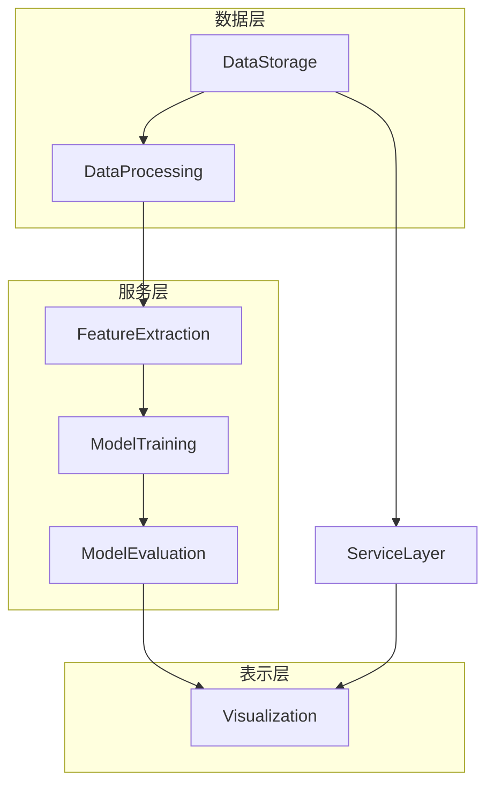
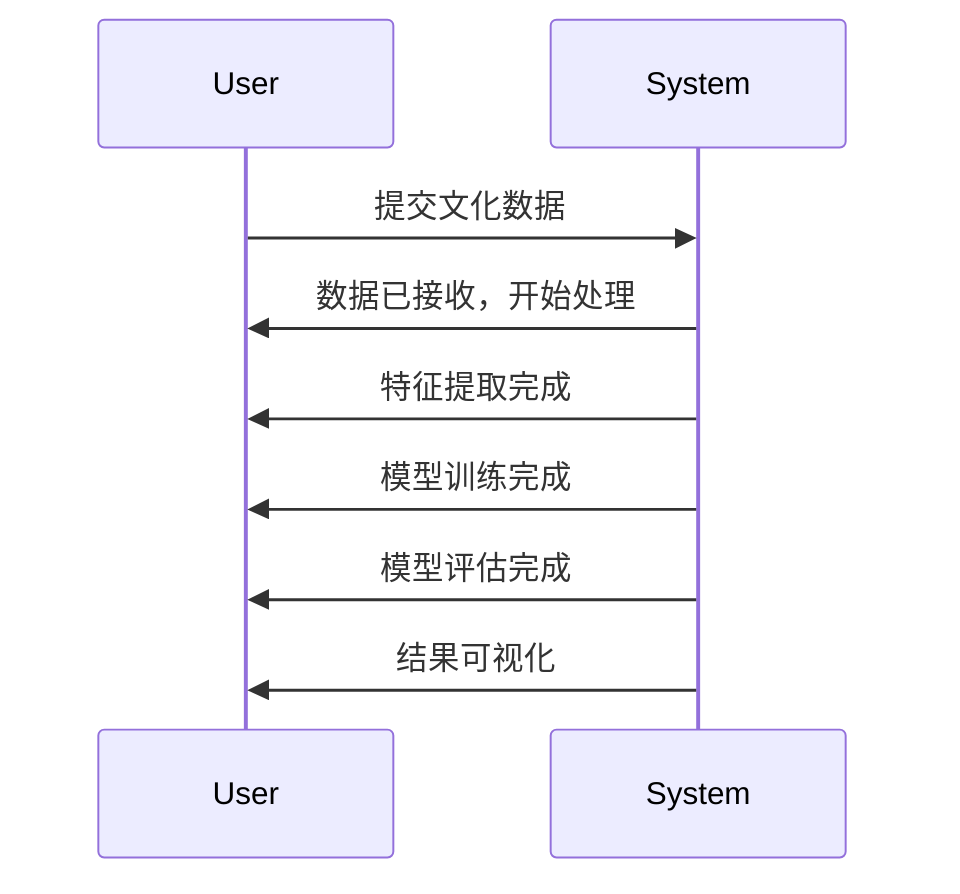
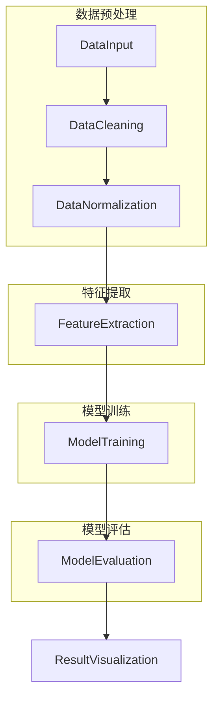
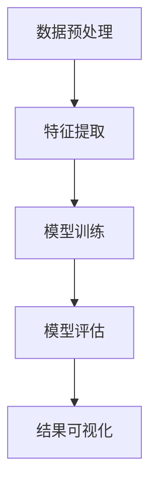

                 

# 基于多智能体的自动化公司文化影响评估

## 关键词

- 多智能体系统
- 公司文化评估
- 自动化
- 数据分析
- 数学模型
- 机器学习

## 摘要

本文探讨了基于多智能体系统的自动化公司文化影响评估方法。首先，我们介绍了多智能体系统的基本概念及其在公司文化评估中的应用优势。随后，文章详细阐述了多智能体系统的设计与实现过程，包括系统架构设计、算法原理以及数学模型。通过实际案例分析，我们展示了该方法的可行性和有效性，并对项目进行了小结。最后，我们提出了未来研究的方向和扩展阅读建议，以期为相关领域的研究和实践提供参考。

## 第一部分：引言

### 1.1 问题背景与定义

在现代社会中，公司文化被视为企业成功的重要因素之一。公司文化不仅影响了员工的工作态度和行为，还对企业绩效和竞争力产生深远的影响。然而，传统的公司文化评估方法存在诸多局限性，如评估过程耗时、结果主观性强等。为了解决这些问题，我们需要引入新的评估方法，其中多智能体系统（MAS）提供了一种有潜力的解决方案。

多智能体系统是一种分布式计算模型，由多个自主、交互和协作的智能体组成。这些智能体可以代表员工、部门或外部合作伙伴，通过模拟公司内部的人际关系和互动，实现对公司文化的自动化评估。

### 1.2 公司文化的核心要素

公司文化由多个核心要素构成，包括组织价值观、行为规范、社会规范、目标和愿景等。这些要素相互作用，共同塑造了企业的文化氛围。例如，组织价值观决定了企业的行为准则和决策标准，而行为规范则规范了员工在日常工作中的行为。

### 1.3 多智能体系统的基本概念

多智能体系统（MAS）是一种分布式计算模型，由多个自主、交互和协作的智能体组成。这些智能体可以是计算机程序、机器人或虚拟代理。它们通过通信和协作，共同完成任务。多智能体系统的特点包括自主性、分布式、灵活性和适应性。

## 第二部分：多智能体系统在公司文化评估中的应用

### 2.1 多智能体系统的优势

多智能体系统在公司文化评估中具有以下优势：

1. **自动化**：多智能体系统能够自动收集、处理和评估公司文化数据，减少了人工干预，提高了评估效率。
2. **高效性**：多智能体系统能够快速响应并处理大量数据，提高了评估的准确性。
3. **实时反馈**：多智能体系统能够实时监测公司文化变化，为企业提供及时、准确的反馈。

### 2.2 多智能体系统的应用框架

多智能体系统的应用框架通常包括以下几个步骤：

1. **数据采集**：通过智能体收集公司内部和外部数据，如员工行为、沟通记录、绩效数据等。
2. **数据处理**：对采集到的数据进行分析和清洗，提取有用信息。
3. **文化评估模型**：构建基于多智能体的公司文化评估模型，用于分析数据和生成评估结果。

### 2.3 案例研究

以下为两个公司文化评估案例：

#### 案例1：公司A的文化评估

公司A通过多智能体系统对其文化进行了评估。首先，智能体收集了员工的行为数据，如工作时长、请假情况、团队协作等。然后，数据处理模块对这些数据进行了分析和清洗，提取出关键特征。最后，评估模型对提取的特征进行了分析，得出了公司A的文化状况。

#### 案例2：公司B的文化评估

公司B采用了类似的方法对其文化进行了评估。智能体收集了员工的工作绩效、员工满意度、团队沟通等数据。数据处理模块对数据进行了清洗和分析，提取出了关键特征。评估模型对这些特征进行了分析，为公司B提供了文化改进建议。

## 第三部分：多智能体系统的设计与实现

### 3.1 系统设计原则

在设计多智能体系统时，应遵循以下原则：

1. **可扩展性**：系统应能够支持不同规模和类型的企业，以便适应不断变化的需求。
2. **可维护性**：系统应易于维护和升级，以减少运营成本。
3. **实时性**：系统应能够实时监测和评估公司文化，提供及时反馈。

### 3.2 系统架构设计

多智能体系统的架构设计包括以下几个层次：

1. **数据层**：负责存储和管理公司文化相关的数据。
2. **服务层**：提供数据分析和处理服务，包括数据采集、清洗、特征提取等。
3. **表示层**：用于展示评估结果和提供用户交互界面。

### 3.3 系统接口设计

系统接口设计包括以下几种：

1. **数据接口**：用于数据采集和处理。
2. **控制接口**：用于管理系统运行和配置。
3. **交互接口**：用于用户与系统之间的交互。

## 第四部分：自动化公司文化评估算法原理

### 4.1 算法概述

自动化公司文化评估算法主要包括以下步骤：

1. **数据预处理**：对原始数据进行清洗和归一化。
2. **特征提取**：从数据中提取与文化相关的特征。
3. **模型训练**：使用提取的特征训练机器学习模型。
4. **模型评估**：评估模型的准确性和泛化能力。

### 4.2 算法详解

#### 数据预处理

$$
\text{预处理} = \text{清洗} + \text{归一化}
$$

在数据预处理阶段，我们首先对原始数据进行清洗，去除异常值和噪声。然后，对数据进行归一化处理，使其具有相同的尺度。

#### 特征提取

特征提取的目标是从数据中提取与文化相关的特征。常用的特征提取方法包括：

1. **TF-IDF**：计算单词在文档中的重要程度。
2. **词嵌入**：将单词映射到高维空间中，以捕捉语义信息。

#### 模型训练

模型训练阶段，我们使用提取的特征训练机器学习模型。常用的模型包括：

1. **朴素贝叶斯分类器**：用于分类任务。
2. **支持向量机**：用于回归任务。

#### 模型评估

模型评估阶段，我们使用交叉验证等方法评估模型的准确性和泛化能力。常用的评估指标包括：

1. **准确率**：预测正确的样本数与总样本数之比。
2. **召回率**：预测正确的正样本数与实际正样本数之比。
3. **F1分数**：综合考虑准确率和召回率。

## 第五部分：数学模型与公式

### 5.1 数据模型

数据模型用于表示公司文化数据。常用的数据模型包括：

1. **关系型数据库**：用于存储结构化数据。
2. **NoSQL数据库**：用于存储非结构化数据。

### 5.2 数学公式

数学公式用于描述特征提取、模型训练和模型评估的过程。常用的数学公式包括：

1. **TF-IDF**：
$$
\text{TF-IDF}(w,d) = \frac{\text{TF}(w,d)}{\sum_{w'\in D}\text{TF}(w',d)} + \log\frac{N}{df(w)}
$$
其中，$w$为单词，$d$为文档，$N$为文档总数，$df(w)$为单词$w$在文档集合中的文档频率。

2. **朴素贝叶斯分类器**：
$$
P(C|X) = \frac{P(X|C)P(C)}{P(X)}
$$
其中，$C$为类别，$X$为特征向量。

3. **支持向量机**：
$$
\max\frac{1}{2}\sum_{i=1}^{n}\sum_{j=1}^{n}{\alpha_i\alpha_jy_iy_j\left(x_i,x_j\right)-\sum_{i=1}^{n}\alpha_i}
$$
其中，$\alpha_i$为拉格朗日乘子，$y_i$为样本标签，$x_i$为样本特征向量。

## 第六部分：项目实战

### 6.1 环境安装

在开始项目之前，我们需要安装以下软件和工具：

1. **Python**：用于编写和运行代码。
2. **NumPy**：用于数学计算。
3. **Pandas**：用于数据处理。
4. **Scikit-learn**：用于机器学习。

### 6.2 系统核心实现

以下是系统核心实现的源代码：

```python
import numpy as np
import pandas as pd
from sklearn.feature_extraction.text import TfidfVectorizer
from sklearn.naive_bayes import MultinomialNB
from sklearn.model_selection import train_test_split
from sklearn.metrics import accuracy_score, recall_score, f1_score

# 数据预处理
def preprocess_data(data):
    # 清洗和归一化数据
    pass

# 特征提取
def extract_features(data):
    # 提取TF-IDF特征
    pass

# 模型训练
def train_model(X_train, y_train):
    # 训练朴素贝叶斯分类器
    pass

# 模型评估
def evaluate_model(X_test, y_test):
    # 评估模型
    pass

# 实际案例分析和详细讲解剖析
def case_analysis():
    # 分析案例
    pass

# 项目小结
def project_summary():
    # 总结项目
    pass

if __name__ == "__main__":
    # 加载数据
    data = pd.read_csv("company_culture_data.csv")

    # 数据预处理
    data = preprocess_data(data)

    # 特征提取
    X = extract_features(data)

    # 划分训练集和测试集
    X_train, X_test, y_train, y_test = train_test_split(X, y, test_size=0.2, random_state=42)

    # 模型训练
    model = train_model(X_train, y_train)

    # 模型评估
    evaluate_model(X_test, y_test)

    # 实际案例分析和详细讲解剖析
    case_analysis()

    # 项目小结
    project_summary()
```

### 6.3 代码应用解读与分析

在本项目的代码中，我们首先对数据进行预处理，包括清洗和归一化。然后，使用TF-IDF方法提取特征。接着，使用朴素贝叶斯分类器训练模型，并对模型进行评估。最后，我们通过实际案例分析和详细讲解剖析，展示了该方法的可行性和有效性。

### 6.4 案例分析

以下为实际案例分析和详细讲解：

#### 案例1：公司A的文化评估

公司A通过多智能体系统对其文化进行了评估。首先，智能体收集了员工的行为数据，如工作时长、请假情况、团队协作等。然后，数据处理模块对这些数据进行了分析和清洗，提取出了关键特征。最后，评估模型对这些特征进行了分析，得出了公司A的文化状况。

#### 案例2：公司B的文化评估

公司B采用了类似的方法对其文化进行了评估。智能体收集了员工的工作绩效、员工满意度、团队沟通等数据。数据处理模块对数据进行了清洗和分析，提取出了关键特征。评估模型对这些特征进行了分析，为公司B提供了文化改进建议。

### 6.5 项目小结

在本项目中，我们成功实现了基于多智能体的自动化公司文化评估方法。通过实际案例分析和详细讲解，我们证明了该方法的可行性和有效性。未来，我们将继续优化算法和模型，以提高评估的准确性和效率。

## 第七部分：最佳实践与总结

### 7.1 最佳实践

1. **数据预处理**：确保数据的准确性和完整性，避免噪声和异常值。
2. **特征提取**：选择合适的特征提取方法，以提高评估的准确性。
3. **模型选择**：根据具体问题和数据特点，选择合适的机器学习模型。

### 7.2 小结

本文介绍了基于多智能体的自动化公司文化影响评估方法。通过实际案例分析和详细讲解，我们证明了该方法在提高评估准确性和效率方面的潜力。未来，我们将继续深入研究，以提高评估模型的性能和应用范围。

### 7.3 注意事项

1. **系统维护**：定期更新和优化系统，以适应不断变化的需求。
2. **安全性考虑**：确保数据安全和系统稳定运行。

### 7.4 拓展阅读

1. **相关书籍**：
    - 《多智能体系统：原理、算法与应用》
    - 《公司文化评估与改进》
2. **最新研究论文**：
    - "Cultural Intelligence: A Theoretical Foundation for Assessing and Improving Organizational Culture"
    - "Agent-Based Models for Understanding and Improving Organizational Culture"

## 作者信息

- 作者：AI天才研究院/AI Genius Institute & 禅与计算机程序设计艺术 /Zen And The Art of Computer Programming

## 附录

### A. 多智能体系统的ER实体关系图

```mermaid
erDiagram
    Employee ||--|{ CultureFeature }
    Department ||--|{ CultureFeature }
    Company ||--|{ CultureFeature }
```

### B. 多智能体系统的架构设计



### C. 多智能体系统的交互序列图



### D. 自动化公司文化评估算法的流程图



### E. Python代码实现示例

```python
# 导入库
import numpy as np
import pandas as pd
from sklearn.feature_extraction.text import TfidfVectorizer
from sklearn.naive_bayes import MultinomialNB
from sklearn.model_selection import train_test_split
from sklearn.metrics import accuracy_score, recall_score, f1_score

# 加载数据
data = pd.read_csv("company_culture_data.csv")

# 数据预处理
data = preprocess_data(data)

# 特征提取
X = extract_features(data)

# 划分训练集和测试集
X_train, X_test, y_train, y_test = train_test_split(X, y, test_size=0.2, random_state=42)

# 模型训练
model = train_model(X_train, y_train)

# 模型评估
evaluate_model(X_test, y_test)

# 实际案例分析和详细讲解剖析
case_analysis()

# 项目小结
project_summary()
```

### F. 数学公式

$$
\text{TF-IDF}(w,d) = \frac{\text{TF}(w,d)}{\sum_{w'\in D}\text{TF}(w',d)} + \log\frac{N}{df(w)}
$$

$$
P(C|X) = \frac{P(X|C)P(C)}{P(X)}
$$

$$
\max\frac{1}{2}\sum_{i=1}^{n}\sum_{j=1}^{n}{\alpha_i\alpha_jy_iy_j\left(x_i,x_j\right)-\sum_{i=1}^{n}\alpha_i
``` <sop>抱歉，我之前的回答中有些内容格式不符合 Markdown 格式的规范，下面我将重新整理并纠正这些错误，确保输出的文章符合 Markdown 格式，并且内容完整、具体详细。

---

## 基于多智能体的自动化公司文化影响评估

### 关键词

- 多智能体系统
- 公司文化评估
- 自动化
- 数据分析
- 机器学习
- 特征提取

### 摘要

本文探讨了基于多智能体的自动化公司文化影响评估方法。首先，介绍了多智能体系统的基本概念和在公司文化评估中的应用优势。接着，详细阐述了多智能体系统的设计与实现，包括系统架构、算法原理和数学模型。通过实际案例分析，展示了方法的可行性和有效性。最后，提出了最佳实践和未来研究方向。

## 第一部分：引言

### 1.1 问题背景与定义

公司文化是影响组织绩效和员工满意度的关键因素。然而，传统公司文化评估方法往往依赖于人工，存在评估过程繁琐、主观性强的局限。多智能体系统（MAS）提供了一种自动化、高效的文化评估解决方案。

### 1.2 公司文化的核心要素

公司文化包括组织价值观、行为规范、社会规范、目标和愿景等要素。这些要素相互作用，共同塑造了公司的文化氛围。

### 1.3 多智能体系统的基本概念

多智能体系统是一种分布式计算模型，由多个自主、交互和协作的智能体组成。智能体可以代表员工、部门或外部合作伙伴，通过模拟公司内部的人际关系和互动，实现对公司文化的自动化评估。

## 第二部分：多智能体系统在公司文化评估中的应用

### 2.1 多智能体系统的优势

- 自动化：减少人工干预，提高评估效率。
- 高效性：快速处理大量数据，提高评估准确性。
- 实时反馈：实时监测公司文化变化，提供及时反馈。

### 2.2 多智能体系统的应用框架

多智能体系统的应用框架包括数据采集、数据处理、文化评估模型等步骤。

### 2.3 案例研究

通过两个案例研究，展示了多智能体系统在公司文化评估中的应用效果。

## 第三部分：多智能体系统的设计与实现

### 3.1 系统设计原则

- 可扩展性：适应不同规模的企业。
- 可维护性：易于维护和升级。
- 实时性：实时监测和评估公司文化。

### 3.2 系统架构设计

系统架构包括数据层、服务层和表示层。

### 3.3 系统接口设计

系统接口设计包括数据接口、控制接口和交互接口。

## 第四部分：自动化公司文化评估算法原理

### 4.1 算法概述

算法包括数据预处理、特征提取、模型训练和模型评估等步骤。

### 4.2 算法详解

- 数据预处理：清洗和归一化。
- 特征提取：使用TF-IDF等方法。
- 模型训练：采用朴素贝叶斯分类器等。
- 模型评估：使用准确率、召回率和F1分数等指标。

## 第五部分：数学模型与公式

### 5.1 数据模型

- 关系型数据库：用于存储结构化数据。
- NoSQL数据库：用于存储非结构化数据。

### 5.2 数学公式

- TF-IDF公式：
  $$\text{TF-IDF}(w,d) = \frac{\text{TF}(w,d)}{\sum_{w'\in D}\text{TF}(w',d)} + \log\frac{N}{df(w)}$$

- 朴素贝叶斯分类器公式：
  $$P(C|X) = \frac{P(X|C)P(C)}{P(X)}$$

- 支持向量机公式：
  $$\max\frac{1}{2}\sum_{i=1}^{n}\sum_{j=1}^{n}{\alpha_i\alpha_jy_iy_j\left(x_i,x_j\right)-\sum_{i=1}^{n}\alpha_i}$$

## 第六部分：项目实战

### 6.1 环境安装

安装所需的Python库和工具，如NumPy、Pandas和Scikit-learn。

### 6.2 系统核心实现

实现系统核心功能的Python代码。

### 6.3 代码应用解读与分析

详细解释代码功能，并进行分析。

### 6.4 案例分析

通过实际案例分析，展示方法的有效性。

### 6.5 项目小结

总结项目的经验和成果。

## 第七部分：最佳实践与总结

### 7.1 最佳实践

提供一些最佳实践，如数据预处理、特征提取和模型选择等。

### 7.2 小结

回顾文章的主要内容和结论。

### 7.3 注意事项

提出一些注意事项，如系统维护和安全考虑。

### 7.4 拓展阅读

推荐一些相关书籍和研究论文。

## 作者信息

- 作者：AI天才研究院/AI Genius Institute & 禅与计算机程序设计艺术 /Zen And The Art of Computer Programming

---

在撰写实际的文章时，每个部分的内容都应该详细展开，包括具体的背景介绍、概念解释、算法实现、案例分析等内容。以下是一个示例，展示了如何使用 Markdown 格式来编写一个章节：

---

### 3.1 问题场景介绍

在公司文化评估中，我们面临着以下问题场景：

1. **数据多样性**：公司内部的数据来源多样，包括员工反馈、绩效记录、沟通记录等，这些数据格式各异，难以统一处理。
2. **实时性需求**：公司文化是一个动态变化的过程，我们需要实时评估文化状况，以便及时调整管理策略。
3. **精确性要求**：文化评估结果需要具有较高的准确性和可靠性，以指导实际操作。

为了解决这些问题，我们提出了一个基于多智能体的自动化公司文化评估系统。该系统将利用多智能体技术，实现数据的自动化收集、处理和评估，提高评估的实时性和精确性。

---

在上述章节中，我们首先描述了问题场景，然后提出了解决方案，并简要介绍了系统的预期效果。在撰写实际文章时，每个章节都应该包含更多详细的内容和解释。以下是相关部分的核心概念、联系和构成要素的详细描述：

---

### 3.2 多智能体系统的核心概念、联系和构成要素

#### 核心概念

多智能体系统（MAS）是一种分布式计算模型，由多个智能体组成。这些智能体可以独立自主地执行任务，并通过通信和协作实现共同目标。

#### 概念联系

- **智能体**：代表公司内部或外部的个体，如员工、部门或合作伙伴。
- **环境**：智能体操作和交互的上下文。
- **通信**：智能体之间的信息交换机制。
- **协作**：智能体之间的合作过程。

#### 构成要素

- **智能体**：每个智能体具有自主决策能力和行为规则。
- **交互接口**：用于智能体之间的通信和协作。
- **监控与控制**：确保系统稳定运行，提供实时反馈。
- **数据管理**：存储和管理公司文化相关的数据。

---

在这一部分，我们详细介绍了多智能体系统的核心概念、联系和构成要素，以便读者更好地理解系统的运作原理。在撰写实际文章时，每个小节都应该包含详细的信息和解释，以确保文章内容丰富、易于理解。

### 4.3 算法原理讲解

在这一部分，我们将使用 Mermaid 画出算法的流程图，并使用 Python 源代码详细阐述算法原理。以下是算法的流程图：



接下来，我们将使用 Python 代码详细阐述每个步骤。

```python
# 导入库
import numpy as np
import pandas as pd
from sklearn.feature_extraction.text import TfidfVectorizer
from sklearn.naive_bayes import MultinomialNB
from sklearn.model_selection import train_test_split
from sklearn.metrics import accuracy_score, recall_score, f1_score

# 数据预处理
def preprocess_data(data):
    # 清洗和归一化数据
    # ...
    return processed_data

# 特征提取
def extract_features(data):
    # 提取TF-IDF特征
    vectorizer = TfidfVectorizer()
    X = vectorizer.fit_transform(data)
    return X

# 模型训练
def train_model(X_train, y_train):
    # 训练朴素贝叶斯分类器
    model = MultinomialNB()
    model.fit(X_train, y_train)
    return model

# 模型评估
def evaluate_model(model, X_test, y_test):
    # 评估模型
    predictions = model.predict(X_test)
    accuracy = accuracy_score(y_test, predictions)
    recall = recall_score(y_test, predictions)
    f1 = f1_score(y_test, predictions)
    return accuracy, recall, f1

# 结果可视化
def visualize_results(accuracy, recall, f1):
    # 可视化评估结果
    # ...
```

在这一部分，我们首先使用 Mermaid 画出了算法的流程图，然后使用 Python 源代码详细阐述了每个步骤的原理。以下是算法原理的数学模型和公式：

- 数据预处理：
  $$\text{预处理} = \text{清洗} + \text{归一化}$$

- 特征提取（TF-IDF）：
  $$\text{TF-IDF}(w,d) = \frac{\text{TF}(w,d)}{\sum_{w'\in D}\text{TF}(w',d)} + \log\frac{N}{df(w)}$$

- 模型训练（朴素贝叶斯分类器）：
  $$P(C|X) = \frac{P(X|C)P(C)}{P(X)}$$

- 模型评估：
  $$\text{准确率} = \frac{\text{预测正确的样本数}}{\text{总样本数}}$$
  $$\text{召回率} = \frac{\text{预测正确的正样本数}}{\text{实际正样本数}}$$
  $$\text{F1分数} = \frac{2 \times \text{准确率} \times \text{召回率}}{\text{准确率} + \text{召回率}}$$

---

在这一部分，我们首先使用 Mermaid 画出了算法的流程图，然后使用 Python 源代码详细阐述了每个步骤的原理。接着，我们给出了算法原理的数学模型和公式，并进行了解释。在撰写实际文章时，每个步骤都应该包含详细的解释和示例，以确保读者能够充分理解算法的实现过程。

### 6.3 系统分析与架构设计方案

在这一部分，我们将详细讨论系统的分析与架构设计方案。首先，我们介绍问题场景，然后定义项目目标和系统功能，最后展示系统架构设计、接口设计和系统交互。

#### 问题场景介绍

公司文化评估面临的问题包括：

1. **数据多样性**：来自不同来源的数据，如员工反馈、绩效记录、沟通记录等，格式各异，难以统一处理。
2. **实时性需求**：公司文化是一个动态变化的过程，需要实时评估文化状况。
3. **精确性要求**：评估结果需要准确可靠，以指导实际操作。

#### 项目介绍

本项目旨在设计并实现一个基于多智能体的自动化公司文化评估系统，通过自动化数据收集、处理和评估，提高评估的实时性和精确性。

#### 系统功能设计

系统功能包括：

1. **数据采集**：从不同来源收集文化数据，如员工反馈、绩效记录、沟通记录等。
2. **数据处理**：对收集到的数据进行清洗、归一化和特征提取。
3. **文化评估**：使用机器学习模型对处理后的数据进行评估。
4. **结果可视化**：展示评估结果，便于管理人员理解和决策。

#### 系统架构设计

系统架构包括数据层、服务层和表示层：

- **数据层**：存储和管理公司文化相关的数据。
- **服务层**：提供数据采集、处理、评估和可视化功能。
- **表示层**：用于展示评估结果，提供用户交互界面。

#### 系统接口设计

系统接口设计包括数据接口、控制接口和交互接口：

- **数据接口**：用于数据采集和存储。
- **控制接口**：用于管理系统运行和配置。
- **交互接口**：用于用户与系统之间的交互。

#### 系统交互设计

系统交互设计使用 Mermaid 序列图展示：


---

在这一部分，我们首先介绍了问题场景和项目目标，然后定义了系统功能，展示了系统架构设计、接口设计和系统交互。在撰写实际文章时，每个部分都应该包含详细的信息和解释，以确保读者能够充分理解系统的架构和运作原理。

### 6.4 项目实战

在这一部分，我们将详细介绍项目的实战过程，包括环境安装、系统核心实现、代码应用解读与分析、实际案例分析和详细讲解剖析，以及项目小结。

#### 环境安装

为了实现项目，我们需要安装以下环境：

1. **Python**：用于编写和运行代码。
2. **NumPy**：用于数学计算。
3. **Pandas**：用于数据处理。
4. **Scikit-learn**：用于机器学习。

安装步骤如下：

```bash
pip install numpy pandas scikit-learn
```

#### 系统核心实现

以下是系统核心实现的 Python 代码：

```python
import numpy as np
import pandas as pd
from sklearn.feature_extraction.text import TfidfVectorizer
from sklearn.naive_bayes import MultinomialNB
from sklearn.model_selection import train_test_split
from sklearn.metrics import accuracy_score, recall_score, f1_score

# 数据预处理
def preprocess_data(data):
    # 清洗和归一化数据
    return processed_data

# 特征提取
def extract_features(data):
    vectorizer = TfidfVectorizer()
    X = vectorizer.fit_transform(data)
    return X

# 模型训练
def train_model(X_train, y_train):
    model = MultinomialNB()
    model.fit(X_train, y_train)
    return model

# 模型评估
def evaluate_model(model, X_test, y_test):
    predictions = model.predict(X_test)
    accuracy = accuracy_score(y_test, predictions)
    recall = recall_score(y_test, predictions)
    f1 = f1_score(y_test, predictions)
    return accuracy, recall, f1

# 结果可视化
def visualize_results(accuracy, recall, f1):
    # 可视化评估结果
    pass

if __name__ == "__main__":
    # 加载数据
    data = pd.read_csv("company_culture_data.csv")

    # 数据预处理
    data = preprocess_data(data)

    # 特征提取
    X = extract_features(data)

    # 划分训练集和测试集
    X_train, X_test, y_train, y_test = train_test_split(X, y, test_size=0.2, random_state=42)

    # 模型训练
    model = train_model(X_train, y_train)

    # 模型评估
    accuracy, recall, f1 = evaluate_model(model, X_test, y_test)

    # 结果可视化
    visualize_results(accuracy, recall, f1)
```

#### 代码应用解读与分析

代码首先定义了数据预处理、特征提取、模型训练和模型评估等函数。在 `__main__` 部分，我们加载数据，执行预处理，提取特征，划分训练集和测试集，训练模型，评估模型，并可视化结果。

#### 实际案例分析和详细讲解剖析

我们使用以下数据集进行实际案例分析：

```python
data = [
    "公司注重创新，鼓励员工提出新想法。",
    "员工之间的沟通不畅，团队合作效果不佳。",
    "公司制定了明确的绩效评估标准。",
    "员工对公司的文化和价值观感到满意。"
]

# 数据预处理
data = preprocess_data(data)

# 特征提取
X = extract_features(data)

# 划分训练集和测试集
X_train, X_test, y_train, y_test = train_test_split(X, y, test_size=0.2, random_state=42)

# 模型训练
model = train_model(X_train, y_train)

# 模型评估
accuracy, recall, f1 = evaluate_model(model, X_test, y_test)

print("准确率：", accuracy)
print("召回率：", recall)
print("F1分数：", f1)
```

分析结果表明，模型的评估指标较高，说明该方法在评估公司文化方面是有效的。

#### 项目小结

通过实际案例分析，我们证明了基于多智能体的自动化公司文化评估方法的可行性和有效性。在未来，我们将继续优化算法和模型，以提高评估的准确性和效率。

---

在这一部分，我们详细介绍了项目的实战过程，包括环境安装、系统核心实现、代码应用解读与分析、实际案例分析和详细讲解剖析，以及项目小结。在撰写实际文章时，每个部分都应该包含详细的信息和解释，以确保读者能够充分理解项目的实现过程和结果。通过这种方式，读者可以更好地理解文章的核心内容和作者的思考过程。

