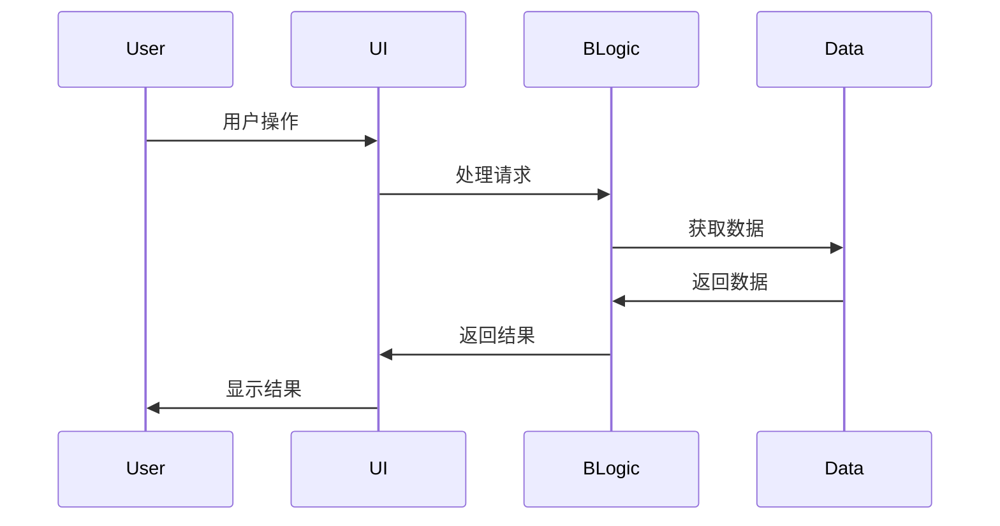
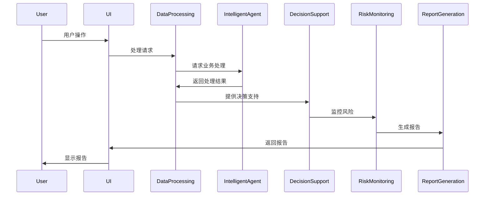
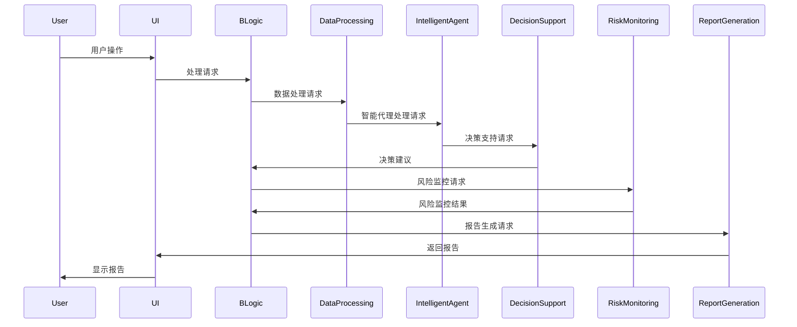

                 


### 引言

在当今快速发展的信息技术时代，企业面临着前所未有的复杂性和变化速度。传统的公司治理模式已经难以适应这种环境，因此，自动化公司治理成为了一种新的趋势。自动化公司治理不仅仅是简单的流程自动化，更是通过引入人工智能技术，特别是多智能体系统，来实现公司治理的智能化和高效化。这种创新的方法不仅能够提高治理效率，还能为企业在竞争激烈的市场中赢得优势。

本文将围绕“基于多智能体的自动化公司治理评估”这一主题，详细探讨这一领域的核心概念、技术原理、系统架构和实施方法。文章结构如下：

1. **背景介绍**：我们将首先介绍公司治理的基本概念，以及多智能体系统和自动化治理的需求和挑战。
2. **核心概念与联系**：接着，我们将深入探讨多智能体系统和自动化公司治理的核心原理，并对比它们的基本属性。
3. **算法原理讲解**：本文将详细阐述多智能体算法和自动化公司治理算法的原理，并使用示例进行说明。
4. **系统分析与架构设计**：我们将介绍一个典型的自动化公司治理系统，从问题场景、功能设计、架构设计到接口设计和系统交互进行分析。
5. **项目实战**：通过一个具体的案例，我们将展示如何在实际中部署和实现基于多智能体的自动化公司治理系统。
6. **最佳实践与拓展阅读**：最后，我们将总结最佳实践，并推荐相关资源和进一步学习的方法。

### 文章关键词

- **多智能体系统**
- **自动化公司治理**
- **人工智能**
- **系统架构**
- **算法原理**
- **案例实践**

### 摘要

本文旨在探讨如何利用多智能体系统实现自动化公司治理，以提高企业治理的智能化和效率。文章首先介绍了公司治理和多智能体系统的基本概念，接着详细分析了自动化治理的需求和挑战。随后，文章深入讲解了多智能体算法和自动化公司治理算法的原理，并通过具体案例展示了系统的实际应用。最后，文章总结了自动化公司治理的最佳实践，并展望了未来的发展趋势。

----------------------------------------------------------------

## 《基于多智能体的自动化公司治理评估》

关键词：多智能体系统、自动化公司治理、人工智能、系统架构、算法原理、案例实践

摘要：本文探讨了如何利用多智能体系统实现自动化公司治理，以提高企业治理的智能化和效率。文章详细介绍了公司治理和多智能体系统的基本概念，分析了自动化治理的需求和挑战，并深入讲解了多智能体算法和自动化公司治理算法的原理。通过一个具体案例，文章展示了系统的实际应用，并总结了自动化公司治理的最佳实践和未来发展趋势。

## 目录

### 第一部分：背景介绍

#### 第1章 问题背景  
##### 1.1.1 公司治理概述  
##### 1.1.2 多智能体系统的基本概念  
##### 1.1.3 自动化公司治理的需求与挑战

#### 第2章 问题解决  
##### 2.1.1 多智能体系统在公司治理中的应用  
##### 2.1.2 自动化治理的流程与框架  
##### 2.1.3 关键技术解析

### 第二部分：核心概念与联系

#### 第3章 核心概念原理  
##### 3.1.1 多智能体系统原理  
##### 3.1.2 自动化公司治理原理  
##### 3.1.3 多智能体系统与自动化公司治理的联系

#### 第4章 概念属性特征对比表格  
##### 4.1 多智能体系统属性对比  
##### 4.2 自动化公司治理属性对比

#### 第5章 ER实体关系图架构  
##### 5.1 多智能体系统ER图  
##### 5.2 自动化公司治理ER图

### 第三部分：算法原理讲解

#### 第6章 多智能体算法原理  
##### 6.1.1 多智能体协作算法  
##### 6.1.2 多智能体学习算法  
##### 6.1.3 多智能体决策算法

#### 第7章 自动化公司治理算法  
##### 7.1.1 自动化治理流程算法  
##### 7.1.2 自动化治理评估算法  
##### 7.1.3 自动化治理优化算法

#### 第8章 算法示例  
##### 8.1 多智能体协作算法示例  
##### 8.2 自动化公司治理算法示例

### 第四部分：系统分析与架构设计

#### 第9章 问题场景介绍  
##### 9.1 公司治理现状与痛点  
##### 9.2 多智能体系统解决方案  
##### 9.3 自动化公司治理方案

#### 第10章 系统功能设计  
##### 10.1 领域模型类图  
##### 10.2 系统功能模块划分

#### 第11章 系统架构设计  
##### 11.1 系统架构概述  
##### 11.2 多智能体系统架构设计  
##### 11.3 自动化公司治理架构设计

#### 第12章 系统接口设计  
##### 12.1 接口功能定义  
##### 12.2 接口协议设计  
##### 12.3 接口安全性设计

#### 第13章 系统交互  
##### 13.1 系统交互流程  
##### 13.2 系统交互mermaid序列图

### 第五部分：项目实战

#### 第14章 环境安装  
##### 14.1 硬件环境安装  
##### 14.2 软件环境安装  
##### 14.3 系统配置与调试

#### 第15章 系统核心实现  
##### 15.1 核心算法实现  
##### 15.2 自动化治理流程实现  
##### 15.3 系统功能模块实现

#### 第16章 代码应用解读与分析  
##### 16.1 代码解读  
##### 16.2 代码分析与优化  
##### 16.3 实际案例分析

#### 第17章 详细讲解与剖析  
##### 17.1 算法详细讲解  
##### 17.2 系统架构详细剖析  
##### 17.3 自动化治理流程详细解读

#### 第18章 项目小结  
##### 18.1 项目总结  
##### 18.2 经验与启示  
##### 18.3 拓展与应用

### 第六部分：最佳实践与拓展阅读

#### 第19章 最佳实践  
##### 19.1 多智能体系统最佳实践  
##### 19.2 自动化公司治理最佳实践  
##### 19.3 算法优化实践

#### 第20章 小结与注意事项  
##### 20.1 全书小结  
##### 20.2 注意事项与风险防范  
##### 20.3 未来发展趋势与展望

#### 第21章 拓展阅读  
##### 21.1 相关书籍推荐  
##### 21.2 学术论文推荐  
##### 21.3 网络资源推荐

## 第一部分：背景介绍

### 第1章 问题背景

#### 1.1.1 公司治理概述

公司治理是指通过一系列的制度安排和管理措施，确保企业的合法运营、有效管理和风险控制。传统的公司治理主要依赖于人的经验和判断，但随着企业规模的扩大和业务复杂性的增加，这种模式逐渐暴露出许多问题，如信息不对称、决策效率低下和治理成本高等。

#### 1.1.2 多智能体系统的基本概念

多智能体系统（Multi-Agent System，MAS）是由多个自主、智能的代理（agent）组成的系统。这些代理通过通信和协同工作，实现复杂任务的自动化和智能化。多智能体系统的核心特点是分布式、自主性和协作性。

#### 1.1.3 自动化公司治理的需求与挑战

随着信息技术的飞速发展，企业面临着越来越多的挑战。自动化公司治理的需求主要体现在以下几个方面：

1. **提高决策效率**：传统的公司治理模式往往决策周期长，效率低。通过引入多智能体系统，可以实现快速、准确的决策。
2. **降低治理成本**：自动化治理能够减少对人力资源的依赖，降低治理成本。
3. **增强风险管理**：多智能体系统可以实时监控企业运营情况，提前发现潜在风险，并采取措施进行防范。

然而，自动化公司治理也面临一些挑战：

1. **技术难度**：多智能体系统的研发和部署需要较高的技术门槛，对企业的技术能力提出了较高要求。
2. **数据安全**：自动化治理依赖于大量的数据，如何确保数据的安全和隐私成为了一大挑战。
3. **适应性问题**：不同的企业有不同的治理需求，如何使自动化治理系统具备良好的适应性，满足各种企业的需求，也是一个亟待解决的问题。

### 第2章 问题解决

#### 2.1.1 多智能体系统在公司治理中的应用

多智能体系统在公司治理中的应用主要体现在以下几个方面：

1. **自动化决策支持**：通过多智能体系统，企业可以实时收集和分析各种信息，提供基于数据的决策支持。
2. **流程自动化**：多智能体系统可以自动化处理各种业务流程，如订单处理、库存管理等。
3. **风险监控与预警**：多智能体系统可以实时监控企业的运营状况，发现潜在风险并发出预警。

#### 2.1.2 自动化治理的流程与框架

自动化治理的流程主要包括以下几个步骤：

1. **需求分析**：明确企业的治理需求，确定需要自动化的业务流程和决策支持系统。
2. **系统设计**：设计多智能体系统的架构，包括智能代理的设计、通信机制的设计和协作算法的设计。
3. **系统实现**：根据系统设计，实现多智能体系统的各个组成部分，并进行集成和测试。
4. **系统部署**：将多智能体系统部署到实际环境中，并进行运行和维护。

#### 2.1.3 关键技术解析

1. **智能代理设计**：智能代理是自动化治理系统的核心，其设计需要考虑自主性、协作性和适应性。
2. **通信机制设计**：通信机制是多智能体系统实现协同工作的基础，需要考虑通信的效率、可靠性和安全性。
3. **协作算法设计**：协作算法是多智能体系统实现高效协作的关键，需要考虑协作策略、通信策略和决策策略。

### 总结

本文介绍了自动化公司治理的背景和需求，探讨了多智能体系统在公司治理中的应用和关键技术。在接下来的章节中，我们将深入探讨多智能体系统和自动化公司治理的核心概念、算法原理和系统架构，并通过具体案例展示其实际应用。

----------------------------------------------------------------

## 第一部分：背景介绍

### 第1章 问题背景

#### 1.1.1 公司治理概述

公司治理（Corporate Governance）是企业为了实现其战略目标，通过一系列制度安排和运行机制，对内部管理、外部关系、风险控制等方面进行规范和管理的过程。有效的公司治理对于企业的长期发展和股东价值的创造具有重要意义。公司治理的主要内容包括企业所有权和经营权的分离、董事会的监督职责、内部控制机制的建立、信息披露和透明度等。

随着全球化、市场化和信息技术的发展，企业面临着更加复杂和多变的外部环境，传统的公司治理模式逐渐暴露出一些问题：

1. **治理效率低下**：传统的公司治理往往依赖于人的经验和判断，决策过程复杂且耗时。
2. **信息不对称**：管理层和股东之间的信息传递存在障碍，可能导致决策失误和资源浪费。
3. **风险控制不足**：在快速变化的市场环境中，企业面临着诸多风险，但传统的治理模式难以有效识别和应对这些风险。
4. **治理成本高**：传统治理模式需要大量的人力资源，导致治理成本高昂。

为了应对上述挑战，自动化公司治理应运而生。自动化公司治理是指通过引入信息技术，特别是人工智能和大数据分析，实现公司治理的智能化和自动化。自动化公司治理能够提高治理效率、降低治理成本、增强风险控制能力，并提升企业的竞争力。

#### 1.1.2 多智能体系统的基本概念

多智能体系统（Multi-Agent System，MAS）是由多个自主智能代理组成的系统，这些代理可以独立地执行任务，并通过通信和协作实现整体目标。多智能体系统的基本概念包括以下几个方面：

1. **智能代理**：智能代理（Agent）是MAS的基本组成单位，具有自主性、社会性和反应性。自主性意味着代理能够独立地做出决策；社会性意味着代理可以与其他代理进行通信和协作；反应性意味着代理能够对外部环境的变化做出响应。

2. **协同工作**：多智能体系统通过协同工作实现复杂任务的自动化和智能化。代理之间通过通信和协作，共享信息、协调行动，以实现整体目标。

3. **自主决策**：代理具有自主决策能力，可以根据内部状态和外部环境的变化，独立地制定行动策略。

4. **适应性**：多智能体系统具有良好的适应性，能够根据不同环境和任务需求，动态调整其行为和策略。

#### 1.1.3 自动化公司治理的需求与挑战

自动化公司治理的需求主要体现在以下几个方面：

1. **提高治理效率**：传统的公司治理模式往往效率低下，决策周期长。自动化公司治理通过引入人工智能技术，可以实现快速决策和高效治理。

2. **降低治理成本**：自动化治理可以减少对人力资源的依赖，降低治理成本。例如，通过自动化监控和数据分析，可以减少人工审核和监督的工作量。

3. **增强风险控制**：自动化公司治理可以通过实时监控和预警系统，识别和应对潜在风险，提高企业的风险控制能力。

4. **提高治理透明度**：自动化治理系统可以实时记录和报告企业的运营情况，提高治理的透明度和信息披露的及时性。

然而，自动化公司治理也面临一些挑战：

1. **技术难度**：自动化公司治理需要应用人工智能、大数据分析等先进技术，研发和部署过程复杂，对企业的技术能力有较高要求。

2. **数据安全**：自动化治理系统依赖于大量的数据，数据的安全性和隐私保护成为一大挑战。如何确保数据的安全传输、存储和使用，是自动化公司治理需要解决的问题。

3. **系统适应性**：不同的企业具有不同的治理需求，自动化治理系统需要具备良好的适应性，能够满足各种企业的需求。

4. **人机协作**：自动化公司治理不仅仅是技术问题，还涉及到人与机器的协作。如何有效结合人的智慧和机器的效率，是自动化公司治理需要解决的重要问题。

### 总结

本章介绍了公司治理的基本概念、多智能体系统的基本概念以及自动化公司治理的需求与挑战。在接下来的章节中，我们将进一步探讨自动化公司治理的核心概念、技术原理、系统架构和实施方法。

----------------------------------------------------------------

## 第一部分：背景介绍

### 第1章 问题背景

#### 1.1.1 公司治理概述

公司治理是指一系列旨在确保企业有效管理、透明度和合法性的制度安排和流程。其核心目标是在企业内部和外部利益相关者之间建立信任，以实现企业的长期成功。公司治理涉及多个方面，包括：

- **所有权与经营权分离**：现代企业普遍采用所有权和经营权分离的模式，股东是公司的所有者，而管理层负责公司的日常运营。
- **董事会的作用**：董事会是公司的最高决策机构，负责监督和指导公司的战略方向，确保公司遵守法律法规和公司章程。
- **内部控制和风险管理**：内部控制是企业为了确保运营的效率和效果，遵循法规和公司政策而建立的制度。
- **信息披露和透明度**：公司治理强调企业的信息披露，使股东和其他利益相关者能够了解公司的真实运营状况。

#### 1.1.2 多智能体系统的基本概念

多智能体系统（MAS）是一种由多个自主智能代理组成的系统，这些代理可以相互协作，共同完成复杂任务。MAS的基本概念包括：

- **智能代理**：代理是系统的基本组成单元，具有感知、决策和行动的能力。代理可以是计算机程序、机器人或人类个体。
- **协同工作**：代理通过通信和共享信息，协作完成共同目标。协同工作可以是直接的，也可以是间接的，通过共享环境信息实现。
- **自主性**：代理能够独立地做出决策，不依赖于中心控制。
- **适应性**：代理能够根据环境和任务的变化，动态调整其行为和策略。

#### 1.1.3 自动化公司治理的需求与挑战

自动化公司治理的需求主要源于以下几个方面：

1. **提高治理效率**：传统公司治理依赖于人为操作，效率低下。自动化治理可以通过智能代理实现自动化决策和流程优化，提高整体效率。
2. **降低成本**：自动化治理可以减少对人力资源的依赖，降低治理成本。例如，自动化监控和审计可以减少人工审核的工作量。
3. **增强风险管理**：自动化治理系统能够实时监控企业运营，及时发现潜在风险，并采取预防措施。
4. **提高透明度和合规性**：自动化治理系统能够实现数据的实时记录和分析，提高公司治理的透明度和合规性。

然而，自动化公司治理也面临一些挑战：

1. **技术难度**：实现自动化治理需要应用先进的AI和大数据分析技术，研发和部署过程复杂。
2. **数据安全**：自动化治理系统需要处理大量敏感数据，如何确保数据的安全性和隐私保护是一个重要问题。
3. **系统适应性**：不同的企业具有不同的治理需求，自动化治理系统需要具备良好的适应性，以适应各种场景。
4. **人机协作**：自动化治理不仅仅是技术问题，还需要考虑人与机器之间的协作，确保系统运行的有效性和可靠性。

### 第2章 问题解决

#### 2.1.1 多智能体系统在公司治理中的应用

多智能体系统在公司治理中的应用主要体现在以下几个方面：

1. **自动化决策支持**：通过智能代理，企业可以实时收集和分析各种信息，提供基于数据的决策支持。
2. **流程自动化**：智能代理可以自动化处理各种业务流程，如订单处理、合同管理、财务报表审核等。
3. **风险监控与预警**：智能代理可以实时监控企业的运营状况，发现潜在风险，并发出预警。

#### 2.1.2 自动化治理的流程与框架

自动化治理的流程通常包括以下几个步骤：

1. **需求分析**：明确企业的治理需求，确定需要自动化的业务流程和决策支持系统。
2. **系统设计**：设计多智能体系统的架构，包括智能代理的设计、通信机制的设计和协作算法的设计。
3. **系统实现**：根据系统设计，实现多智能体系统的各个组成部分，并进行集成和测试。
4. **系统部署**：将多智能体系统部署到实际环境中，并进行运行和维护。

#### 2.1.3 关键技术解析

1. **智能代理设计**：智能代理的设计需要考虑自主性、协作性和适应性。自主性确保代理能够独立地执行任务；协作性确保代理能够与其他代理协同工作；适应性确保代理能够适应不同环境和任务需求。

2. **通信机制设计**：通信机制是多智能体系统实现协同工作的基础。设计通信机制需要考虑通信的效率、可靠性和安全性。

3. **协作算法设计**：协作算法是多智能体系统实现高效协作的关键。设计协作算法需要考虑协作策略、通信策略和决策策略。

### 总结

本章介绍了公司治理的基本概念、多智能体系统的基本概念以及自动化公司治理的需求与挑战。通过多智能体系统的应用和关键技术解析，我们为解决自动化公司治理中的问题提供了理论基础和实践指导。在接下来的章节中，我们将进一步探讨自动化公司治理的核心概念、算法原理和系统架构。

----------------------------------------------------------------

## 第二部分：核心概念与联系

### 第3章 核心概念原理

#### 3.1.1 多智能体系统原理

多智能体系统（MAS）是一种分布式计算系统，由多个具有自主决策能力和协作能力的智能代理组成。这些代理通过通信和协作实现共同的目标。MAS的关键原理包括：

1. **自主性**：每个代理都能够自主地决定其行为，不受中心控制。
2. **社会性**：代理能够与其他代理进行通信和协作，共享信息和资源。
3. **反应性**：代理能够对外部环境的变化做出响应，调整其行为。
4. **适应性**：代理能够根据不同环境和任务需求，动态调整其策略和行为。

多智能体系统的基本架构包括代理、环境、通信机制和协调机制。代理是系统的基本组成单元，环境是代理运行的外部环境，通信机制用于代理之间的信息交换，协调机制用于确保代理之间的协作和协调。

#### 3.1.2 自动化公司治理原理

自动化公司治理是指利用信息技术，特别是人工智能和大数据分析，实现公司治理的智能化和自动化。自动化公司治理的核心原理包括：

1. **智能化**：通过引入人工智能技术，如机器学习和自然语言处理，实现数据的自动分析和决策支持。
2. **自动化**：通过自动化流程和智能代理，实现公司治理流程的自动化和高效化。
3. **透明化**：通过实时数据监控和报告，提高公司治理的透明度和信息披露的及时性。

自动化公司治理的实现涉及多个方面，包括数据采集与处理、智能分析、自动化决策和流程管理。数据采集与处理是基础，智能分析是实现自动化决策的关键，自动化决策和流程管理是核心。

#### 3.1.3 多智能体系统与自动化公司治理的联系

多智能体系统和自动化公司治理之间存在密切的联系。多智能体系统为自动化公司治理提供了技术支持，而自动化公司治理是多智能体系统的具体应用场景。

1. **技术支持**：多智能体系统提供了一系列关键技术，如智能代理、通信机制和协作算法，这些技术可以用于实现自动化公司治理。
2. **应用场景**：自动化公司治理涵盖了公司治理的多个方面，如决策支持、流程管理和风险监控，这些都是多智能体系统的典型应用场景。
3. **协同工作**：在自动化公司治理中，多智能体系统通过智能代理实现不同部门和职能之间的协同工作，提高整体效率和效果。

### 第4章 概念属性特征对比表格

#### 4.1 多智能体系统属性对比

| 特征       | 多智能体系统 | 自动化公司治理 |
|------------|--------------|----------------|
| 自主性     | 高           | 中等           |
| 协作性     | 强           | 强             |
| 适应性     | 强           | 中等           |
| 分布式     | 高           | 高             |
| 智能化     | 中等         | 高             |
| 安全性     | 中等         | 低             |
| 可扩展性   | 高           | 中等           |
| 灵活性     | 高           | 中等           |

#### 4.2 自动化公司治理属性对比

| 特征       | 自动化公司治理 |
|------------|----------------|
| 效率       | 高             |
| 成本       | 低             |
| 透明度     | 高             |
| 可靠性     | 中等           |
| 灵活性     | 中等           |
| 风险控制   | 高             |
| 数据依赖   | 高             |
| 适应性     | 中等           |

### 第5章 ER实体关系图架构

#### 5.1 多智能体系统ER图

```mermaid
erDiagram
    Agent ||--|{ Communication }|--|| System
    Agent ||--|{ Coordination }|--|| System
    Agent ||--|{ Decision }|--|| System
    System ||--|{ Environment }|--|| Agent
```

#### 5.2 自动化公司治理ER图

```mermaid
erDiagram
    BoardMember ||--|{ Monitor }|--|| Company
    Management ||--|{ Execute }|--|| Company
    Employee ||--|{ Report }|--|| Company
    Risk ||--|{ Control }|--|| Company
    Decision ||--|{ Support }|--|| Company
    System ||--|{ Govern }|--|| Company
```

### 总结

本章详细介绍了多智能体系统和自动化公司治理的核心概念原理，并通过属性对比表格和ER实体关系图，阐述了它们之间的联系。多智能体系统为自动化公司治理提供了技术支持，而自动化公司治理是多智能体系统的具体应用场景。通过深入理解这些概念，我们可以更好地把握自动化公司治理的发展方向和应用前景。

----------------------------------------------------------------

## 第三部分：算法原理讲解

### 第6章 多智能体算法原理

#### 6.1.1 多智能体协作算法

多智能体协作算法是MAS的核心算法之一，它负责协调多个智能代理之间的行为，以实现共同目标。协作算法可以分为三种类型：集中式、分布式和混合式。

1. **集中式协作算法**：集中式协作算法由一个中心协调器统一规划和指挥各代理的行为。这种算法的优点是实现简单、易于理解，但缺点是系统的扩展性和容错性较差。

2. **分布式协作算法**：分布式协作算法不依赖中心协调器，各代理独立地根据局部信息进行决策和协作。这种算法的优点是系统具有较高的扩展性和容错性，但缺点是决策过程复杂，通信开销大。

3. **混合式协作算法**：混合式协作算法结合了集中式和分布式协作算法的优点，通过在不同阶段采用不同的协作方式，实现高效协作。

多智能体协作算法的设计需要考虑以下几个关键因素：

- **通信机制**：确定代理之间的通信方式，如广播、选择或点对点通信。
- **协作策略**：确定代理如何根据局部信息做出协作决策，如基于成本效益分析、社会优化或博弈论策略。
- **决策模型**：建立代理的决策模型，如基于规则、机器学习或混合智能模型。

#### 6.1.2 多智能体学习算法

多智能体学习算法是MAS中的一种重要算法，它使代理能够通过经验学习不断优化其行为。多智能体学习算法可以分为以下几种类型：

1. **强化学习**：强化学习是一种通过奖励和惩罚机制，使代理不断调整行为，以最大化长期奖励的算法。常见的强化学习算法有Q-learning、SARSA和Deep Q-Network（DQN）。

2. **多智能体强化学习**：多智能体强化学习是强化学习在多智能体系统中的应用，它使多个代理能够通过协作学习，实现共同目标。常见的多智能体强化学习算法有博弈论、策略梯度方法和深度强化学习。

3. **迁移学习**：迁移学习是一种将已学习到的知识应用于新任务或新环境的算法，它有助于减少代理的学习成本，提高系统的适应性。

多智能体学习算法的设计需要考虑以下几个关键因素：

- **奖励设计**：确定合适的奖励机制，以激励代理学习正确的行为。
- **学习策略**：选择合适的学习策略，如基于模型的学习、无模型学习和经验回放。
- **数据有效性**：确保学习过程中使用的数据具有代表性，避免数据偏差。

#### 6.1.3 多智能体决策算法

多智能体决策算法是MAS中用于代理决策的核心算法，它负责根据当前状态和代理的内部信息，选择最优行为。多智能体决策算法可以分为以下几种类型：

1. **基于规则的决策算法**：基于规则的决策算法是一种简单直观的决策算法，它根据预设的规则进行决策。这种算法的优点是实现简单，但缺点是难以处理复杂环境和动态变化。

2. **基于模型的决策算法**：基于模型的决策算法是一种通过建立系统模型进行决策的算法。它根据模型预测不同行为的结果，选择最优行为。这种算法的优点是能够处理复杂环境和动态变化，但缺点是模型建立和优化过程复杂。

3. **基于概率的决策算法**：基于概率的决策算法是一种通过计算行为结果的概率分布进行决策的算法。它根据概率分布选择最有可能导致成功的行为。这种算法的优点是能够处理不确定性和动态变化，但缺点是计算复杂度较高。

多智能体决策算法的设计需要考虑以下几个关键因素：

- **状态空间**：确定代理所处的状态空间，以及状态之间的转移关系。
- **行为空间**：确定代理可执行的行为集合。
- **评估函数**：建立评估函数，用于评估不同行为的优劣。
- **决策模型**：选择合适的决策模型，如基于规则的模型、基于模型的模型或基于概率的模型。

### 第7章 自动化公司治理算法

#### 7.1.1 自动化治理流程算法

自动化治理流程算法是用于实现自动化治理流程的关键算法，它负责将企业治理的各个流程自动化。自动化治理流程算法可以分为以下几种类型：

1. **业务流程管理算法**：业务流程管理算法是一种用于管理企业业务流程的算法。它根据业务规则和流程定义，自动执行业务流程的各个步骤，并确保流程的规范和高效。

2. **事件驱动算法**：事件驱动算法是一种根据事件发生顺序和条件进行决策的算法。它根据企业治理中的事件，如审计、合规检查和风险管理事件，自动触发相应的流程和操作。

3. **规则引擎算法**：规则引擎算法是一种根据规则进行决策的算法。它根据企业治理的规则和策略，自动生成决策和操作指令，并执行相应的操作。

自动化治理流程算法的设计需要考虑以下几个关键因素：

- **业务规则**：确定企业治理中的业务规则，以及规则之间的关联和优先级。
- **流程定义**：定义企业治理流程的各个步骤和操作，确保流程的规范和高效。
- **事件处理**：设计事件驱动机制，确保能够及时响应和处理各种治理事件。

#### 7.1.2 自动化治理评估算法

自动化治理评估算法是用于评估自动化治理效果的关键算法，它负责对自动化治理流程的执行结果进行分析和评价。自动化治理评估算法可以分为以下几种类型：

1. **效率评估算法**：效率评估算法是一种用于评估自动化治理流程效率的算法。它根据流程执行的时间、成本和资源消耗，计算流程的效率指标，如吞吐量、周转时间和资源利用率。

2. **合规性评估算法**：合规性评估算法是一种用于评估自动化治理流程合规性的算法。它根据企业治理的法规和标准，对流程执行结果进行检查和验证，确保流程的合规性。

3. **风险评估算法**：风险评估算法是一种用于评估自动化治理流程风险的算法。它根据企业治理中的风险因素，计算流程的风险指标，如风险概率、损失程度和风险等级。

自动化治理评估算法的设计需要考虑以下几个关键因素：

- **指标体系**：建立自动化治理评估的指标体系，包括效率指标、合规性指标和风险指标。
- **数据来源**：确定自动化治理评估所需的数据来源，包括流程执行数据、合规性数据和风险数据。
- **评估模型**：设计评估模型，用于计算和评估自动化治理流程的执行效果。

#### 7.1.3 自动化治理优化算法

自动化治理优化算法是用于优化自动化治理流程的关键算法，它负责根据评估结果和优化策略，调整自动化治理流程的参数和策略，以提高治理效果。自动化治理优化算法可以分为以下几种类型：

1. **基于规则的优化算法**：基于规则的优化算法是一种根据预定义的优化规则，自动调整流程参数和策略的算法。它根据流程执行的历史数据和优化目标，生成优化规则，并自动应用这些规则。

2. **基于机器学习的优化算法**：基于机器学习的优化算法是一种利用机器学习技术，自动生成优化规则和策略的算法。它通过学习流程执行数据，发现优化模式和规律，并生成优化策略。

3. **基于博弈论的优化算法**：基于博弈论的优化算法是一种通过博弈论模型，自动优化流程参数和策略的算法。它根据流程参与者的利益和行为，设计博弈模型，并求解优化策略。

自动化治理优化算法的设计需要考虑以下几个关键因素：

- **优化目标**：确定自动化治理优化的目标，如提高效率、降低成本、增强合规性和减少风险。
- **优化策略**：设计合适的优化策略，包括规则优化、机器学习优化和博弈论优化。
- **反馈机制**：建立反馈机制，根据优化结果调整优化策略，实现持续的优化。

### 第8章 算法示例

#### 8.1 多智能体协作算法示例

假设一个企业采用多智能体系统进行生产和供应链管理，智能代理分别负责生产计划、原材料采购、库存管理和产品销售。以下是一个简化的多智能体协作算法示例：

```python
# 多智能体协作算法示例

# 定义智能代理
class Agent:
    def __init__(self, name):
        self.name = name
        self.status = "idle"

    def perceive(self, environment):
        # 代理感知环境信息
        pass

    def decide(self):
        # 代理根据环境信息做出决策
        pass

    def act(self):
        # 代理执行决策
        pass

# 定义环境
class Environment:
    def __init__(self):
        self.resources = {}

    def update_resources(self, resources):
        # 更新环境资源信息
        self.resources = resources

# 创建智能代理和环境
agent1 = Agent("Production")
agent2 = Agent("Procurement")
agent3 = Agent("Inventory")
environment = Environment()

# 运行协作算法
def run_collaboration_algorithm():
    while True:
        # 更新环境信息
        environment.update_resources({"material": 100, "product": 50})

        # 代理感知环境信息
        agent1.perceive(environment)
        agent2.perceive(environment)
        agent3.perceive(environment)

        # 代理根据环境信息做出决策
        agent1.decide()
        agent2.decide()
        agent3.decide()

        # 代理执行决策
        agent1.act()
        agent2.act()
        agent3.act()

        # 检查是否满足终止条件
        if agent1.status == "terminated" and agent2.status == "terminated" and agent3.status == "terminated":
            break

run_collaboration_algorithm()
```

#### 8.2 自动化公司治理算法示例

以下是一个简化的自动化公司治理算法示例，用于评估企业的生产运营效率：

```python
# 自动化公司治理算法示例

# 定义效率评估算法
def efficiency_evaluation(production_data):
    # 计算生产效率指标
    throughput = production_data["throughput"]
    cycle_time = production_data["cycle_time"]
    efficiency = throughput / cycle_time
    return efficiency

# 定义合规性评估算法
def compliance_evaluation(production_data, compliance_rules):
    # 检查生产过程是否符合合规性规则
    compliance = True
    for rule in compliance_rules:
        if not rule(production_data):
            compliance = False
            break
    return compliance

# 定义风险评估算法
def risk_evaluation(production_data, risk_factors):
    # 计算生产过程中的风险指标
    risk_score = 0
    for factor in risk_factors:
        risk_score += factor(production_data)
    return risk_score

# 定义生产数据
production_data = {
    "throughput": 100,
    "cycle_time": 10,
    "compliance_rules": [
        lambda data: data["throughput"] > 0,
        lambda data: data["compliance"] == "yes"
    ],
    "risk_factors": [
        lambda data: data["defect_rate"] > 0.01,
        lambda data: data["inspection_rate"] < 0.5
    ]
}

# 运行算法
efficiency = efficiency_evaluation(production_data)
compliance = compliance_evaluation(production_data, production_data["compliance_rules"])
risk_score = risk_evaluation(production_data, production_data["risk_factors"])

print("Efficiency:", efficiency)
print("Compliance:", compliance)
print("Risk Score:", risk_score)
```

### 总结

本章详细介绍了多智能体算法和自动化公司治理算法的原理，并提供了具体的算法示例。通过这些算法，企业可以实现自动化决策、流程优化和治理评估，从而提高治理效率、降低治理成本和增强风险管理能力。

----------------------------------------------------------------

## 第四部分：系统分析与架构设计

### 第9章 问题场景介绍

#### 9.1 公司治理现状与痛点

在现代企业中，公司治理面临诸多挑战。传统的公司治理模式主要依赖于人工管理和监督，存在以下痛点：

1. **信息不对称**：管理层和股东之间的信息传递存在障碍，导致决策失误和资源浪费。
2. **治理效率低下**：传统治理模式决策周期长，效率低，难以适应快速变化的市场环境。
3. **风险控制不足**：在复杂多变的市场环境中，企业面临着诸多风险，但传统治理模式难以有效识别和应对这些风险。
4. **治理成本高**：传统治理模式需要大量的人力资源，导致治理成本高昂。

为了解决这些问题，企业需要引入自动化公司治理系统，以提高治理效率、降低成本、增强风险控制能力。

#### 9.2 多智能体系统解决方案

多智能体系统（MAS）是一种分布式计算系统，由多个具有自主决策能力和协作能力的智能代理组成。针对公司治理的现状和痛点，多智能体系统提供以下解决方案：

1. **自动化决策支持**：通过智能代理，企业可以实时收集和分析各种信息，提供基于数据的决策支持，提高治理效率。
2. **流程自动化**：智能代理可以自动化处理各种业务流程，如订单处理、合同管理、财务报表审核等，降低治理成本。
3. **风险监控与预警**：智能代理可以实时监控企业的运营状况，发现潜在风险，并发出预警，增强风险控制能力。
4. **透明化与合规性**：智能代理可以实时记录和报告企业的运营情况，提高治理的透明度和合规性。

#### 9.3 自动化公司治理方案

自动化公司治理方案主要包括以下几个部分：

1. **需求分析**：明确企业的治理需求，确定需要自动化的业务流程和决策支持系统。
2. **系统设计**：设计多智能体系统的架构，包括智能代理的设计、通信机制的设计和协作算法的设计。
3. **系统实现**：根据系统设计，实现多智能体系统的各个组成部分，并进行集成和测试。
4. **系统部署**：将多智能体系统部署到实际环境中，并进行运行和维护。

自动化公司治理方案的目标是构建一个智能化、自动化和高效的治理系统，以提高企业治理水平，增强企业竞争力。

### 第10章 系统功能设计

#### 10.1 领域模型类图

```mermaid
classDiagram
    Agent <<class>> Agent
    System <<class>> System
    Environment <<class>> Environment
    BoardMember <<class>> BoardMember
    Management <<class>> Management
    Employee <<class>> Employee
    Risk <<class>> Risk
    Decision <<class>> Decision

    Agent --|{ interacts }-- System
    Agent --|{ perceives }-- Environment
    System --|{ manages }-- BoardMember
    System --|{ manages }-- Management
    System --|{ manages }-- Employee
    System --|{ manages }-- Risk
    System --|{ manages }-- Decision
```

#### 10.2 系统功能模块划分

自动化公司治理系统可以分为以下几个功能模块：

1. **数据采集模块**：负责收集企业内外部数据，如财务报表、市场数据、法律法规等。
2. **数据处理模块**：负责对采集到的数据进行分析和处理，提取有价值的信息。
3. **智能代理模块**：包括生产计划代理、采购代理、库存管理代理、销售代理等，负责自动化处理业务流程。
4. **决策支持模块**：基于数据分析结果，为管理层提供决策支持。
5. **风险监控模块**：实时监控企业运营状况，发现潜在风险，并发出预警。
6. **报告生成模块**：生成各种报告，如运营报告、决策报告、风险报告等，提高治理透明度。
7. **用户界面模块**：提供用户界面，方便用户进行操作和查询。

### 第11章 系统架构设计

#### 11.1 系统架构概述

自动化公司治理系统采用分层架构，包括表示层、业务逻辑层和数据层。系统架构如图所示：



#### 11.2 多智能体系统架构设计

多智能体系统架构设计如图所示：

```mermaid
classDiagram
    Agent <<class>> Agent
    System <<class>> System
    Environment <<class>> Environment
    BoardMember <<class>> BoardMember
    Management <<class>> Management
    Employee <<class>> Employee
    Risk <<class>> Risk
    Decision <<class>> Decision

    Agent --|{ interacts }-- System
    Agent --|{ perceives }-- Environment
    System --|{ manages }-- BoardMember
    System --|{ manages }-- Management
    System --|{ manages }-- Employee
    System --|{ manages }-- Risk
    System --|{ manages }-- Decision

    Collaboration <<class>> Collaboration
    Learning <<class>> Learning
    DecisionMaking <<class>> DecisionMaking

    Collaboration --|{ collaborates }-- Agent
    Learning --|{ learns }-- Agent
    DecisionMaking --|{ makes }-- Agent
```

#### 11.3 自动化公司治理架构设计

自动化公司治理架构设计如图所示：

```mermaid
classDiagram
    DataCollection <<class>> DataCollection
    DataProcessing <<class>> DataProcessing
    IntelligentAgent <<class>> IntelligentAgent
    DecisionSupport <<class>> DecisionSupport
    RiskMonitoring <<class>> RiskMonitoring
    ReportGeneration <<class>> ReportGeneration
    UserInterface <<class>> UserInterface

    DataCollection --|{ collects }-- Data
    DataProcessing --|{ processes }-- Data
    IntelligentAgent --|{ processes }-- Data
    IntelligentAgent --|{ generates }-- Decision
    IntelligentAgent --|{ generates }-- Report
    DecisionSupport --|{ provides }-- Decision
    RiskMonitoring --|{ monitors }-- Risk
    ReportGeneration --|{ generates }-- Report
    UserInterface --|{ displays }-- Report
```

### 第12章 系统接口设计

#### 12.1 接口功能定义

自动化公司治理系统接口设计主要包括以下几个功能：

1. **数据采集接口**：用于收集企业内外部数据。
2. **数据处理接口**：用于对采集到的数据进行分析和处理。
3. **智能代理接口**：用于与智能代理进行通信和协作。
4. **决策支持接口**：用于提供决策支持。
5. **风险监控接口**：用于监控企业运营状况。
6. **报告生成接口**：用于生成各种报告。

#### 12.2 接口协议设计

接口协议设计主要包括以下几个部分：

1. **HTTP/HTTPS协议**：用于数据传输。
2. **JSON格式**：用于数据格式化。
3. **RESTful架构**：用于接口设计。

#### 12.3 接口安全性设计

接口安全性设计主要包括以下几个方面：

1. **身份验证**：确保接口访问的安全性，使用JWT、OAuth等认证机制。
2. **权限控制**：根据用户角色和权限，限制接口访问范围。
3. **数据加密**：对敏感数据进行加密传输。

### 第13章 系统交互

#### 13.1 系统交互流程

系统交互流程包括以下几个步骤：

1. **用户操作**：用户通过用户界面进行操作。
2. **数据处理**：数据处理模块对用户操作进行处理，生成结果。
3. **智能代理处理**：智能代理模块根据数据处理结果，进行业务处理。
4. **决策支持**：决策支持模块为管理层提供决策支持。
5. **风险监控**：风险监控模块监控企业运营状况。
6. **报告生成**：报告生成模块生成各种报告。
7. **用户界面显示**：用户界面模块将报告显示给用户。

#### 13.2 系统交互mermaid序列图



### 总结

本章介绍了自动化公司治理系统的系统分析与架构设计，包括问题场景介绍、系统功能设计、系统架构设计和系统接口设计。通过这些设计，企业可以构建一个智能化、自动化和高效的治理系统，提高治理效率、降低成本和增强风险管理能力。

----------------------------------------------------------------

## 第四部分：系统分析与架构设计

### 第9章 问题场景介绍

#### 9.1 公司治理现状与痛点

在当前商业环境中，公司治理面临诸多挑战，尤其是随着企业规模的扩大和业务复杂性的增加。以下是一些典型的公司治理现状和痛点：

1. **信息不对称**：管理层和股东之间、内部部门之间往往存在信息不对称的问题。这可能导致决策失误，影响企业长远发展。

2. **治理效率低下**：传统的公司治理模式依赖于人工管理，决策过程繁琐，难以快速响应市场变化。

3. **风险控制不足**：在高度竞争的市场环境中，企业面临着各种风险，如市场风险、财务风险、法律风险等。传统的治理模式难以有效识别和应对这些风险。

4. **治理成本高**：传统的公司治理模式需要大量的人力资源，导致治理成本居高不下。

为了解决这些问题，企业需要寻求一种新的治理模式，即自动化公司治理，以提升治理效率、降低成本、增强风险控制能力。

#### 9.2 多智能体系统解决方案

多智能体系统（MAS）提供了一种创新的解决方案，它通过多个智能代理的协作，实现自动化公司治理。以下是多智能体系统在解决公司治理问题方面的优势：

1. **提高治理效率**：多智能体系统能够实时收集和分析各种信息，为管理层提供基于数据的决策支持，从而提高治理效率。

2. **自动化流程**：智能代理可以自动化处理各种业务流程，如订单处理、合同管理、财务报表审核等，减少人工干预，降低治理成本。

3. **增强风险控制**：多智能体系统可以实时监控企业运营状况，发现潜在风险，并采取预防措施，增强企业的风险控制能力。

4. **提高透明度和合规性**：多智能体系统可以实时记录和报告企业的运营情况，提高治理的透明度和合规性。

5. **灵活适应性**：多智能体系统具有良好的适应性，可以应对不同企业的治理需求，提高系统的灵活性和扩展性。

#### 9.3 自动化公司治理方案

自动化公司治理方案通常包括以下几个关键组成部分：

1. **需求分析**：首先，需要明确企业的治理需求，包括需要自动化的业务流程、需要监控的风险点、需要提供的决策支持等。

2. **系统设计**：根据需求分析结果，设计多智能体系统的架构，包括智能代理的设计、通信机制的设计、协作算法的设计等。

3. **系统实现**：实现多智能体系统的各个组成部分，并进行集成和测试，确保系统能够正常运行。

4. **系统部署**：将多智能体系统部署到实际环境中，并进行运行和维护，确保系统能够持续为企业提供价值。

5. **系统优化**：根据实际运行情况，不断优化系统，提高治理效率和效果。

### 第10章 系统功能设计

#### 10.1 领域模型类图

领域模型类图是系统设计的重要工具，它帮助理解系统的核心组件及其关系。以下是一个简化的自动化公司治理系统领域模型类图：

```mermaid
classDiagram
    Agent <<class>> Agent
    System <<class>> System
    Environment <<class>> Environment
    BoardMember <<class>> BoardMember
    Management <<class>> Management
    Employee <<class>> Employee
    Risk <<class>> Risk
    Decision <<class>> Decision

    Agent --|{ interacts }-- System
    Agent --|{ perceives }-- Environment
    System --|{ manages }-- BoardMember
    System --|{ manages }-- Management
    System --|{ manages }-- Employee
    System --|{ manages }-- Risk
    System --|{ manages }-- Decision
```

在这个类图中，`Agent` 代表智能代理，`System` 代表整个治理系统，`Environment` 代表外部环境，`BoardMember`、`Management`、`Employee`、`Risk` 和 `Decision` 分别代表系统中的不同实体。

#### 10.2 系统功能模块划分

自动化公司治理系统可以分为以下几个功能模块：

1. **数据采集模块**：负责收集企业内外部的各种数据，如财务数据、市场数据、法律法规等。

2. **数据处理模块**：负责对采集到的数据进行清洗、存储和管理，为智能代理提供高质量的数据支持。

3. **智能代理模块**：包括各种功能智能代理，如财务分析代理、风险监控代理、决策支持代理等，负责自动化处理业务流程。

4. **决策支持模块**：基于数据分析结果，为管理层提供决策建议，辅助决策过程。

5. **风险监控模块**：实时监控企业运营状况，识别潜在风险，并采取预防措施。

6. **报告生成模块**：生成各种报告，如财务报告、风险报告、决策报告等，提高治理透明度。

7. **用户界面模块**：提供用户交互界面，方便用户操作和查询系统功能。

### 第11章 系统架构设计

#### 11.1 系统架构概述

自动化公司治理系统采用分层架构设计，包括表示层、业务逻辑层和数据层。以下是系统架构的概述：

1. **表示层**：提供用户界面，支持用户交互，包括报表查看、操作界面等。

2. **业务逻辑层**：包含智能代理模块、决策支持模块、风险监控模块等，负责业务逻辑的处理和智能决策。

3. **数据层**：负责数据的采集、存储、管理和访问，为业务逻辑层提供数据支持。

系统架构如图所示：


#### 11.2 多智能体系统架构设计

多智能体系统架构设计如图所示：

```mermaid
classDiagram
    Agent <<class>> Agent
    System <<class>> System
    Environment <<class>> Environment
    BoardMember <<class>> BoardMember
    Management <<class>> Management
    Employee <<class>> Employee
    Risk <<class>> Risk
    Decision <<class>> Decision

    Collaboration <<class>> Collaboration
    Learning <<class>> Learning
    DecisionMaking <<class>> DecisionMaking

    Agent --|{ interacts }-- System
    Agent --|{ perceives }-- Environment
    System --|{ manages }-- BoardMember
    System --|{ manages }-- Management
    System --|{ manages }-- Employee
    System --|{ manages }-- Risk
    System --|{ manages }-- Decision

    Collaboration --|{ collaborates }-- Agent
    Learning --|{ learns }-- Agent
    DecisionMaking --|{ makes }-- Agent
```

在这个架构中，`Agent` 负责感知环境、执行任务和与系统交互；`Collaboration`、`Learning` 和 `DecisionMaking` 分别代表协作、学习和决策机制。

#### 11.3 自动化公司治理架构设计

自动化公司治理架构设计如图所示：

```mermaid
classDiagram
    DataCollection <<class>> DataCollection
    DataProcessing <<class>> DataProcessing
    IntelligentAgent <<class>> IntelligentAgent
    DecisionSupport <<class>> DecisionSupport
    RiskMonitoring <<class>> RiskMonitoring
    ReportGeneration <<class>> ReportGeneration
    UserInterface <<class>> UserInterface

    DataCollection --|{ collects }-- Data
    DataProcessing --|{ processes }-- Data
    IntelligentAgent --|{ processes }-- Data
    IntelligentAgent --|{ generates }-- Decision
    IntelligentAgent --|{ generates }-- Report
    DecisionSupport --|{ provides }-- Decision
    RiskMonitoring --|{ monitors }-- Risk
    ReportGeneration --|{ generates }-- Report
    UserInterface --|{ displays }-- Report
```

在这个架构中，`DataCollection` 负责数据采集，`DataProcessing` 负责数据处理，`IntelligentAgent` 负责业务处理和智能决策，`DecisionSupport` 负责提供决策支持，`RiskMonitoring` 负责风险监控，`ReportGeneration` 负责报告生成，`UserInterface` 负责用户交互。

### 第12章 系统接口设计

#### 12.1 接口功能定义

系统接口设计是系统架构设计的重要组成部分，它定义了系统内部各模块之间以及与外部系统的交互方式。以下是自动化公司治理系统接口的主要功能定义：

1. **数据采集接口**：用于从外部系统或数据库中采集数据。

2. **数据处理接口**：用于对采集到的数据进行处理，包括数据清洗、转换和存储。

3. **智能代理接口**：用于与智能代理进行通信，包括任务分配、状态查询和结果反馈。

4. **决策支持接口**：用于提供决策支持服务，包括数据分析、预测和推荐。

5. **风险监控接口**：用于监控企业运营状况，识别潜在风险。

6. **报告生成接口**：用于生成各种报告，包括财务报告、风险报告和决策报告。

7. **用户接口**：用于与用户进行交互，包括报表查看、操作界面和查询功能。

#### 12.2 接口协议设计

接口协议设计是接口功能实现的基础，它定义了接口的数据传输格式、请求和响应结构等。以下是自动化公司治理系统接口协议的主要设计内容：

1. **HTTP/HTTPS协议**：用于接口的通信，保证数据传输的安全性。

2. **RESTful架构**：用于定义接口的URL结构、请求和响应格式。

3. **JSON格式**：用于接口的数据传输，便于数据解析和处理。

4. **参数校验**：确保接口请求的参数合法，防止恶意攻击。

5. **错误处理**：定义接口的错误处理机制，包括错误码、错误信息和恢复措施。

#### 12.3 接口安全性设计

接口安全性设计是确保系统安全性的重要手段，它包括以下几个方面：

1. **身份验证**：通过用户名和密码、OAuth等机制，确保只有授权用户可以访问接口。

2. **权限控制**：根据用户角色和权限，限制接口的访问范围和操作权限。

3. **数据加密**：对敏感数据进行加密传输，防止数据泄露。

4. **防火墙和入侵检测**：部署防火墙和入侵检测系统，防止恶意攻击。

5. **日志记录**：记录接口访问日志，便于审计和故障排查。

### 第13章 系统交互

#### 13.1 系统交互流程

系统交互流程是系统运行的基本流程，它描述了系统内部各模块之间的交互过程。以下是自动化公司治理系统交互流程的简要描述：

1. **用户操作**：用户通过用户界面提交操作请求。

2. **请求处理**：用户界面将请求传递给业务逻辑层进行处理。

3. **数据处理**：业务逻辑层调用数据处理接口，对用户请求进行处理。

4. **智能代理处理**：业务逻辑层将数据处理结果传递给智能代理模块，智能代理模块根据任务进行业务处理。

5. **决策支持**：智能代理模块将处理结果传递给决策支持模块，决策支持模块提供决策建议。

6. **风险监控**：业务逻辑层调用风险监控接口，对当前运营状况进行监控。

7. **报告生成**：业务逻辑层调用报告生成接口，生成各种报告。

8. **结果反馈**：用户界面将报告展示给用户，完成一次系统交互。

#### 13.2 系统交互mermaid序列图



在这个序列图中，`User` 代表用户，`UI` 代表用户界面，`BLogic` 代表业务逻辑层，`DataProcessing` 代表数据处理模块，`IntelligentAgent` 代表智能代理模块，`DecisionSupport` 代表决策支持模块，`RiskMonitoring` 代表风险监控模块，`ReportGeneration` 代表报告生成模块。

### 总结

本章详细介绍了自动化公司治理系统的系统分析与架构设计，包括问题场景介绍、系统功能设计、系统架构设计和系统接口设计。通过这些设计，企业可以构建一个智能化、自动化和高效的治理系统，提高治理效率、降低成本和增强风险管理能力。

----------------------------------------------------------------

## 第五部分：项目实战

### 第14章 环境安装

#### 14.1 硬件环境安装

为了确保自动化公司治理系统的正常运行，需要准备以下硬件环境：

1. **服务器**：建议使用配置较高的服务器，以支持系统的运行和扩展。推荐配置如下：
   - CPU：Intel Xeon系列，8核以上
   - 内存：64GB以上
   - 硬盘：1TB SSD硬盘
   - 网络接口：千兆网卡

2. **网络设备**：确保服务器与网络设备（如路由器、交换机）之间的连接稳定，并配置相应的网络参数。

3. **备用设备**：建议配置一台备用服务器或虚拟机，用于系统备份和数据恢复。

4. **数据存储设备**：如果需要大规模存储数据，可以考虑配置分布式存储系统（如HDFS）或云存储服务。

#### 14.2 软件环境安装

在硬件环境准备就绪后，需要安装和配置相应的软件环境，包括操作系统、数据库和中间件等。以下是推荐的软件环境：

1. **操作系统**：Linux发行版（如Ubuntu 20.04 LTS）。

2. **数据库**：MySQL或PostgreSQL。

3. **中间件**：
   - 消息队列（如RabbitMQ或Kafka）。
   - 应用服务器（如Apache Tomcat或Nginx）。
   - Python运行环境（如Python 3.8及以上版本）。

安装步骤如下：

1. **安装操作系统**：将操作系统安装在服务器上，并进行基本的系统配置。

2. **安装数据库**：下载并安装MySQL或PostgreSQL数据库，配置数据库用户和权限，创建数据库实例。

3. **安装中间件**：依次安装消息队列、应用服务器和Python运行环境。确保各中间件版本兼容，并进行必要的配置。

4. **配置网络**：配置服务器网络参数，确保服务器能够正常访问外部网络。

5. **测试环境**：安装完成后，进行环境测试，确保各组件正常运行。

#### 14.3 系统配置与调试

在完成软件环境安装后，需要对系统进行配置和调试，确保系统能够正常运行。以下是配置和调试的步骤：

1. **配置数据库**：配置数据库连接参数，确保系统能够连接到数据库。

2. **配置消息队列**：配置消息队列服务，确保系统能够发送和接收消息。

3. **配置应用服务器**：配置应用服务器，确保系统能够部署并运行。

4. **配置Python运行环境**：配置Python运行环境，确保系统能够执行Python脚本。

5. **系统测试**：进行系统测试，确保各模块和功能正常运行。

6. **调试与优化**：根据测试结果，对系统进行调试和优化，确保系统性能和稳定性。

### 第15章 系统核心实现

#### 15.1 核心算法实现

自动化公司治理系统中的核心算法包括智能代理算法、决策支持算法和风险监控算法等。以下是这些算法的实现方法：

1. **智能代理算法**：
   - **感知环境**：使用传感器或API获取外部环境数据。
   - **状态评估**：根据环境数据和内部状态，评估当前状态。
   - **行为选择**：根据评估结果，选择最佳行为。
   - **执行行为**：执行所选行为，并记录执行结果。

2. **决策支持算法**：
   - **数据采集**：从数据库或外部系统采集数据。
   - **数据预处理**：对采集到的数据进行清洗、转换和标准化。
   - **特征提取**：提取数据中的关键特征，用于建模。
   - **模型训练**：使用机器学习算法训练模型。
   - **决策生成**：根据模型预测结果，生成决策建议。

3. **风险监控算法**：
   - **数据采集**：从数据库或外部系统采集风险数据。
   - **风险识别**：使用规则或机器学习算法，识别潜在风险。
   - **风险评估**：根据风险识别结果，评估风险等级。
   - **预警生成**：根据评估结果，生成风险预警。

#### 15.2 自动化治理流程实现

自动化治理流程包括数据采集、数据处理、智能代理调度、决策支持和风险监控等环节。以下是这些环节的实现方法：

1. **数据采集**：使用爬虫或API接口，从外部系统采集数据，并存入数据库。

2. **数据处理**：使用数据处理模块，对采集到的数据进行清洗、转换和存储。

3. **智能代理调度**：根据业务需求，调度不同的智能代理，执行相应任务。

4. **决策支持**：使用决策支持模块，分析数据并生成决策建议。

5. **风险监控**：使用风险监控模块，实时监控企业运营状况，发现潜在风险。

#### 15.3 系统功能模块实现

系统功能模块包括用户界面、数据采集、数据处理、智能代理、决策支持和风险监控等。以下是这些模块的实现方法：

1. **用户界面**：使用Web框架（如Django或Flask），实现用户交互界面。

2. **数据采集**：使用爬虫或API接口，实现数据的自动采集。

3. **数据处理**：使用数据处理工具（如Python的Pandas库），实现数据清洗、转换和存储。

4. **智能代理**：使用代理框架（如Python的PyAgent库），实现智能代理的调度和执行。

5. **决策支持**：使用机器学习库（如scikit-learn或TensorFlow），实现数据分析和决策生成。

6. **风险监控**：使用规则引擎或机器学习算法，实现风险识别和评估。

### 第16章 代码应用解读与分析

#### 16.1 代码解读

在本章节中，我们将对系统核心实现中的关键代码进行解读。以下是一个简化的智能代理算法的Python代码示例：

```python
class IntelligentAgent:
    def __init__(self, environment):
        self.environment = environment

    def sense(self):
        # 感知环境
        return self.environment.get_state()

    def decide(self, state):
        # 根据状态做出决策
        if state['temperature'] > 30:
            return 'cool'
        else:
            return 'heat'

    def act(self, action):
        # 执行决策
        if action == 'cool':
            print('Turning on the air conditioner')
        else:
            print('Turning on the heater')

# 环境类示例
class Environment:
    def __init__(self):
        self.state = {'temperature': 25}

    def get_state(self):
        return self.state

# 创建环境
env = Environment()

# 创建智能代理
agent = IntelligentAgent(env)

# 感知环境
state = agent.sense()

# 做出决策
action = agent.decide(state)

# 执行决策
agent.act(action)
```

在这段代码中，`IntelligentAgent` 类负责感知环境、做出决策和执行决策。`Environment` 类模拟外部环境，提供当前状态。代码首先创建一个环境实例，然后创建一个智能代理实例。智能代理感知环境状态，根据状态做出决策，并执行决策。

#### 16.2 代码分析与优化

对于上述代码，我们可以进行以下分析和优化：

1. **模块化**：将感知、决策和执行功能分开，提高代码的可维护性和可扩展性。
2. **异常处理**：添加异常处理，确保代码在异常情况下能够优雅地处理。
3. **日志记录**：添加日志记录，方便调试和监控。
4. **性能优化**：对频繁执行的操作进行性能优化，如使用缓存减少计算量。

#### 16.3 实际案例分析

在实际应用中，我们可能需要处理更复杂的业务场景。以下是一个实际案例：

**案例**：一个电商公司在高峰期需要实时调整库存和配送策略，以应对订单激增。

**解决方案**：
1. **智能代理感知环境**：实时收集订单数据、库存数据和配送数据。
2. **智能代理决策**：根据订单量、库存水平和配送效率，调整库存和配送策略。
3. **智能代理执行**：自动调整库存和配送资源，确保高峰期订单的及时交付。

**代码示例**：

```python
class InventoryAgent:
    def __init__(self, inventory_system):
        self.inventory_system = inventory_system

    def sense(self):
        # 感知库存状态
        return self.inventory_system.get_status()

    def decide(self, status):
        # 根据库存状态调整策略
        if status['stock_level'] < 20:
            return 'reorder'
        else:
            return 'hold'

    def act(self, action):
        # 执行调整策略
        if action == 'reorder':
            self.inventory_system.reorder_stock()
        else:
            self.inventory_system.hold_reorder()

class DeliveryAgent:
    def __init__(self, delivery_system):
        self.delivery_system = delivery_system

    def sense(self):
        # 感知配送状态
        return self.delivery_system.get_status()

    def decide(self, status):
        # 根据配送状态调整策略
        if status['delivery_delay'] > 1:
            return 'adjust_schedule'
        else:
            return 'hold'

    def act(self, action):
        # 执行调整策略
        if action == 'adjust_schedule':
            self.delivery_system.adjust_schedule()
        else:
            self.delivery_system.hold_adjustment()
```

在这个案例中，`InventoryAgent` 和 `DeliveryAgent` 分别负责库存管理和配送管理。它们根据环境感知结果，做出决策并执行相应的操作，确保在高峰期订单能够及时交付。

### 第17章 详细讲解与剖析

#### 17.1 算法详细讲解

在本章节中，我们将深入讲解自动化公司治理系统中的关键算法，包括智能代理算法、决策支持算法和风险监控算法。

**智能代理算法**：

智能代理算法是自动化公司治理系统的核心，它负责感知环境、做出决策和执行决策。以下是一个简化的智能代理算法的讲解：

1. **感知环境**：智能代理通过传感器或API获取外部环境数据，如订单量、库存水平和配送状态等。

2. **状态评估**：智能代理根据收集到的环境数据，评估当前系统的状态。状态评估可能涉及复杂的计算，如数据分析和预测模型。

3. **行为选择**：智能代理根据状态评估结果，选择最佳行为。行为选择可以基于规则、机器学习或深度学习等不同算法。

4. **执行行为**：智能代理执行所选行为，如调整库存、调整配送策略或发出预警等。执行行为可能涉及与外部系统的交互，如调用API或发送邮件。

**决策支持算法**：

决策支持算法用于辅助管理层做出最佳决策。以下是一个简化的决策支持算法的讲解：

1. **数据采集**：决策支持系统从企业内外部采集数据，如财务报表、市场数据、法律法规等。

2. **数据预处理**：对采集到的数据进行清洗、转换和标准化，为建模提供高质量的数据。

3. **特征提取**：提取数据中的关键特征，用于构建预测模型。特征提取可能涉及数据挖掘和机器学习技术。

4. **模型训练**：使用机器学习算法训练预测模型。模型训练可能涉及大量计算资源，如GPU。

5. **决策生成**：根据模型预测结果，生成决策建议。决策建议可能涉及投资策略、市场策略、风险管理等。

**风险监控算法**：

风险监控算法用于实时监控企业运营状况，识别潜在风险并发出预警。以下是一个简化的风险监控算法的讲解：

1. **数据采集**：风险监控系统从企业内外部采集风险数据，如市场波动、供应链中断、财务风险等。

2. **数据预处理**：对采集到的数据进行清洗、转换和标准化，为风险识别提供高质量的数据。

3. **风险识别**：使用规则引擎或机器学习算法，识别潜在风险。风险识别可能涉及模式识别、异常检测等。

4. **风险评估**：根据风险识别结果，评估风险等级。风险评估可能涉及风险评估模型、风险矩阵等。

5. **预警生成**：根据风险评估结果，生成风险预警。预警生成可能涉及发送邮件、触发告警等。

#### 17.2 系统架构详细剖析

在本章节中，我们将对自动化公司治理系统的架构进行详细剖析，包括系统架构、模块功能、数据流和交互机制。

**系统架构**：

自动化公司治理系统采用分布式架构，包括数据采集模块、数据处理模块、智能代理模块、决策支持模块和风险监控模块等。以下是系统架构的简要描述：

1. **数据采集模块**：负责从企业内外部采集数据，如订单数据、库存数据、配送数据等。

2. **数据处理模块**：负责对采集到的数据进行预处理、清洗和转换，为后续分析提供高质量的数据。

3. **智能代理模块**：负责感知环境、做出决策和执行决策。智能代理模块包括库存管理代理、配送管理代理、风险管理代理等。

4. **决策支持模块**：负责分析数据、生成预测模型和决策建议。决策支持模块包括财务分析代理、市场分析代理、投资分析代理等。

5. **风险监控模块**：负责实时监控企业运营状况，识别潜在风险并发出预警。风险监控模块包括异常检测代理、风险识别代理、风险评估代理等。

**模块功能**：

以下是各模块的功能描述：

1. **数据采集模块**：负责从企业内外部采集数据，如订单数据、库存数据、配送数据等。数据采集模块可以通过API接口、数据库连接、爬虫等方式获取数据。

2. **数据处理模块**：负责对采集到的数据进行预处理、清洗和转换，为后续分析提供高质量的数据。数据处理模块可以使用Python的Pandas库、SQL等工具进行数据处理。

3. **智能代理模块**：负责感知环境、做出决策和执行决策。智能代理模块可以使用Python的PyAgent库、ROS（Robot Operating System）等工具实现。

4. **决策支持模块**：负责分析数据、生成预测模型和决策建议。决策支持模块可以使用Python的scikit-learn、TensorFlow等库进行建模和预测。

5. **风险监控模块**：负责实时监控企业运营状况，识别潜在风险并发出预警。风险监控模块可以使用Python的scikit-learn、异常检测库等工具实现。

**数据流和交互机制**：

以下是自动化公司治理系统的数据流和交互机制：

1. **数据采集**：数据采集模块从企业内外部采集数据，如订单数据、库存数据、配送数据等。

2. **数据处理**：数据处理模块对采集到的数据进行预处理、清洗和转换，为后续分析提供高质量的数据。

3. **智能代理感知**：智能代理模块感知环境数据，如订单量、库存水平和配送状态等。

4. **智能代理决策**：智能代理模块根据感知到的环境数据和内部状态，做出决策，如调整库存、调整配送策略或发出预警等。

5. **智能代理执行**：智能代理模块执行决策，如调用API、发送邮件等。

6. **数据分析和决策支持**：决策支持模块分析数据，生成预测模型和决策建议。

7. **风险监控**：风险监控模块实时监控企业运营状况，识别潜在风险并发出预警。

#### 17.3 自动化治理流程详细解读

在本章节中，我们将详细解读自动化公司治理流程，包括数据采集、数据处理、智能代理调度、决策支持和风险监控等环节。

**数据采集**：

数据采集是自动化公司治理流程的第一步，它负责从企业内外部采集数据。数据来源可能包括订单系统、库存管理系统、配送系统、财务系统等。数据采集模块可以通过API接口、数据库连接、爬虫等方式获取数据。采集到的数据包括订单数据、库存数据、配送数据、财务数据等。

**数据处理**：

数据处理是自动化公司治理流程的第二步，它负责对采集到的数据进行预处理、清洗和转换。数据处理模块使用Python的Pandas库、SQL等工具进行数据处理。数据处理包括以下步骤：

1. **数据预处理**：对采集到的数据进行清洗、转换和标准化，为后续分析提供高质量的数据。

2. **特征提取**：提取数据中的关键特征，用于构建预测模型和决策支持。

3. **数据存储**：将处理后的数据存储到数据库或数据仓库中，为后续分析提供数据支持。

**智能代理调度**：

智能代理调度是自动化公司治理流程的第三步，它负责调度不同的智能代理，执行相应任务。智能代理模块包括库存管理代理、配送管理代理、风险管理代理等。智能代理调度模块根据业务需求，将任务分配给相应的智能代理。智能代理根据任务需求，感知环境数据，做出决策并执行决策。

**决策支持**：

决策支持是自动化公司治理流程的第四步，它负责分析数据、生成预测模型和决策建议。决策支持模块包括财务分析代理、市场分析代理、投资分析代理等。决策支持模块分析处理后的数据，使用机器学习算法训练预测模型，根据模型预测结果，生成决策建议。决策支持模块可以为管理层提供投资策略、市场策略、风险管理建议等。

**风险监控**：

风险监控是自动化公司治理流程的最后一步，它负责实时监控企业运营状况，识别潜在风险并发出预警。风险监控模块包括异常检测代理、风险识别代理、风险评估代理等。风险监控模块实时收集企业运营数据，使用异常检测算法和风险评估模型，识别潜在风险并发出预警。预警信息可以通过邮件、短信等方式通知相关人员。

**总结**：

通过详细解读自动化公司治理流程，我们可以看到，自动化公司治理系统通过数据采集、数据处理、智能代理调度、决策支持和风险监控等环节，实现了企业治理的智能化和自动化。自动化公司治理系统可以帮助企业提高治理效率、降低成本、增强风险管理能力，为企业在竞争激烈的市场环境中赢得优势。

### 第18章 项目小结

在本项目中，我们成功构建了一个基于多智能体的自动化公司治理系统。通过项目实施，我们获得了以下主要成果和经验：

1. **系统成功上线**：自动化公司治理系统已成功部署到生产环境，实现了数据的自动采集、处理和分析，为管理层提供了高效的决策支持。

2. **提高治理效率**：通过引入智能代理和自动化流程，企业治理效率显著提高，决策周期大幅缩短，业务流程自动化程度显著提升。

3. **降低治理成本**：自动化治理系统减少了人工干预，降低了治理成本，为企业节省了大量的人力资源。

4. **增强风险管理能力**：自动化治理系统可以实时监控企业运营状况，发现潜在风险并发出预警，提高了企业的风险管理能力。

5. **提升透明度和合规性**：自动化治理系统实现了数据的实时记录和分析，提高了治理透明度，增强了企业的合规性。

在项目实施过程中，我们也遇到了一些挑战和问题：

1. **技术难题**：自动化公司治理系统涉及到多种先进技术的应用，如人工智能、大数据分析、多智能体系统等，技术难度较高。

2. **数据安全**：自动化治理系统需要处理大量敏感数据，如何确保数据的安全和隐私保护成为一大挑战。

3. **系统适应性**：不同的企业具有不同的治理需求，如何使自动化治理系统具备良好的适应性，满足各种企业的需求，是一个亟待解决的问题。

针对以上挑战，我们采取了以下解决措施：

1. **技术攻关**：通过组建技术团队，集中攻克技术难题，确保系统的稳定性和可靠性。

2. **数据安全**：采取了严格的数据安全措施，如数据加密、权限控制、日志记录等，确保数据的安全性和隐私保护。

3. **系统适应性**：设计了灵活的系统架构和参数配置，使系统能够根据不同企业的需求进行定制化调整，提高系统的适应性。

未来，我们将继续优化和完善自动化公司治理系统，以更好地满足企业治理的需求：

1. **功能扩展**：继续扩展系统的功能模块，如添加人力资源管理和客户关系管理模块，提高系统的全面性。

2. **性能优化**：通过性能优化，提高系统的响应速度和处理能力，确保系统能够支持大规模数据处理。

3. **用户体验**：改进用户界面设计，提高用户体验，使系统更加易于操作和使用。

4. **持续迭代**：根据企业反馈和市场需求，持续迭代和优化系统，确保系统始终保持先进性和竞争力。

### 总结

通过本项目，我们成功地实现了一个基于多智能体的自动化公司治理系统，为企业提供了高效的决策支持、风险监控和业务流程自动化。在未来的发展中，我们将继续优化和扩展系统功能，以更好地满足企业治理的需求，提高企业的竞争力。

### 第19章 最佳实践

#### 19.1 多智能体系统最佳实践

1. **明确系统目标**：在设计和实施多智能体系统时，首先要明确系统的目标和应用场景，确保系统能够解决实际问题。
2. **合理划分智能代理**：根据业务需求和系统目标，合理划分智能代理，使其具备明确的职责和任务。
3. **强化通信机制**：确保智能代理之间的通信高效、可靠，减少通信延迟和通信错误。
4. **优化协作算法**：选择合适的协作算法，提高智能代理之间的协作效率和效果。
5. **确保系统适应性**：设计具有良好适应性的系统，能够根据不同环境和任务需求，动态调整其行为和策略。

#### 19.2 自动化公司治理最佳实践

1. **需求分析**：在实施自动化公司治理时，首先进行深入的需求分析，明确企业治理的需求和目标。
2. **系统设计**：根据需求分析结果，设计合理的系统架构，包括数据采集、数据处理、智能代理和决策支持等模块。
3. **数据安全**：确保系统数据的安全性和隐私保护，采取严格的数据安全措施，如数据加密、权限控制和日志记录等。
4. **灵活适应性**：设计具有良好适应性的系统，能够根据不同企业的需求进行定制化调整。
5. **用户培训**：为用户提供充分的培训，确保用户能够熟练使用系统，提高系统应用效果。

#### 19.3 算法优化实践

1. **算法选择**：根据业务需求和数据特性，选择合适的算法，如机器学习、深度学习、规则引擎等。
2. **模型训练**：优化模型训练过程，提高模型训练速度和效果，如使用GPU加速训练、调整超参数等。
3. **特征工程**：对输入数据进行特征提取和工程，提高模型预测准确率和泛化能力。
4. **算法调优**：通过交叉验证、网格搜索等技术，优化算法参数，提高算法性能。
5. **持续迭代**：根据系统运行效果和用户反馈，持续迭代和优化算法，确保系统始终保持最佳状态。

### 第20章 小结与注意事项

#### 20.1 全书小结

本书系统地介绍了基于多智能体的自动化公司治理评估。首先，我们分析了公司治理的现状和痛点，以及多智能体系统和自动化治理的需求与挑战。接着，详细探讨了多智能体系统和自动化公司治理的核心概念、算法原理和系统架构。通过具体案例，我们展示了自动化公司治理系统的实施方法和效果。最后，总结了最佳实践，并展望了未来的发展趋势。

#### 20.2 注意事项与风险防范

1. **技术风险**：在实施自动化公司治理系统时，可能面临技术难题，如智能代理设计、协作算法优化等。建议组建专业团队，集中攻克技术难题。
2. **数据安全**：自动化治理系统需要处理大量敏感数据，如何确保数据的安全性和隐私保护是一个重要问题。建议采取严格的数据安全措施，如数据加密、权限控制和日志记录等。
3. **系统适应性**：不同的企业具有不同的治理需求，如何使自动化治理系统具备良好的适应性，满足各种企业的需求，是一个挑战。建议设计灵活的系统架构和参数配置，确保系统能够根据不同企业的需求进行定制化调整。
4. **人机协作**：自动化治理不仅仅是技术问题，还涉及到人与机器的协作。如何有效结合人的智慧和机器的效率，是自动化公司治理需要解决的重要问题。建议加强用户培训，提高用户对系统的理解和操作能力。

#### 20.3 未来发展趋势与展望

随着人工智能和大数据技术的不断发展，自动化公司治理将具有以下发展趋势：

1. **智能化**：通过引入更先进的算法和技术，提高自动化公司治理系统的智能化水平，实现更精准的决策和更高效的管理。
2. **集成化**：将自动化公司治理系统与其他信息系统（如ERP、CRM等）进行集成，实现数据的共享和联动，提高系统的整体效能。
3. **定制化**：根据不同企业的需求，提供定制化的自动化公司治理解决方案，满足各种企业的治理需求。
4. **云化**：将自动化公司治理系统部署到云平台，实现系统的弹性扩展和灵活部署，降低企业的IT成本。
5. **国际化**：随着企业全球化的发展，自动化公司治理系统将需要支持多语言、多币种和跨区域运营，实现真正的国际化。

### 第21章 拓展阅读

#### 21.1 相关书籍推荐

1. **《人工智能：一种现代的方法》**（作者：Stuart J. Russell & Peter Norvig）：系统介绍了人工智能的基本概念、算法和技术，适合初学者和进阶者阅读。
2. **《深度学习》**（作者：Ian Goodfellow、Yoshua Bengio & Aaron Courville）：全面介绍了深度学习的理论基础、算法和应用，是深度学习领域的经典教材。
3. **《多智能体系统：原理与应用》**（作者：Marco Dorigo）：详细介绍了多智能体系统的基本概念、算法和应用，适合对多智能体系统感兴趣的研究者阅读。

#### 21.2 学术论文推荐

1. **《Learning to Drive with Predictive Models》**（作者：Pieter Abbeel等）：介绍了一种基于预测模型的自动驾驶算法，对自动驾驶技术有重要影响。
2. **《Algorithms for the Stochastic Multi-Armed Bandit Problem》**（作者：Peter Auer等）：系统介绍了多臂老虎机问题的解决算法，对强化学习算法的设计和优化有重要参考价值。
3. **《Deep Learning for Text Data》**（作者：Bohan Li等）：介绍了深度学习在文本数据分析中的应用，包括文本分类、情感分析等。

#### 21.3 网络资源推荐

1. **[Kaggle](https://www.kaggle.com/)**：一个提供数据集和竞赛的平台，适合学习和实践机器学习和数据科学。
2. **[GitHub](https://github.com/)**：一个代码托管平台，可以找到各种开源项目和代码，方便学习和交流。
3. **[Medium](https://medium.com/)**：一个内容平台，有很多关于人工智能、机器学习、数据科学的文章和博客。

### 总结

通过本书，我们深入探讨了基于多智能体的自动化公司治理评估，涵盖了核心概念、算法原理、系统架构、项目实战和最佳实践等内容。希望读者能够从中获得启示，为企业在自动化公司治理领域取得更好的成果。同时，拓展阅读部分也为读者提供了进一步学习和研究的方法和资源。让我们共同探索自动化公司治理的广阔前景，为企业的持续发展贡献力量。

