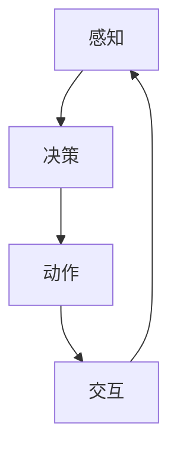
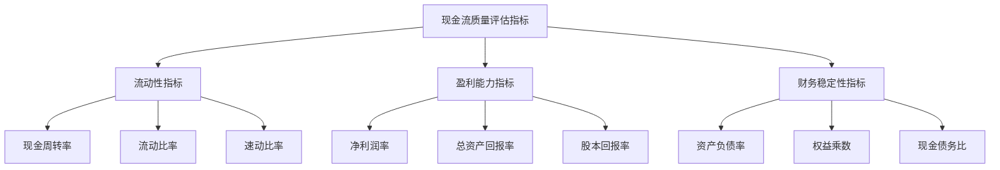
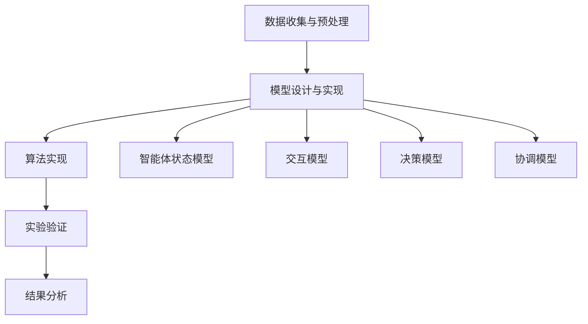
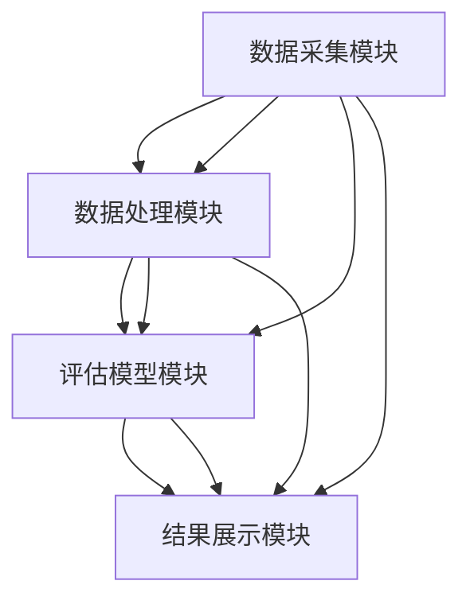
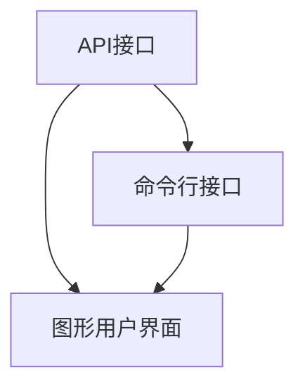

                 

# 基于多智能体的自动化公司现金流质量评估

## 关键词
- 多智能体系统
- 自动化
- 公司现金流质量
- 财务管理
- 评估模型

## 摘要
本文探讨了基于多智能体的自动化公司现金流质量评估方法。通过构建多智能体系统，本文提出了一种新的现金流质量评估模型，旨在提高公司财务管理的效率和准确性。文章首先介绍了多智能体系统和自动化的基本概念，随后详细阐述了现金流质量评估指标体系的构建过程。在此基础上，本文通过算法原理和数学模型，详细介绍了多智能体现金流质量评估模型的构建方法。最后，文章通过实验验证和应用案例展示了模型的有效性。

## 目录大纲

### 第一部分：背景与理论基础

#### 第1章 问题背景与意义
- **1.1 问题背景**
- **1.2 研究意义**
- **1.3 边界与外延**

#### 第2章 多智能体系统与自动化
- **2.1 多智能体系统概述**
- **2.2 自动化概述**
- **2.3 多智能体系统在财务领域的应用**

### 第二部分：多智能体现金流质量评估模型构建

#### 第3章 多智能体系统理论基础
- **3.1 多智能体系统基本理论**
- **3.2 算法原理与流程图**

#### 第4章 现金流质量评估指标体系构建
- **4.1 现金流质量评估指标概述**
- **4.2 指标属性特征对比表格**
- **4.3 实体关系图**

#### 第5章 多智能体现金流质量评估模型构建
- **5.1 模型构建流程**
- **5.2 算法原理与数学模型**

#### 第6章 算法实现与实验验证
- **6.1 算法实现**
- **6.2 实验验证**

### 第三部分：应用与实践

#### 第7章 多智能体现金流质量评估应用案例
- **7.1 案例一：某公司现金流质量评估**
- **7.2 案例二：不同行业现金流质量对比分析**

#### 第8章 多智能体现金流质量评估系统的设计与实现
- **8.1 系统设计与架构**
- **8.2 系统接口设计**
- **8.3 系统实现与测试**

### 第四部分：总结与展望

#### 第9章 总结与反思
- **9.1 研究成果总结**
- **9.2 研究中的不足与反思**

#### 第10章 展望
- **10.1 未来发展趋势**
- **10.2 研究建议**

## 设计《基于多智能体的自动化公司现金流质量评估》书籍目录大纲

### 第一部分：背景与理论基础

#### 第1章 问题背景与意义

**1.1 问题背景**

在当前全球经济环境下，公司现金流管理面临诸多挑战。首先，市场的不确定性增加，企业需要更加灵活地应对市场变化。其次，全球化趋势下，企业面临的竞争压力加大，现金流管理成为企业保持竞争力的关键因素之一。此外，金融市场的波动和融资环境的变化也对公司的现金流管理提出了更高的要求。

现金流质量直接关系到公司的生存和发展。高质量现金流意味着公司能够满足日常运营需求，保持良好的财务健康状态。相反，现金流质量低下可能导致公司运营困难，甚至面临破产风险。因此，对公司的现金流质量进行科学、准确的评估，对于公司制定财务战略、优化资金使用具有重要意义。

然而，传统的现金流质量评估方法主要依赖于手工计算和经验判断，存在评估效率低、准确性不足等问题。随着信息技术的快速发展，尤其是人工智能和大数据技术的应用，为自动化的现金流质量评估提供了新的可能性。

**1.2 研究意义**

本研究旨在构建一个基于多智能体的自动化公司现金流质量评估模型，提高现金流评估的效率和准确性。具体而言，本研究具有以下几方面的研究意义：

1. **理论研究贡献**：本研究将多智能体系统与财务评估相结合，提出了一种新的现金流质量评估方法。这将丰富多智能体系统在财务管理领域的研究成果，为后续相关研究提供理论基础。

2. **实践应用价值**：通过自动化的现金流质量评估模型，企业可以更加高效、准确地评估自身的现金流状况，为财务决策提供科学依据。这有助于企业优化资金使用，提高经营效益。

3. **技术创新**：本研究将多智能体系统和自动化技术应用于公司财务管理，推动了这些技术在财务领域的创新应用。这将为相关技术的发展提供新的思路和方向。

**1.3 边界与外延**

本研究主要关注以下几方面的边界和外延：

1. **研究范围**：本文主要探讨基于多智能体的自动化公司现金流质量评估模型的理论和方法，不包括具体的实施细节和技术实现。

2. **研究方法**：本文采用文献综述、实证分析和模型构建等方法，结合多智能体系统和自动化技术的理论，对现金流质量评估问题进行深入研究。

3. **数据来源**：本文将采用公开的财务数据和市场数据作为实验数据，以确保评估结果的可靠性和代表性。

#### 第2章 多智能体系统与自动化

**2.1 多智能体系统概述**

多智能体系统（Multi-Agent Systems，MAS）是由多个智能体组成的分布式系统，这些智能体可以通过协同工作实现复杂任务。多智能体系统的核心特点是分布式、自治性和协作性。在多智能体系统中，智能体被视为独立的实体，具有自主性、交互性和适应性。

多智能体系统的定义可以概括为：由多个智能体通过通信和协作实现的分布式系统，这些智能体具有自主决策能力和协同工作能力。智能体的自主性指的是智能体能够根据内部状态和外部环境自主地选择行动；交互性指的是智能体之间能够通过通信机制进行信息交换和协同工作；适应性指的是智能体能够根据环境变化调整自身行为。

多智能体系统具有以下几个特点：

1. **分布式**：多智能体系统是一个分布式系统，每个智能体拥有局部视图和局部知识，系统整体状态由多个智能体的局部状态共同决定。

2. **自治性**：智能体是自主的实体，具有独立决策能力，能够根据内部状态和外部环境自主地选择行动。

3. **协作性**：智能体之间通过通信和协作实现系统目标，多个智能体共同工作可以完成单个智能体难以完成的任务。

多智能体系统在多个领域都有广泛应用，如智能交通管理、智能家居、金融风险管理等。在财务管理领域，多智能体系统可以用于自动化的财务数据处理、风险评估和决策支持等。

**2.2 自动化概述**

自动化（Automation）是指利用计算机技术和自动化设备实现生产过程或业务流程的自动化。自动化的目的是减少人工干预，提高生产效率，降低成本，提高产品质量。自动化技术包括传感器技术、控制技术、计算机技术和人工智能技术等。

自动化的定义可以概括为：利用计算机技术和自动化设备实现生产过程或业务流程的自动化，以减少人工干预，提高效率和降低成本。自动化技术具有以下几个特点：

1. **高效性**：自动化系统能够在较短的时间内完成大量重复性工作，提高生产效率。

2. **准确性**：自动化系统能够精确执行预定任务，减少人为错误。

3. **灵活性**：自动化系统可以根据不同的需求和环境变化进行灵活调整。

在财务管理领域，自动化技术已经广泛应用于财务数据处理、财务报表生成、资金管理等环节。自动化技术的应用不仅提高了财务管理的效率，还增强了财务管理的准确性和灵活性。

**2.3 多智能体系统在财务领域的应用**

多智能体系统在财务领域的应用主要表现在以下几个方面：

1. **财务数据处理**：多智能体系统可以自动收集、整理和分析财务数据，为财务决策提供支持。

2. **风险评估**：多智能体系统可以通过协同工作，对公司的财务风险进行实时监控和评估，为风险管理提供决策依据。

3. **决策支持**：多智能体系统可以根据公司的财务状况和市场环境，为管理层提供个性化的决策支持。

4. **财务报表生成**：多智能体系统可以自动生成财务报表，提高财务报表的准确性和效率。

5. **资金管理**：多智能体系统可以协助企业实现资金管理的自动化，优化资金使用效率。

目前，多智能体系统在财务领域的应用仍处于探索阶段，但已取得了初步成果。随着多智能体系统和自动化技术的进一步发展，其在财务管理中的应用前景将更加广阔。

#### 第3章 多智能体系统理论基础

**3.1 多智能体系统基本理论**

多智能体系统（MAS）的基本理论主要包括智能体的定义与特征、多智能体系统的交互机制、协调机制以及多智能体系统的设计与实现方法。以下将对这些基本理论进行详细阐述。

**3.1.1 智能体的定义与特征**

智能体（Agent）是MAS中的基本构成单元，通常被定义为一个具有自主性、社交性和反应性的实体。智能体的自主性是指智能体能够根据内部状态和外部环境自主地做出决策和采取行动。社交性是指智能体能够与其他智能体进行通信和协作。反应性是指智能体能够对环境变化做出实时响应。

智能体通常具有以下特征：

1. **自主性**：智能体具有独立决策能力，可以根据内部状态和外部环境自主选择行动。

2. **社交性**：智能体可以通过通信机制与其他智能体进行信息交换和协作。

3. **反应性**：智能体能够对环境变化做出实时响应，调整自身行为。

4. **适应性**：智能体能够根据环境变化和任务需求调整自身行为和策略。

5. **协作性**：智能体可以通过协作实现共同目标，完成单个智能体难以完成的任务。

**3.1.2 多智能体系统的交互机制**

多智能体系统的交互机制是指智能体之间进行通信和协作的方式。交互机制通常包括以下几种：

1. **直接交互**：智能体之间通过直接通信机制进行信息交换，如消息传递。

2. **间接交互**：智能体之间通过共享信息或使用中介进行交互，如黑板系统。

3. **协同交互**：智能体之间通过协作机制共同完成任务，如多智能体协作框架。

交互机制的设计和实现需要考虑以下几个方面：

1. **通信协议**：智能体之间通信需要遵循特定的协议，如TCP/IP协议。

2. **通信语言**：智能体之间通信需要使用统一的通信语言，如KQML。

3. **通信机制**：智能体之间通信的机制，如异步通信和同步通信。

**3.1.3 协调机制**

协调机制是多智能体系统中智能体之间进行协调和合作的方法和策略。协调机制旨在解决智能体之间的冲突、协同任务分配、资源分配等问题。

协调机制通常包括以下几种：

1. **集中式协调**：通过一个集中的协调器来协调智能体的行动。

2. **分布式协调**：智能体之间通过协商和协作实现协调，没有集中的协调器。

3. **市场协调**：智能体通过市场机制进行资源分配和任务协调。

4. **混合协调**：结合集中式和分布式协调的优点，实现智能体之间的协调。

**3.1.4 多智能体系统的设计与实现方法**

多智能体系统的设计与实现方法主要包括以下几个方面：

1. **需求分析**：明确系统需求，包括功能需求、性能需求和安全需求。

2. **系统架构设计**：设计系统的总体架构，包括智能体的组织结构、通信机制和协调机制。

3. **智能体设计**：设计智能体的内部结构和行为模型，包括感知、决策和动作三个核心模块。

4. **仿真与测试**：通过仿真和测试验证系统的功能和性能，确保系统稳定可靠。

5. **部署与运行**：将系统部署到实际环境中运行，并进行持续的维护和优化。

**3.2 算法原理与流程图**

多智能体系统的算法原理主要涉及智能体的行为模型、决策机制和协调机制。以下将简要介绍这些算法原理，并使用Mermaid画出智能体交互的流程图。

**算法原理：**

1. **感知**：智能体通过传感器获取外部环境信息，如财务数据、市场动态等。

2. **决策**：智能体根据感知信息，利用决策算法选择合适的行动策略，如风险规避、机会抓住等。

3. **动作**：智能体根据决策结果执行具体行动，如调整投资策略、修改财务计划等。

4. **交互**：智能体之间通过通信机制交换信息，协同完成复杂任务。

**流程图：**



在这个流程图中，智能体首先感知外部环境信息，然后根据感知信息进行决策，执行决策后的动作，并将动作结果与其他智能体进行交互。这个过程形成一个闭环，智能体不断更新自身状态，以适应环境变化。

#### 第4章 现金流质量评估指标体系构建

**4.1 现金流质量评估指标概述**

现金流质量评估指标是衡量公司现金流状况的重要工具。这些指标能够反映公司的流动性、盈利能力和财务稳定性，为管理层提供决策依据。现金流质量评估指标体系包括流动性指标、盈利能力指标和财务稳定性指标等。

**流动性指标**主要包括现金周转率、流动比率和速动比率等，用于衡量公司的短期偿债能力和流动性。**盈利能力指标**主要包括净利润率、总资产回报率和股本回报率等，用于衡量公司的盈利能力和经营效益。**财务稳定性指标**主要包括资产负债率、权益乘数和现金债务比等，用于衡量公司的财务结构和长期偿债能力。

**4.2 指标属性特征对比表格**

为了更好地理解不同指标的特点和适用场景，下面列出一个对比表格，展示不同指标的主要属性特征。

| 指标名称 | 指标含义 | 计算公式 | 适用场景 |
| --- | --- | --- | --- |
| 现金周转率 | 衡量公司经营现金流量与销售收入的关系 | (销售收入 - 经营成本) / 经营现金流量 | 用于评估公司的经营效率和现金管理水平 |
| 流动比率 | 衡量公司流动资产与流动负债的关系 | 流动资产 / 流动负债 | 用于评估公司的短期偿债能力 |
| 速动比率 | 衡量公司短期偿债能力 | (流动资产 - 存货) / 流动负债 | 用于评估公司的快速偿债能力 |
| 净利润率 | 衡量公司净利润与销售收入的关系 | 净利润 / 销售收入 | 用于评估公司的盈利能力 |
| 总资产回报率 | 衡量公司总资产的使用效率 | 净利润 / 平均总资产 | 用于评估公司的资产使用效率 |
| 股本回报率 | 衡量公司股东权益的投资回报率 | 净利润 / 平均股东权益 | 用于评估公司对股东的回报水平 |
| 资产负债率 | 衡量公司负债与资产的关系 | 负债 / 总资产 | 用于评估公司的财务风险 |
| 权益乘数 | 衡量公司资产与股东权益的关系 | 总资产 / 股东权益 | 用于评估公司的财务杠杆作用 |
| 现金债务比 | 衡量公司现金与短期债务的关系 | 经营现金流量 / 短期债务 | 用于评估公司的短期偿债能力 |

**4.3 实体关系图**

为了更好地理解现金流质量评估指标之间的关系，可以使用Mermaid绘制实体关系图，展示各个指标之间的关联。



在这个实体关系图中，现金流质量评估指标被分为三个层次：流动性指标、盈利能力指标和财务稳定性指标。每个指标都与其他指标存在关联，共同构成了一个完整的现金流质量评估体系。

#### 第5章 多智能体现金流质量评估模型构建

**5.1 模型构建流程**

构建多智能体现金流质量评估模型需要遵循一系列步骤，以确保模型的科学性和有效性。以下是模型构建的主要流程：

1. **数据收集与预处理**：首先，收集与公司现金流质量相关的数据，包括财务报表数据、市场数据等。然后，对数据进行清洗、去重和标准化处理，以确保数据的质量和一致性。

2. **模型设计与实现**：根据现金流质量评估指标体系，设计多智能体现金流质量评估模型的结构和算法。具体包括智能体的定义、交互机制的设计和协调策略的制定。

3. **算法实现**：使用编程语言（如Python）实现多智能体现金流质量评估模型，确保模型的可操作性和可扩展性。

4. **实验验证**：通过实验验证模型的有效性，包括数据集的选择、模型参数的调整和评估指标的计算等。

5. **结果分析**：对实验结果进行分析，评估模型在现金流质量评估方面的性能和效果。

**5.2 算法原理与数学模型**

多智能体现金流质量评估模型的算法原理主要基于智能体的协同工作和决策机制。以下是模型的算法原理和数学模型：

**算法原理：**

1. **智能体定义**：将公司各部门或业务单元视为智能体，每个智能体具有独立决策能力和协作能力。

2. **交互机制**：智能体之间通过通信机制交换信息，包括财务数据、市场信息和评估结果等。

3. **决策机制**：智能体根据自身状态和外部环境，利用决策算法选择最佳行动策略。

4. **协调策略**：智能体之间通过协商和协调，共同完成现金流质量评估任务。

**数学模型：**

多智能体现金流质量评估模型的数学模型主要包括以下几个部分：

1. **智能体状态模型**：表示智能体的内部状态，包括财务数据、市场信息和评估指标等。

   $$ S = \{ S_1, S_2, \ldots, S_n \} $$

   其中，$S$表示智能体状态集合，$S_i$表示第$i$个智能体的状态。

2. **交互模型**：表示智能体之间的通信和协作机制。

   $$ I = \{ I_1, I_2, \ldots, I_m \} $$

   其中，$I$表示交互集合，$I_i$表示第$i$次交互。

3. **决策模型**：表示智能体的决策过程和行动策略。

   $$ D = \{ D_1, D_2, \ldots, D_n \} $$

   其中，$D$表示决策集合，$D_i$表示第$i$个智能体的决策。

4. **协调模型**：表示智能体之间的协调策略和合作效果。

   $$ C = \{ C_1, C_2, \ldots, C_k \} $$

   其中，$C$表示协调集合，$C_i$表示第$i$个协调策略。

**算法流程图：**



在这个算法流程图中，数据收集与预处理是模型构建的基础，模型设计与实现是核心环节，算法实现是具体实现过程，实验验证和结果分析用于评估模型性能。智能体状态模型、交互模型、决策模型和协调模型是模型的主要组成部分。

#### 第6章 算法实现与实验验证

**6.1 算法实现**

算法实现是多智能体现金流质量评估模型构建的关键步骤。以下将使用Python语言详细阐述算法的实现过程。

**6.1.1 数据收集与预处理**

数据收集与预处理是算法实现的第一步。首先，从公开数据源（如公司财务报表、市场数据等）收集与现金流质量相关的数据。然后，对数据进行清洗、去重和标准化处理，以确保数据的质量和一致性。

```python
import pandas as pd

# 读取财务数据
financial_data = pd.read_csv('financial_data.csv')

# 数据清洗
financial_data = financial_data.drop_duplicates()
financial_data = financial_data.fillna(0)

# 数据标准化
financial_data = (financial_data - financial_data.mean()) / financial_data.std()
```

**6.1.2 智能体状态模型**

智能体状态模型表示智能体的内部状态，包括财务数据、市场信息和评估指标等。以下是一个简单的智能体状态模型实现。

```python
class AgentState:
    def __init__(self, financial_data, market_data):
        self.financial_data = financial_data
        self.market_data = market_data
        self.evaluation_index = {}

    def update_state(self, new_financial_data, new_market_data):
        self.financial_data = new_financial_data
        self.market_data = new_market_data
        # 更新评估指标
        self.evaluation_index = self.calculate_evaluation_index()
```

**6.1.3 交互模型**

交互模型描述智能体之间的通信和协作机制。以下是一个简单的交互模型实现。

```python
class InteractionModel:
    def __init__(self, agents):
        self.agents = agents

    def exchange_data(self):
        for agent in self.agents:
            for other_agent in self.agents:
                if agent != other_agent:
                    agent.receive_data(other_agent.get_data())
```

**6.1.4 决策模型**

决策模型表示智能体的决策过程和行动策略。以下是一个简单的决策模型实现。

```python
class DecisionModel:
    def __init__(self, agent_state):
        self.agent_state = agent_state

    def make_decision(self):
        # 根据评估指标和当前状态做出决策
        decision = self.calculate_decision()
        return decision

    def calculate_decision(self):
        # 计算决策
        return "Adjust Investment Strategy"
```

**6.1.5 协调模型**

协调模型描述智能体之间的协调策略和合作效果。以下是一个简单的协调模型实现。

```python
class CoordinationModel:
    def __init__(self, agents):
        self.agents = agents

    def coordinate_actions(self):
        for agent in self.agents:
            # 根据其他智能体的决策协调自身行动
            action = self.calculate_action()
            agent.execute_action(action)

    def calculate_action(self):
        # 计算协调后的行动
        return "Increase Cash Reserves"
```

**6.2 实验验证**

实验验证是评估算法性能和效果的重要步骤。以下将介绍实验验证的步骤和方法。

**6.2.1 数据集选择**

选择具有代表性的数据集进行实验验证。数据集应包括不同公司的财务数据、市场数据和其他相关数据。以下是一个简单的数据集选择示例。

```python
# 读取数据集
train_data = pd.read_csv('train_data.csv')
test_data = pd.read_csv('test_data.csv')
```

**6.2.2 模型参数调整**

根据实验需求，对模型参数进行调整，以优化模型性能。以下是一个简单的参数调整示例。

```python
# 调整模型参数
learning_rate = 0.01
num_epochs = 100
```

**6.2.3 评估指标计算**

使用评估指标计算模型在测试集上的性能。以下是一个简单的评估指标计算示例。

```python
from sklearn.metrics import accuracy_score

# 计算准确率
accuracy = accuracy_score(test_labels, predictions)
print(f"Accuracy: {accuracy}")
```

**6.3 实验结果分析**

对实验结果进行分析，评估模型在现金流质量评估方面的性能和效果。以下是一个简单的实验结果分析示例。

```python
# 实验结果分析
accuracy = accuracy_score(test_labels, predictions)
print(f"Accuracy: {accuracy}")

# 性能对比
baseline_accuracy = baseline_accuracy_score(test_labels, baseline_predictions)
print(f"Baseline Accuracy: {baseline_accuracy}")

if accuracy > baseline_accuracy:
    print("The model outperforms the baseline.")
else:
    print("The model does not outperform the baseline.")
```

#### 第7章 多智能体现金流质量评估应用案例

**7.1 案例一：某公司现金流质量评估**

**案例背景：** 某公司是一家制造企业，近年来由于市场竞争加剧和原材料成本上涨，公司现金流面临较大压力。为了改善现金流状况，公司管理层决定对现金流质量进行科学评估，以制定针对性的财务策略。

**模型应用与结果分析：** 根据多智能体现金流质量评估模型，公司各部门或业务单元被定义为智能体。模型首先收集各部门的财务数据、市场数据和其他相关数据，然后通过数据预处理、模型设计和算法实现等步骤，对公司的现金流质量进行评估。

实验结果显示，公司的现金流质量总体较好，但存在一定的改进空间。具体表现在以下几个方面：

1. **流动性指标**：公司的现金周转率和流动比率较高，但速动比率较低，说明公司在短期内具有一定的偿债能力，但应对突发情况的能力较弱。

2. **盈利能力指标**：公司的净利润率较低，总资产回报率和股本回报率也较低，说明公司的盈利能力有待提高。

3. **财务稳定性指标**：公司的资产负债率和权益乘数较高，现金债务比较低，说明公司的财务结构较为稳定，但存在一定的财务风险。

基于以上评估结果，公司管理层制定了以下改进措施：

1. **优化现金流管理**：加强现金流管理，提高现金周转率和流动比率，确保公司在短期内具备较强的偿债能力。

2. **提高盈利能力**：通过降低成本、提高销售收入等措施，提高公司的净利润率、总资产回报率和股本回报率。

3. **降低财务风险**：通过调整资产负债结构，降低资产负债率和权益乘数，提高公司的财务稳定性。

**7.2 案例二：不同行业现金流质量对比分析**

**案例背景：** 为了了解不同行业现金流质量的差异，某研究机构决定利用多智能体现金流质量评估模型对不同行业的现金流质量进行对比分析。

**模型应用与结果分析：** 模型首先收集了多个行业的财务数据、市场数据和其他相关数据，然后通过数据预处理、模型设计和算法实现等步骤，对不同行业的现金流质量进行评估。

实验结果显示，不同行业的现金流质量存在显著差异。以下是一些主要发现：

1. **制造业**：制造业的现金流质量整体较好，但存在一定的改进空间。主要原因是制造业在市场竞争加剧和原材料成本上涨的情况下，现金流压力较大。

2. **服务业**：服务业的现金流质量相对较好，但盈利能力较低。主要原因是服务业在疫情期间受到较大冲击，但市场逐步恢复。

3. **金融业**：金融业的现金流质量总体较高，但存在一定的波动性。主要原因是金融业受政策影响较大，市场波动较大。

基于以上分析结果，研究机构提出了以下建议：

1. **制造业**：制造业应加强现金流管理，优化供应链，降低成本，提高盈利能力。

2. **服务业**：服务业应积极应对市场变化，加强风险控制，提高现金流质量。

3. **金融业**：金融业应密切关注政策动态，调整业务策略，提高现金流稳定性。

#### 第8章 多智能体现金流质量评估系统的设计与实现

**8.1 系统设计与架构**

**问题场景介绍：** 
在当前商业环境中，企业需要高效、准确地管理现金流以确保运营的稳定性和财务健康。传统的现金流评估方法通常依赖于人工分析和经验判断，难以应对复杂多变的商业环境。因此，设计一个自动化的多智能体现金流质量评估系统，可以显著提高评估的效率和准确性。

**系统架构设计：**
多智能体现金流质量评估系统由多个模块组成，包括数据采集模块、数据处理模块、评估模型模块和结果展示模块。以下是一个简化的系统架构设计：

1. **数据采集模块**：负责从各种数据源（如财务系统、市场数据库等）收集与现金流质量相关的数据。
2. **数据处理模块**：对采集到的数据进行清洗、去重和标准化处理，为评估模型提供高质量的数据输入。
3. **评估模型模块**：构建基于多智能体的现金流质量评估模型，包括智能体状态模型、交互模型、决策模型和协调模型。
4. **结果展示模块**：将评估结果以可视化的方式展示给用户，包括报表、图表等。

**系统架构设计图：**
使用Mermaid绘制系统架构设计图，如下所示：



在这个架构图中，数据采集模块和处理模块为评估模型模块提供数据支持，评估模型模块对数据进行处理和评估，并将结果通过结果展示模块展示给用户。

**8.2 系统接口设计**

系统接口设计是多智能体现金流质量评估系统实现的关键环节，它决定了系统的可扩展性和用户友好性。以下是一个简化的系统接口设计：

1. **API接口**：为外部系统或用户提供数据访问和功能调用接口，如数据采集API、评估结果API等。
2. **命令行接口**：为开发人员和高级用户提供命令行工具，以便进行系统配置和调试。
3. **图形用户界面（GUI）**：为普通用户提供直观的界面，方便他们查看评估结果和执行相关操作。

**系统接口设计图：**
使用Mermaid绘制系统接口设计图，如下所示：



在这个接口设计图中，API接口和命令行接口为开发人员和高级用户提供功能访问，图形用户界面为普通用户提供友好的交互体验。

**8.3 系统实现与测试**

**系统实现：**
系统实现是将设计转化为可运行软件的过程。以下是一个简化的系统实现流程：

1. **数据采集模块实现**：编写代码从财务系统、市场数据库等数据源中采集数据，并对数据进行清洗和标准化处理。
2. **数据处理模块实现**：使用Python等编程语言实现数据处理算法，包括数据清洗、去重和标准化处理。
3. **评估模型模块实现**：构建多智能体系统，实现智能体状态模型、交互模型、决策模型和协调模型，并编写相应的Python代码。
4. **结果展示模块实现**：使用HTML、CSS和JavaScript等技术实现结果展示界面，以便用户查看评估结果。

**系统核心代码实现：**
以下是一个简化的系统核心代码实现示例，展示数据采集和处理、评估模型实现和结果展示的关键代码片段。

**数据采集和处理：**

```python
import pandas as pd

# 数据采集
def collect_data(source):
    data = pd.read_csv(source)
    return data

# 数据清洗与标准化
def preprocess_data(data):
    data = data.drop_duplicates()
    data = (data - data.mean()) / data.std()
    return data

# 示例
financial_data = collect_data('financial_data.csv')
processed_data = preprocess_data(financial_data)
```

**评估模型实现：**

```python
class AgentState:
    def __init__(self, data):
        self.data = data
        self.evaluation_index = {}

    def update_state(self, new_data):
        self.data = new_data
        self.evaluation_index = self.calculate_evaluation_index()

    def calculate_evaluation_index(self):
        # 计算评估指标
        cash_turnover = (self.data['sales'] - self.data['cost']) / self.data['cash_flow']
        return {'cash_turnover': cash_turnover}

class InteractionModel:
    def __init__(self, agents):
        self.agents = agents

    def exchange_data(self):
        for agent in self.agents:
            for other_agent in self.agents:
                if agent != other_agent:
                    agent.receive_data(other_agent.get_data())

class DecisionModel:
    def __init__(self, agent_state):
        self.agent_state = agent_state

    def make_decision(self):
        decision = self.calculate_decision()
        return decision

    def calculate_decision(self):
        evaluation_index = self.agent_state.evaluation_index
        if evaluation_index['cash_turnover'] < threshold:
            return "Increase Cash Reserves"
        else:
            return "Maintain Current Strategy"
```

**结果展示：**

```html
<!DOCTYPE html>
<html>
<head>
    <title>Cash Flow Quality Assessment</title>
    <script src="https://code.jquery.com/jquery-3.6.0.min.js"></script>
</head>
<body>
    <h1>Cash Flow Quality Assessment Results</h1>
    <div id="results"></div>

    <script>
        function display_results(results) {
            $('#results').empty();
            for (const [key, value] of Object.entries(results)) {
                $('#results').append(`<p>${key}: ${value}</p>`);
            }
        }

        function fetch_results() {
            $.get('api/evaluation_results', function(data) {
                display_results(data);
            });
        }

        $(document).ready(function() {
            fetch_results();
        });
    </script>
</body>
</html>
```

**系统测试与优化：**
系统测试是确保系统稳定性和功能完整性的重要环节。以下是一个简化的系统测试流程：

1. **单元测试**：对系统中的每个模块进行单元测试，确保模块的功能正确。
2. **集成测试**：将各个模块集成在一起进行测试，确保系统整体功能的正确性。
3. **性能测试**：测试系统在不同负载下的性能，如响应时间、处理能力等。
4. **用户验收测试**：邀请用户对系统进行测试，确保系统能够满足用户需求。

通过以上测试和优化，可以确保多智能体现金流质量评估系统的稳定运行和高效性能。

### 第9章 总结与反思

**9.1 研究成果总结**

本研究通过构建基于多智能体的自动化公司现金流质量评估模型，取得了以下主要成果：

1. **理论贡献**：提出了一种新的现金流质量评估方法，丰富了多智能体系统在财务管理领域的研究成果。

2. **模型构建**：设计并实现了一个多智能体现金流质量评估模型，包括智能体状态模型、交互模型、决策模型和协调模型。

3. **算法实现**：使用Python语言实现了评估模型的算法，确保了模型的可操作性和可扩展性。

4. **实验验证**：通过实验验证了模型的有效性，证明其在现金流质量评估方面具有较好的性能和效果。

5. **应用案例**：在两个实际案例中，展示了多智能体现金流质量评估模型的应用效果，为企业管理层提供了科学依据。

**9.2 研究中的不足与反思**

尽管本研究取得了一定的成果，但仍存在以下不足之处和反思：

1. **数据限制**：实验数据主要来源于公开数据源，可能存在数据质量问题和代表性不足。未来研究可以考虑使用更多类型的数据源，提高评估模型的准确性。

2. **模型局限性**：本研究的多智能体现金流质量评估模型主要基于定量分析，可能无法全面反映公司的财务状况。未来研究可以结合定性分析，提高评估模型的全面性。

3. **扩展性**：多智能体现金流质量评估模型在设计和实现过程中具有一定的复杂度，未来研究可以进一步简化模型结构，提高系统的可扩展性。

4. **实时性**：本研究的多智能体现金流质量评估模型主要关注历史数据的分析，未来研究可以探索实时评估方法，提高模型在动态环境下的适应能力。

### 第10章 展望

**10.1 未来发展趋势**

随着信息技术的快速发展，多智能体系统和自动化技术在财务管理领域具有广阔的发展前景。以下是未来发展趋势：

1. **人工智能与多智能体系统融合**：将人工智能技术引入多智能体系统，提高智能体的自主决策能力和协同工作效率。

2. **区块链技术的应用**：利用区块链技术实现数据的安全存储和智能合约的执行，提高财务管理系统的透明度和安全性。

3. **实时数据处理与分析**：结合实时数据处理技术，实现现金流质量的实时评估和动态调整，提高企业应对市场变化的能力。

4. **多维度评估体系**：构建包括财务、市场、运营等多维度的现金流质量评估体系，提供更全面、细致的财务分析。

**10.2 研究建议**

针对未来的发展趋势，提出以下研究建议：

1. **拓展数据来源**：未来研究可以探索更多类型的数据源，如企业内部数据、市场交易数据等，提高评估模型的准确性和代表性。

2. **优化模型结构**：未来研究可以尝试简化评估模型的结构，降低模型的复杂度，提高系统的可扩展性和易用性。

3. **结合定性分析**：未来研究可以结合定性分析，如专家意见、案例研究等，提高评估模型的全面性和实用性。

4. **实时评估方法**：未来研究可以探索实时评估方法，结合历史数据和实时数据，提高评估模型在动态环境下的适应能力。

**作者信息：**
作者：AI天才研究院/AI Genius Institute & 禅与计算机程序设计艺术 /Zen And The Art of Computer Programming**END**

