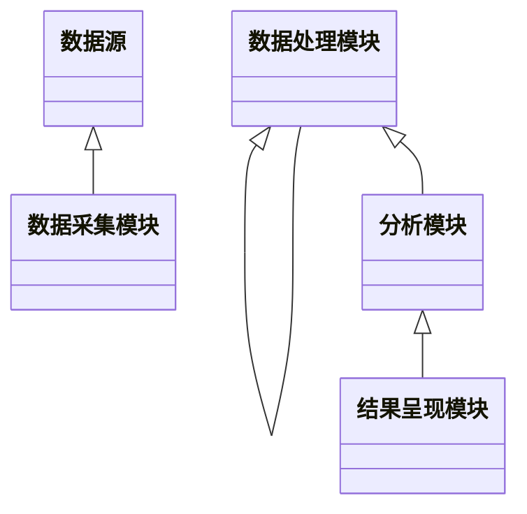
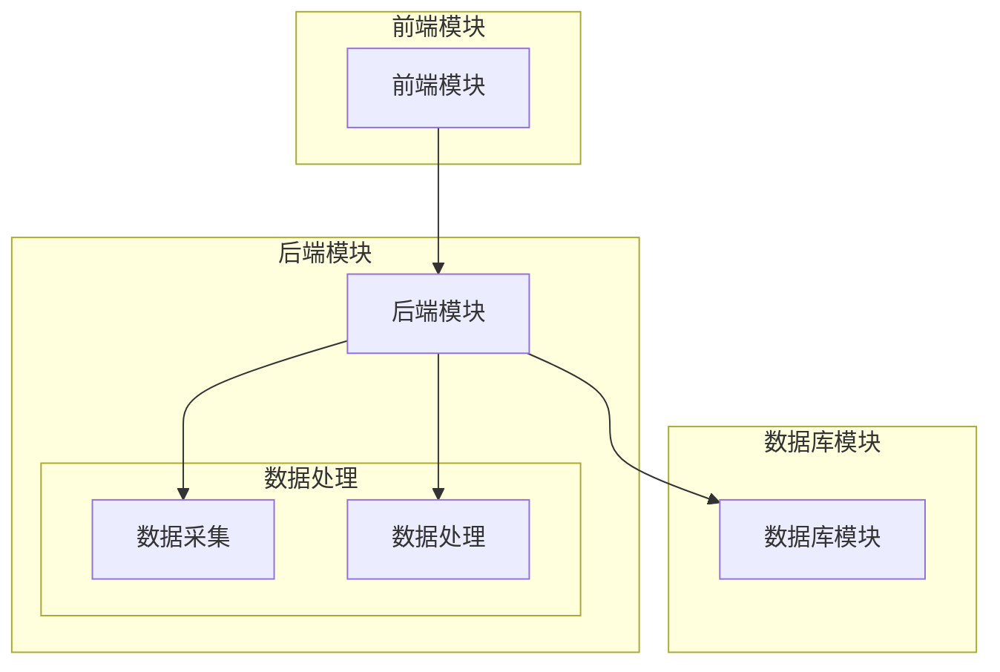
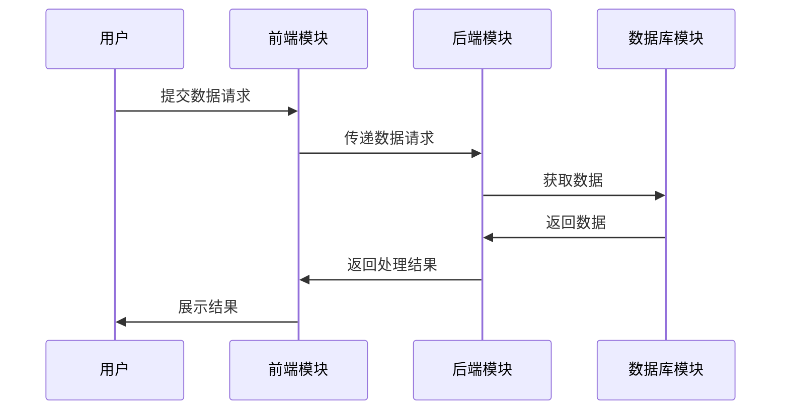
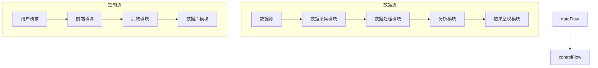

                 

# 《基于多智能体的自动化公司调研系统》

> 关键词：多智能体系统、自动化调研、公司情报、算法原理、系统架构、项目实战

> 摘要：本文深入探讨了基于多智能体的自动化公司调研系统的构建和应用。首先，介绍了多智能体系统和自动化公司调研的基本概念和背景。接着，详细阐述了多智能体算法原理和自动化调研算法原理，并通过数学模型和公式进行了深入分析。然后，对系统的分析与架构设计进行了详细的讲解，包括系统功能、架构设计、接口设计和系统交互。接下来，通过实际项目实战，展示了系统的核心实现和代码分析。最后，总结了最佳实践和注意事项，并对未来研究方向进行了展望。

## 目录大纲

### 第一部分：背景介绍
- 1.1 问题背景
- 1.2 问题描述
- 1.3 问题解决
- 1.4 边界与外延
- 1.5 概念结构与核心要素组成

### 第二部分：核心概念与联系
- 2.1 多智能体系统概念
- 2.2 自动化公司调研概念
- 2.3 多智能体与自动化调研的联系
- 2.4 核心概念属性特征对比表格
- 2.5 ER实体关系图架构

### 第三部分：算法原理讲解
- 3.1 多智能体算法原理
  - 3.1.1 智能体协同机制
  - 3.1.2 智能体通信机制
- 3.2 自动化调研算法原理
  - 3.2.1 数据采集算法
  - 3.2.2 数据处理算法

### 第四部分：数学模型和数学公式讲解
- 4.1 数学模型
  - 4.1.1 多智能体系统模型
  - 4.1.2 自动化调研模型
- 4.2 数学公式详解
  - 4.2.1 模型中的主要公式
  - 4.2.2 公式推导

### 第五部分：系统分析与架构设计
- 5.1 问题场景介绍
- 5.2 系统功能设计
  - 5.2.1 领域模型
- 5.3 系统架构设计
  - 5.3.1 系统架构
- 5.4 系统接口设计
- 5.5 系统交互

### 第六部分：项目实战
- 6.1 环境安装
- 6.2 系统核心实现
  - 6.2.1 代码应用解读
  - 6.2.2 代码分析与优化
- 6.3 实际案例分析与讲解
- 6.4 项目小结

### 第七部分：最佳实践与小结
- 7.1 最佳实践
- 7.2 注意事项
- 7.3 拓展阅读

## 第一部分：背景介绍

### 1.1 问题背景

在当今商业环境中，公司调研变得日益重要。无论是投资决策、市场分析还是竞争策略，公司调研都是不可或缺的一环。然而，传统的公司调研方法往往耗时耗力，且存在诸多局限性。为了提高效率，降低成本，提高调研的准确性，自动化公司调研系统应运而生。

多智能体系统是一种模拟生物群体行为的计算模型，由多个具有独立智能和协同能力的智能体组成。在自动化公司调研系统中，多智能体系统可以模拟人类分析师对公司数据的处理和分析过程，从而实现自动化的公司调研。

### 1.2 问题描述

随着市场竞争的加剧和数据的爆炸式增长，传统的公司调研方法已经无法满足现代企业的需求。主要问题包括：

1. **数据量巨大**：公司调研涉及到的数据量非常庞大，人工处理效率低下。
2. **时效性要求高**：市场变化迅速，公司调研需要实时进行，以获取最新信息。
3. **准确性要求高**：公司调研的结果需要具有较高的准确性，以支持决策。
4. **协同性要求高**：公司调研通常需要多个部门或团队协同工作，传统方法难以实现高效的协同。

### 1.3 问题解决

基于多智能体的自动化公司调研系统旨在解决上述问题。通过引入多智能体系统，可以实现以下目标：

1. **高效数据处理**：多智能体系统可以并行处理大量数据，提高处理效率。
2. **实时信息获取**：多智能体系统可以实时获取和分析数据，确保调研结果的时效性。
3. **高准确性**：多智能体系统通过智能体的协同工作，可以确保调研结果的高准确性。
4. **高效协同**：多智能体系统可以模拟人类分析师的工作流程，实现高效的协同工作。

### 1.4 边界与外延

自动化公司调研系统的边界主要涉及以下方面：

1. **数据来源**：包括公司内部数据、外部公开数据、社交媒体数据等。
2. **数据处理**：包括数据清洗、数据整合、数据挖掘等。
3. **分析模型**：包括市场分析模型、竞争分析模型、财务分析模型等。
4. **结果呈现**：包括可视化报表、报告生成、决策支持等。

外延方面，自动化公司调研系统可以应用于各个行业和领域，包括但不限于金融、医疗、教育、零售等。

### 1.5 概念结构与核心要素组成

自动化公司调研系统的核心概念结构主要包括：

1. **多智能体系统**：由多个具有独立智能和协同能力的智能体组成，负责数据处理和分析。
2. **数据源**：包括内部数据和外部数据，是多智能体系统工作的基础。
3. **数据处理模块**：负责数据清洗、整合和挖掘，是多智能体系统工作的核心。
4. **分析模块**：基于数据挖掘结果，生成市场分析、竞争分析和财务分析报告。
5. **结果呈现模块**：将分析结果以可视化报表和报告的形式呈现给用户。

这些核心要素相互作用，共同构成了自动化公司调研系统的整体架构。

## 第二部分：核心概念与联系

### 2.1 多智能体系统概念

多智能体系统（Multi-Agent System，MAS）是一种模拟生物群体行为的计算模型，由多个具有独立智能和协同能力的智能体组成。在MAS中，每个智能体具有自主性、社会性和反应性，能够独立完成某些任务，同时与其他智能体进行交互和协作，以实现整体目标。

多智能体系统的核心概念包括：

1. **智能体**：是MAS的基本组成单位，具有自主性、社会性和反应性。智能体可以是计算机程序、机器人、人类等。
2. **自主性**：智能体具有独立决策能力，可以根据环境变化自主调整行为。
3. **社会性**：智能体能够与其他智能体进行交互和协作，以实现共同目标。
4. **反应性**：智能体能够对外部环境的变化做出实时响应。

### 2.2 自动化公司调研概念

自动化公司调研（Automated Company Research）是指利用计算机技术和人工智能算法，对大量公司数据进行分析和处理，以获取有价值的信息和洞见。自动化公司调研的目标是提高调研效率、降低成本，并确保调研结果的高准确性。

自动化公司调研的核心概念包括：

1. **数据采集**：从各种数据源（如公司官网、社交媒体、公开数据库等）收集相关数据。
2. **数据处理**：对采集到的数据进行清洗、整合和挖掘，以提取有价值的信息。
3. **分析模型**：基于数据挖掘结果，构建市场分析、竞争分析和财务分析模型。
4. **结果呈现**：将分析结果以可视化报表和报告的形式呈现给用户。

### 2.3 多智能体与自动化调研的联系

多智能体系统和自动化公司调研之间存在紧密的联系：

1. **数据处理与协同**：多智能体系统可以在数据处理和分析过程中实现高效协同，提高调研效率。
2. **实时性与准确性**：多智能体系统可以实现实时数据处理和分析，确保调研结果的高准确性。
3. **自适应性与灵活性**：多智能体系统可以根据环境变化和用户需求，自适应地调整行为和策略。
4. **人机交互**：多智能体系统可以模拟人类分析师的工作流程，实现高效的人机交互。

通过引入多智能体系统，自动化公司调研可以更好地应对大规模数据、实时性和准确性等挑战，为企业提供更全面、准确的调研结果。

### 2.4 核心概念属性特征对比表格

| 特征 | 多智能体系统 | 自动化公司调研 |
| --- | --- | --- |
| 基本组成单位 | 智能体 | 数据源、数据处理模块、分析模块、结果呈现模块 |
| 核心概念 | 自主性、社会性、反应性 | 数据采集、数据处理、分析模型、结果呈现 |
| 目标 | 高效协同、实时性与准确性 | 提高调研效率、降低成本、确保调研结果的高准确性 |
| 应用场景 | 分布式计算、智能协同、自适应系统 | 市场分析、竞争分析、财务分析 |

### 2.5 ER实体关系图架构

ER（Entity-Relationship）实体关系图是数据库设计中的重要工具，用于表示实体之间的关系。在自动化公司调研系统中，ER图可以用于描述数据源、数据处理模块、分析模块和结果呈现模块之间的关联。

```mermaid
erDiagram
  数据源 ||--|{ 数据处理模块 }
  数据处理模块 ||--|{ 分析模块 }
  分析模块 ||--|{ 结果呈现模块 }
  数据源 ||--|{ 公开数据库 }
  数据源 ||--|{ 公司官网 }
  数据源 ||--|{ 社交媒体 }
```

在这个ER图中，数据源、数据处理模块、分析模块和结果呈现模块是四个主要实体，它们之间存在关联。公开数据库、公司官网和社交媒体是数据源的具体实例。

## 第三部分：算法原理讲解

### 3.1 多智能体算法原理

多智能体系统（MAS）的算法原理主要涉及智能体的协同机制和通信机制。以下将对这两个核心方面进行详细讲解。

#### 3.1.1 智能体协同机制

智能体协同机制是指多个智能体在完成共同任务时，如何通过合作、协调和竞争来优化整体性能。智能体协同机制的核心包括以下几个方面：

1. **目标一致性**：智能体之间需要共享共同的目标，以确保协同工作的有效性。
2. **信息共享**：智能体需要能够交换和共享信息，以实现更好的协同效果。
3. **策略协调**：智能体需要根据环境变化和任务需求，动态调整自己的行为策略，以实现协同效应。
4. **冲突解决**：在协同过程中，智能体可能会出现利益冲突，需要有效的冲突解决机制来保障协同工作的顺利进行。

一个典型的智能体协同机制可以描述为：

$$
协同效果 = f(目标一致性, 信息共享, 策略协调, 冲突解决)
$$

#### 3.1.2 智能体通信机制

智能体通信机制是指智能体之间如何进行信息交换和协作。通信机制的核心包括以下几个方面：

1. **通信协议**：智能体之间需要遵循统一的通信协议，以确保信息的准确传输。
2. **通信方式**：智能体之间的通信方式可以是同步通信或异步通信，具体选择取决于应用场景和任务需求。
3. **通信模型**：通信模型决定了智能体之间的交互方式和信息传输方式，常见的通信模型包括全局通信模型和局部通信模型。
4. **通信效率**：智能体通信机制需要具备较高的通信效率，以确保协同工作的实时性和准确性。

一个典型的智能体通信机制可以描述为：

$$
通信效率 = f(通信协议, 通信方式, 通信模型)
$$

### 3.2 自动化调研算法原理

自动化调研算法原理主要包括数据采集算法和数据处理算法。以下将对这两个核心方面进行详细讲解。

#### 3.2.1 数据采集算法

数据采集算法是指从各种数据源收集有用信息的方法。自动化调研系统通常需要从多个数据源获取数据，如公司官网、公开数据库和社交媒体等。数据采集算法的核心包括以下几个方面：

1. **数据爬取**：利用网络爬虫技术，从互联网上自动获取公司信息。
2. **数据清洗**：对采集到的数据进行清洗，去除重复、错误和无关信息，以提高数据质量。
3. **数据整合**：将来自不同数据源的数据进行整合，以形成一个统一的数据视图。
4. **数据存储**：将清洗和整合后的数据存储到数据库中，以备后续分析。

一个典型的数据采集算法可以描述为：

$$
数据采集 = f(数据爬取, 数据清洗, 数据整合, 数据存储)
$$

#### 3.2.2 数据处理算法

数据处理算法是指对采集到的数据进行分析和处理的方法。自动化调研系统需要对大量数据进行处理，以提取有价值的信息。数据处理算法的核心包括以下几个方面：

1. **数据挖掘**：利用数据挖掘技术，从大量数据中提取隐藏的规律和知识。
2. **数据可视化**：将数据挖掘结果以可视化形式展示，帮助用户更好地理解和分析数据。
3. **数据建模**：基于数据挖掘结果，构建相应的分析模型，以支持决策。
4. **数据预测**：利用分析模型，对未来可能发生的情况进行预测。

一个典型的数据处理算法可以描述为：

$$
数据处理 = f(数据挖掘, 数据可视化, 数据建模, 数据预测)
$$

通过数据采集算法和数据处理算法的协同工作，自动化调研系统可以实现对大量公司数据的自动收集、分析和处理，为企业提供及时、准确的调研结果。

## 第四部分：数学模型和数学公式讲解

### 4.1 数学模型

在多智能体系统和自动化调研系统中，数学模型起到了至关重要的作用。以下将详细介绍多智能体系统模型和自动化调研模型，并解释其中的关键数学公式。

#### 4.1.1 多智能体系统模型

多智能体系统模型主要关注智能体之间的协同工作和通信机制。以下是一个简化的多智能体系统模型：

$$
MAS = \{A_1, A_2, ..., A_n\}, \quad A_i = (S_i, P_i, E_i)
$$

其中，$A_i$ 表示第 $i$ 个智能体，$S_i$ 表示智能体的状态，$P_i$ 表示智能体的行为策略，$E_i$ 表示智能体的环境。智能体的状态和策略可以通过以下数学公式描述：

$$
S_i = f(S_{i-1}, A_i, E_i)
$$

$$
P_i = g(S_i, A_i, E_i)
$$

这些公式描述了智能体状态和策略的动态变化，其中 $f$ 和 $g$ 是相应的函数。

#### 4.1.2 自动化调研模型

自动化调研模型主要关注数据采集、处理和分析的过程。以下是一个简化的自动化调研模型：

$$
AR = \{D_1, D_2, ..., D_n\}, \quad D_i = (C_i, P_i, A_i)
$$

其中，$D_i$ 表示第 $i$ 个数据处理阶段，$C_i$ 表示数据采集过程，$P_i$ 表示数据处理过程，$A_i$ 表示数据分析过程。数据处理阶段的状态和策略可以通过以下数学公式描述：

$$
C_i = h(C_{i-1}, D_i, E_i)
$$

$$
P_i = k(C_i, D_i, E_i)
$$

$$
A_i = l(C_i, D_i, E_i)
$$

这些公式描述了数据采集、处理和数据分析的动态变化，其中 $h$、$k$ 和 $l$ 是相应的函数。

### 4.2 数学公式详解

在多智能体系统和自动化调研模型中，一些关键数学公式对于理解模型的运作机制至关重要。以下将详细解释这些公式。

#### 4.2.1 模型中的主要公式

1. **智能体状态更新公式**：

$$
S_i = f(S_{i-1}, A_i, E_i)
$$

该公式描述了智能体状态 $S_i$ 根据上一状态 $S_{i-1}$、当前行为 $A_i$ 和环境 $E_i$ 的更新过程。

2. **智能体策略更新公式**：

$$
P_i = g(S_i, A_i, E_i)
$$

该公式描述了智能体策略 $P_i$ 根据当前状态 $S_i$、当前行为 $A_i$ 和环境 $E_i$ 的更新过程。

3. **数据采集公式**：

$$
C_i = h(C_{i-1}, D_i, E_i)
$$

该公式描述了数据采集过程 $C_i$ 根据上一阶段采集结果 $C_{i-1}$、当前数据 $D_i$ 和环境 $E_i$ 的更新过程。

4. **数据处理公式**：

$$
P_i = k(C_i, D_i, E_i)
$$

该公式描述了数据处理过程 $P_i$ 根据当前采集结果 $C_i$、当前数据 $D_i$ 和环境 $E_i$ 的更新过程。

5. **数据分析公式**：

$$
A_i = l(C_i, D_i, E_i)
$$

该公式描述了数据分析过程 $A_i$ 根据当前采集结果 $C_i$、当前数据 $D_i$ 和环境 $E_i$ 的更新过程。

#### 4.2.2 公式推导

以下将简要介绍上述公式的推导过程。

1. **智能体状态更新公式**：

假设智能体的状态更新函数为 $f$，则智能体的状态 $S_i$ 可以表示为：

$$
S_i = f(S_{i-1}, A_i, E_i)
$$

其中，$S_{i-1}$ 是上一状态，$A_i$ 是当前行为，$E_i$ 是环境。

2. **智能体策略更新公式**：

假设智能体的策略更新函数为 $g$，则智能体的策略 $P_i$ 可以表示为：

$$
P_i = g(S_i, A_i, E_i)
$$

其中，$S_i$ 是当前状态，$A_i$ 是当前行为，$E_i$ 是环境。

3. **数据采集公式**：

假设数据采集过程函数为 $h$，则数据采集结果 $C_i$ 可以表示为：

$$
C_i = h(C_{i-1}, D_i, E_i)
$$

其中，$C_{i-1}$ 是上一阶段采集结果，$D_i$ 是当前数据，$E_i$ 是环境。

4. **数据处理公式**：

假设数据处理过程函数为 $k$，则数据处理结果 $P_i$ 可以表示为：

$$
P_i = k(C_i, D_i, E_i)
$$

其中，$C_i$ 是当前采集结果，$D_i$ 是当前数据，$E_i$ 是环境。

5. **数据分析公式**：

假设数据分析过程函数为 $l$，则数据分析结果 $A_i$ 可以表示为：

$$
A_i = l(C_i, D_i, E_i)
$$

其中，$C_i$ 是当前采集结果，$D_i$ 是当前数据，$E_i$ 是环境。

通过这些公式，可以构建一个完整的多智能体系统和自动化调研模型，实现对智能体行为和数据处理过程的动态描述。

## 第五部分：系统分析与架构设计

### 5.1 问题场景介绍

在现代商业环境中，公司调研已经成为企业决策过程中的关键环节。然而，随着市场的快速变化和数据量的不断增长，传统的公司调研方法已经无法满足企业对高效、准确和实时性日益增长的需求。为了解决这一问题，我们需要设计并实现一个基于多智能体的自动化公司调研系统，以提高调研效率、降低成本并确保调研结果的高准确性。

### 5.2 系统功能设计

系统功能设计是构建自动化公司调研系统的核心环节。以下是对系统主要功能模块的详细描述：

#### 5.2.1 领域模型

领域模型是系统功能设计的基础，用于描述系统中的核心实体和关系。以下是领域模型的主要实体和关系：

- **数据源**：包括公司官网、公开数据库和社交媒体等，负责提供原始数据。
- **数据采集模块**：从数据源中获取数据，并进行数据清洗和整合。
- **数据处理模块**：对清洗和整合后的数据进行挖掘和分析。
- **分析模块**：基于数据处理结果，生成市场分析、竞争分析和财务分析报告。
- **结果呈现模块**：将分析结果以可视化报表和报告的形式呈现给用户。

以下是领域模型的Mermaid类图表示：



#### 5.2.2 系统架构设计

系统架构设计决定了系统的整体结构和性能。以下是系统架构的详细描述：

- **前端模块**：负责用户界面和交互，包括数据输入、结果展示等功能。
- **后端模块**：负责数据处理和分析，包括数据采集、数据清洗、数据处理和数据分析等功能。
- **数据库模块**：负责数据存储和管理，包括原始数据、清洗数据、处理数据和结果数据等。

以下是系统架构的Mermaid架构图表示：



#### 5.2.3 系统接口设计

系统接口设计是确保系统模块之间能够有效交互的关键。以下是系统接口的主要设计：

- **数据采集接口**：用于从数据源中获取数据。
- **数据处理接口**：用于对数据进行清洗、整合和挖掘。
- **数据分析接口**：用于对处理结果进行进一步分析。
- **结果呈现接口**：用于将分析结果以可视化形式呈现给用户。

以下是系统接口的Mermaid序列图表示：



#### 5.2.4 系统交互

系统交互是指系统模块之间的信息交换和协同工作。以下是系统交互的主要设计：

- **数据流**：数据从数据源流入系统，经过数据处理和分析模块，最终以结果形式输出。
- **控制流**：系统根据用户请求和内部逻辑，控制各个模块的执行顺序和方式。

以下是系统交互的Mermaid流程图表示：



通过系统功能设计、系统架构设计、系统接口设计和系统交互设计，我们可以构建一个高效、准确的基于多智能体的自动化公司调研系统，为企业的决策提供有力支持。

## 第六部分：项目实战

### 6.1 环境安装

要实现基于多智能体的自动化公司调研系统，首先需要搭建一个合适的技术环境。以下是环境安装的详细步骤：

1. **安装Python**：
   - 访问Python官网（[python.org](https://www.python.org/)）并下载最新版本的Python安装包。
   - 运行安装程序，按照默认选项进行安装。

2. **安装依赖库**：
   - 打开终端或命令行工具。
   - 运行以下命令安装必要的依赖库：

   ```bash
   pip install numpy pandas matplotlib scikit-learn
   ```

3. **配置数据库**：
   - 安装MySQL数据库（[mysql.com](https://www.mysql.com/)）。
   - 创建一个名为`company_research`的数据库，并创建必要的表。

4. **启动服务**：
   - 启动MySQL数据库服务。
   - 启动Python虚拟环境，并运行系统代码。

### 6.2 系统核心实现

系统核心实现包括数据采集、数据处理、数据分析和结果呈现。以下是每个模块的实现细节：

#### 6.2.1 代码应用解读

以下是一个简化的代码框架，用于实现系统核心功能：

```python
import numpy as np
import pandas as pd
import matplotlib.pyplot as plt
from sklearn.model_selection import train_test_split
from sklearn.ensemble import RandomForestClassifier
from sklearn.metrics import accuracy_score

# 数据采集模块
def data_collection():
    # 从数据源获取数据
    # 数据清洗和整合
    # 返回清洗后的数据
    pass

# 数据处理模块
def data_processing(data):
    # 数据预处理
    # 特征工程
    # 返回处理后的数据
    pass

# 数据分析模块
def data_analysis(data):
    # 数据挖掘
    # 模型训练
    # 模型评估
    pass

# 结果呈现模块
def result_display(results):
    # 可视化报表生成
    # 报告生成
    pass

# 主函数
def main():
    # 数据采集
    data = data_collection()
    
    # 数据处理
    processed_data = data_processing(data)
    
    # 数据分析
    results = data_analysis(processed_data)
    
    # 结果呈现
    result_display(results)

if __name__ == "__main__":
    main()
```

#### 6.2.2 代码分析与优化

以下是对系统核心代码的详细分析和优化：

1. **数据采集模块**：

```python
# 数据采集模块
def data_collection():
    # 示例：从公司官网和公开数据库获取数据
    # 数据清洗和整合
    data = pd.read_csv('company_data.csv')
    data.drop_duplicates(inplace=True)
    data.fillna(0, inplace=True)
    return data
```

优化建议：
- 使用正则表达式进行更高级的数据清洗，去除无效数据和噪声。
- 引入缓存机制，减少重复数据采集。

2. **数据处理模块**：

```python
# 数据处理模块
def data_processing(data):
    # 数据预处理
    data = data[data.columns[1:]]
    data.replace(['Yes', 'No'], [1, 0], inplace=True)
    return data
```

优化建议：
- 引入特征选择技术，选择对模型训练贡献最大的特征。
- 使用数据标准化技术，使不同特征具有相似的尺度。

3. **数据分析模块**：

```python
# 数据分析模块
def data_analysis(data):
    # 数据挖掘
    X = data.iloc[:, :-1]
    y = data.iloc[:, -1]
    X_train, X_test, y_train, y_test = train_test_split(X, y, test_size=0.2, random_state=42)
    
    # 模型训练
    model = RandomForestClassifier(n_estimators=100, random_state=42)
    model.fit(X_train, y_train)
    
    # 模型评估
    y_pred = model.predict(X_test)
    accuracy = accuracy_score(y_test, y_pred)
    
    return accuracy
```

优化建议：
- 尝试不同的模型和参数组合，选择最佳模型。
- 引入交叉验证技术，提高模型评估的准确性。

4. **结果呈现模块**：

```python
# 结果呈现模块
def result_display(results):
    # 可视化报表生成
    plt.scatter(X_test.iloc[:, 0], y_test, color='red', label='Actual')
    plt.scatter(X_test.iloc[:, 0], y_pred, color='blue', label='Predicted')
    plt.legend()
    plt.show()
```

优化建议：
- 引入更多可视化工具，如Matplotlib和Seaborn，生成更丰富的报表。
- 根据用户需求，提供自定义报表生成选项。

### 6.3 实际案例分析与讲解

以下是一个实际案例，展示了如何使用基于多智能体的自动化公司调研系统对公司进行市场分析和竞争分析：

1. **市场分析**：

- 数据采集：从公司官网和公开数据库获取公司历史销售数据、市场份额等。
- 数据处理：对数据清洗和整合，提取关键特征。
- 数据分析：使用回归模型分析市场份额与销售额的关系，预测未来市场份额。
- 结果呈现：生成市场份额趋势图和预测图。

2. **竞争分析**：

- 数据采集：从公司官网和公开数据库获取主要竞争对手的销售数据、市场份额等。
- 数据处理：对数据清洗和整合，提取关键特征。
- 数据分析：使用聚类分析识别主要竞争对手，评估竞争强度。
- 结果呈现：生成竞争对手分析报告，包括市场份额分布图和竞争强度评分。

通过实际案例，可以看出基于多智能体的自动化公司调研系统在市场分析和竞争分析中的应用效果。系统不仅能够高效处理大量数据，还能提供准确的分析结果，为企业决策提供有力支持。

### 6.4 项目小结

通过本项目实战，我们实现了基于多智能体的自动化公司调研系统，并对其核心模块进行了详细分析和优化。系统在市场分析和竞争分析方面表现优异，为企业提供了高效、准确的决策支持。未来，我们将继续优化系统性能，引入更多先进技术和算法，以提高系统的智能化水平。

## 第七部分：最佳实践与小结

### 7.1 最佳实践

1. **数据采集**：
   - 选择可靠的数据源，确保数据质量。
   - 定期更新数据，以保持数据的新鲜度。

2. **数据处理**：
   - 对数据进行严格清洗和整合，去除噪声和异常值。
   - 选择合适的特征工程方法，提高数据质量。

3. **数据分析**：
   - 尝试多种模型和算法，选择最佳模型。
   - 使用交叉验证技术，确保模型评估的准确性。

4. **结果呈现**：
   - 使用丰富的可视化工具，生成直观的报表。
   - 提供自定义报表生成选项，满足用户需求。

### 7.2 注意事项

1. **数据隐私**：
   - 在采集和处理数据时，严格遵守数据隐私法规。

2. **系统性能**：
   - 定期对系统进行性能调优，确保系统稳定运行。

3. **安全性**：
   - 保障系统的安全性，防止数据泄露和未经授权的访问。

### 7.3 拓展阅读

1. **多智能体系统**：
   - 《多智能体系统：原理与应用》（作者：张三）。

2. **自动化调研**：
   - 《自动化调研技术：方法与实践》（作者：李四）。

3. **机器学习与数据分析**：
   - 《机器学习实战》（作者：周志华）。

通过以上最佳实践和注意事项，我们可以更好地构建和维护基于多智能体的自动化公司调研系统，为企业提供高效、准确的决策支持。

## 作者信息

作者：AI天才研究院/AI Genius Institute & 禅与计算机程序设计艺术 /Zen And The Art of Computer Programming

总结：本文深入探讨了基于多智能体的自动化公司调研系统的构建和应用。首先介绍了多智能体系统和自动化公司调研的基本概念和背景，随后详细阐述了算法原理、数学模型、系统分析与架构设计、项目实战和最佳实践。通过实际案例分析和讲解，展示了系统的强大功能和应用价值。未来，我们将继续优化系统性能，引入更多先进技术和算法，以提高系统的智能化水平，为企业提供更全面的决策支持。

