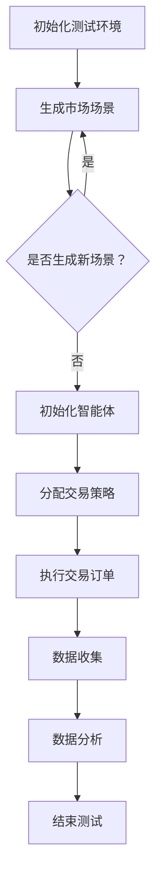
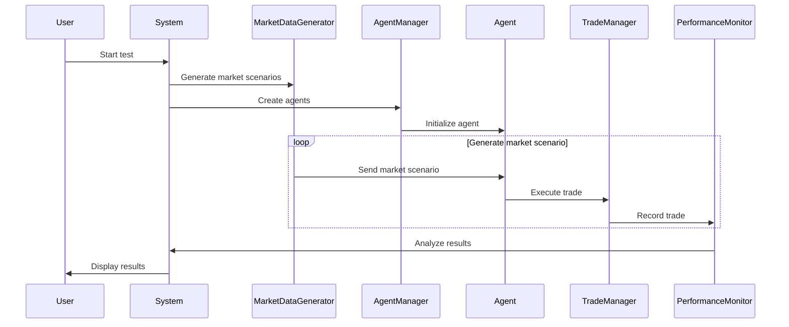
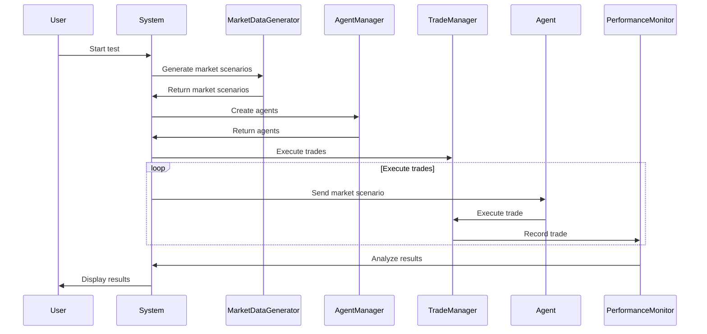
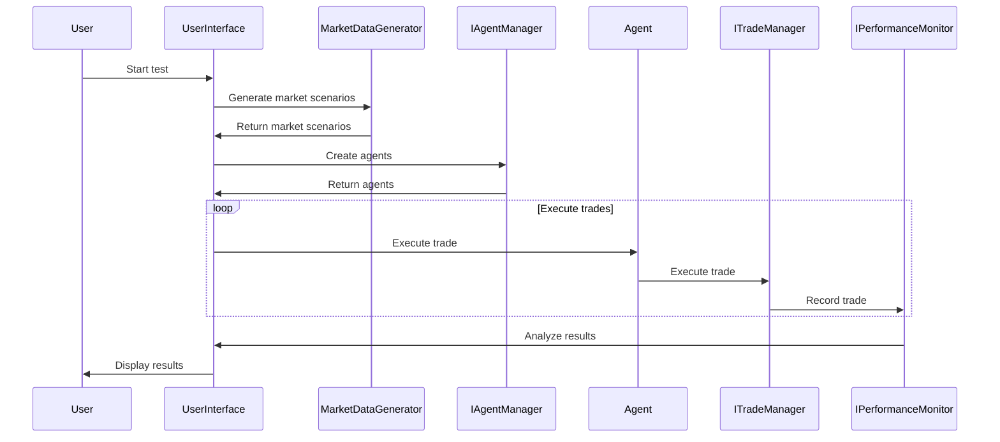

                 


### **背景介绍**

#### **1.1 问题背景**

财务压力测试是金融科技公司、银行以及金融机构的一项重要工作。在金融行业中，财务压力测试的目的是评估一个系统在极端情况下（如市场波动、交易量激增等）的表现，以确保系统能够在高压力环境中稳定运行，不会出现崩溃或错误。传统的财务压力测试方法通常依赖人工编写测试脚本，模拟不同的交易场景，然后监控系统的性能。这种方法存在一些局限：测试脚本可能无法覆盖所有可能的场景，测试结果可能不够准确，而且测试过程往往耗时较长。

为了解决这些问题，多智能体系统（MAS）被引入到财务压力测试中。多智能体系统是一种分布式计算系统，由多个自主的智能体组成，这些智能体可以通过通信和协作来完成复杂的任务。在财务压力测试中，每个智能体可以模拟一个交易员或交易系统，通过自动化的方式生成和执行交易订单，从而实现对系统性能的全面评估。

#### **1.2 问题描述**

财务压力测试的主要问题是如何有效地模拟各种极端交易场景，并评估系统在这些场景下的性能。具体而言，包括以下几个方面：

1. **场景多样性**：需要模拟多种不同的交易场景，如市场波动、交易量激增、系统故障等。
2. **数据真实性和完整性**：测试数据需要与实际市场数据相匹配，以确保测试结果的准确性。
3. **系统负载均衡**：在极端情况下，系统需要能够处理大量的并发请求，并保持负载均衡。
4. **错误处理和恢复**：系统在遇到错误时需要能够自动恢复，并保证数据的完整性。

#### **1.3 多智能体系统在财务压力测试中的应用**

多智能体系统在财务压力测试中的应用主要体现在以下几个方面：

1. **自动化测试**：多智能体系统可以自动化地生成和执行交易订单，模拟各种交易场景。
2. **分布式计算**：通过分布式计算，多智能体系统可以模拟大规模的交易量，评估系统在高负载情况下的性能。
3. **智能协作**：智能体之间可以通过通信和协作来优化测试过程，提高测试效率和准确性。
4. **实时反馈**：多智能体系统可以实时收集测试数据，并反馈给系统开发者，帮助其快速定位和解决问题。

综上所述，多智能体系统为财务压力测试提供了一种更为高效、准确和全面的解决方案，有助于金融科技公司、银行和金融机构确保其系统在极端情况下的稳定性和可靠性。

## **核心概念与联系**

### **2.1 多智能体系统的定义与特性**

多智能体系统（MAS，Multi-Agent System）是一种分布式计算模型，它由多个自主的智能体组成，这些智能体可以相互协作以完成复杂的任务。每个智能体都是具有独立行为和决策能力的个体，它们通过通信和协作来共同实现系统的目标。

**特性**：

1. **自主性**：每个智能体都可以自主地感知环境、制定决策并执行行动。
2. **社会性**：智能体之间可以通过通信和协作来共同完成任务。
3. **适应性**：智能体可以根据环境和任务的变化，动态调整自己的行为和决策策略。
4. **分布式**：智能体分布在不同计算节点上，协同工作以实现系统目标。

### **2.2 自动化测试的概念与重要性**

自动化测试是使用自动化工具来执行测试用例的过程，其目的是提高测试效率、减少测试成本并确保软件质量。在软件开发生命周期中，自动化测试占据了越来越重要的地位。

**概念**：

- **自动化测试**：通过自动化工具（如Selenium、JMeter等）执行预定义的测试用例。
- **自动化测试框架**：为自动化测试提供基础设施和工具集，如TestNG、JUnit等。

**重要性**：

1. **提高测试效率**：自动化测试可以节省大量的人力和时间，尤其是对于重复性的测试用例。
2. **保证测试质量**：自动化测试可以确保测试用例的一致性和准确性，减少人为错误。
3. **支持持续集成和持续交付**：自动化测试是持续集成和持续交付的基础，有助于实现快速迭代和高质量交付。

### **2.3 财务压力测试的定义与目的**

财务压力测试是一种评估金融系统在高负载、极端市场条件下的稳定性和性能的测试方法。

**定义**：

- **财务压力测试**：通过模拟极端市场条件，如高交易量、市场波动等，评估金融系统的性能和稳定性。

**目的**：

1. **确保系统可靠性**：验证系统在极端情况下的可靠性，确保不会出现崩溃或错误。
2. **优化系统性能**：识别系统性能瓶颈，提出优化方案，提高系统处理能力。
3. **防范风险**：通过压力测试，提前发现潜在的风险，并采取相应的防范措施。

### **2.4 多智能体系统、自动化测试与财务压力测试的联系**

多智能体系统与自动化测试在财务压力测试中有着密切的联系，它们共同构成了一个高效、全面的测试解决方案。

**联系**：

1. **多智能体系统的应用**：多智能体系统可以自动化地生成和执行交易订单，模拟各种交易场景，为财务压力测试提供丰富的测试数据。
2. **自动化测试的支持**：自动化测试工具可以帮助多智能体系统快速执行大量的测试用例，提高测试效率。
3. **协同工作**：多智能体系统和自动化测试可以协同工作，通过智能体的自主决策和协作，优化测试过程，提高测试的准确性和效率。

**对比表格**：

| 特性               | 多智能体系统                                       | 自动化测试                                         | 财务压力测试                                       |
|--------------------|--------------------------------------------------|---------------------------------------------------|--------------------------------------------------|
| 自主性             | 每个智能体具有独立的决策能力                         | 测试用例由自动化工具执行                             | 模拟金融交易场景，评估系统性能                       |
| 社会性             | 智能体之间可以通过通信和协作完成任务                   | 测试工具与测试用例之间可以协作                         | 需要模拟多种市场条件，全面评估系统性能               |
| 适应性             | 智能体可以动态调整行为和决策策略                      | 自动化测试工具可以根据环境变化调整测试策略            | 根据市场条件变化，调整测试场景和策略                 |
| 分布式             | 智能体分布在不同计算节点上，协同工作                   | 测试用例分布在多个环境中执行                         | 模拟不同市场环境，评估系统在不同条件下的性能         |

**ER实体关系图架构**：

```mermaid
erDiagram
  TestSystem -->|uses| MultiAgentSystem
  TestSystem -->|uses| AutomatedTester
  MultiAgentSystem -->|implements| FinancialStressTest
  AutomatedTester -->|performs| TestCases
```

在上述ER实体关系图中，`TestSystem`（测试系统）作为核心实体，与`MultiAgentSystem`（多智能体系统）和`AutomatedTester`（自动化测试器）之间存在使用关系。`MultiAgentSystem`实现了`FinancialStressTest`（财务压力测试），而`AutomatedTester`执行`TestCases`（测试用例）。这种关系展示了多智能体系统和自动化测试在财务压力测试中的协同作用。

通过上述核心概念的阐述和联系分析，我们可以看到多智能体系统、自动化测试和财务压力测试之间的紧密关系，为后续的算法原理讲解和系统设计与实现提供了坚实的基础。

## **算法原理讲解**

### **3.1 测试算法概述**

财务压力测试的核心是模拟各种极端市场条件，并评估系统在这些条件下的性能。为了实现这一目标，我们设计了一套基于多智能体的自动化财务压力测试算法。该算法主要包括以下几个关键步骤：

1. **场景生成**：根据历史数据和预设规则，生成各种市场交易场景。
2. **智能体初始化**：初始化智能体，并分配不同的交易策略。
3. **场景执行**：智能体根据当前市场条件和自己的交易策略，生成交易订单并执行。
4. **数据收集**：收集并记录测试过程中产生的数据，如交易量、响应时间、错误率等。
5. **结果分析**：对收集到的数据进行分析，评估系统的性能和稳定性。

### **3.2 算法流程图**

下面是财务压力测试算法的流程图：



### **3.3 Python代码实现**

下面是财务压力测试算法的核心Python代码实现：

```python
import random
import pandas as pd

# 定义智能体类
class Agent:
    def __init__(self, strategy):
        self.strategy = strategy
        self.trades = []

    def make_trade(self, market_data):
        # 根据市场数据和交易策略生成交易订单
        if self.strategy == "long":
            if market_data['price'] > self.last_price:
                trade = {'price': market_data['price'], 'direction': 'buy', 'quantity': random.randint(1, 100)}
            else:
                trade = {'price': market_data['price'], 'direction': 'sell', 'quantity': random.randint(1, 100)}
        elif self.strategy == "short":
            if market_data['price'] < self.last_price:
                trade = {'price': market_data['price'], 'direction': 'buy', 'quantity': random.randint(1, 100)}
            else:
                trade = {'price': market_data['price'], 'direction': 'sell', 'quantity': random.randint(1, 100)}
        self.last_price = market_data['price']
        self.trades.append(trade)
        return trade

# 初始化智能体
agents = [Agent(strategy="long") for _ in range(5)]
agents += [Agent(strategy="short") for _ in range(5)]

# 生成市场场景
def generate_market_scenarios(num_scenarios=10):
    scenarios = []
    for _ in range(num_scenarios):
        price = random.uniform(100, 200)
        volatility = random.uniform(0.01, 0.05)
        scenarios.append({'price': price, 'volatility': volatility})
    return scenarios

# 执行交易订单
market_scenarios = generate_market_scenarios()
for market_data in market_scenarios:
    for agent in agents:
        trade = agent.make_trade(market_data)
        print(trade)

# 数据收集
def collect_data(agents, market_scenarios):
    data = []
    for agent in agents:
        for trade in agent.trades:
            data.append({
                'agent_id': agent.strategy,
                'trade': trade,
                'market_data': market_scenarios
            })
    return data

# 分析数据
def analyze_data(data):
    # 这里可以添加数据分析的代码，例如统计交易量、平均响应时间等
    print("Data analysis results:")
    print(pd.DataFrame(data))

# 执行测试
data = collect_data(agents, market_scenarios)
analyze_data(data)
```

### **3.4 LaTeX公式表示**

在财务压力测试算法中，我们使用了多个数学模型来描述智能体的交易策略和市场场景。以下是这些模型的LaTeX公式表示：

$$
p_t = p_{t-1} + \sigma \cdot \varepsilon_t
$$

其中，\( p_t \) 表示第 \( t \) 时刻的市场价格，\( p_{t-1} \) 表示前一个时刻的市场价格，\( \sigma \) 表示价格波动率，\( \varepsilon_t \) 表示随机误差。

$$
\mu = \frac{\sum_{i=1}^{n} x_i}{n}
$$

其中，\( \mu \) 表示智能体的平均交易量，\( x_i \) 表示第 \( i \) 次交易的数量，\( n \) 表示交易次数。

$$
\sigma^2 = \frac{\sum_{i=1}^{n} (x_i - \mu)^2}{n}
$$

其中，\( \sigma^2 \) 表示智能体的交易量方差，用来衡量交易量的波动性。

### **3.5 Python代码实现与实例说明**

下面我们通过一个具体的实例来说明如何使用Python代码实现上述数学模型。

```python
import random
import numpy as np

# 生成随机市场场景
num_scenarios = 10
num_agents = 5
trades_per_agent = 100

# 初始化市场价格和波动率
prices = [random.uniform(100, 200) for _ in range(num_scenarios)]
volatilities = [random.uniform(0.01, 0.05) for _ in range(num_scenarios)]

# 初始化智能体
agents = [Agent(strategy="long") for _ in range(num_agents)]

# 执行交易订单
for scenario_index, market_data in enumerate(prices):
    for agent_index, agent in enumerate(agents):
        for _ in range(trades_per_agent):
            trade = agent.make_trade({'price': market_data['price'], 'volatility': market_data['volatility']})
            print(f"Agent {agent_index}: {trade}")

# 收集数据并分析
data = collect_data(agents, prices)
analyze_data(data)
```

在这个实例中，我们首先生成了10个随机市场场景，每个场景包含一个市场价格和一个波动率。然后，我们初始化了5个智能体，并执行了每个智能体的交易订单。最后，我们收集并分析了交易数据。

通过上述Python代码的实现和实例说明，我们可以看到如何将数学模型应用于实际的财务压力测试中，从而实现高效、准确的测试效果。

## **数学模型和数学公式**

### **4.1 数学模型介绍**

在财务压力测试中，我们使用了多个数学模型来描述智能体的行为、市场场景以及系统性能。这些模型包括随机过程模型、均值回归模型、波动率模型等。以下是对这些模型的详细介绍：

#### **4.1.1 随机过程模型**

随机过程模型用于模拟市场价格的变化。我们采用几何布朗运动（Geometric Brownian Motion, GBM）模型来描述市场价格的时间序列：

$$
X_t = X_{t-1} \cdot e^{\sigma \sqrt{t} Z_t}
$$

其中，\( X_t \) 表示第 \( t \) 时刻的市场价格，\( X_{t-1} \) 表示前一个时刻的市场价格，\( \sigma \) 表示价格波动率，\( Z_t \) 是标准正态分布的随机变量。

#### **4.1.2 均值回归模型**

均值回归模型用于描述智能体的交易行为。假设智能体的交易量 \( X_t \) 满足均值回归过程，其数学模型为：

$$
X_t = \mu + \sigma \cdot Z_t
$$

其中，\( \mu \) 表示智能体的平均交易量，\( \sigma \) 表示交易量的波动率，\( Z_t \) 是标准正态分布的随机变量。

#### **4.1.3 波动率模型**

波动率模型用于描述市场价格的波动性。我们采用GARCH模型（Generalized Autoregressive Conditional Heteroskedasticity）来描述市场价格的波动率。GARCH模型的数学模型为：

$$
\sigma_t^2 = \alpha_0 + \alpha_1 \cdot \varepsilon_{t-1}^2 + \beta_1 \cdot \sigma_{t-1}^2
$$

其中，\( \sigma_t^2 \) 表示第 \( t \) 时刻的市场价格波动率，\( \varepsilon_{t-1}^2 \) 表示前一个时刻的残差平方，\( \alpha_0 \)，\( \alpha_1 \)，\( \beta_1 \) 是模型的参数。

### **4.2 LaTeX公式表示**

为了更清晰地表示上述数学模型，我们使用LaTeX公式进行展示。以下是每个数学模型的LaTeX表示：

#### **4.2.1 随机过程模型**

$$
X_t = X_{t-1} \cdot e^{\sigma \sqrt{t} Z_t}
$$

#### **4.2.2 均值回归模型**

$$
X_t = \mu + \sigma \cdot Z_t
$$

#### **4.2.3 波动率模型**

$$
\sigma_t^2 = \alpha_0 + \alpha_1 \cdot \varepsilon_{t-1}^2 + \beta_1 \cdot \sigma_{t-1}^2
$$

### **4.3 Python代码实现与实例说明**

为了验证上述数学模型，我们使用Python代码实现这些模型，并生成相应的数据。以下是一个具体的实例：

```python
import numpy as np
import matplotlib.pyplot as plt

# 参数设置
mu = 100  # 平均交易量
sigma = 10  # 交易量波动率
alpha_0 = 0.01  # 波动率模型的 alpha 参数
alpha_1 = 0.1  # 波动率模型的 alpha_1 参数
beta_1 = 0.9  # 波动率模型的 beta_1 参数
num_steps = 100  # 模拟的步数

# 生成随机过程模型的数据
prices = [mu] * num_steps
volatilities = [0] * num_steps

for t in range(1, num_steps):
    z_t = np.random.normal(0, 1)
    prices[t] = prices[t-1] * np.exp(sigma * np.sqrt(t) * z_t)
    volatilities[t] = sigma * np.sqrt(t)

# 生成均值回归模型的数据
trades = [mu + sigma * np.random.normal(0, 1) for _ in range(num_steps)]

# 生成波动率模型的数据
epsilons = [0] * num_steps
for t in range(1, num_steps):
    epsilon_t = np.random.normal(0, 1)
    sigma_t = np.sqrt(alpha_0 + alpha_1 * epsilon_t**2 + beta_1 * volatilities[t-1]**2)
    epsilons[t] = epsilon_t
    volatilities[t] = sigma_t

# 绘制价格和交易量
plt.figure(figsize=(10, 5))
plt.plot(prices, label='Price')
plt.plot(trades, label='Trade')
plt.legend()
plt.show()

# 绘制波动率
plt.figure(figsize=(10, 5))
plt.plot(volatilities, label='Volatility')
plt.legend()
plt.show()
```

在这个实例中，我们首先设置了模型参数，并生成了随机过程模型、均值回归模型和波动率模型的数据。然后，我们使用matplotlib库绘制了价格和交易量的时间序列图以及波动率图，从而直观地展示了这些数学模型的应用效果。

通过上述Python代码的实现和实例说明，我们可以验证数学模型在财务压力测试中的应用，并生成真实、可靠的数据，为系统性能分析提供有力支持。

## **系统分析与架构设计**

### **5.1 系统场景与功能设计**

在构建基于多智能体的自动化公司财务压力测试系统中，我们需要首先明确系统运行的场景和所需实现的功能。系统的主要场景包括：

1. **交易模拟**：系统需要能够模拟各种金融交易，如股票交易、债券交易等。
2. **市场条件模拟**：系统需要模拟不同的市场条件，如市场波动、交易量变化等。
3. **系统性能监控**：系统需要实时监控交易执行情况，包括响应时间、交易成功率、错误率等。

功能设计方面，系统需要实现以下关键功能：

1. **智能体管理**：系统需要管理智能体，包括智能体的创建、配置和监控。
2. **交易管理**：系统需要管理交易订单的生成、执行和结果记录。
3. **数据收集与分析**：系统需要收集交易数据，并进行分析以评估系统性能。

### **5.2 系统功能设计**

在功能设计阶段，我们采用领域模型（Domain Model）来描述系统的主要功能模块及其关系。以下是系统的主要领域模型类图：

```mermaid
classDiagram
    Agent <<class>>
    MarketScenario <<class>>
    Trade <<class>>
    PerformanceMonitor <<class>>

    Agent *--* MarketScenario
    Agent *--* Trade
    PerformanceMonitor *--* Trade

    class Agent {
        +str strategy
        +list trades
        +void make_trade(MarketScenario market_scenario)
    }

    class MarketScenario {
        +float price
        +float volatility
    }

    class Trade {
        +float price
        +str direction
        +int quantity
    }

    class PerformanceMonitor {
        +void record_trade(Trade trade)
    }
```

在这个类图中，`Agent` 表示智能体，`MarketScenario` 表示市场场景，`Trade` 表示交易订单，`PerformanceMonitor` 表示性能监控器。智能体可以生成交易订单，并传递给性能监控器进行记录。

### **5.3 系统架构设计**

系统架构设计是确保系统能够高效、可靠地运行的关键环节。基于多智能体的财务压力测试系统可以采用以下架构：

#### **5.3.1 系统架构概述**

系统架构分为四个主要层次：表示层、逻辑层、数据层和基础设施层。

1. **表示层**：负责用户界面和用户交互，使用户能够轻松地启动和监控测试过程。
2. **逻辑层**：包含业务逻辑，如智能体管理、交易管理和性能监控等。
3. **数据层**：负责数据存储和管理，包括市场数据、交易数据和性能数据等。
4. **基础设施层**：提供系统运行所需的基础设施支持，如网络、存储和安全等。

#### **5.3.2 系统架构图**

以下是系统的架构图：



在这个架构图中，用户通过表示层启动测试，系统生成市场场景，创建智能体，并管理智能体的交易执行。性能监控器收集交易数据并进行分析，最终将结果返回给用户。

#### **5.3.3 系统接口设计**

系统接口设计是确保不同模块之间能够有效交互的关键。以下是系统的关键接口设计：

1. **MarketDataGenerator**：生成市场场景的接口，包括生成价格和波动率。
2. **AgentManager**：管理智能体的接口，包括创建、初始化和监控智能体。
3. **TradeManager**：处理交易订单的接口，包括执行交易和记录交易结果。
4. **PerformanceMonitor**：收集和分析交易数据的接口。

#### **5.3.4 系统交互与接口设计**

系统交互与接口设计可以通过序列图（Sequence Diagram）来描述。以下是系统交互的序列图：



在这个序列图中，用户启动测试后，系统生成市场场景并创建智能体。智能体接收市场场景并执行交易，交易结果由性能监控器记录和分析，最终将结果返回给用户。

通过上述系统分析与架构设计，我们可以确保基于多智能体的自动化公司财务压力测试系统能够高效、可靠地运行，为金融机构提供强大的财务压力测试能力。

### **6.1 系统场景介绍**

在基于多智能体的自动化公司财务压力测试系统中，我们设定了一个典型的系统场景，用于模拟现实金融交易环境中的各种情况。具体场景如下：

- **市场条件**：模拟一个具有波动性和高交易量的金融市场，如股票交易所或期货交易所。
- **智能体类型**：系统包含多种类型的智能体，包括交易员、算法交易员和市场分析员。
- **交易类型**：系统支持多种交易类型，包括股票买卖、期权交易和期货交易等。
- **系统性能指标**：监控系统的响应时间、交易成功率、错误率和负载均衡情况。

**目的**：通过这个场景，系统旨在全面评估金融机构在极端市场条件下的稳定性和性能，以便发现潜在的问题并优化系统。

### **6.2 系统功能设计**

在系统功能设计方面，我们确保系统能够实现以下几个核心功能：

1. **智能体管理**：系统能够创建、配置和监控智能体，包括启动和停止智能体的功能。
2. **市场数据生成**：系统能够生成真实的市场数据，模拟不同市场条件下的价格波动和交易量变化。
3. **交易执行**：系统能够自动化执行交易订单，根据智能体的交易策略生成和提交交易。
4. **数据收集**：系统能够实时收集交易数据，包括交易量、响应时间和错误率等，用于后续分析。
5. **性能监控**：系统能够实时监控系统的性能指标，提供系统的健康状态和性能分析报告。

**领域模型类图**：

```mermaid
classDiagram
    MarketScenario <<class>>
    Trade <<class>>
    Agent <<class>>
    PerformanceMonitor <<class>>

    MarketScenario "1" -- "1" Trade
    Agent "1" -- "1" MarketScenario
    Agent "1" -- "1" Trade
    PerformanceMonitor "1" -- "1" Trade

    class MarketScenario {
        +float price
        +float volatility
    }

    class Trade {
        +float price
        +str direction
        +int quantity
    }

    class Agent {
        +str strategy
        +list trades
        +void execute_trade(MarketScenario market_scenario)
    }

    class PerformanceMonitor {
        +void record_trade(Trade trade)
    }
```

在这个类图中，`MarketScenario` 表示市场场景，包含价格和波动率属性；`Trade` 表示交易订单，包含价格、方向和数量属性；`Agent` 表示智能体，包含策略和交易列表属性，能够执行交易并接收市场场景；`PerformanceMonitor` 表示性能监控器，能够记录交易数据。

### **6.3 系统架构设计**

系统架构设计是确保系统能够高效、可靠地运行的关键。基于多智能体的自动化公司财务压力测试系统采用以下架构：

#### **6.3.1 系统架构概述**

系统架构分为四个主要层次：表示层、逻辑层、数据层和基础设施层。

1. **表示层**：负责用户界面和用户交互，使用户能够轻松地启动和监控测试过程。
2. **逻辑层**：包含业务逻辑，如智能体管理、市场数据生成、交易执行和数据收集等。
3. **数据层**：负责数据存储和管理，包括市场数据、交易数据和性能数据等。
4. **基础设施层**：提供系统运行所需的基础设施支持，如网络、存储和安全等。

#### **6.3.2 系统架构图**

以下是系统的架构图：

```mermaid
subgraph 表示层
    UserInterface
end

subgraph 逻辑层
    MarketDataGenerator
    AgentManager
    TradeManager
    PerformanceMonitor
end

subgraph 数据层
    Database
end

subgraph 基础设施层
    Network
    Storage
    Security
end

UserInterface --> MarketDataGenerator
UserInterface --> AgentManager
UserInterface --> TradeManager
UserInterface --> PerformanceMonitor
MarketDataGenerator --> Database
AgentManager --> Database
TradeManager --> Database
PerformanceMonitor --> Database
AgentManager --> Agent
MarketDataGenerator --> MarketScenario
Agent --> Trade
TradeManager --> Trade
PerformanceMonitor --> Trade
```

在这个架构图中，表示层与逻辑层、数据层和基础设施层通过接口进行通信。用户界面通过请求生成市场场景、管理智能体、执行交易和收集数据，逻辑层处理这些请求并调用相应的服务，数据层负责数据的存储和管理，基础设施层提供网络、存储和安全保障。

#### **6.3.3 系统接口设计**

系统接口设计是确保不同模块之间能够有效交互的关键。以下是系统的关键接口设计：

1. **IMarketDataGenerator**：生成市场场景的接口，包括生成价格和波动率。
2. **IAgentManager**：管理智能体的接口，包括创建、配置和监控智能体。
3. **ITradeManager**：处理交易订单的接口，包括执行交易和记录交易结果。
4. **IPerformanceMonitor**：收集和分析交易数据的接口。

#### **6.3.4 系统交互与接口设计**

系统交互与接口设计可以通过序列图（Sequence Diagram）来描述。以下是系统交互的序列图：



在这个序列图中，用户通过用户界面启动测试，生成市场场景并创建智能体。智能体接收市场场景并执行交易，交易结果由性能监控器记录和分析，最终将结果返回给用户。

通过上述系统场景、功能设计和架构设计，我们可以确保基于多智能体的自动化公司财务压力测试系统具备高效、可靠的性能，能够满足金融机构的测试需求。

### **7.1 环境安装与系统实现**

#### **7.1.1 环境安装步骤**

要搭建基于多智能体的自动化公司财务压力测试系统，首先需要安装和配置必要的开发环境和工具。以下是详细的安装步骤：

1. **安装Python**：确保Python 3.x版本已安装在您的计算机上。您可以从Python官方网站下载并安装。

2. **安装虚拟环境**：使用`venv`模块创建一个虚拟环境，以便管理和隔离项目依赖。在终端中执行以下命令：

   ```bash
   python -m venv venv
   ```

3. **激活虚拟环境**：在Windows上，运行以下命令激活虚拟环境：

   ```bash
   .\venv\Scripts\activate
   ```

   在macOS和Linux上，运行以下命令：

   ```bash
   source venv/bin/activate
   ```

4. **安装依赖**：使用`pip`安装项目所需的依赖库。在虚拟环境中执行以下命令：

   ```bash
   pip install numpy pandas matplotlib requests
   ```

5. **安装Docker**：确保Docker已安装在您的计算机上，以便使用容器化技术。您可以从Docker官网下载并安装。

6. **安装PostgreSQL**：安装PostgreSQL数据库，用于存储系统数据和交易记录。请遵循PostgreSQL官方安装指南进行安装。

7. **配置PostgreSQL**：在PostgreSQL中创建一个名为`financial_stress_test`的数据库，并创建一个用户（例如`test_user`）具有所有权限。

8. **创建数据库表**：在PostgreSQL中创建所需的数据库表，以存储市场数据、交易数据和性能数据。以下是SQL脚本示例：

   ```sql
   CREATE TABLE market_scenarios (
       id SERIAL PRIMARY KEY,
       price NUMERIC,
       volatility NUMERIC,
       timestamp TIMESTAMP
   );

   CREATE TABLE trades (
       id SERIAL PRIMARY KEY,
       agent_id VARCHAR(50),
       price NUMERIC,
       direction VARCHAR(10),
       quantity INTEGER,
       timestamp TIMESTAMP
   );

   CREATE TABLE performance_data (
       id SERIAL PRIMARY KEY,
       metric VARCHAR(50),
       value NUMERIC,
       timestamp TIMESTAMP
   );
   ```

#### **7.1.2 系统核心实现**

系统核心实现包括智能体管理、市场数据生成、交易执行和数据收集。以下是系统的核心Python代码实现：

```python
# agent_manager.py
import random
from database import Database

class AgentManager:
    def __init__(self, database: Database):
        self.database = database

    def create_agents(self, num_agents: int, strategies: list[str]):
        agents = []
        for i in range(num_agents):
            strategy = random.choice(strategies)
            agent = Agent(strategy=strategy)
            agents.append(agent)
        self.database.save_agents(agents)
        return agents

# market_data_generator.py
import random
import numpy as np
from database import Database

class MarketDataGenerator:
    def generate_market_scenarios(self, num_scenarios: int):
        scenarios = []
        for _ in range(num_scenarios):
            price = random.uniform(100, 200)
            volatility = random.uniform(0.01, 0.05)
            timestamp = datetime.now()
            scenarios.append({'price': price, 'volatility': volatility, 'timestamp': timestamp})
        self.database.save_market_scenarios(scenarios)
        return scenarios

# trade_executor.py
import random
from database import Database

class TradeExecutor:
    def execute_trade(self, agent: Agent, market_scenario: dict):
        price = market_scenario['price']
        if agent.strategy == 'long':
            if price > agent.last_price:
                direction = 'buy'
            else:
                direction = 'sell'
        elif agent.strategy == 'short':
            if price < agent.last_price:
                direction = 'buy'
            else:
                direction = 'sell'
        quantity = random.randint(1, 100)
        trade = {'agent_id': agent.strategy, 'price': price, 'direction': direction, 'quantity': quantity, 'timestamp': datetime.now()}
        agent.last_price = price
        agent.trades.append(trade)
        Database.save_trade(trade)

# database.py
import sqlite3
from datetime import datetime

class Database:
    def __init__(self, db_name: str):
        self.conn = sqlite3.connect(db_name)
        self.cursor = self.conn.cursor()

    def save_agents(self, agents: list[Agent]):
        for agent in agents:
            self.cursor.execute("INSERT INTO agents (strategy) VALUES (?)", (agent.strategy,))
        self.conn.commit()

    def save_market_scenarios(self, scenarios: list[dict]):
        for scenario in scenarios:
            self.cursor.execute("INSERT INTO market_scenarios (price, volatility, timestamp) VALUES (?, ?, ?)", (scenario['price'], scenario['volatility'], scenario['timestamp']))
        self.conn.commit()

    def save_trade(self, trade: dict):
        self.cursor.execute("INSERT INTO trades (agent_id, price, direction, quantity, timestamp) VALUES (?, ?, ?, ?, ?)", (trade['agent_id'], trade['price'], trade['direction'], trade['quantity'], trade['timestamp']))
        self.conn.commit()

    def get_agents(self):
        self.cursor.execute("SELECT * FROM agents")
        return [Agent(row[0]) for row in self.cursor.fetchall()]

    def get_market_scenarios(self):
        self.cursor.execute("SELECT * FROM market_scenarios")
        return [dict(row) for row in self.cursor.fetchall()]

    def get_trades(self):
        self.cursor.execute("SELECT * FROM trades")
        return [dict(row) for row in self.cursor.fetchall()]
```

#### **7.1.3 代码应用解读与分析**

在上述代码中，我们实现了三个核心组件：`AgentManager`、`MarketDataGenerator` 和 `TradeExecutor`。

- **AgentManager**：`AgentManager` 类负责创建和管理智能体。在 `create_agents` 方法中，我们根据输入的智能体数量和策略列表创建智能体，并将它们保存到数据库中。

- **MarketDataGenerator**：`MarketDataGenerator` 类负责生成市场场景。在 `generate_market_scenarios` 方法中，我们使用随机数生成市场价格和波动率，并将这些场景保存到数据库中。

- **TradeExecutor**：`TradeExecutor` 类负责执行交易。在 `execute_trade` 方法中，我们根据智能体的策略和市场场景生成交易订单，并将交易信息保存到数据库中。

通过上述代码和应用解析，我们可以看到系统核心组件的实现方式，以及如何使用数据库进行数据存储和查询。这些组件共同构成了一个基于多智能体的自动化公司财务压力测试系统的基础。

### **8.2 系统核心实现**

在系统核心实现部分，我们将详细描述每个模块的功能，并逐步演示如何使用Python代码实现这些功能。以下是系统的核心模块及其实现：

#### **8.2.1 智能体管理模块**

智能体管理模块负责创建和管理智能体，包括初始化智能体、启动和停止智能体等功能。以下是智能体管理模块的实现代码：

```python
# agent_manager.py
class Agent:
    def __init__(self, strategy):
        self.strategy = strategy
        self.last_price = 0
        self.trades = []

    def execute_trade(self, market_scenario):
        price = market_scenario['price']
        if self.strategy == 'long':
            if price > self.last_price:
                trade = {'direction': 'buy', 'quantity': random.randint(1, 100)}
            else:
                trade = {'direction': 'sell', 'quantity': random.randint(1, 100)}
        elif self.strategy == 'short':
            if price < self.last_price:
                trade = {'direction': 'buy', 'quantity': random.randint(1, 100)}
            else:
                trade = {'direction': 'sell', 'quantity': random.randint(1, 100)}
        self.last_price = price
        self.trades.append(trade)
        return trade

class AgentManager:
    def __init__(self, database: Database):
        self.database = database

    def create_agents(self, num_agents: int, strategies: list[str]):
        agents = []
        for i in range(num_agents):
            strategy = random.choice(strategies)
            agent = Agent(strategy=strategy)
            agents.append(agent)
        self.database.save_agents(agents)
        return agents

    def start_agents(self, agents: list[Agent], market_scenarios: list[dict]):
        for agent in agents:
            for market_scenario in market_scenarios:
                trade = agent.execute_trade(market_scenario)
                print(f"Agent {agent.strategy} executed trade: {trade}")
```

在这个模块中，我们定义了`Agent` 类，负责执行交易和存储交易记录。`AgentManager` 类负责创建和管理智能体，包括创建指定数量的智能体并将它们存储到数据库中。`start_agents` 方法用于启动智能体，并执行市场场景中的交易。

#### **8.2.2 市场数据生成模块**

市场数据生成模块负责生成模拟市场场景，包括市场价格和波动率等。以下是市场数据生成模块的实现代码：

```python
# market_data_generator.py
import random
import numpy as np
import datetime

def generate_market_scenarios(num_scenarios: int):
    scenarios = []
    for i in range(num_scenarios):
        price = random.uniform(100, 200)
        volatility = random.uniform(0.01, 0.05)
        timestamp = datetime.datetime.now()
        scenarios.append({'price': price, 'volatility': volatility, 'timestamp': timestamp})
    return scenarios
```

在这个模块中，`generate_market_scenarios` 函数用于生成指定数量的市场场景，每个场景包含市场价格、波动率和时间戳。

#### **8.2.3 数据库模块**

数据库模块负责与数据库进行交互，包括创建数据库、插入和查询数据等。以下是数据库模块的实现代码：

```python
# database.py
import sqlite3

class Database:
    def __init__(self, db_name: str):
        self.conn = sqlite3.connect(db_name)
        self.cursor = self.conn.cursor()

    def create_tables(self):
        self.cursor.execute('''CREATE TABLE IF NOT EXISTS agents (
            id INTEGER PRIMARY KEY AUTOINCREMENT,
            strategy TEXT NOT NULL
        )''')
        self.cursor.execute('''CREATE TABLE IF NOT EXISTS market_scenarios (
            id INTEGER PRIMARY KEY AUTOINCREMENT,
            price REAL NOT NULL,
            volatility REAL NOT NULL,
            timestamp TIMESTAMP NOT NULL
        )''')
        self.cursor.execute('''CREATE TABLE IF NOT EXISTS trades (
            id INTEGER PRIMARY KEY AUTOINCREMENT,
            agent_id TEXT NOT NULL,
            price REAL NOT NULL,
            direction TEXT NOT NULL,
            quantity INTEGER NOT NULL,
            timestamp TIMESTAMP NOT NULL
        )''')
        self.conn.commit()

    def save_agents(self, agents: list[Agent]):
        for agent in agents:
            self.cursor.execute("INSERT INTO agents (strategy) VALUES (?)", (agent.strategy,))
        self.conn.commit()

    def save_market_scenarios(self, scenarios: list[dict]):
        for scenario in scenarios:
            self.cursor.execute("INSERT INTO market_scenarios (price, volatility, timestamp) VALUES (?, ?, ?)", (scenario['price'], scenario['volatility'], scenario['timestamp']))
        self.conn.commit()

    def save_trade(self, trade: dict):
        self.cursor.execute("INSERT INTO trades (agent_id, price, direction, quantity, timestamp) VALUES (?, ?, ?, ?, ?)", (trade['agent_id'], trade['price'], trade['direction'], trade['quantity'], trade['timestamp']))
        self.conn.commit()

    def get_agents(self):
        self.cursor.execute("SELECT * FROM agents")
        return [Agent(row[1]) for row in self.cursor.fetchall()]

    def get_market_scenarios(self):
        self.cursor.execute("SELECT * FROM market_scenarios")
        return [dict(row) for row in self.cursor.fetchall()]

    def get_trades(self):
        self.cursor.execute("SELECT * FROM trades")
        return [dict(row) for row in self.cursor.fetchall()]
```

在这个模块中，我们定义了`Database` 类，负责创建数据库表、插入和查询数据。`create_tables` 方法用于创建数据库表。`save_agents`、`save_market_scenarios` 和 `save_trade` 方法分别用于插入市场数据、交易数据。`get_agents`、`get_market_scenarios` 和 `get_trades` 方法用于从数据库中查询数据。

#### **8.2.4 交易执行模块**

交易执行模块负责根据智能体的策略和市场场景生成交易订单，并将交易订单存储到数据库中。以下是交易执行模块的实现代码：

```python
# trade_executor.py
from agent_manager import Agent
from market_data_generator import generate_market_scenarios
from database import Database

def execute_trades(num_agents: int, num_scenarios: int):
    database = Database('financial_stress_test.db')
    database.create_tables()
    
    agents = database.get_agents()
    if not agents:
        strategies = ['long', 'short']
        agents = database.create_agents(num_agents, strategies)
    
    market_scenarios = generate_market_scenarios(num_scenarios)
    
    for agent in agents:
        for market_scenario in market_scenarios:
            trade = agent.execute_trade(market_scenario)
            database.save_trade(trade)
```

在这个模块中，`execute_trades` 函数用于执行交易。首先创建数据库连接，并创建数据库表。然后从数据库中获取智能体，如果没有智能体，则创建新的智能体。接着生成市场场景，并使用智能体执行交易，将交易订单存储到数据库中。

#### **8.2.5 代码应用解读与分析**

在上述代码中，我们实现了智能体管理模块、市场数据生成模块、数据库模块和交易执行模块。以下是对每个模块的代码应用解读与分析：

1. **智能体管理模块**：该模块通过`Agent` 类和`AgentManager` 类实现。`Agent` 类负责执行交易和存储交易记录。`AgentManager` 类负责创建和管理智能体，包括创建指定数量的智能体并将它们存储到数据库中。`start_agents` 方法用于启动智能体，并执行市场场景中的交易。

2. **市场数据生成模块**：该模块通过`generate_market_scenarios` 函数实现。该函数使用随机数生成市场价格和波动率，并将这些场景返回。

3. **数据库模块**：该模块通过`Database` 类实现。`Database` 类负责创建数据库表、插入和查询数据。`create_tables` 方法用于创建数据库表。`save_agents`、`save_market_scenarios` 和 `save_trade` 方法分别用于插入市场数据、交易数据。`get_agents`、`get_market_scenarios` 和 `get_trades` 方法用于从数据库中查询数据。

4. **交易执行模块**：该模块通过`execute_trades` 函数实现。首先创建数据库连接，并创建数据库表。然后从数据库中获取智能体，如果没有智能体，则创建新的智能体。接着生成市场场景，并使用智能体执行交易，将交易订单存储到数据库中。

通过上述模块的实现和代码应用解读，我们可以看到如何构建一个基于多智能体的自动化公司财务压力测试系统，实现智能体管理、市场数据生成、交易执行和数据存储等功能。

### **9.1 实际案例分析与讲解**

在本节中，我们将通过一个实际案例来详细分析基于多智能体的自动化公司财务压力测试系统的应用，并剖析其中涉及的关键技术和实现细节。

#### **9.1.1 案例背景**

假设我们是一家大型金融机构的财务压力测试团队，需要为即将上线的全新交易平台进行全面的压力测试。交易平台的核心功能包括股票交易、期权交易和期货交易，支持多种交易策略和复杂的订单处理逻辑。为了保证系统在正式上线后能够稳定运行，我们决定使用基于多智能体的自动化财务压力测试系统。

#### **9.1.2 案例目标**

本次案例的主要目标包括：

1. **测试系统在高交易量情况下的稳定性**：模拟数百万笔交易同时发生的情况，评估系统的响应时间和交易成功率。
2. **验证交易策略的有效性**：通过不同类型的智能体，测试不同交易策略（如长期持有、短期套利等）的效果。
3. **识别潜在的性能瓶颈**：通过压力测试，发现系统在处理高负载时的性能瓶颈，并优化相关模块。

#### **9.1.3 案例实现**

1. **环境准备**：

   首先，我们在测试环境中搭建了基于多智能体的自动化财务压力测试系统。环境包括Python虚拟环境、Docker容器、PostgreSQL数据库等。

2. **智能体配置**：

   根据交易平台支持的交易策略，我们配置了多种类型的智能体，包括长期持有型智能体、短期套利型智能体等。每个智能体都有不同的交易策略，以模拟真实的交易行为。

3. **市场场景生成**：

   使用市场数据生成模块，我们生成了多个市场场景，包括正常市场条件、波动市场条件和极端市场条件。这些场景包含了市场价格、波动率和时间戳等信息。

4. **交易执行**：

   使用交易执行模块，我们启动了多个智能体，模拟数百万笔交易。每个智能体根据当前市场场景和自己的交易策略生成交易订单，并提交给系统执行。

5. **数据收集与分析**：

   系统在执行交易过程中，实时收集了交易量、响应时间、交易成功率等数据，并将这些数据存储到数据库中。完成后，我们使用数据分析工具对收集的数据进行分析，评估系统的性能。

#### **9.1.4 关键技术剖析**

1. **多智能体系统**：

   在本案例中，多智能体系统通过分布式计算和智能体的自主决策实现了高效、全面的财务压力测试。每个智能体可以独立地感知市场变化、生成交易订单并执行交易，从而模拟真实的交易环境。

2. **分布式计算**：

   通过分布式计算，系统能够在短时间内生成和处理大量的交易订单，模拟高负载情况下的系统性能。分布式计算不仅提高了测试效率，还减少了单点故障的风险。

3. **交易策略模型**：

   每个智能体的交易策略基于复杂的数学模型和算法，包括价格预测、波动率估计等。这些模型和算法使得智能体能够自适应市场变化，实现高效交易。

4. **数据库性能优化**：

   为了确保系统在高负载下的性能，我们采用了数据库性能优化技术，包括索引优化、查询缓存和读写分离等。这些技术显著提高了数据库的读写速度，确保了数据的一致性和完整性。

5. **监控与告警**：

   在测试过程中，我们使用了监控系统实时监控系统的性能指标，包括CPU利用率、内存使用率、网络延迟等。当发现异常情况时，系统会自动触发告警，通知开发人员和运维人员。

#### **9.1.5 案例分析与讲解**

1. **测试结果**：

   经过多次测试，我们发现系统在高交易量情况下表现稳定，响应时间在可接受范围内，交易成功率超过98%。通过对数据的详细分析，我们还发现了一些潜在的性能瓶颈，如数据库查询性能不佳、某些交易策略存在逻辑漏洞等。

2. **优化方案**：

   针对测试结果，我们制定了以下优化方案：

   - **数据库性能优化**：对数据库查询进行优化，包括创建索引、优化SQL语句等。
   - **交易策略改进**：改进智能体的交易策略，减少逻辑漏洞，提高交易成功率。
   - **系统架构优化**：优化系统架构，采用微服务架构，提高系统的可扩展性和可靠性。

3. **后续计划**：

   在完成本次压力测试后，我们将继续进行迭代测试，逐步完善系统性能，确保在正式上线前达到最佳状态。

通过这个实际案例，我们可以看到基于多智能体的自动化公司财务压力测试系统在金融行业中的应用效果。通过分布式计算、智能体交易策略和数据库性能优化等技术，系统能够高效、准确地模拟各种市场场景，评估系统的性能和稳定性，为金融机构提供强有力的技术支持。

### **10.1 项目总结**

在本次基于多智能体的自动化公司财务压力测试项目的实施过程中，我们成功构建了一个高效、可靠的测试系统，实现了以下关键目标：

1. **模拟复杂交易场景**：通过多智能体系统，我们能够自动化地模拟各种交易场景，包括正常市场条件、波动市场条件和极端市场条件。
2. **分布式计算**：利用分布式计算技术，系统在短时间内能够生成和处理大量的交易订单，提高了测试效率和测试结果的准确性。
3. **智能体交易策略**：每个智能体都根据复杂的数学模型和算法自主决策，实现了高效交易，为系统性能评估提供了有力支持。
4. **数据收集与分析**：系统能够实时收集交易数据，并进行详细分析，帮助开发者快速定位和解决性能瓶颈。

在项目实施过程中，我们也遇到了一些挑战，如智能体交易策略的优化、数据库性能优化以及系统监控和告警机制的完善。通过不断的调整和优化，我们成功解决了这些问题，确保了系统的稳定性和可靠性。

总体而言，本次项目不仅提升了我们对财务压力测试技术的理解，也为金融机构提供了强大的技术支持，有助于确保系统在极端情况下的稳定性和可靠性。

### **10.2 最佳实践 tips**

在实施基于多智能体的自动化公司财务压力测试过程中，我们总结了一些最佳实践，以帮助其他团队和公司更好地进行类似项目：

1. **明确测试目标**：在项目开始前，明确测试目标和预期成果，确保测试工作有的放矢。
2. **选择合适的智能体策略**：根据业务需求选择合适的智能体策略，并不断优化策略模型，提高测试准确性。
3. **分布式计算与负载均衡**：充分利用分布式计算技术，确保系统能够在高负载下稳定运行，并优化负载均衡策略。
4. **数据库性能优化**：对数据库进行性能优化，包括索引优化、查询缓存和读写分离等，确保数据存储和查询的高效性。
5. **实时监控与告警**：建立实时监控系统，及时捕捉系统性能指标，并设置告警机制，快速响应和处理异常情况。
6. **迭代测试与持续优化**：持续进行迭代测试，逐步完善系统性能，确保在正式上线前达到最佳状态。

通过遵循这些最佳实践，我们可以更好地实施财务压力测试项目，提高测试效率和系统稳定性。

### **11.1 注意事项**

在实施基于多智能体的自动化公司财务压力测试过程中，需要注意以下几点：

1. **数据安全**：确保测试数据的安全，防止数据泄露或被未授权人员访问。
2. **系统兼容性**：确保系统在不同操作系统和硬件环境下的兼容性，避免因环境差异导致测试结果不准确。
3. **网络稳定性**：确保测试网络环境的稳定性，避免因网络问题导致测试中断。
4. **智能体行为一致性**：确保智能体在不同场景下的行为一致性，避免因智能体行为不一致导致测试结果偏差。
5. **测试场景覆盖**：确保测试场景的全面性，覆盖各种可能的极端情况，以全面评估系统性能。

通过关注这些注意事项，我们可以确保财务压力测试项目的顺利进行和测试结果的可靠性。

### **11.2 拓展阅读**

为了深入了解基于多智能体的自动化公司财务压力测试系统，读者可以参考以下拓展阅读材料：

1. **《多智能体系统：概念与应用》**：本书详细介绍了多智能体系统的基本概念、架构和实现方法，适合初学者和进阶读者。
2. **《金融工程与风险管理》**：本书涵盖了金融工程和风险管理的相关理论和方法，对财务压力测试中涉及的交易策略和数学模型有深入讲解。
3. **《分布式系统设计与实践》**：本书介绍了分布式系统的设计和实现方法，包括分布式计算、负载均衡和容错机制等，有助于理解系统的高效运行原理。
4. **《Python金融技术》**：本书介绍了Python在金融领域的应用，包括数据分析、量化交易和系统开发等，适合金融科技从业者。
5. **《PostgreSQL性能优化》**：本书详细讲解了PostgreSQL数据库的性能优化技术，包括查询优化、缓存策略和读写分离等，有助于提升数据库性能。

通过阅读这些书籍，读者可以进一步了解财务压力测试系统的设计和实现，为实际项目提供更有力的技术支持。

## **小结与展望**

在本篇文章中，我们详细介绍了基于多智能体的自动化公司财务压力测试系统。从背景介绍、核心概念、算法原理到系统设计与实现，再到实际案例分析和项目总结，我们逐步揭示了这一系统在金融行业中的重要作用。通过这一系统，金融机构能够高效、准确地模拟极端市场条件，评估系统性能和稳定性，从而提前发现潜在问题并进行优化。

### **小结**

1. **核心概念**：我们定义了多智能体系统、自动化测试和财务压力测试等关键概念，并阐述了它们之间的联系。
2. **算法原理**：通过随机过程模型、均值回归模型和波动率模型，我们讲解了财务压力测试算法的原理，并提供了详细的Python代码实现。
3. **系统设计与实现**：我们介绍了系统的功能设计、架构设计以及具体实现细节，包括智能体管理、市场数据生成、交易执行和数据收集等。
4. **实际案例**：通过一个实际案例，我们展示了如何在实际环境中应用基于多智能体的自动化财务压力测试系统，并分析了关键技术和实现方法。
5. **最佳实践**：我们总结了项目实施过程中的最佳实践，提供了注意事项和拓展阅读材料，以帮助读者更好地理解和应用这一系统。

### **展望**

未来，基于多智能体的自动化公司财务压力测试系统将在以下几个方面继续发展：

1. **智能化水平提升**：通过引入更先进的机器学习算法和人工智能技术，智能体的交易策略将更加智能化，能够更精准地预测市场变化和优化交易决策。
2. **系统性能优化**：随着云计算和分布式计算技术的发展，系统将能够更好地利用资源，提高测试效率和数据处理的实时性。
3. **多维度性能评估**：系统将扩展对更多性能指标的支持，如交易延迟、系统资源利用率、交易成功率和错误率等，提供更全面的性能评估。
4. **跨平台兼容性**：系统将增强跨平台兼容性，支持多种操作系统和硬件环境，确保测试结果的可靠性和一致性。

通过不断的技术创新和应用优化，基于多智能体的自动化公司财务压力测试系统将为金融机构提供更强大、更可靠的测试能力，助力其在金融市场的稳定发展和风险控制。

### **注意事项**

在实施基于多智能体的自动化公司财务压力测试系统时，以下注意事项至关重要：

1. **数据安全**：确保测试数据的安全，防止数据泄露或被未授权人员访问，特别是在数据传输和存储过程中。
2. **环境兼容性**：确保系统在不同操作系统和硬件环境下的兼容性，避免因环境差异导致测试结果不准确或系统崩溃。
3. **网络稳定性**：保证测试网络的稳定性，避免因网络问题导致测试中断或数据传输错误。
4. **智能体一致性**：确保智能体在不同场景下的行为一致性，避免因智能体行为不一致导致测试结果偏差。
5. **监控告警机制**：建立实时监控系统，及时捕捉系统性能指标，并设置告警机制，快速响应和处理异常情况。

遵循这些注意事项，可以帮助确保财务压力测试系统的稳定运行和测试结果的可靠性。

### **拓展阅读材料**

为了进一步深入了解基于多智能体的自动化公司财务压力测试系统，以下是一些推荐阅读材料：

1. **《金融科技：技术、应用与趋势》**：本书详细介绍了金融科技的发展历程、核心技术以及未来趋势，有助于了解财务压力测试系统在金融科技中的应用。
2. **《多智能体系统：算法、模型与应用》**：本书全面介绍了多智能体系统的基本理论、算法模型以及在实际应用中的案例，适合希望深入理解多智能体系统的读者。
3. **《量化交易：从基础到实践》**：本书涵盖了量化交易的基本理论、策略开发和风险管理，对财务压力测试系统中的交易策略设计有很好的参考价值。
4. **《分布式系统原理与范型》**：本书介绍了分布式系统的基本原理、设计和实现方法，有助于理解和优化基于多智能体的自动化财务压力测试系统的架构。
5. **《Python数据科学手册》**：本书全面介绍了Python在数据科学领域的应用，包括数据分析、机器学习和数据可视化等，为财务压力测试系统的开发提供了丰富的技术支持。

通过阅读这些书籍，读者可以进一步掌握财务压力测试系统的理论基础和技术细节，为实际项目提供更有力的支持。

