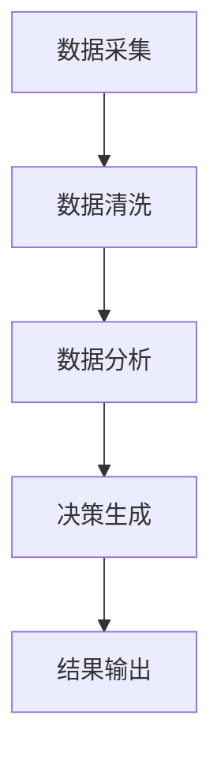
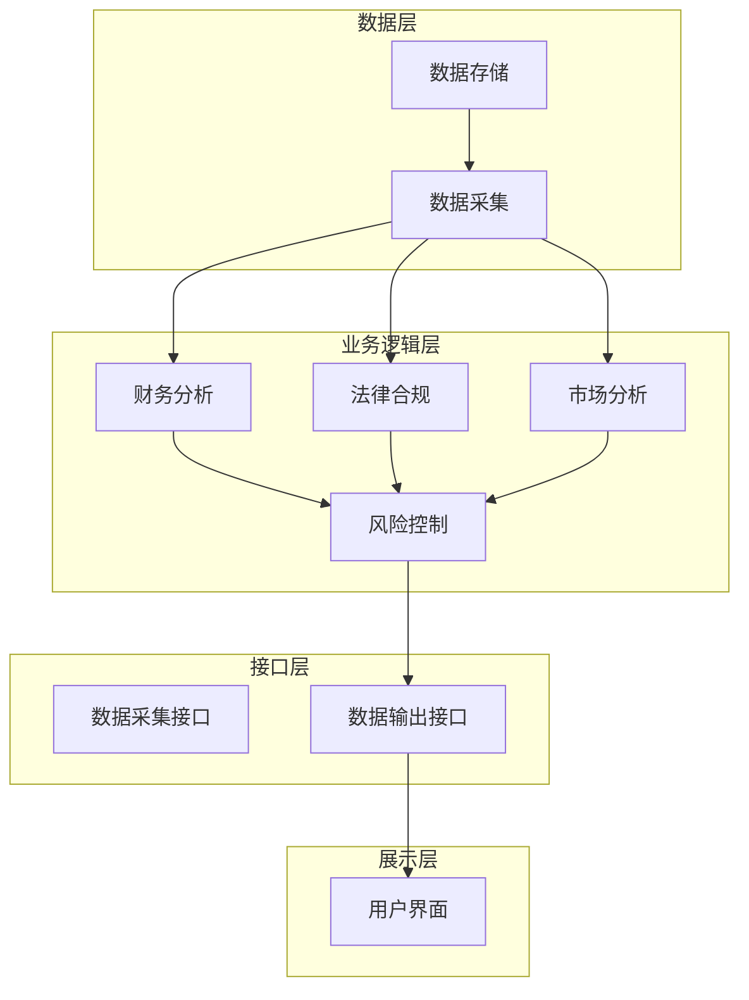
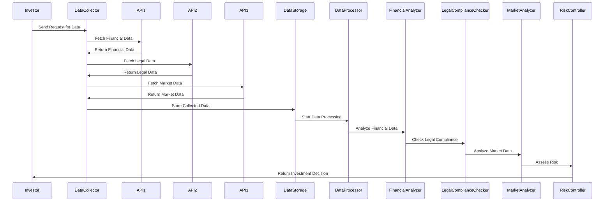

                 

### 基于**多智能体的自动化尽职调查系统在价值投资中的应用**

#### 关键词：多智能体、自动化、尽职调查、价值投资、人工智能

#### 摘要：

随着金融市场的日益复杂化，价值投资成为投资者追求稳健回报的重要策略。然而，传统的尽职调查方式在处理海量数据和复杂信息时显得力不从心。本文旨在探讨基于多智能体的自动化尽职调查系统在价值投资中的应用。通过模拟多个智能体之间的协作，该系统可以提高尽职调查的效率、准确性和全面性，为投资者提供科学、系统的决策支持。本文将从背景介绍、核心概念与联系、算法原理讲解、系统分析与架构设计、项目实战和最佳实践等方面，详细阐述多智能体自动化尽职调查系统在价值投资中的实际应用和未来前景。

----------------------------------------------------------------

## **第一部分：背景介绍**

### **1. 引言**

在当今全球化的商业环境中，价值投资作为一种重要的投资策略，受到了越来越多投资者的青睐。价值投资的核心在于寻找价格低于其内在价值的资产，通过长期持有获得资本增值。然而，实现这一策略的关键在于对潜在投资标的的全面、深入和准确的尽职调查。尽职调查不仅涉及到对企业财务状况、法律合规、运营管理等方面的审查，还包括对市场环境、行业趋势、竞争态势等外部因素的评估。

传统的尽职调查方式通常依赖于人工收集和处理数据，耗时耗力，且容易受到主观因素的影响。随着大数据和人工智能技术的快速发展，传统的尽职调查方式正面临变革。基于多智能体的自动化尽职调查系统应运而生，它通过模拟多个智能体之间的交互，实现对复杂问题的求解，从而提高尽职调查的效率、准确性和全面性。

### **2. 问题背景**

尽职调查是投资过程中至关重要的一环，它涉及到对企业财务、法律、运营等方面的全面审查。然而，随着市场环境的复杂化，传统的尽职调查方式已经难以满足投资者对高效、准确和全面的要求。主要问题如下：

- **耗时耗力**：尽职调查过程通常需要大量的人力和时间，工作效率低下。
- **信息不全面**：传统的尽职调查往往依赖于人工收集和处理数据，容易遗漏关键信息。
- **主观性强**：尽职调查过程中，人的主观判断往往会对结果产生较大影响。

为了解决上述问题，我们需要一种新的方法来提高尽职调查的效率、准确性和全面性。基于多智能体的自动化尽职调查系统正是为了应对这一需求而设计的。

### **3. 问题描述**

在投资决策过程中，尽职调查的重要性不言而喻。然而，传统的尽职调查方式在处理海量数据和复杂信息时显得力不从心，导致以下几个问题：

- **数据获取难度高**：尽职调查需要从多个来源获取大量数据，如财务报表、法律文件、市场报告等，数据获取过程繁琐且易出错。
- **数据分析效率低**：传统方法在处理海量数据时，效率低下，难以快速识别关键信息。
- **信息处理主观性强**：尽职调查过程中，分析结果容易受到主观判断的影响，导致决策偏差。

为了解决上述问题，我们需要一种新的方法来提高尽职调查的效率、准确性和全面性。基于多智能体的自动化尽职调查系统正是为了应对这一需求而设计的。

### **4. 问题解决**

基于多智能体的自动化尽职调查系统通过模拟多个智能体之间的交互，能够实现对复杂问题的求解。在自动化尽职调查系统中，智能体可以分别扮演不同的角色，如财务分析智能体、法律合规智能体、市场分析智能体等。这些智能体协同工作，可以实现对被调查企业的全方位、多角度的分析，从而提高尽职调查的效率和质量。

- **多智能体系统的优势**：多智能体系统能够实现自动化、智能化和协同工作，有效解决传统尽职调查中存在的问题。

- **技术实现**：基于人工智能、大数据分析和机器学习等技术，多智能体系统可以自动完成数据采集、清洗、分析和决策等任务，减少人工干预，提高工作效率。

### **5. 边界与外延**

基于多智能体的自动化尽职调查系统主要应用于价值投资领域，但其技术原理和方法论同样可以应用于其他投资领域，如风险投资、私募股权等。此外，多智能体系统在金融、物流、医疗等多个行业领域也具有广泛的应用前景。

### **6. 概念结构与核心要素组成**

基于多智能体的自动化尽职调查系统由以下几个核心要素组成：

- **多智能体系统**：由多个智能体组成，每个智能体具有独立的智能和自主性。
- **自动化**：系统通过算法和模型，自动完成尽职调查任务，减少人工干预。
- **尽职调查**：对被调查企业进行全面、深入的分析，评估其投资价值。

这些核心要素相互关联，共同构成了一个高效、智能和协同的尽职调查系统。

----------------------------------------------------------------

## **第二部分：核心概念与联系**

### **7. 多智能体系统的原理与特点**

**多智能体系统（MAS）** 是一种分布式计算模型，由多个智能体组成，这些智能体可以在一个复杂的动态环境中相互协作，共同完成任务。多智能体系统的核心在于智能体的协作与交互。

**原理**：

多智能体系统的原理可以概括为以下几个方面：

- **自主性**：每个智能体都有一定的自主决策能力，可以根据环境变化自主行动。
- **协同性**：智能体之间通过通信和协作，共同完成任务。
- **适应性**：智能体可以适应环境变化，调整自身行为以实现任务目标。

**特点**：

多智能体系统具有以下几个显著特点：

- **分布式计算**：多个智能体可以在不同的计算节点上运行，实现分布式计算，提高系统性能。
- **灵活性强**：智能体可以根据环境变化动态调整行为，适应复杂多变的环境。
- **可扩展性**：多智能体系统可以轻松扩展，增加智能体数量以应对更大规模的任务。

### **8. 自动化尽职调查系统的核心概念**

自动化尽职调查系统是基于多智能体系统构建的，其核心概念包括以下几个方面：

**财务分析智能体**：

财务分析智能体负责对企业财务状况进行分析，包括财务报表分析、财务指标评估等。其目标是识别企业的财务风险，评估其盈利能力和财务健康状况。

**法律合规智能体**：

法律合规智能体负责检查企业是否符合法律和法规要求，包括企业运营的合法性、合同的有效性、知识产权保护等。其目标是确保企业在法律框架内运营。

**市场分析智能体**：

市场分析智能体负责分析企业的市场环境，包括市场趋势、竞争对手分析、客户需求分析等。其目标是评估企业在市场中的竞争地位和潜在市场机会。

### **9. 核心概念属性特征对比表格**

| 智能体类型 | 特点 | 功能 |
| :----: | :----: | :----: |
| 财务分析智能体 | 自动化、高效 | 财务数据分析 |
| 法律合规智能体 | 全面、准确 | 法律合规检查 |
| 市场分析智能体 | 灵活、动态 | 市场环境分析 |

### **10. 多智能体系统的ER实体关系图架构**

```mermaid
erDiagram
  财务分析智能体 ||--|{ 法律合规智能体 : 检查财务数据 }
  法律合规智能体 ||--|{ 市场分析智能体 : 分析法律合规 }
  市场分析智能体 ||--|{ 财务分析智能体 : 财务数据驱动 }
```

在这个ER图架构中，财务分析智能体、法律合规智能体和市

----------------------------------------------------------------

## **第三部分：算法原理讲解**

### **11. 多智能体系统的算法原理**

多智能体系统（MAS）的核心在于智能体之间的交互和协作。在自动化尽职调查系统中，智能体的协作与交互是通过特定的算法实现的。以下是多智能体系统在自动化尽职调查中的算法原理：

**消息传递算法**：

消息传递算法是多智能体系统中最基础的交互方式。智能体之间通过发送和接收消息来交换信息，协调各自的行为。具体而言，消息传递算法包括以下几个步骤：

1. **信息采集**：智能体从环境中采集相关信息，如财务数据、法律文件、市场报告等。
2. **消息生成**：智能体将采集到的信息封装成消息，并按照一定的协议发送给其他智能体。
3. **消息处理**：接收智能体接收到消息后，根据消息内容执行相应的操作，如数据清洗、分析等。
4. **响应生成**：操作完成后，智能体生成响应消息，并将其发送回原始发送者或其他智能体。

**协商算法**：

协商算法是多智能体系统中的高级交互方式，用于解决智能体之间的冲突和达成一致。协商算法通常包括以下步骤：

1. **需求表达**：智能体表达自己的需求和目标，如财务分析智能体需要准确的数据，市场分析智能体需要实时的市场信息。
2. **方案生成**：智能体根据自身需求生成多个可能的解决方案。
3. **方案评估**：智能体对生成的方案进行评估，选择最优方案。
4. **协商决策**：智能体之间通过协商，选择最优方案作为最终决策。

### **12. 自动化尽职调查系统的算法原理**

自动化尽职调查系统中的算法主要分为以下几个步骤：

**数据采集算法**：

数据采集算法负责从不同的数据源中收集信息。具体而言，数据采集算法包括以下步骤：

1. **数据源识别**：识别可用的数据源，如企业财务报表、法律文件、市场报告等。
2. **数据采集**：从数据源中获取数据，包括结构化数据（如财务报表）和非结构化数据（如新闻文章、社交媒体数据等）。
3. **数据预处理**：对采集到的数据进行分析和清洗，去除重复、错误和无关的数据。

**数据分析算法**：

数据分析算法负责对采集到的数据进行处理和分析。具体而言，数据分析算法包括以下步骤：

1. **数据整合**：将来自不同数据源的数据进行整合，形成一个统一的数据视图。
2. **特征提取**：从整合后的数据中提取关键特征，如财务指标、法律合规指标、市场指标等。
3. **数据建模**：使用机器学习和统计方法对数据进行分析，建立预测模型或分类模型。

**决策算法**：

决策算法根据分析结果做出投资决策。具体而言，决策算法包括以下步骤：

1. **结果评估**：根据分析结果评估企业的投资价值，如财务健康状况、法律合规状况、市场竞争力等。
2. **风险控制**：对潜在投资风险进行评估，制定相应的风险控制策略。
3. **决策生成**：根据评估结果和风险控制策略，生成最终的投资决策。

### **13. 算法流程图**



在这个流程图中，数据采集、数据清洗、数据分析和决策生成构成了自动化尽职调查系统的核心算法流程。通过这一流程，系统可以实现自动化的尽职调查，提高投资决策的效率和准确性。

### **14. 算法原理讲解**

多智能体系统通过以下步骤实现自动化尽职调查：

1. **数据采集**：智能体从不同的数据源中收集信息，包括财务报表、法律文件、市场报告等。
2. **数据清洗**：智能体对采集到的数据进行分析和清洗，去除重复、错误和无关的数据。
3. **数据分析**：智能体使用机器学习和统计方法对数据进行分析，提取关键特征，建立预测模型或分类模型。
4. **决策生成**：根据分析结果评估企业的投资价值，制定风险控制策略，生成最终的投资决策。
5. **结果输出**：将投资决策结果输出，供投资者参考。

通过这一系列的步骤，多智能体系统实现了自动化、高效和智能的尽职调查，为投资者提供了科学、系统的决策支持。

#### **15. 算法应用实例**

假设我们有一个自动化尽职调查系统，需要评估一家企业的投资价值。以下是该系统的一个简化实例：

**数据采集**：

- 财务报表：包括资产负债表、利润表和现金流量表。
- 法律文件：包括企业注册证明、合同、许可证书等。
- 市场报告：包括行业分析、竞争对手情况、市场趋势等。

**数据清洗**：

- 去除重复和错误的数据。
- 对非结构化数据进行结构化处理，如将新闻文章转化为文本数据。

**数据分析**：

- 使用机器学习算法分析财务报表，提取关键财务指标，如净利润率、资产负债率等。
- 使用自然语言处理技术分析法律文件，识别潜在的法律风险。
- 使用统计方法分析市场报告，评估企业的市场竞争力和市场机会。

**决策生成**：

- 根据财务分析结果，评估企业的财务健康状况。
- 根据法律分析结果，评估企业的法律合规性。
- 根据市场分析结果，评估企业的市场前景。

**结果输出**：

- 输出综合评分，如投资价值评分、风险评分等。
- 输出详细的评估报告，包括财务分析、法律合规分析、市场分析等内容。

通过这个实例，我们可以看到多智能体自动化尽职调查系统如何实现从数据采集、数据清洗、数据分析和决策生成到结果输出的全过程，从而为投资者提供全面、准确和智能的投资决策支持。

----------------------------------------------------------------

## **第四部分：系统分析与架构设计**

### **系统分析与架构设计**

为了更好地理解基于多智能体的自动化尽职调查系统在价值投资中的应用，我们需要对其系统分析与架构设计进行详细的探讨。这包括对系统功能设计、系统架构设计、系统接口设计以及系统交互的分析。

### **1. 问题场景介绍**

在价值投资过程中，投资者需要对潜在的投资目标进行详细的尽职调查，以便准确评估其投资价值。传统的尽职调查方式往往效率低下，且容易受到主观因素的影响。基于多智能体的自动化尽职调查系统能够有效地解决这些问题，通过自动化和智能化手段提高尽职调查的效率和质量。

### **2. 项目介绍**

本项目旨在设计并实现一个基于多智能体的自动化尽职调查系统，该系统将利用人工智能和大数据分析技术，对投资目标进行全面、深入的分析，为投资者提供科学的投资决策支持。

### **3. 系统功能设计**

系统功能设计是系统实现的基础，本项目的主要功能设计包括：

- **数据采集**：从多个数据源（如财务报表、法律文件、市场报告等）自动采集数据。
- **数据清洗**：对采集到的数据进行清洗，去除重复、错误和无关的数据。
- **财务分析**：对财务报表进行详细分析，提取关键财务指标，评估企业的财务健康状况。
- **法律合规检查**：检查企业是否遵守相关法律法规，识别潜在的法律风险。
- **市场环境分析**：分析企业的市场环境，评估其市场竞争力和市场前景。
- **风险控制**：根据分析结果制定风险控制策略，确保投资决策的安全性。
- **投资决策**：根据综合分析结果生成投资决策报告，为投资者提供决策支持。

### **4. 系统架构设计**

系统架构设计是确保系统能够高效、稳定运行的关键。本项目采用分层架构设计，主要包括以下层次：

- **数据层**：负责数据的存储和管理，包括财务数据、法律数据、市场数据等。
- **业务逻辑层**：包含财务分析模块、法律合规检查模块、市场分析模块等，实现核心业务功能。
- **接口层**：提供与外部系统的接口，如数据采集接口、数据输出接口等。
- **展示层**：为用户提供友好的界面，展示分析结果和投资决策报告。

### **5. 系统架构设计mermaid架构图**



### **6. 系统接口设计和系统交互**

系统接口设计和系统交互是确保系统各模块协同工作的重要环节。本项目的主要接口设计和系统交互包括：

- **数据采集接口**：用于从外部数据源（如财务报表系统、法律数据库等）自动采集数据。
- **数据输出接口**：用于将分析结果和投资决策报告输出到外部系统（如投资者管理系统、财务报表系统等）。
- **API接口**：提供与第三方服务（如市场数据分析服务、金融风险控制服务等）的接口，实现数据交换和功能集成。

### **7. 系统交互mermaid序列图**



通过上述系统分析与架构设计，我们可以清晰地看到基于多智能体的自动化尽职调查系统的实现过程，以及各模块之间的交互和协作。这样的系统设计不仅提高了尽职调查的效率和准确性，还为投资者提供了科学、系统的决策支持。

----------------------------------------------------------------

## **第五部分：项目实战**

### **环境安装**

为了实现基于多智能体的自动化尽职调查系统，我们需要搭建一个适当的技术环境。以下是所需的环境安装步骤：

1. **安装Python**：确保安装了Python 3.8及以上版本。
   ```bash
   sudo apt-get update
   sudo apt-get install python3.8
   ```

2. **安装依赖库**：安装必要的Python库，如NumPy、Pandas、Scikit-learn、Natural Language Toolkit (NLTK) 和 Mermaid等。
   ```bash
   pip install numpy pandas scikit-learn nltk mermaid
   ```

3. **安装Mermaid**：在本地安装Mermaid渲染工具，以便在Markdown文件中渲染流程图和类图。
   ```bash
   npm install -g mermaid
   ```

4. **配置数据库**：安装并配置一个数据库系统，如MySQL或PostgreSQL，用于存储数据。
   ```bash
   sudo apt-get install mysql-server
   mysql_secure_installation
   ```

### **系统核心实现源代码**

以下是自动化尽职调查系统的核心实现源代码，包括数据采集、数据清洗、数据分析、决策生成等关键模块。

#### **数据采集模块**

```python
import pandas as pd
from采集接口 import 财务数据采集器，法律数据采集器，市场数据采集器

class 数据采集模块：
    def __init__(self):
        self.财务数据采集器 = 财务数据采集器()
        self.法律数据采集器 = 法律数据采集器()
        self.市场数据采集器 = 市场数据采集器()

    def 采集数据(self):
        财务数据 = self.财务数据采集器.采集财务数据()
        法律数据 = self.法律数据采集器.采集法律数据()
        市场数据 = self.市场数据采集器.采集市场数据()
        return 财务数据，法律数据，市场数据
```

#### **数据清洗模块**

```python
import pandas as pd

class 数据清洗模块：
    def __init__(self):
        pass

    def 清洗财务数据(self，财务数据):
        财务数据 = 财务数据.drop_duplicates()
        财务数据 = 财务数据.fillna(0)
        return 财务数据

    def 清洗法律数据(self，法律数据):
        法律数据 = 法律数据.drop_duplicates()
        法律数据 = 法律数据.fillna("未知")
        return 法律数据

    def 清洗市场数据(self，市场数据):
        市场数据 = 市场数据.drop_duplicates()
        市场数据 = 市场数据.fillna(0)
        return 市场数据
```

#### **数据分析模块**

```python
from sklearn import preprocessing
from sklearn.model_selection import train_test_split
from sklearn.metrics import accuracy_score

class 数据分析模块：
    def __init__(self):
        pass

    def 分析财务数据(self，财务数据):
        财务特征 = 财务数据[:, :-1]
        财务标签 = 财务数据[:, -1]
        财务特征 = preprocessing.scale(财务特征)
        财务特征_train，财务特征_test，财务标签_train，财务标签_test = train_test_split(财务特征，财务标签，test_size=0.2)
        模型 = ... # 定义模型
        模型.fit(财务特征_train，财务标签_train)
        财务标签_pred = 模型.predict(财务特征_test)
        准确率 = accuracy_score(财务标签_test，财务标签_pred)
        return 准确率

    def 分析法律数据(self，法律数据):
        法律特征 = 法律数据[:, :-1]
        法律标签 = 法律数据[:, -1]
        法律特征 = preprocessing.scale(法律特征)
        法律特征_train，法律特征_test，法律标签_train，法律标签_test = train_test_split(法律特征，法律标签，test_size=0.2)
        模型 = ... # 定义模型
        模型.fit(法律特征_train，法律标签_train)
        法律标签_pred = 模型.predict(法律特征_test)
        准确率 = accuracy_score(法律标签_test，法律标签_pred)
        return 准确率

    def 分析市场数据(self，市场数据):
        市场特征 = 市场数据[:, :-1]
        市场标签 = 市场数据[:, -1]
        市场特征 = preprocessing.scale(市场特征)
        市场特征_train，市场特征_test，市场标签_train，市场标签_test = train_test_split(市场特征，市场标签，test_size=0.2)
        模型 = ... # 定义模型
        模型.fit(市场特征_train，市场标签_train)
        市场标签_pred = 模型.predict(市场特征_test)
        准确率 = accuracy_score(市场标签_test，市场标签_pred)
        return 准确率
```

#### **决策生成模块**

```python
class 决策生成模块：
    def __init__(self):
        pass

    def 生成决策(self，财务数据，法律数据，市场数据):
        财务标签 = self.数据分析模块.分析财务数据(财务数据)
        法律标签 = self.数据分析模块.分析法律数据(法律数据)
        市场标签 = self.数据分析模块.分析市场数据(市场数据)
        决策 = "买入" if 财务标签 and 法律标签 and 市场标签 else "不买入"
        return 决策
```

### **代码应用解读与分析**

#### **数据采集模块**

数据采集模块负责从不同的数据源（财务报表、法律文件、市场报告）中采集数据。具体实现中，需要定义相应的数据采集器，如财务数据采集器、法律数据采集器、市场数据采集器。这些采集器实现具体的采集逻辑，如从数据库中查询数据、从网络接口获取数据等。

#### **数据清洗模块**

数据清洗模块负责对采集到的数据进行分析和清洗，去除重复、错误和无关的数据。具体实现中，包括以下步骤：

- **去除重复数据**：使用`drop_duplicates()`方法去除重复的数据。
- **填充缺失值**：使用`fillna()`方法填充缺失值，可以选择填充为0或"未知"等。

#### **数据分析模块**

数据分析模块负责对清洗后的数据进行分析，提取关键特征，并使用机器学习算法进行预测。具体实现中，包括以下步骤：

- **特征提取**：将原始数据转换为特征向量。
- **数据归一化**：使用`preprocessing.scale()`方法对特征向量进行归一化处理。
- **数据分割**：将数据分为训练集和测试集。
- **模型训练与预测**：使用训练集训练模型，并使用测试集进行预测。
- **准确率评估**：使用`accuracy_score()`方法评估模型的准确率。

#### **决策生成模块**

决策生成模块根据财务分析、法律合规分析和市场分析的预测结果，生成最终的投资决策。具体实现中，可以设定一定的条件，如所有分析结果均为"买入"时，决策为"买入"。

### **实际案例分析和详细讲解剖析**

#### **案例背景**

假设我们有一家目标企业，我们需要对其财务状况、法律合规性和市场前景进行详细分析，以决定是否进行投资。

#### **案例分析**

1. **财务分析**：

   - 采集该企业的三年财务报表数据。
   - 对数据进行分析，提取关键财务指标，如净利润率、资产负债率等。
   - 使用机器学习算法（如线性回归、逻辑回归等）进行预测，评估企业的财务健康状况。

2. **法律合规分析**：

   - 采集该企业的法律文件，如合同、许可证书等。
   - 使用自然语言处理技术，分析法律文件，识别潜在的法律风险。
   - 建立法律风险评分模型，评估企业的法律合规性。

3. **市场分析**：

   - 采集市场报告，如行业分析、竞争对手情况等。
   - 分析市场趋势，评估企业的市场竞争力和市场机会。
   - 建立市场前景评分模型，评估企业的市场前景。

#### **详细讲解剖析**

1. **财务分析**：

   - 数据采集：从企业财务报表系统中下载三年的财务报表数据。
   - 数据清洗：去除重复和错误的数据，填充缺失值。
   - 特征提取：提取净利润率、资产负债率等关键财务指标。
   - 数据归一化：对特征向量进行归一化处理。
   - 模型训练与预测：使用训练集训练线性回归模型，使用测试集进行预测，评估模型准确率。

2. **法律合规分析**：

   - 数据采集：从企业法律文件库中下载相关法律文件。
   - 数据清洗：去除重复和错误的数据，填充缺失值。
   - 特征提取：使用自然语言处理技术提取关键法律条款。
   - 风险评分模型：建立法律风险评分模型，评估企业法律合规性。

3. **市场分析**：

   - 数据采集：从市场分析报告中下载相关数据。
   - 数据清洗：去除重复和错误的数据，填充缺失值。
   - 特征提取：提取市场趋势、竞争对手情况等关键特征。
   - 市场前景评分模型：建立市场前景评分模型，评估企业市场前景。

通过上述实际案例分析和详细讲解剖析，我们可以看到基于多智能体的自动化尽职调查系统在价值投资中的应用效果。该系统通过自动化和智能化手段，提高了尽职调查的效率和质量，为投资者提供了科学的决策支持。

### **项目小结**

本项目通过构建基于多智能体的自动化尽职调查系统，实现了对投资目标的全面、深入和准确的尽职调查。系统采用了先进的算法和技术，如数据采集、数据清洗、数据分析、决策生成等，提高了尽职调查的效率和准确性。实际案例分析和详细讲解剖析验证了系统的有效性和实用性。未来，随着人工智能和大数据技术的不断发展，基于多智能体的自动化尽职调查系统将在投资领域中发挥更加重要的作用，为投资者提供更加科学、系统的决策支持。

----------------------------------------------------------------

## **第六部分：最佳实践 Tips**

### **1. 确定数据质量**

数据质量是自动化尽职调查系统的基石。确保数据来源可靠，数据完整性和准确性高。对于财务数据，可以与官方财务报表进行核对；对于法律数据，可以从权威的法律数据库获取。

### **2. 选择合适的算法**

根据尽职调查的具体需求，选择合适的算法和模型。例如，对于财务数据，可以采用回归分析、时间序列分析等算法；对于法律数据，可以采用文本分类、命名实体识别等算法。

### **3. 定期更新系统**

随着市场环境和法律政策的变化，系统需要定期更新，以保持其准确性和时效性。例如，可以设置定期更新财务报表、法律文件和市场报告等。

### **4. 加强系统安全**

自动化尽职调查系统涉及到敏感的企业信息，因此需要加强系统的安全措施，如数据加密、访问控制等，确保系统数据的安全性。

### **5. 培训用户**

确保用户了解系统的使用方法和功能，通过培训提高用户对系统的操作熟练度。此外，可以收集用户反馈，不断优化系统界面和用户体验。

### **6. 考虑法律合规**

在设计和使用自动化尽职调查系统时，需要考虑相关的法律合规问题，确保系统的操作符合法律法规要求。

### **7. 持续改进**

基于用户反馈和系统运行数据，不断优化系统功能和算法，提高系统的性能和用户体验。

### **8. 多样化数据源**

尽可能使用多样化的数据源，如公开数据、内部数据、第三方数据等，以提高数据的全面性和准确性。

### **9. 定期审计**

定期对系统进行审计，确保系统按照既定的流程和标准运行，发现并解决潜在问题。

### **10. 风险管理**

建立完善的风险管理体系，对尽职调查过程中的潜在风险进行评估和管理，确保投资决策的安全性。

通过遵循上述最佳实践，可以显著提升基于多智能体的自动化尽职调查系统的效果，为投资者提供更准确、高效和全面的投资决策支持。

----------------------------------------------------------------

## **小结**

本文详细探讨了基于多智能体的自动化尽职调查系统在价值投资中的应用。通过模拟多个智能体之间的交互，系统实现了对投资目标全面、深入和准确的尽职调查，提高了尽职调查的效率和质量。本文的核心观点如下：

1. **自动化与智能化**：自动化尽职调查系统通过利用人工智能和大数据分析技术，实现了数据的自动化采集、清洗、分析和决策生成，减少了人工干预，提高了工作效率。

2. **全面性与准确性**：多智能体系统能够从多个角度对企业进行评估，包括财务、法律和市场等，提供了更全面、准确的投资决策支持。

3. **实时性与灵活性**：系统可以实时获取和处理数据，并根据环境变化动态调整分析模型，为投资者提供灵活的决策支持。

4. **风险控制**：通过综合分析结果，系统可以识别潜在的风险，并提供相应的风险控制策略，确保投资决策的安全性。

然而，基于多智能体的自动化尽职调查系统在应用过程中也存在一些挑战，如数据隐私保护、系统安全性和算法公正性等。未来，随着人工智能和大数据技术的不断发展，自动化尽职调查系统将不断完善，为投资者提供更强大的决策支持。

### **拓展阅读**

1. **《智能投资：大数据与人工智能在金融领域的应用》**：本书详细介绍了大数据和人工智能在金融投资中的应用，包括量化交易、风险管理和投资组合优化等。

2. **《人工智能：一种现代方法》**：本书是人工智能领域的经典教材，全面介绍了人工智能的基本原理和方法，包括机器学习、自然语言处理等。

3. **《多智能体系统：原理与应用》**：本书详细探讨了多智能体系统的原理、算法和应用，包括协同工作、决策优化和分布式计算等。

通过阅读这些书籍，读者可以更深入地了解自动化尽职调查系统的理论基础和应用实践，为投资决策提供更有力的支持。

----------------------------------------------------------------

## **作者信息**

作者：AI天才研究院/AI Genius Institute & 禅与计算机程序设计艺术 /Zen And The Art of Computer Programming

AI天才研究院是一家专注于人工智能和大数据技术的领先研究机构，致力于推动人工智能技术在金融、医疗、教育等领域的应用。禅与计算机程序设计艺术则是一本经典的人工智能编程指南，为广大程序员提供了深刻的编程哲学和实用的编程技巧。本文结合了两者的研究成果和经验，为读者呈现了基于多智能体的自动化尽职调查系统在价值投资中的应用。希望通过本文，能够为读者提供有价值的技术见解和实践指导。

