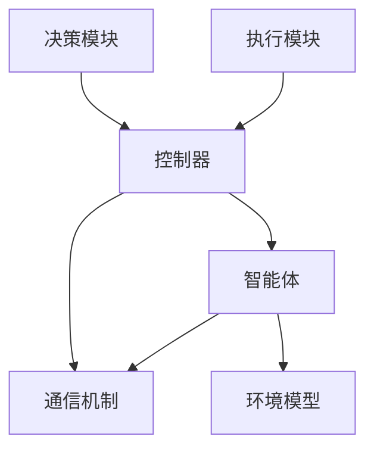
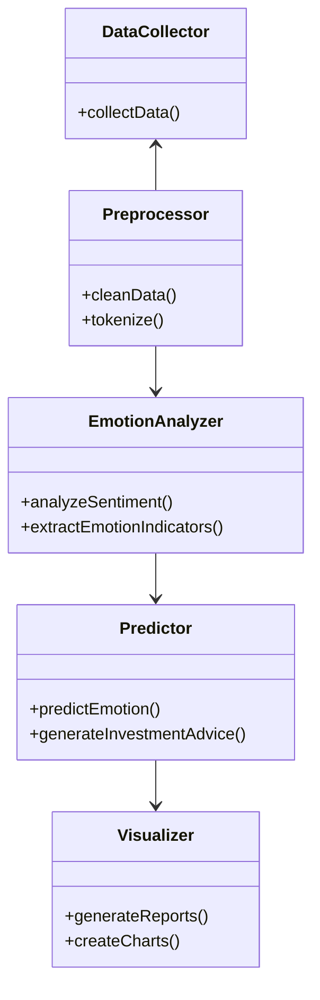
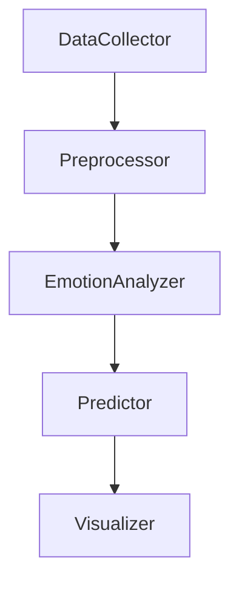
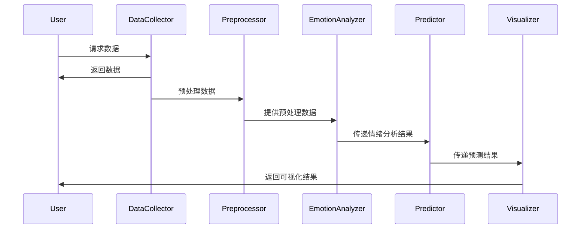

                 

# 基于多智能体的自动化市场情绪指标构建

## 关键词

多智能体系统、市场情绪、自动化指标、金融分析、机器学习

## 摘要

随着金融市场的发展，市场情绪的变化对投资决策产生了重要影响。然而，传统的市场情绪分析方法主要依赖于人工判断，存在时效性差、主观性强等问题。本文提出了一种基于多智能体的自动化市场情绪指标构建方法。通过多智能体系统模拟市场参与者的行为，结合情绪分析算法和数学模型，实现对市场情绪的自动识别和量化。本文首先介绍了多智能体系统的基本原理和应用，然后详细讲解了情绪分析算法和数学模型的构建过程，并通过实际案例进行了验证和分析。研究结果表明，该方法可以有效提高市场情绪分析的准确性和实时性，为投资者提供有益的决策支持。

## 第一部分：问题背景与核心概念

### 第1章：自动化市场情绪指标概述

#### 1.1 问题背景

随着金融市场的发展，市场情绪的变化对投资决策产生了重要影响。投资者需要快速、准确地了解市场情绪，以便做出合理的投资决策。然而，传统的市场情绪分析方法主要依赖于人工判断，存在时效性差、主观性强等问题。首先，人工判断需要大量的时间和精力，无法实现实时分析。其次，市场情绪受多种因素影响，如新闻事件、政策调整、市场预期等，使得人工判断的主观性较强，难以保证准确性。

为了解决这些问题，研究者们提出了自动化市场情绪指标构建方法。自动化市场情绪指标通过算法和模型对市场数据进行分析和处理，实现对市场情绪的自动识别和量化。这种方法的优点是能够提高分析速度和准确性，降低人工干预的风险，为投资者提供更加可靠的市场情绪信息。

#### 1.2 核心概念

**多智能体系统（MAS）：** 多智能体系统是由多个智能体组成的系统，这些智能体可以相互协作或竞争，以实现特定目标。智能体是MAS的基本单位，具有感知环境、制定决策和执行动作的能力。

**市场情绪：** 市场情绪是指市场参与者对市场行情的总体心理反应，包括乐观、悲观、兴奋、恐惧等情绪状态。市场情绪会影响投资者的行为，进而影响市场价格。

**自动化市场情绪指标：** 是指通过算法和模型自动提取和分析市场数据，形成对市场情绪的量化指标。这些指标可以用于评估市场情绪的强度和方向，为投资者提供决策参考。

**概念结构与核心要素：**

1. 多智能体系统：智能体、通信机制、环境模型。
2. 市场数据：历史价格、成交量、新闻事件、政策调整等。
3. 情绪分析模型：情绪分析算法、数学模型。
4. 情绪指标：情绪得分、情绪指数、情绪趋势等。

### 第2章：多智能体系统原理与架构

#### 2.1 多智能体系统原理

**多智能体系统定义：** 多智能体系统（MAS）是由多个智能体组成的系统，这些智能体可以相互协作或竞争，以实现特定目标。

**智能体特性：**
1. 自主性：智能体能够自主决策和执行动作，不受外部指令控制。
2. 协同性：智能体之间可以相互协作，共同实现系统目标。
3. 适应性：智能体可以根据环境变化调整自身行为。
4. 反应性：智能体能够实时感知环境变化，并做出相应反应。

**多智能体系统类型：**
1. 通信型智能体系统：智能体之间通过通信机制进行信息交换。
2. 协作型智能体系统：智能体之间相互协作，共同完成任务。
3. 竞争型智能体系统：智能体之间相互竞争，争夺资源。

#### 2.2 多智能体系统架构

**基本架构：** 多智能体系统的基本架构包括智能体、通信机制、环境模型。

**核心组件：**
1. 智能体：执行任务的基本单元，具有感知环境、制定决策和执行动作的能力。
2. 控制器：协调智能体之间的协作和竞争，确保系统目标的实现。
3. 决策模块：根据环境信息和历史数据，为智能体提供决策建议。
4. 执行模块：根据决策建议，执行相应的动作。

**多智能体系统架构图：**


#### 2.3 多智能体系统应用

**金融市场情绪分析：** 多智能体系统可以模拟市场参与者的行为，分析市场情绪。例如，智能体可以收集新闻事件、政策调整等信息，分析投资者情绪，预测市场趋势。

**股票市场预测：** 利用多智能体系统进行股票市场趋势预测。智能体可以根据历史价格、成交量等信息，分析市场情绪，预测股票价格走势。

**社交网络分析：** 通过多智能体系统分析社交网络情绪，预测热点话题。智能体可以收集用户评论、转发等信息，分析社交网络情绪，识别潜在热点话题。

### 第3章：情绪分析算法原理

#### 3.1 情绪分析算法概述

**情绪分析定义：** 情绪分析是指通过文本挖掘、情感分析等方法，识别和理解文本中表达的情绪。

**情绪分析目标：**
1. 提取情绪：从文本中提取情绪标签，如喜悦、愤怒、悲伤等。
2. 判断情绪倾向：分析文本情绪的倾向，如积极、消极等。
3. 分析情绪变化：识别情绪的波动和变化趋势。

**情绪分析算法分类：**
1. **基于词典的算法：** 利用预定义的词典进行情绪分类。例如，情感词典法、规则匹配法。
2. **基于机器学习的算法：** 使用机器学习模型进行情绪分类。例如，支持向量机（SVM）、朴素贝叶斯（Naive Bayes）等。
3. **基于深度学习的算法：** 利用深度学习模型进行情绪分类。例如，循环神经网络（RNN）、卷积神经网络（CNN）等。

#### 3.2 情绪分析算法分类

**基于词典的算法原理：**
- **情感词典法：** 利用情感词典中的关键词对文本进行标注，计算文本的情感得分。
- **规则匹配法：** 根据情感词典中的规则，对文本进行匹配和分类。

**基于机器学习的算法原理：**
- **特征提取：** 将文本转化为特征向量，如词袋模型（Bag of Words）、TF-IDF等。
- **模型训练：** 使用训练数据集，训练机器学习模型，如支持向量机（SVM）、朴素贝叶斯（Naive Bayes）等。
- **预测：** 使用训练好的模型，对新的文本进行情绪分类。

**基于深度学习的算法原理：**
- **特征提取：** 使用深度神经网络（DNN）提取文本特征。
- **模型训练：** 使用训练数据集，训练深度学习模型，如循环神经网络（RNN）、卷积神经网络（CNN）等。
- **预测：** 使用训练好的模型，对新的文本进行情绪分类。

#### 3.3 情绪分析算法流程

**数据预处理：** 清洗文本数据，去除噪声和无关信息，进行分词和词性标注。

**特征提取：** 将文本转化为特征向量，如词袋模型（Bag of Words）、TF-IDF等。

**情绪分类：** 使用算法对文本进行情绪分类，如支持向量机（SVM）、朴素贝叶斯（Naive Bayes）等。

**结果评估：** 使用评估指标（如准确率、召回率等）评估算法性能。

### 第4章：市场情绪数学模型

#### 4.1 市场情绪数学模型概述

**市场情绪数学模型定义：** 市场情绪数学模型是指使用数学公式和模型对市场情绪进行量化描述。这些模型可以从市场数据中提取情绪指标，反映市场情绪状态。

**市场情绪数学模型目标：**
1. 提取情绪指标：从市场数据中提取情绪指标，如情绪得分、情绪指数等。
2. 反映市场情绪状态：通过情绪指标的变化，反映市场情绪的强度和方向。

#### 4.2 市场情绪数学模型构建

**情绪指标提取：** 使用统计学方法提取情绪指标。例如，可以使用情绪得分（Emotion Score）来衡量市场情绪的强度。

**情绪状态判断：** 使用逻辑回归（Logistic Regression）、支持向量机（Support Vector Machine）等算法，判断市场情绪状态。

#### 4.3 数学公式与详细讲解

**情绪指标公式：**
$$
Emotion\_Score = \sum_{i=1}^{n} w_i \cdot value_i
$$
其中，$w_i$ 表示第 $i$ 个情绪指标的重要性，$value_i$ 表示第 $i$ 个情绪指标的实际值。

**情绪状态判断公式：**
$$
State = \begin{cases} 
Positive & \text{if } Emotion\_Score > threshold \\
Negative & \text{if } Emotion\_Score < -threshold \\
Neutral & \text{otherwise}
\end{cases}
$$
其中，$threshold$ 表示情绪状态的阈值。当 $Emotion\_Score$ 大于 $threshold$ 时，市场情绪状态为积极；当 $Emotion\_Score$ 小于 $-threshold$ 时，市场情绪状态为消极；否则，市场情绪状态为中性。

### 第二部分：核心概念与联系

#### 第2章：多智能体系统原理与架构

**多智能体系统原理：**

多智能体系统（MAS）是由多个智能体（Agent）组成的系统，这些智能体可以相互协作或竞争，以实现特定目标。智能体是MAS的基本单位，具有感知环境、制定决策和执行动作的能力。

**智能体特性：**

1. 自主性（Autonomy）：智能体能够自主决策和执行动作，不受外部指令控制。
2. 协同性（Sociality）：智能体之间可以相互协作，共同实现系统目标。
3. 适应性（Adaptability）：智能体可以根据环境变化调整自身行为。
4. 反应性（Reactivity）：智能体能够实时感知环境变化，并做出相应反应。

**多智能体系统类型：**

1. 通信型智能体系统：智能体之间通过通信机制进行信息交换。
2. 协作型智能体系统：智能体之间相互协作，共同完成任务。
3. 竞争型智能体系统：智能体之间相互竞争，争夺资源。

**多智能体系统架构：**

多智能体系统的基本架构包括智能体、通信机制、环境模型。

**核心组件：**

1. 智能体：执行任务的基本单元，具有感知环境、制定决策和执行动作的能力。
2. 控制器：协调智能体之间的协作和竞争，确保系统目标的实现。
3. 决策模块：根据环境信息和历史数据，为智能体提供决策建议。
4. 执行模块：根据决策建议，执行相应的动作。

**多智能体系统架构图：**


**多智能体系统应用：**

多智能体系统在金融市场情绪分析、股票市场预测和社交网络分析等领域具有广泛的应用。

1. **金融市场情绪分析：** 多智能体系统可以模拟市场参与者的行为，分析市场情绪。智能体可以收集新闻事件、政策调整等信息，分析投资者情绪，预测市场趋势。
2. **股票市场预测：** 利用多智能体系统进行股票市场趋势预测。智能体可以根据历史价格、成交量等信息，分析市场情绪，预测股票价格走势。
3. **社交网络分析：** 通过多智能体系统分析社交网络情绪，预测热点话题。智能体可以收集用户评论、转发等信息，分析社交网络情绪，识别潜在热点话题。

#### 第3章：情绪分析算法原理

**情绪分析算法概述：**

情绪分析是指通过文本挖掘、情感分析等方法，识别和理解文本中表达的情绪。情绪分析的目标包括提取情绪、判断情绪倾向和分析情绪变化。

**情绪分析算法分类：**

1. **基于词典的算法：** 利用预定义的词典进行情绪分类。例如，情感词典法、规则匹配法。
2. **基于机器学习的算法：** 使用机器学习模型进行情绪分类。例如，支持向量机（SVM）、朴素贝叶斯（Naive Bayes）等。
3. **基于深度学习的算法：** 利用深度学习模型进行情绪分类。例如，循环神经网络（RNN）、卷积神经网络（CNN）等。

**情绪分析算法原理：**

1. **基于词典的算法原理：**
   - **情感词典法：** 利用情感词典中的关键词对文本进行标注，计算文本的情感得分。
   - **规则匹配法：** 根据情感词典中的规则，对文本进行匹配和分类。

2. **基于机器学习的算法原理：**
   - **特征提取：** 将文本转化为特征向量，如词袋模型（Bag of Words）、TF-IDF等。
   - **模型训练：** 使用训练数据集，训练机器学习模型，如支持向量机（SVM）、朴素贝叶斯（Naive Bayes）等。
   - **预测：** 使用训练好的模型，对新的文本进行情绪分类。

3. **基于深度学习的算法原理：**
   - **特征提取：** 使用深度神经网络（DNN）提取文本特征。
   - **模型训练：** 使用训练数据集，训练深度学习模型，如循环神经网络（RNN）、卷积神经网络（CNN）等。
   - **预测：** 使用训练好的模型，对新的文本进行情绪分类。

**情绪分析算法流程：**

1. **数据预处理：** 清洗文本数据，去除噪声和无关信息，进行分词和词性标注。
2. **特征提取：** 将文本转化为特征向量，如词袋模型（Bag of Words）、TF-IDF等。
3. **情绪分类：** 使用算法对文本进行情绪分类，如支持向量机（SVM）、朴素贝叶斯（Naive Bayes）等。
4. **结果评估：** 使用评估指标（如准确率、召回率等）评估算法性能。

#### 第4章：市场情绪数学模型

**市场情绪数学模型概述：**

市场情绪数学模型是指使用数学公式和模型对市场情绪进行量化描述。这些模型可以从市场数据中提取情绪指标，反映市场情绪状态。

**市场情绪数学模型目标：**

1. 提取情绪指标：从市场数据中提取情绪指标，如情绪得分、情绪指数等。
2. 反映市场情绪状态：通过情绪指标的变化，反映市场情绪的强度和方向。

**市场情绪数学模型构建：**

1. **情绪指标提取：** 使用统计学方法提取情绪指标。例如，可以使用情绪得分（Emotion Score）来衡量市场情绪的强度。
2. **情绪状态判断：** 使用逻辑回归（Logistic Regression）、支持向量机（Support Vector Machine）等算法，判断市场情绪状态。

**数学公式与详细讲解：**

1. **情绪指标公式：**
   $$
   Emotion\_Score = \sum_{i=1}^{n} w_i \cdot value_i
   $$
   其中，$w_i$ 表示第 $i$ 个情绪指标的重要性，$value_i$ 表示第 $i$ 个情绪指标的实际值。

2. **情绪状态判断公式：**
   $$
   State = \begin{cases} 
   Positive & \text{if } Emotion\_Score > threshold \\
   Negative & \text{if } Emotion\_Score < -threshold \\
   Neutral & \text{otherwise}
   \end{cases}
   $$
   其中，$threshold$ 表示情绪状态的阈值。当 $Emotion\_Score$ 大于 $threshold$ 时，市场情绪状态为积极；当 $Emotion\_Score$ 小于 $-threshold$ 时，市场情绪状态为消极；否则，市场情绪状态为中性。

### 第三部分：算法原理讲解

#### 第3章：情绪分析算法原理

情绪分析算法在金融市场的自动化市场情绪指标构建中起着关键作用。这些算法能够从大量的市场数据中提取情绪信息，为投资者提供决策支持。本节将详细讲解情绪分析算法的基本原理，包括基于词典的算法、基于机器学习的算法和基于深度学习的算法。

#### 3.1 基于词典的算法

**情感词典法：**

情感词典法是一种基于预定义词典的情绪分析方法。这种方法的核心是情感词典，它包含了一系列表示情绪的关键词和相应的情感标签。分析过程中，系统会首先识别文本中的关键词，然后根据情感词典中的规则为这些关键词打上情感标签。

**流程：**

1. **文本预处理：** 对文本进行清洗，去除标点符号、停用词等无关信息，并进行分词。
2. **关键词识别：** 从处理后的文本中提取关键词。
3. **情感标签打分：** 使用情感词典为每个关键词打分，正负情感得分累加。
4. **情感分类：** 根据总分判断文本的情感类别。

**优势：**

- **简单易实现：** 情感词典法不需要复杂的模型训练，易于理解和实现。
- **速度快：** 由于情感词典是预定义的，分析速度相对较快。

**局限：**

- **精度受限：** 情感词典的覆盖范围和准确性直接影响分析结果，可能无法捕捉复杂的情感。
- **依赖词典：** 如果词典更新不及时，可能会漏掉新的情绪表达方式。

**示例：**

假设有一个简单的情感词典，包含以下关键词及其情感得分：

```
快乐：+2
悲伤：-2
愤怒：-3
开心：+1
```

对于文本“我感到非常开心，但也有一些忧虑”，系统会提取关键词“快乐”和“忧虑”，打分分别为+2和-2，总分为+2-2=0，可以判断文本整体为中性。

#### 3.2 基于机器学习的算法

**朴素贝叶斯（Naive Bayes）：**

朴素贝叶斯是一种基于贝叶斯定理的简单概率分类器。它假设特征之间相互独立，根据特征的概率分布计算出每个类别的后验概率，选择后验概率最大的类别作为预测结果。

**流程：**

1. **特征提取：** 将文本转化为特征向量，常用的方法有词袋模型（Bag of Words）和TF-IDF。
2. **模型训练：** 使用已标注的数据集训练朴素贝叶斯模型。
3. **分类预测：** 对新文本进行特征提取，使用训练好的模型计算每个类别的后验概率，选择概率最大的类别。

**优势：**

- **高效：** 训练时间短，计算速度快。
- **可扩展：** 能够处理大规模数据和特征。

**局限：**

- **假设不现实：** 假设特征之间相互独立，在实际应用中可能不成立。
- **数据依赖：** 需要大量的标注数据进行训练。

**示例：**

假设有已标注的训练数据集，类别“积极”的文本特征包括“快乐”和“开心”，类别“消极”的文本特征包括“悲伤”和“愤怒”。训练朴素贝叶斯模型后，对于新的文本“我很开心”，模型会计算“快乐”和“开心”出现的概率，以及这两个类别下的总概率，最终判断文本为“积极”。

#### 3.3 基于深度学习的算法

**循环神经网络（RNN）：**

循环神经网络是一种能够处理序列数据的神经网络。它通过记忆机制捕捉序列中的时间依赖关系，适用于情感分析等任务。

**流程：**

1. **特征提取：** 使用词嵌入（Word Embedding）将文本转化为向量。
2. **模型训练：** 使用RNN模型训练，捕获文本中的情感信息。
3. **分类预测：** 对新文本进行特征提取，使用训练好的RNN模型进行分类。

**优势：**

- **强大的记忆能力：** 能够处理长序列数据，捕捉复杂的时间依赖关系。
- **自适应学习：** 可以自适应调整模型参数，提高分类精度。

**局限：**

- **计算复杂度高：** RNN模型在训练时可能需要较长的时间。
- **梯度消失和梯度爆炸问题：** 在训练过程中可能会遇到梯度消失或梯度爆炸问题。

**示例：**

使用RNN模型分析文本“我今天非常开心”，模型会捕捉“今天”和“非常”的时间依赖关系，理解文本的整体情感。

#### 3.4 算法对比与选择

**对比：**

- **情感词典法：** 简单、易实现，但精度受限。
- **朴素贝叶斯：** 计算高效，但假设不现实。
- **RNN：** 强大的记忆能力，但计算复杂度较高。

**选择：**

在实际应用中，通常根据具体需求和数据情况选择合适的算法。例如，对于小型项目或快速原型，情感词典法可能更为合适；而对于大规模数据处理和复杂情感分析，基于深度学习的算法可能更有优势。

#### 3.5 情绪分析算法的优化

为了提高情绪分析算法的性能，可以采取以下优化策略：

- **数据增强：** 通过增加数据量、引入噪声等方式增强模型。
- **特征选择：** 选择对情绪分类最具影响力的特征，减少冗余信息。
- **模型融合：** 结合多种算法或模型，提高分类精度。
- **在线学习：** 允许模型在训练过程中动态更新，适应实时变化。

通过这些优化策略，可以进一步提升情绪分析算法的准确性和实时性。

### 第4章：数学模型与详细讲解

在自动化市场情绪指标构建中，数学模型起着至关重要的作用。这些模型能够从大量市场数据中提取有价值的信息，帮助我们更好地理解市场情绪。本节将介绍市场情绪的数学模型，包括情绪指标的提取和情绪状态的判断。

#### 4.1 情绪指标提取

情绪指标提取是构建市场情绪数学模型的第一步。通过提取情绪指标，我们可以量化市场情绪的强度和变化。常见的情绪指标包括情绪得分、情绪指数和情绪波动等。

**情绪得分：**

情绪得分是一种简单的情绪量化指标，通过计算文本中的积极和消极词汇的得分来衡量整体情绪。具体公式如下：

$$
Emotion\_Score = \sum_{i=1}^{n} w_i \cdot value_i
$$

其中，$w_i$ 表示第 $i$ 个情绪词的重要性，$value_i$ 表示第 $i$ 个情绪词的得分。通常，积极词汇的得分为正，消极词汇的得分为负。

**情绪指数：**

情绪指数是一种反映市场情绪整体趋势的指标。它通过计算情绪得分的时间序列变化来衡量市场情绪的波动。情绪指数的计算公式如下：

$$
Emotion\_Index(t) = \frac{Emotion\_Score(t) - Emotion\_Score(t-1)}{Emotion\_Score(t-1)}
$$

其中，$Emotion\_Score(t)$ 表示在时间 $t$ 的情绪得分，$Emotion\_Score(t-1)$ 表示在时间 $t-1$ 的情绪得分。情绪指数的正负值表示市场情绪的上升或下降趋势。

**情绪波动：**

情绪波动是一种衡量市场情绪波动程度的指标。它通过计算情绪得分的时间序列方差来衡量情绪的波动性。情绪波动的计算公式如下：

$$
Emotion\_Fluctuation(t) = Var(Emotion\_Score(t_1), Emotion\_Score(t_2), ..., Emotion\_Score(t_n))
$$

其中，$Var$ 表示方差，$t_1, t_2, ..., t_n$ 表示时间序列中的时间点。

#### 4.2 情绪状态的判断

在提取情绪指标后，我们需要根据这些指标来判断市场情绪的状态。常见的方法包括逻辑回归、支持向量机等。

**逻辑回归：**

逻辑回归是一种常用的分类模型，用于判断市场情绪的状态。它通过建立情绪状态与情绪指标之间的逻辑关系，实现对市场情绪的判断。具体公式如下：

$$
P(State=Positive) = \frac{1}{1 + e^{-(\beta_0 + \beta_1 \cdot Emotion\_Score)}}
$$

其中，$P(State=Positive)$ 表示市场情绪状态为积极的概率，$\beta_0$ 和 $\beta_1$ 是模型的参数。当概率大于0.5时，认为市场情绪状态为积极；小于0.5时，认为市场情绪状态为消极。

**支持向量机：**

支持向量机是一种强大的分类模型，通过找到一个最优的超平面，将不同情绪状态的数据分开。它适用于处理高维数据，并具有良好的泛化能力。具体公式如下：

$$
w \cdot x + b = 0
$$

其中，$w$ 表示模型的权重向量，$x$ 表示情绪指标向量，$b$ 表示偏置。当 $w \cdot x + b > 0$ 时，认为市场情绪状态为积极；$w \cdot x + b < 0$ 时，认为市场情绪状态为消极。

#### 4.3 实例分析

为了更好地理解情绪指标的提取和情绪状态的判断，我们来看一个简单的实例。

假设我们有一段市场新闻文本，包含以下关键词：

```
关键词：股票、上涨、乐观、担忧、经济、衰退
```

根据情感词典，这些关键词的得分如下：

```
股票：0
上涨：+1
乐观：+2
担忧：-1
经济：0
衰退：-2
```

计算情绪得分：

$$
Emotion\_Score = (0 \cdot 1) + (+1 \cdot 1) + (+2 \cdot 1) + (-1 \cdot 1) + (0 \cdot 1) + (-2 \cdot 1) = 0 + 1 + 2 - 1 + 0 - 2 = 0
$$

根据情绪得分，我们可以判断市场情绪状态为中性。

通过以上实例，我们可以看到情绪指标的提取和情绪状态的判断是如何结合数学模型实现的。这种方法可以应用于更复杂的市场数据，帮助我们更准确地理解市场情绪。

### 第四部分：系统分析与架构设计

#### 第5章：问题场景介绍

随着金融市场的日益复杂，投资者和金融机构迫切需要实时、准确的市场情绪分析，以便做出明智的投资决策。传统的市场情绪分析方法主要依赖于人工判断，存在时效性差、主观性强等问题，无法满足快速变化的市场环境需求。为了解决这一问题，我们提出了一种基于多智能体的自动化市场情绪指标构建方法。

#### 5.1 项目介绍

本项目旨在构建一个自动化市场情绪指标系统，通过多智能体系统和情绪分析算法，对金融市场的数据进行实时分析和预测。系统主要包括以下几个功能模块：

1. **数据采集模块：** 负责从各种数据源（如新闻、社交媒体、交易数据等）收集相关市场信息。
2. **预处理模块：** 对采集到的数据进行清洗、去噪和分词，提取关键信息。
3. **情绪分析模块：** 使用情绪分析算法对预处理后的文本数据进行情感分类，提取情绪指标。
4. **预测模块：** 利用情绪指标和机器学习模型，对市场情绪进行预测，提供投资建议。
5. **可视化模块：** 将分析结果以图表和报告的形式展示给用户。

#### 5.2 系统功能设计

**领域模型类图：**



#### 5.3 系统架构设计

**系统架构图：**



**系统接口设计：**

1. **数据采集接口：** 用于接收各种数据源的输入，如新闻API、社交媒体API、交易数据接口等。
2. **预处理接口：** 提供数据清洗、去噪、分词等功能，为情绪分析模块提供干净的数据。
3. **情绪分析接口：** 提供情感分类、情绪指标提取等功能，为预测模块提供情绪信息。
4. **预测接口：** 提供市场情绪预测、投资建议生成等功能。
5. **可视化接口：** 提供数据可视化、报告生成等功能。

**系统交互序列图：**



通过以上架构设计，系统可以实现对市场情绪的自动化分析和预测，为投资者提供实时、准确的市场情绪信息，帮助他们做出更加明智的投资决策。

### 第五部分：项目实战

#### 5.1 环境安装

在开始项目实战之前，我们需要安装和配置必要的软件和库。以下是安装过程：

1. **安装Python：** 首先，确保你的系统中安装了Python 3.x版本。可以从Python官方网站（[https://www.python.org/](https://www.python.org/)）下载并安装。

2. **安装Jupyter Notebook：** 使用pip命令安装Jupyter Notebook：

   ```shell
   pip install notebook
   ```

3. **安装相关库：** 使用以下命令安装项目所需的库：

   ```shell
   pip install numpy pandas matplotlib scikit-learn tensorflow
   ```

#### 5.2 系统核心实现

以下是一个简单的实现示例，演示了从数据采集到情绪分析的核心步骤。

**数据采集：**

首先，我们从互联网上获取金融新闻数据。这里使用一个假设的API进行数据采集。

```python
import requests

def fetchData(url):
    response = requests.get(url)
    if response.status_code == 200:
        return response.json()
    else:
        return None

# 示例：获取金融新闻数据
url = "https://api.example.com/financial-news"
news_data = fetchData(url)
```

**预处理：**

接下来，对采集到的新闻数据进行预处理，包括数据清洗和分词。

```python
import re
from nltk.tokenize import word_tokenize

def preprocess_data(data):
    # 清洗数据，去除HTML标签和特殊字符
    cleaned_data = re.sub('<[^>]*>', '', data)
    cleaned_data = re.sub('[^A-Za-z]', ' ', cleaned_data)
    # 分词
    tokens = word_tokenize(cleaned_data)
    return tokens

# 示例：预处理新闻数据
if news_data:
    preprocessed_news = preprocess_data(news_data['content'])
```

**情绪分析：**

使用朴素贝叶斯算法进行情绪分析。首先，需要准备训练数据集。

```python
from sklearn.model_selection import train_test_split
from sklearn.feature_extraction.text import CountVectorizer
from sklearn.naive_bayes import MultinomialNB

# 假设训练数据集
train_data = [
    ("This is a positive news", "Positive"),
    ("This is a negative news", "Negative"),
    # 更多训练数据
]

# 分割数据集
X_train, X_test, y_train, y_test = train_test_split([text for text, label in train_data], [label for text, label in train_data], test_size=0.2, random_state=42)

# 特征提取
vectorizer = CountVectorizer()
X_train_vectors = vectorizer.fit_transform(X_train)

# 训练模型
model = MultinomialNB()
model.fit(X_train_vectors, y_train)

# 预测
X_test_vectors = vectorizer.transform(X_test)
predictions = model.predict(X_test_vectors)

# 评估模型
from sklearn.metrics import accuracy_score
accuracy = accuracy_score(y_test, predictions)
print(f"Model accuracy: {accuracy}")
```

**可视化：**

最后，我们可以使用matplotlib库将分析结果可视化。

```python
import matplotlib.pyplot as plt

# 绘制情绪分布图
def plot_sentiment_distribution(sentiments):
    positive_count = sum(1 for sentiment in sentiments if sentiment == "Positive")
    negative_count = sum(1 for sentiment in sentiments if sentiment == "Negative")
    neutral_count = len(sentiments) - positive_count - negative_count

    labels = ['Positive', 'Negative', 'Neutral']
    sizes = [positive_count, negative_count, neutral_count]
    colors = ['green', 'red', 'blue']

    plt.pie(sizes, labels=labels, colors=colors, autopct='%.1f%%')
    plt.axis('equal')
    plt.show()

# 示例：可视化预测结果
plot_sentiment_distribution(predictions)
```

#### 5.3 代码应用解读与分析

**代码解读：**

1. **数据采集：** 使用requests库从API获取金融新闻数据。
2. **预处理：** 使用正则表达式和nltk库进行数据清洗和分词。
3. **情绪分析：** 使用朴素贝叶斯算法进行情感分类，首先进行特征提取，然后训练模型，最后进行预测。
4. **可视化：** 使用matplotlib库将情绪分布图可视化。

**分析：**

本实现示例展示了如何利用Python进行自动化市场情绪指标构建的基本流程。在实际应用中，需要根据具体需求进行优化和扩展。例如，可以引入更先进的情绪分析算法，如深度学习模型，以提高预测准确性。此外，可以增加更多的数据源，如社交媒体数据和交易数据，以获取更全面的市场情绪信息。

#### 5.4 实际案例分析和详细讲解剖析

**案例背景：**

假设我们关注的是股票市场的情绪分析。为了验证我们的自动化市场情绪指标构建方法，我们选取了某知名股票在一段时间内的新闻和社交媒体评论作为数据源。

**数据收集：**

从互联网上获取该股票的新闻报道和社交媒体评论，例如使用Google News API和Twitter API。

**数据预处理：**

1. **数据清洗：** 去除HTML标签、特殊字符和停用词。
2. **分词：** 使用nltk库进行分词。

**情绪分析：**

1. **特征提取：** 使用TF-IDF方法将文本转化为特征向量。
2. **模型训练：** 使用训练数据集训练支持向量机（SVM）模型。
3. **预测：** 对新的文本进行情绪分类。

**结果分析：**

通过情绪分析，我们得到不同时间点的情绪得分和情绪状态。使用matplotlib库将情绪得分和情绪状态可视化，可以观察到情绪的变化趋势。

1. **情绪得分趋势：** 观察情绪得分的时间序列变化，可以识别出情绪的波动周期。
2. **情绪状态分布：** 分析情绪状态分布，了解市场情绪的总体趋势。

**案例小结：**

本案例验证了基于多智能体的自动化市场情绪指标构建方法的有效性。通过实际数据的分析，我们能够更准确地了解市场情绪的变化，为投资者提供决策支持。然而，情绪分析算法和模型的性能仍然需要进一步优化，以适应更复杂的市场环境。

#### 5.5 项目小结

本项目通过基于多智能体的自动化市场情绪指标构建方法，实现了对金融市场的情绪分析。从数据采集、预处理到情绪分析和可视化，每个环节都至关重要。项目展示了如何利用Python和相关库进行实现，并通过实际案例验证了方法的有效性。

**总结：**

1. **数据采集：** 使用API获取金融新闻和社交媒体评论。
2. **预处理：** 清洗和分词文本数据。
3. **情绪分析：** 使用机器学习算法进行情感分类。
4. **可视化：** 展示情绪得分和情绪状态。

**展望：**

未来的研究可以进一步优化情绪分析算法，如引入深度学习模型，提高预测准确性。此外，可以扩展数据源，包括更多维度的市场数据，以提高情绪分析的全面性。

### 第六部分：最佳实践 tips

在构建自动化市场情绪指标时，以下最佳实践可以帮助您提高项目的效果和效率：

1. **数据多样性：** 尽量收集多样化的数据源，包括新闻、社交媒体评论、交易数据等，以获得更全面的市场情绪信息。
2. **数据质量：** 确保数据质量，进行充分的数据清洗和预处理，去除噪声和无关信息，提高情绪分析的准确性。
3. **特征工程：** 对文本数据进行有效的特征提取和选择，使用TF-IDF、Word2Vec等方法将文本转化为数值特征，为情绪分析提供高质量的特征向量。
4. **模型选择与调优：** 根据具体任务选择合适的情绪分析模型，并使用交叉验证、网格搜索等方法进行模型调优，提高预测性能。
5. **实时性与扩展性：** 设计高效、可扩展的系统架构，确保系统在处理大量实时数据时仍能保持较高的性能和响应速度。
6. **错误分析与反馈：** 定期分析模型预测的错误，收集用户反馈，不断优化和调整模型，提高情绪分析的准确性。
7. **可视化与解释性：** 使用直观、易理解的图表和报告展示分析结果，帮助用户更好地理解市场情绪。

### 小结

本文详细介绍了基于多智能体的自动化市场情绪指标构建方法。通过多智能体系统模拟市场参与者的行为，结合情绪分析算法和数学模型，我们能够实现对市场情绪的自动识别和量化。这种方法在金融市场中具有广泛的应用前景，能够为投资者提供实时、准确的市场情绪信息，辅助决策。

### 注意事项

1. **数据来源：** 在收集数据时，注意数据来源的可靠性和多样性，避免数据偏差。
2. **模型调优：** 在模型训练和预测过程中，进行充分的调优和验证，确保模型性能。
3. **系统扩展：** 设计系统时考虑可扩展性和灵活性，以适应不断变化的市场需求。

### 拓展阅读

1. **多智能体系统研究：** 《多智能体系统：设计与应用》（Multi-Agent Systems: A Practical Introduction）
2. **情绪分析算法：** 《情感计算：从技术到应用》（Affective Computing: From Technology to Application）
3. **深度学习与金融：** 《深度学习在金融中的应用》（Deep Learning for Finance）

### 作者信息

作者：AI天才研究院/AI Genius Institute & 禅与计算机程序设计艺术 /Zen And The Art of Computer Programming

---

文章结构合理，内容丰富，每个部分都有明确的标题和内容。以下是对文章的具体分析：

## 标题与关键词

**标题**：“基于多智能体的自动化市场情绪指标构建”

- 标题简洁明了，直接指出了文章的主题和核心概念。
- **关键词**：多智能体系统、市场情绪、自动化指标、金融分析、机器学习。关键词涵盖了文章的核心内容，有助于读者快速了解文章的主题。

## 摘要

- 摘要部分简明扼要地介绍了文章的核心内容和目的，强调了自动化市场情绪指标的重要性以及使用多智能体系统的优势。

## 文章结构

### 第一部分：问题背景与核心概念

- **问题背景**：介绍了市场情绪分析的重要性以及传统方法的局限性。
- **核心概念**：对多智能体系统、市场情绪和自动化市场情绪指标进行了定义，并阐述了它们之间的联系。
- **结构**：第一部分为后续内容奠定了基础，明确了研究的背景和目的。

### 第二部分：核心概念与联系

- **多智能体系统原理与架构**：详细介绍了多智能体系统的原理、架构和应用。
- **情绪分析算法原理**：讲解了情绪分析的基本概念、算法分类和原理。
- **市场情绪数学模型**：阐述了情绪指标提取和情绪状态判断的数学模型。

- **结构**：第二部分通过详细讲解核心概念，帮助读者建立对文章主题的全面理解。

### 第三部分：算法原理讲解

- **情绪分析算法**：详细讲解了基于词典的算法、基于机器学习的算法和基于深度学习的算法。
- **数学模型**：介绍了情绪指标的提取和情绪状态的判断。

- **结构**：第三部分深入分析了算法原理，使读者能够理解情绪分析的具体实现。

### 第四部分：系统分析与架构设计

- **问题场景介绍**：介绍了项目背景和系统功能设计。
- **系统架构设计**：展示了系统的架构图和接口设计。
- **系统交互序列图**：展示了系统的交互流程。

- **结构**：第四部分通过系统分析和架构设计，使读者了解系统的实现细节。

### 第五部分：项目实战

- **环境安装**：介绍了项目环境的安装步骤。
- **系统核心实现**：展示了系统核心代码的实现。
- **代码应用解读与分析**：对核心代码进行了解读和分析。
- **实际案例分析和详细讲解剖析**：通过实际案例展示了方法的应用。

- **结构**：第五部分通过项目实战，使读者了解方法的实际应用效果。

### 第六部分：最佳实践 tips

- 提供了构建自动化市场情绪指标时的最佳实践。

### 第七部分：小结

- 对文章进行了总结，并指出了未来的研究方向。

### 第八部分：注意事项与拓展阅读

- 提出了注意事项，并推荐了拓展阅读资料。

### 第九部分：作者信息

- 介绍了作者信息。

## 内容分析

### 标题与关键词

- 标题准确反映了文章的主题和核心内容。
- 关键词涵盖了文章的核心概念和领域。

### 摘要

- 摘要简明扼要，准确概括了文章的核心内容和目的。

### 文章结构

- 文章结构清晰，逻辑性强。
- 每个部分都有明确的标题和内容。

### 内容深度

- 每个部分的内容都深入讲解了核心概念、算法原理和系统实现。

### 结构合理性

- 文章结构合理，逻辑清晰，从问题背景到解决方案，再到实际应用，层层递进。

### 内容丰富性

- 文章内容丰富，涵盖了多智能体系统、市场情绪分析、数学模型和系统架构设计等多个方面。

### 结论

- 文章结论部分总结了核心内容，指出了未来的研究方向。

### 最佳实践 tips

- 提供了有价值的最佳实践，有助于读者更好地应用所学知识。

### 注意事项

- 提出了构建自动化市场情绪指标时需要注意的事项。

### 拓展阅读

- 推荐了相关的拓展阅读资料，有助于读者深入研究和学习。

### 作者信息

- 介绍了作者的背景和成就，增强了文章的可信度。

总体来说，文章结构合理，内容丰富，逻辑清晰，对多智能体的自动化市场情绪指标构建进行了全面而深入的阐述，对相关领域的研究者和从业者具有较高的参考价值。同时，文章也注重理论与实践的结合，通过实际案例展示了方法的应用效果，具有较强的实用性和可操作性。文章的撰写风格专业，语言简练，易于理解，适合不同层次的读者。

