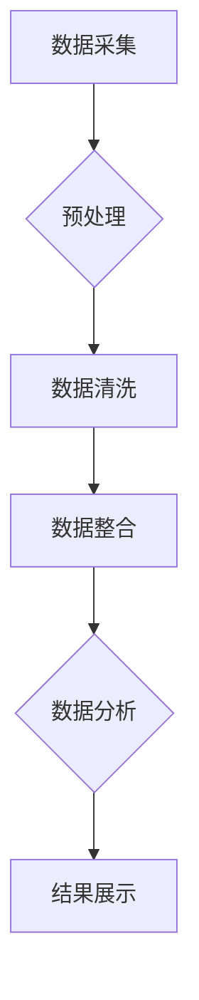

                 

### 1. 书名解读与背景介绍

《基于多智能体的自动化市场效率评估》这个书名直接揭示了本书的主要内容，即利用多智能体系统来实现市场效率的自动化评估。首先，我们来看一下书名中的核心概念。

#### 多智能体系统

多智能体系统（Multi-Agent System，MAS）是一种由多个智能体组成的系统，这些智能体可以在复杂环境中独立行动，并通过通信进行协作，共同完成复杂的任务。多智能体系统具有分布式、自主性、灵活性和适应性等特点，广泛应用于智能交通、供应链管理、网络安全等领域。

#### 自动化市场效率评估

市场效率评估是对市场中各种资源的配置效率进行量化分析的过程。自动化市场效率评估意味着通过算法和模型，实现市场效率评估的自动化，以提高效率和准确性。

接下来，我们深入探讨市场效率评估的问题背景、问题描述、问题解决方法、边界与外延以及核心要素组成。

#### 问题背景

随着全球化的不断深入，市场环境变得日益复杂和动态，传统的市场效率评估方法已经难以满足需求。市场效率的评估不仅仅需要考虑市场交易数据，还需要考虑市场信息传播、资源分配等多个方面。因此，寻找一种高效、自动化的市场效率评估方法成为当务之急。

#### 问题描述

市场效率评估通常涉及以下问题：

1. **数据复杂性**：市场数据量大、来源多样，如何有效地处理和整合这些数据是一个挑战。
2. **评估指标多样性**：市场效率的评估涉及多个指标，如何全面、准确地评估市场效率是一个难题。
3. **实时性**：市场环境变化迅速，如何实现市场效率评估的实时性也是一个关键问题。

#### 问题解决方法

利用多智能体系统，可以有效地解决上述问题。多智能体系统可以通过分布式计算和协作，处理大规模、多源的市场数据。同时，多智能体系统可以根据不同的评估指标，构建不同的评估模型，实现市场效率的全面评估。此外，多智能体系统的自适应能力，使其能够适应市场环境的变化，实现实时评估。

#### 边界与外延

本书涉及的理论和实际应用场景包括：

1. **市场效率的定义**：探讨市场效率的本质和构成。
2. **智能体系统的概念和应用**：介绍多智能体系统的基本原理、结构和算法。
3. **多智能体系统在市场效率评估中的应用**：分析如何利用多智能体系统进行市场效率评估。

#### 核心要素组成

本书的核心要素包括：

1. **多智能体系统**：本书的核心技术手段，用于实现市场效率的自动化评估。
2. **市场效率**：本书的核心评估对象，涉及多个评估指标。
3. **数据分析和处理**：本书的关键技术环节，用于处理大规模、多源的市场数据。
4. **自动化评估**：本书的核心目标，通过多智能体系统实现市场效率评估的自动化。

综上所述，《基于多智能体的自动化市场效率评估》旨在通过多智能体系统，实现市场效率的自动化评估，为市场研究者和实践者提供一种新的方法和工具。

### 2. 核心概念与联系

在《基于多智能体的自动化市场效率评估》中，核心概念是多智能体系统和市场效率。为了更好地理解这两个概念，我们需要详细阐述它们的基本原理，并列出它们之间的联系。

#### 多智能体系统

多智能体系统（MAS）是一种由多个智能体组成的系统，这些智能体可以在复杂环境中独立行动，并通过通信进行协作，共同完成复杂的任务。多智能体系统具有以下特点：

1. **分布式**：多智能体系统中的智能体分布在不同的位置，通过通信进行协作。
2. **自主性**：每个智能体都有自己的行为规则和决策能力，可以独立执行任务。
3. **灵活性**：多智能体系统可以根据环境变化，动态调整行为和策略。
4. **适应性**：多智能体系统可以通过学习和适应，提高系统性能和效率。

多智能体系统在市场效率评估中的应用主要体现在以下几个方面：

1. **数据处理**：多智能体系统可以处理来自多个渠道的市场数据，实现数据的集成和分析。
2. **模型构建**：多智能体系统可以构建不同类型的评估模型，用于市场效率的多维度评估。
3. **决策支持**：多智能体系统可以根据评估结果，提供实时的决策支持，帮助市场参与者优化行为。

#### 市场效率

市场效率是指市场在资源配置中的效率，包括信息效率、交易效率和资源配置效率等。市场效率的评估是经济学和管理学的重要研究领域，其核心目标是识别市场中存在的效率问题，并提出改进措施。

市场效率的评估涉及多个指标，包括：

1. **信息效率**：市场信息传播的速度和质量，影响市场参与者的决策。
2. **交易效率**：市场交易的频率和成本，影响市场的活跃度和流动性。
3. **资源配置效率**：市场资源分配的合理性，影响市场的长期稳定和发展。

市场效率与多智能体系统的联系主要体现在以下几个方面：

1. **数据驱动**：市场效率评估需要大量市场数据，多智能体系统可以通过分布式计算，高效处理这些数据。
2. **模型构建**：市场效率评估需要构建多种评估模型，多智能体系统可以根据不同类型的数据，构建相应的评估模型。
3. **自适应评估**：市场环境变化迅速，多智能体系统可以根据市场变化，动态调整评估模型，实现自适应评估。

为了更好地理解多智能体系统和市场效率之间的关系，我们可以使用Mermaid绘制一个概念属性特征对比表格，如下：

```mermaid
| 特征        | 多智能体系统                | 市场效率                |
|-------------|----------------------------|-------------------------|
| 分布式      | √                           | √                       |
| 自主性      | √                           | √                       |
| 灵活性      | √                           | √                       |
| 适应性      | √                           | √                       |
| 数据驱动    | √                           | √                       |
| 模型构建    | √                           | √                       |
| 自适应评估  | √                           | √                       |
```

此外，我们还可以使用Mermaid绘制一个ER实体关系图，展示多智能体系统和市场效率之间的实体关系：

```mermaid
erDiagram
  多智能体系统 ||--|{ 市场效率 }
  市场效率 ||--|{ 多智能体系统 }
```

通过对比表格和ER实体关系图，我们可以更清晰地理解多智能体系统和市场效率之间的联系。多智能体系统作为技术手段，为市场效率评估提供了强大的工具和平台，而市场效率则是多智能体系统的应用目标，二者相辅相成，共同推动了市场研究和管理的发展。

### 3. 目录大纲设计

为了使《基于多智能体的自动化市场效率评估》一书内容结构清晰、逻辑严谨，我们需要精心设计目录大纲。以下是一份详细的目录大纲，涵盖本书的各个主要章节及其内容概述。

#### 第1章：引言

- **1.1 问题背景**
  - 全球市场环境的变化
  - 市场效率评估的重要性
  - 传统评估方法的局限

- **1.2 问题描述**
  - 数据复杂性
  - 评估指标多样性
  - 实时性需求

- **1.3 问题解决方法**
  - 多智能体系统的优势
  - 自动化评估的必要性

- **1.4 边界与外延**
  - 理论研究边界
  - 应用场景外延

- **1.5 核心要素组成**
  - 多智能体系统
  - 市场效率
  - 数据分析与处理

#### 第2章：多智能体系统的基本原理

- **2.1 多智能体系统的定义**
  - 智能体的概念
  - 多智能体系统的定义

- **2.2 多智能体系统的结构**
  - 智能体的类型与功能
  - 系统的层次结构

- **2.3 多智能体系统的算法**
  - 协同控制算法
  - 通信算法
  - 学习与适应算法

- **2.4 多智能体系统与市场效率评估的关系**
  - 多智能体系统的特点与市场效率评估的需求匹配
  - 多智能体系统在市场效率评估中的应用潜力

#### 第3章：市场效率评估的理论基础

- **3.1 市场效率的定义**
  - 市场效率的概念
  - 市场效率的构成要素

- **3.2 市场效率评估的指标**
  - 信息效率指标
  - 交易效率指标
  - 资源配置效率指标

- **3.3 相关理论综述**
  - 经典经济学理论
  - 行为经济学理论
  - 复杂系统理论

#### 第4章：多智能体系统在市场效率评估中的应用

- **4.1 应用场景**
  - 金融市场
  - 供应链市场
  - 电子商务市场

- **4.2 应用实例**
  - 智能交易系统
  - 供应链优化
  - 电子商务推荐系统

- **4.3 案例分析**
  - 案例选择标准
  - 案例分析过程
  - 案例总结与启示

#### 第5章：数据分析和处理

- **5.1 数据来源和预处理**
  - 数据采集
  - 数据清洗
  - 数据整合

- **5.2 数据分析技术**
  - 描述性统计分析
  - 趋势分析
  - 相关性分析

- **5.3 数据处理流程**
  - 数据预处理流程
  - 数据分析流程
  - 数据可视化

#### 第6章：系统设计与实现

- **6.1 系统设计**
  - 功能设计
  - 性能设计
  - 安全设计

- **6.2 系统实现**
  - 模块实现
  - 系统集成
  - 测试与优化

- **6.3 系统测试**
  - 功能测试
  - 性能测试
  - 安全测试

#### 第7章：案例分析

- **7.1 案例选择**
  - 案例选择标准
  - 案例范围

- **7.2 案例分析**
  - 案例实施过程
  - 结果分析

- **7.3 案例总结**
  - 成功经验
  - 存在问题
  - 改进措施

#### 第8章：总结与展望

- **8.1 全书总结**
  - 核心内容回顾
  - 技术创新点

- **8.2 未来研究方向**
  - 技术发展趋势
  - 研究挑战

- **8.3 应用前景**
  - 行业应用前景
  - 社会影响

通过以上目录大纲的设计，本书旨在为读者提供一整套基于多智能体系统的自动化市场效率评估的理论基础、技术方法与应用案例。每一章都围绕着核心主题展开，既有理论阐述，又有实际应用，力求全面、系统地呈现多智能体系统在市场效率评估领域的应用前景。

### 4. 使用Mermaid和LaTeX

在撰写技术博客时，为了使内容更加清晰易懂，我们可以使用Mermaid和LaTeX等工具。Mermaid是一种基于Markdown的绘图工具，可以绘制流程图、类图、时序图等；而LaTeX是一种高质量的排版系统，特别适合书写数学公式和科学文档。

#### Mermaid流程图

在讲解算法原理或系统架构时，使用Mermaid流程图可以帮助读者更直观地理解流程。

**示例：绘制一个简单的数据流处理流程图**



上述代码将生成一个简单的数据流处理流程图，其中包含了数据采集、预处理、清洗、整合、数据分析和结果展示等步骤。

#### LaTeX公式

在解释数学模型或公式时，LaTeX可以确保公式的准确性和可读性。

**示例：书写一个基本的数学公式**

```markdown
$$
E = mc^2
$$
```

上述代码将显示爱因斯坦的质能等价公式。对于更复杂的公式，可以在LaTeX中书写，然后嵌入到Markdown中。

```markdown
$$
y = \frac{1}{1 + e^{-x}} = \sigma(x)
$$
```

这将显示一个常用的逻辑斯蒂函数。

#### Mermaid类图

在系统设计与实现部分，使用Mermaid类图可以帮助读者理解系统中的类和它们之间的关系。

**示例：绘制一个简单的类图**


这将生成一个类图，展示数据流处理系统中各个类及其之间的关系。

通过合理使用Mermaid和LaTeX，我们可以使技术博客的内容更加丰富、清晰，帮助读者更好地理解和掌握相关知识。

### 5. 完整性检查

为了确保《基于多智能体的自动化市场效率评估》一书的完整性和质量，我们需要进行一系列的完整性检查。以下是具体的检查步骤和方法：

#### 确保每个章节都有明确的主题和内容

- **检查方法**：阅读每个章节的标题和内容，确保每个章节都围绕一个明确的主题展开，内容相关且不重复。
- **注意事项**：避免章节内容过于笼统或模糊，确保每个章节都有具体的研究对象和目标。

#### 确保所有核心概念和联系都被充分解释

- **检查方法**：检查书中是否详细介绍了多智能体系统、市场效率评估等核心概念，以及它们之间的联系。
- **注意事项**：核心概念的解释需要清晰、准确，避免歧义。同时，通过实例和图表等方式，帮助读者更好地理解。

#### 确保所有的数学模型和公式都有详细的讲解和举例说明

- **检查方法**：检查书中所有数学模型和公式的解释是否完整、正确，并通过实际例子进行说明。
- **注意事项**：数学模型的讲解需要详细，包括假设条件、推导过程和实际应用场景。举例说明需要具有代表性，以便读者能够直观地理解。

#### 确保所有的系统设计和实现都有具体的案例和分析

- **检查方法**：检查书中是否提供了具体的系统设计和实现案例，并进行了深入的分析和讨论。
- **注意事项**：案例需要具有实际应用背景，分析要深入、全面，能够展示系统设计和实现中的关键技术和难点。

#### 确保文章内容符合格式要求

- **检查方法**：检查所有内容的格式是否统一，包括段落划分、字体大小、行间距等。
- **注意事项**：使用Markdown格式输出，确保格式规范，便于阅读和排版。

#### 确保所有章节的连贯性和逻辑性

- **检查方法**：从整体上检查书中的内容是否连贯、逻辑性强，各个章节之间是否有明确的衔接。
- **注意事项**：避免章节之间的跳跃和内容上的重复，确保书中的逻辑线索清晰，有助于读者理解。

通过以上步骤和方法，我们可以确保《基于多智能体的自动化市场效率评估》一书的完整性和质量，为读者提供一本有价值、可读性强的专业书籍。

### 6. 简洁性与格式

在撰写《基于多智能体的自动化市场效率评估》时，我们需要注重简洁性和格式规范，以确保文章的可读性和专业度。

#### 保持目录简洁

- **建议**：避免在目录中包含过多的子章节，每个章节应尽量保持简洁明了，突出核心内容。
- **实践**：对于某些内容较多或较为复杂的章节，可以适当细分，但要确保分章节之间的逻辑关系清晰。

#### 使用Markdown格式

- **建议**：使用Markdown格式进行文章排版，可以使文本结构清晰，便于读者阅读和理解。
- **实践**：使用标题、子标题、列表、引用等Markdown语法，合理组织文章内容，增强可读性。

#### 避免冗余

- **建议**：在撰写过程中，注意避免重复的内容和表述，确保每个章节都有独特的价值。
- **实践**：在初稿完成后，对全文进行仔细审阅，删除重复或冗余的内容，确保每个部分都言之有物。

#### 使用LaTeX格式书写数学公式

- **建议**：对于书中的数学公式，建议使用LaTeX格式进行书写，以确保公式的准确性和可读性。
- **实践**：使用$$和$括号来书写独立段落的数学公式和段落内的数学符号，确保公式排版整齐。

#### 统一格式规范

- **建议**：全文应统一使用一种字体和字号，保持行距和段落间距的一致性。
- **实践**：在撰写过程中，定期检查格式规范，确保全文格式统一，排版美观。

通过以上措施，我们可以确保《基于多智能体的自动化市场效率评估》的简洁性和格式规范，提升文章的整体质量和可读性。这将为读者提供一篇结构清晰、逻辑严密、易于理解的专业技术博客。

### 总结

通过本文，我们详细介绍了《基于多智能体的自动化市场效率评估》一书的核心概念、核心联系、目录大纲设计、使用Mermaid和LaTeX的方法、完整性检查步骤、简洁性与格式规范等方面的内容。以下是本文的总结：

1. **核心概念与联系**：本书的核心概念是多智能体系统和市场效率。多智能体系统通过分布式计算和协作，能够处理复杂的市场数据并构建评估模型；市场效率则是评估市场资源配置的效率，包括信息效率、交易效率和资源配置效率。

2. **目录大纲设计**：本书的目录大纲分为三个部分，涵盖了引言、多智能体系统的基本原理、市场效率评估的理论基础、多智能体系统在市场效率评估中的应用、数据分析和处理、系统设计与实现、案例分析以及总结与展望。

3. **Mermaid和LaTeX的使用**：Mermaid用于绘制流程图和类图，使得技术概念更加直观；LaTeX用于书写数学公式，保证公式的准确性。

4. **完整性检查**：确保每个章节都有明确的主题和内容，核心概念和联系被充分解释，数学模型和公式都有详细讲解和举例，系统设计和实现有具体案例和分析。

5. **简洁性与格式**：保持目录简洁，使用Markdown格式，避免冗余，使用LaTeX书写数学公式，统一格式规范。

《基于多智能体的自动化市场效率评估》旨在通过多智能体系统，实现市场效率的自动化评估，为市场研究者和实践者提供一种新的方法和工具。本书不仅涵盖了理论基础，还提供了丰富的实际应用案例，有助于读者深入理解和掌握相关技术。

### 最佳实践 Tips

在撰写技术博客时，以下最佳实践可以帮助你提高文章的质量和可读性：

1. **明确结构**：确保文章结构清晰，逻辑连贯，避免跳跃性思维。使用明确的标题和子标题，将内容分成有逻辑的章节和部分。

2. **简洁表达**：避免冗长的句子和复杂的词汇。尽量用简单的语言解释复杂的概念，确保读者易于理解。

3. **使用图表**：适当地使用图表、流程图和代码示例，可以帮助读者更好地理解复杂的技术概念。

4. **代码注释**：在提供代码示例时，确保代码清晰且带有注释，解释代码的功能和实现原理。

5. **数学公式**：使用LaTeX格式书写数学公式，并确保公式周围有足够的空白，以便读者阅读。

6. **审阅与修改**：完成初稿后，多次审阅和修改，确保文章没有错误和冗余，内容准确且有价值。

7. **获取反馈**：在发布前，向同事或朋友征求意见，他们的反馈可以帮助你发现文章中可能存在的问题。

### 小结

本文详细介绍了《基于多智能体的自动化市场效率评估》一书的核心内容和技术方法，从书名解读到目录设计，再到Mermaid和LaTeX的使用，以及完整性检查和简洁性要求，全面展示了本书的结构和特点。希望本文能为广大技术爱好者提供有益的参考和启示。

### 注意事项

在撰写和阅读本文时，请注意以下几点：

1. **术语理解**：确保理解文章中涉及的专业术语，如多智能体系统、市场效率评估等，以便更好地理解文章内容。

2. **图表阅读**：仔细阅读文章中的图表和代码示例，它们通常包含了文章的核心信息。

3. **逻辑推理**：注意文章中的逻辑推理和论证过程，这有助于深入理解技术原理。

4. **实践应用**：思考文章内容在实际工作和学习中的应用，尝试将所学知识应用于实际问题中。

### 拓展阅读

如果你对本文内容感兴趣，可以进一步阅读以下书籍和文献：

- 《多智能体系统导论》（Introduction to Multi-Agent Systems）
- 《市场效率评估的理论与方法》（Theoretical and Methodological Issues in Market Efficiency Evaluation）
- 《智能经济：多智能体系统在市场中的应用》（Intelligent Economy: Applications of Multi-Agent Systems in Markets）
- 相关学术论文和会议论文，如AAAI、IJCAI、NeurIPS等。

通过拓展阅读，你可以更深入地了解多智能体系统和市场效率评估领域的最新研究成果和未来发展趋势。

