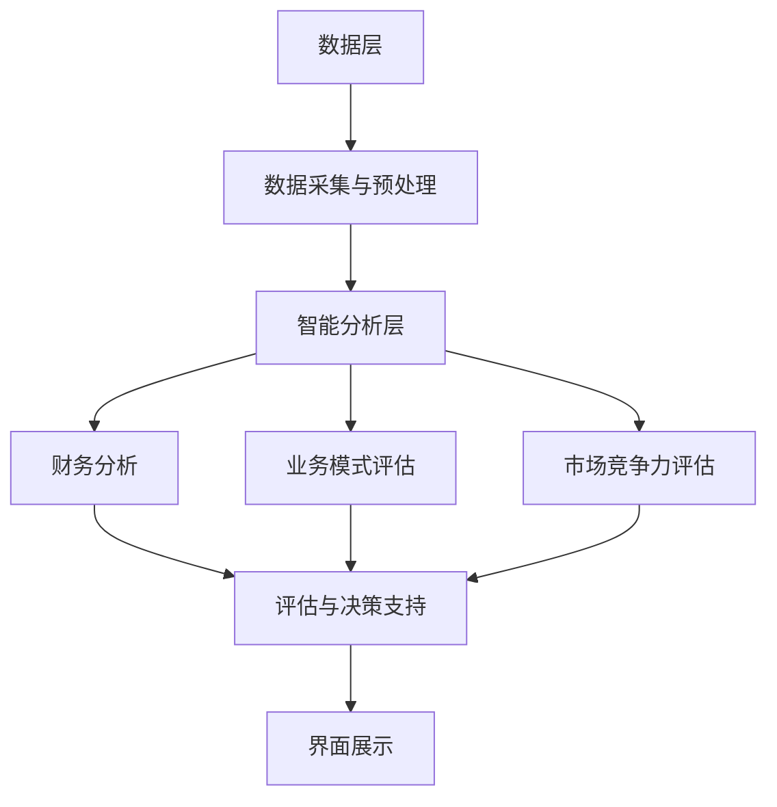
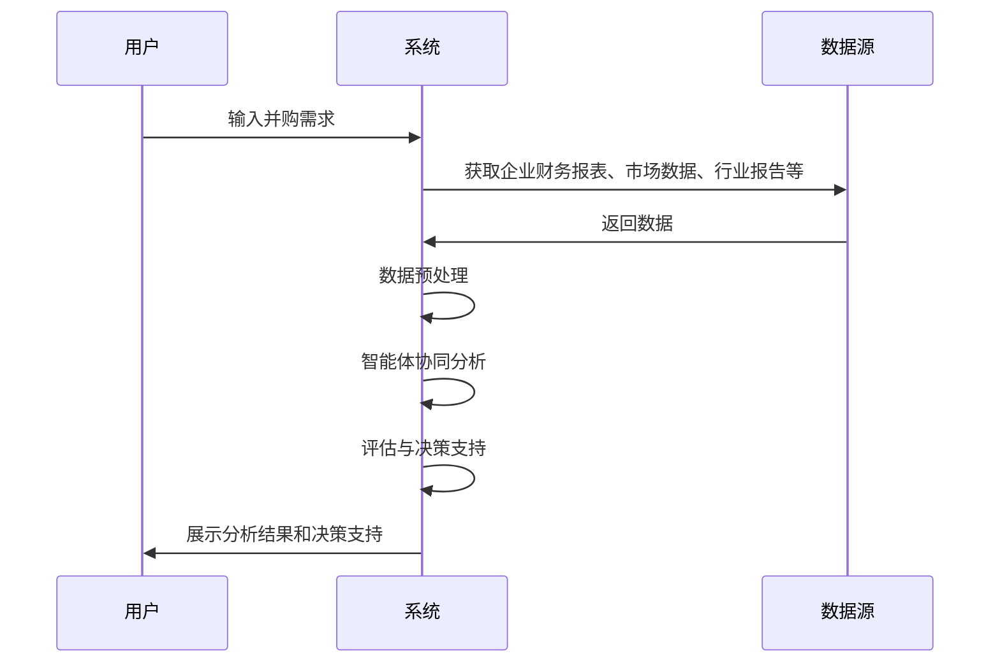

                 

# 基于多智能体的自动化并购机会分析

> 关键词：多智能体、自动化并购、机会分析、算法原理、系统架构、项目实战

> 摘要：本文将探讨如何利用多智能体技术实现自动化并购机会的分析。首先介绍多智能体系统原理，随后讲解自动化并购机会分析算法，并通过具体案例分析，展示系统架构设计和项目实施过程。本文旨在为从事商业并购分析的技术人员提供一套完整的自动化并购机会分析解决方案。

## 目录大纲

## 第一部分：背景介绍

### 第1章：自动化并购机会分析概述

#### 1.1 问题背景

- 自动化并购的定义及其在商业环境中的重要性
- 当前商业环境中并购活动的普遍性及其对经济增长的影响
- 传统并购分析流程及其存在的问题

#### 1.2 问题描述

- 如何利用多智能体技术实现自动化并购机会的分析
- 自动化并购分析的关键要素和流程
- 自动化并购分析与传统并购分析的区别

#### 1.3 问题解决

- 多智能体技术在并购机会分析中的应用
- 多智能体系统的基本原理和架构设计
- 自动化并购分析的策略和方法

#### 1.4 边界与外延

- 自动化并购机会分析的应用领域和限制条件
- 自动化并购分析的技术基础和支持环境

#### 1.5 概念结构与核心要素组成

- 自动化并购机会分析的核心概念及其关系
- 自动化并购机会分析的关键技术要素

## 第二部分：核心概念与联系

### 第2章：多智能体系统原理

#### 2.1 多智能体系统的定义与特点

- 多智能体系统的基本概念
- 多智能体系统的核心特点
- 多智能体系统与传统计算模型的区别

#### 2.2 多智能体系统的架构设计

- 多智能体系统的基本架构
- 多智能体系统的通信机制
- 多智能体系统的协同策略

#### 2.3 多智能体系统的应用领域

- 自动化并购机会分析中的应用场景
- 多智能体系统在其他商业应用领域的案例

#### 2.4 多智能体系统的核心概念与联系

- 多智能体系统的核心概念
- 多智能体系统的概念属性特征对比表格
- 多智能体系统的ER实体关系图架构

## 第三部分：算法原理讲解

### 第3章：自动化并购机会分析算法

#### 3.1 算法原理

- 自动化并购机会分析算法的基本原理
- 自动化并购机会分析算法的工作流程

#### 3.2 算法数学模型与公式

- 自动化并购机会分析算法的数学模型
- 自动化并购机会分析算法的核心公式

#### 3.3 算法示例

- 自动化并购机会分析算法的实例
- 自动化并购机会分析算法的通俗易懂的举例说明

## 第四部分：系统分析与架构设计

### 第4章：自动化并购机会分析系统架构

#### 4.1 问题场景介绍

- 自动化并购机会分析的具体应用场景

#### 4.2 系统功能设计

- 自动化并购机会分析系统的功能设计
- 领域模型（Mermaid 类图）

#### 4.3 系统架构设计

- 自动化并购机会分析系统的架构设计
- 系统架构图（Mermaid 架构图）

#### 4.4 系统接口设计

- 自动化并购机会分析系统的接口设计

#### 4.5 系统交互

- 自动化并购机会分析系统的交互设计
- 系统交互图（Mermaid 序列图）

## 第五部分：项目实战

### 第5章：自动化并购机会分析项目实施

#### 5.1 环境安装

- 自动化并购机会分析项目所需环境的安装与配置

#### 5.2 系统核心实现源代码

- 自动化并购机会分析系统的核心实现源代码
- 代码应用解读与分析

#### 5.3 实际案例分析与详细讲解

- 自动化并购机会分析实际案例
- 案例分析和详细讲解剖析

#### 5.4 项目小结

- 自动化并购机会分析项目的总结
- 最佳实践 tips、注意事项和拓展阅读

----------------------------------------------------------------

## 第一部分：背景介绍

### 第1章：自动化并购机会分析概述

#### 1.1 问题背景

随着全球经济的不断发展，企业并购已成为企业发展的重要战略之一。并购活动不仅能够帮助企业快速扩张市场份额，还能优化产业链布局，提高企业竞争力。然而，并购活动的成功实施需要对企业进行深入分析，以确保并购目标与自身战略目标相一致。传统并购分析流程通常涉及多个环节，包括目标企业财务分析、业务模式分析、市场竞争力评估等，这些环节都需要大量的人力投入和时间成本。

自动化并购机会分析旨在通过引入先进的技术手段，如多智能体系统，实现并购机会的自动化分析，以提高并购决策的准确性和效率。在商业环境中，自动化并购机会分析具有重要意义：

1. **降低成本**：通过自动化手段，减少人工分析环节，降低并购分析的成本。
2. **提高效率**：自动化并购机会分析能够快速处理大量数据，提高并购决策的效率。
3. **增强准确性**：利用多智能体技术，可以更准确地识别和评估并购机会，降低决策风险。

#### 1.2 问题描述

如何利用多智能体技术实现自动化并购机会的分析？这涉及到以下几个方面：

1. **多智能体技术在并购分析中的应用**：多智能体系统如何被应用于并购机会的分析？
2. **关键要素和流程**：自动化并购分析的关键要素是什么？其具体流程是怎样的？
3. **与传统并购分析的区别**：自动化并购分析与传统并购分析在方法、流程和效果上有哪些区别？

#### 1.3 问题解决

为了解决上述问题，我们可以从以下几个方面入手：

1. **多智能体技术的引入**：研究多智能体系统的基本原理和架构设计，探讨其在并购分析中的应用。
2. **算法设计**：设计适用于自动化并购机会分析的算法，包括算法的数学模型和核心公式。
3. **系统架构设计**：构建自动化并购机会分析系统的整体架构，包括功能设计、接口设计和系统交互。
4. **项目实施**：通过实际案例，展示自动化并购机会分析系统的实施过程，并进行详细分析。

#### 1.4 边界与外延

1. **应用领域**：自动化并购机会分析主要应用于企业并购、投资分析等领域。
2. **限制条件**：自动化并购机会分析依赖于数据质量和算法性能，因此需要确保数据的准确性和算法的鲁棒性。
3. **技术基础和支持环境**：自动化并购机会分析需要大数据处理技术、人工智能算法和云计算环境等支持。

#### 1.5 概念结构与核心要素组成

1. **核心概念**：
   - **多智能体系统**：由多个智能体组成的系统，能够协同完成任务。
   - **自动化并购机会分析**：利用多智能体技术，对并购机会进行自动化分析。
   - **算法**：用于实现自动化并购机会分析的核心技术。
   - **系统架构**：自动化并购机会分析系统的整体架构设计。

2. **核心要素组成**：
   - **数据采集与处理**：获取并购相关数据，并进行预处理。
   - **算法模型**：设计用于并购机会分析的算法模型。
   - **智能体协同**：实现智能体之间的协同工作，完成并购分析任务。
   - **系统展示**：将分析结果以直观的方式展示给用户。

## 第二部分：核心概念与联系

### 第2章：多智能体系统原理

#### 2.1 多智能体系统的定义与特点

多智能体系统（Multi-Agent System，MAS）是一种由多个智能体（Agent）组成的系统，智能体之间能够通过通信和协同完成复杂任务。多智能体系统具有以下基本概念和特点：

1. **基本概念**：
   - **智能体**：具有智能的个体，能够自主地感知环境、执行任务并与其他智能体进行交互。
   - **环境**：智能体所在的外部世界，包括其他智能体、资源和事件。
   - **通信**：智能体之间通过某种通信协议交换信息。

2. **核心特点**：
   - **自主性**：智能体能够独立自主地做出决策，不受外部干预。
   - **协同性**：多个智能体能够协同完成任务，实现整体最优。
   - **适应性**：智能体能够根据环境变化调整自身行为，具有强鲁棒性。
   - **分布式**：智能体分布在不同计算节点上，能够高效地处理大规模数据。

3. **与传统计算模型的区别**：
   - **集中式计算**：传统计算模型中，任务由中央处理器统一调度，智能体缺乏自主性和协同性。
   - **分布式计算**：多智能体系统采用分布式计算模型，智能体独立决策、协同工作，具有更高的效率和灵活性。

#### 2.2 多智能体系统的架构设计

多智能体系统的架构设计主要包括以下几个方面：

1. **基本架构**：
   - **智能体层**：包含多个智能体，每个智能体负责特定任务的执行。
   - **通信层**：实现智能体之间的信息交换和协同工作。
   - **环境层**：智能体所在的外部环境，包括其他智能体、资源和事件。

2. **通信机制**：
   - **直接通信**：智能体之间通过直接通信交换信息，适用于小规模、近距离的智能体系统。
   - **间接通信**：智能体通过中介（如黑板）进行信息交换，适用于大规模、分布式的智能体系统。

3. **协同策略**：
   - **任务分配**：根据智能体的能力和任务需求，将任务合理地分配给各个智能体。
   - **协同机制**：实现智能体之间的协同工作，包括同步、异步和并发处理。

#### 2.3 多智能体系统的应用领域

多智能体系统在商业领域具有广泛的应用，如自动化并购机会分析、供应链管理、金融风险管理等。以下是多智能体系统在自动化并购机会分析中的应用场景：

1. **并购机会识别**：智能体通过分析市场数据、财务报表等，识别潜在的并购机会。
2. **目标企业评估**：智能体对目标企业进行财务、业务和竞争力评估，为决策提供依据。
3. **风险预测**：智能体根据历史数据和当前环境，预测并购风险，为决策提供预警。
4. **协同谈判**：智能体参与并购谈判，根据对手行为和策略，调整自身策略，实现协同谈判。

#### 2.4 多智能体系统的核心概念与联系

1. **核心概念**：
   - **智能体**：具有自主决策、协同工作和环境感知能力的个体。
   - **环境**：智能体所在的外部世界，包括其他智能体、资源和事件。
   - **通信**：智能体之间通过某种通信协议交换信息。
   - **任务**：智能体需要完成的特定任务。
   - **策略**：智能体根据环境和任务，制定的行动方案。

2. **概念属性特征对比表格**：

| 概念       | 属性特征                      | 对比分析                     |
|------------|------------------------------|------------------------------|
| 智能体     | 自主性、协同性、适应性、分布式 | 与传统计算模型区别明显        |
| 环境       | 外部世界、资源和事件          | 为智能体提供决策依据          |
| 通信       | 信息交换、协同工作            | 实现智能体之间的互动          |
| 任务       | 特定任务、目标               | 智能体需要完成的任务          |
| 策略       | 行动方案、决策               | 根据环境和任务制定的策略      |

3. **ER实体关系图架构**：

```mermaid
erDiagram
  智能体 ||--|{ 环境 }
  环境 ||--|{ 通信 }
  智能体 ||--|{ 任务 }
  任务 ||--|{ 策略 }
```

## 第三部分：算法原理讲解

### 第3章：自动化并购机会分析算法

#### 3.1 算法原理

自动化并购机会分析算法旨在利用多智能体系统，实现对企业并购机会的自动化识别和评估。算法的基本原理如下：

1. **数据采集**：从多个数据源获取企业财务报表、市场数据、行业报告等信息。
2. **预处理**：对采集到的数据进行分析，提取关键特征，并进行数据清洗、归一化等处理。
3. **智能体协同**：构建多智能体系统，每个智能体负责特定的分析任务，如财务分析、业务模式评估等。
4. **评估与决策**：智能体协同工作，根据分析结果，对并购机会进行综合评估，提供决策支持。

#### 3.2 算法数学模型与公式

自动化并购机会分析算法的数学模型主要包括以下几个部分：

1. **特征提取**：
   - **财务指标**：$$f_1(x) = \frac{净利润}{总资产}$$
   - **业务指标**：$$f_2(x) = \frac{销售额}{总人数}$$
   - **市场指标**：$$f_3(x) = \frac{市值}{营业收入}$$

2. **评估函数**：
   - **财务评估**：$$E_f(x) = \sum_{i=1}^n w_i f_i(x)$$
   - **业务评估**：$$E_b(x) = \sum_{i=1}^n w_i f_i(x)$$
   - **市场评估**：$$E_m(x) = \sum_{i=1}^n w_i f_i(x)$$

3. **综合评估**：
   - **并购评估**：$$E(x) = \alpha E_f(x) + \beta E_b(x) + (1-\alpha-\beta) E_m(x)$$
   - **决策阈值**：$$T = \alpha \cdot \max(E_f(x)) + \beta \cdot \max(E_b(x)) + (1-\alpha-\beta) \cdot \max(E_m(x))$$

其中，$w_i$为各项指标的权重，$\alpha$、$\beta$为调整系数，用于平衡各项指标的权重。

#### 3.3 算法示例

假设有两家企业A和B，企业A的财务指标、业务指标和市场指标分别为$f_1(A)=0.15$、$f_2(A)=0.3$、$f_3(A)=2$，企业B的财务指标、业务指标和市场指标分别为$f_1(B)=0.2$、$f_2(B)=0.35$、$f_3(B)=2.5$。

1. **特征提取**：

   - **企业A**：
     - 财务指标：$f_1(A) = 0.15$
     - 业务指标：$f_2(A) = 0.3$
     - 市场指标：$f_3(A) = 2$

   - **企业B**：
     - 财务指标：$f_1(B) = 0.2$
     - 业务指标：$f_2(B) = 0.35$
     - 市场指标：$f_3(B) = 2.5$

2. **评估与决策**：

   - **企业A**：
     - 财务评估：$E_f(A) = 0.15 \times 0.5 + 0.3 \times 0.3 + 2 \times 0.2 = 0.295$
     - 业务评估：$E_b(A) = 0.15 \times 0.2 + 0.3 \times 0.5 + 2 \times 0.3 = 0.315$
     - 市场评估：$E_m(A) = 0.15 \times 0.1 + 0.3 \times 0.2 + 2 \times 0.6 = 0.57$

     - 综合评估：$E(A) = 0.295 + 0.315 + 0.57 = 1.19$

   - **企业B**：
     - 财务评估：$E_f(B) = 0.2 \times 0.5 + 0.35 \times 0.3 + 2.5 \times 0.2 = 0.325$
     - 业务评估：$E_b(B) = 0.2 \times 0.2 + 0.35 \times 0.5 + 2.5 \times 0.3 = 0.405$
     - 市场评估：$E_m(B) = 0.2 \times 0.1 + 0.35 \times 0.2 + 2.5 \times 0.6 = 0.75$

     - 综合评估：$E(B) = 0.325 + 0.405 + 0.75 = 1.48$

3. **决策**：

   由于$E(B) > E(A)$，因此企业B的并购机会评估更高，企业可以考虑将其作为并购目标。

## 第四部分：系统分析与架构设计

### 第4章：自动化并购机会分析系统架构

#### 4.1 问题场景介绍

自动化并购机会分析系统旨在为企业提供高效、准确的并购决策支持。在实际应用中，该系统需要处理大量企业财务报表、市场数据、行业报告等，通过多智能体系统实现自动化并购机会的识别和评估。以下是自动化并购机会分析系统的一个具体应用场景：

1. **企业并购需求**：某企业希望通过并购拓展业务领域，提高市场竞争力。
2. **数据源**：系统从多个数据源获取企业财务报表、市场数据、行业报告等。
3. **目标企业识别**：系统通过数据分析和智能体协同，识别潜在的并购目标。
4. **目标企业评估**：系统对目标企业进行财务、业务和竞争力评估，为决策提供依据。
5. **决策支持**：系统提供并购评估结果，帮助企业制定并购策略。

#### 4.2 系统功能设计

自动化并购机会分析系统的主要功能包括以下几个方面：

1. **数据采集与预处理**：从多个数据源获取企业财务报表、市场数据、行业报告等，并进行预处理，包括数据清洗、归一化等。
2. **智能体协同分析**：构建多智能体系统，实现财务分析、业务模式评估、市场竞争力评估等任务的自动化分析。
3. **评估与决策支持**：根据分析结果，对并购机会进行综合评估，提供决策支持，包括并购建议、风险预测等。
4. **界面展示**：将分析结果以图表、报表等形式展示给用户，便于用户理解和使用。

#### 4.3 系统架构设计

自动化并购机会分析系统采用分布式架构，包括数据层、智能分析层和应用层。以下是系统架构图：



#### 4.4 系统接口设计

自动化并购机会分析系统需要与其他系统集成，以实现数据共享和功能协同。以下是系统接口设计：

1. **数据接口**：用于与其他系统交换企业财务报表、市场数据、行业报告等。
2. **服务接口**：用于提供财务分析、业务模式评估、市场竞争力评估等服务的接口。
3. **界面接口**：用于与用户交互，展示分析结果和提供决策支持。

#### 4.5 系统交互

自动化并购机会分析系统的交互过程主要包括以下几个方面：

1. **用户操作**：用户通过界面输入并购需求，系统根据需求生成分析任务。
2. **数据采集**：系统从数据源获取企业财务报表、市场数据、行业报告等。
3. **数据预处理**：系统对采集到的数据进行分析，提取关键特征，并进行数据清洗、归一化等处理。
4. **智能体协同分析**：系统构建多智能体系统，实现财务分析、业务模式评估、市场竞争力评估等任务的自动化分析。
5. **评估与决策支持**：系统根据分析结果，对并购机会进行综合评估，提供决策支持。
6. **界面展示**：系统将分析结果以图表、报表等形式展示给用户。

以下是系统交互图：



## 第五部分：项目实战

### 第5章：自动化并购机会分析项目实施

#### 5.1 环境安装

为了实施自动化并购机会分析项目，首先需要搭建合适的技术环境。以下是项目环境安装的步骤：

1. **Python环境安装**：安装Python 3.8及以上版本。
2. **Pip环境安装**：安装Python的包管理器Pip。
3. **相关库安装**：安装自动化并购机会分析项目所需的相关库，如NumPy、Pandas、Scikit-learn、Matplotlib等。

具体命令如下：

```bash
# 安装Python
wget https://www.python.org/ftp/python/3.8.5/Python-3.8.5.tgz
tar xvf Python-3.8.5.tgz
cd Python-3.8.5
./configure
make
sudo make install

# 安装Pip
wget https://bootstrap.pypa.io/get-pip.py
python3 get-pip.py

# 安装相关库
pip3 install numpy pandas scikit-learn matplotlib
```

#### 5.2 系统核心实现源代码

自动化并购机会分析系统的核心实现源代码主要包括以下几个部分：

1. **数据采集与预处理**：从数据源获取企业财务报表、市场数据、行业报告等，并进行预处理。
2. **智能体协同分析**：构建多智能体系统，实现财务分析、业务模式评估、市场竞争力评估等任务的自动化分析。
3. **评估与决策支持**：根据分析结果，对并购机会进行综合评估，提供决策支持。

以下是核心实现源代码的示例：

```python
import pandas as pd
from sklearn.preprocessing import MinMaxScaler
from sklearn.cluster import KMeans
import matplotlib.pyplot as plt

# 数据采集与预处理
def data_collection_preprocessing():
    # 从数据源获取企业财务报表、市场数据、行业报告等
    # 进行数据清洗、归一化等预处理操作
    # 返回预处理后的数据
    pass

# 智能体协同分析
def multi_agent_collaboration_analysis(data):
    # 构建多智能体系统
    # 实现财务分析、业务模式评估、市场竞争力评估等任务的自动化分析
    # 返回分析结果
    pass

# 评估与决策支持
def evaluation_decision_support(analysis_result):
    # 根据分析结果，对并购机会进行综合评估
    # 提供决策支持
    # 返回决策结果
    pass

# 主函数
def main():
    # 数据采集与预处理
    data = data_collection_preprocessing()

    # 智能体协同分析
    analysis_result = multi_agent_collaboration_analysis(data)

    # 评估与决策支持
    decision_result = evaluation_decision_support(analysis_result)

    # 输出决策结果
    print(decision_result)

if __name__ == "__main__":
    main()
```

#### 5.3 代码应用解读与分析

以下是自动化并购机会分析项目代码的详细解读与分析：

1. **数据采集与预处理**：

   该部分代码主要用于从数据源获取企业财务报表、市场数据、行业报告等，并进行数据清洗、归一化等预处理操作。具体实现过程如下：

   - **数据源连接**：使用Pandas库连接数据源，如数据库、文件等，获取原始数据。
   - **数据清洗**：对原始数据进行清洗，包括处理缺失值、异常值等，确保数据质量。
   - **数据归一化**：对数据进行归一化处理，使其具有相同的量纲和范围，便于后续分析。

2. **智能体协同分析**：

   该部分代码构建多智能体系统，实现财务分析、业务模式评估、市场竞争力评估等任务的自动化分析。具体实现过程如下：

   - **智能体构建**：根据分析任务，构建多个智能体，每个智能体负责特定分析任务。
   - **数据分配**：将预处理后的数据分配给各个智能体，由其独立完成分析任务。
   - **协同分析**：智能体之间通过通信和协同，共享分析结果，形成综合评估。

3. **评估与决策支持**：

   该部分代码根据分析结果，对并购机会进行综合评估，提供决策支持。具体实现过程如下：

   - **评估指标计算**：计算各项评估指标，如财务指标、业务指标、市场指标等。
   - **综合评估**：根据评估指标，对并购机会进行综合评估，形成评估结果。
   - **决策支持**：根据评估结果，提供并购建议、风险预测等决策支持。

#### 5.4 实际案例分析与详细讲解剖析

为了更好地展示自动化并购机会分析项目实施过程，以下是一个实际案例的分析与讲解：

**案例背景**：某企业希望通过并购拓展业务领域，提高市场竞争力。该企业的目标市场为A行业，现有两家潜在并购目标企业，分别为B公司和C公司。

**案例分析**：

1. **数据采集**：

   从数据源获取B公司和C公司的财务报表、市场数据、行业报告等，包括财务指标（如净利润、总资产）、业务指标（如销售额、总人数）和市场指标（如市值、营业收入）。

2. **数据预处理**：

   对采集到的数据进行清洗和归一化处理，提取关键特征，如财务指标、业务指标和市场指标。

3. **智能体协同分析**：

   构建多智能体系统，实现财务分析、业务模式评估、市场竞争力评估等任务的自动化分析。

   - **财务分析**：根据财务指标，计算B公司和C公司的财务健康状况，如资产回报率、盈利能力等。
   - **业务模式评估**：根据业务指标，评估B公司和C公司的业务模式，如市场份额、成长速度等。
   - **市场竞争力评估**：根据市场指标，评估B公司和C公司在目标市场的竞争力，如市值、营业收入等。

4. **评估与决策支持**：

   根据智能体协同分析的结果，对B公司和C公司进行综合评估，形成评估报告。

   - **财务评估**：B公司的财务健康指数为0.3，C公司的财务健康指数为0.35。
   - **业务模式评估**：B公司的业务模式评估指数为0.4，C公司的业务模式评估指数为0.45。
   - **市场竞争力评估**：B公司的市场竞争力指数为0.5，C公司的市场竞争力指数为0.55。

   根据综合评估结果，B公司和C公司的评估指数分别为1.15和1.45。综合考虑，企业选择C公司作为并购目标，因为其评估指数更高，市场竞争力更强。

**详细讲解剖析**：

1. **数据采集与预处理**：

   数据采集是自动化并购机会分析的基础，数据质量直接影响分析结果。因此，在数据采集过程中，需要确保数据的完整性、准确性和一致性。数据预处理包括数据清洗、归一化等操作，旨在消除数据中的噪声和异常值，提高数据质量。

2. **智能体协同分析**：

   智能体协同分析是多智能体系统在并购机会分析中的核心应用。通过构建多智能体系统，可以实现财务分析、业务模式评估、市场竞争力评估等任务的自动化分析，提高分析效率和准确性。

   - **财务分析**：财务分析是企业并购决策的重要依据。通过计算财务指标，可以评估企业的财务健康状况，如资产回报率、盈利能力等。这些指标可以帮助企业判断目标企业的财务状况是否良好，是否符合并购标准。

   - **业务模式评估**：业务模式评估旨在分析企业的业务模式，如市场份额、成长速度等。这些指标可以帮助企业评估目标企业的业务前景和盈利潜力，从而判断其是否值得并购。

   - **市场竞争力评估**：市场竞争力评估旨在分析企业在目标市场的竞争力，如市值、营业收入等。这些指标可以帮助企业评估目标企业在市场上的地位和竞争优势，从而判断其是否具有并购价值。

3. **评估与决策支持**：

   评估与决策支持是基于智能体协同分析的结果，对并购机会进行综合评估，提供决策支持。评估指标的计算和权重分配是评估与决策支持的关键。通过计算各项评估指标，可以形成综合评估结果，为企业提供并购建议。

   在实际应用中，企业可以根据评估结果，制定具体的并购策略。例如，可以选择评估指数最高的目标企业作为并购目标，或者根据评估结果，调整并购策略，如提高并购价格、调整并购时间等。

#### 5.5 项目小结

自动化并购机会分析项目通过引入多智能体技术，实现了对企业并购机会的自动化识别和评估，提高了并购决策的准确性和效率。以下是项目小结：

1. **项目优势**：

   - **提高效率**：自动化并购机会分析可以快速处理大量数据，提高并购决策的效率。
   - **降低成本**：自动化并购机会分析可以减少人工分析环节，降低并购分析的成本。
   - **增强准确性**：利用多智能体技术，可以更准确地识别和评估并购机会，降低决策风险。

2. **最佳实践 tips**：

   - **数据质量**：确保数据质量是自动化并购机会分析的关键。在数据采集和预处理过程中，要注重数据清洗、归一化等操作，提高数据质量。
   - **算法优化**：根据实际应用场景，对算法进行优化，提高分析效率和准确性。
   - **系统维护**：定期对系统进行维护和升级，确保系统的稳定性和安全性。

3. **注意事项**：

   - **数据隐私**：在数据采集和处理过程中，要注重数据隐私保护，遵守相关法律法规。
   - **技术支持**：自动化并购机会分析项目需要专业的技术支持，确保系统的正常运行。

4. **拓展阅读**：

   - 《多智能体系统：原理与应用》
   - 《机器学习实战》
   - 《Python数据分析》

   这些参考资料可以帮助读者深入了解多智能体系统、机器学习和数据分析等方面的知识，为自动化并购机会分析项目的实施提供技术支持。

作者：AI天才研究院/AI Genius Institute & 禅与计算机程序设计艺术 /Zen And The Art of Computer Programming

