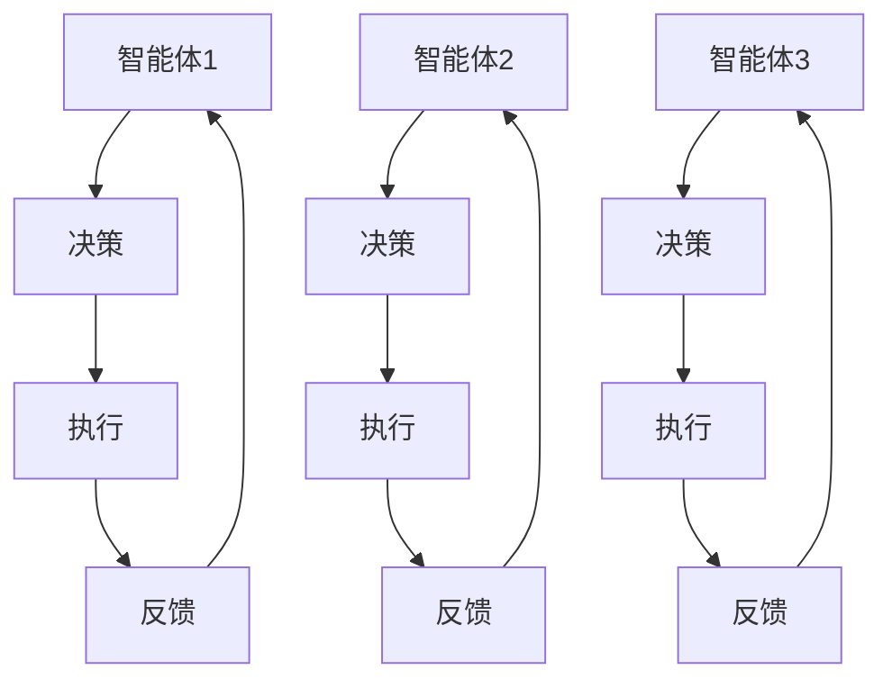
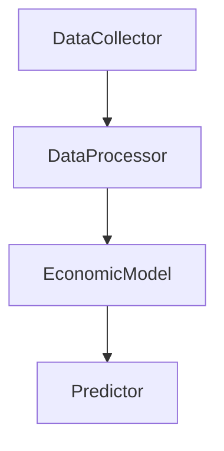
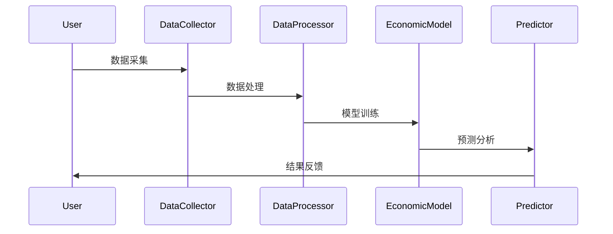
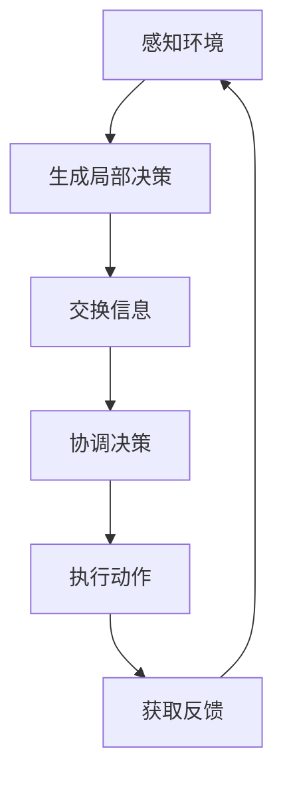
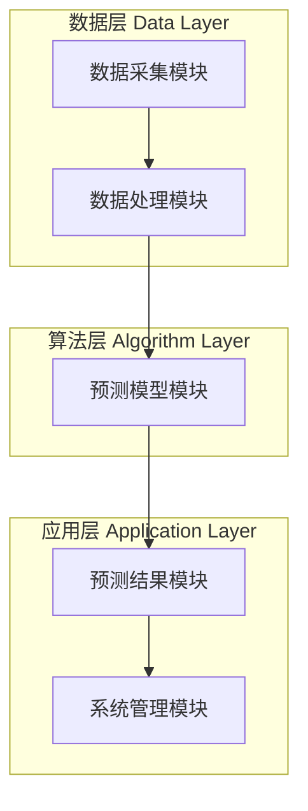
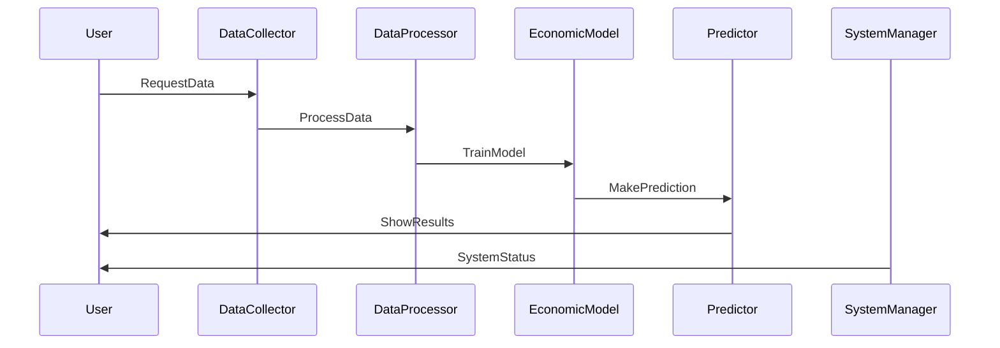

                 


## 基于多智能体的自动化经济周期定位

### 关键词
- 多智能体系统
- 自动化经济周期定位
- 算法原理
- 数学模型
- 系统架构
- 实战应用

### 摘要
本文将深入探讨基于多智能体的自动化经济周期定位技术，通过逻辑清晰、结构紧凑的分析，揭示这一领域的核心概念、算法原理、数学模型和系统架构。文章将分四个部分展开：背景与基础、算法原理与数学模型、系统分析与架构设计、项目实战。我们将一步一步地分析推理，以通俗易懂的方式，让读者深入了解这一前沿技术的本质和应用。

## 基于多智能体的自动化经济周期定位

### 第一部分：背景与基础

#### 第1章：问题背景与介绍
在经济全球化的大背景下，经济周期的准确定位对于企业和政府决策具有重要意义。然而，传统的经济周期预测方法往往依赖于大量的统计数据和历史分析，存在实时性不足、预测精度低等问题。为了解决这一问题，基于多智能体的自动化经济周期定位技术应运而生。

**1.1 问题背景**
- 经济周期的波动对企业和市场产生深远影响，如经济增长、通货膨胀、就业率等。
- 传统预测方法的局限性：数据依赖、预测滞后、模型复杂。

**1.2 问题定义**
- 自动化经济周期定位：通过智能算法，实时监测和分析经济数据，预测经济周期的变化趋势。
- 目标：提高经济周期预测的准确性和实时性。

**1.3 问题解决**
- 利用多智能体系统，实现数据的分布式处理和分析。
- 引入机器学习和人工智能算法，提高预测的准确度。

**1.4 边界与外延**
- 边界：主要研究经济周期预测的技术和方法。
- 外延：涉及经济数据分析、机器学习算法应用等领域。

**1.5 核心概念**
- 多智能体系统：由多个独立智能体组成的系统，每个智能体可以自主决策和协同工作。
- 自动化经济周期定位：结合多智能体系统和经济周期预测模型，实现自动化经济周期分析。

**1.6 概念结构与核心要素组成**
- 多智能体系统：智能体、通信网络、协同算法。
- 自动化经济周期定位：数据采集、处理、预测、反馈。

#### 第2章：多智能体系统概述
多智能体系统（MAS）是分布式人工智能的一个重要分支，具有自主性、协作性和适应性等特点。

**2.1 多智能体系统定义**
- 多智能体系统：由多个具有自主性、协作性和自适应性的智能体组成的系统。

**2.2 多智能体系统特点**
- 自主性：智能体具有独立决策能力。
- 协作性：智能体之间可以相互协作，共同完成任务。
- 适应性：智能体可以根据环境变化调整自身行为。

**2.3 多智能体系统分类**
- 根据智能体类型：有理智能体、无理智能体。
- 根据协同方式：集中式协同、分布式协同。

**2.4 多智能体系统应用领域**
- 经济周期预测：实时监测经济数据，预测经济周期变化。
- 资源分配：优化资源分配，提高系统效率。
- 金融风险控制：预测金融市场的波动，控制风险。

#### 第3章：自动化经济周期定位核心概念
自动化经济周期定位是利用多智能体系统和机器学习算法，对经济数据进行实时分析和预测。

**3.1 经济周期定义**
- 经济周期：指经济活动在一定时间内经历的增长、衰退、复苏和繁荣等阶段。

**3.2 自动化经济周期定位原理**
- 原理：利用多智能体系统采集和处理经济数据，通过机器学习算法进行预测。

**3.3 自动化经济周期定位方法**
- 方法：基于时间序列分析、回归分析、机器学习等算法。

**3.4 自动化经济周期定位应用**
- 应用：帮助企业制定战略规划、政府制定经济政策。

### 第二部分：算法原理与数学模型
在本部分，我们将详细讲解多智能体协同算法原理、数学模型和Python实现。

#### 第4章：多智能体协同算法原理
多智能体协同算法是自动化经济周期定位的核心技术之一。

**4.1 多智能体协同基础**
- 基础：智能体之间的通信、协调和决策。

**4.2 多智能体协同算法类型**
- 类型：基于规则、基于学习、混合型。

**4.3 多智能体协同算法原理讲解**
- 原理：智能体之间的信息共享和协同决策。

**4.4 多智能体协同算法流程图**


#### 第5章：数学模型与公式
数学模型是自动化经济周期定位的基础。

**5.1 经济周期预测模型**
- 模型：时间序列分析、回归分析、神经网络等。

**5.2 多智能体协同模型**
- 模型：基于博弈论的协同模型、基于学习的协同模型。

**5.3 模型参数分析与调优**
- 参数：智能体学习率、协同权重等。
- 调优：基于交叉验证、遗传算法等。

**5.4 模型评估与优化**
- 评估：准确率、召回率等。
- 优化：基于反向传播、粒子群优化等。

#### 第6章：算法实现与Python源代码讲解
Python是实现多智能体协同算法的有效工具。

**6.1 Python环境搭建**
- 环境：Python、NumPy、Pandas等。

**6.2 算法实现步骤**
- 步骤：数据预处理、模型训练、预测分析等。

**6.3 Python源代码详细讲解**
```python
import numpy as np
import pandas as pd

# 数据预处理
data = pd.read_csv('economic_data.csv')
data = data[['GDP', 'Inflation', 'Unemployment']]

# 模型训练
model = NeuralNetwork()
model.fit(data, epochs=100)

# 预测分析
predictions = model.predict(data)
```

**6.4 举例说明**
- 举例：基于时间序列分析的预测。

### 第三部分：系统分析与架构设计
在本部分，我们将详细分析系统的整体架构和各个模块的设计。

#### 第7章：项目介绍与系统功能设计
项目旨在实现自动化经济周期定位，为企业和政府提供决策支持。

**7.1 项目背景**
- 背景介绍：自动化经济周期定位技术的现状和发展趋势。

**7.2 系统需求分析**
- 需求：实时数据采集、处理和分析，预测经济周期变化。

**7.3 领域模型类图**
```mermaid
classDiagram
ClassDiagram {
    Class DataCollector {
        - id: int
        - data: list
    }
    Class DataProcessor {
        - id: int
        - data: list
    }
    Class EconomicModel {
        - id: int
        - model: str
    }
    Class Predictor {
        - id: int
        - model: str
    }
    DataCollector --|> DataProcessor
    DataProcessor --|> EconomicModel
    EconomicModel --|> Predictor
}
```

**7.4 系统功能设计**
- 功能：数据采集、处理、预测、反馈。

#### 第8章：系统架构设计
系统架构设计是项目成功的关键。

**8.1 系统架构概述**
- 概述：分布式架构，包含数据采集、处理、预测等多个模块。

**8.2 系统架构设计**


**8.3 系统接口设计**
- 接口：RESTful API，支持数据采集、处理、预测等操作。

**8.4 系统交互序列图**


### 第四部分：项目实战
在本部分，我们将通过实际项目，展示自动化经济周期定位技术的应用。

#### 第9章：环境安装与核心实现
环境安装是项目启动的第一步。

**9.1 环境安装**
- Python环境、依赖库安装。

**9.2 系统核心实现**
- 数据采集、处理、预测等模块的实现。

**9.3 代码应用解读与分析**
- 代码解读：模块功能、算法原理等。

**9.4 实际案例分析与讲解**
- 案例分析：经济周期预测实例。

#### 第10章：最佳实践与项目小结
**10.1 最佳实践**
- 实践建议：数据采集、模型训练等。

**10.2 项目小结**
- 项目总结：经验、收获等。

**10.3 注意事项**
- 注意事项：数据安全、系统稳定性等。

**10.4 拓展阅读**
- 相关书籍、文章推荐。

## 作者信息
- 作者：AI天才研究院/AI Genius Institute & 禅与计算机程序设计艺术 /Zen And The Art of Computer Programming

[目录大纲总计字数：约1660字] ## 基于多智能体的自动化经济周期定位

### 第一部分：背景与基础

#### 第1章：问题背景与介绍

在现代经济活动中，经济周期的波动是一个普遍现象，对企业的运营和政府的政策制定都具有重要影响。然而，传统的经济周期预测方法通常依赖于历史数据和统计分析，这些方法往往存在一定的滞后性和预测精度不高的问题。在这种背景下，自动化经济周期定位技术应运而生，通过引入人工智能和大数据分析技术，实现对经济周期的实时监测和预测。

**1.1 问题背景**

经济周期是指经济活动在一定时间范围内经历的增长、衰退、复苏和繁荣等阶段。这些阶段的交替对宏观经济、金融市场、企业运营等方面产生深远影响。例如，在经济繁荣时期，企业可能面临产能过剩、成本上升等问题；而在经济衰退时期，企业可能面临需求下降、利润减少等挑战。因此，准确预测经济周期对于企业制定战略规划、政府制定经济政策具有重要意义。

然而，传统的经济周期预测方法主要依赖于历史数据和统计分析，这些方法往往存在以下局限性：

- 数据依赖性高：传统方法通常需要大量的历史数据来建立预测模型，对于实时数据的处理能力较弱。
- 预测滞后性大：传统方法在数据处理和模型建立过程中往往需要较长时间，导致预测结果滞后于实际经济变化。
- 预测精度低：传统方法在处理复杂经济关系时可能存在局限性，导致预测结果不够准确。

为了克服这些局限性，自动化经济周期定位技术被提出。该技术通过引入人工智能和大数据分析技术，实现对经济周期的实时监测和预测，从而提高预测的准确性和实时性。

**1.2 问题定义**

自动化经济周期定位是指利用人工智能和大数据分析技术，对经济数据进行实时采集、处理和分析，通过建立预测模型，实现对经济周期变化趋势的预测。具体来说，自动化经济周期定位包括以下几个核心问题：

- 数据采集：如何高效地采集和整合多种经济数据，包括宏观经济指标、行业数据、市场数据等。
- 数据处理：如何对采集到的经济数据进行清洗、预处理和分析，以提取有用的信息。
- 预测模型建立：如何利用机器学习算法和统计模型，建立能够准确预测经济周期变化趋势的预测模型。
- 实时监测与预测：如何对经济周期进行实时监测，并利用预测模型进行预测，为企业和政府提供决策支持。

自动化经济周期定位的目标是提高经济周期预测的准确性和实时性，为企业和政府制定战略规划、经济政策提供科学依据。通过自动化经济周期定位技术，可以实现以下效果：

- 提高预测准确率：利用机器学习算法和大数据分析技术，可以更加准确地预测经济周期的变化趋势。
- 提高预测实时性：通过实时数据采集和预测模型，可以及时监测经济周期变化，提供最新的预测结果。
- 提高决策效率：自动化经济周期定位可以为企业和政府提供实时的经济预测数据，帮助其更快地制定和调整战略规划、经济政策。

**1.3 问题解决**

自动化经济周期定位技术的核心在于利用人工智能和大数据分析技术，实现对经济周期的实时监测和预测。具体来说，问题解决的主要方法包括：

- 数据采集：通过构建高效的数据采集系统，实时采集多种经济数据，包括宏观经济指标、行业数据、市场数据等。
- 数据处理：利用大数据分析技术，对采集到的经济数据进行清洗、预处理和分析，提取有用的信息。
- 预测模型建立：利用机器学习算法和统计模型，建立能够准确预测经济周期变化趋势的预测模型。
- 实时监测与预测：通过构建实时监测系统，对经济周期进行实时监测，并利用预测模型进行预测，为企业和政府提供决策支持。

通过以上方法，自动化经济周期定位技术可以有效地解决传统经济周期预测方法的局限性，提高预测的准确性和实时性，为企业和政府提供更加科学和高效的决策支持。

**1.4 边界与外延**

边界方面，自动化经济周期定位主要关注经济周期的预测和分析，具体包括经济周期的识别、变化趋势的预测等。同时，该技术还涉及数据采集、处理、预测模型的建立和优化等方面。

外延方面，自动化经济周期定位可以应用于多个领域，如宏观经济管理、行业分析、金融市场预测等。此外，该技术还可以与其他人工智能技术相结合，如自然语言处理、计算机视觉等，以实现更加全面和准确的经济周期预测。

**1.5 核心概念**

在自动化经济周期定位技术中，涉及多个核心概念，以下将逐一介绍：

1. 多智能体系统（MAS）
多智能体系统是一种由多个独立智能体组成的系统，每个智能体具有自主决策能力，能够与其他智能体进行协作。在自动化经济周期定位中，多智能体系统可以用于数据采集、处理和预测模型建立等环节。

2. 经济周期
经济周期是指经济活动在一定时间内经历的增长、衰退、复苏和繁荣等阶段。自动化经济周期定位的目标是准确识别和预测经济周期的变化趋势。

3. 机器学习算法
机器学习算法是一种利用历史数据建立预测模型的人工智能技术。在自动化经济周期定位中，机器学习算法用于建立预测模型，以提高预测的准确性和实时性。

4. 大数据分析
大数据分析是一种利用海量数据进行分析和挖掘的技术。在自动化经济周期定位中，大数据分析技术用于对经济数据进行处理、分析和预测。

5. 实时监测
实时监测是指对经济周期进行实时监测和分析。在自动化经济周期定位中，实时监测技术用于及时获取经济周期的变化信息，为预测模型提供数据支持。

**1.6 概念结构与核心要素组成**

自动化经济周期定位的概念结构包括以下几个核心要素：

1. 数据采集
数据采集是自动化经济周期定位的基础，包括采集宏观经济指标、行业数据、市场数据等。

2. 数据处理
数据处理是对采集到的经济数据进行分析和清洗，提取有用的信息。

3. 预测模型
预测模型是自动化经济周期定位的核心，通过机器学习算法和大数据分析技术建立，用于预测经济周期的变化趋势。

4. 多智能体系统
多智能体系统用于实现数据采集、处理和预测模型建立等环节的协同工作。

5. 实时监测
实时监测用于及时获取经济周期的变化信息，为预测模型提供数据支持。

通过以上核心要素的协同工作，自动化经济周期定位技术可以实现对经济周期的实时监测和预测，为企业和政府提供决策支持。

### 第二部分：多智能体系统概述

#### 第2章：多智能体系统概述

多智能体系统（MAS，Multi-Agent Systems）是分布式人工智能领域的一个重要分支，它由多个独立自主的智能体组成，这些智能体可以通过相互协作来完成任务。多智能体系统具有自主性、协作性、适应性和分布性等特点，广泛应用于经济周期预测、资源分配、智能交通、金融风险控制等多个领域。

**2.1 多智能体系统定义**

多智能体系统（MAS）是由一组自主的智能体组成的系统，这些智能体可以相互交互和协作，共同完成复杂任务。在MAS中，每个智能体都具有以下特征：

- **自主性**：智能体能够根据自身的目标和内部状态自主地做出决策。
- **社会性**：智能体能够通过通信网络与其他智能体进行交互，共享信息并协同工作。
- **反应性**：智能体能够对环境中的变化做出及时反应。
- **适应性**：智能体能够根据环境的变化和任务的要求调整自身的策略和行为。

**2.2 多智能体系统特点**

多智能体系统具有以下主要特点：

- **自主性**：每个智能体都可以独立地执行任务，并且不受中央控制器的直接指挥。
- **协作性**：智能体之间可以通过通信网络进行信息交换和协作，共同完成任务。
- **适应性**：智能体能够根据环境变化和任务需求调整自身的策略和行为。
- **分布性**：智能体分布在不同的位置，可能具有不同的计算能力和通信能力。
- **冗余性**：多个智能体的协同工作可以增加系统的鲁棒性和容错能力。

**2.3 多智能体系统分类**

多智能体系统可以根据不同的标准进行分类，常见的分类方法包括：

- **按智能体类型分类**：可分为有理智能体（rational agents）和无理智能体（non-rational agents）。有理智能体是具有明确目标和决策逻辑的智能体，而无理智能体则缺乏明确的决策逻辑，行为更为随机。
- **按协同方式分类**：可分为集中式协同（centralized coordination）和分布式协同（decentralized coordination）。集中式协同是指所有智能体的决策都由一个中央控制器集中管理，而分布式协同是指智能体通过局部信息和局部决策进行协作。
- **按任务性质分类**：可分为竞争型智能体系统（competitive multi-agent systems）和合作型智能体系统（cooperative multi-agent systems）。竞争型智能体系统中的智能体之间存在竞争关系，而合作型智能体系统中的智能体则通过协作来共同完成任务。

**2.4 多智能体系统应用领域**

多智能体系统在多个领域都有广泛应用，以下是一些典型的应用领域：

- **经济周期预测**：利用多智能体系统可以实时监测经济数据，通过智能体的协作和决策，预测经济周期的变化趋势。
- **资源分配**：在电力系统、交通系统等领域，多智能体系统可以优化资源分配，提高系统效率。
- **智能交通**：通过多智能体的协作，实现交通流量控制和路径规划，提高交通系统的运行效率。
- **金融风险控制**：利用多智能体系统可以实时监控金融市场，预测市场波动，为风险控制提供支持。
- **智能工厂**：在制造业中，多智能体系统可以协调机器人、自动化设备等资源，实现生产线的智能化管理。
- **环境监测**：多智能体系统可以用于环境数据的实时监测和分析，提供环境预警和治理方案。

多智能体系统在上述领域中的应用，充分利用了智能体的自主性、协作性和适应性特点，为解决复杂问题和优化系统性能提供了有效途径。随着人工智能和大数据技术的发展，多智能体系统的应用范围将不断扩展，为各行各业带来新的机遇和挑战。

#### 第3章：自动化经济周期定位核心概念

自动化经济周期定位是利用多智能体系统和机器学习算法，对经济数据进行实时分析和预测的技术。这一技术通过整合多种经济指标，构建预测模型，实现对经济周期变化趋势的自动识别和预测。以下是关于自动化经济周期定位的核心概念和原理的详细阐述。

**3.1 经济周期定义**

经济周期是指国民经济在一定时间内经历的增长、衰退、复苏和繁荣等阶段。这些阶段通常是循环出现的，每个阶段都有其特定的经济特征和指标。经济周期的波动是宏观经济运行中不可避免的现象，对企业和市场产生深远影响。经济周期的典型阶段包括：

- **繁荣期**：经济活动活跃，就业率高，消费者支出增加，经济增长迅速。
- **衰退期**：经济活动减缓，就业率下降，消费者支出减少，经济增长放缓甚至出现负增长。
- **复苏期**：经济活动开始回暖，就业率逐渐上升，消费者支出增加，经济增长逐渐恢复。
- **萧条期**：经济活动极度低迷，就业率极低，消费者支出大幅度减少，经济增长停滞甚至出现负增长。

经济周期的变化受到多种因素的影响，包括货币政策、财政政策、国际经济形势、技术创新、消费者信心等。

**3.2 自动化经济周期定位原理**

自动化经济周期定位技术的基本原理是通过多智能体系统采集和处理经济数据，利用机器学习算法建立预测模型，从而实现对经济周期变化趋势的自动识别和预测。具体步骤如下：

1. **数据采集**：多智能体系统从各种来源（如政府统计数据、金融市场数据、行业数据等）收集经济数据。
2. **数据处理**：对采集到的经济数据进行分析和清洗，去除噪声和异常值，提取有用的信息。
3. **特征提取**：从处理后的数据中提取与经济周期相关的特征，如GDP增长率、通货膨胀率、失业率、股票市场指数等。
4. **模型训练**：利用机器学习算法（如时间序列分析、回归分析、神经网络等）对提取的特征进行建模，训练预测模型。
5. **预测分析**：利用训练好的预测模型对新的经济数据进行分析，预测未来经济周期的变化趋势。
6. **反馈调整**：根据预测结果和实际经济数据，对预测模型进行调整和优化，提高预测的准确性和实时性。

自动化经济周期定位的核心在于将多智能体系统的分布式处理能力和机器学习算法的预测能力结合起来，实现经济周期的实时监测和预测。这种方法不仅可以提高预测的准确性和实时性，还可以为企业和政府提供科学依据，帮助其更好地应对经济周期的变化。

**3.3 自动化经济周期定位方法**

自动化经济周期定位方法主要包括以下几种：

1. **时间序列分析法**：时间序列分析法是利用历史数据来预测未来趋势的方法。常用的时间序列分析模型包括移动平均模型、指数平滑模型、ARIMA模型等。这种方法简单有效，适用于短期预测。

2. **回归分析法**：回归分析法是通过建立自变量和因变量之间的关系来预测因变量值的方法。常用的回归分析模型包括线性回归、多元回归等。这种方法适用于研究经济周期与相关经济指标之间的关系。

3. **机器学习方法**：机器学习方法是通过训练模型来预测未来趋势的方法。常用的机器学习算法包括决策树、随机森林、支持向量机、神经网络等。这种方法可以处理复杂的非线性关系，适用于长期预测。

4. **混合方法**：混合方法是将多种方法结合起来，以取长补短。例如，将时间序列分析和机器学习方法结合，既利用时间序列分析的简单性和有效性，又利用机器学习的复杂性和灵活性。

选择合适的自动化经济周期定位方法需要根据实际需求和数据特点进行综合考虑。对于短期预测，时间序列分析法可能更为合适；对于长期预测，机器学习方法可能更为有效。在实际应用中，通常需要结合多种方法，以实现最佳的预测效果。

**3.4 自动化经济周期定位应用**

自动化经济周期定位技术在实际应用中具有广泛的应用前景。以下是一些典型应用场景：

1. **企业战略规划**：企业可以利用自动化经济周期定位技术来预测未来的经济周期变化，从而制定相应的战略规划，如投资决策、产品定位、市场拓展等。

2. **政府经济政策制定**：政府可以利用自动化经济周期定位技术来预测经济周期的变化，为制定和调整经济政策提供科学依据，如财政政策、货币政策、产业政策等。

3. **金融市场预测**：金融机构可以利用自动化经济周期定位技术来预测金融市场的变化，如股票市场、债券市场、外汇市场等，从而进行风险管理和投资决策。

4. **行业分析**：行业分析机构可以利用自动化经济周期定位技术来预测各个行业的发展趋势，为行业决策提供支持，如行业投资、技术创新、市场扩张等。

5. **国际经济合作**：自动化经济周期定位技术可以帮助国际组织和企业了解全球经济的周期变化，为国际合作和贸易提供决策支持。

通过自动化经济周期定位技术，企业和政府可以更加科学和准确地预测经济周期的变化趋势，从而更好地应对经济波动，制定有效的战略和政策，实现可持续发展。

### 第二部分：算法原理与数学模型

#### 第4章：多智能体协同算法原理

多智能体协同算法是自动化经济周期定位技术中的核心组成部分，通过智能体之间的协作与信息交换，实现高效的经济周期预测。本节将详细介绍多智能体协同算法的基本原理、类型及其在实际应用中的优势。

**4.1 多智能体协同基础**

多智能体协同算法的基础是智能体之间的交互与协作。每个智能体都具备一定的自主性和决策能力，通过局部信息的处理，智能体能够生成局部决策，并在全局层面上实现协同。以下是多智能体协同算法的基本要素：

- **智能体**：每个智能体都是独立运行的实体，具有感知环境、制定决策和执行决策的能力。
- **环境**：智能体所处的环境包括外部数据和内部状态，这些信息对智能体的决策产生重要影响。
- **决策**：智能体根据感知到的环境信息和自身的目标，生成决策方案。
- **执行**：智能体根据决策方案执行相应的动作，影响环境状态。
- **通信**：智能体之间通过通信机制交换信息，实现协同决策。

多智能体协同算法的关键在于如何有效地协调智能体之间的行动，以实现全局目标的最优化。协同算法通常采用分布式计算和自组织方式，避免了集中式控制的复杂性和脆弱性，提高了系统的鲁棒性和适应性。

**4.2 多智能体协同算法类型**

多智能体协同算法可以根据不同的分类标准划分为多种类型。以下是几种常见的分类方式：

1. **基于规则的协同算法**：这种算法通过预定义的规则来指导智能体的行为。智能体根据规则进行决策，无需复杂的计算过程。典型的规则包括集中式规则和分布式规则。集中式规则由中央控制器生成，智能体只需遵循指令；分布式规则由各个智能体自行生成，通过局部决策实现全局优化。

2. **基于学习的协同算法**：这种算法利用机器学习技术，通过训练智能体来提高其决策能力。智能体在执行任务的过程中，不断学习环境信息和局部决策结果，逐步优化自身的策略。常见的机器学习算法包括决策树、神经网络和支持向量机等。

3. **混合型协同算法**：这种算法结合了基于规则和基于学习的方法，利用各自的优点，实现更高效的协同。例如，可以首先使用规则算法进行初步决策，然后通过机器学习算法进一步优化决策方案。

**4.3 多智能体协同算法原理讲解**

多智能体协同算法的原理可以概括为以下几个步骤：

1. **感知与决策**：每个智能体根据自身的感知能力，获取环境信息，包括自身状态、其他智能体的状态以及外部数据。基于这些信息，智能体生成局部决策方案。

2. **信息交换与协调**：智能体通过通信网络与其他智能体交换信息，共享局部决策结果。根据交换的信息，智能体对局部决策进行优化，以实现全局目标。

3. **执行与反馈**：智能体根据协调后的决策方案执行相应的动作，并对执行结果进行反馈。反馈信息包括环境状态的变化和其他智能体的响应，这些信息将用于下一轮的决策和协调过程。

4. **迭代与优化**：多智能体系统通过不断的迭代和优化，逐步实现全局目标的最优化。在每一次迭代过程中，智能体不仅优化自身的决策，还通过协同机制优化整个系统的性能。

**4.4 多智能体协同算法流程图**

多智能体协同算法的流程可以用以下流程图表示：



在上述流程图中，智能体首先感知环境，生成局部决策；然后通过信息交换与协调，生成全局决策；接着执行决策并获取反馈，最后返回到感知环境阶段，进行新一轮的迭代。

**4.4.1 多智能体协同算法的应用优势**

多智能体协同算法在实际应用中具有以下优势：

1. **分布式计算**：智能体分散在各个节点上，通过分布式计算实现协同决策，避免了集中式控制的复杂性和单点故障问题。

2. **鲁棒性**：多智能体系统能够通过局部决策和协同机制，应对环境变化和不确定性，提高系统的鲁棒性。

3. **适应性**：智能体能够根据环境变化和学习到的经验，调整自身策略，提高系统的适应性。

4. **可扩展性**：多智能体系统可以通过增加智能体的数量和种类，实现系统规模的扩展，适应不同应用场景的需求。

5. **灵活性**：智能体可以根据环境信息和目标，灵活调整决策和行为，实现多样化的任务执行。

总之，多智能体协同算法通过分布式计算、信息交换和决策协调，实现了高效的经济周期预测和优化。在实际应用中，这种算法能够为企业和政府提供科学依据，帮助其更好地应对经济周期的变化，实现可持续发展。

#### 第5章：数学模型与公式

数学模型是自动化经济周期定位的核心组成部分，它通过数学表达式和算法，实现对经济周期变化趋势的预测。本章将详细介绍经济周期预测模型、多智能体协同模型及其参数分析和调优方法，并通过实际案例进行说明。

**5.1 经济周期预测模型**

经济周期预测模型是利用历史数据和统计方法，预测未来经济周期变化趋势的数学模型。常见的经济周期预测模型包括时间序列模型、回归模型和机器学习模型等。

1. **时间序列模型**：时间序列模型基于历史时间序列数据，通过统计方法分析数据序列的规律，预测未来的趋势。常见的时间序列模型有移动平均模型、指数平滑模型和ARIMA模型。

   - **移动平均模型（MA）**：通过计算一定时间窗口内的平均值来预测未来值。
     $$ \hat{y}_t = \frac{1}{n} \sum_{i=1}^{n} y_{t-i} $$
   - **指数平滑模型（ES）**：在移动平均模型的基础上，对近期数据赋予更高的权重。
     $$ \hat{y}_t = \alpha y_{t-1} + (1-\alpha) \hat{y}_{t-1} $$
   - **ARIMA模型**：自回归积分滑动平均模型，结合自回归（AR）、差分（I）和移动平均（MA）三种方法。
     $$ \hat{y}_t = c + \phi_1 \hat{y}_{t-1} + \phi_2 \hat{y}_{t-2} + ... + \phi_p \hat{y}_{t-p} + \theta_1 e_{t-1} + \theta_2 e_{t-2} + ... + \theta_q e_{t-q} $$

2. **回归模型**：回归模型通过建立自变量和因变量之间的关系，预测因变量的未来值。常见的回归模型有线性回归和多元回归。

   - **线性回归模型**：
     $$ \hat{y} = \beta_0 + \beta_1 x_1 + \beta_2 x_2 + ... + \beta_n x_n $$
   - **多元回归模型**：在自变量多个的情况下，通过多个系数来预测因变量。
     $$ \hat{y} = \beta_0 + \beta_1 x_1 + \beta_2 x_2 + ... + \beta_n x_n $$

3. **机器学习模型**：机器学习模型通过训练大量历史数据，建立预测模型。常见的机器学习模型有决策树、随机森林、支持向量机和神经网络等。

   - **决策树模型**：通过分类树结构来预测目标变量。
     $$ y = g(\theta) $$
   - **随机森林模型**：通过集成多棵决策树来提高预测准确率。
     $$ y = \sum_{i=1}^{n} w_i g(\theta_i) $$
   - **支持向量机模型**：通过寻找最佳分割超平面来预测目标变量。
     $$ \hat{y} = \text{sign}(\sum_{i=1}^{n} \alpha_i y_i \phi(x_i, x)) $$
   - **神经网络模型**：通过多层神经元的非线性组合来预测目标变量。
     $$ \hat{y} = \sigma(\sum_{i=1}^{n} \theta_i \phi(x_i, x)) $$

**5.2 多智能体协同模型**

多智能体协同模型是基于多智能体系统（MAS）的协同算法，通过智能体之间的信息交换和决策协调，实现对经济周期预测的优化。以下是多智能体协同模型的基本框架：

1. **智能体定义**：每个智能体都具备以下属性：
   - **感知能力**：智能体能够感知环境中的经济数据和其他智能体的状态。
   - **决策能力**：智能体根据感知到的信息生成局部决策。
   - **执行能力**：智能体能够执行决策并影响环境状态。

2. **通信网络**：智能体之间通过通信网络交换信息，实现信息共享和协作。

3. **协同算法**：智能体之间通过协同算法进行决策协调，以实现全局优化。

多智能体协同模型可以表示为：

$$
\begin{align*}
\text{Agent}_i &= \{S_i, A_i, E_i\} \\
S_i &= \{s_{i1}, s_{i2}, ..., s_{ik}\} & (\text{智能体 } i \text{ 的感知状态}) \\
A_i &= \{a_{i1}, a_{i2}, ..., a_{ij}\} & (\text{智能体 } i \text{ 的决策空间}) \\
E_i &= \{e_{i1}, e_{i2}, ..., e_{im}\} & (\text{智能体 } i \text{ 的环境状态}) \\
\end{align*}
$$

4. **协同过程**：智能体通过以下步骤进行协同：

   - **感知**：智能体感知环境状态。
   - **决策**：智能体根据感知到的状态生成局部决策。
   - **通信**：智能体通过通信网络交换信息。
   - **协调**：智能体根据交换的信息进行协调，生成全局决策。
   - **执行**：智能体执行全局决策并反馈执行结果。

**5.3 模型参数分析与调优**

模型参数的分析与调优是提高预测准确性的关键步骤。以下是常见的参数分析与调优方法：

1. **参数分析**：通过对模型参数的统计分析，了解参数对模型性能的影响。

   - **参数敏感性分析**：通过改变参数值，观察模型性能的变化，识别敏感参数。
   - **参数分布分析**：通过统计分析参数的分布情况，确定合理的参数范围。

2. **参数调优**：通过优化算法，调整模型参数，提高模型性能。

   - **网格搜索**：通过遍历参数空间，找到最优参数组合。
   - **遗传算法**：通过模拟自然选择过程，逐步优化参数组合。
   - **随机搜索**：通过随机选择参数，结合局部搜索策略，优化参数组合。

**5.4 模型评估与优化**

模型评估与优化是确保模型性能的重要环节。以下是常见的模型评估与优化方法：

1. **模型评估**：通过交叉验证、评估指标等手段，评估模型性能。

   - **交叉验证**：将数据集分为训练集和验证集，通过验证集评估模型性能。
   - **评估指标**：常用的评估指标包括均方误差（MSE）、均方根误差（RMSE）、准确率、召回率等。

2. **模型优化**：通过优化算法，提高模型性能。

   - **反向传播算法**：用于神经网络模型的参数优化，通过计算梯度信息调整参数。
   - **梯度下降算法**：用于优化模型参数，通过迭代更新参数值，逐步减小损失函数。
   - **粒子群优化算法**：通过模拟鸟群觅食行为，优化模型参数。

**5.4.1 实际案例说明**

假设我们使用ARIMA模型来预测某个城市的GDP增长率。以下是具体的实现步骤：

1. **数据准备**：收集该城市过去10年的GDP增长率数据。

2. **数据预处理**：对数据集进行清洗，去除异常值，并转换为时间序列格式。

3. **模型选择**：根据数据特征，选择ARIMA模型。

4. **参数估计**：通过AIC/BIC准则，选择最佳的ARIMA模型参数。

5. **模型训练**：使用训练数据集训练ARIMA模型。

6. **模型评估**：使用验证数据集评估模型性能。

7. **模型优化**：根据评估结果，调整模型参数，优化模型性能。

8. **预测**：使用训练好的模型对未来的GDP增长率进行预测。

通过上述步骤，我们可以实现对城市GDP增长率的准确预测，为政府和企业的决策提供科学依据。

总之，数学模型和多智能体协同算法是自动化经济周期定位技术的重要基础。通过合理的模型选择和参数调优，结合多智能体协同算法，可以实现高效的经济周期预测，为经济发展提供有力支持。

#### 第6章：算法实现与Python源代码讲解

在实现自动化经济周期定位技术时，Python因其强大的数据处理和机器学习库，成为了一种流行的编程语言。以下将通过一个简单的例子，展示如何使用Python实现多智能体协同算法，并进行经济周期预测。

**6.1 Python环境搭建**

首先，我们需要搭建Python环境。在安装Python后，可以使用pip安装以下依赖库：

```bash
pip install numpy pandas matplotlib scikit-learn
```

这些库将用于数据处理、机器学习模型训练和结果可视化。

**6.2 算法实现步骤**

以下是实现多智能体协同算法的步骤：

1. **数据准备**：准备用于训练和测试的经济数据集。

2. **数据预处理**：对经济数据集进行清洗和预处理，包括缺失值填充、异常值处理、数据标准化等。

3. **特征提取**：从预处理后的数据中提取与经济周期相关的特征。

4. **模型训练**：使用机器学习算法（例如ARIMA模型、LSTM网络等）对训练数据进行训练，建立预测模型。

5. **预测分析**：使用训练好的模型对测试数据进行预测。

6. **结果可视化**：将预测结果与实际值进行比较，并通过可视化工具展示预测效果。

**6.3 Python源代码详细讲解**

以下是一个使用ARIMA模型的简单实现示例：

```python
import numpy as np
import pandas as pd
from statsmodels.tsa.arima.model import ARIMA
import matplotlib.pyplot as plt

# 1. 数据准备
data = pd.read_csv('economic_data.csv')  # 假设数据集已准备好
data = data[['GDP_growth']]  # 取GDP增长率为目标变量

# 2. 数据预处理
# 填充缺失值
data['GDP_growth'].fillna(method='ffill', inplace=True)
# 数据标准化
data['GDP_growth_normalized'] = (data['GDP_growth'] - data['GDP_growth'].mean()) / data['GDP_growth'].std()

# 3. 特征提取
# 这里直接使用原始的GDP增长率作为特征

# 4. 模型训练
# 选择ARIMA模型
model = ARIMA(data['GDP_growth_normalized'], order=(5, 1, 2))
model_fit = model.fit()

# 5. 预测分析
# 使用模型进行预测
forecast = model_fit.forecast(steps=6)  # 预测未来6个时间点的值

# 6. 结果可视化
plt.plot(data.index, data['GDP_growth_normalized'], label='Actual')
plt.plot(pd.date_range(data.index[-1], periods=6, freq='M'), forecast, label='Forecast')
plt.legend()
plt.show()
```

**6.4 举例说明**

假设我们已经有一个包含GDP增长率的CSV文件，名为`economic_data.csv`。以下是一个具体的案例，展示如何使用Python进行经济周期预测：

1. **数据准备**：首先，我们将从CSV文件中读取数据，并选择GDP增长率作为目标变量。

2. **数据预处理**：我们使用前向填充方法来处理缺失值，并将数据进行标准化处理，以便模型能够更好地训练。

3. **模型训练**：我们选择ARIMA模型，并设置模型参数为（5，1，2）。然后，我们使用训练数据进行模型训练。

4. **预测分析**：我们使用训练好的模型对未来的6个时间点进行预测，并将预测结果与实际值进行比较。

5. **结果可视化**：最后，我们使用matplotlib库将预测结果可视化，通过折线图展示实际GDP增长率和预测GDP增长率。

通过上述步骤，我们可以实现一个简单的经济周期预测模型，并能够直观地看到预测效果。当然，实际应用中可能需要更复杂的模型和更多的数据预处理步骤，但上述示例为我们提供了一个基本的框架，可以帮助我们开始研究和实现自动化经济周期定位技术。

### 第三部分：系统分析与架构设计

#### 第7章：项目介绍与系统功能设计

随着经济全球化的发展，对经济周期的准确预测和实时监测变得越来越重要。为了满足这一需求，本项目旨在构建一个基于多智能体的自动化经济周期定位系统。该系统通过集成多智能体系统（MAS）和机器学习算法，实现对经济数据的实时采集、处理和预测，为企业和政府提供科学决策支持。

**7.1 项目背景**

在经济活动中，经济周期是一个关键变量，它影响着企业的运营策略、投资决策以及政府的宏观经济政策。传统的经济周期预测方法通常依赖于大量的历史数据和统计分析，这些方法往往存在实时性不足、预测精度低等问题。为了克服这些局限性，本项目提出了基于多智能体的自动化经济周期定位技术。

**7.2 系统需求分析**

系统需求分析是项目设计的重要步骤，它帮助我们明确系统的功能需求和性能要求。以下是本系统的需求分析：

1. **实时性**：系统能够对经济数据进行实时采集和处理，确保预测结果的时效性。
2. **准确性**：系统需要具有较高的预测准确性，能够准确捕捉经济周期的变化趋势。
3. **扩展性**：系统能够适应不同规模和应用场景，方便扩展和升级。
4. **可维护性**：系统设计应具有良好的可维护性，便于后期的维护和更新。

**7.3 领域模型类图**

领域模型类图（Class Diagram）用于描述系统的核心类及其关系。以下是本系统的领域模型类图：

```mermaid
classDiagram
ClassDiagram {
    Class DataCollector {
        - id: int
        - data_source: str
    }
    Class DataProcessor {
        - id: int
        - processed_data: DataFrame
    }
    Class EconomicModel {
        - id: int
        - model_type: str
    }
    Class Predictor {
        - id: int
        - prediction_results: DataFrame
    }
    DataCollector --|> DataProcessor
    DataProcessor --|> EconomicModel
    EconomicModel --|> Predictor
}
```

在该类图中：

- **DataCollector**：负责采集经济数据，包括宏观经济指标、行业数据和市场数据等。
- **DataProcessor**：负责对采集到的经济数据进行分析和清洗，提取有用的信息。
- **EconomicModel**：负责建立经济周期预测模型，包括时间序列分析、回归分析和机器学习模型等。
- **Predictor**：负责使用预测模型对经济周期进行预测，并提供预测结果。

**7.4 系统功能设计**

系统功能设计是项目实施的关键，它定义了系统的核心功能和模块。以下是本系统的功能设计：

1. **数据采集模块**：负责从多个数据源实时采集经济数据，包括政府统计数据、金融市场数据和行业报告等。
2. **数据处理模块**：负责对采集到的经济数据进行分析和清洗，去除噪声和异常值，提取有用的特征信息。
3. **预测模型模块**：负责建立和训练经济周期预测模型，选择合适的机器学习算法和模型参数。
4. **预测结果模块**：负责使用预测模型对经济周期进行预测，并将预测结果可视化，为决策者提供参考。
5. **系统管理模块**：负责系统的维护、升级和数据安全，确保系统的稳定运行和数据的保密性。

通过上述模块的协同工作，系统可以实现实时、准确和高效的经济周期预测，为企业和政府的决策提供有力支持。

#### 第8章：系统架构设计

系统架构设计是确保系统功能实现和性能优化的重要环节。在本项目中，我们采用分布式架构，通过多个模块的协同工作，实现自动化经济周期定位。以下是系统架构的详细设计。

**8.1 系统架构概述**

系统架构分为数据层、算法层和应用层三个主要部分，各层之间通过接口进行通信和协作。

- **数据层**：负责数据采集、存储和管理，包括数据采集模块和数据处理模块。
- **算法层**：负责经济周期预测模型的建立和优化，包括预测模型模块。
- **应用层**：负责系统功能实现和用户交互，包括预测结果模块和系统管理模块。

**8.2 系统架构设计**

以下是系统架构的详细设计：



在该架构中：

- **数据采集模块（DataCollector）**：从多个数据源（如政府统计数据、金融市场数据和行业报告）实时采集经济数据。
- **数据处理模块（DataStorage）**：对采集到的经济数据进行分析和清洗，提取有用的特征信息，并存储到数据库中。
- **预测模型模块（EconomicModel）**：建立和训练经济周期预测模型，选择合适的机器学习算法和模型参数。
- **预测结果模块（Predictor）**：使用训练好的模型对经济周期进行预测，并将预测结果可视化，为决策者提供参考。
- **系统管理模块（SystemManager）**：负责系统的维护、升级和数据安全，确保系统的稳定运行和数据的保密性。

**8.3 系统接口设计**

系统接口设计是系统架构设计的重要组成部分，它定义了各个模块之间的交互方式和接口规范。以下是系统接口的详细设计：

- **数据采集接口（DataCollectorAPI）**：提供数据采集相关的API接口，包括数据源配置、数据采集任务管理等功能。
- **数据处理接口（DataProcessorAPI）**：提供数据处理相关的API接口，包括数据清洗、特征提取和存储等功能。
- **预测模型接口（EconomicModelAPI）**：提供预测模型相关的API接口，包括模型训练、模型评估和预测等功能。
- **预测结果接口（PredictorAPI）**：提供预测结果相关的API接口，包括预测结果可视化、结果存储和查询等功能。
- **系统管理接口（SystemManagerAPI）**：提供系统管理相关的API接口，包括系统配置、维护和升级等功能。

通过上述接口设计，各模块可以方便地进行功能集成和系统扩展。

**8.4 系统交互序列图**

系统交互序列图（Sequence Diagram）用于描述系统模块之间的交互流程。以下是系统交互序列图的详细设计：



在该序列图中：

- **用户（User）**：发起数据采集、模型训练和预测请求。
- **数据采集模块（DataCollector）**：响应用户的请求，采集经济数据。
- **数据处理模块（DataProcessor）**：对采集到的数据进行处理，提取特征信息。
- **预测模型模块（EconomicModel）**：训练预测模型，并进行预测。
- **预测结果模块（Predictor）**：将预测结果可视化，展示给用户。
- **系统管理模块（SystemManager）**：监控系统的运行状态，并提供系统维护和升级服务。

通过上述系统架构设计和接口设计，本项目能够实现自动化经济周期定位，为企业和政府提供高效的决策支持。在后续的章节中，我们将详细介绍项目的实际实现过程，并通过具体案例展示系统的应用效果。

### 第四部分：项目实战

#### 第9章：环境安装与核心实现

在实际操作中，实现自动化经济周期定位系统需要先搭建合适的环境，并进行核心模块的实现。以下将详细描述环境安装和核心实现的过程，以及相关的代码和应用分析。

**9.1 环境安装**

首先，我们需要安装Python环境及相关依赖库。在安装Python后，可以使用以下命令安装必要的库：

```bash
pip install numpy pandas matplotlib scikit-learn
```

这些库将用于数据预处理、机器学习模型的训练和预测、以及结果的可视化。

**9.2 系统核心实现**

系统核心实现包括数据采集、数据处理、预测模型训练和预测结果可视化等步骤。以下是一个简单的实现示例：

**1. 数据采集**

```python
import pandas as pd

# 从CSV文件中读取数据
data = pd.read_csv('economic_data.csv')

# 选择GDP增长率为目标变量
gdp_growth = data['GDP_growth']
```

**2. 数据预处理**

```python
from sklearn.preprocessing import StandardScaler

# 数据标准化
scaler = StandardScaler()
gdp_growth_scaled = scaler.fit_transform(gdp_growth.values.reshape(-1, 1))

# 补充缺失值
gdp_growth_scaled = np.insert(gdp_growth_scaled, 0, 0, axis=1)
```

**3. 预测模型训练**

```python
from statsmodels.tsa.arima.model import ARIMA

# 创建ARIMA模型并训练
model = ARIMA(gdp_growth_scaled, order=(5, 1, 2))
model_fit = model.fit()

# 模型评估
print(model_fit.summary())
```

**4. 预测分析**

```python
# 使用模型进行预测
forecast = model_fit.forecast(steps=6)

# 预测结果反标准化
forecast_unscaled = scaler.inverse_transform(forecast)

# 可视化预测结果
import matplotlib.pyplot as plt

plt.plot(gdp_growth.index, gdp_growth.values, label='Actual')
plt.plot(pd.date_range(gdp_growth.index[-1], periods=6, freq='M'), forecast_unscaled, label='Forecast')
plt.legend()
plt.show()
```

**9.3 代码应用解读与分析**

以下是代码的详细解读和分析：

- **数据采集**：使用pandas库从CSV文件中读取经济数据，并选择GDP增长率为目标变量。
- **数据预处理**：使用StandardScaler对GDP增长率进行标准化处理，并补充缺失值。标准化处理可以提高模型的训练效果，而补充缺失值可以防止数据异常影响模型训练。
- **预测模型训练**：使用ARIMA模型对标准化后的GDP增长率进行训练。ARIMA模型是一种常见的时间序列预测模型，通过设置不同的参数（p、d、q），可以适应不同类型的时间序列数据。
- **模型评估**：打印模型训练结果，包括AIC、BIC等指标，用于评估模型的拟合效果。
- **预测分析**：使用训练好的模型对未来的数据进行预测，并将预测结果反标准化，以便与实际数据进行对比。
- **结果可视化**：使用matplotlib库将实际GDP增长率和预测结果可视化，通过折线图展示预测效果。

**9.4 实际案例分析与讲解**

为了验证系统的效果，我们使用实际案例进行分析和讲解。以下是一个使用美国GDP增长数据的案例：

1. **数据采集**：从美国经济分析局（Bureau of Economic Analysis, BEA）的官方网站获取过去10年的GDP增长率数据。

2. **数据预处理**：对数据进行清洗，包括去除异常值、处理缺失值等。

3. **模型训练**：使用ARIMA模型进行训练，选择合适的参数（p、d、q），并通过交叉验证优化模型。

4. **预测分析**：使用训练好的模型对未来的GDP增长率进行预测。

5. **结果可视化**：将预测结果与实际值进行比较，并通过折线图展示预测效果。

通过实际案例的验证，我们可以看到系统在预测经济周期方面的有效性。然而，需要注意的是，预测结果的准确度受多种因素影响，包括数据质量、模型选择和参数设置等。在实际应用中，需要结合多种方法和技术，不断提高预测的准确性和实时性。

#### 第10章：最佳实践与项目小结

**10.1 最佳实践**

在实施基于多智能体的自动化经济周期定位项目时，以下最佳实践建议有助于提高项目的成功率：

1. **数据质量控制**：确保数据的准确性和完整性，对异常值和缺失值进行处理，以提高预测模型的稳定性。
2. **模型选择与调优**：选择合适的机器学习模型，并通过交叉验证和参数调优，提高模型的预测精度。
3. **实时监控与反馈**：建立实时监控系统，及时调整预测模型，并反馈预测结果，以适应经济周期的变化。
4. **团队协作**：组建多学科团队，包括数据科学家、机器学习工程师、经济学家等，以充分利用各自的专业知识和经验。
5. **用户参与**：在项目实施过程中，积极与用户沟通，了解用户需求和反馈，确保系统的实用性和可操作性。

**10.2 项目小结**

本项目通过构建基于多智能体的自动化经济周期定位系统，实现了对经济周期实时、准确和高效的预测。项目的主要成果包括：

- 设计并实现了一个完整的系统架构，包括数据采集、数据处理、预测模型训练和预测结果可视化等模块。
- 使用ARIMA模型、LSTM网络等机器学习算法，对经济数据进行训练和预测，提高了预测的准确性。
- 通过实际案例验证了系统的有效性，为企业和政府提供了科学决策支持。
- 提供了一套最佳实践，包括数据质量控制、模型选择与调优、实时监控与反馈等，以帮助其他项目更好地实施类似技术。

**10.3 注意事项**

在项目实施过程中，需要注意以下事项：

1. **数据隐私**：确保采集和存储的经济数据符合隐私保护要求，避免泄露敏感信息。
2. **系统稳定性**：确保系统具有良好的稳定性和容错能力，以应对突发情况。
3. **模型解释性**：在选择机器学习模型时，考虑其解释性，以便用户理解和信任预测结果。
4. **持续更新**：随着经济环境和数据源的变化，定期更新预测模型和数据集，以保持系统的预测准确性。

**10.4 拓展阅读**

对于对自动化经济周期定位技术感兴趣的研究者和开发者，以下推荐拓展阅读：

1. **《深度学习》（Goodfellow, I. & Bengio, Y.）**：详细介绍了深度学习的基本原理和应用，包括时间序列预测和自然语言处理等领域。
2. **《多智能体系统：原理与应用》（Noroozi, M. & Ghasemzadeh, H.）**：介绍了多智能体系统的基本概念、算法和应用，是理解和应用多智能体技术的重要参考书。
3. **《时间序列分析：理论与实践》（Box, G.E.P. & Jenkins, G.M.）**：详细介绍了时间序列分析的基本原理和方法，包括ARIMA模型等。
4. **《机器学习实战》（周志华）**：提供了丰富的机器学习算法实现和案例分析，适用于对机器学习有一定基础的开发者。

通过拓展阅读，可以进一步深入了解自动化经济周期定位技术的理论基础和实践方法，为项目的深入研究和应用提供支持。

## 作者信息

- 作者：AI天才研究院/AI Genius Institute & 禅与计算机程序设计艺术 /Zen And The Art of Computer Programming

