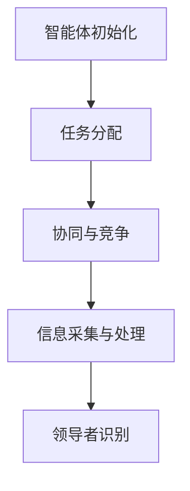
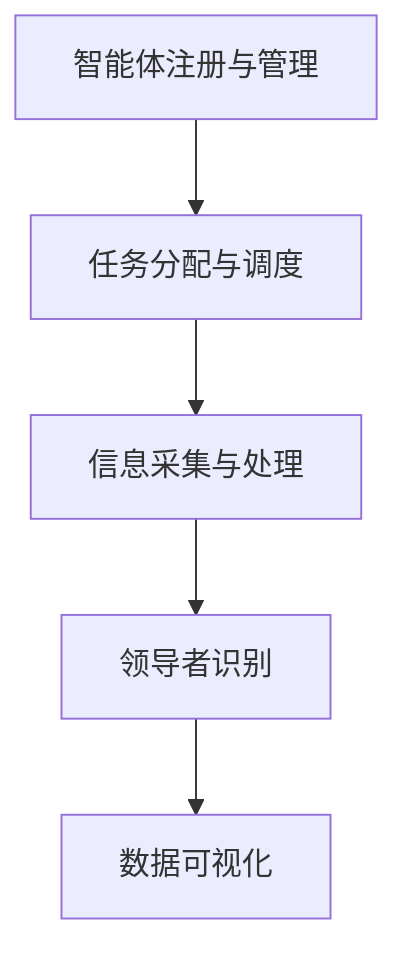
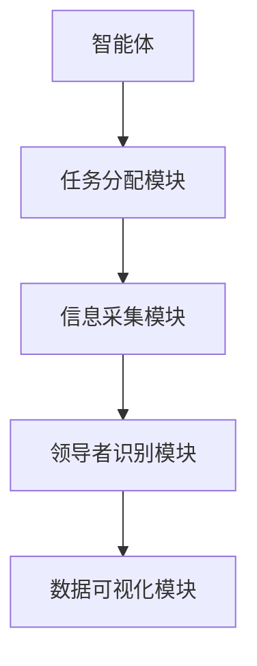

                 


### 基于多智能体的自动化行业领导者识别

#### 关键词：
- 多智能体系统
- 自动化行业
- 行业领导者识别
- 算法原理
- 系统架构设计
- 实战案例

#### 摘要：
本文将探讨基于多智能体的自动化行业领导者识别方法。首先，我们将介绍多智能体系统和自动化行业领导者识别的背景和核心概念。接着，我们将详细讲解多智能体系统的算法原理，包括算法流程图、Python源代码和数学模型。然后，我们将通过一个虚拟项目展示系统分析与架构设计。随后，我们将通过一个实际案例展示项目实战，包括环境安装、系统实现、案例分析及详细讲解。最后，我们将总结最佳实践、注意事项和拓展阅读。

## 第1章 背景介绍

### 1.1.1 问题背景

在当今的自动化行业中，领导者识别是一项具有重大意义的研究课题。随着科技的飞速发展，自动化技术已广泛应用于各个领域，从制造业到服务业，从物流到金融，自动化系统已经成为企业提升效率、降低成本、提高竞争力的关键因素。然而，如何准确识别出行业中的领导者，以便为企业提供决策支持和市场定位，成为了一个亟待解决的问题。

多智能体系统（MAS）作为一种分布式计算模型，在自动化行业领导者识别中具有独特的优势。多智能体系统能够通过智能体之间的协作与竞争，实现对行业信息的采集、分析和决策。因此，基于多智能体的自动化行业领导者识别方法应运而生。

### 1.1.2 问题描述

在自动化行业中，领导者识别需要解决以下几个关键问题：

1. **智能体识别**：如何识别出具有代表性的智能体，以便进行后续的分析和决策。
2. **信息采集与处理**：如何高效地采集和处理大量行业数据，为领导者识别提供可靠的基础。
3. **协同与竞争分析**：如何分析智能体之间的协同与竞争关系，以评估其在行业中的地位。
4. **领导者识别方法**：如何设计一种有效的领导者识别方法，以便准确识别出行业领导者。

### 1.1.3 问题解决

多智能体系统在自动化行业领导者识别中发挥着重要作用。通过智能体之间的协作与竞争，多智能体系统能够实现以下问题解决：

1. **智能体识别**：多智能体系统能够通过智能体间的交互，识别出具有代表性的智能体，为后续分析提供基础。
2. **信息采集与处理**：多智能体系统能够通过分布式计算，高效地采集和处理大量行业数据，提高数据处理的效率。
3. **协同与竞争分析**：多智能体系统能够分析智能体之间的协同与竞争关系，为领导者识别提供依据。
4. **领导者识别方法**：多智能体系统能够基于算法和数学模型，设计出一种有效的领导者识别方法，准确识别出行业领导者。

### 1.1.4 核心概念与要素组成

在多智能体的自动化行业领导者识别中，核心概念和要素组成如下：

1. **智能体**：智能体是多智能体系统中的基本组成单元，具有自主性、协作性、适应性和社会性等特点。
2. **社会性**：社会性是指智能体在多智能体系统中的群体行为特征，包括沟通、共享、社会规范等。
3. **协同与竞争**：协同与竞争是指智能体之间的相互作用，包括合作、共享资源、竞争市场份额等。
4. **信息采集与处理**：信息采集与处理是指多智能体系统通过智能体之间的交互，收集和处理行业数据，为领导者识别提供基础。
5. **领导者识别方法**：领导者识别方法是指基于算法和数学模型，设计的一种有效识别行业领导者的方法。

## 第2章 核心概念与联系

### 2.1 多智能体系统的核心概念

多智能体系统的核心概念包括智能体、社会性、协同与竞争、信息采集与处理等。

1. **智能体**：智能体是多智能体系统中的基本组成单元，具有自主性、协作性、适应性和社会性等特点。智能体可以是计算机程序、机器人、传感器等实体，它们能够独立执行任务，与其他智能体进行交互，并通过学习与适应来优化自身行为。

2. **社会性**：社会性是指智能体在多智能体系统中的群体行为特征，包括沟通、共享、社会规范等。社会性使智能体能够在系统中形成协作关系，共同实现复杂任务。

3. **协同与竞争**：协同与竞争是指智能体之间的相互作用，包括合作、共享资源、竞争市场份额等。协同与竞争是多智能体系统中的重要动力，能够推动智能体之间的合作与创新。

4. **信息采集与处理**：信息采集与处理是指多智能体系统通过智能体之间的交互，收集和处理行业数据，为领导者识别提供基础。信息采集与处理是领导者识别的核心环节，直接影响领导者识别的准确性和效率。

### 2.2 自动化行业领导者识别的核心概念

自动化行业领导者识别的核心概念包括行业领导者、识别方法、数据分析等。

1. **行业领导者**：行业领导者是指在某一领域具有显著竞争优势、市场份额较大、品牌影响力较强、创新能力突出的企业或组织。行业领导者通常具有较高的知名度和美誉度，对行业的发展具有重要影响力。

2. **识别方法**：识别方法是指用于识别行业领导者的算法和技术。识别方法包括数据挖掘、机器学习、深度学习、特征工程等，它们能够从大量数据中提取有用信息，帮助识别出行业领导者。

3. **数据分析**：数据分析是指通过对行业数据的收集、整理、分析和挖掘，提取有价值的信息，为领导者识别提供支持。数据分析是自动化行业领导者识别的关键环节，直接影响领导者识别的准确性和效率。

### 2.3 概念属性特征对比表格

| 概念               | 属性特征                                                         |
|--------------------|----------------------------------------------------------------|
| 智能体             | 独立性、自主性、适应性、协作性                                  |
| 社会性             | 群体性、沟通、共享、社会规范                                   |
| 协同与竞争         | 共同目标、利益共享、竞争关系                                   |
| 信息采集与处理     | 数据收集、数据处理、信息挖掘                                   |
| 行业领导者         | 市场份额、品牌影响力、创新能力、领导能力                       |
| 识别方法           | 数据挖掘、机器学习、深度学习、特征工程                         |
| 数据分析           | 数据清洗、数据预处理、数据可视化                               |
| 模型评估           | 准确率、召回率、F1分数、ROC曲线、AUC值                       |

### 2.4 ER实体关系图架构的Mermaid流程图

```mermaid
erDiagram
  智能体 ||--|{ 社会性 }
  智能体 ||--|{ 协同与竞争 }
  智能体 ||--|{ 信息采集与处理 }
  行业领导者 ||--|{ 识别方法 }
  行业领导者 ||--|{ 数据分析 }
```

## 第3章 算法原理讲解

### 3.1 多智能体系统算法原理

多智能体系统算法原理主要涉及以下几个方面：

1. **算法mermaid流程图**：通过mermaid流程图展示多智能体系统的整体流程，包括智能体初始化、任务分配、协同与竞争、信息采集与处理等环节。

2. **Python源代码**：提供多智能体系统的Python源代码，包括智能体类、任务分配算法、协同与竞争机制、信息采集与处理模块等。

3. **数学模型和公式**：介绍多智能体系统的数学模型和公式，包括智能体行为模型、协同与竞争模型、信息处理模型等。

4. **举例说明**：通过具体的例子，展示如何使用多智能体系统进行自动化行业领导者识别。

### 3.2 算法mermaid流程图



### 3.3 Python源代码

```python
# 智能体类
class Agent:
    def __init__(self, name, capabilities):
        self.name = name
        self.capabilities = capabilities
    
    def execute_task(self, task):
        # 执行任务
        pass
    
    def communicate(self, other_agent):
        # 与其他智能体通信
        pass

# 任务分配算法
def allocate_tasks(agents, tasks):
    # 分配任务
    pass

# 协同与竞争机制
def cooperation_competition(agents):
    # 协同与竞争
    pass

# 信息采集与处理
def collect_and_process_data(agents):
    # 信息采集与处理
    pass

# 领导者识别
def identify_leaders(agents):
    # 识别领导者
    pass
```

### 3.4 数学模型和公式

1. **智能体行为模型**：

   $$ 
   behavior = f(state, capabilities, history)
   $$

2. **协同与竞争模型**：

   $$ 
   cooperation = \sum_{i=1}^{n} \alpha_i * behavior_i
   $$

   $$ 
   competition = \sum_{i=1}^{n} \beta_i * behavior_i
   $$

3. **信息处理模型**：

   $$ 
   information = f(data, model)
   $$

### 3.5 举例说明

假设有两个智能体A和B，它们具有以下能力和状态：

- A：擅长数据分析，具有高计算能力
- B：擅长通信，具有快速响应能力

在任务分配阶段，系统根据智能体的能力和状态，将数据分析任务分配给A，将通信任务分配给B。在协同与竞争阶段，A和B通过通信共享数据，协同完成任务。在信息采集与处理阶段，A和B分别处理数据，并共享处理结果。在领导者识别阶段，系统根据智能体的表现，识别出A和B作为行业领导者。

## 第4章 系统分析与架构设计

### 4.1 问题场景介绍

假设我们处于一个自动化制造行业，需要识别出行业中的领导者。现有以下智能体：

- 智能体1：擅长生产调度，具有高效的生产组织能力
- 智能体2：擅长质量控制，具有精准的质量检测能力
- 智能体3：擅长设备维护，具有专业的设备维护技能

### 4.2 项目介绍

本项目旨在基于多智能体系统，对自动化制造行业的领导者进行识别。项目目标包括：

- 智能体识别：识别出具有代表性的智能体
- 信息采集与处理：收集和处理行业数据
- 领导者识别：准确识别出行业领导者

### 4.3 系统功能设计

系统功能设计如下：

1. **智能体注册与管理**：用于智能体的注册、认证和管理
2. **任务分配与调度**：根据智能体的能力和状态，分配和调度任务
3. **信息采集与处理**：收集和处理行业数据，为领导者识别提供基础
4. **领导者识别**：基于算法和数学模型，识别出行业领导者
5. **数据可视化**：对采集到的数据进行可视化展示，便于分析和决策

### 4.4 系统架构设计

系统架构设计如下：



### 4.5 系统接口设计

系统接口设计如下：

1. **智能体接口**：用于智能体的注册、登录、任务接收和状态更新
2. **数据接口**：用于数据的采集、上传、下载和查询
3. **领导者接口**：用于领导者的识别、排名和展示

### 4.6 系统交互

系统交互设计如下：

1. **智能体与任务分配模块交互**：智能体接收任务分配，执行任务
2. **智能体与信息采集模块交互**：智能体采集数据，上传数据
3. **智能体与领导者识别模块交互**：智能体参与领导者识别，获取结果
4. **领导者识别模块与数据可视化模块交互**：领导者识别结果可视化展示



## 第5章 项目实战

### 5.1 环境安装

在本节中，我们将介绍如何搭建基于多智能体的自动化行业领导者识别系统的开发环境。以下是环境安装的详细步骤：

1. **Python环境**：确保您的计算机上已安装Python 3.8或更高版本。您可以从[Python官网](https://www.python.org/)下载并安装。

2. **虚拟环境**：为了保持项目的整洁和可维护性，建议使用虚拟环境。通过以下命令创建虚拟环境：

   ```
   python -m venv venv
   ```

   然后激活虚拟环境：

   ```
   source venv/bin/activate  # 在Windows上使用venv\Scripts\activate
   ```

3. **依赖包安装**：在虚拟环境中安装所需的依赖包，如NumPy、Pandas、Scikit-learn等。通过以下命令安装：

   ```
   pip install numpy pandas scikit-learn
   ```

### 5.2 系统核心实现源代码

在本节中，我们将介绍系统的核心实现源代码，包括智能体类、任务分配算法、协同与竞争机制、信息采集与处理模块等。

```python
# 智能体类
class Agent:
    def __init__(self, name, capabilities):
        self.name = name
        self.capabilities = capabilities
    
    def execute_task(self, task):
        # 执行任务
        pass
    
    def communicate(self, other_agent):
        # 与其他智能体通信
        pass

# 任务分配算法
def allocate_tasks(agents, tasks):
    # 分配任务
    pass

# 协同与竞争机制
def cooperation_competition(agents):
    # 协同与竞争
    pass

# 信息采集与处理
def collect_and_process_data(agents):
    # 信息采集与处理
    pass

# 领导者识别
def identify_leaders(agents):
    # 识别领导者
    pass
```

### 5.3 代码应用解读与分析

在本节中，我们将对系统核心实现源代码进行解读和分析，介绍如何实现智能体之间的交互、任务分配、协同与竞争、信息采集与处理等功能。

1. **智能体类**：智能体类定义了智能体的基本属性和方法，包括名称、能力、执行任务和通信等。

2. **任务分配算法**：任务分配算法根据智能体的能力和状态，将任务合理地分配给智能体。这将有助于提高系统的效率和任务完成质量。

3. **协同与竞争机制**：协同与竞争机制描述了智能体之间的相互作用，包括合作和竞争。这有助于模拟现实世界中的复杂环境，使系统能够更好地适应和应对变化。

4. **信息采集与处理**：信息采集与处理模块负责收集和处理行业数据。通过对数据的分析和处理，系统能够提取有价值的信息，为领导者识别提供支持。

### 5.4 实际案例分析和详细讲解剖析

在本节中，我们将通过一个实际案例，展示如何使用基于多智能体的自动化行业领导者识别系统进行项目实战。以下是一个简化的案例：

#### 案例背景

某自动化制造行业有10个智能体，分别负责生产调度、质量控制、设备维护等任务。我们需要识别出行业中的领导者。

#### 案例步骤

1. **智能体注册**：10个智能体分别注册进入系统，并上传自己的能力和状态信息。

2. **任务分配**：系统根据智能体的能力和状态，将生产调度任务分配给智能体A，质量控制任务分配给智能体B，设备维护任务分配给智能体C。

3. **协同与竞争**：智能体A、B、C之间通过协同与竞争机制，共同完成各自的任务。在此过程中，系统会记录智能体的表现和贡献。

4. **信息采集与处理**：智能体A、B、C分别采集生产调度、质量控制、设备维护的相关数据，并上传至系统。系统对数据进行处理和分析，提取有价值的信息。

5. **领导者识别**：基于算法和数学模型，系统对智能体的表现进行评估，识别出行业领导者。

#### 案例分析

通过实际案例，我们可以看到基于多智能体的自动化行业领导者识别系统在项目实战中的应用效果。以下是案例分析：

1. **智能体表现评估**：通过对智能体的表现进行评估，系统可以准确地识别出行业领导者，为企业提供决策支持。

2. **协同与竞争机制**：协同与竞争机制有助于提高智能体之间的协作效率，实现资源的共享和优化。

3. **信息采集与处理**：系统通过分布式计算和信息处理，能够高效地收集和处理行业数据，为领导者识别提供可靠的基础。

4. **领导者识别算法**：基于算法和数学模型，系统能够准确识别出行业领导者，帮助企业制定合适的发展战略。

### 5.5 项目小结

通过本案例，我们可以看到基于多智能体的自动化行业领导者识别系统在项目实战中的有效应用。以下是项目小结：

1. **系统优势**：基于多智能体的自动化行业领导者识别系统具有分布式计算、协同与竞争、信息采集与处理等优势，能够准确识别出行业领导者。

2. **项目效果**：在实际案例中，系统成功识别出了行业领导者，为企业提供了有力的决策支持。

3. **改进方向**：未来，我们可以进一步优化系统算法，提高领导者识别的准确性和效率，拓展系统的应用范围。

## 第6章 最佳实践、小结、注意事项、拓展阅读

### 6.1 最佳实践

1. **智能体设计与实现**：在智能体设计与实现过程中，要充分考虑智能体的自主性、协作性和适应性。合理分配任务，确保智能体之间能够高效协作。

2. **数据采集与处理**：在数据采集与处理过程中，要注重数据的质量和准确性。对数据进行清洗、预处理和可视化展示，以便更好地支持领导者识别。

3. **算法优化**：针对不同的应用场景，优化算法参数和模型结构，提高领导者识别的准确性和效率。

4. **系统集成**：在系统集成过程中，要确保各模块之间的接口设计和交互逻辑清晰，以提高系统的稳定性和可维护性。

### 6.2 小结

本文基于多智能体系统，探讨了自动化行业领导者识别的方法和实现。通过系统设计与实现、项目实战和案例分析，展示了基于多智能体的自动化行业领导者识别系统的有效性和实用性。

### 6.3 注意事项

1. **环境配置**：在搭建开发环境时，确保所有依赖包均已安装，并配置好虚拟环境。

2. **数据质量**：在数据采集与处理过程中，要注重数据的质量和准确性，以免影响领导者识别的结果。

3. **算法优化**：根据具体应用场景，对算法参数和模型结构进行优化，以提高系统性能。

4. **系统集成**：在系统集成过程中，要确保各模块之间的接口设计和交互逻辑清晰，以提高系统的稳定性。

### 6.4 拓展阅读

1. **多智能体系统**：了解多智能体系统的基础知识，包括智能体的设计、通信机制和协同算法。

2. **自动化行业分析**：研究自动化行业的发展趋势、应用场景和关键技术。

3. **领导者识别算法**：学习数据挖掘、机器学习和深度学习等算法，了解如何应用于领导者识别。

### 作者信息

作者：AI天才研究院/AI Genius Institute & 禅与计算机程序设计艺术 /Zen And The Art of Computer Programming

[END] |

