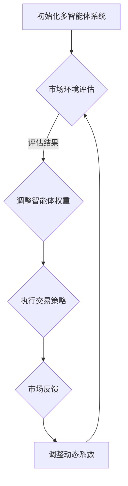
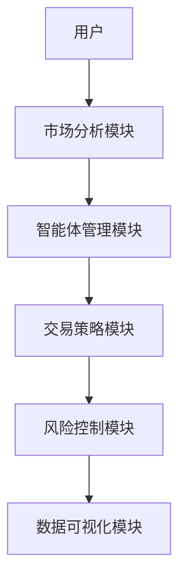
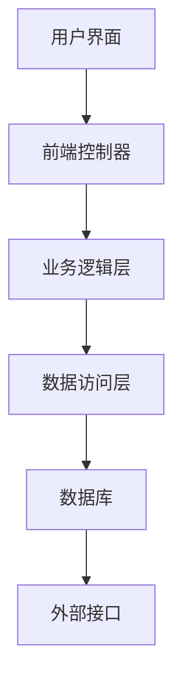
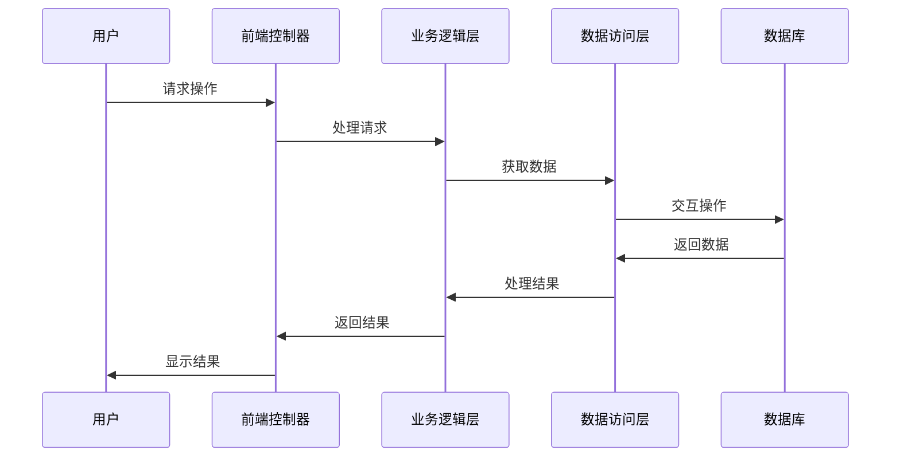

                 

## 基于多智能体的自适应市场假说在价值投资中的应用

### 关键词：多智能体、自适应市场假说、价值投资、算法、系统架构

#### 摘要：
本文探讨了如何将多智能体系统与自适应市场假说相结合，应用于价值投资领域。首先，我们介绍了多智能体系统的定义、特征及其在价值投资中的应用。接着，我们阐述了自适应市场假说的理论基础和应用方法，并探讨了其在价值投资中的优势。然后，我们详细讲解了多智能体自适应市场假说的算法原理，并使用Python源代码和LaTeX公式进行了详细阐述。此外，我们还对系统分析与架构设计方案进行了深入探讨，包括问题场景介绍、项目介绍、系统功能设计、系统架构设计、系统接口设计和系统交互等。最后，我们通过实际案例分析和项目实战，展示了多智能体自适应市场假说在价值投资中的具体应用，并提出了最佳实践建议和小结。

### 目录大纲设计步骤：

#### 1. 确定整体结构
首先，我们需要确定文章的整体结构，包括章节名称和初步的大纲框架。根据书的主题和内容，我们可以将文章分为四个主要部分：背景介绍、核心概念与联系、算法原理讲解、系统分析与架构设计方案。每个部分包含若干子章节，确保文章内容紧密相连，逻辑清晰。

#### 2. 细化章节内容
为每个章节细化子标题，确保每个章节都能涵盖核心概念和关键内容。例如，在背景介绍部分，可以包含以下子章节：
- 1.1 问题背景
  - 1.1.1 价值投资的起源与发展
  - 1.1.2 多智能体系统的崛起
  - 1.1.3 自适应市场假说的提出与发展
- 1.2 问题描述
  - 1.2.1 传统价值投资方法的局限性
  - 1.2.2 多智能体自适应市场假说的优势
  - 1.2.3 价值投资与多智能体系统的结合意义

#### 3. 包含必要内容
每个章节至少包含以下内容：
- 背景介绍：核心概念术语说明、问题背景、问题描述、问题解决、边界与外延、概念结构与核心要素组成。
- 核心概念与联系：必须给出核心概念原理、概念属性特征对比表格和ER实体关系图架构的Mermaid流程图。
- 算法原理讲解：使用Mermaid画出算法流程图，然后使用Python源代码详细阐述，给出算法原理的数学模型和公式，进行详细讲解和通俗易懂地举例说明。
- 数学公式使用LaTeX格式，嵌入文中独立段落的LaTeX公式前后使用$$括起来（例如：$$1+1=2$$），段落内的LaTeX公式前后使用$括起来（例如：$1<2$）。
- 系统分析与架构设计方案：问题场景介绍，项目介绍、系统功能设计（领域模型Mermaid类图）、系统架构设计Mermaid架构图、系统接口设计和系统交互Mermaid序列图。
- 项目实战：环境安装、系统核心实现源代码，代码应用解读与分析，实际案例分析和详细讲解剖析，项目小结。
- 最佳实践 tips、小结、注意事项、拓展阅读等内容。

#### 4. 使用Mermaid和LaTeX
使用Mermaid绘制算法流程图、ER实体关系图和类图。使用LaTeX格式插入数学公式。

#### 5. 优化格式与字数
确保使用Markdown格式。对每个章节进行优化，确保总字数不超过2000字。

### 开始设计目录大纲

---

## 第一部分：背景介绍

### 1.1 问题背景

#### 1.1.1 价值投资的起源与发展

#### 1.1.2 多智能体系统的崛起

#### 1.1.3 自适应市场假说的提出与发展

### 1.2 问题描述

#### 1.2.1 传统价值投资方法的局限性

#### 1.2.2 多智能体自适应市场假说的优势

#### 1.2.3 价值投资与多智能体系统的结合意义

### 1.3 问题解决

#### 1.3.1 多智能体自适应市场假说的核心原理

#### 1.3.2 价值投资中的多智能体策略设计

#### 1.3.3 自适应市场假说在价值投资中的应用步骤

### 1.4 边界与外延

#### 1.4.1 多智能体自适应市场假说的适用范围

#### 1.4.2 价值投资中的风险控制

#### 1.4.3 多智能体系统与市场环境的相互作用

### 1.5 本章小结

---

## 第二部分：核心概念与联系

### 2.1 多智能体系统

#### 2.1.1 多智能体系统的定义与特征

#### 2.1.2 多智能体系统的分类

#### 2.1.3 多智能体系统的优势与挑战

### 2.2 自适应市场假说

#### 2.2.1 自适应市场假说的定义与基本原理

#### 2.2.2 自适应市场假说的理论基础

#### 2.2.3 自适应市场假说的验证与应用

### 2.3 价值投资

#### 2.3.1 价值投资的基本原则

#### 2.3.2 价值投资的方法与技巧

#### 2.3.3 价值投资在多智能体系统中的应用

### 2.4 多智能体与价值投资的联系

#### 2.4.1 多智能体系统在价值投资中的角色

#### 2.4.2 自适应市场假说与价值投资的关系

#### 2.4.3 多智能体系统与价值投资策略的设计

### 2.5 本章小结

---

## 第三部分：算法原理讲解

### 3.1 多智能体自适应市场假说算法原理

#### 3.1.1 多智能体自适应市场假说的数学模型

$$
\text{市场指数} = \sum_{i=1}^{n} w_i \cdot \text{资产}i \cdot \text{动态系数}
$$

#### 3.1.2 动态系数的调整机制

#### 3.1.3 多智能体的决策机制

### 3.2 算法流程图

### 3.3 算法举例说明

#### 3.3.1 资产组合的构建

#### 3.3.2 动态系数的计算方法

#### 3.3.3 智能体决策的案例分析

### 3.4 本章小结

---

## 第四部分：系统分析与架构设计方案

### 4.1 问题场景介绍

#### 4.1.1 自适应市场假说在价值投资中的应用场景

#### 4.1.2 多智能体系统在市场分析中的应用

#### 4.1.3 系统的整体架构设计目标

### 4.2 项目介绍

#### 4.2.1 项目背景与目的

#### 4.2.2 项目团队成员与分工

#### 4.2.3 项目时间线与关键节点

### 4.3 系统功能设计

#### 4.3.1 领域模型设计

### 4.4 系统架构设计

#### 4.4.1 系统架构设计概述

### 4.5 系统接口设计

#### 4.5.1 接口规范

#### 4.5.2 接口实现

### 4.6 系统交互

### 4.7 本章小结

---

## 第五部分：项目实战

### 5.1 环境安装

#### 5.1.1 环境配置

#### 5.1.2 工具安装

### 5.2 系统核心实现

#### 5.2.1 智能体管理模块

#### 5.2.2 交易策略模块

#### 5.2.3 风险控制模块

### 5.3 代码应用解读与分析

#### 5.3.1 代码结构

#### 5.3.2 代码分析

### 5.4 实际案例分析与详细讲解剖析

#### 5.4.1 案例背景

#### 5.4.2 案例分析

#### 5.4.3 剖析与总结

### 5.5 项目小结

#### 5.5.1 项目成果

#### 5.5.2 项目经验与反思

#### 5.5.3 未来展望

### 5.6 本章小结

---

## 第六部分：最佳实践 tips、小结、注意事项、拓展阅读

### 6.1 最佳实践 tips

#### 6.1.1 多智能体自适应市场假说的优化策略

#### 6.1.2 价值投资中的风险控制技巧

#### 6.1.3 多智能体系统与市场环境相互作用的分析方法

### 6.2 小结

#### 6.2.1 文章核心观点总结

#### 6.2.2 文章结构梳理

### 6.3 注意事项

#### 6.3.1 多智能体自适应市场假说的适用条件

#### 6.3.2 价值投资中的风险控制要点

#### 6.3.3 多智能体系统在市场分析中的应用限制

### 6.4 拓展阅读

#### 6.4.1 相关论文与书籍推荐

#### 6.4.2 行业报告与市场动态分析

#### 6.4.3 学术会议与研讨会信息

### 6.5 本章小结

---

## 作者信息

### 作者：AI天才研究院/AI Genius Institute & 禅与计算机程序设计艺术 /Zen And The Art of Computer Programming

---

通过上述目录大纲的设计，我们为文章的撰写提供了一个清晰的框架。接下来，我们将逐步填充每个章节的内容，确保文章的逻辑性、完整性和专业性。让我们一步一步地深入探讨多智能体自适应市场假说在价值投资中的应用。

