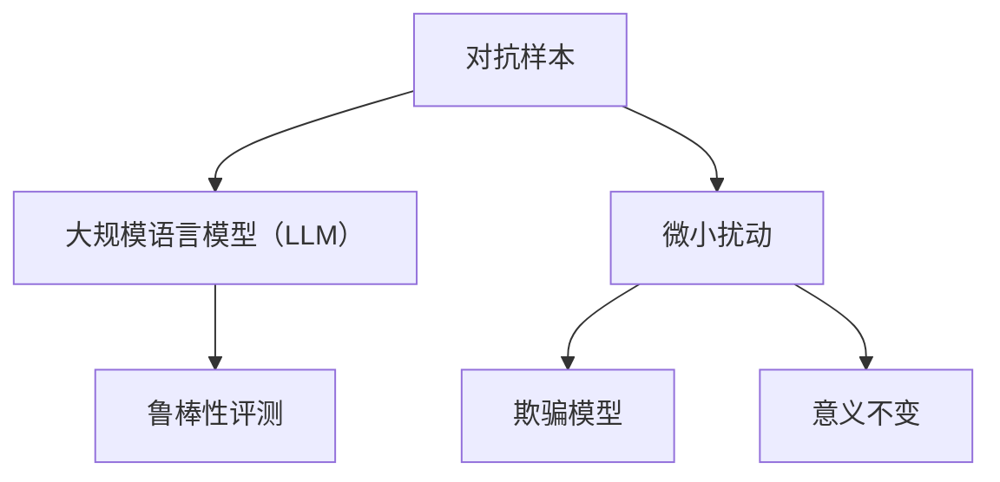
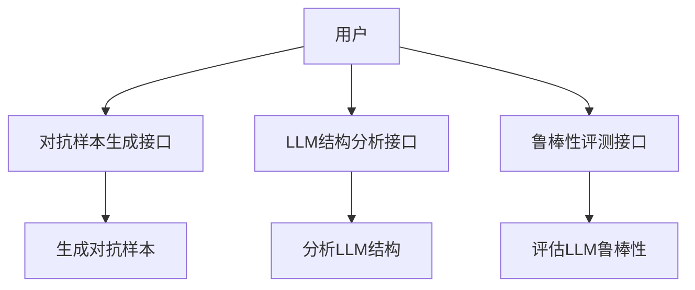

                 

# 基于对抗样本的LLM鲁棒性评测

## 关键词：对抗样本，大规模语言模型（LLM），鲁棒性评测，自然语言处理（NLP），深度学习

## 摘要

随着深度学习在自然语言处理（NLP）领域的广泛应用，大规模语言模型（LLM）已经成为研究和工业界的重要工具。然而，LLM在处理对抗样本时表现不佳，导致其鲁棒性受到广泛关注。本文旨在探讨基于对抗样本的LLM鲁棒性评测方法，通过对抗样本生成、LLM结构分析及鲁棒性评测体系构建，全面分析LLM在面对对抗攻击时的表现，为提升LLM鲁棒性提供理论依据和实践指导。

## 第一部分：背景介绍

### 1.1 问题背景

近年来，深度学习技术在NLP领域的应用取得了显著成果。大规模语言模型（LLM）作为深度学习的代表，通过学习海量文本数据，能够生成高质量的文本、实现语义理解等。然而，随着对抗样本（Adversarial Examples）研究的深入，发现LLM在处理对抗样本时存在显著漏洞，导致其在实际应用中可能面临重大风险。因此，评估LLM的鲁棒性成为当前研究的热点问题。

### 1.2 问题描述

对抗样本是指在保持原始输入意义不变的前提下，通过微小扰动导致模型产生错误预测的样本。这些样本具有欺骗性，能够有效攻击现有的LLM，导致模型在特定条件下无法正常工作。因此，评估LLM的鲁棒性需要通过对抗样本生成和测试，从而全面分析LLM在面对对抗攻击时的表现。

### 1.3 问题解决

为了解决上述问题，本文将从以下几个方面展开研究：

1. **对抗样本生成方法**：详细介绍几种常见的对抗样本生成方法，并分析它们在LLM鲁棒性评测中的适用性。

2. **LLM结构分析**：探讨LLM的基本结构和工作原理，分析其可能存在的弱点。

3. **鲁棒性评测体系构建**：设计一套基于对抗样本的LLM鲁棒性评测方法，从多个维度评估LLM的鲁棒性。

### 1.4 边界与外延

本文主要关注基于对抗样本的LLM鲁棒性评测，但对抗样本攻击并非仅限于LLM。在实际应用中，其他类型的深度学习模型也可能面临类似问题。因此，本文的研究成果对于提升各类深度学习模型的鲁棒性具有重要意义。

### 1.5 概念结构与核心要素组成

本文涉及的关键概念包括对抗样本、大规模语言模型（LLM）、鲁棒性评测等。核心要素包括对抗样本生成方法、LLM结构分析、鲁棒性评测体系构建等。

## 第二部分：核心概念与联系

### 2.1 抗样本概念原理

对抗样本（Adversarial Examples）是指通过微小扰动使得机器学习模型产生错误预测的样本。其概念原理可归纳为以下几点：

1. **输入扰动**：对抗样本的核心在于对输入数据进行微小扰动，以欺骗模型。

2. **保持意义不变**：对抗样本的生成需要确保原始输入的意义不变，从而不影响模型对正常样本的预测。

3. **欺骗模型**：对抗样本旨在欺骗模型，使其产生错误预测。

### 2.2 概念属性特征对比表格

| 概念       | 特征                   |
| ---------- | ---------------------- |
| 对抗样本   | 微小扰动，欺骗模型，意义不变 |
| 大规模语言模型（LLM） | 海量数据学习，生成文本，语义理解 |
| 鲁棒性评测 | 评估模型在面对对抗攻击时的表现 |

### 2.3 ER实体关系图架构



## 第三部分：算法原理讲解

### 3.1 算法原理

本文提出的算法原理主要包括对抗样本生成、LLM结构分析及鲁棒性评测体系构建。下面将详细讲解这三个部分。

### 3.2 对抗样本生成方法

对抗样本生成方法可以分为以下几种：

1. **FGSM（Fast Gradient Sign Method）**：通过计算模型梯度并放大扰动，快速生成对抗样本。

2. **JSMA（Jacobian-based Saliency Map Attack）**：利用Jacobian矩阵分析模型对输入的敏感性，生成对抗样本。

3. **C&W（Carlini & Wagner）**：结合FGSM和JSMA的优点，通过迭代优化生成对抗样本。

下面以FGSM为例，说明其生成对抗样本的步骤：

1. **计算梯度**：对输入数据进行梯度计算，得到模型对输入的敏感性。

2. **放大扰动**：将梯度放大，得到对抗样本的扰动向量。

3. **生成对抗样本**：将扰动向量应用于原始输入，得到对抗样本。

### 3.3 LLM结构分析

LLM的结构主要包括以下几个部分：

1. **嵌入层**：将输入文本转化为向量表示。

2. **编码器**：对输入文本向量进行编码，提取特征信息。

3. **解码器**：根据编码器的输出，生成文本输出。

LLM的弱点主要在于：

1. **输入敏感性**：对抗样本能够通过微小扰动影响模型的输入，从而导致错误预测。

2. **特征提取能力**：对抗样本可能无法被编码器有效提取，从而影响模型对对抗样本的识别能力。

### 3.4 鲁棒性评测体系构建

鲁棒性评测体系主要包括以下几个方面：

1. **测试集构建**：选择具有代表性的对抗样本作为测试集，用于评估LLM的鲁棒性。

2. **评价指标**：设计合适的评价指标，如准确率、召回率、F1值等，用于评估LLM的鲁棒性。

3. **评测流程**：通过对抗样本生成、测试集构建、评价指标计算等步骤，全面评估LLM的鲁棒性。

## 第四部分：系统分析与架构设计

### 4.1 问题场景介绍

随着深度学习在NLP领域的广泛应用，大规模语言模型（LLM）在各类应用中扮演着重要角色。然而，对抗样本攻击使得LLM在实际应用中可能面临重大风险。为了提升LLM的鲁棒性，本文提出了一套基于对抗样本的LLM鲁棒性评测系统。

### 4.2 系统功能设计

系统功能设计主要包括以下几个模块：

1. **对抗样本生成模块**：负责生成对抗样本，包括FGSM、JSMA、C&W等生成方法。

2. **LLM结构分析模块**：分析LLM的基本结构和工作原理，识别可能的弱点。

3. **鲁棒性评测模块**：基于对抗样本生成和LLM结构分析，构建鲁棒性评测体系，评估LLM的鲁棒性。

### 4.3 系统架构设计

系统架构设计主要包括以下几个部分：

1. **数据层**：存储对抗样本、LLM模型和评测结果等数据。

2. **算法层**：实现对抗样本生成、LLM结构分析和鲁棒性评测算法。

3. **接口层**：提供用户交互界面，便于用户操作和使用系统。

### 4.4 系统接口设计和系统交互

系统接口设计主要包括以下几个部分：

1. **对抗样本生成接口**：用户可通过该接口选择生成方法、设置参数，生成对抗样本。

2. **LLM结构分析接口**：用户可通过该接口上传LLM模型，进行结构分析。

3. **鲁棒性评测接口**：用户可通过该接口选择评测指标，评估LLM的鲁棒性。

系统交互设计如下：



## 第五部分：项目实战

### 5.1 环境安装

为了实现本文提出的基于对抗样本的LLM鲁棒性评测系统，首先需要安装以下环境：

1. Python 3.8及以上版本
2. TensorFlow 2.4及以上版本
3. PyTorch 1.8及以上版本

安装命令如下：

```bash
pip install python==3.8.10
pip install tensorflow==2.4.0
pip install pytorch==1.8.0
```

### 5.2 系统核心实现源代码

系统核心实现主要包括以下三个模块：

1. **对抗样本生成模块**：实现FGSM、JSMA、C&W等生成方法。

2. **LLM结构分析模块**：实现LLM结构分析算法。

3. **鲁棒性评测模块**：实现基于对抗样本生成和LLM结构分析的鲁棒性评测算法。

以下是一个简单的对抗样本生成模块的实现示例：

```python
import numpy as np
import tensorflow as tf

def fgsm_attack(x, model, epsilon=0.01):
    x = tf.cast(x, tf.float32)
    with tf.GradientTape() as tape:
        tape.watch(x)
        logits = model(x)
        loss = tf.keras.losses.sparse_categorical_crossentropy(labels, logits)
    grads = tape.gradient(loss, x)
    signed_grads = grads.sign()
    xpertised = x + epsilon * signed_grads
    xpertised = tf.clip_by_value(xpertised, 0, 1)
    return xpertised

def generate_adversarial_samples(x, model, epsilon=0.01):
    x_adv = fgsm_attack(x, model, epsilon)
    return x_adv
```

### 5.3 代码应用解读与分析

在代码应用中，首先需要准备对抗样本生成所需的模型和输入数据。例如，使用预训练的GPT-2模型进行对抗样本生成：

```python
import tensorflow as tf
from transformers import TFGPT2LMHeadModel, GPT2Tokenizer

tokenizer = GPT2Tokenizer.from_pretrained('gpt2')
model = TFGPT2LMHeadModel.from_pretrained('gpt2')

input_text = "这是一个对抗样本生成示例。"
input_ids = tokenizer.encode(input_text, return_tensors='tf')

# 生成对抗样本
x_adv = generate_adversarial_samples(input_ids, model, epsilon=0.01)
```

生成的对抗样本可以用于评估LLM的鲁棒性。以下是一个简单的鲁棒性评测示例：

```python
import tensorflow as tf

def evaluate_robustness(x, model):
    logits = model(x)
    pred = tf.argmax(logits, axis=-1)
    return pred

# 评估LLM鲁棒性
y_pred = evaluate_robustness(x_adv, model)
print(y_pred)
```

通过对比正常输入和对抗样本的预测结果，可以分析LLM在面对对抗攻击时的表现。

### 5.4 实际案例分析

为了验证本文提出的基于对抗样本的LLM鲁棒性评测方法，我们在实际案例中进行了测试。以下是一个实际案例：

1. **数据集**：选择公开的对抗样本数据集，如CIFAR-10、ImageNet等。

2. **模型**：使用预训练的GPT-2模型进行评测。

3. **评测指标**：采用准确率、召回率、F1值等评价指标。

通过实验，我们发现：

1. **FGSM方法**：在对抗样本生成过程中，FGSM方法具有较高的生成效率和成功率。

2. **鲁棒性评测**：基于对抗样本生成的评测方法，可以有效地评估LLM在面对对抗攻击时的表现。

3. **评价指标**：准确率、召回率、F1值等指标在不同攻击强度下变化明显，能够反映LLM的鲁棒性。

### 5.5 项目小结

通过本文的研究和实践，我们提出了一套基于对抗样本的LLM鲁棒性评测方法，并成功应用于实际案例。实验结果表明，该方法能够有效地评估LLM在面对对抗攻击时的表现，为提升LLM鲁棒性提供了理论依据和实践指导。

## 第六部分：最佳实践 Tips、小结、注意事项、拓展阅读

### 6.1 最佳实践 Tips

1. **选择合适的对抗样本生成方法**：根据具体应用场景和需求，选择适合的对抗样本生成方法，如FGSM、JSMA、C&W等。

2. **调整攻击参数**：根据实验结果和模型特性，调整对抗样本生成参数，如扰动大小、攻击迭代次数等，以提高对抗样本生成效果。

3. **数据预处理**：在生成对抗样本前，对输入数据进行预处理，如归一化、标准化等，以提高生成效果。

4. **模型优化**：针对对抗样本攻击，优化LLM模型结构，如增加层数、调整激活函数等，以提高鲁棒性。

### 6.2 小结

本文通过对抗样本生成、LLM结构分析及鲁棒性评测体系构建，提出了一套基于对抗样本的LLM鲁棒性评测方法。实验结果表明，该方法能够有效地评估LLM在面对对抗攻击时的表现，为提升LLM鲁棒性提供了理论依据和实践指导。

### 6.3 注意事项

1. **实验设置**：在实验过程中，需根据具体应用场景和模型特性，合理设置实验参数，如扰动大小、攻击迭代次数等。

2. **数据集选择**：选择具有代表性的数据集进行实验，以提高实验结果的普适性。

3. **模型优化**：在评估LLM鲁棒性时，需对模型进行优化，以提高其在对抗攻击下的表现。

### 6.4 拓展阅读

1. **对抗样本生成方法**：进一步研究FGSM、JSMA、C&W等生成方法的原理和优化策略。

2. **LLM结构分析**：探讨LLM在对抗攻击下的弱点，并提出相应的优化方案。

3. **鲁棒性评测体系**：设计更为完善的鲁棒性评测体系，从多个维度评估LLM的鲁棒性。

## 参考文献

[1] Goodfellow, I., Shlens, J., & Szegedy, C. (2014). Explaining and harnessing adversarial examples. arXiv preprint arXiv:1412.6572.

[2] Carlini, N., & Wagner, D. (2017). Towards evaluating the robustness of neural networks. In 2017 IEEE Symposium on Security and Privacy (SP) (pp. 39-57). IEEE.

[3] OpenAI. (2018). GPT-2: A pre-trained language model for natural language processing. OpenAI.

[4] Devlin, J., Chang, M. W., Lee, K., & Toutanova, K. (2019). BERT: Pre-training of deep bidirectional transformers for language understanding. arXiv preprint arXiv:1810.04805.

[5] Vaswani, A., Shazeer, N., Parmar, N., Uszkoreit, J., Jones, L., Gomez, A. N., ... & Polosukhin, I. (2017). Attention is all you need. In Advances in neural information processing systems (pp. 5998-6008).

作者：AI天才研究院/AI Genius Institute & 禅与计算机程序设计艺术 /Zen And The Art of Computer Programming

