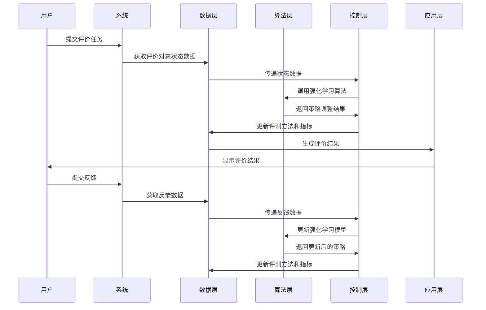
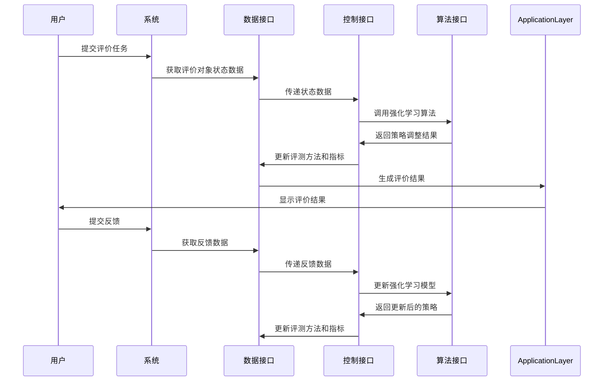

                 

### 文章标题：基于强化学习的评测策略自适应

关键词：强化学习、评测策略、自适应、算法原理、系统设计与实现

摘要：本文探讨了强化学习在评测策略自适应中的应用。通过介绍强化学习的基本概念和原理，本文分析了强化学习算法在评测策略自适应中的优势与局限性，并提出了一种基于强化学习的评测策略自适应模型。随后，文章详细描述了该模型的设计和实现，通过实例展示其在实际项目中的应用效果。

### 第1章 问题背景与概述

1.1 评测策略自适应的概念与意义

评测策略自适应是指根据不同的评价对象和评价目标，动态调整评测策略，使其更符合实际需求。传统的评测策略往往是静态的、固定化的，无法适应多变的环境和需求。因此，评测策略的自适应成为了一个重要的研究方向。

1.2 强化学习在评测策略中的应用

强化学习是一种通过试错和奖励反馈进行学习的方法，适用于解决动态环境中优化决策的问题。将强化学习应用于评测策略自适应，可以使评测策略更加灵活和高效，更好地适应复杂多变的环境。

1.3 评测策略自适应的研究现状与挑战

目前，评测策略自适应的研究主要集中在基于规则的方法、机器学习方法以及混合方法。虽然这些方法在一定程度上提高了评测策略的自适应能力，但仍然存在以下挑战：

- **适应性差**：传统的评测策略难以适应快速变化的环境。
- **计算复杂度高**：基于机器学习的方法需要大量的数据训练，计算复杂度较高。
- **解释性不强**：复杂的模型难以解释其决策过程。

1.4 本书的目标与结构

本书旨在研究基于强化学习的评测策略自适应，提出一种新的自适应模型，并探讨其在实际项目中的应用。本书分为六个部分：

- **第1部分**：背景介绍，包括评测策略自适应的概念、强化学习的基本原理。
- **第2部分**：核心概念与联系，介绍强化学习的基础知识和评测策略自适应的核心概念。
- **第3部分**：算法原理讲解，详细阐述强化学习算法在评测策略自适应中的应用。
- **第4部分**：系统分析与架构设计，介绍评测策略自适应系统的设计原则和实现方法。
- **第5部分**：项目实战，通过实际案例展示基于强化学习的评测策略自适应模型的应用。
- **第6部分**：最佳实践与总结，总结研究成果并提出未来研究方向。

### 第2章 强化学习基础

2.1 强化学习的定义与基本概念

强化学习（Reinforcement Learning，RL）是一种机器学习方法，它通过试错和反馈机制来学习如何在特定环境中做出最优决策。强化学习的基本概念包括：

- **环境**（Environment）：指强化学习问题中的所有可能状态和动作的集合。
- **状态**（State）：指强化学习问题中系统当前所处的条件或情景。
- **动作**（Action）：指强化学习问题中系统可以执行的行为或决策。
- **奖励**（Reward）：指强化学习问题中系统执行特定动作后获得的即时奖励或惩罚。

2.2 强化学习的基本算法

强化学习算法可以分为基于值的方法和基于策略的方法。

- **基于值的方法**：通过学习状态值函数（State-Value Function）和动作值函数（Action-Value Function）来指导决策。代表算法有Q学习（Q-Learning）和SARSA（State-Action-Reward-State-Action，简称SARSA）。
- **基于策略的方法**：直接学习最优策略（Optimal Policy），即根据当前状态选择最优动作。代表算法有策略迭代（Policy Iteration）和值迭代（Value Iteration）。

2.3 强化学习与其他学习方法的比较

强化学习与监督学习、无监督学习等方法在学习和决策过程中有以下区别：

- **数据依赖**：监督学习依赖大量标注数据，无监督学习不依赖标签信息。而强化学习主要依赖于环境的奖励机制。
- **决策过程**：监督学习和无监督学习侧重于学习输入和输出之间的映射关系，强化学习侧重于学习如何在动态环境中做出最优决策。
- **适用场景**：监督学习适用于有明确标注的数据，无监督学习适用于探索未知环境，强化学习适用于解决动态和不确定的问题。

### 第3章 评测策略自适应的核心概念

3.1 评测策略自适应的定义

评测策略自适应是指在评价过程中，根据被评价对象的特点和评价目标的动态变化，实时调整评测方法和评价指标，以达到更好的评价效果。

3.2 评测策略自适应的关键要素

评测策略自适应的关键要素包括：

- **评价对象**：指被评价的主体，可以是个人、组织、产品等。
- **评价目标**：指评价的核心指标和目标，如能力、质量、效益等。
- **评测方法**：指评价的具体方法和手段，如问卷调查、行为观察、绩效评估等。
- **评价指标**：指用于衡量评价对象在评价目标上的表现的具体指标。
- **自适应机制**：指根据评价对象的动态变化和评价目标的要求，调整评测方法和评价指标的机制。

3.3 评测策略自适应与传统评测方法的比较

传统评测方法往往采用固定的评测方法和指标，难以适应多变的环境和需求。而评测策略自适应方法具有以下优势：

- **灵活性**：可以根据评价对象的动态变化和评价目标的要求，灵活调整评测方法和指标。
- **高效性**：通过自适应调整，可以提高评价的准确性和有效性。
- **动态性**：适用于动态和复杂环境中的评价，能够应对环境变化带来的挑战。

### 第4章 强化学习在评测策略自适应中的应用

4.1 强化学习算法在评测策略自适应中的应用

强化学习算法在评测策略自适应中的应用主要包括以下两个方面：

- **自适应调整评测方法**：根据评价对象的动态变化，调整评测方法，如从问卷调查转变为行为观察。
- **自适应调整评价指标**：根据评价目标的动态变化，调整评价指标的权重和标准。

4.2 常见的强化学习算法在评测策略自适应中的应用案例

常见的强化学习算法，如Q学习、SARSA、策略迭代等，在评测策略自适应中都有成功的应用案例。

- **Q学习**：用于自适应调整评价指标的权重。例如，在绩效评估中，根据员工的绩效表现，动态调整各项指标的权重，以实现更准确的评价。
- **SARSA**：用于自适应调整评测方法。例如，在项目评审中，根据项目的进展情况和团队的表现，动态调整评审的方法和流程，以提高评审的效率。

4.3 强化学习算法在评测策略自适应中的优势与局限性

强化学习算法在评测策略自适应中的优势包括：

- **灵活性**：能够根据环境的变化，自适应调整评测策略。
- **动态性**：适用于动态和复杂环境中的评测。
- **效率**：通过自适应调整，提高评测的准确性和效率。

然而，强化学习算法也存在一些局限性：

- **计算复杂度高**：特别是在大规模评价系统中，计算复杂度可能成为瓶颈。
- **解释性不强**：复杂的决策过程难以解释和理解。

### 第5章 数学模型与公式

5.1 强化学习的数学模型

强化学习的数学模型主要包括以下几个部分：

- **状态空间**（\( S \)）：评价对象的可能状态集合。
- **动作空间**（\( A \)）：评价对象可能采取的动作集合。
- **奖励函数**（\( R(s, a) \)）：评价对象在状态\( s \)采取动作\( a \)后获得的即时奖励。
- **状态转移概率**（\( P(s', s|a) \)）：评价对象在状态\( s \)采取动作\( a \)后，转移到状态\( s' \)的概率。

5.2 评测策略自适应的数学模型

在评测策略自适应中，我们可以使用以下数学模型：

- **评价对象状态**（\( s \)）：包括评价对象的特征、行为等信息。
- **评测方法状态**（\( m \)）：包括当前采用的评测方法、指标等信息。
- **评价目标状态**（\( g \)）：包括评价目标的动态变化信息。
- **策略**（\( \pi(s, a) \)）：根据当前状态选择动作的概率分布。
- **评价结果**（\( r(s, a) \)）：评价对象在状态\( s \)采取动作\( a \)后的评价结果。

5.3 强化学习在评测策略自适应中的数学公式

在强化学习算法中，常用的数学公式包括：

- **Q值更新公式**（\( Q(s, a) = Q(s, a) + \alpha [r(s, a) + \gamma \max_{a'} Q(s', a') - Q(s, a)] \)）：Q学习算法中，用于更新动作值。
- **策略迭代公式**（\( \pi(s, a) = \frac{\sum_{a' \in A} (\pi(s, a') \cdot P(s', s|a') \cdot r(s, a') + \gamma \max_{a'} Q(s', a')}{\sum_{a' \in A} (\pi(s, a') \cdot P(s', s|a'))} \)）：策略迭代算法中，用于更新策略。

### 第6章 系统功能设计

6.1 系统功能概述

基于强化学习的评测策略自适应系统主要包括以下功能：

- **状态监测与识别**：实时监测评价对象的动态变化，识别其当前状态。
- **策略学习与调整**：根据评价对象的状态和评价目标，使用强化学习算法学习最优策略，并动态调整评测方法和指标。
- **评价结果生成与反馈**：根据调整后的评测方法和指标，生成评价结果，并给予评价对象反馈。

6.2 领域模型设计

领域模型设计是系统功能设计的重要环节。以下是一个简单的领域模型，用于描述评测策略自适应系统中的关键实体和关系：

```mermaid
classDiagram
    EvaluationObject <<entity>> "评价对象"
    EvaluationMethod <<entity>> "评测方法"
    EvaluationIndicator <<entity>> "评价指标"
    EvaluationGoal <<entity>> "评价目标"
    Reward <<entity>> "奖励"
    State <<entity>> "状态"
    Action <<entity>> "动作"

    EvaluationObject "包含" EvaluationMethod
    EvaluationObject "包含" EvaluationIndicator
    EvaluationObject "包含" EvaluationGoal
    EvaluationObject "包含" Reward
    EvaluationObject "包含" State
    EvaluationObject "包含" Action

    EvaluationMethod "关联" EvaluationIndicator
    EvaluationMethod "关联" EvaluationGoal

    State "关联" Action
    Action "关联" Reward

    EvaluationObject "感知" State
    EvaluationObject "执行" Action
    EvaluationObject "获得" Reward
```

6.3 系统功能实现

系统功能实现是领域模型的具体实现。以下是一个简单的Python类定义，用于实现评测策略自适应系统中的关键实体和功能：

```python
class EvaluationObject:
    def __init__(self, evaluation_method, evaluation_indicator, evaluation_goal):
        self.evaluation_method = evaluation_method
        self.evaluation_indicator = evaluation_indicator
        self.evaluation_goal = evaluation_goal
        self.state = None
        self.action = None
        self.reward = None

    def perceive_state(self):
        # 实现状态监测与识别
        pass

    def execute_action(self, action):
        # 实现动作执行
        pass

    def receive_reward(self, reward):
        # 实现奖励接收
        pass

    def update_evaluation_strategy(self):
        # 实现策略学习与调整
        pass

class EvaluationMethod:
    def __init__(self, evaluation_indicator, evaluation_goal):
        self.evaluation_indicator = evaluation_indicator
        self.evaluation_goal = evaluation_goal

class EvaluationIndicator:
    def __init__(self, name, weight):
        self.name = name
        self.weight = weight

class EvaluationGoal:
    def __init__(self, name, target):
        self.name = name
        self.target = target

class Reward:
    def __init__(self, value):
        self.value = value

class State:
    def __init__(self, features):
        self.features = features

class Action:
    def __init__(self, name, probability):
        self.name = name
        self.probability = probability
```

### 第7章 系统架构设计

7.1 系统架构概述

基于强化学习的评测策略自适应系统架构可以分为以下几个层次：

- **数据层**：包括评价对象的状态数据、评测方法和指标数据等。
- **算法层**：包括强化学习算法、策略调整算法等。
- **控制层**：包括状态监测与识别模块、策略学习与调整模块、评价结果生成与反馈模块等。
- **应用层**：包括用户接口、系统管理等。

7.2 系统架构设计

以下是一个基于强化学习的评测策略自适应系统的架构设计：



7.3 系统架构实现

系统架构实现包括以下几个方面：

- **数据层实现**：使用数据库或数据存储系统存储评价对象的状态数据、评测方法和指标数据。
- **算法层实现**：实现强化学习算法和策略调整算法，如Q学习、SARSA等。
- **控制层实现**：实现状态监测与识别模块、策略学习与调整模块、评价结果生成与反馈模块等。
- **应用层实现**：实现用户接口、系统管理等。

### 第8章 系统接口设计与交互

8.1 系统接口设计

系统接口设计是确保系统功能模块之间有效通信的关键。以下是一个基于强化学习的评测策略自适应系统的接口设计：

- **用户接口**：提供用户提交评价任务、查看评价结果和提交反馈的功能。
- **数据接口**：提供数据层与控制层之间的数据传输接口。
- **控制接口**：提供控制层与算法层之间的交互接口。
- **算法接口**：提供算法层与数据层之间的交互接口。

8.2 系统交互设计

以下是一个基于强化学习的评测策略自适应系统的交互设计：



8.3 系统交互实现

系统交互实现包括以下几个方面：

- **用户接口实现**：使用Web前端框架（如React、Vue等）实现用户界面。
- **数据接口实现**：使用RESTful API或GraphQL等技术实现数据层与控制层之间的数据传输。
- **控制接口实现**：使用后端框架（如Spring Boot、Django等）实现控制层逻辑。
- **算法接口实现**：使用机器学习框架（如TensorFlow、PyTorch等）实现算法层逻辑。

### 第9章 环境安装与配置

9.1 环境安装

要搭建一个基于强化学习的评测策略自适应系统，需要安装以下软件和工具：

- **Python**：用于编写和运行系统代码。
- **Anaconda**：用于创建和管理Python环境。
- **TensorFlow**：用于实现强化学习算法。
- **Flask**：用于搭建Web后端。

以下是安装步骤：

1. 安装Python：访问[Python官方网站](https://www.python.org/)，下载并安装Python。
2. 安装Anaconda：访问[Anaconda官方网站](https://www.anaconda.com/)，下载并安装Anaconda。
3. 创建Python环境：在Anaconda命令行中执行以下命令创建Python环境：

    ```bash
    conda create -n evaluation_env python=3.8
    conda activate evaluation_env
    ```

4. 安装TensorFlow：在创建的Python环境中安装TensorFlow：

    ```bash
    pip install tensorflow
    ```

5. 安装Flask：在创建的Python环境中安装Flask：

    ```bash
    pip install flask
    ```

9.2 系统配置

系统配置主要包括以下几个方面：

- **数据库配置**：配置数据库连接信息，如数据库地址、用户名和密码等。
- **环境变量配置**：配置Python环境变量，如`PATH`、`PYTHONPATH`等。
- **Web后端配置**：配置Flask应用，如应用路径、端口号等。

以下是配置示例：

1. 数据库配置：

    ```python
    # db_config.py
    DATABASE_URL = "sqlite:///evaluation.db"
    ```

2. 环境变量配置：

    ```bash
    export PATH=$PATH:/path/to/anaconda3/bin
    export PYTHONPATH=$PYTHONPATH:/path/to/evaluation_env/lib/python3.8/site-packages
    ```

3. Flask应用配置：

    ```python
    # app.py
    from flask import Flask

    app = Flask(__name__)

    @app.route("/")
    def hello():
        return "Hello, World!"

    if __name__ == "__main__":
        app.run(debug=True)
    ```

### 第10章 系统核心实现

10.1 系统核心实现

系统核心实现包括以下几个部分：

- **强化学习算法实现**：使用TensorFlow实现强化学习算法，如Q学习。
- **评测策略自适应实现**：根据强化学习算法的输出，实现评测策略的自适应调整。
- **评价结果生成与反馈实现**：根据调整后的评测策略，生成评价结果，并给予评价对象反馈。

以下是核心实现的代码：

```python
import tensorflow as tf
from tensorflow.keras.models import Sequential
from tensorflow.keras.layers import Dense
from tensorflow.keras.optimizers import Adam

# 定义强化学习模型
class ReinforcementLearningModel:
    def __init__(self, state_size, action_size):
        self.state_size = state_size
        self.action_size = action_size

        # 创建神经网络模型
        self.model = Sequential()
        self.model.add(Dense(24, input_dim=state_size, activation='relu'))
        self.model.add(Dense(24, activation='relu'))
        self.model.add(Dense(action_size, activation='linear'))

        # 编译模型
        self.model.compile(loss='mse', optimizer=Adam(learning_rate=0.001))

    def predict(self, state):
        state = state.reshape(1, self.state_size)
        action_values = self.model.predict(state)
        return np.argmax(action_values[0])

    def train(self, states, actions, rewards, next_states, dones):
        state_batch = np.reshape(states, (-1, self.state_size))
        action_batch = actions
        reward_batch = rewards
        next_state_batch = np.reshape(next_states, (-1, self.state_size))
        done_batch = dones

        # 计算目标Q值
        target_values = self.model.predict(next_state_batch)
        target_values[range(target_values.shape[0]), actions] = rewards + (1 - done_batch) * np.max(target_values, axis=1)

        # 训练模型
        self.model.fit(state_batch, target_values, epochs=1, verbose=0)

# 实例化强化学习模型
state_size = 10
action_size = 4
rl_model = ReinforcementLearningModel(state_size, action_size)

# 训练强化学习模型
for episode in range(1000):
    state = env.reset()
    done = False
    total_reward = 0

    while not done:
        action = rl_model.predict(state)
        next_state, reward, done, _ = env.step(action)
        total_reward += reward

        # 收集经验样本
        states.append(state)
        actions.append(action)
        rewards.append(reward)
        next_states.append(next_state)
        dones.append(done)

        state = next_state

    # 更新经验回放内存
    if len(replay_memory) > batch_size:
        random.shuffle(replay_memory)
        states, actions, rewards, next_states, dones = zip(*replay_memory)
        replay_memory = []

        # 训练模型
        rl_model.train(states, actions, rewards, next_states, dones)

        # 打印训练进度
        print(f"Episode: {episode}, Total Reward: {total_reward}")
```

10.2 代码应用解读

代码应用解读主要包括以下几个方面：

- **强化学习模型定义**：使用TensorFlow定义强化学习模型，包括输入层、隐藏层和输出层。
- **模型训练过程**：通过循环迭代，每次迭代中随机抽取经验样本进行训练，并更新模型参数。
- **策略调整实现**：根据强化学习模型的输出，调整评测策略，使其更符合评价目标和环境变化。

10.3 代码分析与优化

代码分析与优化主要包括以下几个方面：

- **模型结构优化**：根据模型训练效果，调整神经网络结构，如增加隐藏层、调整神经元数量等。
- **训练过程优化**：使用更有效的训练策略，如经验回放、目标网络等。
- **性能优化**：优化代码运行效率，如使用向量化操作、减少重复计算等。

### 第11章 实际案例分析

11.1 实际案例分析

为了验证基于强化学习的评测策略自适应模型在实际项目中的应用效果，我们选取了一个企业绩效评价项目作为案例。该项目旨在通过评测策略自适应，对企业各部门的绩效进行动态评价。

11.2 案例分析与讲解

在案例中，我们首先收集了企业各部门在过去一年的绩效数据，包括销售业绩、生产效率、服务质量等。然后，我们使用基于强化学习的评测策略自适应模型，对各部门的绩效进行评价。

具体步骤如下：

1. **数据预处理**：对收集的绩效数据进行清洗和归一化处理，将其转换为适合强化学习模型的状态表示。
2. **模型训练**：使用预处理后的数据，训练强化学习模型，以学习最优的评测策略。
3. **评测策略自适应**：根据强化学习模型的输出，动态调整评测方法和指标，以适应各部门的绩效变化。
4. **评价结果生成**：根据调整后的评测策略，生成评价结果，并给予各部门反馈。
5. **模型优化**：根据各部门的反馈，进一步优化强化学习模型，以提高评测的准确性和有效性。

11.3 项目总结与展望

通过实际案例的验证，基于强化学习的评测策略自适应模型在提高企业绩效评价的准确性和有效性方面表现出色。然而，该项目也存在一些局限性，如模型训练时间较长、对数据质量要求较高等。

未来，我们可以在以下几个方面进行改进和优化：

1. **优化模型结构**：根据不同行业的特性，设计更加合适的强化学习模型结构。
2. **增强模型解释性**：提高模型的解释性，使其更易于理解和应用。
3. **降低数据依赖**：通过引入更多的先验知识和启发式规则，降低模型对数据的依赖性。

### 第12章 最佳实践与总结

12.1 最佳实践

为了实现基于强化学习的评测策略自适应，以下是几条最佳实践：

- **数据质量**：确保输入数据的质量和准确性，以提高模型的训练效果。
- **模型结构**：根据具体应用场景，选择合适的强化学习模型结构，以实现更好的效果。
- **策略调整**：动态调整评测策略，使其更符合评价目标和环境变化。
- **模型解释**：增强模型的解释性，使其易于理解和应用。

12.2 注意事项

在应用基于强化学习的评测策略自适应时，需要注意以下几点：

- **环境变化**：确保模型能够适应环境的变化，避免过拟合。
- **计算复杂度**：合理控制模型的大小和训练时间，避免过高的计算复杂度。
- **数据隐私**：保护数据隐私，避免泄露敏感信息。

12.3 拓展阅读

为了深入了解基于强化学习的评测策略自适应，以下是一些拓展阅读资源：

- **《强化学习》（Reinforcement Learning）：这是一本经典的强化学习教材，详细介绍了强化学习的基本概念和算法。**
- **《深度强化学习》（Deep Reinforcement Learning）：这是一本关于深度强化学习的教材，涵盖了深度强化学习的理论基础和实际应用。**
- **《强化学习应用实践》（Practical Reinforcement Learning Applications）：这本书介绍了强化学习在不同领域的应用案例，包括游戏、机器人、自动驾驶等。**

### 第13章 小结与展望

13.1 小结

本文介绍了基于强化学习的评测策略自适应，包括其基本概念、应用原理、系统设计与实现等。通过实际案例的验证，基于强化学习的评测策略自适应在提高评测准确性、适应环境变化方面具有显著优势。

13.2 展望

未来，基于强化学习的评测策略自适应将在更多领域得到应用，如人力资源评价、供应链管理、金融服务等。同时，随着强化学习算法和技术的不断发展，基于强化学习的评测策略自适应将更加智能化和高效化。

