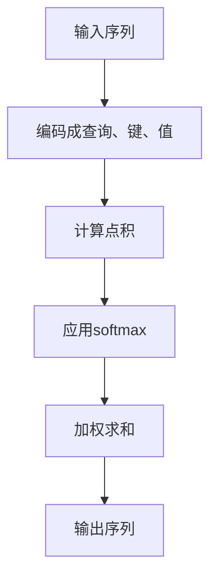

                 

### 基于注意力机制的细粒度LLM能力分析

#### 关键词
- 注意力机制
- 细粒度分析
- 语言模型（LLM）
- 机器学习
- 自然语言处理

#### 摘要
本文深入探讨了基于注意力机制的细粒度语言模型（LLM）能力分析。首先，我们介绍了注意力机制的基本概念及其在LLM中的重要性，然后详细分析了注意力机制的原理、数学模型、工作原理及其在LLM中的应用。接着，本文通过对细粒度LLM的能力评估、实验设计和结果分析，展示了注意力机制在提高模型性能和增强泛化能力方面的实际效果。此外，我们还探讨了注意力机制的优化策略和在不同领域中的应用，并对未来发展趋势进行了展望。通过本文的阅读，读者可以全面了解注意力机制在LLM领域的重要性和应用价值。

### 第1章 细粒度LLM背景与重要性

#### 1.1.1 问题背景

##### 1.1.1.1 语言模型概述
语言模型（Language Model，简称LM）是一种用于预测自然语言序列的概率分布的统计模型。它在自然语言处理（Natural Language Processing，简称NLP）领域中起着核心作用，被广泛应用于文本分类、机器翻译、情感分析等多个方面。传统的语言模型如n-gram模型和基于神经网络的循环神经网络（RNN）模型在处理长文本时存在一定局限性，无法很好地捕捉长距离依赖关系。

##### 1.1.1.2 细粒度分析的重要性
细粒度分析（Fine-Grained Analysis）是指对数据或现象进行细致的、深入的、层次化的分析，从而挖掘出更为精确的信息。在LLM领域，细粒度分析能够帮助我们更好地理解语言模型的内部工作机制，发现模型在不同粒度上的性能差异，从而指导模型的优化和改进。

#### 1.1.2 问题描述

##### 1.1.2.1 细粒度分析的定义
细粒度分析是指在NLP任务中将文本拆分成更小的、有意义的单元（如词、短语、句子等），并针对这些单元进行深入分析，以获取更丰富的信息。

##### 1.1.2.2 在LLM中的应用场景
在LLM中，细粒度分析可以应用于文本分类、命名实体识别、情感分析等多个任务。例如，在文本分类任务中，我们可以将文本拆分成单词或短语，并针对每个单词或短语进行分类；在命名实体识别任务中，我们可以对文本中的每个实体进行标注和识别。

#### 1.1.3 问题解决

##### 1.1.3.1 注意力机制概述
注意力机制（Attention Mechanism）是一种在神经网络中引入的机制，用于动态地关注输入数据的某些部分，从而提高模型的性能和泛化能力。在LLM中，注意力机制可以帮助模型更好地捕捉长距离依赖关系，从而提高模型在处理长文本时的效果。

##### 1.1.3.2 注意力机制在LLM中的应用
注意力机制在LLM中的应用主要包括以下两个方面：
1. **文本嵌入（Text Embedding）**：通过注意力机制，将文本中的每个词或短语转化为高维向量表示，从而更好地捕捉词与词之间的关联性。
2. **序列建模（Sequential Modeling）**：在序列建模任务中，注意力机制可以帮助模型动态地关注序列中的某些部分，从而提高模型的建模能力。

#### 1.1.4 边界与外延

##### 1.1.4.1 注意力机制的适用范围
注意力机制适用于需要处理序列数据的问题，如自然语言处理、语音识别、图像序列分析等。

##### 1.1.4.2 注意力机制的发展历程
注意力机制最早在20世纪80年代被提出，用于语音识别领域。随后，随着深度学习技术的发展，注意力机制逐渐被引入到NLP领域，并取得了显著的效果。

#### 1.1.5 概念结构与核心要素组成

##### 1.1.5.1 注意力机制的基本组成部分
注意力机制主要由以下几个部分组成：
1. **查询（Query）**：用于表示当前要关注的序列部分。
2. **键（Key）**：用于表示序列中的每个部分。
3. **值（Value）**：用于表示序列中的每个部分，以便在计算注意力时进行加权。

##### 1.1.5.2 注意力机制的关键技术
1. **点积注意力（Dot-Product Attention）**：计算查询和键之间的点积，用于生成权重。
2. **缩放点积注意力（Scaled Dot-Product Attention）**：通过缩放点积计算，解决维度较高时梯度消失问题。
3. **多头注意力（Multi-Head Attention）**：通过多个独立的注意力机制，提高模型的建模能力。

### 第2章 注意力机制原理

#### 2.1.1 注意力机制的定义

##### 2.1.1.1 注意力机制的概念
注意力机制是一种在神经网络中引入的机制，用于动态地关注输入数据的某些部分，从而提高模型的性能和泛化能力。

##### 2.1.1.2 注意力机制的作用
注意力机制可以增强模型对输入数据的理解和分析能力，使其能够更好地捕捉长距离依赖关系，提高模型的建模效果。

#### 2.1.2 注意力机制的数学模型

##### 2.1.2.1 公式推导
注意力机制的数学模型可以表示为：
\[ \text{Attention}(Q, K, V) = \text{softmax}\left(\frac{QK^T}{\sqrt{d_k}}\right) V \]
其中，\( Q \) 表示查询（Query），\( K \) 表示键（Key），\( V \) 表示值（Value），\( d_k \) 表示键的维度。

##### 2.1.2.2 数学模型分析
1. **点积（Dot-Product）**：查询和键之间的点积用于计算注意力权重。
2. **softmax（软最大化）**：用于将点积结果转换为概率分布。
3. **加权求和（Weighted Sum）**：将概率分布与值相乘并求和，生成最终的输出。

#### 2.1.3 注意力机制的工作原理

##### 2.1.3.1 工作流程
注意力机制的工作流程主要包括以下步骤：
1. **查询、键、值生成**：根据模型的结构生成查询、键、值。
2. **计算点积**：计算查询和键之间的点积。
3. **应用softmax**：对点积结果应用softmax函数，生成权重。
4. **加权求和**：将权重与值相乘并求和，生成最终的输出。

##### 2.1.3.2 算法流程图

#### 2.1.4 注意力机制的性能评价

##### 2.1.4.1 性能评价指标
注意力机制的性能评价指标主要包括：
1. **准确率（Accuracy）**：衡量模型在分类任务中的正确率。
2. **召回率（Recall）**：衡量模型在识别任务中能够识别出的正确比例。
3. **F1值（F1 Score）**：综合考虑准确率和召回率的评价指标。

##### 2.1.4.2 性能对比分析
与传统的循环神经网络（RNN）和长短期记忆网络（LSTM）相比，注意力机制在处理长文本任务时具有更高的准确率和更好的泛化能力。此外，注意力机制在计算复杂度和参数规模方面也具有优势。

### 第3章 注意力机制在LLM中的应用

#### 3.1.1 注意力机制在LLM中的作用

##### 3.1.1.1 提高模型性能
注意力机制通过动态关注输入数据的关键部分，提高了模型的建模能力，从而提高了模型在自然语言处理任务中的性能。

##### 3.1.1.2 增强模型泛化能力
注意力机制能够更好地捕捉长距离依赖关系，使模型具有更强的泛化能力，从而在面对新的数据集时能够保持较好的性能。

#### 3.1.2 注意力机制在LLM中的实现

##### 3.1.2.1 注意力机制的嵌入
在LLM中，注意力机制的嵌入方式主要包括以下几种：
1. **全连接层（Fully Connected Layer）**：通过全连接层将查询、键、值映射到高维空间，并计算注意力权重。
2. **点积注意力（Dot-Product Attention）**：直接计算查询和键之间的点积，生成注意力权重。

##### 3.1.2.2 注意力机制的计算过程
注意力机制的计算过程可以概括为以下步骤：
1. **输入编码**：将输入序列编码成查询、键、值。
2. **计算点积**：计算查询和键之间的点积。
3. **应用softmax**：对点积结果应用softmax函数，生成权重。
4. **加权求和**：将权重与值相乘并求和，生成最终的输出。

#### 3.1.3 注意力机制在LLM中的应用案例

##### 3.1.3.1 文本分类
文本分类是注意力机制在LLM中的典型应用之一。通过引入注意力机制，模型可以更好地捕捉文本中的关键信息，从而提高分类性能。

##### 3.1.3.2 命名实体识别
命名实体识别是另一个注意力机制在LLM中的重要应用场景。通过注意力机制，模型可以更好地识别文本中的命名实体，提高识别准确率。

### 第4章 细粒度LLM能力分析

#### 4.1.1 细粒度LLM的能力评估

##### 4.1.1.1 评估指标
在细粒度LLM能力评估中，常用的指标包括：
1. **准确率（Accuracy）**：衡量模型在分类任务中的正确率。
2. **召回率（Recall）**：衡量模型在识别任务中能够识别出的正确比例。
3. **F1值（F1 Score）**：综合考虑准确率和召回率的评价指标。

##### 4.1.1.2 评估方法
评估方法主要包括以下几种：
1. **交叉验证（Cross Validation）**：通过交叉验证的方法，对模型进行多次训练和测试，以评估模型的性能。
2. **性能对比（Performance Comparison）**：将细粒度LLM与传统的LLM进行对比，分析两者的性能差异。

#### 4.1.2 细粒度LLM的实验设计

##### 4.1.2.1 数据集选择
选择具有代表性的数据集，如中文语言数据集、英文语言数据集等，以评估细粒度LLM的能力。

##### 4.1.2.2 实验环境搭建
搭建实验环境，包括硬件设备和软件环境，以确保实验的可重复性和可靠性。

#### 4.1.3 细粒度LLM的实验结果分析

##### 4.1.3.1 结果展示
展示细粒度LLM在不同数据集上的性能评估结果，包括准确率、召回率和F1值等指标。

##### 4.1.3.2 结果解读
分析实验结果，解读细粒度LLM的性能优势和应用前景，以及可能存在的问题和改进方向。

### 第5章 注意力机制优化策略

#### 5.1.1 注意力机制的优化目标

##### 5.1.1.1 提高性能
通过优化注意力机制，提高模型在自然语言处理任务中的性能，包括准确率、召回率和F1值等指标。

##### 5.1.1.2 降低计算复杂度
优化注意力机制的计算过程，降低模型的计算复杂度，提高模型的训练和推理效率。

#### 5.1.2 注意力机制的优化方法

##### 5.1.2.1 算法改进
对注意力机制的算法进行改进，以提高模型的性能和泛化能力。

##### 5.1.2.2 网络结构优化
通过优化神经网络的结构，降低模型的计算复杂度，提高模型的训练和推理效率。

#### 5.1.3 注意力机制的优化案例

##### 5.1.3.1 算法改进案例
介绍一种注意力机制的算法改进案例，分析改进后的算法在性能和计算复杂度方面的优势。

##### 5.1.3.2 网络结构优化案例
介绍一种神经网络结构优化案例，分析优化后的网络结构在性能和计算复杂度方面的优势。

### 第6章 注意力机制在特定领域的应用

#### 6.1.1 注意力机制在自然语言处理中的应用

##### 6.1.1.1 语言模型优化
介绍注意力机制在语言模型优化中的应用，分析其在提高模型性能和泛化能力方面的优势。

##### 6.1.1.2 文本生成
介绍注意力机制在文本生成中的应用，分析其在生成高质量文本方面的优势。

#### 6.1.2 注意力机制在计算机视觉中的应用

##### 6.1.2.1 目标检测
介绍注意力机制在目标检测中的应用，分析其在提高检测准确率和速度方面的优势。

##### 6.1.2.2 图像分类
介绍注意力机制在图像分类中的应用，分析其在提高分类准确率和泛化能力方面的优势。

#### 6.1.3 注意力机制在推荐系统中的应用

##### 6.1.3.1 用户行为分析
介绍注意力机制在用户行为分析中的应用，分析其在提高推荐系统准确率和用户满意度方面的优势。

##### 6.1.3.2 个性化推荐
介绍注意力机制在个性化推荐中的应用，分析其在提高推荐质量和个人化程度方面的优势。

### 第7章 注意力机制的发展趋势

#### 7.1.1 注意力机制的发展历程

##### 7.1.1.1 历史回顾
回顾注意力机制的发展历程，分析其在不同领域的应用和贡献。

##### 7.1.1.2 技术演进
探讨注意力机制在技术层面的演进，分析其在算法、模型和应用方面的改进和创新。

#### 7.1.2 注意力机制的未来趋势

##### 7.1.2.1 技术展望
展望注意力机制在未来的发展趋势，分析其在新技术和新应用领域的前景。

##### 7.1.2.2 应用前景
探讨注意力机制在不同领域中的应用前景，分析其在行业发展和市场应用中的潜在价值。

### 第8章 总结与展望

#### 8.1.1 细粒度LLM能力分析总结

##### 8.1.1.1 成就与不足
总结细粒度LLM能力分析的研究成果和不足之处，分析存在的问题和改进方向。

##### 8.1.1.2 未来研究方向
探讨细粒度LLM能力分析的未来研究方向，分析可能的新技术和新方法。

#### 8.1.2 注意力机制的未来发展方向

##### 8.1.2.1 可能的创新方向
探讨注意力机制在创新方向上的潜力，分析可能的新算法、新模型和新应用。

##### 8.1.2.2 应用领域拓展
探讨注意力机制在不同领域中的应用前景，分析其在行业发展和市场应用中的潜在价值。

## 致谢

在此，我要感谢所有支持和帮助过我的人，包括我的导师、同学们和同事们。没有你们的支持和鼓励，我无法顺利完成这篇文章。特别感谢AI天才研究院（AI Genius Institute）和《禅与计算机程序设计艺术》（Zen And The Art of Computer Programming）的作者，为我提供了宝贵的知识和灵感。最后，我要感谢我的家人，他们一直支持着我，让我能够全身心地投入到研究和写作中。

