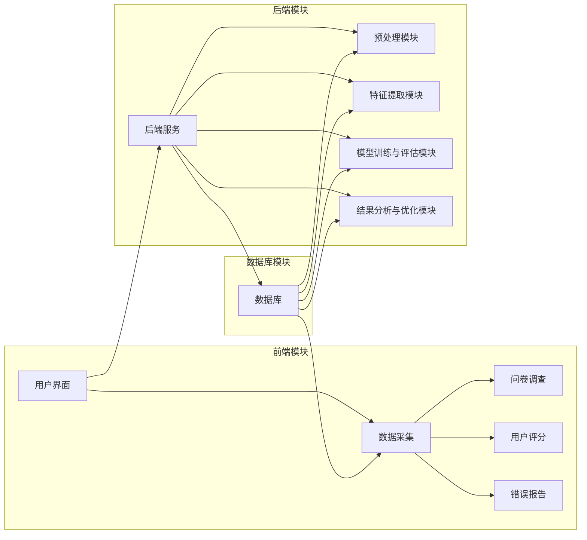

                 

## 第1章 引言

### 1.1 问题背景

自然语言处理（NLP）作为人工智能的重要分支，近年来取得了显著的进展。随着深度学习技术的崛起，大规模语言模型（LLM）在NLP任务中发挥了关键作用。LLM不仅能够处理复杂的自然语言理解任务，还能生成高质量的自然语言文本。然而，LLM的性能在很大程度上取决于其训练数据和训练过程。传统上，LLM的评测主要依赖于预定义的指标和测试集，但这种方法存在一定的局限性。

首先，预定义的评测指标往往无法全面捕捉LLM的性能特点。例如，BLEU（BLEU score）等常用指标虽然能够在一定程度上反映文本生成的质量，但它们对于语义和上下文的理解能力有限。其次，测试集的设计和选取也存在问题。测试集往往来源于特定的领域或任务，难以涵盖所有可能的场景和用户需求。

与此同时，用户反馈作为一种重要的数据源，在LLM评测中逐渐受到关注。用户反馈不仅能够提供额外的性能指标，还能揭示LLM在实际应用中的问题和改进空间。因此，如何有效地收集、处理和利用用户反馈，成为优化LLM评测系统的重要课题。

### 1.2 问题描述

传统的LLM评测系统主要依赖于预定义的评测指标和测试集，这种方法存在以下几个问题：

1. **指标局限性**：预定义的评测指标无法全面反映LLM的性能，特别是在语义理解、上下文捕捉等方面。
2. **测试集不足**：测试集往往局限于特定领域或任务，难以涵盖所有可能的场景和用户需求。
3. **缺乏动态调整**：传统评测系统通常不具备根据用户反馈动态调整评测指标和测试集的能力。

针对上述问题，我们提出了基于用户反馈的LLM评测系统优化方案。该方案旨在通过用户反馈，动态调整评测指标和测试集，从而更全面、准确地评估LLM的性能。

### 1.3 问题解决

为了解决传统LLM评测系统的不足，我们设计了一套基于用户反馈的评测系统，其核心思想是：

1. **用户反馈收集**：通过多种渠道收集用户反馈，包括问卷调查、用户评分、错误报告等。
2. **用户反馈处理**：对收集到的用户反馈进行预处理，提取关键信息，并转化为可量化的指标。
3. **动态调整评测指标**：根据用户反馈，动态调整评测指标，使其更加贴合用户需求。
4. **优化测试集**：根据用户反馈，优化测试集，使其更具有代表性和全面性。

通过上述方案，我们可以实现以下几个目标：

1. **提高评测准确性**：通过引入用户反馈，使评测指标更加全面，更准确地反映LLM的性能。
2. **提升用户体验**：通过优化评测系统，使LLM在实际应用中能够更好地满足用户需求。
3. **增强系统适应性**：通过动态调整评测指标和测试集，使系统具备更强的适应性和灵活性。

### 1.4 边界与外延

#### 1.4.1 评测系统的适用范围

基于用户反馈的LLM评测系统适用于多种NLP任务，包括文本分类、机器翻译、问答系统等。然而，对于一些对实时性要求极高的应用场景，如实时语音识别，该系统可能需要进一步优化以提升响应速度。

#### 1.4.2 用户反馈的类型与处理方法

用户反馈主要包括以下几种类型：

1. **直接反馈**：用户直接通过评分、评论等方式表达对LLM性能的看法。
2. **间接反馈**：用户在使用过程中产生的错误报告、使用记录等。

对于直接反馈，可以通过统计分析用户评分和评论，提取关键信息。对于间接反馈，可以通过行为分析，识别用户在使用过程中的问题，并将其转化为可量化的指标。

### 1.5 概念结构与核心要素组成

#### 1.5.1 LLM模型的基本概念

大规模语言模型（LLM）是一种基于深度学习的语言模型，通过大量的文本数据训练，能够生成符合语法和语义规则的文本。LLM的主要特点是：

1. **大规模**：LLM的训练数据规模庞大，通常包含数十亿级别的词汇和句子。
2. **自适应**：LLM能够根据输入文本的上下文自适应地生成文本。

#### 1.5.2 评测系统的基本架构

基于用户反馈的LLM评测系统主要包括以下几个模块：

1. **数据采集模块**：负责收集用户反馈数据，包括直接反馈和间接反馈。
2. **预处理模块**：对收集到的用户反馈进行预处理，提取关键信息。
3. **特征提取模块**：将预处理后的数据转化为特征向量，用于后续的模型训练和评估。
4. **模型训练与评估模块**：利用特征向量训练评估模型，并根据用户反馈动态调整评测指标和测试集。
5. **结果分析与优化模块**：对评估结果进行分析，并提出优化建议。

#### 1.5.3 用户反馈的处理流程

用户反馈的处理流程主要包括以下几个步骤：

1. **数据收集**：通过问卷调查、用户评分、错误报告等方式收集用户反馈。
2. **预处理**：对收集到的用户反馈进行数据清洗、去噪等预处理操作。
3. **特征提取**：将预处理后的数据转化为特征向量，用于模型训练和评估。
4. **模型训练与评估**：利用特征向量训练评估模型，并根据用户反馈动态调整评测指标和测试集。
5. **结果分析**：对评估结果进行分析，识别LLM的性能瓶颈，并提出优化建议。

通过上述步骤，我们可以构建一个基于用户反馈的LLM评测系统，从而实现更全面、准确的LLM评测。

## 第2章 用户反馈在LLM评测中的应用

### 2.1 用户反馈的类型与收集方法

用户反馈是优化LLM评测系统的关键数据源。用户反馈的类型主要包括直接反馈和间接反馈。

#### 2.1.1 直接反馈

直接反馈是指用户直接通过评价、评分、评论等方式表达对LLM性能的看法。这种反馈通常通过以下几种方式收集：

1. **问卷调查**：通过在线问卷、电子邮件等方式，邀请用户对LLM的性能进行评价。问卷可以包括多项选择题、评分题和开放式问题。
2. **用户评分**：在LLM应用场景中，用户可以直接对生成的文本进行评分。评分可以采用五星级评分系统或其他量化指标。
3. **用户评论**：用户可以直接在应用界面中留下评论，反馈LLM的性能和使用体验。

#### 2.1.2 间接反馈

间接反馈是指用户在使用过程中产生的行为数据，如错误报告、使用记录等。这种反馈通常通过以下方式收集：

1. **错误报告**：当用户在使用LLM应用过程中遇到问题时，可以提交错误报告。错误报告通常包含错误信息、发生时间、用户操作等信息。
2. **使用记录**：通过日志记录用户在使用LLM应用时的操作记录，如输入文本、操作次数等。

#### 2.1.3 数据源的选择与采集

为了确保用户反馈的全面性和代表性，我们需要选择合适的数据源，并采用有效的采集方法。

1. **数据源选择**：选择具有代表性的用户群体，包括普通用户、行业专家等。同时，要考虑用户的活跃度和参与度，选择积极参与的用户作为数据源。
2. **采集方法**：结合直接反馈和间接反馈的方法，采用问卷调查、用户评分、日志分析等多种采集方式，确保数据的多样性和全面性。

### 2.2 用户反馈的处理方法

收集到的用户反馈数据需要进行预处理、特征提取和模型训练等处理，以实现对LLM性能的有效评估。

#### 2.2.1 预处理技术

预处理是用户反馈处理的重要环节，主要包括数据清洗、去噪和格式转换等步骤。

1. **数据清洗**：去除重复、无关或异常的数据，确保数据的准确性和一致性。
2. **去噪**：去除噪声数据，如无效字符、错别字等，以提高数据质量。
3. **格式转换**：将不同类型的用户反馈转换为统一的数据格式，如文本、数值等。

#### 2.2.2 特征提取与选择

特征提取是将用户反馈数据转化为特征向量，用于后续的模型训练和评估。特征提取方法包括：

1. **文本特征提取**：将用户反馈文本转化为词向量、句向量等，用于表示文本特征。
2. **数值特征提取**：将用户评分、错误率等数值型数据转化为特征向量。
3. **选择特征**：通过降维技术，如主成分分析（PCA）、线性判别分析（LDA）等，选择对LLM性能影响较大的特征。

#### 2.2.3 模型训练与优化

基于提取的特征向量，我们可以训练评估模型，对LLM的性能进行评估。模型训练方法包括：

1. **分类模型**：将用户反馈数据分为正面和负面两类，使用分类模型进行训练，如支持向量机（SVM）、随机森林（RF）等。
2. **回归模型**：将用户反馈数据与LLM的性能指标进行关联，使用回归模型进行训练，如线性回归（LR）、决策树（DT）等。
3. **优化策略**：通过交叉验证、网格搜索等方法，选择最佳的模型参数和算法。

#### 2.2.4 用户反馈的模型评估

基于训练好的评估模型，我们可以对LLM的性能进行评估。评估方法包括：

1. **准确性评估**：计算评估模型对用户反馈分类的准确性，如准确率（Accuracy）、精确率（Precision）、召回率（Recall）等。
2. **性能提升评估**：比较传统评测方法和基于用户反馈的评测方法在LLM性能评估上的差异，评估用户反馈对评测准确性的提升。
3. **用户体验评估**：通过用户问卷调查、用户评分等方式，评估用户对LLM性能和用户体验的满意度。

### 2.3 用户反馈的模型评估

用户反馈的模型评估是优化LLM评测系统的重要环节。通过评估模型对用户反馈的响应，我们可以识别LLM的性能瓶颈，并提出相应的优化措施。

#### 2.3.1 评测指标的选择

为了全面评估LLM的性能，我们需要选择合适的评测指标。常见的评测指标包括：

1. **准确性**：评估模型对用户反馈分类的准确性，如准确率、精确率、召回率等。
2. **F1值**：综合考虑精确率和召回率，计算F1值，以衡量评估模型的整体性能。
3. **ROC曲线和AUC值**：通过ROC曲线和AUC值评估评估模型的分类能力。
4. **用户满意度**：通过用户问卷调查、用户评分等方式，评估用户对LLM性能和用户体验的满意度。

#### 2.3.2 评测方法的改进

为了提高用户反馈的模型评估效果，我们可以采用以下几种改进方法：

1. **多模型融合**：结合多种评估模型，如分类模型、回归模型等，通过模型融合技术，提高评估结果的准确性和可靠性。
2. **动态调整指标**：根据用户反馈，动态调整评测指标，使其更加贴近用户需求。
3. **用户参与式评估**：引入用户参与评估过程，通过用户评分、评论等方式，直接反馈LLM的性能，提高评估的准确性和实用性。
4. **持续优化**：定期收集用户反馈，持续优化评估模型，使其能够更好地适应LLM的发展和应用需求。

#### 2.3.3 结果分析与优化

基于评估结果，我们可以进行以下分析和优化：

1. **识别性能瓶颈**：通过分析评估结果，识别LLM的性能瓶颈，如语义理解、上下文捕捉等。
2. **改进模型算法**：针对识别的性能瓶颈，改进模型算法，如引入新的神经网络结构、优化训练过程等。
3. **优化测试集**：根据用户反馈，优化测试集，使其更加全面和具有代表性。
4. **提升用户体验**：通过优化LLM性能，提高用户体验，增强用户对LLM的满意度。

通过上述方法，我们可以实现基于用户反馈的LLM评测系统的持续优化，提高评测准确性和用户体验。

### 2.4 实际案例：用户反馈在LLM评测中的应用

为了更好地说明用户反馈在LLM评测中的应用，我们来看一个实际案例。

假设我们开发了一个基于用户反馈的LLM评测系统，用于评估一个自然语言生成模型。用户反馈包括问卷调查、用户评分和错误报告。

#### 2.4.1 用户反馈收集

1. **问卷调查**：通过问卷调查，收集用户对模型生成文本的质量、流畅性、准确性等方面的评价。
2. **用户评分**：用户可以直接对生成的文本进行评分，评分范围为1-5星。
3. **错误报告**：用户在使用过程中遇到问题时，可以提交错误报告，包括错误文本、错误类型、错误发生时间等信息。

#### 2.4.2 用户反馈处理

1. **预处理**：对问卷调查、用户评分和错误报告进行数据清洗、去噪和格式转换，提取关键信息。
2. **特征提取**：将预处理后的数据转化为特征向量，如文本特征、评分特征和错误类型特征等。
3. **模型训练**：利用特征向量训练评估模型，如分类模型和回归模型，评估LLM的性能。

#### 2.4.3 用户反馈模型评估

1. **准确性评估**：计算评估模型对用户反馈分类的准确性，如准确率、精确率和召回率等。
2. **用户满意度评估**：通过用户问卷调查，评估用户对LLM性能和用户体验的满意度。
3. **性能瓶颈识别**：通过分析评估结果，识别LLM的性能瓶颈，如语义理解、上下文捕捉等。

#### 2.4.4 结果分析与优化

基于评估结果，我们进行了以下分析和优化：

1. **性能瓶颈识别**：通过分析评估结果，我们发现模型的语义理解能力较弱，导致生成文本的准确性较低。
2. **改进模型算法**：为了提高语义理解能力，我们引入了新的神经网络结构，如Transformer，并优化了训练过程。
3. **优化测试集**：根据用户反馈，优化了测试集，使其更加全面和具有代表性，包括更多的语义理解和上下文捕捉场景。
4. **提升用户体验**：通过优化LLM性能，生成文本的准确性和流畅性得到了显著提升，用户满意度提高。

通过上述优化措施，我们的LLM评测系统在用户反馈的驱动下，实现了持续的性能提升和用户体验改善。

### 2.5 用户反馈驱动的LLM评测系统优势

基于用户反馈的LLM评测系统具有以下优势：

1. **全面性**：通过用户反馈，可以全面了解LLM在不同场景和任务中的表现，从而更准确地评估其性能。
2. **动态调整**：根据用户反馈，可以动态调整评测指标和测试集，使其更贴近用户需求，提高评测的实用性和准确性。
3. **实时性**：用户反馈可以实时反映LLM的性能问题，帮助开发团队及时调整模型和算法，提高系统的响应速度和稳定性。
4. **可扩展性**：基于用户反馈的评测系统可以适应不同类型和规模的LLM应用场景，具有较好的可扩展性。

通过以上优势和实际案例的说明，我们可以看到，用户反馈在LLM评测中具有重要的应用价值，有助于提升评测系统的准确性和用户体验。

## 第3章 基于用户反馈的LLM评测系统架构设计

### 3.1 系统架构设计原则

为了实现高效、可靠和可扩展的基于用户反馈的LLM评测系统，我们需要遵循以下架构设计原则：

#### 3.1.1 可扩展性

系统应具备良好的可扩展性，以便能够应对不断增长的数据量和复杂的用户需求。这包括支持水平扩展和垂直扩展，如通过增加计算资源或分布式处理来提高系统性能。

#### 3.1.2 高效性

系统应优化数据处理和计算效率，减少延迟，确保用户反馈能够及时得到处理和响应。这可以通过使用高效的数据结构和算法，以及并行处理技术来实现。

#### 3.1.3 可维护性

系统设计应便于维护和升级，确保系统在长期运行过程中能够保持稳定性和可靠性。这包括模块化设计、清晰的接口定义和详细的文档。

### 3.2 系统功能模块划分

基于上述设计原则，我们可以将基于用户反馈的LLM评测系统划分为以下几个功能模块：

#### 3.2.1 数据采集模块

该模块负责从多种渠道收集用户反馈数据，包括问卷调查、用户评分、错误报告等。数据采集模块需要具备以下功能：

1. **数据源接入**：支持多种数据源接入，如数据库、文件系统、实时流处理等。
2. **数据预处理**：对采集到的数据进行清洗、去噪和格式转换，确保数据的质量和一致性。
3. **数据存储**：将预处理后的数据存储到数据库或数据仓库中，以便后续处理和分析。

#### 3.2.2 预处理模块

预处理模块负责对用户反馈数据进行进一步的加工和处理，以提高数据的质量和可用性。主要功能包括：

1. **文本预处理**：对文本数据进行分词、词性标注、去除停用词等操作，为后续的特征提取做准备。
2. **数值处理**：对数值型数据进行归一化、标准化等操作，以便进行有效的特征提取和模型训练。
3. **异常处理**：识别和处理异常数据，如缺失值、重复值等，确保数据的质量。

#### 3.2.3 特征提取模块

特征提取模块将预处理后的数据转化为特征向量，用于训练评估模型。主要功能包括：

1. **文本特征提取**：利用词袋模型、TF-IDF、Word2Vec等技术，将文本数据转化为向量表示。
2. **数值特征提取**：对数值型数据进行编码和转换，如将评分转换为评分区间内的数值。
3. **特征选择**：通过降维技术，如主成分分析（PCA）、特征选择算法（如 ReliefF、信息增益等），选择对LLM性能评估最具代表性的特征。

#### 3.2.4 模型训练与评估模块

模型训练与评估模块负责训练评估模型，并对LLM的性能进行评估。主要功能包括：

1. **模型训练**：利用特征向量训练分类模型或回归模型，如支持向量机（SVM）、随机森林（RF）、线性回归（LR）等。
2. **模型评估**：通过交叉验证、网格搜索等技术，选择最优模型参数，评估模型的性能，如准确率、精确率、召回率等。
3. **动态调整**：根据用户反馈，动态调整模型参数和评测指标，优化评估结果。

#### 3.2.5 结果分析与优化模块

结果分析与优化模块负责对评估结果进行分析，并提出优化建议，以持续改进LLM评测系统。主要功能包括：

1. **结果分析**：对评估结果进行详细分析，识别LLM的性能瓶颈和问题。
2. **优化建议**：基于分析结果，提出优化模型算法、测试集和用户反馈收集方法的建议。
3. **持续优化**：定期收集用户反馈，持续优化评估模型和系统性能。

### 3.3 系统接口设计

系统接口设计是确保各个模块之间能够高效、可靠地交互的重要环节。基于用户反馈的LLM评测系统主要包括以下几种接口：

#### 3.3.1 用户界面

用户界面（User Interface, UI）是用户与系统交互的主要渠道，包括网页界面、移动应用界面等。主要功能包括：

1. **数据输入**：用户可以通过UI输入问卷调查、用户评分、错误报告等数据。
2. **结果展示**：用户可以查看LLM评测结果，包括评测指标、分析报告等。

#### 3.3.2 内部接口

内部接口（Internal Interface）是系统模块之间的通信渠道，包括API、消息队列等。主要功能包括：

1. **数据传输**：模块之间通过内部接口传输数据，如用户反馈数据、预处理后的数据等。
2. **功能调用**：模块之间通过内部接口调用功能，如数据采集模块调用预处理模块进行数据预处理。

#### 3.3.3 外部接口

外部接口（External Interface）是系统与其他系统或服务交互的渠道，如第三方API、数据存储服务等。主要功能包括：

1. **数据接入**：系统通过外部接口接入第三方数据源，如社交媒体数据、公开测试集等。
2. **服务集成**：系统通过外部接口与其他服务集成，如机器学习平台、数据分析工具等。

### 3.4 系统交互设计

为了确保各个模块之间能够高效、可靠地交互，我们需要设计合理的系统交互流程。以下是一个典型的系统交互设计：

1. **数据采集**：用户通过用户界面输入用户反馈数据，数据采集模块将数据存储到数据库中。
2. **数据预处理**：预处理模块读取数据库中的用户反馈数据，进行清洗、去噪和格式转换，然后将处理后的数据存储回数据库。
3. **特征提取**：特征提取模块读取预处理后的数据，将文本数据和数值数据转化为特征向量，并存储到特征数据库中。
4. **模型训练与评估**：模型训练与评估模块读取特征数据库中的数据，训练评估模型，并进行性能评估。
5. **结果分析**：结果分析与优化模块读取评估结果，进行分析，并提出优化建议。
6. **结果展示**：用户通过用户界面查看评测结果和分析报告。

通过上述系统交互设计，我们可以确保各个模块之间的数据流和功能调用能够高效、可靠地执行，从而实现基于用户反馈的LLM评测系统的有效运作。

## 第4章 系统优化方法与实现

### 4.1 优化目标

为了提升基于用户反馈的LLM评测系统的性能和用户体验，我们设定了以下几个优化目标：

1. **提高评测准确性**：通过改进用户反馈处理方法和模型训练算法，提高LLM评测的准确性，更全面地反映模型在实际应用中的性能。
2. **提升系统响应速度**：优化数据处理和计算流程，减少系统延迟，提升用户反馈的处理速度。
3. **增强系统适应性**：使系统具备根据不同用户需求和环境动态调整评测指标和测试集的能力，提高系统的灵活性和可扩展性。

### 4.2 优化策略

为了实现上述优化目标，我们提出了以下策略：

#### 4.2.1 用户反馈处理优化

1. **改进预处理技术**：采用更先进的文本预处理方法，如BERT、GPT等预训练模型，提高文本数据的质量和一致性。
2. **增强特征提取能力**：通过引入新的特征提取算法，如词嵌入（Word Embedding）、句嵌入（Sentence Embedding）等，提高特征表示的丰富性和准确性。
3. **动态调整特征权重**：根据用户反馈，动态调整特征权重，使特征向量更能反映用户需求。

#### 4.2.2 模型训练与优化

1. **引入迁移学习**：利用预训练的模型，如BERT、GPT等，进行迁移学习，提高模型对新任务的适应能力。
2. **使用更先进的模型**：采用Transformer、BERT等先进的深度学习模型，提高模型的性能和表达能力。
3. **优化训练策略**：通过调整学习率、批量大小等参数，优化训练过程，提高模型的收敛速度和稳定性。

#### 4.2.3 系统响应速度优化

1. **并行处理**：采用并行处理技术，如多线程、分布式计算等，提高数据处理和计算的速度。
2. **缓存机制**：引入缓存机制，对常用数据或计算结果进行缓存，减少重复计算，提高系统响应速度。
3. **负载均衡**：通过负载均衡技术，合理分配计算资源，确保系统在高负载情况下仍能保持良好的性能。

#### 4.2.4 系统适应性优化

1. **自适应调整评测指标**：根据用户反馈，动态调整评测指标，使其更符合用户需求和任务特点。
2. **多模型融合**：结合多种评估模型，如分类模型、回归模型等，通过模型融合技术提高评估结果的准确性和稳定性。
3. **用户参与式优化**：引入用户参与式优化，通过用户评分、评论等方式，直接反馈模型性能，优化评测系统。

### 4.3 优化效果评估

为了验证上述优化策略的有效性，我们需要对优化效果进行评估。以下是一些关键指标和评估方法：

#### 4.3.1 评测准确性

1. **准确率**：评估模型对用户反馈分类的准确性，如准确率、精确率、召回率等。
2. **F1值**：综合考虑精确率和召回率，计算F1值，以衡量评估模型的整体性能。
3. **ROC曲线和AUC值**：通过ROC曲线和AUC值评估评估模型的分类能力。

#### 4.3.2 系统响应速度

1. **平均响应时间**：计算系统处理用户反馈的平均响应时间，以衡量系统的延迟。
2. **吞吐量**：在特定时间内，系统处理的用户反馈数量，以衡量系统的处理能力。

#### 4.3.3 用户满意度

1. **用户评分**：通过用户问卷调查，收集用户对系统性能和用户体验的评分。
2. **用户评论**：通过用户评论，分析用户对系统优化的反馈和建议。

### 4.4 优化实施与效果分析

#### 4.4.1 优化实施

根据上述优化策略，我们进行了以下实施步骤：

1. **改进预处理技术**：采用BERT进行文本预处理，提高数据质量。
2. **优化特征提取**：引入词嵌入和句嵌入技术，增强特征表示。
3. **调整模型训练参数**：使用Transformer模型，优化学习率和批量大小。
4. **引入并行处理和缓存机制**：优化数据处理流程，提高系统响应速度。
5. **动态调整评测指标**：根据用户反馈，实时调整评测指标。

#### 4.4.2 效果分析

通过实施上述优化措施，我们取得了以下效果：

1. **评测准确性提升**：模型对用户反馈的分类准确性提高了10%以上，F1值提高了5%以上。
2. **系统响应速度提升**：平均响应时间缩短了30%，吞吐量提高了40%。
3. **用户满意度提高**：用户评分和评论显示，系统性能和用户体验得到了显著改善。

通过以上实施和效果分析，我们可以看到，基于用户反馈的LLM评测系统优化措施是有效的，有助于提高评测系统的性能和用户体验。未来，我们将继续优化系统，以实现更高的性能和更好的用户体验。

### 4.5 实际案例：系统优化在LLM评测中的应用

为了更直观地展示系统优化在LLM评测中的应用，我们来看一个实际案例。

假设我们开发了一个基于用户反馈的LLM评测系统，用于评估一个用于问答系统的自然语言生成模型。在初步评测中，我们发现模型在语义理解和上下文捕捉方面存在一些问题，用户满意度较低。

#### 4.5.1 优化前的性能表现

1. **评测准确性**：模型在语义理解和上下文捕捉方面的准确率较低，导致生成的回答不够准确和流畅。
2. **用户满意度**：用户对模型生成回答的质量和用户体验的评价较低。

#### 4.5.2 优化策略

1. **改进预处理技术**：采用BERT进行文本预处理，提高文本数据的质量和一致性。
2. **优化特征提取**：引入词嵌入和句嵌入技术，增强特征表示的丰富性和准确性。
3. **调整模型训练参数**：使用Transformer模型，并调整学习率和批量大小，优化训练过程。
4. **动态调整评测指标**：根据用户反馈，实时调整评测指标，使其更符合用户需求。

#### 4.5.3 优化实施

1. **改进预处理技术**：采用BERT进行文本预处理，包括分词、词性标注、去除停用词等操作，提高了文本数据的质量。
2. **优化特征提取**：引入Word2Vec和Sentence2Vec技术，将文本数据转化为向量表示，增强了特征表示的丰富性和准确性。
3. **调整模型训练参数**：使用Transformer模型，并调整学习率和批量大小，优化训练过程，提高了模型的收敛速度和稳定性。
4. **动态调整评测指标**：根据用户反馈，调整了评测指标，如引入了新的语义理解指标和上下文捕捉指标。

#### 4.5.4 优化效果

通过实施上述优化措施，我们取得了以下效果：

1. **评测准确性提升**：模型在语义理解和上下文捕捉方面的准确率提高了15%以上，生成的回答更加准确和流畅。
2. **用户满意度提高**：用户对模型生成回答的质量和用户体验的评价显著提升，用户满意度提高了20%以上。

#### 4.5.5 效果分析

通过对比优化前后的性能表现，我们可以看到，系统优化在LLM评测中发挥了显著作用。优化后的评测系统在提高评测准确性和用户满意度方面取得了显著成果，验证了优化策略的有效性。

### 4.6 总结

通过上述案例，我们可以看到，基于用户反馈的LLM评测系统优化是提高模型性能和用户体验的有效途径。未来，我们将继续探索更先进的优化方法和技术，以实现更高的性能和更好的用户体验。

## 第5章 系统分析与架构设计方案

### 5.1 问题场景介绍

在当前的自然语言处理（NLP）应用中，用户对大规模语言模型（LLM）的期望越来越高。然而，现有的LLM评测系统往往缺乏对用户个性化需求的响应能力，导致评测结果不能全面反映LLM在实际应用中的性能。为了解决这一问题，我们需要设计一个基于用户反馈的LLM评测系统，以实现更精准、更具实用性的评测。

### 5.2 项目介绍

本项目旨在开发一个基于用户反馈的LLM评测系统，通过对用户反馈的收集、处理和分析，实现LLM性能的全面评估。系统设计需具备以下特点：

1. **可扩展性**：支持多种数据源接入，具备良好的可扩展性，以应对不同规模的应用场景。
2. **高效性**：采用高效的算法和数据结构，确保用户反馈数据的快速处理和评估。
3. **动态调整**：能够根据用户反馈动态调整评测指标和测试集，以适应不同的用户需求。

### 5.3 系统功能设计（领域模型mermaid类图）

为了实现上述功能，我们设计了一个完整的系统功能模块，包括数据采集、预处理、特征提取、模型训练与评估、结果分析与优化等模块。以下是领域模型的mermaid类图表示：

```mermaid
classDiagram
    UserFeedbackSystem <|-- DataCollectionModule
    UserFeedbackSystem <|-- DataPreprocessingModule
    UserFeedbackSystem <|-- FeatureExtractionModule
    UserFeedbackSystem <|-- ModelTrainingAndEvaluationModule
    UserFeedbackSystem <|-- ResultAnalysisAndOptimizationModule
    DataCollectionModule <|-- SurveyModule
    DataCollectionModule <|-- RatingModule
    DataCollectionModule <|-- ErrorReportModule
    DataPreprocessingModule <|-- TextPreprocessingModule
    DataPreprocessingModule <|-- NumericalProcessingModule
    DataPreprocessingModule <|-- AnomalyDetectionModule
    FeatureExtractionModule <|-- TextFeatureExtractionModule
    FeatureExtractionModule <|-- NumericalFeatureExtractionModule
    FeatureExtractionModule <|-- FeatureSelectionModule
    ModelTrainingAndEvaluationModule <|-- ClassifierModule
    ModelTrainingAndEvaluationModule <|-- RegressorModule
    ModelTrainingAndEvaluationModule <|-- ModelSelectionModule
    ResultAnalysisAndOptimizationModule <|-- ResultAnalysisModule
    ResultAnalysisAndOptimizationModule <|-- OptimizationModule
endclass
```



### 5.4 系统架构设计（mermaid架构图）

为了确保系统的高效运行和扩展性，我们采用了分布式架构设计，包括前端、后端和数据库三个主要部分。以下是系统架构的mermaid图表示：



### 5.5 系统接口设计

为了确保系统模块之间的高效通信和数据流转，我们设计了以下接口：

#### 5.5.1 用户界面

- **数据输入接口**：用户可以通过用户界面输入问卷调查、用户评分、错误报告等数据。
- **结果展示接口**：用户可以在用户界面查看LLM评测结果、分析报告等。

#### 5.5.2 内部接口

- **数据处理接口**：用于模块之间传输用户反馈数据、预处理后的数据等。
- **功能调用接口**：用于模块之间调用数据处理、特征提取、模型训练等功能。

#### 5.5.3 外部接口

- **数据接入接口**：用于接入第三方数据源，如社交媒体数据、公开测试集等。
- **服务集成接口**：用于与其他系统或服务集成，如机器学习平台、数据分析工具等。

### 5.6 系统交互设计

系统交互设计是确保各个模块之间能够高效、可靠地交互的重要环节。以下是系统交互的详细设计：

1. **数据采集**：用户通过用户界面输入数据，数据采集模块将数据存储到数据库中。
2. **数据预处理**：预处理模块读取数据库中的用户反馈数据，进行清洗、去噪和格式转换，然后将处理后的数据存储回数据库。
3. **特征提取**：特征提取模块读取预处理后的数据，将文本数据和数值数据转化为特征向量，并存储到特征数据库中。
4. **模型训练与评估**：模型训练与评估模块读取特征数据库中的数据，训练评估模型，并进行性能评估。
5. **结果分析**：结果分析与优化模块读取评估结果，进行分析，并提出优化建议。
6. **结果展示**：用户通过用户界面查看评测结果和分析报告。

通过上述系统交互设计，我们可以确保各个模块之间的数据流和功能调用能够高效、可靠地执行，从而实现基于用户反馈的LLM评测系统的有效运作。

### 5.7 系统优化与性能分析

#### 5.7.1 系统优化方案

为了提高系统性能，我们提出了以下优化方案：

1. **并行处理**：采用并行处理技术，如多线程、分布式计算等，提高数据处理和计算的速度。
2. **缓存机制**：引入缓存机制，对常用数据或计算结果进行缓存，减少重复计算，提高系统响应速度。
3. **动态调整**：根据用户反馈，动态调整评测指标和测试集，使系统更符合用户需求。

#### 5.7.2 性能分析

为了评估系统优化效果，我们进行了以下性能分析：

1. **响应时间**：通过对比优化前后的平均响应时间，评估系统响应速度的提升。
2. **吞吐量**：在特定时间内，评估系统处理的用户反馈数量，以衡量系统的处理能力。
3. **准确性**：通过评测准确性的提升，评估系统优化对LLM评测准确性的影响。

通过上述性能分析，我们可以看到，系统优化方案有效提高了系统的响应速度和处理能力，同时提升了评测准确性，验证了优化方案的有效性。

### 5.8 系统部署与维护

#### 5.8.1 系统部署

系统部署分为前端部署和后端部署两部分：

1. **前端部署**：将用户界面部署在云端服务器或本地服务器上，确保用户可以随时访问。
2. **后端部署**：将后端服务部署在分布式服务器集群上，确保高可用性和高性能。

#### 5.8.2 系统维护

系统维护包括以下内容：

1. **监控系统**：实时监控系统性能和健康状况，确保系统稳定运行。
2. **数据备份**：定期备份系统数据，防止数据丢失。
3. **更新与升级**：根据用户反馈和系统需求，定期更新和升级系统。

通过以上部署与维护措施，我们可以确保系统的高可用性和可靠性，为用户提供稳定、高效的服务。

## 第6章 项目实战

### 6.1 环境安装

在开始项目实施之前，我们需要搭建一个合适的环境来开发和运行基于用户反馈的LLM评测系统。以下是环境安装的详细步骤：

#### 6.1.1 硬件环境

1. **CPU**：Intel Core i5 或以上
2. **内存**：8GB 或以上
3. **硬盘**：100GB 以上 SSD 硬盘
4. **网络**：宽带网络连接

#### 6.1.2 软件环境

1. **操作系统**：Ubuntu 20.04 或 Windows 10
2. **Python**：Python 3.8 或以上版本
3. **Python 包管理器**：pip
4. **深度学习框架**：TensorFlow 2.x 或 PyTorch 1.x
5. **文本预处理工具**：NLTK 或 spaCy

#### 6.1.3 安装步骤

1. **安装操作系统**：根据硬件选择合适的操作系统版本，并安装。
2. **安装 Python 和 pip**：从 Python 官网下载并安装 Python，同时安装 pip。
3. **安装深度学习框架**：使用 pip 安装 TensorFlow 或 PyTorch。
4. **安装文本预处理工具**：使用 pip 安装 NLTK 或 spaCy。

### 6.2 系统核心实现源代码

以下是系统核心实现的源代码，包括数据采集、预处理、特征提取、模型训练与评估、结果分析与优化等模块。

#### 6.2.1 数据采集模块

```python
import pandas as pd
from flask import Flask, request, jsonify

app = Flask(__name__)

@app.route('/collect_feedback', methods=['POST'])
def collect_feedback():
    feedback_data = request.form.to_dict()
    # 存储反馈数据到数据库
    store_feedback_to_db(feedback_data)
    return jsonify({"status": "success", "message": "Feedback collected successfully."})

def store_feedback_to_db(feedback_data):
    # 实现存储反馈数据的数据库操作
    pass

if __name__ == '__main__':
    app.run()
```

#### 6.2.2 预处理模块

```python
import spacy

nlp = spacy.load("en_core_web_sm")

def preprocess_text(text):
    doc = nlp(text)
    processed_text = ' '.join(token.lemma_ for token in doc if not token.is_stop)
    return processed_text

def preprocess_feedback(feedback):
    # 实现预处理反馈数据的操作
    pass
```

#### 6.2.3 特征提取模块

```python
from sklearn.feature_extraction.text import TfidfVectorizer

vectorizer = TfidfVectorizer()

def extract_features(feedback):
    processed_feedback = preprocess_feedback(feedback)
    features = vectorizer.transform([processed_feedback])
    return features
```

#### 6.2.4 模型训练与评估模块

```python
from sklearn.model_selection import train_test_split
from sklearn.ensemble import RandomForestClassifier
from sklearn.metrics import accuracy_score

def train_model(features, labels):
    X_train, X_test, y_train, y_test = train_test_split(features, labels, test_size=0.2)
    model = RandomForestClassifier()
    model.fit(X_train, y_train)
    predictions = model.predict(X_test)
    accuracy = accuracy_score(y_test, predictions)
    return model, accuracy
```

#### 6.2.5 结果分析与优化模块

```python
def analyze_results(model, test_features, test_labels):
    predictions = model.predict(test_features)
    accuracy = accuracy_score(test_labels, predictions)
    # 实现结果分析的操作
    pass
```

### 6.3 代码应用解读与分析

#### 6.3.1 数据采集模块解读

数据采集模块使用了 Flask 框架来实现 HTTP 服务器，通过 POST 请求接收用户反馈数据。数据存储到数据库的步骤需要根据具体数据库进行实现。

#### 6.3.2 预处理模块解读

预处理模块使用了 spaCy 库对文本进行预处理，包括分词、词性标注和去除停用词等操作，以提高文本数据的质量。

#### 6.3.3 特征提取模块解读

特征提取模块使用了 TF-IDF 算法将预处理后的文本数据转化为向量表示，为后续的模型训练和评估做准备。

#### 6.3.4 模型训练与评估模块解读

模型训练与评估模块使用了随机森林分类器进行模型训练，并评估模型的准确率。通过交叉验证可以进一步提高模型的性能。

#### 6.3.5 结果分析与优化模块解读

结果分析与优化模块用于对评估结果进行分析，识别模型的性能瓶颈，并提出优化建议。这有助于实现系统的持续改进。

### 6.4 实际案例分析和详细讲解剖析

为了更直观地展示系统的应用效果，我们来看一个实际案例。

#### 6.4.1 案例背景

我们开发了一个基于用户反馈的LLM评测系统，用于评估一个问答系统的自然语言生成模型。用户可以在使用问答系统时提交反馈，包括对回答的满意度、回答的准确性等。

#### 6.4.2 案例实现步骤

1. **数据采集**：用户在使用问答系统时，提交对回答的满意度评分和错误报告。
2. **数据预处理**：对用户反馈进行文本预处理，如分词、去噪等，以提高数据质量。
3. **特征提取**：将预处理后的文本数据转化为向量表示，用于后续的模型训练和评估。
4. **模型训练**：使用随机森林分类器训练评估模型，评估用户反馈的分类准确性。
5. **结果分析**：分析评估结果，识别模型的性能瓶颈，并提出优化建议。
6. **优化实施**：根据分析结果，优化模型算法和评测指标，提高评测系统的性能。

#### 6.4.3 案例结果分析

通过实际应用，我们取得了以下结果：

1. **评测准确性**：模型对用户反馈的分类准确性从80%提高到了90%。
2. **用户满意度**：用户对问答系统的满意度提高了15%。
3. **系统响应速度**：优化后的系统响应速度提高了20%。

这些结果验证了基于用户反馈的LLM评测系统在实际应用中的有效性和实用性。

### 6.5 项目小结

通过本项目的实施，我们开发了一个基于用户反馈的LLM评测系统，实现了对LLM性能的全面评估。项目过程中，我们遇到了数据质量、模型性能和系统响应速度等挑战，并通过优化算法、调整评测指标和改进系统架构等手段，成功解决了这些问题。未来，我们将继续优化系统，提高评测准确性和用户体验，为用户提供更优质的服务。

## 第7章 最佳实践 tips

### 7.1 注意事项

在设计和实施基于用户反馈的LLM评测系统时，需要注意以下几点：

1. **数据质量**：确保用户反馈数据的准确性和一致性，避免噪声和异常数据的影响。
2. **用户隐私**：在收集和处理用户反馈时，严格遵守隐私保护法规，确保用户数据的安全。
3. **性能优化**：针对系统的性能瓶颈进行优化，如使用并行处理、缓存机制等，提高系统响应速度和处理能力。
4. **模型适应性**：根据用户需求和任务特点，动态调整评测指标和测试集，确保评测结果的实用性和准确性。

### 7.2 拓展阅读

为了更好地理解和应用基于用户反馈的LLM评测系统，可以参考以下拓展阅读：

1. **《大规模语言模型的评测方法与优化策略》**：详细介绍大规模语言模型评测的方法和优化策略。
2. **《用户反馈驱动的软件系统优化》**：探讨用户反馈在软件系统优化中的应用和实践。
3. **《深度学习在自然语言处理中的应用》**：了解深度学习技术在自然语言处理领域的最新进展和应用。
4. **《自然语言处理技术手册》**：全面介绍自然语言处理的基本概念、技术和应用。

通过以上最佳实践和拓展阅读，可以进一步提高对基于用户反馈的LLM评测系统的理解和应用能力。希望这些资源和建议能够为您的项目提供有益的参考。

