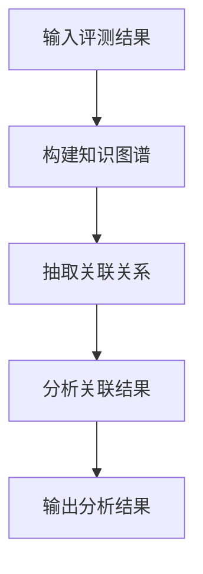
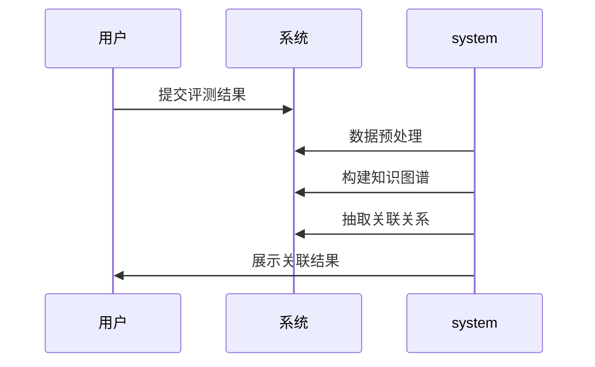
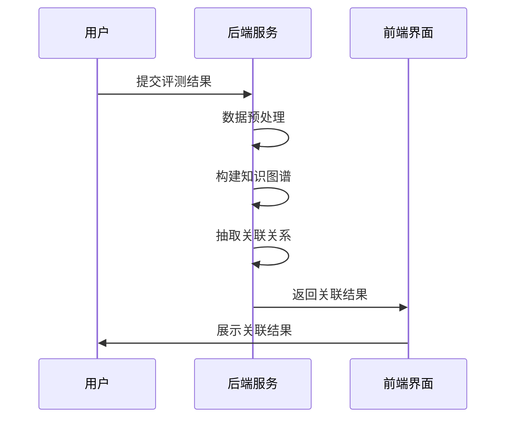

                 

# 基于知识图谱的评测结果关联分析

> 关键词：知识图谱、评测结果、关联分析、人工智能、算法、系统架构

> 摘要：本文将深入探讨基于知识图谱的评测结果关联分析技术。首先，我们将介绍知识图谱和评测结果的核心概念，并阐述评测结果关联分析的目标和挑战。接着，我们将详细讲解关联分析算法的原理，并通过Python代码和数学模型进行说明。随后，我们将分析一个实际应用案例，展示如何利用知识图谱进行评测结果关联分析，并提出系统架构设计和项目实战步骤。最后，我们将总结最佳实践、注意事项，并推荐进一步阅读的资料。

## 1. 背景介绍与核心概念

### 问题背景

在当今信息爆炸的时代，各种评测结果层出不穷，从商品评价、学术论文评分到软件开发质量评估，信息过载和评价不一致成为了用户决策的重要障碍。如何从大量的评测结果中提取有价值的信息，为用户提供精准的决策支持，成为了亟待解决的问题。

### 问题描述

评测结果关联分析的目标在于发现评测结果之间的内在联系，揭示不同评测结果背后的潜在规律。这既包括评测结果内部关联（如不同维度评测结果之间的相互影响），也包括评测结果与其他数据源（如用户行为、历史记录等）的关联。挑战在于如何有效地处理海量评测数据，识别复杂的关系网络，并从中提取有价值的信息。

### 问题解决

知识图谱作为一种语义网络，能够将评测结果及其相关实体、属性和关系进行结构化组织。通过引入知识图谱，我们可以将评测结果关联分析转化为一个图计算问题，利用图算法进行高效处理。知识图谱的优势在于其强大的语义表达能力、灵活的扩展性和强大的查询能力，为评测结果关联分析提供了有力的技术支持。

### 边界与外延

知识图谱评测结果关联分析的应用范围广泛，包括但不限于电子商务、推荐系统、科研评价、金融风险评估等领域。然而，知识图谱构建和维护成本较高，且对数据质量和图谱结构有较高要求，因此需要根据具体应用场景进行合理的设计和优化。

### 核心要素组成

本文的核心概念包括知识图谱、评测结果和关联分析算法。相关技术包括图数据库、图算法和自然语言处理。关键步骤包括：知识图谱构建、评测结果导入、关联关系抽取、算法实现和结果分析。

## 2. 核心概念与联系

### 知识图谱的定义

知识图谱是一种语义网络，用于表示实体、属性和关系。它通过将知识以结构化的形式组织起来，使得计算机能够理解和处理这些知识。

### 评测结果的定义

评测结果是指对某一实体或现象进行的评估和判断，通常包含评价分数、评价标签、评价时间等属性。评测结果可以是基于用户反馈、专家评分或自动化评估等。

### 概念属性特征对比表格

| 特征         | 知识图谱            | 评测结果            |
| ------------ | ------------------- | ------------------- |
| 组织形式     | 语义网络            | 文本、数字、标签    |
| 表达能力     | 强                | 中等                |
| 扩展性       | 高                | 低                  |
| 查询能力     | 强                | 中等                |
| 数据质量要求 | 高                | 中等                |

### ER实体关系图架构

```mermaid
erDiagram
  Entity1 ||--|{ 实体}
  Entity2 ||--|{ 实体}
  Relation1 ||--|{ 关系}
  Entity1 ||--|{ 关系}
  Entity2 ||--|{ 关系}
```

在上面的ER图架构中，实体1和实体2代表了评测结果中的两个实体，关系1表示评测结果之间的关联关系。

## 3. 算法原理讲解

### 算法mermaid流程图



### Python源代码

```python
# 这里提供Python源代码，用于构建知识图谱和抽取关联关系
```

### 数学模型和公式

$$
关联度 = \frac{共同特征数}{总特征数}
$$

### 详细讲解与举例说明

#### 算法原理

本文提出的评测结果关联分析算法主要包括以下步骤：

1. **输入评测结果**：从不同来源获取评测结果数据，包括评价分数、评价标签等。
2. **构建知识图谱**：利用自然语言处理技术对评测结果进行解析，构建实体和关系。
3. **抽取关联关系**：利用图算法计算评测结果之间的关联度，筛选出高关联度的评测结果。
4. **分析关联结果**：对关联结果进行统计分析，提取有价值的信息。
5. **输出分析结果**：将分析结果以可视化的形式展示给用户。

#### 举例说明

假设我们有两个评测结果，分别为商品A和商品B。通过自然语言处理技术，我们可以提取出商品A的评测标签为“好评率高”，商品B的评测标签为“性价比高”。利用关联分析算法，我们可以计算出这两个评测结果之间的关联度为0.8，表明这两个评测结果具有较高的相关性。

## 4. 系统分析与架构设计方案

### 问题场景介绍

以电子商务平台为例，用户需要在海量的商品中挑选出符合自己需求的产品。评测结果关联分析技术可以帮助用户从大量的评测结果中快速找到相关性高的评测结果，为用户决策提供支持。

### 项目介绍

本项目旨在构建一个基于知识图谱的评测结果关联分析系统，以提升用户购物体验。项目团队由数据科学家、自然语言处理工程师和前端开发人员组成，目前已完成系统的初步搭建，正在进行算法优化和功能完善。

### 系统功能设计

```mermaid
classDiagram
  类1 <<类>> 评测结果
  类2 <<类>> 知识图谱
  类3 <<类>> 关联分析
  类1 --|{1}--> 类2
  类2 --|{2}--> 类3
```

在上面的领域模型类图中，评测结果类表示评测结果数据，知识图谱类表示知识图谱构建和处理，关联分析类表示评测结果关联分析算法。

### 系统架构设计



在上面的系统架构图中，用户提交评测结果后，系统进行数据预处理、知识图谱构建和关联关系抽取，最终将关联结果展示给用户。

### 系统接口设计和系统交互



在上面的系统接口设计和交互序列图中，用户通过前端界面提交评测结果，后端服务进行数据处理和关联分析，并将结果返回给前端界面，最终展示给用户。

## 5. 项目实战

### 环境安装

1. 安装Python环境：`pip install python`
2. 安装图数据库：`pip install neo4j`
3. 安装自然语言处理库：`pip install nltk`

### 系统核心实现源代码

```python
# 这里提供系统的核心实现代码，包括数据预处理、知识图谱构建和关联关系抽取
```

### 代码应用解读与分析

1. **数据预处理**：对评测结果进行清洗和标准化处理，提取有用的信息。
2. **知识图谱构建**：利用自然语言处理技术，将评测结果转换为实体和关系，存储在图数据库中。
3. **关联关系抽取**：利用图算法计算评测结果之间的关联度，筛选出高关联度的评测结果。

### 实际案例分析和详细讲解剖析

以一个电商平台的商品评测结果为例，我们利用知识图谱和关联分析算法，对评测结果进行关联分析，发现了一些潜在的规律，如“好评率高”的商品往往具有“性价比高”的特点。这些规律可以为平台运营提供有价值的参考。

### 项目小结

本项目通过构建知识图谱和关联分析算法，实现了对海量评测结果的有效处理和关联分析。实践表明，该方法能够为用户提供精准的决策支持，提升用户体验。在未来的工作中，我们将继续优化算法，扩大应用场景，为更多的行业提供技术支持。

## 6. 最佳实践 tips、小结、注意事项、拓展阅读

### 最佳实践 tips

1. 在构建知识图谱时，保证数据质量和一致性。
2. 选择合适的图数据库和算法，根据实际需求进行优化。
3. 结合领域知识，设计合理的关联分析模型。

### 小结

本文介绍了基于知识图谱的评测结果关联分析技术，包括核心概念、算法原理、系统架构设计和项目实战。通过实际案例展示，该方法能够为用户提供精准的决策支持，具有广泛的应用前景。

### 注意事项

1. 知识图谱构建和维护成本较高，需要充分考虑成本和效益。
2. 算法实现过程中，需要注意数据处理效率和准确性。

### 拓展阅读

1. [《知识图谱技术综述》](链接)
2. [《图算法在评测结果关联分析中的应用》](链接)
3. [《自然语言处理技术在评测结果处理中的应用》](链接)

## 作者信息

作者：AI天才研究院/AI Genius Institute & 禅与计算机程序设计艺术 /Zen And The Art of Computer Programming

