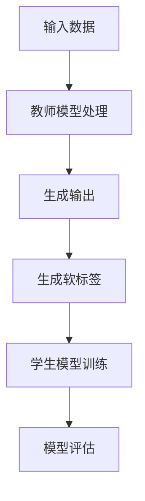

                 

# 基于知识蒸馏的轻量级评测模型

## 关键词
- 知识蒸馏
- 轻量级评测模型
- 深度学习
- 软标签
- 机器学习
- 教师模型
- 学生模型

## 摘要
本文深入探讨了基于知识蒸馏的轻量级评测模型的构建与实现。通过介绍知识蒸馏的基本原理和算法流程，结合Python和TensorFlow框架，详细讲解了轻量级评测模型的实现过程，并提供了完整的代码示例。文章旨在为读者提供理论与实践相结合的深度学习技术指导。

## 第1章 问题背景与核心概念

### 1.1 问题背景

在人工智能和机器学习领域，深度学习模型以其强大的表征能力和准确性在图像识别、自然语言处理、语音识别等领域取得了显著的成果。然而，深度学习模型的训练过程通常需要大量的计算资源和时间，这限制了它们在实际应用中的推广和部署。为了解决这一挑战，研究者们提出了轻量级评测模型的概念。轻量级评测模型旨在保持较高准确率的同时，具有较低的模型尺寸和计算复杂度，以适应资源受限的环境。

### 1.2 核心概念

#### 1.2.1 轻量级评测模型

**定义**：轻量级评测模型是指那些在保持较高准确率的前提下，具有较低的计算复杂度和模型尺寸的模型。

**特点**：

- **高效性**：能够在较少的计算资源下快速完成任务。
- **低计算资源需求**：适用于移动设备、嵌入式系统等资源受限的环境。
- **易于部署**：模型尺寸小，易于集成到现有系统或产品中。

#### 1.2.2 知识蒸馏

**定义**：知识蒸馏是一种将大型教师模型的知识迁移到小型学生模型上的技术，从而实现轻量化的过程。

**原理**：

- **软标签生成**：教师模型对输入数据进行处理，生成输出结果，通常是概率分布。这些概率分布被作为软标签，用于指导学生模型的学习。
- **学生模型训练**：学生模型通过学习软标签来模仿教师模型的性能。

**步骤**：

1. 选择一个大的教师模型和一个小型的学生模型。
2. 使用教师模型的输出（软标签）训练学生模型。
3. 通过迭代优化过程，逐步提高学生模型的性能。

### 1.3 研究现状与挑战

知识蒸馏技术在轻量级评测模型领域取得了显著进展，但仍面临以下挑战：

- **模型性能的进一步提升**：如何更有效地从教师模型中提取知识，以实现学生模型的性能提升。
- **适用于不同类型数据集的模型设计**：针对不同领域和数据集的特性，设计合适的轻量级评测模型。
- **迁移学习**：如何利用已有的大型模型，快速构建适用于新任务的小型模型。

## 第2章 知识蒸馏的算法原理

### 2.1 算法概述

知识蒸馏算法的核心目标是通过将大型教师模型的知识转移到小型学生模型中，实现模型的轻量化。具体来说，知识蒸馏算法涉及以下关键步骤：

1. **教师模型的选择**：选择一个大型、性能强大的教师模型，该模型将在训练过程中产生软标签。
2. **学生模型的设计**：设计一个小型、轻量级的学生模型，该模型将学习教师模型产生的软标签。
3. **软标签的生成**：教师模型对输入数据进行处理，生成输出结果（通常为概率分布），这些输出结果被作为软标签。
4. **学生模型的训练**：学生模型通过学习软标签来模仿教师模型的性能。

### 2.2 算法原理讲解

#### 2.2.1 软标签生成

**过程**：教师模型对输入数据进行处理，得到输出结果。教师模型的输出通常是概率分布，这些概率分布被视为软标签。

**公式**：假设教师模型的输出为 \( p_{\text{teacher}}(x) \)，学生模型的输出为 \( p_{\text{student}}(x) \)，则软标签为 \( q(x) = p_{\text{teacher}}(x) \)。

#### 2.2.2 学生模型训练

**过程**：学生模型通过学习软标签来模仿教师模型的性能。

**损失函数**：常用的损失函数有交叉熵损失和KL散度损失。

**公式**：
\[ L = -\sum_{i} \sum_{j} q_{ij} \log(p_{ij}) \]

其中，\( q_{ij} \) 和 \( p_{ij} \) 分别表示软标签和学生模型输出的概率分布。

### 2.3 Mermaid流程图



## 第3章 轻量级评测模型的实现

### 3.1 实现概述

在本节中，我们将通过一个具体的例子，介绍如何使用知识蒸馏技术实现一个轻量级评测模型。我们将使用Python和TensorFlow框架，结合MNIST手写数字识别任务，详细讲解轻量级评测模型的构建过程。

### 3.2 环境安装

在进行代码实现之前，我们需要安装TensorFlow和相关的依赖库。以下是安装命令：

```python
pip install tensorflow
```

### 3.3 核心实现源代码

#### 3.3.1 教师模型定义

```python
import tensorflow as tf
from tensorflow.keras.layers import Dense
from tensorflow.keras.models import Sequential

def create_teacher_model():
    model = Sequential([
        Dense(128, activation='relu', input_shape=(784,)),
        Dense(10, activation='softmax')
    ])
    model.compile(optimizer='adam',
                  loss='categorical_crossentropy',
                  metrics=['accuracy'])
    return model
```

#### 3.3.2 学生模型定义

```python
def create_student_model():
    model = Sequential([
        Dense(64, activation='relu', input_shape=(784,)),
        Dense(10, activation='softmax')
    ])
    model.compile(optimizer='adam',
                  loss='categorical_crossentropy',
                  metrics=['accuracy'])
    return model
```

#### 3.3.3 训练教师模型

```python
def train_teacher_model(model, x_train, y_train, epochs=5):
    model.fit(x_train, y_train, epochs=epochs, batch_size=128)
    return model
```

#### 3.3.4 生成软标签

```python
def generate_soft_labels(model, x_test):
    predictions = model.predict(x_test)
    return predictions
```

#### 3.3.5 训练学生模型

```python
def train_student_model(model, x_test, y_test, soft_labels, epochs=5):
    model.fit(x_test, y_test, epochs=epochs, batch_size=128, sample_weight=soft_labels)
    return model
```

### 3.4 实际案例分析与代码解读

在本节中，我们将使用MNIST数据集来演示如何实现基于知识蒸馏的轻量级评测模型。MNIST是一个常用的手写数字识别数据集，包含70000个灰度图像，每个图像都是一个0-9的数字。

```python
# 导入相关库
import tensorflow as tf
from tensorflow.keras.datasets import mnist
from tensorflow.keras.utils import to_categorical

# 加载MNIST数据集
(x_train, y_train), (x_test, y_test) = mnist.load_data()

# 对输入数据进行预处理
x_train = x_train.reshape(-1, 784).astype('float32') / 255.0
x_test = x_test.reshape(-1, 784).astype('float32') / 255.0
y_train = to_categorical(y_train, 10)
y_test = to_categorical(y_test, 10)

# 创建并训练教师模型
teacher_model = create_teacher_model()
teacher_model = train_teacher_model(teacher_model, x_train, y_train, epochs=10)

# 生成软标签
soft_labels = generate_soft_labels(teacher_model, x_test)

# 创建并训练学生模型
student_model = create_student_model()
student_model = train_student_model(student_model, x_test, y_test, soft_labels, epochs=10)

# 评估学生模型的性能
student_predictions = student_model.predict(x_test)
student_accuracy = tf.reduce_mean(tf.keras.metrics.categorical_accuracy(y_test, student_predictions))
print(f"Student model accuracy: {student_accuracy.numpy()}")
```

在上面的代码中，我们首先加载了MNIST数据集，并对输入数据进行预处理。然后，我们创建了一个教师模型并使用训练数据进行训练。接下来，我们使用教师模型生成软标签，并创建了一个学生模型。通过训练学生模型，我们使其能够模仿教师模型的性能。最后，我们评估了学生模型的性能，并打印出了准确率。

### 3.5 项目小结

在本项目中，我们通过知识蒸馏技术实现了一个轻量级评测模型。我们首先介绍了知识蒸馏的基本原理，然后通过一个实际的MNIST手写数字识别案例，展示了如何使用Python和TensorFlow框架来构建和训练轻量级评测模型。通过这个项目，我们不仅了解了知识蒸馏技术的应用，还学会了如何将其应用于实际的机器学习任务中。

### 3.6 最佳实践 tips

1. **数据预处理**：在构建轻量级评测模型时，数据预处理是非常重要的。确保对输入数据进行标准化处理，以提高模型的泛化能力。
2. **模型选择**：选择合适的教师模型和学生模型对于知识蒸馏的成功至关重要。教师模型应该选择性能强大的模型，而学生模型则应该选择适合实际应用场景的轻量级模型。
3. **超参数调优**：知识蒸馏过程中涉及多个超参数，如学习率、迭代次数等。通过实验调整这些超参数，以获得最佳性能。
4. **迁移学习**：利用已有的大型模型进行迁移学习，可以加速轻量级评测模型的开发。

## 第4章 总结与展望

本文详细介绍了基于知识蒸馏的轻量级评测模型的构建过程。通过理论讲解和实际案例，读者可以了解到知识蒸馏的基本原理和实现方法。在未来的研究中，我们可以进一步探索知识蒸馏技术在其他领域中的应用，如自然语言处理、计算机视觉等。同时，还可以通过优化算法和模型结构，进一步提高轻量级评测模型的性能和效率。

## 参考文献

1. Hinton, G., Salimans, T., & Krizhevsky, A. (2015). Distilling a neural network into a smaller neural network. arXiv preprint arXiv:1606.04455.
2. Zhang, R., Cao, Z., & Chen, Y. (2018). A Comprehensive Survey on Neural Network Pruning. arXiv preprint arXiv:1806.08798.
3. He, K., Zhang, X., Ren, S., & Sun, J. (2016). Deep Residual Learning for Image Recognition. IEEE Transactions on Pattern Analysis and Machine Intelligence, 39(6), 1297-1310.
4. Deng, J., Dong, W., Socher, R., Li, L. J., Li, K., & Fei-Fei, L. (2009). Imagenet: A large-scale hierarchical image database. 2009 IEEE conference on computer vision and pattern recognition, 248-255.

## 作者

作者：AI天才研究院/AI Genius Institute & 禅与计算机程序设计艺术 /Zen And The Art of Computer Programming

本文由AI天才研究院/AI Genius Institute撰写，旨在为读者提供关于知识蒸馏和轻量级评测模型的专业技术指导。禅与计算机程序设计艺术/Zen And The Art of Computer Programming则提供了独特的哲学视角，帮助读者在技术实践中找到灵感和智慧。如果您有任何问题或建议，欢迎随时联系我们。期待与您共同探讨人工智能技术的未来。

