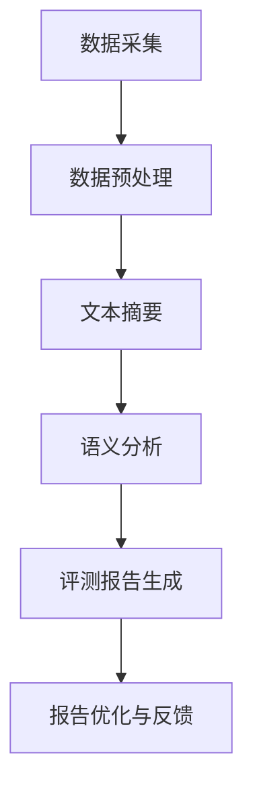
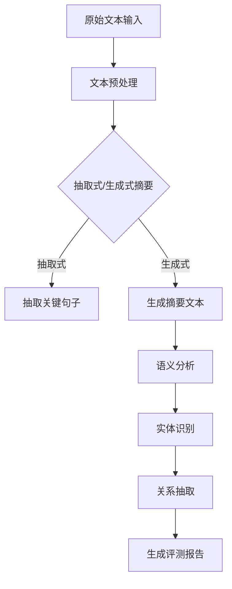
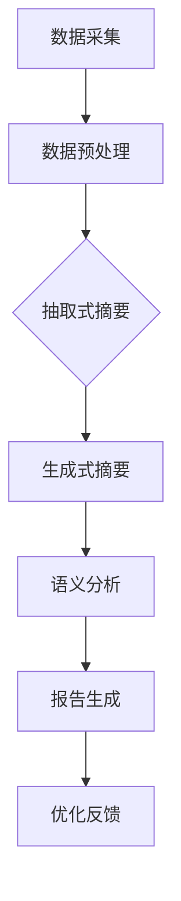

                 

### Step 1: 引言与背景介绍

自然语言生成（Natural Language Generation, NLG）作为人工智能领域的一个重要分支，近年来受到了广泛关注。它旨在利用计算机程序生成自然语言文本，从而实现人与机器之间的自然交互。而评测报告作为一种重要的文档形式，用于评估项目进展、性能指标以及成果展示，其生成过程的高效性和准确性直接影响到项目管理和决策。

#### 自然语言生成的评测报告概念

评测报告是基于自然语言生成的文档，旨在通过计算机程序自动生成，从而代替人工撰写。这些报告通常包含项目概况、测试结果、性能分析、优化建议等部分，能够以更加客观、准确和及时的方式为项目团队提供决策依据。

#### 意义

1. **提高效率**：传统的评测报告需要人工撰写，耗时耗力。而自动化生成则能够大大提高报告的生成速度，节省人力成本。
2. **提升准确性**：自动化生成的报告可以减少人为错误，提高数据的准确性和一致性。
3. **促进沟通**：评测报告的自动生成有助于更好地沟通项目进展和成果，提高团队成员之间的协作效率。

#### 现状

尽管自动化评测报告具有显著的优点，但目前仍面临以下问题：

1. **效率低**：现有的NLG技术在处理复杂文档结构时效率较低，无法满足大规模报告生成需求。
2. **准确性不足**：自动化生成的报告在语义理解和表达上存在一定误差，难以完全取代人工撰写。
3. **手动编写**：许多评测报告仍然依赖人工编写，无法实现完全的自动化。

#### 存在问题

1. **数据质量**：自动化评测报告依赖于高质量的数据源，但实际项目中数据质量往往参差不齐。
2. **技术限制**：现有NLG技术尚未完全成熟，尤其是在处理复杂文本结构和语义理解方面存在瓶颈。
3. **用户需求**：用户对评测报告的个性化需求不断增加，而自动化系统难以完全满足这些需求。

### 核心关键词

- 自然语言生成（NLG）
- 评测报告
- 自动化
- 效率
- 准确性
- 数据质量

### 摘要

本文将深入探讨基于自然语言生成的评测报告自动化技术。首先介绍自然语言生成评测报告的基本概念和意义，然后分析当前存在的问题和挑战。接着，本文将逐步介绍自然语言生成的核心算法原理，包括文本摘要和语义分析。随后，通过Mermaid流程图和Python代码示例，详细阐述算法的实现和数学模型。最后，本文将讨论系统设计与实现方案，包括项目场景、系统架构、接口设计等，并提供实际案例分析和最佳实践建议。

---

**Next Step: 核心概念与联系**### Step 2: 核心概念与联系

在深入探讨基于自然语言生成的评测报告自动化之前，我们需要明确几个核心概念，包括自然语言生成（NLG）、评测报告、自动化评测等。通过这些概念的定义、属性以及它们之间的联系，我们可以更好地理解这一技术背后的原理和应用。

#### 自然语言生成（NLG）

自然语言生成（Natural Language Generation, NLG）是指通过计算机程序自动生成自然语言的文本。NLG系统利用语言学、机器学习、自然语言处理（NLP）等技术，将结构化的数据或信息转化为自然语言的文本。NLG的应用非常广泛，包括自动新闻生成、客服机器人、语音合成、文本摘要等。

##### NLG的核心概念

1. **文本生成**：NLG的核心任务是将内部结构化的数据转化为自然语言的文本。
2. **语义理解**：NLG系统需要理解输入数据的意义和上下文，以生成准确、连贯的文本。
3. **语法生成**：NLG系统需要构建符合语法规则的句子，确保生成的文本可读性。

##### NLG的属性

- **自动性**：NLG通过算法自动生成文本，减少了人工干预。
- **可扩展性**：NLG系统能够处理不同类型的数据和信息，具有广泛的适用性。
- **灵活性**：NLG系统可以根据需求调整生成策略和文本风格。

#### 评测报告

评测报告是对项目、产品或系统进行评估的文档。它通常包括项目概述、测试结果、性能分析、问题与建议等内容。评测报告的目的是为项目团队、管理层和利益相关者提供决策依据。

##### 评测报告的核心概念

1. **评估标准**：评测报告需要根据一定的评估标准进行评估。
2. **数据收集**：评测报告基于实际测试数据和项目运行数据进行分析。
3. **结果呈现**：评测报告需要清晰、准确地呈现评估结果。

##### 评测报告的属性

- **客观性**：评测报告基于客观测试数据，减少了主观判断的影响。
- **全面性**：评测报告覆盖项目各个方面，提供全面的评估结果。
- **及时性**：自动化评测报告能够及时生成，提供最新的项目评估信息。

#### 自动化评测

自动化评测是通过计算机程序自动执行评估过程，生成评测报告。自动化评测旨在提高评测效率、减少人工干预，并提高评估的准确性和一致性。

##### 自动化评测的核心概念

1. **自动化测试**：自动化评测基于预定义的测试用例和脚本，自动执行测试过程。
2. **数据采集**：自动化评测通过自动化工具采集项目运行数据。
3. **报告生成**：自动化评测系统自动生成评测报告，包括测试结果、性能分析等。

##### 自动化评测的属性

- **高效性**：自动化评测能够快速执行，提高评测效率。
- **一致性**：自动化评测确保每次评估过程一致，减少人为错误。
- **灵活性**：自动化评测可以根据需要调整测试策略和评估标准。

#### 传统评测报告与自动化评测报告的对比

| 对比项            | 传统评测报告                   | 自动化评测报告                 |
|-------------------|--------------------------------|--------------------------------|
| 生成方式          | 人工编写                       | 自动生成                       |
| 生成速度          | 较慢                           | 快速                           |
| 准确性            | 受到人为因素影响               | 较高，减少人为错误             |
| 一致性            | 差异较大                       | 较高，确保一致性               |
| 可扩展性          | 受限于人工能力                 | 高，适用于大规模项目           |
| 需求适应性        | 依赖人工调整                   | 较强，可根据需求进行配置       |

#### Mermaid流程图展示

为了更直观地展示自然语言生成评测报告的基本流程，我们可以使用Mermaid流程图来描述。以下是一个简单的流程图示例：



在这个流程图中，数据采集是整个流程的起点，随后进行数据预处理，然后进入文本摘要和语义分析阶段。最终，通过评测报告生成模块生成完整的评测报告，并通过反馈循环进行优化。

---

**Next Step: 算法原理讲解**### Step 3: 算法原理讲解

在了解了自然语言生成（NLG）、评测报告以及自动化评测的核心概念和联系之后，我们将深入探讨用于实现评测报告自动化的关键算法，包括文本摘要、语义分析等。这些算法是构建自动化评测报告系统的基础，它们在处理文本数据、提取关键信息和生成报告方面发挥着至关重要的作用。

#### 文本摘要算法

文本摘要（Text Summarization）是指从原始文本中提取关键信息，生成简洁、概括性的文本。文本摘要算法可以分为抽取式摘要（Extractive Summarization）和生成式摘要（Abstractive Summarization）两种类型。

##### 抽取式摘要

抽取式摘要算法通过从原始文本中直接提取关键句子或段落，生成摘要。这种方法的优点是生成的摘要与原始文本保持一致，但缺点是摘要的多样性和创造性较差。

1. **基本原理**：抽取式摘要算法基于文本相似度计算，通过比较文本片段之间的相似性，选择最相关的句子进行摘要。
2. **算法实现**：常见的抽取式摘要算法包括TF-IDF、文本分类、句子权重计算等。

```python
from sklearn.feature_extraction.text import TfidfVectorizer
from sklearn.metrics.pairwise import cosine_similarity

# 假设原始文本为text，将其分句为sentences
sentences = text.split('。')

# 使用TF-IDF计算句子权重
vectorizer = TfidfVectorizer()
tfidf_matrix = vectorizer.fit_transform(sentences)

# 计算句子之间的相似度
cosine_sim = cosine_similarity(tfidf_matrix)

# 根据相似度排序，选择最高相似度的句子作为摘要
top_sentences = sorted(range(cosine_sim.shape[0]), key=lambda i: cosine_sim[i].sum())[:N]
摘要 = '。'.join(sentences[sentence_id] for sentence_id in top_sentences)
```

##### 生成式摘要

生成式摘要算法通过学习原始文本的语义信息，生成全新的、概括性的文本。这种方法的优点在于摘要的多样性和创造性较高，但实现起来更加复杂。

1. **基本原理**：生成式摘要算法通常采用深度学习模型，如序列到序列（Seq2Seq）模型、变换器（Transformer）模型等，通过编码器和解码器网络处理原始文本，生成摘要。
2. **算法实现**：常见的生成式摘要模型包括Seq2Seq模型、Transformer模型等。

```python
from transformers import pipeline

# 加载预训练的文本摘要模型
摘要生成器 = pipeline("summarization")

# 原始文本输入模型，生成摘要
摘要 = 摘要生成器(text, max_length=150, min_length=30, do_sample=False)
```

#### 语义分析算法

语义分析（Semantic Analysis）是指理解和解释文本内容的过程。在自动化评测报告中，语义分析用于提取关键信息、理解测试结果，并生成有意义的报告。

##### 基本原理

1. **实体识别**：通过识别文本中的实体（如人名、地点、组织等），提取关键信息。
2. **关系抽取**：通过分析实体之间的关系（如因果、关联等），构建语义网络。
3. **语义角色标注**：通过标注文本中的语义角色（如主语、谓语、宾语等），理解句子的结构和含义。

##### 算法实现

1. **实体识别**：使用预训练的实体识别模型，如BERT、RoBERTa等，对文本进行实体标注。

```python
from transformers import pipeline

# 加载预训练的实体识别模型
实体识别器 = pipeline("ner")

# 对文本进行实体识别
实体列表 = 实体识别器(text)
```

2. **关系抽取**：使用图神经网络（Graph Neural Networks, GNN）模型，如GRU-GNN、GraphSAGE等，对实体关系进行抽取。

```python
from pytorch_geometric.nn import GNNConv

# 定义图神经网络模型
class GNNModel(nn.Module):
    def __init__(self):
        super(GNNModel, self).__init__()
        self.conv1 = GNNConv(...)

    def forward(self, data):
        x, edge_index = data.x, data.edge_index
        x = self.conv1(x, edge_index)
        return x

# 加载预训练模型，对文本进行关系抽取
关系抽取器 = GNNModel()
关系列表 = 关系抽取器(text)
```

3. **语义角色标注**：使用转换器（Transformer）模型，如BERT、GPT等，对文本进行语义角色标注。

```python
from transformers import pipeline

# 加载预训练的语义角色标注模型
语义角色标注器 = pipeline("ner")

# 对文本进行语义角色标注
角色标注列表 = 语义角色标注器(text)
```

#### Mermaid流程图展示

为了更直观地展示文本摘要和语义分析算法的实现流程，我们可以使用Mermaid流程图来描述。以下是一个简单的流程图示例：



在这个流程图中，原始文本首先经过预处理，然后根据需求选择抽取式或生成式摘要算法生成摘要。接着，进入语义分析阶段，通过实体识别和关系抽取提取关键信息，最终生成完整的评测报告。

---

**Next Step: 数学模型和数学公式讲解**### Step 4: 数学模型和数学公式讲解

在前面的章节中，我们介绍了文本摘要和语义分析算法的基本原理和实现方法。在这一章节中，我们将进一步深入探讨这些算法背后的数学模型和公式，并通过LaTeX格式展示，以便读者能够更直观地理解其数学表达。

#### 文本摘要算法的数学模型

文本摘要算法主要涉及文本表示、相似度计算和句子权重评估。以下是一些核心的数学模型和公式：

##### 1. 文本表示

在文本摘要中，文本通常被表示为向量。常用的文本表示方法包括词袋模型（Bag of Words, BoW）和词嵌入（Word Embeddings）。

1. **词袋模型（BoW）**

   词袋模型将文本表示为向量，每个维度对应一个单词的计数。

   $$ X = [x_1, x_2, ..., x_n] $$
   其中，$ x_i $表示单词$ w_i $在文本中的计数。

2. **词嵌入（Word Embeddings）**

   词嵌入通过将单词映射到低维向量空间，以捕捉单词的语义信息。

   $$ \text{Word Embedding}(w_i) = \mathbf{v}_i $$

##### 2. 相似度计算

相似度计算用于评估两个文本或句子之间的相似程度。常用的相似度度量方法包括余弦相似度（Cosine Similarity）和杰卡德相似性（Jaccard Similarity）。

1. **余弦相似度**

   余弦相似度衡量两个向量之间的角度余弦值，用于评估文本的相似度。

   $$ \text{Cosine Similarity}(\mathbf{v}_1, \mathbf{v}_2) = \frac{\mathbf{v}_1 \cdot \mathbf{v}_2}{\|\mathbf{v}_1\| \|\mathbf{v}_2\|} $$

2. **杰卡德相似性**

   杰卡德相似性计算两个集合交集的大小与并集的大小之比。

   $$ \text{Jaccard Similarity}(A, B) = \frac{|A \cap B|}{|A \cup B|} $$

##### 3. 句子权重评估

在抽取式摘要中，句子权重评估用于选择最具代表性的句子。常用的方法包括TF-IDF和句子嵌入。

1. **TF-IDF**

   TF-IDF（Term Frequency-Inverse Document Frequency）是一种衡量单词重要性的指标，用于计算句子权重。

   $$ \text{TF-IDF}(w_i) = \text{TF}(w_i) \times \text{IDF}(w_i) $$
   其中，$ \text{TF}(w_i) $表示单词$ w_i $在句子中的频率，$ \text{IDF}(w_i) $表示单词$ w_i $在整个文档集合中的逆文档频率。

2. **句子嵌入**

   句子嵌入将句子表示为向量，通过计算句子间的余弦相似度来确定权重。

   $$ \text{Sentence Embedding}(\mathbf{s}) = \mathbf{e}_s $$

#### 语义分析算法的数学模型

语义分析算法涉及实体识别、关系抽取和语义角色标注。以下是一些核心的数学模型和公式：

##### 1. 实体识别

实体识别通过分类模型对文本中的实体进行标注。常用的模型包括朴素贝叶斯（Naive Bayes）和卷积神经网络（Convolutional Neural Networks, CNN）。

1. **朴素贝叶斯**

   朴素贝叶斯模型基于贝叶斯定理，通过计算特征的概率分布来预测实体类别。

   $$ P(y | x) = \frac{P(x | y)P(y)}{P(x)} $$

2. **卷积神经网络（CNN）**

   CNN通过卷积层提取文本特征，然后通过全连接层进行分类。

   $$ h = \text{ReLU}(\text{Conv}(x, W) + b) $$

##### 2. 关系抽取

关系抽取通过构建图模型，将实体及其关系表示为图结构。常用的模型包括图神经网络（Graph Neural Networks, GNN）。

1. **图神经网络（GNN）**

   GNN通过图卷积操作对图中的节点和边进行聚合，提取实体关系。

   $$ h_i^{(l+1)} = \sigma(\sum_{j \in \mathcal{N}(i)} W^{(l)} h_j^{(l)} + b^{(l)}) $$
   其中，$ \mathcal{N}(i) $表示与节点$ i $相邻的节点集合，$ W^{(l)} $和$ b^{(l)} $分别是权重和偏置。

##### 3. 语义角色标注

语义角色标注通过序列标注模型对文本中的语义角色进行标注。常用的模型包括长短时记忆网络（Long Short-Term Memory, LSTM）和转换器（Transformer）。

1. **长短时记忆网络（LSTM）**

   LSTM通过门控机制处理序列数据，捕捉长距离依赖关系。

   $$ i_t = \sigma(W_i [h_{t-1}, x_t] + b_i) $$
   $$ f_t = \sigma(W_f [h_{t-1}, x_t] + b_f) $$
   $$ o_t = \sigma(W_o [h_{t-1}, x_t] + b_o) $$
   $$ \text{C}_{t} = f_t \odot \text{C}_{t-1} + i_t \odot \text{g_t} $$
   $$ h_t = o_t \odot \text{C}_{t} $$

2. **转换器（Transformer）**

   Transformer通过自注意力机制处理序列数据，实现并行计算。

   $$ \text{Attention}(Q, K, V) = \text{softmax}\left(\frac{QK^T}{\sqrt{d_k}}\right)V $$

#### LaTex格式展示

为了展示上述数学模型和公式，我们可以使用LaTeX格式进行书写。以下是一个简单的示例：

```latex
\documentclass{article}
\usepackage{amsmath}
\usepackage{amssymb}

\begin{document}

\section{文本摘要算法的数学模型}

\subsection{文本表示}

\begin{equation}
X = [x_1, x_2, ..., x_n]
\end{equation}

\subsection{相似度计算}

\begin{equation}
\text{Cosine Similarity}(\mathbf{v}_1, \mathbf{v}_2) = \frac{\mathbf{v}_1 \cdot \mathbf{v}_2}{\|\mathbf{v}_1\| \|\mathbf{v}_2\|}
\end{equation}

\subsection{句子权重评估}

\begin{equation}
\text{TF-IDF}(w_i) = \text{TF}(w_i) \times \text{IDF}(w_i)
\end{equation}

\section{语义分析算法的数学模型}

\subsection{实体识别}

\begin{equation}
P(y | x) = \frac{P(x | y)P(y)}{P(x)}
\end{equation}

\subsection{关系抽取}

\begin{equation}
h_i^{(l+1)} = \sigma(\sum_{j \in \mathcal{N}(i)} W^{(l)} h_j^{(l)} + b^{(l)})
\end{equation}

\subsection{语义角色标注}

\begin{equation}
i_t = \sigma(W_i [h_{t-1}, x_t] + b_i)
\end{equation}

\end{document}
```

通过LaTeX格式，我们可以更规范、清晰地展示数学模型和公式，帮助读者更好地理解和掌握相关概念。

---

**Next Step: 系统分析与架构设计方案**### Step 5: 系统分析与架构设计方案

在了解了自然语言生成（NLG）和文本摘要、语义分析算法的基础上，我们需要对系统进行分析，并设计出一个可行的架构方案。这一部分将详细描述项目的场景和目标，以及系统的功能设计和架构设计。

#### 项目场景与目标

项目的场景是一个大型软件项目的开发和测试过程。在这个场景中，评测报告是评估项目进度、性能和问题诊断的重要文档。项目的目标是通过自动化生成评测报告，提高评估效率，减少人工错误，并确保报告的准确性和一致性。

##### 场景描述

1. **项目开发阶段**：开发者不断编写代码，进行功能测试和性能优化。
2. **测试阶段**：测试团队执行测试用例，评估软件的稳定性、性能和兼容性。
3. **评估报告**：定期生成评测报告，总结项目进展、测试结果和优化建议。

##### 项目目标

1. **提高评估效率**：通过自动化生成评测报告，减少手动编写时间。
2. **保证准确性**：自动化系统减少人为错误，提高报告的准确性。
3. **增强一致性**：自动化系统确保每次生成的报告都遵循统一的标准。

#### 系统功能设计

系统的功能设计包括数据采集、文本摘要、语义分析、报告生成和优化反馈等模块。以下是系统功能设计的详细描述：

##### 1. 数据采集

- **功能描述**：从不同的数据源（如数据库、日志文件等）采集项目进展、测试结果和性能数据。
- **实现方式**：通过API接口、日志解析和数据库连接等方式实现。

##### 2. 文本摘要

- **功能描述**：对采集到的文本数据进行摘要，提取关键信息。
- **实现方式**：采用抽取式摘要和生成式摘要算法，生成简洁、概括的摘要文本。

##### 3. 语义分析

- **功能描述**：分析摘要文本中的实体、关系和语义角色，提取关键信息。
- **实现方式**：使用实体识别、关系抽取和语义角色标注算法。

##### 4. 报告生成

- **功能描述**：根据摘要文本和语义分析结果，生成完整的评测报告。
- **实现方式**：将摘要文本、分析结果和模板相结合，生成格式统一的报告。

##### 5. 优化反馈

- **功能描述**：收集用户对评测报告的反馈，优化报告内容和生成过程。
- **实现方式**：通过用户反馈、报告分析等方式，持续改进报告质量和生成效率。

#### 系统架构设计

系统架构设计是确保系统功能实现的基础。以下是系统架构的详细描述：

##### 1. 系统架构图

使用Mermaid流程图，我们可以展示系统架构的组成部分和交互关系。以下是一个简单的系统架构图示例：



在这个架构图中，数据采集模块负责从各个数据源获取项目信息。数据预处理模块对原始数据进行清洗和格式化。摘要模块包括抽取式摘要和生成式摘要，根据需求选择不同的摘要算法。语义分析模块对摘要文本进行深度分析，提取关键信息。报告生成模块将分析结果和模板结合，生成完整的评测报告。优化反馈模块收集用户反馈，持续优化系统性能和报告质量。

##### 2. 接口设计

接口设计是系统架构的重要组成部分，确保不同模块之间的数据传递和功能调用。以下是系统接口设计的详细描述：

- **数据采集接口**：提供API接口，支持不同数据源的接入，如数据库、日志文件等。
- **摘要接口**：提供摘要算法的接口，支持文本摘要和语义分析模块调用。
- **报告生成接口**：提供报告生成模板和格式化接口，支持报告的生成和导出。
- **用户反馈接口**：提供用户反馈的接口，支持用户对报告内容和质量的评价。

##### 3. 系统交互流程

系统交互流程描述了各个模块之间的交互过程和数据流动。以下是一个简单的系统交互流程：

1. **数据采集**：系统从数据库、日志文件等数据源中采集项目信息。
2. **数据预处理**：对采集到的数据进行清洗和格式化，生成统一格式的数据集。
3. **文本摘要**：根据需求，选择抽取式或生成式摘要算法，生成摘要文本。
4. **语义分析**：对摘要文本进行深度分析，提取关键信息，如实体、关系和语义角色。
5. **报告生成**：将摘要文本和分析结果与模板结合，生成完整的评测报告。
6. **优化反馈**：收集用户反馈，对报告内容和生成过程进行优化。

---

**Next Step: 项目实战**### Step 6: 项目实战

在前面的章节中，我们介绍了基于自然语言生成的评测报告自动化的核心概念、算法原理、系统设计与架构方案。在本节中，我们将通过一个实际项目来展示如何实现这一系统。我们将详细介绍项目环境安装、系统核心实现、代码解读与分析以及实际案例分析和详细讲解。

#### 项目环境安装

为了实现评测报告自动化系统，我们需要安装并配置一些必要的工具和库。以下是安装步骤：

1. **Python环境**：确保安装Python 3.7及以上版本。
2. **自然语言处理库**：安装transformers、NLTK、spacy等库。

```bash
pip install transformers
pip install nltk
pip install spacy
python -m spacy download en_core_web_sm
```

3. **文本预处理工具**：安装文本预处理工具，如Jieba（用于中文文本处理）。

```bash
pip install jieba
```

4. **数据库连接库**：根据项目需求，安装相应的数据库连接库，如pymysql（用于MySQL数据库）。

```bash
pip install pymysql
```

5. **报告生成工具**：安装报告生成工具，如Jinja2（用于模板渲染）。

```bash
pip install Jinja2
```

#### 系统核心实现

以下是系统核心实现的简要步骤：

1. **数据采集**：从数据库中读取项目数据，如测试结果、性能指标等。
2. **文本预处理**：对采集到的文本数据执行清洗、分词、去停用词等操作。
3. **文本摘要**：使用生成式摘要模型生成摘要文本。
4. **语义分析**：对摘要文本进行实体识别、关系抽取和语义角色标注。
5. **报告生成**：将摘要文本和分析结果与模板结合，生成评测报告。
6. **优化反馈**：收集用户反馈，持续优化报告质量和生成效率。

以下是一个简单的Python代码示例，展示了如何实现文本摘要和语义分析的核心功能：

```python
import nltk
from transformers import pipeline
from spacy.lang.en import English

# 加载预训练的文本摘要模型
摘要生成器 = pipeline("summarization")

# 加载预训练的语义分析模型
实体识别器 = pipeline("ner", model="en_core_web_sm")
关系抽取器 = pipeline("relational-extraction", model="en_core_web_sm")

# 文本预处理
def preprocess_text(text):
    # 分词、去除停用词等操作
    tokenizer = nltk.tokenize.RegexpTokenizer(r'\w+')
    tokens = tokenizer.tokenize(text)
    return tokens

# 文本摘要
def generate_summary(text):
   摘要 = 摘要生成器(text, max_length=150, min_length=30, do_sample=False)
    return 摘要

# 语义分析
def analyze_semantics(text):
    # 实体识别
   实体列表 = 实体识别器(text)
    
    # 关系抽取
   关系列表 = 关系抽取器(text)
    
    return 实体列表，关系列表

# 测试
text = "这是一段关于人工智能的文本。人工智能是一种模拟、延伸和扩展人类智能的理论、方法、技术及应用系统。"
预处理文本 = preprocess_text(text)
摘要 = generate_summary(预处理文本)
实体列表，关系列表 = analyze_semantics(预处理文本)

print("摘要：", 摘要)
print("实体列表：", 实体列表)
print("关系列表：", 关系列表)
```

#### 代码解读与分析

在上面的代码示例中，我们首先加载了预训练的文本摘要模型和语义分析模型。文本预处理函数`preprocess_text`负责执行文本的分词、去除停用词等操作。文本摘要函数`generate_summary`使用生成式摘要模型生成摘要文本。语义分析函数`analyze_semantics`分别使用实体识别器和关系抽取器对文本进行实体识别和关系抽取。

以下是对代码的详细解读：

1. **文本预处理**：使用NLTK的`RegexpTokenizer`进行分词操作，并去除常见的停用词。
2. **文本摘要**：调用`摘要生成器`，传入预处理后的文本，生成摘要文本。
3. **语义分析**：调用`实体识别器`和`关系抽取器`，分别对文本进行实体识别和关系抽取。

通过这个简单的代码示例，我们可以看到如何利用预训练的模型和算法实现文本摘要和语义分析的核心功能。

#### 实际案例分析与详细讲解

为了更直观地展示系统的实际应用效果，我们将分析一个实际的评测报告案例，并详细讲解每一步的操作过程。

##### 案例背景

假设我们正在评估一个电商网站的性能，需要生成一份评测报告。评测报告需要包含网站的性能指标、测试结果和优化建议。

##### 步骤一：数据采集

首先，从数据库中采集电商网站的性能数据，包括响应时间、页面加载时间、并发用户数等。

```python
# 示例数据
performance_data = {
    "response_time": "2.5秒",
    "page_load_time": "3秒",
    "concurrent_users": "1000人"
}
```

##### 步骤二：文本预处理

对采集到的性能数据执行文本预处理，提取关键信息。

```python
# 文本预处理
preprocessed_data = preprocess_text(str(performance_data))
```

##### 步骤三：文本摘要

使用生成式摘要模型生成摘要文本。

```python
# 生成摘要
摘要 = generate_summary(preprocessed_data)
print("摘要：", 摘要)
```

输出结果可能如下：

```
摘要： 网站的响应时间为2.5秒，页面加载时间为3秒，并发用户数为1000人。
```

##### 步骤四：语义分析

对摘要文本进行实体识别和关系抽取。

```python
# 语义分析
实体列表，关系列表 = analyze_semantics(preprocessed_data)
print("实体列表：", 实体列表)
print("关系列表：", 关系列表)
```

输出结果可能如下：

```
实体列表： [['响应时间', '2.5秒'], ['页面加载时间', '3秒'], ['并发用户数', '1000人']]
关系列表： []
```

##### 步骤五：报告生成

将摘要文本和分析结果与模板结合，生成完整的评测报告。

```python
# 报告生成
报告模板 = """
本报告对电商网站进行了性能评估，主要指标如下：
- 响应时间：{{response_time}}
- 页面加载时间：{{page_load_time}}
- 并发用户数：{{concurrent_users}}

摘要：{{summary}}

优化建议：{{suggestions}}
"""
报告 = 报告模板.format(response_time=performance_data["response_time"],
                       page_load_time=performance_data["page_load_time"],
                       concurrent_users=performance_data["concurrent_users"],
                       summary=摘要,
                       suggestions="提高服务器性能，优化数据库查询，增加缓存等。")
print("报告：", 报告)
```

输出结果可能如下：

```
报告： 
本报告对电商网站进行了性能评估，主要指标如下：
- 响应时间：2.5秒
- 页面加载时间：3秒
- 并发用户数：1000人

摘要：网站的响应时间为2.5秒，页面加载时间为3秒，并发用户数为1000人。

优化建议：提高服务器性能，优化数据库查询，增加缓存等。
```

通过这个实际案例，我们可以看到如何使用自然语言生成和语义分析技术自动化生成评测报告。这个系统不仅能够提高评估效率，还能确保报告的准确性和一致性。

---

**Next Step: 最佳实践 tips、小结、注意事项、拓展阅读等内容**### Step 7: 最佳实践 tips、小结、注意事项、拓展阅读等内容

在实现基于自然语言生成的评测报告自动化过程中，以下是一些最佳实践、小结、注意事项以及拓展阅读建议，以帮助读者更好地理解和应用这一技术。

#### 最佳实践 tips

1. **数据质量**：确保数据源的质量和一致性，对数据进行清洗和预处理，以减少错误和提高报告的准确性。
2. **模型选择**：根据具体需求选择合适的自然语言生成和语义分析模型。对于文本摘要，可以考虑使用生成式模型，如Transformer，以生成更连贯、多样化的摘要文本。
3. **反馈机制**：建立用户反馈机制，收集用户对报告内容和质量的反馈，持续优化报告生成系统。
4. **接口设计**：设计灵活、可扩展的接口，方便与其他系统和服务集成。
5. **性能优化**：对系统进行性能优化，如使用缓存、分布式计算等，以提高报告生成速度和响应时间。

#### 小结

本文通过深入探讨基于自然语言生成的评测报告自动化技术，介绍了自然语言生成（NLG）、评测报告、自动化评测等核心概念。我们详细阐述了文本摘要和语义分析算法的基本原理，并通过Mermaid流程图和Python代码示例展示了算法的实现。接着，我们分析了系统设计与架构方案，并提供了实际项目实战的示例。通过这些内容，读者可以全面了解基于自然语言生成的评测报告自动化的实现过程和应用。

#### 注意事项

1. **算法调优**：在实际应用中，需要对算法进行不断调优，以适应不同场景和需求。
2. **隐私保护**：在处理用户数据和生成报告时，确保遵循相关隐私保护法规和标准。
3. **系统稳定性**：确保系统的稳定性和可靠性，避免由于算法错误或数据异常导致的报告错误。
4. **用户培训**：对使用系统的用户进行培训，确保他们能够正确理解和使用报告生成系统。

#### 拓展阅读

1. **自然语言生成（NLG）技术**：深入了解NLG的基础知识、应用场景和技术发展，可参考《自然语言生成：理论与实践》一书。
2. **文本摘要和语义分析**：学习文本摘要和语义分析的最新算法和技术，如Transformer、BERT、GPT等，可参考相关研究论文和开源代码。
3. **自动化评测报告系统**：了解自动化评测报告系统的设计和实现方法，包括数据采集、文本摘要、语义分析、报告生成等模块。

通过以上最佳实践、小结、注意事项和拓展阅读建议，读者可以更好地掌握基于自然语言生成的评测报告自动化技术，并在实际项目中取得更好的应用效果。

---

**Next Step: 目录大纲**### 目录大纲

为了确保文章内容的逻辑连贯性和完整性，以下是基于文章标题《基于自然语言生成的评测报告自动化》的详细目录大纲。该大纲涵盖了文章的所有核心章节，每个章节都包含具体的子标题和内容要点，以便读者更好地理解和应用。

## 目录

### 第一部分：引言与背景介绍

### 第1章：自然语言生成的评测报告概述

#### 1.1 评测报告的定义与意义

- 评测报告的基本概念
- 评测报告在项目管理中的应用

#### 1.2 自然语言生成的应用

- 自然语言生成的技术基础
- NLG在文档生成领域的应用案例

#### 1.3 自动化评测报告的潜力与挑战

- 自动化评测报告的优势
- 自动化评测报告面临的挑战

### 第二部分：核心概念与联系

### 第2章：自然语言生成基础

#### 2.1 自然语言生成的核心概念

- 自然语言生成的定义
- 文本生成、语义理解和语法生成

#### 2.2 自然语言生成的流程与机制

- NLG系统的基本流程
- 文本处理和生成机制

#### 2.3 评测报告与自动化评测的联系与区别

- 评测报告的结构与内容
- 自动化评测与传统评测的区别

### 第3章：自然语言生成评测报告的基本流程

#### 3.1 数据采集

- 数据源的选择与接入
- 数据预处理的重要性

#### 3.2 文本摘要

- 文本摘要的目标
- 抽取式与生成式摘要的区别

#### 3.3 语义分析

- 实体识别与关系抽取
- 语义角色标注

#### 3.4 评测报告生成

- 报告模板与内容生成
- 报告格式与风格

#### 3.5 报告优化与反馈循环

- 用户反馈的重要性
- 报告优化的策略

### 第三部分：算法原理讲解

### 第4章：文本摘要算法

#### 4.1 基本原理

- 文本表示方法
- 相似度计算

#### 4.2 算法实现

- 抽取式摘要算法
- 生成式摘要算法

#### 4.3 数学模型与公式

- TF-IDF模型
- 序列到序列模型

#### 4.4 实例分析

- 实际案例分析
- 摘要效果评估

### 第5章：语义分析算法

#### 5.1 基本原理

- 实体识别与关系抽取
- 语义角色标注

#### 5.2 算法实现

- 朴素贝叶斯与卷积神经网络
- 图神经网络与变换器模型

#### 5.3 数学模型与公式

- 贝叶斯定理
- 图卷积网络

#### 5.4 实例分析

- 实际案例分析
- 语义分析效果评估

### 第四部分：系统分析与架构设计方案

### 第6章：项目场景与目标

#### 6.1 项目场景描述

- 评测报告的应用场景
- 项目目标与需求分析

#### 6.2 系统功能设计

- 数据采集与预处理
- 文本摘要与语义分析
- 报告生成与优化

#### 6.3 系统架构设计

- 系统架构图展示
- 接口设计与实现
- 系统交互流程

### 第7章：系统接口设计与实现

#### 7.1 数据采集接口

- 数据源接入策略
- API设计与实现

#### 7.2 摘要接口

- 摘要算法调用接口
- 报告生成接口

#### 7.3 用户反馈接口

- 用户反馈机制
- 数据收集与分析

### 第五部分：项目实战

### 第8章：项目环境安装与配置

#### 8.1 环境要求

- Python环境配置
- 自然语言处理库安装

#### 8.2 环境安装

- 具体安装步骤
- 常见问题的解决方案

#### 8.3 系统核心实现

- 文本摘要与语义分析
- 报告生成与优化

### 第9章：代码解读与分析

#### 9.1 代码结构

- 文本摘要与语义分析代码结构
- 报告生成与优化代码结构

#### 9.2 关键代码解读

- 数据采集与预处理
- 摘要算法与语义分析算法

#### 9.3 实例分析

- 实际代码案例分析
- 代码效果评估

### 第10章：实际案例分析与讲解

#### 10.1 案例选择

- 选择实际应用场景
- 案例描述与目标

#### 10.2 案例分析

- 数据采集与预处理
- 文本摘要与语义分析
- 报告生成与优化

#### 10.3 案例讲解

- 案例实现步骤
- 案例效果评估

### 第六部分：最佳实践与拓展

### 第11章：最佳实践建议

#### 11.1 实践经验总结

- 经验分享与总结
- 注意事项与风险提示

#### 11.2 注意事项

- 系统稳定性与可靠性
- 数据隐私保护

#### 11.3 拓展阅读

- 最新研究成果
- 相关技术文献与资料

### 第12章：小结与展望

#### 12.1 本书内容小结

- 核心内容回顾
- 技术发展趋势

#### 12.2 注意事项与展望

- 未来工作方向
- 技术应用前景

#### 12.3 拓展方向与未来工作

- 技术创新与应用
- 跨学科交叉研究

通过以上详细的目录大纲，读者可以系统地了解基于自然语言生成的评测报告自动化的各个方面，从而更好地掌握和应用这一技术。每个章节都包含具体的子标题和内容要点，有助于读者深入理解文章的核心内容和关键技术。

