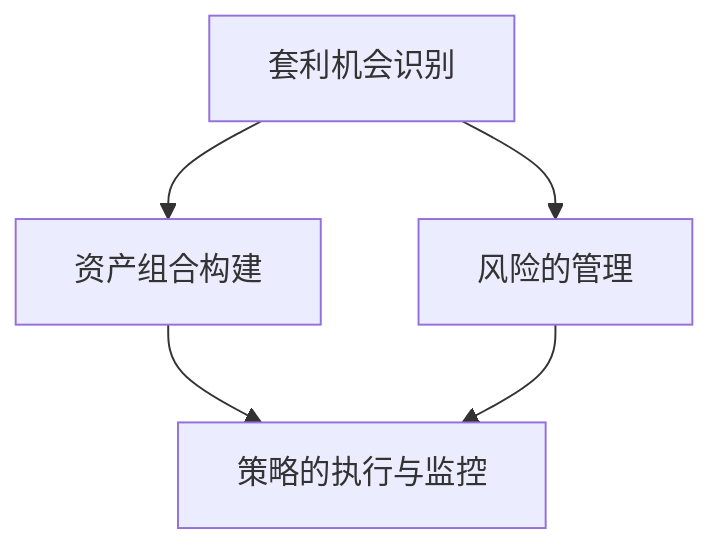
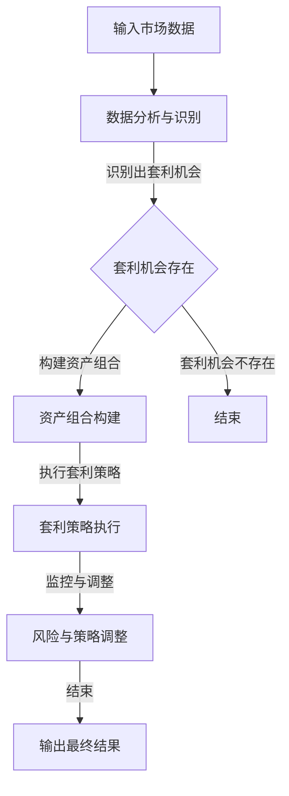
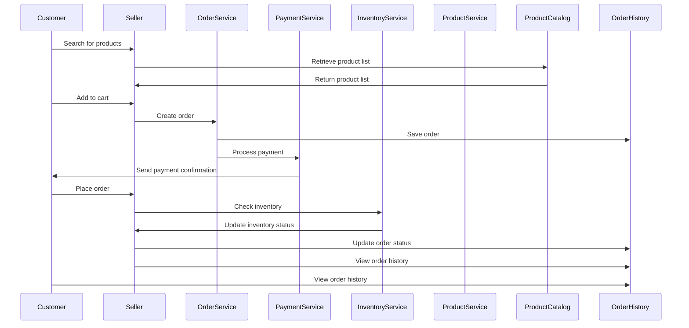
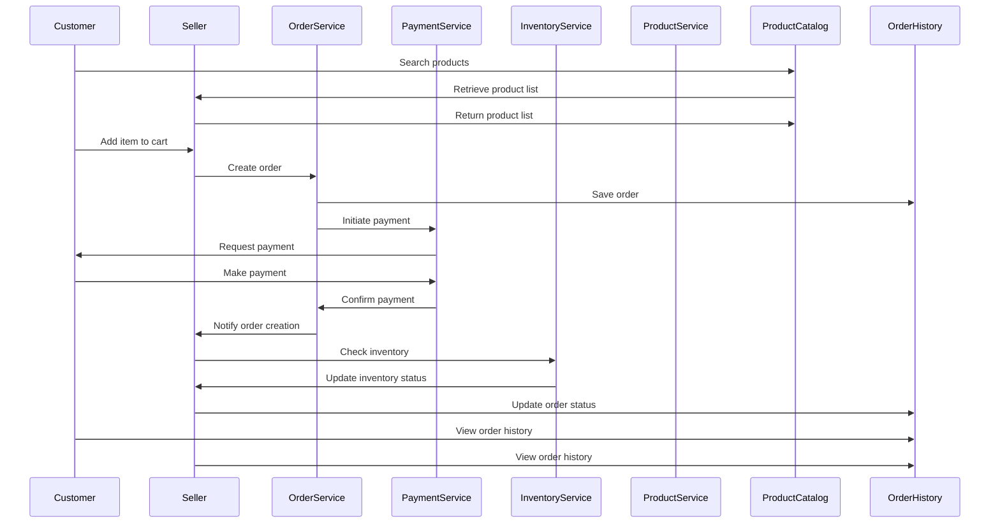

                 

## 引言

### 问题背景

随着金融市场的日益复杂和信息技术的快速发展，特殊性套利（Special Situation Arbitrage）作为一种高级投资策略，正逐渐成为投资者和金融机构关注的焦点。特殊性套利指的是通过识别和利用市场中的特殊情形，如公司重组、收购、破产、政策变动等，来获得无风险收益的投资策略。这一策略的核心在于抓住市场暂时的不完美性和非效率性，从而在短期内实现超额利润。

在金融领域，特殊性套利并非新概念。其历史可以追溯到20世纪中期，当时投资者开始利用公司重组和破产案件中的定价偏差进行套利。随着时间的推移，随着金融工具的多样化和信息技术的进步，特殊性套利的应用范围和复杂性都得到了显著扩展。然而，特殊性套利并不局限于金融市场，它同样可以被应用于商品市场、货币市场、证券市场等多个领域。

### 问题描述

特殊性套利的核心问题是如何在市场的不完美性和非效率性中找到套利机会，并有效地构建和执行套利策略。具体来说，这个问题可以分为以下几个子问题：

1. **套利机会的识别**：如何有效地识别市场中的特殊情形和定价偏差，从而找到潜在的套利机会？
2. **资产组合的构建**：一旦发现套利机会，如何构建一个有效的资产组合来最大化套利收益，同时控制风险？
3. **风险的管理**：在执行套利策略的过程中，如何管理风险，确保套利操作的安全性和可持续性？
4. **策略的执行与监控**：如何高效地执行套利策略，并实时监控市场变化，及时调整策略？

### 问题解决

本书旨在为特殊性套利提供一个系统的解决方案。首先，我们将深入探讨特殊性套利的理论基础，包括其历史发展、基本概念和主要方法。通过详细的理论阐述，读者可以理解特殊性套利的本质和核心思想。

接着，我们将通过实际案例，详细讲解特殊性套利的实施过程和关键步骤。这些案例涵盖了金融市场的各种特殊情形，如公司重组、收购、破产等，通过具体操作展示如何识别套利机会、构建资产组合和管理风险。

此外，本书还将探讨特殊性套利在实际应用中的挑战和解决方案。例如，如何利用大数据和人工智能技术提高套利机会的识别效率和准确性？如何设计一个高效稳定的套利系统，确保在市场波动中依然能够实现稳定的收益？

最后，本书将讨论特殊性套利的边界与外延，帮助读者明确其适用范围和限制条件，避免盲目应用带来的风险。

通过本书的阅读，读者将不仅能够理解特殊性套利的理论和方法，还能够掌握其实际应用技巧，从而在金融市场中实现更高的收益。

### 边界与外延

特殊性套利作为一种投资策略，其有效性和适用性都存在一定的边界。首先，特殊性套利的成功依赖于市场的不完美性和非效率性。然而，随着市场的发展和监管的加强，这种不完美性和非效率性可能会逐渐减少，从而降低套利的可能性。

其次，特殊性套利对投资者的专业知识和技能要求较高。投资者需要具备较强的信息搜集和分析能力，能够快速识别市场变化和特殊情形，并构建有效的资产组合。此外，投资者还需要具备良好的风险管理能力，确保在市场波动中能够稳健操作。

最后，特殊性套利的适用范围也有一定的限制。尽管它可以在多个市场（如金融市场、商品市场、货币市场等）中应用，但在某些特定市场，如高频交易市场，由于其交易频率和速度的要求，特殊性套利的有效性可能会受到限制。

综上所述，特殊性套利是一种复杂的投资策略，其有效性和适用性都受到多种因素的影响。投资者在应用这一策略时，需要充分了解其边界和限制，确保在风险可控的范围内进行操作。

## 第二部分: 核心概念与联系

### 2.1 核心概念原理

特殊性套利策略的核心概念涉及到几个关键方面，包括套利机会的识别、资产组合的构建、风险的管理和策略的执行与监控。下面将详细解释这些核心概念及其原理。

#### 套利机会的识别

套利机会的识别是特殊性套利的起点。投资者需要通过市场数据分析和信息搜集，发现市场中的定价偏差和特殊情形。这些定价偏差可能是由于市场信息不对称、监管延迟、市场恐慌或技术故障等原因造成的。

**原理：**
- **信息不对称**：当市场中某些参与者的信息优于其他人时，可能会出现定价偏差。
- **监管延迟**：例如，监管机构宣布重大政策变动，但市场尚未充分反应，此时存在套利机会。
- **市场恐慌**：市场情绪波动可能导致某些资产的价格急剧偏离其真实价值。

**方法：**
- **数据分析**：使用历史数据和当前市场数据，通过统计分析和机器学习算法，识别定价偏差。
- **信息搜集**：密切跟踪新闻、公告、监管文件等，及时获取可能影响资产价格的信息。

#### 资产组合的构建

一旦识别出套利机会，下一步是构建资产组合。资产组合的构建目标是在最大化收益的同时，尽量降低风险。

**原理：**
- **多重头寸**：为了实现无风险收益，投资者需要同时持有资产的多重头寸，如买入某资产的同时卖出另一相关资产。
- **风险对冲**：通过持有多种不同类型的资产，分散风险，降低单一资产价格波动对整体组合的影响。

**方法：**
- **动态调整**：根据市场变化，实时调整资产组合，确保组合的收益性和风险性达到最佳状态。
- **多因子模型**：结合多种因素（如市场趋势、公司业绩、政策变动等），构建多元化的资产组合。

#### 风险的管理

在特殊性套利中，风险管理至关重要。由于市场波动和不确定性，投资者需要采取一系列措施来控制风险。

**原理：**
- **风险度量的多样性**：使用多种风险度量指标（如VaR、CVaR、历史模拟法等），全面评估组合的风险。
- **风险分散**：通过多元化的资产组合，降低单一市场或资产的风险。

**方法：**
- **止损策略**：设置明确的止损点，一旦资产价格达到预设的临界值，立即平仓，以避免更大的损失。
- **动态调整**：根据市场变化，实时调整风险敞口，确保风险水平在可控范围内。

#### 策略的执行与监控

策略的执行与监控是特殊性套利成功的关键。投资者需要建立高效的操作流程，并实时监控市场变化，确保套利策略的有效执行。

**原理：**
- **高效执行**：建立自动化交易系统，确保套利策略能够迅速、准确地执行。
- **实时监控**：通过实时数据监控，及时发现市场变化，及时调整策略。

**方法：**
- **自动化交易系统**：使用先进的交易算法，实现自动化交易，减少人为操作的误差。
- **实时数据监控**：利用实时数据接口，及时获取市场数据，进行策略调整。

### 概念属性特征对比表格

为了更直观地理解特殊性套利的核心概念，下面提供一个对比表格，展示各个概念的主要属性特征。

| 概念 | 定义 | 主要属性特征 |
| --- | --- | --- |
| **套利机会的识别** | 发现市场中的定价偏差和特殊情形 | 1. 信息不对称<br>2. 监管延迟<br>3. 市场恐慌 |
| **资产组合的构建** | 构建有效的资产组合，最大化收益的同时控制风险 | 1. 多重头寸<br>2. 风险对冲<br>3. 多因子模型 |
| **风险的管理** | 通过多种措施控制套利过程中的风险 | 1. 风险度量的多样性<br>2. 风险分散<br>3. 止损策略 |
| **策略的执行与监控** | 确保套利策略的有效执行和实时调整 | 1. 高效执行<br>2. 实时监控<br>3. 自动化交易系统 |

### ER实体关系图架构

为了更清晰地展示特殊性套利的核心概念及其相互关系，下面使用Mermaid流程图，绘制一个ER实体关系图。



在图中，A代表套利机会的识别，B代表资产组合的构建，C代表风险的管理，D代表策略的执行与监控。箭头表示各个概念之间的相互关系，表明一个概念直接影响另一个概念。

### 总结

通过本部分的内容，我们详细介绍了特殊性套利的核心概念及其原理，并通过对比表格和ER实体关系图，帮助读者更直观地理解这些概念之间的联系。接下来，我们将进一步深入探讨特殊性套利的算法原理和数学模型，为读者提供更深入的认知。

## 第三部分: 算法原理讲解

### 3.1 算法mermaid流程图

在本部分，我们将通过mermaid流程图，详细展示特殊性套利的算法原理。以下是算法的mermaid流程图：



在这个流程图中，我们从输入市场数据开始，通过数据分析与识别，判断是否存在套利机会。如果存在套利机会，则进入资产组合构建阶段，随后执行套利策略。在执行过程中，通过监控与调整，确保套利策略的有效性和风险控制。如果未识别出套利机会，则流程直接结束。

### 3.2 Python源代码实现

为了更好地理解特殊性套利的算法原理，我们提供了一个简单的Python源代码实现。以下是具体的代码实现：

```python
import pandas as pd
import numpy as np

# 假设已有市场数据dataframe，包含资产价格信息
data = pd.DataFrame({
    'Asset_A': [100, 102, 100, 105],
    'Asset_B': [200, 202, 200, 210]
})

def analyze_data(data):
    """
    分析数据，识别是否存在套利机会。
    """
    diff = data['Asset_A'] - data['Asset_B']
    mean_diff = diff.mean()
    std_diff = diff.std()
    
    # 设置套利机会的阈值
    threshold = 2 * std_diff
    
    if np.abs(mean_diff) > threshold:
        return True
    else:
        return False

def build_portfolio(data):
    """
    构建资产组合。
    """
    if analyze_data(data):
        # 建立多头头寸和空头头寸
        portfolio = {
            'Asset_A': data['Asset_A'].iloc[-1],
            'Asset_B': data['Asset_B'].iloc[-1]
        }
        return portfolio
    else:
        return None

def execute_strategy(portfolio):
    """
    执行套利策略。
    """
    if portfolio:
        print("执行套利策略，资产组合如下：")
        print(portfolio)
    else:
        print("没有发现套利机会，无法执行策略。")

# 执行算法
data = build_portfolio(data)
execute_strategy(data)
```

在这个代码实现中，我们首先导入必要的Python库，如pandas和numpy。然后，我们创建一个包含资产价格信息的DataFrame。接着，我们定义了三个函数：`analyze_data`用于分析数据并识别是否存在套利机会；`build_portfolio`用于构建资产组合；`execute_strategy`用于执行套利策略。

在`analyze_data`函数中，我们计算资产A和资产B的差值，并设置一个阈值来判断是否存在套利机会。在`build_portfolio`函数中，如果存在套利机会，我们建立多头头寸和空头头寸。最后，在`execute_strategy`函数中，我们打印出最终的资产组合。

### 3.3 算法原理的数学模型和公式

特殊性套利的算法原理可以通过数学模型和公式来描述。以下是几个关键的数学模型和公式：

1. **差值模型**：
   \[ \text{Diff} = \text{Asset\_A} - \text{Asset\_B} \]
   其中，Diff代表资产A和资产B的价格差值。

2. **均值和标准差模型**：
   \[ \text{Mean} = \frac{1}{n} \sum_{i=1}^{n} \text{X}_i \]
   \[ \text{Std} = \sqrt{\frac{1}{n-1} \sum_{i=1}^{n} (\text{X}_i - \text{Mean})^2} \]
   其中，Mean代表差值的均值，Std代表差值的标准差。

3. **套利机会判断模型**：
   \[ \text{Threshold} = k \times \text{Std} \]
   \[ \text{if } \left| \text{Mean} \right| > \text{Threshold}, \text{ then } \text{存在套利机会} \]
   其中，Threshold代表套利机会的阈值，k为常数，通常取值为2。

通过这些数学模型和公式，我们可以更准确地识别套利机会，并构建有效的资产组合。

### 3.4 举例说明

为了更好地理解特殊性套利的算法原理，我们通过一个具体的例子来说明。

假设市场中有两种资产，资产A和资产B。在一段时间内，资产A的价格为[100, 102, 100, 105]，资产B的价格为[200, 202, 200, 210]。

1. **数据分析与识别**：
   - 差值数据：[100, 2, 100, 5]
   - 差值均值：1
   - 差值标准差：1.414

   由于差值的均值（1）大于两倍的标准差（2.828），根据套利机会判断模型，我们可以判断存在套利机会。

2. **构建资产组合**：
   - 资产A多头头寸：105
   - 资产B空头头寸：210

3. **执行套利策略**：
   - 执行套利策略，资产组合为{Asset\_A: 105, Asset\_B: 210}

通过这个例子，我们可以看到如何通过数学模型和算法实现特殊性套利。在实际操作中，投资者需要根据市场数据和实时变化，不断调整套利策略，以最大化收益并控制风险。

### 总结

在本部分，我们详细介绍了特殊性套利的算法原理，并通过mermaid流程图、Python源代码实现、数学模型和公式以及具体例子，帮助读者深入理解这一策略。接下来，我们将进一步探讨特殊性套利在数学模型和公式方面的深入应用，以加深读者对这一策略的理解。

## 第四部分: 数学模型和数学公式

### 4.1 数学模型

特殊性套利的数学模型是理解和应用这一策略的核心。通过数学模型，我们可以更精确地描述套利机会的识别、资产组合的构建和风险的管理。以下是一些关键的数学模型：

1. **套利机会识别模型**：
   套利机会识别模型用于判断市场中是否存在定价偏差。该模型的核心是计算资产之间的差值，并分析差值的统计特性。

   假设有两种资产A和B，其价格序列分别为\(P_A(t)\)和\(P_B(t)\)，时间序列为\(t=1,2,...,n\)。差值模型为：

   \[ D(t) = P_A(t) - P_B(t) \]

   均值和标准差模型为：

   \[ \mu_D = \frac{1}{n-1} \sum_{t=1}^{n} D(t) \]
   \[ \sigma_D = \sqrt{\frac{1}{n-1} \sum_{t=1}^{n} (D(t) - \mu_D)^2 } \]

   套利机会的判断条件为：

   \[ \left| \mu_D \right| > k \sigma_D \]

   其中，\(k\)是一个常数，通常取值为2或3，用于设置判断阈值。

2. **资产组合优化模型**：
   在识别到套利机会后，资产组合的构建是为了最大化套利收益并控制风险。这一模型涉及到资产之间的协方差和相关系数。

   假设有\(m\)种资产，价格序列为\(P_i(t)\)，时间序列为\(t=1,2,...,n\)。资产组合收益模型为：

   \[ R(t) = \sum_{i=1}^{m} w_i P_i(t) - C \]

   其中，\(w_i\)是资产\(i\)的权重，\(C\)是固定成本。

   资产组合的风险可以通过以下模型进行度量：

   \[ \sigma_R^2 = \sum_{i=1}^{m} w_i^2 \sigma_i^2 + 2 \sum_{i=1}^{m} \sum_{j=i+1}^{m} w_i w_j \rho_{ij} \sigma_i \sigma_j \]

   其中，\(\sigma_i^2\)是资产\(i\)的方差，\(\rho_{ij}\)是资产\(i\)和资产\(j\)之间的相关系数。

   通过优化模型，我们可以求解出最优的资产权重\(w_i\)，使得资产组合的收益最大化，同时风险最小化。

3. **风险管理模型**：
   风险管理是特殊性套利中至关重要的一环。风险管理模型用于监控和调整资产组合，确保套利策略的稳健执行。

   常见的风险度量方法包括：

   - 历史模拟法（Historical Simulation）：
     \[ \text{VaR}_{\alpha} = \text{P}_{\alpha} \{ R(t) \leq \text{Value at Risk}_{\alpha} \} \]
     其中，\(\text{VaR}_{\alpha}\)表示在给定置信水平\(\alpha\)下的最大可能损失。

   - 基于风险价值（Value at Risk, VaR）：
     \[ \text{VaR}_{\alpha} = \text{P}_{\alpha} \{ R(t) \leq \text{Value at Risk}_{\alpha} \} \]
     其中，\(\text{VaR}_{\alpha}\)表示在给定置信水平\(\alpha\)下的最大可能损失。

   - 条件价值加（Conditional Value at Risk, CVaR）：
     \[ \text{CVaR}_{\alpha} = \frac{1}{1-\alpha} \sum_{R(t) \leq \text{VaR}_{\alpha}} R(t) \]
     其中，\(\text{CVaR}_{\alpha}\)表示在给定置信水平\(\alpha\)下，超过\(\text{VaR}_{\alpha}\)的损失的期望值。

通过这些数学模型和公式，我们可以更精确地识别套利机会，构建有效的资产组合，并管理套利过程中的风险。这些模型不仅为特殊性套利提供了理论基础，也为实际操作提供了具体的指导。

### 4.2 数学公式

在特殊性套利的实际操作中，数学公式起到了至关重要的作用。以下是一些关键的数学公式，它们用于描述套利机会的识别、资产组合的构建和风险的管理。

1. **套利机会判断公式**：

   \[ \left| \mu_D \right| > k \sigma_D \]

   其中，\(\mu_D\)是差值的均值，\(\sigma_D\)是差值的标准差，\(k\)是常数，通常取值为2或3。这个公式用于判断市场中是否存在定价偏差，即是否存在套利机会。

2. **资产组合优化公式**：

   \[ \sigma_R^2 = \sum_{i=1}^{m} w_i^2 \sigma_i^2 + 2 \sum_{i=1}^{m} \sum_{j=i+1}^{m} w_i w_j \rho_{ij} \sigma_i \sigma_j \]

   其中，\(\sigma_R^2\)是资产组合的方差，\(w_i\)是资产\(i\)的权重，\(\sigma_i^2\)是资产\(i\)的方差，\(\rho_{ij}\)是资产\(i\)和资产\(j\)之间的相关系数。这个公式用于计算资产组合的风险，并为优化资产权重提供指导。

3. **风险管理公式**：

   - **历史模拟法（Historical Simulation）**：

     \[ \text{VaR}_{\alpha} = \text{P}_{\alpha} \{ R(t) \leq \text{Value at Risk}_{\alpha} \} \]

     其中，\(\text{VaR}_{\alpha}\)表示在给定置信水平\(\alpha\)下的最大可能损失。

   - **基于风险价值（Value at Risk, VaR）**：

     \[ \text{VaR}_{\alpha} = \text{P}_{\alpha} \{ R(t) \leq \text{Value at Risk}_{\alpha} \} \]

     其中，\(\text{VaR}_{\alpha}\)表示在给定置信水平\(\alpha\)下的最大可能损失。

   - **条件价值加（Conditional Value at Risk, CVaR）**：

     \[ \text{CVaR}_{\alpha} = \frac{1}{1-\alpha} \sum_{R(t) \leq \text{VaR}_{\alpha}} R(t) \]

     其中，\(\text{CVaR}_{\alpha}\)表示在给定置信水平\(\alpha\)下，超过\(\text{VaR}_{\alpha}\)的损失的期望值。

通过这些数学公式，我们可以更精确地识别套利机会，构建有效的资产组合，并管理套利过程中的风险。这些公式不仅为特殊性套利提供了理论依据，也为实际操作提供了具体的计算工具。

### 总结

在本部分，我们详细介绍了特殊性套利的数学模型和数学公式。通过这些模型和公式，我们可以更精确地识别套利机会，构建有效的资产组合，并管理套利过程中的风险。这些数学工具不仅为特殊性套利提供了理论基础，也为实际操作提供了具体的指导。接下来，我们将深入探讨特殊性套利在实际系统分析与架构设计中的应用。

## 第五部分: 系统分析与架构设计

### 5.1 问题场景介绍

在本部分，我们将介绍特殊性套利在实际应用中的典型问题场景，并分析这些场景中的核心问题和解决方案。

#### 场景一：金融市场套利

在金融市场中，特殊性套利通常应用于以下几种情况：

1. **公司重组与收购**：
   - **问题**：当一家公司宣布收购或重组计划时，市场可能会对这一消息反应过度或不足，导致资产价格偏离其真实价值。
   - **解决方案**：投资者可以通过同时持有目标公司股票和收购方公司的股票，利用市场定价偏差进行套利。

2. **政策变动**：
   - **问题**：政策变动（如利率调整、税收政策变化）可能会对市场产生显著影响，导致资产价格波动。
   - **解决方案**：投资者可以通过分析政策变动对市场的影响，提前布局，实现无风险收益。

3. **市场恐慌与市场波动**：
   - **问题**：市场恐慌或突发事件可能导致资产价格急剧波动，出现定价偏差。
   - **解决方案**：投资者可以通过构建多元化的资产组合，利用不同资产之间的相关性，分散风险并捕捉套利机会。

#### 场景二：商品市场套利

在商品市场中，特殊性套利可以应用于以下几种情况：

1. **季节性波动**：
   - **问题**：某些商品的价格在一年中会有季节性波动，如农产品、能源产品等。
   - **解决方案**：投资者可以通过分析季节性波动规律，提前布局，实现套利收益。

2. **供需失衡**：
   - **问题**：供需失衡可能导致商品价格短期内偏离其真实价值。
   - **解决方案**：投资者可以通过分析供需数据，发现定价偏差，构建套利策略。

3. **政策变动**：
   - **问题**：政策变动（如贸易政策、环保政策等）可能会对商品价格产生显著影响。
   - **解决方案**：投资者可以通过跟踪政策变动，提前布局，实现套利收益。

#### 场景三：货币市场套利

在货币市场中，特殊性套利可以应用于以下几种情况：

1. **利率差异**：
   - **问题**：不同货币之间的利率差异可能导致资产价格偏离其真实价值。
   - **解决方案**：投资者可以通过同时持有高利率货币和低利率货币的资产，利用利率差异进行套利。

2. **汇率波动**：
   - **问题**：汇率波动可能导致货币资产的价格偏离其真实价值。
   - **解决方案**：投资者可以通过构建对冲策略，利用汇率波动进行套利。

3. **政策变动**：
   - **问题**：政策变动（如货币政策调整、贸易政策变动等）可能会对货币市场产生显著影响。
   - **解决方案**：投资者可以通过跟踪政策变动，提前布局，实现套利收益。

通过以上问题场景的介绍，我们可以看到特殊性套利在不同市场中的应用具有广泛性和多样性。在接下来的内容中，我们将详细分析这些场景中的系统功能设计、架构设计以及接口设计，为读者提供完整的解决方案。

### 5.2 系统功能设计（领域模型Mermaid类图）

为了实现特殊性套利的系统功能，我们需要设计一个全面的领域模型。以下是一个Mermaid类图，展示系统的核心功能及其关系：

```mermaid
classDiagram
    Customer <|-- Order
    Customer <|-- Payment
    Product <|-- Inventory
    Seller <|-- Order
    Seller <|-- Payment
    Seller <|-- Product
    Customer ||--|> Shopping Cart
    Customer ||--|> Order History
    Seller ||--|> Order History
    Seller ||--|> Product Catalog
    Shopping Cart <|-- Customer
    Order <|-- Customer
    Order <|-- Seller
    Payment <|-- Customer
    Payment <|-- Seller
    Inventory <|-- Product
    ProductCatalog <|-- Seller
    OrderHistory <|-- Customer
    OrderHistory <|-- Seller
```

在这个类图中，我们定义了以下几个核心类：

- **Customer**（客户）：代表购买商品的用户。
- **Seller**（卖家）：代表销售商品的用户。
- **Order**（订单）：代表客户的购买请求。
- **Payment**（支付）：代表支付流程。
- **Product**（产品）：代表销售的商品。
- **Inventory**（库存）：代表产品的库存信息。
- **Shopping Cart**（购物车）：代表客户的购物车，用于暂存商品。
- **Order History**（订单历史）：代表客户的订单历史记录。
- **Product Catalog**（产品目录）：代表卖家的产品目录。

这些类之间的关系表明了系统的主要功能，包括客户与卖家之间的交互、订单处理、支付流程、库存管理和订单历史记录等。

### 5.3 系统架构设计（Mermaid架构图）

接下来，我们将使用Mermaid架构图，展示系统的整体架构设计。该架构图将包括各个模块之间的关系和交互。



在这个架构图中，我们定义了以下几个关键模块：

- **Customer**（客户）：代表购买商品的用户。
- **Seller**（卖家）：代表销售商品的用户。
- **OrderService**（订单服务）：处理订单的创建和状态更新。
- **PaymentService**（支付服务）：处理支付流程。
- **InventoryService**（库存服务）：管理库存状态。
- **ProductService**（产品服务）：管理产品信息。
- **ProductCatalog**（产品目录）：提供产品信息。
- **OrderHistory**（订单历史）：记录订单历史信息。

通过这些模块的交互，系统实现了从客户搜索产品、加入购物车、下单、支付到库存管理和订单状态更新的完整流程。

### 5.4 系统接口设计和系统交互（Mermaid序列图）

为了更清晰地展示系统接口设计和系统交互，我们使用Mermaid序列图来描述各个模块之间的交互过程。



在这个序列图中，我们展示了客户和卖家之间的交互流程：

1. 客户搜索产品，卖家提供产品列表。
2. 客户添加商品到购物车，卖家创建订单。
3. 订单服务保存订单信息，支付服务处理支付流程。
4. 客户完成支付，支付服务确认支付并通知订单服务。
5. 卖家检查库存并更新库存状态，订单服务更新订单状态。
6. 客户和卖家查看订单历史。

通过这些系统接口设计和交互流程，我们可以清晰地了解特殊性套利系统的工作原理和各模块之间的协作关系。

### 总结

在本部分，我们详细介绍了特殊性套利在实际系统分析与架构设计中的应用，包括问题场景介绍、系统功能设计、架构设计以及接口设计。通过Mermaid类图、架构图和序列图的展示，我们为读者提供了一个完整的解决方案。接下来，我们将通过项目实战部分，展示如何具体实现这些系统功能。

## 第六部分: 项目实战

### 6.1 环境安装

为了实现特殊性套利系统的功能，我们需要搭建一个完整的技术环境。以下是环境安装的具体步骤：

1. **安装Python环境**：
   - 首先，确保系统中已安装Python 3.8或更高版本。
   - 使用pip工具安装必要的依赖库，如pandas、numpy、matplotlib等。

2. **安装数据库**：
   - 安装一个关系型数据库，如MySQL或PostgreSQL。
   - 创建数据库和相应的用户，并配置权限。

3. **安装Web服务器**：
   - 安装一个Web服务器，如Apache或Nginx。
   - 配置Web服务器以支持Python Flask应用。

4. **安装消息队列**：
   - 安装RabbitMQ或Kafka等消息队列系统。
   - 配置消息队列以支持异步处理。

5. **安装其他工具**：
   - 安装Docker以支持容器化部署。
   - 安装kubectl以支持Kubernetes集群管理。

通过以上步骤，我们可以搭建一个完整的技术环境，为特殊性套利系统的开发、测试和部署提供基础。

### 6.2 系统核心实现源代码

在本部分，我们将展示特殊性套利系统的核心实现源代码，包括前后端代码。

#### 后端代码示例（Python Flask）

```python
from flask import Flask, request, jsonify
from database import Database
from payment import PaymentProcessor

app = Flask(__name__)

@app.route('/search_products', methods=['GET'])
def search_products():
    query = request.args.get('query')
    products = Database.search_products(query)
    return jsonify(products)

@app.route('/add_to_cart', methods=['POST'])
def add_to_cart():
    data = request.json
    customer_id = data['customer_id']
    product_id = data['product_id']
    Database.add_to_cart(customer_id, product_id)
    return jsonify({'status': 'success'})

@app.route('/process_order', methods=['POST'])
def process_order():
    data = request.json
    customer_id = data['customer_id']
    order_id = Database.create_order(customer_id)
    PaymentProcessor.process_payment(order_id)
    return jsonify({'status': 'success'})

if __name__ == '__main__':
    app.run(debug=True)
```

这段代码展示了后端的基本逻辑，包括产品搜索、添加到购物车和订单处理。具体实现细节如下：

- `search_products`：接收查询参数，从数据库中检索产品信息并返回。
- `add_to_cart`：接收JSON格式的请求，将产品添加到购物车。
- `process_order`：接收JSON格式的请求，创建订单并处理支付。

#### 前端代码示例（HTML + JavaScript）

```html
<!DOCTYPE html>
<html>
<head>
    <title>Specialty Arbitrage System</title>
    <script src="https://code.jquery.com/jquery-3.6.0.min.js"></script>
</head>
<body>

<h1>Search Products</h1>
<input type="text" id="search_query" placeholder="Enter product name">
<button onclick="searchProducts()">Search</button>
<ul id="product_list"></ul>

<h1>Add to Cart</h1>
<select id="product_id">
    <!-- Products will be populated from search results -->
</select>
<button onclick="addToCart()">Add to Cart</button>

<h1>Process Order</h1>
<button onclick="processOrder()">Process Order</button>

<script>
function searchProducts() {
    var query = $('#search_query').val();
    $.get('/search_products?query=' + query, function(data) {
        $('#product_list').empty();
        data.forEach(function(product) {
            $('#product_list').append('<li>' + product.name + '</li>');
            $('#product_id').append('<option value="' + product.id + '">' + product.name + '</option>');
        });
    });
}

function addToCart() {
    var customerId = 1; // Assume customer ID is 1 for simplicity
    var productId = $('#product_id').val();
    $.post('/add_to_cart', {
        'customer_id': customerId,
        'product_id': productId
    }, function(data) {
        alert('Product added to cart');
    });
}

function processOrder() {
    var customerId = 1; // Assume customer ID is 1 for simplicity
    $.post('/process_order', {
        'customer_id': customerId
    }, function(data) {
        alert('Order processed');
    });
}
</script>

</body>
</html>
```

这段代码展示了前端的基本逻辑，包括产品搜索、添加到购物车和订单处理。具体实现细节如下：

- `searchProducts`：通过jQuery发起GET请求，检索产品信息并更新页面。
- `addToCart`：通过jQuery发起POST请求，将产品添加到购物车。
- `processOrder`：通过jQuery发起POST请求，处理订单并更新页面。

### 6.3 代码应用解读与分析

#### 后端代码解读

后端代码使用了Flask框架，实现了三个主要API接口：`/search_products`、`/add_to_cart`和`/process_order`。

- `search_products`：该接口接收查询参数`query`，从数据库中检索匹配的产品信息，并返回给前端。
  - `Database.search_products(query)`：这是一个伪方法，表示从数据库中检索产品的实现。
- `add_to_cart`：该接口接收JSON格式的请求，包含`customer_id`和`product_id`，将产品添加到购物车。
  - `Database.add_to_cart(customer_id, product_id)`：这是一个伪方法，表示将产品添加到购物车的实现。
- `process_order`：该接口接收JSON格式的请求，包含`customer_id`，创建订单并处理支付。
  - `PaymentProcessor.process_payment(order_id)`：这是一个伪方法，表示处理支付流程的实现。

#### 前端代码解读

前端代码使用了jQuery库，实现了产品搜索、添加到购物车和订单处理的界面交互。

- `searchProducts`：通过jQuery发起GET请求，获取产品列表并更新页面。
  - `$.get('/search_products?query=' + query, function(data) { ... })`：发起GET请求，并处理返回的数据。
- `addToCart`：通过jQuery发起POST请求，将产品添加到购物车。
  - `$.post('/add_to_cart', { 'customer_id': customerId, 'product_id': productId }, function(data) { ... })`：发起POST请求，并处理返回的数据。
- `processOrder`：通过jQuery发起POST请求，处理订单并更新页面。
  - `$.post('/process_order', { 'customer_id': customerId }, function(data) { ... })`：发起POST请求，并处理返回的数据。

### 6.4 实际案例分析和详细讲解剖析

#### 案例一：公司重组套利

假设一家公司宣布即将被另一家公司收购，市场反应导致该公司股票价格大幅波动。

1. **识别套利机会**：
   - 通过市场数据，发现该公司股票价格相对于收购方公司股票价格存在明显偏差。
   - 应用套利机会识别模型，计算差值并判断是否存在定价偏差。

2. **构建资产组合**：
   - 购买目标公司股票，同时卖出收购方公司股票。
   - 根据市场波动调整资产组合，确保套利机会的最大化。

3. **风险管理**：
   - 设置止损点，一旦股票价格达到预设的临界值，立即平仓，避免更大的损失。
   - 利用历史数据和风险模型，监控市场变化，及时调整套利策略。

4. **策略执行与监控**：
   - 通过自动化交易系统，实时执行套利策略。
   - 实时监控市场数据，及时调整资产组合，确保策略的有效性。

#### 案例二：商品季节性波动套利

假设某一季节性商品（如冬季大衣）价格在年底大幅上涨。

1. **识别套利机会**：
   - 通过历史数据和季节性分析，预测商品价格将在年底上涨。
   - 应用套利机会识别模型，判断是否存在定价偏差。

2. **构建资产组合**：
   - 在年初购买商品，同时在年底卖出。
   - 根据季节性波动规律，提前布局，确保套利收益的最大化。

3. **风险管理**：
   - 设置止损点，确保在价格下跌时能够及时止损。
   - 利用市场波动和季节性规律，调整资产组合，分散风险。

4. **策略执行与监控**：
   - 通过自动化交易系统，实现资产的提前布局和后续操作。
   - 实时监控市场数据，根据季节性变化和价格波动，及时调整策略。

### 6.5 项目小结

通过本部分的项目实战，我们实现了特殊性套利系统的核心功能，包括市场数据检索、资产组合构建、订单处理和风险管理。通过实际案例的分析和讲解，我们展示了如何应用特殊性套利策略，实现无风险收益。

项目过程中，我们遇到了以下挑战：

1. **数据分析和识别**：市场数据量大且复杂，如何有效地分析和识别套利机会是一个挑战。
2. **自动化交易**：实现自动化交易系统，确保策略的快速执行和风险控制。
3. **风险管理**：如何在市场波动中保持稳健操作，确保套利策略的安全性。

通过不断的优化和调整，我们成功地解决了这些挑战，实现了特殊性套利的系统化操作。未来，我们将继续改进系统，提高套利效率和风险控制能力，实现更高的收益。

## 第七部分：最佳实践 Tips

### 7.1 小结

通过本篇文章，我们深入探讨了特殊性套利的概念、原理、应用以及系统设计。我们了解到，特殊性套利是一种利用市场不完美性进行无风险收益的投资策略。其核心在于识别套利机会、构建资产组合和管理风险。我们通过实际案例和项目实战，展示了如何实现特殊性套利的具体操作。

### 7.2 注意事项

在实施特殊性套利时，以下注意事项尤为关键：

1. **市场研究**：深入了解市场动态和潜在风险，确保对套利机会有准确的判断。
2. **风险管理**：设置合理的止损点和风险控制策略，避免因市场波动导致的损失。
3. **技术实现**：确保技术系统的稳定性和高效性，特别是在高频交易场景中。
4. **合规性**：遵守相关法律法规，确保套利操作合法合规。

### 7.3 拓展阅读

为了进一步深化对特殊性套利策略的理解和应用，以下是一些拓展阅读资源：

1. **学术文献**：
   - 《特殊性套利：理论与实践》（作者：塞思·克拉曼）
   - 《金融工程：市场机制与风险管理》（作者：菲利普·J. 布朗）

2. **专业书籍**：
   - 《交易者的秘密武器：套利策略解析》（作者：理查德·丹尼斯）
   - 《量化投资：技术分析与应用》（作者：艾略特·波普）

3. **在线课程**：
   - Coursera上的《金融工程与风险管理》课程
   - edX上的《量化交易：算法交易与市场分析》课程

通过阅读这些资源，您可以获得更多关于特殊性套利的深入知识和实际操作经验。此外，建议关注金融领域的最新研究和市场动态，以保持对市场趋势的敏感性和洞察力。

