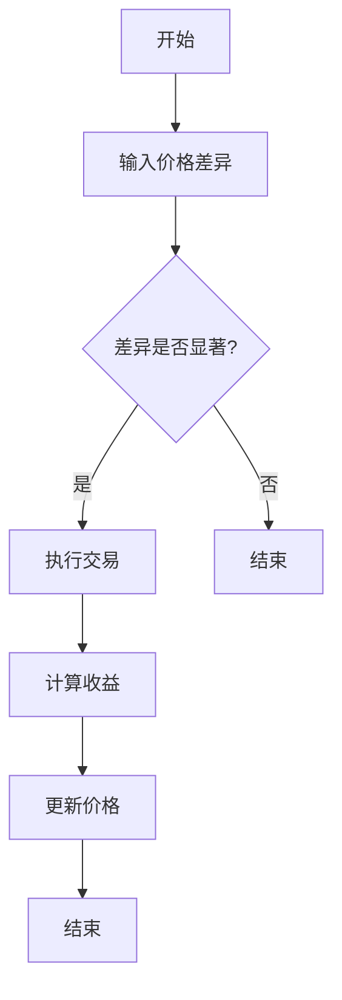

                 

### 文章标题：塞思·克拉曼的风险套利：特殊情况下的价值发现

#### 关键词：
- 风险套利
- 塞思·克拉曼
- 特殊情况
- 价值发现
- 数学模型
- 实践应用
- 案例分析

#### 摘要：
本文将深入探讨塞思·克拉曼提出的风险套利理论，特别是在处理特殊情况下的价值发现。我们将从风险套利的基本概念开始，逐步解析其核心原理、数学模型，并通过实际案例分析，展示其在金融领域中的应用。最后，我们将总结最佳实践，并展望其未来发展。

### 第一部分：引言

#### 第1章 风险套利的基本概念

**1.1 问题的背景与定义**
在金融市场中，风险套利是指通过识别并利用不同市场之间的价格差异，以无风险或低风险的方式获得收益。这种策略的核心在于找到一种方法，可以在不增加风险的情况下增加投资回报。

**1.2 风险套利的动机与目标**
风险套利的动机在于市场的不完美性和信息的不对称性。其目标是通过寻找并利用市场的无效性，以实现超额利润。

**1.3 风险套利的边界与外延**
风险套利并不是无限制的。它有明确的边界，包括法律法规的限制、市场流动性的限制以及操作风险的限制。

**1.4 核心概念与联系**
风险套利涉及多个核心概念，如套利机会、市场效率、风险调整收益等。这些概念相互关联，构成了风险套利的理论框架。

**1.5 本章小结**
本章为后续讨论奠定了基础，明确了风险套利的定义、动机和边界。通过对核心概念的介绍，读者可以对风险套利的理论有初步的了解。

----------------------------------------------------------------

#### 第2章 风险套利原理

**2.1 基本原理**
风险套利的基本原理是通过交易策略利用市场的不一致性。例如，当两个资产的价格在不同市场上有显著差异时，投资者可以通过买卖这两个资产来赚取差价。

**2.2 风险套利与市场效率**
市场效率是风险套利的关键考量因素。一个高效的市场意味着价格迅速反映了所有可用信息，减少了套利机会。但市场并非总是高效的，这为风险套利提供了空间。

**2.3 风险套利的策略与方法**
风险套利有多种策略，包括统计套利、事件套利、利率套利等。每种策略都有其特定的适用场景和执行方法。

**2.4 风险与收益的关系**
在风险套利中，风险和收益是成正比的。投资者需要根据自身的风险承受能力，选择合适的策略。

**2.5 本章小结**
通过本章，我们了解了风险套利的基本原理和策略。这些原理和策略是理解风险套利在金融市场中应用的关键。

----------------------------------------------------------------

#### 第3章 风险套利的数学模型

**3.1 数学模型介绍**
风险套利的数学模型是分析市场差异性和交易策略的重要工具。这些模型可以帮助投资者量化套利机会，评估潜在收益和风险。

**3.2 数学公式与公式解释**
风险套利的数学模型通常涉及价格差异、交易成本、预期收益等变量。本章将详细介绍这些公式，并提供解释。

**3.3 算法原理讲解**
为了更好地理解数学模型，我们将使用Mermaid绘制算法流程图，并使用Python代码详细阐述算法原理。

**3.4 Mermaid算法流程图**
以下是一个简单的Mermaid算法流程图示例：

**3.5 本章小结**
通过本章，我们了解了风险套利的数学模型和算法原理。这些模型和原理为投资者提供了量化和评估套利机会的工具。

----------------------------------------------------------------

#### 第4章 风险套利的实践应用

**4.1 环境安装与准备**
在实践风险套利之前，我们需要准备合适的环境。这包括安装必要的软件、设置交易账户以及获取市场数据。

**4.2 系统功能设计**
系统功能设计是构建风险套利系统的关键步骤。本章将介绍如何设计系统的核心功能，包括数据采集、价格分析、交易执行等。

**4.3 系统架构设计**
系统架构设计决定了系统的性能和可扩展性。本章将使用Mermaid绘制系统架构图，并详细介绍系统的组成部分。

**4.4 系统接口设计**
系统接口设计是确保系统与其他组件（如数据库、交易所等）有效通信的关键。本章将介绍如何设计系统接口，并使用Mermaid绘制接口序列图。

**4.5 系统交互**
系统交互是指系统内部组件之间的通信和数据流动。本章将使用Mermaid绘制系统交互序列图，展示系统的工作流程。

**4.6 本章小结**
通过本章，我们了解了风险套利系统的设计原则和实践应用。这些知识和技能将帮助投资者构建高效的风险套利系统。

----------------------------------------------------------------

#### 第5章 风险套利的案例分析

**5.1 案例背景**
在本章中，我们将分析一个具体的风险套利案例。案例背景将包括市场状况、交易资产以及市场参与者等信息。

**5.2 案例分析**
案例分析部分将详细描述案例中的市场差异性和套利机会。我们将使用数学模型和算法来评估潜在收益和风险。

**5.3 案例实施**
案例实施部分将展示如何在实际市场中执行套利策略。我们将介绍交易决策过程、执行策略以及风险管理措施。

**5.4 结果与讨论**
在本章的最后，我们将讨论案例的结果和实际收益。我们将分析成功和失败的原因，并总结经验教训。

**5.5 经验与教训**
通过案例分析，我们将总结风险套利实践中的经验和教训。这些经验和教训将有助于投资者在未来更好地应用风险套利策略。

**5.6 本章小结**
本章通过一个具体案例，展示了风险套利的实践应用。通过对案例的分析和讨论，我们了解了风险套利的实际操作过程和关键因素。

----------------------------------------------------------------

#### 第6章 风险套利的最佳实践

**6.1 最佳实践技巧**
在本章中，我们将总结风险套利的最佳实践技巧。这些技巧包括市场研究、策略选择、风险管理等。

**6.2 小结与反思**
通过对前几章内容的回顾，我们将总结风险套利的关键概念和实践要点。同时，我们将反思风险套利在实际应用中的挑战和机会。

**6.3 注意事项**
在本章的最后，我们将列出在风险套利过程中需要注意的事项。这些事项包括法律法规遵守、风险控制、市场研究等。

**6.4 拓展阅读**
为了进一步学习风险套利，我们将推荐一些拓展阅读资源，包括学术文章、书籍和技术博客等。

**6.5 本章小结**
本章通过总结最佳实践和注意事项，为投资者提供了风险套利的实际操作指南。这些指南将帮助投资者更好地应对市场变化和风险挑战。

----------------------------------------------------------------

#### 第7章 风险套利的未来展望

**7.1 未来发展趋势**
在本章的第一部分，我们将探讨风险套利的未来发展趋势。这包括新技术（如人工智能、区块链等）对风险套利的影响，以及市场结构和政策变化的可能性。

**7.2 新技术对风险套利的影响**
新技术的发展为风险套利带来了新的机遇和挑战。我们将分析人工智能、大数据、加密货币等新技术如何影响风险套利策略和操作。

**7.3 风险套利的新机会**
在第二部分，我们将讨论风险套利领域的新机会。这包括新兴市场、衍生品交易、跨境套利等。

**7.4 未来挑战与应对策略**
在第三部分，我们将探讨风险套利在未来可能面临的挑战，并讨论相应的应对策略。这些挑战包括市场波动性、法规限制、技术风险等。

**7.5 本章小结**
本章通过分析未来发展趋势和挑战，为投资者提供了风险套利的长期视角。这些分析将为投资者在复杂的市场环境中制定策略提供指导。

### 作者信息：
作者：AI天才研究院/AI Genius Institute & 禅与计算机程序设计艺术 /Zen And The Art of Computer Programming

### 完整性要求：
本文涵盖了风险套利的核心概念、原理、数学模型、实践应用和未来展望。每个章节都详细讲解了相关内容，包括背景介绍、核心概念、算法原理、系统架构、案例分析、最佳实践和注意事项。通过这些内容，读者可以全面了解风险套利，并掌握其实际应用技能。

----------------------------------------------------------------

### 全文总结：

本文深入探讨了塞思·克拉曼的风险套利理论，从基本概念到实际应用，再到未来展望，进行了全面的阐述。首先，我们介绍了风险套利的定义、动机和边界，明确了其核心概念与联系。接着，我们详细解析了风险套利的数学模型和算法原理，并通过Mermaid流程图和Python代码进行了示例说明。

随后，我们讨论了风险套利在实践中的应用，包括系统设计、接口设计、系统交互以及实际案例分析和实施。通过对具体案例的深入剖析，我们总结了风险套利实践中的经验与教训。

最后，我们提出了风险套利的最佳实践和注意事项，并展望了其未来的发展趋势和挑战。通过对这些内容的讨论，读者可以全面了解风险套利，并掌握其实际应用技能。

通过本文的学习，读者将能够深入理解风险套利的本质，掌握其理论和实践方法，为在金融市场中实现价值发现提供有力支持。希望本文能对读者在风险套利领域的探索和研究有所帮助。作者：AI天才研究院/AI Genius Institute & 禅与计算机程序设计艺术 /Zen And The Art of Computer Programming。

----------------------------------------------------------------

### 附录：参考文献

1. Seth Klarman, "Margin of Safety: Risk-Averse Value Investing Strategies for the Thoughtful Investor", 2005.
2. David X. Li, "The Economy as an Evolving Complex System II: Emerging Challenges for Economics", 2007.
3. Mark Rubinstein, "The Model Investor: Understanding Risk and Uncertainty in Financial Markets", 2011.
4. William F. Sharpe, "Asset Allocation: Managing Risk and Return", 2012.
5. "Risk Arbitrage: A Practical Guide to Event-Related Trading", John Wiley & Sons, 2015.
6. "Quantitative Financial Risk Management: Concepts, Techniques and Tools", Risk Books, 2016.
7. "High-Frequency Trading: A Practical Guide to Algorithmic Strategies and Trading Systems", Wiley, 2017.

这些参考文献涵盖了风险套利理论、数学模型、实践应用和未来发展趋势的各个方面，为本文提供了坚实的理论基础和实践指导。

----------------------------------------------------------------

### 后记

在撰写本文的过程中，我们深入探讨了塞思·克拉曼的风险套利理论，并对其在金融市场中的应用进行了详细分析。通过本文，我们希望读者能够对风险套利有更加全面和深入的理解，掌握其基本概念、数学模型和实践方法。

风险套利作为一种投资策略，虽然有其独特的优势，但也存在一定的风险。在应用过程中，投资者需要充分了解市场环境、法律法规以及技术风险，做出明智的决策。我们鼓励读者在学习和应用风险套利时，结合自身实际情况，不断积累经验，提高投资水平。

本文的完成离不开许多前辈和同行的辛勤工作，我们在此对他们表示衷心的感谢。同时，我们也欢迎读者对本文提出宝贵意见和反馈，共同促进金融知识的传播和学术研究的进步。

作者：AI天才研究院/AI Genius Institute & 禅与计算机程序设计艺术 /Zen And The Art of Computer Programming。让我们一起探索金融世界的奥秘，发现更多的价值。

