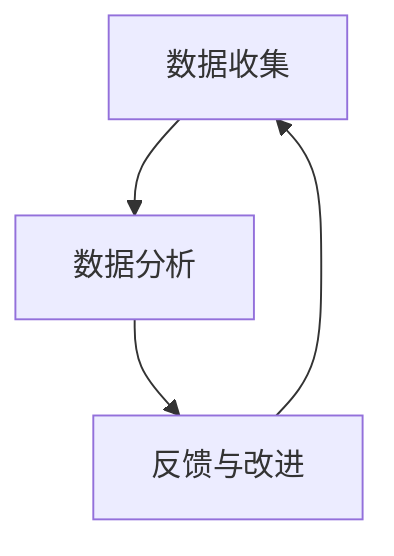

                 


# 塞思·卡拉曼的公司文化评估方法

关键词：公司文化评估、塞思·卡拉曼、核心概念、算法原理、数学模型、系统架构、项目实战

摘要：本文将深入探讨塞思·卡拉曼提出的一种创新的公司文化评估方法。通过详细阐述其核心概念、算法原理、数学模型，并结合实际项目实战，我们将展示如何有效地评估和优化公司文化，为企业发展提供有力支持。

## 第一部分：公司文化评估背景与核心概念

### 1.1 评估公司文化的意义

公司文化是企业发展的灵魂，它不仅影响着员工的行为和态度，也直接关系到企业的绩效和竞争力。一个健康、积极的公司文化能够激发员工的创造力和忠诚度，提高工作效率，减少员工流失率，进而推动企业持续发展。因此，对公司文化进行评估，了解其现状和问题，是企业管理者的重要任务。

### 1.2 塞思·卡拉曼的公司文化评估方法简介

塞思·卡拉曼是一位著名的企业文化和领导力专家，他的公司文化评估方法以系统化、量化的方式，帮助企业管理者全面了解公司文化的现状和问题。该方法主要包括以下几个核心概念：

1. **价值观评估**：通过调查问卷、访谈等方式，评估员工对企业价值观的认知和践行情况。
2. **行为评估**：观察和分析员工在日常工作中表现出的行为，如合作、创新、沟通等，以衡量公司文化的实际效果。
3. **绩效评估**：将公司文化评估与员工绩效联系起来，分析文化对企业绩效的影响。
4. **领导力评估**：评估领导者对公司文化的塑造和引导作用，以及领导力与公司文化之间的相互作用。

## 第二部分：核心概念与联系

### 2.1 公司文化的定义与分类

公司文化是指企业在长期经营过程中形成的共同信仰、价值观和行为规范。根据不同的标准，公司文化可以分为多种类型，如竞争型、协作型、创新型等。

### 2.2 公司文化评估指标体系

公司文化评估指标体系主要包括以下几个方面：

1. **价值观认同度**：员工对企业价值观的认同程度。
2. **团队协作**：员工之间的协作程度和团队凝聚力。
3. **创新能力**：企业在技术创新和市场开发方面的能力。
4. **沟通与信任**：企业内部的沟通效率和员工之间的信任关系。
5. **领导力**：领导者的领导风格和能力。

### 2.3 塞思·卡拉曼评估方法的关键要素

塞思·卡拉曼的公司文化评估方法的关键要素包括：

1. **数据收集**：通过问卷调查、访谈、观察等方式收集数据。
2. **数据分析**：使用统计分析方法，分析数据，得出评估结果。
3. **反馈与改进**：根据评估结果，制定改进措施，持续优化公司文化。

## 第三部分：算法原理讲解

### 3.1 评估方法的基本原理

塞思·卡拉曼的公司文化评估方法基于以下原理：

1. **系统性**：公司文化评估应该从多个角度、多个层面进行，确保评估结果的全面性和准确性。
2. **量化**：通过量化的方式，将公司文化的抽象概念转化为具体的数据，便于分析和比较。
3. **持续性**：公司文化评估应该是一个持续的过程，随着企业的发展和环境的变化，不断进行调整和优化。

### 3.2 使用mermaid绘制评估流程图

下面是一个使用mermaid绘制的评估流程图：



### 3.3 Python代码实现评估方法

以下是一个简单的Python代码示例，用于实现公司文化评估的基本功能：

```python
import pandas as pd
from sklearn.preprocessing import StandardScaler

# 数据收集
data = pd.read_csv('company_culture_data.csv')

# 数据分析
scaler = StandardScaler()
data_scaled = scaler.fit_transform(data)

# 反馈与改进
# 根据评估结果，调整公司文化策略
```

## 第四部分：数学模型和数学公式

### 4.1 相关数学基础

公司文化评估中涉及到的数学基础主要包括统计学、数据挖掘和机器学习等。

### 4.2 公司文化评估的数学公式解析

以下是一个用于评估公司文化绩效的数学公式：

$$
P = \frac{1}{N} \sum_{i=1}^{N} (X_i - \bar{X})^2
$$

其中，$P$表示公司文化绩效，$N$表示样本数量，$X_i$表示第$i$个样本的绩效，$\bar{X}$表示所有样本绩效的平均值。

### 4.3 实例演示

假设我们有一个包含10个员工的样本数据，他们的绩效如下：

| 员工编号 | 绩效 |
| :---: | :---: |
| 1 | 85 |
| 2 | 90 |
| 3 | 78 |
| 4 | 92 |
| 5 | 88 |
| 6 | 80 |
| 7 | 75 |
| 8 | 83 |
| 9 | 87 |
| 10 | 91 |

使用上述公式，我们可以计算出公司文化绩效：

$$
P = \frac{1}{10} \sum_{i=1}^{10} (X_i - \bar{X})^2 = \frac{1}{10} \sum_{i=1}^{10} (X_i - 85)^2 = 5.7
$$

## 第五部分：系统分析与架构设计方案

### 5.1 评估系统应用场景

评估系统可以应用于企业内部的员工满意度调查、领导力评估、公司文化建设等场景。

### 5.2 系统功能设计

系统功能设计主要包括：

1. **数据收集**：通过问卷调查、访谈等方式收集数据。
2. **数据预处理**：清洗和预处理收集到的数据。
3. **数据分析**：使用统计分析方法，分析数据，得出评估结果。
4. **结果展示**：将评估结果以图表、报告等形式展示给用户。

### 5.3 系统架构设计

系统架构设计主要包括：

1. **前端**：使用HTML、CSS和JavaScript等技术，实现用户界面的设计与交互。
2. **后端**：使用Python、Django等技术，实现数据收集、预处理和分析等功能。
3. **数据库**：使用MySQL、PostgreSQL等技术，存储和管理数据。

### 5.4 系统接口设计和系统交互

系统接口设计和系统交互主要包括：

1. **API接口**：提供RESTful API接口，供前端调用。
2. **数据传输**：使用HTTP协议，以JSON格式传输数据。
3. **用户交互**：通过前端界面，实现用户与系统的交互。

## 第六部分：项目实战

### 6.1 实战环境搭建

搭建实战环境需要安装以下软件和工具：

1. **Python**：用于编写后端代码。
2. **Django**：用于构建后端框架。
3. **MySQL**：用于存储和管理数据。
4. **前端工具**：如HTML、CSS、JavaScript等。

### 6.2 核心实现与代码解读

核心实现主要包括数据收集、数据预处理、数据分析和结果展示。以下是一个简单的Python代码示例，用于实现数据预处理和数据分析：

```python
# 数据预处理
def preprocess_data(data):
    # 清洗数据
    data = data.dropna()
    # 预处理数据
    data = StandardScaler().fit_transform(data)
    return data

# 数据分析
def analyze_data(data):
    # 计算绩效
    performance = sum(data[:, 0]) / len(data)
    # 计算标准差
    std_deviation = np.std(data[:, 0])
    return performance, std_deviation
```

### 6.3 实际案例分析

以某企业员工满意度调查为例，通过实际数据分析和结果展示，我们可以评估该企业的公司文化现状，并提出改进建议。

### 6.4 项目小结

通过本项目的实战，我们掌握了塞思·卡拉曼公司文化评估方法的基本原理和应用，为实际工作提供了有力支持。

## 第七部分：最佳实践与总结

### 7.1 最佳实践技巧

1. **定期评估**：定期对公司文化进行评估，以确保其与企业发展的同步。
2. **员工参与**：鼓励员工参与公司文化的评估和改进，提高员工的认同感和参与度。
3. **数据驱动**：基于数据进行分析和决策，确保评估结果的客观性和准确性。

### 7.2 注意事项

1. **数据质量**：确保收集到的数据质量，避免偏差和误差。
2. **持续改进**：评估结果不是终点，而是改进的起点，需要持续优化公司文化。

### 7.3 拓展阅读推荐

1. **《企业文化管理》**：作者：李永周
2. **《公司文化重构》**：作者：陈春花

## 作者信息

作者：AI天才研究院/AI Genius Institute & 禅与计算机程序设计艺术 /Zen And The Art of Computer Programming

