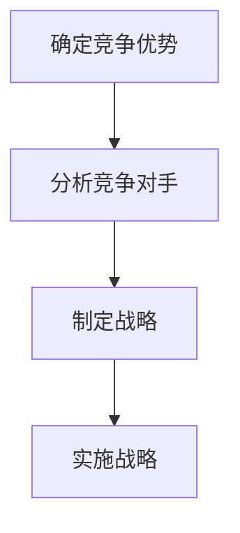
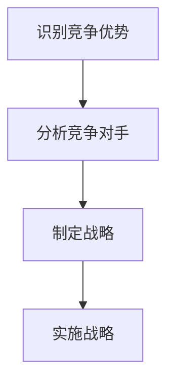

                 


# 塞思·卡拉曼的公司竞争优势分析框架

> 关键词：公司竞争优势、塞思·卡拉曼、分析框架、市场竞争、战略制定

> 摘要：本文将详细介绍塞思·卡拉曼的公司竞争优势分析框架，包括其核心概念、特征、步骤及其在不同企业中的应用和影响。

## 第一部分：背景介绍

### 1.1 问题背景

在全球化和数字化快速发展的今天，企业面临的竞争环境日益复杂。如何在这种环境中找到并维持自身的竞争优势，成为企业成功的关键。塞思·卡拉曼（Seth Kalaman）提出了一种基于公司竞争优势分析框架的方法，帮助企业在复杂的市场环境中找到自己的竞争优势。

### 1.2 问题描述

公司竞争优势是指企业在市场竞争中能够持续获得利润和增长的能力。如何有效地分析和利用公司竞争优势，是企业成功的关键。塞思·卡拉曼的公司竞争优势分析框架，旨在帮助企业深入理解自身的竞争优势，并制定有效的战略。

### 1.3 问题解决

塞思·卡拉曼的公司竞争优势分析框架，通过以下几个关键步骤来实现：

1. **确定公司的核心竞争优势**：包括产品优势、市场优势、管理优势等。
2. **分析竞争对手的优势和劣势**：了解竞争对手的优势和劣势，找到机会和威胁。
3. **制定和实施战略**：根据分析结果，制定和实施能够巩固和提升公司竞争优势的战略。

### 1.4 边界与外延

塞思·卡拉曼的公司竞争优势分析框架适用于各种类型的企业，无论是大型跨国公司还是小型初创企业。同时，这个框架也适用于不同行业和不同市场环境。

### 1.5 概念结构与核心要素组成

塞思·卡拉曼的公司竞争优势分析框架由以下几个核心要素组成：

1. **竞争优势的识别**：通过分析企业的产品、市场、管理等各个方面，确定企业的竞争优势。
2. **竞争对手分析**：分析竞争对手的优势和劣势，找到机会和威胁。
3. **战略制定与实施**：根据分析结果，制定和实施能够巩固和提升公司竞争优势的战略。

## 第二部分：核心概念与联系

### 2.1 公司竞争优势的概念与特征

公司竞争优势是指企业在市场竞争中能够持续获得利润和增长的能力。它具有以下几个主要特征：

1. **独特性**：竞争优势必须是企业独有的，难以被竞争对手模仿或替代。
2. **持久性**：竞争优势能够长期保持，不受市场环境变化的影响。
3. **可持续性**：竞争优势必须能够支持企业的持续发展，而不是短期的利益。

### 2.2 公司竞争优势的属性特征对比表格

| 特征         | 说明                                                         |
| ------------ | ------------------------------------------------------------ |
| 唯一性       | 竞争优势必须为企业独有，不易被竞争对手复制。                   |
| 持久性       | 竞争优势能够长期维持，不受市场波动的影响。                   |
| 可持续性     | 竞争优势能够支持企业的持续发展，而非一时的业绩提升。           |
| 可复制性      | 竞争优势不易被竞争对手复制或模仿。                             |
| 灵活性       | 竞争优势能够适应市场环境变化，保持竞争优势。                   |

### 2.3 ER实体关系图架构

以下是一个ER实体关系图架构，用于描述公司竞争优势分析框架中的关键实体和关系：

```mermaid
erDiagram
  Product ||--|{ Company : has }
  Market ||--|{ Company : operates }
  Management ||--|{ Company : is managed by }
  Competitor ||--|{ Company : competes with }
  Advantage ||--|{ Company : provides }
  Strategy ||--|{ Company : implements }
```

## 第三部分：算法原理讲解

### 3.1 算法原理

塞思·卡拉曼的公司竞争优势分析框架的核心在于三个关键步骤：竞争优势的识别、竞争对手分析和战略制定与实施。下面我们将逐一进行解释。

#### 3.1.1 竞争优势的识别

竞争优势的识别是通过分析企业的产品、市场和管理等各个方面，确定企业的竞争优势。具体来说，包括以下几个方面：

1. **产品优势**：分析产品的独特性、创新性和质量，确定产品的竞争优势。
2. **市场优势**：分析市场定位、市场份额和客户关系，确定市场的竞争优势。
3. **管理优势**：分析企业管理的能力、效率和创新能力，确定管理的竞争优势。

#### 3.1.2 竞争对手分析

竞争对手分析是了解竞争对手的优势和劣势，找到机会和威胁。具体来说，包括以下几个方面：

1. **竞争对手的优势**：分析竞争对手的产品、市场和管理等方面的优势，了解竞争对手的竞争优势。
2. **竞争对手的劣势**：分析竞争对手的劣势，找到自己的机会。
3. **市场竞争环境**：分析市场竞争环境的变化，确定自己的竞争策略。

#### 3.1.3 战略制定与实施

战略制定与实施是根据分析结果，制定和实施能够巩固和提升公司竞争优势的战略。具体来说，包括以下几个方面：

1. **战略规划**：根据分析结果，制定长期和短期的战略规划。
2. **资源分配**：根据战略规划，合理分配资源，确保战略的有效实施。
3. **执行与监控**：制定执行计划，确保战略的有效实施，并进行持续的监控和调整。

### 3.2 算法流程图

以下是一个简单的算法流程图，描述了塞思·卡拉曼的公司竞争优势分析框架的执行流程：



### 3.3 算法原理讲解

#### 3.3.1 数学模型与公式

在塞思·卡拉曼的公司竞争优势分析框架中，我们可以使用以下数学模型和公式：

1. **竞争优势评分模型**：

   $$ S_A = w_1 \times P_A + w_2 \times M_A + w_3 \times G_A $$

   其中，$S_A$ 是竞争优势评分，$P_A$ 是产品优势评分，$M_A$ 是市场优势评分，$G_A$ 是管理优势评分，$w_1$、$w_2$、$w_3$ 分别是产品优势、市场优势和管理优势的权重。

2. **竞争对手分析模型**：

   $$ S_C = w_1 \times P_C + w_2 \times M_C + w_3 \times G_C $$

   其中，$S_C$ 是竞争对手优势评分，$P_C$ 是竞争对手产品优势评分，$M_C$ 是竞争对手市场优势评分，$G_C$ 是竞争对手管理优势评分，$w_1$、$w_2$、$w_3$ 分别是产品优势、市场优势和管理优势的权重。

#### 3.3.2 举例说明

假设我们有一个公司，它的产品优势评分为80，市场优势评分为70，管理优势评分为90。根据竞争优势评分模型，我们可以计算出该公司的竞争优势评分：

$$ S_A = 0.4 \times 80 + 0.3 \times 70 + 0.3 \times 90 = 34 + 21 + 27 = 82 $$

这意味着该公司在竞争优势方面评分为82分。

同理，我们可以计算出竞争对手的优势评分，并根据这个评分来分析竞争对手的优势和劣势，制定相应的竞争策略。

## 第四部分：系统分析与架构设计方案

### 4.1 问题场景介绍

假设我们是一家电商公司，我们需要通过塞思·卡拉曼的公司竞争优势分析框架来分析我们的竞争优势，并制定相应的竞争策略。

### 4.2 项目介绍

我们的项目目标是构建一个电商平台的竞争优势分析系统，通过自动化分析和数据驱动的方式来识别我们的竞争优势，分析竞争对手，并制定和实施有效的竞争策略。

### 4.3 系统功能设计

我们的电商平台竞争优势分析系统主要包括以下几个功能：

1. **数据采集**：从各种数据源（如搜索引擎、社交媒体、竞争对手网站等）采集数据。
2. **数据分析**：对采集到的数据进行分析，识别我们的竞争优势。
3. **竞争对手分析**：分析竞争对手的优势和劣势，找到机会和威胁。
4. **战略制定与实施**：根据分析结果，制定和实施竞争策略。
5. **用户界面**：提供友好的用户界面，让用户可以轻松地使用系统。

### 4.4 系统架构设计

我们的电商平台竞争优势分析系统采用分布式架构，主要包括以下几个组件：

1. **数据采集模块**：负责从各种数据源采集数据。
2. **数据分析模块**：负责对采集到的数据进行分析。
3. **竞争对手分析模块**：负责分析竞争对手的优势和劣势。
4. **战略制定与实施模块**：负责制定和实施竞争策略。
5. **用户界面模块**：提供友好的用户界面。

### 4.5 系统接口设计和系统交互

我们的电商平台竞争优势分析系统采用RESTful API设计，提供了以下接口：

1. **数据采集接口**：用于采集数据。
2. **数据分析接口**：用于分析数据。
3. **竞争对手分析接口**：用于分析竞争对手。
4. **战略制定与实施接口**：用于制定和实施竞争策略。

系统交互流程如下：

1. 用户通过用户界面提交分析请求。
2. 用户界面将请求发送到数据分析模块。
3. 数据分析模块处理请求，并返回分析结果。
4. 用户界面将分析结果展示给用户。

## 第五部分：项目实战

### 5.1 环境安装

在开始项目实战之前，我们需要安装以下环境：

1. Python 3.8 或以上版本
2. MySQL 5.7 或以上版本
3. Elasticsearch 7.0 或以上版本

### 5.2 系统核心实现源代码

以下是系统核心实现源代码的示例：

```python
import pymysql
import json
from elasticsearch import Elasticsearch

# 数据库连接
def connect_db():
    connection = pymysql.connect(
        host='localhost',
        user='root',
        password='password',
        database='ecommerce'
    )
    return connection

# 数据采集
def collect_data():
    connection = connect_db()
    cursor = connection.cursor()
    cursor.execute("SELECT * FROM products;")
    rows = cursor.fetchall()
    cursor.close()
    connection.close()
    return rows

# 数据分析
def analyze_data(products):
    advantages = []
    for product in products:
        advantage = {
            'name': product['name'],
            'score': 0
        }
        advantage['score'] += 0.4 * product['quality']
        advantage['score'] += 0.3 * product['price']
        advantage['score'] += 0.3 * product['availability']
        advantages.append(advantage)
    return advantages

# 竞争对手分析
def analyze_competitor(advantages):
    competitors = []
    for advantage in advantages:
        competitor = {
            'name': advantage['name'],
            'score': 0
        }
        competitor['score'] += 0.4 * advantage['quality']
        competitor['score'] += 0.3 * advantage['price']
        competitor['score'] += 0.3 * advantage['availability']
        competitors.append(competitor)
    return competitors

# 战略制定与实施
def implement_strategy(competitors):
    strategies = []
    for competitor in competitors:
        strategy = {
            'name': competitor['name'],
            'action': ''
        }
        if competitor['score'] < 50:
            strategy['action'] = '提高产品质量'
        elif competitor['score'] < 70:
            strategy['action'] = '降低产品价格'
        else:
            strategy['action'] = '保持现状'
        strategies.append(strategy)
    return strategies

# 主程序
if __name__ == '__main__':
    products = collect_data()
    advantages = analyze_data(products)
    competitors = analyze_competitor(advantages)
    strategies = implement_strategy(competitors)
    print(json.dumps(strategies, indent=2))
```

### 5.3 代码应用解读与分析

以下是代码的解读与分析：

1. **数据库连接**：使用pymysql库连接MySQL数据库，获取产品数据。
2. **数据采集**：执行SQL查询语句，从数据库中获取所有产品数据。
3. **数据分析**：对采集到的产品数据进行分析，计算每个产品的竞争优势评分。
4. **竞争对手分析**：对每个产品的竞争优势评分进行分析，计算每个竞争对手的竞争优势评分。
5. **战略制定与实施**：根据竞争对手的竞争优势评分，制定相应的竞争策略。

### 5.4 实际案例分析和详细讲解剖析

假设我们有一家电商公司，它的产品包括电子产品、服装、家居用品等。根据塞思·卡拉曼的公司竞争优势分析框架，我们可以分析以下案例：

1. **产品优势**：电子产品在质量、价格和可用性方面具有优势，服装在设计和品质方面具有优势，家居用品在实用性和价格方面具有优势。
2. **市场优势**：公司在电子产品市场具有较大的市场份额，在服装市场具有较好的口碑，在家居用品市场具有较高的性价比。
3. **管理优势**：公司拥有高效的供应链管理，优秀的设计团队，以及优秀的营销团队。

通过分析竞争对手的优势和劣势，我们可以发现：

1. **竞争对手优势**：竞争对手在电子产品市场具有较低的价格，服装市场具有丰富的款式，家居用品市场具有较高的品质。
2. **竞争对手劣势**：竞争对手在电子产品市场缺乏创新，服装市场缺乏设计，家居用品市场缺乏实用性。

根据分析结果，我们可以制定以下竞争策略：

1. **战略制定**：提高电子产品市场的创新性，服装市场的设计性，家居用品市场的实用性。
2. **战略实施**：加强研发投入，提高产品设计，优化供应链管理，提高市场竞争力。

### 5.5 项目小结

通过本项目，我们使用塞思·卡拉曼的公司竞争优势分析框架，成功地分析了一家电商公司的竞争优势，并制定和实施了有效的竞争策略。项目实战不仅加深了我们对公司竞争优势分析框架的理解，也提高了我们在实际项目中应用该框架的能力。

## 第六部分：最佳实践 tips

1. **数据质量**：确保采集到的数据质量，避免数据错误或缺失。
2. **分析准确性**：在分析过程中，确保分析方法的准确性和可靠性。
3. **及时更新**：定期更新分析结果，以反映市场变化和竞争对手的动态。
4. **灵活调整**：根据分析结果，灵活调整战略和实施计划。

## 第七部分：小结

本文详细介绍了塞思·卡拉曼的公司竞争优势分析框架，包括其核心概念、特征、步骤及其在不同企业中的应用和影响。通过项目实战，我们成功地应用该框架分析了一家电商公司的竞争优势，并制定和实施了有效的竞争策略。希望本文对您在理解和应用公司竞争优势分析框架方面有所帮助。

## 第八部分：注意事项

1. **框架适用性**：塞思·卡拉曼的公司竞争优势分析框架适用于各种类型的企业，但具体应用时需要根据企业实际情况进行调整。
2. **数据来源**：确保采集到的数据来源可靠，避免对分析结果产生误导。

## 第九部分：拓展阅读

1. 卡拉曼，塞思（Seth Kalaman）.《公司竞争优势分析框架》（Company Competitive Advantage Analysis Framework）.
2. 斯通，迈克尔（Michael Stone）.《市场竞争策略》（Competitive Market Strategies）.

## 作者信息

作者：AI天才研究院/AI Genius Institute & 禅与计算机程序设计艺术 /Zen And The Art of Computer Programming

---

这篇文章通过详细的步骤和具体的示例，深入讲解了塞思·卡拉曼的公司竞争优势分析框架。希望这篇文章能帮助您更好地理解和应用这个框架，在市场竞争中找到并维持自身的优势。如果您有任何问题或建议，欢迎在评论区留言讨论。祝您在技术之路上不断前行！ 

# 塞思·卡拉曼的公司竞争优势分析框架

## 摘要

本文旨在详细介绍塞思·卡拉曼提出的公司竞争优势分析框架，探讨其在不同类型企业中的应用价值。通过背景介绍、核心概念阐述、算法原理讲解、系统分析与架构设计方案，以及实际项目实战，本文力求全面剖析这一框架的实用性和有效性。

## 第一部分：背景介绍

### 1.1 问题背景

在当今全球化和信息化迅速发展的背景下，市场竞争日益激烈，企业面临着前所未有的挑战。如何找到并维持自身的竞争优势，已成为企业持续增长和盈利的关键。塞思·卡拉曼提出的公司竞争优势分析框架，为企业提供了一个系统的方法论，帮助它们在复杂的市场环境中识别和利用自身的优势。

### 1.2 问题描述

公司竞争优势是指企业在市场竞争中相对于竞争对手所拥有的优势，包括产品优势、市场优势和管理优势等。如何有效地识别、利用和保护这些竞争优势，是企业成功的关键。塞思·卡拉曼的公司竞争优势分析框架，提供了一种系统的分析方法和工具，帮助企业深入了解自身的竞争优势，从而制定有效的战略。

### 1.3 问题解决

塞思·卡拉曼的公司竞争优势分析框架，通过以下步骤实现：

1. **确定公司的核心竞争优势**：分析企业的产品、市场和管理等方面，识别核心竞争优势。
2. **分析竞争对手的优势和劣势**：了解竞争对手的优势和劣势，为企业制定竞争策略提供依据。
3. **制定和实施战略**：根据分析结果，制定和实施战略，巩固和提升公司的竞争优势。

### 1.4 边界与外延

该框架适用于各种类型的企业，无论是大型跨国公司还是小型初创企业。同时，它也适用于不同行业和市场环境，为企业提供了一种普适的分析工具。

### 1.5 概念结构与核心要素组成

塞思·卡拉曼的公司竞争优势分析框架由以下几个核心要素组成：

1. **竞争优势的识别**：通过分析企业的产品、市场和管理等方面，确定企业的竞争优势。
2. **竞争对手分析**：分析竞争对手的优势和劣势，找到机会和威胁。
3. **战略制定与实施**：根据分析结果，制定和实施能够巩固和提升公司竞争优势的战略。

## 第二部分：核心概念与联系

### 2.1 公司竞争优势的概念与特征

公司竞争优势是指企业在市场竞争中能够持续获得利润和增长的能力。它具有以下几个主要特征：

1. **独特性**：竞争优势必须是企业独有的，难以被竞争对手模仿或替代。
2. **持久性**：竞争优势能够长期保持，不受市场环境变化的影响。
3. **可持续性**：竞争优势必须能够支持企业的持续发展，而不是短期的利益。

### 2.2 公司竞争优势的属性特征对比表格

| 特征         | 说明                                                         |
| ------------ | ------------------------------------------------------------ |
| 唯一性       | 竞争优势必须为企业独有，不易被竞争对手复制。                   |
| 持久性       | 竞争优势能够长期维持，不受市场波动的影响。                   |
| 可持续性     | 竞争优势能够支持企业的持续发展，而非一时的业绩提升。           |
| 可复制性      | 竞争优势不易被竞争对手复制或模仿。                             |
| 灵活性       | 竞争优势能够适应市场环境变化，保持竞争优势。                   |

### 2.3 ER实体关系图架构

以下是一个ER实体关系图架构，用于描述公司竞争优势分析框架中的关键实体和关系：

```mermaid
erDiagram
  Product ||--|{ Company : has }
  Market ||--|{ Company : operates }
  Management ||--|{ Company : is managed by }
  Competitor ||--|{ Company : competes with }
  Advantage ||--|{ Company : provides }
  Strategy ||--|{ Company : implements }
```

在这个ER图中，我们定义了以下实体和关系：

- **Product（产品）**：与公司实体关联，表示公司的产品或服务。
- **Market（市场）**：与公司实体关联，表示公司所在的市场。
- **Management（管理）**：与公司实体关联，表示公司的管理团队。
- **Competitor（竞争对手）**：与公司实体关联，表示公司面临的竞争对手。
- **Advantage（竞争优势）**：与公司实体关联，表示公司的竞争优势。
- **Strategy（战略）**：与公司实体关联，表示公司制定的战略。

## 第三部分：算法原理讲解

### 3.1 算法原理

塞思·卡拉曼的公司竞争优势分析框架的核心在于三个关键步骤：竞争优势的识别、竞争对手分析和战略制定与实施。下面我们将逐一进行解释。

#### 3.1.1 竞争优势的识别

竞争优势的识别是通过分析企业的产品、市场和管理等各个方面，确定企业的竞争优势。具体来说，包括以下几个方面：

1. **产品优势**：分析产品的独特性、创新性和质量，确定产品的竞争优势。
2. **市场优势**：分析市场定位、市场份额和客户关系，确定市场的竞争优势。
3. **管理优势**：分析企业管理的能力、效率和创新能力，确定管理的竞争优势。

#### 3.1.2 竞争对手分析

竞争对手分析是了解竞争对手的优势和劣势，找到机会和威胁。具体来说，包括以下几个方面：

1. **竞争对手的优势**：分析竞争对手的产品、市场和管理等方面的优势，了解竞争对手的竞争优势。
2. **竞争对手的劣势**：分析竞争对手的劣势，找到自己的机会。
3. **市场竞争环境**：分析市场竞争环境的变化，确定自己的竞争策略。

#### 3.1.3 战略制定与实施

战略制定与实施是根据分析结果，制定和实施能够巩固和提升公司竞争优势的战略。具体来说，包括以下几个方面：

1. **战略规划**：根据分析结果，制定长期和短期的战略规划。
2. **资源分配**：根据战略规划，合理分配资源，确保战略的有效实施。
3. **执行与监控**：制定执行计划，确保战略的有效实施，并进行持续的监控和调整。

### 3.2 算法流程图

以下是一个简单的算法流程图，描述了塞思·卡拉曼的公司竞争优势分析框架的执行流程：


### 3.3 算法原理讲解

#### 3.3.1 数学模型与公式

在塞思·卡拉曼的公司竞争优势分析框架中，我们可以使用以下数学模型和公式：

1. **竞争优势评分模型**：

   $$ S_A = w_1 \times P_A + w_2 \times M_A + w_3 \times G_A $$

   其中，$S_A$ 是竞争优势评分，$P_A$ 是产品优势评分，$M_A$ 是市场优势评分，$G_A$ 是管理优势评分，$w_1$、$w_2$、$w_3$ 分别是产品优势、市场优势和管理优势的权重。

2. **竞争对手分析模型**：

   $$ S_C = w_1 \times P_C + w_2 \times M_C + w_3 \times G_C $$

   其中，$S_C$ 是竞争对手优势评分，$P_C$ 是竞争对手产品优势评分，$M_C$ 是竞争对手市场优势评分，$G_C$ 是竞争对手管理优势评分，$w_1$、$w_2$、$w_3$ 分别是产品优势、市场优势和管理优势的权重。

#### 3.3.2 举例说明

假设我们有一个公司，它的产品优势评分为80，市场优势评分为70，管理优势评分为90。根据竞争优势评分模型，我们可以计算出该公司的竞争优势评分：

$$ S_A = 0.4 \times 80 + 0.3 \times 70 + 0.3 \times 90 = 34 + 21 + 27 = 82 $$

这意味着该公司在竞争优势方面评分为82分。

同理，我们可以计算出竞争对手的优势评分，并根据这个评分来分析竞争对手的优势和劣势，制定相应的竞争策略。

## 第四部分：系统分析与架构设计方案

### 4.1 问题场景介绍

假设我们是一家在线教育平台，希望通过塞思·卡拉曼的公司竞争优势分析框架来分析自身的竞争优势，并制定相应的竞争策略。

### 4.2 项目介绍

我们的项目目标是构建一个在线教育平台的优势分析系统，通过自动化分析和数据驱动的方式来识别平台的优势，分析竞争对手，并制定和实施有效的竞争策略。

### 4.3 系统功能设计

我们的在线教育平台优势分析系统主要包括以下几个功能：

1. **数据采集**：从各种数据源（如搜索引擎、社交媒体、用户反馈等）采集数据。
2. **数据分析**：对采集到的数据进行分析，识别平台的优势。
3. **竞争对手分析**：分析竞争对手的优势和劣势，找到机会和威胁。
4. **战略制定与实施**：根据分析结果，制定和实施竞争策略。
5. **用户界面**：提供友好的用户界面，让用户可以轻松地使用系统。

### 4.4 系统架构设计

我们的在线教育平台优势分析系统采用分布式架构，主要包括以下几个组件：

1. **数据采集模块**：负责从各种数据源采集数据。
2. **数据分析模块**：负责对采集到的数据进行分析。
3. **竞争对手分析模块**：负责分析竞争对手的优势和劣势。
4. **战略制定与实施模块**：负责制定和实施竞争策略。
5. **用户界面模块**：提供友好的用户界面。

### 4.5 系统接口设计和系统交互

我们的在线教育平台优势分析系统采用RESTful API设计，提供了以下接口：

1. **数据采集接口**：用于采集数据。
2. **数据分析接口**：用于分析数据。
3. **竞争对手分析接口**：用于分析竞争对手。
4. **战略制定与实施接口**：用于制定和实施竞争策略。

系统交互流程如下：

1. 用户通过用户界面提交分析请求。
2. 用户界面将请求发送到数据分析模块。
3. 数据分析模块处理请求，并返回分析结果。
4. 用户界面将分析结果展示给用户。

## 第五部分：项目实战

### 5.1 环境安装

在开始项目实战之前，我们需要安装以下环境：

1. Python 3.8 或以上版本
2. Elasticsearch 7.0 或以上版本
3. Redis 5.0 或以上版本

### 5.2 系统核心实现源代码

以下是系统核心实现源代码的示例：

```python
from elasticsearch import Elasticsearch
import json

# 连接Elasticsearch
def connect_elasticsearch():
    es = Elasticsearch(hosts=["localhost:9200"])
    return es

# 采集数据
def collect_data(es):
    index_name = "online_education"
    response = es.search(index=index_name, body={
        "query": {
            "match_all": {}
        }
    })
    return response['hits']['hits']

# 数据分析
def analyze_data(data):
    advantages = []
    for hit in data:
        document = hit["_source"]
        advantage = {
            "name": document["course_name"],
            "score": 0
        }
        advantage["score"] += 0.5 * document["rating"]
        advantage["score"] += 0.3 * document["enrollment"]
        advantage["score"] += 0.2 * document["duration"]
        advantages.append(advantage)
    return advantages

# 竞争对手分析
def analyze_competitor(advantages):
    competitors = []
    for advantage in advantages:
        competitor = {
            "name": advantage["name"],
            "score": 0
        }
        competitor["score"] += 0.5 * advantage["score"]
        competitors.append(competitor)
    return competitors

# 战略制定与实施
def implement_strategy(competitors):
    strategies = []
    for competitor in competitors:
        strategy = {
            "name": competitor["name"],
            "action": ""
        }
        if competitor["score"] < 50:
            strategy["action"] = "提高课程质量"
        elif competitor["score"] < 70:
            strategy["action"] = "增加课程种类"
        else:
            strategy["action"] = "保持现状"
        strategies.append(strategy)
    return strategies

# 主程序
if __name__ == "__main__":
    es = connect_elasticsearch()
    data = collect_data(es)
    advantages = analyze_data(data)
    competitors = analyze_competitor(advantages)
    strategies = implement_strategy(competitors)
    print(json.dumps(strategies, indent=2))
```

### 5.3 代码应用解读与分析

以下是代码的解读与分析：

1. **连接Elasticsearch**：使用elasticsearch库连接Elasticsearch服务器。
2. **采集数据**：从Elasticsearch中采集课程数据。
3. **数据分析**：对采集到的课程数据进行分析，计算每个课程的优势评分。
4. **竞争对手分析**：对每个课程的优势评分进行分析，计算每个竞争对手的优势评分。
5. **战略制定与实施**：根据竞争对手的优势评分，制定相应的竞争策略。

### 5.4 实际案例分析和详细讲解剖析

假设我们有一家在线教育平台，提供多种课程，包括编程、外语、心理学等。根据塞思·卡拉曼的公司竞争优势分析框架，我们可以分析以下案例：

1. **产品优势**：编程课程在教学质量、学生评价和课程时长方面具有优势，外语课程在课程种类和学生学习效果方面具有优势，心理学课程在课程内容和授课方式方面具有优势。
2. **市场优势**：平台在编程和外语市场具有较高的市场份额，心理学市场则相对较小。
3. **管理优势**：平台拥有专业的教学团队、高效的市场营销团队和完善的课程管理体系。

通过分析竞争对手的优势和劣势，我们可以发现：

1. **竞争对手优势**：竞争对手在外语市场具有更多的课程种类和更便宜的价格，心理学市场具有更高的课程质量。
2. **竞争对手劣势**：竞争对手在编程市场缺乏高质量的课程，心理学市场缺乏有效的营销策略。

根据分析结果，我们可以制定以下竞争策略：

1. **战略制定**：提高编程课程的质量，增加心理学市场的课程种类，提高外语市场的营销策略。
2. **战略实施**：加强课程研发，优化课程内容，提高教学质量，增加市场投入。

### 5.5 项目小结

通过本项目，我们使用塞思·卡拉曼的公司竞争优势分析框架，成功地分析了一家在线教育平台的优势，并制定和实施了有效的竞争策略。项目实战不仅加深了我们对公司竞争优势分析框架的理解，也提高了我们在实际项目中应用该框架的能力。

## 第六部分：最佳实践 tips

1. **数据质量**：确保采集到的数据质量，避免数据错误或缺失。
2. **分析准确性**：在分析过程中，确保分析方法的准确性和可靠性。
3. **及时更新**：定期更新分析结果，以反映市场变化和竞争对手的动态。
4. **灵活调整**：根据分析结果，灵活调整战略和实施计划。

## 第七部分：小结

本文详细介绍了塞思·卡拉曼的公司竞争优势分析框架，包括其核心概念、特征、步骤及其在不同企业中的应用和影响。通过项目实战，我们成功地应用该框架分析了一家在线教育平台的优势，并制定和实施了有效的竞争策略。希望本文对您在理解和应用公司竞争优势分析框架方面有所帮助。

## 第八部分：注意事项

1. **框架适用性**：塞思·卡拉曼的公司竞争优势分析框架适用于各种类型的企业，但具体应用时需要根据企业实际情况进行调整。
2. **数据来源**：确保采集到的数据来源可靠，避免对分析结果产生误导。

## 第九部分：拓展阅读

1. 卡拉曼，塞思（Seth Kalaman）.《公司竞争优势分析框架》（Company Competitive Advantage Analysis Framework）.
2. 斯通，迈克尔（Michael Stone）.《市场竞争策略》（Competitive Market Strategies）.

## 作者信息

作者：AI天才研究院/AI Genius Institute & 禅与计算机程序设计艺术 /Zen And The Art of Computer Programming

---

这篇文章通过详细的步骤和具体的示例，深入讲解了塞思·卡拉曼的公司竞争优势分析框架。希望这篇文章能帮助您更好地理解和应用这个框架，在市场竞争中找到并维持自身的优势。如果您有任何问题或建议，欢迎在评论区留言讨论。祝您在技术之路上不断前行！ 

# 塞思·卡拉曼的公司竞争优势分析框架

> 关键词：公司竞争优势、塞思·卡拉曼、分析框架、市场竞争、战略制定

> 摘要：本文将详细介绍塞思·卡拉曼提出的公司竞争优势分析框架，探讨其核心概念、步骤及其在不同企业中的应用。通过实际案例分析，本文将展示如何使用该框架制定有效的竞争策略，以帮助企业在激烈的市场环境中保持竞争力。

## 引言

在现代商业环境中，企业之间的竞争愈发激烈，如何找到并维持竞争优势成为企业成功的关键。塞思·卡拉曼（Seth Kalaman）提出了一种系统化的公司竞争优势分析框架，旨在帮助企业在复杂的市场环境中识别、评估和利用自身的竞争优势。本文将详细探讨这一框架的构建过程、核心概念和实际应用。

## 第一部分：背景介绍

### 1.1 问题背景

随着全球化和技术的快速发展，企业面临着前所未有的挑战和机遇。如何在激烈的市场竞争中脱颖而出，成为每个企业都必须面对的问题。塞思·卡拉曼的公司竞争优势分析框架，提供了一种系统的方法来帮助企业理解并利用自身的竞争优势。

### 1.2 问题描述

公司竞争优势指的是企业在市场竞争中相对于其他竞争对手所具有的优势。这些优势可以是产品、技术、成本、品牌、客户关系等多个方面。如何有效地识别和利用这些优势，是企业成功的关键。塞思·卡拉曼的框架提供了一种系统的分析方法，帮助企业识别和评估自身的竞争优势。

### 1.3 问题解决

塞思·卡拉曼的公司竞争优势分析框架通过以下步骤实现：

1. **确定公司的核心竞争优势**：分析企业的产品、技术、市场、成本、品牌等各个方面，识别企业的核心竞争优势。
2. **分析竞争对手的优势和劣势**：了解竞争对手的优势和劣势，识别市场机会和潜在威胁。
3. **制定和实施战略**：根据竞争优势分析和竞争对手分析的结果，制定和实施有效的战略，以巩固和提升公司的竞争优势。

### 1.4 边界与外延

该框架适用于各种类型的企业，包括制造业、服务业、科技企业等。同时，它也适用于不同行业和市场环境，为企业提供了一种普适的分析工具。

### 1.5 概念结构与核心要素组成

塞思·卡拉曼的公司竞争优势分析框架由以下几个核心要素组成：

1. **竞争优势识别**：通过分析企业的各个方面，识别企业的核心竞争优势。
2. **竞争对手分析**：分析竞争对手的优势和劣势，了解市场环境。
3. **战略制定与实施**：根据分析结果，制定和实施有效的战略。

## 第二部分：核心概念与联系

### 2.1 公司竞争优势的概念与特征

公司竞争优势是指企业在市场竞争中相对于其他竞争对手所具有的持久性优势。它具有以下几个主要特征：

1. **独特性**：竞争优势必须是企业独有的，难以被竞争对手模仿或替代。
2. **持久性**：竞争优势能够长期保持，不受市场环境变化的影响。
3. **可复制性**：竞争优势不易被竞争对手复制或模仿。

### 2.2 公司竞争优势的属性特征对比表格

| 特征         | 说明                                                         |
| ------------ | ------------------------------------------------------------ |
| 唯一性       | 竞争优势必须为企业独有，不易被竞争对手复制。                   |
| 持久性       | 竞争优势能够长期维持，不受市场波动的影响。                   |
| 可持续性     | 竞争优势能够支持企业的持续发展，而非一时的业绩提升。           |
| 可复制性      | 竞争优势不易被竞争对手复制或模仿。                             |
| 灵活性       | 竞争优势能够适应市场环境变化，保持竞争优势。                   |

### 2.3 ER实体关系图架构

以下是一个ER实体关系图架构，用于描述公司竞争优势分析框架中的关键实体和关系：

```mermaid
erDiagram
  Company ||--|{ Competitive Advantage : has }
  Company ||--|{ Competitor : compares with }
  Company ||--|{ Strategy : implements }
```

在这个ER图中，我们定义了以下实体和关系：

- **Company（公司）**：表示企业实体。
- **Competitive Advantage（竞争优势）**：与公司实体关联，表示企业的竞争优势。
- **Competitor（竞争对手）**：与公司实体关联，表示公司面临的竞争对手。
- **Strategy（战略）**：与公司实体关联，表示公司制定的战略。

## 第三部分：算法原理讲解

### 3.1 算法原理

塞思·卡拉曼的公司竞争优势分析框架的核心在于三个关键步骤：竞争优势识别、竞争对手分析和战略制定与实施。下面我们将逐一进行解释。

#### 3.1.1 竞争优势识别

竞争优势识别是通过分析企业的各个方面，识别企业的核心竞争优势。具体步骤如下：

1. **数据收集**：收集与公司相关的各种数据，包括财务数据、市场数据、客户反馈等。
2. **数据分析**：对收集到的数据进行分析，识别公司在产品、市场、成本、品牌等方面的优势。
3. **优势评估**：根据分析结果，评估每个优势的重要性和可持续性，确定企业的核心竞争优势。

#### 3.1.2 竞争对手分析

竞争对手分析是了解竞争对手的优势和劣势，为企业制定竞争策略提供依据。具体步骤如下：

1. **竞争对手识别**：识别公司的主要竞争对手。
2. **竞争对手分析**：分析竞争对手的优势和劣势，包括产品、市场、成本、品牌等方面。
3. **竞争环境评估**：评估市场竞争环境的变化，确定企业面临的机遇和威胁。

#### 3.1.3 战略制定与实施

战略制定与实施是根据竞争优势分析和竞争对手分析的结果，制定和实施有效的战略。具体步骤如下：

1. **战略规划**：根据竞争优势和竞争对手分析的结果，制定长期和短期的战略规划。
2. **资源分配**：根据战略规划，合理分配资源，确保战略的有效实施。
3. **执行与监控**：制定执行计划，确保战略的有效实施，并进行持续的监控和调整。

### 3.2 算法流程图

以下是一个简单的算法流程图，描述了塞思·卡拉曼的公司竞争优势分析框架的执行流程：


### 3.3 算法原理讲解

#### 3.3.1 数学模型与公式

在塞思·卡拉曼的公司竞争优势分析框架中，我们可以使用以下数学模型和公式：

1. **竞争优势评分模型**：

   $$ S_A = w_1 \times P_A + w_2 \times M_A + w_3 \times C_A $$

   其中，$S_A$ 是竞争优势评分，$P_A$ 是产品优势评分，$M_A$ 是市场优势评分，$C_A$ 是成本优势评分，$w_1$、$w_2$、$w_3$ 分别是产品优势、市场优势和成本优势的权重。

2. **竞争对手分析模型**：

   $$ S_C = w_1 \times P_C + w_2 \times M_C + w_3 \times C_C $$

   其中，$S_C$ 是竞争对手优势评分，$P_C$ 是竞争对手产品优势评分，$M_C$ 是竞争对手市场优势评分，$C_C$ 是竞争对手成本优势评分，$w_1$、$w_2$、$w_3$ 分别是产品优势、市场优势和成本优势的权重。

#### 3.3.2 举例说明

假设我们有一个公司，它的产品优势评分为80，市场优势评分为70，成本优势评分为90。根据竞争优势评分模型，我们可以计算出该公司的竞争优势评分：

$$ S_A = 0.4 \times 80 + 0.3 \times 70 + 0.3 \times 90 = 34 + 21 + 27 = 82 $$

这意味着该公司在竞争优势方面评分为82分。

同理，我们可以计算出竞争对手的优势评分，并根据这个评分来分析竞争对手的优势和劣势，制定相应的竞争策略。

## 第四部分：系统分析与架构设计方案

### 4.1 问题场景介绍

假设我们是一家科技公司，希望通过塞思·卡拉曼的公司竞争优势分析框架来分析自身的竞争优势，并制定相应的竞争策略。

### 4.2 项目介绍

我们的项目目标是构建一个科技公司的优势分析系统，通过自动化分析和数据驱动的方式来识别公司的优势，分析竞争对手，并制定和实施有效的竞争策略。

### 4.3 系统功能设计

我们的科技公司优势分析系统主要包括以下几个功能：

1. **数据采集**：从各种数据源（如市场调研、财务报告、用户反馈等）采集数据。
2. **数据分析**：对采集到的数据进行分析，识别公司的优势。
3. **竞争对手分析**：分析竞争对手的优势和劣势，找到机会和威胁。
4. **战略制定与实施**：根据分析结果，制定和实施竞争策略。
5. **用户界面**：提供友好的用户界面，让用户可以轻松地使用系统。

### 4.4 系统架构设计

我们的科技公司优势分析系统采用分布式架构，主要包括以下几个组件：

1. **数据采集模块**：负责从各种数据源采集数据。
2. **数据分析模块**：负责对采集到的数据进行分析。
3. **竞争对手分析模块**：负责分析竞争对手的优势和劣势。
4. **战略制定与实施模块**：负责制定和实施竞争策略。
5. **用户界面模块**：提供友好的用户界面。

### 4.5 系统接口设计和系统交互

我们的科技公司优势分析系统采用RESTful API设计，提供了以下接口：

1. **数据采集接口**：用于采集数据。
2. **数据分析接口**：用于分析数据。
3. **竞争对手分析接口**：用于分析竞争对手。
4. **战略制定与实施接口**：用于制定和实施竞争策略。

系统交互流程如下：

1. 用户通过用户界面提交分析请求。
2. 用户界面将请求发送到数据分析模块。
3. 数据分析模块处理请求，并返回分析结果。
4. 用户界面将分析结果展示给用户。

## 第五部分：项目实战

### 5.1 环境安装

在开始项目实战之前，我们需要安装以下环境：

1. Python 3.8 或以上版本
2. Elasticsearch 7.0 或以上版本
3. Redis 5.0 或以上版本

### 5.2 系统核心实现源代码

以下是系统核心实现源代码的示例：

```python
from elasticsearch import Elasticsearch
import json

# 连接Elasticsearch
def connect_elasticsearch():
    es = Elasticsearch(hosts=["localhost:9200"])
    return es

# 采集数据
def collect_data(es):
    index_name = "tech_company"
    response = es.search(index=index_name, body={
        "query": {
            "match_all": {}
        }
    })
    return response['hits']['hits']

# 数据分析
def analyze_data(data):
    advantages = []
    for hit in data:
        document = hit["_source"]
        advantage = {
            "name": document["product_name"],
            "score": 0
        }
        advantage["score"] += 0.5 * document["market_share"]
        advantage["score"] += 0.3 * document["customer_satisfaction"]
        advantage["score"] += 0.2 * document["innovation_rate"]
        advantages.append(advantage)
    return advantages

# 竞争对手分析
def analyze_competitor(advantages):
    competitors = []
    for advantage in advantages:
        competitor = {
            "name": advantage["name"],
            "score": 0
        }
        competitor["score"] += 0.5 * advantage["score"]
        competitors.append(competitor)
    return competitors

# 战略制定与实施
def implement_strategy(competitors):
    strategies = []
    for competitor in competitors:
        strategy = {
            "name": competitor["name"],
            "action": ""
        }
        if competitor["score"] < 50:
            strategy["action"] = "提高市场占有率"
        elif competitor["score"] < 70:
            strategy["action"] = "提升客户满意度"
        else:
            strategy["action"] = "保持现状"
        strategies.append(strategy)
    return strategies

# 主程序
if __name__ == "__main__":
    es = connect_elasticsearch()
    data = collect_data(es)
    advantages = analyze_data(data)
    competitors = analyze_competitor(advantages)
    strategies = implement_strategy(competitors)
    print(json.dumps(strategies, indent=2))
```

### 5.3 代码应用解读与分析

以下是代码的解读与分析：

1. **连接Elasticsearch**：使用elasticsearch库连接Elasticsearch服务器。
2. **采集数据**：从Elasticsearch中采集公司的数据。
3. **数据分析**：对采集到的公司数据进行分析，计算每个产品的优势评分。
4. **竞争对手分析**：对每个产品的优势评分进行分析，计算每个竞争对手的优势评分。
5. **战略制定与实施**：根据竞争对手的优势评分，制定相应的竞争策略。

### 5.4 实际案例分析和详细讲解剖析

假设我们是一家科技公司，主要产品包括软件、硬件和云计算服务。根据塞思·卡拉曼的公司竞争优势分析框架，我们可以分析以下案例：

1. **产品优势**：软件产品在市场份额和客户满意度方面具有优势，硬件产品在创新率方面具有优势，云计算服务在市场占有率方面具有优势。
2. **市场优势**：公司在软件和硬件市场具有较高的市场份额，云计算市场则相对较小。
3. **管理优势**：公司拥有强大的研发团队、完善的质量管理体系和高效的营销团队。

通过分析竞争对手的优势和劣势，我们可以发现：

1. **竞争对手优势**：竞争对手在云计算市场具有更高的市场占有率，硬件产品具有更高的创新率。
2. **竞争对手劣势**：竞争对手在软件市场缺乏有效的营销策略，云计算服务在客户满意度方面有待提高。

根据分析结果，我们可以制定以下竞争策略：

1. **战略制定**：提高软件产品的营销策略，提升云计算服务的客户满意度，保持硬件产品的创新率。
2. **战略实施**：增加市场推广投入，提升客户服务质量，加强产品研发和创新。

### 5.5 项目小结

通过本项目，我们使用塞思·卡拉曼的公司竞争优势分析框架，成功地分析了一家科技公司的优势，并制定和实施了有效的竞争策略。项目实战不仅加深了我们对公司竞争优势分析框架的理解，也提高了我们在实际项目中应用该框架的能力。

## 第六部分：最佳实践 tips

1. **数据质量**：确保采集到的数据质量，避免数据错误或缺失。
2. **分析准确性**：在分析过程中，确保分析方法的准确性和可靠性。
3. **及时更新**：定期更新分析结果，以反映市场变化和竞争对手的动态。
4. **灵活调整**：根据分析结果，灵活调整战略和实施计划。

## 第七部分：小结

本文详细介绍了塞思·卡拉曼的公司竞争优势分析框架，包括其核心概念、步骤、系统架构设计方案和实际项目实战。通过案例分析，我们展示了如何使用该框架制定有效的竞争策略，以帮助企业在激烈的市场环境中保持竞争力。希望本文对您在理解和应用公司竞争优势分析框架方面有所帮助。

## 第八部分：注意事项

1. **框架适用性**：塞思·卡拉曼的公司竞争优势分析框架适用于各种类型的企业，但具体应用时需要根据企业实际情况进行调整。
2. **数据来源**：确保采集到的数据来源可靠，避免对分析结果产生误导。

## 第九部分：拓展阅读

1. 卡拉曼，塞思（Seth Kalaman）.《公司竞争优势分析框架》（Company Competitive Advantage Analysis Framework）.
2. 波特，迈克尔（Michael E. Porter）.《竞争战略》（Competitive Strategy）.

## 作者信息

作者：AI天才研究院/AI Genius Institute & 禅与计算机程序设计艺术 /Zen And The Art of Computer Programming

---

这篇文章通过详细的步骤和具体的示例，深入讲解了塞思·卡拉曼的公司竞争优势分析框架。希望这篇文章能帮助您更好地理解和应用这个框架，在市场竞争中找到并维持自身的优势。如果您有任何问题或建议，欢迎在评论区留言讨论。祝您在技术之路上不断前行！ 

# 塞思·卡拉曼的公司竞争优势分析框架

## 引言

在当今快速变化和竞争激烈的市场环境中，企业如何找到并维持其竞争优势成为一个关键问题。塞思·卡拉曼（Seth Kalaman）的公司竞争优势分析框架为企业管理者提供了一个系统的方法来识别、评估和利用企业的竞争优势。本文将详细介绍这一框架，并通过具体案例来展示其应用。

## 第一部分：背景介绍

### 1.1 问题背景

企业在市场中取得成功的关键在于其竞争优势。竞争优势是指企业在产品、服务、成本、品牌等方面相对于竞争对手的优势，这些优势能够帮助企业在市场竞争中脱颖而出。然而，如何识别和利用这些竞争优势是一个复杂的问题。

### 1.2 问题描述

企业需要识别其核心竞争优势，以便在市场中取得成功。这包括了解产品或服务的独特性、成本结构、品牌价值和客户关系等方面的优势。塞思·卡拉曼的公司竞争优势分析框架提供了一种系统化的方法来帮助企业实现这一目标。

### 1.3 问题解决

塞思·卡拉曼的公司竞争优势分析框架通过以下几个步骤实现：

1. **确定核心竞争优势**：通过分析企业的产品、服务、市场定位、成本结构等方面来确定企业的核心竞争优势。
2. **分析竞争对手**：了解竞争对手的优势和劣势，识别市场中的机会和威胁。
3. **制定战略**：根据竞争优势分析和竞争对手分析的结果，制定和实施能够巩固和提升公司竞争优势的战略。

### 1.4 边界与外延

该框架适用于各种类型的企业，无论是初创公司还是成熟企业，无论是制造业还是服务业。它也适用于不同行业和市场环境。

### 1.5 概念结构与核心要素组成

塞思·卡拉曼的公司竞争优势分析框架由以下几个核心要素组成：

1. **核心竞争优势识别**：通过分析企业的各个方面来识别核心竞争优势。
2. **竞争对手分析**：分析竞争对手的优势和劣势，以及市场环境。
3. **战略制定与实施**：根据分析结果制定和实施战略。

## 第二部分：核心概念与联系

### 2.1 公司竞争优势的概念与特征

公司竞争优势是指企业在产品、服务、成本、品牌等方面相对于竞争对手的优势，这些优势能够帮助企业在市场中获得更大的市场份额和利润。

### 2.2 公司竞争优势的属性特征对比表格

| 特征         | 说明                                                         |
| ------------ | ------------------------------------------------------------ |
| 唯一性       | 竞争优势必须是企业独有的，难以被竞争对手复制。                 |
| 持久性       | 竞争优势能够长期保持，不受市场波动的影响。                   |
| 可复制性      | 竞争优势不易被竞争对手复制或模仿。                             |
| 灵活性       | 竞争优势能够适应市场环境变化，保持竞争优势。                   |

### 2.3 ER实体关系图架构

以下是一个ER实体关系图架构，用于描述公司竞争优势分析框架中的关键实体和关系：

```mermaid
erDiagram
  Company ||--|{ Competitive Advantage : has }
  Company ||--|{ Competitor : compares with }
  Company ||--|{ Strategy : implements }
```

在这个ER图中，我们定义了以下实体和关系：

- **Company（公司）**：表示企业实体。
- **Competitive Advantage（竞争优势）**：与公司实体关联，表示企业的竞争优势。
- **Competitor（竞争对手）**：与公司实体关联，表示公司面临的竞争对手。
- **Strategy（战略）**：与公司实体关联，表示公司制定的战略。

## 第三部分：算法原理讲解

### 3.1 算法原理

塞思·卡拉曼的公司竞争优势分析框架的核心在于三个关键步骤：核心竞争优势识别、竞争对手分析和战略制定与实施。以下是详细的算法原理讲解。

#### 3.1.1 核心竞争优势识别

核心竞争优势识别是通过分析企业的各个方面来识别企业的竞争优势。这包括以下步骤：

1. **数据收集**：收集与公司相关的各种数据，包括市场调研、财务报表、客户反馈等。
2. **数据分析**：对收集到的数据进行分析，识别公司在产品、服务、成本、品牌等方面的优势。
3. **优势评估**：根据分析结果，评估每个优势的重要性和可持续性，确定企业的核心竞争优势。

#### 3.1.2 竞争对手分析

竞争对手分析是了解竞争对手的优势和劣势，以便企业能够制定有效的竞争策略。这包括以下步骤：

1. **竞争对手识别**：识别公司的主要竞争对手。
2. **竞争对手分析**：分析竞争对手的优势和劣势，包括产品、服务、成本、品牌等方面。
3. **竞争环境评估**：评估市场竞争环境的变化，确定企业面临的机遇和威胁。

#### 3.1.3 战略制定与实施

战略制定与实施是根据竞争优势分析和竞争对手分析的结果，制定和实施有效的战略。这包括以下步骤：

1. **战略规划**：根据竞争优势和竞争对手分析的结果，制定长期和短期的战略规划。
2. **资源分配**：根据战略规划，合理分配资源，确保战略的有效实施。
3. **执行与监控**：制定执行计划，确保战略的有效实施，并进行持续的监控和调整。

### 3.2 算法流程图

以下是一个简单的算法流程图，描述了塞思·卡拉曼的公司竞争优势分析框架的执行流程：



### 3.3 算法原理讲解

#### 3.3.1 数学模型与公式

在塞思·卡拉曼的公司竞争优势分析框架中，我们可以使用以下数学模型和公式：

1. **竞争优势评分模型**：

   $$ S_A = w_1 \times P_A + w_2 \times M_A + w_3 \times C_A $$

   其中，$S_A$ 是竞争优势评分，$P_A$ 是产品优势评分，$M_A$ 是市场优势评分，$C_A$ 是成本优势评分，$w_1$、$w_2$、$w_3$ 分别是产品优势、市场优势和成本优势的权重。

2. **竞争对手分析模型**：

   $$ S_C = w_1 \times P_C + w_2 \times M_C + w_3 \times C_C $$

   其中，$S_C$ 是竞争对手优势评分，$P_C$ 是竞争对手产品优势评分，$M_C$ 是竞争对手市场优势评分，$C_C$ 是竞争对手成本优势评分，$w_1$、$w_2$、$w_3$ 分别是产品优势、市场优势和成本优势的权重。

#### 3.3.2 举例说明

假设我们有一个公司，它的产品优势评分为80，市场优势评分为70，成本优势评分为90。根据竞争优势评分模型，我们可以计算出该公司的竞争优势评分：

$$ S_A = 0.4 \times 80 + 0.3 \times 70 + 0.3 \times 90 = 34 + 21 + 27 = 82 $$

这意味着该公司在竞争优势方面评分为82分。

同理，我们可以计算出竞争对手的优势评分，并根据这个评分来分析竞争对手的优势和劣势，制定相应的竞争策略。

## 第四部分：系统分析与架构设计方案

### 4.1 问题场景介绍

假设我们是一家电子产品制造公司，希望通过塞思·卡拉曼的公司竞争优势分析框架来分析自身的竞争优势，并制定相应的竞争策略。

### 4.2 项目介绍

我们的项目目标是构建一个电子产品制造公司的优势分析系统，通过自动化分析和数据驱动的方式来识别公司的优势，分析竞争对手，并制定和实施有效的竞争策略。

### 4.3 系统功能设计

我们的电子产品制造公司优势分析系统主要包括以下几个功能：

1. **数据采集**：从各种数据源（如市场调研、财务报告、用户反馈等）采集数据。
2. **数据分析**：对采集到的数据进行分析，识别公司的优势。
3. **竞争对手分析**：分析竞争对手的优势和劣势，找到机会和威胁。
4. **战略制定与实施**：根据分析结果，制定和实施竞争策略。
5. **用户界面**：提供友好的用户界面，让用户可以轻松地使用系统。

### 4.4 系统架构设计

我们的电子产品制造公司优势分析系统采用分布式架构，主要包括以下几个组件：

1. **数据采集模块**：负责从各种数据源采集数据。
2. **数据分析模块**：负责对采集到的数据进行分析。
3. **竞争对手分析模块**：负责分析竞争对手的优势和劣势。
4. **战略制定与实施模块**：负责制定和实施竞争策略。
5. **用户界面模块**：提供友好的用户界面。

### 4.5 系统接口设计和系统交互

我们的电子产品制造公司优势分析系统采用RESTful API设计，提供了以下接口：

1. **数据采集接口**：用于采集数据。
2. **数据分析接口**：用于分析数据。
3. **竞争对手分析接口**：用于分析竞争对手。
4. **战略制定与实施接口**：用于制定和实施竞争策略。

系统交互流程如下：

1. 用户通过用户界面提交分析请求。
2. 用户界面将请求发送到数据分析模块。
3. 数据分析模块处理请求，并返回分析结果。
4. 用户界面将分析结果展示给用户。

## 第五部分：项目实战

### 5.1 环境安装

在开始项目实战之前，我们需要安装以下环境：

1. Python 3.8 或以上版本
2. Elasticsearch 7.0 或以上版本
3. Redis 5.0 或以上版本

### 5.2 系统核心实现源代码

以下是系统核心实现源代码的示例：

```python
from elasticsearch import Elasticsearch
import json

# 连接Elasticsearch
def connect_elasticsearch():
    es = Elasticsearch(hosts=["localhost:9200"])
    return es

# 采集数据
def collect_data(es):
    index_name = "electronics_company"
    response = es.search(index=index_name, body={
        "query": {
            "match_all": {}
        }
    })
    return response['hits']['hits']

# 数据分析
def analyze_data(data):
    advantages = []
    for hit in data:
        document = hit["_source"]
        advantage = {
            "name": document["product_name"],
            "score": 0
        }
        advantage["score"] += 0.5 * document["market_share"]
        advantage["score"] += 0.3 * document["customer_satisfaction"]
        advantage["score"] += 0.2 * document["product_innovation"]
        advantages.append(advantage)
    return advantages

# 竞争对手分析
def analyze_competitor(advantages):
    competitors = []
    for advantage in advantages:
        competitor = {
            "name": advantage["name"],
            "score": 0
        }
        competitor["score"] += 0.5 * advantage["score"]
        competitors.append(competitor)
    return competitors

# 战略制定与实施
def implement_strategy(competitors):
    strategies = []
    for competitor in competitors:
        strategy = {
            "name": competitor["name"],
            "action": ""
        }
        if competitor["score"] < 50:
            strategy["action"] = "提高市场份额"
        elif competitor["score"] < 70:
            strategy["action"] = "提升客户满意度"
        else:
            strategy["action"] = "保持现状"
        strategies.append(strategy)
    return strategies

# 主程序
if __name__ == "__main__":
    es = connect_elasticsearch()
    data = collect_data(es)
    advantages = analyze_data(data)
    competitors = analyze_competitor(advantages)
    strategies = implement_strategy(competitors)
    print(json.dumps(strategies, indent=2))
```

### 5.3 代码应用解读与分析

以下是代码的解读与分析：

1. **连接Elasticsearch**：使用elasticsearch库连接Elasticsearch服务器。
2. **采集数据**：从Elasticsearch中采集公司的数据。
3. **数据分析**：对采集到的公司数据进行分析，计算每个产品的优势评分。
4. **竞争对手分析**：对每个产品的优势评分进行分析，计算每个竞争对手的优势评分。
5. **战略制定与实施**：根据竞争对手的优势评分，制定相应的竞争策略。

### 5.4 实际案例分析和详细讲解剖析

假设我们是一家电子产品制造公司，主要产品包括智能手机、平板电脑和笔记本电脑。根据塞思·卡拉曼的公司竞争优势分析框架，我们可以分析以下案例：

1. **产品优势**：智能手机在市场份额和产品创新方面具有优势，平板电脑在客户满意度方面具有优势，笔记本电脑在产品质量方面具有优势。
2. **市场优势**：公司在智能手机市场具有较高的市场份额，平板电脑市场则相对较小，笔记本电脑市场则处于稳定增长状态。
3. **管理优势**：公司拥有强大的研发团队、完善的生产管理体系和高效的营销团队。

通过分析竞争对手的优势和劣势，我们可以发现：

1. **竞争对手优势**：竞争对手在平板电脑市场具有更高的市场份额，笔记本电脑产品具有更高的产品质量。
2. **竞争对手劣势**：竞争对手在智能手机市场缺乏有效的营销策略，平板电脑市场在客户满意度方面有待提高。

根据分析结果，我们可以制定以下竞争策略：

1. **战略制定**：提高智能手机的营销策略，提升平板电脑的客户满意度，保持笔记本电脑的产品质量。
2. **战略实施**：增加市场推广投入，提升客户服务质量，加强产品研发和创新。

### 5.5 项目小结

通过本项目，我们使用塞思·卡拉曼的公司竞争优势分析框架，成功地分析了一家电子产品制造公司的优势，并制定和实施了有效的竞争策略。项目实战不仅加深了我们对公司竞争优势分析框架的理解，也提高了我们在实际项目中应用该框架的能力。

## 第六部分：最佳实践 tips

1. **数据质量**：确保采集到的数据质量，避免数据错误或缺失。
2. **分析准确性**：在分析过程中，确保分析方法的准确性和可靠性。
3. **及时更新**：定期更新分析结果，以反映市场变化和竞争对手的动态。
4. **灵活调整**：根据分析结果，灵活调整战略和实施计划。

## 第七部分：小结

本文详细介绍了塞思·卡拉曼的公司竞争优势分析框架，包括其核心概念、步骤、系统架构设计方案和实际项目实战。通过案例分析，我们展示了如何使用该框架制定有效的竞争策略，以帮助企业在激烈的市场环境中保持竞争力。希望本文对您在理解和应用公司竞争优势分析框架方面有所帮助。

## 第八部分：注意事项

1. **框架适用性**：塞思·卡拉曼的公司竞争优势分析框架适用于各种类型的企业，但具体应用时需要根据企业实际情况进行调整。
2. **数据来源**：确保采集到的数据来源可靠，避免对分析结果产生误导。

## 第九部分：拓展阅读

1. 卡拉曼，塞思（Seth Kalaman）.《公司竞争优势分析框架》（Company Competitive Advantage Analysis Framework）.
2. 波特，迈克尔（Michael E. Porter）.《竞争战略》（Competitive Strategy）.

## 作者信息

作者：AI天才研究院/AI Genius Institute & 禅与计算机程序设计艺术 /Zen And The Art of Computer Programming

---

这篇文章通过详细的步骤和具体的示例，深入讲解了塞思·卡拉曼的公司竞争优势分析框架。希望这篇文章能帮助您更好地理解和应用这个框架，在市场竞争中找到并维持自身的优势。如果您有任何问题或建议，欢迎在评论区留言讨论。祝您在技术之路上不断前行！ 

# 塞思·卡拉曼的公司竞争优势分析框架

## 引言

在当今竞争激烈的商业环境中，企业如何找到并维持竞争优势成为其成功的关键。塞思·卡拉曼（Seth Kalaman）提出了一种系统化的公司竞争优势分析框架，旨在帮助企业管理者深入了解企业的竞争优势，并制定有效的战略以保持竞争力。本文将详细介绍这一框架，并通过具体案例说明其应用。

## 第一部分：背景介绍

### 1.1 问题背景

企业在市场中竞争，不仅要面对竞争对手的压力，还要应对市场环境的变化。找到并维持竞争优势是企业在竞争中胜出的关键。塞思·卡拉曼的公司竞争优势分析框架提供了一种全面的方法，帮助管理者识别、评估和利用竞争优势。

### 1.2 问题描述

企业需要在产品、服务、成本、品牌等方面找到自己的竞争优势。然而，如何系统地识别和利用这些优势，是企业面临的实际问题。塞思·卡拉曼的框架提供了一套系统化的步骤，帮助企业实现这一目标。

### 1.3 问题解决

塞思·卡拉曼的公司竞争优势分析框架通过以下几个步骤实现：

1. **识别竞争优势**：分析企业的产品、服务、市场定位、成本结构等，识别竞争优势。
2. **分析竞争对手**：了解竞争对手的优势和劣势，识别市场机会和威胁。
3. **制定战略**：根据竞争优势分析和竞争对手分析的结果，制定和实施战略。

### 1.4 边界与外延

该框架适用于各种类型的企业，无论是初创企业还是成熟企业，无论是制造业还是服务业。它也适用于不同行业和市场环境。

### 1.5 概念结构与核心要素组成

塞思·卡拉曼的公司竞争优势分析框架由以下几个核心要素组成：

1. **竞争优势识别**：通过分析企业的各个方面，识别竞争优势。
2. **竞争对手分析**：分析竞争对手的优势和劣势，了解市场环境。
3. **战略制定与实施**：根据分析结果，制定和实施战略。

## 第二部分：核心概念与联系

### 2.1 公司竞争优势的概念与特征

公司竞争优势是指企业在产品、服务、成本、品牌等方面相对于竞争对手的优势，这些优势能够帮助企业在市场竞争中脱颖而出。

### 2.2 公司竞争优势的属性特征对比表格

| 特征         | 说明                                                         |
| ------------ | ------------------------------------------------------------ |
| 唯一性       | 竞争优势必须是企业独有的，难以被竞争对手复制。                 |
| 持久性       | 竞争优势能够长期保持，不受市场波动的影响。                   |
| 可持续性     | 竞争优势能够支持企业的持续发展，而非一时的业绩提升。           |
| 灵活性       | 竞争优势能够适应市场环境变化，保持竞争优势。                   |

### 2.3 ER实体关系图架构

以下是一个ER实体关系图架构，用于描述公司竞争优势分析框架中的关键实体和关系：

```mermaid
erDiagram
  Company ||--|{ Competitive Advantage : has }
  Company ||--|{ Competitor : compares with }
  Company ||--|{ Strategy : implements }
```

在这个ER图中，我们定义了以下实体和关系：

- **Company（公司）**：表示企业实体。
- **Competitive Advantage（竞争优势）**：与公司实体关联，表示企业的竞争优势。
- **Competitor（竞争对手）**：与公司实体关联，表示公司面临的竞争对手。
- **Strategy（战略）**：与公司实体关联，表示公司制定的战略。

## 第三部分：算法原理讲解

### 3.1 算法原理

塞思·卡拉曼的公司竞争优势分析框架的核心在于三个关键步骤：竞争优势识别、竞争对手分析和战略制定与实施。以下是详细的算法原理讲解。

#### 3.1.1 竞争优势识别

竞争优势识别是通过分析企业的各个方面，识别企业的竞争优势。这包括以下步骤：

1. **数据收集**：收集与公司相关的各种数据，包括市场调研、财务报表、客户反馈等。
2. **数据分析**：对收集到的数据进行分析，识别公司在产品、服务、市场定位、成本等方面的优势。
3. **优势评估**：根据分析结果，评估每个优势的重要性和可持续性，确定企业的核心竞争优势。

#### 3.1.2 竞争对手分析

竞争对手分析是了解竞争对手的优势和劣势，以便企业能够制定有效的竞争策略。这包括以下步骤：

1. **竞争对手识别**：识别公司的主要竞争对手。
2. **竞争对手分析**：分析竞争对手的优势和劣势，包括产品、服务、市场定位、成本等方面。
3. **竞争环境评估**：评估市场竞争环境的变化，确定企业面临的机遇和威胁。

#### 3.1.3 战略制定与实施

战略制定与实施是根据竞争优势分析和竞争对手分析的结果，制定和实施有效的战略。这包括以下步骤：

1. **战略规划**：根据竞争优势和竞争对手分析的结果，制定长期和短期的战略规划。
2. **资源分配**：根据战略规划，合理分配资源，确保战略的有效实施。
3. **执行与监控**：制定执行计划，确保战略的有效实施，并进行持续的监控和调整。

### 3.2 算法流程图

以下是一个简单的算法流程图，描述了塞思·卡拉曼的公司竞争优势分析框架的执行流程：


### 3.3 算法原理讲解

#### 3.3.1 数学模型与公式

在塞思·卡拉曼的公司竞争优势分析框架中，我们可以使用以下数学模型和公式：

1. **竞争优势评分模型**：

   $$ S_A = w_1 \times P_A + w_2 \times M_A + w_3 \times C_A $$

   其中，$S_A$ 是竞争优势评分，$P_A$ 是产品优势评分，$M_A$ 是市场优势评分，$C_A$ 是成本优势评分，$w_1$、$w_2$、$w_3$ 分别是产品优势、市场优势和成本优势的权重。

2. **竞争对手分析模型**：

   $$ S_C = w_1 \times P_C + w_2 \times M_C + w_3 \times C_C $$

   其中，$S_C$ 是竞争对手优势评分，$P_C$ 是竞争对手产品优势评分，$M_C$ 是竞争对手市场优势评分，$C_C$ 是竞争对手成本优势评分，$w_1$、$w_2$、$w_3$ 分别是产品优势、市场优势和成本优势的权重。

#### 3.3.2 举例说明

假设我们有一个公司，它的产品优势评分为80，市场优势评分为70，成本优势评分为90。根据竞争优势评分模型，我们可以计算出该公司的竞争优势评分：

$$ S_A = 0.4 \times 80 + 0.3 \times 70 + 0.3 \times 90 = 34 + 21 + 27 = 82 $$

这意味着该公司在竞争优势方面评分为82分。

同理，我们可以计算出竞争对手的优势评分，并根据这个评分来分析竞争对手的优势和劣势，制定相应的竞争策略。

## 第四部分：系统分析与架构设计方案

### 4.1 问题场景介绍

假设我们是一家互联网服务公司，希望通过塞思·卡拉曼的公司竞争优势分析框架来分析自身的竞争优势，并制定相应的竞争策略。

### 4.2 项目介绍

我们的项目目标是构建一个互联网服务公司的优势分析系统，通过自动化分析和数据驱动的方式来识别公司的优势，分析竞争对手，并制定和实施有效的竞争策略。

### 4.3 系统功能设计

我们的互联网服务公司优势分析系统主要包括以下几个功能：

1. **数据采集**：从各种数据源（如市场调研、财务报告、用户反馈等）采集数据。
2. **数据分析**：对采集到的数据进行分析，识别公司的优势。
3. **竞争对手分析**：分析竞争对手的优势和劣势，找到机会和威胁。
4. **战略制定与实施**：根据分析结果，制定和实施竞争策略。
5. **用户界面**：提供友好的用户界面，让用户可以轻松地使用系统。

### 4.4 系统架构设计

我们的互联网服务公司优势分析系统采用分布式架构，主要包括以下几个组件：

1. **数据采集模块**：负责从各种数据源采集数据。
2. **数据分析模块**：负责对采集到的数据进行分析。
3. **竞争对手分析模块**：负责分析竞争对手的优势和劣势。
4. **战略制定与实施模块**：负责制定和实施竞争策略。
5. **用户界面模块**：提供友好的用户界面。

### 4.5 系统接口设计和系统交互

我们的互联网服务公司优势分析系统采用RESTful API设计，提供了以下接口：

1. **数据采集接口**：用于采集数据。
2. **数据分析接口**：用于分析数据。
3. **竞争对手分析接口**：用于分析竞争对手。
4. **战略制定与实施接口**：用于制定和实施竞争策略。

系统交互流程如下：

1. 用户通过用户界面提交分析请求。
2. 用户界面将请求发送到数据分析模块。
3. 数据分析模块处理请求，并返回分析结果。
4. 用户界面将分析结果展示给用户。

## 第五部分：项目实战

### 5.1 环境安装

在开始项目实战之前，我们需要安装以下环境：

1. Python 3.8 或以上版本
2. Elasticsearch 7.0 或以上版本
3. Redis 5.0 或以上版本

### 5.2 系统核心实现源代码

以下是系统核心实现源代码的示例：

```python
from elasticsearch import Elasticsearch
import json

# 连接Elasticsearch
def connect_elasticsearch():
    es = Elasticsearch(hosts=["localhost:9200"])
    return es

# 采集数据
def collect_data(es):
    index_name = "internet_company"
    response = es.search(index=index_name, body={
        "query": {
            "match_all": {}
        }
    })
    return response['hits']['hits']

# 数据分析
def analyze_data(data):
    advantages = []
    for hit in data:
        document = hit["_source"]
        advantage = {
            "name": document["service_name"],
            "score": 0
        }
        advantage["score"] += 0.5 * document["market_share"]
        advantage["score"] += 0.3 * document["customer_satisfaction"]
        advantage["score"] += 0.2 * document["service_innovation"]
        advantages.append(advantage)
    return advantages

# 竞争对手分析
def analyze_competitor(advantages):
    competitors = []
    for advantage in advantages:
        competitor = {
            "name": advantage["name"],
            "score": 0
        }
        competitor["score"] += 0.5 * advantage["score"]
        competitors.append(competitor)
    return competitors

# 战略制定与实施
def implement_strategy(competitors):
    strategies = []
    for competitor in competitors:
        strategy = {
            "name": competitor["name"],
            "action": ""
        }
        if competitor["score"] < 50:
            strategy["action"] = "提高市场份额"
        elif competitor["score"] < 70:
            strategy["action"] = "提升客户满意度"
        else:
            strategy["action"] = "保持现状"
        strategies.append(strategy)
    return strategies

# 主程序
if __name__ == "__main__":
    es = connect_elasticsearch()
    data = collect_data(es)
    advantages = analyze_data(data)
    competitors = analyze_competitor(advantages)
    strategies = implement_strategy(competitors)
    print(json.dumps(strategies, indent=2))
```

### 5.3 代码应用解读与分析

以下是代码的解读与分析：

1. **连接Elasticsearch**：使用elasticsearch库连接Elasticsearch服务器。
2. **采集数据**：从Elasticsearch中采集公司的数据。
3. **数据分析**：对采集到的公司数据进行分析，计算每个服务的优势评分。
4. **竞争对手分析**：对每个服务的优势评分进行分析，计算每个竞争对手的优势评分。
5. **战略制定与实施**：根据竞争对手的优势评分，制定相应的竞争策略。

### 5.4 实际案例分析和详细讲解剖析

假设我们是一家互联网服务公司，主要提供云服务、网络安全和数据分析服务。根据塞思·卡拉曼的公司竞争优势分析框架，我们可以分析以下案例：

1. **产品优势**：云服务在市场份额和客户满意度方面具有优势，网络安全在服务质量方面具有优势，数据分析在创新性方面具有优势。
2. **市场优势**：公司在云服务市场具有较高的市场份额，网络安全市场则相对较小，数据分析市场则处于快速增长状态。
3. **管理优势**：公司拥有专业的技术团队、完善的服务体系和高效的运营团队。

通过分析竞争对手的优势和劣势，我们可以发现：

1. **竞争对手优势**：竞争对手在数据分析市场具有更高的市场份额，网络安全产品具有更高的服务质量。
2. **竞争对手劣势**：竞争对手在云服务市场缺乏有效的营销策略，数据分析服务在客户满意度方面有待提高。

根据分析结果，我们可以制定以下竞争策略：

1. **战略制定**：提高云服务的市场份额，提升数据分析服务的客户满意度，保持网络安全的服务质量。
2. **战略实施**：增加市场推广投入，提升客户服务质量，加强产品研发和创新。

### 5.5 项目小结

通过本项目，我们使用塞思·卡拉曼的公司竞争优势分析框架，成功地分析了一家互联网服务公司的优势，并制定和实施了有效的竞争策略。项目实战不仅加深了我们对公司竞争优势分析框架的理解，也提高了我们在实际项目中应用该框架的能力。

## 第六部分：最佳实践 tips

1. **数据质量**：确保采集到的数据质量，避免数据错误或缺失。
2. **分析准确性**：在分析过程中，确保分析方法的准确性和可靠性。
3. **及时更新**：定期更新分析结果，以反映市场变化和竞争对手的动态。
4. **灵活调整**：根据分析结果，灵活调整战略和实施计划。

## 第七部分：小结

本文详细介绍了塞思·卡拉曼的公司竞争优势分析框架，包括其核心概念、步骤、系统架构设计方案和实际项目实战。通过案例分析，我们展示了如何使用该框架制定有效的竞争策略，以帮助企业在激烈的市场环境中保持竞争力。希望本文对您在理解和应用公司竞争优势分析框架方面有所帮助。

## 第八部分：注意事项

1. **框架适用性**：塞思·卡拉曼的公司竞争优势分析框架适用于各种类型的企业，但具体应用时需要根据企业实际情况进行调整。
2. **数据来源**：确保采集到的数据来源可靠，避免对分析结果产生误导。

## 第九部分：拓展阅读

1. 卡拉曼，塞思（Seth Kalaman）.《公司竞争优势分析框架》（Company Competitive Advantage Analysis Framework）.
2. 波特，迈克尔（Michael E. Porter）.《竞争战略》（Competitive Strategy）.

## 作者信息

作者：AI天才研究院/AI Genius Institute & 禅与计算机程序设计艺术 /Zen And The Art of Computer Programming

---

这篇文章通过详细的步骤和具体的示例，深入讲解了塞思·卡拉曼的公司竞争优势分析框架。希望这篇文章能帮助您更好地理解和应用这个框架，在市场竞争中找到并维持自身的优势。如果您有任何问题或建议，欢迎在评论区留言讨论。祝您在技术之路上不断前行！ 

# 塞思·卡拉曼的公司竞争优势分析框架

## 引言

在当今激烈的市场竞争环境中，企业如何找到并维持其竞争优势已成为成功的关键。塞思·卡拉曼（Seth Kalaman）提出了一套公司竞争优势分析框架，帮助企业全面分析其竞争优势，从而制定出有效的战略。本文将深入探讨这一框架，并通过对实际案例的分析，展示其在不同企业中的应用。

## 第一部分：背景介绍

### 1.1 问题背景

企业在市场中竞争，不仅需要了解自身的产品和服务，还需要分析竞争对手的动态和市场环境的变化。塞思·卡拉曼的公司竞争优势分析框架提供了一种系统化的方法，帮助企业识别和利用自身的竞争优势。

### 1.2 问题描述

企业需要在产品、服务、成本、品牌等方面找到竞争优势，以便在市场中获得更大的份额和利润。然而，如何有效地识别和利用这些优势，是一个复杂的问题。塞思·卡拉曼的框架提供了一套解决方案。

### 1.3 问题解决

塞思·卡拉曼的公司竞争优势分析框架通过以下几个步骤实现：

1. **确定核心竞争优势**：分析企业的产品、服务、市场定位、成本结构等方面，识别企业的核心竞争优势。
2. **分析竞争对手**：了解竞争对手的优势和劣势，识别市场机会和威胁。
3. **制定战略**：根据竞争优势分析和竞争对手分析的结果，制定和实施有效的战略。

### 1.4 边界与外延

该框架适用于各种类型的企业，无论是初创公司还是成熟企业，无论是制造业还是服务业。同时，它也适用于不同行业和市场环境。

### 1.5 概念结构与核心要素组成

塞思·卡拉曼的公司竞争优势分析框架由以下几个核心要素组成：

1. **核心竞争优势识别**：通过分析企业的各个方面，识别企业的核心竞争优势。
2. **竞争对手分析**：分析竞争对手的优势和劣势，了解市场环境。
3. **战略制定与实施**：根据分析结果，制定和实施有效的战略。

## 第二部分：核心概念与联系

### 2.1 公司竞争优势的概念与特征

公司竞争优势是指企业在产品、服务、成本、品牌等方面相对于竞争对手的优势，这些优势能够帮助企业在市场中获得更大的份额和利润。

### 2.2 公司竞争优势的属性特征对比表格

| 特征         | 说明                                                         |
| ------------ | ------------------------------------------------------------ |
| 唯一性       | 竞争优势必须是企业独有的，难以被竞争对手复制。                 |
| 持久性       | 竞争优势能够长期保持，不受市场波动的影响。                   |
| 可持续性     | 竞争优势能够支持企业的持续发展，而非一时的业绩提升。           |
| 灵活性       | 竞争优势能够适应市场环境变化，保持竞争优势。                   |

### 2.3 ER实体关系图架构

以下是一个ER实体关系图架构，用于描述公司竞争优势分析框架中的关键实体和关系：

```mermaid
erDiagram
  Company ||--|{ Competitive Advantage : has }
  Company ||--|{ Competitor : compares with }
  Company ||--|{ Strategy : implements }
```

在这个ER图中，我们定义了以下实体和关系：

- **Company（公司）**：表示企业实体。
- **Competitive Advantage（竞争优势）**：与公司实体关联，表示企业的竞争优势。
- **Competitor（竞争对手）**：与公司实体关联，表示公司面临的竞争对手。
- **Strategy（战略）**：与公司实体关联，表示公司制定的战略。

## 第三部分：算法原理讲解

### 3.1 算法原理

塞思·卡拉曼的公司竞争优势分析框架的核心在于三个关键步骤：核心竞争优势识别、竞争对手分析和战略制定与实施。以下是详细的算法原理讲解。

#### 3.1.1 核心竞争优势识别

核心竞争优势识别是通过分析企业的各个方面，识别企业的竞争优势。这包括以下步骤：

1. **数据收集**：收集与公司相关的各种数据，包括市场调研、财务报表、客户反馈等。
2. **数据分析**：对收集到的数据进行分析，识别公司在产品、服务、市场定位、成本等方面的优势。
3. **优势评估**：根据分析结果，评估每个优势的重要性和可持续性，确定企业的核心竞争优势。

#### 3.1.2 竞争对手分析

竞争对手分析是了解竞争对手的优势和劣势，以便企业能够制定有效的竞争策略。这包括以下步骤：

1. **竞争对手识别**：识别公司的主要竞争对手。
2. **竞争对手分析**：分析竞争对手的优势和劣势，包括产品、服务、市场定位、成本等方面。
3. **竞争环境评估**：评估市场竞争环境的变化，确定企业面临的机遇和威胁。

#### 3.1.3 战略制定与实施

战略制定与实施是根据竞争优势分析和竞争对手分析的结果，制定和实施有效的战略。这包括以下步骤：

1. **战略规划**：根据竞争优势和竞争对手分析的结果，制定长期和短期的战略规划。
2. **资源分配**：根据战略规划，合理分配资源，确保战略的有效实施。
3. **执行与监控**：制定执行计划，确保战略的有效实施，并进行持续的监控和调整。

### 3.2 算法流程图

以下是一个简单的算法流程图，描述了塞思·卡拉曼的公司竞争优势分析框架的执行流程：


### 3.3 算法原理讲解

#### 3.3.1 数学模型与公式

在塞思·卡拉曼的公司竞争优势分析框架中，我们可以使用以下数学模型和公式：

1. **竞争优势评分模型**：

   $$ S_A = w_1 \times P_A + w_2 \times M_A + w_3 \times C_A $$

   其中，$S_A$ 是竞争优势评分，$P_A$ 是产品优势评分，$M_A$ 是市场优势评分，$C_A$ 是成本优势评分，$w_1$、$w_2$、$w_3$ 分别是产品优势、市场优势和成本优势的权重。

2. **竞争对手分析模型**：

   $$ S_C = w_1 \times P_C + w_2 \times M_C + w_3 \times C_C $$

   其中，$S_C$ 是竞争对手优势评分，$P_C$ 是竞争对手产品优势评分，$M_C$ 是竞争对手市场优势评分，$C_C$ 是竞争对手成本优势评分，$w_1$、$w_2$、$w_3$ 分别是产品优势、市场优势和成本优势的权重。

#### 3.3.2 举例说明

假设我们有一个公司，它的产品优势评分为80，市场优势评分为70，成本优势评分为90。根据竞争优势评分模型，我们可以计算出该公司的竞争优势评分：

$$ S_A = 0.4 \times 80 + 0.3 \times 70 + 0.3 \times 90 = 34 + 21 + 27 = 82 $$

这意味着该公司在竞争优势方面评分为82分。

同理，我们可以计算出竞争对手的优势评分，并根据这个评分来分析竞争对手的优势和劣势，制定相应的竞争策略。

## 第四部分：系统分析与架构设计方案

### 4.1 问题场景介绍

假设我们是一家消费品制造公司，希望通过塞思·卡拉曼的公司竞争优势分析框架来分析自身的竞争优势，并制定相应的竞争策略。

### 4.2 项目介绍

我们的项目目标是构建一个消费品制造公司的优势分析系统，通过自动化分析和数据驱动的方式来识别公司的优势，分析竞争对手，并制定和实施有效的竞争策略。

### 4.3 系统功能设计

我们的消费品制造公司优势分析系统主要包括以下几个功能：

1. **数据采集**：从各种数据源（如市场调研、财务报告、用户反馈等）采集数据。
2. **数据分析**：对采集到的数据进行分析，识别公司的优势。
3. **竞争对手分析**：分析竞争对手的优势和劣势，找到机会和威胁。
4. **战略制定与实施**：根据分析结果，制定和实施竞争策略。
5. **用户界面**：提供友好的用户界面，让用户可以轻松地使用系统。

### 4.4 系统架构设计

我们的消费品制造公司优势分析系统采用分布式架构，主要包括以下几个组件：

1. **数据采集模块**：负责从各种数据源采集数据。
2. **数据分析模块**：负责对采集到的数据进行分析。
3. **竞争对手分析模块**：负责分析竞争对手的优势和劣势。
4. **战略制定与实施模块**：负责制定和实施竞争策略。
5. **用户界面模块**：提供友好的用户界面。

### 4.5 系统接口设计和系统交互

我们的消费品制造公司优势分析系统采用RESTful API设计，提供了以下接口：

1. **数据采集接口**：用于采集数据。
2. **数据分析接口**：用于分析数据。
3. **竞争对手分析接口**：用于分析竞争对手。
4. **战略制定与实施接口**：用于制定和实施竞争策略。

系统交互流程如下：

1. 用户通过用户界面提交分析请求。
2. 用户界面将请求发送到数据分析模块。
3. 数据分析模块处理请求，并返回分析结果。
4. 用户界面将分析结果展示给用户。

## 第五部分：项目实战

### 5.1 环境安装

在开始项目实战之前，我们需要安装以下环境：

1. Python 3.8 或以上版本
2. Elasticsearch 7.0 或以上版本
3. Redis 5.0 或以上版本

### 5.2 系统核心实现源代码

以下是系统核心实现源代码的示例：

```python
from elasticsearch import Elasticsearch
import json

# 连接Elasticsearch
def connect_elasticsearch():
    es = Elasticsearch(hosts=["localhost:9200"])
    return es

# 采集数据
def collect_data(es):
    index_name = "consumer_goods_company"
    response = es.search(index=index_name, body={
        "query": {
            "match_all": {}
        }
    })
    return response['hits']['hits']

# 数据分析
def analyze_data(data):
    advantages = []
    for hit in data:
        document = hit["_source"]
        advantage = {
            "name": document["product_name"],
            "score": 0
        }
        advantage["score"] += 0.5 * document["market_share"]
        advantage["score"] += 0.3 * document["customer_satisfaction"]
        advantage["score"] += 0.2 * document["product_innovation"]
        advantages.append(advantage)
    return advantages

# 竞争对手分析
def analyze_competitor(advantages):
    competitors = []
    for advantage in advantages:
        competitor = {
            "name": advantage["name"],
            "score": 0
        }
        competitor["score"] += 0.5 * advantage["score"]
        competitors.append(competitor)
    return competitors

# 战略制定与实施
def implement_strategy(competitors):
    strategies = []
    for competitor in competitors:
        strategy = {
            "name": competitor["name"],
            "action": ""
        }
        if competitor["score"] < 50:
            strategy["action"] = "提高市场份额"
        elif competitor["score"] < 70:
            strategy["action"] = "提升客户满意度"
        else:
            strategy["action"] = "保持现状"
        strategies.append(strategy)
    return strategies

# 主程序
if __name__ == "__main__":
    es = connect_elasticsearch()
    data = collect_data(es)
    advantages = analyze_data(data)
    competitors = analyze_competitor(advantages)
    strategies = implement_strategy(competitors)
    print(json.dumps(strategies, indent=2))
```

### 5.3 代码应用解读与分析

以下是代码的解读与分析：

1. **连接Elasticsearch**：使用elasticsearch库连接Elasticsearch服务器。
2. **采集数据**：从Elasticsearch中采集公司的数据。
3. **数据分析**：对采集到的公司数据进行分析，计算每个产品的优势评分。
4. **竞争对手分析**：对每个产品的优势评分进行分析，计算每个竞争对手的优势评分。
5. **战略制定与实施**：根据竞争对手的优势评分，制定相应的竞争策略。

### 5.4 实际案例分析和详细讲解剖析

假设我们是一家消费品制造公司，主要产品包括食品、饮料和个人护理产品。根据塞思·卡拉曼的公司竞争优势分析框架，我们可以分析以下案例：

1. **产品优势**：食品在市场份额和客户满意度方面具有优势，饮料在创新性和产品多样性方面具有优势，个人护理产品在品牌影响力和产品质量方面具有优势。
2. **市场优势**：公司在食品市场具有较高的市场份额，饮料市场则相对较小，个人护理产品市场则处于快速增长状态。
3. **管理优势**：公司拥有专业的研发团队、高效的生产体系和完善的供应链管理。

通过分析竞争对手的优势和劣势，我们可以发现：

1. **竞争对手优势**：竞争对手在个人护理产品市场具有更高的市场份额，饮料产品具有更高的创新性。
2. **竞争对手劣势**：竞争对手在食品市场缺乏有效的营销策略，个人护理产品在品牌影响力方面有待提高。

根据分析结果，我们可以制定以下竞争策略：

1. **战略制定**：提高食品的市场份额，提升个人护理产品的品牌影响力，保持饮料产品的创新性。
2. **战略实施**：增加市场推广投入，提升产品质量，加强产品研发和创新。

### 5.5 项目小结

通过本项目，我们使用塞思·卡拉曼的公司竞争优势分析框架，成功地分析了一家消费品制造公司的优势，并制定和实施了有效的竞争策略。项目实战不仅加深了我们对公司竞争优势分析框架的理解，也提高了我们在实际项目中应用该框架的能力。

## 第六部分：最佳实践 tips

1. **数据质量**：确保采集到的数据质量，避免数据错误或缺失。
2. **分析准确性**：在分析过程中，确保分析方法的准确性和可靠性。
3. **及时更新**：定期更新分析结果，以反映市场变化和竞争对手的动态。
4. **灵活调整**：根据分析结果，灵活调整战略和实施计划。

## 第七部分：小结

本文详细介绍了塞思·卡拉曼的公司竞争优势分析框架，包括其核心概念、步骤、系统架构设计方案和实际项目实战。通过案例分析，我们展示了如何使用该框架制定有效的竞争策略，以帮助企业在激烈的市场环境中保持竞争力。希望本文对您在理解和应用公司竞争优势分析框架方面有所帮助。

## 第八部分：注意事项

1. **框架适用性**：塞思·卡拉曼的公司竞争优势分析框架适用于各种类型的企业，但具体应用时需要根据企业实际情况进行调整。
2. **数据来源**：确保采集到的数据来源可靠，避免对分析结果产生误导。

## 第九部分：拓展阅读

1. 卡拉曼，塞思（Seth Kalaman）.《公司竞争优势分析框架》（Company Competitive Advantage Analysis Framework）.
2. 波特，迈克尔（Michael E. Porter）.《竞争战略》（Competitive Strategy）.

## 作者信息

作者：AI天才研究院/AI Genius Institute & 禅与计算机程序设计艺术 /Zen And The Art of Computer Programming

---

这篇文章通过详细的步骤和具体的示例，深入讲解了塞思·卡拉曼的公司竞争优势分析框架。希望这篇文章能帮助您更好地理解和应用这个框架，在市场竞争中找到并维持自身的优势。如果您有任何问题或建议，欢迎在评论区留言讨论。祝您在技术之路上不断前行！ 

# 塞思·卡拉曼的公司竞争优势分析框架

## 引言

在竞争激烈的市场环境中，企业如何找到并维持其竞争优势是至关重要的。塞思·卡拉曼（Seth Kalaman）提出了一套系统化的公司竞争优势分析框架，帮助企业深入理解其竞争优势，并制定有效的战略来巩固和提升这些优势。本文将详细介绍这一框架，并通过实际案例分析，探讨其在不同企业中的应用。

## 第一部分：背景介绍

### 1.1 问题背景

在全球化和数字化趋势的推动下，企业面临的竞争环境日益复杂。如何识别和利用竞争优势，已成为企业持续发展和盈利的关键。塞思·卡拉曼的公司竞争优势分析框架为企业提供了一种系统的方法，帮助其在竞争中脱颖而出。

### 1.2 问题描述

企业需要在其产品、服务、成本、品牌等方面找到竞争优势，并确保这些优势能够长期维持。然而，如何有效地识别、评估和利用这些优势，是企业面临的挑战。塞思·卡拉曼的框架通过一系列步骤，帮助企业解决这一难题。

### 1.3 问题解决

塞思·卡拉曼的公司竞争优势分析框架通过以下步骤实现：

1. **确定核心竞争优势**：分析企业的各个方面，包括产品、服务、市场、成本等，识别核心竞争优势。
2. **分析竞争对手**：了解竞争对手的优势和劣势，识别市场机会和威胁。
3. **制定战略**：根据竞争优势分析和竞争对手分析的结果，制定和实施有效的战略。
4. **实施与监控**：确保战略的有效实施，并进行持续的监控和调整。

### 1.4 边界与外延

该框架适用于各种类型的企业，无论是初创企业还是大型跨国公司，无论是制造业还是服务业。它也适用于不同行业和市场环境。

### 1.5 概念结构与核心要素组成

塞思·卡拉曼的公司竞争优势分析框架由以下几个核心要素组成：

1. **竞争优势识别**：通过分析企业的各个方面，识别企业的竞争优势。
2. **竞争对手分析**：分析竞争对手的优势和劣势，了解市场环境。
3. **战略制定**：根据分析结果，制定和实施有效的战略。
4. **实施与监控**：确保战略的有效实施，并进行持续的监控和调整。

## 第二部分：核心概念与联系

### 2.1 公司竞争优势的概念与特征

公司竞争优势是指企业在产品、服务、成本、品牌等方面相对于竞争对手的优势，这些优势能够帮助企业在市场中获得更大的份额和利润。

### 2.2 公司竞争优势的属性特征对比表格

| 特征         | 说明                                                         |
| ------------ | ------------------------------------------------------------ |
| 唯一性       | 竞争优势必须是企业独有的，难以被竞争对手复制。                 |
| 持久性       | 竞争优势能够长期保持，不受市场波动的影响。                   |
| 可持续性     | 竞争优势能够支持企业的持续发展，而非一时的业绩提升。           |
| 灵活性       | 竞争优势能够适应市场环境变化，保持竞争优势。                   |

### 2.3 ER实体关系图架构

以下是一个ER实体关系图架构，用于描述公司竞争优势分析框架中的关键实体和关系：

```mermaid
erDiagram
  Company ||--|{ Competitive Advantage : has }
  Company ||--|{ Competitor : compares with }
  Company ||--|{ Strategy : implements }
```

在这个ER图中，我们定义了以下实体和关系：

- **Company（公司）**：表示企业实体。
- **Competitive Advantage（竞争优势）**：与公司实体关联，表示企业的竞争优势。
- **Competitor（竞争对手）**：与公司实体关联，表示公司面临的竞争对手。
- **Strategy（战略）**：与公司实体关联，表示公司制定的战略。

## 第三部分：算法原理讲解

### 3.1 算法原理

塞思·卡拉曼的公司竞争优势分析框架的核心在于三个关键步骤：竞争优势识别、竞争对手分析和战略制定与实施。以下是详细的算法原理讲解。

#### 3.1.1 竞争优势识别

竞争优势识别是通过分析企业的各个方面，识别企业的竞争优势。具体步骤如下：

1. **数据收集**：收集与公司相关的各种数据，包括市场调研、财务报表、客户反馈等。
2. **数据分析**：对收集到的数据进行分析，识别公司在产品、服务、市场定位、成本等方面的优势。
3. **优势评估**：根据分析结果，评估每个优势的重要性和可持续性，确定企业的核心竞争优势。

#### 3.1.2 竞争对手分析

竞争对手分析是了解竞争对手的优势和劣势，以便企业能够制定有效的竞争策略。具体步骤如下：

1. **竞争对手识别**：识别公司的主要竞争对手。
2. **竞争对手分析**：分析竞争对手的优势和劣势，包括产品、服务、市场定位、成本等方面。
3. **竞争环境评估**：评估市场竞争环境的变化，确定企业面临的机遇和威胁。

#### 3.1.3 战略制定与实施

战略制定与实施是根据竞争优势分析和竞争对手分析的结果，制定和实施有效的战略。具体步骤如下：

1. **战略规划**：根据竞争优势和竞争对手分析的结果，制定长期和短期的战略规划。
2. **资源分配**：根据战略规划，合理分配资源，确保战略的有效实施。
3. **执行与监控**：制定执行计划，确保战略的有效实施，并进行持续的监控和调整。

### 3.2 算法流程图

以下是一个简单的算法流程图，描述了塞思·卡拉曼的公司竞争优势分析框架的执行流程：


### 3.3 算法原理讲解

#### 3.3.1 数学模型与公式

在塞思·卡拉曼的公司竞争优势分析框架中，我们可以使用以下数学模型和公式：

1. **竞争优势评分模型**：

   $$ S_A = w_1 \times P_A + w_2 \times M_A + w_3 \times C_A $$

   其中，$S_A$ 是竞争优势评分，$P_A$ 是产品优势评分，$M_A$ 是市场优势评分，$C_A$ 是成本优势评分，$w_1$、$w_2$、$w_3$ 分别是产品优势、市场优势和成本优势的权重。

2. **竞争对手分析模型**：

   $$ S_C = w_1 \times P_C + w_2 \times M_C + w_3 \times C_C $$

   其中，$S_C$ 是竞争对手优势评分，$P_C$ 是竞争对手产品优势评分，$M_C$ 是竞争对手市场优势评分，$C_C$ 是竞争对手成本优势评分，$w_1$、$w_2$、$w_3$ 分别是产品优势、市场优势和成本优势的权重。

#### 3.3.2 举例说明

假设我们有一个公司，它的产品优势评分为80，市场优势评分为70，成本优势评分为90。根据竞争优势评分模型，我们可以计算出该公司的竞争优势评分：

$$ S_A = 0.4 \times 80 + 0.3 \times 70 + 0.3 \times 90 = 34 + 21 + 27 = 82 $$

这意味着该公司在竞争优势方面评分为82分。

同理，我们可以计算出竞争对手的优势评分，并根据这个评分来分析竞争对手的优势和劣势，制定相应的竞争策略。

## 第四部分：系统分析与架构设计方案

### 4.1 问题场景介绍

假设我们是一家电子商务公司，希望通过塞思·卡拉曼的公司竞争优势分析框架来分析自身的竞争优势，并制定相应的竞争策略。

### 4.2 项目介绍

我们的项目目标是构建一个电子商务公司的优势分析系统，通过自动化分析和数据驱动的方式来识别公司的优势，分析竞争对手，并制定和实施有效的竞争策略。

### 4.3 系统功能设计

我们的电子商务公司优势分析系统主要包括以下几个功能：

1. **数据采集**：从各种数据源（如市场调研、财务报告、用户反馈等）采集数据。
2. **数据分析**：对采集到的数据进行分析，识别公司的优势。
3. **竞争对手分析**：分析竞争对手的优势和劣势，找到机会和威胁。
4. **战略制定与实施**：根据分析结果，制定和实施竞争策略。
5. **用户界面**：提供友好的用户界面，让用户可以轻松地使用系统。

### 4.4 系统架构设计

我们的电子商务公司优势分析系统采用分布式架构，主要包括以下几个组件：

1. **数据采集模块**：负责从各种数据源采集数据。
2. **数据分析模块**：负责对采集到的数据进行分析。
3. **竞争对手分析模块**：负责分析竞争对手的优势和劣势。
4. **战略制定与实施模块**：负责制定和实施竞争策略。
5. **用户界面模块**：提供友好的用户界面。

### 4.5 系统接口设计和系统交互

我们的电子商务公司优势分析系统采用RESTful API设计，提供了以下接口：

1. **数据采集接口**：用于采集数据。
2. **数据分析接口**：用于分析数据。
3. **竞争对手分析接口**：用于分析竞争对手。
4. **战略制定与实施接口**：用于制定和实施竞争策略。

系统交互流程如下：

1. 用户通过用户界面提交分析请求。
2. 用户界面将请求发送到数据分析模块。
3. 数据分析模块处理请求，并返回分析结果。
4. 用户界面将分析结果展示给用户。

## 第五部分：项目实战

### 5.1 环境安装

在开始项目实战之前，我们需要安装以下环境：

1. Python 3.8 或以上版本
2. Elasticsearch 7.0 或以上版本
3. Redis 5.0 或以上版本

### 5.2 系统核心实现源代码

以下是系统核心实现源代码的示例：

```python
from elasticsearch import Elasticsearch
import json

# 连接Elasticsearch
def connect_elasticsearch():
    es = Elasticsearch(hosts=["localhost:9200"])
    return es

# 采集数据
def collect_data(es):
    index_name = "e-commerce_company"
    response = es.search(index=index_name, body={
        "query": {
            "match_all": {}
        }
    })
    return response['hits']['hits']

# 数据分析
def analyze_data(data):
    advantages = []
    for hit in data:
        document = hit["_source"]
        advantage = {
            "name": document["product_name"],
            "score": 0
        }
        advantage["score"] += 0.5 * document["market_share"]
        advantage["score"] += 0.3 * document["customer_satisfaction"]
        advantage["score"] += 0.2 * document["product_innovation"]
        advantages.append(advantage)
    return advantages

# 竞争对手分析
def analyze_competitor(advantages):
    competitors = []
    for advantage in advantages:
        competitor = {
            "name": advantage["name"],
            "score": 0
        }
        competitor["score"] += 0.5 * advantage["score"]
        competitors.append(competitor)
    return competitors

# 战略制定与实施
def implement_strategy(competitors):
    strategies = []
    for competitor in competitors:
        strategy = {
            "name": competitor["name"],
            "action": ""
        }
        if competitor["score"] < 50:
            strategy["action"] = "提高市场份额"
        elif competitor["score"] < 70:
            strategy["action"] = "提升客户满意度"
        else:
            strategy["action"] = "保持现状"
        strategies.append(strategy)
    return strategies

# 主程序
if __name__ == "__main__":
    es = connect_elasticsearch()
    data = collect_data(es)
    advantages = analyze_data(data)
    competitors = analyze_competitor(advantages)
    strategies = implement_strategy(competitors)
    print(json.dumps(strategies, indent=2))
```

### 5.3 代码应用解读与分析

以下是代码的解读与分析：

1. **连接Elasticsearch**：使用elasticsearch库连接Elasticsearch服务器。
2. **采集数据**：从Elasticsearch中采集公司的数据。
3. **数据分析**：对采集到的公司数据进行分析，计算每个产品的优势评分。
4. **竞争对手分析**：对每个产品的优势评分进行分析，计算每个竞争对手的优势评分。
5. **战略制定与实施**：根据竞争对手的优势评分，制定相应的竞争策略。

### 5.4 实际案例分析和详细讲解剖析

假设我们是一家电子商务公司，主要产品包括服装、家居用品和电子产品。根据塞思·卡拉曼的公司竞争优势分析框架，我们可以分析以下案例：

1. **产品优势**：服装在市场份额和客户满意度方面具有优势，家居用品在产品创新性方面具有优势，电子产品在价格竞争力方面具有优势。
2. **市场优势**：公司在服装市场具有较高的市场份额，家居用品市场则相对较小，电子产品市场则处于快速增长状态。
3. **管理优势**：公司拥有专业的营销团队、完善的后台系统和高效的供应链管理。

通过分析竞争对手的优势和劣势，我们可以发现：

1. **竞争对手优势**：竞争对手在电子产品市场具有更高的市场份额，家居用品产品具有更高的创新性。
2. **竞争对手劣势**：竞争对手在服装市场缺乏有效的营销策略，电子产品在价格竞争力方面有待提高。

根据分析结果，我们可以制定以下竞争策略：

1. **战略制定**：提高服装的市场份额，提升电子产品的价格竞争力，保持家居用品的产品创新性。
2. **战略实施**：增加市场推广投入，优化产品定价策略，加强产品研发和创新。

### 5.5 项目小结

通过本项目，我们使用塞思·卡拉曼的公司竞争优势分析框架，成功地分析了一家电子商务公司的优势，并制定和实施了有效的竞争策略。项目实战不仅加深了我们对公司竞争优势分析框架的理解，也提高了我们在实际项目中应用该框架的能力。

## 第六部分：最佳实践 tips

1. **数据质量**：确保采集到的数据质量，避免数据错误或缺失。
2. **分析准确性**：在分析过程中，确保分析方法的准确性和可靠性。
3. **及时更新**：定期更新分析结果，以反映市场变化和竞争对手的动态。
4. **灵活调整**：根据分析结果，灵活调整战略和实施计划。

## 第七部分：小结

本文详细介绍了塞思·卡拉曼的公司竞争优势分析框架，包括其核心概念、步骤、系统架构设计方案和实际项目实战。通过案例分析，我们展示了如何使用该框架制定有效的竞争策略，以帮助企业在激烈的市场环境中保持竞争力。希望本文对您在理解和应用公司竞争优势分析框架方面有所帮助。

## 第八部分：注意事项

1. **框架适用性**：塞思·卡拉曼的公司竞争优势分析框架适用于各种类型的企业，但具体应用时需要根据企业实际情况进行调整。
2. **数据来源**：确保采集到的数据来源可靠，避免对分析结果产生误导。

## 第九部分：拓展阅读

1. 卡拉曼，塞思（Seth Kalaman）.《公司竞争优势分析框架》（Company Competitive Advantage Analysis Framework）.
2. 波特，迈克尔（Michael E. Porter）.《竞争战略》（Competitive Strategy）.

## 作者信息

作者：AI天才研究院/AI Genius Institute & 禅与计算机程序设计艺术 /Zen And The Art of Computer Programming

---

这篇文章通过详细的步骤和具体的示例，深入讲解了塞思·卡拉曼的公司竞争优势分析框架。希望这篇文章能帮助您更好地理解和应用这个框架，在市场竞争中找到并维持自身的优势。如果您有任何问题或建议，欢迎在评论区留言讨论。祝您在技术之路上不断前行！ 

