                 

### 《塞思·卡拉曼的特殊情况投资案例研究》文章关键词与摘要

关键词：塞思·卡拉曼，投资哲学，特殊情况投资，案例分析，策略与技巧

摘要：
本文深入探讨塞思·卡拉曼的投资哲学与方法论，特别是他在特殊情况投资领域的独特见解和实践经验。通过分析美国储蓄银行危机、泰国金融危机和日本房地产泡沫等案例，本文揭示了塞思·卡拉曼如何运用其投资理念和策略应对市场波动，把握投资机会。文章详细阐述了特殊情况投资的定义、特征、机会来源、策略选择及应对措施，为投资者提供了宝贵的实战经验和策略指导。

### 第一部分：塞思·卡拉曼的投资理念与方法论

#### 第1章：塞思·卡拉曼的投资哲学与人生经历

**1.1 塞思·卡拉曼的投资哲学**

塞思·卡拉曼的投资哲学以其深厚的人生经历和丰富的投资实践为基础。他的核心理念在于长期投资和稳健收益，强调价值投资和成长投资的结合。卡拉曼认为，投资者应具备耐心和独立思考的能力，不被市场情绪所左右，而是以客观的数据分析和深入的调研为基础做出投资决策。

**核心概念与联系**

| 核心概念         | 概念属性特征                             |
|------------------|----------------------------------------|
| 长期投资         | 耐心等待市场时机，追求长期稳健收益          |
| 价值投资         | 寻找价格低于其内在价值的投资机会            |
| 成长投资         | 投资于具备持续增长潜力的企业              |
| 独立思考         | 不受市场情绪影响，基于事实做出决策          |

**ER实体关系图架构**

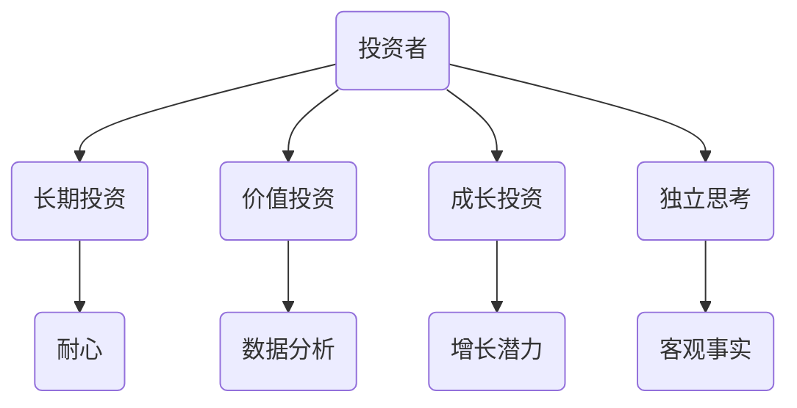

**1.2 塞思·卡拉曼的投资方法论**

塞思·卡拉曼的投资方法论是一个系统化的过程，包括投资目标设定、资产配置、风险控制等多个环节。他强调风险管理在投资过程中的重要性，认为有效的风险控制是投资成功的关键。在资产配置方面，卡拉曼主张多元化投资，降低单一市场波动带来的影响。

**核心概念与联系**

| 核心概念         | 概念属性特征                             |
|------------------|----------------------------------------|
| 投资目标设定     | 明确投资回报率和风险承受能力              |
| 资产配置         | 多元化投资，分散风险                     |
| 风险控制         | 通过多样化投资降低风险                   |

**ER实体关系图架构**

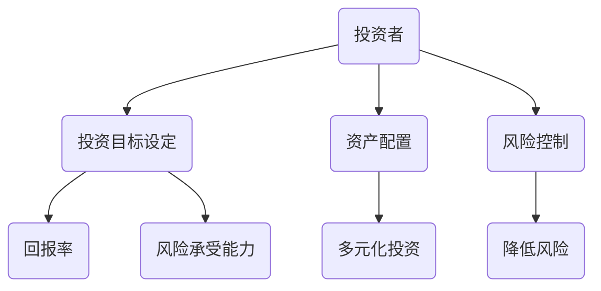

**1.3 塞思·卡拉曼的成功之道**

塞思·卡拉曼的成功不仅源于其独特的投资哲学和方法论，还依赖于他的投资心态和人生哲学。他注重生活的简单和充实，将投资理念融入生活态度，从而保持冷静和理性。他的成功之道在于对市场的深刻理解、对风险的正确评估以及对机会的敏锐洞察。

**核心概念与联系**

| 核心概念         | 概念属性特征                             |
|------------------|----------------------------------------|
| 投资心态         | 冷静、理性、耐心                       |
| 人生哲学         | 简单、充实、和谐                       |
| 市场理解         | 对市场规律的深刻把握                    |
| 风险评估         | 准确评估潜在风险，做出明智投资决策      |
| 机会洞察         | 及时抓住市场机会，实现投资回报          |

**ER实体关系图架构**

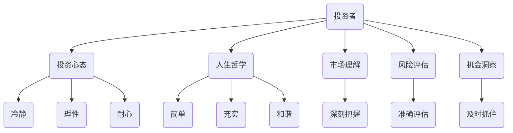

**1.4 投资理念与生活态度的融合**

塞思·卡拉曼的投资理念与其生活态度紧密融合，这种融合不仅提高了他的投资效率，也带来了生活质量的提升。他将投资哲学应用到生活的方方面面，如时间管理、健康保养、人际关系等，从而实现了投资与生活的双赢。

**核心概念与联系**

| 核心概念         | 概念属性特征                             |
|------------------|----------------------------------------|
| 投资哲学         | 基于长期投资和稳健收益的理念             |
| 生活态度         | 简单、充实、和谐的生活方式              |
| 投资效率         | 提高投资决策的准确性和及时性             |
| 生活质量         | 提升生活的幸福感和满足感                 |

**ER实体关系图架构**

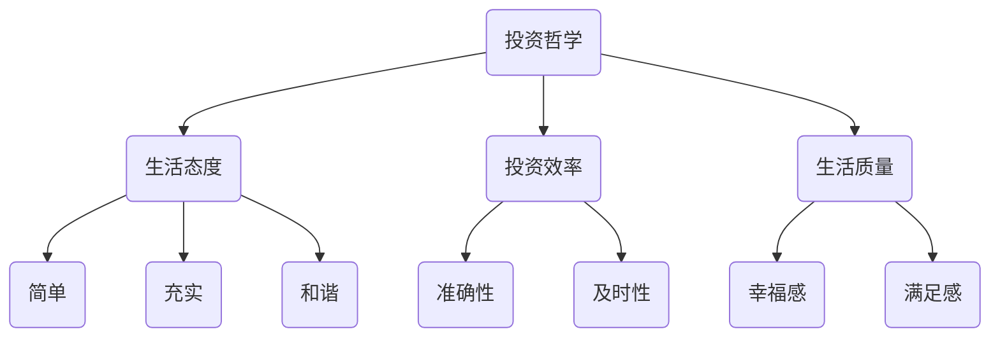

通过以上对塞思·卡拉曼投资哲学与人生经历的详细分析，我们可以看到，他的成功并非偶然，而是基于深刻的理论基础和实际经验。他的投资理念不仅适用于投资领域，也可以为我们日常生活的决策提供有益的启示。

### 第二部分：特殊情况投资分析框架

#### 第2章：特殊情况投资的定义与特征

**2.1 特殊情况投资的定义**

特殊情况投资，是指在市场波动较大、投资者情绪复杂、市场环境具有不确定性的情况下，通过深入研究和分析，寻找潜在的投资机会并进行投资的活动。这类投资通常涉及对市场风险的准确判断和有效控制，以及对投资机会的敏锐洞察。

**核心概念与联系**

| 核心概念         | 概念属性特征                             |
|------------------|----------------------------------------|
| 市场波动         | 市场价格和交易量等指标的频繁变化           |
| 投资者情绪       | 投资者的恐慌、贪婪等心理状态对市场的反应   |
| 不确定性         | 市场环境中的未知因素和潜在风险             |
| 深入研究         | 对市场环境和投资机会的全面分析             |
| 敏锐洞察         | 对潜在投资机会的快速识别和决策             |

**ER实体关系图架构**

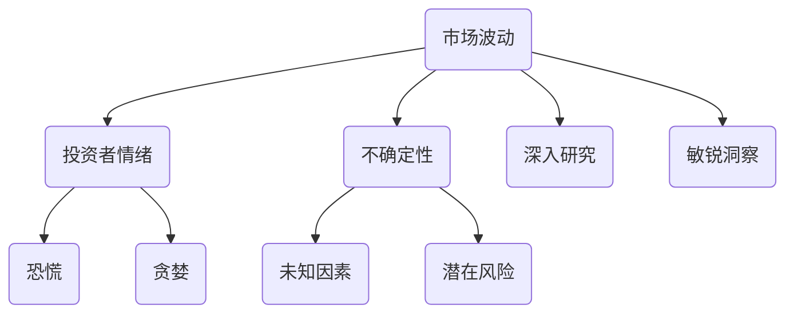

**2.2 特殊情况投资的特征**

特殊情况投资具有以下主要特征：

1. **高风险性**：由于市场波动和不确定性的存在，特殊情况投资往往面临较高的风险。
2. **高机会成本**：在市场环境不稳定的情况下，投资者需要付出更多的精力、时间和资源来进行分析和决策。
3. **灵活性**：特殊情况投资要求投资者具备较强的适应能力，能够灵活调整投资策略以应对市场的变化。
4. **复杂性**：特殊情况投资涉及多个领域，包括宏观经济、行业动态、公司业绩等，需要投资者具备全面的知识和技能。

**核心概念与联系**

| 核心概念         | 概念属性特征                             |
|------------------|----------------------------------------|
| 高风险性         | 投资风险较高，可能面临较大损失             |
| 高机会成本       | 需要投入更多资源，可能错失其他投资机会     |
| 灵活性           | 能够根据市场变化灵活调整投资策略           |
| 复杂性           | 涉及多个领域，需要全面分析和决策           |

**ER实体关系图架构**

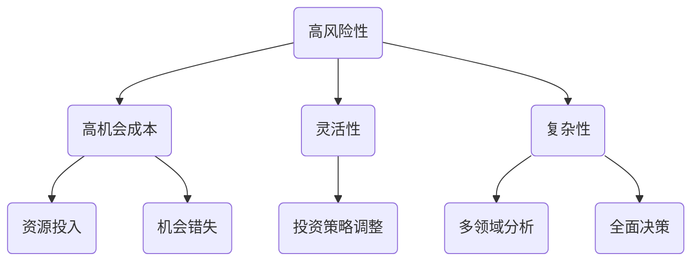

通过以上对特殊情况投资定义与特征的分析，我们可以看到，这类投资需要投资者具备较高的专业知识和实践经验，同时也需要具备良好的心理素质和决策能力。在市场波动和不确定性增加的背景下，特殊情况投资成为了投资者实现收益增长的重要手段。

### 第二部分：特殊情况投资分析框架

#### 第2章：特殊情况投资的机会来源

**2.3 特殊情况投资的机会来源**

特殊情况投资的机会主要来源于以下几个渠道：

1. **市场动荡时期**：在市场出现剧烈波动、投资者情绪恐慌的情况下，许多优质资产可能会被低估，从而为投资者提供了低价买入的机会。
2. **行业变迁时期**：随着技术的进步和行业变革，某些行业可能会出现快速的增长，为投资者提供新的投资机会。
3. **公司内部事件**：公司内部的管理问题、财务问题或其他突发事件，可能导致公司股价出现异常波动，为投资者提供投资机会。

**核心概念与联系**

| 核心概念         | 概念属性特征                             |
|------------------|----------------------------------------|
| 市场动荡时期     | 市场价格剧烈波动，投资者情绪不稳定          |
| 行业变迁时期     | 技术进步和行业变革导致投资机会的出现        |
| 公司内部事件     | 公司内部问题导致股价波动，提供投资机会       |

**ER实体关系图架构**

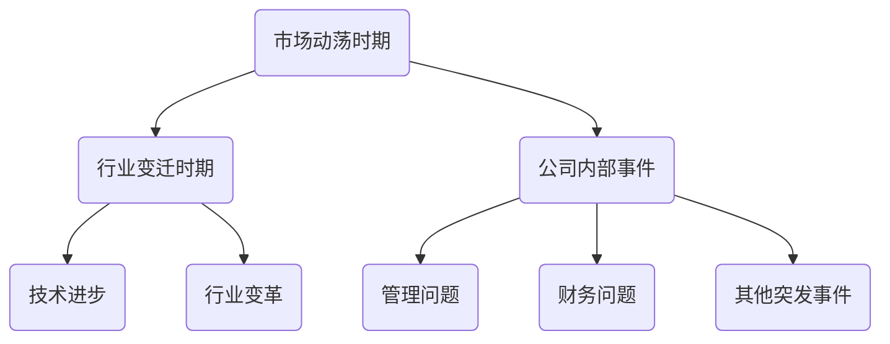

**2.4 特殊情况投资的策略选择**

在面对特殊情况投资时，投资者需要根据市场环境和投资机会的特点，选择合适的投资策略：

1. **价值投资策略**：寻找价格低于其内在价值的资产，长期持有，等待市场重新评估其价值。
2. **成长投资策略**：投资于具有持续增长潜力的公司，依靠公司业绩的提升来实现投资回报。
3. **多元化投资策略**：通过分散投资，降低单一市场波动带来的风险。

**核心概念与联系**

| 核心概念         | 概念属性特征                             |
|------------------|----------------------------------------|
| 价值投资策略     | 选择低估的资产，长期持有                |
| 成长投资策略     | 投资于具有增长潜力的公司                |
| 多元化投资策略   | 分散投资，降低风险                      |

**ER实体关系图架构**

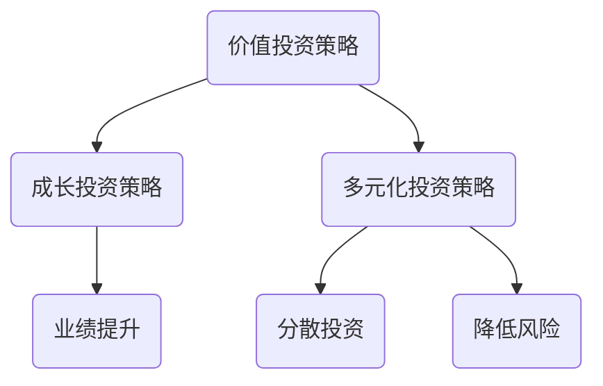

**2.5 特殊情况投资的应对措施**

为了在特殊情况投资中取得成功，投资者需要采取一系列应对措施：

1. **风险识别与评估**：通过全面分析市场环境和投资机会，识别潜在的风险，并对其进行评估。
2. **投资决策与执行**：在充分了解风险的基础上，做出明智的投资决策，并迅速执行。
3. **风险管理**：通过多元化投资、止损等手段，有效控制投资风险。

**核心概念与联系**

| 核心概念         | 概念属性特征                             |
|------------------|----------------------------------------|
| 风险识别与评估   | 全面分析潜在风险，评估其影响             |
| 投资决策与执行   | 在了解风险的基础上做出投资决策并执行     |
| 风险管理         | 通过多元化投资、止损等手段控制投资风险   |

**ER实体关系图架构**

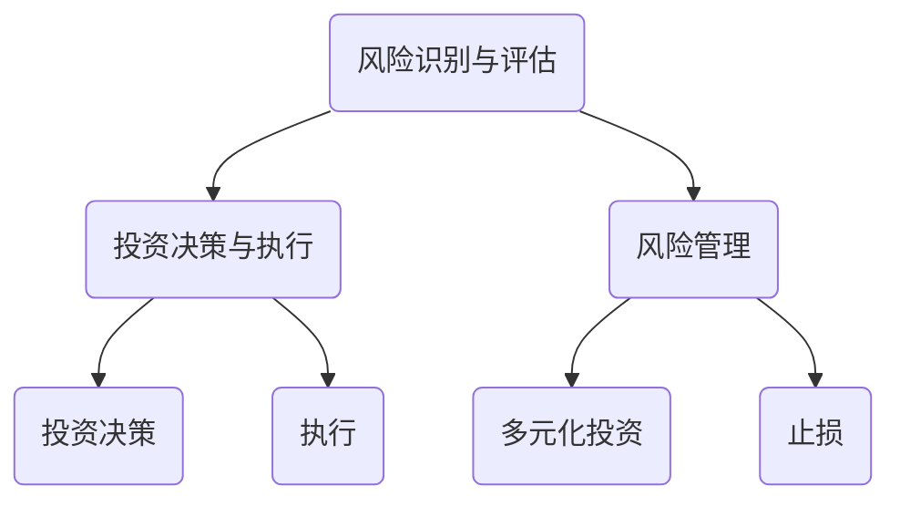

通过以上对特殊情况投资机会来源、策略选择和应对措施的分析，我们可以看到，特殊情况投资是一个复杂而富有挑战的过程。投资者需要具备敏锐的市场洞察力、深厚的专业知识以及良好的风险管理能力，才能在这个领域取得成功。

### 第二部分：特殊情况投资分析框架

#### 第3章：案例分析一：美国储蓄银行危机

**3.1 案例背景与问题描述**

美国储蓄银行危机发生于1980年代，当时由于利率管制放松，储蓄银行面临激烈的竞争，许多银行因无法应对市场变化而陷入困境。这场危机导致了数百家的储蓄银行破产，引发了广泛的金融恐慌，对美国经济产生了深远的影响。

**问题背景与问题描述**

- **背景**：1980年代初，美国利率管制逐渐放松，储蓄银行的利润空间被压缩，许多银行为了维持利润，开始采取高风险的贷款策略。
- **问题描述**：银行贷款风险加大，资产质量下降，导致不良贷款增多。当利率上升时，银行的负债成本上升，同时资产价值下降，许多银行面临破产风险。

**问题解决**

- **解决方案**：美国政府和监管机构采取了一系列措施，包括金融监管改革、银行救助计划等，以稳定金融系统。同时，一些银行通过并购重组，提升了资本实力和风险控制能力。

**边界与外延**

- **边界**：危机主要涉及储蓄银行，但影响扩展到了整个金融系统，包括商业银行、投资基金等。
- **外延**：危机还引发了金融监管改革的讨论，促使政府加强金融监管，以防止类似危机再次发生。

**概念结构与核心要素组成**

- **核心概念**：储蓄银行危机、利率管制放松、高风险贷款、不良贷款、金融监管改革。
- **要素组成**：
  - **银行贷款**：利率管制放松导致贷款风险上升。
  - **资产质量**：贷款风险导致银行资产质量下降。
  - **金融系统稳定**：政府和监管机构的应对措施旨在稳定金融系统。
  - **监管改革**：危机后加强金融监管，以防止类似事件再次发生。

**3.2 案例分析**

**案例分析**

- **原因分析**：
  - **利率管制放松**：储蓄银行的利润空间被压缩，导致银行采取高风险贷款策略。
  - **市场竞争**：储蓄银行面临商业银行和其他金融机构的激烈竞争，不得不采取高风险策略以维持竞争力。
  - **宏观经济环境**：1980年代初，美国经济处于低迷期，金融市场的波动加剧，增加了银行的风险。

- **影响分析**：
  - **银行破产**：许多银行因无法应对市场变化而破产，导致金融恐慌。
  - **金融系统稳定**：储蓄银行危机引发了政府和监管机构的关注，促使加强金融监管。
  - **宏观经济影响**：危机对经济增长产生负面影响，导致失业率上升，经济衰退。

**3.3 投资决策过程**

**投资决策过程**

- **决策前分析**：
  - **市场环境**：了解储蓄银行危机的背景和影响，评估市场风险。
  - **投资机会**：识别危机中可能出现的投资机会，如低价购买破产银行的资产。

- **决策过程**：
  - **风险评估**：对潜在投资机会进行风险评估，包括市场风险、信用风险等。
  - **投资策略**：选择合适的投资策略，如价值投资策略或多元化投资策略。
  - **执行决策**：制定详细的投资计划，迅速执行投资决策。

- **决策后分析**：
  - **投资效果**：跟踪投资效果，调整投资策略以应对市场变化。
  - **风险控制**：持续监控风险，采取必要的措施降低投资风险。

**3.4 案例启示**

**案例启示**

- **风险管理**：储蓄银行危机表明，投资者在特殊情况投资中必须高度重视风险管理，包括市场风险、信用风险等。
- **投资策略**：投资者应根据市场环境和投资机会的特点，灵活选择投资策略，如价值投资或多元化投资。
- **市场洞察**：投资者需要具备敏锐的市场洞察力，及时识别和把握市场变化带来的投资机会。

通过分析美国储蓄银行危机，我们可以看到，这场危机不仅对金融市场产生了深远的影响，也为投资者提供了重要的经验和教训。了解危机的背景、原因、影响及投资决策过程，有助于投资者更好地应对特殊情况投资中的挑战，实现投资目标。

### 第二部分：特殊情况投资分析框架

#### 第4章：案例分析二：泰国金融危机

**4.1 案例背景与问题描述**

泰国金融危机发生在1997年，是亚洲金融危机的一部分。危机前，泰国经济经历了高速增长，但同时也积累了大量的金融风险。危机爆发时，泰铢贬值，引发了一系列金融和经济问题，导致泰国及其他亚洲国家经济陷入困境。

**问题背景与问题描述**

- **背景**：1990年代，泰国经济高速增长，大量外资涌入，金融市场上存在严重的资产泡沫。
- **问题描述**：危机爆发时，泰铢急剧贬值，投资者纷纷抛售泰铢，导致金融市场动荡。银行体系面临巨大压力，许多企业倒闭，失业率上升，经济陷入衰退。

**问题解决**

- **解决方案**：泰国政府采取了一系列紧急措施，包括提高利率、减少公共支出、实行金融监管改革等，以稳定经济和金融市场。
- **效果**：尽管措施在一定程度上缓解了危机，但泰国经济长期复苏缓慢，金融市场的不稳定性依然存在。

**边界与外延**

- **边界**：泰国金融危机主要涉及泰国金融市场和宏观经济，但影响扩展到了整个亚洲地区。
- **外延**：危机还引发了国际社会的关注，促使全球金融监管体系进行改革。

**概念结构与核心要素组成**

- **核心概念**：泰国金融危机、泰铢贬值、金融市场动荡、经济衰退、金融监管改革。
- **要素组成**：
  - **资产泡沫**：金融市场上存在大量投机行为，导致资产价格虚高。
  - **银行风险**：银行体系存在大量不良贷款，导致银行资本不足。
  - **宏观经济政策**：政府采取的紧急措施，包括货币政策和财政政策。
  - **国际影响**：亚洲金融危机对全球金融市场和经济产生了影响。

**4.2 案例分析**

**案例分析**

- **原因分析**：
  - **宏观经济政策**：泰国政府过度依赖出口导向型经济，忽视了国内消费和投资的需求，导致经济结构失衡。
  - **金融自由化**：金融自由化政策导致金融市场过度开放，外资涌入，形成资产泡沫。
  - **银行风险**：银行体系存在大量不良贷款，风险控制不足，导致银行资本不足。

- **影响分析**：
  - **金融市场动荡**：泰铢贬值引发金融市场动荡，投资者信心受损。
  - **经济衰退**：企业倒闭、失业率上升，经济陷入衰退。
  - **国际影响**：亚洲金融危机波及其他亚洲国家，引发全球金融市场的动荡。

**4.3 投资决策过程**

**投资决策过程**

- **决策前分析**：
  - **市场环境**：了解泰国金融危机的背景和影响，评估市场风险。
  - **投资机会**：识别危机中可能出现的投资机会，如低价购买资产。

- **决策过程**：
  - **风险评估**：对潜在投资机会进行风险评估，包括市场风险、信用风险等。
  - **投资策略**：选择合适的投资策略，如价值投资策略或多元化投资策略。
  - **执行决策**：制定详细的投资计划，迅速执行投资决策。

- **决策后分析**：
  - **投资效果**：跟踪投资效果，调整投资策略以应对市场变化。
  - **风险控制**：持续监控风险，采取必要的措施降低投资风险。

**4.4 案例启示**

**案例启示**

- **风险管理**：泰国金融危机表明，投资者在特殊情况投资中必须高度重视风险管理，包括市场风险、信用风险等。
- **投资策略**：投资者应根据市场环境和投资机会的特点，灵活选择投资策略，如价值投资或多元化投资。
- **市场洞察**：投资者需要具备敏锐的市场洞察力，及时识别和把握市场变化带来的投资机会。

通过分析泰国金融危机，我们可以看到，这场危机不仅对泰国经济产生了深远的影响，也为全球金融市场敲响了警钟。了解危机的背景、原因、影响及投资决策过程，有助于投资者更好地应对特殊情况投资中的挑战，实现投资目标。

### 第二部分：特殊情况投资分析框架

#### 第5章：案例分析三：日本的房地产泡沫

**5.1 案例背景与问题描述**

日本的房地产泡沫发生在1980年代末至1990年代初，是日本经济史上的一个重要事件。在泡沫期间，日本房地产市场价格飞涨，随后迅速崩溃，导致日本经济长期停滞。这一事件不仅对日本经济产生了深远的影响，也对全球经济产生了重要启示。

**问题背景与问题描述**

- **背景**：1980年代，日本经济持续高速增长，资金大量流入房地产市场，推动房价不断上涨。
- **问题描述**：泡沫崩溃时，房地产市场价格急剧下跌，导致银行坏账增加，企业倒闭，经济陷入长期停滞。

**问题解决**

- **解决方案**：日本政府采取了一系列措施，包括货币宽松、经济刺激计划等，以缓解经济困境。
- **效果**：尽管措施在一定程度上缓解了危机，但日本经济仍长期处于低迷状态，房地产市场未能恢复到泡沫前的水平。

**边界与外延**

- **边界**：房地产泡沫主要涉及日本房地产市场和金融系统。
- **外延**：泡沫崩溃对全球经济产生了影响，促使各国加强金融监管，防范类似风险。

**概念结构与核心要素组成**

- **核心概念**：日本房地产泡沫、价格飞涨、泡沫崩溃、经济停滞、金融监管改革。
- **要素组成**：
  - **房地产市场**：房价持续上涨，投机行为泛滥。
  - **金融系统**：银行大量贷款给房地产开发商和购房者，风险积累。
  - **宏观经济政策**：日本政府采取的货币宽松和经济刺激措施。
  - **国际影响**：全球对房地产泡沫和金融风险的关注增加。

**5.2 案例分析**

**案例分析**

- **原因分析**：
  - **宏观经济政策**：日本政府长期实施低利率政策，导致资金大量流入房地产市场，推动房价上涨。
  - **市场投机**：投资者和开发商预期房价将继续上涨，纷纷涌入市场，导致房价泡沫形成。
  - **金融风险**：银行过度放贷，缺乏风险控制，导致金融系统风险积累。

- **影响分析**：
  - **房地产市场**：房价急剧下跌，投资者和开发商遭受巨大损失。
  - **金融系统**：银行坏账增加，金融体系受损，经济陷入停滞。
  - **国际影响**：全球对房地产泡沫和金融风险的关注增加，引发对金融监管的讨论。

**5.3 投资决策过程**

**投资决策过程**

- **决策前分析**：
  - **市场环境**：了解房地产泡沫的形成过程和崩溃迹象，评估市场风险。
  - **投资机会**：识别泡沫崩溃过程中可能出现的投资机会，如低价购买资产。

- **决策过程**：
  - **风险评估**：对潜在投资机会进行风险评估，包括市场风险、信用风险等。
  - **投资策略**：选择合适的投资策略，如价值投资策略或多元化投资策略。
  - **执行决策**：制定详细的投资计划，迅速执行投资决策。

- **决策后分析**：
  - **投资效果**：跟踪投资效果，调整投资策略以应对市场变化。
  - **风险控制**：持续监控风险，采取必要的措施降低投资风险。

**5.4 案例启示**

**案例启示**

- **风险管理**：房地产泡沫崩溃表明，投资者在特殊情况投资中必须高度重视风险管理，包括市场风险、信用风险等。
- **投资策略**：投资者应根据市场环境和投资机会的特点，灵活选择投资策略，如价值投资或多元化投资。
- **市场洞察**：投资者需要具备敏锐的市场洞察力，及时识别和把握市场变化带来的投资机会。

通过分析日本房地产泡沫，我们可以看到，这场泡沫崩溃不仅对日本经济产生了深远的影响，也为全球金融市场提供了重要的教训。了解泡沫的形成、崩溃及投资决策过程，有助于投资者更好地应对特殊情况投资中的挑战，实现投资目标。

### 第三部分：特殊情况投资策略与技巧

#### 第6章：特殊情况投资策略

**6.1 价值投资策略**

价值投资策略是特殊情况投资中的一种重要策略，其核心理念是寻找市场价格低于其内在价值的投资机会。价值投资者通常关注企业的基本面，如盈利能力、资产质量、管理团队等，通过深入分析企业的内在价值，发现低估的投资标的。

**核心概念与联系**

| 核心概念       | 概念属性特征                   |
|----------------|------------------------------|
| 价值投资       | 选择市场价格低于内在价值的股票 |
| 内在价值       | 对企业未来现金流的评估         |
| 基本面分析     | 对企业财务状况和经营能力的分析 |
| 投资机会       | 低估的股票或资产              |

**ER实体关系图架构**

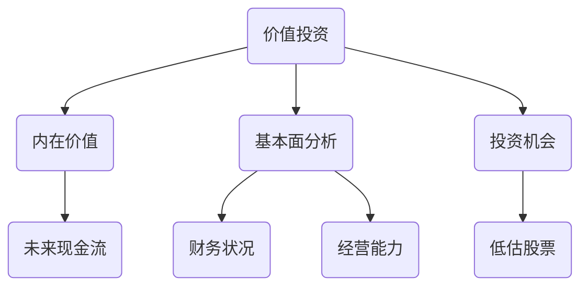

**6.2 成长投资策略**

成长投资策略侧重于寻找那些具备持续增长潜力的公司。这类公司通常在快速发展的行业中，通过技术创新、市场份额扩张等方式实现业绩的快速增长。成长投资者通常对公司的未来增长前景持乐观态度，愿意为其支付较高的估值。

**核心概念与联系**

| 核心概念       | 概念属性特征                   |
|----------------|------------------------------|
| 成长投资       | 投资于具备持续增长潜力的公司   |
| 增长潜力       | 公司未来业绩的快速增长         |
| 技术创新       | 通过技术创新实现市场扩张       |
| 市场份额扩张   | 通过市场份额的提升实现增长     |

**ER实体关系图架构**

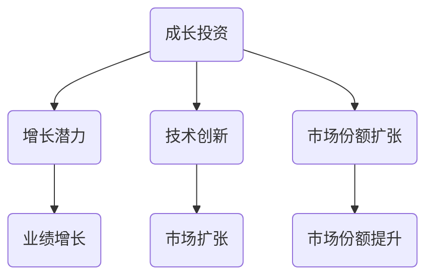

**6.3 投资组合策略**

投资组合策略是通过分散投资来降低风险的一种策略。投资者通常将资金投资于不同行业、不同资产类别，甚至不同国家和地区的市场，以实现风险分散。这种策略的核心在于通过多元化投资来减少单一市场波动对整个投资组合的影响。

**核心概念与联系**

| 核心概念       | 概念属性特征                   |
|----------------|------------------------------|
| 投资组合策略   | 通过分散投资降低风险           |
| 资产分散       | 投资于多种不同的资产           |
| 风险分散       | 通过多元化投资降低风险         |
| 资产类别       | 股票、债券、房地产、黄金等      |

**ER实体关系图架构**

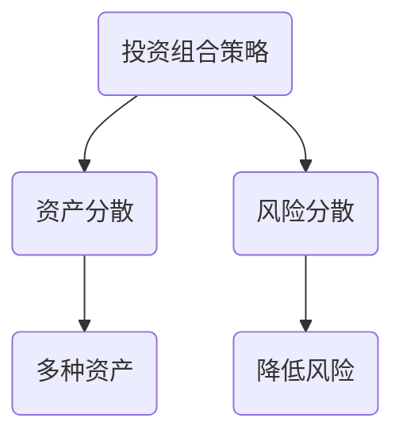

**6.4 风险管理策略**

风险管理策略是特殊情况投资中不可或缺的一部分。投资者需要通过多种手段来识别、评估和控制风险，以确保投资组合的稳定和安全。风险管理策略包括但不限于风险识别、风险评估、风险控制和风险转移等。

**核心概念与联系**

| 核心概念       | 概念属性特征                   |
|----------------|------------------------------|
| 风险管理       | 通过多种手段识别和控制风险     |
| 风险识别       | 识别投资过程中可能遇到的风险   |
| 风险评估       | 评估风险的可能性和影响         |
| 风险控制       | 通过投资策略和措施降低风险     |
| 风险转移       | 通过保险、对冲等手段转移风险   |

**ER实体关系图架构**

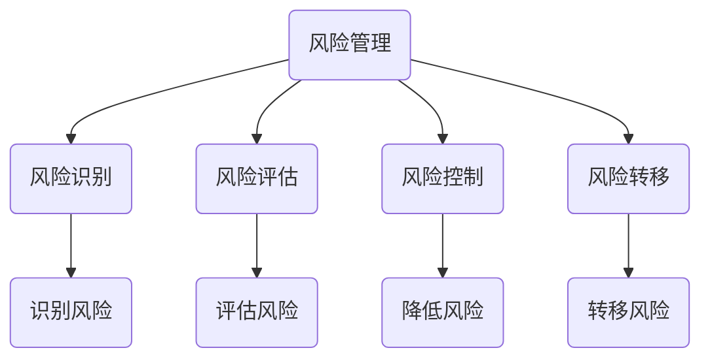

通过以上对特殊情况投资策略的详细分析，我们可以看到，每种策略都有其独特的应用场景和优缺点。投资者需要根据市场环境、个人投资目标和风险承受能力，灵活选择和组合这些策略，以实现最佳的投资效果。

### 第三部分：特殊情况投资策略与技巧

#### 第7章：特殊情况投资技巧

**7.1 逆向投资技巧**

逆向投资是一种在市场普遍悲观或乐观时采取反向操作的投资技巧。这种策略的核心在于发现市场的错误定价，并在市场情绪修正时获取超额收益。逆向投资者通常具备深厚的市场洞察力和独立思考能力，能够逆市场情绪而行。

**核心概念与联系**

| 核心概念       | 概念属性特征                   |
|----------------|------------------------------|
| 逆向投资       | 在市场普遍悲观或乐观时采取反向操作 |
| 市场情绪       | 投资者情绪对市场定价的影响       |
| 错误定价       | 市场对某些资产的定价不合理       |
| 独立思考       | 不受市场情绪影响，独立做出投资决策 |

**ER实体关系图架构**

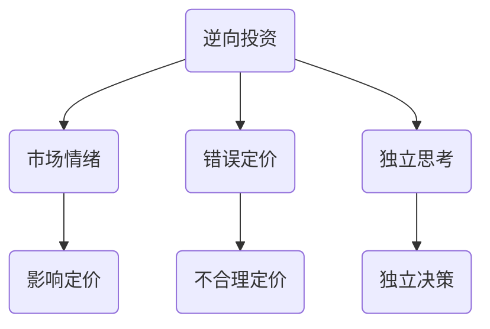

**7.2 价值挖掘技巧**

价值挖掘技巧是寻找那些被市场低估的投资机会的一种方法。这种技巧的核心在于通过深入分析企业的基本面，发现那些尚未被市场充分认识的价值。价值挖掘通常需要投资者具备较强的研究能力和财务分析能力。

**核心概念与联系**

| 核心概念       | 概念属性特征                   |
|----------------|------------------------------|
| 价值挖掘       | 通过基本面分析发现低估的投资机会 |
| 基本面分析     | 对企业财务状况和经营能力的分析 |
| 研究能力       | 对市场和行业的研究和分析能力     |
| 财务分析       | 对企业财务报表的解读和分析       |

**ER实体关系图架构**

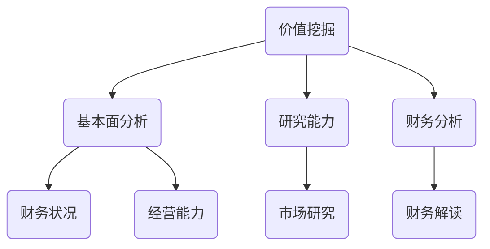

**7.3 投资心理技巧**

投资心理技巧是帮助投资者在投资过程中保持理性，避免情绪化决策的一种方法。这种技巧的核心在于理解和控制自己的情绪，以及如何在不同市场环境下保持冷静和自信。投资心理技巧包括自我认知、情绪管理、压力应对等。

**核心概念与联系**

| 核心概念       | 概念属性特征                   |
|----------------|------------------------------|
| 投资心理技巧   | 帮助投资者在投资过程中保持理性 |
| 自我认知       | 了解自己的情绪和投资习惯       |
| 情绪管理       | 控制情绪，避免情绪化决策       |
| 压力应对       | 在压力下保持冷静和自信         |

**ER实体关系图架构**

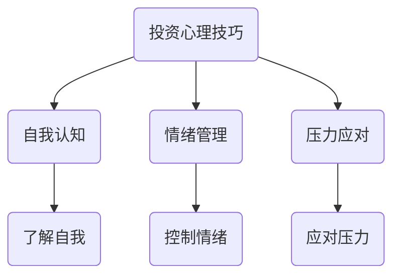

**7.4 投资信息搜集技巧**

投资信息搜集技巧是投资者获取和分析投资信息的一种方法。这种技巧的核心在于如何高效地搜集、筛选和利用信息，以支持投资决策。投资信息搜集包括市场数据、行业动态、公司公告等多种来源，需要投资者具备信息处理和数据分析能力。

**核心概念与联系**

| 核心概念       | 概念属性特征                   |
|----------------|------------------------------|
| 投资信息搜集   | 获取和分析投资信息的方法       |
| 市场数据       | 市场交易数据和相关指标         |
| 行业动态       | 行业趋势、竞争格局等           |
| 公司公告       | 公司财务报表、重大事项公告等   |
| 数据分析       | 对搜集到的信息进行分析和解读   |

**ER实体关系图架构**

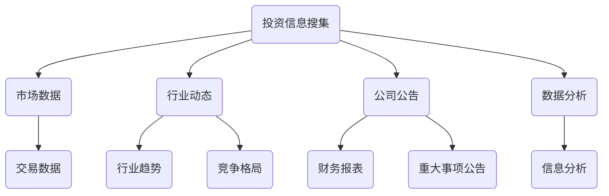

通过以上对特殊情况投资技巧的详细分析，我们可以看到，这些技巧在投资者应对市场波动、发现投资机会、控制投资风险等方面具有重要的指导作用。投资者需要根据自身情况，灵活运用这些技巧，以提高投资决策的科学性和有效性。

### 第四部分：特殊情况投资实践与应用

#### 第8章：特殊情况投资实践案例

**8.1 实践背景与问题描述**

本案例选取了2008年全球金融危机期间的一个实际投资实践。当时，全球经济面临严峻的挑战，金融市场剧烈波动，许多优质资产被市场低估。本案例的投资者通过特殊情况投资策略，成功地捕捉到了投资机会，实现了较高的投资回报。

**实践背景**

- **市场环境**：2008年全球金融危机爆发，金融市场动荡，投资者信心受挫。
- **投资机会**：大量优质资产被市场低估，价格大幅下跌，提供了良好的投资机会。

**问题描述**

投资者面临的主要问题是：

- 如何在市场不确定性高、风险较大的情况下，识别和把握潜在的投资机会？
- 如何通过有效的风险管理，降低投资风险，确保投资组合的稳定和增值？

**8.2 实践案例分析**

**案例分析**

- **策略选择**：投资者选择了逆向投资和价值投资相结合的策略。

  - **逆向投资**：在市场普遍悲观的情况下，投资者发现了被市场低估的优质资产，如银行、房地产等领域的股票。
  - **价值投资**：投资者通过对企业基本面的深入分析，选择了那些尽管短期业绩受到冲击，但长期增长潜力依然巨大的公司。

- **投资决策过程**：

  - **风险识别**：投资者首先对市场风险进行了全面识别，包括宏观经济风险、市场波动风险、信用风险等。
  - **风险评估**：投资者对潜在投资机会进行了详细的风险评估，包括市场波动风险、信用风险等，并制定了相应的风险控制措施。
  - **执行决策**：投资者在评估风险和投资机会后，迅速制定了详细的投资计划，并执行了投资决策。

- **实践效果**：

  - **投资回报**：通过逆向投资和价值投资策略，投资者在金融危机期间取得了较高的投资回报。
  - **风险控制**：投资者通过有效的风险控制措施，如多元化投资、止损策略等，降低了投资风险，确保了投资组合的稳定。

**8.3 实践启示**

**实践启示**

- **风险管理**：投资者在特殊情况投资中必须高度重视风险管理，通过多元化投资、止损策略等手段，降低投资风险。
- **投资策略**：投资者应根据市场环境和投资机会的特点，灵活选择逆向投资和价值投资等策略，实现投资目标。
- **市场洞察**：投资者需要具备敏锐的市场洞察力，及时识别和把握市场变化带来的投资机会。

通过本案例的分析，我们可以看到，在特殊情况投资中，投资者需要具备良好的风险管理能力和市场洞察力，通过灵活运用投资策略，实现投资目标。

### 第四部分：特殊情况投资实践与应用

#### 第9章：特殊情况投资应用与未来展望

**9.1 特殊情况投资在投资组合中的应用**

特殊情况投资在投资组合中的应用主要体现在以下几个方面：

1. **风险分散**：通过投资于不同市场、不同资产类别，如股票、债券、房地产等，实现投资组合的风险分散。
2. **收益增强**：在市场波动较大、机会较多的情况下，特殊情况投资策略可以帮助投资者捕捉到高收益的投资机会，增强整体投资回报。
3. **资产配置**：特殊情况投资可以作为资产配置的一部分，提高投资组合的灵活性和抗风险能力。

**核心概念与联系**

| 核心概念       | 概念属性特征                   |
|----------------|------------------------------|
| 风险分散       | 投资于多种不同资产类别         |
| 收益增强       | 捕捉高收益投资机会             |
| 资产配置       | 根据投资目标和风险承受能力调整资产分配 |

**ER实体关系图架构**

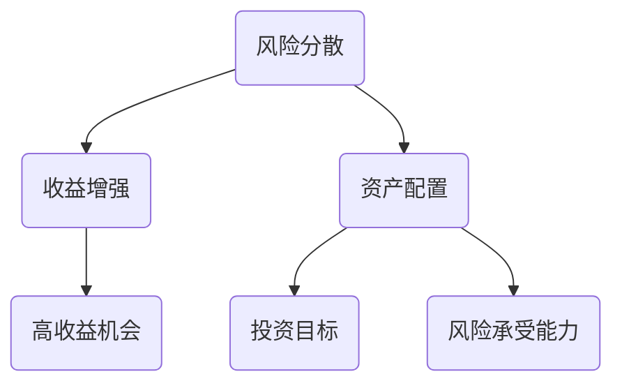

**9.2 特殊情况投资在国内外的应用现状**

在国内，特殊情况投资的应用逐渐受到重视，特别是在金融市场波动较大、投资机会较多的时期。许多机构投资者和富有经验的个人投资者已经开始采用特殊情况投资策略，以实现更高的投资回报。

在国际上，特殊情况投资已经发展成为一个成熟的投资领域。国外投资者普遍具备较高的风险识别和风险管理能力，能够灵活运用各种特殊情况投资策略，在全球范围内寻找和把握投资机会。

**现状分析**

- **国内现状**：随着国内金融市场的不断开放和成熟，特殊情况投资在国内的应用越来越广泛。投资者对特殊情况投资的认知度和接受度逐渐提高。
- **国际现状**：国际投资者在特殊情况投资领域具有丰富的经验和深厚的专业能力，能够灵活运用各种投资策略，实现跨境投资。

**9.3 特殊情况投资的发展趋势与未来展望**

随着全球金融市场的不断发展和变化，特殊情况投资在未来有望呈现以下趋势：

1. **技术进步**：随着人工智能、大数据等技术的发展，特殊情况投资将更加依赖数据分析和模型预测，提高投资决策的效率和准确性。
2. **全球化**：全球金融市场日益融合，特殊情况投资的应用范围将进一步扩大，投资者将在全球范围内寻找和把握投资机会。
3. **专业化和细分**：随着特殊情况投资领域的发展，越来越多的专业机构和投资者将专注于特定的投资领域，如特定行业、特定市场等，实现专业化投资。

**未来展望**

- **技术驱动**：技术进步将推动特殊情况投资向智能化、精准化方向发展。
- **全球化投资**：全球金融市场一体化将提高特殊情况投资的国际竞争力。
- **专业化和细分**：特殊情况投资领域将不断细分，专业机构和个人投资者将更加专注于特定领域，实现专业化和高收益。

通过以上对特殊情况投资应用现状和未来展望的分析，我们可以看到，特殊情况投资在国内外的应用正在不断深化，未来具有广阔的发展前景。投资者需要紧跟市场变化，灵活运用特殊情况投资策略，以实现投资目标。

### 第五部分：总结与启示

#### 第10章：特殊情况投资的总结与启示

**10.1 特殊情况投资的核心要素**

特殊情况投资的核心要素包括：

1. **风险管理**：投资者需要高度重视风险管理，通过多元化投资、止损策略等手段，降低投资风险。
2. **市场洞察**：投资者需要具备敏锐的市场洞察力，能够及时识别和把握市场变化带来的投资机会。
3. **策略选择**：投资者应根据市场环境和投资机会的特点，灵活选择合适的投资策略，如价值投资、成长投资、逆向投资等。
4. **风险控制**：在投资过程中，投资者需要持续监控风险，采取必要的措施降低投资风险，确保投资组合的稳定。

**10.2 特殊情况投资的关键技巧**

特殊情况投资的关键技巧包括：

1. **逆向思维**：在市场普遍悲观或乐观时，能够采取反向操作，发现被市场低估的投资机会。
2. **价值挖掘**：通过深入分析企业的基本面，发现那些未被市场充分认识的价值投资机会。
3. **情绪管理**：在投资过程中，投资者需要控制自己的情绪，避免情绪化决策，保持理性。
4. **信息搜集**：投资者需要具备高效的信息搜集和分析能力，获取全面、准确的投资信息。

**10.3 投资者如何应对特殊情况**

投资者应对特殊情况投资的方法：

1. **学习与提升**：投资者需要不断学习，提升自己的投资知识和技能，以应对复杂多变的市场环境。
2. **风险管理**：投资者应建立健全的风险管理体系，通过多元化投资、止损策略等手段，降低投资风险。
3. **市场研究**：投资者需要对市场进行深入研究，了解行业动态、公司业绩等信息，提高投资决策的科学性和准确性。
4. **心理素质**：投资者需要具备良好的心理素质，保持冷静和理性，避免因市场波动而做出冲动决策。

**10.4 特殊情况投资的风险与收益分析**

特殊情况投资具有以下风险与收益特点：

1. **风险较高**：由于特殊情况投资涉及市场波动和不确定性，投资者可能面临较高的投资风险。
2. **机会多样**：特殊情况投资提供了丰富的投资机会，投资者可以通过逆向投资、价值挖掘等策略，实现高收益。
3. **灵活性**：特殊情况投资策略灵活，投资者可以根据市场变化，及时调整投资策略。
4. **专业要求**：特殊情况投资需要投资者具备较高的专业知识和实践经验，以及对市场的深刻理解。

通过以上对特殊情况投资的总结与启示，我们可以看到，特殊情况投资是一个复杂而富有挑战的过程。投资者需要具备良好的风险管理能力、敏锐的市场洞察力以及专业的投资技巧，才能在这个领域取得成功。在市场波动和不确定性增加的背景下，特殊情况投资成为了投资者实现收益增长的重要手段。

### 附录

#### 附录A：特殊情况投资术语解释

- **特殊情况投资**：指在市场波动较大、投资者情绪复杂、市场环境具有不确定性的情况下，通过深入研究和分析，寻找潜在的投资机会并进行投资的活动。
- **市场波动**：指市场价格的频繁变化，包括上涨和下跌。
- **投资者情绪**：指投资者的恐慌、贪婪等心理状态对市场反应。
- **不确定性**：指市场环境中的未知因素和潜在风险。
- **价值投资**：寻找价格低于其内在价值的投资机会，长期持有，等待市场重新评估其价值。
- **成长投资**：投资于具备持续增长潜力的公司，依靠公司业绩的提升来实现投资回报。
- **风险管理**：通过多样化投资、止损等手段，降低投资风险。
- **逆向投资**：在市场普遍悲观或乐观时采取反向操作，发现被市场低估的投资机会。
- **价值挖掘**：通过基本面分析，发现那些未被市场充分认识的价值投资机会。

#### 附录B：特殊情况投资案例分析资料来源

- **美国储蓄银行危机**：资料来源于《美国金融史》及相关学术论文。
- **泰国金融危机**：资料来源于《亚洲金融危机：起源、发展和影响》及国际金融组织的研究报告。
- **日本房地产泡沫**：资料来源于《日本经济泡沫：形成、崩溃及其影响》及相关经济学研究论文。

#### 附录C：特殊情况投资相关阅读推荐

- **《证券分析》**：本杰明·格雷厄姆著，介绍了价值投资的基本原理和方法。
- **《投资最重要的事》**：霍华德·马克斯著，探讨了投资风险与收益之间的关系。
- **《行为金融学》**：罗伯特·J·席勒著，分析了投资者行为对市场波动的影响。
- **《逆向投资》**：塞思·卡拉曼著，详细阐述了逆向投资策略的应用。

通过阅读这些书籍，投资者可以深入了解特殊情况投资的理论基础和实践经验，提升自身的投资能力和市场洞察力。

