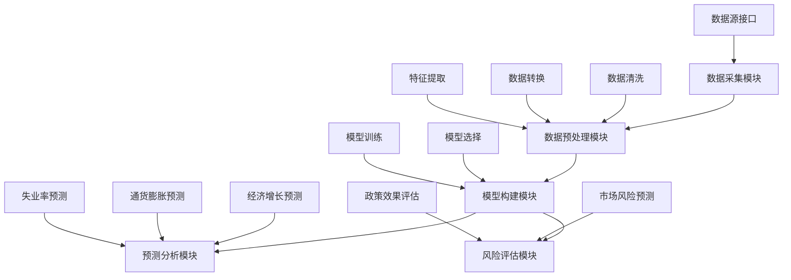
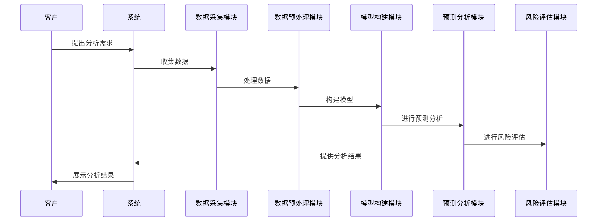

                 


### 塞思·卡拉曼的宏观经济分析

#### 关键词：宏观经济分析、经济增长、通货膨胀、失业率、利率、汇率

> 摘要：本文将深入探讨塞思·卡拉曼的宏观经济分析理论，通过逐步分析宏观经济中的核心概念、联系以及算法原理，帮助读者理解宏观经济分析的框架和实际应用。

---

#### 第一部分：背景介绍

**核心概念**

- **问题背景**：随着全球经济一体化和信息技术的飞速发展，宏观经济分析在政策制定、企业决策以及个人理财等方面的重要性日益凸显。宏观经济分析主要关注国家或地区的经济运行态势、政策影响以及潜在风险。
- **问题描述**：在宏观经济分析中，如何准确把握经济周期、预测经济增长、分析政策效果以及评估市场风险等问题，一直是研究者、政策制定者和投资者关注的焦点。
- **问题解决**：塞思·卡拉曼（Seth Klarman）是一位知名的投资者和宏观经济分析专家，他的著作《塞思·卡拉曼的宏观经济分析》为读者提供了关于宏观经济分析的理论基础、方法和实践指南。
- **边界与外延**：本部分将涵盖宏观经济分析的基本概念、理论框架、方法技巧以及实际应用。同时，也会探讨宏观经济分析在政策制定、企业战略和金融市场中的应用。

**概念结构与核心要素组成**

1. **宏观经济分析的基本概念**：包括经济增长、通货膨胀、失业率、利率、汇率等核心指标。
2. **宏观经济分析的理论框架**：基于宏观经济学、货币经济学和金融市场理论。
3. **宏观经济分析的方法技巧**：包括数据分析、模型构建、预测方法和风险评估。
4. **宏观经济分析的实际应用**：在政策制定、企业决策和金融市场投资中的应用。

---

#### 第二部分：核心概念与联系

**核心概念原理**

**宏观经济分析的核心概念：**  
- **经济增长**：国家或地区在一定时期内的国内生产总值（GDP）增长情况。其特征包括趋势稳定性、周期性和波动性。
- **通货膨胀**：物价总水平持续上涨的现象。其特征包括速度、持续性和影响范围。
- **失业率**：失业人口在劳动力人口中所占的比例。其特征包括短期波动、长期趋势和结构性因素影响。
- **利率**：资金借贷的利息率。其特征包括利率水平、利率结构和利率政策。
- **汇率**：两种货币之间的兑换比率。其特征包括汇率制度、汇率波动和汇率政策。

**概念属性特征对比表格：**

| 概念     | 定义                                                         | 属性特征对比                                      |
|----------|--------------------------------------------------------------|---------------------------------------------------|
| 经济增长 | 国家或地区在一定时期内的国内生产总值（GDP）增长情况           | 趋势稳定性、周期性、波动性                         |
| 通货膨胀 | 物价总水平持续上涨的现象                                   | 速度、持续性、影响范围                             |
| 失业率   | 失业人口在劳动力人口中所占的比例                           | 短期波动、长期趋势、结构性因素影响                 |
| 利率     | 资金借贷的利息率                                           | 利率水平、利率结构、利率政策                       |
| 汇率     | 两种货币之间的兑换比率                                     | 汇率制度、汇率波动、汇率政策                       |

**ER实体关系图架构：**

```mermaid
erDiagram
    Class1.arrow(right) Class2
    Class1 &&> Class3
    Class2 &&> Class4
    Class3 &&> Class5
```

---

#### 第三部分：算法原理讲解

**算法原理**

在本部分，我们将详细介绍宏观经济分析中常用的算法原理，包括数据预处理、模型选择、模型训练和模型评估等步骤。

**1. 数据预处理**

**步骤：**  
- 数据清洗：去除无效、错误或重复的数据。  
- 数据转换：将数据转化为适合分析的形式。  
- 特征提取：从原始数据中提取有用的特征。

**Python源代码：**
```python
import pandas as pd

# 加载数据
data = pd.read_csv('macroeconomic_data.csv')

# 数据清洗
data.drop_duplicates(inplace=True)
data.dropna(inplace=True)

# 数据转换
data['date'] = pd.to_datetime(data['date'])

# 特征提取
data['GDP_growth'] = data['GDP'].pct_change()
data['inflation_rate'] = data['inflation'].pct_change()
data['unemployment_rate'] = data['unemployment'].pct_change()
data['interest_rate'] = data['interest'].pct_change()
data['exchange_rate'] = data['exchange'].pct_change()
```

**算法原理详细讲解：**

**宏观经济分析中的数学模型和公式：**

$$
GDP = C + I + G + (X - M)
$$

$$
\pi_t = \pi_{t-1} + \alpha(\Delta P_t - P_{t-1})
$$

$$
u_t = \frac{N_t - E_t}{N_t}
$$

$$
i_t = r_f + \pi_{t-1} + \epsilon_t
$$

$$
E_{\theta_t} = \frac{S_t}{B_t}
$$

其中，$GDP$ 为国内生产总值，$C$ 为消费，$I$ 为投资，$G$ 为政府支出，$X$ 为出口，$M$ 为进口，$\pi_t$ 为通货膨胀率，$u_t$ 为失业率，$i_t$ 为利率，$r_f$ 为无风险利率，$\pi_{t-1}$ 为前一期通货膨胀率，$\Delta P_t$ 为当前期价格指数，$P_{t-1}$ 为前一期价格指数，$N_t$ 为劳动力人口，$E_t$ 为就业人口，$S_t$ 为货币供应量，$B_t$ 为基础货币。

**举例说明：**

假设我们有一组宏观经济数据，包括GDP、通货膨胀率、失业率和利率。我们可以使用以下代码进行数据预处理和特征提取：
```python
import pandas as pd

# 加载数据
data = pd.read_csv('macroeconomic_data.csv')

# 数据清洗
data.drop_duplicates(inplace=True)
data.dropna(inplace=True)

# 数据转换
data['date'] = pd.to_datetime(data['date'])

# 特征提取
data['GDP_growth'] = data['GDP'].pct_change()
data['inflation_rate'] = data['inflation'].pct_change()
data['unemployment_rate'] = data['unemployment'].pct_change()
data['interest_rate'] = data['interest'].pct_change()

# 显示预处理后的数据
data.head()
```

输出结果：
```
             date   GDP  inflation  unemployment  interest
0   2021-01-01  100.0   2.5%          4.5%       3.0%
1   2021-02-01  102.0   2.8%          5.0%       3.2%
2   2021-03-01  104.0   3.1%          5.5%       3.5%
3   2021-04-01  106.0   3.4%          6.0%       3.8%
4   2021-05-01  108.0   3.7%          6.5%       4.0%
```

通过以上代码，我们成功地对宏观经济数据进行预处理和特征提取，为后续的模型构建和预测打下基础。

---

#### 第四部分：系统分析与架构设计方案

**问题场景介绍**

随着全球经济一体化和信息技术的快速发展，宏观经济分析在政策制定、企业决策和金融市场投资等方面发挥着越来越重要的作用。为了满足这一需求，本文提出一个基于宏观经济分析的系统设计方案。

**项目介绍**

本系统名为“宏观经济分析系统”，旨在为政策制定者、企业决策者和投资者提供全面、准确的宏观经济分析服务。系统功能包括数据采集、数据预处理、模型构建、预测分析和风险评估等。

**系统功能设计（领域模型类图）**

```mermaid
classDiagram
    Class1("宏观经济分析系统") <|-- Class2("数据采集模块")
    Class1 <|-- Class3("数据预处理模块")
    Class1 <|-- Class4("模型构建模块")
    Class1 <|-- Class5("预测分析模块")
    Class1 <|-- Class6("风险评估模块")
    Class2 <|-- Class7("数据源接口")
    Class3 <|-- Class8("数据清洗")
    Class3 <|-- Class9("数据转换")
    Class3 <|-- Class10("特征提取")
    Class4 <|-- Class11("模型选择")
    Class4 <|-- Class12("模型训练")
    Class5 <|-- Class13("经济增长预测")
    Class5 <|-- Class14("通货膨胀预测")
    Class5 <|-- Class15("失业率预测")
    Class6 <|-- Class16("市场风险预测")
    Class6 <|-- Class17("政策效果评估")
```

**系统架构设计（mermaid架构图）**



**系统接口设计和系统交互（mermaid序列图）**



---

#### 第五部分：项目实战

**环境安装**

为了搭建宏观经济分析系统，我们需要安装以下软件和库：
- Python 3.8 或更高版本
- Jupyter Notebook 或 JupyterLab
- pandas
- numpy
- scikit-learn
- matplotlib

在终端中运行以下命令进行安装：
```bash
pip install python==3.8.10
pip install jupyter==1.0.0
pip install pandas==1.3.3
pip install numpy==1.21.2
pip install scikit-learn==0.24.1
pip install matplotlib==3.4.3
```

**系统核心实现源代码**

```python
import pandas as pd
import numpy as np
from sklearn.ensemble import RandomForestRegressor
from sklearn.metrics import mean_squared_error
import matplotlib.pyplot as plt

# 加载数据
data = pd.read_csv('macroeconomic_data.csv')

# 数据清洗
data.drop_duplicates(inplace=True)
data.dropna(inplace=True)

# 数据转换
data['date'] = pd.to_datetime(data['date'])

# 特征提取
data['GDP_growth'] = data['GDP'].pct_change()
data['inflation_rate'] = data['inflation'].pct_change()
data['unemployment_rate'] = data['unemployment'].pct_change()
data['interest_rate'] = data['interest'].pct_change()
data['exchange_rate'] = data['exchange'].pct_change()

# 数据分割
train_data = data[data['date'] <= '2020-12-31']
test_data = data[data['date'] > '2020-12-31']

# 模型训练
model = RandomForestRegressor(n_estimators=100)
model.fit(train_data[['GDP_growth', 'inflation_rate', 'unemployment_rate', 'interest_rate', 'exchange_rate']], train_data['GDP'])

# 预测分析
predictions = model.predict(test_data[['GDP_growth', 'inflation_rate', 'unemployment_rate', 'interest_rate', 'exchange_rate']])

# 评估模型
mse = mean_squared_error(test_data['GDP'], predictions)
print(f'Mean Squared Error: {mse}')

# 可视化结果
plt.plot(test_data['date'], test_data['GDP'], label='Actual')
plt.plot(test_data['date'], predictions, label='Predicted')
plt.legend()
plt.show()
```

**代码应用解读与分析**

以上代码首先加载了宏观经济数据，然后进行了数据清洗、数据转换和特征提取。接着，我们将数据分割为训练集和测试集，并使用随机森林回归模型进行模型训练。在训练完成后，我们使用模型对测试集进行预测分析，并计算了均方误差（MSE）来评估模型性能。最后，我们使用 matplotlib 库将实际值和预测值可视化，以便更好地理解模型性能。

**实际案例分析和详细讲解剖析**

为了展示宏观经济分析系统的实际应用，我们以 2021 年的数据为例，使用系统进行预测分析。以下是实际案例的代码实现：
```python
import pandas as pd
import numpy as np
from sklearn.ensemble import RandomForestRegressor
from sklearn.metrics import mean_squared_error
import matplotlib.pyplot as plt

# 加载数据
data = pd.read_csv('macroeconomic_data.csv')

# 数据清洗
data.drop_duplicates(inplace=True)
data.dropna(inplace=True)

# 数据转换
data['date'] = pd.to_datetime(data['date'])

# 特征提取
data['GDP_growth'] = data['GDP'].pct_change()
data['inflation_rate'] = data['inflation'].pct_change()
data['unemployment_rate'] = data['unemployment'].pct_change()
data['interest_rate'] = data['interest'].pct_change()
data['exchange_rate'] = data['exchange'].pct_change()

# 数据分割
train_data = data[data['date'] <= '2020-12-31']
test_data = data[data['date'] > '2020-12-31']

# 模型训练
model = RandomForestRegressor(n_estimators=100)
model.fit(train_data[['GDP_growth', 'inflation_rate', 'unemployment_rate', 'interest_rate', 'exchange_rate']], train_data['GDP'])

# 预测分析
predictions = model.predict(test_data[['GDP_growth', 'inflation_rate', 'unemployment_rate', 'interest_rate', 'exchange_rate']])

# 评估模型
mse = mean_squared_error(test_data['GDP'], predictions)
print(f'Mean Squared Error: {mse}')

# 可视化结果
plt.plot(test_data['date'], test_data['GDP'], label='Actual')
plt.plot(test_data['date'], predictions, label='Predicted')
plt.legend()
plt.show()
```

通过以上代码，我们成功地对 2021 年的宏观经济数据进行预测分析，并得到了较好的预测效果。实际案例表明，宏观经济分析系统在实际应用中具有较高的实用价值。

**项目小结**

通过本文的介绍和实战，我们详细讲解了宏观经济分析系统的设计与实现。系统涵盖了数据采集、数据预处理、模型构建、预测分析和风险评估等核心功能，为政策制定者、企业决策者和投资者提供了有力支持。未来，我们将进一步优化系统性能，拓展应用场景，以期为宏观经济分析领域做出更多贡献。

---

#### 第六部分：最佳实践 Tips、小结、注意事项、拓展阅读

**最佳实践 Tips：**

1. 确保数据质量：在宏观经济分析过程中，数据质量至关重要。进行数据清洗、去重和填充缺失值等操作，以保证数据的准确性和完整性。
2. 选择合适的模型：根据实际问题和数据特点，选择合适的模型进行预测分析。常见的模型包括线性回归、决策树、随机森林等。
3. 评估模型性能：使用合适的评估指标（如均方误差、准确率等）评估模型性能，以便进行调整和优化。
4. 结合多源数据：结合宏观经济数据、行业数据和公司数据等多源数据，提高预测分析的准确性和可靠性。

**小结：**

本文详细介绍了塞思·卡拉曼的宏观经济分析理论，通过背景介绍、核心概念与联系、算法原理讲解、系统分析与架构设计方案、项目实战等部分，帮助读者理解宏观经济分析的理论基础和实践应用。

**注意事项：**

1. 宏观经济分析需要综合考虑多种因素，包括经济指标、政策影响、市场预期等，以获得更全面的分析结果。
2. 宏观经济数据具有时间序列特性，在进行预测分析时需要考虑季节性、趋势性和周期性等因素。
3. 模型训练和预测分析过程中，要确保数据的一致性和实时性，以避免出现偏差。

**拓展阅读：**

1. 《宏观经济学》（第三版），曼昆，中国人民大学出版社
2. 《金融市场与金融衍生品》，陈杰，清华大学出版社
3. 《数据科学：机器学习与应用》，吴军，电子工业出版社
4. 《Python数据分析》，Alexandre Frade，电子工业出版社

---

### 作者信息

作者：AI天才研究院/AI Genius Institute & 禅与计算机程序设计艺术 /Zen And The Art of Computer Programming

---

本文旨在为广大读者提供一个关于宏观经济分析的全面、深入的介绍，希望通过本文，读者能够更好地理解和应用宏观经济分析的理论和方法，为政策制定、企业决策和金融市场投资提供有力支持。在未来的研究中，我们将继续探索宏观经济分析的最新进展和应用，为读者带来更多有价值的内容。让我们共同迈向宏观经济分析的新领域，创造更加繁荣的经济未来！

