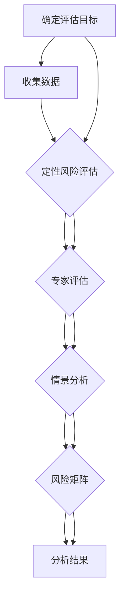

                 

### 让我们一步步思考：塞思卡拉曼的投资风险评估

**背景介绍**

投资风险评估是投资决策过程中至关重要的一环。它涉及到对投资项目的潜在风险进行识别、评估和管理的活动，以确保投资决策的科学性和合理性。塞思·卡拉曼（Seth Klarman）是一位著名的价值投资者，他在其著作《安全边际》（The Art of Value Investing）中详细阐述了投资风险评估的重要性及其具体方法。本文将深入探讨卡拉曼的投资风险评估理念，旨在帮助读者理解这一过程并提升自身的投资决策能力。

### **核心概念与联系**

**投资** 是指投资者将资本投入特定资产或项目，以期望在未来获得收益的行为。投资可以是股票、债券、房地产等多种形式。在投资过程中，风险是不可避免的。风险指的是投资价值可能遭受的不利影响，包括价格波动、市场风险、信用风险等。

**风险评估** 是指对投资项目的潜在风险进行识别、评估和管理的过程。风险评估可以采用定量和定性两种方法。定量风险评估通常基于数据和数学模型，如敏感性分析、贝塔值分析等；定性风险评估则侧重于主观判断和经验，如专家评估、情景分析等。

**风险管理的工具** 包括风险矩阵、敏感性分析、蒙特卡罗模拟等。这些工具可以帮助投资者更好地理解和管理投资风险。

为了更清晰地理解这些概念，我们可以通过对比表格和实体关系图来展示它们之间的联系。

### **核心概念对比表**

| 概念 | 定义 |  
| --- | --- |  
| 投资 | 投资是分配资本以获取收益的行为。 |  
| 风险 | 风险是投资过程中可能面临的不确定性损失。 |  
| 风险评估 | 风险评估是评估投资风险的过程。 |

### **投资与风险实体关系图（Mermaid）**

```mermaid
erDiagram
Investment ||--|{ Risk: 评估投资所面临的风险。 }
Investment ||--|{ Risk Assessment: 评估投资风险的过程。 }
Risk Assessment ||--|{ Quantitative Analysis: 定量分析。 }
Risk Assessment ||--|{ Qualitative Analysis: 定性分析。 }
```

通过上述对比表格和实体关系图，我们可以更直观地理解投资、风险和风险评估之间的联系。

### **风险评估方法**

在投资决策过程中，风险评估是至关重要的环节。塞思·卡拉曼提出了一系列风险评估方法，包括定量风险评估和定性风险评估。以下我们将详细探讨这些方法。

#### **定量风险评估**

**定量风险评估** 是指通过数学模型和数据分析来评估投资风险。以下是几种常见的定量风险评估方法：

##### **敏感性分析**

敏感性分析是评估投资项目的不同因素对结果影响程度的方法。通过改变一个或多个变量，我们可以观察到投资回报的变化情况。敏感性分析有助于投资者识别关键影响因素，从而做出更加明智的决策。

##### **贝塔值分析**

贝塔值（Beta）是衡量股票价格波动与市场整体波动关系的指标。通过计算贝塔值，投资者可以评估特定股票的系统性风险。贝塔值越高，股票的波动性越大，风险也越高。

##### **基本面分析**

基本面分析是通过分析公司的财务报表、行业趋势和宏观经济指标来评估投资价值的方法。这种方法侧重于公司内在价值的评估，有助于投资者发现被市场低估的优质股票。

#### **定性风险评估**

**定性风险评估** 是指通过主观判断和经验来评估投资风险。以下是几种常见的定性风险评估方法：

##### **专家评估**

专家评估是指邀请行业专家或金融机构的专业人员对投资项目进行风险评估。这种方法依赖于专家的经验和专业知识，有助于识别潜在风险。

##### **情景分析**

情景分析是通过构建不同的市场情景来评估投资项目的风险。通过模拟不同市场情况下的投资回报，投资者可以更全面地了解项目的风险状况。

##### **风险矩阵**

风险矩阵是一种用于评估和分类风险的方法。通过将风险因素分为不同的等级，投资者可以更好地理解和控制风险。

### **风险评估流程图（Mermaid）**

以下是定量风险评估和定性风险评估的流程图：



通过上述流程图，我们可以更清晰地了解风险评估的各个步骤。

### **风险管理工具**

在投资风险评估过程中，一些常见的风险管理工具可以帮助投资者更好地理解和控制风险。以下是几种常用的风险管理工具：

#### **风险矩阵**

**风险矩阵** 是一种用于评估和分类风险的方法。它通常包含风险的概率和影响两个维度。通过将风险因素分为不同的等级，投资者可以更清晰地了解风险状况，并采取相应的管理措施。

#### **敏感性分析**

**敏感性分析** 是一种通过改变变量来评估投资回报变化的方法。通过敏感性分析，投资者可以识别关键影响因素，并采取相应的措施来降低风险。

#### **蒙特卡罗模拟**

**蒙特卡罗模拟** 是一种基于概率统计的模拟方法。通过模拟大量随机样本，投资者可以预测投资回报的分布，并评估不同风险水平下的投资表现。

### **Python代码示例**

以下是一个使用蒙特卡罗模拟的Python代码示例：

```python
import numpy as np

# 设置参数
num_simulations = 1000
mean = 0
std_dev = 1

# 进行模拟
results = np.random.normal(mean, std_dev, num_simulations)

# 分析结果
print("均值：", np.mean(results))
print("标准差：", np.std(results))
```

通过上述代码，我们可以模拟投资回报的分布，并分析其均值和标准差。

### **实际案例**

为了更好地理解投资风险评估的方法和工具，以下我们将通过一个实际案例来展示如何应用这些方法。

#### **案例介绍**

假设我们正在考虑投资一家制药公司。我们需要对该公司的投资风险进行评估，以确定是否值得投资。

#### **风险评估过程**

1. **确定评估目标**：我们需要评估该公司的投资风险，包括市场风险、信用风险和技术风险等。

2. **收集数据**：我们收集了该公司的财务报表、行业趋势和市场竞争状况等数据。

3. **定量风险评估**：我们使用敏感性分析和贝塔值分析来评估市场风险。通过分析公司的财务报表，我们计算出该公司的贝塔值，并将其与市场整体贝塔值进行比较。

4. **定性风险评估**：我们邀请行业专家对公司的技术风险和信用风险进行评估。通过专家的意见，我们了解到公司面临的一些潜在风险。

5. **结果分析**：通过定量和定性风险评估，我们发现该公司的投资风险较高。然而，考虑到该公司在制药领域的潜力和竞争优势，我们认为投资该公司的风险是可控的。

6. **制定决策**：基于风险评估结果，我们决定对该公司进行投资。

#### **结果分析**

通过对该公司的投资风险评估，我们了解到市场风险和技术风险较高，但信用风险较低。这有助于我们制定投资策略，并降低投资风险。

#### **小结与启示**

通过实际案例，我们可以看到投资风险评估在投资决策中的重要性。通过合理的风险评估，投资者可以更好地理解投资风险，并制定相应的投资策略。

### **最佳实践**

在进行投资风险评估时，以下是一些最佳实践：

1. **全面收集数据**：确保收集到充分且准确的数据，以便进行准确的风险评估。

2. **定量与定性结合**：综合考虑定量和定性风险评估方法，以获得更全面的风险评估结果。

3. **定期更新评估**：投资风险是动态变化的，定期更新风险评估，以适应市场变化。

4. **制定风险应对策略**：在评估过程中，制定相应的风险应对策略，以降低投资风险。

5. **注重风险管理工具的应用**：熟练使用风险管理工具，如风险矩阵、敏感性分析和蒙特卡罗模拟等，以提升风险评估的准确性和效率。

### **总结与拓展**

本文详细探讨了塞思·卡拉曼的投资风险评估理念，包括定量和定性风险评估方法以及风险管理工具。通过实际案例，我们展示了如何应用这些方法和工具进行投资风险评估。最后，我们总结了最佳实践，并提供了一些拓展阅读资源，以帮助读者进一步了解投资风险评估的相关知识。

### **拓展阅读资源**

- 《安全边际》：塞思·卡拉曼的著作，详细阐述了价值投资的理念和方法。
- 《投资最重要的事》：霍华德·马克斯的著作，提供了投资决策中的思维框架和风险控制策略。

---

作者：AI天才研究院/AI Genius Institute & 禅与计算机程序设计艺术 /Zen And The Art of Computer Programming

---

通过本文，我们希望读者能够深入理解投资风险评估的重要性，并在实际投资中运用这些方法，提高投资决策的科学性和准确性。投资是一项复杂的过程，理解和管理风险是成功投资的关键。希望本文能对读者有所帮助。

