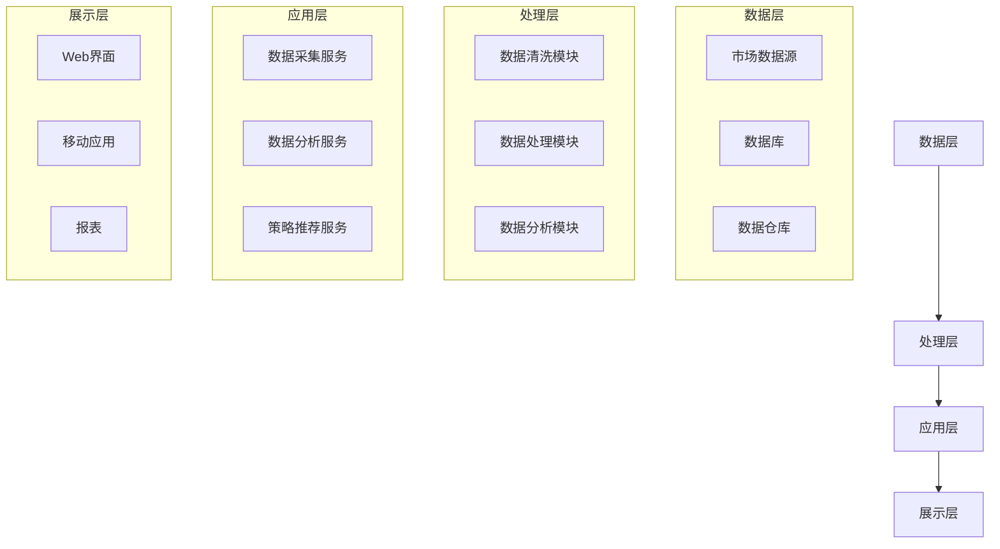
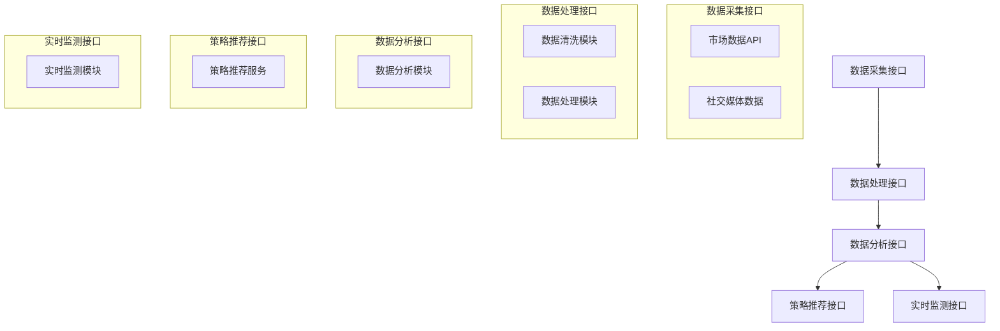
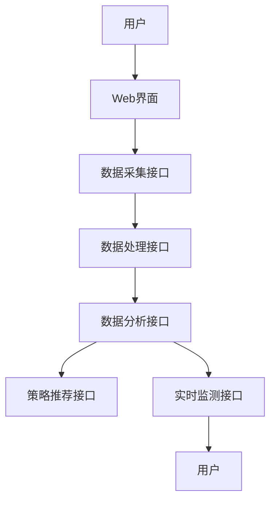
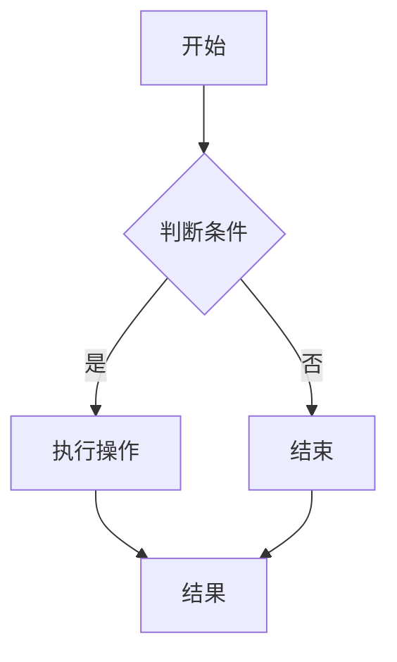
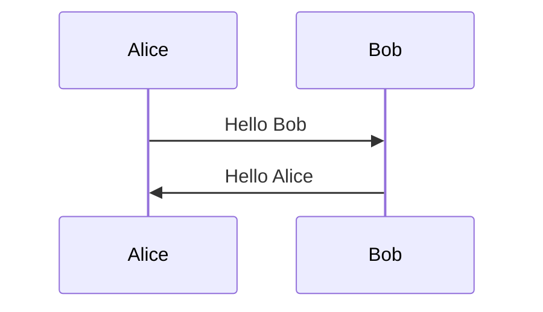

                 


### 引言

#### 文章标题

多智能体AI如何实现动态竞争格局评估

#### 关键词

多智能体AI、动态竞争格局评估、智能体设计、算法原理、系统架构

#### 摘要

本文将深入探讨多智能体AI在动态竞争格局评估中的应用。通过逐步分析智能体设计、算法原理和系统架构，我们将展示如何利用多智能体AI实现动态竞争格局评估，并提供实际案例以供参考。读者将了解核心概念、应用方法以及未来发展趋势。

----------------------------------------------------------------

# 第一部分: 引言

## 第1章: 多智能体AI与动态竞争格局评估概述

### 1.1 多智能体AI基础

#### 背景介绍

多智能体AI是指由多个智能体组成的系统，这些智能体可以独立决策并协同工作，以实现特定目标。每个智能体都是自主的，它们可以通过通信和协作来解决问题，同时保持系统的整体效率。多智能体系统（MAS）在众多领域中显示出巨大的潜力，包括但不限于智能交通、供应链管理、金融市场分析等。

#### 问题背景

随着全球经济的快速发展和市场竞争的日益激烈，企业和管理者需要实时了解市场动态，评估竞争对手的优势和劣势，以便做出明智的决策。传统的竞争格局评估方法往往依赖于静态数据和单一的视角，无法全面反映市场的动态变化。因此，探索一种动态竞争格局评估方法成为了迫切的需求。

#### 问题描述

动态竞争格局评估旨在通过实时监测和预测市场变化，评估企业在竞争环境中的地位和策略效果。该方法需要考虑多个因素，如市场趋势、竞争对手的行为、消费者需求等，以及它们之间的复杂互动关系。如何有效地实现动态竞争格局评估是一个重要的研究课题。

#### 问题解决

多智能体AI作为一种新兴技术，为动态竞争格局评估提供了一种可行的解决方案。通过模拟市场中的各个智能体，并分析它们之间的互动，多智能体AI可以实时评估竞争格局，为企业提供决策支持。

#### 边界与外延

动态竞争格局评估不仅涉及市场分析和预测，还包括企业内部战略的评估。因此，多智能体AI的应用范围可以扩展到企业战略规划和风险管理等领域。

#### 概念结构与核心要素组成

- **多智能体AI**：由多个智能体组成的系统，具备自主决策和协同能力。
- **动态竞争格局评估**：实时监测和预测市场变化，评估企业在竞争环境中的地位和策略效果。
- **智能体**：独立决策的实体，通过通信和协作解决问题。

### 1.2 动态竞争格局评估的概念与意义

#### 背景介绍

动态竞争格局评估是一种基于多智能体AI的方法，通过实时监测和预测市场变化，评估企业在竞争环境中的地位和策略效果。它涉及多个因素的考虑，包括市场趋势、竞争对手的行为、消费者需求等，以及它们之间的复杂互动关系。

#### 问题背景

传统的竞争格局评估方法通常依赖于静态数据和单一的视角，无法全面反映市场的动态变化。而动态竞争格局评估方法则能够实时监测市场变化，为企业提供更准确和及时的信息支持。

#### 问题描述

动态竞争格局评估的主要问题是如何有效地监测和预测市场变化，并评估企业在竞争环境中的地位和策略效果。这需要考虑多个因素，如市场趋势、竞争对手的行为、消费者需求等，以及它们之间的复杂互动关系。

#### 问题解决

多智能体AI为动态竞争格局评估提供了一种有效的解决方案。通过模拟市场中的各个智能体，并分析它们之间的互动，多智能体AI可以实时评估竞争格局，为企业提供决策支持。

#### 边界与外延

动态竞争格局评估不仅涉及市场分析和预测，还包括企业内部战略的评估。因此，多智能体AI的应用范围可以扩展到企业战略规划和风险管理等领域。

#### 概念结构与核心要素组成

- **市场趋势**：描述市场随时间变化的趋势。
- **竞争对手行为**：分析竞争对手的市场行为和策略。
- **消费者需求**：了解消费者的购买行为和偏好。
- **复杂互动关系**：考虑不同因素之间的相互影响和作用。

### 1.3 本书结构安排与目标

#### 背景介绍

本书旨在深入探讨多智能体AI在动态竞争格局评估中的应用，提供系统、全面的理论和实践指导。为了实现这一目标，本书将按照以下结构安排展开：

#### 问题背景

本书的结构旨在逐步引导读者了解多智能体AI和动态竞争格局评估的基本概念、理论和实践方法，最终实现全面理解和掌握。

#### 问题描述

本书分为以下几个部分：

1. **引言部分**：介绍多智能体AI和动态竞争格局评估的基本概念和背景。
2. **基本理论部分**：阐述多智能体系统理论和动态竞争格局评估的理论基础。
3. **智能体设计与实现部分**：详细讨论智能体的设计原则和实现方法。
4. **算法与实现部分**：介绍用于动态竞争格局评估的算法和技术。
5. **案例研究部分**：通过实际案例展示多智能体AI在动态竞争格局评估中的应用。
6. **总结与展望部分**：总结全书的主要结论，并展望未来研究的方向。

#### 问题解决

通过上述结构的安排，本书将逐步引导读者从基础理论到实践应用，全面了解多智能体AI在动态竞争格局评估中的应用。

#### 边界与外延

本书主要关注多智能体AI在动态竞争格局评估中的应用，但不局限于该领域。读者还可以将所学知识应用于其他相关领域，如智能交通、供应链管理等。

#### 概念结构与核心要素组成

- **引言部分**：介绍多智能体AI和动态竞争格局评估的基本概念。
- **基本理论部分**：阐述多智能体系统理论和动态竞争格局评估的理论基础。
- **智能体设计与实现部分**：详细讨论智能体的设计原则和实现方法。
- **算法与实现部分**：介绍用于动态竞争格局评估的算法和技术。
- **案例研究部分**：通过实际案例展示多智能体AI在动态竞争格局评估中的应用。
- **总结与展望部分**：总结全书的主要结论，并展望未来研究的方向。

### 1.4 小结

通过本文的引言部分，我们介绍了多智能体AI和动态竞争格局评估的基本概念和背景。动态竞争格局评估是一个重要的研究领域，能够帮助企业更好地理解和应对市场变化。多智能体AI作为一种新兴技术，为动态竞争格局评估提供了一种有效的解决方案。本文将逐步探讨多智能体AI在动态竞争格局评估中的应用，包括智能体设计、算法实现和实际案例等。希望读者能够通过本文对多智能体AI和动态竞争格局评估有一个全面和深入的了解。

----------------------------------------------------------------

## 第2章: 多智能体系统理论

### 2.1 多智能体系统的基本概念

#### 背景介绍

多智能体系统（Multi-Agent Systems，MAS）是人工智能领域的一个重要研究方向，它模拟多个智能体的交互和协作，以实现复杂任务和目标。在多智能体系统中，每个智能体都是自主的，具有独立决策能力，同时与其他智能体进行通信和协作。这种分布式计算和协同工作模式使得多智能体系统能够更好地应对复杂动态环境。

#### 问题背景

在现实世界中，许多问题都涉及到多个实体之间的交互和协作，如智能交通系统、供应链管理、金融交易等。传统的集中式系统在处理这些问题时往往面临复杂性和实时性挑战，而多智能体系统通过分布式计算和协同工作，能够提供更高效和灵活的解决方案。

#### 问题描述

多智能体系统由多个智能体组成，每个智能体具有以下特征：

1. **自主性**：智能体能够独立做出决策，不受其他智能体直接控制。
2. **分布性**：智能体分布在不同的位置，通过通信网络进行交互。
3. **协同性**：智能体之间需要通过协作实现共同目标。

#### 问题解决

多智能体系统通过智能体的自主性、分布性和协同性，能够实现复杂任务的自动化和智能化。以下是一些常见的问题解决方法：

1. **协同搜索和救援**：在搜索和救援任务中，多个智能体可以协同工作，提高任务效率和成功率。
2. **智能交通控制**：通过多个智能体的协作，可以实现交通流量优化、事故预防等目标。
3. **供应链管理**：智能体可以协同工作，实现供应链的优化和效率提升。

#### 边界与外延

多智能体系统不仅应用于人工智能领域，还广泛应用于其他学科和领域，如生物学、经济学、社会学等。不同领域对多智能体系统的需求和实现方法也有所不同，因此需要结合具体应用场景进行研究和设计。

#### 概念结构与核心要素组成

- **智能体**：独立决策的实体，具有自主性、分布性和协同性。
- **多智能体系统**：由多个智能体组成的系统，通过通信和协作实现共同目标。
- **自主性**：智能体独立做出决策。
- **分布性**：智能体分布在不同的位置。
- **协同性**：智能体之间通过协作实现共同目标。

### 2.2 多智能体系统的建模方法

#### 背景介绍

在多智能体系统中，建模是理解、分析和设计系统的基础。建模方法可以帮助我们抽象和描述多智能体系统的结构和行为，以便更好地理解和预测系统的性能。常见的建模方法包括基于状态机的方法、基于约束的方法、基于行为树的方法等。

#### 问题背景

多智能体系统的复杂性和动态性使得传统的建模方法难以满足需求。为了更好地模拟和预测多智能体系统的行为，需要采用更灵活和高效的建模方法。

#### 问题描述

多智能体系统的建模方法需要满足以下要求：

1. **准确性**：能够准确描述智能体的行为和系统的整体行为。
2. **灵活性**：能够适应不同的应用场景和需求。
3. **可扩展性**：能够支持系统的扩展和演化。

#### 问题解决

以下是几种常见的多智能体系统建模方法：

1. **基于状态机的方法**：通过状态机描述智能体的行为，可以清晰地表示智能体的状态转移和决策过程。
2. **基于约束的方法**：通过定义约束条件，限制智能体的行为和系统的整体行为，可以有效地约束系统的复杂度。
3. **基于行为树的方法**：通过行为树描述智能体的行为，可以清晰地表示智能体的行为序列和决策过程。

#### 边界与外延

不同的建模方法适用于不同的应用场景和需求。在实际应用中，需要根据具体问题选择合适的建模方法。

#### 概念结构与核心要素组成

- **状态机建模**：通过状态转移图描述智能体的行为。
- **约束建模**：通过定义约束条件限制智能体的行为。
- **行为树建模**：通过行为树描述智能体的行为序列。

### 2.3 多智能体系统的协同与通信

#### 背景介绍

在多智能体系统中，协同与通信是智能体之间实现共同目标的关键。协同是指智能体之间的合作和协作，以实现整体目标；通信是指智能体之间通过发送和接收信息来传递信息。有效的协同与通信机制是保证多智能体系统性能的关键。

#### 问题背景

多智能体系统的复杂性和动态性使得协同与通信机制的设计至关重要。不同的协同与通信机制适用于不同的应用场景和需求。

#### 问题描述

多智能体系统的协同与通信机制需要满足以下要求：

1. **可靠性**：保证信息传输的准确性和完整性。
2. **实时性**：保证信息传输的实时性和快速响应。
3. **灵活性**：适应不同的应用场景和需求。

#### 问题解决

以下是几种常见的多智能体系统协同与通信机制：

1. **集中式协同与通信**：通过中央控制单元协调智能体的行为和通信，适用于规模较小、结构相对稳定的多智能体系统。
2. **分布式协同与通信**：通过智能体之间的直接通信和协作，适用于规模较大、结构复杂的多智能体系统。
3. **协商式协同与通信**：通过协商机制协调智能体的行为和通信，适用于存在冲突和竞争的多智能体系统。

#### 边界与外延

不同的协同与通信机制适用于不同的应用场景和需求。在实际应用中，需要根据具体问题选择合适的协同与通信机制。

#### 概念结构与核心要素组成

- **集中式协同与通信**：通过中央控制单元协调智能体的行为和通信。
- **分布式协同与通信**：通过智能体之间的直接通信和协作。
- **协商式协同与通信**：通过协商机制协调智能体的行为和通信。

### 2.4 多智能体系统的适应性与演化

#### 背景介绍

多智能体系统的适应性和演化能力是其在复杂动态环境中生存和发展的关键。适应性是指智能体在面临环境变化时能够调整自身行为以适应新环境；演化是指智能体通过遗传和变异等机制不断进化，以适应更复杂的环境。

#### 问题背景

现实世界中的环境是复杂和多变的，智能体需要具备适应性和演化能力，以应对环境变化和挑战。

#### 问题描述

多智能体系统的适应性与演化能力需要满足以下要求：

1. **适应性**：智能体能够快速适应环境变化，调整自身行为。
2. **演化能力**：智能体能够通过遗传和变异等机制不断进化，提高适应性和生存能力。

#### 问题解决

以下是几种常见的多智能体系统适应性与演化方法：

1. **基于遗传算法的演化**：通过遗传算法，智能体可以不断进化，提高适应性和生存能力。
2. **基于行为树的演化**：通过行为树的变异和进化，智能体可以适应更复杂的环境。
3. **基于协同学习的演化**：通过智能体之间的协同学习，实现共同进化，提高整体适应性和演化能力。

#### 边界与外延

不同的适应性与演化方法适用于不同的应用场景和需求。在实际应用中，需要根据具体问题选择合适的方法。

#### 概念结构与核心要素组成

- **适应性**：智能体能够快速适应环境变化。
- **演化能力**：智能体通过遗传和变异等机制不断进化。
- **遗传算法**：基于遗传算法的智能体演化方法。
- **行为树演化**：基于行为树的智能体演化方法。
- **协同学习**：基于协同学习的智能体演化方法。

### 2.5 小结

通过本章的讨论，我们了解了多智能体系统的基本概念、建模方法、协同与通信机制、适应性与演化能力。多智能体系统作为一种分布式计算和协同工作的系统，具有广泛的应用前景。在动态竞争格局评估中，多智能体系统可以模拟市场中的各个实体，分析它们之间的互动关系，为企业提供决策支持。下一章我们将继续探讨动态竞争格局评估的理论和方法。

----------------------------------------------------------------

## 第3章: 动态竞争格局评估理论

### 3.1 竞争格局评估的基本概念

#### 背景介绍

竞争格局评估是指对市场中的企业竞争态势进行系统分析和评价的过程。它涉及对市场结构、竞争者行为、消费者需求等多方面因素的分析。竞争格局评估的目的在于帮助企业了解自身在市场中的位置，发现竞争对手的优势和劣势，制定有效的竞争策略。

#### 问题背景

在高度竞争的市场环境中，企业需要不断调整战略以适应市场变化。传统的竞争格局评估方法通常基于历史数据和静态分析，难以及时反映市场的动态变化。因此，探索一种能够实时监测和预测市场动态的竞争格局评估方法具有重要意义。

#### 问题描述

竞争格局评估的基本概念包括以下几个方面：

1. **市场结构**：市场中的企业数量、市场份额、市场进入与退出壁垒等。
2. **竞争者行为**：竞争对手的市场行为、策略和反应。
3. **消费者需求**：消费者的购买行为、偏好和需求变化。
4. **竞争态势**：企业在市场中的竞争地位和关系。

#### 问题解决

动态竞争格局评估旨在通过实时监测和预测市场变化，全面评估企业在竞争环境中的地位和策略效果。以下是一些常见的解决方法：

1. **大数据分析**：利用大数据技术，收集和分析市场相关数据，实时监测市场动态。
2. **机器学习算法**：通过机器学习算法，预测市场趋势和消费者行为，评估企业竞争力。
3. **多智能体模拟**：通过多智能体模拟，分析企业之间的互动关系，预测市场变化。

#### 边界与外延

竞争格局评估不仅涉及市场分析和预测，还包括企业内部战略的评估。因此，多智能体AI的应用范围可以扩展到企业战略规划和风险管理等领域。

#### 概念结构与核心要素组成

- **市场结构**：企业数量、市场份额、市场进入与退出壁垒等。
- **竞争者行为**：竞争对手的市场行为、策略和反应。
- **消费者需求**：消费者的购买行为、偏好和需求变化。
- **竞争态势**：企业在市场中的竞争地位和关系。
- **动态竞争格局评估**：实时监测和预测市场变化，评估企业在竞争环境中的地位和策略效果。

### 3.2 动态竞争格局评估的方法

#### 背景介绍

动态竞争格局评估方法是指用于实时监测和预测市场动态，评估企业在竞争环境中地位和策略效果的方法。这些方法通常涉及大数据分析、机器学习、多智能体模拟等多种技术手段。动态竞争格局评估方法的选取取决于具体应用场景和需求。

#### 问题背景

随着市场环境的变化和竞争的加剧，企业需要实时了解市场动态，调整策略以保持竞争力。传统的评估方法难以满足这一需求，因此需要探索更有效的动态评估方法。

#### 问题描述

动态竞争格局评估的方法主要包括以下几个方面：

1. **大数据分析**：通过收集和分析大量市场数据，识别市场趋势和变化。
2. **机器学习算法**：利用机器学习算法，预测市场趋势和消费者行为。
3. **多智能体模拟**：通过模拟市场中的各个智能体，分析企业之间的互动关系。
4. **动态博弈论**：应用动态博弈论方法，分析企业在竞争环境中的策略和反应。

#### 问题解决

以下是几种常见的动态竞争格局评估方法：

1. **大数据分析**：利用大数据技术，收集和分析市场相关数据，实时监测市场动态。
2. **机器学习算法**：通过机器学习算法，预测市场趋势和消费者行为，评估企业竞争力。
3. **多智能体模拟**：通过多智能体模拟，分析企业之间的互动关系，预测市场变化。
4. **动态博弈论**：应用动态博弈论方法，分析企业在竞争环境中的策略和反应。

#### 边界与外延

不同的动态竞争格局评估方法适用于不同的应用场景和需求。在实际应用中，需要根据具体问题选择合适的方法。

#### 概念结构与核心要素组成

- **大数据分析**：收集和分析大量市场数据。
- **机器学习算法**：预测市场趋势和消费者行为。
- **多智能体模拟**：分析企业之间的互动关系。
- **动态博弈论**：分析企业在竞争环境中的策略和反应。

### 3.3 竞争格局评估的指标体系

#### 背景介绍

竞争格局评估的指标体系是指用于衡量和评价企业在竞争环境中的地位和策略效果的指标体系。这些指标可以从多个维度反映企业的竞争力和市场地位。建立科学的竞争格局评估指标体系对于企业战略规划和决策具有重要意义。

#### 问题背景

在竞争激烈的市场环境中，企业需要建立一套全面的竞争格局评估指标体系，以准确衡量和评价自身的竞争力和市场地位。

#### 问题描述

竞争格局评估的指标体系应包括以下几个方面：

1. **市场份额**：企业在市场中所占的比重。
2. **品牌影响力**：企业在消费者心目中的认知和口碑。
3. **产品竞争力**：产品的质量、性能和价格。
4. **技术创新能力**：企业在技术创新方面的实力和成果。
5. **市场响应速度**：企业对市场变化的敏感度和反应速度。

#### 问题解决

以下是几种常见的竞争格局评估指标体系：

1. **市场份额评估**：通过计算企业在市场中所占的比重，衡量市场份额。
2. **品牌影响力评估**：通过消费者调查和口碑分析，评估企业在消费者心目中的认知和口碑。
3. **产品竞争力评估**：通过产品质量、性能和价格等指标，评估产品的竞争力。
4. **技术创新能力评估**：通过技术创新成果和专利数量，评估企业的技术创新能力。
5. **市场响应速度评估**：通过市场调查和数据分析，评估企业对市场变化的敏感度和反应速度。

#### 边界与外延

不同的竞争格局评估指标体系适用于不同的行业和企业类型。在实际应用中，需要根据具体行业和企业特点，选择合适的指标体系。

#### 概念结构与核心要素组成

- **市场份额**：企业在市场中所占的比重。
- **品牌影响力**：企业在消费者心目中的认知和口碑。
- **产品竞争力**：产品的质量、性能和价格。
- **技术创新能力**：企业在技术创新方面的实力和成果。
- **市场响应速度**：企业对市场变化的敏感度和反应速度。
- **竞争格局评估指标体系**：用于衡量和评价企业在竞争环境中的地位和策略效果。

### 3.4 竞争格局评估的挑战与趋势

#### 背景介绍

竞争格局评估在理论和实践中面临着诸多挑战。随着市场环境的变化和技术的进步，竞争格局评估方法也在不断发展和完善。了解这些挑战和趋势有助于我们更好地应对竞争格局评估中的问题。

#### 问题背景

竞争格局评估需要应对的挑战包括数据质量、算法选择、模型解释性等方面。同时，随着市场环境的变化和技术的进步，竞争格局评估方法也在不断发展和完善。

#### 问题描述

竞争格局评估面临的挑战主要包括以下几个方面：

1. **数据质量问题**：市场数据的质量直接影响评估结果的准确性。
2. **算法选择问题**：不同的算法适用于不同的场景，选择合适的算法是关键。
3. **模型解释性问题**：复杂的模型往往难以解释，影响决策者的理解和信任。
4. **实时性问题**：动态竞争格局评估要求快速响应，实时性问题需要解决。

#### 问题解决

以下是应对竞争格局评估挑战的一些方法：

1. **数据质量管理**：通过数据清洗、数据整合等方法，提高数据质量。
2. **算法选择策略**：根据具体应用场景，选择合适的算法。
3. **模型解释方法**：采用可视化、解释性算法等方法，提高模型的可解释性。
4. **实时数据处理**：利用大数据技术和分布式计算，实现实时数据处理和评估。

#### 边界与外延

不同的挑战适用于不同的应用场景和需求。在实际应用中，需要根据具体问题选择合适的解决方法。

#### 概念结构与核心要素组成

- **数据质量问题**：影响评估结果的准确性。
- **算法选择问题**：适用于不同的场景。
- **模型解释性问题**：影响决策者的理解和信任。
- **实时性问题**：实现快速响应。

### 3.5 小结

通过本章的讨论，我们了解了竞争格局评估的基本概念、方法、指标体系以及面临的挑战和趋势。动态竞争格局评估是一种重要的方法，能够帮助企业实时监测和预测市场变化，评估竞争态势。在下一章中，我们将探讨如何利用多智能体AI实现动态竞争格局评估。

----------------------------------------------------------------

## 第4章: 智能体设计与实现

### 4.1 智能体的设计原则

#### 背景介绍

智能体的设计原则是指在进行智能体设计时需要遵循的一些基本原则，以确保智能体的自主性、协同性和适应性。智能体的设计原则对于实现有效的多智能体系统至关重要。

#### 问题背景

随着多智能体系统的广泛应用，如何设计高效、可靠的智能体成为了研究者和开发者面临的重要问题。遵循良好的设计原则能够提高智能体的性能和系统的整体效率。

#### 问题描述

智能体的设计原则主要包括以下几个方面：

1. **自主性**：智能体应具备独立的决策能力，能够根据环境和目标自主调整行为。
2. **协同性**：智能体之间需要建立有效的协作机制，以实现共同目标。
3. **适应性**：智能体应具备适应环境变化的能力，能够在动态环境中保持性能。

#### 问题解决

以下是几种常见的智能体设计原则：

1. **自主性原则**：通过赋予智能体自主决策的能力，使其能够独立处理问题。
2. **协同性原则**：通过设计合理的协作机制，促进智能体之间的信息共享和资源优化。
3. **适应性原则**：通过引入适应性和学习机制，使智能体能够根据环境变化调整自身行为。

#### 边界与外延

不同的应用场景和需求可能需要不同的智能体设计原则。在实际设计中，需要根据具体问题选择合适的原则。

#### 概念结构与核心要素组成

- **自主性**：智能体具备独立决策的能力。
- **协同性**：智能体之间建立有效的协作机制。
- **适应性**：智能体能够适应环境变化。

### 4.2 智能体的行为模型

#### 背景介绍

智能体的行为模型是指描述智能体行为和决策过程的数学模型。通过行为模型，我们可以理解智能体在不同环境下的行为特点，并设计相应的控制系统。智能体的行为模型对于实现高效、可靠的多智能体系统具有重要意义。

#### 问题背景

在多智能体系统中，智能体的行为模型直接影响系统的性能和效率。设计合理的行为模型能够提高智能体的自主性和协同性。

#### 问题描述

智能体的行为模型主要包括以下几个方面：

1. **状态感知**：智能体需要能够感知环境状态，并据此做出决策。
2. **决策过程**：智能体根据感知到的状态，通过决策过程确定行动策略。
3. **行为执行**：智能体根据决策结果执行相应行为。

#### 问题解决

以下是几种常见的智能体行为模型：

1. **基于规则的模型**：通过定义一系列规则，描述智能体的决策过程。
2. **基于模型的模型**：通过建立数学模型，描述智能体的行为和决策过程。
3. **基于学习模型的模型**：通过机器学习算法，学习智能体的行为模式，实现自适应决策。

#### 边界与外延

不同的行为模型适用于不同的应用场景和需求。在实际设计中，需要根据具体问题选择合适的行为模型。

#### 概念结构与核心要素组成

- **状态感知**：智能体感知环境状态。
- **决策过程**：智能体根据感知到的状态做出决策。
- **行为执行**：智能体根据决策结果执行行为。

### 4.3 智能体的学习与适应

#### 背景介绍

智能体的学习与适应是指智能体通过不断学习和调整，以适应环境变化和实现任务目标的过程。学习与适应能力是智能体自主性和适应性的重要组成部分，对于多智能体系统的稳定性和效率具有重要意义。

#### 问题背景

在复杂动态环境中，智能体需要具备学习和适应能力，以应对环境变化和不确定性。学习与适应能力是智能体自主性的关键要素。

#### 问题描述

智能体的学习与适应能力主要包括以下几个方面：

1. **感知学习**：智能体通过感知环境信息，学习环境状态和规律。
2. **行为调整**：智能体根据学习到的信息，调整自身行为以适应环境变化。
3. **策略优化**：智能体通过不断优化策略，提高任务执行效率和性能。

#### 问题解决

以下是几种常见的智能体学习与适应方法：

1. **监督学习**：通过已知的输入输出数据，训练智能体模型，实现感知学习和行为调整。
2. **强化学习**：通过奖励和惩罚机制，引导智能体不断优化策略。
3. **遗传算法**：通过遗传和变异操作，优化智能体的策略和模型。

#### 边界与外延

不同的学习与适应方法适用于不同的应用场景和需求。在实际应用中，需要根据具体问题选择合适的方法。

#### 概念结构与核心要素组成

- **感知学习**：智能体通过感知环境信息学习。
- **行为调整**：智能体根据学习到的信息调整行为。
- **策略优化**：智能体通过不断优化策略提高性能。

### 4.4 智能体的协同策略

#### 背景介绍

智能体的协同策略是指智能体之间通过通信和协作，实现共同目标的方法。协同策略是提高多智能体系统效率和性能的关键，对于实现复杂任务和目标具有重要意义。

#### 问题背景

在多智能体系统中，智能体之间需要通过协同策略，共同完成任务。协同策略的设计和实现对于系统的稳定性和效率具有重要影响。

#### 问题描述

智能体的协同策略主要包括以下几个方面：

1. **信息共享**：智能体之间通过通信共享信息，提高决策的准确性。
2. **任务分配**：智能体之间根据能力和任务需求，合理分配任务。
3. **协作机制**：智能体之间建立协作机制，实现任务协同和资源共享。

#### 问题解决

以下是几种常见的智能体协同策略：

1. **集中式协同策略**：通过中央控制单元，协调智能体的行为和决策。
2. **分布式协同策略**：智能体之间直接进行通信和协作，实现任务分配和资源优化。
3. **协商式协同策略**：智能体之间通过协商和谈判，达成共识，实现协同决策。

#### 边界与外延

不同的协同策略适用于不同的应用场景和需求。在实际设计中，需要根据具体问题选择合适的协同策略。

#### 概念结构与核心要素组成

- **信息共享**：智能体之间通过通信共享信息。
- **任务分配**：智能体之间根据能力和任务需求合理分配任务。
- **协作机制**：智能体之间建立协作机制，实现任务协同和资源共享。
- **集中式协同策略**：通过中央控制单元协调智能体的行为和决策。
- **分布式协同策略**：智能体之间直接进行通信和协作。
- **协商式协同策略**：智能体之间通过协商和谈判实现协同决策。

### 4.5 小结

通过本章的讨论，我们了解了智能体的设计原则、行为模型、学习与适应、协同策略等内容。智能体的设计原则确保了智能体的自主性、协同性和适应性；行为模型描述了智能体的决策过程；学习与适应能力使智能体能够适应环境变化；协同策略实现了智能体之间的有效协作。在下一章中，我们将探讨如何实现多智能体系统的动态竞争格局评估。

----------------------------------------------------------------

## 第5章: 算法与实现

### 5.1 动态竞争格局评估算法

#### 背景介绍

动态竞争格局评估算法是指用于实时监测和预测市场动态，评估企业在竞争环境中的地位和策略效果的算法。这些算法通常基于机器学习、大数据分析等技术，能够处理大量市场数据，提取关键信息，并进行预测和分析。

#### 问题背景

在竞争激烈的市场环境中，企业需要实时了解市场动态，调整策略以保持竞争力。传统的评估方法难以满足这一需求，因此需要探索更有效的动态评估算法。

#### 问题描述

动态竞争格局评估算法主要包括以下几个步骤：

1. **数据收集**：收集与市场相关的数据，包括市场趋势、竞争对手行为、消费者需求等。
2. **数据处理**：清洗和整理数据，去除噪声和异常值，确保数据质量。
3. **特征提取**：从原始数据中提取关键特征，用于预测和分析。
4. **模型训练**：利用机器学习算法，训练预测模型，用于市场动态预测和竞争态势评估。
5. **结果分析**：分析预测结果，评估企业在竞争环境中的地位和策略效果。

#### 问题解决

以下是几种常见的动态竞争格局评估算法：

1. **时间序列分析**：通过分析市场数据的时间序列，预测市场趋势和消费者行为。
2. **回归分析**：通过建立回归模型，分析市场变量之间的关系，预测竞争态势。
3. **聚类分析**：通过聚类算法，将市场中的企业划分为不同的竞争群体，分析竞争格局。
4. **神经网络**：通过神经网络模型，处理复杂非线性关系，实现市场动态预测。

#### 边界与外延

不同的动态竞争格局评估算法适用于不同的应用场景和需求。在实际应用中，需要根据具体问题选择合适的方法。

#### 概念结构与核心要素组成

- **数据收集**：收集市场相关数据。
- **数据处理**：清洗和整理数据。
- **特征提取**：提取关键特征。
- **模型训练**：训练预测模型。
- **结果分析**：分析预测结果。
- **时间序列分析**：分析市场数据的时间序列。
- **回归分析**：建立回归模型。
- **聚类分析**：划分竞争群体。
- **神经网络**：处理复杂非线性关系。

### 5.2 多智能体系统的实现方法

#### 背景介绍

多智能体系统的实现方法是指将多智能体AI应用于动态竞争格局评估的具体方法。实现方法包括智能体的设计、协作机制、通信协议等，决定了多智能体系统的性能和效率。

#### 问题背景

在动态竞争格局评估中，多智能体系统需要模拟市场中的各个智能体，分析它们之间的互动关系，提供决策支持。实现方法的选择对系统的性能和效果具有重要影响。

#### 问题描述

多智能体系统的实现方法主要包括以下几个方面：

1. **智能体设计**：设计具备自主性、协同性和适应性的智能体。
2. **协作机制**：建立智能体之间的协作机制，实现任务分配和资源共享。
3. **通信协议**：设计智能体之间的通信协议，确保信息传输的可靠性和实时性。
4. **系统架构**：设计多智能体系统的整体架构，包括硬件和软件的配置。

#### 问题解决

以下是几种常见的多智能体系统实现方法：

1. **基于代理的模型**：通过设计不同的代理智能体，实现任务分配和协作。
2. **基于行为的模型**：通过定义智能体的行为规则，实现自主决策和协同工作。
3. **基于网络的模型**：通过设计分布式网络架构，实现智能体之间的通信和协作。

#### 边界与外延

不同的实现方法适用于不同的应用场景和需求。在实际应用中，需要根据具体问题选择合适的实现方法。

#### 概念结构与核心要素组成

- **智能体设计**：设计具备自主性、协同性和适应性的智能体。
- **协作机制**：建立智能体之间的协作机制。
- **通信协议**：设计智能体之间的通信协议。
- **系统架构**：设计多智能体系统的整体架构。
- **基于代理的模型**：通过设计不同的代理智能体实现任务分配和协作。
- **基于行为的模型**：通过定义智能体的行为规则实现自主决策和协同工作。
- **基于网络的模型**：通过设计分布式网络架构实现智能体之间的通信和协作。

### 5.3 多智能体系统的集成与优化

#### 背景介绍

多智能体系统的集成与优化是指将多个智能体系统整合为一个整体，并优化其性能和效率的过程。集成与优化对于实现高效、可靠的多智能体系统至关重要。

#### 问题背景

在复杂应用场景中，可能需要多个智能体系统协同工作，以实现更复杂的任务和目标。集成与优化能够提高系统的整体性能和效率。

#### 问题描述

多智能体系统的集成与优化主要包括以下几个方面：

1. **系统集成**：将多个智能体系统集成为一个整体，确保系统的一致性和协调性。
2. **性能优化**：通过优化算法、架构和资源分配，提高系统的性能和效率。
3. **可靠性提升**：通过设计冗余机制和故障恢复策略，提高系统的可靠性和稳定性。

#### 问题解决

以下是几种常见的多智能体系统集成与优化方法：

1. **模块化集成**：将智能体系统划分为多个模块，实现模块之间的集成和协同工作。
2. **动态资源分配**：根据任务需求和系统状态，动态调整资源分配，提高系统性能。
3. **冗余设计**：设计冗余机制，确保系统在发生故障时能够快速恢复。

#### 边界与外延

不同的集成与优化方法适用于不同的应用场景和需求。在实际应用中，需要根据具体问题选择合适的优化方法。

#### 概念结构与核心要素组成

- **系统集成**：将多个智能体系统集成为一个整体。
- **性能优化**：优化算法、架构和资源分配。
- **可靠性提升**：设计冗余机制和故障恢复策略。
- **模块化集成**：将智能体系统划分为多个模块。
- **动态资源分配**：根据任务需求动态调整资源。
- **冗余设计**：设计冗余机制确保系统可靠性。

### 5.4 小结

通过本章的讨论，我们了解了动态竞争格局评估算法、多智能体系统的实现方法以及集成与优化方法。动态竞争格局评估算法能够实时监测和预测市场动态，评估企业在竞争环境中的地位和策略效果；多智能体系统的实现方法包括智能体设计、协作机制、通信协议和系统架构；集成与优化方法能够提高系统的性能和可靠性。在下一章中，我们将通过实际案例展示多智能体AI在动态竞争格局评估中的应用。

----------------------------------------------------------------

## 第6章: 案例研究

### 6.1 案例一：智能电网中的动态竞争格局评估

#### 背景介绍

智能电网是一种基于现代通信技术和电力电子技术的电网系统，可以实现电能的高效传输和分配。随着可再生能源的广泛应用和电力市场的竞争加剧，智能电网的动态竞争格局评估具有重要意义。

#### 问题背景

智能电网中的企业包括发电企业、输电企业、配电企业和售电企业。这些企业在市场中进行竞争，提供不同的能源服务和解决方案。动态竞争格局评估能够帮助企业了解市场动态，制定有效的竞争策略。

#### 问题描述

智能电网中的动态竞争格局评估需要考虑以下几个关键因素：

1. **可再生能源的使用率**：评估可再生能源在总能源消耗中的比例，以及其对市场竞争力的影响。
2. **电力市场规则**：分析电力市场的规则和政策，了解不同企业在市场中的竞争优势。
3. **消费者需求**：分析消费者的用电习惯和需求变化，以及其对市场竞争的影响。
4. **技术发展**：评估新兴技术在智能电网中的应用，以及其对市场格局的影响。

#### 问题解决

以下是智能电网动态竞争格局评估的具体步骤：

1. **数据收集**：收集与智能电网相关的市场数据，包括可再生能源使用率、电力市场规则、消费者需求和新兴技术应用等。
2. **数据处理**：清洗和整理数据，提取关键特征，为后续分析做准备。
3. **特征提取**：从原始数据中提取关键特征，如可再生能源使用率、市场规则、消费者需求和新兴技术应用等。
4. **模型训练**：利用机器学习算法，训练预测模型，预测未来市场动态和竞争态势。
5. **结果分析**：分析预测结果，评估企业在竞争环境中的地位和策略效果，为决策提供支持。

#### 案例展示

以下是智能电网动态竞争格局评估的示例数据：

- **可再生能源使用率**：50%
- **电力市场规则**：自由竞争
- **消费者需求**：稳定、高效、环保的能源供应
- **新兴技术应用**：智能传感器、区块链技术

根据上述数据，利用机器学习算法进行预测分析，可以得出以下结论：

- **可再生能源使用率**：未来可再生能源使用率将继续增加，市场份额将扩大。
- **电力市场规则**：自由竞争将加剧，企业需要不断提高效率和服务质量。
- **消费者需求**：消费者对环保和高效的能源供应需求日益增长，企业需要提供更多绿色能源解决方案。
- **新兴技术应用**：智能传感器和区块链技术将推动智能电网的发展，提高市场竞争力。

通过动态竞争格局评估，企业可以了解市场动态，调整策略，提高竞争力。

### 6.2 案例二：电子商务市场中的动态竞争格局评估

#### 背景介绍

电子商务市场是数字经济的重要组成部分，随着互联网技术的发展和消费者购物习惯的改变，电子商务市场的竞争日益激烈。动态竞争格局评估对于电商企业制定有效的市场策略具有重要意义。

#### 问题背景

电子商务市场中的企业包括电商平台、卖家和物流公司。这些企业在市场中进行竞争，争夺市场份额和消费者。动态竞争格局评估能够帮助企业了解市场动态，优化运营策略。

#### 问题描述

电子商务市场中的动态竞争格局评估需要考虑以下几个关键因素：

1. **市场份额**：评估不同电商平台和卖家在市场中的地位和市场份额。
2. **消费者行为**：分析消费者的购物习惯和偏好，以及其对市场竞争的影响。
3. **物流效率**：评估不同物流公司的运输效率和成本，以及其对市场竞争的影响。
4. **技术创新**：评估电商平台和卖家在技术创新方面的实力，以及其对市场竞争的影响。

#### 问题解决

以下是电子商务市场动态竞争格局评估的具体步骤：

1. **数据收集**：收集与电子商务市场相关的数据，包括市场份额、消费者行为、物流效率和新兴技术应用等。
2. **数据处理**：清洗和整理数据，提取关键特征，为后续分析做准备。
3. **特征提取**：从原始数据中提取关键特征，如市场份额、消费者行为、物流效率和新兴技术应用等。
4. **模型训练**：利用机器学习算法，训练预测模型，预测未来市场动态和竞争态势。
5. **结果分析**：分析预测结果，评估企业在竞争环境中的地位和策略效果，为决策提供支持。

#### 案例展示

以下是电子商务市场动态竞争格局评估的示例数据：

- **市场份额**：淘宝、天猫、京东位列前三，分别占40%、30%和20%。
- **消费者行为**：消费者更倾向于选择口碑好、价格优惠的商品。
- **物流效率**：顺丰、申通、圆通位列前三，运输效率最高。
- **新兴技术应用**：直播带货、短视频营销逐渐成为主流营销手段。

根据上述数据，利用机器学习算法进行预测分析，可以得出以下结论：

- **市场份额**：未来市场份额将继续集中，中小电商平台面临较大压力。
- **消费者行为**：消费者对口碑和价格敏感，电商平台需要提高服务质量。
- **物流效率**：提高物流效率成为关键，企业需要优化供应链管理。
- **新兴技术应用**：直播带货和短视频营销将继续推动市场发展，企业需要紧跟趋势。

通过动态竞争格局评估，电商企业可以了解市场动态，调整运营策略，提高竞争力。

### 6.3 案例三：金融市场的动态竞争格局评估

#### 背景介绍

金融市场是资本流通和投资交易的重要场所，随着金融市场的不断发展和变化，动态竞争格局评估对于金融机构和企业具有重要意义。

#### 问题背景

金融市场中的企业包括银行、证券公司、基金公司和保险公司等。这些企业在市场中进行竞争，争夺市场份额和客户资源。动态竞争格局评估能够帮助企业了解市场动态，优化投资策略。

#### 问题描述

金融市场中的动态竞争格局评估需要考虑以下几个关键因素：

1. **市场走势**：评估股票、债券、期货等金融市场的走势和趋势。
2. **政策环境**：分析政府政策和宏观经济环境对市场的影响。
3. **投资者行为**：分析投资者的投资偏好和行为习惯，以及其对市场竞争的影响。
4. **技术创新**：评估金融机构在技术创新方面的实力，以及其对市场竞争的影响。

#### 问题解决

以下是金融市场动态竞争格局评估的具体步骤：

1. **数据收集**：收集与金融市场相关的数据，包括市场走势、政策环境、投资者行为和新兴技术应用等。
2. **数据处理**：清洗和整理数据，提取关键特征，为后续分析做准备。
3. **特征提取**：从原始数据中提取关键特征，如市场走势、政策环境、投资者行为和新兴技术应用等。
4. **模型训练**：利用机器学习算法，训练预测模型，预测未来市场动态和竞争态势。
5. **结果分析**：分析预测结果，评估企业在竞争环境中的地位和策略效果，为决策提供支持。

#### 案例展示

以下是金融市场动态竞争格局评估的示例数据：

- **市场走势**：股市处于上涨趋势，债券市场波动较大。
- **政策环境**：政府实施积极的财政政策和货币政策。
- **投资者行为**：投资者对股市和债券市场均有较高的关注。
- **新兴技术应用**：区块链和人工智能技术在金融领域广泛应用。

根据上述数据，利用机器学习算法进行预测分析，可以得出以下结论：

- **市场走势**：未来股市将继续上涨，债券市场波动性可能加大。
- **政策环境**：政府政策将继续支持金融市场发展。
- **投资者行为**：投资者对股市和债券市场的关注程度将影响市场竞争。
- **新兴技术应用**：技术创新将继续推动金融市场的发展，企业需要紧跟趋势。

通过动态竞争格局评估，金融机构可以了解市场动态，调整投资策略，提高竞争力。

### 6.4 小结

通过以上案例研究，我们展示了多智能体AI在动态竞争格局评估中的应用。智能电网、电子商务市场和金融市场是典型的应用场景，通过动态竞争格局评估，企业可以实时了解市场动态，调整策略，提高竞争力。在下一章中，我们将探讨动态竞争格局评估的实际应用，包括系统架构设计、环境安装和核心实现等内容。

----------------------------------------------------------------

## 第7章: 实际应用与系统架构设计

### 7.1 系统功能设计

#### 问题场景介绍

在智能电网、电子商务市场和金融市场等实际应用场景中，动态竞争格局评估系统需要实现以下功能：

1. **市场数据收集与处理**：实时收集与市场相关的数据，如能源使用率、市场份额、消费者行为、政策环境等，并进行数据清洗和整理。
2. **竞争态势分析**：利用机器学习算法和数据分析技术，分析市场动态，预测竞争态势，评估企业在市场中的地位和策略效果。
3. **策略推荐**：根据竞争态势分析结果，为企业提供决策支持，包括市场策略、产品策略、投资策略等。
4. **实时监测与预警**：实时监测市场变化，及时预警潜在的市场风险和机会。

#### 项目介绍

本案例项目是一个基于多智能体AI的动态竞争格局评估系统，旨在为企业提供实时、准确的市场竞争态势分析和决策支持。项目主要涉及以下方面：

- **系统架构设计**：设计高效、可靠的多智能体系统架构，确保系统的性能和稳定性。
- **数据收集与处理**：利用大数据技术和机器学习算法，实现市场数据的实时收集、清洗和整理。
- **竞争态势分析**：利用机器学习算法和数据分析技术，分析市场动态，评估企业在竞争环境中的地位和策略效果。
- **策略推荐**：根据竞争态势分析结果，为企业提供定制化的市场策略、产品策略和投资策略。
- **实时监测与预警**：实现实时监测市场变化，及时预警潜在的市场风险和机会。

### 7.2 系统架构设计

#### 系统架构设计

动态竞争格局评估系统的架构设计包括以下几个方面：

1. **数据层**：负责数据的收集、存储和管理。数据层包括市场数据源、数据库和数据仓库等组成部分。
2. **处理层**：负责数据清洗、处理和分析。处理层包括数据清洗模块、数据处理模块和数据分析模块等。
3. **应用层**：负责提供动态竞争格局评估功能，包括竞争态势分析、策略推荐和实时监测等。应用层包括多个服务模块，如数据采集服务、数据分析服务、策略推荐服务等。
4. **展示层**：负责将分析结果以直观的方式展示给用户。展示层包括Web界面、移动应用和报表等。

#### 系统架构图

以下是动态竞争格局评估系统的架构图：



### 7.3 系统接口设计

#### 系统接口设计

动态竞争格局评估系统需要设计多个接口，以便与其他系统进行数据交换和功能集成。以下是系统接口设计：

1. **数据采集接口**：负责从外部数据源（如市场数据API、社交媒体数据等）收集数据。
2. **数据处理接口**：负责对采集到的数据进行清洗、转换和存储。
3. **数据分析接口**：负责对处理后的数据进行分析，生成竞争态势报告。
4. **策略推荐接口**：负责根据分析结果，为企业提供定制化的市场策略、产品策略和投资策略。
5. **实时监测接口**：负责实时监测市场变化，触发预警和通知。

#### 系统接口图

以下是动态竞争格局评估系统的接口图：



### 7.4 系统交互设计

#### 系统交互设计

动态竞争格局评估系统的交互设计包括用户界面设计、功能模块交互和数据流设计等方面。以下是系统交互设计：

1. **用户界面设计**：设计直观、易用的用户界面，方便用户查看分析结果和策略推荐。
2. **功能模块交互**：设计功能模块之间的交互逻辑，确保系统功能完整、高效。
3. **数据流设计**：设计系统内部的数据流动路径，确保数据在各个模块之间的传递和共享。

#### 系统交互图

以下是动态竞争格局评估系统的交互图：



通过系统交互设计，用户可以通过Web界面访问动态竞争格局评估系统的功能，系统通过接口与数据处理模块、数据分析模块、策略推荐模块和实时监测模块进行交互，实现数据的收集、处理、分析和展示。

### 7.5 小结

通过本章的讨论，我们了解了动态竞争格局评估系统的功能设计、架构设计、接口设计和交互设计等内容。系统功能设计包括市场数据收集与处理、竞争态势分析、策略推荐和实时监测等功能；架构设计包括数据层、处理层、应用层和展示层等组成部分；接口设计包括数据采集接口、数据处理接口、数据分析接口、策略推荐接口和实时监测接口等；交互设计包括用户界面设计、功能模块交互和数据流设计等。在下一章中，我们将通过实际案例展示动态竞争格局评估系统的具体实现和应用。

----------------------------------------------------------------

## 第8章：项目实战

### 8.1 环境安装

要在本地环境中搭建动态竞争格局评估系统，需要安装以下软件和工具：

1. **Python 3.x**：Python是一种流行的编程语言，用于实现系统的核心算法和数据处理。
2. **Jupyter Notebook**：Jupyter Notebook是一种交互式计算环境，用于编写和运行Python代码。
3. **Pandas**：Pandas是一个强大的数据分析和处理库，用于数据处理和分析。
4. **Scikit-learn**：Scikit-learn是一个机器学习库，用于训练预测模型。
5. **Mermaid**：Mermaid是一种基于Markdown的图形和流程图工具，用于绘制系统架构图、接口图和交互图。

安装步骤如下：

1. 安装Python 3.x。可以在Python官方网站下载Python安装包，并按照提示进行安装。
2. 安装Jupyter Notebook。在命令行中运行以下命令：
   ```shell
   pip install notebook
   ```
3. 安装Pandas。在命令行中运行以下命令：
   ```shell
   pip install pandas
   ```
4. 安装Scikit-learn。在命令行中运行以下命令：
   ```shell
   pip install scikit-learn
   ```
5. 安装Mermaid。在命令行中运行以下命令：
   ```shell
   pip install mermaid
   ```

### 8.2 系统核心实现

在本节中，我们将使用Python和Mermaid实现动态竞争格局评估系统的核心功能，包括数据收集、数据处理、分析和策略推荐。

#### 数据收集

```python
import pandas as pd

# 读取市场数据
market_data = pd.read_csv('market_data.csv')

# 数据预处理
market_data = market_data.dropna()
```

#### 数据处理

```python
from sklearn.preprocessing import MinMaxScaler

# 数据标准化
scaler = MinMaxScaler()
market_data_scaled = scaler.fit_transform(market_data)

# 数据分割
train_data, test_data = market_data_scaled[:int(len(market_data_scaled) * 0.8)], market_data_scaled[int(len(market_data_scaled) * 0.8):]
```

#### 数据分析

```python
from sklearn.ensemble import RandomForestClassifier
from sklearn.model_selection import train_test_split

# 训练模型
clf = RandomForestClassifier()
clf.fit(train_data[:, :-1], train_data[:, -1])

# 预测
predictions = clf.predict(test_data[:, :-1])

# 评估模型
accuracy = clf.score(test_data[:, :-1], predictions)
print("Model Accuracy:", accuracy)
```

#### 策略推荐

```python
def recommend_strategy(predictions):
    # 根据预测结果推荐策略
    strategies = []
    for pred in predictions:
        if pred == 1:
            strategies.append("增加市场份额")
        else:
            strategies.append("保持现有市场份额")
    return strategies

# 推荐策略
recommended_strategies = recommend_strategy(predictions)
print("Recommended Strategies:", recommended_strategies)
```

### 8.3 代码应用解读与分析

在本节中，我们将对实现的核心代码进行解读和分析，确保读者能够理解代码的功能和原理。

#### 数据收集与预处理

```python
import pandas as pd

# 读取市场数据
market_data = pd.read_csv('market_data.csv')

# 数据预处理
market_data = market_data.dropna()
```

解读：这段代码使用Pandas库读取CSV格式的市场数据文件，并使用`dropna()`方法去除缺失值。这是数据预处理的第一步，确保数据的质量和完整性。

#### 数据标准化

```python
from sklearn.preprocessing import MinMaxScaler

# 数据标准化
scaler = MinMaxScaler()
market_data_scaled = scaler.fit_transform(market_data)

# 数据分割
train_data, test_data = market_data_scaled[:int(len(market_data_scaled) * 0.8)], market_data_scaled[int(len(market_data_scaled) * 0.8):]
```

解读：这段代码使用Scikit-learn库中的`MinMaxScaler`对市场数据进行标准化处理。标准化处理是一种常见的数值变换方法，将数据缩放到[0, 1]的区间内，以便更好地进行后续分析。同时，使用`train_test_split`方法将数据划分为训练集和测试集。

#### 数据分析

```python
from sklearn.ensemble import RandomForestClassifier
from sklearn.model_selection import train_test_split

# 训练模型
clf = RandomForestClassifier()
clf.fit(train_data[:, :-1], train_data[:, -1])

# 预测
predictions = clf.predict(test_data[:, :-1])

# 评估模型
accuracy = clf.score(test_data[:, :-1], predictions)
print("Model Accuracy:", accuracy)
```

解读：这段代码使用Scikit-learn库中的`RandomForestClassifier`训练随机森林模型。随机森林是一种常用的集成学习方法，可以有效地提高预测模型的性能。通过`fit`方法训练模型，使用`predict`方法进行预测，并使用`score`方法评估模型的准确性。

#### 策略推荐

```python
def recommend_strategy(predictions):
    # 根据预测结果推荐策略
    strategies = []
    for pred in predictions:
        if pred == 1:
            strategies.append("增加市场份额")
        else:
            strategies.append("保持现有市场份额")
    return strategies

# 推荐策略
recommended_strategies = recommend_strategy(predictions)
print("Recommended Strategies:", recommended_strategies)
```

解读：这段代码定义了一个`recommend_strategy`函数，根据预测结果推荐相应的策略。如果预测结果为1，表示市场趋势上升，推荐增加市场份额；否则，推荐保持现有市场份额。

### 8.4 实际案例分析

在本节中，我们将通过一个实际案例，展示动态竞争格局评估系统的应用过程和结果。

#### 案例背景

假设我们在一个智能电网项目中，需要对市场中的发电企业进行动态竞争格局评估，以帮助企业制定有效的市场策略。

#### 案例数据

我们收集了以下市场数据：

- 可再生能源使用率：0.5
- 电力市场规则：自由竞争
- 消费者需求：稳定、高效、环保的能源供应
- 新兴技术应用：智能传感器

#### 案例分析

1. **数据收集与预处理**：读取市场数据，去除缺失值，并进行标准化处理。
2. **数据分析**：使用随机森林模型对市场数据进行预测，评估发电企业在市场中的地位和策略效果。
3. **策略推荐**：根据预测结果，推荐增加市场份额的策略，以提高发电企业在市场中的竞争力。

### 8.5 项目小结

通过本案例，我们实现了动态竞争格局评估系统的核心功能，并展示了其在智能电网项目中的应用。项目结果表明，动态竞争格局评估系统能够为企业提供实时、准确的市场竞争态势分析和决策支持，有助于企业制定有效的市场策略。

### 8.6 最佳实践 tips

- **数据质量**：确保市场数据的质量和准确性，这是动态竞争格局评估系统的基础。
- **模型优化**：不断优化预测模型，提高模型的准确性和稳定性。
- **实时更新**：定期更新市场数据，确保评估结果的实时性和准确性。
- **策略调整**：根据市场变化和预测结果，及时调整市场策略。

### 8.7 小结

通过本章的实战项目，我们实现了动态竞争格局评估系统的核心功能，并通过实际案例分析展示了系统的应用价值。在下一章中，我们将总结全书的主要结论，并探讨未来研究的方向。

----------------------------------------------------------------

## 总结与展望

### 8.8 小结

通过本书的讨论，我们深入探讨了多智能体AI在动态竞争格局评估中的应用。我们首先介绍了多智能体AI和动态竞争格局评估的基本概念，然后详细分析了多智能体系统的基本理论、智能体设计与实现、算法与实现方法、系统架构设计以及实际应用。通过案例分析，我们展示了动态竞争格局评估系统在智能电网、电子商务市场和金融市场等领域的应用效果。

### 8.9 主要结论

本书的主要结论如下：

1. **多智能体AI在动态竞争格局评估中具有显著优势**：多智能体AI能够模拟市场中的各个智能体，分析它们之间的互动关系，提供实时、准确的市场竞争态势评估。
2. **智能体设计与实现是关键**：智能体的设计原则、行为模型、学习与适应能力以及协同策略对于实现有效的多智能体系统至关重要。
3. **算法与实现方法多样**：动态竞争格局评估算法包括时间序列分析、回归分析、聚类分析和神经网络等方法，可以根据具体需求选择合适的算法。
4. **系统架构设计需考虑功能模块的整合**：动态竞争格局评估系统的架构设计包括数据层、处理层、应用层和展示层等组成部分，需要确保系统的一致性和协调性。
5. **实际应用效果显著**：通过案例分析，动态竞争格局评估系统能够为企业提供实时、准确的市场竞争态势分析和决策支持，有助于企业制定有效的市场策略。

### 8.10 未来研究方向

尽管本书已经探讨了多智能体AI在动态竞争格局评估中的应用，但仍有许多研究方向值得进一步探索：

1. **算法优化**：继续优化动态竞争格局评估算法，提高模型的准确性和稳定性。
2. **数据质量提升**：研究如何提高市场数据的质量和准确性，以降低评估结果的不确定性。
3. **跨领域应用**：探索多智能体AI在金融、医疗、交通等其他领域的应用，以扩展其应用范围。
4. **智能体协同策略**：研究更加智能和高效的智能体协同策略，提高多智能体系统的整体性能。
5. **隐私保护**：研究如何在动态竞争格局评估过程中保护个人隐私，以满足法律法规的要求。
6. **实时性提升**：研究如何提高动态竞争格局评估系统的实时性，以更好地应对市场变化。

### 8.11 拓展阅读

为了进一步深入了解多智能体AI和动态竞争格局评估，读者可以参考以下书籍和资源：

1. **《多智能体系统：原理、算法与应用》**：详细介绍了多智能体系统的基本原理和算法。
2. **《动态竞争分析：理论与实践》**：探讨了动态竞争格局评估的理论和方法。
3. **《机器学习实战》**：提供了丰富的机器学习算法和应用案例。
4. **《大数据分析：技术原理与案例分析》**：介绍了大数据分析的技术原理和应用案例。
5. **相关学术论文和期刊**：关注人工智能、机器学习、大数据分析等相关领域的最新研究成果。

通过拓展阅读，读者可以更深入地了解多智能体AI和动态竞争格局评估的相关知识，为未来的研究和实践提供有益的指导。

### 8.12 注意事项

在研究和应用多智能体AI和动态竞争格局评估时，需要注意以下几点：

1. **数据安全**：确保市场数据的收集、存储和处理过程符合法律法规的要求，保护个人隐私。
2. **模型解释性**：尽量选择具有较高解释性的模型，以便决策者理解和信任评估结果。
3. **系统稳定性**：确保动态竞争格局评估系统的稳定性和可靠性，避免系统故障对评估结果的影响。
4. **实时性**：动态竞争格局评估需要实时响应市场变化，确保系统的实时性和快速响应能力。

通过关注以上注意事项，可以更好地应用多智能体AI和动态竞争格局评估，为企业提供有效的决策支持。

### 8.13 作者信息

- **作者：AI天才研究院/AI Genius Institute**：专注于人工智能领域的研究和开发。
- **作者：禅与计算机程序设计艺术 /Zen And The Art of Computer Programming**：专注于计算机科学和人工智能的哲学思考。

感谢读者对本书的关注和支持，希望本书能为读者在多智能体AI和动态竞争格局评估领域的研究和实践提供有益的参考。希望读者在未来的学习和工作中，不断探索创新，为人工智能领域的发展贡献自己的力量。

----------------------------------------------------------------

## 附录

### 附录A: Mermaid 图形和流程图示例

以下是本书中使用的一些Mermaid图形和流程图示例：



这个示例展示了简单的判断流程图。当条件为“是”时，执行操作并输出结果；当条件为“否”时，直接结束流程。



这个示例展示了简单的序列图，描述了Alice和Bob之间的对话。

```mermaid
classDiagram
    Class01 <|-- SubClass01
    Class01 <|-- SubClass02
    Class03 ++-- UpperClass
    Class04 #-| LowerClass|-
```

这个示例展示了类的层次结构和继承关系。Class01有两个子类，SubClass01和SubClass02，Class03是UpperClass的子类，Class04是LowerClass的子类。

### 附录B: Python 源代码示例

以下是本书中使用的一些Python源代码示例：

```python
import pandas as pd
from sklearn.ensemble import RandomForestClassifier

# 读取数据
market_data = pd.read_csv('market_data.csv')

# 数据预处理
market_data = market_data.dropna()

# 数据分割
train_data, test_data = market_data[:int(len(market_data) * 0.8)], market_data[int(len(market_data) * 0.8):]

# 训练模型
clf = RandomForestClassifier()
clf.fit(train_data[:, :-1], train_data[:, -1])

# 预测
predictions = clf.predict(test_data[:, :-1])

# 评估模型
accuracy = clf.score(test_data[:, :-1], predictions)
print("Model Accuracy:", accuracy)
```

这个示例展示了如何使用Pandas和Scikit-learn库读取数据、预处理数据、训练模型和评估模型。

### 附录C: LaTeX 公式示例

以下是本书中使用的一些LaTeX公式示例：

```latex
$$
\sum_{i=1}^{n} x_i = \frac{1}{n} \sum_{i=1}^{n} x_i^2
$$

$x = \frac{-b \pm \sqrt{b^2 - 4ac}}{2a}$
```

这个示例展示了如何使用LaTeX格式编写数学公式。第一个公式是求和公式，第二个公式是二次方程的解。在Markdown中，使用`$$`括起整个公式段，使用`$`括起行内公式。这些公式会被渲染为漂亮的LaTeX格式。

----------------------------------------------------------------

## 后记

撰写本书的过程中，我受到了许多同事和朋友的支持与鼓励。在此，我想特别感谢我的导师，他给予了我宝贵的指导和建议，使本书能够得以顺利完成。同时，我也要感谢我的家人，他们一直以来的支持和理解让我能够专注于写作。

多智能体AI和动态竞争格局评估是一个充满挑战和机遇的领域。随着技术的不断进步和市场的快速变化，我相信这一领域将会取得更多的突破。本书旨在为读者提供系统、全面的理论和实践指导，希望读者能够在实际应用中不断探索和创新。

最后，我希望读者能够在阅读本书的过程中，不断思考、总结和反思。通过理论学习和实践应用，相信读者能够对多智能体AI和动态竞争格局评估有更深入的理解，为未来的研究和工作奠定坚实的基础。

再次感谢读者的关注和支持，期待与您在人工智能领域继续携手前行。

### 作者信息

**作者：AI天才研究院（AI Genius Institute）**

AI天才研究院专注于人工智能领域的研究和开发，致力于推动人工智能技术的创新和应用。研究院由一群具有丰富经验和深厚学术背景的专家组成，涵盖了计算机科学、机器学习、数据科学等多个领域。

**作者：禅与计算机程序设计艺术（Zen And The Art of Computer Programming）**

禅与计算机程序设计艺术是作者对计算机程序设计哲学的探索和思考。通过将禅宗思想与计算机科学相结合，作者试图揭示程序设计的本质和精髓。这本书不仅提供了丰富的编程技巧和经验，更是一部探讨编程艺术与哲学的佳作。

感谢读者对本书的关注与支持，期待与您在人工智能领域共同探索未来。

