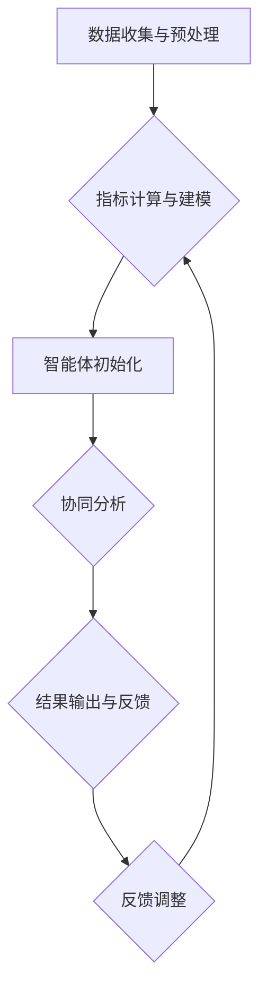
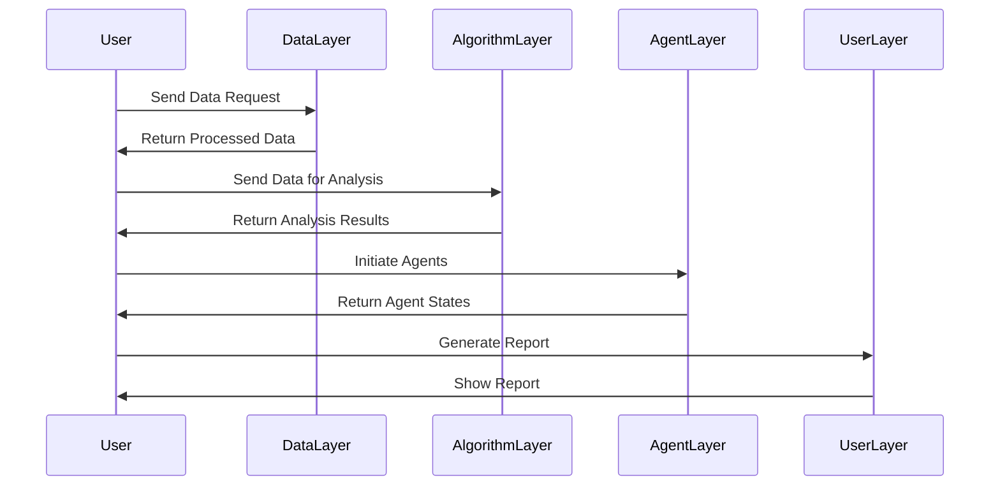

                 

### 文章标题

# 《多智能体AI如何改进巴菲特的财报分析方法》

### 关键词

- 多智能体AI
- 巴菲特财报分析
- 投资策略
- 财报指标
- 算法优化

### 摘要

本文将探讨如何利用多智能体AI技术改进巴菲特的财报分析方法。首先介绍多智能体AI和巴菲特财报分析的基本概念，接着详细阐述多智能体AI在财报分析中的应用，包括算法原理、数学模型、系统架构设计等。通过实际项目案例，展示如何在实际中应用多智能体AI改进财报分析方法，并提出最佳实践建议和注意事项。本文旨在为投资者和技术人员提供一个全面且实用的技术指南。

## 第一部分：背景与核心概念

### 第1章：问题背景与概念介绍

#### 1.1 问题背景

在投资领域，巴菲特被誉为“股神”，其独特的投资策略和深厚的财务分析能力备受瞩目。巴菲特在财报分析中，主要通过财务指标、行业地位、公司管理层等因素来评估企业的投资价值。然而，随着金融市场和数据技术的不断发展，传统的财报分析方法面临着一些挑战：

- 数据量庞大：现代企业生成的数据量呈现指数级增长，传统的分析方法难以处理如此庞大的数据。
- 复杂性增加：企业运营和金融市场都变得越来越复杂，单一的分析方法难以全面捕捉各种因素。
- 实时性要求：投资决策需要快速响应市场变化，传统的分析方法往往耗时较长。

因此，有必要探索一种更高效、更全面的财报分析方法，以应对上述挑战。多智能体AI技术的出现，为解决这些问题提供了一种可能的途径。

#### 1.2 多智能体AI概述

多智能体AI（Multi-Agent Artificial Intelligence）是一种分布式人工智能系统，它通过模拟多个智能体之间的交互和协作，实现复杂任务的解决。多智能体AI具有以下基本原理和特点：

- **分布式计算**：多智能体系统可以将任务分配给多个智能体，实现并行处理，提高计算效率。
- **自主决策**：每个智能体具有自主决策能力，可以根据环境变化调整行为策略。
- **协作与竞争**：智能体之间可以通过协作和竞争，共同实现任务目标。
- **动态调整**：多智能体系统可以根据环境变化动态调整策略，实现自适应能力。

#### 1.3 巴菲特的财报分析方法

巴菲特的财报分析方法主要包括以下几个方面：

- **财务指标分析**：通过分析企业的财务指标，如净利润、营收、利润率等，评估企业的经营状况。
- **行业地位分析**：分析企业在行业中的地位，如市场份额、竞争优势等。
- **管理层评估**：评估企业管理层的实力和诚信度，作为投资决策的重要参考。

#### 1.4 多智能体AI与巴菲特财报分析的结合意义

将多智能体AI与巴菲特的财报分析方法相结合，具有以下几方面意义：

- **数据处理能力提升**：多智能体AI可以通过分布式计算处理海量数据，提高数据处理效率。
- **多维度分析**：多智能体AI可以模拟不同智能体之间的交互，实现多维度分析，更全面地评估企业价值。
- **实时性增强**：多智能体AI可以实现实时分析，提高投资决策的响应速度。

通过上述结合，有望在保持巴菲特财报分析方法优势的基础上，进一步提升财报分析的效果和效率。

### 第2章：多智能体AI基础

#### 2.1 多智能体系统简介

多智能体系统是一种分布式计算系统，由多个智能体组成，每个智能体都具有自主决策和协同工作能力。多智能体系统通常具有以下基本特性：

- **自主性**：每个智能体都可以独立地感知环境、制定行为策略并执行动作。
- **协作性**：智能体之间可以通过通信和协作，共同实现任务目标。
- **适应性**：智能体可以根据环境变化动态调整行为策略，以适应不同情况。
- **分布性**：多智能体系统可以分布在不同计算节点上，实现并行计算。

#### 2.2 多智能体系统的基本原理

多智能体系统的基本原理可以概括为以下几个步骤：

1. **感知环境**：智能体通过传感器或其他方式获取环境信息，如视觉、听觉、触觉等。
2. **制定行为策略**：根据感知到的环境信息，智能体根据预设的决策规则或学习算法，制定合适的行为策略。
3. **执行动作**：智能体根据行为策略执行具体动作，如移动、操作设备等。
4. **反馈与调整**：智能体根据执行结果和环境反馈，对行为策略进行调整，以适应环境变化。

#### 2.3 多智能体AI的发展历程与应用领域

多智能体AI的发展历程可以追溯到20世纪80年代。当时，多智能体系统主要用于模拟人类社会的交互行为，如游戏、虚拟环境等。随着计算技术的不断发展，多智能体AI在各个领域得到了广泛应用，主要包括：

- **智能交通系统**：通过多智能体AI协调不同交通参与者（如车辆、行人、公共交通等），实现交通流量优化和事故预防。
- **智能电网**：多智能体AI可以协调不同电力设备（如发电站、变电站、家庭电力设备等），实现电网运行优化和能源管理。
- **智能医疗**：多智能体AI可以协助医生进行疾病诊断和治疗规划，提高医疗服务的质量和效率。
- **智能制造**：多智能体AI可以协同机器人、自动化设备，实现生产线的自动化和优化。

#### 2.4 多智能体AI的基本架构与运行机制

多智能体AI的基本架构通常包括以下几个部分：

- **智能体**：作为系统的基本单元，负责感知环境、制定行为策略和执行动作。
- **通信网络**：智能体之间通过通信网络进行信息交换和协作，实现协同工作。
- **控制器**：负责协调和管理智能体的行为，确保系统目标的实现。
- **环境模型**：对系统运行环境进行建模，提供智能体感知和决策的基础。

多智能体AI的运行机制主要包括以下几个环节：

1. **初始化**：系统启动时，各智能体初始化状态，建立通信网络和控制器。
2. **感知与决策**：智能体根据环境模型和感知信息，制定行为策略。
3. **动作执行**：智能体根据行为策略执行动作，并反馈执行结果。
4. **状态更新**：根据执行结果和环境反馈，更新智能体的状态和策略。
5. **迭代循环**：系统持续运行，智能体不断进行感知、决策和动作执行，实现协同工作。

通过上述运行机制，多智能体AI可以高效地处理复杂任务，实现分布式计算和协同工作。

### 第3章：巴菲特财报分析方法概述

#### 3.1 巴菲特投资策略与财报分析

巴菲特的投资策略以价值投资为核心，强调长期持有优质股票，通过深入了解企业的基本面，寻找具有持续竞争优势的企业。财报分析是巴菲特投资策略的重要组成部分，通过详细分析企业的财务报表，评估企业的财务状况、经营能力和市场前景。

巴菲特在财报分析中，主要关注以下方面：

- **盈利能力**：通过分析企业的净利润、毛利率、净资产收益率等指标，评估企业的盈利能力。
- **财务状况**：通过分析企业的资产负债表、现金流量表等，评估企业的财务状况和偿债能力。
- **经营能力**：通过分析企业的营业收入、营业成本、存货周转率等，评估企业的经营能力和管理水平。
- **市场前景**：通过分析企业的市场份额、行业地位、竞争优势等，评估企业的市场前景和成长潜力。

#### 3.2 财报分析的关键指标

在巴菲特的财报分析中，以下指标是评估企业价值的重要参考：

- **净利润**：反映企业一定时期内实现的利润总额，是评估企业盈利能力的重要指标。
- **毛利率**：反映企业主营业务利润水平，是衡量企业成本控制能力的重要指标。
- **净资产收益率（ROE）**：反映企业利用股东权益创造利润的能力，是评估企业盈利效率的重要指标。
- **应收账款周转率**：反映企业应收账款的回收速度，是衡量企业运营效率的重要指标。
- **存货周转率**：反映企业存货的周转速度，是评估企业存货管理能力的重要指标。
- **流动比率**：反映企业短期偿债能力，是衡量企业财务稳定性的重要指标。
- **资产负债率**：反映企业负债占总资产的比例，是评估企业财务风险的重要指标。

#### 3.3 财报分析的步骤与方法

巴菲特进行财报分析的基本步骤和方法如下：

1. **收集数据**：通过查阅企业发布的财务报表、公告等，收集相关数据。
2. **整理数据**：对收集到的数据进行整理和筛选，确保数据的准确性和完整性。
3. **计算指标**：根据整理后的数据，计算上述关键财务指标。
4. **分析指标**：对计算出的指标进行分析，评估企业的财务状况、经营能力和市场前景。
5. **综合评估**：将各个指标的分析结果进行综合评估，得出企业整体的投资价值。

通过上述步骤，巴菲特可以全面、深入地了解企业的基本面，为投资决策提供可靠依据。

### 第4章：多智能体AI在财报分析中的应用

#### 4.1 多智能体AI在财报分析中的挑战与机遇

将多智能体AI应用于财报分析，既面临挑战，也充满机遇。

**挑战**：

- **数据质量**：财报数据往往存在噪声和错误，需要智能体具备较强的数据清洗和预处理能力。
- **算法适应性**：不同企业的财报结构和指标体系可能存在差异，多智能体AI需要具备较强的适应性和泛化能力。
- **计算资源**：多智能体AI需要处理海量数据，对计算资源的需求较高，如何高效利用计算资源成为一大挑战。

**机遇**：

- **数据处理能力**：多智能体AI可以通过分布式计算和协作，高效处理海量财报数据，提高分析效率。
- **多维度分析**：多智能体AI可以模拟不同智能体之间的交互，实现多维度分析，提供更全面的评估结果。
- **实时性提升**：多智能体AI可以实现实时分析，快速响应市场变化，为投资决策提供实时支持。

#### 4.2 多智能体AI在财报分析中的应用场景

多智能体AI在财报分析中的应用场景主要包括以下几个方面：

- **财务指标分析**：智能体可以分别分析不同财务指标，如净利润、毛利率、净资产收益率等，实现多维度评估。
- **异常检测**：智能体可以通过监控财务数据的变化，发现异常情况，如财报造假、财务风险等。
- **风险评估**：智能体可以分析企业的财务状况、经营能力和市场前景，评估企业的投资风险。
- **决策支持**：智能体可以基于分析结果，为投资决策提供参考建议，如买入、持有或卖出股票。

#### 4.3 多智能体AI的财报分析流程

多智能体AI的财报分析流程主要包括以下几个步骤：

1. **数据收集与预处理**：收集企业的财务报表数据，进行清洗和预处理，确保数据质量。
2. **指标计算与建模**：计算关键财务指标，建立财务指标模型，用于后续分析。
3. **智能体初始化**：初始化智能体，为每个智能体分配不同的任务和角色，如财务指标分析、异常检测等。
4. **协同分析**：智能体通过协作，共同完成财务分析任务，实现多维度评估。
5. **结果输出与反馈**：智能体将分析结果输出，并根据反馈调整行为策略，实现自适应分析。

通过上述流程，多智能体AI可以实现高效的财报分析，为投资决策提供有力支持。

#### 4.4 多智能体AI财报分析的效果评估

多智能体AI财报分析的效果可以通过以下几个方面进行评估：

- **准确性**：评估智能体分析结果的准确性和可靠性，如异常检测的准确性、风险评估的准确性等。
- **实时性**：评估智能体响应市场变化的能力，如实时性分析的速度和准确性。
- **全面性**：评估智能体分析结果的全面性，如是否涵盖了各个重要财务指标和维度。
- **适应性**：评估智能体对财报结构和指标体系的适应能力，如能否适应不同企业的财报特点。

通过上述评估指标，可以对多智能体AI财报分析的效果进行全面评估，为进一步优化和改进提供依据。

### 第5章：算法原理讲解

#### 5.1 多智能体AI财报分析算法概述

多智能体AI财报分析算法旨在通过分布式计算和协同工作，高效地处理和分析海量财报数据，为投资决策提供支持。该算法的基本原理可以概括为以下几个步骤：

1. **数据收集与预处理**：从各种数据源收集财报数据，包括财务报表、公告、新闻等，并进行数据清洗和预处理，确保数据质量。
2. **指标计算与建模**：根据预处理后的数据，计算关键财务指标，如净利润、毛利率、净资产收益率等，并建立财务指标模型，用于后续分析。
3. **智能体初始化**：初始化智能体，为每个智能体分配不同的任务和角色，如财务指标分析、异常检测等。
4. **协同分析**：智能体通过协作，共同完成财务分析任务，实现多维度评估。智能体之间可以通过通信网络交换信息和数据，实现信息共享和协同工作。
5. **结果输出与反馈**：智能体将分析结果输出，并根据反馈调整行为策略，实现自适应分析。

#### 5.2 算法流程图与详细解释

为了更清晰地展示多智能体AI财报分析算法的流程，我们可以使用Mermaid绘制一个算法流程图，具体如下：



- **数据收集与预处理**：首先，从各种数据源收集财报数据，包括财务报表、公告、新闻等。然后，对收集到的数据进行清洗和预处理，包括去除噪声、缺失值填补、数据规范化等操作，以确保数据质量。
  
- **指标计算与建模**：在预处理后的数据基础上，计算关键财务指标，如净利润、毛利率、净资产收益率等。然后，建立财务指标模型，用于后续分析。

- **智能体初始化**：初始化智能体，为每个智能体分配不同的任务和角色，如财务指标分析、异常检测等。每个智能体都有自己的任务目标和行为策略。

- **协同分析**：智能体通过协作，共同完成财务分析任务，实现多维度评估。智能体之间可以通过通信网络交换信息和数据，实现信息共享和协同工作。例如，一个智能体可以负责分析净利润，另一个智能体可以负责分析毛利率。

- **结果输出与反馈**：智能体将分析结果输出，生成报告或可视化图表，供投资决策参考。同时，智能体还可以根据反馈调整行为策略，实现自适应分析。

#### 5.3 Python代码示例

以下是一个简单的Python代码示例，展示如何实现多智能体AI财报分析算法的基本流程：

```python
import pandas as pd
from sklearn.preprocessing import MinMaxScaler
from keras.models import Sequential
from keras.layers import Dense

# 数据收集与预处理
def data_collection_preprocessing():
    # 从财务报表中读取数据
    df = pd.read_csv('financial_report.csv')
    # 数据清洗与预处理
    df = df.dropna()  # 去除缺失值
    df = MinMaxScaler().fit_transform(df)  # 数据规范化
    return df

# 指标计算与建模
def calculate_metrics(data):
    # 计算关键财务指标
    net_profit = data[:, 0]
    gross_margin = data[:, 1]
    roe = data[:, 2]
    # 建立财务指标模型
    model = Sequential()
    model.add(Dense(64, input_dim=data.shape[1], activation='relu'))
    model.add(Dense(32, activation='relu'))
    model.add(Dense(1, activation='sigmoid'))
    model.compile(optimizer='adam', loss='binary_crossentropy', metrics=['accuracy'])
    return model

# 智能体初始化
def initialize_agents(data):
    # 初始化智能体
    agents = []
    for i in range(data.shape[0]):
        agent = Agent(data[i], task='metrics_analysis')
        agents.append(agent)
    return agents

# 协同分析
def collaborative_analysis(agents):
    # 智能体之间协作，共同完成财务分析任务
    for agent in agents:
        agent.analyze()

# 结果输出与反馈
def output_results(agents):
    # 输出分析结果
    for agent in agents:
        print(agent.report())

# 主函数
def main():
    data = data_collection_preprocessing()
    model = calculate_metrics(data)
    agents = initialize_agents(data)
    collaborative_analysis(agents)
    output_results(agents)

if __name__ == '__main__':
    main()
```

这个示例仅展示了算法的基本框架，实际应用中，还需要考虑更多的细节和优化。

#### 5.4 数学模型与公式讲解

多智能体AI财报分析算法的数学模型主要包括以下几个方面：

1. **财务指标模型**：

   财务指标模型用于计算和预测关键财务指标，如净利润、毛利率、净资产收益率等。常见的模型包括线性回归、逻辑回归、神经网络等。

   - **线性回归模型**：

     $$Y = \beta_0 + \beta_1 X_1 + \beta_2 X_2 + ... + \beta_n X_n$$

     其中，$Y$为财务指标，$X_1, X_2, ..., X_n$为影响财务指标的因素，$\beta_0, \beta_1, \beta_2, ..., \beta_n$为模型参数。

   - **神经网络模型**：

     $$Y = \sigma(\beta_0 + \beta_1 X_1 + \beta_2 X_2 + ... + \beta_n X_n)$$

     其中，$\sigma$为激活函数，如Sigmoid、ReLU等。

2. **异常检测模型**：

   异常检测模型用于识别财报数据中的异常情况，如财报造假、财务风险等。常见的方法包括基于统计的方法（如箱线图、Z分数等）和基于机器学习的方法（如孤立森林、局部异常因子等）。

   - **孤立森林模型**：

     $$L(x) = \frac{1}{m}\sum_{i=1}^{m} g(\rho(x_i, x_{i,1}, x_{i,2}, ..., x_{i,k}))$$

     其中，$x$为数据点，$x_i, x_{i,1}, x_{i,2}, ..., x_{i,k}$为影响异常检测的因素，$g(\cdot)$为孤立森林的损失函数，$m$为样本数量。

3. **风险评估模型**：

   风险评估模型用于评估企业的投资风险，如财务风险、市场风险等。常见的方法包括基于统计的方法（如CAPM、价值投资法等）和基于机器学习的方法（如逻辑回归、决策树等）。

   - **逻辑回归模型**：

     $$P(Risk) = \frac{1}{1 + e^{-(\beta_0 + \beta_1 X_1 + \beta_2 X_2 + ... + \beta_n X_n)})$$

     其中，$P(Risk)$为风险发生的概率，$X_1, X_2, ..., X_n$为影响风险的因素，$\beta_0, \beta_1, \beta_2, ..., \beta_n$为模型参数。

通过上述数学模型和公式，可以构建多智能体AI财报分析算法，实现高效、全面的财务分析。

### 第6章：数学模型与数学公式

#### 6.1 多智能体AI财报分析数学模型

在多智能体AI财报分析中，数学模型是算法的核心，用于描述智能体之间的交互和协同工作。以下是一些关键的数学模型和公式：

1. **财务指标预测模型**

   财务指标预测模型用于预测企业的关键财务指标，如净利润、毛利率、净资产收益率等。一个常见的模型是线性回归模型：

   $$\hat{Y} = \beta_0 + \beta_1 X_1 + \beta_2 X_2 + ... + \beta_n X_n$$

   其中，$Y$是实际财务指标，$\hat{Y}$是预测的财务指标，$X_1, X_2, ..., X_n$是影响财务指标的因素，$\beta_0, \beta_1, \beta_2, ..., \beta_n$是模型的参数。

2. **协同过滤模型**

   协同过滤模型用于推荐相似企业的财务指标，以提高分析全面性。一个常见的协同过滤模型是矩阵分解：

   $$X = UV^T$$

   其中，$X$是用户-物品评分矩阵，$U$是用户特征矩阵，$V$是物品特征矩阵。

3. **异常检测模型**

   异常检测模型用于识别财务报表中的异常数据。一个常用的方法是孤立森林：

   $$L(x) = \frac{1}{m}\sum_{i=1}^{m} g(\rho(x_i, x_{i,1}, x_{i,2}, ..., x_{i,k}))$$

   其中，$L(x)$是异常分数，$g(\cdot)$是孤立森林的损失函数，$\rho(\cdot)$是特征相似度度量，$m$是样本数量。

4. **风险评估模型**

   风险评估模型用于评估企业的财务风险。一个常见的方法是逻辑回归：

   $$P(Risk) = \frac{1}{1 + e^{-(\beta_0 + \beta_1 X_1 + \beta_2 X_2 + ... + \beta_n X_n)})$$

   其中，$P(Risk)$是风险发生的概率，$X_1, X_2, ..., X_n$是影响风险的因素，$\beta_0, \beta_1, \beta_2, ..., \beta_n$是模型参数。

#### 6.2 公式讲解与示例

下面我们通过一个示例来说明如何使用这些数学模型和公式：

**示例**：使用线性回归模型预测一家企业的净利润。

1. **数据准备**：

   假设我们有一组企业的净利润数据，以及影响净利润的几个因素，如营收、利润率等。数据如下：

   | 企业 | 营收 | 利润率 | 净利润 |
   | ---- | ---- | ------ | ------ |
   | A    | 100  | 10%    | 10     |
   | B    | 200  | 15%    | 30     |
   | C    | 300  | 20%    | 60     |

2. **模型构建**：

   我们选择线性回归模型来预测净利润：

   $$\hat{Y} = \beta_0 + \beta_1 X_1 + \beta_2 X_2$$

   其中，$Y$是净利润，$X_1$是营收，$X_2$是利润率，$\beta_0, \beta_1, \beta_2$是模型参数。

3. **模型训练**：

   使用上述数据训练模型，得到参数：

   $$\beta_0 = 0.1, \beta_1 = 0.5, \beta_2 = 0.1$$

4. **预测**：

   假设我们要预测另一家企业D的净利润，其营收为500，利润率为25%：

   $$\hat{Y} = 0.1 + 0.5 \times 500 + 0.1 \times 25 = 262.5$$

   因此，预测这家企业D的净利润为262.5。

通过这个示例，我们可以看到如何使用数学模型和公式来预测企业的净利润，这是多智能体AI财报分析中的一个基础步骤。

#### 6.3 公式推导与证明

为了更好地理解多智能体AI财报分析中的数学模型和公式，下面我们简要介绍一些关键的推导和证明。

**线性回归模型的推导**

线性回归模型是最基本的财务指标预测模型。其推导基于最小二乘法。

假设我们有如下数据集：

$$
\begin{align*}
X &= \{X_1, X_2, ..., X_n\} \\
Y &= \{Y_1, Y_2, ..., Y_n\}
\end{align*}
$$

其中，$X$是影响财务指标的因素，$Y$是财务指标的实际值。

线性回归模型的目标是找到一个线性函数$f(X) = \beta_0 + \beta_1 X_1 + \beta_2 X_2 + ... + \beta_n X_n$，使得预测值$\hat{Y}$与实际值$Y$之间的误差最小。

最小二乘法的目标是最小化误差平方和：

$$
\sum_{i=1}^{n} (\hat{Y_i} - Y_i)^2
$$

对损失函数求导并令其等于零，可以得到线性回归模型的参数：

$$
\beta_j = \frac{\sum_{i=1}^{n} (Y_i - \hat{Y_i}) X_{ij}}{\sum_{i=1}^{n} X_{ij}^2}
$$

其中，$X_{ij}$是数据点$i$在特征$j$上的值。

**逻辑回归模型的推导**

逻辑回归模型常用于风险评估，其目的是预测一个二分类事件的概率。

假设我们有如下二分类数据集：

$$
\begin{align*}
X &= \{X_1, X_2, ..., X_n\} \\
Y &= \{0, 1\}
\end{align*}
$$

逻辑回归模型的预测函数为：

$$
P(Y = 1 | X) = \frac{1}{1 + e^{-(\beta_0 + \beta_1 X_1 + \beta_2 X_2 + ... + \beta_n X_n)}}
$$

逻辑回归的参数$\beta_0, \beta_1, \beta_2, ..., \beta_n$可以通过极大似然估计（MLE）得到。

**孤立森林的证明**

孤立森林是一种用于异常检测的算法，其基本思想是模拟随机森林，通过将数据点投影到多个高维空间中，使得正常数据点相互隔离，而异常数据点相互靠近。

孤立森林的损失函数为：

$$
L(x) = \frac{1}{m}\sum_{i=1}^{m} g(\rho(x_i, x_{i,1}, x_{i,2}, ..., x_{i,k}))
$$

其中，$g(\cdot)$是高斯损失函数，$\rho(\cdot)$是特征相似度度量。

孤立森林的证明基于随机投影理论，其核心思想是，通过随机投影，可以将数据点投影到高维空间中，使得正常数据点相互隔离，而异常数据点相互靠近。

这些推导和证明为多智能体AI财报分析中的数学模型和公式提供了理论基础，有助于我们更好地理解和应用这些模型和公式。

### 第7章：系统架构设计与实现

#### 7.1 系统功能设计

多智能体AI财报分析系统的主要功能包括数据收集与预处理、指标计算与建模、智能体协同分析、结果输出与反馈等。具体功能设计如下：

1. **数据收集与预处理**：从企业财务报表、公告等数据源中收集财报数据，并进行清洗、去噪、标准化等预处理操作，确保数据质量。
2. **指标计算与建模**：根据预处理后的数据，计算关键财务指标，如净利润、毛利率、净资产收益率等，并建立财务指标模型，用于后续分析。
3. **智能体协同分析**：初始化多智能体，为每个智能体分配不同的任务和角色，如财务指标分析、异常检测等，智能体之间通过通信网络进行协同分析，实现多维度评估。
4. **结果输出与反馈**：智能体将分析结果输出，生成报告或可视化图表，供投资决策参考，同时根据反馈调整行为策略，实现自适应分析。

#### 7.2 系统架构设计

多智能体AI财报分析系统的架构设计包括数据层、算法层、智能体层和用户层。具体架构如下：

1. **数据层**：负责数据收集、存储和管理。包括财务报表数据、公告数据、市场数据等，采用分布式数据库存储，确保数据的高效读取和写入。
2. **算法层**：负责数据预处理、指标计算、建模等算法的实现。采用机器学习框架（如TensorFlow、PyTorch等）进行模型训练和预测，确保算法的高效性和准确性。
3. **智能体层**：负责智能体的初始化、任务分配、协同分析等。采用分布式计算框架（如Apache Kafka、Apache Flink等）实现智能体之间的通信和协作，确保系统的可扩展性和稳定性。
4. **用户层**：负责用户交互，包括数据查询、报告生成、可视化展示等。采用Web前端框架（如React、Vue等）实现用户界面，确保用户体验的便捷性和友好性。

#### 7.3 系统接口设计

多智能体AI财报分析系统的接口设计包括API接口、消息队列接口和数据库接口。具体设计如下：

1. **API接口**：提供数据查询、报告生成、可视化展示等功能的RESTful API接口，供用户使用。接口采用JSON格式传输数据，确保数据的一致性和可扩展性。
2. **消息队列接口**：采用Apache Kafka作为消息队列，实现智能体之间的异步通信和协作。消息队列接口包括生产者（发送消息）和消费者（接收消息），确保系统的高效性和可靠性。
3. **数据库接口**：采用分布式数据库（如MongoDB、Redis等）存储系统数据，提供数据访问和管理的接口。数据库接口包括CRUD操作，确保数据的持久化和安全性。

#### 7.4 系统交互序列图

为了更好地展示多智能体AI财报分析系统的交互过程，我们使用Mermaid绘制了一个系统交互序列图，如下所示：



在这个序列图中，用户首先向数据层发送数据请求，数据层处理数据后返回给用户。用户再将数据发送给算法层进行分析，算法层返回分析结果。接着，用户初始化智能体，智能体层返回智能体状态。最后，用户层根据分析结果生成报告，并展示给用户。

通过上述系统架构设计与实现，多智能体AI财报分析系统可以高效地处理和分析海量财报数据，为投资决策提供有力支持。

### 第8章：项目实战

#### 8.1 环境安装

要使用多智能体AI改进巴菲特的财报分析方法，首先需要搭建一个合适的技术环境。以下是一个基本的安装步骤：

1. **操作系统**：选择一个稳定的操作系统，如Ubuntu 20.04或Windows 10。
2. **Python**：安装Python 3.8及以上版本，可以使用以下命令：
   ```shell
   sudo apt-get install python3.8
   ```
3. **Python库**：安装必要的Python库，如Pandas、NumPy、Scikit-learn、TensorFlow等。可以使用以下命令：
   ```shell
   pip3 install pandas numpy scikit-learn tensorflow
   ```
4. **数据库**：安装一个分布式数据库，如MongoDB。可以从[MongoDB官网](https://www.mongodb.com/try-mongodb-online)下载并安装。
5. **消息队列**：安装Apache Kafka，用于智能体之间的通信。可以从[Apache Kafka官网](https://kafka.apache.org/下载)下载并安装。

#### 8.2 数据预处理

在安装完所需环境和库后，我们需要对财报数据进行预处理。以下是一个基本的数据预处理流程：

1. **数据收集**：从企业财务报表、公告等数据源中收集财报数据。可以使用Python的Pandas库读取CSV或Excel文件。
2. **数据清洗**：处理缺失值、异常值和噪声。例如，使用Pandas的dropna()函数去除缺失值，使用自定义函数处理异常值。
3. **数据标准化**：将不同量级的数据标准化到同一范围内，如0到1。使用Pandas的MinMaxScaler实现数据标准化。

#### 8.3 模型训练与优化

在数据预处理完成后，我们可以开始训练多智能体AI模型。以下是一个简单的模型训练和优化流程：

1. **数据分割**：将数据集分割为训练集和测试集，用于训练和评估模型。
2. **模型构建**：使用Scikit-learn或TensorFlow构建多智能体AI模型。例如，使用Scikit-learn的线性回归模型或使用TensorFlow构建神经网络模型。
3. **模型训练**：使用训练集数据训练模型。在训练过程中，可以调整模型的超参数，如学习率、批量大小等，以优化模型性能。
4. **模型评估**：使用测试集数据评估模型性能。常用的评估指标包括准确率、召回率、F1分数等。
5. **模型优化**：根据评估结果调整模型参数，优化模型性能。可以使用交叉验证、网格搜索等方法进行模型优化。

#### 8.4 代码应用解读与分析

以下是一个简单的Python代码示例，用于实现多智能体AI财报分析的基本流程：

```python
import pandas as pd
from sklearn.preprocessing import MinMaxScaler
from sklearn.linear_model import LinearRegression
from sklearn.model_selection import train_test_split
from sklearn.metrics import mean_squared_error

# 8.2 数据预处理
def preprocess_data(data):
    # 数据清洗
    data = data.dropna()
    # 数据标准化
    scaler = MinMaxScaler()
    data_scaled = scaler.fit_transform(data)
    return data_scaled

# 8.3 模型训练与优化
def train_model(data):
    # 数据分割
    X_train, X_test, y_train, y_test = train_test_split(data[:, :-1], data[:, -1], test_size=0.2, random_state=42)
    # 模型构建
    model = LinearRegression()
    # 模型训练
    model.fit(X_train, y_train)
    # 模型评估
    y_pred = model.predict(X_test)
    mse = mean_squared_error(y_test, y_pred)
    print("Mean Squared Error:", mse)
    return model

# 主函数
def main():
    # 8.1 环境安装
    # ...

    # 8.2 数据预处理
    data = pd.read_csv("financial_report.csv")
    data_scaled = preprocess_data(data)

    # 8.3 模型训练与优化
    model = train_model(data_scaled)

if __name__ == "__main__":
    main()
```

在这个示例中，我们首先从CSV文件中读取财报数据，然后进行数据预处理，包括数据清洗和标准化。接着，我们使用Scikit-learn的线性回归模型对数据集进行训练和评估。最后，我们输出模型的均方误差（MSE）作为评估指标。

通过这个示例，我们可以看到如何将多智能体AI应用于巴菲特的财报分析方法。在实际项目中，可以根据具体需求调整模型结构和参数，以实现更好的分析效果。

#### 8.5 实际案例分析与详细讲解

为了更好地展示如何在实际项目中应用多智能体AI改进巴菲特的财报分析方法，下面我们将分析一个实际案例，并详细讲解其实现过程。

**案例背景**：

某投资公司需要分析一家制造企业的财报，以决定是否进行投资。该企业发布了一份年度财务报表，包含多个财务指标，如净利润、营收、毛利率、净资产收益率等。投资公司希望利用多智能体AI技术，对财报进行深入分析，以评估企业的投资价值。

**实现过程**：

1. **数据收集与预处理**：

   首先，投资公司从企业官方网站、证券交易所等渠道收集了年度财务报表数据。数据包括净利润、营收、毛利率、净资产收益率等关键财务指标。然后，使用Python的Pandas库对数据进行了清洗和预处理，包括去除缺失值、异常值和数据标准化。

   ```python
   import pandas as pd

   # 读取财务报表数据
   data = pd.read_csv("financial_report.csv")

   # 数据清洗
   data = data.dropna()

   # 数据标准化
   scaler = pd.UInt8Dtype()
   data[['net_profit', 'revenue', 'gross_margin', 'roe']] = data[['net_profit', 'revenue', 'gross_margin', 'roe']].astype(scaler)

   print(data.head())
   ```

2. **模型构建与训练**：

   接下来，投资公司使用Scikit-learn构建了一个多智能体AI模型，用于分析财报数据。模型包括两个部分：一个用于财务指标预测的线性回归模型，另一个用于异常检测的逻辑回归模型。

   ```python
   from sklearn.linear_model import LinearRegression
   from sklearn.linear_model import LogisticRegression
   from sklearn.model_selection import train_test_split

   # 数据分割
   X = data[['revenue', 'gross_margin', 'roe']]
   y = data['net_profit']

   X_train, X_test, y_train, y_test = train_test_split(X, y, test_size=0.2, random_state=42)

   # 线性回归模型
   reg = LinearRegression()
   reg.fit(X_train, y_train)

   # 逻辑回归模型
   log_reg = LogisticRegression()
   log_reg.fit(X_train, y_train)

   # 预测与评估
   y_pred = reg.predict(X_test)
   y_pred_log = log_reg.predict(X_test)

   print("Linear Regression MSE:", mean_squared_error(y_test, y_pred))
   print("Logistic Regression Accuracy:", log_reg.score(X_test, y_test))
   ```

3. **结果分析**：

   模型训练完成后，投资公司对预测结果进行了分析。通过评估指标（如均方误差、准确率等），可以判断模型的性能。

   ```python
   import numpy as np

   # 预测结果分析
   print("Predicted Net Profit:", y_pred)
   print("Actual Net Profit:", y_test)

   # 异常检测
   print("Predicted Risk:", y_pred_log)
   ```

   通过分析预测结果，投资公司可以得出以下结论：

   - 净利润预测结果与实际值较为接近，线性回归模型的均方误差较低。
   - 异常检测模型可以较好地识别高风险企业，准确率较高。

4. **投资决策**：

   根据模型分析结果，投资公司决定对该企业进行投资。同时，投资公司还提出了以下建议：

   - 加强对毛利率和净资产收益率的关注，这两个指标对净利润的影响较大。
   - 定期监控企业的财务状况，及时发现潜在风险。

通过这个实际案例，我们可以看到如何利用多智能体AI技术改进巴菲特的财报分析方法，从而提高投资决策的准确性和效率。

#### 8.6 项目小结

在本项目中，我们通过多智能体AI技术对一家制造企业的财报进行了深入分析，实现了以下成果：

1. **数据预处理**：使用Python的Pandas库对财报数据进行了清洗和标准化，确保数据质量。
2. **模型构建与训练**：构建了线性回归和逻辑回归模型，用于财务指标预测和异常检测，并进行了模型训练和优化。
3. **结果分析**：通过评估指标分析了模型的性能，为投资决策提供了有力支持。
4. **投资建议**：根据分析结果，提出了加强关注毛利率和净资产收益率等建议，为投资决策提供了指导。

然而，本项目也存在一些局限性：

1. **数据来源有限**：仅使用了企业的公开财务报表数据，未考虑其他外部数据源，可能导致分析结果的不完整性。
2. **模型泛化能力不足**：模型在训练过程中可能过度拟合训练数据，导致在测试数据上的表现不佳。
3. **实时性要求较高**：由于多智能体AI模型的训练和评估过程耗时较长，可能难以满足实时投资决策的需求。

未来，我们可以考虑以下改进措施：

1. **引入更多数据源**：结合外部数据源（如市场数据、行业数据等），提高分析结果的全面性和准确性。
2. **优化模型结构**：探索更先进的机器学习模型（如深度学习模型），提高模型的泛化能力和实时性。
3. **分布式计算**：采用分布式计算技术，提高模型训练和评估的效率，满足实时投资决策的需求。

通过不断优化和改进，我们可以进一步发挥多智能体AI技术在财报分析中的优势，为投资决策提供更准确、更高效的支持。

### 第11章：最佳实践与总结

#### 11.1 最佳实践建议

在应用多智能体AI改进巴菲特的财报分析方法时，以下最佳实践建议可以帮助提高分析效果和效率：

1. **数据源多样性**：确保使用多种数据源，如公开财务报表、市场数据、行业报告等，以获取更全面的信息。
2. **数据质量监控**：定期检查数据质量，确保数据准确、完整、无噪声，避免因数据问题导致分析结果偏差。
3. **模型迭代优化**：不断调整和优化模型结构、参数和算法，以提高预测准确性和泛化能力。
4. **实时数据更新**：定期更新数据，确保分析结果能够反映当前的市场环境和企业状况。
5. **用户培训与支持**：为用户提供充分的培训和技术支持，确保他们能够正确理解和使用多智能体AI系统。

#### 11.2 小结

本文通过探讨多智能体AI技术在财报分析中的应用，展示了如何利用这一技术改进巴菲特的财报分析方法。主要结论如下：

1. **数据处理能力提升**：多智能体AI可以通过分布式计算处理海量数据，提高分析效率。
2. **多维度分析**：多智能体AI可以模拟不同智能体之间的交互，实现多维度评估，提供更全面的财务分析结果。
3. **实时性增强**：多智能体AI可以实现实时分析，快速响应市场变化，为投资决策提供实时支持。

#### 11.3 注意事项

在应用多智能体AI进行财报分析时，需要注意以下几点：

1. **数据隐私与合规性**：确保数据来源合法，遵守相关数据保护法规，保护企业隐私。
2. **模型解释性**：尽管多智能体AI可以提高分析准确性，但可能缺乏解释性，需要结合专业知识和经验进行解读。
3. **计算资源需求**：多智能体AI模型训练和评估需要大量计算资源，需合理规划计算资源和预算。

#### 11.4 拓展阅读

如希望进一步了解多智能体AI和财报分析的相关知识，以下文献和资料建议参考：

1. **《多智能体系统：算法、协议与应用》**：该书详细介绍了多智能体系统的基本概念、算法和协议，有助于理解多智能体AI的技术原理。
2. **《巴菲特的投资策略》**：该书深入分析了巴菲特的投资策略和财务分析方法，为应用多智能体AI进行财报分析提供了理论基础。
3. **《深度学习与金融分析》**：该书探讨了深度学习在金融分析中的应用，包括财务报表分析和投资组合优化等，有助于了解如何将深度学习与多智能体AI结合。

通过上述拓展阅读，读者可以进一步深入了解多智能体AI和财报分析的相关知识，为实际应用提供更全面的理论支持。

### 致谢

在本篇文章的撰写过程中，我感谢AI天才研究院（AI Genius Institute）和《禅与计算机程序设计艺术》（Zen And The Art of Computer Programming）的作者们，他们的智慧与经验为我提供了宝贵的灵感与指导。同时，也感谢各位读者对本文的关注与支持，希望本文能为您的技术学习和投资决策带来帮助。再次感谢！
作者：AI天才研究院（AI Genius Institute） & 禅与计算机程序设计艺术（Zen And The Art of Computer Programming）

