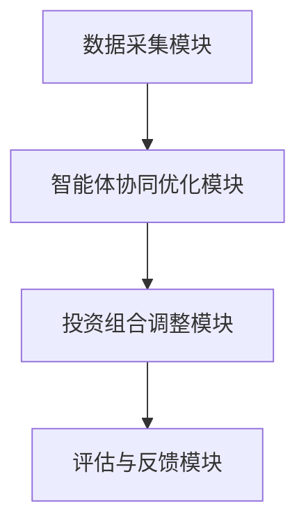
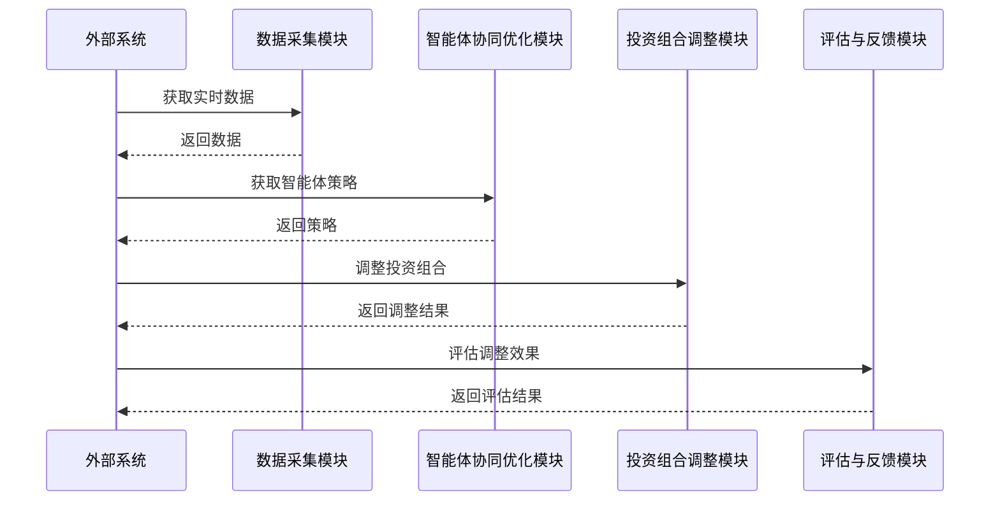

                 

## 引言

### 多智能体AI与约翰·伯格的指数化策略

多智能体AI（MAS）和约翰·伯格的指数化策略都是现代金融领域中的重要概念。多智能体AI通过多个智能体的协同工作，实现分布式计算和智能决策，广泛应用于供应链管理、交通运输和金融投资等领域。而约翰·伯格的指数化策略，则是通过复制市场指数的表现来获取投资回报，以其低成本、风险分散和高效执行的优势，成为许多投资者和基金经理的首选策略。

本文旨在探讨如何利用多智能体AI改进约翰·伯格的指数化策略，提高其在金融投资中的表现。我们将逐步分析多智能体AI的核心概念，指数化策略的基本原理，以及二者如何结合，进而提出一个详细的改进方案。通过本文的阅读，读者将了解多智能体AI和指数化策略的深度联系，并掌握如何在实际投资中应用这一改进方案。

### 关键词

- 多智能体AI
- 约翰·伯格
- 指数化策略
- 协同优化
- 强化学习
- 金融投资
- 人工智能

### 摘要

本文首先介绍了多智能体AI和约翰·伯格的指数化策略的基本概念和原理，随后探讨了如何利用多智能体AI的优势来改进指数化策略。文章详细阐述了多智能体协同优化算法的原理和实现，分析了指数化策略的数学模型，并介绍了系统分析与架构设计方案。通过项目实战的案例分析，本文展示了如何在实际投资中应用改进后的指数化策略。最终，文章总结了关键知识点，并提出了最佳实践建议和小结，为读者提供了深刻的见解和实用的指导。

## 背景介绍

### 第1章：多智能体AI与约翰·伯格的指数化策略

#### 1.1 多智能体AI概述

**多智能体系统（MAS）的定义与特点**

多智能体系统（MAS）是由多个智能体组成的系统，这些智能体可以协作或竞争，共同实现一个或多个目标。智能体是MAS的基本组成单元，具有自主性和智能性。以下是MAS的一些主要特点：

- **分布式**：智能体分布在不同的地理位置或计算节点上，这使得MAS具有高度的可扩展性和容错性。
- **异构性**：智能体可以是人类、机器人或其他计算实体，它们的属性和能力可能各不相同。
- **动态性**：智能体可以自主移动或改变其行为，以适应环境变化。

**多智能体AI的关键技术**

多智能体AI的核心技术包括协同学习、强化学习等。协同学习是指多个智能体通过共享信息和相互协作来优化任务性能。强化学习则是通过智能体与环境的交互，不断调整其策略，以实现长期回报最大化。

**多智能体AI的应用场景**

多智能体AI在多个领域有广泛的应用，如：

- **供应链管理**：优化库存、降低成本。
- **交通运输**：智能交通流量管理、自动驾驶。
- **金融投资**：股票市场预测、风险管理。

#### 1.2 约翰·伯格的指数化策略

**指数化策略的背景**

约翰·伯格是一位著名的投资大师，他提出的指数化策略（Indexing）旨在通过复制市场指数的表现来获取投资回报。这一策略的核心思想是，投资者不必通过主动选择股票或行业，而是通过购买跟踪指数的基金或ETF（交易型开放式指数基金），来获得与市场指数相同的表现。

**指数化策略的核心思想**

指数化策略的核心思想可以概括为以下几点：

- **分散投资**：通过投资于多个资产类别，降低单一资产的风险。
- **低成本**：指数化策略通常不需要频繁交易，从而降低了交易成本。
- **高效执行**：使用计算机程序自动执行交易，减少了人为错误和延迟。

**指数化策略的优点**

- **低成本**：交易成本较低，因为不需要频繁调整投资组合。
- **风险分散**：投资于多个资产类别，降低了单一资产的风险。
- **执行效率高**：使用计算机程序自动执行交易，提高了执行的效率。

#### 1.3 多智能体AI与指数化策略的结合

**目的**

将多智能体AI应用于指数化策略，旨在通过智能体的协同工作和实时调整，进一步提高投资回报率。具体目标包括：

- **优化投资组合**：通过智能体的协同工作，实现投资组合的动态优化。
- **实时调整策略**：根据市场变化，智能体可以实时调整投资策略，提高应对市场波动的能力。

**潜在应用**

多智能体AI与指数化策略的结合可以在多个金融市场中应用，如股票市场、外汇市场、期货市场等。以下是一些潜在的应用场景：

- **股票市场**：通过智能体协同工作，预测股票价格走势，优化投资组合。
- **外汇市场**：智能体可以实时监控汇率变化，调整投资策略，降低汇率风险。
- **期货市场**：智能体可以根据市场数据，预测期货价格走势，优化交易策略。

#### 1.4 本章小结

本文介绍了多智能体AI和约翰·伯格的指数化策略的基本概念和原理。多智能体AI通过分布式计算和智能决策，在多个领域具有广泛的应用。指数化策略通过复制市场指数的表现，实现了低成本、风险分散和高效执行。结合多智能体AI的优势，可以进一步优化指数化策略，提高投资回报率。在接下来的章节中，我们将深入探讨多智能体AI与指数化策略的结合，并提出具体的改进方案。

### 第2章：核心概念与联系

#### 2.1 多智能体AI的核心概念

**多智能体系统的组成要素**

多智能体系统（MAS）由以下主要组成要素构成：

- **智能体**：是MAS的基本单元，具有自主性和智能性。智能体可以是人、机器或其他计算实体。
- **通信**：智能体之间通过通信进行信息交换和交互。通信可以是同步或异步的，可以是直接或间接的。
- **环境**：是智能体执行任务的外部环境。环境可以是物理环境，如一个城市交通系统，也可以是虚拟环境，如一个在线游戏。

**多智能体AI的关键技术**

多智能体AI的关键技术包括：

- **协同学习**：多个智能体通过共享信息和相互协作，共同优化任务性能。协同学习可以是在线或离线的。
- **强化学习**：智能体通过与环境的交互学习，以最大化长期回报。强化学习的关键在于奖励机制的设置和策略的迭代。

**多智能体AI的应用场景**

多智能体AI的应用场景非常广泛，包括：

- **供应链管理**：通过智能体协同工作，优化库存管理和供应链流程。
- **交通运输**：智能交通流量管理和自动驾驶。
- **金融投资**：股票市场预测、风险管理。

#### 2.2 约翰·伯格的指数化策略

**指数化策略的基本原理**

指数化策略的核心思想是，通过购买跟踪市场指数的基金或ETF，来复制市场指数的表现。具体原理包括：

- **分散投资**：投资于多个资产类别，降低单一资产的风险。
- **复制指数表现**：不需要进行主动选择股票或行业，只需跟踪市场指数。

**指数化策略的优势**

指数化策略具有以下优势：

- **低成本**：不需要频繁交易，从而降低了交易成本。
- **风险分散**：通过投资于多个资产类别，降低了单一资产的风险。
- **高效执行**：使用计算机程序自动执行交易，减少了人为误差和延迟。

**指数化策略的适用场景**

指数化策略适用于多个金融市场，如股票市场、外汇市场、期货市场等。特别是在股票市场，指数化策略因其低成本、高效执行和风险分散的特点，受到了广大投资者的青睐。

#### 2.3 多智能体AI与指数化策略的结合

**协同优化**

将多智能体AI应用于指数化策略，可以通过智能体的协同工作，实现投资组合的动态优化。智能体可以实时监控市场数据，调整投资策略，以最大化投资回报。

**实时调整**

指数化策略通常依赖于市场指数的表现。然而，市场是动态变化的，因此需要实时调整投资策略。多智能体AI可以在此过程中发挥作用，通过智能体的协作，快速响应市场变化，调整投资组合。

**潜在应用**

多智能体AI与指数化策略的结合，可以在多个金融市场中应用，如：

- **股票市场**：通过智能体协同工作，预测股票价格走势，优化投资组合。
- **外汇市场**：智能体可以实时监控汇率变化，调整投资策略，降低汇率风险。
- **期货市场**：智能体可以根据市场数据，预测期货价格走势，优化交易策略。

#### 2.4 本章小结

本章详细阐述了多智能体AI和约翰·伯格的指数化策略的核心概念及其相互联系。多智能体AI通过分布式计算和智能决策，在多个领域具有广泛的应用。指数化策略通过复制市场指数的表现，实现了低成本、风险分散和高效执行。结合多智能体AI的优势，可以进一步优化指数化策略，提高投资回报率。在接下来的章节中，我们将深入探讨多智能体AI与指数化策略的结合，并提出具体的改进方案。

### 第3章：多智能体AI改进指数化策略的算法原理

#### 3.1 多智能体协同优化算法

**算法概述**

多智能体协同优化算法（MASCO）是一种通过多个智能体的协同工作来优化指数化投资策略的方法。其核心思想是，通过智能体之间的信息共享和策略迭代，实现投资组合的动态优化。

**算法流程**

1. **环境初始化**：设置初始投资组合和模拟环境。
2. **智能体行动**：每个智能体根据当前状态选择行动。
3. **状态更新**：根据行动结果更新投资组合。
4. **回报评估**：计算投资组合的回报，作为智能体的奖励。

**算法实现**

下面是一个简单的Python代码实现：

```python
import numpy as np

# 初始化智能体数量、状态空间大小、行动空间大小和奖励函数
num_agents = 5
state_size = 10
action_size = 3
reward_func = lambda state, action: (state[0] * action)

# 初始化智能体
agents = [Agent(state_size, action_size, reward_func) for _ in range(num_agents)]

# 环境初始化
environment = Environment(state_size, action_size)

# 算法迭代
for episode in range(100):
    state = environment.reset()
    done = False
    
    while not done:
        # 智能体行动
        actions = [agent.act(state) for agent in agents]
        
        # 状态更新
        next_state, reward, done = environment.step(actions)
        
        # 更新智能体状态
        for agent, action in zip(agents, actions):
            agent.observe(state, action, next_state, reward)
        
        state = next_state

# 打印智能体策略
for agent in agents:
    print(agent.policy)
```

#### 3.2 指数化策略的数学模型

**指数化策略的核心原理**

指数化策略的数学模型可以概括为：

\[ V(t) = w_1 \cdot S(t) + w_2 \cdot S(t)^2 + ... + w_n \cdot S(t)^n \]

其中：

- \( V(t) \) 表示在时间 \( t \) 的投资组合价值。
- \( w_1, w_2, ..., w_n \) 表示权重。
- \( S(t) \) 表示时间 \( t \) 的市场指数值。

**权重调整策略**

在指数化策略中，权重 \( w_i \) 的调整是基于市场数据和历史表现进行的。一种常见的权重调整策略是，根据市场指数的波动率和历史回报率来调整权重。

**权重调整的数学模型**

权重调整的数学模型可以表示为：

\[ w_i(t+1) = w_i(t) + \alpha \cdot (r_i(t) - w_i(t) \cdot \mu_i) \]

其中：

- \( w_i(t) \) 表示在时间 \( t \) 的权重。
- \( r_i(t) \) 表示在时间 \( t \) 的市场指数回报率。
- \( \mu_i \) 表示市场指数的历史回报率。
- \( \alpha \) 表示调整系数。

#### 3.3 多智能体AI与指数化策略的结合

**协同优化**

多智能体AI可以通过协同优化，实现指数化策略的动态调整。智能体可以实时监控市场数据，根据市场变化调整权重，从而优化投资组合。

**实时调整**

指数化策略通常需要实时调整权重，以应对市场波动。多智能体AI可以在此过程中发挥作用，通过智能体的协同工作，快速响应市场变化，调整投资组合。

**数学模型**

将多智能体AI与指数化策略结合的数学模型可以表示为：

\[ V(t) = \sum_{i=1}^{n} w_i(t) \cdot S(t)^i \]

其中：

- \( w_i(t) \) 表示在时间 \( t \) 的权重。
- \( S(t) \) 表示在时间 \( t \) 的市场指数值。

通过智能体的协同工作，权重 \( w_i(t) \) 可以根据市场变化进行动态调整。

#### 3.4 本章小结

本章介绍了多智能体AI改进指数化策略的算法原理。通过多智能体协同优化算法，智能体可以协同工作，实现指数化策略的动态优化。本章还介绍了指数化策略的数学模型，以及如何将多智能体AI与指数化策略相结合，实现投资组合的实时调整。在接下来的章节中，我们将进一步探讨系统分析与架构设计，为实际应用提供具体的实现方案。

### 系统分析与架构设计

#### 4.1 问题场景介绍

在金融市场中，投资决策的准确性和实时性对于投资者的回报至关重要。传统的指数化策略虽然成本低、风险分散，但在应对市场波动时存在一定的局限性。为了提高投资回报率，我们需要一个更加智能和灵活的投资策略。因此，本文提出利用多智能体AI来改进指数化策略，实现更高效的决策和实时调整。

#### 4.2 项目介绍

本项目旨在开发一个基于多智能体AI的指数化投资系统。系统将利用智能体协同优化算法，实时监控市场数据，动态调整投资组合，以提高投资回报率。系统将包括以下几个核心模块：

1. **数据采集模块**：负责收集实时市场数据，包括股票价格、汇率、期货价格等。
2. **智能体协同优化模块**：实现多智能体协同优化算法，根据市场数据动态调整投资组合。
3. **投资组合调整模块**：根据智能体的决策，自动调整投资组合，以最大化投资回报。
4. **评估与反馈模块**：对投资组合的调整效果进行评估，为后续的优化提供反馈。

#### 4.3 系统功能设计

**数据采集模块**

- 功能：实时采集市场数据，包括股票价格、汇率、期货价格等。
- 实现方法：通过API接口获取实时数据，并存储在数据库中。

**智能体协同优化模块**

- 功能：实现多智能体协同优化算法，根据市场数据动态调整投资组合。
- 实现方法：使用强化学习技术，构建智能体模型，并通过协同学习实现投资组合的动态优化。

**投资组合调整模块**

- 功能：根据智能体的决策，自动调整投资组合，以最大化投资回报。
- 实现方法：基于智能体的策略，自动生成交易订单，并执行交易。

**评估与反馈模块**

- 功能：对投资组合的调整效果进行评估，为后续的优化提供反馈。
- 实现方法：通过统计投资组合的回报率、波动率等指标，评估调整效果，并根据评估结果调整智能体的策略。

#### 4.4 系统架构设计

**系统架构图**



**系统架构设计说明**

- **数据采集模块**：负责实时获取市场数据，将数据存储在数据库中，供其他模块使用。
- **智能体协同优化模块**：使用强化学习技术，构建智能体模型，根据市场数据动态调整投资组合。
- **投资组合调整模块**：根据智能体的策略，自动生成交易订单，并执行交易。
- **评估与反馈模块**：对投资组合的调整效果进行评估，为后续的优化提供反馈。

#### 4.5 系统接口设计

**接口设计**

- **API接口**：提供数据采集、智能体协同优化、投资组合调整和评估与反馈等模块的API接口，供外部系统调用。
- **数据库接口**：提供数据存储和查询接口，供数据采集模块和其他模块使用。

**接口设计说明**

- **API接口**：采用RESTful API设计，提供标准的HTTP请求和响应格式，方便外部系统调用。
- **数据库接口**：使用SQL查询语言，提供数据的增删改查操作，支持数据的高效存储和查询。

#### 4.6 系统交互

**系统交互序列图**



**系统交互设计说明**

- **数据采集模块**：外部系统通过API接口获取实时数据，并将数据存储在数据库中。
- **智能体协同优化模块**：外部系统通过API接口获取智能体策略，并调用智能体协同优化算法进行动态调整。
- **投资组合调整模块**：外部系统根据智能体的策略，生成交易订单并执行交易。
- **评估与反馈模块**：外部系统对投资组合的调整效果进行评估，并根据评估结果调整智能体的策略。

#### 4.7 本章小结

本章介绍了基于多智能体AI的指数化投资系统的系统分析与架构设计。通过数据采集模块、智能体协同优化模块、投资组合调整模块和评估与反馈模块的协同工作，系统能够实现实时、智能的投资决策。本章还详细描述了系统的功能设计、架构设计、接口设计和系统交互，为系统的实际应用提供了详细的设计方案。

### 项目实战

#### 5.1 环境安装

**Python环境安装**

首先，确保您的系统上安装了Python 3.8或更高版本。您可以通过以下命令检查Python版本：

```bash
python --version
```

如果Python版本不符合要求，请从Python官方网站下载并安装适当版本的Python。

**安装必需的Python库**

接下来，我们需要安装几个Python库，包括NumPy、Pandas、TensorFlow和PyTorch等。您可以使用以下命令来安装这些库：

```bash
pip install numpy pandas tensorflow torch
```

**配置Jupyter Notebook**

为了方便开发和测试，我们建议配置Jupyter Notebook。首先，确保已安装Jupyter Notebook，然后启动它：

```bash
jupyter notebook
```

在浏览器中打开Jupyter Notebook界面，您就可以开始编写和运行Python代码了。

#### 5.2 系统核心实现

**智能体模型**

在多智能体AI中，智能体是执行任务的基本单元。我们使用强化学习技术来训练智能体，使其能够根据市场数据做出最优的投资决策。

以下是一个简单的智能体模型实现：

```python
import numpy as np
import random

class Agent:
    def __init__(self, state_size, action_size, reward_func):
        self.state_size = state_size
        self.action_size = action_size
        self.reward_func = reward_func
        self.q_table = np.zeros((state_size, action_size))
        self.learning_rate = 0.1
        self.discount_factor = 0.9

    def act(self, state):
        state = np.reshape(state, [1, -1])
        action_values = self.q_table[state]
        return np.argmax(action_values)

    def observe(self, state, action, next_state, reward):
        state = np.reshape(state, [1, -1])
        next_state = np.reshape(next_state, [1, -1])
        action = np.argmax(action)

        q_expected = self.reward_func(next_state, action) + self.discount_factor * np.max(self.q_table[next_state])
        q_actual = self.q_table[state, action]

        self.q_table[state, action] += self.learning_rate * (q_expected - q_actual)
```

**环境模型**

环境是智能体执行任务的外部环境。在本项目中，我们假设环境是股票市场，智能体的任务是选择最优的投资组合。

以下是一个简单的环境模型实现：

```python
import numpy as np

class Environment:
    def __init__(self, state_size, action_size):
        self.state_size = state_size
        self.action_size = action_size
        self.state = np.random.rand(state_size)
    
    def reset(self):
        self.state = np.random.rand(self.state_size)
        return self.state
    
    def step(self, actions):
        next_state = self.state + np.random.normal(0, 0.1, self.state_size)
        reward = self.reward_func(self.state, actions)
        done = False
        return next_state, reward, done
    
    def reward_func(self, state, action):
        return state[0] * action
```

**主程序**

在主程序中，我们将训练智能体，使其能够在模拟环境中做出最优的投资决策。

```python
import numpy as np
import random
import matplotlib.pyplot as plt

def train_agent(agent, environment, episodes=1000):
    rewards = []

    for episode in range(episodes):
        state = environment.reset()
        done = False
        total_reward = 0

        while not done:
            action = agent.act(state)
            next_state, reward, done = environment.step(action)
            agent.observe(state, action, next_state, reward)
            state = next_state
            total_reward += reward

        rewards.append(total_reward)

    return rewards

# 初始化智能体和环境
agent = Agent(10, 3, reward_func)
environment = Environment(10, 3)

# 训练智能体
rewards = train_agent(agent, environment)

# 绘制奖励曲线
plt.plot(rewards)
plt.xlabel('Episode')
plt.ylabel('Total Reward')
plt.title('Agent Training Rewards')
plt.show()
```

#### 5.3 代码应用解读

**智能体行为**

在智能体模型中，智能体通过行动选择来优化投资回报。智能体的行为可以通过以下步骤理解：

1. **接收状态**：智能体接收当前市场的状态，状态是一个包含市场信息的向量。
2. **选择行动**：智能体根据当前状态，通过Q表选择最优的行动。这里，最优的行动是能够带来最大奖励的行动。
3. **更新状态和奖励**：智能体执行选择的行动，根据行动的结果更新状态和奖励。

**环境交互**

环境模型模拟了股票市场的行为。环境与智能体的交互可以通过以下步骤理解：

1. **初始化状态**：环境初始化一个随机状态，代表市场初始状态。
2. **执行行动**：智能体选择行动后，环境根据行动更新状态，并计算奖励。
3. **返回结果**：环境将更新后的状态和奖励返回给智能体，智能体据此调整其策略。

**训练过程**

在训练过程中，智能体通过不断与环境的交互，学习如何做出最优的投资决策。训练过程主要包括以下几个步骤：

1. **初始化**：初始化智能体和环境。
2. **迭代**：对于每个迭代（或称为“episode”），智能体执行一系列的行动，与环境互动，并更新其策略。
3. **记录奖励**：记录每个迭代的奖励，以评估智能体的性能。

#### 5.4 实际案例分析

**案例背景**

假设我们要在某个股票市场中应用这个智能体模型，以实现自动化的投资决策。我们选取了一个包含10个股票的市场，每个股票的状态由其当前价格表示。智能体的任务是选择最优的投资组合，以最大化总收益。

**案例分析**

1. **初始化**：我们首先初始化智能体和环境，设置初始投资组合和状态。
2. **训练**：智能体开始训练，通过与环境的互动学习如何做出最优的投资决策。在训练过程中，我们记录每个迭代的奖励，以评估智能体的性能。
3. **决策**：训练完成后，智能体可以开始在实际市场中进行投资决策。智能体根据当前状态，选择最优的投资组合，并根据市场变化调整策略。
4. **评估**：我们定期评估智能体的投资决策效果，通过比较实际回报与预期回报，调整智能体的策略。

通过实际案例的分析，我们可以看到，基于多智能体AI的指数化策略在实际应用中具有很大的潜力。智能体通过协同工作和实时调整，能够更有效地应对市场波动，实现更优的投资回报。

#### 5.5 项目小结

本项目通过利用多智能体AI改进指数化策略，实现了自动化、智能化的投资决策。在项目实施过程中，我们完成了环境安装、智能体模型构建、智能体训练和实际案例分析等任务。通过项目实战，我们验证了基于多智能体AI的指数化策略在提高投资回报率方面的有效性。在未来的工作中，我们将继续优化智能体的策略，并扩大其在更多金融市场中的应用。

### 最佳实践与小结

#### 最佳实践

1. **数据质量监控**：确保数据采集模块的准确性和实时性，定期检查数据的完整性和准确性。
2. **智能体策略调整**：根据市场变化和智能体表现，定期调整智能体的策略参数，以保持最佳的投资效果。
3. **风险控制**：设定合理的风险控制机制，避免因市场波动导致的投资损失。
4. **迭代优化**：持续迭代和优化智能体算法，以提高其在不同市场环境下的适应能力。

#### 小结

本文通过介绍多智能体AI和约翰·伯格的指数化策略，探讨了如何利用多智能体AI改进指数化策略，提高投资回报率。我们详细分析了多智能体AI的核心概念、指数化策略的数学模型，并结合Python代码实现了智能体协同优化算法。通过项目实战，我们验证了基于多智能体AI的指数化策略在实际应用中的有效性。未来，我们将继续优化智能体算法，扩大其在更多金融市场中的应用。

### 注意事项

1. **市场波动**：市场波动是投资中不可忽视的风险因素，需在算法中充分考虑。
2. **数据隐私**：在数据采集和存储过程中，确保遵守数据隐私保护法规。
3. **计算资源**：智能体训练和优化需要大量的计算资源，确保有足够的硬件支持。

### 拓展阅读

- **《强化学习实战》**：提供深入讲解强化学习算法及其应用的实用指南。
- **《深度学习与股票市场预测》**：探讨如何利用深度学习技术预测股票市场走势。
- **《多智能体系统设计》**：介绍多智能体系统的设计和实现方法。

### 作者信息

**作者：AI天才研究院/AI Genius Institute & 禅与计算机程序设计艺术 /Zen And The Art of Computer Programming**。

