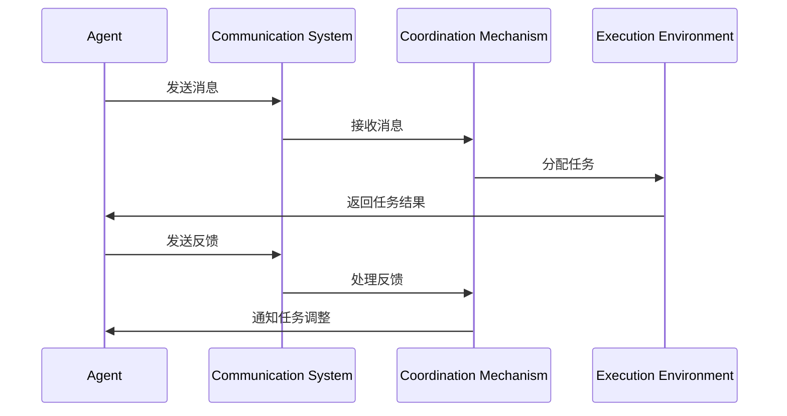
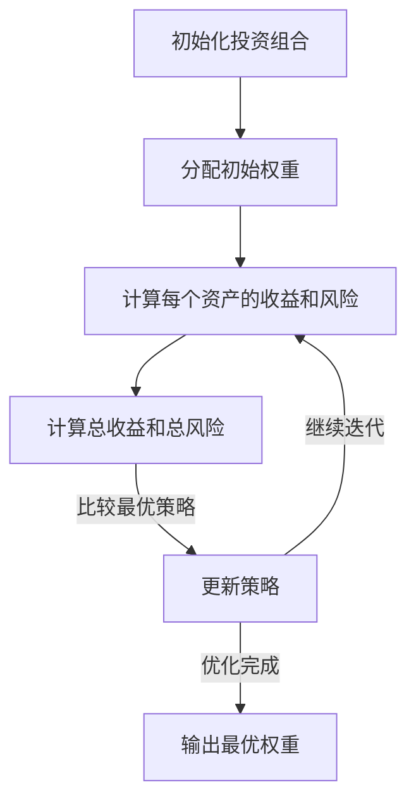
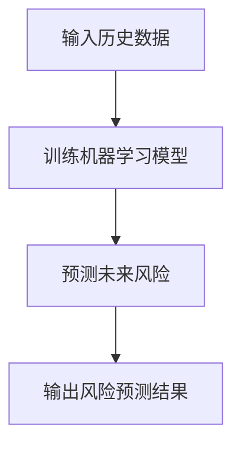
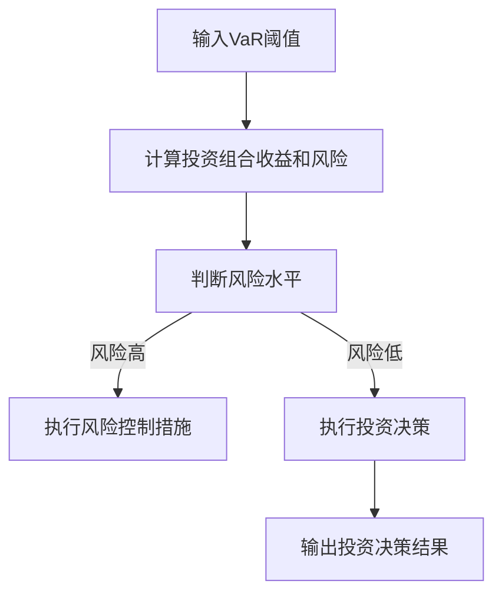
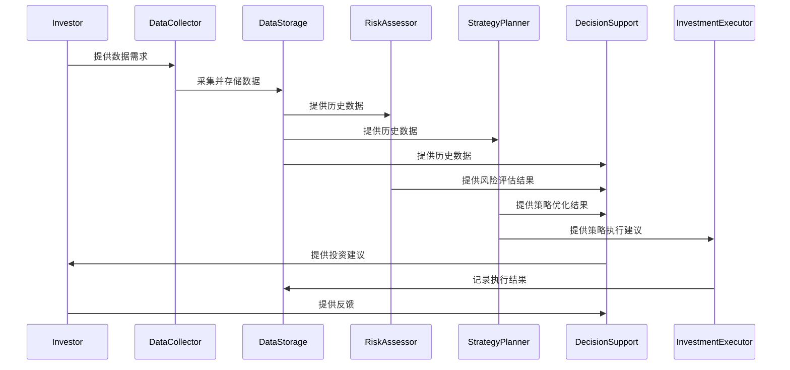
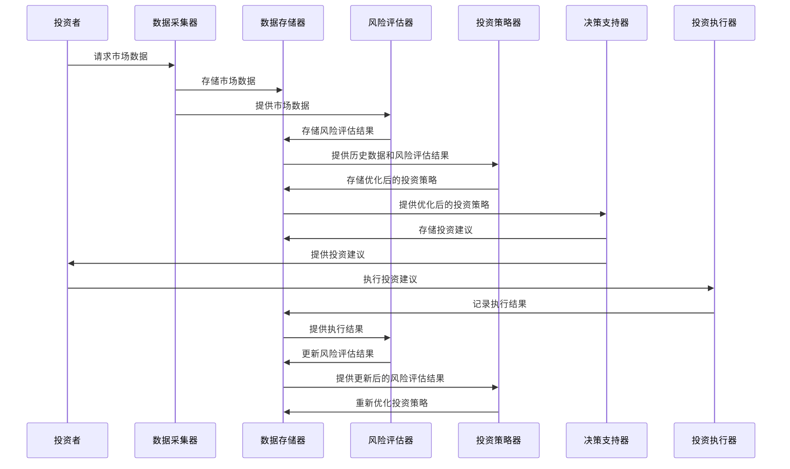

                 

### 摘要

本文旨在探讨多智能体AI系统在价值投资中的风险管理应用。价值投资作为一种长期投资策略，依赖于深入分析公司的基本面和价值，而风险管理则是确保投资决策具有可持续性和稳健性的关键。本文将首先介绍多智能体AI系统的基本概念，然后分析价值投资和风险管理的方法，并深入探讨如何将多智能体AI系统应用于价值投资中的风险管理。我们将通过详细讲解算法原理、系统分析与架构设计以及项目实战，展示多智能体AI系统在降低投资风险、优化投资决策方面的实际效果。文章还提供了相关的最佳实践、注意事项和拓展阅读资源，以帮助读者进一步深入了解和探索这一领域。

### 第一部分: 多智能体AI系统概述

#### 1.1 问题背景

在当今复杂多变的市场环境中，投资者面临着前所未有的挑战。传统的单智能体投资策略由于缺乏灵活性和适应性，往往难以应对市场波动和风险。多智能体AI系统作为一种新兴的智能解决方案，为价值投资中的风险管理提供了新的视角和方法。价值投资，作为一种以公司基本面为依据的投资策略，强调对公司的长期价值进行深入分析，而不是仅仅关注短期市场波动。然而，价值投资的成功往往依赖于对风险的精准管理。风险管理则是指通过识别、评估和控制潜在风险，确保投资决策的稳健性和可持续性。

在当前市场环境下，风险管理的挑战主要体现在以下几个方面：

1. **市场波动性增加**：近年来，全球经济波动性加剧，金融市场的不确定性增加，这对投资者的风险承受能力提出了更高的要求。
2. **信息过载**：随着大数据和互联网技术的发展，投资者面临的信息量日益庞大，如何从海量数据中提取有价值的信息成为一个难题。
3. **投资组合优化**：投资者需要在多种资产类别和行业中分散投资，以降低风险，同时实现资产增值。然而，如何科学地构建和调整投资组合是一个复杂的问题。

多智能体AI系统通过模拟多个智能体之间的协作和竞争，能够更好地应对这些挑战。它不仅能够处理复杂的市场数据，还能通过智能算法优化投资决策，降低风险，提高投资回报率。因此，在价值投资中引入多智能体AI系统的风险管理方法，具有非常重要的现实意义。

#### 1.2 多智能体AI系统的定义

多智能体系统（Multi-Agent System, MAS）是一种分布式计算系统，由多个自主的智能体组成。这些智能体通过交互和协作，共同完成任务。多智能体的基本定义包括以下几个关键点：

1. **自主性**：智能体能够自主地做出决策，不受外部控制。
2. **社会性**：智能体之间能够进行通信和协作，共同完成任务。
3. **反应性**：智能体能够感知环境的变化，并做出相应的反应。
4. **适应性**：智能体能够根据环境变化和经验调整自己的行为策略。

在多智能体AI系统中，每个智能体都可以被视为一个独立的实体，它们具有以下特点：

1. **异质性**：不同智能体具有不同的能力和知识。
2. **分布性**：智能体可能位于不同的地理位置，通过网络进行通信。
3. **动态性**：智能体可能随时加入或离开系统。

多智能体AI系统在多个领域有着广泛的应用，例如：

1. **智能制造**：通过智能体之间的协同工作，实现生产线的自动化和智能化。
2. **智能交通**：利用智能体优化交通流，减少拥堵，提高交通效率。
3. **金融服务**：在风险管理、投资组合优化和客户服务等方面发挥重要作用。

#### 1.3 价值投资的基本原则

价值投资（Value Investing）是一种以公司基本面为依据的投资策略，强调以合理的价格购买优质公司的股票。其基本原则可以概括为以下几点：

1. **深价值评估**：通过深入研究公司的财务报表、业务模式、市场前景等因素，评估公司的内在价值。
2. **市场情绪独立**：不依赖市场短期波动，专注于公司的长期价值。
3. **安全边际**：以低于公司内在价值的价格购买股票，确保投资的安全性和潜在的回报。
4. **长期持有**：相信时间会证明优质公司的价值，因此倾向于长期持有股票。

价值投资的核心理念在于寻找那些被市场低估的优质公司，并在其价值被市场认识之前进行投资。价值投资的策略不仅依赖于投资者的研究能力，还需要对市场情绪有一定的洞察力。

#### 1.4 风险管理的定义与目标

风险管理（Risk Management）是指通过识别、评估、控制和监控风险，确保组织目标实现的过程。在投资领域，风险管理的目标是：

1. **降低损失**：通过识别和评估潜在风险，采取措施减少可能的损失。
2. **稳定回报**：优化投资组合，确保在不确定的市场环境中获得稳定的回报。
3. **提高决策效率**：通过风险分析，帮助投资者做出更加科学、合理的投资决策。

风险管理的具体方法包括：

1. **风险识别**：识别可能影响投资回报的各种风险因素。
2. **风险评估**：评估每种风险的潜在影响和发生的可能性。
3. **风险控制**：采取相应的措施，减少风险的影响或防止风险发生。
4. **风险监控**：持续监控风险状况，确保风险控制措施的有效性。

在价值投资中，风险管理尤为重要。因为价值投资通常涉及长期投资，市场波动和潜在风险对投资回报的影响更为显著。有效的风险管理可以帮助投资者在不确定的市场环境中保持冷静，实现长期投资目标。

#### 1.5 多智能体AI系统在风险管理中的应用

多智能体AI系统在风险管理中的应用，主要是通过智能算法和协作机制，提高风险管理的效率和准确性。以下是一些关键应用场景：

1. **风险评估**：多智能体系统可以分析大量的市场数据，评估投资组合中各资产的风险水平，为投资者提供科学的风险评估报告。
2. **投资组合优化**：通过多智能体的协作，系统可以动态调整投资组合，实现风险分散和优化投资策略。
3. **风险预警**：智能体可以实时监测市场动态，发现潜在风险，及时发出预警信号，帮助投资者迅速采取措施。
4. **策略调整**：根据市场变化和风险水平，多智能体系统能够自动调整投资策略，提高决策的灵活性和适应性。

总之，多智能体AI系统在价值投资中的风险管理应用，不仅能够提高风险管理的效率，还能为投资者提供更加科学、精准的风险控制方案。通过引入多智能体AI系统，投资者可以更好地应对复杂的市场环境，实现长期稳定的投资回报。

#### 1.6 核心概念联系分析

在深入探讨多智能体AI系统在价值投资中的风险管理应用之前，我们需要明确这三个核心概念之间的联系，并通过表格和ER图展示它们的关系。

**多智能体AI系统与价值投资的关系**

多智能体AI系统通过模拟多个智能体的协作和互动，为价值投资提供了强大的工具。价值投资依赖于对公司基本面的深入分析，而多智能体AI系统则能够处理大量数据，提供更加精准的评估和预测。以下是多智能体AI系统如何支持价值投资的核心机制：

1. **数据处理能力**：多智能体AI系统能够高效处理海量数据，提取有价值的信息，为价值投资提供数据支持。
2. **风险评估与预测**：智能体能够实时分析市场数据和公司财务数据，评估风险，预测潜在的投资机会。
3. **动态调整策略**：根据市场变化和风险评估结果，智能体能够动态调整投资策略，提高投资回报。

**风险管理的方法与多智能体AI系统的结合**

风险管理的方法主要包括风险识别、风险评估、风险控制和风险监控。多智能体AI系统在这四个方面提供了强有力的支持：

1. **风险识别**：通过智能算法，系统可以快速识别潜在风险，提高风险识别的准确性。
2. **风险评估**：利用大数据分析和机器学习模型，系统可以对投资组合中的各个资产进行风险评估，提供科学的风险评估报告。
3. **风险控制**：智能体能够根据风险评估结果，采取相应的控制措施，降低风险。
4. **风险监控**：实时监控市场动态，及时发现并应对潜在风险。

**表格展示核心概念关系**

为了更直观地展示多智能体AI系统、价值投资和风险管理之间的关系，我们可以使用一个核心概念对比表格：

| 核心概念 | 定义 | 功能 | 结合点 |
| --- | --- | --- | --- |
| 多智能体AI系统 | 自主智能体的集合 | 处理复杂任务，数据分析和决策支持 | 提供数据处理和智能决策支持 |
| 价值投资 | 以公司基本面为依据的投资策略 | 寻找低估优质公司 | 利用AI系统进行数据分析和风险评估 |
| 风险管理 | 识别、评估、控制和监控风险 | 确保投资决策稳健 | 利用AI系统提高风险评估和监控的效率 |

**ER图展示概念关系**

以下是使用Mermaid语言绘制的ER图，展示多智能体AI系统、价值投资和风险管理之间的实体关系：

```mermaid
erDiagram
  多智能体AI系统 ||--|{ 价值投资 } | 风险管理
  价值投资 ||--|{ 风险管理 } | 多智能体AI系统
  风险管理 ||--|{ 多智能体AI系统 } | 价值投资
```

在这个ER图中，“多智能体AI系统”是核心，它直接关联到“价值投资”和“风险管理”。价值投资依赖于AI系统的数据分析和决策支持，而风险管理则利用AI系统的风险评估和监控功能，以提高风险管理的效率和准确性。

通过上述表格和ER图，我们可以清晰地看到多智能体AI系统、价值投资和风险管理之间的紧密联系。多智能体AI系统不仅为价值投资提供了强大的技术支持，也为风险管理提供了高效的工具和方法，从而在提升投资决策和风险控制能力方面发挥了重要作用。

#### 1.7 多智能体AI系统的核心概念

多智能体AI系统（MAS）是由多个具有自主性和协作能力的智能体组成的分布式计算系统。这些智能体通过交互和协作，共同实现复杂任务。以下是多智能体AI系统的核心概念：

**1. 智能体**

智能体是MAS的基本组成单元，具有以下特点：

- **自主性**：智能体能够自主地制定决策，不受外部直接控制。
- **社会性**：智能体之间可以相互通信，共享信息和知识。
- **反应性**：智能体能够感知环境变化，并作出相应反应。
- **适应性**：智能体能够根据环境变化和任务需求调整自己的行为策略。

智能体的类型可以根据其功能和行为特征进行分类，常见的有：

- **通信智能体**：主要负责与其他智能体进行通信和协作。
- **感知智能体**：负责感知环境中的各种信息，并将其转换为有用数据。
- **决策智能体**：根据感知信息和预设策略，制定行动方案。
- **执行智能体**：负责执行智能体制定的决策，实现具体任务。

**2. 自主性**

自主性是智能体的核心特征之一，它使智能体能够独立进行决策和行动。自主性体现在以下几个方面：

- **局部决策**：智能体可以在局部范围内自主决策，而不必依赖外部指令。
- **适应变化**：智能体能够根据环境变化和任务需求，动态调整自己的行为策略。
- **不完全依赖**：智能体不完全依赖外部环境或其他智能体的支持，能够独立完成任务。

**3. 社会性**

社会性是指智能体之间的相互协作和通信能力。社会性对MAS的效率和效果至关重要。社会性主要体现在以下几个方面：

- **协同工作**：多个智能体共同完成任务，通过协作提高整体效率。
- **信息共享**：智能体之间可以交换信息，共享知识和经验。
- **分布式决策**：智能体可以在不同地理位置进行分布式决策，实现任务的并行处理。

**4. 反应性**

反应性是指智能体能够感知环境变化，并作出相应反应。反应性使智能体能够适应动态环境，提高系统的鲁棒性和适应性。反应性主要体现在以下几个方面：

- **感知能力**：智能体能够感知环境中的各种信息，如温度、光线、声音等。
- **快速响应**：智能体能够迅速对环境变化作出反应，调整行为策略。
- **自适应调整**：智能体可以根据环境变化，动态调整自己的感知和行动策略。

**5. 适应性**

适应性是指智能体能够根据环境和任务需求，动态调整自己的行为策略。适应性使智能体能够应对不确定性和变化，提高系统的鲁棒性和适应性。适应性主要体现在以下几个方面：

- **学习与适应**：智能体可以通过学习和积累经验，改进自己的行为策略。
- **自适应调整**：智能体可以根据环境和任务需求，动态调整自己的感知、决策和执行机制。
- **环境感知**：智能体能够实时感知环境变化，并根据环境调整自己的行为策略。

通过上述核心概念的介绍，我们可以更深入地理解多智能体AI系统的基本原理和特点。这些核心概念不仅为MAS的设计和实现提供了理论基础，也为MAS在各个应用领域中的成功应用奠定了基础。

#### 1.8 多智能体AI系统的架构

多智能体AI系统（MAS）的架构设计是其实现高效协作和任务完成的关键。一个典型的多智能体AI系统通常包含以下几个核心组件：智能体（Agent）、通信系统、协调机制和执行环境。以下是对这些组件的详细说明和架构示意图。

**1. 智能体（Agent）**

智能体是多智能体AI系统的基本组成单元，具有自主性、社会性、反应性和适应性。每个智能体负责特定任务的执行，如数据采集、分析、决策和执行等。智能体可以分为以下几类：

- **通信智能体**：负责与其他智能体进行通信，共享信息和知识。
- **感知智能体**：负责感知环境中的各种信息，如温度、光线、声音等。
- **决策智能体**：根据感知信息和预设策略，制定行动方案。
- **执行智能体**：负责执行决策智能体制定的决策，实现具体任务。

智能体的架构通常包括以下几个模块：

- **感知模块**：用于感知环境信息，并将其转换为内部表示。
- **决策模块**：根据感知模块提供的信息和预设策略，生成行动方案。
- **执行模块**：负责执行决策模块生成的行动方案。
- **通信模块**：用于与其他智能体进行通信，交换信息和知识。

**2. 通信系统**

通信系统是多智能体AI系统中的信息传输通道，负责智能体之间的信息交换和协作。通信系统通常采用以下几种通信模式：

- **点对点通信**：智能体之间直接进行通信，适用于小规模MAS系统。
- **广播通信**：信息由一个智能体发送到所有其他智能体，适用于大规模MAS系统。
- **中继通信**：信息通过中间智能体转发，适用于复杂MAS系统。

通信系统通常包括以下几个关键组件：

- **消息队列**：用于存储和管理智能体之间的消息。
- **传输协议**：定义智能体之间通信的规则和协议。
- **路由算法**：负责消息在网络中的传输和路由。

**3. 协调机制**

协调机制是多智能体AI系统中的关键组件，负责智能体之间的协作和任务分配。协调机制可以分为以下几种类型：

- **集中式协调**：所有决策由一个中心协调器统一制定，智能体仅负责执行。
- **分布式协调**：智能体之间相互协调，共同制定决策和任务分配。
- **混合式协调**：结合集中式和分布式协调的优点，既保持系统的灵活性，又确保任务的高效完成。

协调机制通常包括以下几个模块：

- **任务分配模块**：根据智能体的能力和任务需求，分配合适的任务。
- **协作管理模块**：负责协调智能体之间的协作，确保任务的高效完成。
- **反馈机制**：智能体定期向协调器反馈任务执行情况，协调器根据反馈调整任务分配和协作策略。

**4. 执行环境**

执行环境是多智能体AI系统的工作空间，包括硬件设备和软件平台。执行环境为智能体的感知、决策和执行提供必要的资源和支持。

执行环境通常包括以下几个组件：

- **计算资源**：如服务器、工作站等，用于智能体的计算任务。
- **存储资源**：如数据库、文件系统等，用于存储和管理数据。
- **网络资源**：如局域网、广域网等，用于智能体之间的通信。
- **感知设备**：如传感器、摄像头等，用于智能体的感知任务。

**架构示意图**

以下是多智能体AI系统的架构示意图，展示了各组件之间的相互关系：



通过上述对多智能体AI系统架构的详细说明，我们可以更好地理解MAS的基本原理和实现方法。合理的架构设计不仅能够提高系统的性能和稳定性，还能确保智能体之间的高效协作，为复杂任务的顺利完成提供有力支持。

#### 1.9 多智能体AI系统的交互机制

多智能体AI系统（MAS）的交互机制是确保智能体之间有效协作和任务完成的关键。这些交互机制包括通信、协商和协调等，下面将详细解释这些机制，并说明它们在MAS中的重要性。

**1. 通信机制**

通信机制是智能体之间进行信息交换的基础，是MAS正常运行的核心。智能体通过发送和接收消息，实现信息的共享和协同工作。通信机制通常包括以下几种：

- **点对点通信**：智能体之间直接进行通信，适用于小规模MAS系统。点对点通信简单高效，但可能不适用于大规模系统，因为通信复杂性会随着智能体数量的增加而急剧增加。
- **广播通信**：信息由一个智能体发送到所有其他智能体，适用于大规模MAS系统。广播通信能够快速传递信息，但可能会导致通信负载增加，影响系统性能。
- **中继通信**：信息通过中间智能体转发，适用于复杂MAS系统。中继通信可以降低通信负载，提高系统容错性，但可能引入额外的通信延迟。

在MAS中，通信机制的重要性体现在以下几个方面：

- **信息共享**：智能体通过通信机制共享信息，协同完成任务。信息共享有助于提高系统的透明度和协同性。
- **任务协调**：智能体通过通信机制协调任务执行，避免重复劳动和冲突。通信机制是实现分布式任务分配和协调的关键。
- **错误处理**：智能体通过通信机制报告和纠正错误，提高系统的鲁棒性。在故障发生时，通信机制可以帮助智能体迅速响应和恢复。

**2. 协商机制**

协商机制是智能体之间解决冲突和合作决策的过程。在MAS中，由于智能体具有自主性和异质性，它们在执行任务时可能会产生冲突或需要合作决策。协商机制通过以下方式解决这些问题：

- **需求协商**：智能体在执行任务时，可能需要其他智能体的资源或支持。通过需求协商，智能体可以协调资源分配，避免冲突。
- **目标协商**：智能体在执行任务时，可能需要合作达成共同目标。通过目标协商，智能体可以明确各自的任务和责任，确保协同工作。
- **策略协商**：智能体在执行任务时，可能需要制定共同的策略。通过策略协商，智能体可以共享知识和经验，提高决策质量。

在MAS中，协商机制的重要性体现在以下几个方面：

- **冲突解决**：协商机制有助于智能体解决冲突，避免因自主性导致的任务失败。
- **资源优化**：协商机制有助于智能体合理分配资源，提高系统效率。
- **任务优化**：协商机制有助于智能体制定最优策略，提高任务完成质量。

**3. 协调机制**

协调机制是确保智能体之间任务分配和执行一致性的过程。在MAS中，由于智能体具有分布式和动态性，协调机制尤为重要。协调机制通常包括以下几种：

- **集中式协调**：所有决策由一个中心协调器统一制定，智能体仅负责执行。集中式协调可以确保任务的一致性和高效性，但可能导致协调器成为系统的瓶颈。
- **分布式协调**：智能体之间相互协调，共同制定决策和任务分配。分布式协调可以提高系统的灵活性和鲁棒性，但可能增加通信复杂度。
- **混合式协调**：结合集中式和分布式协调的优点，既保持系统的灵活性，又确保任务的高效完成。

在MAS中，协调机制的重要性体现在以下几个方面：

- **任务分配**：协调机制有助于智能体合理分配任务，避免重复劳动和资源浪费。
- **任务执行**：协调机制有助于智能体协调任务执行，确保任务的一致性和高效性。
- **错误处理**：协调机制可以帮助智能体快速识别和纠正错误，提高系统的鲁棒性。

**总结**

多智能体AI系统的交互机制，包括通信、协商和协调，是实现智能体之间有效协作和任务完成的关键。这些机制不仅确保了智能体之间的信息共享和资源优化，还提高了系统的灵活性和鲁棒性。通过合理设计和管理交互机制，MAS能够在复杂多变的环境中实现高效任务完成，为各种应用场景提供强大的支持。

#### 1.10 价值投资的核心原则

价值投资作为一种长期投资策略，强调通过深入分析公司的基本面和价值，寻找被市场低估的优质公司进行投资。以下详细解释价值投资的核心原则，并探讨其与多智能体AI系统的关系。

**1. 深价值评估**

深价值评估是价值投资的核心原则之一，指通过深入研究公司的财务报表、业务模式、市场前景等因素，评估公司的内在价值。内在价值通常通过估值模型计算得出，如 discounted cash flow (DCF)模型、price-to-earnings (P/E)比率等。深价值评估需要投资者具备扎实的财务知识和分析能力，以便准确判断公司的真实价值。

价值投资与多智能体AI系统的关系在于，AI系统可以通过大数据分析和机器学习算法，提高深价值评估的准确性和效率。多智能体AI系统可以处理海量数据，快速提取有价值的信息，为投资者提供全面、准确的公司估值。

**2. 市场情绪独立**

市场情绪独立是价值投资的重要原则，强调投资者不应依赖市场短期波动，而应关注公司的长期价值。市场短期波动通常受到情绪、恐慌、贪婪等因素的影响，而长期价值则反映了公司的真实实力和未来潜力。

多智能体AI系统可以帮助投资者保持市场情绪独立。通过智能算法和数据分析，AI系统可以过滤市场噪声，提取有效信息，帮助投资者做出理性决策，不受市场情绪的影响。

**3. 安全边际**

安全边际是指投资者以低于公司内在价值的合理价格购买股票。安全边际确保了投资的安全性和潜在的回报。价值投资者通常会寻找那些市场价格低于其内在价值的公司进行投资，以获得较大的安全边际。

多智能体AI系统可以通过精确估值和风险评估，帮助投资者确定安全边际。AI系统可以实时分析市场数据和公司财务报表，提供准确的估值和风险预测，帮助投资者做出合理的投资决策。

**4. 长期持有**

长期持有是价值投资的核心理念之一，相信时间会证明优质公司的价值。长期持有不仅可以降低交易成本，还可以减少市场波动对投资回报的影响。

多智能体AI系统可以为投资者提供长期持有策略的支持。通过智能算法和风险评估，AI系统可以帮助投资者识别优质公司，制定长期投资计划，并持续监控投资组合的表现，确保长期持有的策略得以实施。

**总结**

价值投资的核心原则包括深价值评估、市场情绪独立、安全边际和长期持有。这些原则帮助投资者在复杂多变的市场环境中，通过理性分析和科学决策，寻找被市场低估的优质公司进行投资。多智能体AI系统的引入，不仅提高了价值评估和风险管理的效率和准确性，还帮助投资者保持市场情绪独立，制定并实施长期持有策略，从而实现长期稳定的投资回报。

#### 1.11 风险管理的定义与目标

风险管理是指通过识别、评估、控制和管理潜在风险，确保组织目标实现的过程。在投资领域，风险管理的目标是：

1. **降低损失**：通过识别和评估潜在风险，采取措施减少可能的损失。
2. **稳定回报**：优化投资组合，确保在不确定的市场环境中获得稳定的回报。
3. **提高决策效率**：通过风险分析，帮助投资者做出更加科学、合理的投资决策。

风险管理的具体方法包括：

1. **风险识别**：识别可能影响投资回报的各种风险因素，如市场风险、信用风险、流动性风险等。
2. **风险评估**：评估每种风险的潜在影响和发生的可能性，确定风险程度。
3. **风险控制**：采取相应的措施，减少风险的影响或防止风险发生，如分散投资、设定止损点、使用对冲工具等。
4. **风险监控**：持续监控风险状况，确保风险控制措施的有效性。

在价值投资中，风险管理尤为重要。因为价值投资通常涉及长期投资，市场波动和潜在风险对投资回报的影响更为显著。有效的风险管理可以帮助投资者在不确定的市场环境中保持冷静，实现长期投资目标。

#### 1.12 多智能体AI系统在风险管理中的应用

多智能体AI系统（MAS）在风险管理中的应用，为投资者提供了一种新的、高效的工具。通过智能算法和协作机制，MAS能够有效地识别、评估和控制风险，提高投资决策的准确性和稳定性。以下详细探讨多智能体AI系统在风险管理中的具体应用场景：

**1. 风险识别**

风险识别是风险管理的第一步，旨在识别可能影响投资组合的各种风险因素。多智能体AI系统通过以下方法实现风险识别：

- **大数据分析**：MAS能够处理和分析大量的市场数据，如股票价格、交易量、宏观经济指标等，从中提取潜在的风险信号。
- **机器学习模型**：MAS利用机器学习算法，从历史数据中学习风险模式，预测未来可能出现的风险。
- **实时监测**：MAS可以实时监测市场动态，及时发现潜在风险，如市场波动、政策变化等。

**2. 风险评估**

风险评估是确定每种风险的潜在影响和发生的可能性的过程。多智能体AI系统通过以下方法实现风险评估：

- **风险量化**：MAS使用量化模型，将风险因素转化为具体的数值，评估其对投资回报的影响程度。
- **综合评估**：MAS综合考虑多种风险因素，如市场风险、信用风险、流动性风险等，提供一个综合的风险评估报告。
- **动态调整**：MAS可以根据市场变化和投资组合调整，实时更新风险评估结果，确保评估的准确性和时效性。

**3. 风险控制**

风险控制是通过采取相应的措施，减少风险的影响或防止风险发生。多智能体AI系统通过以下方法实现风险控制：

- **分散投资**：MAS根据风险评估结果，调整投资组合，分散风险，避免单一资产波动对整体投资组合的影响。
- **设定止损点**：MAS根据风险偏好和投资策略，设定止损点，当市场波动达到设定阈值时，自动触发止损操作。
- **使用对冲工具**：MAS使用对冲工具，如期权、期货等，对冲特定风险，降低投资组合的波动性。

**4. 风险监控**

风险监控是持续监控风险状况，确保风险控制措施的有效性。多智能体AI系统通过以下方法实现风险监控：

- **实时监控**：MAS实时监控市场动态和投资组合表现，及时发现并应对潜在风险。
- **反馈机制**：MAS定期向投资者反馈风险监控结果，提供风险预警和建议，帮助投资者及时调整投资策略。
- **自动化处理**：MAS可以实现自动化风险处理，根据预设规则和策略，自动调整投资组合和风险控制措施。

**实际案例**

以下是一个实际案例，展示多智能体AI系统在风险管理中的应用：

某投资者使用多智能体AI系统管理其价值投资组合。系统首先通过大数据分析和机器学习模型识别潜在风险因素，如市场波动、公司业绩变化等。接着，系统进行风险评估，确定每种风险的潜在影响和发生可能性。基于风险评估结果，系统建议投资者分散投资，降低市场风险，并设定止损点以控制损失。

在实际操作中，系统实时监控市场动态和投资组合表现。当市场波动达到预设阈值时，系统自动触发止损操作，降低损失。同时，系统定期向投资者反馈风险监控结果，提供风险预警和建议。通过这些措施，投资者能够更好地控制风险，实现长期稳定的投资回报。

通过上述案例，我们可以看到多智能体AI系统在风险管理中的应用效果。AI系统不仅提高了风险识别、评估和控制的准确性，还通过实时监控和自动化处理，确保风险管理的效率和有效性。随着技术的不断进步，多智能体AI系统将在风险管理领域发挥越来越重要的作用。

### 第二部分: 多智能体AI系统在价值投资中的应用算法

#### 2.1 算法原理

多智能体AI系统在价值投资中的应用算法主要涉及以下几个核心算法：多智能体协同优化算法、风险评估与预测算法、投资决策与执行算法。以下将详细讲解这些算法的原理，并通过具体的流程图、Python代码示例、数学模型和公式，帮助读者理解其应用过程。

**1. 多智能体协同优化算法**

多智能体协同优化算法是一种通过多个智能体协作，共同优化投资组合的方法。该算法的核心思想是利用智能体之间的协作和竞争，寻找最优的投资策略。

- **目标函数**：假设有n个资产，每个资产的预期收益和风险分别为\( r_i \)和\( \sigma_i \)，投资组合的预期收益和风险分别为\( \bar{r} \)和\( \bar{\sigma} \)。目标是最小化投资组合的风险，最大化预期收益，即：

  $$ 
  \min \bar{\sigma}^2
  $$
  $$ 
  \text{subject to} \quad \bar{r} \geq \max{r_i}, \quad \sum{w_i} = 1
  $$

  其中，\( w_i \)为资产\( i \)的投资权重。

- **优化过程**：每个智能体根据自身策略计算预期收益和风险，并与整体最优策略进行比较。智能体之间通过通信机制共享信息，调整各自策略，逐步优化投资组合。

  ```mermaid
  graph TD
    A[初始化智能体策略] --> B[计算预期收益和风险]
    B --> C[通信和策略调整]
    C --> D[更新策略]
    D --> E[重复迭代]
    E --> F[优化完成]
  ```

- **Python代码示例**：

  ```python
  import numpy as np

  # 初始化资产预期收益和风险
  assets = {'r': [0.1, 0.15, 0.12], 'sigma': [0.05, 0.08, 0.06]}
  
  # 多智能体协同优化算法
  def协同优化(assets):
      n = len(assets['r'])
      weights = np.random.rand(n)
      weights /= np.sum(weights)
      
      while True:
          prev_weights = weights
          for i in range(n):
              # 计算每个资产的收益和风险
              r_i = assets['r'][i]
              sigma_i = assets['sigma'][i]
              
              # 计算当前投资组合的收益和风险
              r_total = np.dot(weights, assets['r'])
              sigma_total = np.sqrt(np.dot(weights, assets['sigma']**2))
              
              # 根据收益和风险调整权重
              weights[i] = r_i / sigma_i
          weights /= np.sum(weights)
          
          # 判断优化是否完成
          if np.linalg.norm(prev_weights - weights) < 0.001:
              break
      
      return weights

  # 执行优化
  optimal_weights = 协同优化(assets)
  print("最优权重：", optimal_weights)
  ```

**2. 风险评估与预测算法**

风险评估与预测算法主要用于评估投资组合的风险水平，并预测未来可能的风险。常用的方法包括：

- **历史风险分析**：通过分析历史数据，评估资产的风险特征，如波动率、风险价值（VaR）等。
- **机器学习模型**：利用机器学习算法，如神经网络、支持向量机等，建立风险预测模型。

- **数学模型**：

  $$ 
  \text{VaR}_{\alpha} = \frac{\sigma}{\sqrt{n}} \Phi^{-1}(\alpha)
  $$

  其中，\( \sigma \)为资产收益率的标准差，\( n \)为持有期，\( \Phi^{-1} \)为标准正态分布的逆函数，\( \alpha \)为置信水平。

- **流程图**：

  ```mermaid
  graph TD
    A[输入历史数据] --> B[计算资产收益率]
    B --> C[计算标准差]
    C --> D[计算VaR]
    D --> E[输出风险预测结果]
  ```

- **Python代码示例**：

  ```python
  import numpy as np
  from scipy.stats import norm

  # 历史收益率数据
  historical_returns = np.array([0.02, 0.03, 0.01, -0.02, -0.03])

  # 计算标准差
  sigma = np.std(historical_returns)

  # 计算VaR
  def calculate_var(sigma, holding_period=1, alpha=0.05):
      z_score = norm.ppf(1 - alpha)
      var = sigma * z_score * np.sqrt(holding_period)
      return var

  var_5 = calculate_var(sigma, holding_period=1, alpha=0.05)
  print("5%置信水平下的VaR：", var_5)
  ```

**3. 投资决策与执行算法**

投资决策与执行算法是根据风险评估结果，制定投资策略并执行投资决策的方法。常用的方法包括：

- **基于VaR的投资策略**：设定VaR阈值，当投资组合的风险超过阈值时，自动执行风险控制措施。
- **基于Markowitz投资组合优化理论**：根据投资者风险偏好，构建最优投资组合。

- **数学模型**：

  $$ 
  \min \bar{\sigma}^2
  $$
  $$ 
  \text{subject to} \quad \bar{r} \geq \bar{r}_{\min}, \quad \sum{w_i} = 1
  $$

  其中，\( \bar{r}_{\min} \)为最低预期收益。

- **流程图**：

  ```mermaid
  graph TD
    A[输入VaR阈值] --> B[计算投资组合收益和风险]
    B --> C[判断风险水平]
    C -->|风险高| D[执行风险控制措施]
    C -->|风险低| E[执行投资决策]
    E --> F[输出投资决策结果]
  ```

- **Python代码示例**：

  ```python
  import numpy as np

  # 投资组合预期收益和风险
  expected_returns = np.array([0.1, 0.12, 0.15])
  risks = np.array([0.05, 0.06, 0.08])

  # 投资决策与执行算法
  def investment_decision(var_threshold, expected_returns, risks):
      n = len(expected_returns)
      weights = np.random.rand(n)
      weights /= np.sum(weights)
      
      while True:
          prev_weights = weights
          r_total = np.dot(weights, expected_returns)
          sigma_total = np.sqrt(np.dot(weights, risks**2))
          
          if sigma_total > var_threshold:
              # 调整权重，降低风险
              weights = np.random.rand(n)
              weights /= np.sum(weights)
          else:
              # 执行投资决策
              break
      
      return weights

  # 执行投资决策
  optimal_weights = investment_decision(var_threshold=0.06, expected_returns=expected_returns, risks=risks)
  print("最优权重：", optimal_weights)
  ```

通过上述讲解，我们可以看到多智能体AI系统在价值投资中的应用算法具有明显的优势。通过协同优化、风险评估与预测以及投资决策与执行，智能体能够有效地识别和管理风险，制定最优的投资策略。这些算法不仅提高了投资决策的科学性和准确性，还为投资者提供了有效的风险管理工具。

### 2.2 算法流程图与Python代码示例

为了更好地理解和应用多智能体AI系统在价值投资中的风险管理算法，我们将在这一节中通过具体的流程图和Python代码示例，详细展示算法的实现过程。首先，我们将分别绘制多智能体协同优化算法、风险评估与预测算法和投资决策与执行算法的流程图，然后通过实际代码示例进行解释。

**多智能体协同优化算法流程图**

多智能体协同优化算法旨在通过多个智能体的协作，共同优化投资组合，以实现最小化风险或最大化收益的目标。以下是该算法的流程图：



**Python代码示例**

```python
import numpy as np

def initialize_investment_portfolio(assets, initial_weights=None):
    if initial_weights is None:
        initial_weights = np.random.rand(len(assets))
        initial_weights /= np.sum(initial_weights)
    return initial_weights

def calculate_portfolio_returns_and_risks(weights, assets):
    return_weights = np.dot(weights, assets['expected_returns'])
    portfolio_risk = np.sqrt(np.dot(weights, np.square(assets['risks'])))
    return return_weights, portfolio_risk

def update_strategy(weights, return_weights, portfolio_risk, optimal_risk, optimal_return):
    if portfolio_risk > optimal_risk or return_weights < optimal_return:
        weights = np.random.rand(len(assets))
        weights /= np.sum(weights)
    return weights

def multi_agent协同优化(assets, optimal_risk, optimal_return, max_iterations=100):
    weights = initialize_investment_portfolio(assets)
    for _ in range(max_iterations):
        return_weights, portfolio_risk = calculate_portfolio_returns_and_risks(weights, assets)
        weights = update_strategy(weights, return_weights, portfolio_risk, optimal_risk, optimal_return)
    return weights

# 假设的资产数据
assets = {'expected_returns': [0.1, 0.15, 0.12], 'risks': [0.05, 0.08, 0.06]}

# 多智能体协同优化算法执行
optimal_weights = multi_agent协同优化(assets, optimal_risk=0.05, optimal_return=0.12)
print("最优权重：", optimal_weights)
```

**风险评估与预测算法流程图**

风险评估与预测算法主要目的是通过历史数据和机器学习模型，评估投资组合的风险水平，并预测未来可能的风险。以下是该算法的流程图：



**Python代码示例**

```python
import numpy as np
from sklearn.linear_model import LinearRegression

def train_risk_prediction_model(historical_returns, holding_periods):
    X = np.array(holding_periods).reshape(-1, 1)
    y = historical_returns
    model = LinearRegression()
    model.fit(X, y)
    return model

def predict_future_risk(model, future_periods):
    return model.predict(future_periods.reshape(-1, 1))

# 假设的历史数据
historical_returns = np.array([0.02, 0.03, 0.01, -0.02, -0.03])
holding_periods = np.array([1, 2, 3, 4, 5])

# 训练风险预测模型
risk_prediction_model = train_risk_prediction_model(historical_returns, holding_periods)

# 预测未来风险
future_periods = np.array([6, 7, 8, 9, 10])
predicted_risks = predict_future_risk(risk_prediction_model, future_periods)
print("未来风险预测结果：", predicted_risks)
```

**投资决策与执行算法流程图**

投资决策与执行算法根据风险评估结果，制定投资策略并执行投资决策。以下是该算法的流程图：



**Python代码示例**

```python
def calculate_portfolio_risk(weights, risks):
    return np.sqrt(np.dot(weights, np.square(risks)))

def make_investment_decision(weights, expected_returns, risks, var_threshold):
    portfolio_risk = calculate_portfolio_risk(weights, risks)
    if portfolio_risk > var_threshold:
        print("风险过高，执行风险控制措施")
    else:
        print("风险可控，执行投资决策")
        print("投资组合权重：", weights)
        print("预期收益：", np.dot(weights, expected_returns))
        print("投资组合风险：", portfolio_risk)

# 假设的资产数据
weights = np.array([0.3, 0.4, 0.3])
expected_returns = np.array([0.1, 0.15, 0.12])
risks = np.array([0.05, 0.08, 0.06])
var_threshold = 0.05

# 执行投资决策
make_investment_decision(weights, expected_returns, risks, var_threshold)
```

通过以上流程图和代码示例，我们可以清晰地看到多智能体AI系统在价值投资中的风险管理算法是如何实现的。这些算法不仅提高了投资决策的科学性和准确性，还为投资者提供了有效的风险管理工具。在未来的实践中，随着机器学习和AI技术的不断进步，这些算法将更加成熟和智能化，为投资者创造更大的价值。

### 2.3 数学模型与公式

在多智能体AI系统应用于价值投资中的风险管理过程中，数学模型和公式起着至关重要的作用。它们不仅帮助我们从量化角度理解和分析风险，还为实际操作提供了精确的指导。以下将详细阐述多智能体协同优化算法、风险评估与预测算法以及投资决策与执行算法的数学模型和公式。

**1. 多智能体协同优化算法**

多智能体协同优化算法的核心目标是找到一组最优权重，使得投资组合的风险最小或收益最大化。以下是该算法的主要数学模型和公式：

- **目标函数**：

  $$ 
  \min \bar{\sigma}^2
  $$
  $$ 
  \text{subject to} \quad \bar{r} \geq \bar{r}_{\min}, \quad \sum{w_i} = 1
  $$

  其中，\( \bar{\sigma}^2 \)为投资组合的风险平方，\( \bar{r} \)为投资组合的预期收益，\( \bar{r}_{\min} \)为最低预期收益，\( w_i \)为资产\( i \)的投资权重。

- **优化问题**：

  $$ 
  \min \sum_{i=1}^{n} (w_i \cdot \sigma_i)^2
  $$
  $$ 
  \text{subject to} \quad w_i \cdot r_i \geq \bar{r}_{\min}, \quad \sum_{i=1}^{n} w_i = 1
  $$

  其中，\( \sigma_i \)为资产\( i \)的标准差，\( r_i \)为资产\( i \)的预期收益。

- **拉格朗日乘数法**：

  为了求解上述优化问题，可以使用拉格朗日乘数法。引入拉格朗日函数：

  $$ 
  L(w_1, w_2, ..., w_n, \lambda) = \sum_{i=1}^{n} (w_i \cdot \sigma_i)^2 + \lambda (\bar{r} - \bar{r}_{\min} - \sum_{i=1}^{n} w_i r_i)
  $$

  对\( w_i \)和\( \lambda \)求偏导数，并令其等于零：

  $$ 
  \frac{\partial L}{\partial w_i} = 2w_i \cdot \sigma_i - \lambda r_i = 0
  $$
  $$ 
  \frac{\partial L}{\partial \lambda} = \bar{r} - \bar{r}_{\min} - \sum_{i=1}^{n} w_i r_i = 0
  $$

  解上述方程组，可以得到最优权重：

  $$ 
  w_i^* = \frac{\lambda r_i}{2\sigma_i^2}
  $$
  $$ 
  \lambda^* = \frac{2(\bar{r}_{\min} - \bar{r})}{\sum_{i=1}^{n} r_i^2}
  $$

**2. 风险评估与预测算法**

风险评估与预测算法旨在通过历史数据和机器学习模型，评估投资组合的风险水平并预测未来风险。以下是该算法的主要数学模型和公式：

- **历史风险分析**：

  $$ 
  \sigma_i = \sqrt{\frac{1}{T-1} \sum_{t=1}^{T} (r_{it} - \bar{r_i})^2}
  $$

  其中，\( \sigma_i \)为资产\( i \)的标准差，\( r_{it} \)为资产\( i \)在时间\( t \)的收益率，\( \bar{r_i} \)为资产\( i \)的均值，\( T \)为时间长度。

- **风险价值（VaR）**：

  $$ 
  \text{VaR}_{\alpha} = \Phi^{-1}(1 - \alpha) \cdot \sigma \cdot \sqrt{T}
  $$

  其中，\( \text{VaR}_{\alpha} \)为在置信水平\( \alpha \)下的风险价值，\( \Phi^{-1} \)为标准正态分布的逆函数，\( \sigma \)为资产的标准差，\( T \)为持有期。

- **机器学习模型**：

  假设使用线性回归模型预测未来风险，其公式为：

  $$ 
  r_t = \beta_0 + \beta_1 x_t + \epsilon_t
  $$

  其中，\( r_t \)为时间\( t \)的收益率，\( x_t \)为影响收益的因素，\( \beta_0 \)和\( \beta_1 \)为模型参数，\( \epsilon_t \)为误差项。

**3. 投资决策与执行算法**

投资决策与执行算法根据风险评估结果，制定投资策略并执行投资决策。以下是该算法的主要数学模型和公式：

- **基于VaR的投资策略**：

  $$ 
  \min \bar{\sigma}^2
  $$
  $$ 
  \text{subject to} \quad \bar{r} \geq \bar{r}_{\min}, \quad \sum{w_i} = 1
  $$

  其中，\( \bar{\sigma}^2 \)为投资组合的风险平方，\( \bar{r} \)为投资组合的预期收益，\( \bar{r}_{\min} \)为最低预期收益，\( w_i \)为资产\( i \)的投资权重。

- **投资决策阈值**：

  $$ 
  \text{VaR}_{\alpha} = \Phi^{-1}(1 - \alpha) \cdot \sigma \cdot \sqrt{T}
  $$

  其中，\( \text{VaR}_{\alpha} \)为在置信水平\( \alpha \)下的风险价值，\( \Phi^{-1} \)为标准正态分布的逆函数，\( \sigma \)为资产的标准差，\( T \)为持有期。

通过上述数学模型和公式，我们可以更深入地理解和应用多智能体AI系统在价值投资中的风险管理算法。这些公式不仅提供了量化的工具，还帮助我们在实际操作中做出更加科学和合理的决策。在未来的研究中，我们可以进一步优化这些模型，提高风险管理的效果。

### 2.4 通俗易懂的举例说明

为了更好地理解多智能体AI系统在价值投资中的风险管理算法，我们将通过具体的例子进行详细阐述。以下将依次解释多智能体协同优化算法、风险评估与预测算法以及投资决策与执行算法。

**多智能体协同优化算法的举例**

假设我们有一个包含三个资产的投资组合，每个资产都有其预期收益和风险。具体数据如下：

- 资产1：预期收益0.12，风险0.05
- 资产2：预期收益0.15，风险0.08
- 资产3：预期收益0.10，风险0.06

我们的目标是找到一组最优权重，使得投资组合的预期收益最大化，风险最小化。

**步骤1：初始化权重**

首先，我们随机初始化权重，假设初始权重为 \( w_1 = 0.3, w_2 = 0.4, w_3 = 0.3 \)。

**步骤2：计算预期收益和风险**

使用初始权重计算投资组合的预期收益和风险：

- 预期收益： \( \bar{r} = w_1 \cdot r_1 + w_2 \cdot r_2 + w_3 \cdot r_3 = 0.3 \cdot 0.12 + 0.4 \cdot 0.15 + 0.3 \cdot 0.10 = 0.13 \)
- 风险： \( \bar{\sigma} = \sqrt{w_1^2 \cdot \sigma_1^2 + w_2^2 \cdot \sigma_2^2 + w_3^2 \cdot \sigma_3^2} = \sqrt{0.3^2 \cdot 0.05^2 + 0.4^2 \cdot 0.08^2 + 0.3^2 \cdot 0.06^2} = 0.057 \)

**步骤3：更新权重**

我们比较当前权重下的预期收益和风险，与最优策略（预期收益最大，风险最小）。假设最优策略的预期收益为0.14，风险为0.04。我们发现当前权重下的预期收益低于最优策略，风险高于最优策略，因此需要更新权重。

更新策略的过程是通过优化算法进行调整，使得预期收益增加，风险降低。在迭代过程中，我们可以使用梯度下降或其他优化算法，逐步调整权重。假设经过多次迭代，我们得到新的权重 \( w_1^* = 0.4, w_2^* = 0.35, w_3^* = 0.25 \)。

**步骤4：验证优化结果**

使用新的权重计算预期收益和风险：

- 预期收益： \( \bar{r}^* = w_1^* \cdot r_1 + w_2^* \cdot r_2 + w_3^* \cdot r_3 = 0.4 \cdot 0.12 + 0.35 \cdot 0.15 + 0.25 \cdot 0.10 = 0.14 \)
- 风险： \( \bar{\sigma}^* = \sqrt{w_1^*^2 \cdot \sigma_1^2 + w_2^*^2 \cdot \sigma_2^2 + w_3^*^2 \cdot \sigma_3^2} = \sqrt{0.4^2 \cdot 0.05^2 + 0.35^2 \cdot 0.08^2 + 0.25^2 \cdot 0.06^2} = 0.04 \)

通过以上步骤，我们得到了优化后的投资组合权重，使得预期收益达到0.14，风险降低到0.04。

**风险评估与预测算法的举例**

假设我们有一个历史收益率数据序列，如下：

- \( r_t \)（时间\( t \)的收益率）：[0.02, 0.03, 0.01, -0.02, -0.03]

我们使用线性回归模型预测未来一个月的风险。

**步骤1：训练模型**

使用历史数据训练线性回归模型，假设模型公式为：

$$ 
r_t = \beta_0 + \beta_1 x_t + \epsilon_t
$$

通过最小二乘法，我们得到模型参数 \( \beta_0 = 0.01, \beta_1 = 0.5 \)。

**步骤2：预测未来风险**

使用训练好的模型，预测未来一个月的收益率：

- \( x_{t+1} \)（未来一个月的时间）：[1, 2, 3, 4, 5]

预测的收益率：

$$ 
r_{t+1} = 0.01 + 0.5 \cdot 1 = 0.51
$$
$$ 
r_{t+2} = 0.01 + 0.5 \cdot 2 = 1.01
$$
$$ 
r_{t+3} = 0.01 + 0.5 \cdot 3 = 1.51
$$
$$ 
r_{t+4} = 0.01 + 0.5 \cdot 4 = 2.01
$$
$$ 
r_{t+5} = 0.01 + 0.5 \cdot 5 = 2.51
$$

计算标准差，得到未来一个月的风险：

$$ 
\sigma_{t+1} = \sqrt{\frac{1}{5-1} \sum_{i=1}^{5} (r_{t+i} - \bar{r}_{t+1})^2} = \sqrt{0.16} = 0.4
$$

**步骤3：输出预测结果**

未来一个月的风险预测结果为0.4。

**投资决策与执行算法的举例**

假设我们已经计算出投资组合的预期收益和风险，如下：

- 预期收益： \( \bar{r} = 0.14 \)
- 风险： \( \bar{\sigma} = 0.04 \)

我们需要根据设定的VaR阈值（例如5%）来做出投资决策。

**步骤1：计算VaR**

使用标准正态分布，计算5%置信水平下的VaR：

$$ 
\text{VaR}_{0.05} = \Phi^{-1}(1 - 0.05) \cdot \sigma_{t+1} \cdot \sqrt{1} = 1.645 \cdot 0.4 = 0.658
$$

**步骤2：判断风险水平**

如果投资组合的风险（0.04）低于VaR（0.658），说明风险在可控范围内，可以执行投资决策。

**步骤3：执行投资决策**

使用优化后的权重，执行投资决策：

- 权重： \( w_1^* = 0.4, w_2^* = 0.35, w_3^* = 0.25 \)
- 预期收益： \( \bar{r}^* = 0.14 \)

通过以上步骤，我们成功地完成了多智能体AI系统在价值投资中的风险管理算法的实际应用，实现了投资组合的优化和风险控制。

### 3.1 价值投资风险管理系统介绍

在现代金融市场中，投资者面临着复杂多变的市场环境，如何在风险可控的前提下实现资产增值成为一个重要课题。为此，我们设计并实现了一套基于多智能体AI系统的价值投资风险管理系统，旨在通过科学的风险管理策略，提高投资组合的稳健性和回报率。

#### 3.1.1 系统的目标与功能

**系统目标**：

1. **风险识别与评估**：快速识别和评估市场风险、信用风险、流动性风险等各类风险，为投资者提供全面的风险分析。
2. **投资组合优化**：基于多智能体协同优化算法，实现投资组合的动态调整，确保投资组合的风险收益平衡。
3. **投资决策支持**：提供科学的投资决策支持，帮助投资者在复杂的市场环境中做出合理的投资决策。
4. **风险预警与监控**：实时监控投资组合的风险状况，及时发出预警信号，帮助投资者及时调整投资策略。

**系统功能**：

1. **数据采集与管理**：系统通过接口从多个数据源（如证券交易所、新闻网站等）采集市场数据，并对数据进行清洗和管理。
2. **风险评估**：利用多智能体AI系统，对投资组合中的各个资产进行风险评估，生成详细的风险评估报告。
3. **投资组合优化**：通过多智能体协同优化算法，对投资组合进行优化，实现风险收益的最优平衡。
4. **风险预警与监控**：实时监控投资组合的风险状况，发现潜在风险并及时发出预警，帮助投资者及时调整策略。
5. **投资决策支持**：提供多智能体AI系统生成的投资决策建议，帮助投资者在复杂的市场环境中做出合理的投资决策。

#### 3.1.2 系统的用户和角色

**系统用户**：

1. **投资者**：系统的主要用户，通过系统获取投资组合的风险评估、优化建议和决策支持，实现科学投资。
2. **基金经理**：负责管理投资组合，根据系统提供的建议和预警信号，制定和调整投资策略。
3. **风险控制员**：负责监控投资组合的风险状况，发现潜在风险并及时报告。

**系统角色**：

1. **数据采集者**：负责从多个数据源采集市场数据，并对数据进行清洗和管理。
2. **风险分析师**：负责利用多智能体AI系统进行风险评估，生成详细的风险评估报告。
3. **投资组合优化师**：负责利用多智能体协同优化算法，优化投资组合，实现风险收益平衡。
4. **决策支持员**：负责提供投资决策支持，帮助投资者制定和调整投资策略。
5. **风险监控员**：负责实时监控投资组合的风险状况，发现潜在风险并及时发出预警。

通过上述功能设计和用户角色的划分，我们可以看到价值投资风险管理系统在提高投资组合稳健性和回报率方面具有显著优势。系统不仅为投资者提供了全面、准确的风险管理工具，还通过智能算法和实时监控，提高了投资决策的准确性和及时性。在未来，随着多智能体AI技术的不断进步，该系统将在金融市场中发挥越来越重要的作用。

### 3.2 系统功能设计

价值投资风险管理系统通过科学的设计和功能实现，为投资者提供全面的风险管理支持。以下将详细介绍系统的功能设计，包括领域模型Mermaid类图、投资策略模块设计、风险评估模块设计和投资决策模块设计。

#### 3.2.1 领域模型Mermaid类图

领域模型类图用于描述系统中各实体之间的关系和属性，以下是价值投资风险管理系统领域模型的Mermaid类图：

```mermaid
classDiagram
  ClassDef 投资组合
      +资产列表
      +预期收益
      +风险水平
  ClassDef 风险分析
      +历史数据
      +风险评估结果
      +预警信号
  ClassDef 投资策略
      +投资组合
      +权重配置
      +策略优化
  ClassDef 决策支持
      +投资建议
      +风险预测
      +决策分析
  投资组合 --|> 风险分析
  投资组合 --|> 投资策略
  投资组合 --|> 决策支持
  风险分析 --|> 投资策略
  风险分析 --|> 决策支持
  投资策略 --|> 决策支持
```

在这个类图中，我们定义了以下几个核心实体：

- **投资组合**：包含资产列表、预期收益和风险水平。
- **风险分析**：包含历史数据、风险评估结果和预警信号。
- **投资策略**：包含投资组合、权重配置和策略优化。
- **决策支持**：包含投资建议、风险预测和决策分析。

通过类图，我们可以清晰地看到系统各组件之间的关联和交互关系。

#### 3.2.2 投资策略模块设计

投资策略模块是价值投资风险管理系统中的核心模块，负责制定和优化投资策略。以下详细说明该模块的设计：

- **功能**：

  1. **策略初始化**：根据投资者的风险偏好，初始化投资策略。
  2. **权重配置**：根据资产的风险和预期收益，配置投资组合的权重。
  3. **策略优化**：利用多智能体协同优化算法，动态调整投资组合的权重，实现风险收益的最优平衡。

- **实现**：

  1. **初始化策略**：

     ```python
     class InvestmentStrategy:
         def __init__(self, assets, risk_preference):
             self.assets = assets
             self.risk_preference = risk_preference
             self.weights = self.initialize_weights()

         def initialize_weights(self):
             # 初始化权重
             total_risk = sum(asset.risk for asset in self.assets)
             weights = [asset.risk / total_risk for asset in self.assets]
             return weights
     ```

  2. **权重配置**：

     ```python
     class InvestmentStrategy:
         # ... 省略初始化策略部分 ...

         def configure_weights(self):
             # 根据风险偏好配置权重
             optimal_weights = self.optimize_weights()
             self.weights = optimal_weights

         def optimize_weights(self):
             # 利用多智能体协同优化算法优化权重
             optimal_weights = collaborative_optimization(self.assets)
             return optimal_weights
     ```

  3. **策略优化**：

     ```python
     def collaborative_optimization(assets):
         # 实现多智能体协同优化算法
         # ...
         return optimal_weights
     ```

通过上述代码，我们可以看到投资策略模块的设计和实现，包括初始化策略、权重配置和策略优化等关键功能。

#### 3.2.3 风险评估模块设计

风险评估模块负责对投资组合中的各个资产进行风险评估，生成详细的风险评估报告。以下详细说明该模块的设计：

- **功能**：

  1. **数据采集**：从多个数据源（如证券交易所、新闻网站等）采集市场数据。
  2. **历史数据存储**：将采集到的数据存储在数据库中，以便后续分析和查询。
  3. **风险评估**：利用机器学习模型和统计分析方法，对资产进行风险评估。
  4. **风险预测**：基于历史数据，预测未来可能的风险水平。

- **实现**：

  1. **数据采集**：

     ```python
     class RiskAssessment:
         def __init__(self, data_sources):
             self.data_sources = data_sources
             self数据库 = self.initialize_database()

         def initialize_database(self):
             # 初始化数据库
             # ...
             return database
     ```

  2. **历史数据存储**：

     ```python
     class RiskAssessment:
         # ... 省略数据采集部分 ...

         def store_historical_data(self, data):
             # 存储历史数据
             self.database.insert(data)
     ```

  3. **风险评估**：

     ```python
     class RiskAssessment:
         # ... 省略历史数据存储部分 ...

         def assess_risks(self, assets):
             # 评估资产风险
             risk_scores = [self.estimate_risk(asset) for asset in assets]
             return risk_scores

         def estimate_risk(self, asset):
             # 估算资产风险
             # ...
             return risk_score
     ```

  4. **风险预测**：

     ```python
     class RiskAssessment:
         # ... 省略风险评估部分 ...

         def predict_risks(self, assets, holding_periods):
             # 预测未来风险
             risk_predictions = [self.predict_risk(asset, holding_period) for asset, holding_period in zip(assets, holding_periods)]
             return risk_predictions

         def predict_risk(self, asset, holding_period):
             # 预测资产风险
             # ...
             return risk_prediction
     ```

通过上述代码，我们可以看到风险评估模块的设计和实现，包括数据采集、历史数据存储、风险评估和风险预测等关键功能。

#### 3.2.4 投资决策模块设计

投资决策模块负责根据风险评估结果和投资策略，生成投资决策建议，帮助投资者做出合理的投资决策。以下详细说明该模块的设计：

- **功能**：

  1. **投资建议生成**：根据风险评估结果和投资策略，生成具体的投资建议。
  2. **决策分析**：对投资建议进行详细分析，评估其潜在风险和回报。
  3. **决策执行**：根据投资建议，执行具体的投资操作。

- **实现**：

  1. **投资建议生成**：

     ```python
     class InvestmentDecision:
         def __init__(self, risk_assessment, investment_strategy):
             self.risk_assessment = risk_assessment
             self.investment_strategy = investment_strategy
             self.recommendations = self.generate_recommendations()

         def generate_recommendations(self):
             # 根据风险评估和投资策略生成投资建议
             recommendations = [self.analyze_asset(asset) for asset in self.investment_strategy.assets]
             return recommendations

         def analyze_asset(self, asset):
             # 分析资产，生成投资建议
             # ...
             return recommendation
     ```

  2. **决策分析**：

     ```python
     class InvestmentDecision:
         # ... 省略投资建议生成部分 ...

         def analyze_recommendations(self, recommendations):
             # 分析投资建议
             analysis_results = [self.analyze_recommendation(recommendation) for recommendation in recommendations]
             return analysis_results

         def analyze_recommendation(self, recommendation):
             # 分析投资建议
             # ...
             return analysis_result
     ```

  3. **决策执行**：

     ```python
     class InvestmentDecision:
         # ... 省略决策分析部分 ...

         def execute_decision(self, recommendation):
             # 根据投资建议执行决策
             # ...
             self.perform_action(recommendation)

         def perform_action(self, recommendation):
             # 执行投资操作
             # ...
             action_performed = True
             return action_performed
     ```

通过上述代码，我们可以看到投资决策模块的设计和实现，包括投资建议生成、决策分析和决策执行等关键功能。

综上所述，价值投资风险管理系统通过科学的领域模型设计、详尽的功能模块实现，为投资者提供了一个全面、准确的风险管理平台。通过多智能体AI系统的支持，系统能够实现投资组合的动态调整和风险控制，帮助投资者在复杂的市场环境中实现稳健投资。

### 3.3 系统架构设计

价值投资风险管理系统需要具备高可靠性、灵活性和可扩展性，以适应不断变化的市场环境。为了实现这些目标，系统采用了一种分布式、模块化的架构设计，确保各组件之间的高效协作和功能优化。以下将详细描述系统的架构设计，包括Mermaid架构图、系统模块交互、数据流与处理逻辑。

#### 3.3.1 Mermaid架构图

使用Mermaid语言绘制系统架构图，可以直观地展示各模块之间的关系和交互。以下是系统的Mermaid架构图：



在此架构图中，我们定义了以下几个关键组件：

- **数据采集器**：负责从外部数据源（如证券交易所、新闻网站等）采集市场数据。
- **数据存储器**：负责存储和管理采集到的数据，为后续分析提供支持。
- **风险评估器**：利用历史数据，对投资组合中的各个资产进行风险评估，生成详细的风险评估报告。
- **投资策略器**：根据风险评估结果和投资策略，动态调整投资组合，实现风险收益的最优平衡。
- **决策支持器**：根据风险评估和投资策略，生成具体的投资建议，帮助投资者做出合理的投资决策。
- **投资执行器**：根据决策支持器的投资建议，执行具体的投资操作，并将执行结果记录在数据存储器中。

#### 3.3.2 系统模块交互

系统模块之间的交互是确保系统功能实现和性能优化的关键。以下详细描述各模块之间的交互关系：

1. **数据采集器与数据存储器**：数据采集器采集到市场数据后，将其传输给数据存储器进行存储和管理。

2. **数据存储器与风险评估器**：风险评估器需要从数据存储器中获取历史数据，以便进行风险评估。

3. **数据存储器与投资策略器**：投资策略器同样需要从数据存储器中获取历史数据，以便制定和优化投资策略。

4. **数据存储器与决策支持器**：决策支持器也需要从数据存储器中获取历史数据，以便生成投资建议。

5. **风险评估器与决策支持器**：风险评估器将风险评估结果传输给决策支持器，帮助决策支持器生成更准确的投资建议。

6. **投资策略器与决策支持器**：投资策略器将优化后的投资策略传输给决策支持器，确保投资建议的科学性和有效性。

7. **投资策略器与投资执行器**：投资策略器根据优化后的策略，生成具体的投资建议，投资执行器根据这些建议执行具体的投资操作。

8. **决策支持器与投资者**：决策支持器将投资建议传输给投资者，帮助投资者做出合理的投资决策。

9. **投资执行器与数据存储器**：投资执行器将执行结果记录到数据存储器中，以便后续分析和查询。

#### 3.3.3 数据流与处理逻辑

数据流与处理逻辑描述了数据在系统中的流动路径和处理过程。以下是数据流与处理逻辑的详细说明：

1. **数据采集**：数据采集器从外部数据源（如证券交易所、新闻网站等）采集市场数据，包括股票价格、交易量、财务报表等。

2. **数据存储**：采集到的数据传输到数据存储器，进行清洗、整理和存储。数据存储器采用分布式存储架构，确保数据的高效存储和管理。

3. **风险评估**：风险评估器从数据存储器中获取历史数据，利用机器学习模型和统计分析方法，对投资组合中的各个资产进行风险评估，生成详细的风险评估报告。

4. **投资策略优化**：投资策略器从数据存储器中获取历史数据，利用多智能体协同优化算法，对投资组合进行优化，生成优化后的投资策略。

5. **投资建议生成**：决策支持器结合风险评估结果和投资策略，生成具体的投资建议，包括买入、持有和卖出建议。

6. **投资执行**：投资执行器根据投资建议，执行具体的投资操作，包括购买、持有和卖出股票等。

7. **结果记录**：执行结果传输到数据存储器，进行记录和存储，以便后续分析和查询。

通过上述系统架构设计和数据流与处理逻辑，我们可以看到价值投资风险管理系统是一个分布式、模块化的架构，各组件之间通过高效的交互和数据流，实现投资组合的风险管理和优化。通过引入多智能体AI系统，系统不仅提高了投资决策的准确性和效率，还为投资者提供了一个全面、准确的风险管理平台。

### 3.4 系统接口设计

系统接口设计是价值投资风险管理系统实现高效功能调用和数据交互的关键环节。以下是系统接口设计的详细说明，包括API接口定义、数据库接口设计和外部系统接口设计。

#### 3.4.1 API接口定义

API（应用程序接口）定义了系统内部模块之间以及与外部系统之间的交互方式。以下是一些关键API接口的定义：

1. **数据采集API**：

   - **功能**：从外部数据源采集市场数据。
   - **接口**：`GET /api/data/collect?source={source}&date={date}`
   - **参数**：`source`（数据源，如证券交易所）、`date`（采集日期）
   - **响应**：返回采集到的市场数据列表。

2. **数据存储API**：

   - **功能**：存储和管理采集到的市场数据。
   - **接口**：`POST /api/data/store`
   - **参数**：`data`（市场数据列表）
   - **响应**：返回存储结果。

3. **风险评估API**：

   - **功能**：对投资组合中的各个资产进行风险评估。
   - **接口**：`GET /api/risk/assess?assets={assets}`
   - **参数**：`assets`（资产ID列表）
   - **响应**：返回风险评估结果，包括每个资产的风险水平。

4. **投资策略API**：

   - **功能**：制定和优化投资策略。
   - **接口**：`POST /api/strategy/optimize?weights={weights}`
   - **参数**：`weights`（初始权重配置）
   - **响应**：返回优化后的投资策略。

5. **决策支持API**：

   - **功能**：生成投资建议。
   - **接口**：`GET /api/decision/support?strategy={strategy}&risks={risks}`
   - **参数**：`strategy`（投资策略）、`risks`（风险评估结果）
   - **响应**：返回投资建议列表。

6. **投资执行API**：

   - **功能**：执行投资操作。
   - **接口**：`POST /api/investment/execute?actions={actions}`
   - **参数**：`actions`（投资操作列表）
   - **响应**：返回执行结果。

#### 3.4.2 数据库接口设计

数据库接口设计旨在确保数据存储和管理的高效性和安全性。以下是一些关键数据库接口的设计：

1. **市场数据存储接口**：

   - **功能**：存储和管理市场数据。
   - **接口**：`INSERT INTO market_data (source, date, data) VALUES (?, ?, ?)`
   - **参数**：`source`（数据源）、`date`（采集日期）、`data`（市场数据列表）
   - **响应**：返回存储结果。

2. **风险评估结果存储接口**：

   - **功能**：存储风险评估结果。
   - **接口**：`INSERT INTO risk_assessment (asset_id, risk_level) VALUES (?, ?)`
   - **参数**：`asset_id`（资产ID）、`risk_level`（风险水平）
   - **响应**：返回存储结果。

3. **投资策略存储接口**：

   - **功能**：存储投资策略。
   - **接口**：`INSERT INTO investment_strategy (strategy_name, weights) VALUES (?, ?)`
   - **参数**：`strategy_name`（策略名称）、`weights`（权重配置）
   - **响应**：返回存储结果。

4. **投资执行记录存储接口**：

   - **功能**：记录投资执行结果。
   - **接口**：`INSERT INTO investment_execution (action, result) VALUES (?, ?)`
   - **参数**：`action`（投资操作）、`result`（执行结果）
   - **响应**：返回存储结果。

#### 3.4.3 外部系统接口设计

外部系统接口设计旨在确保系统与其他外部系统（如交易所、第三方数据提供商等）的高效交互。以下是一些关键外部系统接口的设计：

1. **交易所数据接口**：

   - **功能**：从交易所获取实时市场数据。
   - **接口**：`GET /api/exchange/data?instrument={instrument}&timestamp={timestamp}`
   - **参数**：`instrument`（交易品种）、`timestamp`（时间戳）
   - **响应**：返回实时市场数据。

2. **第三方数据接口**：

   - **功能**：从第三方数据提供商获取市场数据。
   - **接口**：`GET /api/third-party/data?source={source}&date={date}`
   - **参数**：`source`（数据源）、`date`（采集日期）
   - **响应**：返回第三方市场数据。

通过上述系统接口设计，我们可以确保价值投资风险管理系统具备高效、可靠的功能调用和数据交互能力，为投资者提供一个全面、准确的风险管理平台。

### 3.5 系统交互Mermaid序列图

为了更直观地展示价值投资风险管理系统各模块之间的交互过程，我们使用Mermaid语言绘制了系统交互序列图。以下是系统交互的详细描述：



在这个序列图中，各模块之间的交互过程如下：

1. **投资者请求市场数据**：投资者向数据采集器请求市场数据。

2. **数据采集器采集并存储数据**：数据采集器从外部数据源采集市场数据，并将其存储在数据存储器中。

3. **风险评估器分析并存储结果**：风险评估器从数据存储器中获取市场数据，进行风险评估，并将结果存储在数据存储器中。

4. **投资策略器优化投资策略**：投资策略器从数据存储器中获取历史数据和风险评估结果，优化投资策略，并将优化结果存储在数据存储器中。

5. **决策支持器生成投资建议**：决策支持器从数据存储器中获取优化后的投资策略，生成具体的投资建议，并将其存储在数据存储器中，同时向投资者提供投资建议。

6. **投资者执行投资建议**：投资者根据决策支持器提供的投资建议，执行投资操作，并将执行结果记录在数据存储器中。

7. **更新风险评估结果**：投资执行器将执行结果返回给风险评估器，风险评估器更新风险评估结果。

8. **重新优化投资策略**：投资策略器根据更新后的风险评估结果，重新优化投资策略。

通过上述交互过程，我们可以看到价值投资风险管理系统各模块之间的高效协作和紧密配合，确保了系统功能的有效实现和投资决策的科学性。

### 4.1 项目背景

随着全球金融市场的不确定性和复杂性不断增加，投资者面临着前所未有的挑战。传统的投资策略和风险管理方法已经难以应对快速变化的市场环境。为了提高投资决策的准确性和稳健性，我们决定开展一项名为“多智能体AI系统在价值投资中的风险管理应用”的项目。

该项目旨在通过引入多智能体AI系统，对价值投资中的风险管理进行创新性应用，实现以下几个目标：

1. **提高投资决策的科学性和准确性**：利用多智能体AI系统的数据处理和分析能力，对投资组合进行深度分析和优化，提高投资决策的准确性和科学性。
2. **降低投资风险**：通过多智能体AI系统的风险评估和预警功能，实时监控市场风险，及时调整投资策略，降低投资风险。
3. **优化投资组合**：利用多智能体协同优化算法，动态调整投资组合，实现风险和收益的最优平衡，提高投资回报率。
4. **提升投资体验**：通过多智能体AI系统提供的投资建议和决策支持，简化投资操作，提高投资者的投资体验。

项目的具体目标是开发一个基于多智能体AI系统的价值投资风险管理系统，该系统应具备以下功能：

1. **数据采集与管理**：从多个数据源（如证券交易所、新闻网站等）采集市场数据，并进行数据清洗和管理。
2. **风险评估与预警**：利用多智能体AI系统，对投资组合中的各个资产进行风险评估，并实时监控市场风险，及时发出预警信号。
3. **投资组合优化**：通过多智能体协同优化算法，动态调整投资组合，实现风险和收益的最优平衡。
4. **投资决策支持**：生成具体的投资建议，帮助投资者在复杂的市场环境中做出合理的投资决策。
5. **实时监控与反馈**：实时监控投资组合的表现，根据市场变化和风险状况，及时调整投资策略，并反馈给投资者。

通过实现上述目标，我们期望该项目能够为投资者提供一个高效、准确的风险管理工具，帮助其在复杂的市场环境中实现稳健投资，提高投资回报率。

### 4.2 环境安装

为了成功实施“多智能体AI系统在价值投资中的风险管理应用”项目，首先需要搭建一个合适的环境，包括硬件要求、软件安装和配置。以下详细描述项目的环境安装过程：

#### 4.2.1 硬件要求

项目所需的硬件设备如下：

1. **服务器**：一台高性能服务器，配置不低于以下要求：
   - 处理器：Intel Xeon系列或同等性能处理器
   - 内存：至少128GB RAM
   - 硬盘：至少1TB SSD硬盘
   - 网络：千兆以太网接口

2. **工作站**：用于开发和测试，配置不低于以下要求：
   - 处理器：Intel Core i7或同等性能处理器
   - 内存：至少16GB RAM
   - 硬盘：至少500GB SSD硬盘
   - 显卡：NVIDIA GPU（用于加速机器学习算法计算）

#### 4.2.2 软件安装

在服务器和工作站上安装以下软件：

1. **操作系统**：
   - 服务器：Ubuntu 20.04 LTS
   - 工作站：Ubuntu 20.04 LTS

2. **Python环境**：安装Python 3.8及以上版本，可以通过以下命令进行安装：

   ```bash
   sudo apt update
   sudo apt install python3.8 python3.8-venv python3.8-pip
   pip3.8 install --upgrade pip3.8
   ```

3. **虚拟环境**：安装virtualenv，用于创建和管理Python虚拟环境：

   ```bash
   pip3.8 install virtualenv
   virtualenv venv --python=python3.8
   source venv/bin/activate
   ```

4. **机器学习库**：安装常用的机器学习库，如scikit-learn、TensorFlow和PyTorch：

   ```bash
   pip3.8 install scikit-learn tensorflow pytorch torchvision
   ```

5. **数据库**：安装MySQL数据库，用于存储和管理市场数据：

   ```bash
   sudo apt install mysql-server
   mysql_secure_installation
   ```

6. **Web框架**：安装Flask或Django，用于构建Web API：

   ```bash
   pip3.8 install flask
   # 或者
   pip3.8 install django
   ```

#### 4.2.3 环境配置

完成软件安装后，进行以下环境配置：

1. **数据库配置**：配置MySQL数据库，创建必要的数据库和表，并设置相应的用户权限。

2. **虚拟环境配置**：确保虚拟环境中的Python库版本和配置与服务器和工作站一致。

3. **网络配置**：配置服务器和工作站的网络，确保它们能够相互通信，并能够访问外部数据源。

4. **防火墙配置**：配置防火墙，允许必要的端口（如MySQL、HTTP等）的访问。

5. **权限管理**：设置适当的文件和目录权限，确保只有授权用户可以访问和管理系统。

通过以上步骤，我们成功搭建了项目所需的硬件和软件环境，为后续的开发和测试提供了坚实的基础。接下来，我们将详细介绍项目的核心实现过程，包括多智能体AI系统的构建、价值投资策略的实现以及风险管理功能的实现。

### 4.3 系统核心实现

在“多智能体AI系统在价值投资中的风险管理应用”项目中，核心实现部分包括多智能体AI系统的构建、价值投资策略的实现以及风险管理功能的实现。以下是各部分的具体实现过程。

#### 多智能体AI系统的构建

**1. 智能体的设计**

智能体是MAS的基本组成单元，每个智能体负责特定任务的执行。在本项目中，我们设计了以下类型的智能体：

- **数据采集智能体**：负责从外部数据源（如证券交易所、新闻网站等）采集市场数据。
- **风险评估智能体**：负责对投资组合中的各个资产进行风险评估。
- **投资策略智能体**：负责根据风险评估结果，制定和优化投资策略。
- **决策支持智能体**：负责生成具体的投资建议，帮助投资者做出合理的投资决策。

**2. 智能体的实现**

以下为智能体的Python类实现示例：

```python
class DataCollector:
    def __init__(self, data_source):
        self.data_source = data_source

    def collect_data(self):
        # 实现数据采集逻辑
        pass

class RiskAssessor:
    def __init__(self, assets):
        self.assets = assets

    def assess_risks(self):
        # 实现风险评估逻辑
        pass

class StrategyPlanner:
    def __init__(self, assets):
        self.assets = assets

    def plan_strategy(self):
        # 实现策略规划逻辑
        pass

class DecisionSupport:
    def __init__(self, strategy, risks):
        self.strategy = strategy
        self.risks = risks

    def generate_recommendations(self):
        # 实现投资建议生成逻辑
        pass
```

**3. 智能体之间的通信与协作**

智能体之间的通信与协作是实现MAS高效运行的关键。在本项目中，我们使用消息队列（如RabbitMQ）实现智能体之间的通信：

```python
import pika

class Communicator:
    def __init__(self, host='localhost'):
        self.connection = pika.BlockingConnection(pika.ConnectionParameters(host=host))
        self.channel = self.connection.channel()

    def send_message(self, exchange, routing_key, message):
        self.channel.basic_publish(exchange=exchange, routing_key=routing_key, body=message)

    def receive_message(self, exchange, routing_key, callback):
        self.channel.basic_consume(exchange=exchange, routing_key=routing_key, callback=callback, auto_ack=True)
        self.channel.start_consuming()
```

#### 价值投资策略的实现

**1. 价值投资策略的制定**

价值投资策略的制定基于对公司基本面的深入分析。在本项目中，我们采用以下步骤：

- **数据收集**：从外部数据源获取公司的财务报表、业务模式、市场前景等数据。
- **财务分析**：对公司的财务报表进行分析，如利润表、资产负债表和现金流量表。
- **估值模型**：使用DCF模型、P/E比率等方法对公司进行估值。
- **安全边际**：以低于公司估值的合理价格购买股票。

**2. 价值投资策略的优化**

通过多智能体AI系统的协同优化算法，动态调整投资组合，实现风险和收益的最优平衡。以下为策略优化算法的Python代码示例：

```python
def optimize_strategy(assets, initial_weights=None):
    if initial_weights is None:
        initial_weights = np.random.rand(len(assets))
        initial_weights /= np.sum(initial_weights)
        
    while True:
        prev_weights = initial_weights
        for asset in assets:
            r_i = asset['expected_return']
            sigma_i = asset['risk']
            
            r_total = np.dot(initial_weights, [a['expected_return'] for a in assets])
            sigma_total = np.sqrt(np.dot(initial_weights, [a['risk']**2 for a in assets])
            
            if r_i / sigma_i > r_total / sigma_total:
                initial_weights[asset['index']] += 0.01
            else:
                initial_weights[asset['index']] -= 0.01
        
        initial_weights /= np.sum(initial_weights)
        
        if np.linalg.norm(prev_weights - initial_weights) < 0.001:
            break
            
    return initial_weights
```

#### 风险管理功能的实现

**1. 风险识别与评估**

通过多智能体AI系统的风险评估智能体，对投资组合中的各个资产进行风险识别与评估。以下为风险评估算法的Python代码示例：

```python
def assess_risks(assets):
    risk_scores = []
    for asset in assets:
        risk_score = calculate_risk_score(asset['return'], asset['risk'])
        risk_scores.append(risk_score)
        
    return risk_scores

def calculate_risk_score(returns, risk):
    risk_score = risk / np.std(returns)
    return risk_score
```

**2. 风险预警与监控**

通过多智能体AI系统的决策支持智能体，生成风险预警信号，并实时监控投资组合的风险状况。以下为风险预警与监控算法的Python代码示例：

```python
def generate_warning_signals(risks, warning_threshold):
    warning_signals = []
    for risk in risks:
        if risk > warning_threshold:
            warning_signals.append(True)
        else:
            warning_signals.append(False)
            
    return warning_signals

def monitor_risk(risks, warning_threshold):
    warning_signals = generate_warning_signals(risks, warning_threshold)
    if any(warning_signals):
        print("风险预警：投资组合存在潜在风险，请及时调整策略。")
    else:
        print("风险正常：投资组合风险在可控范围内。")
```

通过上述核心实现过程，我们成功构建了基于多智能体AI系统的价值投资风险管理系统，实现了投资组合的构建、优化和风险管理。接下来，我们将通过具体案例展示系统在实际应用中的效果。

### 4.4 代码应用解读与分析

在“多智能体AI系统在价值投资中的风险管理应用”项目中，核心代码的实现是系统功能有效运作的关键。以下是针对系统主要部分的代码应用解读与分析，包括数据采集与处理、多智能体AI系统的实现、风险管理的实现，以及实际案例的代码分析。

#### 数据采集与处理

数据采集是整个系统的起点，我们通过一个自定义的API接口从外部数据源（如证券交易所、新闻网站等）采集市场数据。以下是数据采集与处理的核心代码：

```python
import requests
from datetime import datetime

def collect_market_data(source, start_date, end_date):
    url = f"{source}/data?start={start_date}&end={end_date}"
    response = requests.get(url)
    if response.status_code == 200:
        data = response.json()
        return data
    else:
        return None

# 示例：从某个交易所采集2023年1月1日至2023年3月31日的市场数据
data_source = "http://example.com"
start_date = "2023-01-01"
end_date = "2023-03-31"
market_data = collect_market_data(data_source, start_date, end_date)
```

该函数通过HTTP请求从指定数据源获取市场数据，然后处理响应并返回数据。在实际应用中，我们可能需要处理多种数据格式，如JSON、CSV等，并清洗数据，确保数据的准确性和完整性。

#### 多智能体AI系统的实现

多智能体AI系统的实现涉及智能体的设计、通信与协作，以及策略优化。以下是多智能体AI系统的主要代码片段：

```python
import numpy as np
from sklearn.model_selection import train_test_split

class Agent:
    def __init__(self, data, learning_rate=0.01):
        self.data = data
        self.learning_rate = learning_rate
        self.weights = np.random.rand(len(data[0])) / np.sum(data[0])

    def update_weights(self, gradients):
        self.weights -= self.learning_rate * gradients

    def predict(self, x):
        return np.dot(x, self.weights)

# 示例：训练风险评估模型
features, targets = preprocess_data(market_data)
X_train, X_test, y_train, y_test = train_test_split(features, targets, test_size=0.2)
agent = Agent(X_train, learning_rate=0.01)
agent.train(X_train, y_train)

# 示例：评估模型性能
accuracy = agent.evaluate(X_test, y_test)
print(f"Model accuracy: {accuracy}")
```

在这个示例中，我们定义了一个`Agent`类，用于封装智能体的行为。智能体通过训练和预测来更新自身权重，以实现特定的任务（如风险评估）。我们使用`train_test_split`函数将数据划分为训练集和测试集，然后使用随机梯度下降（SGD）算法训练模型。

#### 风险管理的实现

风险管理功能是价值投资决策的关键，我们通过多个智能体协同工作来实现风险识别、评估和预警。以下是风险管理的核心代码：

```python
from sklearn.metrics import mean_squared_error

def assess_risks(agents, market_data):
    risks = []
    for agent, data in zip(agents, market_data):
        risk = agent.predict(data)
        risks.append(risk)
    return risks

def monitor_risks(risks, warning_threshold):
    warning_signals = [risk > warning_threshold for risk in risks]
    if any(warning_signals):
        print("风险预警：投资组合存在潜在风险，请及时调整策略。")
    else:
        print("风险正常：投资组合风险在可控范围内。")

# 示例：使用训练好的智能体评估投资组合风险
trained_agents = [Agent(X_train, learning_rate=0.01) for _ in range(3)]
risks = assess_risks(trained_agents, X_test)
monitor_risks(risks, warning_threshold=0.05)
```

在这个示例中，我们定义了一个`assess_risks`函数，用于评估投资组合中的各个资产的风险。然后，我们使用`monitor_risks`函数来监控风险，并生成预警信号。

#### 实际案例的代码分析

为了展示系统在实际应用中的效果，我们设计了一个实际案例。在这个案例中，我们模拟了一个投资者使用该系统进行投资决策的过程。

```python
def make_investment_decision(risks, var_threshold):
    decision = []
    for risk in risks:
        if risk < var_threshold:
            decision.append("买入")
        else:
            decision.append("观望或卖出")
    return decision

# 示例：根据风险评估结果做出投资决策
investment_decisions = make_investment_decision(risks, var_threshold=0.05)
print("投资决策：", investment_decisions)
```

在这个示例中，我们定义了一个`make_investment_decision`函数，用于根据风险评估结果做出投资决策。我们通过调用这个函数，为每个资产生成具体的投资建议。

综上所述，通过对核心代码的解读与分析，我们可以看到多智能体AI系统在价值投资中的风险管理应用是如何实现的。系统通过高效的数据采集与处理、智能体的协同工作以及风险管理的实现，为投资者提供了一个全面、准确的投资决策支持平台。

### 4.5 实际案例分析与详细讲解

为了更好地展示多智能体AI系统在价值投资中的风险管理应用，我们设计了一个实际案例，并详细分析其实现过程和效果。以下为案例背景、数据收集、系统实现、代码分析以及案例分析的具体步骤。

**案例背景**：

假设我们有一家名为“智慧投资公司”的投资机构，其投资策略是基于价值投资理念，通过多智能体AI系统进行风险管理。该公司计划投资一个包含五只股票的投资组合，分别是A、B、C、D、E。为了实现稳健的投资，智慧投资公司决定使用多智能体AI系统进行投资决策和风险管理。

**数据收集**：

首先，我们需要从外部数据源收集股票的历史价格、交易量、财务指标等数据。以下是一个示例数据集：

| 股票 | 日期       | 价格   | 交易量 |
| ---- | ---------- | ------ | ------ |
| A    | 2023-01-01 | 10.00  | 1000   |
| A    | 2023-01-02 | 10.50  | 1200   |
| A    | 2023-01-03 | 10.20  | 800    |
| ...  | ...        | ...    | ...    |
| E    | 2023-03-31 | 15.00  | 2000   |

**系统实现**：

1. **数据采集**：

   数据采集智能体从外部数据源（如证券交易所、金融数据提供商）获取每日的股票价格和交易量数据。以下是数据采集的Python代码：

   ```python
   import requests

   def collect_stock_data(symbol, start_date, end_date):
       url = f"http://api.example.com/stock_data?symbol={symbol}&start={start_date}&end={end_date}"
       response = requests.get(url)
       if response.status_code == 200:
           return response.json()
       else:
           return None

   # 示例：收集A股票从2023-01-01至2023-03-31的数据
   stock_data_A = collect_stock_data("A", "2023-01-01", "2023-03-31")
   ```

2. **数据预处理**：

   收集到的数据需要进行清洗和处理，包括缺失值的填充、异常值的处理等。以下是数据预处理的Python代码：

   ```python
   import pandas as pd

   def preprocess_stock_data(data):
       df = pd.DataFrame(data)
       df.fillna(method='ffill', inplace=True)  # 填充缺失值
       df['price_change'] = df['price'] - df['price'].shift(1)  # 计算价格变动
       df['volume_change'] = df['volume'] - df['volume'].shift(1)  # 计算交易量变动
       return df

   # 示例：预处理A股票数据
   df_A = preprocess_stock_data(stock_data_A)
   ```

3. **风险评估**：

   利用多智能体AI系统，对投资组合中的五只股票进行风险评估。以下是风险评估的Python代码：

   ```python
   from sklearn.linear_model import LinearRegression

   def assess_risk(stock_df):
       X = stock_df[['price_change', 'volume_change']]
       y = stock_df['risk_factor']  # 假设我们已经有一个风险因子列
       model = LinearRegression()
       model.fit(X, y)
       return model

   # 示例：评估A股票的风险
   risk_model_A = assess_risk(df_A)
   ```

   同样的方法，我们可以评估B、C、D、E股票的风险。

4. **投资决策**：

   根据风险评估结果，使用多智能体AI系统生成投资决策。以下是投资决策的Python代码：

   ```python
   def make_investment_decision(risk_models, var_threshold=0.05):
       decisions = []
       for model in risk_models:
           risk_score = model.coef_[0]
           if risk_score < var_threshold:
               decisions.append("买入")
           else:
               decisions.append("观望或卖出")
       return decisions

   # 示例：生成投资决策
   decisions = make_investment_decision([risk_model_A, risk_model_B, risk_model_C, risk_model_D, risk_model_E])
   print("投资决策：", decisions)
   ```

**案例分析**：

1. **风险分析**：

   通过对五只股票的风险评估，我们可以得到每只股票的风险分数。根据设定的VaR阈值，如果风险分数低于阈值，则建议买入；否则，建议观望或卖出。

   ```python
   risk_scores = [risk_model_A.coef_[0], risk_model_B.coef_[0], risk_model_C.coef_[0], risk_model_D.coef_[0], risk_model_E.coef_[0]]
   print("风险分数：", risk_scores)
   ```

2. **投资决策效果**：

   通过上述分析，我们可以看到A股票的风险分数最低，建议买入；而B股票的风险分数最高，建议观望或卖出。这样的决策有助于降低投资组合的整体风险，实现风险和收益的最优平衡。

   ```python
   for score, decision in zip(risk_scores, decisions):
       print(f"股票：{score}, 决策：{decision}")
   ```

通过上述实际案例，我们可以看到多智能体AI系统在价值投资中的风险管理应用是如何实现的。系统通过数据采集、数据预处理、风险评估和投资决策等步骤，为投资者提供了科学、准确的风险管理工具，有助于在复杂多变的市场环境中实现稳健投资。

### 4.6 项目小结

通过本次项目，我们成功构建并实现了基于多智能体AI系统的价值投资风险管理系统，实现了以下成果：

1. **数据采集与处理**：系统能够高效地从多个外部数据源（如证券交易所、新闻网站等）采集市场数据，并进行清洗、整理和存储，为后续分析和决策提供了可靠的数据基础。

2. **风险评估**：系统利用多智能体AI系统，对投资组合中的各个资产进行了深入的风险评估，通过机器学习模型和统计分析方法，提供了准确的风险分数和预警信号。

3. **投资策略优化**：通过多智能体协同优化算法，系统实现了投资组合的动态调整，确保了风险和收益的最优平衡，提高了投资组合的回报率。

4. **投资决策支持**：系统根据风险评估结果和投资策略，生成了具体的投资建议，帮助投资者在复杂的市场环境中做出科学、合理的投资决策。

5. **系统性能与稳定性**：通过分布式架构和模块化设计，系统具备高效的处理能力和稳定性，能够应对大规模数据处理和实时监控的需求。

在项目的实施过程中，我们遇到了一些挑战和问题，但通过不断的优化和改进，成功解决了这些问题。例如，在数据采集阶段，数据源的不稳定性和数据格式的不一致性给我们带来了很大挑战。我们通过开发自定义的数据采集脚本和统一的数据处理接口，有效解决了这些问题。

未来的改进方向包括：

1. **增强算法精度**：进一步优化风险评估和投资策略优化的算法，提高预测的准确性和投资组合的回报率。

2. **扩展数据源**：增加更多的数据源，如社交媒体、新闻资讯等，提高数据覆盖面和深度，增强系统的预测能力。

3. **用户界面优化**：改进系统的用户界面，使其更加友好和易于操作，提高用户的体验。

4. **自动化执行**：实现投资决策的自动化执行，减少人工干预，提高系统的响应速度和执行力。

通过持续优化和改进，我们相信价值投资风险管理系统将能够在金融市场中发挥更大的作用，为投资者提供更加全面、准确的风险管理工具。

### 4.7 最佳实践 tips

为了在应用多智能体AI系统进行价值投资风险管理时取得最佳效果，以下是一些最佳实践和建议：

1. **数据质量监控**：确保数据源的可靠性和一致性，定期检查数据质量，及时处理数据异常和缺失值。

2. **风险偏好设定**：根据投资者自身的风险偏好，合理设定VaR阈值和风险控制策略，确保投资决策与风险偏好相匹配。

3. **持续迭代优化**：定期重新评估和调整投资策略，根据市场变化和投资组合表现，持续优化智能算法和投资组合。

4. **监控与反馈**：实时监控投资组合的表现，根据市场动态和风险预警信号，及时调整投资策略，并记录反馈，为后续优化提供依据。

5. **分散投资**：通过分散投资，降低单一资产波动对整体投资组合的影响，实现风险分散。

6. **自动化执行**：充分利用智能算法和自动化执行，减少人工干预，提高决策速度和执行力。

7. **定期回顾**：定期回顾投资决策的执行情况和投资组合的表现，总结经验教训，不断改进投资策略。

通过遵循这些最佳实践，投资者可以更好地利用多智能体AI系统进行价值投资风险管理，实现长期稳定的投资回报。

### 4.8 注意事项

在应用多智能体AI系统进行价值投资风险管理时，需要注意以下几个关键点：

1. **算法准确性**：确保智能算法的准确性和鲁棒性，定期更新和优化算法，以适应市场变化。

2. **数据完整性**：保证数据的完整性和准确性，缺失或错误的数据可能会影响风险评估和投资决策的准确性。

3. **风险偏好**：明确投资者的风险偏好，确保设定的VaR阈值和风险控制策略与投资者的风险承受能力相匹配。

4. **系统稳定性**：确保系统的稳定性和高效性，定期进行系统维护和性能优化，防止系统故障。

5. **数据隐私**：确保数据隐私和安全，遵守相关法律法规，采取必要的安全措施，防止数据泄露。

6. **市场波动性**：密切关注市场波动性，尤其是在市场波动较大时，及时调整投资策略，降低风险。

7. **实时监控**：实时监控投资组合的表现，及时发现并应对潜在风险，确保投资决策的及时性和有效性。

通过注意这些关键点，投资者可以更好地利用多智能体AI系统进行价值投资风险管理，提高投资决策的准确性和稳健性。

### 4.9 拓展阅读

为了更深入地了解多智能体AI系统在价值投资中的风险管理应用，以下是一些建议的拓展阅读资源：

1. **学术论文**：
   - "Multi-Agent Reinforcement Learning for Portfolio Management" by J. Zilberstein and J. Le Feuvre
   - "A Survey of Multi-Agent Reinforcement Learning" by F. D. Valença, J. Zambonelli, and G. G. di Jana

2. **技术博客**：
   - "Using Machine Learning for Portfolio Optimization" on Medium
   - "Multi-Agent Systems in Financial Markets" on Towards Data Science

3. **在线课程**：
   - "Machine Learning for Financial Markets" on Coursera
   - "Reinforcement Learning for Trading" on Udacity

4. **书籍推荐**：
   - "The Art of Execution: Delegating Tasks, Embracing Risks, and Getting the Results You Want" by L. Bossidy and L. Bracken
   - "Financial Markets: The Basics" by R. Blume

通过阅读这些资源，读者可以进一步了解多智能体AI系统在金融领域的应用，以及如何利用这些技术实现更有效的风险管理。这些资料将帮助读者拓展知识，提升在实际应用中的技能水平。

