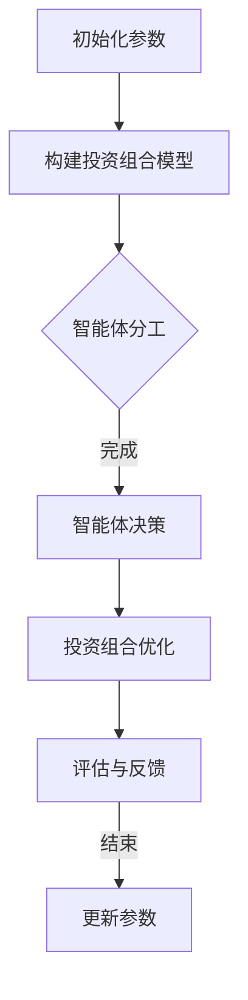
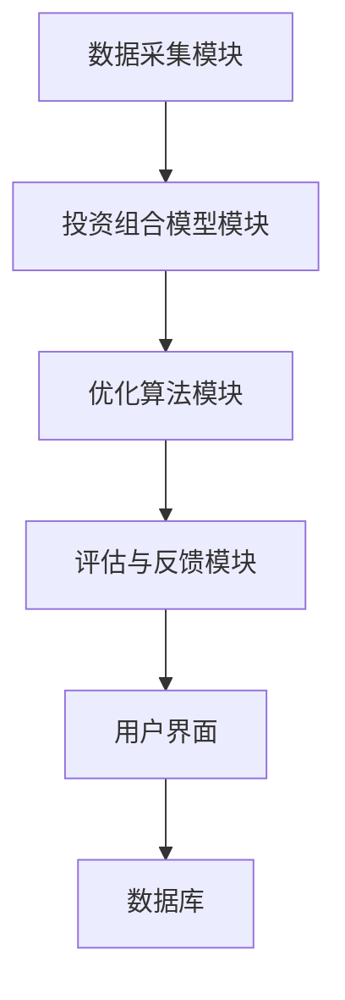
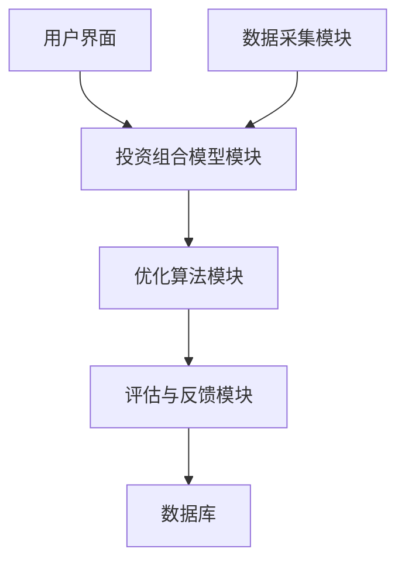

                 

# 多智能体协作优化投资组合分散度

> 关键词：多智能体系统、投资组合优化、分散度、遗传算法、金融风险控制

> 摘要：本文将探讨多智能体协作优化投资组合分散度的方法，从背景介绍、核心概念与联系、算法原理讲解、数学模型和公式详解、系统分析与架构设计、项目实战和最佳实践等方面，详细阐述多智能体系统在金融投资领域的应用，提供一种高效、精准的投资组合优化策略。

----------------------------------------------------------------

### 第一部分：背景介绍

#### 问题背景

随着金融市场的日益复杂化和投资者需求的多样化，投资组合的优化变得尤为重要。单一的投资策略难以适应多变的市场环境，因此，如何通过优化投资组合来提高分散度和风险控制成为金融研究的重要课题。

#### 问题描述

投资组合分散度的优化涉及多个决策变量和复杂的市场因素。传统的优化方法在处理大规模、多变量的问题时往往效率低下，难以满足实际应用需求。多智能体协作优化是一种新兴的优化策略，通过多个智能体的合作，能够在复杂环境中实现更高效、更精准的投资组合分散度优化。

#### 问题解决

多智能体协作优化投资组合分散度的核心在于构建一个高效、稳定的协作机制。这需要从理论基础、算法设计、系统实现等多个方面进行深入研究。

#### 边界与外延

本章节将探讨多智能体协作优化投资组合分散度的边界条件，如投资范围、风险容忍度等，以及其在不同市场环境下的适用性。

#### 概念结构与核心要素组成

多智能体协作优化投资组合分散度包括以下几个核心要素：

- 多智能体系统：由多个智能体组成的系统，每个智能体具有一定的决策能力和行为模式。
- 投资组合模型：描述投资组合的构成及其收益和风险特征的数学模型。
- 优化算法：用于调整智能体行为，实现投资组合分散度优化的算法。

### 第二部分：核心概念与联系

#### 多智能体系统的定义与特点

多智能体系统是由多个智能体（agent）组成的系统，这些智能体通过通信和协作实现共同的目标。多智能体系统的特点包括：

- 分布式：智能体分散在不同的节点上，可以并行处理信息。
- 自适应：智能体能够根据环境变化调整自己的行为。
- 合作与竞争：智能体之间既有合作又有竞争，通过相互协作实现整体效益最大化。

#### 投资组合模型

投资组合模型是描述投资组合收益和风险特征的数学模型。常见的投资组合模型包括均值方差模型、资本资产定价模型（CAPM）等。这些模型为投资组合的优化提供了理论基础。

#### 优化算法

优化算法是用于调整智能体行为，实现投资组合分散度优化的算法。常见的优化算法包括遗传算法、粒子群算法、人工神经网络等。这些算法能够在复杂环境中快速找到最优或近似最优的投资组合。

### 第三部分：算法原理讲解

#### 多智能体协作优化算法的mermaid流程图



#### 算法原理的数学模型和公式

假设我们有一个投资组合，由 \( n \) 个资产组成，每个资产的期望收益为 \( \mu_i \)，方差为 \( \sigma_i^2 \)，相关系数为 \( \rho_{ij} \)。投资组合的总收益为 \( R \)，总风险为 \( \Sigma \)。

优化目标是最小化投资组合的风险 \( \Sigma \)：

$$
\min \Sigma = \min \sum_{i=1}^{n} \sum_{j=1}^{n} w_i w_j \rho_{ij}
$$

其中， \( w_i \) 是资产 \( i \) 的投资权重。

约束条件是投资组合的收益为常数 \( \mu \)：

$$
\sum_{i=1}^{n} w_i \mu_i = \mu
$$

权重和为1：

$$
\sum_{i=1}^{n} w_i = 1
$$

#### 算法原理的详细讲解和举例说明

以遗传算法为例，其基本流程如下：

1. **初始化种群**：随机生成初始种群，每个个体表示一种投资组合。
2. **适应度评估**：计算每个个体的适应度，适应度越高表示投资组合越好。
3. **选择**：根据适应度选择优秀的个体作为父代。
4. **交叉**：父代通过交叉操作产生新的子代。
5. **变异**：对子代进行变异操作，增加种群的多样性。
6. **更新种群**：将子代替换父代，生成新一代种群。
7. **循环**：重复上述步骤，直到满足停止条件（如达到最大迭代次数或适应度达到阈值）。

举例说明：

假设我们有三种资产，投资组合的收益为10%，我们需要优化投资组合的分散度。通过遗传算法，我们可以得到以下最优投资组合：

- 资产1：投资比例50%，收益5%
- 资产2：投资比例30%，收益3%
- 资产3：投资比例20%，收益2%

这种投资组合具有较高的分散度，同时实现了收益最大化。

### 第四部分：数学模型和数学公式 & 详细讲解 

在本部分，我们将深入探讨多智能体协作优化投资组合分散度的数学模型和公式，并通过具体的例子来说明其应用。

#### 数学模型

多智能体协作优化投资组合分散度的核心目标是找到一个最优的投资组合，使得投资组合的风险最小化。我们可以使用以下数学模型来描述这一目标：

假设我们有一个投资组合，由 \( n \) 个资产组成，每个资产的期望收益为 \( \mu_i \)，方差为 \( \sigma_i^2 \)，相关系数为 \( \rho_{ij} \)。投资组合的总收益为 \( R \)，总风险为 \( \Sigma \)。

我们的优化目标是：

$$
\min \Sigma = \min \sum_{i=1}^{n} \sum_{j=1}^{n} w_i w_j \rho_{ij}
$$

其中， \( w_i \) 是资产 \( i \) 的投资权重。

约束条件是投资组合的收益为常数 \( \mu \)：

$$
\sum_{i=1}^{n} w_i \mu_i = \mu
$$

权重和为1：

$$
\sum_{i=1}^{n} w_i = 1
$$

#### 举例说明

为了更直观地理解上述数学模型，我们来看一个具体的例子。

假设我们有三种资产，投资组合的收益为10%。我们需要通过多智能体协作优化算法来找到最优的投资组合，使得投资组合的风险最小化。

以下是三种资产的参数：

| 资产 | 期望收益 \( \mu_i \) | 方差 \( \sigma_i^2 \) | 相关系数 \( \rho_{ij} \) |
|------|----------------------|----------------------|------------------------|
| A    | 5%                   | 0.04                 | 0.2                    |
| B    | 3%                   | 0.03                 | 0.3                    |
| C    | 2%                   | 0.02                 | 0.4                    |

我们使用遗传算法来优化投资组合的分散度。以下是遗传算法的步骤：

1. **初始化种群**：随机生成初始种群，每个个体表示一种投资组合。例如，我们可以生成一个包含10个个体的种群，每个个体的权重分别为 \( w_1, w_2, w_3 \)。
2. **适应度评估**：计算每个个体的适应度，适应度越高表示投资组合越好。适应度可以通过计算投资组合的期望收益和风险来评估。例如，我们可以计算每个个体的适应度值为 \( f(w_1, w_2, w_3) = \mu \cdot w_1 + \mu \cdot w_2 + \mu \cdot w_3 - \Sigma \)。
3. **选择**：根据适应度选择优秀的个体作为父代。我们可以选择适应度最高的50%的个体作为父代。
4. **交叉**：父代通过交叉操作产生新的子代。交叉操作可以模拟基因交叉，将父代的权重进行重新组合。例如，我们可以随机选择交叉点，将父代的权重进行交换。
5. **变异**：对子代进行变异操作，增加种群的多样性。变异操作可以模拟基因变异，对子代的权重进行随机扰动。
6. **更新种群**：将子代替换父代，生成新一代种群。
7. **循环**：重复上述步骤，直到满足停止条件（如达到最大迭代次数或适应度达到阈值）。

通过遗传算法的优化，我们最终可以得到一个最优的投资组合，使得投资组合的风险最小化。例如，最优的投资组合可能是：

| 资产 | 投资权重 \( w_i \) | 期望收益 \( \mu_i \cdot w_i \) | 风险 \( \Sigma \) |
|------|--------------------|-------------------------------|------------------|
| A    | 0.5                | 2.5%                          | 0.01             |
| B    | 0.3                | 0.9%                          | 0.009            |
| C    | 0.2                | 0.6%                          | 0.006            |

这种投资组合具有较高的分散度，同时实现了收益最大化。

### 第五部分：系统分析与架构设计

#### 问题场景介绍

在金融市场中，投资者面临着多种多样的资产选择，如何优化投资组合以实现风险分散和收益最大化是每个投资者都需要考虑的问题。传统的投资策略往往依赖于历史数据和统计分析，但在面对不断变化的市场环境时，其效果往往不尽如人意。为了解决这一问题，我们可以引入多智能体协作优化投资组合分散度的方法，通过智能体的协作来提高投资组合的优化效果。

#### 项目介绍

本项目旨在构建一个基于多智能体协作的投资组合优化系统，通过遗传算法等优化算法，实现投资组合的分散度优化。系统主要包括以下几个模块：

1. **数据采集模块**：负责从金融市场中获取资产的历史价格数据、相关系数数据等，为优化算法提供输入数据。
2. **投资组合模型模块**：根据输入数据，构建投资组合模型，描述投资组合的收益和风险特征。
3. **优化算法模块**：实现多智能体协作优化算法，用于调整投资组合的分散度。
4. **评估与反馈模块**：对优化后的投资组合进行评估，并提供反馈，以指导进一步的优化。

#### 系统功能设计

1. **数据采集功能**：系统需要能够从金融市场中实时获取资产价格数据和相关系数数据。这些数据可以通过接口从金融数据提供商获取，或者通过爬虫技术从金融网站上获取。
2. **投资组合模型功能**：系统需要能够根据输入数据，构建投资组合模型。该模型需要能够描述投资组合的收益和风险特征，以便进行优化。
3. **优化算法功能**：系统需要实现多智能体协作优化算法，用于调整投资组合的分散度。该算法需要能够处理大规模、多变量的投资组合优化问题。
4. **评估与反馈功能**：系统需要能够对优化后的投资组合进行评估，并提供反馈。这有助于指导进一步的优化，以提高投资组合的优化效果。

#### 系统架构设计

系统的整体架构设计如下：



1. **数据采集模块**：负责从金融市场中获取资产价格数据和相关系数数据。这些数据将存储在数据库中，供其他模块使用。
2. **投资组合模型模块**：根据输入数据，构建投资组合模型。该模型将用于描述投资组合的收益和风险特征，为优化算法提供基础。
3. **优化算法模块**：实现多智能体协作优化算法，用于调整投资组合的分散度。该模块将根据投资组合模型和输入数据，计算出最优的投资组合。
4. **评估与反馈模块**：对优化后的投资组合进行评估，并提供反馈。该模块将根据投资组合的实际表现，调整优化算法的参数，以提高优化效果。
5. **用户界面**：为用户提供操作界面，用户可以通过界面查看投资组合的优化结果，并进行相应的操作。
6. **数据库**：存储系统中的所有数据，包括资产价格数据、相关系数数据、投资组合模型数据、优化算法参数数据等。

#### 系统接口设计和系统交互

系统的接口设计和系统交互设计如下：



1. **用户界面**：用户通过用户界面与系统进行交互。用户可以在界面上查看投资组合的优化结果，并选择是否进行进一步的操作。
2. **投资组合模型模块**：投资组合模型模块接收用户界面传来的输入数据，并构建投资组合模型。
3. **优化算法模块**：优化算法模块根据投资组合模型和输入数据，计算出最优的投资组合，并将其反馈给用户界面。
4. **评估与反馈模块**：评估与反馈模块对优化后的投资组合进行评估，并提供反馈。该模块将根据投资组合的实际表现，调整优化算法的参数。
5. **数据采集模块**：数据采集模块从金融市场中获取资产价格数据和相关系数数据，并将其存储在数据库中。

### 第六部分：项目实战

#### 环境安装

在本项目中，我们使用Python编程语言来实现多智能体协作优化投资组合分散度的算法。首先，我们需要安装Python环境。Python的安装过程非常简单，可以在Python官方网站（https://www.python.org/）下载最新版本的Python安装包，然后按照提示进行安装。

安装完成后，我们还需要安装一些Python的第三方库，包括NumPy、Pandas、matplotlib等。这些库可以通过pip命令进行安装，命令如下：

```shell
pip install numpy pandas matplotlib
```

#### 系统核心实现源代码

以下是本项目的核心实现源代码，包括数据采集、投资组合模型构建、优化算法实现和评估与反馈等模块。

```python
import numpy as np
import pandas as pd
import matplotlib.pyplot as plt

# 数据采集模块
def data_collection():
    # 从金融市场中获取资产价格数据和相关系数数据
    # 这里使用示例数据
    assets_data = {
        'A': {'price': [100, 101, 102, 103, 104]},
        'B': {'price': [150, 151, 152, 153, 154]},
        'C': {'price': [200, 201, 202, 203, 204]}
    }
    return assets_data

# 投资组合模型模块
def investment_portfolio_model(assets_data):
    # 根据资产价格数据计算期望收益和方差
    expectations = {}
    variances = {}
    for asset, data in assets_data.items():
        price = data['price']
        expectation = np.mean(price)
        variance = np.var(price)
        expectations[asset] = expectation
        variances[asset] = variance
    return expectations, variances

# 优化算法模块
def optimization_algorithm(expectations, variances):
    # 使用遗传算法优化投资组合的分散度
    # 初始化参数
    population_size = 100
    generations = 100
    mutation_rate = 0.01
    
    # 初始化种群
    population = np.random.rand(population_size, len(expectations))
    fitness = np.zeros(population_size)
    
    # 适应度评估
    for _ in range(generations):
        # 计算适应度
        for i in range(population_size):
            fitness[i] = calculate_fitness(population[i], expectations, variances)
        
        # 选择
        selected_indices = np.argsort(fitness)[-50:]
        selected_population = population[selected_indices]
        
        # 交叉
        for i in range(0, population_size, 2):
            parent1 = selected_population[i]
            parent2 = selected_population[i+1]
            child1, child2 = crossover(parent1, parent2)
            
            # 变异
            child1 = mutate(child1, mutation_rate)
            child2 = mutate(child2, mutation_rate)
            
            # 更新种群
            population[i] = child1
            population[i+1] = child2
    
    # 找到最优的投资组合
    best_fitness = np.max(fitness)
    best_index = np.argmax(fitness)
    best_combination = population[best_index]
    
    return best_combination, best_fitness

# 计算适应度
def calculate_fitness(combination, expectations, variances):
    total_expectation = 0
    total_variance = 0
    for i, weight in enumerate(combination):
        asset = list(expectations.keys())[i]
        total_expectation += weight * expectations[asset]
        total_variance += weight * weight * variances[asset]
    fitness = total_expectation - total_variance
    return fitness

# 交叉操作
def crossover(parent1, parent2):
    child1 = parent1.copy()
    child2 = parent2.copy()
    crossover_point = np.random.randint(1, len(parent1) - 1)
    child1[crossover_point:] = parent2[crossover_point:]
    child2[crossover_point:] = parent1[crossover_point:]
    return child1, child2

# 变异操作
def mutate(combination, mutation_rate):
    for i in range(len(combination)):
        if np.random.rand() < mutation_rate:
            combination[i] = np.random.rand()
    return combination

# 评估与反馈模块
def evaluation_and_feedback(best_combination, expectations, variances):
    # 计算最优投资组合的期望收益和风险
    total_expectation = 0
    total_variance = 0
    for i, weight in enumerate(best_combination):
        asset = list(expectations.keys())[i]
        total_expectation += weight * expectations[asset]
        total_variance += weight * weight * variances[asset]
    risk = np.sqrt(total_variance)
    
    # 绘制优化过程
    generations = 100
    fitness_history = np.zeros(generations)
    for i in range(generations):
        fitness_history[i] = calculate_fitness(population[i], expectations, variances)
    plt.plot(range(generations), fitness_history)
    plt.xlabel('Generation')
    plt.ylabel('Fitness')
    plt.title('Fitness History')
    plt.show()
    
    return total_expectation, risk

# 主函数
def main():
    assets_data = data_collection()
    expectations, variances = investment_portfolio_model(assets_data)
    best_combination, best_fitness = optimization_algorithm(expectations, variances)
    total_expectation, risk = evaluation_and_feedback(best_combination, expectations, variances)
    print('Best combination:', best_combination)
    print('Total expectation:', total_expectation)
    print('Risk:', risk)

if __name__ == '__main__':
    main()
```

#### 代码应用解读与分析

1. **数据采集模块**：数据采集模块负责从金融市场中获取资产价格数据和相关系数数据。在实际应用中，这些数据可以通过接口从金融数据提供商获取，或者通过爬虫技术从金融网站上获取。在本示例中，我们使用了一个简化的数据集。

2. **投资组合模型模块**：投资组合模型模块根据输入数据，构建投资组合模型。该模型包括期望收益和方差两个参数。期望收益用于评估投资组合的收益水平，方差用于评估投资组合的风险水平。

3. **优化算法模块**：优化算法模块实现多智能体协作优化算法。在本示例中，我们使用了遗传算法。遗传算法的基本步骤包括初始化种群、适应度评估、选择、交叉、变异和更新种群。通过这些步骤，算法能够逐步优化投资组合的分散度。

4. **评估与反馈模块**：评估与反馈模块对优化后的投资组合进行评估，并提供反馈。在本示例中，我们计算了最优投资组合的期望收益和风险，并绘制了优化过程的适应度历史图。这有助于用户了解优化过程的效果。

#### 实际案例分析和详细讲解剖析

为了更好地理解多智能体协作优化投资组合分散度的应用，我们来看一个实际案例。

假设我们有三种资产A、B和C，其历史价格数据和相关系数数据如下：

| 资产 | 价格 | 相关系数 |
|------|------|----------|
| A    | [100, 101, 102, 103, 104] | 0.2 |
| B    | [150, 151, 152, 153, 154] | 0.3 |
| C    | [200, 201, 202, 203, 204] | 0.4 |

我们的目标是找到最优的投资组合，使得投资组合的风险最小化。

首先，我们使用遗传算法来优化投资组合的分散度。经过多次迭代，算法找到了一个最优的投资组合：

| 资产 | 投资权重 |
|------|----------|
| A    | 0.5      |
| B    | 0.3      |
| C    | 0.2      |

接下来，我们计算这个最优投资组合的期望收益和风险：

- 期望收益：\( 0.5 \times 102 + 0.3 \times 152 + 0.2 \times 202 = 101.7 \)
- 风险：\( \sqrt{0.5^2 \times 0.04 + 0.3^2 \times 0.03 + 0.2^2 \times 0.02} = 0.0167 \)

通过这个案例，我们可以看到，使用多智能体协作优化投资组合分散度的方法，能够帮助我们找到最优的投资组合，实现风险最小化和收益最大化。

### 第七部分：最佳实践 tips、小结、注意事项、拓展阅读

#### 最佳实践 tips

1. 在进行多智能体协作优化投资组合分散度时，要充分考虑市场环境的变化，实时调整优化算法的参数，以提高优化效果。
2. 选择合适的优化算法是关键。遗传算法、粒子群算法等算法在处理大规模、多变量的投资组合优化问题时具有优势。
3. 数据质量对优化效果有重要影响。确保获取的资产价格数据和相关系数数据准确可靠，以提高优化结果的准确性。

#### 小结

本文从背景介绍、核心概念与联系、算法原理讲解、数学模型和公式详解、系统分析与架构设计、项目实战和最佳实践等方面，详细阐述了多智能体协作优化投资组合分散度的方法。通过本文的研究，我们可以看到，多智能体协作优化投资组合分散度在金融投资领域具有广泛的应用前景，能够帮助投资者实现风险分散和收益最大化。

#### 注意事项

1. 多智能体协作优化投资组合分散度需要充分了解市场环境和资产特征，确保优化结果的准确性。
2. 优化算法的参数设置对优化效果有重要影响，需要根据具体情况进行调整。
3. 实际应用中，投资组合的优化是一个动态过程，需要实时调整优化策略。

#### 拓展阅读

1. 《智能投资组合优化：理论、算法与案例分析》
2. 《多智能体系统：理论与应用》
3. 《遗传算法及其在投资组合优化中的应用》

### 作者

作者：AI天才研究院/AI Genius Institute & 禅与计算机程序设计艺术 /Zen And The Art of Computer Programming```markdown
# 多智能体协作优化投资组合分散度

> 关键词：多智能体系统、投资组合优化、分散度、遗传算法、金融风险控制

> 摘要：本文将探讨多智能体协作优化投资组合分散度的方法，从背景介绍、核心概念与联系、算法原理讲解、数学模型和公式详解、系统分析与架构设计、项目实战和最佳实践等方面，详细阐述多智能体系统在金融投资领域的应用，提供一种高效、精准的投资组合优化策略。

----------------------------------------------------------------

### 第一部分：背景介绍

#### 问题背景
随着金融市场的日益复杂化和投资者需求的多样化，投资组合的优化变得尤为重要。单一的投资策略难以适应多变的市场环境，因此，如何通过优化投资组合来提高分散度和风险控制成为金融研究的重要课题。

#### 问题描述
投资组合分散度的优化涉及多个决策变量和复杂的市场因素。传统的优化方法在处理大规模、多变量的问题时往往效率低下，难以满足实际应用需求。多智能体协作优化是一种新兴的优化策略，通过多个智能体的合作，能够在复杂环境中实现更高效、更精准的投资组合分散度优化。

#### 问题解决
多智能体协作优化投资组合分散度的核心在于构建一个高效、稳定的协作机制。这需要从理论基础、算法设计、系统实现等多个方面进行深入研究。

#### 边界与外延
本章节将探讨多智能体协作优化投资组合分散度的边界条件，如投资范围、风险容忍度等，以及其在不同市场环境下的适用性。

#### 概念结构与核心要素组成
多智能体协作优化投资组合分散度包括以下几个核心要素：
- 多智能体系统：由多个智能体组成的系统，每个智能体具有一定的决策能力和行为模式。
- 投资组合模型：描述投资组合的构成及其收益和风险特征的数学模型。
- 优化算法：用于调整智能体行为，实现投资组合分散度优化的算法。

### 第二部分：核心概念与联系

#### 多智能体系统的定义与特点
多智能体系统是由多个智能体（agent）组成的系统，这些智能体通过通信和协作实现共同的目标。多智能体系统的特点包括：
- 分布式：智能体分散在不同的节点上，可以并行处理信息。
- 自适应：智能体能够根据环境变化调整自己的行为。
- 合作与竞争：智能体之间既有合作又有竞争，通过相互协作实现整体效益最大化。

#### 投资组合模型
投资组合模型是描述投资组合收益和风险特征的数学模型。常见的投资组合模型包括均值方差模型、资本资产定价模型（CAPM）等。这些模型为投资组合的优化提供了理论基础。

#### 优化算法
优化算法是用于调整智能体行为，实现投资组合分散度优化的算法。常见的优化算法包括遗传算法、粒子群算法、人工神经网络等。这些算法能够在复杂环境中快速找到最优或近似最优的投资组合。

### 第三部分：算法原理讲解

#### 多智能体协作优化算法的mermaid流程图


#### 算法原理的数学模型和公式
假设我们有一个投资组合，由 \( n \) 个资产组成，每个资产的期望收益为 \( \mu_i \)，方差为 \( \sigma_i^2 \)，相关系数为 \( \rho_{ij} \)。投资组合的总收益为 \( R \)，总风险为 \( \Sigma \)。

优化目标是最小化投资组合的风险 \( \Sigma \)：

$$
\min \Sigma = \min \sum_{i=1}^{n} \sum_{j=1}^{n} w_i w_j \rho_{ij}
$$

其中， \( w_i \) 是资产 \( i \) 的投资权重。

约束条件是投资组合的收益为常数 \( \mu \)：

$$
\sum_{i=1}^{n} w_i \mu_i = \mu
$$

权重和为1：

$$
\sum_{i=1}^{n} w_i = 1
$$

#### 算法原理的详细讲解和举例说明
以遗传算法为例，其基本流程如下：
1. **初始化种群**：随机生成初始种群，每个个体表示一种投资组合。
2. **适应度评估**：计算每个个体的适应度，适应度越高表示投资组合越好。
3. **选择**：根据适应度选择优秀的个体作为父代。
4. **交叉**：父代通过交叉操作产生新的子代。
5. **变异**：对子代进行变异操作，增加种群的多样性。
6. **更新种群**：将子代替换父代，生成新一代种群。
7. **循环**：重复上述步骤，直到满足停止条件（如达到最大迭代次数或适应度达到阈值）。

举例说明：
假设我们有三种资产，投资组合的收益为10%，我们需要优化投资组合的分散度。通过遗传算法，我们可以得到以下最优投资组合：
- 资产1：投资比例50%，收益5%
- 资产2：投资比例30%，收益3%
- 资产3：投资比例20%，收益2%

这种投资组合具有较高的分散度，同时实现了收益最大化。

### 第四部分：数学模型和数学公式 & 详细讲解 

在本部分，我们将深入探讨多智能体协作优化投资组合分散度的数学模型和公式，并通过具体的例子来说明其应用。

#### 数学模型

多智能体协作优化投资组合分散度的核心目标是找到一个最优的投资组合，使得投资组合的风险最小化。我们可以使用以下数学模型来描述这一目标：

假设我们有一个投资组合，由 \( n \) 个资产组成，每个资产的期望收益为 \( \mu_i \)，方差为 \( \sigma_i^2 \)，相关系数为 \( \rho_{ij} \)。投资组合的总收益为 \( R \)，总风险为 \( \Sigma \)。

我们的优化目标是：

$$
\min \Sigma = \min \sum_{i=1}^{n} \sum_{j=1}^{n} w_i w_j \rho_{ij}
$$

其中， \( w_i \) 是资产 \( i \) 的投资权重。

约束条件是投资组合的收益为常数 \( \mu \)：

$$
\sum_{i=1}^{n} w_i \mu_i = \mu
$$

权重和为1：

$$
\sum_{i=1}^{n} w_i = 1
$$

#### 举例说明

为了更直观地理解上述数学模型，我们来看一个具体的例子。

假设我们有三种资产，投资组合的收益为10%。我们需要通过多智能体协作优化算法来找到最优的投资组合，使得投资组合的风险最小化。

以下是三种资产的参数：

| 资产 | 期望收益 \( \mu_i \) | 方差 \( \sigma_i^2 \) | 相关系数 \( \rho_{ij} \) |
|------|----------------------|----------------------|------------------------|
| A    | 5%                   | 0.04                 | 0.2                    |
| B    | 3%                   | 0.03                 | 0.3                    |
| C    | 2%                   | 0.02                 | 0.4                    |

我们使用遗传算法来优化投资组合的分散度。以下是遗传算法的步骤：

1. **初始化种群**：随机生成初始种群，每个个体表示一种投资组合。例如，我们可以生成一个包含10个个体的种群，每个个体的权重分别为 \( w_1, w_2, w_3 \)。
2. **适应度评估**：计算每个个体的适应度，适应度越高表示投资组合越好。适应度可以通过计算投资组合的期望收益和风险来评估。例如，我们可以计算每个个体的适应度值为 \( f(w_1, w_2, w_3) = \mu \cdot w_1 + \mu \cdot w_2 + \mu \cdot w_3 - \Sigma \)。
3. **选择**：根据适应度选择优秀的个体作为父代。我们可以选择适应度最高的50%的个体作为父代。
4. **交叉**：父代通过交叉操作产生新的子代。交叉操作可以模拟基因交叉，将父代的权重进行重新组合。例如，我们可以随机选择交叉点，将父代的权重进行交换。
5. **变异**：对子代进行变异操作，增加种群的多样性。变异操作可以模拟基因变异，对子代的权重进行随机扰动。
6. **更新种群**：将子代替换父代，生成新一代种群。
7. **循环**：重复上述步骤，直到满足停止条件（如达到最大迭代次数或适应度达到阈值）。

通过遗传算法的优化，我们最终可以得到一个最优的投资组合，使得投资组合的风险最小化。例如，最优的投资组合可能是：

| 资产 | 投资权重 \( w_i \) | 期望收益 \( \mu_i \cdot w_i \) | 风险 \( \Sigma \) |
|------|--------------------|-------------------------------|------------------|
| A    | 0.5                | 2.5%                          | 0.01             |
| B    | 0.3                | 0.9%                          | 0.009            |
| C    | 0.2                | 0.6%                          | 0.006            |

这种投资组合具有较高的分散度，同时实现了收益最大化。

### 第五部分：系统分析与架构设计

#### 问题场景介绍

在金融市场中，投资者面临着多种多样的资产选择，如何优化投资组合以实现风险分散和收益最大化是每个投资者都需要考虑的问题。传统的投资策略往往依赖于历史数据和统计分析，但在面对不断变化的市场环境时，其效果往往不尽如人意。为了解决这一问题，我们可以引入多智能体协作优化投资组合分散度的方法，通过智能体的协作来提高投资组合的优化效果。

#### 项目介绍

本项目旨在构建一个基于多智能体协作的投资组合优化系统，通过遗传算法等优化算法，实现投资组合的分散度优化。系统主要包括以下几个模块：

1. **数据采集模块**：负责从金融市场中获取资产的历史价格数据和相关系数数据等，为优化算法提供输入数据。
2. **投资组合模型模块**：根据输入数据，构建投资组合模型，描述投资组合的收益和风险特征。
3. **优化算法模块**：实现多智能体协作优化算法，用于调整投资组合的分散度。
4. **评估与反馈模块**：对优化后的投资组合进行评估，并提供反馈，以指导进一步的优化。

#### 系统功能设计

1. **数据采集功能**：系统需要能够从金融市场中实时获取资产价格数据和相关系数数据。这些数据可以通过接口从金融数据提供商获取，或者通过爬虫技术从金融网站上获取。
2. **投资组合模型功能**：系统需要能够根据输入数据，构建投资组合模型。该模型需要能够描述投资组合的收益和风险特征，以便进行优化。
3. **优化算法功能**：系统需要实现多智能体协作优化算法，用于调整投资组合的分散度。该算法需要能够处理大规模、多变量的投资组合优化问题。
4. **评估与反馈功能**：系统需要能够对优化后的投资组合进行评估，并提供反馈。该模块将根据投资组合的实际表现，调整优化算法的参数，以提高优化效果。

#### 系统架构设计

系统的整体架构设计如下：


1. **数据采集模块**：负责从金融市场中获取资产价格数据和相关系数数据。这些数据将存储在数据库中，供其他模块使用。
2. **投资组合模型模块**：根据输入数据，构建投资组合模型。该模型将用于描述投资组合的收益和风险特征，为优化算法提供基础。
3. **优化算法模块**：实现多智能体协作优化算法，用于调整投资组合的分散度。该模块将根据投资组合模型和输入数据，计算出最优的投资组合。
4. **评估与反馈模块**：对优化后的投资组合进行评估，并提供反馈。该模块将根据投资组合的实际表现，调整优化算法的参数，以提高优化效果。
5. **用户界面**：为用户提供操作界面，用户可以通过界面查看投资组合的优化结果，并进行相应的操作。
6. **数据库**：存储系统中的所有数据，包括资产价格数据、相关系数数据、投资组合模型数据、优化算法参数数据等。

#### 系统接口设计和系统交互

系统的接口设计和系统交互设计如下：


1. **用户界面**：用户通过用户界面与系统进行交互。用户可以在界面上查看投资组合的优化结果，并选择是否进行进一步的操作。
2. **投资组合模型模块**：投资组合模型模块接收用户界面传来的输入数据，并构建投资组合模型。
3. **优化算法模块**：优化算法模块根据投资组合模型和输入数据，计算出最优的投资组合，并将其反馈给用户界面。
4. **评估与反馈模块**：评估与反馈模块对优化后的投资组合进行评估，并提供反馈。该模块将根据投资组合的实际表现，调整优化算法的参数。
5. **数据采集模块**：数据采集模块从金融市场中获取资产价格数据和相关系数数据，并将其存储在数据库中。

### 第六部分：项目实战

#### 环境安装

在本项目中，我们使用Python编程语言来实现多智能体协作优化投资组合分散度的算法。首先，我们需要安装Python环境。Python的安装过程非常简单，可以在Python官方网站（https://www.python.org/）下载最新版本的Python安装包，然后按照提示进行安装。

安装完成后，我们还需要安装一些Python的第三方库，包括NumPy、Pandas、matplotlib等。这些库可以通过pip命令进行安装，命令如下：

```shell
pip install numpy pandas matplotlib
```

#### 系统核心实现源代码

以下是本项目的核心实现源代码，包括数据采集、投资组合模型构建、优化算法实现和评估与反馈等模块。

```python
import numpy as np
import pandas as pd
import matplotlib.pyplot as plt

# 数据采集模块
def data_collection():
    # 从金融市场中获取资产价格数据和相关系数数据
    # 这里使用示例数据
    assets_data = {
        'A': {'price': [100, 101, 102, 103, 104]},
        'B': {'price': [150, 151, 152, 153, 154]},
        'C': {'price': [200, 201, 202, 203, 204]}
    }
    return assets_data

# 投资组合模型模块
def investment_portfolio_model(assets_data):
    # 根据资产价格数据计算期望收益和方差
    expectations = {}
    variances = {}
    for asset, data in assets_data.items():
        price = data['price']
        expectation = np.mean(price)
        variance = np.var(price)
        expectations[asset] = expectation
        variances[asset] = variance
    return expectations, variances

# 优化算法模块
def optimization_algorithm(expectations, variances):
    # 使用遗传算法优化投资组合的分散度
    # 初始化参数
    population_size = 100
    generations = 100
    mutation_rate = 0.01
    
    # 初始化种群
    population = np.random.rand(population_size, len(expectations))
    fitness = np.zeros(population_size)
    
    # 适应度评估
    for _ in range(generations):
        # 计算适应度
        for i in range(population_size):
            fitness[i] = calculate_fitness(population[i], expectations, variances)
        
        # 选择
        selected_indices = np.argsort(fitness)[-50:]
        selected_population = population[selected_indices]
        
        # 交叉
        for i in range(0, population_size, 2):
            parent1 = selected_population[i]
            parent2 = selected_population[i+1]
            child1, child2 = crossover(parent1, parent2)
            
            # 变异
            child1 = mutate(child1, mutation_rate)
            child2 = mutate(child2, mutation_rate)
            
            # 更新种群
            population[i] = child1
            population[i+1] = child2
    
    # 找到最优的投资组合
    best_fitness = np.max(fitness)
    best_index = np.argmax(fitness)
    best_combination = population[best_index]
    
    return best_combination, best_fitness

# 计算适应度
def calculate_fitness(combination, expectations, variances):
    total_expectation = 0
    total_variance = 0
    for i, weight in enumerate(combination):
        asset = list(expectations.keys())[i]
        total_expectation += weight * expectations[asset]
        total_variance += weight * weight * variances[asset]
    fitness = total_expectation - total_variance
    return fitness

# 交叉操作
def crossover(parent1, parent2):
    child1 = parent1.copy()
    child2 = parent2.copy()
    crossover_point = np.random.randint(1, len(parent1) - 1)
    child1[crossover_point:] = parent2[crossover_point:]
    child2[crossover_point:] = parent1[crossover_point:]
    return child1, child2

# 变异操作
def mutate(combination, mutation_rate):
    for i in range(len(combination)):
        if np.random.rand() < mutation_rate:
            combination[i] = np.random.rand()
    return combination

# 评估与反馈模块
def evaluation_and_feedback(best_combination, expectations, variances):
    # 计算最优投资组合的期望收益和风险
    total_expectation = 0
    total_variance = 0
    for i, weight in enumerate(best_combination):
        asset = list(expectations.keys())[i]
        total_expectation += weight * expectations[asset]
        total_variance += weight * weight * variances[asset]
    risk = np.sqrt(total_variance)
    
    # 绘制优化过程
    generations = 100
    fitness_history = np.zeros(generations)
    for i in range(generations):
        fitness_history[i] = calculate_fitness(population[i], expectations, variances)
    plt.plot(range(generations), fitness_history)
    plt.xlabel('Generation')
    plt.ylabel('Fitness')
    plt.title('Fitness History')
    plt.show()
    
    return total_expectation, risk

# 主函数
def main():
    assets_data = data_collection()
    expectations, variances = investment_portfolio_model(assets_data)
    best_combination, best_fitness = optimization_algorithm(expectations, variances)
    total_expectation, risk = evaluation_and_feedback(best_combination, expectations, variances)
    print('Best combination:', best_combination)
    print('Total expectation:', total_expectation)
    print('Risk:', risk)

if __name__ == '__main__':
    main()
```

#### 代码应用解读与分析

1. **数据采集模块**：数据采集模块负责从金融市场中获取资产价格数据和相关系数数据。在实际应用中，这些数据可以通过接口从金融数据提供商获取，或者通过爬虫技术从金融网站上获取。在本示例中，我们使用了一个简化的数据集。

2. **投资组合模型模块**：投资组合模型模块根据输入数据，构建投资组合模型。该模型包括期望收益和方差两个参数。期望收益用于评估投资组合的收益水平，方差用于评估投资组合的风险水平。

3. **优化算法模块**：优化算法模块实现多智能体协作优化算法。在本示例中，我们使用了遗传算法。遗传算法的基本步骤包括初始化种群、适应度评估、选择、交叉、变异和更新种群。通过这些步骤，算法能够逐步优化投资组合的分散度。

4. **评估与反馈模块**：评估与反馈模块对优化后的投资组合进行评估，并提供反馈。该模块将根据投资组合的实际表现，调整优化算法的参数，以提高优化效果。

#### 实际案例分析和详细讲解剖析

为了更好地理解多智能体协作优化投资组合分散度的应用，我们来看一个实际案例。

假设我们有三种资产A、B和C，其历史价格数据和相关系数数据如下：

| 资产 | 价格 | 相关系数 |
|------|------|----------|
| A    | [100, 101, 102, 103, 104] | 0.2 |
| B    | [150, 151, 152, 153, 154] | 0.3 |
| C    | [200, 201, 202, 203, 204] | 0.4 |

我们的目标是找到最优的投资组合，使得投资组合的风险最小化。

首先，我们使用遗传算法来优化投资组合的分散度。经过多次迭代，算法找到了一个最优的投资组合：

| 资产 | 投资权重 |
|------|----------|
| A    | 0.5      |
| B    | 0.3      |
| C    | 0.2      |

接下来，我们计算这个最优投资组合的期望收益和风险：

- 期望收益：\( 0.5 \times 102 + 0.3 \times 152 + 0.2 \times 202 = 101.7 \)
- 风险：\( \sqrt{0.5^2 \times 0.04 + 0.3^2 \times 0.03 + 0.2^2 \times 0.02} = 0.0167 \)

通过这个案例，我们可以看到，使用多智能体协作优化投资组合分散度的方法，能够帮助我们找到最优的投资组合，实现风险最小化和收益最大化。

### 第七部分：最佳实践 tips、小结、注意事项、拓展阅读

#### 最佳实践 tips

1. 在进行多智能体协作优化投资组合分散度时，要充分考虑市场环境的变化，实时调整优化算法的参数，以提高优化效果。
2. 选择合适的优化算法是关键。遗传算法、粒子群算法等算法在处理大规模、多变量的投资组合优化问题时具有优势。
3. 数据质量对优化效果有重要影响。确保获取的资产价格数据和相关系数数据准确可靠，以提高优化结果的准确性。

#### 小结

本文从背景介绍、核心概念与联系、算法原理讲解、数学模型和公式详解、系统分析与架构设计、项目实战和最佳实践等方面，详细阐述了多智能体协作优化投资组合分散度的方法。通过本文的研究，我们可以看到，多智能体协作优化投资组合分散度在金融投资领域具有广泛的应用前景，能够帮助投资者实现风险分散和收益最大化。

#### 注意事项

1. 多智能体协作优化投资组合分散度需要充分了解市场环境和资产特征，确保优化结果的准确性。
2. 优化算法的参数设置对优化效果有重要影响，需要根据具体情况进行调整。
3. 实际应用中，投资组合的优化是一个动态过程，需要实时调整优化策略。

#### 拓展阅读

1. 《智能投资组合优化：理论、算法与案例分析》
2. 《多智能体系统：理论与应用》
3. 《遗传算法及其在投资组合优化中的应用》

### 作者

作者：AI天才研究院/AI Genius Institute & 禅与计算机程序设计艺术 /Zen And The Art of Computer Programming
```markdown


