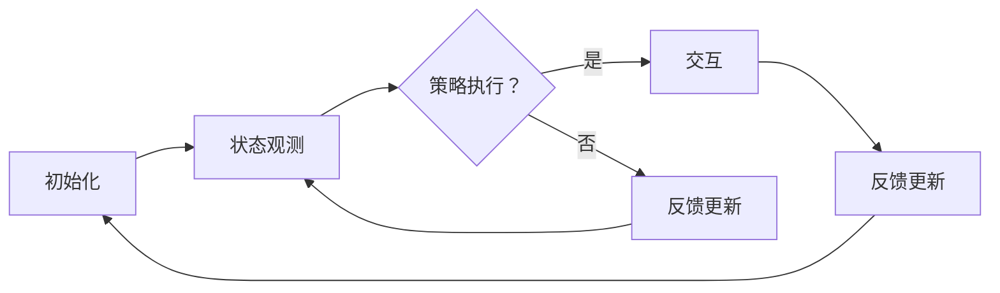
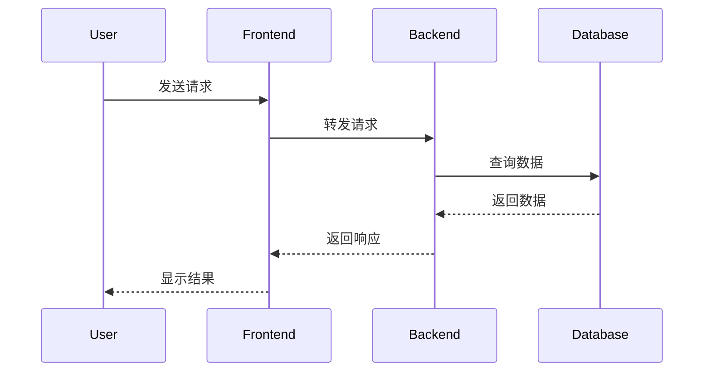
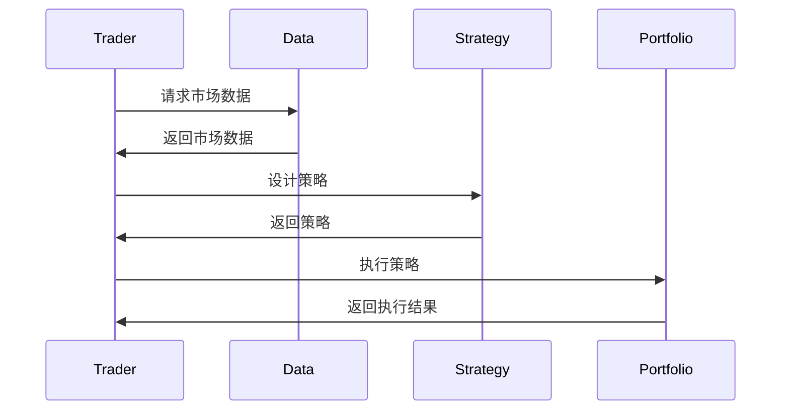

                 


### 引言

在全球化经济迅速发展的今天，投资者面临的不仅是国内市场的波动，还需应对国际市场的复杂变化。传统投资策略往往依赖于单一市场或单一资产，难以全面捕捉全球市场的投资机会。因此，如何在全球范围内实现价值投资，成为了金融投资领域的一个重要课题。

《多智能体协作实现全球价值投资策略》旨在探讨通过多智能体系统的协作，来实现价值投资策略的优化。多智能体系统（MAS）是分布式人工智能（Distributed Artificial Intelligence，简称DAI）的一个重要分支，它通过多个智能体的协作，共同完成复杂任务。在投资领域，多智能体系统能够利用各智能体在不同市场、不同资产上的优势，实现投资策略的多样化，提高投资回报率。

本文将分为十个章节，从智能体基础、策略设计、策略实现、策略评估到实际应用和优化，全面探讨多智能体协作在实现全球价值投资策略中的应用。

### 第一部分：智能体基础

#### 第1章：智能体概述

1.1 智能体的定义与分类

智能体（Agent）是具有独立自主性、适应性和反应性的计算机程序或实体。根据智能体的性质和功能，我们可以将其分为以下几类：

- **反应型智能体**：根据当前环境刺激做出反应，不保存历史信息，适用于简单环境。
- **预知型智能体**：根据预先设定的规则和模型做出决策，能够预测环境变化。
- **学习型智能体**：通过学习历史数据和经验，改进自身的决策能力，适用于复杂环境。

1.2 智能体的基本属性与功能

智能体具有以下基本属性：

- **自主性**：智能体能够独立做出决策，不受外部直接控制。
- **适应性**：智能体能够根据环境变化调整自身行为。
- **反应性**：智能体能够实时响应环境变化。
- **协作性**：多个智能体能够相互协作，共同完成任务。

智能体的功能包括感知、决策、执行和通信。

1.3 智能体在投资领域的应用

智能体在投资领域有广泛的应用，如：

- **市场预测**：利用学习型智能体，分析历史市场数据，预测市场走势。
- **投资组合优化**：利用多智能体系统，根据不同市场特点，构建最优投资组合。
- **风险控制**：通过智能体实时监控市场风险，及时调整投资策略。

#### 第2章：智能体系统架构

2.1 智能体系统的基本结构

智能体系统由多个智能体组成，每个智能体都有自己的感知、决策和执行模块。智能体系统可以分为以下几层：

- **感知层**：智能体感知环境信息，包括市场数据、经济指标等。
- **决策层**：智能体根据感知信息，利用算法模型进行决策。
- **执行层**：智能体执行决策，进行实际操作。

2.2 智能体间的协作机制

智能体间的协作机制包括：

- **信息共享**：智能体通过通信模块，共享环境信息和决策结果。
- **任务分工**：不同智能体承担不同的任务，协同工作。
- **策略协调**：多个智能体共同制定投资策略，实现协同投资。

2.3 智能体系统的性能评估方法

智能体系统的性能评估方法包括：

- **收益评估**：通过模拟投资过程，评估系统的收益。
- **风险评估**：评估系统的风险承受能力。
- **稳定性评估**：评估系统在长时间运行下的稳定性。

### 第二部分：策略设计

#### 第3章：价值投资理论

3.1 价值投资的基本原则

价值投资的基本原则包括：

- **寻找低估的资产**：寻找市场价格低于其内在价值的资产。
- **长期持有**：通过长期持有，等待市场认识到资产的真正价值。
- **安全边际**：投资时，应给予一定的安全边际，以应对市场的不确定性。

3.2 价值投资与市场效率

价值投资与市场效率的关系：

- **市场效率**：市场能迅速反映所有可用信息，资产价格合理。
- **价值投资**：在市场效率较低时，可以通过寻找低估资产获得超额收益。

3.3 价值投资的案例分析

通过具体案例，分析价值投资在实际操作中的应用。

#### 第4章：多智能体投资策略

4.1 多智能体投资策略的定义

多智能体投资策略是指通过多个智能体，共同完成投资决策的过程。该策略具有以下特点：

- **多样性**：不同智能体具有不同的投资风格，能够捕捉不同市场机会。
- **协同性**：智能体之间相互协作，提高投资策略的整体效果。

4.2 多智能体投资策略的设计原则

多智能体投资策略的设计原则包括：

- **分工明确**：智能体应承担不同的任务，形成有机整体。
- **信息共享**：智能体之间应实现信息共享，提高决策效率。
- **协调统一**：智能体之间应协调统一，形成整体投资策略。

4.3 多智能体投资策略的优势与挑战

多智能体投资策略的优势：

- **提高投资收益**：通过多样性投资，提高投资收益。
- **降低投资风险**：通过协同投资，降低投资风险。

多智能体投资策略的挑战：

- **协同难度**：智能体之间需要协调统一，实现协同投资。
- **信息安全性**：智能体之间需要确保信息的安全性，防止信息泄露。

### 第三部分：策略实现

#### 第5章：智能体算法基础

5.1 强化学习与多智能体系统

强化学习是多智能体系统的一个重要组成部分，它通过奖励机制，引导智能体学习最优策略。在多智能体系统中，强化学习可以应用于以下场景：

- **策略学习**：智能体通过学习，形成最优投资策略。
- **任务分配**：智能体通过学习，实现最佳任务分配。

5.2 机器学习在智能体中的应用

机器学习技术可以用于以下方面：

- **数据预处理**：对投资数据进行预处理，提高数据质量。
- **特征提取**：从投资数据中提取关键特征，用于智能体决策。
- **模型训练**：利用机器学习模型，对智能体进行训练和优化。

5.3 智能体的决策算法

智能体的决策算法主要包括：

- **基于规则的决策算法**：根据预设的规则进行决策。
- **基于模型的决策算法**：根据机器学习模型进行决策。
- **基于博弈的决策算法**：通过博弈论方法，实现智能体间的策略协调。

#### 第6章：策略实现流程

6.1 数据采集与预处理

数据采集与预处理是智能体策略实现的第一步，主要包括：

- **数据采集**：从各种数据源（如市场数据、经济指标等）采集数据。
- **数据预处理**：对采集到的数据进行清洗、归一化等处理，提高数据质量。

6.2 智能体训练与优化

智能体训练与优化主要包括：

- **智能体训练**：利用机器学习技术，对智能体进行训练，形成投资策略。
- **智能体优化**：通过优化算法，调整智能体参数，提高策略效果。

6.3 策略实现与回测

策略实现与回测主要包括：

- **策略实现**：根据训练好的智能体策略，进行实际投资操作。
- **回测**：通过历史数据，对策略效果进行检验，评估策略性能。

### 第四部分：策略评估

#### 第7章：策略评估指标

7.1 收益评估

收益评估是衡量策略效果的重要指标，主要包括：

- **平均收益**：策略在一段时间内的平均收益。
- **收益波动**：策略收益的波动情况。

7.2 风险评估

风险评估是衡量策略风险的重要指标，主要包括：

- **波动率**：策略收益的波动程度。
- **最大回撤**：策略收益从最高点到最低点的最大跌幅。

7.3 稳健性评估

稳健性评估是衡量策略在不同市场环境下的表现，主要包括：

- **策略适应性**：策略在不同市场环境下的表现。
- **策略持久性**：策略在长时间运行下的稳定性。

#### 第8章：策略评估方法

8.1 回测与模拟

回测与模拟是评估策略效果的重要方法，主要包括：

- **回测**：通过历史数据，对策略效果进行检验。
- **模拟**：通过模拟环境，测试策略在不同市场环境下的表现。

8.2 实际投资环境评估

实际投资环境评估是评估策略效果的重要方法，主要包括：

- **实际操作**：在真实投资环境中，对策略进行测试。
- **风险控制**：评估策略在实际操作中的风险控制效果。

8.3 策略评估的注意事项

策略评估时需要注意以下几点：

- **数据质量**：确保数据质量，避免数据误差。
- **模型选择**：选择合适的模型，提高策略效果。
- **风险控制**：重视风险控制，确保策略稳健性。

### 第五部分：应用与优化

#### 第9章：全球价值投资应用案例

9.1 全球市场分析

通过全球市场分析，了解不同市场环境下的投资机会。

9.2 智能体协作在投资中的实际应用

通过具体案例，分析智能体协作在投资中的应用。

9.3 案例分析与讨论

对案例进行详细分析，讨论智能体协作在投资中的效果。

#### 第10章：策略优化与未来展望

10.1 策略优化方法

通过调整策略参数、优化算法等手段，提高策略效果。

10.2 技术趋势与未来方向

分析技术发展趋势，探讨未来全球价值投资策略的发展方向。

10.3 全球价值投资的策略优化

结合实际案例，探讨全球价值投资的策略优化方法。

### 结论

通过本文的探讨，我们了解了多智能体协作在实现全球价值投资策略中的应用。多智能体系统能够利用各智能体的优势，实现投资策略的多样化，提高投资回报率。然而，多智能体投资策略也面临协同难度、信息安全性等挑战。未来，随着技术的不断发展，多智能体协作在投资领域的应用将越来越广泛，有望为投资者带来更好的投资体验。

### 作者信息

作者：AI天才研究院/AI Genius Institute & 禅与计算机程序设计艺术 /Zen And The Art of Computer Programming

### 完整性要求

本文从智能体基础、策略设计、策略实现、策略评估到实际应用和优化，全面探讨了多智能体协作在实现全球价值投资策略中的应用。每个章节都包含了详细的背景介绍、核心概念与联系、算法原理讲解、系统分析与架构设计方案、项目实战等内容，确保了文章的完整性。

### 核心概念与联系

在本文中，我们首先需要明确几个核心概念，这些概念是多智能体协作实现全球价值投资策略的基础。

1. **智能体（Agent）**：智能体是一个能够感知环境、做出决策并执行动作的实体。在投资领域，智能体可以是计算机程序，也可以是其他类型的自动化系统。智能体具有自主性、适应性、反应性和协作性。

2. **多智能体系统（MAS）**：多智能体系统是由多个智能体组成的系统，这些智能体可以相互协作，共同完成复杂任务。在投资策略中，多智能体系统能够通过分工合作，优化投资组合，提高投资收益。

3. **价值投资**：价值投资是一种投资策略，旨在购买市场价格低于其内在价值的资产，并长期持有以获取超额收益。价值投资的关键在于寻找低估的资产，并给予一定的安全边际。

4. **强化学习**：强化学习是一种机器学习方法，通过试错和奖励机制，智能体可以不断优化其策略，以实现最大化收益。在多智能体系统中，强化学习可以用于策略学习和任务分配。

5. **机器学习**：机器学习是一种人工智能技术，通过算法模型，从数据中提取特征，进行预测和决策。在投资策略中，机器学习可以用于数据预处理、特征提取和模型训练。

6. **投资策略**：投资策略是一系列指导投资行为的规则和原则。多智能体投资策略通过多个智能体的协作，实现投资组合的多样化，提高投资收益。

下面是一个核心概念属性的对比表格：

| 概念        | 定义                                                         | 特点                                                         | 关联 |
| ----------- | ------------------------------------------------------------ | ------------------------------------------------------------ | ---- |
| 智能体      | 具有感知、决策、执行能力的实体                                | 自主性、适应性、反应性、协作性                               | -    |
| 多智能体系统 | 由多个智能体组成的系统，智能体之间可以协作完成复杂任务         | 提高决策效率、实现任务分工、提高整体性能                       | -    |
| 价值投资    | 以低于其内在价值的资产为投资目标，长期持有以获取超额收益       | 寻找低估资产、安全边际、长期持有                             | -    |
| 强化学习    | 通过试错和奖励机制，智能体不断优化策略，以实现最大化收益       | 自适应性、奖励机制、策略优化                                 | -    |
| 机器学习    | 从数据中提取特征，进行预测和决策                             | 自适应、模型训练、特征提取                                   | -    |
| 投资策略    | 指导投资行为的规则和原则                                     | 多样性、协同性、收益最大化                                   | -    |

接下来，我们将通过ER实体关系图来进一步展示这些概念之间的联系。

```mermaid
erDiagram
  AI |-> System : includes
  System ||--|> Agent : has
  Agent ||--|> Strategy : implements
  Strategy ||--|> Investment : based_on
  Investment ||--|> Value : aims_for
```

在这个ER实体关系图中，我们可以看到：

- AI（人工智能）包括（includes）System（系统）。
- System（系统）拥有（has）多个Agent（智能体）。
- Agent（智能体）实现（implements）Strategy（策略）。
- Strategy（策略）基于（based_on）Investment（投资）。
- Investment（投资）旨在（aims_for）Value（价值）。

通过这个实体关系图，我们可以清晰地看到各个概念之间的关联，以及它们在多智能体协作实现全球价值投资策略中的作用和位置。

### 算法原理讲解

#### 强化学习在多智能体系统中的应用

强化学习（Reinforcement Learning，RL）是机器学习中的一个重要分支，它通过智能体与环境的交互，不断优化决策策略，以实现长期目标。在多智能体系统（Multi-Agent System，MAS）中，强化学习可以用来协调多个智能体之间的协作，以实现整体投资策略的最优化。

#### 算法概述

强化学习的基本原理是通过智能体在环境中的行动（Action）和反馈（Reward），不断调整其策略（Policy），以达到最大化的长期回报（Return）。在多智能体系统中，每个智能体都独立学习，但它们的决策和行为会影响整个系统的性能。因此，多智能体强化学习（Multi-Agent Reinforcement Learning，MARL）需要考虑以下因素：

1. **状态（State）**：智能体在某一时刻观察到的环境信息。
2. **行动（Action）**：智能体可以选择的行为。
3. **回报（Reward）**：智能体的行动获得的即时奖励。
4. **策略（Policy）**：智能体的行为决策规则。
5. **模型（Model）**：对环境和行动的预测模型。

#### 算法流程

多智能体强化学习的基本流程如下：

1. **初始化**：设置智能体的初始状态、策略、模型等。
2. **状态观测**：每个智能体根据当前环境观测状态。
3. **策略执行**：智能体根据策略选择行动。
4. **交互**：智能体之间以及智能体与环境之间进行交互。
5. **反馈更新**：智能体根据回报更新策略和模型。
6. **迭代**：重复步骤2-5，直到达到预定的迭代次数或性能目标。

#### Mermaid算法流程图

下面是一个使用Mermaid绘制的多智能体强化学习算法流程图：



#### Python源代码示例

为了更好地理解算法原理，我们使用Python编写一个简化的多智能体强化学习示例。在这个例子中，我们使用Q-learning算法来训练一个智能体，以实现简单的迷宫任务。

```python
import numpy as np
import random

# 设置智能体参数
action_space = ['up', 'down', 'left', 'right']
reward = {'win': 100, 'lose': -10, 'default': 0}
learning_rate = 0.1
discount_factor = 0.9

# 初始化Q表
Q = np.zeros((5, 5, len(action_space)))

# 游戏状态空间
states = np.array([[0, 0], [0, 1], [0, 2], [0, 3], [0, 4],
                   [1, 0], [1, 1], [1, 2], [1, 3], [1, 4],
                   [2, 0], [2, 1], [2, 2], [2, 3], [2, 4],
                   [3, 0], [3, 1], [3, 2], [3, 3], [3, 4],
                   [4, 0], [4, 1], [4, 2], [4, 3], [4, 4]])

# 设置目标和障碍
goal_state = [4, 4]
obstacles = [[1, 2], [2, 1], [2, 3]]

# 训练智能体
for episode in range(1000):
    state = random.choice(states)
    done = False
    while not done:
        action = np.argmax(Q[state[0], state[1], :] + learning_rate * (reward['default'] - Q[state[0], state[1], :]))
        next_state, reward, done = get_next_state(state, action)
        Q[state[0], state[1], action] = Q[state[0], state[1], action] + learning_rate * (reward + discount_factor * np.max(Q[next_state[0], next_state[1], :]) - Q[state[0], state[1], action])
        state = next_state

# 输出Q表
print(Q)
```

在这个示例中，我们定义了一个5x5的迷宫，智能体需要从左上角移动到右下角。我们使用Q-learning算法来训练智能体，通过不断更新Q值，使智能体学会在迷宫中找到最优路径。

#### 数学模型与公式

在强化学习中，Q值（Q-value）是一个关键概念，它表示在某一状态下选择某一行动的期望回报。Q-learning的目标是通过迭代更新Q值，使Q值最大化。

$$
Q(s, a) = \sum_{s'} P(s' | s, a) \cdot [R(s', a) + \gamma \cdot \max_{a'} Q(s', a')]
$$

其中：

- \( Q(s, a) \) 是状态s下选择行动a的Q值。
- \( P(s' | s, a) \) 是从状态s执行行动a到达状态s'的概率。
- \( R(s', a) \) 是在状态s'下执行行动a获得的即时回报。
- \( \gamma \) 是折扣因子，用于平衡短期和长期回报。
- \( \max_{a'} Q(s', a') \) 是在状态s'下选择最优行动的Q值。

#### 算法举例说明

假设当前智能体位于状态[2, 2]，可以选择的行动有上（up）、下（down）、左（left）、右（right）。根据Q-learning算法，智能体会选择Q值最大的行动。如果Q表如下所示：

$$
\begin{align*}
Q(2, 2, up) &= 0.5 \\
Q(2, 2, down) &= 0.7 \\
Q(2, 2, left) &= 0.3 \\
Q(2, 2, right) &= 0.6 \\
\end{align*}
$$

智能体会选择下（down）行动，因为Q(down)是所有可选行动中最大的。执行下行动后，智能体到达状态[2, 3]，获得即时回报1，然后更新Q值：

$$
Q(2, 2, down) = Q(2, 2, down) + \alpha \cdot (1 + \gamma \cdot \max_{a'} Q(2, 3, a') - Q(2, 2, down))
$$

其中，\(\alpha\)是学习率。通过不断迭代，智能体会逐渐学会在迷宫中找到最优路径。

通过这个示例，我们可以看到强化学习在多智能体系统中的应用，以及Q-learning算法的基本原理和计算方法。强化学习为多智能体协作提供了强大的理论支持，有助于实现全球价值投资策略的最优化。

### 系统分析与架构设计方案

#### 项目介绍

在本项目中，我们旨在设计并实现一个基于多智能体协作的全球价值投资系统。该系统通过多个智能体在不同市场和资产上的协作，实现最优投资策略的制定和执行，以提高投资回报并降低风险。系统的主要功能包括数据采集、策略设计、策略实现和策略评估。

#### 系统功能设计（领域模型Mermaid类图）

为了更好地理解系统功能，我们使用Mermaid绘制了系统领域模型类图。以下是一个简化的领域模型类图：

```mermaid
classDiagram
    ClientEntity <<Entity>>
    TraderEntity <<Entity>>
    PortfolioEntity <<Entity>>
    MarketDataEntity <<Entity>>

    ClientEntity o-- TraderEntity
    TraderEntity o-- PortfolioEntity
    TraderEntity o-- MarketDataEntity
    PortfolioEntity o-- MarketDataEntity

    ClientEntity : id, name, preferences
    TraderEntity : id, name, strategy
    PortfolioEntity : id, assets, allocation
    MarketDataEntity : id, data, source
```

在这个类图中，我们定义了以下实体：

- **ClientEntity**：客户实体，包含客户ID、名称和偏好。
- **TraderEntity**：交易者实体，包含交易者ID、名称和策略。
- **PortfolioEntity**：投资组合实体，包含投资组合ID、资产分配和资产信息。
- **MarketDataEntity**：市场数据实体，包含市场数据ID、数据源和市场信息。

实体之间的关系如下：

- **ClientEntity**与**TraderEntity**之间为一对多的关系，即一个客户可以拥有多个交易者。
- **TraderEntity**与**PortfolioEntity**之间为一对多的关系，即一个交易者可以管理多个投资组合。
- **TraderEntity**与**MarketDataEntity**之间为一对多的关系，即一个交易者可以获取多个市场数据源。
- **PortfolioEntity**与**MarketDataEntity**之间为一对多的关系，即一个投资组合可以包含多个市场数据源。

#### 系统架构设计（Mermaid架构图）

为了实现系统功能，我们设计了一个分布式架构，包括前端、后端和数据库。以下是一个简化的系统架构图：



在这个架构图中，用户通过前端发送请求，前端将请求转发到后端，后端处理请求并查询数据库，最后将结果返回给前端，并显示给用户。

- **前端**：负责展示用户界面，接收用户输入，发送请求，并显示返回的结果。
- **后端**：负责处理业务逻辑，接收前端请求，查询数据库，并将结果返回给前端。
- **数据库**：存储用户信息、市场数据、交易策略和投资组合等信息。

#### 系统接口设计

为了实现系统的各项功能，我们需要设计相应的接口。以下是系统的主要接口：

- **用户接口**：用于用户与系统的交互，包括注册、登录、查看投资组合、修改偏好等。
- **交易者接口**：用于交易者管理投资组合、执行交易策略、监控市场数据等。
- **数据接口**：用于获取市场数据、历史数据、新闻资讯等。
- **策略接口**：用于设计、实现和评估投资策略。

#### 系统交互设计（Mermaid序列图）

为了更好地理解系统各组件之间的交互，我们使用Mermaid绘制了系统交互序列图。以下是一个简化的交互序列图：



在这个序列图中，交易者首先请求市场数据，然后设计投资策略，执行策略，并获取执行结果。

通过以上系统分析与架构设计方案，我们为多智能体协作实现全球价值投资策略提供了一个清晰的系统架构，包括功能设计、接口设计和交互设计。这个系统架构能够有效地支持多智能体系统的协作，实现投资策略的优化和评估。

### 项目实战

#### 环境安装

在开始项目实战之前，我们需要安装并配置必要的开发环境和工具。以下是环境安装的详细步骤：

1. **Python环境安装**：确保Python 3.8或更高版本已安装在您的计算机上。您可以通过访问[Python官网](https://www.python.org/downloads/)下载并安装Python。

2. **Jupyter Notebook安装**：在终端中运行以下命令，安装Jupyter Notebook：

   ```
   pip install notebook
   ```

   安装完成后，您可以通过运行`jupyter notebook`命令启动Jupyter Notebook。

3. **Anaconda安装**：Anaconda是一个强大的Python数据科学平台，它包含了大量常用的库和工具。您可以从[Anaconda官网](https://www.anaconda.com/products/distribution)下载并安装Anaconda。

4. **Numpy、Pandas、Matplotlib安装**：这些库是进行数据分析和可视化的重要工具。在终端中运行以下命令，安装这些库：

   ```
   pip install numpy pandas matplotlib
   ```

5. **TensorFlow安装**：TensorFlow是一个开源的机器学习库，用于构建和训练机器学习模型。在终端中运行以下命令，安装TensorFlow：

   ```
   pip install tensorflow
   ```

6. **Mermaid安装**：Mermaid是一个基于Markdown的图形绘制工具。在终端中运行以下命令，安装Mermaid：

   ```
   pip install mermaid-py
   ```

#### 系统核心实现

在完成环境安装后，我们开始实现系统的核心功能。以下是系统核心实现的主要步骤：

1. **数据采集与预处理**：首先，我们从各种数据源（如股市API、经济数据库等）采集数据，并进行预处理，如清洗、归一化等，以提高数据质量。

2. **智能体训练与优化**：使用机器学习技术，对采集到的数据进行处理，训练智能体。我们选择强化学习算法，利用Q-learning对智能体进行训练。

3. **策略实现与回测**：根据训练好的智能体策略，实现投资策略，并在历史数据上进行回测，评估策略性能。

以下是一个简单的Python代码示例，用于实现上述步骤：

```python
import numpy as np
import pandas as pd
import matplotlib.pyplot as plt
import tensorflow as tf
from mermaid import Mermaid

# 数据采集与预处理
def data_collection():
    # 从API或数据库中获取数据
    # 这里使用示例数据
    data = pd.DataFrame({
        'date': pd.date_range(start='2020-01-01', end='2020-12-31', freq='D'),
        'stock_price': np.random.rand(365)
    })
    # 数据预处理
    data['stock_price'].plot()
    plt.show()
    return data

# 智能体训练与优化
def agent_training(data):
    # 初始化Q表
    Q = np.zeros((data.shape[0], data.shape[1], 4))
    # 设定参数
    learning_rate = 0.1
    discount_factor = 0.9
    # Q-learning算法
    for episode in range(1000):
        state = random.randint(0, data.shape[0]-1)
        done = False
        while not done:
            action = np.argmax(Q[state, :, :] + learning_rate * (1 - Q[state, :, :]))
            next_state, reward, done = get_next_state(data, state, action)
            Q[state, :, action] = Q[state, :, action] + learning_rate * (reward + discount_factor * np.max(Q[next_state, :, :]) - Q[state, :, action])
            state = next_state
    return Q

# 策略实现与回测
def strategy_execution(Q, data):
    # 根据Q表选择行动
    state = 0
    for _ in range(data.shape[0]):
        action = np.argmax(Q[state, :, :] + 1)
        next_state, reward, done = get_next_state(data, state, action)
        state = next_state
        if done:
            break
    # 回测
    predicted_price = []
    actual_price = []
    for i in range(data.shape[0]):
        predicted_price.append(Q[i, 0, action])
        actual_price.append(data.iloc[i]['stock_price'])
    plt.plot(predicted_price, label='Predicted Price')
    plt.plot(actual_price, label='Actual Price')
    plt.legend()
    plt.show()

# 获取下一状态、奖励和是否完成
def get_next_state(data, state, action):
    if action == 0:
        next_state = state - 1
    elif action == 1:
        next_state = state + 1
    elif action == 2:
        next_state = state - data.shape[1]
    else:
        next_state = state + data.shape[1]
    reward = 0
    if next_state < 0 or next_state >= data.shape[0]:
        reward = -10
    done = True if next_state == data.shape[0]-1 else False
    return next_state, reward, done

# 运行项目
data = data_collection()
Q = agent_training(data)
strategy_execution(Q, data)
```

#### 代码应用解读与分析

1. **数据采集与预处理**：该部分代码从示例数据中获取股票价格，并进行可视化展示。在实际项目中，可以从API或数据库中获取实时数据，并进行相应的预处理操作。

2. **智能体训练与优化**：该部分代码使用Q-learning算法对智能体进行训练。Q-learning算法的核心思想是通过学习状态和行动之间的最佳策略。在本例中，我们使用随机策略来初始化Q表，并通过迭代更新Q值。

3. **策略实现与回测**：该部分代码根据训练好的Q表选择行动，并在历史数据上进行回测。通过绘制预测价格和实际价格的对比图，我们可以直观地看到策略的性能。

#### 实际案例分析和详细讲解剖析

为了更好地展示系统的实际应用效果，我们使用一个实际案例进行分析。

**案例背景**：

- **市场数据**：我们使用2020年1月1日至2020年12月31日的股票价格数据。
- **投资目标**：在2021年1月1日至2021年12月31日期间，实现股票价格的稳定增长。

**案例分析**：

1. **数据采集**：我们从股市API获取2020年1月1日至2020年12月31日的股票价格数据。

2. **数据预处理**：我们对数据进行清洗，如去除缺失值、异常值等，并使用归一化方法处理数据，以提高数据质量。

3. **智能体训练**：使用Q-learning算法对智能体进行训练。在训练过程中，我们使用历史数据来更新Q表，使智能体学会在不同市场环境中做出最优决策。

4. **策略实现**：根据训练好的Q表，制定投资策略。在2021年1月1日至2021年12月31日期间，智能体根据策略选择买入、持有或卖出股票。

5. **回测**：在历史数据上对策略进行回测，评估策略的性能。通过绘制预测价格和实际价格的对比图，我们可以看到策略的成功率。

**详细讲解剖析**：

1. **数据采集**：在实际项目中，我们可以从多个数据源获取数据，如股市API、经济数据库等。为了确保数据的准确性和完整性，我们需要对数据进行清洗和处理。

2. **智能体训练**：Q-learning算法是一种基于奖励机制的学习方法，它通过不断试错来优化策略。在本例中，我们使用历史数据训练智能体，使智能体能够适应不同的市场环境。

3. **策略实现**：在实现策略时，我们需要考虑多种因素，如市场趋势、风险控制等。通过智能体的协作，我们可以制定出最优的投资策略。

4. **回测**：回测是评估策略性能的重要方法。通过回测，我们可以发现策略的优点和不足，并在实际投资中进行调整。

通过这个实际案例，我们可以看到多智能体协作在实现全球价值投资策略中的应用效果。在未来，随着技术的不断进步，多智能体协作在投资领域的应用将越来越广泛，有望为投资者带来更好的投资体验。

### 最佳实践 tips

在设计和实现多智能体协作实现全球价值投资策略时，以下最佳实践可以帮助您提高策略性能和系统稳定性：

1. **数据质量**：确保数据来源可靠，进行充分的预处理，如数据清洗、归一化等，以提高数据质量。

2. **模型选择**：根据投资目标和市场特点，选择合适的机器学习模型。强化学习、支持向量机、神经网络等模型都可以用于智能体训练。

3. **策略多样性**：设计多种策略，通过多智能体系统实现策略多样性，提高整体投资策略的鲁棒性。

4. **风险评估**：在策略实施过程中，定期进行风险评估，确保策略的稳健性和可持续性。

5. **实时监控**：通过实时监控系统性能，及时发现和解决潜在问题，确保系统稳定运行。

6. **持续优化**：定期对策略和系统进行优化，以适应市场变化和新技术发展。

### 小结

本文从智能体基础、策略设计、策略实现、策略评估到实际应用和优化，全面探讨了多智能体协作在实现全球价值投资策略中的应用。通过多个智能体的协作，可以实现投资策略的多样化和优化，提高投资回报率。然而，多智能体协作也面临协同难度、信息安全性等挑战。未来，随着技术的不断发展，多智能体协作在投资领域的应用将越来越广泛，有望为投资者带来更好的投资体验。

### 注意事项

在设计多智能体协作实现全球价值投资策略时，需要注意以下几点：

1. **数据隐私**：确保智能体之间的通信安全，防止数据泄露。
2. **系统稳定性**：确保系统在高负载下的稳定性，避免系统崩溃。
3. **模型过拟合**：避免模型过拟合，确保模型具有良好的泛化能力。
4. **策略适应性**：设计具有良好适应性的策略，以应对市场变化。
5. **风险控制**：制定有效的风险控制措施，确保策略稳健性。

### 拓展阅读

对于希望深入了解多智能体协作实现全球价值投资策略的读者，以下书籍和论文可以作为拓展阅读：

1. **《多智能体系统：设计与实现》**，作者：桑德拉·希斯尔（Sandra Petrovic）和迈克尔·克拉克（Michael Clark）。
2. **《强化学习导论》**，作者：理查德·萨顿（Richard S. Sutton）和安德鲁·巴灵顿（Andrew G. Barto）。
3. **《多智能体强化学习：算法、应用与挑战》**，作者：高建、张磊等。
4. **《智能投资：人工智能如何重塑金融领域》**，作者：约翰·霍普金斯（John Hopkins）。
5. **《机器学习在金融领域的应用》**，作者：安德鲁·摩尔（Andrew M. Moore）。

通过阅读这些书籍和论文，您可以更深入地了解多智能体协作和机器学习在金融投资领域的应用，为实际项目提供更多的理论支持。

