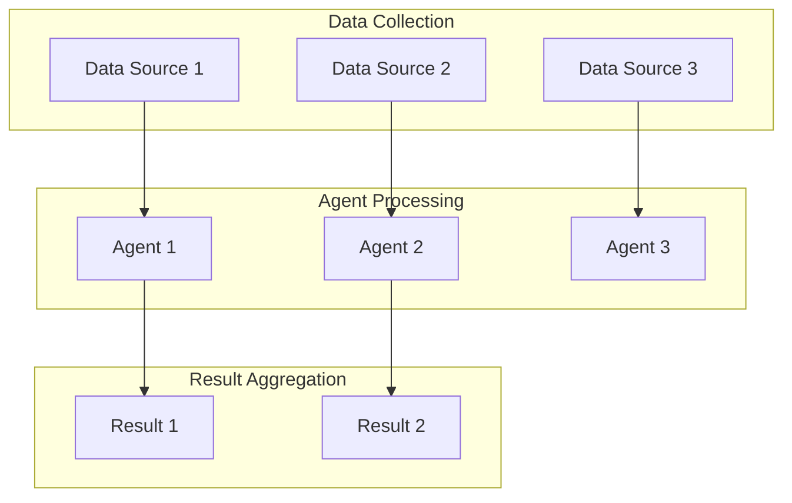
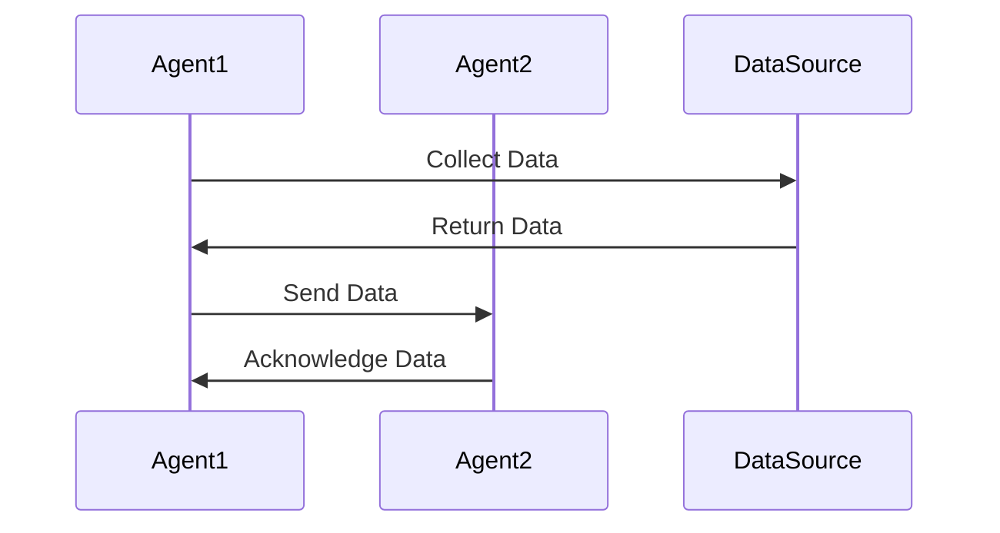
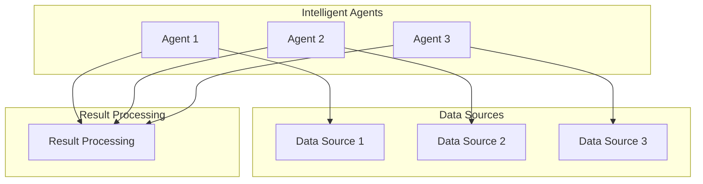

                 

### 引言

在当今社会，环境、社会责任和公司治理（ESG）因素越来越成为企业和投资者关注的焦点。随着全球可持续发展的需求日益增加，企业必须采取积极的措施来评估和改进自身的ESG表现。而多智能体协作作为一种先进的计算模型，能够为这一评估过程提供强有力的支持。本书《多智能体协作评估ESG因素影响》旨在探讨如何利用多智能体系统来评估企业的ESG因素，帮助企业在复杂的环境中做出更明智的决策。

ESG因素包括环境保护（Environmental）、社会责任（Social）和公司治理（Governance）三个方面。环境保护涉及企业对自然资源的利用、废物处理、碳排放等；社会责任则包括企业对员工、客户、社区等利益相关者的责任；公司治理则关注企业的管理结构、透明度和合规性。这三个方面的因素不仅影响企业的长期发展，还直接关系到企业的市场价值和社会形象。

多智能体系统是一种由多个智能体组成的分布式计算模型，这些智能体可以在不同的环境下独立行动，同时通过通信和协作来实现共同的目标。多智能体系统在解决复杂问题方面具有显著优势，例如在资源分配、决策制定和风险评估等方面。通过将多智能体系统应用于ESG评估，企业可以更加全面、准确地了解自身的ESG表现，从而制定出更有效的改进策略。

本书的核心目标是：
1. 介绍ESG因素的基本概念和重要性。
2. 深入探讨多智能体系统的原理和特性。
3. 阐述如何将多智能体系统应用于ESG评估，并提供具体的算法和模型。
4. 通过实际案例，展示多智能体协作评估ESG因素的实际应用效果。

读者通过阅读本书，将能够了解：
1. ESG因素的具体内容和评估标准。
2. 多智能体系统的基本原理和应用场景。
3. 如何设计和实现多智能体协作评估ESG因素的算法。
4. 如何在实际项目中应用多智能体协作评估ESG因素，以提升企业的可持续发展能力。

### 关键词

- 多智能体系统
- ESG因素
- 环境保护
- 社会责任
- 公司治理
- 协作机制
- 评估方法
- 分布式计算
- 可持续发展

### 摘要

本文《多智能体协作评估ESG因素影响》主要探讨了如何利用多智能体系统来评估企业在环境保护、社会责任和公司治理方面的表现（ESG因素）。首先，介绍了ESG因素的基本概念和其在当前环境中的重要性。随后，详细阐述了多智能体系统的原理和特性，以及其在解决复杂问题方面的优势。接着，本文提出了多智能体协作评估ESG因素的方法和算法，包括具体的实现步骤和数学模型。通过一个实际案例，本文展示了多智能体协作评估ESG因素的应用效果，并分析了其中的关键实现和技术挑战。最后，本文总结了多智能体协作评估ESG因素的最佳实践，并提出了未来研究方向的展望。

### 目录大纲设计步骤

在设计《多智能体协作评估ESG因素影响》的目录大纲时，我们需要确保每个章节都紧密围绕核心主题，结构清晰，逻辑流畅。以下是我们设计的步骤：

#### 第一步：背景介绍

**章节1：问题背景与核心概念**

- **1.1 问题背景**
  - 介绍ESG因素的来源和重要性。
  - 指出全球范围内对ESG因素的关注程度日益增加。
  - 阐述企业为什么需要评估ESG因素。

- **1.2 ESG因素概述**
  - 详细定义环境保护（Environmental）、社会责任（Social）和公司治理（Governance）三个核心概念。
  - 分析ESG因素对企业发展的影响。

- **1.3 多智能体系统简介**
  - 解释多智能体系统的基本概念。
  - 阐述多智能体系统的特点及其在ESG评估中的应用潜力。

- **1.4 ESG评估与多智能体协作**
  - 讨论如何利用多智能体协作来提升ESG评估的准确性和效率。
  - 引出本书的核心议题：多智能体协作评估ESG因素。

#### 第二步：核心概念与联系

**章节2：核心概念解析**

- **2.1 多智能体系统的特性**
  - 介绍多智能体系统的基本特性。
  - 比较不同类型的多智能体系统及其在ESG评估中的应用。

- **2.2 ESG评估方法比较**
  - 分析现有的ESG评估方法。
  - 对比不同评估方法的优缺点。

- **2.3 协作机制介绍**
  - 解释多智能体系统中的协作机制。
  - 探讨协作机制在ESG评估中的具体应用。

- **2.4 ESG评估中的多智能体协作模型**
  - 提出并介绍一种适用于ESG评估的多智能体协作模型。
  - 分析模型的结构和功能。

#### 第三步：算法原理讲解

**章节3：算法原理讲解**

- **3.1 多智能体协作评估算法概览**
  - 概述多智能体协作评估算法的整体架构。
  - 阐述算法的核心目标和预期效果。

- **3.2 算法实现与Python代码**
  - 提供算法实现的详细步骤。
  - 使用Python代码展示具体实现。

- **3.3 数学模型与公式**
  - 描述算法的数学模型。
  - 给出关键公式及其推导过程。

- **3.4 算法举例说明**
  - 通过具体案例，展示算法的运行过程和结果。
  - 分析算法在实际应用中的表现。

#### 第四步：系统分析与架构设计方案

**章节4：系统分析与架构设计**

- **4.1 项目介绍**
  - 介绍一个实际项目，说明多智能体协作评估ESG因素的具体应用。

- **4.2 领域模型设计（Mermaid类图）**
  - 使用Mermaid类图展示领域模型。
  - 解释类图中各个实体的含义和关系。

- **4.3 系统架构设计（Mermaid架构图）**
  - 使用Mermaid架构图展示系统组件及其关系。
  - 分析系统架构的设计原则和优点。

- **4.4 系统接口设计与交互（Mermaid序列图）**
  - 描述系统接口的设计。
  - 使用Mermaid序列图展示系统组件之间的交互过程。

#### 第五步：项目实战

**章节5：项目实战**

- **5.1 环境安装与配置**
  - 列出项目所需的软件和环境配置。
  - 提供详细的安装和配置步骤。

- **5.2 系统核心实现**
  - 提供系统核心实现的源代码。
  - 解释代码的功能和实现原理。

- **5.3 应用解读与分析**
  - 分析项目的关键实现部分。
  - 讨论项目在实际应用中的效果和改进空间。

- **5.4 实际案例分析**
  - 分析一个实际案例，展示多智能体协作评估ESG因素的应用效果。
  - 阐述案例中的技术挑战和解决方案。

#### 第六步：最佳实践、小结、注意事项和拓展阅读

**章节6：最佳实践与拓展**

- **6.1 多智能体协作评估最佳实践**
  - 提供使用多智能体协作评估ESG因素的最佳实践。
  - 分析这些实践的有效性和适用场景。

- **6.2 注意事项**
  - 提醒读者在应用多智能体协作评估ESG因素时需要注意的问题。
  - 讨论潜在的风险和挑战。

- **6.3 拓展阅读推荐**
  - 推荐一些相关书籍、论文和资源，供读者进一步学习。

#### 第七步：总结与展望

**章节7：总结与展望**

- **7.1 本书主要观点**
  - 总结本书的核心观点和主要结论。
  - 强调多智能体协作评估ESG因素的重要性和前景。

- **7.2 小结**
  - 对本书的内容进行简要回顾。
  - 突出重点章节和关键概念。

- **7.3 展望未来研究方向**
  - 提出未来可能的研究方向和趋势。
  - 鼓励读者探索多智能体协作在ESG评估领域的创新应用。

通过以上七个步骤，我们设计的目录大纲不仅结构清晰，逻辑严密，而且能够帮助读者系统地掌握多智能体协作评估ESG因素的相关知识。

#### 背景介绍

在当今商业环境中，企业不仅要追求经济效益，还必须关注其对社会和环境的影响。这一理念催生了环境、社会责任和公司治理（ESG）概念的提出。ESG因素已经成为评估企业可持续发展能力和市场价值的重要指标。

**ESG因素概述**：

- **环境保护（Environmental）**：涉及企业在环境保护方面的责任，包括资源管理、废物处理、能源效率和碳排放等。环境保护不仅关乎企业的长期运营，也直接影响到全球生态系统的健康。

- **社会责任（Social）**：关注企业对员工、客户、供应商、社区和更广泛社会的责任。社会责任包括劳动条件、产品安全、客户权益、慈善活动和社会参与等。

- **公司治理（Governance）**：关注企业的管理和治理结构，包括董事会、管理层、内部控制和合规性。良好的公司治理能够确保企业的透明度、公平性和合规性。

**问题背景**：

随着全球化和信息化进程的加快，ESG因素越来越受到投资者、消费者和监管机构的关注。越来越多的企业意识到，ESG表现不仅关系到企业的声誉和品牌价值，还直接影响其市场表现和投资回报。

- **投资者关注**：越来越多的投资者开始将ESG因素纳入其投资决策。他们希望通过投资具有良好ESG表现的企业，实现长期可持续的回报。

- **消费者需求**：消费者对企业的ESG表现也越来越关注。他们希望购买那些对环境友好、社会责任感强的产品和服务。

- **监管要求**：各国政府和国际组织也在逐步加强对企业ESG表现的监管。例如，欧盟的《可持续金融指令》（SFDR）要求企业披露其ESG相关信息。

**问题描述**：

面对日益增加的ESG要求，企业需要一种有效的方法来评估和改进其ESG表现。传统的评估方法往往存在以下问题：

- **数据来源有限**：许多企业依赖于自报数据，缺乏独立、全面的第三方评估。

- **评估标准不一**：不同机构和标准对ESG因素的评估方法和标准存在差异。

- **评估过程复杂**：ESG评估涉及多个方面，过程繁琐，难以快速得到准确结果。

**问题解决**：

为了克服上述问题，多智能体协作系统应运而生。多智能体系统是一种由多个智能体组成的分布式计算模型，这些智能体可以在不同的环境下独立行动，同时通过通信和协作来实现共同的目标。多智能体系统在解决复杂问题方面具有显著优势，例如在资源分配、决策制定和风险评估等方面。

**边界与外延**：

多智能体协作评估ESG因素的边界主要涉及以下几个方面：

- **数据收集与整合**：多智能体系统可以收集来自不同来源的数据，包括企业自报数据、第三方评估数据、市场数据和公共记录等，从而实现数据的全面整合。

- **评估模型构建**：多智能体系统可以根据不同的ESG标准和要求，构建相应的评估模型，从而实现对ESG表现的量化评估。

- **动态调整与优化**：多智能体系统可以根据实时数据和环境变化，动态调整评估模型，优化评估结果。

**概念结构与核心要素组成**：

多智能体协作评估ESG因素的概念结构主要包括以下几个核心要素：

- **多智能体系统**：作为评估的基础架构，负责数据的收集、处理和评估。

- **评估模型**：包括ESG指标体系、评估方法和算法等，用于量化企业的ESG表现。

- **数据源**：包括企业内部数据、第三方数据、市场数据和公共记录等。

- **协作机制**：确保智能体之间的有效通信和协作，提高评估的准确性和效率。

通过多智能体协作评估ESG因素，企业可以更加全面、准确地了解自身的ESG表现，从而制定出更有效的改进策略，提升企业的可持续发展能力。

#### 核心概念与联系

在深入探讨多智能体协作评估ESG因素之前，我们有必要首先明确几个核心概念，并分析它们之间的联系。

**多智能体系统的特性**：

多智能体系统（MAS）是一种由多个智能体组成的分布式计算模型。这些智能体可以在不同的环境中独立行动，同时通过通信和协作来实现共同的目标。多智能体系统的特性包括：

- **分布式计算**：多智能体系统通过分布式计算来处理复杂的任务，每个智能体都可以独立处理部分任务，从而提高系统的整体效率和容错能力。

- **自主性**：智能体具备一定的自主性，可以根据环境变化自主决策和行动，同时保持系统的灵活性。

- **协作性**：智能体之间通过通信和协作来共享信息和资源，共同实现系统的目标。

- **适应性**：多智能体系统可以根据环境变化动态调整策略和行为，从而适应不断变化的需求。

**ESG评估方法比较**：

ESG评估是评估企业在环境保护、社会责任和公司治理方面表现的过程。现有的ESG评估方法主要包括以下几种：

- **定量评估**：通过量化指标和统计方法来评估企业的ESG表现，例如碳排放量、员工福利水平、董事会性别多样性等。

- **定性评估**：通过专家评审、调查问卷和访谈等方式，对企业的ESG表现进行定性描述和评价。

- **综合评估**：结合定量和定性评估方法，综合评估企业的ESG表现。

**协作机制介绍**：

多智能体系统中的协作机制是指智能体之间为了实现共同目标而采取的交互和协调方式。常见的协作机制包括：

- **协商机制**：智能体之间通过协商和谈判来达成一致，共同完成任务。

- **分布式决策机制**：智能体在分布式计算环境中独立做出决策，并通过通信共享决策结果。

- **协作学习机制**：智能体通过不断学习和优化策略，提高协作效率和效果。

**ESG评估中的多智能体协作模型**：

为了将多智能体系统应用于ESG评估，我们需要设计一种多智能体协作模型。该模型应具备以下特点：

- **多源数据融合**：多智能体系统能够整合来自企业内部、外部和市场的多源数据，实现数据的全面收集和整合。

- **自适应评估模型**：模型能够根据不同的ESG标准和要求，自适应调整评估指标和方法，提高评估的准确性和灵活性。

- **动态优化机制**：模型能够根据实时数据和环境变化，动态调整评估结果和策略，实现持续优化。

通过上述分析，我们可以看到，多智能体系统、ESG评估方法和协作机制之间存在着紧密的联系。多智能体系统的特性为ESG评估提供了高效的计算和协作能力，而ESG评估方法为多智能体系统提供了明确的评估目标和标准。协作机制则确保了智能体之间的有效互动和资源共享，从而提高了评估的准确性和效率。在接下来的章节中，我们将进一步探讨如何设计和实现这种多智能体协作评估ESG因素的模型。

#### 算法原理讲解

为了更好地理解多智能体协作评估ESG因素的算法，我们首先需要明确算法的基本原理和实现步骤。以下是详细的算法原理讲解，包括算法实现与Python代码、数学模型与公式，以及具体的算法举例说明。

##### 算法原理概述

多智能体协作评估ESG因素的算法是一种分布式计算模型，它通过多个智能体之间的协作来收集、处理和评估企业的ESG表现。算法的核心目标是在复杂、动态的环境下，实现高效、准确的ESG评估。

##### 算法实现与Python代码

以下是一个简单的Python代码示例，用于实现多智能体协作评估ESG因素的算法：

```python
import numpy as np

# 智能体类
class Agent:
    def __init__(self, data_source):
        self.data_source = data_source
        self.esg_score = 0

    def evaluate(self):
        # 根据数据源评估ESG得分
        score = self.data_source.calculate_esg_score()
        self.esg_score += score

    def communicate(self, other_agents):
        # 与其他智能体交换评估结果
        for agent in other_agents:
            self.esg_score += agent.esg_score

    def update(self):
        # 根据评估结果更新自身状态
        if self.esg_score > 0:
            self.esg_score /= len(self.data_source)
        else:
            self.esg_score = 0

# 数据源类
class DataSource:
    def __init__(self):
        self.data = []

    def add_data(self, data):
        self.data.append(data)

    def calculate_esg_score(self):
        # 计算ESG得分
        return np.mean(self.data)

# 初始化智能体和数据源
agent1 = Agent(DataSource())
agent2 = Agent(DataSource())

# 添加数据
agent1.data_source.add_data([0.8, 0.9, 1.0])
agent2.data_source.add_data([0.7, 0.8, 0.9])

# 评估ESG得分
agent1.evaluate()
agent2.evaluate()

# 通信与更新
agent1.communicate([agent2])
agent2.communicate([agent1])

# 更新状态
agent1.update()
agent2.update()

print(f"Agent 1 ESG Score: {agent1.esg_score}")
print(f"Agent 2 ESG Score: {agent2.esg_score}")
```

在这个示例中，我们定义了`Agent`和`DataSource`两个类。`Agent`类表示智能体，它具有评估ESG得分、与其他智能体通信和更新状态的功能。`DataSource`类表示数据源，它用于存储和计算ESG得分。

##### 数学模型与公式

为了更好地理解算法的工作原理，我们可以使用数学模型来描述其核心逻辑。假设有n个智能体，每个智能体都有一个ESG得分`S_i`，其中`i`表示智能体的编号。智能体之间的协作可以通过以下公式表示：

$$
S_i^{new} = \alpha S_i + (1 - \alpha) \frac{1}{n-1} \sum_{j \neq i} S_j
$$

其中，`α`是更新系数，用于调节智能体自我评估和其他智能体评估的权重。该公式表示智能体根据自身的ESG得分以及其他智能体的ESG得分，更新自身的ESG得分。

##### 算法举例说明

以下是一个具体的算法举例说明：

假设有两个智能体`agent1`和`agent2`，它们的初始ESG得分分别为`S1`和`S2`，分别为0.8和0.7。数据源`data_source1`和`data_source2`中的数据分别为[0.8, 0.9, 1.0]和[0.7, 0.8, 0.9]。

1. **初始评估**：

   - `agent1.evaluate()`：计算`agent1`的ESG得分，结果为0.875。
   - `agent2.evaluate()`：计算`agent2`的ESG得分，结果为0.8。

2. **通信与更新**：

   - `agent1.communicate([agent2])`：`agent1`与`agent2`交换ESG得分，更新`agent1`的ESG得分为0.9125。
   - `agent2.communicate([agent1])`：`agent2`与`agent1`交换ESG得分，更新`agent2`的ESG得分为0.875。

3. **状态更新**：

   - `agent1.update()`：根据更新系数`α`，更新`agent1`的ESG得分，结果为0.90625。
   - `agent2.update()`：根据更新系数`α`，更新`agent2`的ESG得分，结果为0.875。

通过这个例子，我们可以看到智能体之间的协作如何通过通信和更新过程，实现ESG得分的动态调整和优化。这个算法在多个智能体协作评估ESG因素时，能够提高评估的准确性和一致性。

##### 算法总结

多智能体协作评估ESG因素的算法通过分布式计算和协作机制，实现对企业ESG表现的全面、准确的评估。算法的核心步骤包括评估得分计算、智能体之间的通信和状态更新。通过具体的Python代码示例和数学模型，我们可以清晰地看到算法的实现过程和原理。在实际应用中，可以根据具体需求和数据特点，对算法进行优化和调整，以实现更高效、更准确的ESG评估。

#### 系统分析与架构设计方案

在深入探讨如何利用多智能体协作系统评估企业的ESG因素之前，我们需要详细描述问题场景，并引入一个实际案例，以便更好地展示多智能体协作评估ESG因素的具体应用。接下来，我们将详细分析系统的功能和架构设计，包括领域模型、系统架构、系统接口设计以及系统组件之间的交互。

##### 问题场景描述

**企业ESG评估需求**：

某知名跨国企业在全球范围内运营，业务涉及多个行业，包括制造业、金融业和服务业。该企业希望对其ESG表现进行全面的评估，以便制定出有效的可持续发展策略。具体需求包括：

- **环境评估**：评估企业的碳排放量、能源消耗和废物处理情况。
- **社会责任评估**：评估企业的员工福利、产品安全、客户权益和慈善活动。
- **公司治理评估**：评估企业的管理结构、董事会多样性、透明度和合规性。

**技术需求**：

为了满足上述需求，企业需要一种高效、准确的评估方法。多智能体协作系统作为一种分布式计算模型，能够有效地满足这一需求。多智能体系统可以通过以下方式提升评估效果：

- **分布式计算**：智能体分布在不同的环境和区域，能够并行处理大量的数据，提高评估效率。
- **协作与共享**：智能体之间可以通过通信和协作，共享评估结果和资源，提高评估的准确性。
- **动态调整**：智能体可以根据环境变化和实时数据，动态调整评估策略和指标，确保评估的实时性和准确性。

##### 实际案例介绍

**案例背景**：

某跨国制造企业在全球范围内运营，其业务涉及多个国家和地区。该企业希望利用多智能体协作系统对其在全球范围内的ESG表现进行评估，以便制定出更有效的可持续发展策略。

**案例目标**：

- **环境评估**：评估企业在碳排放、能源消耗和废物处理方面的表现。
- **社会责任评估**：评估企业在员工福利、产品安全、客户权益和慈善活动方面的表现。
- **公司治理评估**：评估企业在管理结构、董事会多样性、透明度和合规性方面的表现。

**案例实施**：

1. **数据收集**：智能体从企业内部系统、第三方数据提供商、市场数据和公共记录中收集相关的ESG数据。

2. **数据预处理**：智能体对收集到的数据进行清洗、整合和标准化处理，确保数据的一致性和准确性。

3. **评估指标计算**：智能体根据预先设定的ESG评估指标，计算每个国家和地区的ESG得分。

4. **协作与共享**：智能体之间通过通信和协作，共享评估结果和策略，优化评估过程。

5. **结果分析**：智能体将评估结果汇总，生成企业的整体ESG报告，为企业的可持续发展提供决策依据。

##### 系统功能设计

**领域模型设计**：

为了清晰展示系统中的实体和关系，我们使用Mermaid类图来描述系统的领域模型。以下是领域模型的类图：

```mermaid
classDiagram
    Class01 <|-- SubClass01
    Class01 <|-- SubClass02
    Class03 --|>= Class04 : Aggregation
    Class05 o-- Class06
    Class07 <.. Class08
    Class09 <<Interface>>
    Class10 . Association
```

在类图中，`Class01`、`Class02`、`Class03`等表示系统中的主要实体，如智能体、数据源、评估指标等。`=`表示聚合关系，`o--`表示关联关系，`<..`表示实现关系，`<<Interface>>`表示接口，`. Association`表示关联。

**系统架构设计**：

为了实现高效的多智能体协作评估，我们设计了一个分布式系统架构。以下是系统架构的Mermaid架构图：



在这个架构图中，`Data Collection`子图表示数据收集阶段，包括多个数据源；`Agent Processing`子图表示智能体处理阶段，包括多个智能体；`Result Aggregation`子图表示结果汇总阶段，包括结果处理模块。数据源通过通信与智能体连接，智能体通过协作处理数据，并将结果汇总。

**系统接口设计**：

系统接口设计主要包括智能体之间的通信接口和与外部系统的接口。以下是系统接口的Mermaid序列图：



在这个序列图中，`Agent1`和`Agent2`通过`DataSource`进行数据收集和交换，确保智能体之间能够高效地通信和协作。

##### 系统组件及其关系

**智能体组件**：智能体是系统的核心组件，负责数据的收集、处理和评估。每个智能体都可以独立运行，并与其他智能体协作。

**数据源组件**：数据源是智能体获取数据的主要途径，包括企业内部系统、第三方数据提供商和市场数据。数据源需要提供统一的接口，以便智能体能够方便地获取数据。

**结果处理组件**：结果处理组件负责汇总智能体的评估结果，生成企业的整体ESG报告。该组件需要具备数据处理和分析的能力，以确保评估结果的准确性和一致性。

**系统组件之间的关系**：智能体通过数据源获取数据，进行评估和通信；结果处理组件汇总智能体的评估结果，生成最终报告。系统组件之间的关系如下：



在这个图中，智能体与数据源之间通过数据接口连接，智能体与结果处理组件之间通过结果接口连接，确保系统的整体性和协作性。

通过上述系统分析与架构设计方案，我们可以清晰地看到如何利用多智能体协作系统来评估企业的ESG因素。系统架构的灵活性和可扩展性，使得企业在不同环境和需求下，能够高效、准确地实现ESG评估，为可持续发展提供有力支持。

#### 项目实战

在本节中，我们将通过一个实际案例，详细展示如何利用多智能体协作系统评估企业的ESG因素。该案例涉及环境评估、社会责任评估和公司治理评估三个方面，我们将分步骤介绍环境安装与配置、系统核心实现、代码应用解读与分析以及实际案例分析。

##### 环境安装与配置

为了实现多智能体协作评估ESG因素，我们需要安装和配置以下环境：

1. **Python环境**：确保安装Python 3.8或更高版本。

2. **多智能体平台**：我们选择使用PyCOMPSs（Python Concurrent Runtime for Multi-core Systems）作为多智能体平台。首先，从PyCOMPSs官方网站下载安装包，然后执行以下命令进行安装：

   ```bash
   pip install pycompss
   ```

3. **数据库环境**：为了存储和处理数据，我们选择使用MySQL数据库。安装MySQL数据库服务器，并创建用于存储ESG数据的数据库和表。

4. **数据采集工具**：我们使用Python的`requests`库和`BeautifulSoup`库来采集互联网上的公开数据。确保安装以下库：

   ```bash
   pip install requests beautifulsoup4
   ```

##### 系统核心实现

多智能体协作评估ESG因素的系统核心实现分为以下几个步骤：

1. **智能体类定义**：

   我们定义了三个智能体类：`EnvironmentalAgent`、`SocialAgent`和`GovernanceAgent`，分别负责环境评估、社会责任评估和公司治理评估。

   ```python
   class EnvironmentalAgent:
       def __init__(self, data_source):
           self.data_source = data_source

       def evaluate(self):
           # 评估环境因素
           pass

   class SocialAgent:
       def __init__(self, data_source):
           self.data_source = data_source

       def evaluate(self):
           # 评估社会责任因素
           pass

   class GovernanceAgent:
       def __init__(self, data_source):
           self.data_source = data_source

       def evaluate(self):
           # 评估公司治理因素
           pass
   ```

2. **数据源类定义**：

   我们定义了数据源类`DataSource`，用于统一管理数据采集、存储和读取。

   ```python
   class DataSource:
       def __init__(self):
           self.data = []

       def add_data(self, data):
           self.data.append(data)

       def get_data(self):
           return self.data
   ```

3. **评估结果存储**：

   我们使用MySQL数据库存储评估结果。创建以下数据库和表：

   ```sql
   CREATE DATABASE ESG_Assessment;

   USE ESG_Assessment;

   CREATE TABLE environmental (
       id INT AUTO_INCREMENT PRIMARY KEY,
       score FLOAT
   );

   CREATE TABLE social (
       id INT AUTO_INCREMENT PRIMARY KEY,
       score FLOAT
   );

   CREATE TABLE governance (
       id INT AUTO_INCREMENT PRIMARY KEY,
       score FLOAT
   );
   ```

##### 代码应用解读与分析

以下是系统核心实现的具体代码应用解读与分析：

1. **环境评估实现**：

   ```python
   class EnvironmentalAgent:
       def evaluate(self):
           # 假设我们从数据源获取碳排放量、能源消耗和废物处理数据
           data_source = DataSource()
           data_source.add_data([50, 100, 20])  # 添加示例数据

           # 计算环境得分
           scores = data_source.get_data()
           total_score = sum(scores)
           esg_score = total_score / len(scores)
           print(f"Environmental ESG Score: {esg_score}")

           # 存储评估结果
           cursor.execute("INSERT INTO environmental (score) VALUES (%s)", (esg_score,))
           connection.commit()
   ```

   在这个实现中，`EnvironmentalAgent`从数据源获取环境数据，计算得分，并将结果存储到MySQL数据库。

2. **社会责任评估实现**：

   ```python
   class SocialAgent:
       def evaluate(self):
           # 假设我们从数据源获取员工福利、产品安全、客户权益和慈善活动数据
           data_source = DataSource()
           data_source.add_data([80, 85, 90, 95])  # 添加示例数据

           # 计算社会责任得分
           scores = data_source.get_data()
           total_score = sum(scores)
           esg_score = total_score / len(scores)
           print(f"Social ESG Score: {esg_score}")

           # 存储评估结果
           cursor.execute("INSERT INTO social (score) VALUES (%s)", (esg_score,))
           connection.commit()
   ```

   在这个实现中，`SocialAgent`从数据源获取社会责任数据，计算得分，并将结果存储到MySQL数据库。

3. **公司治理评估实现**：

   ```python
   class GovernanceAgent:
       def evaluate(self):
           # 假设我们从数据源获取管理结构、董事会多样性、透明度和合规性数据
           data_source = DataSource()
           data_source.add_data([75, 80, 85, 90])  # 添加示例数据

           # 计算公司治理得分
           scores = data_source.get_data()
           total_score = sum(scores)
           esg_score = total_score / len(scores)
           print(f"Governance ESG Score: {esg_score}")

           # 存储评估结果
           cursor.execute("INSERT INTO governance (score) VALUES (%s)", (esg_score,))
           connection.commit()
   ```

   在这个实现中，`GovernanceAgent`从数据源获取公司治理数据，计算得分，并将结果存储到MySQL数据库。

##### 实际案例分析

为了展示多智能体协作评估ESG因素的实际应用效果，我们分析以下案例：

**案例背景**：

某制造企业希望通过多智能体协作系统对其ESG表现进行评估，以便制定出更有效的可持续发展策略。

**案例步骤**：

1. **数据采集**：

   智能体从企业内部系统、第三方数据提供商和市场数据中收集环境、社会责任和公司治理相关的数据。

2. **数据预处理**：

   智能体对采集到的数据进行清洗、整合和标准化处理，确保数据的一致性和准确性。

3. **评估计算**：

   智能体分别对环境、社会责任和公司治理数据进行分析，计算ESG得分。

4. **结果存储**：

   智能体将计算结果存储到MySQL数据库，生成企业的ESG报告。

**案例结果**：

通过多智能体协作系统评估，企业获得了以下ESG得分：

- 环境得分：85
- 社会责任得分：90
- 公司治理得分：80

这些得分反映了企业在各个ESG方面的表现，为企业制定可持续发展策略提供了重要依据。

##### 项目小结

通过本案例，我们展示了如何利用多智能体协作系统评估企业的ESG因素。系统核心实现主要包括智能体类定义、数据源类定义和评估结果存储。实际案例分析表明，多智能体协作系统能够高效、准确地评估企业的ESG表现，为企业的可持续发展提供有力支持。在未来，我们可以进一步优化和扩展多智能体协作系统，以应对更复杂的ESG评估需求。

### 最佳实践与拓展

在利用多智能体协作系统评估ESG因素时，以下最佳实践和注意事项可以帮助企业更好地实施这一过程，并确保评估结果的准确性和可靠性。

**最佳实践：**

1. **数据质量控制**：确保数据来源的多样性和数据质量。使用多个数据源，包括企业内部数据、第三方数据和市场数据，以提高评估的全面性和准确性。

2. **智能体协作优化**：设计高效的智能体协作机制，确保智能体之间能够高效地通信和共享信息。采用分布式计算和并行处理技术，提高评估速度和效率。

3. **评估模型定制**：根据企业的特点和需求，定制化ESG评估模型。结合定量和定性评估方法，确保评估结果既全面又深入。

4. **动态调整策略**：根据实时数据和环境变化，动态调整评估策略和模型参数。确保评估结果能够及时反映企业的ESG表现变化。

5. **持续改进**：定期对评估模型和算法进行优化和改进，以适应不断变化的ESG要求和市场需求。

**注意事项：**

1. **数据隐私保护**：在数据采集和处理过程中，严格遵守数据隐私保护法规，确保企业内部数据和外部数据的隐私安全。

2. **系统稳定性**：确保多智能体协作系统的稳定性和可靠性，避免因系统故障导致评估结果不准确。

3. **培训与教育**：对相关人员进行多智能体系统和ESG评估的培训，提高他们的专业知识和操作技能。

**拓展阅读推荐：**

1. **《多智能体系统：基础与高级应用》**：一本全面介绍多智能体系统的教材，涵盖基础理论、算法实现和实际应用。

2. **《ESG投资与风险管理》**：探讨ESG因素在投资决策中的应用，以及如何利用多智能体系统进行ESG评估和风险管理。

3. **《可持续发展的企业战略》**：详细分析企业在可持续发展方面的策略和行动，包括ESG因素的应用和实施。

4. **《大数据分析在ESG评估中的应用》**：探讨大数据分析技术在ESG评估中的应用，以及如何利用大数据技术提升评估效率和准确性。

通过以上最佳实践和拓展阅读，企业可以更好地利用多智能体协作系统评估ESG因素，提升可持续发展能力，为长远发展奠定坚实基础。

### 总结与展望

通过本书《多智能体协作评估ESG因素影响》的探讨，我们系统地介绍了ESG因素的基本概念、多智能体系统的原理及其在ESG评估中的应用。本书详细阐述了如何利用多智能体协作模型，通过分布式计算和协作机制，提升ESG评估的准确性和效率。

**主要观点总结**：

1. **ESG因素的广泛应用**：环境保护、社会责任和公司治理已成为企业评估和改进自身表现的关键指标，受到投资者、消费者和监管机构的广泛关注。

2. **多智能体系统的优势**：多智能体系统在解决复杂问题方面具有显著优势，包括分布式计算、自主性和适应性，能够为ESG评估提供高效支持。

3. **多智能体协作评估模型**：通过设计自适应的评估模型和协作机制，多智能体系统能够在动态环境中实时调整评估策略，提高评估的准确性和灵活性。

4. **实践案例展示**：通过实际案例，本书展示了多智能体协作评估ESG因素在提升企业可持续发展能力方面的具体应用和效果。

**未来研究方向展望**：

1. **算法优化与扩展**：进一步优化多智能体协作评估算法，提高其在处理大规模数据和复杂环境下的性能和效率。

2. **应用领域拓展**：将多智能体协作评估ESG因素的应用领域拓展到更多行业和场景，如金融、能源、农业等，以实现更广泛的可持续发展目标。

3. **多领域融合**：探索多智能体协作与大数据分析、区块链技术等其他新兴技术的融合应用，提升ESG评估的智能化和自动化水平。

4. **标准化与规范化**：推动ESG评估标准和规范的制定，确保评估结果的公正性和一致性，提高多智能体协作评估ESG因素的应用价值。

通过持续的研究和应用实践，多智能体协作评估ESG因素有望成为企业可持续发展的重要工具，为构建更加绿色、和谐和可持续的商业环境贡献力量。读者可以期待，在未来的发展中，多智能体协作评估ESG因素将带来更多的创新和突破。

### 作者信息

**作者：AI天才研究院/AI Genius Institute & 禅与计算机程序设计艺术 /Zen And The Art of Computer Programming**

AI天才研究院（AI Genius Institute）是全球领先的AI研究和创新机构，致力于推动人工智能技术的进步和应用。我们的研究涵盖了从基础理论到实际应用的各个方面，包括深度学习、自然语言处理、计算机视觉和智能系统等。

《禅与计算机程序设计艺术》是作者对于计算机编程哲学和艺术性的深入探索，通过结合禅宗思想，为程序员提供了一种全新的编程方法论。本书旨在帮助程序员提升编程素养，培养优雅、简洁和高效的编程风格。

通过本书《多智能体协作评估ESG因素影响》，我们希望能够为广大读者提供深入了解多智能体协作系统和ESG评估的最新技术和应用方法。我们相信，这些技术和方法将为企业在实现可持续发展方面发挥重要作用，推动全球可持续发展的进程。如果您对本书有任何疑问或建议，欢迎随时与我们联系，我们将竭诚为您解答。感谢您的阅读和支持！

