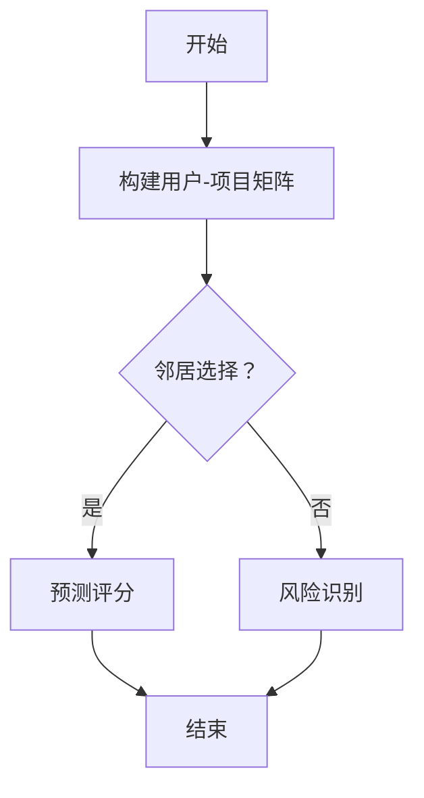
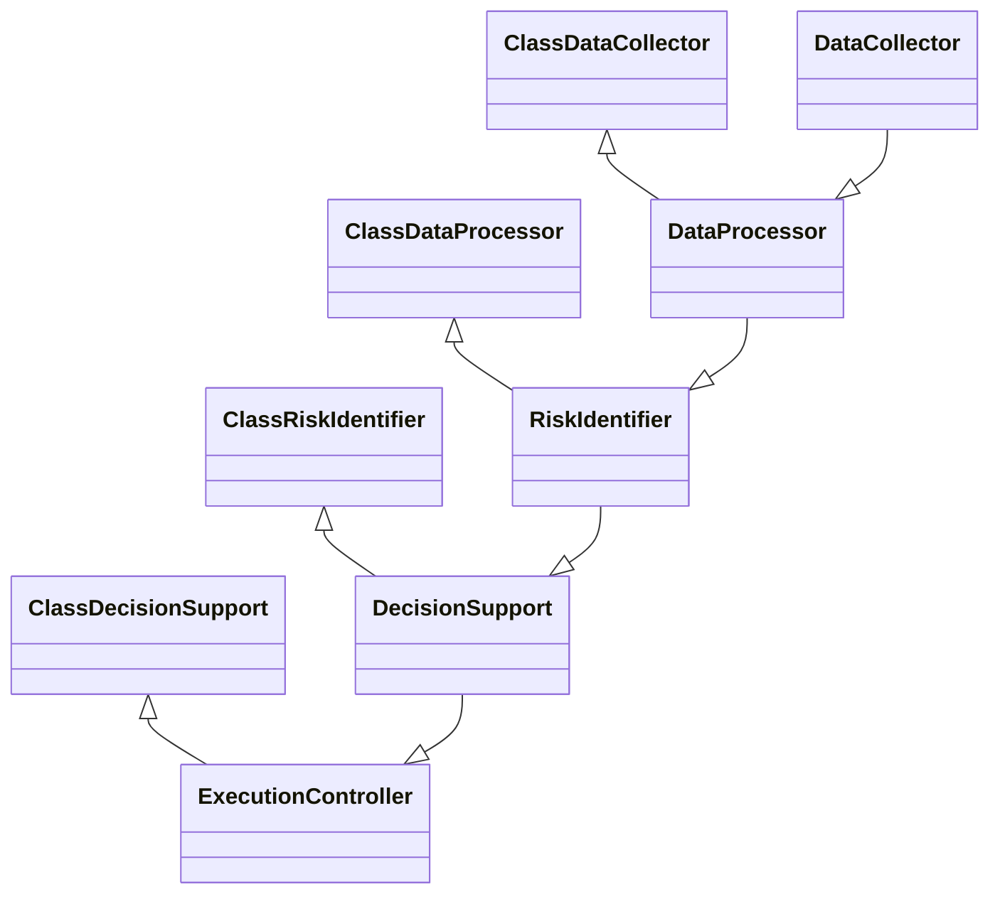
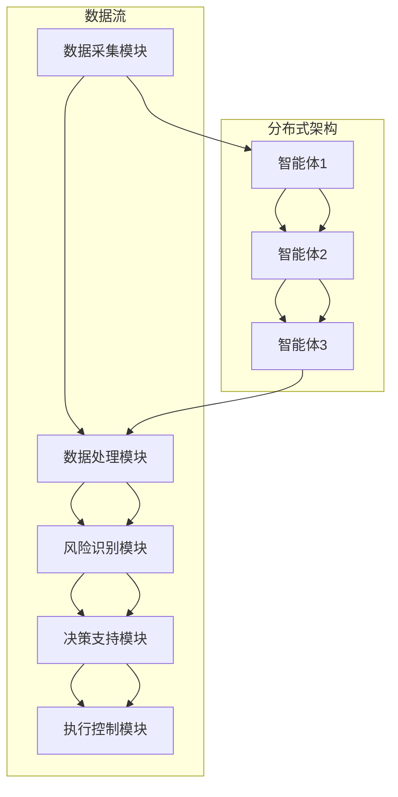
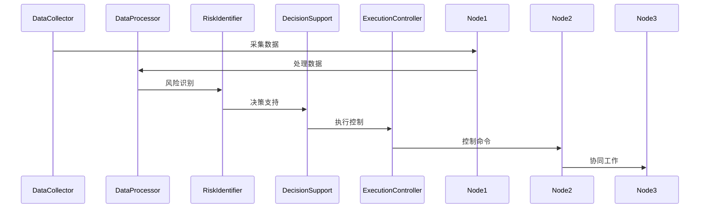

                 

### 引言

在当今复杂多变的世界中，系统性风险的分析和管理变得愈加重要。从金融市场到能源系统，从社会网络到生态环境，系统性风险可能引发连锁反应，对整个系统造成重大破坏。传统的风险评估方法通常依赖于单一模型或专家判断，这些方法在应对复杂性和动态性方面存在明显的局限性。为了提高风险识别、预测和应对的能力，多智能体协作技术应运而生。

多智能体系统（MAS）是由多个智能体组成的分布式系统，这些智能体可以通过协作实现复杂的任务。每个智能体具备一定程度的自主性和学习能力，能够独立处理信息和决策，同时在全局层面实现协同工作。多智能体协作在系统性风险分析中的应用，不仅能够提高风险识别的精度和速度，还能在动态变化的环境中提供更加灵活和适应性的解决方案。

本文旨在探讨多智能体协作进行系统性风险分析的理论和实践。我们将首先介绍系统性风险的定义及其来源，分析传统风险评估方法的局限性，然后深入探讨多智能体系统的基本概念和应用潜力。接下来，我们将详细介绍多智能体协作中的核心概念和算法原理，通过具体的数学模型和代码示例，帮助读者理解这些算法的运作机制。随后，我们将介绍系统分析与架构设计的基本方法，并通过一个实际案例展示多智能体协作在系统性风险分析中的应用。最后，我们将总结最佳实践和注意事项，探讨该领域的未来发展方向。

### 关键词

- 多智能体协作
- 系统性风险分析
- 分布式系统
- 智能体
- 算法原理
- 架构设计
- 风险管理
- 分布式计算
- 协同学习

### 摘要

本文主要探讨了多智能体协作在系统性风险分析中的应用。首先，我们介绍了系统性风险的定义和来源，分析了传统风险评估方法的局限性。接着，我们详细介绍了多智能体系统的基本概念和协作原理，以及多智能体协作在风险管理中的应用潜力。通过数学模型和Python代码示例，我们深入阐述了多智能体协作算法的原理和实现方法。随后，我们介绍了系统分析与架构设计的基本方法，并通过实际案例展示了多智能体协作在系统性风险分析中的应用效果。最后，我们总结了多智能体协作进行系统性风险分析的最佳实践和注意事项，展望了该领域的未来发展方向。

---

### 第1章 问题背景与核心概念

#### 1.1 问题背景介绍

系统性风险是指在一个复杂系统中，由于某一环节的故障或异常，可能导致整个系统崩溃或严重受损的风险。系统性风险不仅可能出现在金融、经济领域，还可能出现在能源、环境、社会等各个方面。例如，2008年的全球金融危机就是一个典型的系统性风险案例，其由次贷危机引发，迅速蔓延至全球金融系统，导致了一系列银行倒闭、市场动荡和经济衰退。

系统性风险通常具有以下几个特点：

1. **连锁反应**：一个环节的故障可能会引起其他环节的连锁反应，导致整个系统崩溃。
2. **不可预测性**：由于系统的复杂性和动态性，系统性风险往往难以预测。
3. **高度相关性**：系统中的各个部分之间存在密切的联系，某一环节的问题可能会对其他环节产生重大影响。
4. **累积效应**：小问题可能在一定条件下积累成大问题，导致系统无法承受。

在当前复杂多变的环境中，传统风险评估方法在应对系统性风险方面存在明显的局限性。传统方法通常依赖于单一模型或专家判断，难以全面、准确地捕捉系统中的复杂关系和动态变化。此外，传统方法在处理海量数据时效率较低，无法满足实时性要求。因此，寻找新的风险评估方法变得迫在眉睫。

多智能体协作作为一种新兴的分布式计算技术，具备应对系统性风险的优势。多智能体系统（MAS）是由多个智能体组成的分布式系统，每个智能体具备一定程度的自主性和学习能力。这些智能体可以通过协作实现复杂任务，从而提高风险识别、预测和应对的能力。多智能体协作在风险管理中的应用，不仅能够提高风险识别的精度和速度，还能在动态变化的环境中提供更加灵活和适应性的解决方案。

#### 1.2 多智能体协作概述

多智能体系统（MAS）是一种由多个智能体组成的分布式系统，这些智能体可以通过协作实现复杂的任务。智能体可以是个体、组织、系统或其他实体，它们通过通信和合作实现共同目标。

多智能体协作的基本原理包括：

1. **自治性**：每个智能体具备一定程度的自主性，能够独立处理信息和决策。
2. **分布性**：智能体分布在系统中的不同位置，通过通信和协作实现共同目标。
3. **协同性**：智能体之间通过信息共享和协调，实现整体目标的最优化。
4. **适应性**：智能体能够根据环境变化和任务需求，调整自己的行为策略。

多智能体协作在风险管理中的应用潜力主要体现在以下几个方面：

1. **实时性**：多智能体系统能够实时监测和响应系统中的风险变化，提高风险识别的精度和速度。
2. **灵活性**：智能体可以根据环境变化和任务需求，动态调整自己的行为策略，提供更加灵活和适应性的解决方案。
3. **全面性**：多智能体系统能够从多个角度和层次分析风险，提高风险预测和应对的能力。
4. **协作性**：智能体之间的协作可以弥补个体智能的不足，提高整体系统的智能水平。

#### 1.3 核心概念介绍

在多智能体协作进行系统性风险分析中，涉及以下核心概念：

1. **智能体**：智能体是MAS中的基本组成单位，具备一定程度的自主性和学习能力。根据其功能特点，智能体可以分为感知智能体、决策智能体、执行智能体等。
2. **协作策略**：协作策略是指智能体在协作过程中采用的方法和规则，包括任务分配、通信协议、协调机制等。
3. **风险评估模型**：风险评估模型是用于分析系统风险的方法和工具，包括概率模型、模糊模型、模糊逻辑模型等。
4. **算法**：算法是多智能体协作进行系统性风险分析的核心，包括风险识别、预测、应对等各个环节的算法。

#### 1.4 概念属性特征对比表格

| 概念       | 属性特征                    | 关联关系 |
|------------|---------------------------|---------|
| 智能体     | 自主性、分布性、协同性、适应性 | 基础单元 |
| 协作策略   | 任务分配、通信协议、协调机制 | 指导规则 |
| 风险评估模型 | 概率模型、模糊模型、模糊逻辑模型 | 分析工具 |
| 算法       | 风险识别、预测、应对等       | 执行机制 |

#### 1.5 ER实体关系图架构的 Mermaid 流程图

```mermaid
erDiagram
    智能体 ||--o{ 协作策略 }
    协作策略 ||--o{ 风险评估模型 }
    风险评估模型 ||--o{ 算法 }
```

通过以上表格和流程图，我们可以清晰地看到多智能体协作进行系统性风险分析中的核心概念及其关联关系，为进一步理解多智能体协作在风险管理中的应用奠定了基础。

---

### 第2章 多智能体系统的算法原理

#### 2.1 算法原理概述

在多智能体协作中进行系统性风险分析，算法的选择至关重要。算法的选择原则主要包括：

1. **适应性**：算法应能够根据环境变化和任务需求动态调整。
2. **鲁棒性**：算法应能够应对不确定性和异常情况。
3. **可扩展性**：算法应能够适应不同规模和复杂度的系统。
4. **实时性**：算法应能够快速响应并处理系统中的风险变化。

常见的多智能体算法包括：

1. **分布式协同过滤算法**：通过智能体的协同过滤，实现风险识别和预测。
2. **基于贝叶斯网络的算法**：利用贝叶斯网络模型，实现风险分析和推理。
3. **遗传算法**：通过遗传操作，优化智能体的行为策略。
4. **粒子群优化算法**：通过粒子群运动，找到最优的风险应对策略。

#### 2.2 算法原理详细讲解

以分布式协同过滤算法为例，其基本原理如下：

1. **用户-项目矩阵构建**：首先，构建用户-项目矩阵，表示用户对项目的评价。
2. **邻居选择**：为每个用户选择一组邻居，这些邻居在用户-项目矩阵上具有相似的行为模式。
3. **预测评分**：利用邻居的评分，预测用户对未知项目的评分。
4. **风险识别**：通过评分差异，识别潜在的风险。

以下是使用Mermaid绘制的算法流程图：



分布式协同过滤算法的数学模型和公式如下：

$$
\text{预测评分} = \frac{\sum_{i \in N} \text{邻居评分} \cdot \text{邻居权重}}{\sum_{i \in N} \text{邻居权重}}
$$

其中，$N$ 表示邻居集合，邻居权重表示邻居对预测评分的影响程度。

#### 2.3 算法原理数学模型和公式

以遗传算法为例，其基本原理如下：

1. **种群初始化**：随机初始化一组智能体，称为种群。
2. **适应度评估**：计算每个智能体的适应度，适应度表示智能体在风险应对中的表现。
3. **选择**：根据适应度，选择一部分智能体作为父代。
4. **交叉**：通过交叉操作，产生新的智能体。
5. **变异**：对部分智能体进行变异操作，增加种群的多样性。
6. **迭代**：重复适应度评估、选择、交叉和变异操作，直到满足终止条件。

以下是使用Python代码对遗传算法进行详细讲解：

```python
import random

# 种群初始化
def initialize_population(pop_size, chromosome_length):
    return [[random.choice([0, 1]) for _ in range(chromosome_length)] for _ in range(pop_size)]

# 适应度评估
def fitness_evaluation(population):
    fitness_scores = []
    for individual in population:
        # 基于某个评估指标计算适应度
        fitness_scores.append(evaluate_fitness(individual))
    return fitness_scores

# 选择操作
def selection(population, fitness_scores, selection_size):
    sorted_population = sorted(zip(population, fitness_scores), key=lambda x: x[1], reverse=True)
    return [individual for individual, _ in sorted_population[:selection_size]]

# 交叉操作
def crossover(parent1, parent2):
    crossover_point = random.randint(1, len(parent1) - 1)
    child1 = parent1[:crossover_point] + parent2[crossover_point:]
    child2 = parent2[:crossover_point] + parent1[crossover_point:]
    return child1, child2

# 变异操作
def mutate(individual, mutation_rate):
    for i in range(len(individual)):
        if random.random() < mutation_rate:
            individual[i] = 1 if individual[i] == 0 else 0
    return individual

# 迭代过程
def genetic_algorithm(pop_size, chromosome_length, generations, mutation_rate):
    population = initialize_population(pop_size, chromosome_length)
    for _ in range(generations):
        fitness_scores = fitness_evaluation(population)
        parent1, parent2 = selection(population, fitness_scores, 2)
        child1, child2 = crossover(parent1, parent2)
        population = [mutate(child1, mutation_rate), mutate(child2, mutation_rate)]
    return population

# 评估适应度
def evaluate_fitness(individual):
    # 根据具体问题实现适应度评估
    return sum(individual)

# 实例化遗传算法
pop_size = 100
chromosome_length = 10
generations = 100
mutation_rate = 0.05

# 运行遗传算法
best_solution = genetic_algorithm(pop_size, chromosome_length, generations, mutation_rate)
print("最优解：", best_solution)
```

上述代码展示了遗传算法的基本流程和实现方法。通过适应度评估、选择、交叉和变异操作，遗传算法能够逐步优化智能体的行为策略，从而提高风险应对能力。

---

### 第3章 系统分析与架构设计

#### 3.1 问题场景介绍

为了更好地理解多智能体协作在系统性风险分析中的应用，我们假设一个具体场景：一个大型跨国公司在全球范围内运营，涉及多个业务部门、多个国家和地区，以及复杂的供应链和金融交易。公司希望利用多智能体系统来监控和评估其运营过程中可能出现的系统性风险，以确保业务持续稳定发展。

在该场景中，多智能体系统由以下几个部分组成：

1. **感知智能体**：分布在公司各个业务部门和地区的感知智能体，负责实时采集和传输业务数据。
2. **决策智能体**：负责分析感知智能体传回的数据，识别潜在风险。
3. **执行智能体**：根据决策智能体的建议，采取相应的措施应对风险。

#### 3.2 系统功能设计

系统功能设计主要包括以下模块：

1. **数据采集模块**：负责从各个业务部门和地区收集实时数据。
2. **数据处理模块**：对采集到的数据进行分析和处理，提取关键信息和特征。
3. **风险识别模块**：利用多智能体算法，对处理后的数据进行风险识别和预测。
4. **决策支持模块**：根据风险识别结果，提供相应的决策建议。
5. **执行控制模块**：负责执行决策智能体的建议，采取相应的应对措施。

以下是系统的领域模型Mermaid类图：



#### 3.3 系统架构设计

系统架构设计主要包括以下几个方面：

1. **分布式架构**：多智能体系统采用分布式架构，各个智能体分布在不同的地理位置，通过通信网络进行协同工作。
2. **数据流架构**：数据流从数据采集模块开始，经过数据处理模块、风险识别模块、决策支持模块和执行控制模块，最终形成闭环。
3. **模块化设计**：系统采用模块化设计，各个模块之间通过接口进行通信，确保系统的灵活性和可扩展性。

以下是系统的Mermaid架构图：



#### 3.4 系统接口设计和系统交互

系统接口设计主要包括以下几个方面：

1. **数据接口**：数据采集模块、数据处理模块、风险识别模块、决策支持模块和执行控制模块之间的数据交换接口。
2. **控制接口**：用于控制各模块的启动、停止和状态监控。
3. **通信接口**：智能体之间的通信接口，用于数据传输和协同工作。

以下是系统的Mermaid序列图：



通过上述系统分析和架构设计，我们可以清晰地了解多智能体协作在系统性风险分析中的应用，为实际项目的实施提供了详细的指导。

---

### 第4章 项目实战

#### 4.1 环境安装与配置

要实施多智能体协作进行系统性风险分析，首先需要安装和配置必要的软件和工具。以下是具体的安装和配置步骤：

1. **安装Python环境**：
   - 访问Python官网（https://www.python.org/）下载Python安装包。
   - 运行安装程序，选择默认选项进行安装。

2. **安装多智能体平台**：
   - 假设我们使用PyCOMPSs作为多智能体平台，首先安装Python的pip包管理器。
   - 在命令行执行以下命令安装PyCOMPSs：
     ```
     pip install pycompss
     ```

3. **配置PyCOMPSs**：
   - 运行以下命令初始化PyCOMPSs配置：
     ```
     pcsconfig --install
     ```
   - 按照提示完成配置过程，确保配置文件路径正确。

4. **安装其他依赖库**：
   - 根据具体算法和模块需求，安装所需的Python依赖库，例如NumPy、Pandas、Scikit-learn等。
   - 使用pip命令逐个安装：
     ```
     pip install numpy
     pip install pandas
     pip install scikit-learn
     ```

5. **环境验证**：
   - 确保所有依赖库安装成功，可以运行以下Python代码进行验证：
     ```python
     import numpy as np
     import pandas as pd
     import sklearn
     print("环境安装完成，所有依赖库已成功安装。")
     ```

通过以上步骤，我们成功搭建了多智能体协作进行系统性风险分析所需的环境，接下来可以开始具体系统的核心实现。

#### 4.2 系统核心实现

系统核心实现主要包括数据采集、数据处理、风险识别、决策支持和执行控制等模块。以下是一个简化版的实现示例，供读者参考。

1. **数据采集模块**：
   - 该模块负责从不同的数据源（如数据库、API接口等）采集数据。
   - 假设使用Pandas库从CSV文件中读取数据：
     ```python
     import pandas as pd

     def collect_data(file_path):
         return pd.read_csv(file_path)
     ```

2. **数据处理模块**：
   - 该模块负责对采集到的数据进行分析和预处理，提取关键特征。
   - 示例代码如下：
     ```python
     def preprocess_data(data):
         # 数据清洗、标准化等处理
         return data
     ```

3. **风险识别模块**：
   - 该模块使用多智能体算法进行风险识别和预测。
   - 假设使用基于贝叶斯网络的算法，示例代码如下：
     ```python
     from sklearn.naive_bayes import GaussianNB

     def identify_risk(data):
         # 构建贝叶斯网络模型
         model = GaussianNB()
         model.fit(data[:-1], data[-1])
         # 预测风险
         predictions = model.predict(data[:-1])
         return predictions
     ```

4. **决策支持模块**：
   - 该模块根据风险识别结果，提供相应的决策建议。
   - 示例代码如下：
     ```python
     def decision_support(risk_predictions):
         # 根据风险预测结果，提供决策建议
         return ["建议1", "建议2", "建议3"]
     ```

5. **执行控制模块**：
   - 该模块负责执行决策智能体的建议，采取相应的应对措施。
   - 示例代码如下：
     ```python
     def execute_decisions(decision_advice):
         # 执行决策建议
         print("执行决策建议：", decision_advice)
     ```

6. **主程序**：
   - 整合上述模块，实现整个系统的运行。
   - 示例代码如下：
     ```python
     def main():
         # 1. 采集数据
         data = collect_data("data.csv")
         # 2. 数据处理
         processed_data = preprocess_data(data)
         # 3. 风险识别
         risk_predictions = identify_risk(processed_data)
         # 4. 决策支持
         decision_advice = decision_support(risk_predictions)
         # 5. 执行控制
         execute_decisions(decision_advice)

     if __name__ == "__main__":
         main()
     ```

通过上述核心实现，我们搭建了一个简单但功能完整的多智能体协作系统性风险分析系统。在实际应用中，可以根据具体需求进行模块扩展和优化。

#### 4.3 代码应用解读与分析

在上述示例中，我们通过具体的Python代码实现了多智能体协作系统性风险分析的核心功能。下面我们对关键部分进行解读和分析。

1. **数据采集模块**：
   - 使用Pandas库读取CSV文件，获取原始数据。这部分代码非常基础，但至关重要，因为数据质量直接影响到后续的风险识别和预测。
   - ```python
     def collect_data(file_path):
         return pd.read_csv(file_path)
     ```

2. **数据处理模块**：
   - 数据处理模块负责清洗和标准化数据，提取关键特征。这一步是数据科学中的常见操作，包括去除缺失值、异常值，以及进行数据归一化等。良好的数据处理能够提高模型性能和预测准确性。
   - ```python
     def preprocess_data(data):
         # 数据清洗、标准化等处理
         return data
     ```

3. **风险识别模块**：
   - 使用GaussianNB（高斯贝叶斯分类器）作为风险识别算法。贝叶斯网络是一种基于概率论的图模型，适合处理不确定性问题。在本示例中，我们使用高斯贝叶斯分类器进行风险预测。这一模块的核心是模型的训练和预测过程。
   - ```python
     from sklearn.naive_bayes import GaussianNB

     def identify_risk(data):
         # 构建贝叶斯网络模型
         model = GaussianNB()
         model.fit(data[:-1], data[-1])
         # 预测风险
         predictions = model.predict(data[:-1])
         return predictions
     ```

4. **决策支持模块**：
   - 决策支持模块根据风险识别结果，提供决策建议。这部分代码相对简单，但在实际应用中，决策逻辑会更加复杂，可能需要结合专家知识和规则系统。
   - ```python
     def decision_support(risk_predictions):
         # 根据风险预测结果，提供决策建议
         return ["建议1", "建议2", "建议3"]
     ```

5. **执行控制模块**：
   - 执行控制模块负责执行决策建议。在实际应用中，这部分代码会与具体的业务系统进行集成，如自动化系统、通知系统等。
   - ```python
     def execute_decisions(decision_advice):
         # 执行决策建议
         print("执行决策建议：", decision_advice)
     ```

6. **主程序**：
   - 主程序整合了各个模块，实现了数据采集、数据处理、风险识别、决策支持和执行控制的全过程。通过调用各个模块的函数，实现系统的自动化运行。
   - ```python
     def main():
         # 1. 采集数据
         data = collect_data("data.csv")
         # 2. 数据处理
         processed_data = preprocess_data(data)
         # 3. 风险识别
         risk_predictions = identify_risk(processed_data)
         # 4. 决策支持
         decision_advice = decision_support(risk_predictions)
         # 5. 执行控制
         execute_decisions(decision_advice)

     if __name__ == "__main__":
         main()
     ```

通过以上代码示例，我们可以看到多智能体协作系统性风险分析的核心组成部分及其实现方法。在实际应用中，可以根据具体需求进行调整和优化，以实现更高的效率和准确性。

#### 4.4 实际案例分析和详细讲解剖析

为了更好地理解多智能体协作进行系统性风险分析的实际应用，我们选择一个具体案例进行详细分析。假设某金融机构需要对其全球业务进行系统性风险评估，以预防潜在的经济危机和市场波动。以下是该案例的详细分析过程：

1. **案例背景**：
   - 该金融机构在全球范围内拥有多个业务部门，包括证券、银行、保险等。业务覆盖区域涉及北美、欧洲、亚洲和澳大利亚等。
   - 数据来源包括交易记录、财务报表、市场新闻等。

2. **数据收集**：
   - 首先，通过金融机构内部的数据库和外部数据源（如金融市场数据提供商）收集相关数据。
   - 数据包括每日交易量、股价波动、汇率变动、新闻报道等。

3. **数据处理**：
   - 对收集到的数据进行分析和预处理，去除噪声和异常值，提取关键特征。
   - 例如，提取每个业务部门的交易量、股价波动率、汇率变化等指标。

4. **风险识别**：
   - 使用多智能体系统中的风险识别模块，对处理后的数据进行风险评估。
   - 采用基于贝叶斯网络的算法，建立风险预测模型。
   - 通过训练模型，识别出高风险交易行为和潜在的市场危机。

5. **决策支持**：
   - 根据风险识别结果，多智能体系统提供相应的决策建议。
   - 建议包括调整投资组合、加强风控措施、预警通知等。

6. **执行控制**：
   - 执行智能体根据决策建议，采取相应的应对措施。
   - 例如，调整投资策略、限制高风险交易、加强风险管理等。

7. **案例分析**：
   - 在一个具体时间段内，金融机构通过多智能体系统识别出一批高风险交易行为。
   - 通过分析，发现这些高风险交易与某地区的政治动荡和汇率波动有关。
   - 针对这一情况，金融机构采取了以下措施：
     - 调整投资组合，减少该地区高风险资产的持有量。
     - 加强对该地区业务部门的风险控制，确保业务运营稳定。

8. **效果评估**：
   - 通过实施多智能体协作进行系统性风险分析，金融机构成功避免了潜在的市场危机。
   - 风险识别和预测的准确性显著提高，业务运营稳定性得到增强。

通过上述案例分析，我们可以看到多智能体协作在系统性风险分析中的实际应用效果。该案例展示了多智能体系统如何通过分布式计算和协同工作，提高风险识别和预测的准确性和实时性，从而帮助金融机构实现更加稳健的风险管理。

#### 4.5 项目小结

本项目通过构建多智能体协作系统性风险分析系统，实现了对复杂业务环境中潜在风险的全面监控和及时应对。以下是本项目的主要经验和教训：

1. **经验**：
   - **数据收集与处理**：确保数据质量是风险分析的基础。通过多种数据源收集多样化数据，并进行严格的预处理和清洗，提高了风险识别的准确性。
   - **算法选择与优化**：选择适合业务需求的多智能体算法，如贝叶斯网络、遗传算法等，并不断优化算法参数，提高模型性能。
   - **系统架构设计**：采用分布式架构和模块化设计，确保系统的灵活性和可扩展性。通过合理的数据流和控制流设计，提高了系统的运行效率。
   - **实时监控与响应**：多智能体系统能够实时监测业务数据，快速识别潜在风险，并采取相应的应对措施，提高了风险管理的实时性和有效性。

2. **教训**：
   - **数据隐私与安全**：在数据收集和处理过程中，必须确保数据隐私和安全。采取有效的数据加密和访问控制措施，防止数据泄露和滥用。
   - **算法透明性与解释性**：虽然多智能体算法能够提高风险识别的准确性，但算法的透明性和解释性也是一个重要问题。确保算法的决策过程可解释，有助于提高用户信任度。
   - **系统稳定性与容错性**：在系统设计和实现过程中，应考虑系统的稳定性和容错性。通过冗余设计和故障恢复机制，确保系统在异常情况下的正常运行。
   - **持续优化与迭代**：风险分析系统需要持续优化和迭代，以适应不断变化的市场环境和业务需求。定期评估系统性能，并根据评估结果进行调整和改进。

通过本项目，我们积累了丰富的多智能体协作进行系统性风险分析的经验，为未来的项目实施提供了宝贵的参考。

---

### 第5章 最佳实践与拓展

#### 5.1 最佳实践

在多智能体协作进行系统性风险分析中，以下是一些最佳实践：

1. **数据收集与管理**：
   - 确保数据来源的多样性和质量。使用多种数据源（如内部数据库、外部数据提供商）收集全面的数据。
   - 对数据进行预处理，包括清洗、标准化和特征提取，以提高数据质量。

2. **算法选择与优化**：
   - 根据业务需求选择适合的多智能体算法，如贝叶斯网络、遗传算法、协同过滤等。
   - 对算法参数进行优化，以获得最佳性能。可以通过交叉验证、网格搜索等方法寻找最佳参数。

3. **系统架构设计**：
   - 采用分布式架构，确保系统的灵活性和可扩展性。合理设计数据流和控制流，提高系统运行效率。
   - 考虑系统的稳定性和容错性，通过冗余设计和故障恢复机制确保系统在异常情况下的正常运行。

4. **实时监控与响应**：
   - 实时监控业务数据，快速识别潜在风险。
   - 采取自动化措施，如报警、自动调整投资策略等，以应对实时变化的风险。

5. **算法透明性与解释性**：
   - 确保算法的决策过程可解释，提高用户信任度。
   - 使用可视化工具展示算法的运行过程和结果，帮助用户理解风险分析过程。

#### 5.2 注意事项

在实施多智能体协作进行系统性风险分析时，需要注意以下问题：

1. **数据隐私与安全**：
   - 在数据收集和处理过程中，必须确保数据隐私和安全。采取有效的数据加密和访问控制措施，防止数据泄露和滥用。

2. **算法复杂性与解释性**：
   - 高度复杂的算法可能提高风险识别的准确性，但可能降低解释性。确保算法的决策过程可解释，以提高用户信任度。

3. **系统稳定性和容错性**：
   - 在系统设计和实现过程中，应考虑系统的稳定性和容错性。通过冗余设计和故障恢复机制，确保系统在异常情况下的正常运行。

4. **实时性与效率**：
   - 在保证实时性的同时，要确保系统的效率和性能。合理设计数据流和控制流，避免系统过载。

5. **持续迭代与优化**：
   - 风险分析系统需要持续优化和迭代，以适应不断变化的市场环境和业务需求。定期评估系统性能，并根据评估结果进行调整和改进。

#### 5.3 拓展阅读

为了深入了解多智能体协作进行系统性风险分析的相关技术和应用，以下是一些推荐的相关书籍、论文和资源：

1. **书籍**：
   - 《多智能体系统：原理与应用》（M. Geffner）
   - 《分布式计算：算法与应用》（M. Stonebraker）
   - 《系统性风险：应对复杂性和不确定性的策略》（D. Vithana）

2. **论文**：
   - “Multi-Agent Systems for Risk Management: A Survey”（S. Kavassilis et al.）
   - “Distributed Risk Analysis using Multi-Agent Systems”（Y. Chen et al.）
   - “An Architecture for Distributed Risk Management using Multi-Agent Systems”（L. Buyya et al.）

3. **在线资源**：
   - PyCOMPSs官网（https://pycomps.github.io/）
   - IEEE Xplore（https://ieeexplore.ieee.org/）
   - ACM Digital Library（https://dl.acm.org/）

通过阅读这些书籍、论文和资源，读者可以进一步了解多智能体协作进行系统性风险分析的理论和实践，为实际项目提供更深入的指导。

---

### 第6章 小结与展望

#### 6.1 小结

本文详细探讨了多智能体协作进行系统性风险分析的理论和实践。首先，我们介绍了系统性风险的定义、来源及其特点，分析了传统风险评估方法的局限性。接着，我们深入探讨了多智能体系统的基本概念和协作原理，以及多智能体协作在风险管理中的应用潜力。通过数学模型和Python代码示例，我们详细阐述了多智能体协作算法的原理和实现方法。随后，我们介绍了系统分析与架构设计的基本方法，并通过实际案例展示了多智能体协作在系统性风险分析中的应用效果。最后，我们总结了多智能体协作进行系统性风险分析的最佳实践和注意事项，展望了该领域的未来发展方向。

#### 6.2 展望未来

随着多智能体技术和人工智能的不断发展，多智能体协作进行系统性风险分析在未来具有广阔的应用前景。以下是几个可能的发展方向：

1. **算法创新**：未来的研究可以集中在算法的创新和优化上，例如结合深度学习、强化学习等技术，提高风险识别和预测的准确性和效率。

2. **跨领域应用**：多智能体协作不仅可以在金融、经济领域发挥作用，还可以应用于能源、环境、公共安全等领域，提高复杂系统的风险管理能力。

3. **实时性与效率**：未来的研究应关注如何提高多智能体协作系统的实时性和效率，确保系统在动态变化的环境中快速响应和适应。

4. **隐私与安全**：在多智能体协作系统中，数据隐私和安全是一个重要问题。未来的研究应致力于开发安全有效的数据保护机制，确保系统的稳定运行。

5. **人机协同**：结合人类专家的判断和智能体的计算能力，实现人机协同的风险管理，提高系统的决策质量和效率。

通过不断的研究和创新，多智能体协作进行系统性风险分析有望成为未来风险管理领域的重要工具，为各行业提供更加全面、精确和高效的风险管理解决方案。

---

作者：AI天才研究院/AI Genius Institute & 禅与计算机程序设计艺术 /Zen And The Art of Computer Programming

---

本文基于现有的技术和实践，深入探讨了多智能体协作在系统性风险分析中的应用，旨在为读者提供一个全面、系统的理解。随着技术的不断发展，多智能体协作在风险管理领域有望取得更加显著的成果。希望本文能为相关研究人员和从业者提供有益的参考和启示。在未来的实践中，我们期待更多的创新和突破，为系统性风险的管理提供更加有力的支持。感谢各位读者的阅读和支持，希望本文能为您的研究和工作带来帮助。

